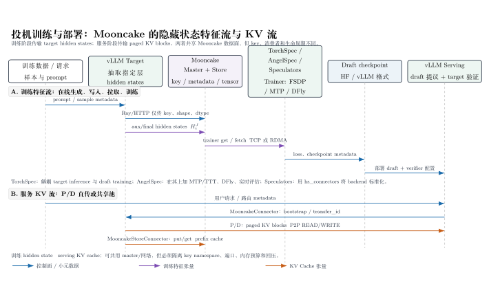

---
tags:
  - topic
  - domain/ai-infra
  - domain/hardware-runtime
  - topic/mooncake
  - topic/speculative-decoding
document_type: topic
domain: hardware_runtime/cann
canonical: true
status: draft-for-iteration
last_reviewed: 2026-09-05
---

# Mooncake 在投机训练与部署中的特征传输

> [!info] 文档关系
> - 文档类型：Topic
> - 领域入口：[CANN Hardware Runtime README](../README.md)
> - 相关主题：[单边通信、Mooncake 与 Ascend ADXL/HIXL](one-sided-communication-mooncake-ascend.md)
> - 相关模型系统：[TorchSpec 精读](../../../../02_model_systems/speculative_decoding/papers/torchspec.md)、[AngelSpec 精读](../../../../02_model_systems/speculative_decoding/papers/angelspec.md)
> - 证据资产：`../assets/topics/mooncake-speculator-feature-transfer/`

## 结论先行

TorchSpec、AngelSpec 和 vLLM Speculators 使用 Mooncake 的共同点，是把“目标模型生成的隐藏状态特征”从训练器进程中解耦出来：vLLM 目标模型负责抽取，Mooncake 负责按 key 暂存和跨节点搬运，训练器再拉取这些张量更新草稿模型。vLLM serving 侧的 `MooncakeConnector` 和 `MooncakeStoreConnector` 则传输另一种对象——推理请求的 paged KV Cache blocks。两条路径可以共用网络和 Mooncake master，但不能混淆 key、生命周期、端口或正确性协议。

截至 2026-09-05，通过 GitHub API 观察到的 vLLM 最新正式版本是 [v0.28.0](https://github.com/vllm-project/vllm/releases/tag/v0.28.0)，对应 commit `2cf0a6915ce544dc493a0990f2ea38d81601128a`。vLLM 主线文档同时提供直接 P/D 的 `MooncakeConnector` 和共享 KV 池的 `MooncakeStoreConnector`；部署时仍应把 vLLM、Mooncake 和驱动版本锁定在经过验证的组合。

## 1. 先区分两类“特征/缓存”

| 对象 | 产生者 | 消费者 | Mooncake 作用 | 生命周期 | 是否直接改变投机正确性 |
|---|---|---|---|---|---|
| target hidden states（隐藏状态特征） | vLLM 中运行的冻结目标模型 | TorchSpec/AngelSpec/Speculators trainer | 按 sample key 写入、读取、删除特征张量 | 一个训练样本或一个 rollout | 否；只影响草稿模型训练输入 |
| paged KV Cache blocks | Prefill、vLLM 实例或 KV pool | Decode、后续请求的 vLLM 实例 | P2P 传输或共享池 put/get | 请求 prefix/block，可复用、淘汰 | 否；target 仍负责验证候选 token |

隐藏状态通常可表示为选定层集合 $J$ 上的张量 $H^J_t$；它的形状随 token 数、层数和 hidden width 增长。KV Cache 则保存注意力历史的 Key/Value，按页或 block 管理。两者都可能走 RDMA/TCP，但“能搬运张量”不代表两者可以互换。

## 2. TorchSpec：把 target inference 和 drafter training 解耦

[TorchSpec canonical review](../../../../02_model_systems/speculative_decoding/papers/torchspec.md) 的系统边界是：目标模型推理 GPU 组只负责生成 response 和 aux/final hidden states，训练 GPU 组用独立的 FSDP/DP 策略训练 EAGLE-3、DFly 或 DSpark 等 drafter。Mooncake 的 `EagleMooncakeStore` 承载大张量，Ray controller 只传 task、key、shape/dtype 等小元数据。

一次在线样本的实际顺序是：

1. `AsyncInferenceManager` 从 prompt buffer 取任务并派发给 vLLM engine。
2. engine 在目标模型 forward 中捕获指定层 hidden states。
3. `EagleMooncakeStore` 将 hidden tensor 写入 Mooncake，并向控制面返回 key 和元数据。
4. `MooncakeDataFetcher` 按训练 rank 队列拉取、拼 batch，并执行必要的 H2D 和 stream wait。
5. trainer 运行 drafter forward/backward，保存 checkpoint；sample pool watermark 对 producer 施加回压。

该方案消除的是百 TB 级离线 hidden-state materialization 和 target/trainer 共置显存冲突，不是“零通信成本”。大样本仍占用 Mooncake registered buffer、网络带宽和接收端内存；公开材料没有给出统一的 fetch 有效带宽或同 GPU-hours 成本对照。

## 3. AngelSpec：沿用 TorchSpec 数据面，扩展训练和评估

[AngelSpec canonical review](../../../../02_model_systems/speculative_decoding/papers/angelspec.md) 把 TorchSpec 的解耦管线作为基础：Ray controller 继续传 metadata/Mooncake key，hidden tensor 继续由 Mooncake 传到训练 rank。新增部分是：

- MTP/TTT 的递归训练和 target rollout；
- DFly 的并行 backbone、hidden correction 和 code/math 数据配方；
- workload-aware drafter 选择（例如短 horizon MTP 与长 block DFly）；
- 独立的实时 acceptance/吞吐评估服务。

因此 AngelSpec 的 Mooncake 使用方式没有把 Mooncake 变成算法模块：Mooncake 负责特征数据面，MTP/TTT/DFly 负责如何消费这些特征并更新权重，评估服务负责把 checkpoint 放回真实 serving engine 测量。论文和公开代码没有给出 D-cut 生产 selector 的完整实现，不能把其线上收益归因到 Mooncake 单项。

## 4. Speculators：把 hidden-state 传输标准化为 `hs_connectors`

官方 [Speculators 多节点训练文档](https://docs.vllm.ai/projects/speculators/en/latest/user_guide/tutorials/multi_node_training/) 将文件后端和 Mooncake 后端统一到 `hs_connectors` 插件接口：

- `launch_vllm.py` 在 vLLM 中启用 hidden-state extraction，并选择 `--hidden-states-backend mooncake`；
- trainer 使用同名 backend，从 Mooncake store 获取生成或缓存的 hidden states；
- `mooncake_master`（文档示例 `--rpc_port 50051`）负责分布式 store 协调；
- `--mooncake-protocol tcp|rdma` 选择数据传输协议，`--mooncake-global-segment-gib`、`--mooncake-local-buffer-gib` 和 writer threads 控制并发容量；
- `--on-missing generate` 和 `--on-generate delete` 使在线训练可以按需生成、消费后回收，而不必先把全部特征写入共享文件系统。

示例链路（需按实际网卡、版本和安全策略调整）：

```bash
mooncake_master --rpc_port 50051

python scripts/launch_vllm.py Qwen/Qwen3-8B \
  --hidden-states-backend mooncake \
  --mooncake-master <master-ip>:50051 \
  --mooncake-protocol tcp -- \
  --tensor-parallel-size 4 --port 8000

torchrun --standalone --nproc_per_node 4 -m speculators.train \
  --verifier-name-or-path Qwen/Qwen3-8B \
  --hidden-states-backend mooncake \
  --mooncake-master <master-ip>:50051 \
  --mooncake-protocol tcp \
  --vllm-endpoint http://<extractor-ip>:8000/v1 \
  --on-missing generate --on-generate delete
```

这里的 `8000` 是 vLLM API 端口，`50051` 是 Mooncake master 示例端口；hidden-state 数据面不是通过 vLLM HTTP 响应传输。多网卡环境应设置文档要求的 `MOONCAKE_LOCAL_HOSTNAME`，并确认 extractor、trainer、master 彼此可达。

## 5. vLLM serving：MooncakeConnector 与 MooncakeStoreConnector

vLLM 的 serving connector 与 Speculators 的 `hs_connectors` 是两套接口。

### 5.1 `MooncakeConnector`：Prefill→Decode 直接传 KV

官方 [MooncakeConnector 使用文档](https://github.com/vllm-project/vllm/blob/main/docs/features/mooncake_connector_usage.md) 中，Prefill 以 `kv_producer` 角色生成并保留 KV，Decode 以 `kv_consumer` 角色接收。请求通常由代理/路由器转发，connector 通过 bootstrap 交换请求级元数据，Transfer Engine 再对 paged KV blocks 执行 P2P 搬运。文档示例的 `VLLM_MOONCAKE_BOOTSTRAP_PORT` 默认是 `8998`；每个实例在本机应使用唯一端口。

### 5.2 `MooncakeStoreConnector`：共享 KV 池和 prefix cache

官方 [MooncakeStoreConnector 使用文档](https://github.com/vllm-project/vllm/blob/main/docs/features/mooncake_store_connector_usage.md) 将 `MooncakeDistributedStore` 作为跨实例共享池：master 管理 block hash、大小、租户和服务发现，worker 通过 RDMA/TCP 执行 put/get。文档示例 master RPC 端口为 `50051`，并支持 `load_async`、`lookup_async`、`cache_prefix` 和 `MultiConnector`，后者可将 P2P `MooncakeConnector` 与共享池组合。

这两种 serving 路径传输的是 KV blocks，而不是训练 hidden states。它们可以与 Speculators 训练出的 draft checkpoint 在部署侧串联：Speculators 负责把 drafter 训练好，vLLM 负责 draft proposal + target verification，Mooncake connector 负责 KV 的跨实例存取。

## 6. 端到端时序图



图 1：整理图（analysis-derived）。上半部是 TorchSpec/AngelSpec/Speculators 的 hidden-state 特征流：vLLM target 抽取指定层，Mooncake 按 key 暂存，trainer 拉取并产出 draft checkpoint；下半部是 vLLM serving 的 P/D KV 直传和共享 KV 池路径。蓝色为控制面/小元数据，紫色为训练特征张量，橙色为 serving KV 张量。

## 7. 并发、回压和内存边界

### 训练特征流

并发度由三层共同决定：vLLM extractor 的 DP/TP engine 数、Mooncake global/local buffer 容量和 writer/fetch worker 数、trainer 的 data-loader/FSDP 消费速度。Speculators 文档明确提供 writer threads 和 segment/buffer 参数；TorchSpec/AngelSpec 还用 sample-pool watermark 防止 producer 把 store 撑满。增加 extractor 数量只有在 trainer 是快端时才会提高端到端吞吐，否则只会触发回压。

### serving KV 流

`MooncakeConnector` 通过 worker pool 和请求级 timeout 处理并发 P/D 传输；`MooncakeStoreConnector` 通过异步 lookup/load、prefix hash 去重和共享池容量管理并发命中。KV block 的 owner、请求取消后的释放、目标计算 stream 的等待必须由 connector 与上层 scheduler 协同，不能仅依赖底层一次 `READ` 返回。

### 隔离建议

同一集群同时跑训练和 serving 时，建议至少隔离：

- key namespace/tenant（训练样本 key 与 KV block key 不复用）；
- master、bootstrap、模型 API 和调试/监控端口的 ACL；
- registered segment、local staging buffer 与每类流量的内存配额；
- producer/consumer 回压、超时和删除策略。

## 8. 对比与工程选择

| 方案 | Mooncake 传什么 | 典型控制面 | 数据面 | 主要消费者 | 最适合的场景 |
|---|---|---|---|---|---|
| TorchSpec | target 多层 hidden states | Ray task/key/metadata | `EagleMooncakeStore`，TCP/RDMA/GDR 或 fallback | EAGLE/DFly/DSpark trainer | 解耦 target inference 与 drafter training |
| AngelSpec | 同上，加 rollout 所需特征 | TorchSpec 控制面 + 评估服务 | `angelspec/transfer/mooncake/` | MTP/TTT、DFly、实时评估 | workload-aware drafter 研发和在线评估 |
| Speculators | verifier hidden states | `hs_connectors`、vLLM endpoint、master RPC | `--hidden-states-backend mooncake` | 标准 trainer | 官方统一的多节点 online/hybrid 训练 |
| vLLM `MooncakeConnector` | P/D paged KV blocks | KVConnector scheduler/worker + bootstrap | Transfer Engine P2P | Decode | 低延迟 P/D 直传 |
| vLLM `MooncakeStoreConnector` | 跨实例共享 KV blocks | Mooncake master + lookup RPC | DistributedStore put/get | 新请求/多实例 | prefix cache、offload、共享池 |

### 选择规则

1. 问题是“如何给 drafter trainer 提供 target 特征”时，选 Speculators 的 Mooncake backend，或采用 TorchSpec/AngelSpec 的同类解耦管线。
2. 问题是“Prefill 如何把 KV 给 Decode”时，选 vLLM `MooncakeConnector`。
3. 问题是“多个 vLLM 实例如何复用 prefix/KV”时，选 `MooncakeStoreConnector`，必要时通过 `MultiConnector` 同时启用 P2P 和共享池。
4. 不要用 serving KV 命中率证明训练特征传输有效，也不要用 hidden-state fetch 吞吐证明 P/D KV 传输端到端有效；两者应分别测 bytes、等待、带宽、命中和回收。

## 9. 证据边界

- TorchSpec 与 AngelSpec 的框架细节复用本仓库已有 canonical review，未重复创建 Paper 或复制论文资产。
- Speculators 多节点文档明确说明 Mooncake backend、master、TCP/RDMA、CLI、writer threads 和多节点网络要求；其默认示例不等于所有部署的性能保证。
- vLLM 文档明确区分 P2P `MooncakeConnector` 与共享池 `MooncakeStoreConnector`；vLLM v0.28.0 release notes 还记录 Mooncake store group/tenant 支持和 speculative decoding 演进。
- 公开材料没有给出 TorchSpec、AngelSpec、Speculators 在相同 GPU-hours、网络和数据配方下的公平成本比较；本文关于“对象/生命周期/控制面不同”的归纳属于跨来源 analysis-derived。

## 参考资料

- [TorchSpec canonical review](../../../../02_model_systems/speculative_decoding/papers/torchspec.md)
- [AngelSpec canonical review](../../../../02_model_systems/speculative_decoding/papers/angelspec.md)
- [Speculators Multi-Node Training](https://docs.vllm.ai/projects/speculators/en/latest/user_guide/tutorials/multi_node_training/)
- [Speculators Train a Speculator](https://docs.vllm.ai/projects/speculators/en/latest/user_guide/tutorials/train/)
- [vLLM MooncakeConnector](https://github.com/vllm-project/vllm/blob/main/docs/features/mooncake_connector_usage.md)
- [vLLM MooncakeStoreConnector](https://github.com/vllm-project/vllm/blob/main/docs/features/mooncake_store_connector_usage.md)
- [vLLM v0.28.0 release](https://github.com/vllm-project/vllm/releases/tag/v0.28.0)
