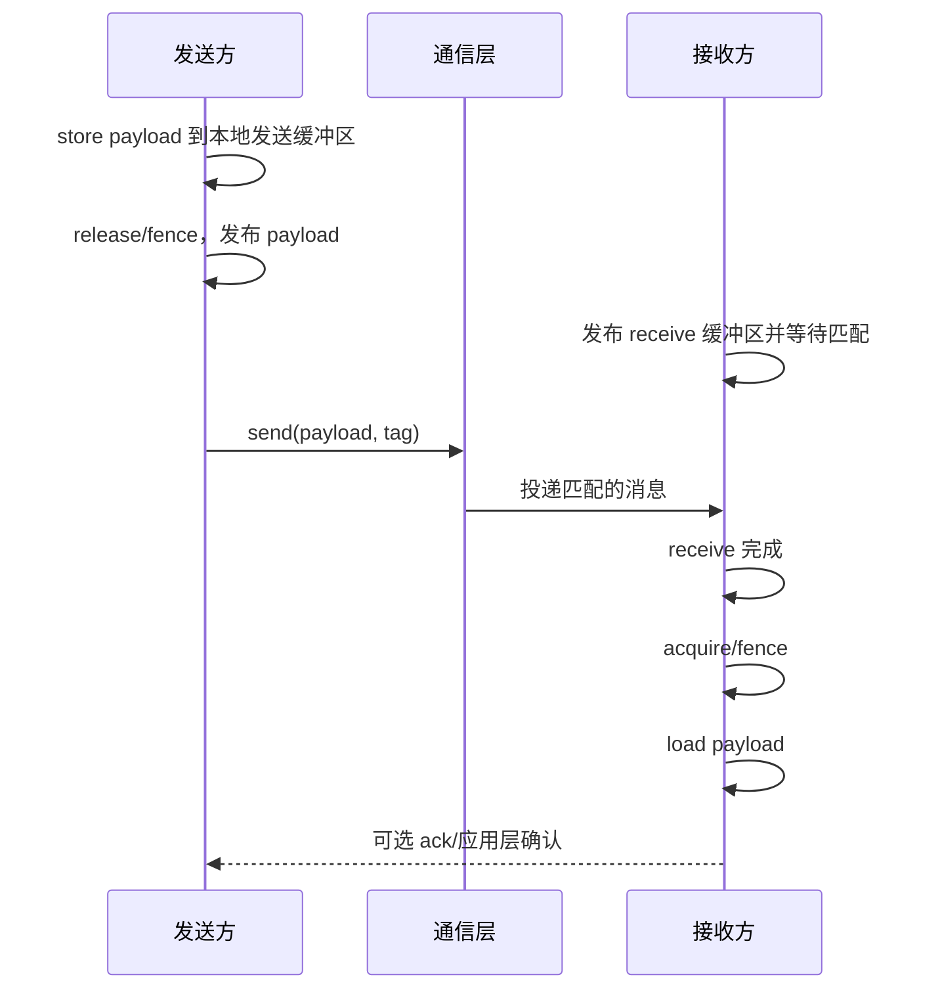
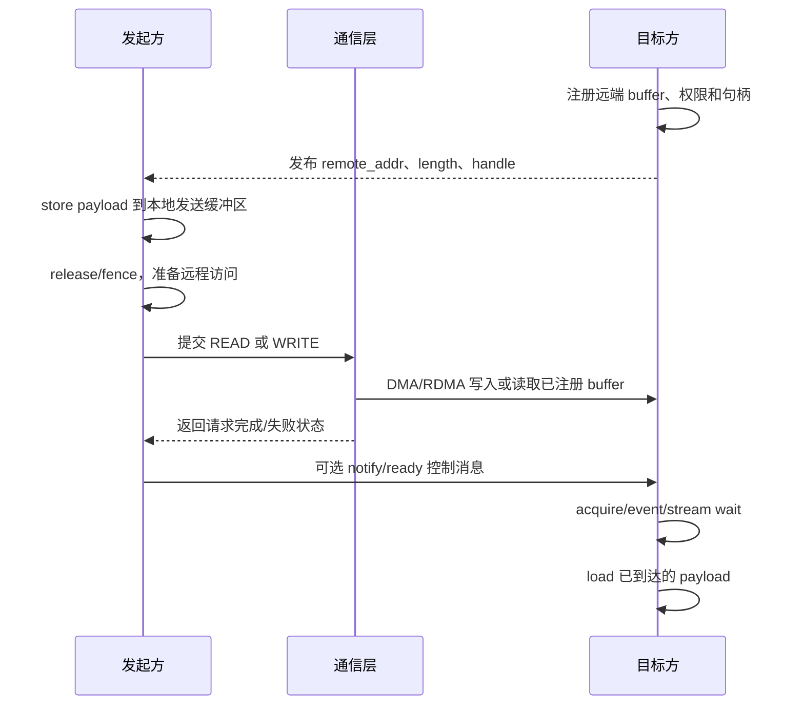
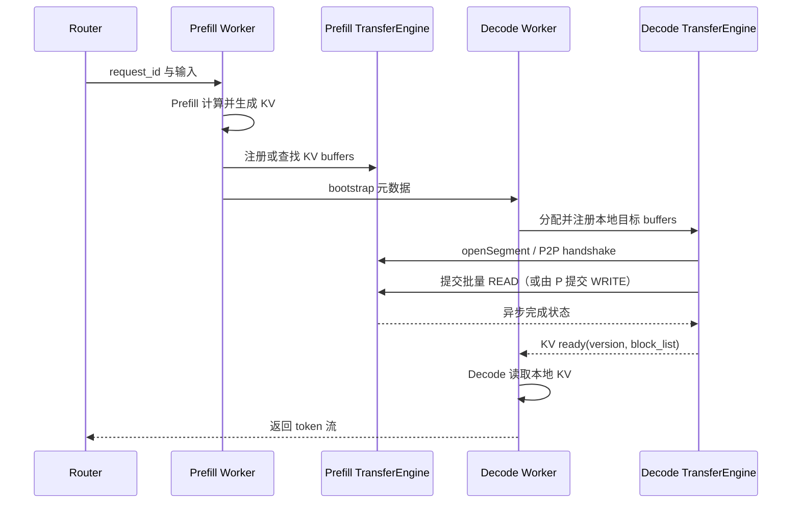

---
tags:
  - topic
  - domain/ai-infra
  - domain/hardware-runtime
  - topic/one-sided-communication
  - topic/llm-serving
document_type: topic
domain: hardware_runtime/cann
canonical: true
status: draft-for-iteration
last_reviewed: 2026-09-04
---

# 单边通信、Mooncake 与 Ascend ADXL/HIXL

> [!info] 文档关系
> - 文档类型：Topic
> - 领域入口：[CANN Hardware Runtime README](../README.md)
> - 相关主题：[通信原语与成本模型](../../../parallelism/topics/communication-primitives-and-cost-model.md)
> - 相关文档：[Mooncake Transfer Engine 文档](https://kvcache-ai.github.io/Mooncake/design/transfer-engine/)、[CANN/HIXL 开源仓库](https://gitcode.com/cann/hixl)、[HIXL C++ 接口](https://gitcode.com/cann/hixl/blob/master/docs/zh/api/cpp/HIXL-interface.md)

本文解释四个层次：单边通信的通用语义、load/store 与 read/write 的区别、内存语义、以及 Mooncake 如何通过 Ascend 的 ADXL/HIXL 能力搬运 KV Cache。重点是数据面和生命周期，不把单边读写误解成集合通信或完整的缓存一致性协议。本文当前标记为 `draft-for-iteration`，便于继续补充目标 CANN/HDK 版本和实测结果。HIXL 的 API、类型和示例以 [CANN/hixl 开源仓库](https://gitcode.com/cann/hixl)为准。

## 1. 单边通信是什么

单边通信（one-sided communication）指：通信发起方提交一次远程读写后，目标进程不需要为每个请求显式调用匹配的接收函数。

基本流程是：

```text
目标端：分配并注册内存，公开地址范围和访问权限
        |
        | 控制面交换地址、句柄、权限等元数据
        v
发起端：提交 READ 或 WRITE
        |
        v
通信库/网卡直接搬运数据
        |
        v
发起端查询完成状态；目标端不必参与每次接收调用
```

- `READ`：从远端地址读取到本地地址。
- `WRITE`：把本地地址的数据写入远端地址。
- 远端内存必须提前注册，通信库需要知道地址、长度和访问权限。
- “单边”描述的是操作语义，不等于某一种链路。RDMA（Remote Direct Memory Access，远程直接内存访问）、HCCS（Huawei Cache Coherent System，昇腾互联链路）都可能成为底层路径。
- 单边通信不等于集合通信。一次 `WRITE` 不会自动完成 `all-reduce`、`all-gather` 或求和。

### 为什么需要它

双边消息通信通常要求发送端和接收端共同参与匹配。当 Decode 线程正在执行计算、调度或缓存管理时，接收调用可能成为额外同步点。单边通信把控制面（地址、权限、请求状态）和数据面（实际字节搬运）分开，目标可以继续计算或只处理完成通知。

这并不意味着“完全没有同步”：注册、建链、完成确认、数据一致性和释放顺序仍然必须由通信库或上层系统管理。

## 2. 一个具体的读写例子

设目标端保存一个形状为 `[8, 4096]`、数据类型为 `float16` 的 KV Cache（Key-Value Cache，键值缓存）对象。它的大小是 `8 × 4096 × 2 = 65536` 字节。

1. 目标端为这段 Device 内存调用注册接口，并设置允许远端访问的范围和权限。
2. 控制面把远端地址、长度和句柄交给发起端。
3. 发起端提交 `WRITE`，将本地 `[8, 4096]` 缓冲区写入目标端；或提交 `READ`，把目标端快照读回本地。
4. 发起端等待请求完成后，目标端的内容才可被上层当作“已到达”使用。

这里不需要 `all-reduce`，因为操作是一个发起方到一个目标地址的点对点数据搬运。如果两个发起方同时写同一远端地址，仍然会发生竞态；单边 `WRITE` 不自动提供原子累加或对象版本控制。

## 3. Load/Store 与 Read/Write 的区别

这两组词经常都被翻译成“读/写”，但它们描述的层次不同：`load/store` 通常是处理器或设备执行的内存访问动作，`read/write` 通常是通信接口提交的传输方向。

| 维度 | `load/store` | `read/write` |
| --- | --- | --- |
| 操作主体 | CPU/NPU 计算单元，通常由指令或 kernel 发起 | 通信库、DMA 引擎或网卡代表应用发起 |
| 数据粒度 | 常见为标量或向量，受指令和缓存行影响 | 常见为带地址和长度的连续/分片 buffer |
| 地址含义 | 当前执行上下文可解析、已映射且允许访问的地址，通常是本地进程虚拟地址 | `remote_addr` 明确指向已注册的远端地址 |
| 典型结果 | 值进入寄存器，或寄存器值写入内存 | 一段 payload 在本地与远端 buffer 之间搬运 |
| 同步重点 | 缓存一致性、原子性、fence、acquire/release | 请求完成、远端可见、队列顺序、传输失败和重试 |

在通信 API 中，`READ`/`WRITE` 的方向以发起方为参照：

```text
READ  = remote memory -> local buffer
WRITE = local buffer  -> remote memory
```

这和 OpenSHMEM/MPI RMA 的 `GET`/`PUT` 命名相当：`GET` 类似远程 `READ`，`PUT` 类似远程 `WRITE`。但它们不应和 CPU 的 `load`/`store` 直接画等号：CPU `load` 是读取一个由本地执行上下文可见的地址，通信 `READ` 是提交一个可能跨节点、带完成状态的批量传输。

### 工程上的直接判断

因此，通常可以先按下面的规则判断：

```text
当前 CPU/NPU 能直接解析并访问的已映射地址  ->  使用本地 load/store
另一进程或另一节点中的地址                ->  使用通信库的 READ/WRITE
```

这里的“远端地址”不是指一个看起来像指针的数值，而是目标进程注册后、通信引擎能够结合句柄和链路解释的地址。把远端进程打印出来的虚拟地址直接交给本地 CPU 解引用，通常只会访问本地地址空间中的无关地址，或者触发非法访问。

所以对 HIXL、RDMA 或 Mooncake Transfer Engine 来说，典型接口应写成：

```cpp
TransferOpDesc op{local_addr, remote_addr, length};
engine.TransferSync(remote_engine, READ, {op});   // remote -> local
engine.TransferSync(remote_engine, WRITE, {op});  // local -> remote
```

只有当系统明确把远端内存映射进当前 CPU/NPU 的地址空间，并定义了相应的可见性、顺序和冲突规则时，才可能用 `load/store` 访问“远端”。这时它已经不再是普通的本地指针访问，仍需检查 peer mapping、缓存一致性、fence/flush、event/stream wait 和多写者原子性。

### 什么时候 load/store 也能访问远端

在共享内存、统一虚拟地址或某些 PGAS（Partitioned Global Address Space，分区全局地址空间）系统中，远端内存可能被映射成当前设备可解引用的地址，于是代码表面上可以写成 `*remote_ptr` 的 load/store。这只是地址映射和硬件能力更强，并不自动意味着：

- 远端访问具有 CPU 缓存一致性；
- 其他线程或设备立即可见；
- 多个写者之间具有原子性；
- 访问顺序跨越网络、DMA 队列和 kernel stream 仍保持不变。

因此工程文档应明确写出“本地 load/store”还是“通信 read/write”，不要只写“读远端”。

## 4. 什么是内存语义

内存语义（memory semantics）是一组规则，用来回答并发读写中的四个问题：

1. **可见性**：一个写入何时对另一个线程、进程、NPU 或网卡可观察？
2. **顺序**：同一发起方的两个操作是否按程序顺序到达和生效？跨设备是否需要 fence、flush、event 或显式同步？
3. **原子性**：一个写是否不可分割？两个写者同时更新同一位置时，结果是否有定义？
4. **一致性范围**：规则只覆盖本地 CPU cache，还是也覆盖远端 DMA、Device memory、通信队列和 kernel stream？

内存语义不是“这次传输成功”的同义词。比如通信库返回 `TransferSync` 成功，通常说明该传输请求完成；但上层仍要确认目标 kernel 使用这块 Device memory 的 stream/event 依赖已经建立。反过来，CPU 线程看到一个通知变量，也不一定代表它能安全读取尚未完成 DMA 的 payload，除非库或应用定义了相应的发布/获取顺序。

### 单边与双边：从内存语义看时序差异

下面的时序图把“数据搬运”和“内存可见性”分开画出。图中的 `store/load` 是执行者对自己可访问地址的本地内存访问；`send/receive` 或 `READ/WRITE` 是通信接口操作。

#### 双边通信：发送和接收双方都参与



双边流程的关键点是 `receive`：接收方需要发布或执行匹配接收操作，通信层才能把消息交给它。`receive 完成`通常表示接收缓冲区已经填入数据；接收方仍应遵守所用通信库的完成和内存序规则，再让后续计算 `load` 这些数据。

#### 单边通信：目标端预注册，发起方完成远程操作



单边流程中，目标方没有为每次传输调用匹配的 `receive`；它只需提前注册内存并在使用数据前遵守可见性规则。`WRITE` 的数据方向是“发起方本地 buffer 到目标方远端 buffer”，`READ` 则相反。发起方收到完成状态，不必然等价于目标方的计算 stream 已经等待到这批数据，因此实际系统常在传输完成后再发送 `notify/ready`，目标方收到后执行 `event/stream wait`，最后才 `load` payload。

#### 两张图的内存语义对照

| 方面 | 双边通信 | 单边通信 |
| --- | --- | --- |
| 目标方参与方式 | 发布/执行匹配 `receive` | 提前注册内存；每次请求不必调用 `receive` |
| 数据操作 | `send` 与 `receive` 配对 | 发起方提交 `READ`/`WRITE` |
| 主要完成点 | 接收方 `receive` 完成 | 发起方请求完成，目标侧还可能需要 event/stream 同步 |
| 可见性责任 | 通信库完成规则 + 接收方后续内存序 | 注册权限 + 传输完成 + 通知/fence/event/stream 规则 |
| 并发冲突 | 多个接收者/发送者由匹配关系约束 | 多个发起方写同一远端区间仍需锁、原子操作或版本协议 |

因此，单边通信减少的是“目标端逐请求匹配接收”的控制同步，不是把内存语义删除了。两种模式都必须回答：payload 何时写完、何时对消费者可见、消费者何时可以 `load`，以及并发写入是否有定义。

### 一个发布数据的安全协议

假设 Prefill 端要把 KV Cache 写到 Decode 端：

```text
Prefill：写 payload 到远端 buffer
Prefill：等待传输完成或执行库规定的 flush
Prefill：再写一个 ready 标志/发送通知
Decode：先观察 ready 标志
Decode：执行必要的 acquire、event 或 stream wait
Decode：最后读取 payload
```

这里 `ready` 是控制信息，KV Cache 是数据。若 ready 先于 payload 对 Decode 可见，Decode 可能读到旧数据；若两个 rank 同时写同一个 payload，除非使用原子操作或锁，否则属于数据竞争。HIXL 当前公开头文件和 API 定义了传输操作、请求状态和通知数据结构，但没有把所有跨 CPU/NPU/链路组合的全局一致性模型概括成一个可移植保证；具体顺序应以实现、版本和设备路径为准。[HIXL 类型定义](https://gitcode.com/cann/hixl/blob/master/include/hixl/hixl_types.h)

## 5. Mooncake 的分层结构

Mooncake 是面向大模型推理的分离式基础设施，核心场景是把 Prefill 和 Decode 拆到不同资源池，并把 KV Cache 放到可共享的设备内存、主机内存或存储池中。[Mooncake 论文](https://arxiv.org/abs/2407.00079)描述了这种 KV Cache-centric 架构和调度目标。

### Transfer Engine：字节搬运层

Transfer Engine（TE，传输引擎）是 Mooncake 的底层数据面：

- `Segment` 表示一组可访问地址范围；
- `Buffer` 表示某个设备上的连续内存区域；
- `BatchTransfer` 批量提交多个 `READ`/`WRITE` 请求；
- 根据内存位置、NUMA 拓扑和设备关系选择传输路径；
- 支持 TCP、RDMA、GPUDirect RDMA、NVMe-oF、NVLink，以及 Ascend 相关 transport；
- 可对大请求切片，利用多网卡并行，并在路径失败时重试。

Mooncake 文档将远端 DRAM/VRAM 的直接读写和多网卡拓扑选择放在 Transfer Engine 中，而不是放在上层模型代码里。[Transfer Engine 设计](https://kvcache-ai.github.io/Mooncake/design/transfer-engine/)

### Mooncake Store：对象和缓存层

Mooncake Store 位于 TE 之上，负责：

- 用对象 key 管理 KV Cache 或模型权重；
- 决定对象放在哪个节点和哪个内存区域；
- 处理复制、淘汰和多级缓存；
- 对大对象进行切片和并行传输；
- 提供对象级写入提交和读取一致性语义。

因此可以按下面的方式区分：

```text
HIXL / ADXL       地址级单边读写
Mooncake TE       统一的数据搬运抽象
Mooncake Store    对象级 KV Cache 存储和生命周期
vLLM / SGLang     请求调度和模型推理逻辑
```

Store 的对象原子写、复制和淘汰不是裸 HIXL `TransferSync` 自动提供的能力。

## 6. Ascend HIXL 如何支持单边通信

HIXL（Huawei Xfer Library，昇腾单边通信库）是面向昇腾集群的点对点传输库。HIXL 开源仓库的 README、头文件、C++/Python 示例和文档共同构成当前主要证据面；仓库明确包含 `include/hixl`、`include/adxl`、`examples`、`benchmarks` 和 `src` 等目录，并记录 HIXL 与 Mooncake 的对接。[HIXL 开源仓库](https://gitcode.com/cann/hixl)

### 6.1 初始化和内存注册

```cpp
Hixl engine;
std::map<AscendString, AscendString> options;
engine.Initialize(local_engine, options);

MemDesc desc{};
desc.addr = reinterpret_cast<uintptr_t>(buffer);
desc.len = length;

MemHandle handle = nullptr;
engine.RegisterMem(desc, MEM_DEVICE, handle);
```

HIXL 的公开类型定义支持 `MEM_DEVICE` 和 `MEM_HOST` 两类内存，`MemDesc` 用 `addr` 和 `len` 描述范围，`MemHandle` 表示注册结果。注册的意义类似于 RDMA Memory Region：库建立访问映射和权限信息，远端只能访问已公开的区间。[HIXL 类型定义](https://gitcode.com/cann/hixl/blob/master/include/hixl/hixl_types.h)

### 6.2 建链和同步读写

```cpp
engine.Connect(remote_engine);

TransferOpDesc op{
    local_addr,
    remote_addr,
    length
};

engine.TransferSync(remote_engine, READ, {op});
engine.TransferSync(remote_engine, WRITE, {op});
```

`READ` 表示“远端到本地”，`WRITE` 表示“本地到远端”。目标端不需要为每一个 `TransferSync` 调用匹配的接收函数，但目标内存必须仍处于注册和有效状态。

### 6.3 异步传输

支持的 CANN 版本和 Ascend 型号可以使用 `TransferAsync`：

```cpp
TransferReq req = nullptr;
engine.TransferAsync(remote_engine, WRITE, {op}, args, req);
```

调用方随后查询请求状态，直到 `COMPLETED` 或 `FAILED`。HIXL 公开类型还定义了 `WAITING` 和 `TIMEOUT` 状态。异步模式适合将传输和 Decode 的其他计算重叠，但是否可用取决于仓库版本、CANN 运行环境和具体设备。[HIXL 类型定义](https://gitcode.com/cann/hixl/blob/master/include/hixl/hixl_types.h)

### 6.4 资源释放顺序

推荐顺序是：

```text
等待传输完成
    -> Disconnect
    -> DeregisterMem
    -> 释放 Host/Device 内存
    -> Finalize
```

在传输未完成时解注册或释放内存，可能导致超时、失败或非法访问。

## 7. ADXL 与 HIXL 的关系

ADXL（Ascend Direct Xfer Library，旧版直接传输接口）是 HIXL 工程中保留的 **deprecated 旧接口**，而 HIXL 是当前主推的公开单边通信接口。两者不是两种不同的通信语义，而是同一类昇腾单边传输能力在不同 API 世代中的接口边界：

- HIXL C++ 接口文档将 `HIXL-interface` 与 `deprecated_ADXL-interface` 分开列出，并把 ADXL 的接口、数据结构和错误码明确标为“待废弃”。[HIXL C++ 接口目录](https://gitcode.com/cann/hixl/tree/master/docs/zh/api/cpp)
- `include/adxl/` 仍保留在开源仓库中，表示旧接口当前仍用于兼容已有应用和适配层；deprecated 不等于已经删除。[ADXL 头文件目录](https://gitcode.com/cann/hixl/tree/master/include/adxl)
- HIXL 新接口提供 `Initialize`、`RegisterMem`、`Connect`、`TransferSync`、`TransferAsync` 等能力；新业务代码应优先使用 HIXL，并按目标 CANN/HDK 版本确认产品支持矩阵。[HIXL C++ 接口](https://gitcode.com/cann/hixl/blob/master/docs/zh/api/cpp/HIXL-interface.md)
- Mooncake 当前 Ascend Direct Transport 文档仍明确写为“基于 CANN ADXL 能力的适配层”。这说明 Mooncake 的现有适配边界仍使用 ADXL 兼容接口，不能据此反推 ADXL 是通过调用 HIXL 实现的。[Mooncake Ascend Direct Transport](https://github.com/kvcache-ai/Mooncake/blob/main/docs/source/design/transfer-engine/ascend_direct_transport.md)

应采用下面的版本和适配关系：

```text
HIXL：当前主推 API
  ├─ 新业务直接调用 HIXL 接口
  └─ HIXL Engine 选择 HCCS / RDMA / FabricMem / UBoE 等链路

ADXL：HIXL 工程中保留的 deprecated 旧 API
  └─ 兼容已有应用和适配层（当前 Mooncake Ascend Direct Transport 属于此类）
```

因此，“ADXL 是否用了 HIXL”不应简单回答为“是”：公开仓库能确认的是 **ADXL 已被 HIXL 标记为 deprecated，二者存在版本迁移关系**；但不能仅凭接口目录或 Mooncake 文档断言 ADXL 内部一定调用 HIXL。是否共享某些底层实现，需要进一步固定 CANN 版本并检查对应源码或运行时调用栈。

还要把 API 生命周期与传输链路分成两个维度：

| 维度 | 可选项 | 回答的问题 |
| --- | --- | --- |
| API 世代 | deprecated ADXL、当前主推 HIXL | 应用通过哪一代公开接口提交操作？ |
| 传输链路 | HCCS、RDMA/RoCE、FabricMem、UBoE 等 | 数据实际经过哪一种硬件或网络路径？ |

因此，ADXL 被废弃并不等于 RDMA 被废弃；迁移到 HIXL 也不代表每次传输一定走 RDMA。HIXL Engine 会根据芯片、拓扑和配置选择可用链路。[HIXL 开源仓库](https://gitcode.com/cann/hixl)

## 8. Mooncake 如何接入 Ascend 单边通信

Mooncake 通过 Ascend Direct Transport，把自身的 `Segment`、`Buffer` 和批量请求映射到 Ascend 侧的内存注册、端点和读写操作。构建时启用：

```bash
-DUSE_ASCEND_DIRECT=ON
```

运行时的逻辑链条是：

```text
Mooncake Segment / Buffer
        |
        v
本地地址、远端地址、长度、READ/WRITE
        |
        v
Ascend Direct Transport
        |
        v
CANN ADXL deprecated 兼容接口
        |
        v
HCCS 或 RDMA
```

这张链路图描述的是 Mooncake 当前公开文档中的 Ascend Direct Transport，不表示 Mooncake 的 ADXL 适配层内部必然经过 HIXL API。HIXL 是新业务和后续迁移应优先采用的接口；在迁移完成前，ADXL 兼容路径与 HIXL 新接口可以同时存在于软件栈中。

常见配置包括：

- `ASCEND_USE_ASYNC_TRANSFER=1`：请求 Ascend Direct 异步传输；具体由目标版本的适配层使用 ADXL 兼容接口或 HIXL 实现；
- `ASCEND_ENABLE_USE_FABRIC_MEM=1`：在支持的 A3/CANN/HDK 组合上启用 Fabric Memory 路径；
- `HCCL_INTRA_ROCE_ENABLE=1`：在适用的昇腾内部路径上选择 RDMA/RoCE；
- `ASCEND_CONNECT_TIMEOUT`：建链超时；
- `ASCEND_TRANSFER_TIMEOUT`：数据传输超时。

这些选项改变传输路径或执行方式，不会自动解决 KV Cache 的请求归属、版本、一致性或调度问题。Mooncake 当前 Ascend Direct Transport 的源码适配边界可固定到 [commit `0f422b960c0590808c9a8f7f9b85e558a27f754b`](https://github.com/kvcache-ai/Mooncake/tree/0f422b960c0590808c9a8f7f9b85e558a27f754b/mooncake-transfer-engine/src/transport/ascend_transport)。

## 9. Python client/server Tensor 字典传输样例

下面的样例用 Mooncake Transfer Engine Python API 完成一条最小的 Ascend NPU 单边写路径：server 分配并注册由多个 tensor 组成的 Python `dict`，client 通过控制面获取 `session_id` 和每个 tensor 的远端描述，然后发起 `batch_transfer_sync_write`。控制面只交换元数据，多个 tensor 的 payload 由 Ascend Direct Transport 搬运。

样例文件：

- [server.py](examples/mooncake_ascend_one_sided/server.py)：注册远端 `dict` 中的 `key_cache`、`value_cache`、`block_table`，发布元数据并等待完成确认；
- [client.py](examples/mooncake_ascend_one_sided/client.py)：创建同构本地 `dict`，逐个注册后执行批量单边 `WRITE`；
- [pull_server.py](examples/mooncake_ascend_one_sided/pull_server.py)：预先填充并注册远端 `dict`，等待 client 发起批量 `READ`；
- [pull_client.py](examples/mooncake_ascend_one_sided/pull_client.py)：创建本地目标 `dict`，执行批量单边 `READ` 并校验元数据；
- [README.md](examples/mooncake_ascend_one_sided/README.md)：环境前提、启动命令、RDMA/RoCE 配置和批量 `READ` 改造说明。

### 9.1 Server 端关键流程

```python
engine = TransferEngine()
engine.initialize(local_host, "P2PHANDSHAKE", "ascend", "")

receive_tensors = {
    "key_cache": torch.empty((rows, cols), dtype=torch.float16, device="npu:0"),
    "value_cache": torch.empty((rows, cols), dtype=torch.float16, device="npu:0"),
    "block_table": torch.empty((rows, 8), dtype=torch.int32, device="npu:0"),
}
remote_buffers = []
for name, tensor in receive_tensors.items():
    remote_ptr = tensor.data_ptr()
    remote_len = tensor.numel() * tensor.element_size()
    engine.register_memory(remote_ptr, remote_len)
    remote_buffers.append({"name": name, "ptr": remote_ptr, "length": remote_len})

session_id = f"{local_host}:{engine.get_rpc_port()}"
# 通过普通 TCP 控制连接发送 session_id 和 remote_buffers
```

`receive_tensors` 中的每个 tensor 都必须保持存活到 client 完成批量写入并收到确认；不能在注册后让 Python 引用失效或提前解注册。`session_id` 中的 host 必须是对端可达的地址，不能把 `0.0.0.0` 当作对外地址。

### 9.2 Client 端关键流程

```python
engine = TransferEngine()
engine.initialize(local_host, "P2PHANDSHAKE", "ascend", "")

send_tensors = {
    "key_cache": torch.arange(rows * cols, dtype=torch.float16, device="npu:0").reshape(rows, cols),
    "value_cache": torch.arange(rows * cols, dtype=torch.float16, device="npu:0").reshape(rows, cols),
    "block_table": torch.arange(rows * 8, dtype=torch.int32, device="npu:0").reshape(rows, 8),
}
remote = receive_metadata_from_control_plane()
remote_session_id = remote["session_id"]
remote_buffers = remote["buffers"]
local_buffers = []
assert [item["name"] for item in remote_buffers] == list(send_tensors)
for name, tensor in send_tensors.items():
    local_ptr = tensor.data_ptr()
    length = tensor.numel() * tensor.element_size()
    engine.register_memory(local_ptr, length)
    local_buffers.append((name, local_ptr, length))

ret = engine.batch_transfer_sync_write(
    remote_session_id,
    [item[1] for item in local_buffers],
    [item["ptr"] for item in remote_buffers],
    [item[2] for item in local_buffers],
)
if ret < 0:
    raise RuntimeError(f"batch_transfer_sync_write failed: {ret}")
torch.npu.synchronize()
```

Mooncake Python API 的 `batch_transfer_sync_write(target_hostname, buffers, peer_buffer_addresses, lengths)` 语义是“把多个本地 buffer 批量写入多个远端已注册 buffer”；反向拉取 KV Cache 时，对应使用 `batch_transfer_sync_read`，并让 client 的本地字典 tensor 成为目标 buffer。[Mooncake Python API](https://github.com/kvcache-ai/Mooncake/blob/main/docs/source/api-reference/python/transfer-engine.md)

### 9.3 运行边界

样例默认使用 Mooncake Python 层的 `protocol="ascend"`，并假定 Mooncake 已使用 `-DUSE_ASCEND_DIRECT=ON` 构建、安装 Ascend NPU wheel。Ascend Direct 文档将该 transport 描述为基于 CANN ADXL 能力的适配层；`HCCL_INTRA_ROCE_ENABLE=1` 只是在适用平台上请求 RDMA/RoCE，未设置时由运行时选择 HCCS 等链路。[Ascend Direct Transport](https://github.com/kvcache-ai/Mooncake/blob/main/docs/source/design/transfer-engine/ascend_direct_transport.md)

这是一个多 tensor 字节搬运样例，不是完整的 KV Cache 对象协议。生产实现还需要在控制面增加请求 ID、字典 key 到 block 列表的映射、长度和 dtype 校验、版本/校验和、ready 通知、超时回收，并确保目标计算 stream 在读取字典中的 tensor 前等待整批传输完成。

### 9.4 Server 预置、Client 拉取

如果 KV Cache 已经由 server（例如 Prefill 或缓存节点）准备好，而 client（例如 Decode 节点）需要主动拉取，应使用反向的数据面流程：

```python
# server: 准备并注册多个 tensor，发布 remote_buffers
prepared = {
    "key_cache": key_cache,
    "value_cache": value_cache,
    "block_table": block_table,
}

# client: 为每个条目分配本地目标并注册
local_buffers = [local_key_ptr, local_value_ptr, local_table_ptr]
remote_buffers = [remote_key_desc, remote_value_desc, remote_table_desc]
ret = engine.batch_transfer_sync_read(
    remote_session_id,
    local_buffers,
    [item["ptr"] for item in remote_buffers],
    [item["length"] for item in remote_buffers],
)
if ret < 0:
    raise RuntimeError(f"batch_transfer_sync_read failed: {ret}")
```

对应的完整代码见 [pull_server.py](examples/mooncake_ascend_one_sided/pull_server.py) 和 [pull_client.py](examples/mooncake_ascend_one_sided/pull_client.py)。`READ` 完成只说明 client 的目标 buffer 已接收数据；client 仍需在目标计算 stream 使用这些 tensor 前执行必要的 `torch.npu.synchronize()` 或更细粒度的 event/stream wait。server 应延迟解注册和释放，直到收到 client 的完成确认。

## 10. PD 分离中的端到端例子

设 Prefill 节点生成 KV Cache，Decode 节点负责后续 token 生成。Decode 节点先注册一块 Device buffer，控制面交换对象 key、远端地址和长度，然后由数据面直接传输：

```text
Prefill 节点
  计算 KV Cache
       |
       | Mooncake WRITE（当前 Ascend Direct 路径经 ADXL 兼容接口）
       | HCCS 或 RDMA
       v
Decode 节点
  已注册 Device buffer
       |
       v
  Attention 读取 KV Cache
```

控制面回答“写到哪里、写多少、属于哪个请求”；单边数据面回答“如何搬运实际字节”；Mooncake Store 还可以在更高层负责对象放置、复制、淘汰和命中。Decode 不需要为每一次 KV Cache 写入执行匹配接收调用。

## 11. P/D 分离中的并行异构与请求并发

真实部署通常将 Prefill（生成上下文和 KV Cache）与 Decode（逐 token 消费 KV Cache）拆成独立服务。两侧可以分别配置 Tensor Parallel（TP，张量并行）、Data Parallel（DP，数据并行）或 Expert Parallel（EP，专家并行）规模；Mooncake Transfer Engine 负责跨实例搬运已注册的 buffer，但不会自动理解 attention head 的归属，也不会自动把任意 TP 布局重分片。

### 11.1 P/D 异构的边界

如果 Prefill 和 Decode 的 TP 规模及 KV Cache 分片规则一致，可以直接执行 shard-to-shard 传输：Prefill rank `i` 的 KV buffer 对应 Decode rank `i` 的目标 buffer。如果两侧 TP 不同，连接器或 KV Cache 管理器必须先计算源分片到目标分片的映射，并在必要时完成拼接、转置或重新打包；Mooncake 只执行这些 buffer 之间的一组 `READ`/`WRITE`。

例如 Prefill 为 TP=8、Decode 为 TP=4 时，一个 Decode rank 可能需要读取两个 Prefill rank 的 head 分片：

```text
P0 ─┐                 ┌──> D0
P1 ─┘                 │
P2 ─┐                 ├──> D1
P3 ─┘                 │
P4 ─┐                 ├──> D2
P5 ─┘                 │
P6 ─┐                 └──> D3
P7 ─┘
```

这不是 Transfer Engine 自动完成的集合通信，而是上层根据 tensor layout 生成多个点对点传输项。DP 的处理方式通常不同：一次请求先由路由器选择一个 Prefill 副本和一个 Decode 副本，KV Cache 只在这两个 owner 之间传输，而不是在所有 DP 副本之间复制。Mooncake Conductor 可以维护实例和 KV Cache 前缀索引，供路由器查询缓存命中位置和实例归属。[Mooncake Conductor](https://kvcache-ai.github.io/Mooncake/design/conductor/conductor-architecture-design.html)

### 11.2 通信链路建立

P/D 建链分为控制面和数据面。控制面可以由推理框架的 bootstrap 服务、Mooncake Store/Master、P2P handshake 或独立元数据服务承担，负责交换 `request_id`、P/D 实例、bootstrap 地址、Segment 名称、远端 buffer、长度、shape、dtype 和 block 映射。数据面再由 Transfer Engine 建立真正的传输路径。



Transfer Engine 的典型调用顺序是 `initialize`、`register local memory`、`open target segment`、`submit transfer`、`get status`，最后释放 batch、segment 和注册内存。[Transfer Engine C++ API](https://github.com/kvcache-ai/Mooncake/blob/main/docs/source/api-reference/cpp/transfer-engine.md)。在 RBG 的 P/D 部署示例中，`MOONCAKE_TE_META_DATA_SERVER=P2PHANDSHAKE` 让 Prefill 与 Decode 通过 Transfer Engine 侧信道直接协调，不需要独立 HTTP metadata server；这不影响 Prefill 作为 Store/HiCache client 使用 Mooncake Master 的控制面。[RBG 集成](https://kvcache-ai.github.io/Mooncake/deployment/kubernetes-deployment-guide/rbg-integration.html)

数据面建立后，Transfer Engine 根据内存所在 GPU/NUMA 和 NIC 拓扑选择路径，并按需建立或复用 endpoint。多网卡环境下，大请求还可能被切成多个 slice，以并行利用多个 NIC；endpoint pool 用于限制活跃连接数量并处理失败重建。[Transfer Engine 拓扑和 endpoint 管理](https://github.com/kvcache-ai/Mooncake/blob/main/docs/source/design/transfer-engine/index.md)

### 11.3 请求并发的三个层次

请求并发不能只理解为“同时调用多个 `READ`”。生产系统至少有三层并发：

| 层次 | Mooncake 提供的能力 | 上层仍需负责的内容 |
| --- | --- | --- |
| 请求级 | Transfer Engine 可同时维护多个异步 batch | 排队、路由、限流、取消、超时、KV lease |
| 传输级 | `BatchTransfer` 批量提交不连续 buffer，支持多线程和多网卡 | 每个请求的 block 列表、优先级和背压 |
| 连接级 | endpoint 按需建立、复用和淘汰，失败可换路径重试 | 连接配额、租户隔离和慢请求治理 |

推荐把一次请求的多个 KV block 合并为一个 batch，而不是为每个 tensor 单独建连接：

```text
batch(request_id)
  ├── READ layer-0 block list
  ├── READ layer-1 block list
  ├── READ ...
  └── READ layer-N block list
```

请求完成条件也要分层：Transfer Engine 返回 `COMPLETED` 只表示字节搬运结束；Decode 还应校验版本和 block 列表，并在计算 stream 上等待传输完成后再读 KV。多个请求同时访问同一远端范围时，必须由上层提供版本、租约、互斥或 copy-on-write 规则，裸 `READ`/`WRITE` 不会自动提供对象级一致性。

### 11.4 预注册内存池：Mooncake 的能力边界

“预注册内存池”需要拆成两个概念：

1. **内存注册**是 Transfer Engine 的能力。基础 API 接受调用方已经分配好的地址和长度，通过 `registerLocalMemory` 注册；Python API 还提供 `batch_register_memory`，可一次注册多个区域。Transfer 请求的本地源 buffer 必须预先注册，完成后才能安全解注册。[Transfer Engine C++ API](https://github.com/kvcache-ai/Mooncake/blob/main/docs/source/api-reference/cpp/transfer-engine.md)；[Transfer Engine Python API](https://github.com/kvcache-ai/Mooncake/blob/main/docs/source/api-reference/python/transfer-engine.md)
2. **池化分配、block 空闲队列和请求租约**通常是 KV Cache 管理器或 serving framework 的能力。应用预先分配一大片 Device/Host 内存，按 block 切分并一次注册，之后每个请求只借用空闲 block 并提交传输，可以避免每个请求反复注册和解注册。

因此，预注册内存池是“Mooncake 注册能力 + 上层 allocator”的组合，而不是基础 Transfer Engine 自动替应用管理的 KV Cache 对象池。Mooncake Store 内部确实有本地 client buffer allocator，并会把该区域注册为本地传输空间；较新的 TENT Transfer Engine 还提供 `allocateLocalMemory`/`freeLocalMemory`，把分配和注册合并为一个接口，但这仍不等于完整的请求级 KV block 调度器。[Mooncake Store 实现](https://github.com/kvcache-ai/Mooncake/blob/main/mooncake-store/src/real_client.cpp)；[TENT Transfer Engine API](https://github.com/kvcache-ai/Mooncake/blob/main/mooncake-transfer-engine/tent/include/tent/transfer_engine.h)

生产实现可采用以下生命周期：

```text
进程启动
  -> 分配 KV block pool
  -> 一次注册大块或批量注册多个 block
  -> 发布可访问的 segment/buffer 元数据

请求到达
  -> allocator.acquire(blocks)
  -> 生成本请求的 READ/WRITE batch
  -> 等待完成、版本确认和计算 stream wait
  -> allocator.release(blocks)

进程退出或扩缩容
  -> 等待所有 batch 完成
  -> 撤销远端可见状态
  -> unregister memory
  -> 释放 pool
```

内存池不能绕过生命周期约束：请求未完成前不能复用 block，server 未收到完成确认前不能撤销远端注册，淘汰或扩缩容时还要处理仍在飞行的 batch。

## 12. 成本、限制和排障边界

### 成本

- 内存注册需要页映射、权限密钥和对端元数据，不是零成本操作；
- 零拷贝可以减少 CPU staging 和额外 memcpy，但仍消耗 NIC、设备 DMA 队列和请求描述符；
- 小块请求过多时，启动延迟、建链和状态轮询可能超过有效 payload 时间；
- 多网卡并行能提高大对象吞吐，但也会引入拓扑选择、拥塞和故障重试。

### 常见失败条件

- 远端地址未注册，或访问越过注册区间；
- 权限不允许当前的 `READ`/`WRITE`；
- HCCS 所需的内存对齐不满足，例如部分 Device 内存需要按页表对齐；
- 双方设备上下文、CANN/HDK 版本或产品能力不匹配；
- 链路断开后仍复用旧句柄；
- 请求尚未完成就解注册或释放内存。

### 不能从接口直接推出的结论

不能仅凭“支持 HIXL”推断所有 Ascend 型号都拥有相同的异步语义、Fabric Memory 路径、HCCS 对齐要求或带宽。也不能把 Mooncake Store 的对象原子性归因给裸 HIXL。目标环境仍需按具体 CANN、HDK、芯片、拓扑和传输协议实测。

## 13. 证据与版本边界

- Mooncake 的 Segment、Buffer、BatchTransfer、多网卡和路径选择： [Transfer Engine 官方设计](https://kvcache-ai.github.io/Mooncake/design/transfer-engine/)；
- Mooncake 的 KV Cache-centric 架构和 Store/TE 分层： [Mooncake Architecture](https://kvcache-ai.github.io/Mooncake/design/architecture.html) 与 [论文](https://arxiv.org/abs/2407.00079)；
- HIXL 的仓库定位、目录、演进和 Mooncake 对接： [CANN/hixl README](https://gitcode.com/cann/hixl)；
- HIXL 的 `MemType`、`TransferOp`、`TransferOpDesc`、请求状态和选项： [hixl_types.h](https://gitcode.com/cann/hixl/blob/master/include/hixl/hixl_types.h)；
- HIXL 的 `Initialize`、`RegisterMem`、`Connect`、`TransferSync` 和 `DeregisterMem`： [HIXL-interface.md](https://gitcode.com/cann/hixl/blob/master/docs/zh/api/cpp/HIXL-interface.md)；
- ADXL 接口、数据结构和错误码的待废弃状态： [deprecated_ADXL-interface.md](https://gitcode.com/cann/hixl/blob/master/docs/zh/api/cpp/deprecated_ADXL-interface.md) 与 [C++ 接口目录](https://gitcode.com/cann/hixl/tree/master/docs/zh/api/cpp)；
- HIXL 的端到端 C++ 读写样例： [hixl_example_d2rh.cpp](https://gitcode.com/cann/hixl/blob/master/examples/cpp/hixl_example_d2rh.cpp)；
- Mooncake 的 Ascend Direct Transport 适配： [源码文档](https://github.com/kvcache-ai/Mooncake/blob/main/docs/source/design/transfer-engine/ascend_direct_transport.md) 和固定 commit `0f422b960c0590808c9a8f7f9b85e558a27f754b`。

本文中关于“控制面/数据面分离”、load/store 与 read/write 的层次区分、内存可见性、注册成本、竞态和集合通信边界的归纳属于跨来源分析，不是 HIXL 或 Mooncake 对所有版本和硬件的统一性能/一致性保证。
