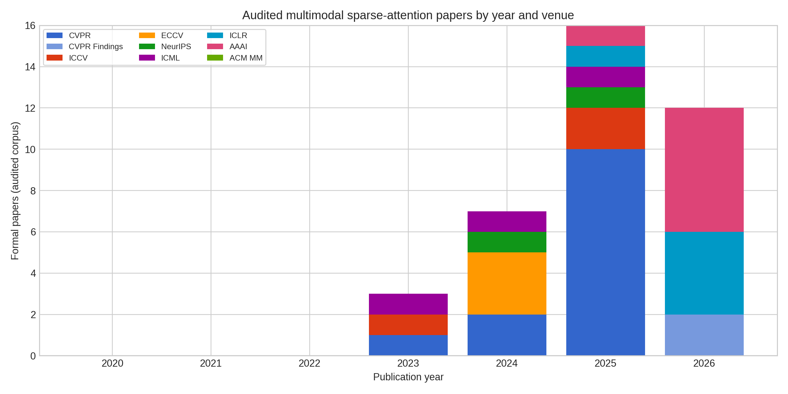
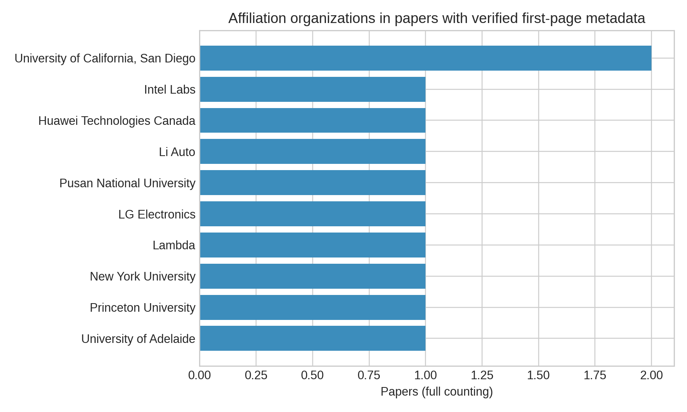

# 多模态稀疏 Attention 顶会趋势（2020–2026）

> 口径：CVPR、ICCV、ECCV、NeurIPS、ICML、ICLR、AAAI、ACM MM 的 main conference；CVPR Findings 单列。只计入“token/block 选择、稀疏 mask/attention lowering、或分布式稀疏 attention”是核心贡献、并在多模态任务上验证的工作。参数剪枝、纯视觉稀疏、仅视觉编码器加速和 workshop/arXiv-only 工作不进入正式计数。2026 为截至 2026-07-23 的已公开论文。

## 结论摘要

在该口径和当前审计集内，2020–2022 没有确认到正式论文；2023、2024、2025、2026 分别为 3、7、16、12 篇，合计 38 篇。增长不是单一路线：2023 以视频-文本稀疏预训练和渐进式 pruning 为主，2024 出现 instruction/importance-guided token pruning 与可编程 mask lowering，2025 起明显转向多阶段视觉 token 压缩、视频 token 动态预算、attention-sparsity compression 与 learned selector，2026 则扩展到层级/对象中心压缩、RL selector、非均匀 sparse attention 和流式视频场景。

图中数字是“审计集计数”而非全站检索命中数；空白年份代表在严格边界下尚未确认的论文，不代表该领域绝对没有工作。

## 论文与会场分布

完整论文级记录、状态（formal/adjacent/arXiv-only）、方法族和来源链接保存在过程目录；正式文档不依赖过程文件，下面列出可复核的代表性入口：

- 2023：SViTT（[CVPR OpenAccess](https://openaccess.thecvf.com/content/CVPR2023/html/Li_SViTT_Temporal_Learning_of_Sparse_Video-Text_Transformers_CVPR_2023_paper.html)）、UPop（[PMLR](https://proceedings.mlr.press/v202/shi23e.html)）、SMAUG（[ICCV OpenAccess](https://openaccess.thecvf.com/content/ICCV2023/html/Lin_SMAUG_Sparse_Masked_Autoencoder_for_Efficient_Video-Language_Pre-Training_ICCV_2023_paper.html)）。
- 2024：LoRA-Sparse（[CVPR OpenAccess](https://openaccess.thecvf.com/content/CVPR2024/html/Song_Low-Rank_Approximation_for_Sparse_Attention_in_Multi-Modal_LLMs_CVPR_2024_paper.html)）、MADTP（[CVPR OpenAccess](https://openaccess.thecvf.com/content/CVPR2024/html/Cao_MADTP_Multimodal_Alignment-Guided_Dynamic_Token_Pruning_for_Accelerating_Vision-Language_Transformer_CVPR_2024_paper.html)）、CrossGET（[PMLR](https://proceedings.mlr.press/v235/shi24e.html)）、FlexAttention（[ECCV](https://eccv.ecva.net/virtual/2024/poster/371)）、IVTP（[ECCV](https://eccv.ecva.net/virtual/2024/poster/759)）。
- 2025：SparseVLM（[PMLR](https://proceedings.mlr.press/v267/zhang25s.html)）、LLaVA-PruMerge（[ICCV OpenAccess](https://openaccess.thecvf.com/content/ICCV2025/html/Shang_LLaVA-PruMerge_Adaptive_Token_Reduction_for_Efficient_Large_Multimodal_Models_ICCV_2025_paper.html)）、FrameFusion（[ICCV OpenAccess](https://openaccess.thecvf.com/content/ICCV2025/html/Fu_FrameFusion_Combining_Similarity_and_Importance_for_Video_Token_Reduction_on_ICCV_2025_paper.html)）、M3（[OpenReview](https://openreview.net/forum?id=Uhj5OxAz7I)）、SCOPE（[NeurIPS](https://papers.nips.cc/paper_files/paper/2025/hash/ec6b4456c2bdfd04002d7984043c4936-Abstract-Conference.html)）。
- 2026：VisionDrop、PosPrune、STEP-Nav、CATP、TOP-RL、D2Pruner（[AAAI proceedings](https://ojs.aaai.org/index.php/AAAI)）、LearnPruner（[ICLR](https://iclr.cc/virtual/2026/poster/10010731)）、AgilePruner（[OpenReview](https://openreview.net/pdf?id=2NLkhPex1M)）、VideoNSA（[OpenReview](https://openreview.net/pdf?id=zA2LbsUMDd)）、ForestPrune 与 Object-Centric Pruning（[CVPR Findings](https://openaccess.thecvf.com/content/CVPR2026F/html/Ju_ForestPrune_High-ratio_Visual_Token_Compression_for_Video_Multimodal_Large_Language_CVPRF_2026_paper.html)）。

## 组织归属

组织统计采用论文级 full counting：一篇论文的每个机构计一次，不按作者人数加权。当前只有 6 篇论文完成了首页 affiliation 的直接核验，因此组织图是“已核验子集”，不能解释成全领域机构排名。UC San Diego 在 SViTT 与 VideoNSA 中重复出现；其余机构在当前子集中各出现 1 次，覆盖 Intel Labs、Huawei Technologies Canada、Li Auto、Pusan National University、LG Electronics、Princeton、NYU、Lambda、University of Adelaide、Zhejiang University、University of Sydney 与 Monash University。

这组结果显示产学研协作是常态，且 2025–2026 的工作从单一高校 prototype 逐步进入工业研究机构和大模型团队；由于 affiliation 样本不完整，本文只将其作为结构性信号。

## 方法趋势与 kernel 含义

1. **Selector 由静态规则变成条件化策略。** importance、instruction、diversity、position、object-centric 和 RL selector 都把“保留哪些 token”从固定比例变成输入/层/任务条件决策。kernel 侧需要 ragged index、稳定排序和动态预算，而不只是固定 block mask。
2. **压缩对象由单层 token 扩展到层级视频结构。** video token reduction、hierarchical/object-centric compression 和流式场景要求时间局部性、跨帧复用以及 KV-cache 生命周期管理。适合 block-sparse/segment-sparse lowering，难点是负载均衡和跨层 shape 变化。
3. **Attention 本体与 token compression 开始分化。** LoRA-Sparse、FlexAttention、VideoNSA、Sparsity Forcing 更接近 mask/kernel 或 learned sparse attention；MADTP、PruMerge、VisionZip、ForestPrune 更接近 selector/compression。前者有更直接的 kernel 收益，后者通常有更高泛化性但需要 gather/scatter 和重排成本。
4. **评测从 FLOPs 转向端到端吞吐。** 论文开始报告 prefill/decode、KV cache、显存和视频长上下文；survey 中的 kernel 设计应继续区分理论 `nnz`、有效带宽、索引开销、GPU occupancy 与 CPU/GPU 协同。

## 限制与复现

本页不是宣称完备的 bibliometric census，而是一个有明确 inclusion rule 的可审计下界。检索式、候选筛选、未纳入工作和统计脚本保留为过程材料，不作为正式证据链的一部分。下一轮可补齐 ACM MM、NeurIPS/ICLR 2026 全量索引及剩余论文首页 affiliation，再把“已核验子集”升级为完整组织统计。
