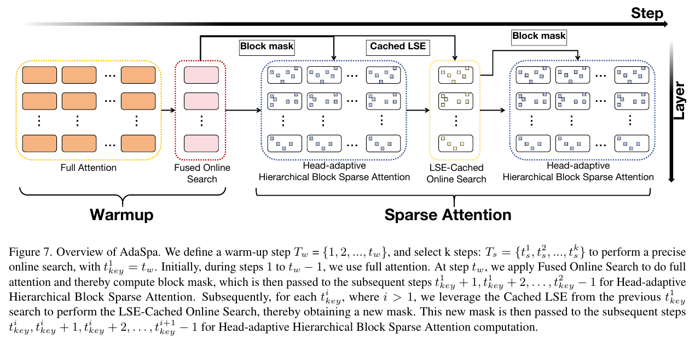
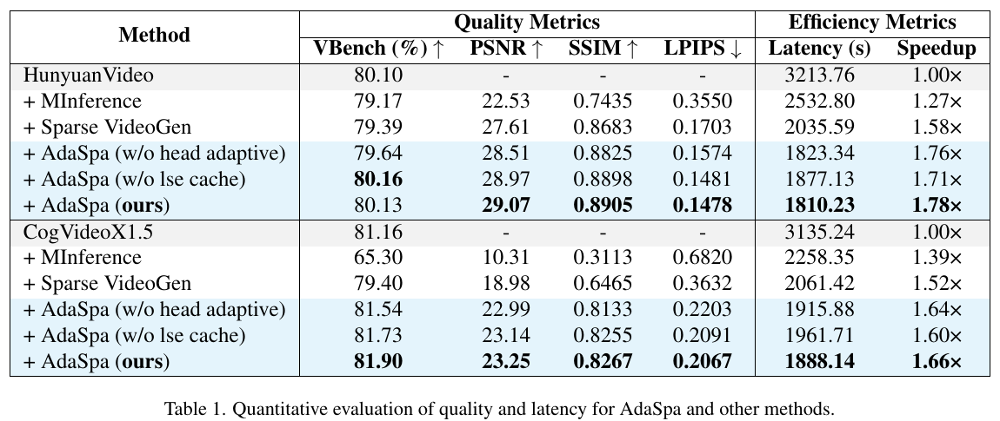

# Training-free and Adaptive Sparse Attention for Efficient Long Video Generation 精读分析

> [!info] 文档关系
> - 文档类型：Paper
> - 领域入口：[README](../README.md)
> - 上位汇总：[Video generation sparse attention](../surveys/video-generation-sparse-attention.md)
> - 证据资产：[assets/papers/adaspa](../assets/papers/adaspa/)

> 资料状态：主证据为 arXiv:2502.21079v1（2025-02-28）的 14 页 PDF；全文已用 `pdftotext -layout` 提取。arXiv source 在 60 秒时限内只下载约 35% 后超时，不能作为可用源码。论文声称实现了 AdaSpa，但 PDF 没有给出官方仓库链接，GitHub 仓库名与论文标题检索均未找到官方实现，因此所有 kernel、缓存和接口结论只代表论文描述，未由代码确认。本文使用 Figure 7 与 Table 1 的 PDF 截图裁剪作为原论文证据。

AdaSpa 要解决的不是“注意力有没有稀疏性”，而是长视频 DiT 的稀疏位置随输入、层和头变化，固定模板会漏掉重要连接；逐次精确搜索又几乎要重算完整注意力，可能吃掉稀疏计算省下的时间。论文的解法是把不规则 token 连接聚合为 block，利用相邻去噪步中 mask 与行级 LSE 的近似稳定性，偶尔精确更新 block mask、其余步直接执行 block-sparse attention，并按 head 的 Recall 分配不同稀疏率。两模型上的端到端结果支持“整体方案能在近似保持质量时提速”，但没有把 fused search、block kernel、mask 复用、text sink、row-wise 选择逐项完全隔离，因此机制归因仍有边界。

## 修订信息

- 当前文档版本：`1.0.0`
- 当前修订 ID：`rev-20260730-adaspa-initial`
- 当前修订时间：`2026-07-30T12:10:26+08:00`
- 替代版本：无（initial）

| 修订 ID | 文档版本 | 时间 | 修订者 | 类型 | 替代修订 | 迁移问题/解析 | 变更摘要 | 原因 | 影响位置 | 依据 | 对结论影响 |
|---|---|---|---|---|---|---|---|---|---|---|---|
| `rev-20260730-adaspa-initial` | `1.0.0` | `2026-07-30T12:10:26+08:00` | `review_adaspa` | `initial` | 无 | 无 | 首次建立单篇完整精读、视觉证据与审查交付 | delegated initial delivery | 全文与本地证据资产 | task packet；arXiv v1 PDF | 初始结论 |

## 0. 资料与配图索引

- 论文：`arXiv PDF`，SHA-256 `385f5c2a24921cff5db56e73b656c76d92203ab7885d040f0a78e489a0dfbc6b`
- 论文页：[arXiv:2502.21079](https://arxiv.org/abs/2502.21079)；后续正式发表信息不作为本次 PDF 证据版本
- LaTeX/source：`source/adaspa-source.tar` 是 60 秒超时留下的不完整下载，不可解包、不可作为证据
- 提取文本：`extracted_text/paper.txt`（`pdftotext -layout`）
- 开源代码：未确认官方仓库；`code/github-search.json` 与 `code/github-search-title.json` 保存两次零结果
- OpenReview：task packet 未提供链接；arXiv v1 PDF 未指向 OpenReview，按不适用处理
- 机制图：`../assets/papers/adaspa/fig7-adaspa-overview-caption.png`（原论文 Figure 7，PDF 第 8 页）
- 结果图：`../assets/papers/adaspa/table1-quality-latency-caption.png`（原论文 Table 1，PDF 第 10 页）
- AI 生成分析图：未生成；原论文 Figure 7 已清楚展示输入阶段、更新状态、跨步复用与输出执行路径

## 0.1 术语与符号解释

### 0.1.1 术语表

| 术语 | 本文含义 | 别名/来源性质 | 不等于/易混项 | 证据来源 |
|---|---|---|---|---|
| DiT | 以 Transformer 执行扩散去噪的视频生成模型 | Diffusion Transformer；行业通用 | 不是本文新训练的模型；AdaSpa只替换推理注意力 | §1–2 |
| sparse pattern | 二值 mask 指定保留哪些 query-key 连接 | sparse mask；作者定义 | “sparse indices”是其中值为 1 的位置集合 | §2.3 |
| sparsity | mask 中被移除连接的比例 | 作者定义 | 数值越大表示计算越少，不是保留率 | §2.3 |
| blockified pattern | 把长度维按 $B\times B$ token block 聚合后的稀疏模式 | 作者定义 | 不是固定 sliding-window/column/diagonal 模板 | §3、Eq. 12–14 |
| Online Precise Search | 当前输入上按完整 block attention mass 做 top-k 选块 | 作者命名 | 不是 MInference 的近似在线搜索，也不是离线 profiling | §1、§4 |
| Fused Online Search | 更新点第一次搜索：一遍产生正常 attention output 与 LSE，再一遍累计各 block attention mass | 作者定义 | “fused”不代表只扫描一遍 K；Algorithm 1 明确是 two-pass | §4.2、Algorithm 1 |
| LSE-Cached Online Search | 后续更新点复用前一次缓存 LSE，只扫描 QK block 来重建 block mass | 作者定义 | 复用的是行归一化状态 LSE，不是复用旧 attention value | §4.2、Algorithm 2 |
| Head-adaptive Hierarchical Block Sparse Attention | 按 head 的 Recall 分三档稀疏率，再以 block kernel 计算 | 作者定义 | 不是每个 head 任意独立 sparsity；作者限制为层级档位以减少负载不均 | §4.2 |
| warmup | 前 $t_w-1$ 个 denoising step 使用 full attention，在 $t_w$ 做首次 fused search | 作者定义 | 不是训练 warmup；发生于推理去噪 | Figure 7 |
| search schedule $T_s$ | 进行精确 mask 更新的去噪步集合 | 作者定义 | 其余步不搜索，只复用最近 mask | Figure 7、Table 2 |
| Recall | 保留 sparse indices 后覆盖的 dense attention mass 比例 | 作者沿用 [57] | 不是分类召回率，也不直接等于视频质量 | Eq. 9 |
| text sink | 始终保留 video-text、text-video、text-text 区域 | 作者实现策略 | 不是由在线 top-k 自动发现的 block | §4.3 |
| row-wise selection | 约束每个 query row 大致保留相同数量 key block | 作者实现策略 | 不是全局 top-k 后任意集中在少数行 | §4.3 |

### 0.1.2 符号表

| 符号 | 含义 | 性质 | 作用域/索引 | 单位/取值 | 来源 | 易混点 |
|---|---|---|---|---|---|---|
| $f,h,w,t$ | latent frame 数、每帧高宽 token 数、文本 token 长度 | author-defined | 每个输入 | count | Eq. 1 | $h$ 不是 attention head 数 |
| $L$ | 视频与文本拼接序列长度，$f h w+t$ | author-defined | 每个输入 | token count | Eq. 1 | 长视频中 $fhw\gg t$ |
| $H,D$ | attention head 数、单 head 维度 | author-defined | 每层 | count | §2.2 | 论文有时用小写 $d$ 写复杂度 |
| $Q,K,V$ | query、key、value 张量 | author-defined | head/layer/step | $\mathbb{R}^{H\times L\times D}$ | §2.2 | Algorithm 中小写 $q,k,v$ 是 block |
| $W_{\text{attn}}$ | dense safe-softmax 后的 attention 权重 | author-defined | 单 head | $\mathbb{R}^{L\times L}$ | Eq. 2–5 | 不含乘 $V$ 后的输出 |
| $M,\widetilde M_S$ | token 级二值 mask、由 block mask 展开的 token mask | author-defined | 单 head/layer/step | $\{0,1\}^{L\times L}$ | Eq. 8、12 | 0 表示移除连接 |
| $B$ | block 边长 | author-defined | 配置 | token；默认 64 | §4.1、§4.3 | block 含 $B^2$ 个连接 |
| $M_S$ | block 级二值 mask | author-defined | 单 head/layer/step | $\{0,1\}^{L/B\times L/B}$ | §4.1 | $S$ 是保留 block 集合 |
| $S,S^\*$ | 候选保留 block 集合、最优集合 | author-defined | 给定 sparsity | block index set | Eq. 14 | “最优”仅相对保留 attention mass |
| $W_{\text{sum\_attn}}[p,q]$ | 第 $(p,q)$ 个 block 内 attention 权重之和 | author-defined | block grid | probability mass | Eq. 13 | 不是未归一化 QK score |
| $\operatorname{LSE}(z)$ | 一行 logits 的 log-sum-exp 归一化常数 | author-defined/standard | row/head/layer/step | logit | Eq. 3–4 | 论文观察其分布跨 step 近似稳定，不等于逐元素完全不变 |
| $s$ | 全局目标 sparsity | analysis abbreviation of paper `sparsity` | 每次配置 | $[0,1]$；默认 0.8 | §4.2–4.3 | 本文用 $s$ 便于表达 head 分档公式 |
| $T_w,t_w$ | warmup 步集合与首次搜索步 | author-defined | denoising | step index | Figure 7 | caption 的 $T_w=\{1,\ldots,t_w\}$ 与正文“1 到 $t_w-1$ full attention”并存 |
| $T_s,t^i_s$ | 搜索步集合及第 $i$ 个搜索步 | author-defined | denoising | step index | Figure 7 | Figure 7 caption 还写 $t^i_{\rm key}$，排版下标不完全一致 |
| $n$ | Recall 高于 0.8 的 head 数，同时用于高/低两端分档 | author-defined | layer/search event | head count | §4.2 | 中间 heads 保持 $s$ |
| $\mathrm{BytesMoved}$ | kernel 实际读取与写入的数据量 | analysis-derived | 单次 kernel/测量窗口 | byte | §8.4 推导 | 论文未报告 layout/dtype，无法给数值 |
| $\mathrm{RuntimeSeconds}$ | 与 BytesMoved 对应的运行时间 | analysis-derived | 单次 kernel/测量窗口 | second | §8.4 推导 | 需要 profiler microbenchmark |
| $\mathrm{PeakBandwidth}$ | 所用加速器的标称峰值内存带宽 | analysis-derived | device | byte/s | §8.4 推导 | A100 具体型号未报告 |
| $\mathrm{EffectiveBandwidth}$ | BytesMoved/RuntimeSeconds 得到的实际带宽 | analysis-derived | 单次 kernel/测量窗口 | byte/s | §8.4 推导 | 不等于峰值，也不能由端到端 latency 反推 |

## 0.2 算法总览图

> 原论文 Figure 7（PDF 截图裁剪，含完整 caption）。这是可直接使用的算法总览：沿去噪 step 从左到右，前期 full attention；首次更新同时生成 output、LSE 与 block mask；中间 step 执行 head-adaptive block sparse attention；后续更新复用 cached LSE 生成新 mask。竖向 Layer 箭头说明流程逐层执行。该图是论文证据，不是生成图。

## 1. 论文基本信息

- 标题：Training-free and Adaptive Sparse Attention for Efficient Long Video Generation
- 作者：Yifei Xia、Suhan Ling、Fangcheng Fu、Yujie Wang、Huixia Li、Xuefeng Xiao、Bin Cui
- 版本：arXiv:2502.21079v1，2025-02-28；task packet 标为 arXiv 2025
- 研究领域：视频 Diffusion Transformer 推理、动态稀疏注意力、GPU kernel/runtime
- 核心问题：如何对 3D full-attention 视频 DiT 做输入自适应的精确稀疏选块，同时让搜索成本低于节省的 attention 成本
- 核心假设：相同 input/layer/head 的稀疏 pattern 与 LSE 在相邻 denoising step 间近似稳定；block mass 的 top-k 能代表重要连接
- 评测边界：HunyuanVideo 13B 与 CogVideoX1.5-5B；720p、50 steps；单张 A100 80GB；默认 sparsity 0.8、block size 64、$T_s=\{10,30\}$

## 2. 研究动机与问题—方案闭环

### 2.1 出发点与背景痛点

作者给出的直接触发是 3D full attention 的平方复杂度。8 秒、720p 的 HunyuanVideo 输入约 110K tokens，整段生成约需 600 PFLOPs，其中约 500 PFLOPs 来自 attention；视频越长，attention 比例继续上升（Abstract、§1、Figure 2）。因此，仅缩短非 attention 模块不能解决主瓶颈。

稀疏 attention 理论上可以跳过低权重连接，但视频 DiT 的矩阵不是 LLM 中一条稳定的局部/对角带。它同时包含视频—视频的 frame-region 层次结构与视频—文本的 sink 区域；不同 prompt、seed、layer、head 又改变重要 block。问题于是从“选择一个稀疏模板”变成“每次输入、每层、每头都要找到当前重要 block，而且搜索本身不能接近 full attention 的成本”。

### 2.2 现有方案为何不够

| 现有方案/做法 | 可观察失败 | 具体场景 | 例子来源 | 根因/被忽略变量 | 为什么简单修补仍不够 | 证据 |
|---|---|---|---|---|---|---|
| 固定/混合静态 pattern | 质量指标低于 AdaSpa，且无法覆盖所有 head | HunyuanVideo 上 Sparse VideoGen 为 PSNR 27.61、SSIM 0.8683；AdaSpa 为 29.07、0.8905 | Table 1 | frame region 之间强弱不均，global pattern 会碎成不连续 block；head/layer/input 也变化 | 降低全局 sparsity 会保护遗漏连接，但会在所有 head 上额外花计算，仍不按重要性分配预算 | §1、Figure 5–6、Table 1 |
| 离线搜索 | 换 prompt 或 seed 后 Recall 下降 | 用 prompt1-seed0 的最佳 mask 套到其他 prompt/seed | paper-provided | mask 对输入敏感 | 增加离线样本只能得到平均模板，无法知道当前输入的特有连接 | Figure 6c、§3 |
| 在线近似搜索 | 质量与真实稀疏率均受损 | CogVideoX1.5 上 MInference VBench 65.30、speedup 1.39×，AdaSpa 81.90、1.66× | Table 1 | 重要 block 分散、不连续，column/diagonal 近似难以覆盖 | 组合更多连续模板仍限制了候选形状，不能等价于当前输入上的 block top-k | §1、§3、Table 1 |
| 每一步精确搜索 | 搜索需完整 $L^2$ attention 信息，成本不可承受 | 110K token 时若每个去噪 step 都为每层每头扫描完整 QK，搜索会重复 50 次 | 前两项为论文事实；具体重复描述为本文说明例 | 忽略 denoising step 间状态相关性 | 只换更快 top-k 不会消除生成 $L^2$ block mass 的主成本 | §4.1–4.2、Figure 7 |
| 所有 head 同一 sparsity | 敏感 head 被删过多，冗余 head 保留过多 | 固定平均 0.8 时，一些 head 在 0.9 仍高 Recall，另一些需要更低 sparsity | Figure 6a/§4.2 | head 的稀疏耐受度不同 | 全部降低 sparsity 保质量会牺牲速度；完全独立 sparsity 又引起 kernel load imbalance | §4.2、Table 1 的 w/o head adaptive |

### 2.3 目标问题与成功标准

- 目标：无需训练、无需 dataset profiling，在当前输入上在线找到 block sparse indices。
- 质量标准：VBench 接近 full attention；PSNR/SSIM 高、LPIPS 低，说明 sparse 输出接近 full-attention 输出。
- 系统标准：端到端 latency 降低，而不是只报告理论 FLOPs；搜索 overhead 必须被缓存与稀疏 kernel 收益覆盖。
- 约束：保持平均 sparsity、避免不同 head 任意形状导致 kernel 负载严重不均，并支持现有 DiT 的 plug-and-play 替换。
- 明确未解决：没有证明 LSE/mask 稳定性适用于所有模型、分辨率、采样器或更长 search interval；没有提供公开代码供本次核验。

### 2.4 核心方案如何改变变量

| 原始问题 | 根因/约束 | 设计 | 改变的变量/行为 | 因果机制 | 预期指标 | 证据 | 判断 |
|---|---|---|---|---|---|---|---|
| 连续模板表达差 | attention 有 frame/modality 层次边界 | blockified pattern | 候选单元从 column/diag 变为任意 block | block 可在全局不连续地选中局部结构 | Recall、质量 | Figure 5；Table 1 整体对比 | 间接支持，缺独立 pattern 替换消融 |
| offline mask 不随输入 | prompt/seed 改变重要位置 | online precise top-k | mask 在当前输入/层/head 上产生 | 直接按 block attention mass 选择 | PSNR/SSIM/LPIPS | Figure 6c；Table 1 vs MInference | 支持整体路线，搜索方式与 kernel 同时变化 |
| 每步搜索过贵 | 完整归一化与 block mass 重复计算 | fused search + cached LSE | 首次存 LSE，后续搜索从 two-pass 降为 one-pass | 用旧 LSE 近似当前行归一化常数 | search overhead、latency | w/o LSE cache speedup 1.71→1.78、1.60→1.66 | 直接组件消融，但未单报 search ms |
| head 耐受度不同 | uniform sparsity 错配预算 | 三档 head-adaptive sparsity | 高 Recall heads 更稀，低 Recall heads 更密，平均不变 | 把保留 block 预算转给敏感 head | quality，近似保持速度 | w/o head adaptive 对比 Table 1 | 直接整体消融，缺各档 latency/load 数据 |
| 某些 query row 可能被饿死 | global top-k 可集中在少数 row | row-wise selection | 每行保留量更均匀 | 防止局部区域永不被 attend | 连续性/伪影 | §4.3 文字 | 未验证，无独立消融 |
| 文本条件可能被删 | text token 少但影响全局语义 | text sink | 跨模态与 text-text indices 强制保留 | 始终维持文本条件通路 | 语义一致性 | §4.3 文字 | 未验证，无独立消融 |

### 2.5 完整因果链与证据闭环

论文的闭环是：长视频 token 数使 full attention 成为主要计算 → 静态/连续 pattern 因层次化、输入相关和 head 相关而漏掉重要连接 → 当前输入上精确 top-k 最可靠但逐步搜索太贵 → blockified pattern 将选择粒度变成 kernel 可跳过的 block → 首次 fused search 生成 mask 与 LSE，后续搜索点复用 LSE，其余 step 复用最近 mask → 实际计算的 QK/softmax/V block 减少，搜索扫描次数也减少 → 单 A100 上 HunyuanVideo/CogVideoX 端到端 speedup 为 1.78×/1.66×，同时质量指标优于两种 sparse baseline。

直接验证的环节包括：input/head/layer 差异与跨 step 稳定的可视化（Figure 6）、LSE cache 与 head adaptation 的变体（Table 1）、不同 search schedule（Table 2）、长视频 scaling（Figure 11）。只间接支持的环节包括：block pattern 相比连续 pattern 的优越性主要靠若干 attention map Recall，而非完整端到端 matched ablation；“precise search”与定制 block kernel 的贡献没有拆开。未验证环节包括 text sink、row-wise、block size=64、kernel load balance，以及旧 LSE 对新 step 归一化误差的上界。

## 3. 核心贡献

1. 论文把视频 DiT sparse pattern 拆成三个关键性质：层次化 block 结构、input/layer/head 变化、denoising step 间近似稳定（§3、Figure 5–6）。
2. 提出无需训练/离线 profiling 的 online precise block selection，以当前输入的 block attention mass top-k 形成 mask（Eq. 13–14）。
3. 用 two-pass fused search 建立 LSE/mask 缓存，再用 one-pass LSE-cached search 周期更新，从而把“精确”搜索的重复开销摊到多个 denoising step（§4.2、Figure 7）。
4. 以 head Recall 做三档 sparsity 重分配，在保持平均 sparsity 时给敏感 head 更多 block，并维持更规则的 kernel 工作量（§4.2）。
5. 在两种 720p video DiT 上报告端到端 latency 与质量，并给出 LSE cache、head adaptation、search schedule 和 length scaling 证据（Table 1–2、Figure 9–11）。

## 4. 研究方法

### 4.1 一个样本如何流过 AdaSpa

输入视频 latent 与文本 token 在每个 DiT attention layer 形成 $Q,K,V$。前 $t_w-1$ 个去噪步执行 full attention；在 $t_w$，Algorithm 1 第一遍产生正常 attention output 与每行 LSE，第二遍重新扫描 QK block、用 LSE 恢复归一化权重并累计每个 block 的 mass，再按 top-k 生成各 head 的 mask。接下来若干 step 只计算 mask 选中的 block。到下一个 $t_s^i$，Algorithm 2 复用上次 LSE，用一遍 QK 扫描更新 block mass 与 mask；新 mask 再服务后续 step。

需要注意：论文说 pattern/LSE 在 step 间“invariant”，Figure 6 实际展示的是 Recall 或 LSE 分布近似稳定，不能读成每个元素严格不变。AdaSpa 仍在 $T_s$ 指定的 step 刷新 mask，说明作者也把这种稳定性当作有限区间近似。

### 4.2 组件级设计动机矩阵

| 设计项 | why 状态 | 原文证据 | 具体问题 | 因果机制 | 替代/权衡 | 验证证据 | 判断 |
|---|---|---|---|---|---|---|---|
| 3D blockified mask | author-stated | §3、Figure 5 | col/diag 无法跨 frame region 表达不连续结构 | 任意 block 保留局部结构且可由 kernel 跳块 | token top-k 更精细但 metadata/search 更大 | Figure 5 Recall | 部分支持 |
| online precise top-k | author-stated | §3–4、Eq. 14 | offline 不适配 input；approx search 漏 dispersed blocks | 当前输入上按 mass 精确排序 | 每步执行会太贵 | Table 1 vs baselines | 多项改动同时存在 |
| two-pass fused search | author-stated | §4.2、Algorithm 1 | 单独 materialize full attention 占显存 | 第一次 pass 正常输出/LSE，第二次只累计 block mass | 仍多一次 QK scan | 无独立消融 | 机制合理，未隔离 |
| cached-LSE one-pass refresh | author-stated | §3–4、Algorithm 2 | 后续 mask refresh 重复归一化工作 | 旧 LSE 代替当前归一化统计，省一遍 pass | interval 过长会产生归一化误差 | Table 1 w/o LSE cache；Table 2 | 直接但粒度较粗 |
| mask 跨 step 复用 | author-stated | Figure 6–7 | 每步 search 不可承受 | 多个 step 共享最近 mask | 动态变化快时质量风险 | Figure 6a；Table 2 | 间接支持 |
| head 三档 sparsity | author-stated | §4.2 | uniform sparsity 对 head 错配；完全独立又负载不均 | 高 Recall 更稀、低 Recall 更密且平均保持 | 阈值 0.8、档位公式是启发式 | Table 1 w/o head adaptive | 直接整体消融 |
| text sink | author-stated | §4.3 | 文本条件 block 可能被剪掉 | 强制保留跨模态/文本区域 | 降低可用稀疏预算 | 无 | 未验证 |
| row-wise selection | author-stated | §4.3 | global selection 可能让某些 query 区域没有 key | 每行均匀保留避免区域饥饿 | 可能保留低 mass block | 无 | 未验证 |
| block size 64 | not-stated | §4.3 默认配置 | 精度、索引开销、tensor-core/kernel 粒度折中 | 大 block 降 metadata，小 block 提高选择精度 | 未给 sensitivity | 无 | 未验证 |
| $T_s=\{10,30\}$ | inferred from Table 2 | §4.3、Table 2 | search overhead 与 staleness 折中 | 两次搜索覆盖 50-step 过程 | 多搜未必更好，但因果解释不充分 | Table 2 | 有敏感性证据 |

### 4.3 关键公式

$$
L=f\cdot h\cdot w+t
$$

**这条公式在算什么？** 计算 video latent 与 text 拼接后的 attention 序列长度。

**怎么读？** 每帧有 $h w$ 个视频 token，共 $f$ 帧，再加 $t$ 个文本 token。

**输入与输出。** 输入是 $f,h,w,t$；输出 $L$ 是 token 数。

**变量在这里各做什么？** $f$ 随视频时长增长，$h,w$ 随 latent 分辨率增长，$t$ 通常远小于 $fhw$。

**直觉。** full attention 成本随 $L^2$ 增长，因此时长、宽、高的乘积稍增都会放大 attention 成本。

**边界。** 适用于论文采用的统一 3D full-attention 序列；分离 spatial/temporal attention 时形状不同。

**小例子。** 论文报告 8 秒 720p HunyuanVideo 约 110K tokens；此时 dense attention 单 head 有约 $1.21\times10^{10}$ 个 query-key 位置（本文计算，不是论文直接报告）。

$$
\operatorname{Recall}(S)=
\frac{\sum_{(i,j)\in S}W_{\text{attn}}^{(i,j)}}
{\sum_{i,j}W_{\text{attn}}^{(i,j)}}
$$

**这条公式在算什么？** 衡量一个 sparse mask 保留了 dense attention probability mass 的多少。

**怎么读？** 被选位置的权重之和除以所有位置权重之和。

**输入与输出。** 输入 dense $W_{\text{attn}}$ 与保留集合 $S$；输出 $[0,1]$ 的 Recall。

**变量在这里各做什么？** $S$ 决定保留位置；$W_{\text{attn}}^{(i,j)}$ 给重要连接更大权重。

**直觉。** 相同 sparsity 下，Recall 越高说明预算越集中在真正有质量贡献的连接，但它仍不是最终视频质量。

**边界。** Recall 需要 dense attention 作为参照；线上真正节省计算时不能每步完整 materialize 它。

**小例子。** 若四个 block mass 为 0.5、0.3、0.15、0.05，只保留两个 block，则 top-2 Recall 为 0.8；保留错误的后两个只有 0.2（本文构造的说明例）。

$$
\widetilde W_{\text{attn}}(M_S)=
\operatorname{Softmax}_{\rm safe}
\left(\frac{QK^\top}{\sqrt D}-c(1-\widetilde M_S)\right)
$$

**这条公式在算什么？** 在 softmax 前把未选 block 的 logits 压到近似负无穷。

**怎么读？** mask 为 1 的位置保留原 score；mask 为 0 的位置减去足够大的 $c$，softmax 后接近 0。

**输入与输出。** 输入 $Q,K,D$、展开后的 token mask $\widetilde M_S$ 与大常数 $c$；输出 masked attention weights。

**变量在这里各做什么？** $\sqrt D$ 缩放 dot product；$c$ 控制屏蔽强度；$M_S$ 决定实际由 sparse kernel 计算的 block。

**直觉。** 数学上是 dense masked softmax；系统加速必须由 kernel 真正跳过 0 block，单纯在 dense tensor 上加 bias 不会省 FLOPs。

**边界。** 论文没有给 $c$ 的数值，也没有公开代码供本次确认数值精度和 mask layout。

**小例子。** 两个 logits 为 2 和 1，第二个被 mask；取很大 $c$ 后 softmax 几乎把全部质量给第一个（本文构造的说明例）。

$$
W_{\text{sum\_attn}}[p,q]=
\sum_{i=0}^{B-1}\sum_{j=0}^{B-1}
W_{\text{attn}}[Bp+i,Bq+j]
$$

**这条公式在算什么？** 把 token 级 attention 权重汇总为每个 $B\times B$ block 的总质量。

**怎么读？** 对 block $(p,q)$ 中所有 $B^2$ 个位置求和。

**输入与输出。** 输入 dense/重建的 attention weights；输出 $(L/B)\times(L/B)$ block grid。

**变量在这里各做什么？** $p,q$ 定位 query/key block，$i,j$ 遍历 block 内位置，$B$ 决定粒度。

**直觉。** block mass 大表示这一整块值得保留；粒度越大越容易把少量重要位置和很多无用位置绑在一起。

**边界。** block-level top-k 优化的是总 mass，不保证每个 query row 都公平；论文另加 row-wise selection 修补。

**小例子。** $B=2$ 时一个 block 含 4 个权重，0.4+0.2+0.1+0.1=0.8 即该 block mass（本文构造的说明例）。

$$
S^\*=\operatorname{TopK}\left(W_{\text{sum\_attn}},
(1-s)\left(\frac{L}{B}\right)^2\right)
$$

**这条公式在算什么？** 在目标 sparsity $s$ 下选择 attention mass 最大的保留 block。

**怎么读？** block 总数是 $(L/B)^2$，保留其中比例 $1-s$ 的最大值。

**输入与输出。** 输入 block mass、$s,L,B$；输出 block index set $S^\*$。

**变量在这里各做什么？** $s$ 控制预算，$B$ 控制候选数，top-k 决定 mask。

**直觉。** 如果 $s=0.8$，只保留 20% block；其余 block 的 QK、softmax、V 乘法可被 sparse kernel 跳过。

**边界。** “optimal”只对给定 block grid 和 Recall 目标成立，不代表对视频质量全局最优。

**小例子。** 100 个 block、$s=0.8$ 时保留 mass 最大的 20 个（本文构造的说明例）。

$$
\mathcal C_{\rm sparse}\approx (1-s)L^2D,
\qquad
\frac{\mathcal C_{\rm sparse}}{\mathcal C_{\rm dense}}\approx 1-s
$$

**这条公式在算什么？** 估计只计算被保留 block 后 attention 主计算量。

**怎么读？** 理想情况下保留率 $1-s$ 就是 QK/AV 主 FLOPs 的比例。

**输入与输出。** 输入 $s,L,D$；输出数量级 FLOPs。

**变量在这里各做什么？** $L^2D$ 是 dense 主项，$1-s$ 是保留比例。

**直觉。** $s=0.8$ 的 kernel 理论主计算仅为 dense 的 20%，但端到端不可能自然得到 5×，因为搜索、其他网络层、内存和负载不均仍存在。

**边界。** 忽略 search、softmax、metadata、kernel launch、非-attention 模块和硬件利用率，不能拿它代替 Table 1 latency。

**小例子。** 论文默认 $s=0.8$ 的 attention 理想缩减为 80%，而 HunyuanVideo 端到端仅 1.78×，显示系统开销与非 attention 部分很重要。

$$
s_{\rm high}=\frac{1+s}{2},\qquad
s_{\rm low}=\frac{3s-1}{2}
$$

**这条公式在算什么？** 为相同数量的高 Recall 与低 Recall heads 分配更高/更低 sparsity。

**怎么读？** 容易稀疏的 head 删得更多，敏感 head 删得更少；两组平均仍为 $s$。

**输入与输出。** 输入全局 $s$；输出两档 head sparsity。

**变量在这里各做什么？** $s_{\rm high}>s$、$s_{\rm low}<s$；中间 heads 维持 $s$。

**直觉。** 把计算预算从冗余 head 转移给敏感 head，而不改变全体平均稀疏率。

**边界。** 需要 $s\ge 1/3$ 才保证 $s_{\rm low}\ge0$；论文默认 0.8，且阈值 Recall>0.8 与三档公式均未做敏感性消融。

**小例子。** $s=0.8$ 时高 Recall heads 用 0.9，低 Recall heads 用 0.7；一高一低平均仍为 0.8（论文公式的直接数值化）。

### 4.4 训练、校准与推理边界

AdaSpa 是 inference-only、training-free、data-free。它不改变 HunyuanVideo/CogVideoX 权重，不需要额外 dataset profiling；“online search”本身是每次生成内的动态校准。实验均为 50 denoising steps，前 10 steps full attention warmup；默认在 steps 10 与 30 搜索。CogVideoX 的 VBench prompts 经官方 prompt optimization，可能使跨模型 VBench 数字不完全同分布，适合在模型内比较方法，不适合直接解释为模型间绝对优劣。

## 5. 关键结论与证据

### 5.1 主结果

> 原论文 Table 1（PDF 截图裁剪，含完整 caption）。所有 latency/speedup 在单张 A100 80GB 上测量；表同时包含 full-attention baseline、两种外部 sparse baseline、两个 AdaSpa 变体和完整 AdaSpa。

- HunyuanVideo：3213.76 s → 1810.23 s，绝对减少 1403.53 s（本文计算 43.67%），speedup 1.78×。VBench 80.13 对 full attention 80.10；PSNR/SSIM/LPIPS 在 sparse 方法中最好，但 PSNR 等是对 full-attention 输出的相似度而非绝对生成质量。
- CogVideoX1.5：3135.24 s → 1888.14 s，绝对减少 1247.10 s（本文计算 39.78%），speedup 1.66×。VBench 从 81.16 到 81.90；这类小幅上升不能证明 sparse attention 提升真实质量，可能包含评估方差，论文没有置信区间。
- AdaSpa 相对 Sparse VideoGen 的 speedup 提升：HunyuanVideo 1.58×→1.78×，CogVideoX 1.52×→1.66×；相对 MInference 同时在质量和速度上更好。

### 5.2 技术点—证据矩阵

| 技术点 | 声称效果 | 实验/消融 | 对照 | 指标变化 | 证据强度 | 结论 |
|---|---|---|---|---|---|---|
| blockified pattern | 更贴合 hierarchical sparsity | Figure 5 pattern Recall | 同一 attention map、同 sparsity 0.9 | 三例中 Block Recall 0.52/0.90/1.0，优于连续 pattern | 机制可视化 | 支持选 block，但未证明端到端独立收益 |
| input-adaptive online search | 比 offline/static 更准 | Figure 6c；Table 1 外部 baseline | baseline 算法同时不同 | AdaSpa 质量更高 | 间接、多项改动同时发生 | 支持整体路线，不能纯归因搜索 |
| cross-step mask reuse | 减少搜索频率 | Figure 6a；Table 2 | search schedule sensitivity | $\{10,30\}$ 最好；更多搜索未更好 | 间接/敏感性 | 说明无需每步搜索，但不能证明任意 interval |
| cached LSE | 降 search overhead | AdaSpa w/o LSE cache | 基本 matched 变体 | 1.71→1.78×；1.60→1.66× | 直接组件消融 | 支持速度收益；未单报 search latency |
| head-adaptive sparsity | 改善质量 | w/o head adaptive | 基本 matched 变体 | Hunyuan PSNR 28.51→29.07；Cog 22.99→23.25 | 直接组件消融 | 支持质量收益；完整法 latency并非始终更低于变体 |
| text sink | 保持文本感知 | 无 | 无 | 无 | missing | 未验证 |
| row-wise selection | 减少局部伪影 | 无 | 无 | 无 | missing | 未验证 |
| Triton/block kernel | 跳过实际 block、实现加速 | Table 1 端到端 + §4.3 描述 | 无 kernel microbenchmark | 整体 latency 降低 | 混合证据 | 实际有加速，但 kernel 独立贡献未知 |
| 长度扩展 | 视频越长相对收益越大 | Figure 11 | FlashAttention-2 | 24 s 达 4.01× | 直接 scaling | 支持特定配置；没有质量随长度结果 |

### 5.3 收益来源归因

| 变化 | 对比 | 指标变化 | 影响路径 | 证据判断 |
|---|---|---|---|---|
| LSE cache | w/o cache → full | Hunyuan 1.71×→1.78×；Cog 1.60×→1.66× | 搜索 pass 数/latency | matched 组件消融 |
| head adaptation | w/o head adaptive → full | Hunyuan PSNR +0.56、SSIM +0.0080、LPIPS -0.0096；Cog PSNR +0.26、SSIM +0.0134、LPIPS -0.0136 | 质量/相似度 | matched 组件消融；同时可能影响 kernel 工作分配 |
| 其余整体（block mask、precise search、kernel、text sink、row-wise） | external sparse baselines → AdaSpa | 质量与 speedup 均提高 | 候选选择 + runtime | 粗略整体归因，不是逐组件分解 |
| 更长视频 | 2→24 s scaling | speedup 约 2.01×→4.01× | attention 占比和可跳过 FLOPs 上升 | 直接系统趋势 |

证据闭环达到的最保守结论是：LSE cache 确实带来约 0.06–0.07× 的额外端到端 speedup；head adaptation 对相似度指标有一致正向作用；完整 AdaSpa 比选定 baselines 更快更准。证据没有证明“所有 1.78× 都来自 precise search”或“定制 kernel 单独贡献多少”。

## 6. Related Work 对比

| 类别/方法 | 核心机制 | 优点 | 局限 | 与 AdaSpa 关系/公平性 |
|---|---|---|---|---|
| StreamingLLM/固定 pattern | sink + sliding window | 无搜索开销、kernel 规则 | 不随视频层次与输入变化 | Figure 3 的概念对照，不是 Table 1 baseline |
| Sparse VideoGen/混合静态 pattern | 为 spatial/temporal heads 预设 pattern 并在线切换 | 针对 video DiT，有较好速度 | pattern 候选固定 | Table 1 baseline；实现细节与 kernel 可能不同，不能视为只改变 mask |
| MInference/动态 pattern | offline 选 pattern 类型 + online approximate search | 比纯静态灵活 | dispersed block 上近似误差大，搜索也有 overhead | Table 1 baseline；原方法面向长上下文，直接移植 DiT 是否充分调参未详述 |
| dense FlashAttention-2 | 精确 dense attention、IO-aware tiling | 质量参照、无需 mask | 仍计算所有 QK/AV block | full-attention latency baseline |
| Block-Sparse-Attention | 通用 block sparse kernel | 真正跳过 block | 需要上层产生 mask/layout | AdaSpa 声称基于其实现，代码未核验 |

## 7. OpenReview 交叉核验

未发现由 task packet 或 arXiv v1 PDF 指向的公开 OpenReview forum；本次按不适用处理，没有用第三方评论替代论文证据。该工作后续 venue 状态不改变本次以 arXiv v1 为基线的证据边界。

## 8. Infra 需求分析

### 8.1 算力与端到端行为

在理想 block 保留率 $1-s$ 下，attention 主 FLOPs 约缩到 dense 的 $1-s$，但首次 search 有额外 QK scan，后续 refresh 也要扫描 QK；非搜索 step 才获得最充分的稀疏收益。默认 50 steps、搜索 2 次意味着大多数 step 复用 mask，这是 1.66–1.78× 端到端 speedup 的基础。论文没有公开各模块时间线，无法把 search overhead、kernel gain 与非-attention latency 精确拆分。

### 8.2 显存与元数据

FlashAttention 不 materialize $L^2$ 矩阵；AdaSpa 同样必须在 block 流式处理时累计 $(L/B)^2$ 的 $W_{\text{sum\_attn}}$、mask 与每行 LSE。以 $L=110{,}000,B=64$ 粗算，block grid 约 $1719^2\approx2.95$ million entries/head。若 mass 用 fp32，单 head 临时约 11.3 MiB；bit mask 理论约 0.35 MiB，实际索引/对齐会更多（均为本文估算，论文未报告 layout）。这比 token 级 $L^2$ 小约 $B^2=4096$ 倍，但多 head/layer 同时缓存的策略未知。

### 8.3 Data type 与数值格式

| 对象 | 论文报告格式 | 阶段 | 硬件依赖 | 影响 | 证据边界 |
|---|---|---|---|---|---|
| Q/K/V、output | 未说明 | inference | A100 Tensor Core 可能相关 | 决定 kernel throughput | 未经代码确认 |
| LSE | 未说明；通常需较高累加精度，但不能据此断言 fp32 | search/cache | GPU shared/HBM | 缓存节省 pass，精度误差影响 mask | 仅论文算法 |
| block mass | 未说明 | search | reduction/top-k | 决定 mask 精度和临时内存 | 仅论文公式 |
| block mask/index | 未说明 | sparse attention | Triton block sparse kernel | 决定是否真正跳过计算 | 论文声称 1000 行 Triton，代码不可得 |
| 模型权重 | 未说明 | inference | A100 80GB | 参数/带宽占用 | 未核验 checkpoint config |

论文提到 AdaSpa 可与 parallelization、quantization、cache reuse 共同使用，但没有提供组合实验，因此不能声称收益可直接相乘。

### 8.4 带宽、利用率与 kernel

有效带宽应定义为：

$$
\mathrm{EffectiveBandwidth}=\frac{\mathrm{BytesMoved}}{\mathrm{RuntimeSeconds}},
\qquad
\mathrm{Utilization}=\frac{\mathrm{EffectiveBandwidth}}{\mathrm{PeakBandwidth}}
$$

**这条公式在算什么？** 判断 kernel 实际搬运数据的速度占 A100 峰值带宽多少。

**怎么读？** 实际读写字节数除运行时间，再除峰值带宽。

**输入与输出。** 输入 bytes、seconds、peak GB/s；输出 GB/s 与比例。

**变量在这里各做什么？** bytes 取决于 Q/K/V、LSE、mask 和中间结果；runtime 需 microbenchmark；peak 取决于具体 A100 形态。

**直觉。** 稀疏率高不等于带宽利用率高；不规则 block、top-k、load imbalance 可能让 GPU 空闲。

**边界。** 论文没有报告 bytes、kernel runtime、A100 型号峰值或 profiler 数据，因此本次不能给可信利用率数值。

**小例子。** 不适合构造数值：缺少实际 layout、dtype 与 profiler bytes，随意代入会产生伪精度。

AdaSpa 的潜在系统瓶颈有三类：搜索时重复读取 Q/K；block sparse attention 中 mask/index 导致的不连续访问；head sparsity 不同导致 thread block 数不均。三档 head strategy 显式限制了最后一类，但没有 profiler 证据。LSE 与 mask 跨 step 复用增加 cache locality 机会，也可能因为跨 layer/step 状态量大而落到 HBM。

### 8.5 CPU/GPU/NPU 异构与调度

论文只报告单 A100 80GB，没有 CPU preprocessing、host-device transfer、multi-GPU/NVLink/RDMA、NPU 或 scheduler 细节。合理的实现应把 QK scan、LSE reduction、top-k/mask 生成与 block sparse attention 留在 GPU；若把 $(L/B)^2$ mass 搬到 CPU 做 top-k，会引入同步与 PCIe overhead，但论文没有说明是否发生。Figure 7 表明 scheduler 至少要维护 `(layer, head, current search interval)` 对应的 cached LSE 与 mask，并在 $T_s$ 触发不同 kernel 路径。

## 9. 开源代码与配置对照

- 论文声明：2,000+ 行 Python、1,000 行 Triton，接口名 `adaspa_attention_handler`，基于 Block-Sparse-Attention。
- PDF URL annotations 只指向依赖项目 `mit-han-lab/Block-Sparse-Attention` 等参考文献，没有 AdaSpa 官方仓库。
- GitHub repository search 对 `AdaSpa video attention` 与完整标题均返回 `total_count: 0`；因此 code commit、mask layout、dtype、top-k 实现、LSE 数学实现、缓存生命周期和 kernel fusion 均不可核验。
- Figure 8 的一行替换是概念接口示意，不足以证明对所有 DiT 的 QKV layout、rotary position、sequence parallel 或 checkpoint 配置都可直接兼容。

## 10. 优点、局限与改进

### 优点

- 问题分解清楚：表达能力、输入自适应、跨 step 复用、head 负载四个约束被同一 pipeline 连接起来。
- 报告端到端 latency，而不只给理论 sparsity/FLOPs。
- 两个 matched 变体至少隔离了 LSE cache 与 head adaptation。
- Figure 7 的状态流清楚，读者可区分 full warmup、search refresh 与 sparse execution。

### 局限

- 代码不可验证；论文关于 2,000 行 Python/1,000 行 Triton、plug-and-play 与 kernel skip 的说法无法复核。
- Table 1 没有 search time、sparse-kernel time、non-attention time 或 profiler，不能拆解速度来源。
- blockified pattern、text sink、row-wise、block size 没有完整 matched ablation。
- Figure 6 证明的是少量样例/统计下的近似稳定，缺 interval error、不同 sampler/model/resolution 的范围验证。
- 外部 baseline 的 kernel、公平调参和 prompt 流程描述有限。
- 质量结果没有误差条/多 seed 方差；VBench 的小幅提升不能当作真实质量增益。
- 只测单 A100，未覆盖多 GPU sequence parallel、NPU 或生产并发服务。

### 可改进之处

1. 给出 `full output / search / top-k / sparse QK-softmax-V / other DiT` 的 latency breakdown 与 Nsight profiler。
2. 用同一 block kernel 做 `static mask vs exact online mask`，再用同一 mask 做 `dense masked vs sparse kernel`，分开算法与系统贡献。
3. 对 block size、Recall threshold、search interval、LSE staleness 做二维敏感性，并报告质量方差。
4. 单独消融 text sink 和 row-wise，配合局部 artifact/文本一致性 case。
5. 公布 code/config/commit，说明 dtype、mask layout、top-k、LSE cache 生命周期以及 sequence-parallel 行为。

## 11. 研究启发

- 稀疏注意力系统的关键往往不是“发现稀疏”，而是找到一个既贴合数据结构又能映射到规则 kernel 的描述符；AdaSpa 的 blockified pattern 正是算法—kernel 接口。
- diffusion 的相邻 step 是可复用状态的重要来源，但“复用什么”应区分 mask、归一化状态、KV/activation；AdaSpa 复用 mask 与 LSE，而不是宣称 Q/K/V 不变。
- head-adaptive 预算分配可推广到 layer/time 自适应，但必须把质量预算与负载均衡一起优化，否则理论 sparsity 会被 GPU 不均衡吞掉。
- 最小复现实验应先实现 Figure 7 三种路径并记录每条 kernel 时间，再重做 Table 1 的两个变体；没有 breakdown 时不应先追求更多 benchmark。

## 12. 解读问题/待验证清单

1. Algorithm 2 文本写 `p ← Log(qk − LSE)`，从 safe softmax 公式看更可能意图为 `exp(qk-LSE)`；这是排版错误还是实现细节？
2. cached LSE 是复用前一次 search step 的逐行值、分布参数，还是某种压缩/校正版本？
3. Figure 7 caption 的 $t_s^i$ 与 $t_{\rm key}^i$ 下标不一致，实际 schedule 边界如何实现？
4. block top-k 与 row-wise selection 的先后顺序是什么？是否会破坏 Eq. 14 的全局最优 mass？
5. text sink 占用多少 block budget？平均 sparsity 0.8 是否包含强制保留区？
6. 三档 head sparsity 如何映射到 Triton launch，是否真的减少 load imbalance？
7. w/o head adaptive 的 latency 1823.34 s 反而略慢于完整法 1810.23 s；这是 head 重分配的系统收益还是测量噪声？
8. 多 GPU sequence parallel 时 mask 搜索需要什么通信？block mass/top-k 是否跨 rank 聚合？
9. 不同 sampler、step 数、resolution、模型架构下 mask/LSE 稳定区间如何变化？
10. 公布代码后，应逐一核验 dtype、LSE 数学、top-k、mask layout、text sink、row-wise 与缓存释放策略。
