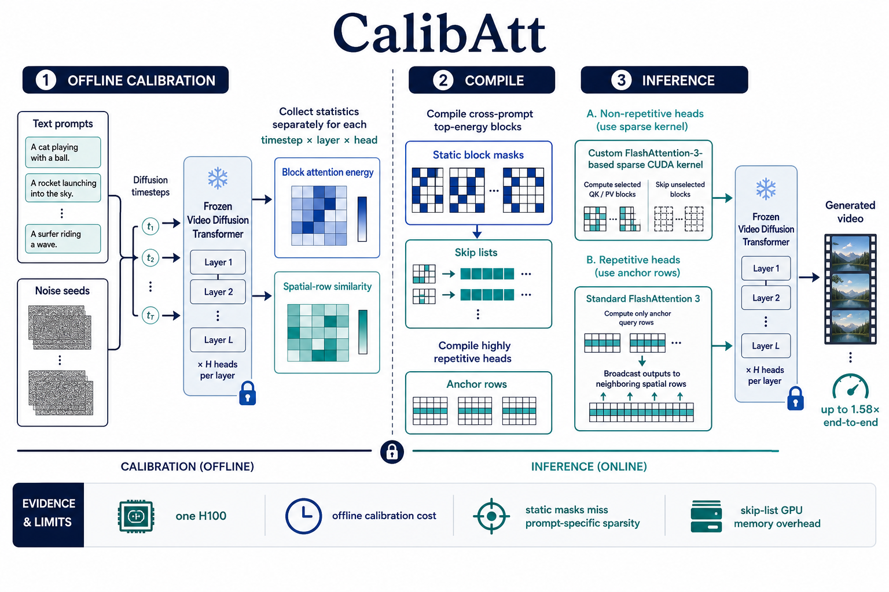
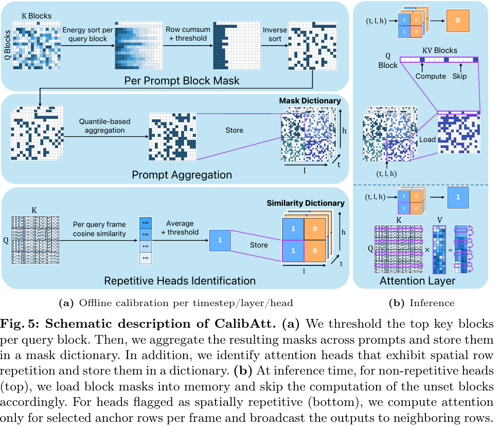
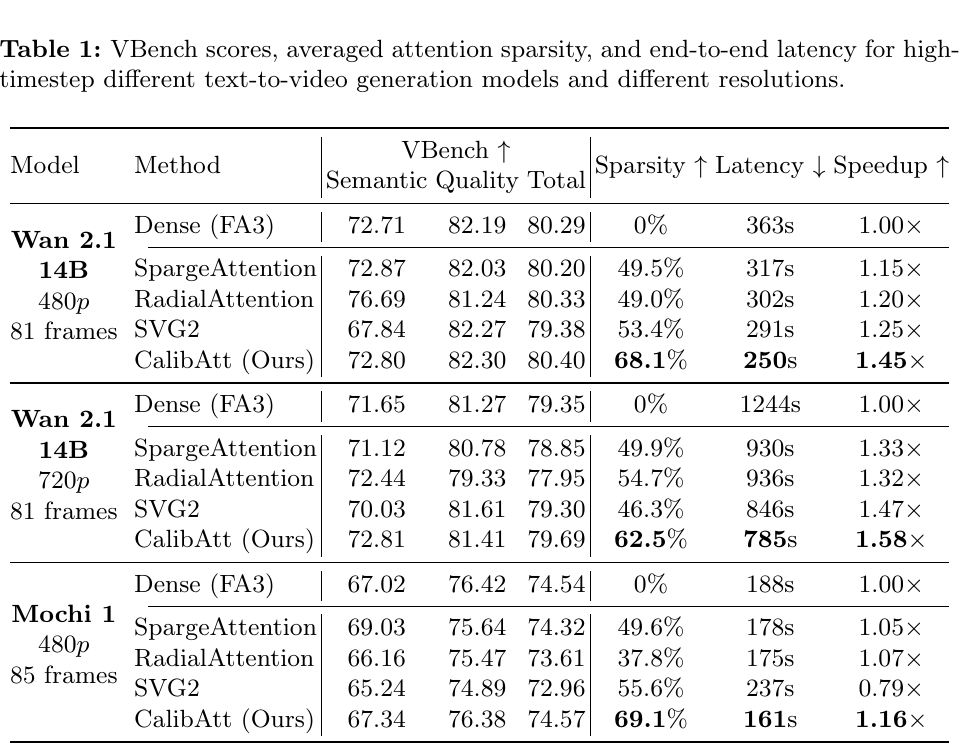

# Accelerating Text-to-Video Generation with Calibrated Sparse Attention 精读分析

> [!info] 文档关系
> - 文档类型：Paper
> - 领域入口：[README](../README.md)
> - 上位汇总：[Video generation sparse attention](../surveys/video-generation-sparse-attention.md)
> - 证据资产：[assets/papers/calibatt](../assets/papers/calibatt/)

> 资料状态：primary PDF 已保存为 `arXiv PDF`（arXiv v1，32 页）并完成文本提取、公式与表格复核；官方 arXiv HTML 作为交叉来源。LaTeX source 与官方代码仓库未取得，故实现级结论仍以论文声明为界。Figure 5 与 Table 1 来自 200 DPI PDF 页渲染裁剪，均含完整 caption 并通过原分辨率 QA。

## 修订信息

- 当前修订 ID：`rev-calibatt-affiliation-backfill-20260730`

- 当前文档版本：`1.1.1`
- 当前修订时间：`2026-07-30T23:30:00+08:00`
- 替代版本：`rev-calibatt-remediation-20260729` / `1.1.0`

| 修订 ID | 文档版本 | 时间 | 修订者 | 类型 | 替代修订 | 迁移问题/解析 | 变更摘要 | 原因 | 影响位置 | 依据 | 对结论影响 |
|---|---|---|---|---|---|---|---|---|---|---|---|
| `rev-calibatt-initial-20260729` | `1.0.0` | `2026-07-29T21:30:00+08:00` | `review_calibatt` | initial | 无 | 无 | 首次建立完整 PDF 精读、证据边界、原图 QA 与交付清单 | `vgsa-001-calibatt` initial delivery；父代理后续提供本地 PDF | `本文`; `Figure inventory`; `extracted_text/`; `figures/` | arXiv v1 PDF、官方 HTML、验证日志 | material：PDF 恢复使公式、表格和两类视觉证据可验 |
| `rev-calibatt-remediation-20260729` | `1.1.0` | `2026-07-29T21:45:00+08:00` | `review_calibatt_remediation` | correction | `rev-calibatt-initial-20260729` / `1.0.0` / `a5c7cb46624ef06824d08b9f9e7b020af6fecb882a771089725c1ea168327308` | 无 | 在新独占目录重建 PDF 文本与两张裁剪，逐式核对 PDF 记号，清除“PDF 记号不可用”遗留表述并修正补充材料编号 | `vgsa-002-calibatt-remediation`；首轮父级写边界审计无效，需 fresh remediation | `本文#修订信息`; `本文#01-术语与符号解释`; `本文#44-关键公式`; `本文#52-技术点证据矩阵`; `Figure inventory`; `figures/` | 本地 arXiv v1 PDF SHA-256 `3cd50c…6ee8`；重新运行 `pdftotext -layout`、200 DPI render/crop；逐图原分辨率 QA | non-material：核心方法、主结果与边界不变；符号来源和附件编号更准确 |
| `rev-calibatt-affiliation-backfill-20260730` | `1.1.1` | `2026-07-30T23:30:00+08:00` | `/root` | `metadata-update` | `rev-calibatt-remediation-20260729` / `1.1.0` | 无 | 补充作者—机构元数据与角色证据边界 | 统一回填 affiliation 交付字段 | `作者与机构` | 论文 PDF 标题页、机构编号与角色脚注 | none：不改变方法、实验与归因结论 |

## 0. 资料与配图索引

- 论文页面：https://arxiv.org/abs/2603.05503
- 官方 HTML：https://arxiv.org/html/2603.05503
- PDF：`arXiv PDF`，SHA-256 见交付 manifest；32 页，letter 612×792 pt
- LaTeX/source：未取得；PDF 足以完成当前精读，source 仅影响原始 vector 资产与代码级排版核验
- 开源代码：任务包未提供；论文 PDF、arXiv 页面、Apple 论文页与标题检索均未给出可核验的官方代码仓库
- OpenReview：arXiv-only，未发现公开 forum，not applicable
- 提取文本：`extracted_text/paper.txt`；HTML 交叉证据：`extracted_text/arxiv_html_evidence.md`
- 原论文图表：Figure 5（机制）与 Table 1（结果/系统）共 2 个合格裁剪；见 `Figure inventory`
- AI 生成解释图：`../assets/papers/calibatt/algorithm-analysis.png`

## 0.1 术语与符号解释

本章集中定义后文使用的论文专名与符号。公式已对照 PDF Eq. 1–10；仅 \(S_{\mathrm{E2E}}\) 等明确标注为分析推导。

### 0.1.1 术语表

| 术语 | 本文含义 | 别名 | 不等于/易混项 | 证据来源 |
|---|---|---|---|---|
| CalibAtt | 对指定模型与推理配置做一次离线校准，再以静态稀疏路由执行注意力的无训练方法 | calibrated sparse attention | 不是在线按当前 prompt 重新选块 | Abstract；§3.2–3.4 |
| block mask | 按 diffusion timestep、transformer layer、attention head 索引的二值块连接表 | calibrated mask | mask 的选择是离线输入汇总结果；被保留块内的 Q/K/V 数值仍依赖当前输入 | §3.2；Fig. 5 |
| agreement threshold | 将多个 prompt 的二值 mask 聚合为最终静态 mask 的一致性阈值 | cross-prompt threshold | PDF 明确记为 \(\rho\)，实验取 0.5；阈值增大会更激进地跳块 | PDF Eq. 8–9；§4.2 |
| energy threshold schedule | 每个 diffusion timestep 的累计注意力质量保留门槛 \(\epsilon(t)\) | timestep-dependent schedule | 不是每个输入在线搜索的运行时门槛；搜索发生在校准配置阶段 | Eq. 6–7；Appendix §A.1 |
| spatial repetition | 同一帧中不同空间 query 行呈相近 attention pattern 的头级性质 | repetitive head | 不等于 block sparsity；论文称二者负相关、互补 | §3.1 Observation 4；§3.3；Fig. 6 |
| anchor row | repetitive head 推理时实际计算的代表性空间 query 行 | representative row | 不是 KV block；其输出会广播给邻近 query 行 | §3.3–3.4 |
| skip list | 对每个 query block-row 编码应计算的连续 key-block 区间的只读布局 | interval list | 不是“要跳过的索引逐项列表”；实际保存的是 compute intervals | §3.4；Appendix §0.A.2 |
| selected input-dependent connections | 摘要中的含混短语：保留块的 QK/PV 数值依赖当前输入，但选择集合由离线 mask 固定 | — | 不应解读为推理时输入自适应 routing | Abstract；§3.2–3.4 |
| attention sparsity | 被跳过的时空 query–key 交互占全部自注意力交互的比例，并跨 step/layer/head 平均 | sparsity | 不等于端到端速度；其收益受 kernel、非 attention 算子和启动开销影响 | §4.1 Metrics |

### 0.1.2 符号表

| 符号 | 含义 | 性质 | 作用域/索引 | 单位/取值 | 来源 | 易混点 |
|---|---|---|---|---|---|---|
| \(Q,K,V\) | query、key、value 张量 | author-defined | 单个 attention head | 浮点张量 | §2 Eq. 1–2 | \(Q\in\mathbb R^{N_q\times d}\)，\(K,V\in\mathbb R^{N_{kv}\times d}\) |
| \(P\) | softmax 后 attention matrix | author-defined | query × key | 每行和为 1 | §2 Eq. 1；§3.1 | block energy 基于 \(P\)，不是原始 logit |
| \(O\) | attention 输出 | author-defined | 每个 query token | 向量 | PDF §2 Eq. 2 | 与广播后的 repetitive-head 输出区分 |
| \(t,l,h\) | diffusion timestep、layer、head 索引 | author-defined | mask dictionary key | 整数索引 | PDF §3.2 Eq. 8–9 | 也是推理时选择 mask/skip list 的索引 |
| \(\mathcal I_r,\mathcal J_c\) | query block-row \(r\) 与 key/value block-column \(c\) 的索引集合 | author-defined | block 内 token indices | set of \(B\) indices | §2 Eq. 3；§3.2 Eq. 5 | 与 spatial-row set \(\mathcal I^{(f,i)}\) 不同 |
| \(E_{r,c}\) | query block-row \(r\) 对 key block-column \(c\) 的平均 attention mass | author-defined | 每个 \(t,l,h,r,c\) 隐式计算 | \([0,1]\) | §3.2 Eq. 5 | 对 \(B\) 个 query 取平均 |
| \(\epsilon(t)\) | timestep-dependent energy threshold | author-defined | timestep/config | Wan 中 0.99→0.84 | §3.2 Eq. 6–7 | \(t=0\) 是最高噪声 step |
| \(M_p^{(t,l,h)}\) | prompt \(p\) 的二值 block mask | author-defined | prompt × \(t,l,h\) | \(\{0,1\}^{N_B\times N_B}\) | §3.2 Eq. 8 | 1 表示 compute，0 表示 skip |
| \(\bar M^{(t,l,h)}\) | calibration prompts 上 mask 的逐元素平均 | author-defined | \(t,l,h\) | \([0,1]\) frequency | §3.2 Eq. 8 | 是出现频率，不是 attention score |
| \(\rho\) | cross-prompt agreement threshold | author-defined | calibration config | 0.5 | §3.2 Eq. 9；§4.2 | 越大越稀疏 |
| \(k,H\) | 每帧 anchor row 数、全部 spatial row 数 | author-defined | repetitive head / frame | \(k=5\)，\(\gamma=0.87\) | §3.3 | \(\gamma\) 在此是相似度阈值，不是 agreement threshold |
| \(S_{\mathrm{E2E}}\) | 端到端 speedup | analysis-derived | 一次视频生成 | ratio | §4.1 Metrics | 必须用 dense latency / sparse latency |

## 0.2 AI 生成算法分析示意图

> 图注：AI 生成的解释图，不是论文原始证据。它依据官方 HTML §3.2–3.4、§4.1 与 §5，展示离线校准、静态编译、两条推理分支以及限制。OpenRouter ICU 尝试失败（`no parseable SSE events found`）后由内置 imagegen 生成，并在 1536×1024 原分辨率完成 QA。

## 1. 论文基本信息

### 作者与机构

- 第一作者（首位列名）：Shai Yehezkel → Apple；Tel Aviv University。
- 共同第一作者（仅含论文明确标注者）：论文未显式标注。
- 通讯作者/通讯联系人（仅含论文明确标注者）：论文未显式标注。
- 其他作者涉及的机构（去重列举，不作逐作者映射）：Apple；Tel Aviv University。
- 对应依据：论文 PDF 标题页、作者机构编号与角色脚注（核验日期：2026-07-30）。

- 标题：*Accelerating Text-to-Video Generation with Calibrated Sparse Attention*
- 作者：Shai Yehezkel, Shahar Yadin, Noam Elata, Yaron Ostrovsky-Berman, Bahjat Kawar
- 状态：arXiv:2603.05503v1，2026-03-05；未核验同行评审状态
- 研究领域：视频扩散 Transformer 的 attention/runtime 优化
- 核心问题：能否把在多个输入上稳定的稀疏与空间行重复模式离线编译，从而避免推理时的在线 routing 开销？
- 关键约束：指定模型、分辨率、diffusion step 配置；单 H100 实验；静态 mask 需额外显存；未取得代码。

## 2. 研究动机与问题—方案闭环

### 2.1 出发点与背景痛点

作者明确指出，视频生成需要高分辨率、多帧长序列，dense self-attention 的 token-pair 工作量随序列长度平方增长。FlashAttention 把中间矩阵分块留在快存储器中，改善 IO 与实现效率，却没有减少 QK/PV 乘法数量。于是系统仍为大量接近零贡献的连接付出计算。

CalibAtt 的关键观察分两层：某些 attention block 在不同 prompt 与初始噪声下都几乎无贡献；另一些 head 的空间 query 行具有重复模式。与此同时，模式在 layer/head/timestep 之间差异很大。因此论文选择“跨输入静态、跨模型内部位置细粒度”的折中：选择规则对当前输入不自适应，但为每个 \(t,l,h\) 编译不同操作。

### 2.2 现有方案为何不够

| 现有方案/做法 | 可观察的失败 | 具体场景或例子 | 例子来源 | 根因/被忽略变量 | 为什么简单修补仍不够 | 证据 |
|---|---|---|---|---|---|---|
| Dense FA3 | IO 更好但仍计算所有 token pair | 720p Wan 的 dense caption 为 20m44s；CalibAtt caption 为 13m05s | paper-provided，Fig. 1 | FA3 不改变乘法数量 | 只继续优化 dense kernel 不会主动去掉低质量连接 | §1；§2；Fig. 1 |
| 固定几何静态 mask（RadialAttention） | 同一 mask 无法匹配不同 head/layer/timestep 的模式 | 本文构造的说明例：把某个局部 head 的窗口强加给需跨帧关联的 head，会误删远程连接；扩大窗口又在全部 head 返还计算 | reviewer-created | 忽略模型内部位置的异质性 | 单一更大/更小窗口只能全局改预算，不能按 \(t,l,h\) 分配 | §2；§3.1 Observation 2；Fig. 2 |
| 在线稀疏 routing（SVG2/SpargeAttention 类） | 推理时要估计 block/cluster importance；few-step 模型中固定启动开销占比更大 | LightX2V 只有少量去噪步时，聚类初始化无法被很多 step 摊薄 | paper-provided | routing 本身消耗 kernel、内存与启动时间 | 仅缓存部分 centroid 仍保留初始化与部分 per-step 代价 | §2；§4.1；Appendix §0.A.4 |
| 只用 block sparsity | 低 block-sparsity 的 head 仍保留大量 QK/PV | Fig. 6 显示高空间重复与 block sparsity 负相关 | paper-provided | 冗余可能出现在 query 行重复而非 key-block 可跳过 | 放宽 energy threshold 会伤害质量，不能利用输出可广播结构 | §3.1 Observation 4；§3.3；Fig. 6 |

### 2.3 论文计划解决的问题与成功标准

- 核心目标（author-stated）：无需训练，减少视频 DiT attention 计算，并把 sparsity 转换为实际端到端延迟下降。
- 质量约束（author-stated）：VBench Quality、Semantic、Total 与 dense FA3 相当。
- 系统约束（author-stated）：在 FA3 友好的 block granularity 上跳过工作；推理时不做在线 mask 搜索。
- 外推要求（部分验证）：跨 Wan 2.1 14B、Mochi 1、LightX2V、480p/720p 与高/少步配置。
- 未解决：分布外 prompt、其他硬件、并发 serving、跨 batch、其他 Transformer 领域、代码复现。

### 2.4 核心方案如何解决并优化问题

| 原始问题/失败模式 | 根因或约束 | 对应方案设计 | 改变的变量/系统行为 | 作用机制 | 预期优化及指标 | 证据来源 | 判断 |
|---|---|---|---|---|---|---|---|
| 大量低贡献连接仍被计算 | dense FA3 不减少乘法 | energy-based block selection | 每个 query block 实际访问的 key blocks | 保留累计 attention mass 达阈值的最小 block 集 | attention sparsity、latency | §3.2 Eq. 5–7 | partially-supported：有整体结果，无独立开关消融 |
| 单输入 mask 不能直接部署 | prompt/noise 变化 | cross-prompt aggregation | 把 prompt-specific mask 变为静态 \(t,l,h\) mask | 只保留跨校准输入达到一致阈值的连接 | 无在线 routing 开销、质量稳定 | Fig. 3；Eq. 8–9；Fig. 7 | supported for sampled settings；分布外未测 |
| 某些 dense head 难以 block-prune | query rows 重复 | repetitive-head detection + anchors | query rows 从 \(H\) 减为 \(R\) | 只算 anchor 行并广播 | query-side sparsity、attention speed | §3.3；Fig. 6；Fig. S12 | partially-supported |
| 稀疏逻辑不一定产生 wall-clock 收益 | 不规则稀疏与启动开销 | precomputed skip lists + custom CUDA | kernel 直接遍历连续 compute intervals | 真正跳过未选 QK/PV blocks | kernel 与 E2E latency | §3.4；Table 1–2 | confounded：kernel/算法未拆分 |
| 每 \(t,l,h\) mask 显存大 | skip-list padding 与重复 timestep masks | trimming/interval merge/timestep sharing | representation width 与 mask count | 压缩 padding，合并近邻区间或共享 mask | GPU memory | Appendix §0.A.2–0.A.3 | partial；1D layout 未实现 |

### 2.5 完整因果链与证据闭环

长视频序列使 dense attention 成为瓶颈；FA3 只降低 IO，固定 mask 忽略 \(t,l,h\) 差异，在线 routing 又增加运行时成本。论文观察到 block 的 skip/keep 决策跨输入稳定，同时部分 head 的空间 query 行重复，于是离线采集 block energy 与 row similarity，分别编译 static skip lists 与 anchor-head dictionary。推理阶段 custom FA3-based kernel 只执行选中 QK/PV blocks，或对 anchor queries 执行标准 FA3 后广播。理论预期是更少 attention 工作且无在线搜索；实验报告最大 1.58× E2E speedup，并在所测模型/分辨率上维持 VBench。

证据闭环的断点有两处：其一，整体结果把 mask、repetition、custom kernel 与其他实现细节捆绑，不能把全部收益归给任一组件；其二，校准集来自 MovieGenBench，而质量评估用 VBench，算是一定程度的跨 prompt-set transfer，但没有细分 prompt 类型或分布外压力测试。PDF 已恢复并核验公式与完整主表；剩余实现不确定性来自未发布/未发现的代码。

## 3. 核心贡献与创新点

1. 把稀疏选择从推理期移到一次性校准，并保留 \(t,l,h\) 粒度，目标是兼顾静态执行低开销与模型内部异质性（§3.1–3.2）。
2. 将 block sparsity 与 spatial-row repetition 作为互补分支：前者跳 key blocks，后者减少 query rows（§3.3，Fig. 6）。
3. 把 mask 编译为连续 compute intervals 的 read-only skip lists，并用 FA3-based custom CUDA 真正跳过 QK/PV block work（§3.4）。
4. 在 Wan/Mochi/LightX2V、不同分辨率与 step 数上报告质量—延迟结果；但“跨设置有效”不等于超参数完全不依赖配置，因为 Appendix 明确对每个 model/inference configuration 独立搜索 schedule。

## 4. 研究方法

### 4.1 方法总览

校准阶段：固定模型与推理配置，用一组 prompt/noise 跑模型；对每个 \(t,l,h\) 计算 block energy 和空间行相似度。对每个 prompt，先取累计 attention mass 达 \(\epsilon(t)\) 的最少 key blocks；再跨 prompt 聚合为静态 mask。另行把高 row-similarity heads 标为 repetitive。编译阶段把非重复 head 的 mask 转为连续 key-block 区间，把重复 head 记录为 anchor 分支。推理阶段不再决定 routing：依据当前 \(t,l,h\) 加载已编译描述符。

> Figure 5（PDF p.8，200 DPI 裁剪）：上半路径把每个 prompt 的 block energy 选择聚合为按 \(t,l,h\) 索引的 mask dictionary；下半路径识别 spatially repetitive heads；推理端分别执行 block skip 或 anchor-row broadcast。该图直接验证“决策静态、张量值输入相关”的阶段划分。

“输入不变/输入相关”必须分清：

- **输入不变**：该 \(t,l,h\) 走 sparse-block 还是 repetitive-anchor 分支；block mask；skip-list intervals；anchor-row placement。
- **输入相关**：Q/K/V 数值；被保留 block 的 logits/softmax/PV；anchor query 的输出。
- **配置相关**：模型、分辨率、step 数、CFG 与 schedule 搜索；换配置是否需要重新校准由正文语义强烈暗示，但论文没有把所有 cache key/API 形式写清。

### 4.2 组件级设计动机与具体问题映射

| 设计项 | why 状态 | 原文证据 | 针对的具体问题 | 因果机制 | 替代方案/权衡 | 验证证据 | 判断 |
|---|---|---|---|---|---|---|---|
| per-prompt energy top-mass selection | author-stated | §3.2 Eq. 5–7 | 低 attention-mass blocks 贡献小 | 以质量阈值而非固定 block 数分配预算 | 固定 top-k 更易负载均衡但不适应 mass 集中度 | block-size study；总体质量 | partially-supported |
| timestep-dependent \(\epsilon(t)\) | author-stated | PDF §3.2 Eq. 6–7；Appendix A.1 | 高噪声早期更怕激进 sparsity | 早期保留更多 mass | 常数阈值简单；layer/head schedule 更灵活但搜索更重 | schedule search，未见独立 matched ablation | 机制上说得通，只有部分证据 |
| per-\(t,l,h\) masks | author-stated | Observation 2；Fig. 2 | 不同内部位置模式差异大 | 细粒度匹配局部模式 | shared mask 更省内存 | Fig. 2；timestep-sharing appendix | mechanism evidence；收益未隔离 |
| cross-prompt agreement | author-stated | Observation 3；Fig. 3；Eq. 8–9 | 单 prompt mask 过拟合 | 以出现频率筛出稳定连接 | online routing 更自适应但有 overhead | Fig. 7 calibration-size/threshold sensitivity | supported in sampled range |
| spatial repetition branch | author-stated | Observation 4；§3.3；Fig. 6 | 一些低 block-sparsity heads 仍有 query redundancy | anchor row 计算后广播 | 只做 block mask 无法利用 query repetition；广播引入近似误差 | Fig. S12 sensitivity | partially-supported |
| custom calibration CUDA | author-stated | §3.4 | 不应 materialize full attention matrix 只为统计 | block-level accumulation | PyTorch reference 更易复现但慢/耗内存 | 无代码、无独立 profiling | unverified implementation |
| contiguous skip-list CUDA | author-stated | §3.4；Appendix §0.A.2 | 稀疏 mask 若只乘零不会提速 | kernel launch 直接按区间省略 QK/PV blocks | FlexAttention/FlashInfer；不规则布局与显存权衡 | E2E results；无 kernel-only decomposition | confounded |
| conditional-only CFG calibration | author-stated | Appendix opening | 避免双分支校准成本 | 同一 mask 同时应用 conditional/unconditional | 分别校准可能更忠实但成本/内存更高 | 未见 CFG branch ablation | unverified |
| timestep mask sharing | author-stated | PDF Appendix A.3；Fig. S4 | per-step mask 显存大 | 对后期高-IoU masks 做 clique grouping，keep-mask OR 保守合并 | 不共享速度/稀疏更高，memory 更大 | Table S1 给出 21.5→3.6 GB 等受控配置 | 有直接表格证据，但只覆盖 Wan 720p |

### 4.3 模型/系统架构

系统没有训练新参数；产物是一组与 model/config 绑定的运行时描述符。非重复 head 的 kernel API 语义可从论文确定为“selected skip list + current Q/K/V”，但函数签名、index dtype、stream/launch、softmax accumulation precision、backward 支持和 fallback path 均无代码可查。重复 head 使用 reduced query set 的标准 FA3，再广播输出；这跳过的是未选 query rows 的 QK 与 PV，而不是只跳 QK。

### 4.4 关键公式

#### F1：标准 attention（PDF §2 Eq. 1–2）

$$
P=\operatorname{softmax}\!\left(\frac{QK^\top}{\sqrt d}\right),\qquad O=PV.
$$

**这条公式在算什么？** 它把每个 query 对所有 keys 的匹配分数归一化，再用这些权重混合 values。

**怎么读？** 先做 QK 点积得到注意力权重，再用权重加权求和 V。

**输入与输出。** 输入是 \(Q,K,V\) 与 head dimension \(d\)；输出是 attention matrix \(P\) 与 head output \(O\)。

**变量在这里各做什么？** \(Q\) 发起查询，\(K\) 提供匹配坐标，\(V\) 提供被聚合内容，\(\sqrt d\) 控制 logit 尺度。

**直觉。** 若某个 \(P_{qk}\) 极小，对 \(O_q\) 的贡献也很小；CalibAtt 借此尝试省略整块连接。

**边界。** 公式已逐项对照本地 PDF；论文的 custom kernel 声明不 materialize 完整 \(P\)，但代码不可用，无法核验具体 online-softmax 与累加实现。

**小例子。** 本文构造：若一个 query 的四个 key 权重为 \(0.70,0.25,0.04,0.01\)，保留前两个可覆盖 95% mass，但把后两个合成一个 hardware block 后能否跳过取决于 block layout。

#### F2：block energy（§3.2 Eq. 5）

$$
E_{r,c}=\frac{1}{B}\sum_{i\in\mathcal I_r}\sum_{j\in\mathcal J_c}P_{ij}.
$$

**这条公式在算什么？** 它问“query block \(i\) 平均把多少 attention mass 分给 key block \(j\)？”

**怎么读？** 对 key block 内权重求和，再在 query block 的 rows 上平均。

**输入与输出。** 输入是 \(P\)、\(\mathcal I_r\)、\(\mathcal J_c\) 与 block size \(B\)；输出是 block-level mass \(E_{r,c}\)。

**变量在这里各做什么？** \(r,c\) 定位 query block-row 与 key block-column，\(i,j\) 遍历对应 token index sets，\(B\) 是每块 query 数。

**直觉。** \(E_{r,c}\) 越小，整块被省略后平均损失的 attention mass 越小；但平均可能掩盖 query-block 内少量重要 rows。

**边界。** 这是平均而非最大值保证；它控制 attention mass，不直接界定输出误差，因为 \(V\) 的范数也重要。

**小例子。** 本文构造：两个 query rows 对同一 key block 的 mass 为 0.01 与 0.09，则 block energy 为 0.05；平均值看似小，但第二行更敏感。

#### F3：跨 prompt 聚合（§3.2 Eq. 8–9）

$$
\bar M^{(t,l,h)}=\frac{1}{|\mathcal D|}\sum_{p\in\mathcal D}M_p^{(t,l,h)},
\qquad
\left[M^{(t,l,h)}\right]_{r,c}=\mathbf 1\!\left[\left[\bar M^{(t,l,h)}\right]_{r,c}\ge \rho\right].
$$

**这条公式在算什么？** 它把每个 prompt 的 keep/skip 决策汇总成一个可离线部署的静态 mask。

**怎么读？** 先统计一个 block 被各 prompt 保留的频率，再按一致性阈值决定最终是否计算。

**输入与输出。** 输入是 calibration prompt set \(\mathcal D\) 的二值 masks；输出是静态 mask \(M\)。

**变量在这里各做什么？** \(p\) 枚举 prompt，\(\bar M\) 是 keep frequency，\(\rho\) 是 agreement threshold。

**直觉。** 更高 \(\rho\) 要求 block 更常被保留才计算，因此会增加 sparsity、也更可能误删少数输入需要的 block；\(\gamma\) 是空间重复检测的另一阈值。

**边界。** 论文实验用 \(|\mathcal D|=64\)、\(\rho=0.5\)；它只反映校准 prompt 分布。

**小例子。** 本文构造：某块在 8 个 prompt 中被保留 7 次，频率 0.875；\(\rho=0.8\) 时保留，\(\rho=0.9\) 时跳过。

#### F4：端到端 speedup（分析推导）

$$
S_{\mathrm{E2E}}=\frac{T_{\mathrm{dense}}}{T_{\mathrm{CalibAtt}}}.
$$

**这条公式在算什么？** 它把 wall-clock latency 转成端到端加速比。

**怎么读？** dense 花多长时间，除以 CalibAtt 花多长时间。

**输入与输出。** 输入是同设置的两次平均延迟；输出是无量纲 ratio。

**变量在这里各做什么？** \(T_{\mathrm{dense}}\) 是 FA3 baseline，\(T_{\mathrm{CalibAtt}}\) 是完整方法。

**直觉。** 720p caption 的 \(1244/785\approx1.584\)，对应摘要的“up to 1.58×”；480p 的 \(363/250\approx1.452\)。

**边界。** 这是单 H100、单视频 diffusion process；不包含离线 calibration 摊销，也不能分离 attention kernel 与非-attention work。

**小例子。** 论文 caption 提供上述 720p 与 480p latency；本分析只做比值复算。

### 4.5 校准、实验与部署设计

论文称 calibration prompts 来自 MovieGenBench，评估使用 VBench official prompts，因此至少避免“完全在同一 prompt 列表上报告主质量”的最明显泄漏。但 schedule 参数对每个 model/inference configuration 独立 Optuna 搜索，并在 calibration set 上测 VBench 与 sparsity；这使“跨模型无需模型特定调参”的措辞需要收窄为“无需手工排除 layer/timestep，且搜索后参数呈简单规律”。它不是一套未经配置搜索即可跨所有模型直接复用的严格证据。

## 5. 关键结论

### 5.1 主结果

> Table 1（PDF p.12，200 DPI 裁剪）：同一张表同时给出 VBench、attention sparsity、端到端 latency 与相对 dense FA3 speedup，因而可以把“质量保持”与“系统加速”放在一个证据对象内核验。

PDF Table 1 可直接核验：

- Wan 2.1 14B 480p：dense FA3 为 VBench Total 80.29、363 s；CalibAtt 为 80.40、68.1% sparsity、250 s、1.45×。Total 绝对变化 \(+0.11\)，相对约 \(+0.14\%\)。
- Wan 2.1 14B 720p：dense 为 Total 79.35、1244 s；CalibAtt 为 79.69、62.5%、785 s、1.58×。Total 绝对变化 \(+0.34\)，相对约 \(+0.43\%\)。
- Mochi 1 480p：dense 为 Total 74.54、188 s；CalibAtt 为 74.57、69.1%、161 s、1.16×。SVG2 在该设置反而为 237 s、0.79×，支持论文关于在线 overhead 可能抵消 sparsity 的解释。
- LightX2V Table 2：CalibAtt latency 为 11.2 s 与 30.6 s；完整 speedup 与 VBench 已从 PDF 可读，但本主表分析聚焦 Table 1，避免把不同 step regime 混在一张归因表。
- 16 个 mask prompts + 1 个 similarity prompt 的 720p calibration cost：13.7 H100 GPU-hours（Appendix §0.B.2）。
- Appendix Table S1 的 per-layer trimmed 2D skip-list baseline 为 21.5 GB；这项内存成本对多模型/多配置部署很重要。

### 5.2 技术点—证据矩阵

| 技术点 | 声称收益 | 对应证据 | 对照是否受控 | 证据分类 | 结论 |
|---|---|---|---|---|---|
| 稳定的跨输入 block mask | 无在线 routing 且高 sparsity | Fig. 3；Fig. 7 | calibration size/threshold sensitivity，部分受控 | direct sensitivity + mechanism visualization | sampled prompts 上有支持；分布外未知 |
| per-\(t,l,h\) granularity | 避免固定 mask 失配 | Fig. 2；timestep sharing | 无 shared-vs-per-granularity matched latency/quality | indirect | 机制合理，收益未隔离 |
| spatial repetition anchors | 补充低 block-sparsity heads | Fig. 6；Fig. S12 | anchor count/threshold sweep | sensitivity | 有近似误差—速度证据；E2E 贡献未隔离 |
| custom block-energy kernel | 低成本校准统计 | §3.4 prose | 无代码、无 kernel timing | missing | 实现声明未核 |
| compiled skip-list sparse CUDA | 把 sparsity 变为速度 | Table 1–2 overall | 与完整算法绑定 | confounded | 证明系统整体有效，不证明 kernel 单独贡献 |
| skip-list trimming/merge | 降低显存 | PDF Fig. S3；Table S1 | representation sweep | direct table | 2D 21.5→6.3 GB、1D 可至 4.0 GB（无 merge）；1D kernel 未实现 |
| timestep sharing | 减少 mask 数量 | PDF Fig. S4；Table S1 | IoU threshold sweep | sensitivity + direct table | 2D 在 \(\tau=0.97\) 时 3.6 GB、1.56×；跨设置边界未知 |
| few-step transfer | 在线 overhead 方法更吃亏 | Table 2；Appendix baseline details | 同 checkpoint/settings，backend 不完全一致（Sparge 用 SageAttention2） | partial/confounded | CalibAtt 有短步优势，但 backend/kernel 公平性需代码复核 |

### 5.3 是否验证了因果假设

- “跨输入 mask 稳定”得到 Fig. 3 与 calibration-size/threshold 曲线的直接/半直接支持。
- “block sparsity 与 spatial repetition 互补”得到 Fig. 6 的负相关与 anchor sensitivity 支持，但 correlation 不等于二者组合的独立 E2E 增益。
- “静态编译避免在线 overhead”在设计上成立，且 few-step 结果与 Appendix 对 SVG2 初始化成本的解释一致；缺少 matched algorithm-only/runtime-only 对照。
- “质量保持”主要依赖 VBench 和有限 qualitative pairs。论文明确不追求 seed-level reconstruction；这意味着低 PSNR/逐像素差异可能被平均感知指标掩盖。

### 5.4 收益来源归因

| 组件/变化 | 对比基线 | 指标变化 | 影响路径 | 证据强度 |
|---|---|---|---|---|
| 完整 CalibAtt | dense FA3 | 720p 1244→785 s、Total 79.35→79.69；480p 363→250 s、Total 80.29→80.40 | block skipping + anchors + kernel + non-attention fixed cost | matched overall, internally confounded |
| block mask calibration | dense | reported sparsity increase | fewer selected key blocks | indirect; no component-only E2E |
| anchor rows | full-query FA3 | PDF Fig. S12 kernel speed/error sweep | fewer query rows | sensitivity；E2E 独立贡献仍未隔离 |
| skip-list representation | untrimmed/trimmed layout | PDF Appendix A.2/Table S1：52→21.5 GB，interval merge 可到 6.3 GB；1D 无 merge 为 4.0 GB | less padding/mask storage | direct table；1D latency 未报告 |

不能把 1.58× 说成“sparse CUDA kernel 提供 1.58×”，也不能把 62% sparsity 直接换算成 2.63× speedup；端到端仍含非-attention 部分，稀疏 kernel 也有索引与负载不均衡成本。

## 6. Related Work 对比

| 类别 | 机制 | 优点 | 局限 | 与 CalibAtt 关系 |
|---|---|---|---|---|
| Dense FA3 | tiled exact attention | 数值精确、实现成熟 | 不省乘法 | CalibAtt 以其为 backend/baseline |
| RadialAttention | 位置先验静态 mask | 推理 overhead 低 | 固定结构不适应 \(t,l,h\) | CalibAtt 用模型校准替代人工几何 |
| SpargeAttention | 在线压缩 Q/K 估计 block importance | 输入自适应 | 有在线 scoring/skip-list 成本 | CalibAtt 牺牲 prompt 特异性换低 overhead |
| SVG2 | 在线 token clustering/centroid attention | 语义自适应 | 初始化与 per-step clustering | few-step 时 CalibAtt 的离线编译更有利 |
| trainable sparse attention | fine-tune 让模型适应 sparse pattern | 可达更高 sparsity | 需数据与训练资源 | CalibAtt 是 training-free 路线 |

公平性边界：论文称相同 checkpoint 与 inference settings，dense/warmup 尽量用 FA3；但 SpargeAttention 采用官方推荐 SageAttention2 backend，SVG2 用 FlashInfer kernels。于是 E2E 比较是“各方法可用实现”的系统比较，不是纯算法同 kernel 对照。

## 7. OpenReview 公开评审 × 论文内容

该记录为 arXiv-only；任务包未提供 OpenReview URL，标题/作者搜索未发现公开 forum。故 OpenReview cross-check 为 not applicable，不把第三方博客评论当同行评审。

## 8. Infra 需求分析

### 8.1 算力

Dense head 的 QK 与 PV 主要工作量均随 selected query–key pairs 变化。block mask 跳过未选 blocks，因此同时避免相应 QK 和 PV；anchor branch 将 query rows 从 \(H\) 减到 \(R\)，理想 query-side sparsity 为 \(1-R/H\)。实际 speedup 还取决于 occupancy、block size、interval length、softmax bookkeeping 与非-attention Amdahl 上限。

### 8.2 显存与存储

新增状态包括每个配置的 mask dictionary、skip lists 与 repetitive-head/anchor metadata。2D skip-list layout 为每个 query block row 保存若干 `(start,end)` intervals，并有 valid length；最大行决定 padding 宽度。Appendix 报告 Wan 720p 的 per-layer-trimmed 2D baseline 为 21.5 GB，说明“无需训练”不等于“部署零成本”。1D packed intervals 更省 padding，但论文明确留待 future kernel implementation。

### 8.3 Data Types / 数值格式

| 对象 | 格式 | 阶段 | 硬件依赖 | 影响 | 证据 |
|---|---|---|---|---|---|
| Q/K/V 与 accumulation | 未从 PDF/代码确认 | calibration/inference | H100 + FA3 | 可能决定 tensor-core 路径与误差 | unavailable |
| binary masks | logical binary；存储 dtype 未知 | compile | GPU preload | 决定 dictionary footprint | §3.2–3.4 |
| skip-list intervals | start/end indices；index dtype 未知 | inference | custom CUDA | padding/loads 增加显存带宽 | §3.4；Appendix §0.A.2 |
| similarity statistics | PyTorch batched implementation；dtype 未知 | calibration | H100 | calibration cost | §3.4 |

论文没有在可读 HTML 中确认 fp16/bf16/fp8、index width 或 accumulation precision；不得从 FA3 名称自动推断。

### 8.4 带宽、互联与利用率

所有实验为单 H100，未涉及 NVLink/RDMA/all-reduce。skip lists 在推理前 preload 到 GPU，运行中按 \(t,l,h\) 选择；因此主要是 HBM→SM 的 Q/K/V 与 interval metadata 流量。论文未报告 bytes moved、kernel runtime breakdown 或 H100 peak utilization，无法计算

$$
\mathrm{EffectiveBandwidth}=\frac{\mathrm{BytesMoved}}{\mathrm{RuntimeSeconds}},
\qquad
\mathrm{Utilization}=\frac{\mathrm{EffectiveBandwidth}}{\mathrm{PeakBandwidth}}.
$$

**这条公式在算什么？** 它本应判断稀疏 kernel 使用了多少实际带宽以及占硬件峰值多少。

**怎么读？** 数据搬运字节除以时间得到有效带宽，再除以峰值带宽得到利用率。

**输入与输出。** 输入是 bytes moved、kernel runtime 与 peak bandwidth；输出是 GB/s 和百分比。

**变量在这里各做什么？** bytes 表示真实流量，runtime 需为对应 kernel 时间，peak 是具体 H100 配置的理论值。

**直觉。** sparsity 降低流量不必然提升利用率；短且不规则 intervals 可能降低 coalescing/occupancy。

**边界。** 论文未给必要计数，故只列分析框架，不报告伪精确数值。

**小例子。** not-applicable：缺失 bytes/kernel timing 时编数值会误导。

### 8.5 CPU/GPU/NPU 异构执行

论文只报告单 H100。prompt preprocessing、scheduler、CPU→GPU metadata 传输、pinned memory、async copy、NPU fallback 均未说明。已知 calibration 与 inference 核心在 GPU；skip lists 在 generation 前 preload，意味着服务启动/配置切换需要显存驻留或重新传输。多分辨率、多 step 配置同时驻留可能放大 21.5 GB 级描述符压力。

### 8.6 调度/Serving/自定义算子

每次 kernel launch 需按 \(t,l,h\) 选描述符。论文没有公开 runtime API、CUDA graph capture、batch 支持、head divergence、fallback 或异常 prompt 检测。静态 mask 适合重复使用同一 model/config 的长期服务，因为 calibration cost 可摊销；临时、低请求量或频繁切配置场景可能不划算。

## 9. 开源代码对照

任务包未提供代码路径；论文 PDF、官方 arXiv/Apple 页面与标题检索未发现可核验的官方代码链接。因此：

- custom calibration CUDA、FA3-based inference kernel、2D trimming、CFG mask reuse 仅为论文声明；
- 没有 commit hash、文件路径、build flags、supported GPU list 或 tests；
- 不把第三方博客的“实现细节”当代码证据；
- checkpoint 配置沿用 Wan/Mochi/LightX2V 公开模型，但本任务未下载 metadata，因此仅能复述论文所称 14B/10B，不能做结构级核验。

## 10. 优点与局限

### 优点

- 设计目标与系统执行一致：不是把权重置零，而是用 skip lists 真正省略 block work。
- 在“全局固定几何”与“每请求在线 routing”之间给出有解释力的折中。
- 把 block sparsity 和 query-row repetition 分成两个互补分支。
- 报告 E2E latency 而非只报理论 FLOPs，并覆盖 few-step setting。

### 局限

1. **校准代表性**：MovieGenBench→VBench 有一定跨集合证据，但无 prompt subtype/OOD/noise stress test。
2. **归因混杂**：完整方法、custom kernel、anchors 与 layout 一起变化，缺少 algorithm-only/kernel-only matched decomposition。
3. **配置依赖**：每个 model/inference configuration 独立搜索 schedule；跨 resolution/model 的“无需调参”表述不宜无限外推。
4. **显存高**：720p 2D trimmed baseline 21.5 GB；这会限制 batching、多模型共存与低显存卡。
5. **指标边界**：VBench 保持不等于逐 seed 行为保持；论文主动不使用 PSNR 类 reconstruction metric。
6. **实现复现受限**：PDF 已完整可读，但 source/code 不可用，CUDA/API/dtype 仍不能代码核验。

## 11. 研究启发

- 用 calibration 把在线观察到的稳定 routing 编译为 cache，是 video DiT runtime 的通用方向，但 cache key 必须显式包含 model/config。
- 可做三段 matched ablation：dense FA3 → static mask with generic sparse kernel → same mask with custom kernel，再独立打开 anchors。
- 可按 prompt embedding/OOD score 准备多套 mask 或安全 fallback，在保持低 overhead 的同时缓解静态 mask 的尾部风险。
- 1D packed skip lists、late-timestep sharing、interval merge 应联合优化，并报告 bytes moved/occupancy，而不只报告 GB。

## 12. 解读问题/待验证清单

1. mask dictionary 的完整 cache key 是否包含 CFG、resolution、frame count、step schedule、model revision 与 dtype？
2. 校准与评估 prompt 的语义分布重合度如何？罕见运动/构图 prompt 是否更易误删？
3. block energy 用 query-row 平均是否会遮蔽少数重要 token？max/quantile aggregation 会怎样？
4. block mask 与 anchor branch 各自带来多少 attention-kernel 和 E2E 收益？
5. custom kernel 的 QK、online softmax、PV 和 accumulation precision 与 dense FA3 是否完全一致？
6. 21.5 GB descriptor memory 是否计入论文 E2E 设置的峰值显存？与 KV/activation/batch 的竞争如何？
7. 多请求 batch 中不同 \(t,l,h\) 描述符选择是否造成 divergence？
8. LightX2V 的少步收益中，静态 routing 与 custom kernel 各占多少？需要 algorithm-only/runtime-only bridge baseline。
9. 论文 v1 是否后续发布代码？代码可得后应做 evidence-update revision。

## 13. 一句话总结

CalibAtt 的核心价值是把跨输入稳定、但随 timestep/layer/head 变化的 attention 冗余离线编译成可执行 skip lists 与 anchor-row 分支，并在单 H100 上报告最高 1.58× 端到端加速；最大不确定性是缺少公开代码，且现有实验未把静态算法收益、custom kernel 收益和校准分布外风险彻底拆开。
