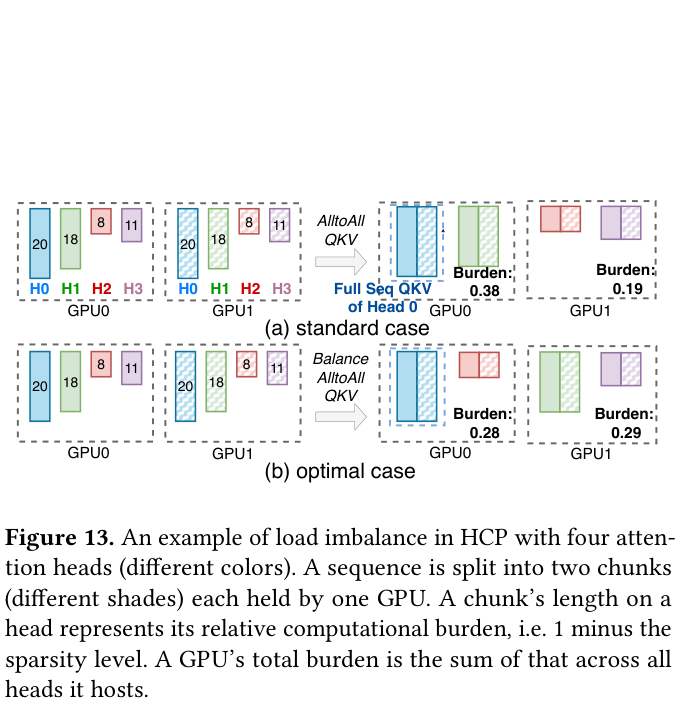
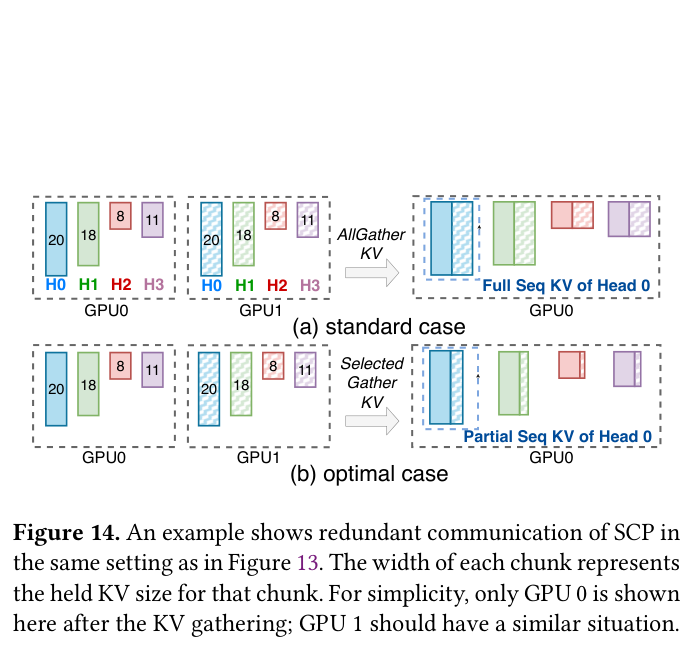
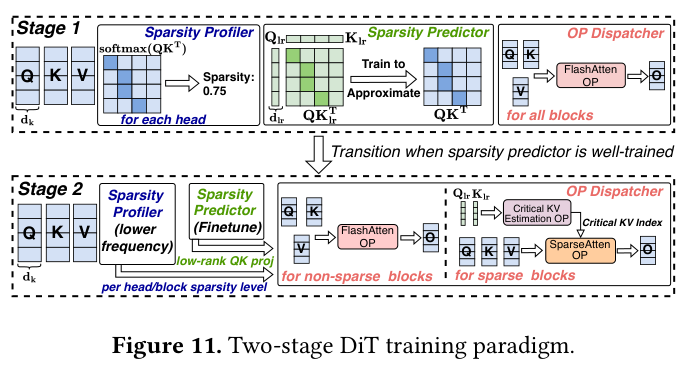
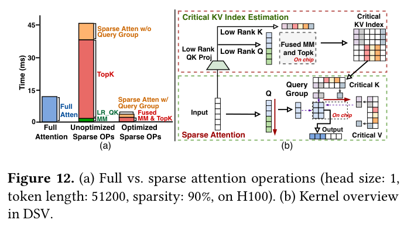
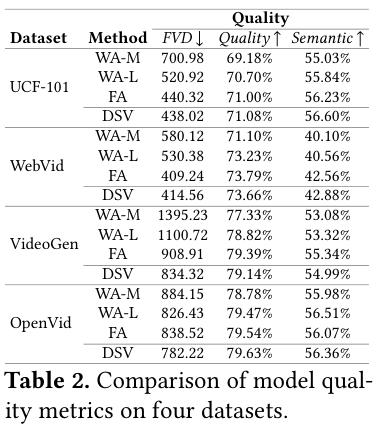
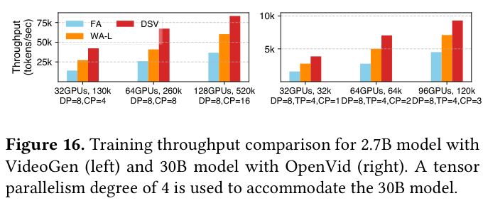
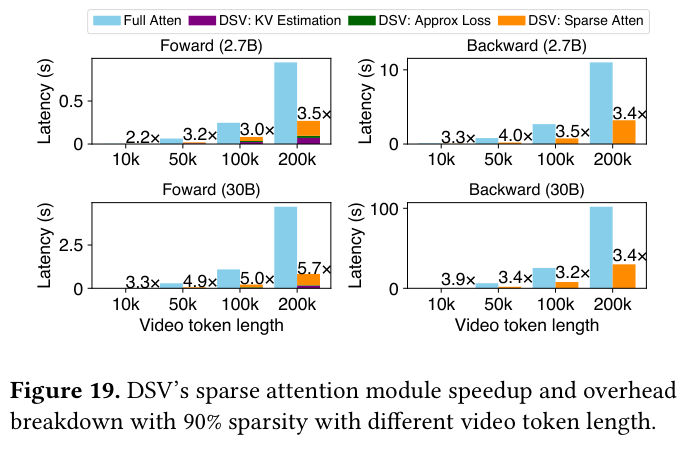
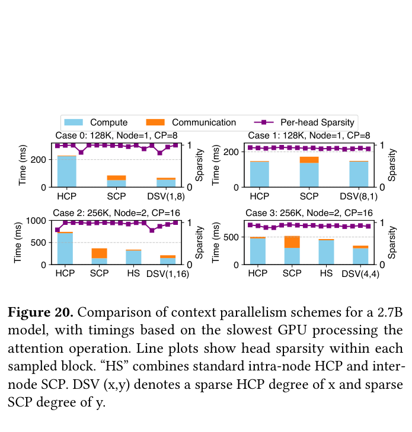

# DSV: Exploiting Dynamic Sparsity to Accelerate Large-Scale Video DiT Training 精读分析

> [!info] 文档关系
> - 文档类型：Paper
> - 领域入口：[README](../README.md)
> - 上位汇总：[Video generation sparse attention](../surveys/video-generation-sparse-attention.md)
> - 证据资产：[assets/papers/dsv](../assets/papers/dsv/)

> 资料状态：PDF、arXiv LaTeX 源码、可搜索文本和 ASPLOS'26 Artifact Evaluation 代码包均可读。论文图表是 200 DPI PDF 页面裁剪，均保留完整 caption；代码来自 Zenodo v1，不含 Git 元数据，因此以 ZIP SHA-256 与 Software Heritage directory ID 固定版本。本文不使用联网材料，不生成新图片。

本文研究的是一个很具体的训练系统矛盾：视频 DiT 的 3D 自注意力随 token 数平方增长，但真正贡献主要注意力质量的 key-value（KV）对只占少数，而且这批 KV 会随层、注意力头和训练进程改变。DSV 没有把“稀疏”简化成固定窗口，而是先用独立训练的低秩预测器跟踪关键 KV，再用融合与分组 kernel 真正省掉 QK、softmax 和 PV 工作，最后让上下文并行策略适应每个块的稀疏分布。论文直接证明了完整系统的质量与吞吐优势，也分别给出了 kernel 和并行策略证据；但“低秩预测器、kernel、调度器、混合 CP 各自对完整训练吞吐贡献多少”没有匹配的端到端逐项消融。

## 修订信息

- 当前修订 ID：`rev-dsv-affiliation-backfill-20260730`

- 当前文档版本：`1.0.1`
- 当前修订时间：`2026-07-30T23:30:00+08:00`
- 替代版本：`rev-vgsa-007-dsv-r2-initial` / `1.0.0`

| 修订 ID | 文档版本 | 时间 | 修订者 | 类型 | 替代修订 | 迁移问题/解析 | 变更摘要 | 原因 | 影响位置 | 依据 | 对结论影响 |
|---|---|---|---|---|---|---|---|---|---|---|---|
| `rev-vgsa-007-dsv-r2-initial` | `1.0.0` | `2026-07-29T15:58:27+08:00` | `review_dsv_remediation` | `initial` | 无 | 无 | 建立独立、完整、可验证的单篇精读交付 | 首次代理未冻结交付；父任务要求独立补救 | `本文`、图表、代码核验与 manifests | `过程任务包`、论文 PDF/LaTeX、Zenodo 代码包、官方 validator | material |
| `rev-dsv-affiliation-backfill-20260730` | `1.0.1` | `2026-07-30T23:30:00+08:00` | `/root` | `metadata-update` | `rev-vgsa-007-dsv-r2-initial` / `1.0.0` | 无 | 补充作者—机构元数据与角色证据边界 | 统一回填 affiliation 交付字段 | `作者与机构` | 论文 PDF 标题页、机构编号与角色脚注 | none：不改变方法、实验与归因结论 |

## 0. 资料与配图索引

- 论文：`arXiv PDF`，SHA-256 `bda5018a7f0f4188e1a47d9fd2c05242262958826e0c41e66bc94b7ea2cd56a9`。
- LaTeX：`source/`；原始归档 `source/arxiv-source.tar`，SHA-256 `d535e978925b1fbc837130395501081f44405e3c98c1a17957b728d5bf49f96a`。
- 可搜索文本：`extracted_text/extracted_text/full_text.clean.txt`。
- 代码：`code/DSV-ae.zip`，SHA-256 `ee63b32c8b4e63688a8446b9d46e78d62305152278559080d544b22b9084c41a`；Software Heritage `swh:1:dir:bdab2a407ae073cf975b224af8391487b29c4eed`；Git commit 不可得。
- OpenReview：任务包没有 URL；论文是 ASPLOS 2026，离线材料中没有公开 OpenReview 评审、decision 或 rebuttal，因此本分支不适用。
- 图表：Figures 11–14 为机制/系统图；Table 2、Figures 16、19、20 为结果/系统证据。精确页码、bbox、caption 与 QA 见 `Figure inventory`。
- 算法总览：采用论文原 Figure 11，不生成解释图。

## 0.1 术语与符号解释

### 0.1.1 术语表

| 术语 | 本文含义 | 别名 | 不等于/易混项 | 证据来源 |
|---|---|---|---|---|
| DSV | 同时包含动态稀疏预测、稀疏 kernel 与稀疏感知上下文并行的视频 DiT 训练系统 | 系统名 | 不是单一 sparse-attention kernel | Introduction；§DSV Overview |
| critical KV | 对一个 query 而言，按注意力权重从大到小累积、共同贡献默认 90% 总权重的 KV 对 | 关键 KV | 不是空间上最近的 KV，也不是固定 top-k 数量 | Findings, Critical KV Definition |
| sparsity predictor | 每个注意力块独立训练的低秩 Q/K 投影，用近似分数排序关键 KV | low-rank predictor | 不进入主 DiT 损失图；不是替代主 Q/K 投影 | §Low-Rank based Sparsity Prediction；代码 `DSV/models/low_rank_modules.py` |
| sparsity profiler | 周期性抽样 query、计算完整注意力分布并维护每头/每块稀疏度的监测器 | profiler | 不是每一步都物化完整 \(S\times S\) 分数 | §Sparsity Profiling |
| OP Dispatcher | 根据离线性能阈值、当前稀疏度和可用显存，在每块选择 full 或 sparse attention | dispatcher | 不负责找关键 KV；预测器才负责排序 | §Two-Stage DiT Training |
| query grouping | 把 3D 相邻 query 分组，以中心 query 的关键 KV 索引供组内 query 共享 | 查询分组 | 不等于固定局部窗口；共享的 KV 可以远离 query | §Sparse Attention with Query Grouping |
| HCP | 沿注意力头维度分配工作、使用 all-to-all 搬运 QKV/输出的上下文并行 | head-wise CP | 稀疏后均匀分头不等于均匀负载 | §Head-wise CP with Sparsity |
| SCP | 每 GPU 保留局部 query，并从其他 GPU 收集所需 KV 的序列维上下文并行 | sequence-wise CP | DSV 的 selective gather 不再收集全部远端 KV | §Sequence-wise CP with Sparsity |
| hybrid sparse CP | 对每块联合搜索 HCP/SCP 度数、头分配和节点内外布局的策略 | hybrid CP | 不是固定“节点内 HCP、节点间 SCP”模板 | §Hybrid Sparse Context Parallelism；代码 `DSV/optim_solve/solver.cc` |

### 0.1.2 符号表

| 符号 | 含义 | 性质 | 作用域/索引 | 单位/取值 | 来源 | 易混点 |
|---|---|---|---|---|---|---|
| \(Q,K,V\) | 主注意力的 query、key、value | author-defined | 每层/头/token | 张量 | §Background、§Design | 与低秩 \(Q_{\mathrm{lr}},K_{\mathrm{lr}}\) 不同 |
| \(S\) | 视频 token 序列长度 | author-defined | 每次运行 | token 数，最高实验到 520k | §Efficient Kernels、§Parallelism | \(S^i\) 中的 \(S\) 是平滑稀疏度，不是序列长度 |
| \(H\) | 注意力头数 | author-defined | 每个模型 | 12/16/24 | Table 1 | \(H_i^r\) 是 GPU \(i\) 重分配后的头数 |
| \(D\) | 单头维度 | author-defined | 每个模型 | 96/128/256 | Table 1、§Parallelism | 论文有时写 \(d_k\) 表示原始 Q/K 内维 |
| \(N\) | 一个上下文并行组的 GPU 数 | author-defined | 每 CP 组 | 正整数 | §Parallelism | 与 token 数无关 |
| \(S^i\) | 第 \(i\) 次更新后的平滑稀疏度 | author-defined | 每块/头/迭代 | 0–1 | §Sparsity Profiling | 不等于序列长度 \(S\) |
| \(P^i\) | 第 \(i\) 次 profiler 抽样得到的稀疏度 | author-defined | 每块/头/迭代 | 0–1 | §Sparsity Profiling | 是观测值，不是模型参数 |
| \(\alpha\) | 指数滑动平均中最新观测权重 | author-defined | profiler | 0–1 | §Sparsity Profiling | 在 SCP 公式中 \(\alpha_i^j\) 是另一含义 |
| \(W_Q^{\mathrm{lr}},W_K^{\mathrm{lr}}\) | 低秩 query/key 可训练投影 | author-defined | 每注意力块 | 参数矩阵 | §Low-Rank based Sparsity Prediction | 与主模型 Q/K 投影分离 |
| \(Q_{\mathrm{lr}},K_{\mathrm{lr}}\) | 低秩投影输出 | author-defined | 每块/头/token | 默认每头内维 16 | §Low-Rank based Sparsity Prediction | 只用于近似排序关键 KV |
| \(d_{\mathrm{lr}}\) | 低秩 Q/K 内维 | author-defined | 每头 | 默认 16 | §Low-Rank based Sparsity Prediction | 远小于 \(d_k\) |
| \(K\) | 每 query 保留的关键 KV 数 | author-defined | 每 query/头 | 由目标稀疏度决定 | §Efficient Kernels | 与 key 张量 \(K\) 同字母，需依上下文区分 |
| \(H_i^r\) | HCP 重平衡后分配给 GPU \(i\) 的头数 | author-defined | 每 GPU | 整数 | §Head-wise CP | 上标 \(r\) 表示重新分配 |
| \(\alpha_i^j\) | GPU \(i\) 需要 GPU \(j\) 上 KV 的比例 | author-defined | GPU 对 | 0–1 | §Sequence-wise CP | 与 EMA 的 \(\alpha\) 不同 |
| \(g^h,g^s\) | hybrid CP 的 HCP 与 SCP 度数 | author-defined | 每块配置 | 正整数，乘积受 GPU 数约束 | §Hybrid Sparse CP | Figure 20 中 DSV(x,y) 即这两个度数 |
| \(\mathrm{BytesMoved}\) | 本文用于带宽分析的数据搬移量 | analysis-derived | 某通信/显存路径 | byte | 本文 §8.4 | 论文没有报告实测有效带宽 |
| \(\mathrm{RuntimeSeconds}\) | 对应数据路径耗时 | analysis-derived | 某操作 | second | 本文 §8.4 | 不能用整步耗时代替单路径耗时 |
| \(\mathrm{PeakBandwidth}\) | 硬件标称峰值带宽 | analysis-derived | 链路/设备 | byte/s | 本文 §8.4 | 论文只给跨节点 200 Gbps RoCE |

## 1. 论文基本信息

### 作者与机构

- 第一作者（首位列名）：Xin Tan → The Chinese University of Hong Kong。
- 共同第一作者（仅含论文明确标注者）：论文未显式标注。
- 通讯作者/通讯联系人（仅含论文明确标注者）：论文未显式标注。
- 其他作者涉及的机构（去重列举，不作逐作者映射）：The Chinese University of Hong Kong；StepFun；Unaffiliated。
- 对应依据：论文 PDF 标题页、作者机构编号与角色脚注（核验日期：2026-07-30）。

- 研究领域：视频生成训练系统、动态稀疏注意力、GPU kernel、分布式并行。
- 发表状态：ASPLOS 2026；论文链接为 arXiv 2502.07590。
- 核心问题：如何在训练过程中可靠发现不断变化的关键 KV，并把算法稀疏转化为单 GPU 和 128 GPU 规模上的实际吞吐收益。
- 研究目标：保持 full attention（FA）级生成质量，同时减少 QK/softmax/PV 计算、显存中间量与 CP 通信。
- 关键约束：稀疏度随层/头/迭代变化；关键 KV 没有固定局部模式；不规则访问会损害 GPU 利用率；多 GPU 会出现稀疏诱发的 straggler。

## 2. 研究动机与问题—方案闭环

### 2.1 出发点与背景痛点

作者明确指出，视频 latent token 可达到数十万，自注意力的 \(O(S^2)\) 成本于是压倒训练。论文的 profiling 显示：200k token 时，1.3B 与 3B 模型的 self-attention 分别占前后向计算时间约 92% 和 93%；另一方面，大量注意力权重非常小，top 10% keys 在 block 6/21 的 95.2%/86.8% query 中贡献超过 90% 总权重（Motivation；Findings, Observation 1）。这形成机会：如果只计算关键 KV，就能同时减少计算和 CP 搬运。

真正难点不是“存在稀疏”，而是稀疏位置不规则、在不同块/头间异质、并随训练变化。固定窗口省算力，却把“空间接近”误当成“注意力重要”；先算完整 \(QK^\top\) 再 top-k 虽能找对位置，却已经付出了最昂贵的分数计算和 \(S^2\) 中间量。

### 2.2 现有方案为何不够

| 现有方案/做法 | 可观察的失败 | 具体场景或例子 | 例子来源 | 根因/被忽略变量 | 为什么简单修补仍不够 | 证据 |
|---|---|---|---|---|---|---|
| 固定 3D window attention | WA-M 在 UCF-101 不收敛；WA-M/WA-L 的 FVD 普遍劣于 FA/DSV | 一个 query 的关键 KV 中只有 15.1% 在 5-token 半径内，48.5% 距离超过 10 token；局部窗口会系统性漏掉远端关键项 | paper-provided | 关键 KV 由内容而非固定几何邻域决定 | 扩大窗口会保住更多关键项，但也在所有 query 上恢复大量无效计算，仍不会适应层/头/时间异质性 | Findings Obs.2；Table 2 |
| 完整 \(QK^\top\) 后 top-k | top-k 比 full attention 还慢，约占朴素稀疏路径 80% | \(H=16,S=100k\) 的 BF16 分数张量约 320 GB | paper-provided | 先物化 \(H\times S\times S\)，找稀疏位置本身没有省去 QK 和 HBM 流量 | 只优化 top-k 库函数仍需生成/读写 \(S^2\) 分数；根因是物化中间量 | §Challenges；§Critical KV Estimation；Figure 12 |
| 每 query 独立不规则稀疏访问 | 朴素 sparse attention 仅约 1.4× | 本文构造的说明例，不是论文实验：相邻 8 个 query 若各发散读取不同 KV，warp 访问无法合并，tensor core tile 也难填满 | reviewer-created | 不规则索引降低内存合并访问、KV 重用和计算并行度 | 仅提高稀疏率可能让访问更碎；需改变索引共享与 tile 组织 | §Sparse Attention with Query Grouping；Figure 12 |
| 稀疏后仍均匀分配 heads 的 HCP | 最慢 GPU 决定一步耗时；换一种 head-GPU 分配可降低 35.7% 端到端时间 | Figure 13 中标准分配的 GPU0 burden 0.38、GPU1 0.19；平衡后为 0.28/0.29 | paper-provided | head 稀疏率不同，头数相同不等于剩余计算相同 | 多加 GPU 或平均分头不会消除极端 dense head 造成的 straggler | §Head-wise CP；Figure 13 |
| 标准 SCP 收集全部远端 KV | 稀疏计算已经跳过非关键 KV，通信却仍按 dense 张量付费 | Figure 14：GPU0 只需要部分远端片段，标准 all-gather 仍收满全部 head-0 KV | paper-provided | 通信计划不知道每个接收 GPU 实际需要哪些 KV | 只压缩通信精度不删除无用 KV；必须按关键索引 selective gather | §Sequence-wise CP；Figure 14 |

Figure 13 把“稀疏异质性会制造 straggler”具体化：稀疏率低的头有更多剩余工作。DSV 的平衡对象因此不是头数，而是 \(1-\text{sparsity}\) 表示的计算 burden。

Figure 14 说明 SCP 的系统变量不同：它不改变本地 query 负载，而是通过只搬实际需要的远端 KV 降通信和额外显存。

### 2.3 论文计划解决的问题与成功标准

- 核心研究问题（author-stated）：能否在不完整计算注意力分数的前提下，动态找出关键 KV，并用可执行的稀疏 kernel 与 CP 兑现收益。
- 目标对象：3D self-attention 视频 DiT 的训练；推理可复用训练所得预测器，但不是主测试场景。
- 成功标准：预测关键 KV 的准确度/覆盖权重高；质量接近 FA；单 kernel 加速；端到端训练吞吐增加；多机扩展时避免最慢 GPU 和无效 KV 通信。
- 不解决：没有证明适用于所有视频架构/硬件；不提供 128-GPU 完整可复现实验环境；没有完整系统的逐组件端到端消融。

### 2.4 核心方案如何解决并优化问题

| 原始问题/失败模式 | 根因或约束 | 对应方案设计 | 改变的变量/系统行为 | 作用机制 | 预期优化及指标 | 证据来源 | 判断 |
|---|---|---|---|---|---|---|---|
| 关键 KV 动态且完整 QK 太贵 | 层/头/迭代异质性 | 每块低秩 predictor + profiler + 两阶段训练 | 用 \(d_{\mathrm{lr}}=16\) 的近似分数排序；预测器持续更新 | 用较小投影跟踪 QK 相对结构，主模型图保持独立 | 关键 KV 准确度、质量、预测开销 | §Low-Rank；Figure 11；Figure 18 文本 | partially-supported |
| top-k 中间量/带宽过大 | 物化 \(S^2\) 分数 | low-rank MatMul 与增量 top-k 融合 | 中间空间从 \(O(S^2)\) 降至 \(O(SK)\) | partial scores 在片上立即更新 top-k | 显存、HBM 流量、kernel latency | §Efficient Kernels；Figure 12/19；Appendix | supported |
| 不规则 sparse attention 利用率低 | KV 索引离散 | 3D query grouping + Triton sparse QK/softmax/PV | 组内共享 critical-KV index | 相邻 query 的 KV overlap 提高合并访问和复用 | forward/backward latency | Obs.5；Figure 12/19；代码 | partially-supported |
| 稀疏 HCP 出现 straggler | head 剩余 workload 不同 | balanced head-wise reallocation | 按 \(1-\)sparsity 重分 heads | 最小化最大 GPU burden | slowest-GPU attention time | Figure 13/20；solver 代码 | supported |
| SCP 搬运无用 KV | dense all-gather 不看索引 | selective KV gathering | 传输比例变为 \(\alpha_i^j\) | 只发送接收端真正需要的 KV | 通信量、额外显存、attention time | Figure 14/20；代码 | supported |
| 单一 CP 模式不能适配所有块 | 稀疏形状与节点布局变化 | per-block hybrid CP solver | 联合选 \(g^h,g^s\)、头分配、节点内外顺序 | 在显存约束下最小化最慢 GPU 的计算+通信 | 多 GPU attention time、扩展吞吐 | §Hybrid CP；Figure 20/16；solver | partially-supported |

### 2.5 完整因果链与证据闭环

论文的完整链条是：视频 token 增长导致 self-attention 二次成本并占据训练大部分时间；profiling 发现注意力权重高度集中但关键位置动态、非局部且异质；因此固定窗口和“先 dense 后 top-k”分别损害质量与效率；DSV 用持续更新的低秩预测器把动态关键 KV 变成低成本索引，用融合/分组 kernel 把索引变成实际 QK/softmax/PV 节省，再用稀疏感知 HCP/SCP 把 head 异质性与 KV 子集反映进负载和通信计划；最终用质量、kernel latency、CP case 和端到端吞吐测量结果验证。

直接证据包括 Table 2 的质量、Figure 19 的 kernel 分解、Figure 20 的 CP 对比、Figure 16 的完整吞吐。间接证据包括低秩预测准确度和邻近 query overlap。尚未闭合的是组件对端到端吞吐的独立贡献，以及论文规模测试在不同互联、GPU 或训练配方上的外推。

## 3. 核心贡献与创新点

1. 将视频 DiT 训练中的稀疏性描述为层、头、query 与迭代共同变化的动态对象，而非固定窗口（Findings, Observations 1–5）。
2. 用与主训练图分离、每步更新的低秩 QK 预测器找到关键 KV，并用两阶段/按块 dispatcher 控制何时启用稀疏（§Algorithm；Figure 11）。
3. 将低秩 MatMul 与 top-k 融合，并用 3D query grouping 执行稀疏 QK、softmax、PV，减少中间量和不规则访问代价（§Kernels；Figure 12）。
4. 把稀疏率显式放入 HCP 重分配、SCP selective gather 与 hybrid CP 优化目标（§Parallelism；Figures 13, 14, 20）。
5. 在 0.8B–30B、最多 128 H800、最长 520k token 上报告 FA 级质量和最高 3.02× 训练吞吐（Table 2；Figure 16）。

## 4. 研究方法

### 4.1 方法总览

一个训练 batch 进入某个 self-attention block 后，profiler 以低频抽样 query，得到每头/块的真实稀疏度；独立的低秩投影根据抽样的真实 \(QK^\top\) 更新。Stage 1 始终执行 FlashAttention，直到所有块平均近似损失低于默认 0.01（通常 5k iterations）。Stage 2 中 predictor 继续微调，dispatcher 查离线性能/显存阈值：不够稀疏的块走 full attention；足够稀疏且索引显存可承受的块，用低秩分数找关键 KV，再由 sparse kernel 计算。多 GPU 时，每块同时选择稀疏 HCP/SCP 度数与布局。

Figure 11 是可读的论文原始算法总览：输入为 Q/K/V，Stage 1 学 predictor 但主 attention 全量计算；Stage 2 以 per-head/block 稀疏度分流 full 与 sparse 路径；输出仍是 attention output。它明确展示训练边界与状态变化，因此本交付不生成 AI 示意图。

### 4.2 组件级设计动机与具体问题映射

| 设计项 | 论文是否明确说明 why | 原文证据 | 针对的具体问题 | 因果机制 | 替代方案/权衡 | 验证证据 | 判断 |
|---|---|---|---|---|---|---|---|
| 抽样 profiler + EMA | author-stated | §Sparsity Profiling | 完整 profiling 太贵且采样有噪声 | 每 16 个 query 抽样并平滑，提供动态 per-head/block 稀疏度 | 更高采样率更准但更慢；固定稀疏度便宜但失真 | 设计说明；无独立端到端消融 | plausible |
| 每块低秩 Q/K predictor | author-stated | §Low-Rank | 完整 QK 后 top-k 不省计算 | 小内维近似 QK 相对排序，参数少于 10M/3B | hashing/固定模式更便宜但难跟踪动态内容 | 预测准确度；质量；代码 | partially-supported |
| predictor 独立即时更新 | author-stated | §Low-Rank；代码 | 把 \(S^2\) 教师分数留到主 backward 会爆显存 | 抽样后立即 backward，主 Q/K detach | 联合训练可能更一致但干扰主目标、增显存 | 代码一致；无替换消融 | plausible |
| 两阶段 + dispatcher | author-stated | §Two-Stage；Figure 11 | predictor 未成熟会误删 KV；低稀疏时 sparse 不划算 | 先 full warm-up，后按块同时检查稀疏阈值和索引显存 | 固定切换时刻简单但不适应块差异 | 完整系统质量/吞吐；无 dispatcher-only 消融 | partially-supported |
| fused estimation/top-k | author-stated | §Critical KV Estimation；Appendix | \(S^2\) 中间量和 top-k HBM 往返 | partial MatMul 片上更新 top-k/threshold | 两遍阈值选择增加一次扫描，但减共享内存压力 | Figure 12/19；代码包 exp1 | supported |
| 3D query grouping | author-stated | Obs.5；§Sparse Kernel | 独立稀疏索引破坏合并访问与 tensor-core 利用 | 中心 query 索引供邻近 cube 共享 | 大组复用高但可能漏掉个体关键 KV；离线 profile 选最大可行组 | overlap 机制证据 + kernel 总体结果；无 grouping-only 端到端消融 | partially-supported |
| HCP head rebalance | author-stated | §HCP；Figure 13 | head 稀疏异质造成 straggler | 以剩余 burden 而非头数分配 | 重分配造成 uneven all-to-all 和元数据复杂度 | 35.7% 案例；Figure 20；solver | supported |
| SCP selective KV gather | author-stated | §SCP；Figure 14 | dense KV 通信抵消 sparse compute | 依索引只搬 \(\alpha_i^j\) 比例 | 索引交换与打包增加 overhead | Figure 20；AE exp3/5 | supported |
| hybrid CP solver | author-stated | §Hybrid CP；Figure 20 | 单一 HCP/SCP 不能适配所有块和节点 | 枚举有限配置，最小化最慢 GPU 计算+通信并约束显存 | 依赖性能模型/稀疏稳定区间；周期求解 | Figure 20、solver 静态检查；无独立大规模 solver ablation | partially-supported |

### 4.3 模型/系统架构

Figure 12(a) 区分三条路径：full attention；未优化 sparse 路径，其中 top-k 成为主要成本；优化路径，把 low-rank MatMul 与 top-k 融合，并以 query group 运行 sparse attention。Figure 12(b) 的执行顺序是 input → low-rank Q/K projection → fused MatMul/top-k → critical-KV indices；随后 Q group 依索引读取 critical K/V，执行稀疏 QK、softmax、PV 得到 output。这里的 critical-KV estimation 属于“索引生成阶段”，sparse attention 属于“训练算子执行阶段”，不能混称为同一个 mask。

### 4.4 关键公式

#### F1：稀疏度指数滑动平均

$$
S^i=\alpha P^i+(1-\alpha)S^{i-1}.
$$

**这条公式在算什么？** 它计算 profiler 在第 \(i\) 次观测后的平滑稀疏度。

**怎么读？** 新稀疏度等于“最新抽样”与“历史估计”的加权平均。

**输入与输出。** 输入是 \(P^i,S^{i-1},\alpha\)；输出是 \(S^i\)。

**变量在这里各做什么？** \(P^i\) 是新观测；\(S^{i-1}\) 是旧状态；\(\alpha\) 控制响应速度；\(S^i\) 供 predictor/dispatcher/CP 使用。

**直觉。** \(\alpha\) 越大越快追踪变化，也越容易受抽样噪声影响。

**边界。** \(S^i,P^i,\alpha\in[0,1]\)；这是 profiler 状态，不是主模型优化目标。

**小例子。** 本文构造的说明例，不是论文实验：若旧估计 0.80、新观测 0.90、\(\alpha=0.2\)，则新估计为 0.82。

#### F2：低秩预测器目标

$$
\mathcal L_{\mathrm{pred}}
=0.95\,\mathrm{CosLoss}(Q_{\mathrm{lr}}K_{\mathrm{lr}}^\top,QK^\top)
+0.05\,\mathrm{NormLoss}(Q_{\mathrm{lr}}K_{\mathrm{lr}}^\top,QK^\top).
$$

**这条公式在算什么？** 它衡量低秩注意力分数对抽样真实分数的近似误差。

**怎么读？** 主要对齐分数向量的方向/相对次序，辅以归一化幅值误差。

**输入与输出。** 输入是低秩与原始 Q/K 分数矩阵；输出是标量 predictor loss。

**变量在这里各做什么？** \(Q_{\mathrm{lr}},K_{\mathrm{lr}}\) 由低秩投影得到；\(Q,K\) 来自主 attention 且在代码中 detach；0.95/0.05 是论文报告的组合权重。

**直觉。** critical KV 依赖排名，因此方向相似比绝对幅值更重要；少量 norm 项约束失真。

**边界。** 只在抽样 query 上计算并立即更新 predictor；代码把论文的 `NormLoss` 实现为归一化 QK 的 MSE，不能把它理解为未归一化矩阵范数。

**小例子。** 本文构造的说明例，不是论文实验：若预测分数整体放大两倍但排序一致，cosine 项仍较好，而 norm/MSE 项防止幅值结构完全漂移。

#### F3：HCP 每 GPU 通信量模型

$$
\begin{aligned}
\mathrm{comm}^{\mathrm{hcp}}_i
={}&3SD\max\!\left(\frac{H_i^r(N-1)}N,\frac{H-H_i^r}N\right)\\
&+SD\max\!\left(\frac{H-H_i^r}N,\frac{H_i^r(N-1)}N\right).
\end{aligned}
$$

**这条公式在算什么？** 它估算重分 heads 后 GPU \(i\) 的四次 uneven all-to-all 数据元素量。

**怎么读？** 前三项对应 Q/K/V，最后一项对应 attention output；每次按发送与接收中较大者计瓶颈。

**输入与输出。** 输入为 \(S,D,H,N,H_i^r\)；输出为通信元素数，乘数据类型字节数后才是 bytes。

**变量在这里各做什么？** \(H_i^r\) 决定该 GPU 接收的完整序列 heads 与发出的本地序列 heads；\(S,D\) 缩放每头张量；\(N\) 决定分片比例。

**直觉。** 为平衡计算而给某 GPU 更多 heads，可能增加其 all-to-all 峰值；所以不能只最小化计算 burden。

**边界。** 模型没有直接包含链路拥塞、拓扑争用和 overlap；solver 另用硬件带宽/效率参数转换成时间。

**小例子。** 本文构造的说明例，不是论文实验：两 GPU、四 heads 若 \(H_0^r=3\)，GPU0 的接收侧明显大于均匀 \(H_0^r=2\)，说明计算平衡可能换来通信不平衡。

#### F4：SCP selective gather 通信量

$$
\mathrm{comm}^{\mathrm{scp}}_i
=\frac{2HDS}{N}
\max\!\left(
\sum_{j\ne i}\alpha_i^j,
\sum_{j\ne i}\alpha_j^i
\right).
$$

**这条公式在算什么？** 它估算 GPU \(i\) 只收发关键 K/V 时的通信元素量。

**怎么读？** 本地每片 K/V 基数乘上“我需要别人多少”与“别人需要我多少”二者的较大值。

**输入与输出。** 输入是 \(H,D,S,N\) 与 GPU 对需求比例 \(\alpha_i^j\)；输出是通信元素数。

**变量在这里各做什么？** 系数 2 对应 K 和 V；\(\alpha_i^j\) 删除非关键远端 KV；max 表示收发瓶颈侧。

**直觉。** 稀疏越高，\(\alpha_i^j\) 通常越小，SCP 通信越少；但它不会自动平衡本地 query 计算。

**边界。** 未计索引交换、packing、启动和小消息开销；代码 solver 用 `scp_overhead` 单独校正。

**小例子。** 本文构造的说明例，不是论文实验：若两 GPU 互相只需对方 20% KV，payload 约为 dense gather 的 20%，但实际时间不会严格降到 20%，因为固定开销仍在。

#### F5：有效带宽与利用率（本文推导）

$$
\mathrm{EffectiveBandwidth}
=\frac{\mathrm{BytesMoved}}{\mathrm{RuntimeSeconds}},
\qquad
\mathrm{Utilization}
=\frac{\mathrm{EffectiveBandwidth}}{\mathrm{PeakBandwidth}}.
$$

**这条公式在算什么？** 它把数据量与对应路径耗时转成有效带宽，并和峰值带宽比较。

**怎么读？** 每秒实际搬了多少字节，再除以硬件理论上每秒最多可搬多少。

**输入与输出。** 输入是 \(\mathrm{BytesMoved},\mathrm{RuntimeSeconds},\mathrm{PeakBandwidth}\)；输出为 byte/s 和 0–1 利用率。

**变量在这里各做什么？** 数据量来自 HCP/SCP 公式乘 dtype bytes；耗时必须是同一路径；峰值来自 HBM/NVLink/RoCE 对应链路。

**直觉。** fusion 可以同时减少 bytes 和 runtime；只看 latency 无法区分“少搬了”与“链路用得更好”。

**边界。** 论文没有报告逐路径 bytes/runtime，因此不能据现有材料给出可信的数值利用率，只能给出审计方法。

**小例子。** 不适用：用 Figure 20 的整段 attention time 代替纯通信时间会把 compute 混入带宽，产生误导数值。

### 4.5 训练/实验/部署设计

训练使用 BF16，gradient reduction 与 optimizer update 用 FP32；H800 服务器每节点 8 GPU，节点内 NVLink，跨节点 200 Gbps RoCE。数据集为 UCF-101、WebVid-10M、VideoGen、OpenVid；模型 0.8B/2.7B/30B；baseline 为 FA、WA-M（每维 1/3 窗口）和 WA-L（每维 2/3 窗口）。质量比较覆盖 FVD、VBench quality/semantic 与 30 人盲评。吞吐比较并非所有模型、数据、GPU 数构成完全笛卡尔积，因此不能把最高 speedup 当作每个配置的保证。

## 5. 关键结论

### 5.1 主结果

Table 2 显示 DSV 与 FA 基本同档，并显著优于固定窗口。例如 VideoGen FVD 从 FA 的 908.91 降至 DSV 的 834.32（绝对 -74.59，约 -8.21%）；OpenVid 从 838.52 降至 782.22（绝对 -56.30，约 -6.71%）。但 WebVid 的 DSV FVD 414.56 略差于 FA 409.24（+5.32，约 +1.30%），说明“无质量损失”应理解为整体可比，而非每项都更好。

Figure 16 把端到端训练结果和扩展规模放在一起：2.7B/VideoGen 在 32–128 GPU、130k–520k token 上，DSV 对 FA 报告 2.1–3.02×；30B/OpenVid 在 32–96 GPU、32k–120k token 上为 2.06–2.53×。这证明完整系统在目标测试床有规模收益，但柱状图同时改变 GPU 数与 token 数，不能单独作为强扩展效率曲线。

### 5.2 消融和机制证据

| 论文声称的技术点 | 声称收益 | 对应实验/消融 | 对照是否受控 | 指标变化 | 证据强度 | 结论 |
|---|---|---|---|---|---|---|
| 动态关键 KV 比固定窗口保质量 | FA 级质量 | Table 2；loss curves；threshold sensitivity | baseline 训练配方大体匹配，但系统差异捆绑 | DSV 四数据集 FVD 接近/优于 FA，WA 明显差 | replacement baseline + sensitivity | supported |
| predictor 能找到关键 KV | 降低 dense QK 成本 | Figure 18 文本 | 没有 predictor 替代方法 | 多数 blocks 约 100k iteration 后 >90% index accuracy；预测 KV 覆盖 >98% attention score | mechanism measurement | partially-supported |
| fused/grouped sparse kernel | 单模块前后向加速 | Figure 19 | 同 90% sparsity、不同长度 | forward 2.2–5.7×，backward 3.2–4.0×（图中具体长度有波动） | direct runtime breakdown，但 fusion/grouping 未拆开 | partially-supported |
| hybrid CP 适配稀疏形状 | 降最慢 GPU attention time | Figure 20 四个 case | 同 case 比 HCP/SCP/HS | DSV 每 case 选择不同 (HCP,SCP) 度数并最低/近最低 | replacement baseline | supported |
| 全系统提升训练吞吐 | 2.1–3.02× vs FA | Figure 16 | 完整系统对完整 baseline | 最多 128 GPU、520k token | end-to-end direct | supported |
| 每个组件各自贡献完整吞吐 | 可归因 speedup | 无 | 不受控 | 无逐项端到端 delta | none | unverified |

Figure 19 的关键价值是把单 kernel 与端到端吞吐分开：蓝色是 full attention latency，DSV 柱包含 KV estimation、predictor approximation loss 与 sparse attention。它说明在 90% sparsity 下，即使算入前向预测/更新开销仍有 2.2–5.7× forward speedup；但它不能单独证明 128-GPU 扩展收益，因为不含 CP 通信。

Figure 20 进一步隔离并行机制：case 0/2 存在 sparsity outlier，SCP 主导更合适；case 1 稀疏均匀，DSV(8,1) 选择 HCP；case 3 中等不均，DSV(4,4) 混合。横跨四 case 的“选择不同配置”比单个 speedup 更能支持 per-block hybrid 设计。

### 5.3 是否验证了假设

- “注意力权重集中且动态/异质”：有 profiling 图和统计直接支持。
- “低秩近似足以选关键 KV”：有 accuracy/covered-score 间接支持，质量结果是系统级支持；缺少与其他预测器的匹配替换。
- “融合与 grouping 能把稀疏兑现为 kernel 加速”：总体 kernel 结果支持；两者各自贡献未隔离。
- “稀疏感知 CP 改善最慢 GPU”：Figure 20 和 AE 模块实验支持。
- “全系统保持质量并加速大规模训练”：Table 2 + Figure 16 支持于论文测试床。

### 5.4 收益来源归因

| 组件/变化 | 对比基线 | 指标变化 | 影响路径 | 证据强度 |
|---|---|---|---|---|
| 动态关键 KV 选择 | WA-M/WA-L | 质量显著改善 | 保留非局部重要注意力 | 匹配 baseline，但与其他 DSV 组件捆绑 |
| optimized sparse kernel | FA module | 90% sparsity 下前向 2.2–5.7×、反向约 3.2–4.0× | QK/softmax/PV latency | module-level direct |
| HCP/SCP/hybrid CP | 标准 HCP/SCP/HS | 四 case 的最慢 GPU time 降低 | load balance + communication | case-level replacement |
| 完整 DSV | FA | training throughput 2.1–3.02× | 算法+kernel+parallelism | end-to-end direct，组件归因混合 |

“kernel speedup → 端到端 throughput → 128-GPU scaling”是三种不同证据层级；本文不把 5.7× kernel 数字当作训练吞吐，也不把 3.02× throughput 自动归因于 predictor 或 CP 单一组件。

## 6. Related Work 对比

| 类别 | 方法核心 | 优点 | 局限 | 与 DSV 关系 |
|---|---|---|---|---|
| FlashAttention | IO-aware 的 exact dense attention | 不改质量，工程成熟 | 计算仍为 \(O(S^2)\) | DSV 在非稀疏块继续使用它 |
| window/local attention | 只看固定 3D 邻域 | 索引规则、容易加速 | 漏远端关键 KV，窗口不适应动态异质性 | 论文主要算法 baseline |
| LLM sparse attention | streaming/heavy-hitter/固定结构等 | 适合语言推理模式 | 视频训练关键 KV 非局部且持续变化 | DSV 以视频 3D 连续性与训练动态为区别 |
| HCP/Ulysses 类 CP | 沿 heads all-to-all | 计算分配简单 | 稀疏后 head 数不代表 workload | DSV 加 balanced allocation |
| Ring/SCP | 沿 sequence 交换 KV | 可突破单卡序列长度 | dense gather 搬无用 KV | DSV 加 selective gather 并与 HCP 混合 |

比较的公平边界：FA 与 WA 是可执行 baseline，但论文没有加入其他内容感知动态稀疏预测器作为算法替换，因而“低秩形式优于其他动态选择器”没有被证明。

## 7. OpenReview 公开评审 × 论文内容交叉核验

任务包 `openreview_url` 为未知，离线论文/源代码/AE 材料没有 OpenReview forum、公开 review、meta-review、decision 或 rebuttal。由于本任务明确禁止联网，本分支判定为不适用；不能据此推断论文没有审稿争议。

## 8. Infra 需求分析

### 8.1 算力

Dense self-attention 的主量级随 \(HS^2D\) 增长；DSV 理想 sparse 部分约随 \(HSDK\) 增长，另加低秩估计成本。实际速度由 sparsity、\(K\)、query group、预测器和 kernel 利用率共同决定。Figure 19 直接测 latency，比仅以 FLOPs 推断可靠。

### 8.2 显存与存储

论文给出的极端例子是 \(H=16,S=100k\) 的 BF16 score tensor 约 320 GB（\(16\times10^5\times10^5\times2\) bytes）。融合 top-k 避免保存完整矩阵，将索引相关空间从 \(O(S^2)\) 降至 \(O(SK)\)，但 critical-KV int32 indices 仍可能可观，因此 dispatcher 同时检查可用显存。

### 8.3 Data Types / 数值格式

| 对象 | 数据类型/格式 | 阶段 | 硬件依赖 | 影响 | 证据 |
|---|---|---|---|---|---|
| 主模型 weights/activations | BF16 | train | H800/H100 | tensor-core 吞吐与约半 FP32 存储 | Evaluation |
| gradient reduction / optimizer update | FP32 | train | GPU collectives | 数值稳定但通信/状态字节更多 | Evaluation |
| attention score profiling | 代码中转 float 后 softmax | profiler | PyTorch GPU | 降低 softmax 数值风险，增加抽样路径代价 | `DSV/models/low_rank_modules.py` |
| critical-KV indices | int32 | sparse train | custom/Triton kernel | 每索引 4 bytes；决定 dispatcher 显存门槛 | `low_rank_modules.py` |
| sparse QK/softmax/PV | Triton 张量 | train | NVIDIA CUDA/Triton 3.1 | 性能依赖 GPU kernel 与布局 | `DSV/triton_plugin/*` |

论文没有量化 FP8/int8 等低精度路线；DSV 的结论不能直接外推到这些格式。

### 8.4 带宽、互联与高效利用

HCP 以四次 uneven all-to-all 搬 QKV/输出；SCP 以 selective gather 搬关键 K/V。节点内是 NVLink，跨节点 200 Gbps RoCE。融合 low-rank/top-k 的主要作用是避免 \(S^2\) 分数落 HBM；query grouping 改善 KV locality；selective gather 减 payload；solver 尝试在节点拓扑中选择 HCP-first 或 SCP-first。

论文和 AE 没有报告 \(\mathrm{BytesMoved}\) 与对应纯通信 runtime 的完整配对，所以有效带宽/峰值利用率不能数值化。Figure 20 的堆叠条能比较 compute/communication 时间，却未给每个配置的精确 payload；任何据图反推 GB/s 都会混入图读数误差。

### 8.5 CPU/GPU/NPU 异构执行

核心 attention、predictor、profiling 与 collectives 都在 NVIDIA GPU；C++ hybrid solver 可由 host 周期调用，因搜索空间小且稀疏在区间内稳定，论文称开销小。材料没有 NPU kernel、CPU fallback、DMA/pinned-memory 细节，也没有 host-device solver 更新的测量。结论因此限定于 CUDA/Triton + NCCL 风格 GPU 集群。

### 8.6 调度与自定义算子

- OP Dispatcher：每块选择 full/sparse，依赖离线长度-稀疏度性能表和显存。
- Fused estimation kernel：slim MatMul 用 CUDA cores；Appendix 描述两步 bitonic-select 阈值/索引流程。
- Sparse attention kernel：Triton 前后向，query group 共享索引。
- Parallel runtime：uneven HCP all-to-all、selective sparse KV gather、hybrid solver。
- 未报告 CUDA Graph、全训练 scheduler 与通信计算 overlap 的详细实现/消融。

## 9. 开源代码对照

- Artifact：Zenodo `10.5281/zenodo.16778687` v1。
- 版本：ZIP SHA-256 `ee63b32c…c41a`；Git commit unavailable。
- 运行复现：未执行；官方建议 4×H800/H100 80GB、CUDA 12.1、PyTorch 2.5.1、Triton 3.1.0，本环境不具备该测试床。

| 论文机制 | ZIP 内路径 | 静态核验 | 一致性判断 |
|---|---|---|---|
| 低秩 Q/K 与独立 loss | `DSV-ae/DSV/models/low_rank_modules.py`；`t2v_attention.py` | 每头低秩维 16；sampled Q；主 Q/K detach；loss.backward | 一致；代码 `NormLoss` 具体为 normalized-MSE |
| profiler/90% 累积阈值 | `DSV-ae/DSV/models/t2v_attention.py` | query 约 1/16 抽样；softmax 后 cumulative 0.90 | 一致 |
| critical-KV top-k/int32 | `DSV-ae/DSV/models/low_rank_modules.py` | low-rank QK 后 per-head topk，索引转 int32 | 一致；AE Python 路径不等于论文全部融合 CUDA 实现 |
| query-group sparse attention | `DSV-ae/DSV/triton_plugin/fused_attention_no_causal_sparse_query_group*.py` | Triton forward/backward 变体存在 | 一致 |
| selective SCP gather | `DSV-ae/DSV/models/parallel/sparse_kv_gather.py` | sparse KV gather 实现与 exp3/5 | 一致 |
| uneven HCP all-to-all | `DSV-ae/DSV/models/parallel/sparse_qkv_all_to_all.py` | 稀疏感知 QKV all-to-all | 一致 |
| hybrid solver | `DSV-ae/DSV/optim_solve/solver.cc` | 枚举 \(g^h,g^s\)，检查 memory，计算 max compute + comm，比较节点布局 | 一致 |

代码包只提供采样稀疏 trace 和 4-GPU AE；大规模完整测试床、原始训练数据/权重与 128-GPU 日志并未完整开放，因此静态一致性不能替代论文规模复现。

### 9.1 开源权重/配置对照

论文/AE 没有提供本审查可验证的 DSV checkpoint metadata。YAML 可确认 2.7B 低秩训练配置存在，但不能据此确认公开权重状态、参数文件完整性或模型 card；相关 claim 标记为未验证。

## 10. 优点与局限

### 优点

- 因果链完整：从稀疏统计、动态预测到 kernel 和 CP，而不是只报告一个 mask。
- 证据分层较清楚：质量、单 kernel、CP case、端到端 throughput 各有对应图表。
- 系统设计承认稀疏有额外成本：预测、indices、packing、负载不平衡都进入 dispatcher/solver。
- AE 代码覆盖 predictor、Triton sparse attention、两种 CP 与 solver，并给不可复现大规模测试床的边界。

### 局限

- 缺少完整系统逐组件端到端消融，3.02× 不能精确分解给 predictor、fusion、grouping、dispatcher 或 CP。
- Figure 16 同时增 GPU 和 token，不能独立量化 strong/weak scaling efficiency。
- 关键 KV accuracy 在约 100k iteration 后多数块 >90%，而 Stage 1 通常只 5k iterations；两指标定义/时点之间为何不矛盾没有充分解释。
- “critical KV 覆盖 90% 权重”是启发式质量条件，不是误差上界；40% 阈值损害质量，>80% 尚可只在有限训练域验证。
- CUDA/Triton/H800/H100 与特定互联依赖强；没有 AMD/NPU 或不同网络拓扑数据。
- Git commit、公开权重、完整大规模数据与原始运行记录不可得；AE 参考输出不能视为本审查独立复现。

### 可改进之处

1. 增加 full DSV → 去 predictor 持续更新 → 去 fusion → 去 grouping → 固定 CP → hybrid CP 的端到端逐项消融。
2. 固定 token/模型只增 GPU，另固定 GPU 只增 token，分别报告 scaling efficiency、compute/comm overlap 和有效带宽。
3. 报告每块 predictor loss、top-k recall、covered attention mass 与生成质量的联合曲线，解释 5k 切换和 100k accuracy 时点。
4. 对 query-group 大小、overlap 阈值、关键质量阈值做多数据集敏感性实验。

## 11. 研究启发

- 动态稀疏系统必须同时设计“找到稀疏”和“执行稀疏”；只优化前者常被 top-k/不规则访存吃掉。
- 分布式策略应把算法状态（per-head sparsity、KV need matrix）直接纳入负载与通信模型。
- 训练期独立在线 predictor 是一种可迁移模式：用少量 detached teacher signal 学 runtime hint，不干扰主优化图。
- 最小复现闭环可从 AE exp1/3/6/7 开始：预测/kernel 正确性 → selective gather → CP 组合 → 2.7B 吞吐；但不能宣称复现 128 GPU 主结果。

## 12. 解读问题/待验证清单

1. Stage 1 的 0.01 loss 阈值与 100k iteration 后 >90% top-k accuracy 的关系是什么？
2. predictor 的 cosine/MSE 权重、低秩维 16、query sample rate 对质量/开销的联合 Pareto 曲线如何？
3. fused top-k 与 query grouping 各自贡献多少 kernel speedup？
4. dispatcher 的离线表在换 GPU、dtype、序列分布后是否必须重建？
5. hybrid solver 的预测时间与真实时间误差多大，多久重求一次？
6. selective gather 的 index metadata、packing 与 overlap 在 128 GPU 上各占多少？
7. 128-GPU 结果的 parallel efficiency 与跨节点有效带宽是多少？
8. full attention 与 DSV 的训练随机种子方差是否覆盖 Table 2 的小幅质量差异？
9. AE 的 4-GPU趋势能否无偏代表论文大规模测试床？

## 13. 一句话总结

DSV 的核心价值是把视频 DiT 的动态注意力稀疏从统计现象推进到可训练预测器、可执行 kernel 和稀疏感知分布式策略，并在目标 H800 集群上给出 FA 级质量与最高 3.02× 训练吞吐；最大不确定性是完整系统收益尚未逐组件隔离，且大规模 scaling 与带宽利用缺少可独立复现的原始证据。
