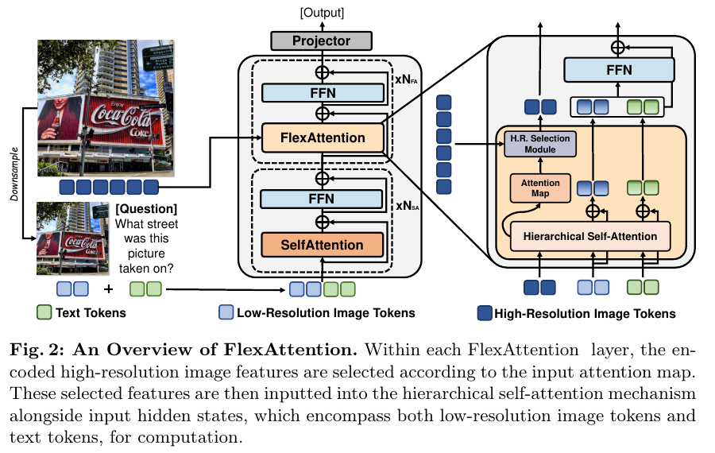
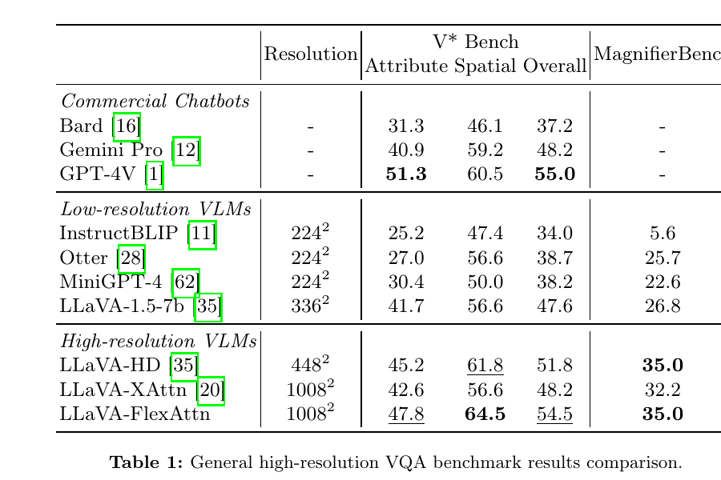
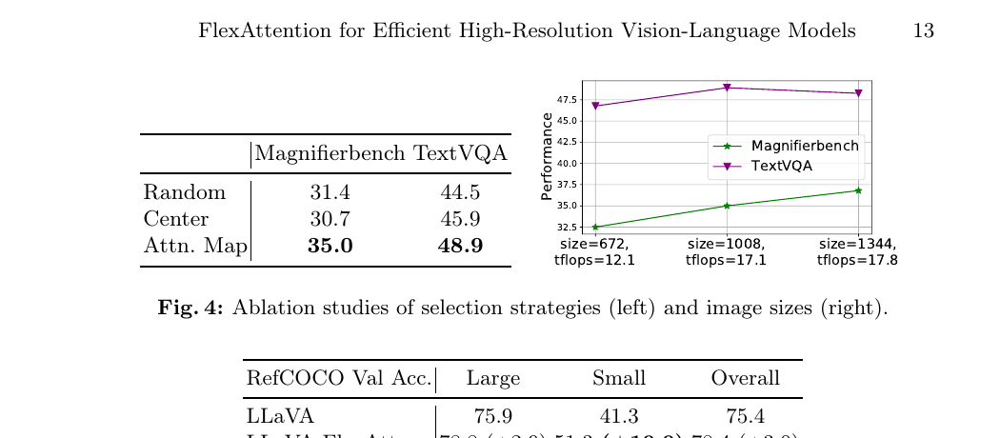
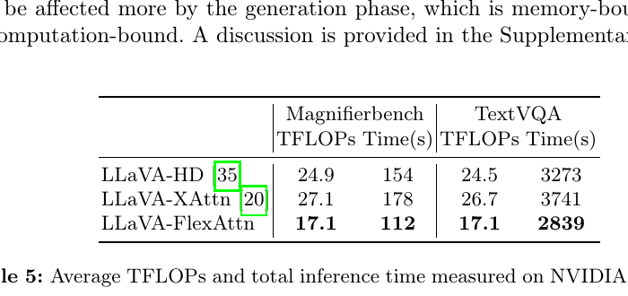

# FlexAttention for Efficient High-Resolution Vision-Language Models

> [!info] 文档关系
> - 文档类型：Paper
> - 领域入口：[README](../README.md)
> - 上位汇总：[Multimodal custom attention](../surveys/multimodal-custom-attention.md)
> - 证据资产：`../assets/papers/flexattention-vlm/`
> - 相关文档：[Selection](../evidence/selection.md)，[Figure inventory](../evidence/figure-inventory.md)

## 0. 资料与配图索引

- 论文：ECCV 2024，arXiv:2407.20228v1；[官方 arXiv](https://arxiv.org/abs/2407.20228)，[ECCV proceedings](https://www.ecva.net/papers/eccv_2024/papers_ECCV/html/4430_ECCV_2024_paper.php)。
- 代码：[UMass-Embodied-AGI/FlexAttention](https://github.com/UMass-Embodied-AGI/FlexAttention/tree/f814be5187e1ae714c8eb8161fcc599c983c3be5)，核验 commit `f814be5187e1ae714c8eb8161fcc599c983c3be5`（2026-07-11）。仓库基于 LLaVA-1.5-7B；训练脚本公开 `zoom_ratio:3#warmup:10#lowres_size:336#highres_size:1008#threshold:48`。
- 名称边界：这里的 FlexAttention 是 2024 VLM 方法名，不等于 PyTorch `torch.nn.attention.flex_attention` API。
- OpenReview：未发现与 ECCV 版本对应的公开 review/rebuttal forum；不能对匿名 reviewer concern 做交叉核验。
- 图表：Figure 2、Table 1、Figure 4、Table 5；页码/bbox/QA 见 [figure inventory](../evidence/figure-inventory.md)。

## 0.1 符号表

| 符号 | 含义 | 作用域 | 形状/单位 | 来源 | 易混点 |
|---|---|---|---|---|---|
| $I_{HR},I_{LR}$ | 高/低分辨率输入图 | sample | image | Sec. 3--4 | $I_{LR}$ 是 downsampled view |
| $f_{HR},f_{LR},f_T$ | 高分辨率、低分辨率、文本 token features | sample | token x $D$ | Sec. 3 | $f_{HR}$ 不全部进 decoder attention |
| $H$ | low-resolution image + text 的 hidden states | layer | $N\times D$ | Sec. 3 | 不含 selected HR token 的 residual stream |
| $f_{SHR}$ | 选中的 high-resolution feature subset | layer | $M\times D$ | Sec. 4.2 | $M\approx10\%$ HR tokens，是经验比例 |
| $Map$ | self-attention probability map | layer/head aggregate | $N\times N$ | Eq. 2 | selection 取与最后 text token 对应的 low-res attention |
| $N_{SA},N_{FA}$ | vanilla self-attention/FlexAttention 层数 | model | integer | Algorithm 1 | warmup layers 与 selection warm-up 不应混称 |
| $T$ | binarization threshold | selector | config dependent | Fig. 3/code | 不是 temperature |

## 0.2 术语与数据流

| 术语 | 本文含义 | 不等于 | 证据 |
|---|---|---|---|
| H.R. selection | 由上一层 attention map 选择对应高分辨率 patch features | 对 full score matrix 做稀疏 mask | Sec. 4.2 |
| hierarchical self-attention | $H$ 作为 query，$[H,f_{SHR}]$ 作为 K/V | 对 $N+M$ token 做完整 self-attention | Eq. 6 |
| attention mask | 由 low-res attention vector reshape/binarize/resize 得到的 selection map | transformer causal/additive mask | Fig. 3 |
| compact/varlen mapping | 本文对现代 kernel 的实现解释 | 论文没有声称使用 FlashAttention varlen | 本文 infra 分析 |

## 1. 问题到方案

高分辨率 VLM 若将所有 patch token 输入 decoder，self-attention 成本随序列长度平方增长；只 downsample 又会丢失小文字和小目标。FlexAttention 保留一个低分辨率全局 residual stream，在前 $N_{SA}$ 层建立语义，之后每层用 attention map 定位相关 low-res patch，只取对应约 10% high-res features作为额外 K/V。这样 text/low-res query 可以读取细节，而 high-res token 不进入 residual query stream。

## 2. 选择公式与 token flow

标准 attention：

$$
Map=\operatorname{softmax}\left(\frac{QK^\top}{\sqrt{d_k}}\right),\quad Q=HW_Q,K=HW_K,V=HW_V.
$$

selector 取最后一个 text query 对 low-res image tokens 的权重，reshape 为 low-res 2D map，normalize/binarize 后 resize 到 high-res grid。记选择函数 $R$：

$$
S_l=R(f_{HR},Map_{l-1};T),\qquad f_{SHR}^{(l)}=\operatorname{Gather}(f_{HR},S_l).
$$

Hierarchical attention 只为 $H$ 构造 query，并为 base/HR 使用独立 K/V projections：

$$
Q=HW_Q,
\quad K_{all}=[HW_K;f_{SHR}W'_K],
\quad V_{all}=[HW_V;f_{SHR}W'_V],
$$

$$
H'=\operatorname{softmax}\left(\frac{QK_{all}^{\top}}{\sqrt{d_k}}\right)V_{all}.
$$

输出 map 为 $N\times(N+M)$；只保留左侧 $N\times N$ 区域供下一层 selector 使用。复杂度为 $O((N+M)ND)$，而把全部额外 token 当 query/key/value 的 self-attention 为 $O((N+M)^2D)$。注意两者都忽略 vision encoder、selection、gather、MLP 与 decode KV 成本。

## 3. 训练与 benchmark 设置

- Base：LLaVA-1.5-7B；低分辨率 336x336，FlexAttention high-res 1008x1008。
- Baselines：LLaVA-HD（重实现，448x448）与 LLaVA-XAttn（将 CogAgent cross-attention 重实现到同一 LLaVA base，1008x1008）。作者重实现提高了可比性，但并非官方 baseline checkpoint。
- 三个高分辨率版本均从 LLaVA-1.5-7B 初始化，用其 finetuning dataset 训练 1 epoch；batch 1152、learning rate $2\times10^{-5}$、cosine scheduler；zero-shot evaluation（Sec. 5.2）。
- High-res benchmarks：V* Bench、MagnifierBench、TextVQA、RSVQA-HRBEN；general：GQA、VQAv2、POPE、RefCOCO、MM-Bench、MME、MM-Vet。
- 仓库最新训练脚本用 6 processes/node、DeepSpeed ZeRO-3 offload；论文没有报告总 GPU 型号/数量、训练 wall-clock、dtype 或能耗，不能推算训练效率。

## 4. 主结果

- Table 1：LLaVA-FlexAttn 在 V* overall 54.5、MagnifierBench 35.0；LLaVA-1.5-7B 为 47.6/26.8，绝对 +6.9/+8.2 pp。摘要的“约 9%”是相对口径的概述，不应写成 +9 pp。
- 与 matched high-res baselines：V* overall 相比 LLaVA-HD 51.8 和 XAttn 48.2 提高 +2.7/+6.3 pp；MagnifierBench 与 HD 同为 35.0，高于 XAttn 32.2。
- Table 2：RSVQA overall 72.7、TextVQA 48.9；base 为 68.4/46.0（TextVQA base table entry 需按原表空缺/行对齐谨慎解读），FlexAttn 高于两种 high-res 重实现。
- Table 3：general benchmark 并非全面提升；RefCOCO +3.5、MM-Bench +1.4，但 MME 1511 -> 1479、MM-Vet 31.1 -> 29.4。论文“保持总体能力”是混合结果，不是全指标无损。

## 5. 消融与技术主张证据矩阵

| 技术点 | 对照/指标 | 结果 | 证据强度 | 判断 |
|---|---|---|---|---|
| attention-map selector | random/center, matched ~10% ratio | Magnifier 35.0 vs 31.4/30.7；TextVQA 48.9 vs 44.5/45.9 | 直接 ablation | 支持动态选择优于固定区域 |
| 1008 resolution | 672/1008/1344 | Magnifier随分辨率升；TextVQA 1008 后饱和；TFLOPs 12.1/17.1/17.8 | sensitivity | 支持 task-dependent sweet spot |
| small-object收益 | RefCOCO >5% vs <=5% object | large +2.9；small +10.0；overall +3.0 | subgroup | 支持收益集中于小目标 |
| hierarchical attention | full high-res / XAttn baselines | quality + TFLOPs | 混杂 | selector、K/V结构与训练一起变化，未独立消融 |
| warm-up vanilla layers | 不同 $N_{SA}$ | 未报告 | none | 必要性未验证 |
| ~10% ratio/threshold | 未给完整 ratio curve | 代码 config +单点 | 弱 | 选择预算敏感性不足 |

## 6. 收益归因

可受控归因的是 attention-map selection 相对 random/center 的 +3.6--4.3 pp（Magnifier）与 +3.0--4.4 pp（TextVQA），以及小目标 subgroup 更受益。完整系统相对 base 的增益同时包含更高分辨率、额外 K/V projections、selector 与 finetuning，不能全归因 selector。TFLOPs 降低主要来自 $M\ll |f_{HR}|$ 与不让 HR token 成为 query；端到端 latency 还取决于 generation length 和 memory bandwidth。

## 7. Hardware 与 runtime 证据

Table 5 在单张 V100 32GB、PyTorch、warm-up + CUDA synchronize 下测总 benchmark time：MagnifierBench 17.1 TFLOPs/112s，对 HD 24.9/154s、XAttn 27.1/178s；TextVQA 17.1/2839s，对 24.5/3273s、26.7/3741s。相对时间：Magnifier 对 HD/XAttn 快 27.3%/37.1%；TextVQA 快 13.3%/24.1%。后者 output 更长、decode 更 memory-bound，因而 FLOPs 减少没有等比例转成 wall-clock。

## 8. Compact/varlen kernel 映射

论文数学对象是 rectangular attention：$Q\in\mathbb R^{N\times d}$，$K,V\in\mathbb R^{(N+M)\times d}$。若现代实现把每个样本的 selected HR tokens gather 成连续 buffer，kernel 输入可表示为 compact K/V + lengths/offsets；这比构造原 HR grid 上的 $L\times L$ dense mask 更合理。批处理可用 per-sample $M_i$ 与 `cu_seqlens`，但必须保证 base token 与 selected token 的 position/projection 语义。

完整成本：

$$
T_{total}=T_{encodeHR}+T_{select}+T_{gather}+T_{attn}(N,N+M)+T_{MLP}+T_{decode}.
$$

论文/仓库没有声称使用 FlashAttention varlen、Triton sparse kernel 或 PyTorch FlexAttention BlockMask。故“compact/varlen”是实现建议，不是已验证代码事实。仓库变更显示新增 `k_proj_hd/v_proj_hd` 权重和 LLaVA training integration，支持独立 HR K/V projection；未取得稳定 CUDA backend telemetry。

## 9. Data types、带宽与异构边界

- 论文未报告训练/inference dtype；不能默认 bf16/fp16。V100 不支持 bf16 tensor core，与现代 Hopper/Blackwell 的收益不可直接外推。
- Selector 的 map normalize/binarize/resize、index extraction 和 gather 应留在 GPU；若把 attention map 拷 CPU 再返回 indices，会引入同步与 PCIe latency。
- Gather 后的 K/V 若不 contiguous，kernel 可能受不规则 HBM read 限制。理想路径是 fused select/pack 或至少按 spatial locality sort indices。
- KV cache：AR decode 时 base K/V 可缓存；每层 selected HR K/V 随 selector 改变，若 query/context 不变可缓存投影后的全部 $f_{HR}K'_V$，但会增加 HBM footprint。论文没有比较 recompute 与 cache。
- 有效带宽 $BW_{eff}=BytesMoved/t$ 需要 profiler bytes/counters；Table 5 只有总时间和 TFLOPs，无法计算 utilization。

## 10. Related Work

| 方法 | 机制 | 优点 | 局限 | FlexAttention 差异 |
|---|---|---|---|---|
| LLaVA-HD | 所有 HR tokens 进入 decoder | 简单 | quadratic query/key work | 只选少量 HR K/V |
| CogAgent/XAttn | hidden queries cross-attend 全 HR feature | HR不进 residual | 每层读取全部 HR K/V | 动态选局部 HR K/V |
| Token Sparse Attention | per-head general token select/gather/scatter | kernel reuse | selector/restore overhead | 只稀疏 HR detail K/V，不drop base stream |
| VMoBA | video block router + varlen attention | 时空 block locality | routing/packing复杂 | image patch selection、低分辨率 attention驱动 |

## 11. OpenReview、代码与 checkpoint

ECCV proceedings 确认 venue，但未发现公开 review/rebuttal。官方仓库核验 commit 提供训练/eval scripts 与模型集成；没有本地 clone 做逐行全仓审计，也未下载 prepared dataset/model weights，因此 checkpoint architecture、实际 dtype、backend、完整 threshold schedule 与 release 文件一致性仍未验证。

## 12. 局限与多模态外推

- Selector 依赖上一层最后 text token 的 attention；多 token reasoning、非文本 query 或 hallucinated attention 可能选错区域。
- 只用约 10% 与单 threshold，缺 selection ratio/层数/heads 的完整敏感性和 oracle upper bound。
- HR encoder 仍处理完整 1008/1344 image，省的是 decoder attention，不是全部视觉计算。
- 基线为作者重实现，且分辨率不完全相同；结果支持系统 trade-off，不是统一 kernel benchmark。
- 视频/音频外推会引入时间一致性：逐层/逐帧 selector 抖动、跨帧 detail persistence、selection metadata 和 KV/cache 会显著增加。论文只把它列为未来方向，没有实验支持。

## 13. 待验证清单

- 固定同一 1008 resolution 比较 full self-attn、full cross-attn、random/center/attention selection。
- 报告 $M/N_{HR}$、selector heads/layer、index locality、gather bytes、attention kernel 与端到端分解。
- 在 A100/H100 上分别测试 eager SDPA、FlashAttention rectangular/varlen 与 fused select-pack。
- 核对 checkpoint config、dtype、训练 GPU/时长和 dataset revision。
- 视频扩展需报告跨帧 selection stability、quality/latency、cache footprint 与 temporal small-object benchmark。
