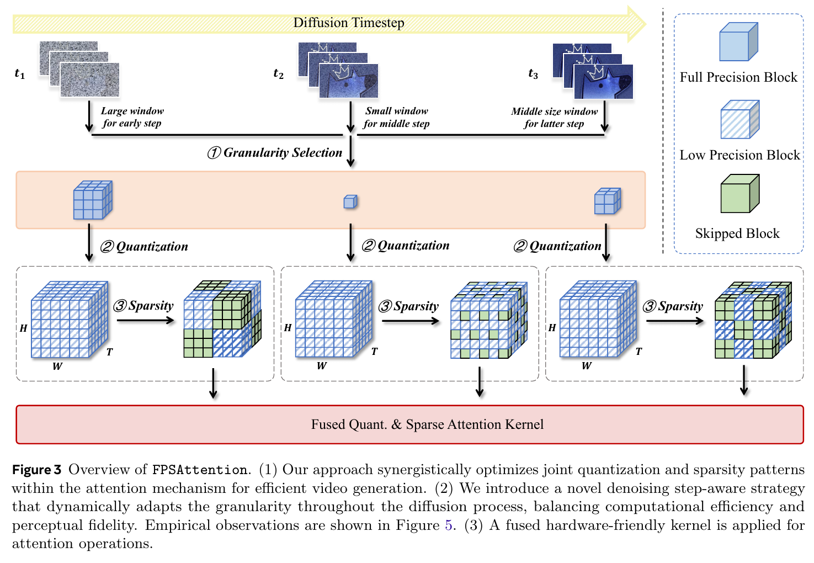
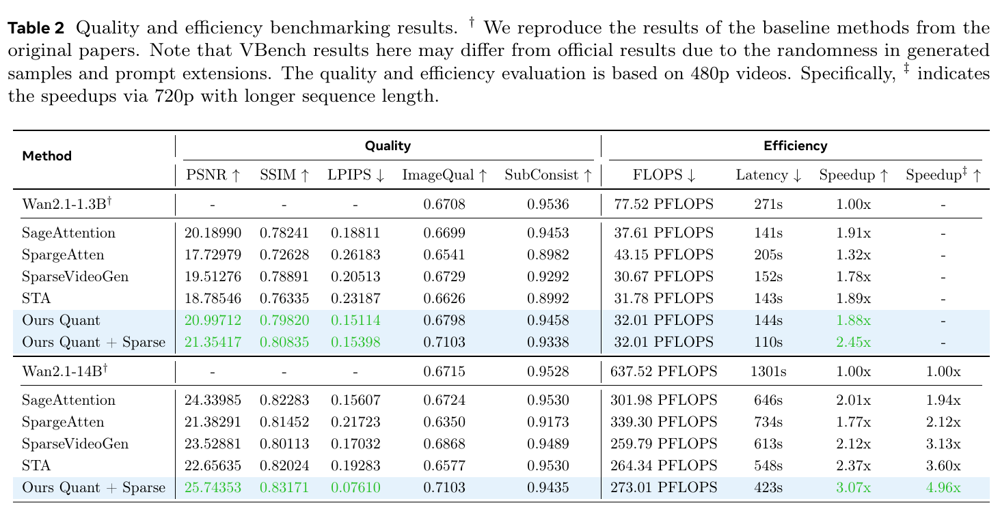

# FPSAttention 精读分析

> [!info] 文档关系
> - 文档类型：Paper
> - 领域入口：[README](../README.md)
> - 上位汇总：[Video generation sparse attention](../surveys/video-generation-sparse-attention.md)
> - 证据资产：[assets/papers/fpsattention](../assets/papers/fpsattention/)

> 资料状态：主证据为本地固定的 arXiv:2506.04648v2 PDF（26 页，2025-06-10）；标题以 PDF 的 “Fast Video Diffusion” 为准，任务包中的 “Fast Video Generation” 是标题变体。正文文本由 `pdftotext -layout` 提取。arXiv source 下载因网络连接失败未取得；论文虽写“Project page and code”，官方项目页截至核验时没有代码链接，故所有实现细节只按论文/附录陈述，不冒充代码核验。原论文 Figure 3 足以承担算法总览，不生成替代图。

## 修订信息

- 当前文档版本：`1.0.0`
- 当前修订 ID：`rev-fpsattention-20260729-initial`
- 当前修订时间：`2026-07-29T16:28:15+08:00`
- 替代版本：无（initial）

| 修订 ID | 文档版本 | 时间 | 修订者 | 类型 | 替代修订 | 迁移问题/解析 | 变更摘要 | 原因 | 影响位置 | 依据 | 对结论影响 |
|---|---|---|---|---|---|---|---|---|---|---|---|
| `rev-fpsattention-20260729-initial` | `1.0.0` | `2026-07-29T16:28:15+08:00` | `review_fpsattention` | initial | 无 | 无 | 首次建立 PDF、文本、两张证据图、方法/实验/Infra 审查与交付清单 | `过程任务包` 初始交付 | `本文`；`Figure inventory`；`figures/` | arXiv:2506.04648v2 PDF、官方项目页、任务包 | material |

## 0. 资料与配图索引

- 论文：`arXiv PDF`，SHA-256 见交付清单。
- 官方页面：https://arxiv.org/abs/2506.04648；项目页：https://fps.ziplab.co/（核验显示 NeurIPS 2025 Spotlight）。
- 源码/LaTeX：未取得；直取 `https://arxiv.org/e-print/2506.04648` 连接失败。
- 开源代码：论文首页称项目页含 code，但项目页和实验室 publication 页面只提供 Paper/Project Page；没有可固定 Git commit。
- OpenReview：发现 forum ID `T62TYoF8R3`，但页面被浏览器验证阻断；公开评审内容未取得。
- 提取文本：`extracted_text/paper-layout.txt`。
- 机制图：`../assets/papers/fpsattention/fig3-overview-caption.png`；结果/系统表：`../assets/papers/fpsattention/table2-quality-efficiency-caption.png`。两图均含完整 caption，逐图 QA 见 `Figure inventory`。

## 0.1 术语与符号解释

### 0.1.1 术语表

| 术语 | 本文含义 | 别名 | 不等于/易混项 | 证据来源 |
|---|---|---|---|---|
| FPSAttention | 把 FP8 量化、规则 3D tile 稀疏和去噪步调度共同训练，并用融合 kernel 执行的注意力模块 | FP8 + Sparsity Attention | 不是把任意 PTQ 和任意稀疏 mask 在推理时拼接 | Abstract；§3；Fig. 3 |
| 3D tile | 在时间、高、宽三个轴上成块组织的连续 token 区域，同时作为 Q/K 缩放与稀疏计算单元 | tile/block | 不等于逐 token 或任意不规则稀疏 | §3.2；Fig. 4 |
| STA | Sliding Tile Attention：query tile 只访问局部 key-tile 窗口 | tiled local attention | 不等于逐 token sliding window | §3.1，Eq. 2–3 |
| denoising step-aware schedule | 按 early/mid/late 去噪阶段切换 tile 粒度和窗口大小 | $S(t)$ | 不是数据依赖的逐样本动态路由；论文给的是分段时间表 | §3.3，Eq. 6 |
| kernel speedup | 只计注意力算子相对 BF16 的加速 | operator speedup | 不等于完整视频生成 E2E speedup | Table 1 |
| E2E speedup | 从基线生成延迟到完整 FPSAttention 生成延迟的比值 | end-to-end speedup | 不能仅由 FLOPs 比例推出 | Table 1–2 |
| FlexAttention/Triton path | 附录声称用 `mask_mod`/`score_mod` 表达稀疏并由 Triton 编译的实现路径 | fused kernel path | 没有公开源码，不能确认具体 Hopper 指令、tile、累加和 fallback | Appendix A–B |

### 0.1.2 符号表

| 符号 | 含义 | 性质 | 作用域/索引 | 单位/取值 | 来源 | 易混点 |
|---|---|---|---|---|---|---|
| $L=T H W$ | 视频 token 序列长度 | author-defined | 单样本 | token 数 | §3.1 | $T,H,W$ 是 token 网格尺寸，不必等于原视频像素/帧数 |
| $Q,K,V$ | 注意力 query、key、value 激活 | author-defined | $L\times d$ | 激活值 | §3.2 | 三者量化粒度不同 |
| $T_u$ | 第 $u$ 个 3D tile | author-defined | tile index $u$ | $(T_t,T_h,T_w)$ | §3.1–3.2 | 与时间维 $T$ 区分 |
| $s_u^Q,s_u^K,s_j^V$ | Q/K 每 tile、V 每 channel 的 FP8 缩放因子 | author-defined | tile/channel | 激活幅值/FP8 最大幅值 | Eq. 4；§3.2 | Eq. 1 写乘 scale、Eq. 4 又像除数约定，代码不可得，具体 API convention 有歧义 |
| $M_{\mathrm{FP8\_max}}$ | 所选 FP8 格式可表示的最大幅值 | author-defined | 全局格式参数 | E4M3/E5M2 相关 | Eq. 4 | 论文未明确实验到底选 E4M3 还是 E5M2 |
| $\mathcal W(u)$ | query tile $u$ 能访问的 key-tile 集合 | author-defined | per tile | tile 集合 | Eq. 2 | 窗口维度与 tile 维度在式中混合，正文称“tile units” |
| $g(t)$ | 去噪步 $t$ 的量化 tile 粒度 | author-defined | per step regime | 3D tile size | Eq. 6 | “更小更细”，不是位宽 |
| $W(t)$ | 去噪步 $t$ 的稀疏窗口 | author-defined | per step regime | 3D window size | Eq. 6 | 越大越稠密 |
| $\alpha_1,\alpha_2$ | early/mid/late 的归一化切分点 | author-defined | global schedule | $0<\alpha_1<\alpha_2<1$ | §3.3 | 具体实验数值未在正文核心表中清晰给出 |
| $R_{\mathrm{E2E}}$ | 基线延迟/方法延迟 | analysis-derived | 每模型/分辨率 | 倍数 | 本文依据 Table 2 | 与论文表格的 speedup 列同义，用于复核 |

## 1. 论文基本信息

- 作者：Akide Liu 等；arXiv:2506.04648v2；官方项目页标注 NeurIPS 2025 Spotlight。
- 研究对象：Wan2.1 1.3B 与论文表述为 14B/附录为 13B 的模型（命名不一致）。
- 核心问题：如何让视频 DiT 的 3D 双向注意力同时吃到低精度和结构化稀疏的收益，而不让两类误差相互放大。
- 关键约束：需要训练/微调；主要速度证据来自 NVIDIA H20/Hopper；当前只在 Wan2.1 验证。

## 2. 研究动机与问题—方案闭环

### 2.1 出发点与背景痛点

作者指出高分辨率长视频的注意力是 $O(N^2)$，在 Wan2.1 推理中可占超过 70% 时间；Wan2.1-14B 在 H20 上生成 5 秒视频约需 2.5 小时（Introduction）。单独 FP8 降低数据宽度但只给 1.84× kernel / 1.26× E2E；单独 STA 跳过 tile 可给 5.15× / 3.60×。研究目标不是再发明一种独立压缩，而是让这两条路线共同训练、共同按 tile 执行。

### 2.2 现有方案为何不够

| 现有方案/做法 | 可观察失败 | 具体场景 | 例子来源 | 根因 | 为什么简单修补仍不够 | 证据 |
|---|---|---|---|---|---|---|
| 训练后直接把 FP8 与稀疏 mask 拼接 | 总 VBench 0.8019→0.6325（-21.1%），Human Action 0.772→0.020、Multiple Objects 0.6091→0 | 同一 Wan 1.3B 上，训练免费 Q+S 在复杂语义指标近乎失效，而联合训练为 0.8160 | paper-provided | 量化扰动改变注意力分数，稀疏选择又可能删除被扰动后仍关键的连接；模型从未适应联合误差 | 只减小量化误差或扩大窗口会把算力花回所有位置，仍没有学习联合误差下的补偿 | Appendix C, Table 5 |
| 全步骤固定 tile/窗口 | 中间去噪阶段误差更敏感 | 早/晚阶段可用粗粒度和高稀疏，中段需要细粒度和密窗口 | paper-provided | 去噪各阶段对近似误差的纠错余量不同 | 全程采用中段最保守设置会牺牲早晚阶段速度；全程激进会伤中段质量 | §3.3, Fig. 5 |
| 不规则逐 token 稀疏或与量化粒度不一致 | FLOPs 降了但难转成 wall-clock 收益 | 稀疏索引、加载和量化 scale 在不同粒度上切换 | reviewer-created：本文构造的说明例，不是论文实验 | GPU 以规则 tile 计算/搬运，非规则模式增加控制和访存开销 | 仅提高稀疏率不能消除索引/数据重排；必须让稀疏块、scale 与 kernel tile 对齐 | §3.1–3.4 |

### 2.3 目标问题与成功标准

成功需同时满足：相对 BF16 获得 kernel 与 E2E 延迟下降；在 VBench/PSNR/SSIM/LPIPS 上保持质量；把稀疏真正落实为被跳过的规则块；训练稳定。论文不解决跨非 Wan 架构泛化、无训练部署、非 FP8 硬件等价加速，也没有公开实现以证明复现性。

### 2.4 核心方案如何解决并优化问题

| 原问题 | 方案 | 改变的变量/行为 | 因果机制 | 预期指标 | 证据 | 判断 |
|---|---|---|---|---|---|---|
| FP8 与稀疏误差错配 | Q/K 每 3D tile 独立 scale，稀疏也按相同 tile | scale 域与被保留/跳过块对齐 | 局部动态范围减少量化误差，规则块避免不规则稀疏开销 | 质量、kernel latency | §3.2；Table 3；Table 5 | partially-supported |
| 不同去噪步敏感性不同 | $S(t)=[g(t),W(t)]$ 三阶段调度 | 中段用更细 $g$、更密 $W$ | 把计算预算集中到误差敏感阶段 | 质量/速度折中 | Fig. 5；Eq. 6；Table 3–4 | partially-supported |
| 理论 FLOPs 难变延迟 | fused quant+sparse attention kernel | 只物化/计算 $M|\mathcal W(u)|$ 密集块，融合量化/稀疏/反量化 | 减少无效块、HBM 往返和 kernel launch | kernel/E2E latency | §3.4；Table 1–2 | supported at measured-system level；实现细节未核验 |
| 联合近似导致训练失配 | QAT/联合训练 | 权重适应训练时注入的联合误差 | 学会补偿量化噪声与局部连接限制 | VBench、loss | Fig. 7；Table 5 | supported for whole recipe，组件不可完全拆分 |

### 2.5 完整因果链与证据闭环

背景是视频注意力占时高且二次增长；直接拼接 FP8 与稀疏会在复杂语义维度灾难性退化；论文把根因归为两类近似缺少共同优化。FPSAttention 用同一 3D tile 作为 Q/K scale 与稀疏块，按去噪阶段调节 tile/窗口，并在训练中暴露联合误差；融合 kernel 再把规则块稀疏落实为少算和低精度 Tensor Core 路径。Table 5 直接支持“朴素组合失败、联合训练完整方案恢复”；Table 3–4 支持 tile/window 的折中；Table 1–2 支持系统速度。但没有“仅统一粒度”“仅 step-aware”“仅融合 kernel”的完全匹配消融，因而完整收益不能逐组件因果分解。

## 3. 核心贡献

1. 统一 3D tile 量化与结构稀疏的粒度（§3.2）。
2. 用 early/mid/late 去噪阶段表选择量化粒度和稀疏窗口（§3.3）。
3. 论文报告面向 Hopper 的融合 attention kernel，将 7.09× operator 加速转成 4.96× E2E（Table 1）。
4. 给出朴素 Q+S 与联合训练的强反例（Appendix Table 5），但仍缺细粒度组件消融。

## 4. 研究方法

### 4.1 方法总览

一个去噪步进入时，先根据 $t$ 选 tile 粒度和邻域窗口；Q/K 切成 3D tile 后分别算 scale 并转 FP8，V 按 channel 转 FP8，局部窗口以 block mask 决定哪些 QK tile 真正计算；attention 聚合后回到 BF16/FP16。训练使用相同 schedule，使权重适应这套近似。

> 原论文 Figure 3（PDF 截图裁剪，完整 caption）：展示输入去噪阶段、粒度选择、量化、稀疏块以及融合 kernel。它清楚区分了随时间变化的选择与部署执行，可作为 reader-usable algorithm overview。

### 4.2 组件级设计动机与证据

| 设计项 | why 状态 | 原文证据 | 具体问题 | 因果机制 | 替代/权衡 | 验证 | 判断 |
|---|---|---|---|---|---|---|---|
| Q/K 3D tile-wise scale | author-stated | §3.2, Fig. 4 | 全局/通道 scale 不能兼顾局部动态范围与 GPU tile | 每 tile 限制 outlier 影响并对齐 block | per-token 更准但 scale/访存开销高；更大 tile 更快但误差大 | Table 3 sensitivity | partially supported |
| V channel-wise、P tensor-wise FP8 | author-stated（V 细粒度关键）；P 追随 SageAttention2 | §3.2 | V 对质量敏感、P 需低开销 | V 保留通道统计，P 用固定 scalar 448 | 更细 P/V scale 更准但开销高 | 无独立消融 | plausible/unverified |
| STA block mask | author-stated | Eq. 2–3 | 全注意力二次复杂度 | 只计算局部 $M|\mathcal W(u)|$ 密块 | 小窗口更快但丢远程关联 | Table 4 sensitivity | supported as trade-off |
| step-aware $S(t)$ | author-stated | §3.3, Fig. 5 | 全步骤误差容忍不同 | 中段保守、早晚激进 | 连续/数据依赖调度可能更灵活但复杂 | Fig. 5 间接；无单独 on/off | partially supported |
| 联合 QAT | author-stated | Introduction；Table 5 | 训练免费组合严重退化 | 模型适应联合误差 | 增加 7 天级分布式训练与数据依赖 | Table 5 replacement baseline；Fig. 7 | supported for bundle |
| Hopper fused kernel | author-stated | §3.4；Appendix B | 稀疏/量化中间写回与 launch 开销 | tile 并行、Tensor Core、Triton 融合 | 硬件锁定、旧 GPU 收益减弱 | Table 1–2 system measurement；无代码 | partially supported |

### 4.3 关键公式

$$
s_u^Q=\frac{\max_{(i,j)\in T_u}|Q_{i,j}|}{M_{\mathrm{FP8\_max}}},\qquad
s_u^K=\frac{\max_{(i,j)\in T_u}|K_{i,j}|}{M_{\mathrm{FP8\_max}}}.
$$

**这条公式在算什么？** 它为每个 Q/K 3D tile 计算把最大绝对值压入 FP8 可表示范围的局部缩放。

**怎么读？** 用这个 tile 的峰值除以 FP8 最大幅值，得到该 tile 自己的量化步尺度。

**输入与输出。** 输入是 tile 内的 Q/K 值和格式上限；输出是 $s_u^Q,s_u^K$。

**变量在这里各做什么？** $T_u$ 限定局部块；$Q,K$ 是被量化激活；$M_{\mathrm{FP8\_max}}$ 决定动态范围；$s_u^Q,s_u^K$ 分别缩放 Q/K。

**直觉。** tile 越含大 outlier，scale 越大；按 tile 而非全张量可避免一个远处 outlier 降低所有位置精度。

**边界。** 论文列举 E4M3/E5M2，却未确认实际格式；Eq. 1 的乘 scale 写法与 Eq. 4 的除数式 convention 有表述歧义，源码不可得。

**小例子。** 本文构造：若 tile 最大值 224、格式上限 448，则 $s=0.5$；另一 tile 最大值 22.4 可用 $s=0.05$，不会被前一 tile 的 outlier 牵连。

$$
\mathcal W(u)=\left\{v:\|c_u-c_v\|_\infty \le
\left(\frac{W_t}{2T_t},\frac{W_h}{2T_h},\frac{W_w}{2T_w}\right)\right\}.
$$

**这条公式在算什么？** 它决定 query tile $u$ 可以访问哪些 key tiles。

**怎么读？** 只保留三维中心距离都落在局部窗口内的 tile。

**输入与输出。** 输入是 tile 中心、tile 尺寸与窗口尺寸；输出是邻域集合 $\mathcal W(u)$。

**变量在这里各做什么？** $c_u,c_v$ 是中心；$T_t,T_h,T_w$ 是 tile 尺寸；$W_t,W_h,W_w$ 是窗口范围。

**直觉。** 缩小任一窗口轴会少算更多块，但也更可能剪掉长程时空联系。

**边界。** 是规则局部性假设，不会按内容找远距离高相关 token。

**小例子。** 本文构造：若窗口只覆盖相邻一圈 tile，则更远对象关系直接不进入 QK 乘法，即使其语义相关。

$$
S(t)=[g(t),W(t)]=
\begin{cases}
[g_{\mathrm{coarse}},W_{\mathrm{sparse}}],&t\le t_1,\\
[g_{\mathrm{fine}},W_{\mathrm{dense}}],&t_1<t\le t_2,\\
[g_{\mathrm{intermediate}},W_{\mathrm{medium}}],&t>t_2.
\end{cases}
$$

**这条公式在算什么？** 它把去噪步映射成量化粒度与稀疏窗口的成对配置。

**怎么读？** early 激进压缩，mid 保守，late 取中间值。

**输入与输出。** 输入 $t,t_1,t_2$；输出 $g(t),W(t)$。

**变量在这里各做什么？** $g$ 控制 scale 覆盖范围；$W$ 控制计算块数；阈值把过程切成三段。

**直觉。** 把更多计算留给 Figure 5 显示最敏感的中段。

**边界。** 是手工/离线选择的分段 schedule，不是每个 prompt 自适应；阈值/配置迁移到其他模型的泛化未验证。

**小例子。** 本文构造：50 步采样可按阈值划成 10/30/10 步；中间 30 步用细 tile 和密窗口，但实际论文阈值不能由正文复原。

## 5. 关键结论与证据矩阵

### 5.1 主结果

> 原论文 Table 2（完整 caption）：Wan2.1-1.3B 480p 从 271s 降至 110s（2.45×）；Wan2.1-14B 480p 从 1301s 降至 423s（3.07×），720p 长序列另报 4.96×。表中 FLOPs 273.01/637.52≈42.8%，但 E2E 为 32.5%，说明非 attention 部分和运行开销限制收益。

### 5.2 技术点—证据矩阵

| 技术点 | 声称收益 | 实验 | 受控性 | 证据强度 | 结论 |
|---|---|---|---|---|---|
| 联合训练优于 training-free Q+S | 避免质量崩溃 | Appendix Table 5 | 三组 matched，但联合方法还含 schedule 等多改动 | replacement baseline，bundle | 直接支持完整 recipe，不能分组件 |
| tile size | 质量/硬件折中 | Table 3 | 同模型改尺寸 | sensitivity | 支持折中；未报告每项 kernel latency |
| window size | 速度/质量折中 | Table 4 | 同模型改窗口 | sensitivity | 直接显示 (6,6,1) 5.16× kernel 与质量变化 |
| step-aware schedule | 中段更保守 | Fig. 5；Eq. 6 | 误差观测但无 schedule on/off | mechanism visualization | 间接支持 |
| V channel-wise / P tensor-wise | 保质量/低开销 | 无独立消融 | 否 | none | 未验证 |
| Hopper fused kernel | wall-clock 加速 | Table 1–2 | 与 BF16/FP8/STA 比较，但 kernel 细节不可查 | measured system, confounded | 速度事实支持；具体微架构归因不完全可核验 |

### 5.3 收益归因

- FP8 单独：Table 1 kernel 1.84×，E2E 1.26×。
- STA 单独：5.15×，E2E 3.60×。
- FPSAttention：7.09×，E2E 4.96×。相对 STA 的 kernel 额外提升约 $7.09/5.15=1.38×$，E2E 约 $4.96/3.60=1.38×$；这是桥接 baseline 的粗分解，不是方差分解。
- Table 2 的 “Ours Quant” 与 “Ours Quant+Sparse” 在 1.3B 下 144s→110s（额外 1.31×）且 FLOPs 同报 32.01 PFLOPS，暴露出表格 FLOPs/命名口径可能不足以解释稀疏实际少算，需代码或 profiler 澄清。

## 6. Related Work 对比

| 类别 | 机制 | 优点 | 局限 | 与本文关系 |
|---|---|---|---|---|
| SageAttention | training-free INT8/低精 attention | 无需训练 | 质量与速度有限 | FPSAttention改用 FP8 QAT |
| SparseVideoGen/SpargeAttn | 内容/分数驱动稀疏 | 可降低计算 | 不规则性或训练免费组合误差 | FPSAttention强调规则 3D tile 与联合训练 |
| STA | 固定局部 3D sliding tile | 硬件友好 | 单独不处理量化/步敏感 | FPSAttention直接继承其 tile 局部性 |
| FlashAttention/FlexAttention | IO-aware dense/block mask kernel 表达 | 易融合与 tile 化 | 不自动决定合理近似 | 本文将其作为执行底座而非质量机制 |

## 7. OpenReview 交叉核验

发现公开 forum ID `T62TYoF8R3`，但 OpenReview 返回浏览器验证页面，无法取得 reviews、meta-review、decision 或 rebuttal。官方项目页已标注 NeurIPS 2025 Spotlight，可核验录用/展示状态，但不能替代公开评审内容。因此本审查不引用 reviewer 观点，novelty、消融和复现性判断仅来自论文。

## 8. Infra 需求分析

### 8.1 数据类型与实际少算路径

Q/K 按 3D tile FP8；V 按 channel FP8；P 用固定 scalar 448 的 tensor-wise FP8；输出回 BF16/FP16（§3.2）。论文没有明确 E4M3/E5M2、累加精度、scale 数据类型、P/V 是否发生额外 layout transform。稀疏 mask 让 kernel 只执行 $M|\mathcal W(u)|$ 个 dense blocks；绿色 skipped blocks 是“少算”而非零值乘法的概念证据，但缺源码/profiler 确认实际 materialization。

### 8.2 算力、延迟与 Amdahl 边界

对 E2E：

$$
R_{\mathrm{E2E}}=\frac{T_{\mathrm{baseline}}}{T_{\mathrm{method}}}.
$$

**这条公式在算什么？** 用相同任务的基线总延迟除以方法总延迟，复核 E2E speedup。

**怎么读？** 生成时间缩短到原来的几分之一，就得到几倍加速。

**输入与输出。** 输入两次端到端延迟；输出 $R_{\mathrm{E2E}}$。

**变量在这里各做什么？** $T_{\mathrm{baseline}}$ 是 BF16 总时间，$T_{\mathrm{method}}$ 是 FPSAttention 总时间。

**直觉。** attention kernel 再快也受 VAE、text encoder、其他 DiT 层和 launch/sync 限制。

**边界。** 必须同分辨率、序列、硬件、采样步；Table 2 将 480p 主表与 720p ‡ speedup 并列，不能混算。

**小例子。** 1.3B 480p：$271/110=2.46×$，与表中 2.45× 的舍入一致。

### 8.3 显存、带宽与互联

FP16/BF16→FP8 令 Q/K/V 原始载荷理论减半，但需额外 scale 和 mask/index。论文没有 bytes moved、HBM 峰值或 profiler，不能计算 effective bandwidth/utilization。融合 attention/稀疏/反量化可减少中间张量 HBM 往返，这是机制推断而非测量事实。

训练环境：每节点 192 CPU core、960GB RAM、8×H20 96GB，InfiniBand；1.3B 用 16 nodes、13B 用 64 nodes，约 7 天/配置（Appendix B）。训练用 FSDP、gradient checkpointing；13B sequence parallel degree 4（Table 8）。论文未给 all-reduce/all-to-all 流量或并行效率。

### 8.4 异构与部署

CPU 负责数据预处理/调度的细节未报告；核心执行假设 Hopper/Ada 的 FP8 Tensor Core 与 Triton/FlexAttention。旧 GPU 可运行但 FP8 加速减弱（Appendix G）。没有 NPU 路径、CPU fallback、CUDA Graph、batch scheduler 或多请求 serving 证据。

## 9. 代码/配置对照

官方代码未公开或未从官方页面定位，commit 不可得。附录伪代码称 `mask_mod(b,h,q,k)` 决定局部 tile、`score_mod` 为 identity，调用 FlexAttention；Appendix B 又称融合 kernel 经 Triton 编译。两者说明设计意图，但不能确认：

- 实际 FP8 format、scale/accumulator dtype；
- mask 是预计算 block map 还是运行时谓词；
- Hopper 用了哪些 TMA/WGMMA、persistent scheduling 或 warp specialization；
- skipped blocks 是否完全避免 QK/PV 计算及其索引开销；
- 非 Hopper fallback 和数值一致性。

## 10. 优点、局限与证据闭环

### 优点

- Table 5 把“朴素组合为何失败”量化得非常具体。
- 同时报告 kernel 和 E2E，避免仅以 FLOPs 冒充体验速度。
- Figure 3、Eq. 6、Table 3–4 把算法粒度、时间调度和硬件映射连成闭环。

### 局限

- 只验证 Wan2.1，且 14B/13B 命名不一致。
- 需要大规模私有数据与 16–64 节点、约 7 天训练，不是轻量 training-free 部署。
- 关键组件被捆绑；step schedule、V/P 量化、融合 kernel 缺独立 on/off。
- Table 2 的 FLOPs 口径和稀疏增益存在需要 profiler 澄清之处。
- 无代码/源码快照、OpenReview 内容，复现性和审稿争议无法交叉核验。

### Evidence loop

动机（attention >70%）→ 失败（Table 5 training-free -21.1%）→ 机制（统一 tile + step schedule + QAT + fused kernel）→ changed state（FP8 local scales、规则 block skip、阶段预算）→ 测量（Table 1–4、5、Fig. 5/7）→ 结论（完整 recipe 在 H20/Wan 上快且质量保持）→ 边界（组件归因、代码、跨架构/硬件泛化未证）。该 loop 通过，但结论范围必须限定到论文测试条件。

## 11. 研究启发

- 最有价值的可复现实验是固定模型/数据，做 full factorial：tile alignment、schedule、QAT、kernel 各自 on/off。
- profiler 应分别报告 QK/PV FLOPs、HBM bytes、mask construction、scale reduction 和 kernel launch。
- 将三段 schedule 改为受预算约束的连续可学习策略，并检验跨模型迁移。

## 12. 解读问题/待验证清单

1. 实际 FP8 是 E4M3 还是 E5M2，scale 与 accumulator dtype 是什么？
2. Eq. 1 与 Eq. 4 的 scale convention 如何在实现中统一？
3. Table 2 中 Quant 与 Quant+Sparse FLOPs 同为 32.01 PFLOPS 的统计口径是什么？
4. 每个 Hopper 优化分别贡献多少，非 Hopper fallback 如何？
5. $S(t)$ 的阈值和配置是否能迁移到 Wan 以外架构？
6. 私有训练数据和 7 天训练是否是质量恢复的必要条件？

## 13. 一句话总结

FPSAttention 的核心价值不是简单叠加 FP8 与稀疏，而是把训练误差、3D tile 粒度、去噪阶段预算与 Hopper kernel 同时对齐；论文在 H20/Wan 上给出强速度和质量证据，但组件级归因、精确 FP8/累加路径和可复现实现仍未公开。
