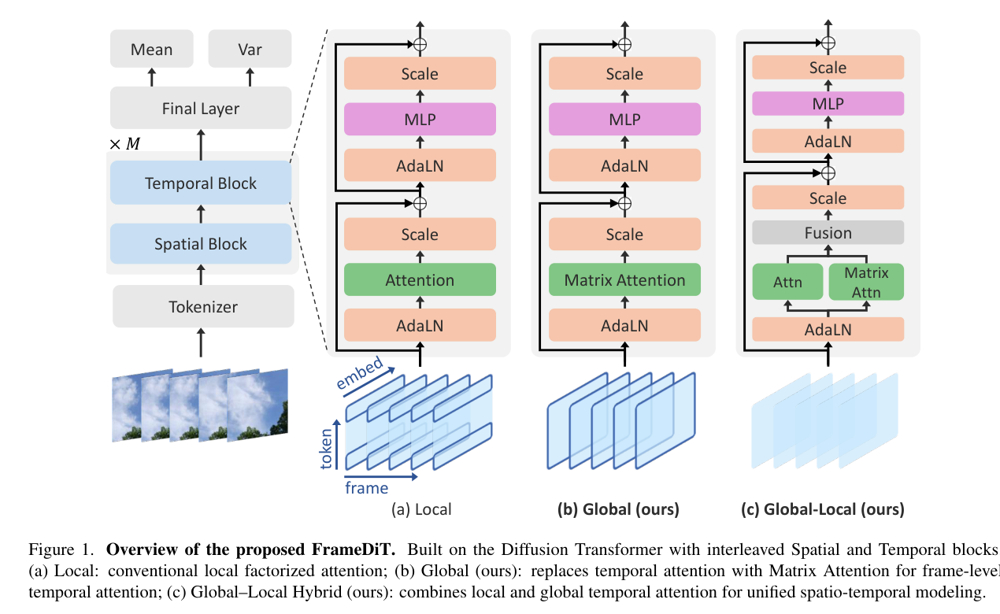
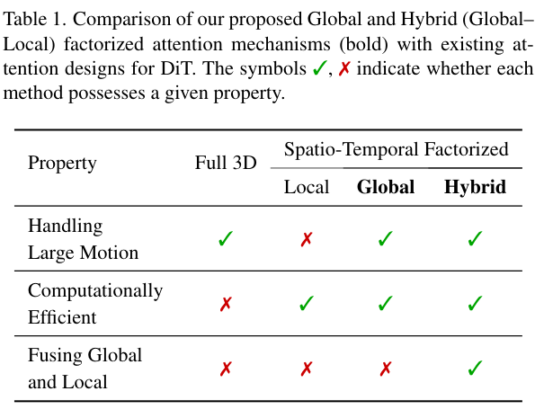
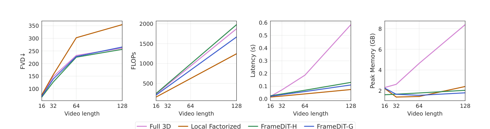

---
tags:
  - paper
  - collection/custom-attention
  - domain/ai-infra
  - status/deep-review
  - topic/video-diffusion
  - method/matrix-attention
document_type: paper
domain: custom_attn
collection: Custom Attention
review_status: deep-review
canonical: true
---

# FrameDiT 精读分析

> [!info] 文档关系
> - 文档类型：Paper
> - 领域入口：[README](../README.md)
> - 上位汇总：[Multimodal custom attention](../surveys/multimodal-custom-attention.md)
> - 证据资产：`../assets/papers/framedit/`
> - 相关文档：[Figure inventory](../evidence/figure-inventory.md)

> 资料状态：已重新核验 arXiv `2603.09721v2` PDF 与 LaTeX source、官方 GitHub commit `359bd123bf077ffd197d3e059422f4bf309bc050`、配置与关键实现。三张嵌入图均为 v2 PDF 180 DPI 裁剪，包含单一编号对象和完整 caption，并通过 contact-sheet 与逐图原分辨率 QA。未发现公开 OpenReview 评审；官方 FrameDiT checkpoint 未发布。

## 修订信息

- 当前修订 ID：`rev-framedit-obsidian-properties-20260731`
- 当前文档版本：`1.0.2`
- 当前修订时间：`2026-07-31T10:00:00+08:00`
- 替代版本：`rev-framedit-affiliation-backfill-20260730` / `1.0.1`

| 修订 ID | 文档版本 | 时间 | 修订者 | 类型 | 替代修订 | 迁移问题/解析 | 变更摘要 | 原因 | 影响位置 | 依据 | 对结论影响 |
|---|---|---|---|---|---|---|---|---|---|---|---|
| `rev-framedit-a2-initial` | `1.0.0` | `2026-07-25T14:15:58+08:00` | `delegated-paper-review-agent` | `initial` | 无 | 无 | 从 v2 PDF/source、官方代码与重新 QA 的视觉证据建立完整单篇精读交付 | `framedit-a2` task packet 与 delegated contract | 全文及同目录审计工件 | `task_packet.yaml`；`source_verification.md`；`code_checkpoint_verification.md` | material |
| `rev-framedit-affiliation-backfill-20260730` | `1.0.1` | `2026-07-30T23:30:00+08:00` | `/root` | `metadata-update` | `rev-framedit-a2-initial` / `1.0.0` | 无 | 补充作者—机构元数据与角色证据边界 | 统一回填 affiliation 交付字段 | `作者与机构` | 论文 PDF 标题页、机构编号与角色脚注 | none：不改变方法、实验与归因结论 |
| `rev-framedit-obsidian-properties-20260731` | `1.0.2` | `2026-07-31T10:00:00+08:00` | `/root` | `metadata-update` | `rev-framedit-affiliation-backfill-20260730` / `1.0.1` | 无 | 增加 Obsidian YAML Properties 与层级标签 | 全量 canonical Paper 标签补齐 | 文件头 YAML frontmatter | 已验证的 ICML 2026 标签 schema；仓库覆盖矩阵 | none：不改变论文分析与证据结论 |

## 0. 资料与配图索引

- 论文：`paper.pdf`，arXiv v2，16 页，SHA-256 见 `source_verification.md`。
- LaTeX/source：`source/arxiv_source.tar`；解包内容在 `source/tex/`。
- 开源代码：`code/FrameDiT/`；remote `https://github.com/minhkhoale/FrameDiT`；commit `359bd123bf077ffd197d3e059422f4bf309bc050`。
- OpenReview：未发现公开 forum/review/rebuttal，检索审计见 过程侧公开评审记录。
- 提取文本：`extracted_text/full_text.clean.txt`；页级文本在 `extracted_text/page_*.clean.txt`。
- Figure/Table 清单与 bbox：[Figure inventory](../evidence/figure-inventory.md)。
- 机制证据：Table 1 `../assets/papers/framedit/table1_attention_design_tradeoffs_caption.png`；Figure 1 `../assets/papers/framedit/fig1_matrix_attention_architecture_caption.png`。
- 结果/系统证据：Figure 3 `../assets/papers/framedit/fig3_scaling_video_length_caption.png`。
- AI 生成分析示意图：`skipped-with-reason`。本机已安装的 `openrouter-icu-image` CLI 仅提供 prompt-only `generate` 与图片 `edit`，没有 `paper-deep-review` 强制要求的 `responses-doc --input-file analysis.md` 文档输入路径；为避免脱离全文生成或把 Markdown 错当图片编辑输入，未生成替代图。

## 0.1 术语与符号解释

### 0.1.1 术语表

| 术语 | 本文含义 | 别名 | 不等于/易混项 | 证据来源 |
|---|---|---|---|---|
| Matrix Attention | 把每帧 token-by-channel 矩阵先经双侧 MatrixLinear 变为帧级 Q/K/V，再沿帧轴 `T` 做 dense attention | frame-level temporal attention | 不是 token-level sparse mask，也不是近似线性 attention | Sec. 3.1, Eq. (4)–(9)；`models/framedit_g.py:97-275` |
| MatrixLinear | 实现 $U^\top zW+B$ 的双侧线性映射；$U$ 聚合/重组 token 行，$W$ 投影 channel 列 | matrix-native projection | 不是单一 `nn.Linear(D,D)`；也不等于卷积 pooling | Sec. 3.1；`models/framedit_g.py:97-167` |
| Local Factorized Attention | 先帧内 spatial attention，再对相同空间位置跨帧 temporal attention | local temporal branch, LF-DiT | “local”指空间位置对齐约束，不是 causal/local window 的泛称 | Sec. 1, 2.2；Appendix theoretical proof |
| Full 3D Attention | 把 $TN$ 个时空 token 联合做 dense self-attention | Full3D-DiT | 不是 FrameDiT 的 global frame attention | Sec. 1；Table 1 |
| FrameDiT-G | temporal block 仅使用 Matrix Attention 的 global-only 变体 | Global | 不包含 local temporal branch | Sec. 3.2；`models/framedit_g.py` |
| FrameDiT-H | local temporal 与 global Matrix 两分支并行，默认 concat + linear 融合 | Hybrid, Global–Local | 不是“只用 Matrix Attention”；T2V Table 3 的 `Attention Type=Matrix` 是简化标签 | Sec. 3.2–3.3；`models/framedit_h.py:263-344` |
| row-weight matrix $U$ | 沿 token 行维进行可学习合成；softmax 版本对输入 token 维归一化 | row mapping, token synthesizer | “row”指矩阵 token 轴，不是 transformer batch/sequence row | Sec. 3.1；Table 4–5；`MatrixLinear` |
| Global–Local fusion | 将 local/global 分支输出组合；默认 concat 后线性投影，另有 sigmoid gate | Concat+MLP, gated fusion | 不是 attention score softmax；融合发生在两个 temporal branch 输出之后 | Eq. (10)；Table 6；`framedit_h.py:333-341` |
| attention stage | 本文讨论的 Matrix Attention 属于 diffusion denoiser 的 temporal modeling/training-and-inference stage | temporal block runtime | 不存在 draft/tree/target verification 等 speculative decoding stage | Figure 1；代码 forward path |
| FVD | I3D 特征上真实/生成视频分布的 Fréchet 距离，越低越好 | Fréchet Video Distance | 同时受外观与时间一致性影响，不是纯 motion 指标 | Sec. 5.1；Appendix implementation details |
| FVMD | 基于 PIPs++ 轨迹特征的 motion 分布距离，越低越好 | Fréchet Video Motion Distance | 长视频被切成 16 帧 chunk，跨长度绝对值不可直接比较 | Sec. 5.1；Appendix implementation details |
| FID | Inception frame feature 的分布距离，越低越好 | Fréchet Inception Distance | 是 frame-wise 指标，不能单独证明 temporal coherence | Sec. 5.1 |
| VBench | T2V 多维自动评测，含 quality、semantic、subject/background consistency、motion 等 | T2V benchmark | 不等于同训练数据/预算下的受控架构消融 | Table 3 |
| dense frame-axis SDP | 代码把 Q/K/V 重排为 `[B, heads, T, compressed_dim]` 后沿 `T` 调 SDP/math/Flash | dense temporal kernel | 不传 block list、CSR、predicate 或有效 sparse mask | `framedit_h_t2v.py:141-228` |

### 0.1.2 符号表

| 符号 | 含义 | 性质 | 作用域/索引 | 单位/取值 | 来源 | 易混点 |
|---|---|---|---|---|---|---|
| $t,t'$ | 查询帧与键帧索引 | author-defined | $1,\ldots,T$ | frame index | Sec. 3.1 | 论文 Eq. (8) 右侧误写 $k^t$，按定义与代码应为 $k^{t'}$ |
| $T$ | 视频帧数 | author-defined | per clip | 16–128（主要 scaling） | Sec. 1, Fig. 3 | 不等于 diffusion timestep $k$ |
| $N$ | 每帧 spatial token 数 | author-defined | per frame | 64/256/1024 等 | Sec. 3.1, 5.1 | 由分辨率、VAE 与 patch size共同决定 |
| $D$ | token 特征维度 | author-defined | per token | channel count | Sec. 3.1 | 复杂度式常把它隐含为常数 |
| $z^t$ | 第 $t$ 帧的输入 token 矩阵 | author-defined | $N\times D$ | latent feature | Eq. (4)–(6) | 源码宏 `\latent` 也展开为 $z$ |
| $q^t,k^t$ | 帧级 query/key 矩阵 | author-defined | $N_{qk}\times D_{qk}$ | feature | Eq. (4)–(5) | attention score 对不同 $t,t'$ 配对 |
| $v^t$ | 帧级 value 矩阵 | author-defined | $N_v\times D_v$ | feature | Eq. (6) | $N_v$ 可与 $N_{qk}$ 不同 |
| $N_{qk}$ | 合成后的 Q/K 行数 | author-defined | per Matrix Attention layer | 1–128 等 | Sec. 5.1；Table 5 | 是质量–计算 knob，不是 head 数 |
| $D_{qk}$ | Q/K 矩阵列宽 | author-defined | per layer/head split | feature dimension | Sec. 3.1 | 论文复杂度 $T^2N_{qk}$ 省略了此维度 |
| $N_v,D_v$ | V 矩阵行数与列宽 | author-defined | per layer | feature dimensions | Sec. 3.1 | T2V config 取 $N_v=2$，但多 head 展开后形状需结合实现读 |
| $U_q,U_k,U_v$ | MatrixLinear 的 row-weight matrices | author-defined | token-axis projection | learned weights | Eq. (4)–(6) | softmax 在代码中沿输入 token 维 `dim=0` |
| $W_q,W_k,W_v$ | channel-axis projection matrices | author-defined | channel projection | learned weights | Eq. (4)–(6) | 与普通 QKV 线性层作用轴相似但与 $U$ 联合 |
| $B_q,B_k,B_v$ | 矩阵/分解 bias | author-defined | projected matrix | learned bias | Eq. (4)–(6) | T2V code 支持 `col_row` 低秩 bias，论文公式只写完整矩阵 |
| $S^{t,t'}$ | 帧 $t$ 与 $t'$ 的 scaled Frobenius score | author-defined | $T\times T$ | dimensionless logit | Eq. (8) | PDF 索引笔误不应照抄为同帧 score |
| $\langle\cdot,\cdot\rangle_F$ | Frobenius inner product | author-defined | matrix pair | scalar | Eq. (8) | 等价于展平矩阵后点积 |
| $m,n$ | row/column head split 数 | author-defined | multi-head Matrix Attention | positive integer | Eq. (9) | $n$ 又可能在附录作 spatial token index，符号复用 |
| $e_{\text{local}},e_{\text{global}}$ | hybrid 两分支输出 | author-defined | temporal block | feature tensor | Eq. (10) | 分支语义不同，不能把 kernel gain 归到 local/global quality gain |
| $e$ | fusion 后 temporal feature | author-defined | temporal block output | feature tensor | Eq. (10) | code 用 `x` 承载同一对象 |
| $x_k$ | diffusion 第 $k$ 步带噪样本 | author-defined | diffusion timestep | latent | Eq. (1)–(3) | 这里 $k$ 不是 key matrix |
| $\epsilon_\theta$ | noise-prediction network | author-defined | denoising model | predicted noise | Eq. (3) | FrameDiT 是该网络的 backbone |
| $\mathcal L_{\mathrm{NM}}$ | noise matching loss | author-defined | training objective | squared error | Eq. (3) | 附录实际还加入 $\lambda L_{\mathrm{vlb}}$ |
| $\lambda$ | VLB loss 权重 | author-defined | training | $10^{-3}$ | Appendix implementation details | 主文训练设置未集中说明 |
| $\alpha$ | gated fusion 的可学习 logit | author-defined/code-defined | feature-wise in code | real-valued | Appendix Eq.; `framedit_h.py:313-336` | 论文称 scalar gate，代码 class-conditional版本为 per-channel vector |
| $C_{\mathrm{full}},C_G,C_H$ | 本文整理的 attention 主项复杂度 | analysis-derived | per layer | operation scaling | §8.1 derivation | 省略 batch、head、channel 常数与 projection 成本 |
| $\Delta_{\mathrm{rel}}$ | 本文计算的相对改善 | analysis-derived | metric comparison | percent | §5.4 | 对 lower-is-better 指标定义为 $(b-m)/b$ |
| $B_{\mathrm{eff}},\eta_B$ | 有效带宽与峰值带宽利用率 | analysis-derived | runtime path | bytes/s, ratio | §8.4 | 论文缺 bytes/timing protocol，不能填数值 |

## 0.2 AI 生成算法分析示意图

W11 为 `skipped-with-reason`：`OPENROUTER_ICU_API_KEY` 可用，但已完整检查的本地 `openrouter-icu-image` 技能与 CLI 只公开 `/v1/images/generations` 的 prompt-only `generate` 和 `/v1/images/edits` 的图片输入 `edit`，没有所需的 `responses-doc --input-file analysis.md` 子命令或等价 document-upload 接口。技能明确禁止把 Markdown 粘进 prompt、用摘要替代全文或把 Markdown 传给 image edit，因此本交付没有生成占位图。此缺口只影响解释性可视化，不影响来自 PDF/source/code 的证据链。

## 1. 论文基本信息

### 作者与机构

- 第一作者（首位列名）：Minh Khoa Le → Applied Artificial Intelligence Initiative, Deakin University, Australia。
- 共同第一作者（仅含论文明确标注者）：论文未显式标注。
- 通讯作者/通讯联系人（仅含论文明确标注者）：论文未显式标注。
- 其他作者涉及的机构（去重列举，不作逐作者映射）：Applied Artificial Intelligence Initiative, Deakin University, Australia；FPT Smart Cloud, Vietnam；Deakin University, Australia。
- 对应依据：论文 PDF 标题页、作者机构编号与角色脚注（核验日期：2026-07-30）。


- 当前标题：*FrameDiT: Diffusion Transformer with Matrix Attention for Efficient Video Generation*。
- 标题别名：仓库 README 与早期材料使用 *Frame-Level Matrix Attention*。
- 作者：Minh Khoa Le, Kien Do, Duc Thanh Nguyen, Truyen Tran。
- 版本/venue：arXiv `2603.09721v2`（2026-04-18）；arXiv 标注 CVPR 2026 Findings。
- 研究领域：video diffusion transformer、temporal attention、efficient attention。
- 核心问题：在 local factorized temporal attention 的空间对齐瓶颈与 full 3D attention 的 $O(T^2N^2)$ 成本之间取得质量–效率平衡。
- 研究目标：用帧级全局 interaction 提升大运动与长时一致性，同时让 latency/memory 接近 local factorized baseline。
- 关键约束：spatial attention $O(TN^2)$ 保留；frame-axis attention 仍为 $O(T^2)$；主要结论来自 128/256 分辨率与最多 128 帧实验。

## 2. 研究动机与问题—方案闭环

### 2.1 出发点与背景痛点

作者明确把视频生成的难点定义为“既有效又高效地建模复杂时空依赖”（Sec. 1，`author-stated`）。Full 3D Attention 能让任意时空 token 直接交互，但 token 总数为 $TN$，score 矩阵随 $T^2N^2$ 增长；Local Factorized Attention 把 spatial 与 temporal 拆开，复杂度降为 $TN^2+T^2N$，但 temporal branch 只在同一空间坐标上跨帧连边。物体发生大位移时，同一物体不再落在同一坐标，信息只能借多层 spatial/temporal block 间接传递。

这不是单纯“模型不够大”的问题。附录把 local factorized attention 的有效 attention map 写成 $A_{\text{fact}}=HS$，并指出 token $(t',n')$ 到 $(t,n)$ 必须经过单一中间位置 $(t',n)$。虽然该推导存在若干记号错误（§10），它清楚表达了作者认定的 binding constraint：空间对齐的单路径 bottleneck。

### 2.2 现有方案为何不够

- Full 3D 的可观察失败模式是长视频/高分辨率下 FLOPs、latency 与 peak memory 急升；Figure 3 提供 16–128 帧趋势证据（`direct trend`）。
- Local Factorized 的可观察失败模式是大运动和长时结构漂移；Figure 5/6 及作者对替换 pretrained local branch 的描述提供定性证据，但缺少专门按光流位移分桶的受控量化（`indirect`）。
- 稀疏 full-attention/linear attention 被 Related Work 描述为可能依赖 full-3D pretrained model、损失 global context、表达力下降或训练复杂；论文没有在同一实现/预算下与这些 2025 方法做全面对照，因此这里只能视为作者定位，不能视为排除其他方案的直接证据。

### 2.3 论文计划解决的问题与成功标准

- 核心研究问题：能否把 temporal interaction 的对象从空间对齐 token 改为帧级矩阵，使任意帧全局交互而不恢复 $TN\times TN$ score？
- 目标对象：latent video DiT 的 temporal block；从零训练的 unconditional/class-conditional video generation，以及冻结 Latte backbone 的 T2V adaptation。
- 必须满足的约束：保留 spatial modeling；global branch 成本显著低于 Full 3D；Hybrid 能同时覆盖大尺度和细粒度 motion。
- 成功标准：
  1. FVD/FVMD 优于 matched Local Factorized，且接近/优于 Full 3D；
  2. 随 $T=16\rightarrow128$ 的 latency/memory 接近 Local Factorized；
  3. Hybrid 优于 global-only，证明 local/global 互补；
  4. $N_{qk}$ 与 fusion 设计有直接消融；
  5. 在冻结 1B Latte base 的 T2V 上提高 VBench。
- 明确不解决：spatial attention 的 $TN^2$ 主项、超长 $T$ 的二次 frame score、专用 fused MatrixLinear kernel、分布式训练通信优化、公开 checkpoint 复现。

### 2.4 核心方案如何解决并优化问题



> Figure 1，原论文机制图；PDF v2 p. 2，包含完整 caption，QA 记录见 [Figure inventory](../evidence/figure-inventory.md)。

Matrix Attention 先用 $U^\top zW+B$ 把一帧的 $N\times D$ 表示重组为较小的 Q/K/V 矩阵，再把每个矩阵按 row/column 分 head 并展平为 frame embedding。这样 score 的 sequence axis 变为 $T$，任意两帧可直接比较，而不建立 $TN\times TN$ score。FrameDiT-G 只使用该 global branch；FrameDiT-H 并行保留原 local temporal branch，再 concat + linear，以 local 细节和 global 位移鲁棒性互补。

| 原始问题/失败模式 | 根因或约束 | 对应方案设计 | 改变的变量/系统行为 | 作用机制 | 预期优化及指标 | 证据来源 | 判断 |
|---|---|---|---|---|---|---|---|
| 相同空间位置 temporal attention 难跟踪大位移 | 跨帧路径受空间对齐位置约束 | MatrixLinear + frame-level score | score 对象从 token pair 变为 frame-matrix pair | 每个 frame representation 已混合全帧 token，任意帧可直接交互 | 降低 FVD/FVMD、增强长时一致性 | Sec. 3.1；Appendix；Table 2；Fig. 3 | partially-supported：质量趋势直接，根因隔离不足 |
| Full 3D 随 $TN$ 二次增长 | score 矩阵为 $(TN)^2$ | 压缩行数 $N_{qk},N_v$，沿 $T$ dense attention | score shape 降为 $T\times T$ per head | 避免 token-level cross-frame all-pairs | FLOPs/latency/memory 接近 local | Complexity；Fig. 3；代码 shape | supported within tested lengths |
| 纯 global 丢失细粒度 motion prior | 帧级压缩是有损的，且新 global branch 缺 pretrained local inductive bias | FrameDiT-H 双分支 | local/global feature 同时保留 | local 捕获同位置细粒度变化，global 捕获跨位置关系 | H 优于 G；T2V 保持 pretrained behavior | Sec. 3.2–3.3；Table 2；Table 6 | partially-supported |
| softmax gate 初始偏向 local 后 global 梯度小 | sigmoid/softmax 饱和 | concat + linear fusion | 从加权丢弃改为信息保留后学习投影 | 两分支均获得直接输出路径 | FVD/FVMD 改善、训练更稳 | Sec. 3.3；Table 6；code | supported for compared fusion |
| 压缩强度缺乏可调性 | 固定帧摘要可能欠拟合 | 可调 $N_{qk}$ | frame embedding 宽度/计算量可配置 | 更大 $N_{qk}$ 保留更多 token 信息 | FVD/FVMD 与 GFLOPs 的 trade-off | Table 5 | supported on one dataset/setting |

### 2.5 完整因果链与证据闭环

完整链条是：视频大运动使同一对象跨帧空间不对齐 → Local Factorized temporal branch 的直接连接受相同坐标约束、需要多层间接传递 → Full 3D 虽消除约束但建立 $(TN)^2$ score → MatrixLinear 把每帧 token 混合成较小矩阵，Matrix Attention 只在 $T$ 帧间建立 dense score → global branch 获得跨位置的帧级交互，Hybrid 再保留 local branch 的细粒度 motion prior → 预期在不恢复 Full 3D 成本的前提下降低 FVD/FVMD并改善长视频结构稳定性 → Table 2、Figure 3、Table 4–6 与代码 shape 大体支持这条链。

直接验证部分：Table 2 中 G/H 相对 Latte 的 FVD、Table 5 的 $N_{qk}$ sweep、Table 6 的 concat/gated 对照、Figure 3 的 scaling trend。间接或混杂部分：论文没有按运动幅度分组验证“跨位置大运动”因果；H vs G 同时改变 branch、参数量和 fusion；T2V 对比缺少同数据同预算的 Latte fine-tune control。未验证部分：超出 128 帧、超过 512 分辨率、不同 VAE/patch geometry、真实 serving 负载、分布式通信和 bandwidth utilization。

总体判断：`partially-supported`。论文成功证明了“frame-axis dense interaction 能以较低 score complexity工作”，但“收益专门来自解决大运动空间错位”仍主要由结构解释和定性结果支持。

## 3. 核心贡献与创新点

1. 提出双侧 MatrixLinear 与 Frobenius frame similarity，把 temporal attention 的基本对象从 token 改成 frame matrix（Sec. 3.1，Eq. 4–9）。
2. 构建 FrameDiT-G/H 两个架构点：global-only 隔离 frame context，hybrid 恢复 local/global 多尺度互补（Figure 1，Sec. 3.2）。
3. 给出 $N_{qk}$ 压缩强度、$U$ normalization、fusion 方式的受控消融（Table 4–6）。
4. 在多数据集 FVD 与 16–128 帧 scaling 上展示质量–效率折中（Table 2，Figure 3）。
5. 公开 PyTorch/Diffusers 实现，明确 frame-axis dense SDP/Flash path；但未公开 FrameDiT checkpoint。

## 4. 研究方法

### 4.1 方法总览

输入 latent video $z\in\mathbb R^{B\times T\times N\times D}$。Spatial block 仍逐帧对 $N$ 个 token 建模。Temporal block 有三种：

1. Local：固定 spatial position，sequence axis 为 $T$。
2. Global/Matrix：先对每帧做 MatrixLinear，再以 frame index 为 sequence axis。
3. Hybrid：并行计算 local/global，LayerNorm 后 concat + Linear。

输出继续进入 AdaLN/MLP 与 diffusion noise/variance prediction。本文的方法阶段是 denoising backbone 的 training/inference；不存在 candidate drafting、tree construction 或 target verification。

### 4.2 组件级设计动机与具体问题映射

| 设计项 | 论文是否明确说明 why | 原文证据 | 针对的具体问题/失败模式 | 可能起作用的因果机制 | 替代方案/权衡 | 验证证据 | 判断 |
|---|---|---|---|---|---|---|---|
| 双侧 $U^\top zW+B$ | author-stated | Sec. 3.1 Eq. 4–6 | 单侧 channel projection不聚合全帧空间 token | $U$ 在 token 轴合成全帧信息，$W$ 在 channel 轴投影 | pooling/conv/low-rank token mixer；额外参数与投影成本 | Table 4–5；code | partially-supported |
| Frobenius frame score | author-stated | Sec. 3.1 Eq. 8 | 需要一个矩阵到标量的帧对 similarity | 展平后点积保留矩阵各元素贡献 | learned bilinear/kernel similarity；可能更强但更贵 | code 与公式一致（纠正索引后）；无替代消融 | plausible |
| row/column multi-head split | author-stated | Sec. 3.1 Eq. 9 | 单个 frame score 子空间表达不足 | 在 token-summary 和 channel 子空间并行建模 | 只按 channel 分 head；更简单 | code；无 head-count ablation | plausible |
| softmax normalization of $U$ | inferred + experiment | Table 4；Sec. 5.4 | unconstrained row weights训练不稳/偏离 embedding manifold | 每个合成行成为输入 token 的归一化加权组合 | no norm、L1、L2 | Table 4 direct ablation | supported for Taichi-16 |
| $N_{qk}$ compression knob | author-stated | Table 5 | 全尺寸 frame matrix仍增加 temporal score width | 减少 frame embedding维度，过滤冗余 token | 固定 pooling或adaptive rank | Table 5 sensitivity | supported on Taichi-16 |
| FrameDiT-G 替换 local temporal | author-stated | Sec. 3.2 | 隔离 global frame context 的作用 | 去除空间位置对齐限制 | 保留 local；会损失 motion prior | Table 2、Fig. 3；替换 pretrained 的定性失败 | partially-supported |
| FrameDiT-H 并行 local/global | author-stated | Sec. 3.2–3.3 | global 摘要可能损失细粒度 motion，pretrained local prior 不应丢 | local 负责细节，global 负责跨位置/长程 | 串行、交替或门控；参数/算力更高 | H vs G，Table 6 | partially-supported |
| concat + linear fusion | author-stated | Eq. 10；Sec. 3.3 | softmax/sigmoid gate 饱和、抑制 global 梯度 | 不先压掉任一分支，由线性层学习组合 | gated/sum；concat增参数 | Table 6 direct replacement | supported |
| 保留并冻结 Latte base，仅训新增模块 | author-stated | Sec. 5.3；`model_utils.py:208-336` | 低成本适配且保留 pretrained T2V能力 | 固定 local/spatial/cross-attn，只学习 matrix/fusion | full fine-tune/LoRA；冻结降低上限但改善归因 | code direct；T2V baseline不完全受控 | partially-supported |
| FP16/混合精度训练 | author-stated, code-conflicted | Appendix；configs | 降低训练显存/提高 H100吞吐 | tensor-core mixed precision | BF16更稳；公开 config 实际写 BF16 | source vs configs | unverified for reported runs |
| SDP/Flash/math backend | code-defined | `framedit_g.py:253-270`; T2V processor | dense frame score 的 kernel执行 | 将 frame-axis QKV交给标准 dense attention backend | xFormers path明确不支持 MatrixAttention；math慢但通用 | code only，无 kernel ablation | plausible runtime option |
| DDPM 1000-step train / 250-step sample | author-stated | Appendix | diffusion training/sampling基线一致 | 固定 sampler减少架构比较混杂 | DDIM/更少步；T2V config 写50步 | source/config conflict | partially-verified |

### 4.3 模型/系统架构



> Table 1 是作者的设计定位，不是全部属性的独立实验验证。特别是“Handling Large Motion ✓”对 G/H 主要由结构与结果重建支持。

公开 code 的核心张量路径：

```text
x [B,T,N,D]
  ├─ MatrixLinear_q/k/v: Uᵀ x W + B
  ├─ reshape -> [B, heads, T, compressed_frame_dim]
  ├─ dense SDP/math/Flash over T
  ├─ reshape + MatrixLinear projection -> [B,T,N,D]
  └─ Hybrid: local temporal [B,T,N,D] || global -> concat -> Linear
```

没有 block index、CSR、selector metadata 或真正跳过 QK tiles 的 sparse kernel。T2V processor 虽接受 `attention_mask` 参数，却未将它用于 Matrix Attention score；global branch 是 all-to-all、non-causal frame attention。

### 4.4 关键公式

帧矩阵映射：

$$
q^t=U_q^\top z^tW_q+B_q,\quad
k^t=U_k^\top z^tW_k+B_k,\quad
v^t=U_v^\top z^tW_v+B_v.
$$

按定义与代码，frame-pair score 应解释为：

$$
S^{t,t'}=
\frac{\left\langle q^t,k^{t'}\right\rangle_F}
{\sqrt{N_{qk}D_{qk}}},\qquad
u=\operatorname{Softmax}_{t'}(S)v.
$$

论文 Eq. (8) 的右侧印成 $k^t$，与同句“$q^t,k^{t'}$ 的 similarity”、$S\in\mathbb R^{T\times T}$ 和代码 `q @ k.transpose(-2,-1)` 冲突；这是可由代码/上下文纠正的索引笔误，而不是方法定义为同帧自相似。

Hybrid：

$$
e=\operatorname{Linear}\!\left([e_{\text{local}};e_{\text{global}}]\right).
$$

论文写 `MLP`，公开 `concat` 实现是一次 `nn.Linear(2D,D)`；本文把“MLP”理解为投影层，不扩写成多层网络。

### 4.5 训练、实验与部署设计

- 128×128：global batch 16，150K steps，$N=64,N_{qk}=32,N_v=256$，约 54 H100 GPU-hours/experiment。
- 256×256：200K steps，$N=256,N_{qk}=128,N_v=512$，约 280 H100 GPU-hours/experiment。
- T2V：Latte 1B base + 314M 新增参数，base 冻结；Pexels-400K，512×512，100K steps，global batch 8，报告 480 H100 GPU-hours。
- 数据：UCF-101、Sky-Timelapse、Taichi-HD、FaceForensics；16-frame 通常 interval 3；Taichi 128-frame setting interval 1。
- 评测：2,048 generated clips；FVD/FVMD/FID；T2V 使用 VBench。
- 附录称训练 FP16、DDPM 1000 training steps、250 sampling steps、SD2.0 VAE、AdamW $10^{-4}$、EMA 0.999。
- 公开 config 与论文并不完全一致：主要 YAML 为 `mixed_precision: bf16`；T2V train config 写 `learning_rate: 3e-4`、`max_train_steps: 800000`，sample/train config 的 sampling steps 为 50；因此无法仅凭公开 config 锁定论文最终 run。

## 5. 关键结论

### 5.1 主结果



> Figure 3 同时给出质量、FLOPs、latency、peak memory 随视频长度的趋势。图中未给出硬件、batch、warm-up、重复次数和误差条，因此只支持相对 scaling 判断，不支持跨系统绝对微基准复用。

Table 2（256×256, 16 frames）：

| Model | UCF101 FVD↓ | Sky↓ | Taichi-HD↓ | Face↓ |
|---|---:|---:|---:|---:|
| Latte | 202.2 | 42.7 | 97.1 | 27.1 |
| AR-Diffusion（paper） | 186.6 | 40.8 | 66.3 | 71.9 |
| AR-Diffusion*（作者复现） | 181.9 | 40.2 | 100.9 | 84.0 |
| FrameDiT-G | 201.6 | 40.6 | 96.8 | 21.5 |
| FrameDiT-H | **170.1** | **39.5** | **95.5** | **16.6** |

FrameDiT-H 对 Latte 的绝对/相对 FVD 降低分别为：UCF101 32.1 / 15.88%，Sky 3.2 / 7.49%，Taichi 1.6 / 1.65%，Face 10.5 / 38.75%。论文“Face 上约 39%”成立。论文“UCF 上相对 AR-Diffusion 约 9%”对应原论文 186.6→170.1（8.84%）；若遵守其前文“比较均采用作者复现结果”，181.9→170.1 只有 6.49%，存在基线口径不一致。

Table 3 的 T2V VBench：FrameDiT-H total 79.12 vs Latte 77.29；Quality 81.69 vs 79.72；Semantic 68.84 vs 67.58；Subject Consistency 95.10 vs 88.88；Motion Smoothness 95.97 vs 94.63；Dynamic Degree 70.83 vs 68.89。它仍落后 Wan 2.1 total 84.26。跨模型数据/参数/训练不同，只有“比所列公开数高/低”是直接事实。

### 5.2 技术主张—证据矩阵

| 论文声称的技术点 | 声称收益/效果 | 对应实验/消融 | 对照是否受控 | 指标变化 | 证据强度 | 结论 |
|---|---|---|---|---|---|---|
| frame-level Matrix Attention 克服 local 对齐限制 | 更好大运动/一致性 | G vs Latte；Fig. 5/6 | 主结果大体 matched，运动幅度未隔离 | G 在四数据集小到中等改善 | direct result + indirect mechanism | partially-supported |
| G 保持 local-like效率 | 降 FLOPs/latency/memory | Figure 3 | 同图比较，但 timing protocol缺失 | 趋势接近 Local，远低于 Full3D memory/latency | direct trend | supported within 16–128 frames |
| H 融合 global/local 更强 | H 优于 G | Table 2；Table 6 | H vs G 增加分支/参数；fusion table受控 | UCF H 比 G 低31.5 FVD，Face低4.9 | replacement baseline, partly confounded | partially-supported |
| softmax $U$ 最优 | 稳定 frame representation | Table 4 | matched ablation | FVD 70.31→66.15 vs no norm | direct ablation | supported on Taichi-16 |
| 增大 $N_{qk}$ 提高质量 | quality–cost knob | Table 5 | matched sensitivity | $N_{qk}=1\to64$: FVD 72.16→66.15；GFLOPs 341.60→368.75 | sensitivity | supported on Taichi-16 |
| concat 优于 gated 的 video metric | 避免 gate丢信息 | Table 6 | matched replacement | 16f FVD 67.55→66.15；128f 265.25→256.40 | direct replacement | supported |
| local branch 保存 pretrained motion prior | 替换 local 后像独立图片 | Sec. 3.3 描述 | 无表格/数值/随机种子 | qualitative only | indirect | plausible |
| T2V gain 直接归于 Matrix Attention | 提升多项 VBench | Table 3 | backbone冻住，但新增314M参数/额外Pexels训练；无 matched Latte fine-tune | Total +1.83 | confounded | correlation-only |
| Local Factorized 是 Matrix Attention 特例 | $U_q=U_k=U_v=I$ 时退化 | Appendix derivation | 理论推导 | 无实验 | theory with notation defects | plausible, not rigorously established |
| Flash/SDP 可加速 Matrix path | kernel可复用 | code branches | 无 backend benchmark | none | code-only | implemented option, speed unverified |

### 5.3 是否验证了假设

- “压缩后的 frame-axis dense attention 能工作”：已由多数据集主结果、$N_{qk}$ sweep 与代码实现直接支持。
- “效率接近 local”：Figure 3 在 16–128 帧支持趋势；缺具体测量协议和误差。
- “提升专门因为更好处理大运动”：只被结构直觉、qualitative和 Dynamic Degree/consistency 间接支持；缺按运动 magnitude 的 matched test。
- “Hybrid 两分支互补”：H vs G 与 fusion ablation支持，但参数量/分支计算仍混杂。
- “T2V gain 可直接归到 Matrix模块”：冻结 backbone 减少混杂，但缺同 Pexels、同新增参数/训练预算的 control，不能完全成立。

### 5.4 收益来源归因

对 lower-is-better metric：

$$
\Delta_{\mathrm{abs}}=b-m,\qquad
\Delta_{\mathrm{rel}}=\frac{b-m}{b}\times100\%.
$$

| 组件/变化 | 对比基线 | 指标变化 | 影响路径 | 证据强度 |
|---|---|---|---|---|
| Global Matrix branch | Latte→G | UCF -0.6（-0.30%）；Sky -2.1（-4.92%）；Taichi -0.3（-0.31%）；Face -5.6（-20.66%）FVD | global frame interaction/quality | matched architecture result，但不隔离参数 |
| 增加 local branch + concat | G→H | UCF -31.5（-15.63%）；Sky -1.1（-2.71%）；Taichi -1.3（-1.34%）；Face -4.9（-22.79%） | 多尺度 temporal quality | rough bridge decomposition；不是正式方差分解 |
| $U$ softmax | no norm→softmax | FVD -4.16（-5.92%）；FVMD -46.68（-4.72%） | training stability/representation | matched direct ablation |
| $N_{qk}$ 1→64 | compressed→less compressed | FVD -6.01（-8.33%），GFLOPs +27.15（+7.95%） | capacity vs compute | matched sensitivity |
| concat vs gated | gated→concat | 16f FVD -1.40（-2.07%）；128f -8.85（-3.34%） | fusion information retention | matched replacement |
| T2V Matrix/fusion modules | Latte published→FrameDiT-H | Total +1.83（+2.37%） | quality/semantic/motion | confounded：额外314M参数和Pexels训练 |
| dense SDP/Flash backend | math→Flash | 未报告 | latency/kernel only | code-only；不得归因于 accepted quality |

## 6. Related Work 对比

| 类别/论文 | 方法核心 | 优点 | 局限 | 与本文关系/比较公平性 |
|---|---|---|---|---|
| Local Factorized / Latte | spatial per frame + same-position temporal | 复杂度低、易复用 image backbone | 大位移需间接传递 | 最接近 baseline；从零训练设置较可比，T2V fine-tune control不足 |
| Full 3D / CogVideoX、Wan、LTX | 所有 $TN$ token joint attention | 表达力强、跨位置直接交互 | $(TN)^2$ score昂贵 | Figure 3 同架构变体较公平；Table 3 跨模型/数据不公平 |
| Causal Full 3D / AR-Diffusion | causal/asynchronous video diffusion | temporal modeling强 | 训练协议与 reported/reproduced FVD不一致 | FrameDiT 对 AR 的基线口径需谨慎 |
| Sparse Full 3D / Efficient-VDiT、trainable sparse attention | local/tiled/sparse score pattern | 直接减少 Full3D tiles | 可能依赖 pretrained full model或牺牲 global context | 论文只在 Related Work 定性对比，缺 matched实验 |
| Linear video attention / SANA-Video、Attention Surgery | linearized attention | 更适合长序列 | 表达/训练复杂度可能受限 | FrameDiT仍保留 exact softmax frame-axis $T^2$ |
| FrameDiT-G | frame matrix summary + global temporal | 避免 token-level cross-frame all-pairs | 有损摘要、缺 local prior | 作者的 global-only isolation point |
| FrameDiT-H | global Matrix + local temporal | 多尺度互补 | 更多参数/投影与 spatial cost仍在 | 论文主模型 |

论文对主 baseline 的机制分类清楚，但“state of the art”结论混合了原论文数字、作者复现数字与不同数据/模型规模的 T2V结果，应限定在各表的协议内。

## 7. OpenReview 公开评审 × 论文内容交叉核验

- OpenReview 链接：未发现。
- 访问日期：2026-07-25。
- decision/meta-review/rebuttal：未公开可见。
- 证据：过程侧公开评审记录 记录 exact-title 搜索与 API 403。

因此本项为 `skipped-with-reason`。CVPR 2026 Findings 接收状态由 arXiv record核验，但不可推断 reviewer score、concern 或 rebuttal解决状态。本文所有局限均来自 PDF/source/code的独立检查，不伪装为公开 reviewer意见。

## 8. Infra 需求分析

### 8.1 算力

论文给出的主项：

$$
C_{\mathrm{full}}=O(T^2N^2),\quad
C_G=O(TN^2+T^2N_{qk}),\quad
C_H=O(TN^2+T^2N+T^2N_{qk}).
$$

这些式子省略 batch、heads、channel width 与 MatrixLinear 投影。代码中 frame score 的每 head 点积宽度是 $(N_{qk}/m)(D/n)$，更完整的 attention-score 主项近似：

$$
\mathrm{FLOPs}_{score+value}
\approx 2B\,h\,T^2d_{qk,h}
+2B\,h\,T^2d_{v,h},
$$

另有四次双侧 MatrixLinear 和输出 projection。故“$T^2N_{qk}$”应理解为对关键结构维度的简化，不是完整 kernel FLOP 计数。

训练报告：54 H100 GPU-hours（128²）、280 H100 GPU-hours（256²）、480 H100 GPU-hours（512² T2V adapter）。未给 GPU 数、并行策略、MFU或功耗，不能换算 wall-clock 或能效。

### 8.2 显存与存储

Full 3D attention score 元素约 $B h(TN)^2$，Matrix Attention 约 $B hT^2$。若 score materialize：

$$
M_{\mathrm{score}}\approx B\,h\,T^2\,s_{\mathrm{elem}}
$$

而 Q/K/V buffer 近似：

$$
M_{\mathrm{QKV}}
\approx B T\left(2N_{qk}D_{qk}+N_vD_v\right)s_{\mathrm{elem}}.
$$

Hybrid 还需同时保存 local/global outputs 和 concat tensor；代码 `torch.cat([local_x,global_x],dim=-1)` 会产生 $2D$ 临时 feature，除非 compiler/fusion消除。Figure 3 证明 peak memory趋势，但无绝对环境详情。

### 8.3 Data Types / 数值格式

| 对象 | 数据类型/格式 | 使用阶段 | 硬件依赖 | 对精度/速度/显存的影响 | 证据 |
|---|---|---|---|---|---|
| 训练 weights/activations | 论文称 FP16；公开 YAML为 BF16 | train | H100 tensor cores | 约减半存储；BF16指数范围更稳 | Appendix vs configs，冲突 |
| Q/K/V 与 frame score | 随 autocast/model dtype | train/infer | PyTorch SDP/Flash | fused SDP可避免显式 score、降低 HBM traffic | code |
| VAE latent | floating latent，SD VAE逐帧编码 | preprocess/train/infer | GPU/CPU均可 | 8× spatial compression降低 $N$ | Appendix |
| generated frames | uint8 after decode | evaluation/output | CPU transfer | 仅输出阶段 | `sample.py:182` |
| quantized/sparse formats | 未使用/未报告 | n/a | n/a | 无 int8/fp8/int4 证据 | PDF/code |

论文与 config 的 FP16/BF16 不一致会影响数值稳定性与 H100 throughput，必须在复现前确认最终 run config。

### 8.4 带宽、互联与高效利用

$$
B_{\mathrm{eff}}=\frac{\mathrm{BytesMoved}}{\mathrm{RuntimeSeconds}},
\qquad
\eta_B=\frac{B_{\mathrm{eff}}}{B_{\mathrm{peak}}}.
$$

论文没有 bytes moved、kernel trace、HBM peak型号/频率、batch、warm-up或 runtime variance，故不能给出 $B_{\mathrm{eff}}$ 或 $\eta_B$。结构上，Matrix Attention减小 score矩阵，有利于 score/value的 HBM traffic；但 MatrixLinear 的 `einsum`、QKV重排、Hybrid concat和四次双侧 projection引入额外读写。公开代码没有 fused MatrixLinear+SDP kernel，也没有证明 `einsum` 与 rearrange 被 `torch.compile` 完全融合。

| 路径 | 数据量 | 峰值带宽 | 有效带宽/利用率 | 优化机制 | 瓶颈判断 | 证据 |
|---|---:|---:|---:|---|---|---|
| HBM: frame QKV/score | $O(BT(N_{qk}D_{qk}+N_vD_v)+BhT^2)$ | 未报告 | 不可计算 | SDP/Flash可避免显式score | T小时可能compute/launch bound，T大转attention bound | code/Fig.3 |
| HBM: spatial attention | $O(BTN^2)$ score主项 | 未报告 | 不可计算 | 论文未改 spatial block | 高分辨率主瓶颈 | Complexity |
| HBM: Hybrid concat | $2BTND$ input + $BTND$ output量级 | 未报告 | 不可计算 | `torch.compile`可能优化，未证实 | memory traffic/temporary | `framedit_h.py:339-341` |
| NVLink/RDMA | 未报告 | 未报告 | 不可计算 | 无 explicit overlap/sharding设计 | 多GPU通信未知 | paper/code absence |

### 8.5 CPU/GPU/NPU 异构执行

| 阶段 | CPU 角色 | GPU/NPU/加速器角色 | 数据移动 | 同步/overlap | 潜在瓶颈 | 证据 |
|---|---|---|---|---|---|---|
| dataset/preprocess | decode、crop、loader workers | VAE可在GPU编码 | host→device video batch | code未给pinned/async保证 | video decode与I/O | datasets/train code |
| diffusion train | launcher/log/checkpoint | H100 forward/backward/AdamW | gradients/params跨GPU方式未说明 | Accelerate/DDP默认行为 | all-reduce、activation memory | train scripts |
| inference | prompt/token/file orchestration | VAE + FrameDiT + sampler | latent/frame回传CPU写盘 | sample code有最终 `.cpu()` | 250/50 denoise steps、decode | sample scripts/config |
| NPU/fallback | 未实现专门路径 | 无NPU kernel证据 | unknown | unknown | portability | code absence |

方法不依赖 CPU生成 sparse metadata；其关键输入是连续 dense frame QKV。也没有 NPU/CPU fallback、DMA/pinned-memory、pipeline overlap或异构调度分析。

### 8.6 调度、Serving 与自定义算子

- `attention_mode=math/flash/flash_v2`；Matrix Attention 明确不支持 xFormers branch。
- `torch.compile` 在 YAML中启用，但论文未给 compile coverage、graph break或CUDA Graph。
- 无在线 batching、KV cache、paged memory或请求调度设计；diffusion是全序列迭代 denoising，不是autoregressive KV serving。
- `tools/torch_utils/ops` 含若干 StyleGAN custom ops，但不是 Matrix Attention 的专用 fused kernel。
- 架构 gain 与 kernel gain必须分开：质量来自 candidate representation/temporal model；Flash只可能改变 latency/memory，不改变 frame score集合。

## 9. 开源代码对照

- 仓库：`https://github.com/minhkhoale/FrameDiT`
- commit：`359bd123bf077ffd197d3e059422f4bf309bc050`
- 代码范围：模型、训练、采样、metric工具与 YAML；无 checkpoint、release、LICENSE。

| 论文机制 | 本地路径 | commit 固定链接 | 一致性判断 |
|---|---|---|---|
| $U^\top zW+B$ | `code/FrameDiT/models/framedit_g.py:97-167` | `https://github.com/minhkhoale/FrameDiT/blob/359bd123bf077ffd197d3e059422f4bf309bc050/models/framedit_g.py#L97-L167` | 一致；softmax/L1/L2/sparse实现可见 |
| frame-axis QK score | `models/framedit_g.py:228-275` | 同 commit `#L228-L275` | 一致；证明 Eq. (8) 应使用 $k^{t'}$ |
| Hybrid concat/gate | `models/framedit_h.py:263-344` | `.../models/framedit_h.py#L263-L344` | 一致；论文“MLP”实际为 single Linear |
| T2V matrix processor | `models/framedit_h_t2v.py:141-228` | `.../models/framedit_h_t2v.py#L141-L228` | 一致；dense `T`-axis attention，无mask使用 |
| Latte weight mapping/freezing | `models/model_utils.py:208-336` | `.../models/model_utils.py#L208-L336` | 一致；base frozen，新matrix/fusion可训练 |
| T2V geometry | `models/framedit_h_t2v.py:1502-1516` | `.../models/framedit_h_t2v.py#L1502-L1516` | 一致：N=1024, qk=1, v=2, 512 col heads |
| 训练精度/步数 | `configs/**/*.yaml` | commit configs | 与论文部分不一致：BF16、T2V 800K max、50 sampling steps |

### 9.1 开源权重/配置对照

| 权重/Checkpoint | 公开状态 | revision/commit | 参数量 | 架构/层数/宽度 | 关键配置字段 | 与 baseline 的差异 |
|---|---|---|---:|---|---|---|
| FrameDiT-G/H | 未发布 | code `359bd123…` | paper未给逐模型精确params | XL code: 28 layers, hidden 1152 | YAML空 `pretrained`，sampling需手工ckpt | 无tensor metadata可核验 |
| FrameDiT-H T2V | 未发布 | code `359bd123…` | paper称1B+314M | 28 layers, hidden 1152, N=1024 | qk=1,v=2,512 col heads, concat | 增加Matrix+fusion，base冻结 |
| Latte baseline `maxin-cn/Latte-1` | 外部公开引用，未纳入本delivery snapshot | 未固定HF revision | paper称1B | Latte-like | tokenizer/vae/base path | 不是FrameDiT权重 |

无法运行 checkpoint/config一致性测试；公开 config只能证明代码支持某设置，不能证明论文报告数字使用该设置。

静态语法检查使用 Python `tokenize.open`（正确处理仓库中带 BOM 的第三方文件）读取全部 112 个 `.py` 文件并执行 `ast.parse`，结果为 `112/112` 通过、0 个语法失败；两处正则字符串触发 Python 3.13 `invalid escape sequence` warning，但不阻断解析。由于官方未发布 FrameDiT checkpoint，未运行训练、采样或指标复现；该静态通过不能替代依赖、运行时 shape、数值或结果一致性测试。

## 10. 优点与局限

### 优点

- 把“减少可见 token pair”改写为“改变 temporal interaction对象”，机制清楚且易映射到 dense SDP。
- 同时给出 global-only、hybrid、$U$ normalization、$N_{qk}$、fusion 等多层级证据。
- Figure 3 同时展示质量与系统趋势，避免只报 FLOPs。
- 代码把论文没有说清的 stage、tensor shape、backend与冻结策略具体化。

### 局限

1. Eq. (8) 把 $k^{t'}$ 误写为 $k^t$；附录还有 key/query标签对调、索引条件维度不一致（如 `i != n'`）和 $j=1\ldots n$ 大小写/符号复用。所谓“theoretical proof”更像结构性推导，尚不足以作为严格定理。
2. “大运动”根因没有按 optical-flow magnitude、object displacement或occlusion分桶受控验证。
3. Figure 3 缺硬件/batch/timing protocol/误差条，无法做 bandwidth utilization与跨系统复用。
4. Spatial attention $TN^2$ 保留，frame attention仍有 $T^2$；只测到128帧。
5. T2V gain存在新增314M参数、Pexels训练与跨模型数据差异；冻结backbone不能完全消除混杂。
6. AR-Diffusion“公平比较用复现值”与“UCF约9% gain”口径冲突。
7. 论文称FP16/100K/250-step，而公开 config显示BF16/800K max/50-step等差异；最终run不可复原。
8. 无 FrameDiT weights、release、LICENSE、raw logs、seed variance和exact profiler结果。
9. 论文中 $N_{qk}\ll N$ 的简化不总成立：主文128²用32/64、256²用128/256；投影与feature维成本被复杂度式省略。
10. SD2.0 image VAE逐帧编码导致128²的手/脸模糊，限制小结构结论。

### 可改进之处

- 修正公式与附录索引并提供可运行 shape proof/unit test。
- 增加 motion-magnitude stratified benchmark、same-parameter H/G controls和同Pexels预算的 Latte adapter baseline。
- 发布 checkpoints、resolved configs、exact commits、seed、logs与 profiler trace。
- 报告 SDP/math/Flash、compile on/off、MatrixLinear fusion的 kernel ablation与有效带宽。
- 探索 frame-axis block/window/memory，使 $T$ 超长时不再二次增长。

## 11. 研究启发

- 可借鉴思路：多模态序列有自然 group（frame、audio chunk、image region）时，先比较“group-level dense + group-local branch”与复杂 sparse mask。
- 可延伸方向：动态 $N_{qk}$、content-adaptive row map、hierarchical frame groups、streaming memory、fused $U^\top zW$+SDP kernel。
- 可复现实验：固定 Latte/FrameDiT params与数据，做 motion bucket、fusion、$N_{qk}$、backend、precision、compile、长序列 scaling 的因子实验。
- Infra方向：为双侧 MatrixLinear设计tile-aware fusion，避免 QKV matrix materialization和 Hybrid concat临时张量。

## 12. 解读问题/待验证清单

1. Eq. (8) 与附录推导修正后，Local Factorized作为特殊情形需要哪些 head split、维度与softmax条件？
2. $U$ softmax 的温度参数在最终训练中如何演化？是否真的避免 manifold drift？
3. 大运动收益是否随 optical-flow magnitude单调增加？
4. H 相对 G 的收益有多少来自 local prior，有多少来自额外参数？
5. T2V 若让 Latte base在相同Pexels数据/预算上fine-tune，+1.83 total是否仍存在？
6. 论文最终 run 究竟使用 FP16 还是 BF16、100/150/200/800K中的哪个stop step、50还是250 sampling steps？
7. Figure 3 的硬件、batch、compile、backend、warm-up与重复次数是什么？
8. `einsum`/rearrange/concat是否被 compiler融合，还是成为新的HBM bottleneck？
9. $T>128$ 时 $T^2$ frame score何时超过 spatial/projection成本？
10. 无checkpoint条件下，Table 2/3与Fig. 3能否由commit `359bd123…` 重现？
11. BF16/FP16 对 $U$ softmax温度和frame score数值稳定性有何影响？
12. 公开仓库缺LICENSE是否会阻碍工程复用？
13. 哪些模型版本使用 `u_type=softmax`，哪些公开 YAML registry name实际解析为默认 `param`？最终paper配置需额外确认。
14. CVPR review/rebuttal若未来公开，是否讨论公式错误、baseline口径与复现配置差异？

## 13. 一句话总结

FrameDiT 的核心价值不是发明一种 sparse mask，而是把跨帧 attention 压缩为“帧矩阵之间的 dense softmax”，再用 local/global hybrid弥补有损摘要；其质量–效率趋势可信，但大运动因果归因、超长扩展、最终训练配置与checkpoint级复现仍明显不足。
