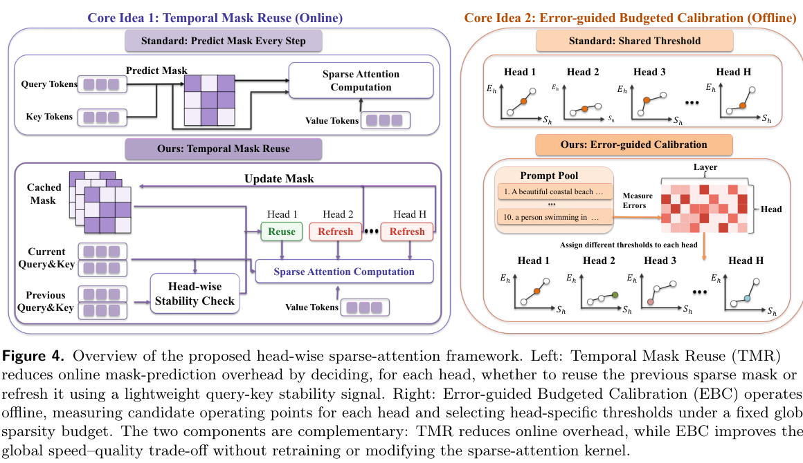
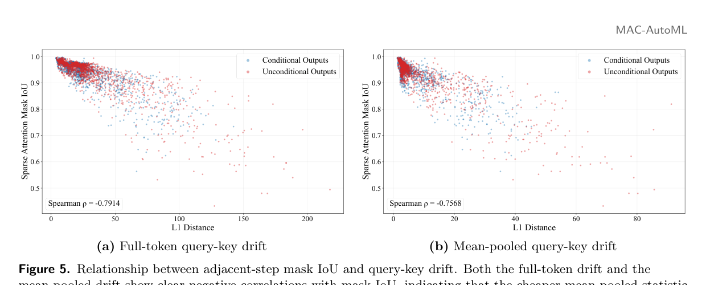
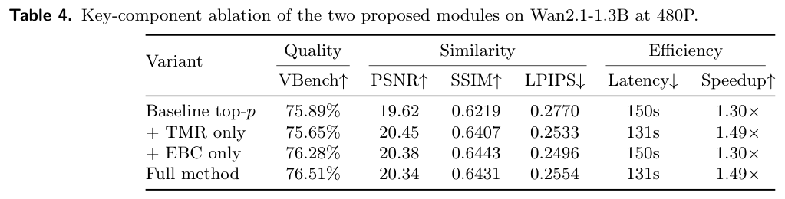

# HASTE: Training-Free Video Diffusion Acceleration via Head-Wise Adaptive Sparse Attention 精读分析

> [!info] 文档关系
> - 文档类型：Paper
> - 领域入口：[README](../README.md)
> - 上位汇总：[Multimodal custom attention](../surveys/multimodal-custom-attention.md)
> - 证据资产：`../assets/papers/haste/`
> - 相关文档：[Figure inventory](../evidence/figure-inventory.md)

> 资料状态：已核验 arXiv `2605.14513v1` 的当前 PDF、LaTeX/source tar、可搜索文本和三张严格重裁的论文视觉；当前 PDF/source 与 legacy 副本字节一致。未发现官方代码、项目页、HASTE checkpoint 或公开 OpenReview forum。图片是 `1530×1980` PDF 页面的截图裁剪，不是原始矢量文件。

## 修订信息

- 当前修订 ID：`rev-haste-affiliation-backfill-20260730`

- 当前文档版本：`1.0.1`
- 当前修订时间：`2026-07-30T23:30:00+08:00`
- 替代版本：`rev-haste-a2-initial` / `1.0.0`

| 修订 ID | 文档版本 | 时间 | 修订者 | 类型 | 替代修订 | 迁移问题/解析 | 变更摘要 | 原因 | 影响位置 | 依据 | 对结论影响 |
|---|---|---|---|---|---|---|---|---|---|---|---|
| `rev-haste-a2-initial` | `1.0.0` | `2026-07-25T14:16:29+08:00` | `delegated-paper-review-agent` | `initial` | 无 | 无 unresolved migration；legacy 没有 delivery manifest | 首次建立完整问题—方案闭环、术语/符号、设计 rationale、claim matrix、公式、实验归因、源码/公开评审/infra 核验、视觉 QA 与冻结交付 | `haste-a2` 非 ICML paper delivery remediation | `analysis.md`、[Figure inventory](../evidence/figure-inventory.md)、过程侧公开评审记录、`source_verification.md`、三张 accepted crops | arXiv v1 PDF/source、论文源码、官方 API 检索、逐图 QA、交付 schema/semantic checks | `material`：把 legacy 摘要提升为可审计的单篇精读，并收紧理论、实现和归因边界 |
| `rev-haste-affiliation-backfill-20260730` | `1.0.1` | `2026-07-30T23:30:00+08:00` | `/root` | `metadata-update` | `rev-haste-a2-initial` / `1.0.0` | 无 | 补充作者—机构元数据与角色证据边界 | 统一回填 affiliation 交付字段 | `作者与机构` | 论文 PDF 标题页、机构编号与角色脚注 | none：不改变方法、实验与归因结论 |

## 0. 资料与配图索引

- 论文：`paper.pdf`，25 页，SHA-256 `1b2cb9feca0212b9706cce121f408e36d378100a08be9fb193b571636a8fa061`；[arXiv v1](https://arxiv.org/abs/2605.14513v1)。
- LaTeX/source：`source/arxiv_source.tar`，SHA-256 `f7a6b0f8e6021e92295ed28da92afa79ba323e72552e3844dc6db6b89b87fad1`；展开于 `source/extracted/`。
- 版本复核：`source_verification.md`；arXiv API、HTTP headers、当前 PDF/source 和检索响应保存在 `network_verification/`。
- 提取文本：`extracted_text/full_text.clean.txt`（legacy PyMuPDF）与 `extracted_text/pdftotext-layout.txt`（本次独立 Poppler 提取）。Poppler 给出一个 `minorversion` 语法警告，但输出完整可检索。
- 开源代码：未发现。源码 `main.tex:56-57` 只有注释掉的模板占位链接；GitHub repository API 的精确标题、HASTE+video diffusion、TMR、EBC 四次检索均为 0。
- Checkpoint：HASTE 是 training-free 插件，没有新训练权重；论文只命名 Wan2.1-1.3B/14B，未固定 checkpoint revision 或公开 HASTE 配置。
- OpenReview：未发现匹配 forum；精确 notes API 被 challenge 阻断。过程记录见 过程侧公开评审记录。
- Figure inventory：[Figure inventory](../evidence/figure-inventory.md)；accepted crops 为 Figure 4、Figure 5、Table 4，均通过 contact-sheet 与逐图 100% QA。
- AI 生成分析图：未生成。已安装的 `openrouter-icu-image` 只支持 `generate/edit`，没有技能强制的 `responses-doc --input-file analysis.md` 文档输入路径；即使 API key 存在，也禁止退化为 prompt-only 生成。

## 0.1 术语与符号解释

### 0.1.1 术语表

| 术语 | 本文特定含义 | 别名 | 不等于/易混项 | 证据来源 |
|---|---|---|---|---|
| HASTE | 在既有 online top-$p$ video sparse-attention pipeline 上增加 TMR 与 EBC 的 training-free head-wise 控制框架 | Head-Wise Adaptive Sparse Attention | 不是新 sparse kernel，也不是训练方法 | Abstract；Introduction；Method §4.1、§4.4 |
| online top-$p$ sparse attention | 当前输入/去噪步上对 block importance 排序，累计质量达到阈值后保留 block | nucleus-style block selection | 不等于 token-level top-$k$，阈值不直接等于固定保留数 | Introduction；Key Observations §3.2 |
| sparse mask | 底层 pipeline 的 block retain/skip 集合；观测实验中的 $M_t^{(h)}$ 则是由 full attention、0.95 累积质量构造的 token mask | selected-block metadata | 不应推断为 $N\times N$ dense boolean tensor、CSR 或 PyTorch `BlockMask` | Key Observations Eq. (1)；Method Eq. (3)；代码缺失 |
| Temporal Mask Reuse (TMR) | 在线按 head 判断复用最近 refresh 的 sparse mask，或调用原 pipeline 重新预测 | adaptive mask refresh | 不是 attention-output/KV-cache 复用，也不是固定每 $k$ 步 refresh | Method §4.2、Algorithm 1 |
| anchor step | 某 head 最近一次真正 refresh mask 的去噪步 $t_a$ | refresh anchor | 不是永远固定的第一个 timestep | Method §4.2、Algorithm 1 |
| query-key drift | anchor 与当前步 Q/K 特征变化的 $L_1$ proxy；实现使用 token mean-pooled 版本 | stability signal | 不是 mask IoU 本身，也不是 block-score 的直接重算 | Method Eq. (2)、Eq. (5)；Figure 5 |
| layer-level gating | 先按 head 做 TMR，再依据该层 refresh-head 比例将决策折叠为全层 reuse、全层 refresh 或保留 head-wise 结果 | launch/startup heuristic | 不改变 attention 数学；上下阈值未披露 | Method §4.2，Algorithm 1 前 |
| Error-guided Budgeted Calibration (EBC) | 离线测量每个 layer/head 的候选 top-$p$ 阈值、实际 sparsity 与 model-output error，用 ILP 在全局预算下选一项 | head-wise calibration | 不等于 online search；不等于只按 sparsity/top-$k$ 分配 | Method §4.3、Algorithm 2 |
| threshold-induced operating point | $(\tau_k,S_{l,h,k},E_{l,h,k})$ 三元组；阈值通过 head-specific score distribution 间接诱导 sparsity/error | candidate operating point | $\tau$ 不是 realized sparsity | Key Observations §3.2；Method §4.3 |
| global sparsity budget | 所有 $L H$ heads 的平均 realized sparsity 至少达到 $S_{\min}$ | budget constraint | “更大 sparsity”在本文表示更多跳过/更稀疏；具体实现计数定义未开源 | Method Eq. (6)–(7) |
| model-output error | 单独稀疏一个 head 后，预测 denoising velocity 与 dense reference 的差异 | velocity error | 不等于该 head 的 local attention-output MSE | Method §4.3、Eq. (9) |
| measurement-driven additive surrogate | 将 isolated single-head error 相加作为联合稀疏化目标 | diagonal/local surrogate | 不是 full-network joint error 的精确分解；忽略 cross-head、cross-layer 和高阶项 | Appendix B |
| weighted four-band 3D-FFT objective | 把 velocity error 按 temporal/spatial 的 LL/LH/HL/HH 频带归一化，再加权求和 | frequency-aware calibration loss | 不是训练 loss；Table 6 只显示轻微且混合的指标差异 | Method Eq. (10)–(11)；Table 1、6 |
| training-free | calibration/inference 不更新 Wan2.1 预训练权重 | post-training/inference-time plugin | 离线 EBC 仍需要多次 model forward 和 ILP，不等于零准备成本 | Experiments §5.1 |

### 0.1.2 符号表

| 符号 | 含义 | 性质 | 作用域/索引 | 单位/取值 | 来源 | 易混点 |
|---|---|---|---|---|---|---|
| $l,h,t,i,j$ | layer、head、denoising step、query-token、key-token 索引 | author-defined | 全文 | 整数索引 | Method §4.2–4.3 | $j$ 也用于 timestep interval 的循环，按上下文区分 |
| $L,H,N,D$ | layer 数、每层 head 数、token 数、head 维度 | author-defined | 每模型/请求 | 1.3B 示例 $30,12,32760,128$ | Method Eq. (2) 后 | 这些值只由 cache 示例报告，不代表 14B 配置 |
| $Q_t^{(h)},K_t^{(h)}$ | step $t$、head $h$ 的 query/key 矩阵 | author-defined | per step/head | $\mathbb R^{N\times D}$ | Method §4.2 | 实际 dtype 未报告；FP16 只用于内存示例 |
| $q_{t,i}^{(h)},k_{t,j}^{(h)}$ | Q/K 的单 token 行向量 | author-defined | per token | $\mathbb R^D$ | Method Eq. (2) | 与 block summary $u,v$ 不同 |
| $\bar Q_t^{(h)},\bar K_t^{(h)}$ | 沿 token 维 mean-pool 的 Q/K | author-defined | per step/head | $\mathbb R^D$ | Method Eq. (5) | mean pooling 可发生抵消，理论 bound 没直接覆盖该 proxy |
| $A_t^{(h)},M_t^{(h)}$ | full attention distribution 与其 0.95 cumulative-mass token mask（观测）；方法中 $M$ 也指缓存的 sparse mask | author-defined | per step/head | probability matrix / binary mask | Key Observations Eq. (1)；Algorithm 1 | 论文在观察与部署叙述中复用 $M$，粒度可能 token/block 不同 |
| $\operatorname{IoU}_t^{(h)}$ | 相邻步 mask 交并比 | author-defined | per adjacent step/head | $[0,1]$ | Key Observations Eq. (1) | Figure 5 是相关性，不是复用精度或因果效应 |
| $\tilde d_{t_a\to t_b}^{(h)}$ | full-token 平均 Q/K drift | author-defined | anchor-current head pair | $L_1$ feature units | Method Eq. (2) | 理论命题使用它，不是实际 mean-pooled $d$ |
| $d_{t_a\to t_b}^{(h)}$ | mean-pooled Q/K drift | author-defined | anchor-current head pair | $L_1$ feature units | Method Eq. (5) | δ 的数值不可跨模型/基线直接比较 |
| $t_a,t_b,\delta$ | anchor step、当前 step、TMR reuse threshold | author-defined | per head / config | $t_b>t_a$；XAttention δ=30，SVG2 δ=8（主设置） | Method §4.2；Experiments §5.1 | 条件是 $d\le\delta$ reuse；Table 5 的 δ sweep 只针对 1.3B/XAttention |
| $\mathcal B,B,M$ | candidate block 集合、单 block、block 总数 | author-defined | per head/step | block count | Method Eq. (3) | 这里 $M$ 是 block 数，与 mask $M_t^{(h)}$ 同字母异义 |
| $a_t(B),S_t$ | block importance score 与 top-$p$ retained-block set | author-defined | per head/step | score / set | Method Eq. (3) | scoring rule 继承 XAttention/SVG2，未由 HASTE 代码确认 |
| $R_{t_a\to t_b}^{(h)}$ | 两步 retained sets 的 symmetric-difference 比率 | author-defined | per anchor-current pair | $[0,1]$ | Method Eq. (3) | 不等于 IoU；分母是全部 $M$ candidate blocks |
| $C,C_\phi,C_Q,C_K,C_s,L_{\mathrm{stab}}$ | proof 中 scoring、summary、score-to-mask 稳定常数及合并常数 | author-defined | pipeline/regime dependent | 正常数 | Proposition 1；Appendix A | 为避免与 layer 数 $L$ 混淆，本分析把 appendix 的合并常数写作 $L_{\mathrm{stab}}$ |
| $\tau,\tau_k,\tau_{l,h}$ | top-$p$ threshold candidate / 选中的 head threshold | author-defined | per head/candidate | 主实验 $\{0.85,0.90,0.95\}$ | Method §4.3；Experiments §5.1 | 相同 $\tau$ 不保证相同 sparsity |
| $s_{l,h}(\tau),e_{l,h}(\tau)$ | 理想化 realized sparsity 与 approximation error 函数 | author-defined | per head/threshold | ratio / normalized error | Method Eq. (6) | 不可解析，后续用测量量 $S,E$ |
| $S_{l,h,k},E_{l,h,k}$ | 多个 sampled prompt-step 上平均的实测 sparsity/error | author-defined | per layer/head/candidate | ratio / error | Method Eq. (7)、Algorithm 2 | 单 head 独立稀疏测量，不含联合 interaction |
| $x_{l,h,k},S_{\min},K_{\mathrm{cand}}$ | ILP binary choice、最小全局 sparsity、候选阈值数 | author-defined | calibration | $x\in\{0,1\}$；主实验 $K_{\mathrm{cand}}=3$ | Method Eq. (7) | $K_{\mathrm{cand}}$ 与 key tensor $K$ 同字母异义 |
| $y^{\mathrm{dense}},y_{l,h}^{\mathrm{sparse}}(\tau),\epsilon_{l,h}(\tau)$ | dense velocity、只稀疏一个 head 的 velocity、两者误差 | author-defined | per prompt/step/head | denoising-velocity tensor | Method Eq. (9) | 不是最终 RGB 像素误差 |
| $\Omega_q,q,r_{l,h,q},w_q,\varepsilon$ | FFT 频带、频带索引、归一化频谱误差能量、权重、数值稳定项 | author-defined | per head/threshold/band | $q\in\{\mathrm{LL,LH,HL,HH}\}$；weights $1,.5,.01,.01$ | Method Eq. (10)–(11)；Experiments §5.1 | $\varepsilon$ 是小常数，不是 model-output error $\epsilon$ |
| $\alpha$ | 频带扰动实验中固定的相对扰动范数 | author-defined | Table 1 study | 未报告具体值 | Method Eq. (8) | 未给值限制了重复实验 |
| $B_{\mathrm{cfg}},b$ | 本分析用于 cache 估算的 CFG branch 数与 bytes/element | analysis-derived | per inference | 示例 $B_{\mathrm{cfg}}=2,b=2$ | §8.2 推导 | 不是论文符号；只复核 11.2 GiB/0.35 MiB |
| $\mathrm{EffectiveBandwidth},\mathrm{Utilization}$ | 本分析定义的有效带宽与峰值利用率 | analysis-derived | per runtime path | bytes/s 与无量纲比例 | §8.4 | 无 bytes/telemetry，不能给数值 |

## 0.2 AI 生成算法分析示意图

未生成。`openrouter-icu-image` CLI 和 API key 可用，但 CLI 只有 prompt/image 的 `generate`/`edit`，不支持本技能规定的 `responses-doc --input-file analysis.md`。按执行契约，不能把本 Markdown 手工摘要后做 prompt-only 图片；这不影响下列论文原始机制图与消融表证据。

## 1. 论文基本信息

### 作者与机构

- 第一作者（首位列名）：Xuzhe Zheng → Key Laboratory of Multimedia Trusted Perception and Efficient Computing, Ministry of Education of China, Xiamen University。
- 共同第一作者（仅含论文明确标注者）：
  - Yuexiao Ma → Key Laboratory of Multimedia Trusted Perception and Efficient Computing, Ministry of Education of China, Xiamen University
- 通讯作者/通讯联系人（仅含论文明确标注者）：
  - Fei Chao → Key Laboratory of Multimedia Trusted Perception and Efficient Computing, Ministry of Education of China, Xiamen University
- 其他作者涉及的机构（去重列举，不作逐作者映射）：Key Laboratory of Multimedia Trusted Perception and Efficient Computing, Ministry of Education of China, Xiamen University。
- 对应依据：论文 PDF 标题页、作者机构编号与角色脚注（核验日期：2026-07-30）。

- 完整标题：*HASTE: Training-Free Video Diffusion Acceleration via Head-Wise Adaptive Sparse Attention*。
- 作者：Xuzhe Zheng、Yuexiao Ma、Jing Xu、Xiawu Zheng、Rongrong Ji、Fei Chao；Xiamen University。
- 版本/venue：arXiv `2605.14513v1`，2026-05-14；截至核验日未发现正式 venue 或公开 OpenReview 记录。
- 研究领域：Video Diffusion Transformer 推理、training-free block-sparse attention、稀疏控制面与离线预算分配。
- 核心问题：不改变预训练权重和既有 sparse kernel 的前提下，降低 online sparse-mask prediction 的重复开销，并把共享 top-$p$ threshold 改为对 heterogeneous heads 更合理的全局预算分配。
- 目标场景：Wan2.1-1.3B/14B，81 frames、50 UniPC denoising steps、shift 8.0、guidance 6.0，480P 为主、1.3B 额外 720P；NVIDIA A800 PCIe。
- 关键约束：只优化 attention path；不增加 non-attention kernel optimization，也不使用 early-step/early-layer dense warm-up；底层 XAttention/SVG2 block scoring 与 sparse kernel 不变。
- 明确不覆盖：训练 learned sparsity、非 diffusion 架构、AR prefill/decode、全新 kernel、跨硬件泛化、joint head/layer interaction-aware calibration。

## 2. 研究动机与问题—方案闭环

### 2.1 出发点与背景痛点

`author-stated`：视频 DiT 同时受长 token sequence 和多步 denoising 放大成本。即便 training-free sparse attention 已经让 QK/softmax/AV 跳过大量 block，online 方法仍需在每个去噪步预测/更新 sparse pattern；这个 control-plane 工作同样被 50 次网络执行重复。HASTE 不是再造一个更快的 attention kernel，而是质疑“mask 每步都重算、所有 heads 用同一个 top-$p$ threshold”这两项上层策略。

论文给出两类观测。第一，0.95 mass token mask 的 adjacent-step IoU 随 prompt、layer 和 head 大幅变化（Figure 2）；因此固定间隔或后半程一刀切复用会同时出现 stable head 的多余刷新和 unstable head 的 stale reuse。第二，同一 $\tau$ 在不同 heads 上诱导的 realized sparsity 和 attention/model-output error 曲线不对齐（Figure 3）；共享 threshold 不是固定全局预算下的细粒度最优分配。

### 2.2 现有方案为何不够

对在线 mask 更新，AdaSpa 类 fixed-interval refresh 与 PAROAttention 类阶段式 reuse 的可观察失败模式是 prompt/head agnostic。根因不是“所有 mask 都不稳定”，而是稳定性本身 heterogeneous；全局 schedule 无法把 refresh work 精确投到变化大的 heads。`author-stated` 的证据是 Figure 2 和 Related Work；但 Figure 2 只展示随机样本/相邻步，没有跨模型分布或 failure rate，因而“固定 schedule 必然次优”只得到机制性支持。

对 threshold allocation，top-$p$ 比 top-$k$ 更自适应，但 $\tau$ 只控制 cumulative importance mass，保留 block 数取决于 score distribution。shared $\tau$ 会让 peaked head 少留、flat head 多留，且这些 heads 对 error 的敏感性不同。Figure 3 直接显示 threshold-response heterogeneity；这支持“需要 head-specific operating point”，但只展示一个随机 layer/timestep，不能证明全局 ILP 是唯一或最优工程解。

### 2.3 论文计划解决的问题与成功标准

- 核心研究问题：能否把动态 sparse-attention 的 mask refresh 与 threshold selection 做成 head-wise adaptive control，同时保持 training-free、kernel-agnostic？
- 成功标准 1（效率）：TMR 应在 matched pipeline 中降低 latency/提高 speedup，而 EBC-only 不应靠 runtime trick 获得同样增益。
- 成功标准 2（质量/相似度）：相同近似 global sparsity budget 下，EBC 应提高 VBench 或 dense-reference PSNR/SSIM/LPIPS。
- 成功标准 3（资源）：TMR 的 stability state 应从 full-token $O(LHND)$ 压缩到 $O(LHD)$，不能引入 $N^2$ cache。
- 成功标准 4（可插拔性）：XAttention、SVG2 两种 baseline 均应获益；预训练权重、block scoring 和 sparse kernel 保持不变。
- 成功标准 5（尺度趋势）：token count 增大、attention 占比提高时，端到端效率收益应更明显。
- 不解决：mask descriptor 的具体布局/kernel、offline calibration wall time、跨 head/layer 精确 joint optimization、跨 GPU/NPU telemetry。

### 2.4 核心方案如何解决并优化问题

> 原论文 Figure 4（PDF p.7）：在线 TMR 选择 reuse/refresh，离线 EBC 为 heads 分配 operating points；完整 caption 与逐图 QA 见 [Figure inventory](../evidence/figure-inventory.md)。

HASTE 将控制面拆成互补的两个时间尺度。在线 TMR 缓存每 head 最近 refresh 时的 mean-pooled Q/K 与 sparse mask，用当前 drift 决定是否调用原有 `PredictMask`；它改变的是 mask refresh frequency 和 control overhead。离线 EBC 则先构造 per-head threshold—sparsity—model-output-error 曲线，再用 ILP 选出每 head 的 $\tau_{l,h}$；它改变的是相同 global sparsity 下的容量分配。两者都不改变 retained block 内部 attention 或 sparse kernel。

| 原始问题/失败模式 | 根因或约束 | 对应方案设计 | 改变的变量/系统行为 | 作用机制 | 预期优化及指标 | 证据来源 | 判断 |
|---|---|---|---|---|---|---|---|
| 每步/每 head mask prediction 重复 | mask stability 跨 prompt/layer/head heterogeneous | TMR anchor cache + drift gate | per-head refresh/reuse 决策与 `PredictMask` 调用次数 | stable head 复用最近 mask，unstable head refresh | latency↓、speedup↑，质量不过度退化 | Fig.2、Algorithm 1、Table 4–5 | `supported` 于 1.3B/XAttention；跨模型机制泛化 `partial` |
| full-token stability cache 太大 | $N$ 随视频时空尺寸增长 | mean-pooled Q/K | cache state 从 $LHND$ 降到 $LHD$ | token reduction 保存 head-level drift trend | cache 11.2 GiB→0.35 MiB（示例） | Eq.2/5、Fig.5、§8.2 复算 | 内存阶数 `supported`；mask validity 仅相关性 |
| head-wise refresh 可能造成 layer startup/launch 不规则 | sparse construction 有 layer-level fixed overhead | layer-level gating heuristic | 将部分 per-head decisions 折叠为整层 reuse/refresh | 减少碎片化 control invocation | startup/latency↓ | Method §4.2 | `plausible/unverified`：阈值、消融、代码均缺失 |
| shared $\tau$ 预算错配 | threshold-induced sparsity/error curves heterogeneous | EBC per-head operating point | $\tau_{l,h}$ 与 head budget | 低 error-cost head 承担更多 sparsity，高敏感 head 保留更多计算 | VBench/PSNR/SSIM/LPIPS↑ under matched budget | Fig.3、Eq.6–7、Table 4 | `supported` 于 EBC-only matched ablation |
| attention-output MSE 不代表最终视频误差 | 后续层可能放大/衰减 head perturbation | isolated single-head model-output measurement | calibration error 从 local attention 变为 denoising velocity | 用 dense final velocity 评估 downstream effect | dense-reference similarity/quality↑ | Method §4.3 | `partially-supported`：无 attention-MSE objective ablation |
| joint error 计算不可承受 | true multi-head/layer error 非可分 | additive surrogate + ILP | 联合目标近似为 isolated $E_{l,h,k}$ 之和 | 将组合搜索变成可解 assignment | offline tractability | Appendix B、Algorithm 2 | 数学解释 `supported`；近似精度 `unverified` |
| 单 prompt/step calibration 过拟合 | sparsity/error 随输入和 timestep 变化 | prompt assignment + 4 interval samples | $E,S$ 改为四步平均 | 覆盖 trajectory 的不同阶段 | calibration robustness | Fig.6、Algorithm 2 | `plausible`：无 sampling ablation/方差 |
| velocity 各频带同等 MSE 不同质量影响 | LL 等频带敏感度不同 | weighted four-band 3D-FFT | error weights $w_q$ | 对敏感频带误差惩罚更大 | structural similarity↑ | Table 1、Table 6 | `partially-supported`：SSIM +0.0043，LPIPS 略差 |

### 2.5 完整因果链与证据闭环

因果链是：长视频 token 与 50-step denoising 放大 attention 和 mask-prediction 成本；现有 online top-$p$ 虽能跳过 block，却仍用固定 refresh schedule/shared threshold；Figure 2/3 指向 head-wise temporal/threshold heterogeneity；TMR 以 compressed Q/K drift 改变 refresh frequency，EBC 以 measured single-head output error 改变 per-head threshold allocation；前者应降低 mask-control latency，后者应在近似相同 sparsity 下降低 output distortion；Table 4 中 TMR-only 把 latency 150s 降到 131s 而 EBC-only 保持 150s，EBC-only 把 VBench 75.89% 提到 76.28%，full 达到 76.51%/131s；Table 2/3 再显示两个 baseline、两种模型规模及 720P 的总体趋势。

直接支持的环节：head response heterogeneity 的可视化、TMR/EBC 的 matched component ablation、TMR threshold sensitivity、四个主配置的 end-to-end结果。间接支持的环节：mean-pooled drift 对 anchor mask 的多步安全性、layer gate 的 runtime 贡献、3D-FFT weighting 的感知优越性。未验证环节：score-to-mask stability constant 的可估计性、mean-pool proxy 的 worst-case guarantee、联合 head/layer interaction、offline calibration cost、kernel/descriptor/带宽行为、统计显著性和跨硬件泛化。总体判断为 `partially-supported`：论文的“控制面拆分”与局部归因可信，但理论和系统普适性仍窄。

## 3. 核心贡献与创新点

1. `author-stated`：把 training-free top-$p$ 的两个被忽略瓶颈明确化——mask evolution heterogeneity 与 threshold-response heterogeneity；证据为 Figure 2/3。
2. `author-stated`：提出 online TMR，用 anchor-current Q/K drift 代替每步 mask prediction，并给出 $O(LHND)\to O(LHD)$ cache 压缩；证据为 Eq. (2)–(5)、Algorithm 1、Figure 5。
3. `author-stated`：提出 offline EBC，以 isolated single-head model-output error 和 global sparsity constraint 选择 head-specific top-$p$ threshold；证据为 Eq. (6)–(7)、Algorithm 2、Appendix B。
4. `author-stated`：用 weighted four-band 3D-FFT 让 calibration 更重视敏感频带；证据为 Table 1、Eq. (9)–(11)、Table 6。
5. `author-stated`：在 XAttention/SVG2、Wan2.1-1.3B/14B、480P/720P 上改善整体 speed-quality trade-off；证据为 Table 2–4。`review judgment`：这验证了 evaluated settings，不足以证明任意 top-$p$ pipeline 或硬件上的 plug-and-play。

## 4. 研究方法

### 4.1 方法总览

输入是 frozen Wan2.1 在某层/head/denoising step 的 Q/K/V 与 baseline top-$p$ pipeline。EBC 先离线输出 $\{\tau^\star_{l,h}\}$ 表；在线每步先由 TMR 决定该 head 的 mask reuse/refresh，refresh 时仍调用 XAttention/SVG2 原 mask predictor，再由原 sparse kernel 计算 selected blocks。输出仍是 Wan2.1 denoising velocity/视频，HASTE 不更新模型权重。

Stage qualification：

- mask observation：用 full attention 的 token-level 0.95 cumulative mask 研究 IoU；
- online mask planning：baseline block scores/top-$p$ 生成 selected-block metadata；
- TMR control：仅决定 reuse 旧 metadata 或 refresh；
- sparse execution：原 kernel 执行 QK/softmax/AV；
- offline calibration：单 head 稀疏 forward、FFT error、ILP；
- serving/runtime：论文只给端到端 latency，没有 scheduler/kernel trace。

### 4.2 组件级设计动机与具体问题映射

| 设计项 | why 来源状态 | 原文证据 | 针对的具体问题 | 因果机制 | 替代方案/权衡 | 验证证据 | 判断 |
|---|---|---|---|---|---|---|---|
| block-level top-$p$ 作为宿主 | `author-stated` | Introduction；Method §4.4 | token irregularity 不适合硬件；需兼容现有 baselines | 复用 baseline scoring/kernel，仅改 control | 新 kernel 可能更快但失去可插拔性 | 两个 baseline 主结果 | `partially-supported`，无代码接口 |
| per-head anchor cache | `author-stated` | Method §4.2、Algorithm 1 | fixed reuse schedule 无法适应 head heterogeneity | 每个 head 独立维护最后有效 mask/state | per-layer/global cache 更规则但更粗 | Fig.2、Table 5 | `supported` 于实验；跨 prompt policy 未统计 |
| full-token Q/K drift | `author-stated` | Eq.2、Proposition 1 | 直接重算 mask 才能比较会抵消收益 | Q/K 小变化经 scoring stability 映射到少量 block changes | 直接 block-score/mask IoU 更准但成本高 | Appendix A | `plausible`：关键 score-to-mask inequality 是假设 |
| mean-pooled drift | `author-stated` | Eq.5、Fig.5 | full-token Q/K cache 11.2 GiB | token mean 压缩成每 head 两个 $D$-vectors | random projection/variance/max pooling 可能更稳但更大 | Fig.5 correlations；内存复算 | `partially-supported`：相关、可取消、无 worst-case bound |
| threshold $d\le\delta$ reuse | `author-stated` | Algorithm 1、Table 5 | 需把 continuous proxy 变成 control decision | δ 控制 reuse-rate/refresh-rate | learned threshold、hysteresis、confidence margin | Table 5 sensitivity | `supported` 但非单调且 baseline-specific |
| layer-level gating | `author-stated` | Method §4.2 | per-head refresh 造成 layer startup overhead | 依据 refresh-head fraction 合并 control path | 保持 head-wise 最精确；整层 gate 更规则 | 无单独 ablation | `unverified`；上下阈值未报告 |
| per-head threshold operating points | `author-stated` | Fig.3、Eq.6–7 | shared $\tau$ 产生预算错配 | 允许 head 在自己的 error–sparsity curve 选点 | shared $\tau$ 简单；top-$k$ 更可预测 | EBC-only Table 4 | `supported` 于 1.3B/XAttention |
| dense output cache + isolated single-head forward | `author-stated` | Method §4.3、Algorithm 2 | true joint measurement 组合爆炸 | 固定 dense reference，head/candidate 可并行测量 | joint groups 更准但昂贵 | 无 calibration cost 表 | `plausible`，成本/缓存量未报告 |
| additive ILP surrogate | `author-stated` | Eq.7、Appendix B | per-head decisions 需满足全局约束 | 忽略 interaction 后变多选一 knapsack/ILP | interaction-aware quadratic/iterative search | Appendix 推导；final result 间接 | `partially-supported`，surrogate gap 未量化 |
| prompt assignment + 4 timestep intervals | `author-stated` | Algorithm 2；Experiments §5.1 | 单 input/timestep 过拟合 | 每 head 用 assigned prompt、trajectory 分段采样 | 更多 prompts/steps 更稳但成本高 | Fig.6 仅显示 timestep heterogeneity | `plausible`，pool size/seed/variance 缺失 |
| model-output velocity error | `author-stated` | Method §4.3、Eq.9 | attention MSE 不代表 downstream effect | 直接度量后续网络传播后的 velocity deviation | attention-output MSE 更便宜 | Fig.3 展示两类曲线但无 objective ablation | `plausible/partial` |
| weighted 3D-FFT objective | `author-stated` | Table 1、Eq.10–11、Table 6 | equal MSE energy 在频带间质量影响不同 | 高权重惩罚 LL/LH error | raw MSE 简单且 LPIPS 略优 | controlled perturbation + objective ablation | `partially-supported` |

### 4.3 TMR 机制与视觉证据

Figure 4 已给总体数据流。Figure 5 进一步检查 proxy：

> 原论文 Figure 5（PDF p.9）：full-token 与 mean-pooled drift 都和 adjacent-step mask IoU 负相关，Spearman $\rho=-0.7914,-0.7568$。这是 proxy 的 mechanism visualization，不是多步 anchor reuse 的 matched accuracy test。

这张图最重要的边界是：scatter 的每点来自 sampled head-step pair，横轴与相邻步 IoU 的相关性只能说明排序趋势。TMR 实际比较 $t_b$ 与最近 refresh 的 $t_a$，它可能跨多步；随着 anchor age 增长，误差分布未被分层报告。因而“mean pooled drift 足够便宜”是直接证据，“在任意 reuse horizon 都可靠”不是。

### 4.4 关键公式与推导审计

观测阶段的相邻 mask IoU：

$$
\operatorname{IoU}_t^{(h)}
=
\frac{|M_t^{(h)}\cap M_{t+1}^{(h)}|}
{|M_t^{(h)}\cup M_{t+1}^{(h)}|}.
$$

TMR full-token 与实现 proxy：

$$
\tilde d_{t_a\to t_b}^{(h)}
=\frac1N\sum_{i=1}^N\|q_{t_a,i}^{(h)}-q_{t_b,i}^{(h)}\|_1
+\frac1N\sum_{j=1}^N\|k_{t_a,j}^{(h)}-k_{t_b,j}^{(h)}\|_1,
$$

$$
d_{t_a\to t_b}^{(h)}
=\|\bar Q_{t_a}^{(h)}-\bar Q_{t_b}^{(h)}\|_1
+\|\bar K_{t_a}^{(h)}-\bar K_{t_b}^{(h)}\|_1.
$$

block change 与 Proposition 1：

$$
R_{t_a\to t_b}^{(h)}
=\frac{|S_{t_a}\triangle S_{t_b}|}{M}
\le C\,\tilde d_{t_a\to t_b}^{(h)}.
$$

审计结论：Appendix A 先假设 block scoring $\phi$ 与 block summaries Lipschitz，再额外假设 $R\le C_sD_{\text{score}}$。top-$p$ sorting/thresholding 在 near-tie 或 cumulative boundary 附近是离散的；若没有 score margin，$C_s$ 可能很大或局部失效。更关键的是 proposition 约束 $\tilde d$，实际使用 $d$；mean pooling 能让相反方向 token drift 抵消，论文没有给 $d\Rightarrow\tilde d$ 的 bound。因此 proposition 是“在 pipeline stability 条件下”的充分叙述，不是实际 TMR 的完整 guarantee。

EBC 连续目标与离散 ILP：

$$
\min_{\{\tau_{l,h}\}}\sum_{l=1}^{L}\sum_{h=1}^{H}e_{l,h}(\tau_{l,h})
\quad\text{s.t.}\quad
\frac1{LH}\sum_{l,h}s_{l,h}(\tau_{l,h})\ge S_{\min},
$$

$$
\begin{aligned}
\min_{\{x_{l,h,k}\}}\;&\sum_{l,h,k}E_{l,h,k}x_{l,h,k}\\
\text{s.t.}\;&\sum_kx_{l,h,k}=1,\ \forall l,h,\\
&\frac1{LH}\sum_{l,h,k}S_{l,h,k}x_{l,h,k}\ge S_{\min},\quad
x_{l,h,k}\in\{0,1\}.
\end{aligned}
$$

输出误差与频带目标：

$$
\epsilon_{l,h}(\tau)=y_{l,h}^{\mathrm{sparse}}(\tau)-y^{\mathrm{dense}},
$$

$$
r_{l,h,q}(\tau)=
\frac{\sum_{\omega\in\Omega_q}|\widehat\epsilon_{l,h}(\tau,\omega)|^2}
{\sum_\omega|\widehat y^{\mathrm{dense}}(\omega)|^2+\varepsilon},
\qquad
e_{l,h}(\tau)=\sum_qw_qr_{l,h,q}(\tau).
$$

Appendix B 正确地承认 attention output perturbation 对 heads 在线性 projection 处可加，但经过后续网络与平方型 error 后会出现 cross terms：

$$
e_l\approx \frac12\sum_hu_{l,h}^\top H_\psi u_{l,h}
+\frac12\sum_{h\ne h'}u_{l,h}^\top H_\psi u_{l,h'}.
$$

EBC 只优化第一项的 measured proxy。论文的自我限定是合理的；缺失的是 surrogate-selected table 与 joint-error-aware search 的对照。

### 4.5 训练/实验/部署设计

无训练：weights frozen，HASTE 只有 offline calibration 与 online inference。主设置为 81 frames、50 UniPC steps、shift 8.0、CFG scale 6.0、A800 PCIe。TMR 默认 δ：XAttention 30（1.3B/14B），SVG2 8。EBC 把 50 steps 分成 4 intervals，每 interval 随机 1 step；每 head 测 $\tau\in\{.85,.90,.95\}$，FFT weights 为 $(1,.5,.01,.01)$；global sparsity 设为接近 baseline shared $\tau=.9$ 的 realized sparsity。

公平性正向点：同一 backbone/inference setting；attention-only optimization；无额外 non-attention kernels/dense warm-up；Table 4 的 component variants matched。缺口：prompt pool 大小、prompt/head assignment、random seed、样本数、重复次数/置信区间、计时 protocol/warm-up、GPU 数量、精度、solver、baseline commit/config 和 exact sparsity budget 均未报告。VBench 仅说明官方六维加权，未给每维数值/方差。

## 5. 关键结论

### 5.1 主结果

Table 2（论文 p.14）报告 480P：

- Wan2.1-1.3B + XAttention：75.89→76.51 VBench（+0.62 pp，约 +0.82% relative），150→131s（-19s，-12.67%），speedup 1.30→1.49×。
- Wan2.1-1.3B + SVG2：76.79→77.00（+0.21 pp），170→156s（-8.24%），1.15→1.25×。
- Wan2.1-14B + XAttention：77.18→77.91（+0.73 pp），843→791s（-6.17%），1.22→1.30×。
- Wan2.1-14B + SVG2：77.74→78.24（+0.50 pp），926→882s（-4.75%），1.11→1.17×。

Table 3 的 720P/1.3B scaling evidence：XAttention 441→389s（-11.79%），1.71→1.93×，SSIM/LPIPS 改善但 PSNR 20.25→19.65；SVG2 475→440s（-7.37%），1.58→1.71×，三个 similarity 指标小幅改善。它支持“更长 sequence 下 extra control saving 更有价值”，但只有一个模型/分辨率扩展，且没有 attention-only breakdown。

### 5.2 技术主张—证据矩阵

> 原论文 Table 4（PDF p.15）：matched TMR-only/EBC-only/full ablation；这是本文最强的组件归因证据。

| 论文声称的技术点 | 声称收益 | 对应实验/消融 | 对照 | 指标变化 | 证据强度 | 结论 |
|---|---|---|---|---|---|---|
| mask evolution heterogeneous | 固定 schedule 次优 | Fig.2 | 随机 prompts/layers/heads 观察 | IoU pattern 不同，无汇总统计 | mechanism visualization | `partially-supported` |
| threshold response heterogeneous | shared $\tau$ 预算错配 | Fig.3 | 同 layer/timestep 多 heads、7 thresholds | sparsity/error curves 不对齐 | mechanism visualization | `supported` 局部现象 |
| full-token drift 控制 mask changes | 理论支持 reuse | Proposition 1/App.A | 条件性推导 | $R\le C\tilde d$ | theory-with-assumption | `plausible`，score-to-mask stability 被假设 |
| mean-pooled drift 替代 full-token | 小 cache、保留趋势 | Fig.5 | 两类 drift vs adjacent IoU | $\rho=-.7914$ vs -.7568 | mechanism visualization | `partially-supported`；非多步/因果 |
| TMR 降低 online overhead | latency↓ | Table 4 | baseline vs TMR-only matched | 150→131s；VBench 75.89→75.65 | direct ablation | `supported` 于单设置 |
| δ 控制 reuse trade-off | 需避免 stale mask | Table 5 | δ sweep | δ100 reuse 96.53%，sparsity 61.62%，145s，质量变差 | sensitivity | `supported`、且非单调 |
| layer-level gating 降 startup | latency↓ | 无 | 无 | 无 | none | `unverified` |
| EBC 同预算提升质量 | VBench/similarity↑ | Table 4 | baseline vs EBC-only matched | VBench +0.39pp，latency 150s 不变 | direct ablation | `supported` |
| additive surrogate 可优化 joint allocation | tractable calibration | Appendix B + final results | 无 joint-aware replacement | 未量化 surrogate gap | theory + indirect | `partially-supported` |
| interval sampling 降过拟合 | calibration robustness | Fig.6 | 无 sampling-count ablation | 仅显示 timestep sparsity 变化 | indirect | `plausible` |
| velocity output error 优于 attention MSE | 更接近 final effect | Fig.3 + method | 无 objective replacement | 无 | indirect | `unverified` relative superiority |
| weighted 3D-FFT 优于 raw MSE | structural preservation | Table 1、6 | same budget objective replacement | PSNR same；SSIM +.0043；LPIPS +.0020（更差） | direct replacement baseline | `partially-supported/mixed` |
| plug-in across baselines/models | 通用性 | Table 2 | XAttention/SVG2、1.3B/14B | 四组整体改善 | replicated settings | `supported` 于两 pipelines，非任意 kernel |
| 720P 最高 1.93× | resolution scaling | Table 3 | 480P/720P 不同设置 | XAttn 1.71→1.93× with HASTE | indirect scaling | `supported` 数字；机制 breakdown 缺失 |

### 5.3 是否验证了假设

- H1“head temporal stability heterogeneous”：视觉直接支持，但没有跨 dataset/model 的统计量；部分验证。
- H2“shared top-$p$ threshold suboptimal”：Figure 3 + EBC-only matched ablation 共同支持；在 1.3B/XAttention 设置验证较强。
- H3“drift 是可用 reuse signal”：Figure 5 支持相关趋势，Table 5 支持 δ 可调；但 mean-pool/anchor horizon 与 actual mask-error 没有直接 joint evaluation；部分验证。
- H4“TMR 与 EBC 互补”：Table 4 很清楚地把 latency 与 VBench 主收益分开；直接支持。
- H5“frequency weighting 更好”：只在 SSIM 更好、LPIPS 更差、PSNR 相同；结论应限定为轻微结构性倾向，不是全面优越。

### 5.4 收益来源归因

| 组件/变化 | 对比基线 | 指标变化 | 影响路径 | 证据强度 |
|---|---|---|---|---|
| TMR-only | baseline top-$p$ | latency -19s/-12.67%；speedup +0.19×；VBench -0.24pp | refresh control overhead↓；similarity更近 dense，但 perceptual VBench 未改善 | matched direct ablation |
| EBC-only | baseline top-$p$ | VBench +0.39pp；latency 0；SSIM +.0224；LPIPS -0.0274 | per-head budget allocation / candidate quality | matched direct ablation |
| full vs baseline | baseline top-$p$ | VBench +0.62pp；latency -19s；speedup +.19× | TMR+EBC 互补且存在 interaction | matched direct ablation |
| EBC incremental over TMR-only | TMR-only→full | VBench +0.86pp；PSNR -0.11；SSIM +.0024；LPIPS +.0021；latency 0 | budget allocation at fixed TMR runtime | rough interaction-aware contrast，不是单独 EBC main effect |
| 3D-FFT vs velocity MSE | raw MSE | SSIM +.0043；LPIPS 0.2534→0.2554（worse）；PSNR same | calibration objective | direct replacement，但结论 mixed |
| 720P HASTE on XAttention | XAttention | latency -52s/-11.79%；SSIM +.0242；PSNR -0.60 | larger attention share + both modules | confounded full-method scaling |

任何把 1.49× 全归因给“减少 attention FLOPs”都不正确：TMR 主要减少 mask predictor/control path，且 Table 5 显示 stale reuse 会改变 realized sparsity，从而同时影响 sparse attention work。没有 kernel trace 时不能把 latency delta 进一步拆成 pooling、mask scoring、sort/top-$p$、descriptor update、QK/softmax/AV。

## 6. Related Work 对比

| 类别/论文 | 方法核心 | 优点 | 局限 | 与 HASTE 的关系与比较公平性 |
|---|---|---|---|---|
| VSA/USV/SLA 等 training-based sparse attention | 训练/微调中学习 sparse pattern/operator | 模型可适应 sparsity | 需训练/架构修改 | HASTE 明确选择 frozen checkpoint；机制差异清楚，但论文没有同硬件直接比较质量/成本 |
| XAttention | anti-diagonal block importance + top-$p$/DP refinement | online input-adaptive baseline | shared/原 calibration 对多步视频的局限由 HASTE 主张 | HASTE 直接叠加并有 matched results；但未给 baseline commit/code，复现公平性不可审计 |
| SVG2 | semantic-aware token clustering 的 training-free top-$p$ | 不同 scoring pipeline | mask prediction 与 shared threshold 仍有 control overhead | 第二个宿主 baseline，增强版四组结果一致；同样缺 exact config |
| LiteAttention | 利用 diffusion temporal coherence 传播 skip decisions | 降重复 profiling | 不是本文的 per-head Q/K gate | HASTE 声称更细 granularity；没有 head-to-head 表 |
| AdaSpa | uniform refresh schedule + head-adaptive top-$k$ search | 已关注 heads/temporal invariance | fixed schedule、top-$k$ control | HASTE 的差异是 online per-head drift 与 top-$p$ threshold calibration；没有直接实验 |
| PAROAttention | 前期预测、后期共用 mask | 控制简单 | preset phase，prompt/head agnostic | TMR 可动态 refresh；无同设置 replacement baseline |
| SVOO | offline layer sensitivity + online clustering | layer-wise budget | 不是 top-$p$ threshold response | 与 EBC 都做 profiling；granularity/objective 不同 |
| PASA | 按 trajectory curvature 分配 exact compute | timestep-aware | 不做 head threshold assignment | 与 EBC 正交，可组合性未测试 |
| EBC vs XAttention DP refinement | candidate configuration optimization | 都比 shared threshold 精细 | HASTE 说 XAttention DP 不适合 multi-step，但未给复杂度/失败实验 | 这一相关工作判断证据不足，应视为作者定位而非被验证事实 |

Related Work 的核心价值是把 HASTE 放在“稀疏 control plane”而不是“新 kernel”上；不足是几乎没有 direct replacement comparison 来证明 head-wise drift 优于 fixed schedule、ILP 优于其他 budgeter。

## 7. OpenReview 公开评审 × 论文内容交叉核验

- OpenReview 链接：未发现匹配 forum。
- 检索日期：`2026-07-25`。
- decision/meta-review：不可得。
- author response/rebuttal：不可得。

| 来源 | 评审观点/约束 | 对应论文 claim | 证据状态 | 状态 | 对本精读影响 |
|---|---|---|---|---|---|
| exact-title web/OpenReview search | 无匹配 HASTE forum | venue/review status | 未发现结果 | `unclear` | 只能称 arXiv preprint，不能推断未投稿/未评审 |
| OpenReview v1/v2 exact notes API | challenge-blocked | public reviews/rebuttal | v1 403 response 已保存；v2 同类阻断 | `unresolved` | 无法逐条 reviewer cross-check |
| broad search API first 100 notes | 唯一含 HASTE 的标题是另一篇 LLM inference 工作 | identity resolution | exact title mismatch | `resolved` | 排除同名误配 |

因此本章没有 reviewer concern 可回填；方法/实验局限均由论文、Appendix、源码和缺失实现证据独立得出。

## 8. Infra 需求分析

### 8.1 算力与离线测量

paper-reported：在线每 sample 50 次 denoising，81 frames；A800 PCIe；attention-only optimization。TMR 新增 per step/head 的 two mean reductions + two $L_1$ vector distances；refresh 才执行原 mask prediction。EBC 主设置每 head 有 $J=4$ timesteps、$K_{\mathrm{cand}}=3$ thresholds。

analysis-derived：若使用论文 1.3B cache 示例 $L=30,H=12$，Algorithm 2 至少需要

$$
N_{\mathrm{sparse\ measurements}}=LHK_{\mathrm{cand}}J
=30\cdot12\cdot3\cdot4=4320
$$

次 isolated-head sparse forward evaluations，外加 prompt pool 的 dense references。每次不必 replay 完整 trajectory，但“one additional sparse forward”仍可能昂贵；prompt pool size、并行度、calibration wall time、ILP solve time 未报告。

### 8.2 显存与存储

CFG 两分支、缓存 anchor 的 Q 与 K、每元素 $b$ bytes：

$$
\mathrm{Bytes}_{\mathrm{fullQK}}
=B_{\mathrm{cfg}}\cdot2\cdot L H N D\cdot b,
\qquad
\mathrm{Bytes}_{\mathrm{pooledQK}}
=B_{\mathrm{cfg}}\cdot2\cdot L H D\cdot b.
$$

代入 $B_{\mathrm{cfg}}=2,L=30,H=12,N=32760,D=128,b=2$：

- full Q/K = 12,078,489,600 bytes ≈ 11.25 GiB，与论文 “about 11.2 GB” 一致；
- pooled Q/K = 368,640 bytes ≈ 0.352 MiB，与 “about 0.35 MB” 一致；
- 压缩比正好为 $N=32760$。

这不包括 cached sparse mask/selected-block descriptor、baseline QKV/activations、dense velocity cache 或 FFT buffers。论文没有 descriptor shape/bytes，不能声称 TMR 的全部新增 state 只有 0.35 MB。

### 8.3 Data Types / 数值格式

| 对象 | 数据类型/格式 | 阶段 | 硬件依赖 | 影响 | 证据 |
|---|---|---|---|---|---|
| full/pooled Q/K cache 示例 | FP16 | TMR memory illustration | 2-byte elements；A800 可用 | 11.2 GiB vs 0.35 MiB | Method §4.2 |
| 实际 Wan weights/activations/QKV | 未报告 | inference | 未知 tensor-core path | 不能估算实际 memory/bandwidth | paper/code unavailable |
| mask/descriptor | block retain/skip 语义；格式未报告 | mask planning/sparse kernel | 可能依赖 baseline kernel | 大小、packing、layout transform 未知 | Method §4.4 |
| FFT error | precision 未报告 | offline EBC | 3D FFT implementation unknown | calibration memory/throughput unknown | Method §4.3 |
| ILP variables/table | binary $x$、threshold/error/sparsity numbers；storage dtype unknown | offline | solver unknown | 小表本身可能不大，求解行为未知 | Eq.7 |

没有 fp32/bf16/fp8/int8/int4、accumulation precision、quantization、packing 或 custom operator 证据。FP16 cache 示例不能外推为整条 inference pipeline 的 dtype。

### 8.4 带宽、互联与高效利用

$$
\mathrm{EffectiveBandwidth}=
\frac{\mathrm{BytesMoved}}{\mathrm{RuntimeSeconds}},
\qquad
\mathrm{Utilization}=
\frac{\mathrm{EffectiveBandwidth}}{\mathrm{PeakBandwidth}}.
$$

论文只写 A800 PCIe 和端到端 latency，没有 kernel bytes、HBM/PCIe counters、peak SKU bandwidth、GPU 数、batch、trace，故不能计算有效带宽/利用率。可能的路径：

| 路径 | 数据量 | 有效带宽/利用率 | 机制 | 瓶颈判断 | 证据 |
|---|---:|---:|---|---|---|
| HBM 读当前 Q/K→mean pool | 约 $2NDb$ / head-step，实际是否复用 projection output 未知 | 不可算 | reduction/fusion 可能提高 locality | 可能 memory-bound，`inferred` | Eq.5；无代码 |
| HBM 读 pooled anchor/current | $O(LHD)$ state | 不可算 | 小 state 可 cache | 较小，但 launch overhead 可能占主导 | memory formula |
| mask descriptor refresh/reuse | 未知 | 不可算 | reuse 应减少 scoring/sort/metadata writes | 机制可信，bytes 未知 | Method §4.4 |
| PCIe host-device | 未报告 | 不可算 | 若 ILP table/descriptor 在 host 才涉及 H2D | 不可判断 | 只有“A800 PCIe” |
| multi-GPU NVLink/RDMA/all-reduce | 未报告 | 不可算 | 无 | 不适用/未知 | paper silence |

### 8.5 CPU/GPU/NPU 异构执行

| 阶段 | CPU 角色 | GPU/NPU 角色 | 数据移动/overlap | 潜在瓶颈 | 证据 |
|---|---|---|---|---|---|
| video preprocessing | 未报告 | 未报告 | 未报告 | 未知 | no code |
| Wan denoising | host launch/scheduler 未报告 | A800 PCIe 执行模型 | GPU 数/overlap 未报告 | attention + non-attention | Experiments |
| TMR pool/drift | placement 未报告 | 合理实现应在 Q/K 所在 device，但这是 inference | 若 host round-trip 会很差；无证据 | reduction/launch | method only |
| sparse mask planning/kernel | placement/API 未报告 | baseline XAttention/SVG2 kernel | descriptor path 未报告 | scoring/sort/kernel irregularity | unchanged-kernel statement |
| EBC measurement | orchestration/ILP solver 未报告 | model forwards 很可能在 A800；NPU 未涉及 | dense velocity cache placement 未报告 | 4320 forwards + storage | Algorithm 2 |
| NPU/fallback | 无 | 无证据 | 无 | 不可判断 | not reported |

不能把 EBC 写成“CPU 求解并上传 CSR”，也不能把 TMR 写成“GPU fused kernel”；这些都是实现候选，不是论文事实。

### 8.6 调度、Serving 与自定义算子

论文最接近 scheduler 的设计是 layer-level gating：依据 refresh-head fraction 决定整层 reuse/refresh 或保留 per-head decisions，明确动机是 layer startup overhead。但没有上下阈值、launch 数、CUDA graph、batching、stream、kernel name、KV cache、Triton/CUDA 或 production SLA。HASTE 更像 sparse descriptor 的 control policy，而不是独立 serving stack。对 parent survey 的稳妥 synthesis 是：“复用/更新 descriptor 的频率也必须纳入 sparse-kernel 性能设计”；不应写“已实现某种 CSR/bitset/fused kernel”。

## 9. 开源代码、源码与 checkpoint 对照

- 官方代码仓库：未发现；GitHub API evidence 见 `source_verification.md`。
- commit：不适用。
- 可审计代码范围：无。

| 论文机制 | 可核验材料 | 一致性判断 |
|---|---|---|
| TMR Eq./Algorithm | `source/extracted/content/sec/3_method.tex` | LaTeX 与 PDF 一致；无 executable implementation |
| EBC ILP/FFT | 同文件 + `content/sec/append.tex` | 公式/边界一致；solver、data pipeline 未开源 |
| experiment tables/config | `content/sec/4_experiments.tex` | 与 PDF 一致；无 scripts/logs |
| code/project link | `source/extracted/main.tex:56-57` | 仅注释模板 placeholder，不能作为 repo |
| limitations source | `content/sec/5_0_limitation.tex` | 文件存在但 `main.tex` 未 include；不能称 PDF 的正式 limitation section |

### 9.1 开源权重/配置对照

| 权重/Checkpoint | 公开状态 | revision | 参数量 | 关键配置 | 与 baseline 差异 |
|---|---|---|---:|---|---|
| Wan2.1-1.3B | paper names pretrained model；metadata 未在本任务固定 | `unverified` | 1.3B（名称） | 81 frames、50 steps、shift 8、guidance 6 | HASTE 不改 weights；具体 checkpoint/config 未审计 |
| Wan2.1-14B | 同上 | `unverified` | 14B（名称） | 同上 | 同上 |
| HASTE-specific checkpoint | `not-applicable` | 无 | 无 | training-free threshold table 可能是 artifact，但未发布 | 无新容量；算法/control 配置改变 |

因此无法区分实现中的 capacity、algorithm switches、runtime flags，不能复现实验或验证 block size、threshold table 与 layer gate。

## 10. 优点与局限

### 优点

- 问题选择精准：把 sparse attention 的 control-plane overhead 与 budget allocation 从 kernel FLOPs 中分离。
- Table 4 的 matched component ablation 很有解释力：TMR 对 latency、EBC 对 VBench 的主效应分明。
- 作者主动限定 additive surrogate，并在 Appendix B 展开 cross terms，避免把 ILP 说成 exact joint optimum。
- TMR state 的内存公式简单可复算，11.2 GiB→0.35 MiB 的数量级合理。
- 两种宿主 baseline、两种模型规模和一个更高分辨率设置给出方向一致的总体结果。

### 局限

1. 无代码、配置、solver、checkpoint revision、raw logs；实现与复现风险高。
2. TMR proposition 的关键 score-to-mask stability 是假设；实际 mean-pooled proxy 不在该 bound 内。
3. Figure 5 只测 adjacent-step correlation；缺 anchor age、false-reuse rate、mask error/quality 的条件曲线。
4. layer-level gating 无阈值和消融，是 central runtime design 却不可归因。
5. EBC 忽略 cross-head/cross-layer interaction；没有 surrogate gap 或 joint-aware replacement。
6. calibration prompt pool size、seed、重复次数和 offline cost 缺失；可能对 calibration 泛化与成本至关重要。
7. Table 6 的 3D-FFT 收益 mixed：只改善 SSIM，LPIPS 略差；不能宣称全面更好。
8. 主结果无方差/置信区间；VBench 只给聚合分数。
9. 只在 A800 PCIe/Wan2.1/50-step 上验证；没有 CPU/GPU placement、HBM/PCIe 利用率或多卡/NPU。
10. arXiv v1 不是公开评审后的版本；OpenReview cross-check 不可执行。
11. paper source 内有未 include 的 limitations file，说明源码 tree 可能含草稿残留；本分析以 compiled PDF 为 publication truth。

### 可改进之处

- 用 calibration/validation split，报告 prompt/step/head 数、seed、方差与 threshold table 泛化。
- 以 anchor age 分桶报告 drift→mask IoU、false reuse、quality/latency；比较 mean、mean+variance、random projection、direct block-score proxy。
- 对 layer gate 做三路消融：pure head-wise、pure layer-wise、hybrid；报告 launch/kernel trace。
- 用 pairwise/grouped head measurements 或迭代 re-calibration 量化 additive surrogate gap。
- 分开记录 mask prediction、descriptor update、sparse QK/softmax/AV、non-attention latency与 bytes/counters。
- 公开固定 commit、threshold tables、solver/model configs 与 HASTE-specific calibration artifacts。

## 11. 研究启发

- 可借鉴思路：稀疏系统需要把“选哪些 block”的算法收益与“多久重算选择”的 control-plane cost 一起优化。
- 可延伸方向：把 TMR 的 drift gate 改成具 hysteresis/uncertainty 的 policy；把 EBC 扩展为 timestep-conditioned 或 interaction-aware table。
- 可复现实验：先复现 Table 4/5；再报告 mask refresh calls、mask predictor ms、sparse kernel ms、realized sparsity、anchor age 与 quality 的联合分布。
- 组合机会：TMR 可与固定 block descriptor ABI、CUDA graph-friendly layer gate 结合；EBC 可与 kernel cost model 联合优化，而不只以 sparsity ratio 做预算。

## 12. 解读问题/待验证清单

1. baseline 的 `PredictMask` 到底包含 block scoring、sorting/top-$p$、descriptor packing 中哪些阶段？
2. score-to-mask stability 的 margin 条件能否显式写出并在 XAttention/SVG2 上估计？
3. mean pooling 出现 token drift 抵消时，false reuse 的 worst-case 是什么？
4. anchor age 对 Figure 5 的相关系数和最终质量如何变化？
5. layer gate 的 lower/upper thresholds 是多少，是否贡献 Table 4 的 19s？
6. prompt pool 有多少 prompts；一 head 一 prompt 是否导致 head 与 prompt 的偶然耦合？
7. 4320 次 single-head measurement 的 wall time、dense-output cache 与 FFT memory 是多少？
8. selected $\tau_{l,h}$ 在新 prompt、不同 resolution 和不同 baseline 上是否保持预算？
9. additive surrogate 的 predicted error 与 full joint sparse error 相关性多高？
10. 3D-FFT weights 是否在独立 validation set 上选择；Table 1 的 $\alpha$ 是多少？
11. latency 是否包含 VAE/text encoder、warm-up、I/O；A800 是单卡还是多卡？
12. actual dtype、block size、descriptor layout、kernel、host-device path 是什么？
13. TMR-only 为什么 similarity 改善而 VBench 降低；是 temporal smoothing 还是 metric mismatch？
14. OpenReview/venue 后续若公开，reviewer 是否质疑理论假设、sampling fairness 或复现性？

## 13. 一句话总结

HASTE 把 video sparse attention 的瓶颈从“kernel 内少算 block”推进到“control plane 少重算 mask、全局预算按 head 分配”，且 Table 4 对 TMR/EBC 主效应给出可信局部归因；最大不确定性是无代码/telemetry、mean-pooled TMR 缺完整理论保证，以及 EBC 的独立 head surrogate 与 calibration 成本尚未被联合验证。
