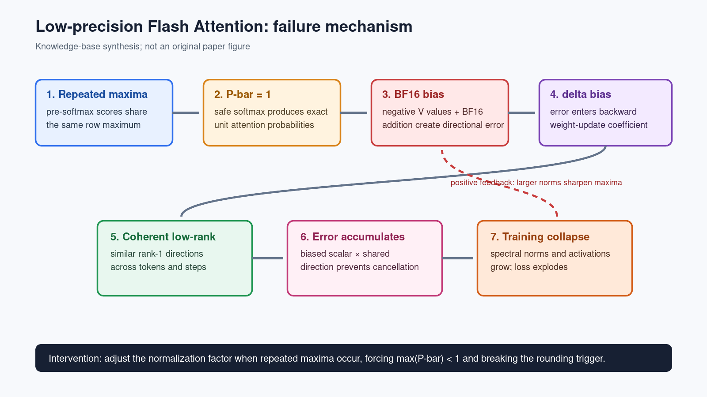

---
tags:
  - paper
  - collection/ai-infrastructure
  - domain/kernel
  - status/deep-review
  - topic/numerical-stability
  - method/flash-attention
---

# Why Low-Precision Transformer Training Fails: An Analysis on Flash Attention 深度评审

> [!info] 文档关系
> - 文档类型：Paper
> - 领域入口：[Custom Attention README](../README.md)
> - 相关主题：[视频生成稀疏 Attention](../surveys/video-generation-sparse-attention.md)
> - 证据资产：`../assets/papers/low-precision-flash-attention/`
>
> 证据边界：本文以 arXiv:2510.04212v4 的 HTML/PDF、官方代码仓库和公开 OpenReview 页面为主。论文正文直接支持 BF16 Flash Attention 失败机制与稳定化实验；官方仓库是纯 PyTorch 的 Flash Attention 风格重实现，不等同于 NVIDIA/Aten 的生产 fused kernel。任何关于真实硬件 fused accumulator、FMA、Ascend/CANN kernel 行为的结论均需另行实测。

## 修订信息

- 当前文档版本：`1.1.0`
- 当前修订 ID：`rev-lowprecision-flash-attention-code-audit-20260922`
- 当前修订时间：`2026-09-22T00:00:00+08:00`
- 替代版本：`rev-lowprecision-flash-attention-initial-20260922` / `1.0.0`

| 修订 ID | 文档版本 | 类型 | 变更摘要 | 依据 | 对结论影响 |
|---|---|---|---|---|---|
| `rev-lowprecision-flash-attention-initial-20260922` | `1.0.0` | initial | 建立论文、代码、机制图与知识库发布 | arXiv v4、官方仓库 | material |
| `rev-lowprecision-flash-attention-code-audit-20260922` | `1.1.0` | evidence-update | 固定官方代码 HEAD；补充论文/仓库配置差异、beta 演化、复现缺口、Ascend 证据边界和未实测 backward 返回值风险 | 官方仓库 HEAD `02f0ab60521a9a2bb24760969616e4c3c139588d`；异步代码审计 | minor |

## 0. 资料与配图索引

| 对象 | 状态 | 位置 / 版本 | 用途 |
|---|---|---|---|
| 论文 PDF | 已获取 | `arXiv:2510.04212v4`，SHA-256 `f31e749e10a1593e8fce325c091c4dc99141a351fa0a5f98ae50e45617df510d` | 正文、公式、图注与版本锚点 |
| 论文 HTML | 已获取 | `https://arxiv.org/html/2510.04212v4` | 可搜索正文、公式和图表资产 |
| 官方代码 | 已固定 | `https://github.com/ucker/why-low-precision-training-fails`，commit `02f0ab60521a9a2bb24760969616e4c3c139588d` | 稳定/不稳定 attention 分支、训练配置、复现边界 |
| OpenReview | 页面可定位，正文受限 | `https://openreview.net/forum?id=0jHyEKHDyx` | 交叉核验入口；未把搜索摘要当作评审正文 |
| 原论文 Figure 1 | 已提升 | `../assets/papers/low-precision-flash-attention/fig1-failure-process.png`；正式资产同名 | 论文的因果链总览 |
| 知识库整理图 | 已生成 | `../assets/papers/low-precision-flash-attention/lowprecision-fa-causal-chain.png` | 读者可用的算法/机制总览，非原论文图 |

## 0.1 术语与符号解释

### 0.1.1 术语表

| 术语 | 本文含义 | 别名 | 不等于/易混项 | 证据来源 |
|---|---|---|---|---|
| Flash Attention | 通过分块、在线 softmax 和片上中间状态避免物化完整注意力矩阵的 Attention 实现 | FA | 不等于所有 fused scaled-dot-product kernel | 论文背景、官方 `attention.py` |
| BF16 | 1 sign、8 exponent、7 fraction bits 的低精度浮点格式 | bfloat16 | 不是 FP16；动态范围接近 FP32，但有效精度更低 | 论文 §2.2 |
| repeated maximum | 一行 pre-softmax score 中多个元素共享相同最大值 | 重复最大值 | 不等于一般的高 entropy 或 attention sink | 论文 §3.3.2 |
| P-bar | online softmax 中由 `exp(S-m)` 构成的归一化前概率项 | $\bar P$ | 不等于最终完整 softmax 矩阵的任意近似 | 论文 §3.3.2 |
| biased rounding | 在特定数据分布和运算顺序下，舍入误差不再近似零均值而长期偏向一侧 | 方向性舍入偏差 | 不等于所有 BF16 加法都必然有偏 | 论文 §2.2、§3.3.2 |
| low-rank error direction | 多个 token/step 的梯度误差在相近 rank-1 方向上具有结构相似性 | 低秩误差方向 | 不等于模型权重整体低秩 | 论文 §3.3.1 |
| stabilized Flash Attention | 在重复最大值条件下改变 normalization，使 `max(P-bar)<1` 的最小改动 | stabilized FA | 不是完整的新 Attention 架构 | 论文 §4、代码 `attention.py` |
| attention sink | 某些 token 长期吸收很高注意力概率的现象 | sink token | 论文把它作为触发条件的放大因素，不是唯一根因 | 论文讨论部分 |
| fused production kernel | 将矩阵乘、softmax、累加等融合到目标硬件 kernel 的生产实现 | fused FA | 官方仓库中的 PyTorch tiled loop 只是参考实现 | 代码审计、FlashAttention 讨论页 |

### 0.1.2 符号表

| 符号 | 含义 | 性质 | 作用域 | 来源 | 易混点 |
|---|---|---|---|---|---|
| $Q,K,V$ | Query、Key、Value 矩阵 | paper-defined | Attention forward | 论文 Algorithm 1 | $K$ 也出现在梯度结构中 |
| $S$ | 缩放后的 pre-softmax score | paper-defined | 每个 attention row | 论文 §3 | 不等于最终概率 |
| $P$ | 高精度参考概率 | paper-defined | 对照路径 | 论文 §3.3 | 与 $\bar P$ 区分 |
| $\bar P$ | online softmax 的分块归一化项 | paper-defined | `P V` 计算 | 论文 §3.3.2 | 精确为1是触发点 |
| $O$ | Attention 输出 | paper-defined | forward/backward | 论文 §3.3 | $O_{lp}$ 与 $O_{hp}$ 的差异是关键 |
| $dO$ | 输出梯度 | paper-defined | backward | 论文 §3.3.2 | 不是 loss scalar |
| $\delta$ | `rowsum(dO ⊙ O)` 的行向量 | paper-defined | backward | 论文 §3.3.1 | 低精度差异进入该项 |
| $\delta_{lp},\delta_{hp}$ | 低精度/高精度路径的 delta | paper-defined | 差分分析 | 论文 Eq. 2/3 | 下标表示精度，不表示层 |
| $R$ | 跨 token/step 相似的 rank-1 更新方向 | analysis of paper | $W_Q$ 梯度差 | 论文 Eq. 3 | 不是固定模型参数 |
| $N,d$ | 序列长度与 head 特征维度 | algorithm-defined | Attention 输入 | 论文 Algorithm 1 | $N$ 不等于训练 token 总量 |
| $m,r$ | online softmax 的行最大值与行和 | algorithm-defined | 分块归一化 | 论文 Algorithm 1 | 稳定化版本会调整 $m$ |
| $\beta$ | 稳定化 normalization 的放大因子 | method-defined | 重复最大值分支 | 论文 §4、代码 | 不是学习率或温度 |

## 0.2 AI 生成算法分析示意图

上图是知识库整理图，不是论文原图。它把论文的反向定位过程改写成正向运行时因果链：重复最大值触发精确单位概率，BF16 `P-bar V` 累积产生方向性误差，误差通过 delta 进入梯度，并在结构相似的低秩方向上跨 step 累积。底部干预是论文提出的稳定化 normalization。

## 1. 论文基本信息

- 标题：*Why Low-Precision Transformer Training Fails: An Analysis on Flash Attention*
- arXiv：2510.04212v4
- 发表信息：ICLR 2026（公开索引标注）
- 作者：Haiquan Qiu、Quanming Yao
- 作者角色依据：Haiquan Qiu 为 first listed author；该角色来自 arXiv HTML title block。
- 作者证据：arXiv HTML title block lines 54-66。
- 作者机构：Department of Electronic Engineering, Tsinghua University
- 通讯邮箱：论文 HTML 显示 `qhq22@mails.tsinghua.edu.cn`、`qyaoaa@tsinghua.edu.cn`；邮箱仅作为来源事实，不作为身份推断
- 研究问题：为什么 GPT-2 使用 BF16 与 Flash Attention 训练时会在数千 step 后出现 catastrophic loss explosion？
- 论文类型：机制分析 + 最小干预验证，不是新的模型架构或完整生产 kernel 提案
- 代码：`https://github.com/ucker/why-low-precision-training-fails`

## 2. 研究动机与问题—方案闭环

### 2.1 出发点与背景痛点

具体场景：训练一个 GPT-2S，输入是 OpenWebText 的长度 1024 token batch，模型采用 BF16 autocast 和 Flash Attention。训练初期 loss 正常下降；数千 step 后，某些 attention head 的数值误差进入 backward，loss 突然爆炸并最终出现 NaN。工程师通常可以切回标准 Attention 或 FP32，但这会放弃 Flash Attention 的显存/吞吐优势。

论文要保留的行为是：使用分块 online softmax、低精度主计算和长序列高效训练；需要改变的行为是：不让特定的低精度误差在相同结构方向上持续写入权重。

### 2.2 现有方案为何不够

| 现有方案/做法 | 具体失败场景 | 根因 | 为什么简单修补不够 | 证据 |
|---|---|---|---|---|
| 切回标准 Attention | 训练可稳定，但失去 Flash Attention 的内存和速度路径 | 规避了触发路径而非解释触发条件 | 不能指导 fused kernel 如何保留性能并修正数值行为 | 论文 §3.2 |
| 全部改 FP32 | 参考路径稳定，但显存、带宽和计算成本上升 | 直接消除 BF16 舍入误差 | 不适合作为低精度训练的长期方案，也不能说明哪一步有问题 | 论文 §3.2 |
| QK normalization / clipping / gated attention | 可以压低极端 score 或改变表示结构 | 打断了重复最大值或低秩相似性的一部分条件 | 这些是经验性 workaround，未定位 `P-bar V` 的舍入根因 | 论文 related work/discussion |
| 只看 loss、权重范数 | 通常在 loss explosion 后才看到明显异常 | 监控点位于故障链末端 | 无法提前定位是 forward `O`、backward delta 还是 optimizer 导致 | 论文 Fig. 3/5/9 |

### 2.3 论文计划解决的问题与成功标准

论文的成功标准是完成一条可干预的机制闭环：复现 BF16+FA 失败；证明低精度 `O` 或 delta 是必要故障入口；证明跨 token/step 的低秩结构使误差无法抵消；定位 BF16 `P-bar V` 加法的方向性偏差；最后只修改 softmax normalization，就能让相同训练配置恢复稳定。

### 2.4 核心方案如何解决并优化问题

稳定化方案只在一行 score 的最大值重复时改变 normalization。若重复最大值 `r_m>0`，令 `m=βr_m`；若 `r_m<0`，令 `m=0`，其中 `β>1`。这样 `max(S-m)<0`，从而 `P-bar=exp(S-m)` 严格小于1，避免 `P-bar=1` 与同号 BF16 累加共同触发舍入偏差。

改变的变量是在线 softmax 的基准 `m`，保留了分块计算、输出形式和反向接口。论文报告 GPT-2S 在 AdamW/Muon、GPT-2M 的稳定化训练均不再出现原始 loss explosion；这是机制干预证据，不等价于证明该方案覆盖所有低精度失败模式。

### 2.5 完整因果链与证据闭环

1. 模型训练后出现某些 attention head 的相似低秩结构，尤其是 `(PK)[T]ᵀ X[T]` 形式的 rank-1 更新原子。
2. 重复 pre-softmax 最大值使 online softmax 的某些 `P-bar[T,t]` 精确等于1。
3. 当对应 `V[:,i]` 多为负时，`P-bar V` 的 BF16 同号加法发生 significand overflow、右移和舍入，误差偏向更负。
4. `O_lp-O_hp` 与 `dO` 的符号相互作用，使 `(delta_lp-delta_hp)[T]` 偏向正值。
5. 正偏系数乘相似 rank-1 方向，跨 token 与训练 step 的误差不再抵消，而是写入 `W_Q` 梯度。
6. 权重谱范数和激活放大，使 score 更尖锐、重复最大值更容易发生，形成正反馈。
7. 稳定化 normalization 让 `P-bar<1`，切断舍入触发条件，训练恢复稳定。

论文 Figure 1 直接概览该闭环；Fig. 3、4、5、6、7、9 和 10 分别提供 head、低秩相似性、delta/舍入误差、稳定化和谱范数证据。代码中 `STABLE=1` 分支与论文干预方向一致，但具体实现使用 `1e-3` 近似判断 close-to-max，并固定正最大值乘2，需与论文 Algorithm 1 的精确条件区分。

## 3. 核心贡献与创新点

1. 把一个长期被视为“低精度随机不稳定”的 Flash Attention 失败现象拆成可定位的数值因果链。
2. 证明低秩结构本身不是故障，关键是它为有偏的标量舍入误差提供了跨 step 的相干方向。
3. 将偏差追溯到重复最大值造成的 `P-bar=1`，以及该条件下 BF16 `P-bar V` 加法的方向性误差。
4. 给出只改 normalization 的稳定化 Flash Attention，并用多个训练配置验证稳定性。
5. 对 AI Infra 的直接启示是：低精度 Attention 的正确性必须按运算顺序、累加精度、FMA、tile 边界和 reduction 顺序审计，而不能只看格式名称。

## 4. 研究方法

### 4.1 方法总览

论文采用“复现 → 分层替换 → 梯度差分 → 结构分析 → 单点干预”的逆向调试流程：

- 用固定数据 batch 重现 GPT-2S 的稳定/不稳定轨迹；
- 将 Flash Attention 的 forward 输出 `O`、backward 中的 `delta` 分别替换为高精度版本；
- 对 attention head 的 `W_Q` 谱范数和梯度差做定位；
- 分解梯度差，检验相似 rank-1 方向与标量系数是否共同存在；
- 追溯 `O_lp-O_hp` 到 `P-bar V` 的 BF16 加法；
- 在 repeated-max 条件下改变 normalization，重新训练验证。

### 4.2 组件级设计动机与具体问题映射

**固定 batch replay。** 作者使用记录并复用导致失败的数据 batch，减少数据采样随机性对故障位置的干扰。这是论文直接说明的实验控制；代价是不能证明所有随机数据顺序都会在同一步触发。

**高精度替换实验。** 分别把 `O`、delta 或相关路径切到高精度，观察稳定性是否恢复，用于定位故障进入 backward 的位置。该设计将“FA 整体有问题”缩小到具体中间量，但不能单独排除所有 kernel 实现差异。

**低秩方向分解。** 将 `dW_Q^hp-dW_Q^lp` 近似写成多个标量 `(delta_lp-delta_hp)[T]` 加权的 rank-1 原子，检验方向相似和系数偏置是否同时存在。它解释了为什么误差会积累而不是像独立噪声那样抵消。

**重复最大值干预。** 只修改 safe-softmax 的 `m`，让最大指数严格为负，避免 `P-bar=1`。这是最小干预，能够把“机制解释”转成可证伪实验；代价是改变了极少数 row 的 softmax 数值，需要评估对质量和吞吐的影响。

| 设计项 | 具体问题 | 机制 | 权衡 | 验证证据 | 判断 |
|---|---|---|---|---|---|
| 固定 batch replay | 随机数据顺序掩盖数值故障 | 复用相同 batch 隔离算术路径 | 触发时间不代表普遍触发时间 | 论文 §3.1、代码 `train.py` | 直接支持 |
| high-precision O/delta | 不知道故障进入哪一中间量 | 局部替换并观察稳定性 | 不能代表生产 kernel 的全部差异 | 论文 §3.2 | 直接支持 |
| low-rank decomposition | 解释误差为何跨 step 累积 | 共享方向 × 有偏标量 | 近似依赖结构相似假设 | 论文 Eq. 3、Fig. 4/5 | 直接支持但有适用边界 |
| repeated-max normalization | 需要最小修改切断触发条件 | 强制 `max(P-bar)<1` | 改变极少数 softmax row | 论文 §4、Fig. 7/8、代码 `attention.py:83-89` | 直接支持 |
| production fused-kernel mapping | 需要判断是否能迁移到硬件库 | 对照 accumulator/FMA/reduction 顺序 | 参考实现不等于生产 kernel | 官方代码与 FlashAttention 讨论 | 未充分验证 |

### 4.3 模型/系统架构

实验主体是 GPT-2S：12 layers、12 attention heads、embedding dimension 768、context length 1024，OpenWebText，BF16，Flash Attention 风格实现。训练脚本默认 AdamW，学习率 `1e-3`，warmup 2000，gradient clipping 1.0；README 提供 4 GPU DDP 复现命令。论文还报告 GPT-2M 和 Muon 配置的稳定化结果。

代码的 forward 将 Q/K/V 分块，维护每个 row 的 running max 与 running sum，再执行 `exp(score-new_max)`、`P-bar V` 和归一化。stable 分支在每个 block 中统计接近最大值的元素数，并按正/负最大值调整 block max。backward 则重新构造 `p=exp(attn_weights-lse)`，计算 `D=(dO*O).sum` 与 `ds=p*scale*(dp-D)`。

### 4.4 关键公式

$$
O=\operatorname{rowsum}(\bar P V),\qquad
\delta=\operatorname{rowsum}(dO\odot O).
$$

**这条公式在算什么？** 描述 Attention 输出和 backward 中进入梯度计算的 delta。

**怎么读？** 先用归一化概率 `P-bar` 对 V 做加权和得到 O，再把输出梯度与 O 逐元素相乘并按行求和。

**输入与输出。** 输入为 `P-bar,V,dO,O`；输出为 Attention 输出 `O` 和每个 token 的标量/向量 `delta`。

**变量在这里各做什么？** `P-bar` 决定 token 混合权重，`V` 提供内容，`dO` 是上游梯度，`O` 把 forward 数值误差带入 backward。

**直觉。** 只要 `O_lp` 与 `O_hp` 有系统性偏差，delta 就可能把该偏差转换成梯度系数。

**边界。** 该式没有写出具体 kernel 的累加精度、FMA 或 reduction 顺序；这些实现细节会改变数值误差。

**小例子。** 如果 `dO` 与 `O_lp-O_hp` 在某 feature 同为负，则它们的乘积为正，会使 `(delta_lp-delta_hp)` 向正侧偏移。

$$
dW_Q^{hp}-dW_Q^{lp}\approx
\sum_{T=1}^{N}(\delta_{lp}-\delta_{hp})[T]\,R_T,
\qquad R_T\approx (PK)[T]^\top X[T].
$$

**这条公式在算什么？** 近似分解低/高精度 Q 投影梯度差。

**怎么读？** 每个 token 的标量 delta 误差作为系数，乘以一个由模型表示决定的 rank-1 更新方向，再跨 token 累加。

**输入与输出。** 输入是 `delta` 差异、P/K/X 表示；输出是 Q 投影的累计梯度误差。

**变量在这里各做什么？** `R_T` 表示结构方向，系数表示数值误差强度与符号；求和表示跨 token/step 的累积。

**直觉。** 零均值系数会抵消；有偏系数遇到相似方向会持续同向写入权重。

**边界。** 这是论文用于解释观测的近似，不是对任意 Transformer 或任意 kernel 的普适定理。

**小例子。** 如果连续 100 个 step 的 `R_T` 主方向相似且系数多为正，则谱范数会沿该方向增长，而不是像独立噪声一样平方根增长。

$$
\max(S-m)<0\quad\Rightarrow\quad
0<\bar P=\exp(S-m)<1.
$$

**这条公式在算什么？** 说明稳定化 normalization 如何排除 `P-bar=1`。

**怎么读？** 让每行 score 的最大值减去 normalization 基准后严格为负，指数结果就严格小于1。

**输入与输出。** 输入是 score 行 `S` 和基准 `m`；输出是 bounded 的 `P-bar`。

**变量在这里各做什么？** `S` 是 pre-softmax score，`m` 是 online softmax 的 running normalization。

**直觉。** 不让概率项精确落在浮点数1，避免其与负 V 的 BF16 同号加法形成论文所追踪的偏差。

**边界。** `P-bar<1` 不是所有数值错误的充分条件；它只切断论文识别出的一个触发条件。

- 小例子。重复最大值时取 `m=βr_m, β>1`，最大指数为 `-(β-1)r_m<0`；负最大值时取 `m=0`，同样使最大指数小于0。

### 4.5 训练/实验/部署设计

- 训练：GPT-2S/OpenWebText/1024 context/BF16/FA，固定 batch replay，稳定与不稳定分支对照。
- 对照：standard attention、高精度 O/delta 替换、原始 FA 与 stabilized FA。
- 规模：论文报告 600K step GPT-2S 的稳定化训练，以及 GPT-2M 的较短训练；代码 README 提供四 GPU DDP 命令。
- 稳定化参数：论文示例 `β=2`；仓库实现以 close-to-max 阈值和 block max 调整近似实现。
- 部署边界：论文目标是训练稳定性，不是 serving latency；Flash Attention 的 kernel 级迁移仍需以目标硬件实现为准。

论文实验配置与公开仓库默认配置不能直接视为同一复现实验：论文正文报告 4×A100 80GB、每 GPU micro-batch 32、gradient accumulation 4；仓库默认 `batch_size=20`、`gradient_accumulation_steps=16`，README 还以 4×24GB GPU 为复现目标。仓库没有提交论文所需的失败 checkpoint、固定 batch-index、loss CSV 或原始曲线，且默认 seed 设置被注释。因此“代码可运行”不等于“公开仓库可完整重放论文图表”。

## 5. 关键结论

### 5.1 主结果

论文报告原始 BF16+Flash Attention 会出现突然 loss explosion；将相关中间量转为高精度或使用标准 Attention 可以稳定；稳定化 safe softmax 在 GPT-2S、GPT-2M 以及 AdamW/Muon 配置上恢复稳定训练。核心不是“BF16 一定失败”，而是 repeated maxima、V 的符号分布、BF16 加法舍入和结构相干性共同满足时才形成灾难性反馈。

### 5.2 消融和机制证据

| 证据 | 观察 | 支持的结论 | 不能支持的结论 |
|---|---|---|---|
| high-precision O 替换 | 训练恢复稳定 | O 的低精度误差是关键入口 | 所有 FA kernel 都有同样误差 |
| head spectral norm | 少数 head 明显异常，head 8 聚焦分析 | 故障具有局部 head 结构 | 仅 head 8 是所有模型的普遍根因 |
| rank-1 similarity | `(PK)[T]ᵀX[T]` 出现相近列/方向 | 误差可跨 step 相干累积 | 任意低秩表示都会导致失败 |
| cumulative delta coefficient | 临近失败 step 方向性偏正 | 标量误差不再零均值抵消 | 所有数据分布都必然偏正 |
| BF16 addition analysis | `P-bar=1` 与负 V 同号累加产生方向性误差 | 解释偏差的算术来源 | 真实硬件 FMA/FP32 accumulator 必然复现 |
| stable normalization | 避免 `P-bar=1` 后训练稳定 | 该机制足以导致原失败 | 该修复是所有低精度问题的最优方案 |

### 5.3 是否验证了假设

论文对“该特定失败案例由低秩相干方向与 BF16 方向性舍入共同造成”的验证较强：它既追踪了中间量，又用最小干预恢复稳定。验证范围仍有限于 GPT-2 风格训练和作者的实现路径，未覆盖大规模生产 fused FlashAttention、FP8/FP4、不同 reduction 顺序或 Ascend/CANN kernel。

### 5.4 收益来源归因

稳定性的直接来源可以归因于 normalization 改动切断 repeated-max 触发条件；不能把结果归因于更高精度、梯度裁剪或优化器改变，因为稳定化实验保持了主要训练设置。吞吐收益没有被论文完整量化；该方案是否在生产 kernel 中零开销，需要单独 benchmark。

## 6. Related Work 对比

| 路线 | 机制 | 优点 | 局限 | 本文关系 |
|---|---|---|---|---|
| Standard Attention | 显式或高精度计算 attention | 数值行为直观 | O(N²) 内存/计算路径，长序列成本高 | 作为稳定但低效对照 |
| Flash Attention | tiled online softmax、避免 materialize attention matrix | 低显存、高吞吐 | 运算顺序和累加精度更复杂 | 本文定位其低精度失败条件 |
| QK normalization | 约束 Q/K 范数或 score | 减少极端 logits | 改变表示和优化动力学，不直接定位 PV rounding | 经验性替代干预 |
| QK clipping | 截断 score | 简单 | 可能损伤注意力分布，仍未解释 PV 偏差 | 经验性 workaround |
| Gated Attention | 给 attention 输出增加门控 | 可抑制异常 attention head | 引入架构变量和额外学习过程 | 讨论中的替代路径 |
| 本文 stabilized FA | 条件化调整 online softmax normalization | 小改动、直接切断触发条件 | 适用范围和生产 kernel 代价需验证 | 机制验证方案 |

## 7. OpenReview 公开评审 × 论文内容交叉核验

公开页面 `https://openreview.net/forum?id=0jHyEKHDyx` 可定位，搜索结果能确认论文标题、摘要和 ICLR 2026 关联；当前访问环境无法稳定获取完整 review、score、rebuttal 或 meta-review 正文。因此本节不把第三方摘要或搜索片段升级为评审结论。

### 7.1 与论文证据一致的正向评价

未做出可核验的逐条 reviewer 引用。论文自身的实验与代码支持“特定 BF16+FA 失败可被机制化解释并通过最小 normalization 改动稳定”的范围内结论。

### 7.2 经核验仍成立的主要担忧

- 官方代码是 PyTorch reference-style implementation；真实 FlashAttention fused kernel 可能使用 FP32 accumulator、FMA 和不同 reduction 顺序。
- 主要实验围绕 GPT-2 与 BF16，不能直接外推到 FP8/FP4 或所有 NPU。
- 稳定化方案对质量、吞吐、不同序列长度和不同模型规模的系统性代价仍缺 matched benchmark。
- 固定失败 batch 有助于机制定位，但会弱化对随机数据顺序下故障发生率的估计。

### 7.3 Rebuttal/Revision 是否真正解决问题

无法核验完整 rebuttal 或 review thread，因此不作“已解决评审担忧”的判断。v4 正文已明确加入多硬件验证和注意力 sink 讨论的方向性信息，但本次没有把搜索摘要当成逐段 revision 证据。

### 7.4 对本文贡献、适用范围和潜在风险的影响

本文最稳健的贡献是数值机制诊断和可证伪的最小干预，不是一个已经证明在所有 Flash Attention 后端上都可直接合入的生产 patch。工程落地必须先做 kernel-level differential test，再决定是否改 normalization、提升局部累加精度或增加运行时监控。

## 8. Infra 需求分析

### 8.1 算力

稳定化逻辑位于 online softmax 的 row/block max 路径，额外算子包括 close-to-max 比较、计数、条件选择。理论上不是主要 FLOPs；实际代价取决于是否破坏 kernel fusion、是否引入同步或寄存器压力。对 Ascend/CANN，需把 score、max、exp、sum、PV 累加作为一个融合单元评估，而不是单独 benchmark softmax。

### 8.2 显存与存储

Flash Attention 的优势在于不物化完整 `N×N` attention matrix；论文机制分析依赖保存/重算 Q/K/V/O/LSE 等中间量。训练时应分别记录 activation checkpoint、LSE、临时 tile buffer、梯度和 optimizer state。稳定化分支理论上不需要显著增加 global memory，但 close-to-max mask 的保存方式可能改变寄存器和片上缓存压力，必须用 profiler 验证。

### 8.3 Data Types / 数值格式

| 对象 | 论文/代码路径 | 关注点 | Ascend/CANN 适配问题 |
|---|---|---|---|
| Q/K/V 主计算 | BF16 autocast | 输入舍入、乘加格式 | Matmul accumulate dtype 与 NVIDIA 路径是否一致 |
| online max/sum | 代码按输入 dtype 保存部分状态 | running max/sum 的舍入 | 是否使用 FP32 accumulator、是否有 cast 回 BF16 |
| `P-bar V` | 触发方向性偏差的关键 | 同号 BF16 累加、sticky/rounding | vector/matrix reduction 顺序与硬件舍入模式 |
| router-like metadata | 不适用 | 本文不是 MoE 路由问题 | 不应把该机制误套到动态路由上 |
| stabilized normalization | `m` 调整、exp 后归一化 | 保证 `max(S-m)<0` | 条件分支能否编译进融合 kernel |

论文只直接分析 BF16；FP8、FP4、混合累加和随机舍入属于待验证扩展，不能由本文数字推导。

### 8.4 带宽、互联与高效利用

本文不是通信论文，但训练失败会使分布式作业的有效利用率归零。多卡复现使用 DDP；对大模型训练，需在每个 rank 记录 attention kernel 时间、通信时间、loss/谱范数和 rank 间 divergence。稳定化逻辑应优先在设备侧完成，避免把 row-level metadata 回传 Host。

### 8.5 CPU/GPU/NPU 异构执行

官方代码将训练控制、数据读取和分布式初始化放在 CPU，将 attention 数值路径放在 GPU。迁移到 NPU 时要验证：BF16 cast、exp、reduce-max、reduce-sum、PV accumulate、反向 `D` 与 `ds` 的 dtype；尤其要验证 host fallback 和图编译对条件分支的处理。不能仅凭“BF16 格式相同”认为数值行为一致。

### 8.6 调度/Serving/自定义算子

这是训练稳定性问题，非 serving latency 提案。建议提供三类自定义算子测试：原始 FA、稳定化 FA、FP32 reference；在相同 Q/K/V 上比较 O、LSE、dQ/dK/dV 和最终梯度的 ULP/relative error。生产监控应加入 repeated-max rate、`max(P-bar)` 分布、`O_lp-O_hp` 抽样误差、delta bias、head spectral norm 与 loss spike early warning。

## 9. 开源代码对照

- 官方仓库：`https://github.com/ucker/why-low-precision-training-fails`
- 固定提交：`02f0ab60521a9a2bb24760969616e4c3c139588d`
- 本地快照：`/tmp/lowprec-flash-review/code/why-low-precision-training-fails-main`
- 主要文件：`attention.py`、`model.py`、`train.py`、`README.md`
- 代码状态：已固定上述 commit；仓库仍是纯 PyTorch reference-style 实现，不是 CUDA/C++ fused kernel。

代码与论文对照：

| 论文机制 | 代码位置 | 一致性判断 |
|---|---|---|
| tiled online softmax | `attention.py:59-111` | 结构一致 |
| causal mask | `attention.py:76-78` | 实现存在 |
| stable normalization | `attention.py:83-89` | 方向一致；实现以 `1e-3` close-to-max 近似 |
| BF16 autocast | `train.py:99-101,151-154` | 一致 |
| GPT-2S 配置 | `train.py:77-85` | 一致 |
| 4-GPU DDP 复现 | `README.md:18-27`、`train.py:117-143` | 一致 |
| production fused FlashAttention | 未提供 | 不可由仓库证明 |
| 完整反向 fused kernel | `attention.py:120-183` 为 Python/PyTorch backward | 参考实现，不是生产 kernel |

当前 HEAD 的 `FlashAttentionFunction.backward()` 返回值数量看起来为 8 项，而 forward 输入为 7 项；这可能影响真实 backward 调用，但当前环境没有 CUDA、完整数据和训练日志，未将其写成已实测失败，只列为复现前应先验证的代码风险。论文 v4 推荐 `β=2`，早期版本曾出现 `β=7`；当前固定 HEAD 将正最大值分支硬编码为 `2.`，不能混用早期正文或旧 commit 的参数口径。

### 9.1 开源权重/配置对照

仓库不发布模型权重；训练从 scratch 或 checkpoint resume。README 要求 OpenWebText 预处理、PyTorch 2.6.0/CUDA 12.4、4×24GB GPU 复现路径。默认脚本含一个 resume checkpoint 路径，但对应大文件未随本次快照获取，因此不把它当作可复现资产。

## 10. 优点与局限

### 优点

- 机制链条完整，从 loss explosion 逆向定位到 BF16 `P-bar V` 加法。
- 用局部高精度替换和最小 normalization 改动形成较强的因果干预证据。
- 对 AI Infra 最重要的启示是明确指出“数值格式、运算顺序和表示结构”必须联合分析。
- 官方代码足以复查 stable 分支和训练超参数，而不是只给伪代码。

### 局限

- 参考代码不是生产 fused FlashAttention；FP32 accumulator/FMA/reduction 顺序可能改变结果。
- 公开实验主要是 GPT-2、OpenWebText 和 BF16，规模及数据分布有限。
- 未完整验证 FP8、FP4、随机舍入、不同硬件和不同编译器。
- 稳定化 patch 的质量/吞吐代价和触发率缺少广泛 matched ablation。
- 当前环境无法稳定提取 OpenReview 全部评审正文。
- PDF 交叉引用损坏导致本地 `pdftotext` 失败，正文使用 arXiv HTML 交叉替代；PDF 本身保留作为原始证据。

### 可改进之处

优先发布真实 fused kernel 的逐算子误差对照、跨 GPU/NPU 的 accumulator/reduction 配置，统计不同模型/数据的 repeated-max rate；再比较 normalization patch、局部 FP32 PV、随机舍入和高精度 delta 的吞吐—稳定性—质量曲线。

## 11. 研究启发

1. 低精度训练的错误不应默认建模为独立零均值噪声；表示结构会把小误差变成相干更新。
2. Flash Attention 的数值审计应把 `max/exp/sum/PV/LSE/backward D` 作为一条链测试。
3. 对 NPU 适配，格式兼容只是起点；必须验证累加精度、tile 顺序、融合边界和确定性。
4. 可以把 repeated-max rate、delta bias 和 update spectrum 做成训练运行时监控，在 loss explosion 前预警。
5. 论文机制与视频生成、MoE 的共同点是“稀疏/分块结构改变误差和负载的相关性”；但不能直接把 FA 的数值结论外推成 MoE 路由结论。

## 12. 解读问题/待验证清单

1. 真实 NVIDIA FlashAttention 版本使用 FP32 accumulator/FMA 时，论文机制是否仍以同样频率出现？
2. Ascend 910B/昇腾950 的 BF16 reduce 与 exp/PV kernel 是否产生相同方向性误差？
3. `β`、close-to-max 阈值和 row length 之间的稳定性/质量/吞吐曲线是什么？
4. repeated-max rate 是否可作为跨模型的早期故障指标？
5. FP8/FP4 中对应触发条件是 `P-bar=1`，还是会出现新的舍入吸收/下溢机制？
6. 训练大模型时，低秩更新方向是否仍集中在少数 head，还是会分散到多层？
7. stable normalization 是否改变 attention sink 的功能语义或长上下文质量？
8. 图编译和 kernel autotune 是否会改变 reduction order，从而影响复现性？

## 13. 一句话总结

这篇论文把 BF16 Flash Attention 的 loss explosion 从“神秘的低精度不稳定”还原成一条可干预的数值反馈链：重复最大值制造 `P-bar=1`，方向性 BF16 舍入误差再沿相似低秩表示累积到权重更新；但该结论应严格限定在论文与参考实现覆盖的路径，生产 GPU/NPU fused kernel 仍需逐算子验证。

## 14. 冻结前发布审计

- Markdown 渲染器：Python Markdown 3.10.2，启用 `tables` 与 `fenced_code` 扩展。
- 渲染命令或操作：使用本地 Markdown 渲染器检查表格、公式块、图片链接和标题；HTML 产物留在过程目录。
- 渲染结果：结构检查通过；所有要求章节存在，3 个关键公式均有相邻解释卡。
- Figure/Table 邻近性审计：原论文 Figure 1 作为单一机制图保存；知识库整理图明确标注非原图。原图下载和整理图 PNG 尺寸已用 `identify` 核验；视觉服务两次超时，未声称视觉服务通过。
- 临时标记扫描：clean；正式 Markdown 不引用 process root、page render 或绝对路径。
- 审计证据：`review_checklist.md`、`figure_inventory.md`、`deliverable_manifest.json`。
