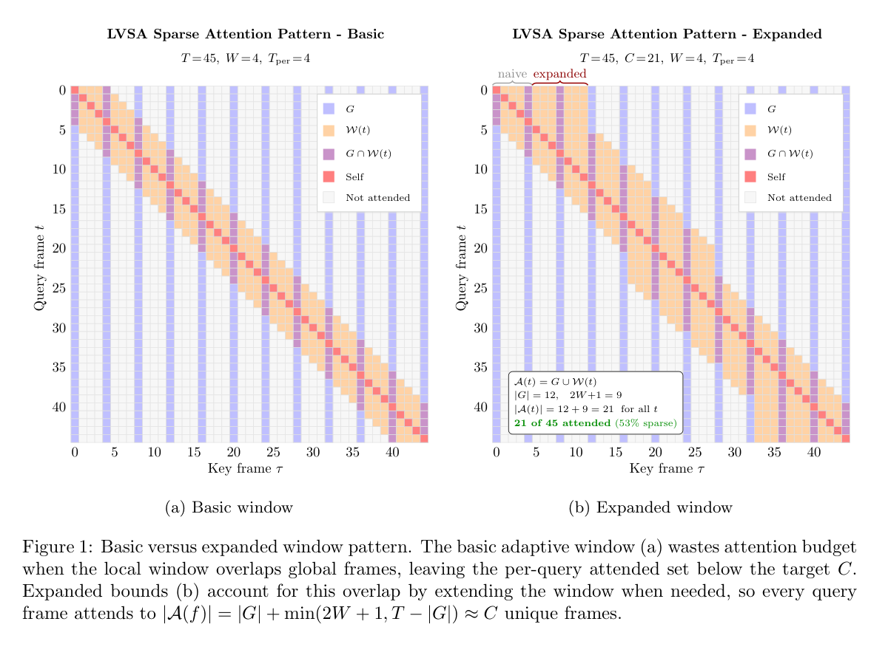
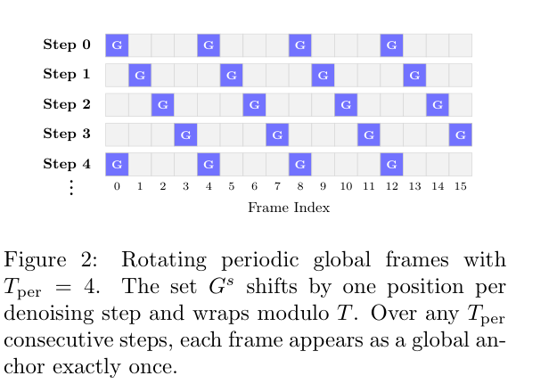
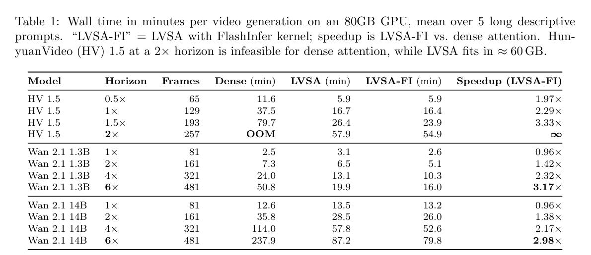
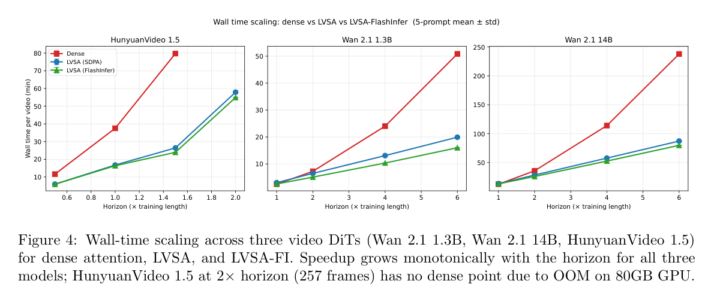

# LVSA: Training-Free Sparse Attention for Long Video Diffusion 精读分析

> [!info] 文档关系
> - 文档类型：Paper
> - 领域入口：[README](../README.md)
> - 上位汇总：[Multimodal custom attention](../surveys/multimodal-custom-attention.md)
> - 证据资产：`../assets/papers/lvsa/`
> - 相关文档：[Figure inventory](../evidence/figure-inventory.md)

> 资料状态：已重新核对 arXiv:2605.31057v1 的 10 页 PDF、LaTeX/source、当前官方代码 HEAD `100666e06026b98dfdab39036d9013e02319b479` 与 legacy 代码 commit `1ebcc92e13d353cbc685eb8bf435e47dd5dfa062`。原论文图表均为 PDF 页图裁剪；每张包含完整 caption 并经过 contact-sheet 与逐图原分辨率 QA。本文是 delegated process artifact，formal Paper/Survey/README/资产提升由 parent 负责。

## 修订信息

- 当前文档版本：`1.0.0`
- 当前修订 ID：`rev-lvsa-a2-initial`
- 当前修订时间：`2026-07-25T14:49:13+08:00`
- 替代版本：无；这是 remediation workspace 的首次可验证交付。legacy workspace 仅含 PDF/source/text/render/crops/code，没有可恢复的旧 `deliverable_manifest.json` 或冻结 review revision，因此本交付按 `initial` 而非 migration 记录。

| 修订 ID | 文档版本 | 时间 | 修订者 | 类型 | 替代修订 | 迁移问题/解析 | 变更摘要 | 原因 | 影响位置 | 依据 | 对结论影响 |
|---|---|---|---|---|---|---|---|---|---|---|---|
| `rev-lvsa-a2-initial` | `1.0.0` | `2026-07-25T14:49:13+08:00` | `delegated-paper-review-agent` | `initial` | 无 | 无 | 建立完整单篇分析、拆分视觉证据、代码/OpenReview/infra 复核与 manifests | 父任务要求修复非 ICML 单篇交付 | `analysis.md`；[Figure inventory](../evidence/figure-inventory.md)；过程侧公开评审记录；`code/LongVideoSparseAttention` | task packet、arXiv PDF/source、官方代码、结构/语义验证 | material |

## 0. 资料与配图索引

- 论文：`paper.pdf`，SHA-256 `ebb29504b4eeeff18c2c2f182a4ca95f36180968706064ac9bc419cb738c306c`
- arXiv source：`source/arxiv_source.tar` 与 `source/unpacked/`
- 提取文本：`extracted_text/full_text.clean.txt`
- 来源复核：`source_verification.md`
- 开源代码：`code/LongVideoSparseAttention`，commit `100666e06026b98dfdab39036d9013e02319b479`
- OpenReview：未发现公开 forum；证据与 403 访问分类见 过程侧公开评审记录
- 图表 inventory：[Figure inventory](../evidence/figure-inventory.md)
- Figure 1：`../assets/papers/lvsa/fig1_expanded_window_caption.png`
- Figure 2：`../assets/papers/lvsa/fig2_rotating_global_anchors_caption.png`
- Table 1：`../assets/papers/lvsa/table1_wall_time_caption.png`
- Figure 4：`../assets/papers/lvsa/fig4_wall_time_scaling_caption.png`
- Contact sheet：`figures/contact-sheet.png`
- AI 生成分析示意图：未生成。已安装的 `openrouter-icu-image` 只提供 image generation/edit CLI，没有 `responses-doc --input-file analysis.md` 文档输入路径；按 skill 禁止用 prompt-only 替代。

## 0.1 术语与符号解释

### 0.1.1 术语表

| 术语 | 本文含义 | 别名 | 不等于/易混项 | 证据来源 |
|---|---|---|---|---|
| LVSA | 以 frame-block 为粒度、训练免费地限制视频 DiT 自注意力 support 的规则 | Long Video Sparse Attention | 不是 QK-score router，也不是通过微调学习稀疏 pattern | PDF §2；code `lvsa/sparse_attention.py:451-612` |
| latent frame | VAE 时间压缩后进入 DiT 的一帧 token grid | frame（论文 §2 的简写） | 不等于最终解码视频帧；Wan 81 视频帧对应 21 latent frames | PDF §2–3 |
| training horizon | 模型训练时的参考视频长度 | native/reference horizon | 不等于 LVSA 的 attended-frame budget；需考虑 VAE 时间压缩 | PDF §1、§3 |
| attention budget | 每个 query frame 可见的近似固定 frame 数 $C$ | reference-frame budget | 不是 token FLOPs 的绝对值；每帧仍含 $P$ 个 patches | PDF §2 |
| global anchor | 所有 query frames 都可见的周期性/初始 frame | global frame, keyframe | 不是语义检测出的关键帧；论文规则是几何周期 grid | PDF Definition 2；Eq. (3) |
| expanded window | 当 local window 与 global anchors 重叠时向外扩展，补足非 global slots | expanded adaptive window | 不是增加 $C$，而是减少重复计数导致的预算浪费 | PDF Algorithm 1、Figure 1；code `expanded_window_bounds` |
| rotating global anchors | 每个 denoising step 平移周期 global grid | rotating keyframes | 不等于 camera motion 或 token routing；发生在 denoising-step metadata stage | PDF Eq. (3)、Figure 2 |
| LVSA-SDPA | 按 query frame gather `global + local` K/V，再多次调用 dense SDPA | LVSA | 数学 support 与 LVSA-FI 相同；runtime 表达不同 | PDF §3.1；code `lvsa_sdpa` |
| LVSA-FI | 将同一 support 编译为 block-CSR 与 compact K/V 后单次调用 FlashInfer | LVSA FlashInfer | FlashInfer 不产生 global/window pattern，也不应单独解释质量收益 | PDF Table 1；code `_build_flashinfer_csr`, `lvsa_flashinfer` |
| block-CSR | query block row pointer `indptr` 与 compact KV block index `indices` | sparse metadata | 不是 $N\times N$ dense mask，也不是 token-level COO | code `sparse_attention.py:679-764` |
| VQeval | 作者提出的 dynamic quality、loop quality、text alignment 复合视频指标 | custom quality benchmark | 尚无独立外部校准；不能视为感知质量 ground truth | PDF §3、Table 2 |
| Ulysses | sequence-parallel all-to-all，把 sequence shard 换成 head shard以执行完整 attention pattern | DeepSpeed-Ulysses | 论文 NPU 8 卡结果未给完整通信 telemetry；当前代码能力也晚于 v1 PDF | PDF §4；current code `docs/parallelism.md` |

### 0.1.2 符号表

| 符号 | 含义 | 性质 | 作用域/索引 | 单位/取值 | 来源 | 易混点 |
|---|---|---|---|---|---|---|
| $T$ | latent frame 总数 | author-defined | per request | frames | PDF §2 | 不等于 decoded video frame 数 |
| $H_p,W_p$ | 每 latent frame 的 patch-grid 高宽 | author-defined | model geometry | patches | PDF §2 | 不是像素高宽 |
| $P=H_pW_p$ | 每 latent frame 的 patch token 数 | author-defined | per model/resolution | tokens/frame | PDF §2 | 总 sequence 长度还要乘 $T$ |
| $N=TP$ | 视频 token 序列长度 | author-defined | per request | tokens | PDF §2 | dual-stream text tokens 未含在该简化式中 |
| $d$ | attention head dimension | author-defined | per head | elements | Eq. (1) | 不等于 model hidden size |
| $t,\tau$ | query frame 与 attended key/value frame index | author-defined | $0,\ldots,T-1$ | index | Eq. (1)–(2) | $t$ 不是 denoising step |
| $i,p$ | query patch 与 key/value patch index | author-defined | $0,\ldots,P-1$ | index | Eq. (1)–(2) | 与 frame index 分开 |
| $q_{t,i},k_{\tau,p},v_{\tau,p}$ | query/key/value token vectors | author-defined | per frame/patch/head | $\mathbb R^d$ | Eq. (1)–(2) | code suppresses batch/head axes |
| $\mathcal A(t)$ | query frame $t$ 可见的 frame set | author-defined | per query frame | set of indices | Definition 1–2 | 不是 materialized token mask |
| $G,G^s$ | 固定/第 $s$ 步旋转后的 global set | author-defined | per request/denoising step | frame set | Definition 2、Eq. (3) | current code还可 union initial/condition/guard frames |
| $\mathcal W(t)$ | query frame $t$ 的 local temporal window | author-defined | per query frame | frame set | Definition 2 | expanded bounds 后可宽于原 $2W+1$ 区间，但 non-global 数固定 |
| $W$ | local window 半宽 | author-defined | per config | frames | Definition 2 | window 原始宽度为 $2W+1$ |
| $w_{\mathrm{lo}},w_{\mathrm{hi}}$ (`w_lo`, `w_hi`) | expanded window 两端 | author-defined | per query frame | frame indices | Algorithm 1 | 不是 kernel tile bounds |
| $T_{\mathrm{per}}$ (`T_per`) | 周期 global anchors 的 frame 间隔 | author-defined | per config | frames | Definition 2 | current code名为 `key_frame_interval` |
| $C$ | 目标 unique attended-frame budget | author-defined | per query frame | frames | PDF §2 | integer rounding 可产生小偏差 |
| $s,S$ | 当前 denoising step 与总 steps | author-defined | diffusion inference | steps | Eq. (3) | 不等于 extrapolation ratio |
| $MB$ | FlashInfer query block rows | code-defined | per rank | blocks | code `_build_flashinfer_csr` | 不是 model batch size |
| $nnz$ | CSR 中可见 query-block/KV-block 边数 | analysis-derived | per metadata plan | block pairs | §8.4 推导 | 不等于 token-level nonzeros |
| $b$ | 每个 tensor element 字节数 | analysis-derived | dtype-dependent | bytes | §8.2 推导 | bf16/fp16 为 2，fp32 为 4 |

## 1. 论文基本信息

- 标题：LVSA: Training-Free Sparse Attention for Long Video Diffusion
- 作者：Gael Glorian, Ioannis Lamprou, Zhen Zhang, Yujie Yuan, Hongsheng Liu
- 版本：arXiv:2605.31057v1，2026-05-29；venue 未声明
- 研究领域：视频扩散 Transformer、training-free sparse attention、长视频 inference/runtime
- 核心问题：在训练长度外同时降低 dense temporal attention 的二次成本与 frozen/looping 质量退化
- 关键约束：单场景、固定几何规则、五个 prompts、80GB 单 GPU；NPU 实验为初步结果

## 2. 研究动机与问题—方案闭环

### 2.1 出发点与背景痛点

`author-stated`：视频 DiT 的 self-attention 随 $N=TP$ 呈 $O(N^2d)$ 增长；14B 模型在 80GB 设备上继续加长时遇到显存边界。更反直觉的是，超过 Wan 的 81 decoded frames 或 HunyuanVideo 的 129 frames 后，dense attention 还会产生近静止或循环视频。论文因此不是只追求 kernel speedup，而是把“算得起”和“延长后仍有运动”设为同一目标（Introduction；§3）。

`inferred`：这两个症状并非由同一证据直接证明同一根因。计算瓶颈来自 dense support；质量崩溃可能还受 RoPE 外推、scheduler、模型训练分布与 evaluator 偏置影响。LVSA 的证据能说明限制 support 与输出改善相关，但没有独立消融证明 fixed-grid bias 是唯一根因。

### 2.2 现有方案为何不够

论文把 prior art 分成两组。Sparse VideoGen、AdaSpa、Sliding Tile、Radial Attention旨在稀疏化，但作者认为长期重复仍难消除；RIFLEx 与 UltraViCo改善长度外推，却保留 dense support 或增加 dense-logit kernel 开销。失败模式因此是：效率方法未同时给出长度外质量，质量方法未同步降低 $N^2$ 计算。该分类在 Introduction/§3.3 有明确来源，但对 sparse baselines 没有同设置 head-to-head 数字，公平性只对 RIFLEx/UltraViCo 更强。

### 2.3 目标问题与成功标准

- 核心问题：不用训练、不改模型参数，在长 horizon 把每个 query frame 的可见 frame 数限制到近似 $C$。
- 成功标准 1：复杂度由 $O(T^2P^2d)$ 降到 $O(TCP^2d)$，且长度增大时端到端 speedup 增长。
- 成功标准 2：native horizon 质量近似 dense；extended horizon 的动态/循环质量不恶化并最好提升。
- 成功标准 3：同一 pattern 可用 SDPA、FlashInfer 和 NPU runtime 表达。
- 明确边界：单场景；不解决语义自适应路由、多镜头编辑、完整分布式通信优化或独立 benchmark 校准。

### 2.4 核心方案如何解决并优化问题

LVSA 先把 attention support 从“所有 frame”改成“周期 global anchors 与 local window 的并集”。它再用 expanded bounds 把 global/window 重叠浪费的 slots 补回来，使每行预算稳定；随后让周期 anchor grid 随 denoising step 轮转，避免永远只有固定 frame 获得全局可见性。runtime 上，SDPA 路径逐 frame gather，而 FlashInfer 路径把相同 support 编译成 block-CSR 和 compact K/V。前两步改变算法 support，最后一步改变执行效率，二者不能混为同一收益来源。

| 原始问题/失败模式 | 根因或约束 | 对应设计 | 改变的变量/行为 | 作用机制 | 预期优化 | 证据 | 判断 |
|---|---|---|---|---|---|---|---|
| dense cost/显存随 $T^2$ 增长 | 每个 query 看全部 $T$ frames | $G\cup\mathcal W(t)$ | $|\mathcal A(t)|:T\to C$ | 删除大多数 frame-block pairs | latency、memory、可扩展长度 | Eq. (2)、Table 1、Fig. 4 | supported |
| local/global 重叠造成预算不均 | set union 重复计数 | expanded bounds | non-global window slots 固定 | 向有空间的一侧延伸直到补足 slots | 每行计算/信息预算稳定 | Algorithm 1、Fig. 1、code | supported（规则）；质量因果未隔离 |
| 固定 global grid 长期偏置 | 非 anchor frames 从不全局暴露 | $G^s$ 轮转 | global membership 随 step 变化 | 每周期让 frames 轮流做 anchor | 降低重复/identity drift | Eq. (3)、Fig. 2、Table 2 | partially-supported；无 no-rotation matched ablation |
| Python per-frame SDPA 调用开销 | 多次 gather/concat/kernel launch | block-CSR + compact KV + FI | runtime 调用与数据布局 | 单次 planned sparse kernel | LVSA-SDPA→LVSA-FI latency | Table 1/3、code | supported |
| VBench 奖励静止一致性 | consistency metric 与感知动态性错位 | VQeval | 评价维度含 dynamic/loop | 对 frozen/looping 施加惩罚 | 更贴近作者目标的质量排序 | Table 2、Fig. 5 | plausible；缺外部校准 |

### 2.5 完整因果链与证据边界

因果链是：长视频需求触发 $\rightarrow$ dense support 带来二次计算与显存增长，同时训练长度外出现 frozen/looping $\rightarrow$ 现有效率与质量方案各自只覆盖一侧 $\rightarrow$ LVSA 把 support 限制为固定预算 global+local frame blocks $\rightarrow$ expanded bounds 消除 overlap 造成的预算波动，rotation 分摊固定 grid 偏置 $\rightarrow$ 计算 pair 数理论上由 $T^2$ 变为 $TC$，FlashInfer 再减少 runtime launch/layout 开销 $\rightarrow$ Table 1/Fig. 4 测得长 horizon speedup 与 OOM-to-fit，Table 2/3 测得 VQeval 改善 $\rightarrow$ 在五 prompts、三 GPU 模型和两类 NPU 配置内支持“更快且作者指标上不降质”。

直接闭合的是复杂度、端到端 wall time、SDPA/FI replacement 与 80GB feasibility。间接闭合的是“rotation 消除 fixed-grid bias”和“window 像 regularizer 保存 motion”：论文没有 basic-vs-expanded、fixed-vs-rotating、global-only-vs-local-only 的 matched ablation。VQeval 由作者提出且样本小，因而 extended quality 的外推仍有边界。总体判断：`partially-supported`。

## 3. 核心贡献与创新点

1. 训练免费、模型无关的 frame-block sparse support：证据为 §2 Definition 2/Eq. (2)。
2. expanded window 维持 unique attended-frame budget：Algorithm 1/Figure 1。
3. denoising-step rotation 分摊 global-grid 暴露：Eq. (3)/Figure 2。
4. SDPA 与 FlashInfer block-CSR 两种 runtime，并扩展到 NPU/vLLM-Omni：Table 1/4 与代码。
5. VQeval 显式惩罚 frozen/looping：§3.2/Table 2/Figure 5；但独立效度尚未验证。

## 4. 研究方法

### 4.1 方法总览

输入是视频 DiT 每层的 $Q,K,V$ 与 geometry $(T,P)$。host planner 根据 $W,T_{\mathrm{per}},C$ 和 denoising step 生成 global set、expanded window bounds 与后端 metadata。SDPA 路径为每个 local query frame拼接 global/local K/V；FI 路径建立 block-CSR、压缩 K/V 并执行 planned sparse kernel。输出 shape 与 dense attention 一致，模型权重和训练目标不变。

### 4.2 组件级设计动机与具体问题映射

| 设计项 | why 来源 | 原文证据 | 具体问题 | 因果机制 | 替代/权衡 | 验证证据 | 判断 |
|---|---|---|---|---|---|---|---|
| $C$ 取训练参考 latent-frame 数 | author-stated | §2 | budget 太小损质量、太大失去稀疏性 | 保持模型训练期所见 frame 数量级 | tune $C$；质量/速度 Pareto | 无 $C$ sensitivity | plausible |
| local window | author-stated | Definition 2 | 相邻运动连续性 | 给每帧稳定短程上下文 | tile/radial/data-dependent routing | 完整法结果，无 isolated ablation | plausible |
| periodic global anchors | author-stated | Definition 2 | local-only 缺长程联系 | 跨全 horizon 提供稀疏桥 | semantic keyframes；更多 anchors 增成本 | 无 global-only/local-only ablation | plausible |
| frame 0/initial anchors | author-stated | §2 | scene establishing content 丢失 | 所有 query 可见开场参照 | 多 initial anchors；可能偏向开场 | current code实现；论文无消融 | plausible |
| expanded window | author-stated | Algorithm 1/Fig. 1 | global/window overlap 浪费 slots | 只补 non-global frames，统一 unique budget | 接受可变 budget；更简单但负载不均 | 数学规则+code，质量未隔离 | partially-supported |
| rotating anchors | author-stated | Eq. (3)/Fig. 2 | 固定 grid 长期偏置 | 每 $T_{\mathrm{per}}$ steps 覆盖不同 anchors | random shift；会破坏可重复结构 | 机制图+完整法质量，无 no-rotation ablation | partially-supported |
| per-frame SDPA fallback | inferred/implementation | code `lvsa_sdpa` | 需要通用可移植后端 | 小 dense subproblems 复用 PyTorch kernel | kernel launches 多、concat overhead | Table 1 replacement | supported as implementation |
| block-CSR + compact K/V | inferred/implementation | code `_build_flashinfer_csr` | dense mask/storage与小调用开销 | 仅保存 visible block edges 和 compact payload | plan/copy overhead、irregular access | Table 1/3、code | supported |
| VQeval | author-stated | §3.2 | VBench consistency 奖励静止输出 | dynamic/loop/text 三维重新排序 | 人评/外部指标；成本更高 | Table 2/Fig. 5，未外部校准 | partially-supported |
| NPU standard SDPA path | author-stated + code drift | §4；current docs | 证明非 CUDA 可部署 | 同 pattern 换标准 NPU kernel | FI CUDA-only；通信占比未知 | Table 4，不含详细 telemetry | partially-supported |

Figure 1 直接验证 set 结构与预算修复，不验证生成质量因果。

Figure 2 说明 rotation coverage；它是机制可视化，不是 fixed-vs-rotating 消融。

### 4.3 关键公式

Dense attention：

$$
\operatorname{Attn}(q_{t,i})=
\sum_{\tau=0}^{T-1}\sum_{p=0}^{P-1}
\frac{\exp(q_{t,i}\cdot k_{\tau,p}/\sqrt d)}
{\sum_{\tau'=0}^{T-1}\sum_{p'=0}^{P-1}\exp(q_{t,i}\cdot k_{\tau',p'}/\sqrt d)}
v_{\tau,p}.
$$

LVSA 只改变 support：

$$
\operatorname{Attn}_{\mathrm{LVSA}}(q_{t,i})=
\sum_{\tau\in\mathcal A(t)}\sum_{p=0}^{P-1}
\frac{\exp(q_{t,i}\cdot k_{\tau,p}/\sqrt d)}
{\sum_{\tau'\in\mathcal A(t)}\sum_{p'=0}^{P-1}\exp(q_{t,i}\cdot k_{\tau',p'}/\sqrt d)}
v_{\tau,p},
\quad \mathcal A(t)=G\cup\mathcal W(t).
$$

若 $|\mathcal A(t)|\approx C$，总 attention 主项：

$$
\mathrm{Dense}=O(T^2P^2d),\qquad
\mathrm{LVSA}=O(TCP^2d),\qquad
\frac{\mathrm{LVSA}}{\mathrm{Dense}}\approx\frac CT.
$$

周期间隔由预算近似决定：

$$
T_{\mathrm{per}}=
\left\lceil\frac{T}{C-(2W+1)}\right\rceil,\qquad C>2W+1.
$$

轮转集合：

$$
G^s=
\{(s\bmod T_{\mathrm{per}}+iT_{\mathrm{per}})\bmod T
\mid i=0,\ldots,\lceil T/T_{\mathrm{per}}\rceil-1\}.
$$

这些式子对双流 text tokens、padding、GQA 与 distributed shards 做了抽象；runtime 成本并不严格等于 FLOPs 比。

### 4.4 实验与部署设计

- GPU：单张 80GB GPU，PyTorch 2.8/CUDA 12.8。
- 模型：Wan 2.1 T2V 1.3B/14B（40 steps），HunyuanVideo 1.5 480p（50 steps）。
- 数据：5 个约 500-token long prompts，seed 16，CFG 5.0，默认 scheduler；报告 mean±std，但 Table 1 主要显示 mean。
- 分辨率：480×832；Wan 81–481 decoded frames，HV 65–257。
- Baselines：dense、LVSA-SDPA、LVSA-FI；§3.3 的 RIFLEx/UltraViCo 改为 50 steps 与 84r−3 frame grid，不能与 Table 1 的绝对时间直接混用。
- NPU：Wan 2.1 1.3B 单 NPU；Wan 2.2 A14B 八 NPU Ulysses。硬件型号、峰值带宽、通信量与 variance 未给。

## 5. 关键结论与证据分类

### 5.1 主结果

Table 1 的强证据是 matched model/horizon/backend 的端到端 wall time。Wan 1.3B 6×：50.8→16.0 min，绝对减少 34.8 min，relative speedup $50.8/16.0=3.175\times$；Wan 14B 6×：237.9→79.8 min，减少 158.1 min，$2.981\times$。HV 1.5 1.5×：79.7→23.9 min，约 $3.335\times$；2× dense OOM，而 LVSA-FI 54.9 min、峰值约 60.4GB。

Figure 4 支持 speedup 随 horizon 增大，但 native Wan horizon 的 LVSA-FI 为 0.96×，说明固定 planner/gather/kernel overhead 在短序列可抵消理论稀疏收益。

质量方面，Table 2 报告 Wan 1.3B 的 VQeval LVSA-FI 相对 dense：2× +4.7、4× +11.6、6× +12.0（论文 prose 写 +12.1，表中 60.2−48.2=12.0，属于 rounding/文本不一致）。Wan 14B 为 +3.8/+9.8/+12.2（prose 4× 写 +9.7，表中 64.8−55.0=9.8）。这些是作者自定义指标上的直接对比，不等于独立人评结论。

### 5.2 技术 claim evidence matrix

| 技术点 | 声称收益 | 对应证据 | 对照 | 证据分类 | 结论 |
|---|---|---|---|---|---|
| 固定 $C$ 稀疏 support | 线性随 $T$ 扩展 | Eq. (2)、Table 1/Fig. 4 | dense | theory + replacement baseline | supported |
| expanded window | 统一预算 | Algorithm 1/Fig. 1/code | basic pattern仅机制图 | direct rule, no quality ablation | partially-supported |
| rotating anchors | 消除 fixed-grid bias | Eq. (3)/Fig. 2/Table 2 | 无 fixed-anchor baseline | indirect/confounded | plausible |
| LVSA quality-neutral at native horizon | 不损质量 | Table 2 SDPA/FI/dense | matched，5 prompts | direct but low-$n$ | supported in tested cells |
| extended quality-positive | 保存 motion | Table 2/3、Fig. 5 | dense/RIFLEx/UltraViCo | direct metric, custom evaluator | partially-supported |
| FI 优于 SDPA | runtime 更快 | Table 1/3 | same support/backend swap | replacement baseline | supported |
| model-agnostic | 跨三 GPU DiTs | Table 1/2 | 三种模型但共享任务域 | confounded coverage | partially-supported |
| NPU portability | 最长点 2.17–3.24×/1.77–2.71× | Table 4 | dense same hardware | direct timing, telemetry missing | partially-supported |
| VQeval 更合理 | 不奖励 frozen video | Table 2/Fig. 5 | 与 VBench divergence | mechanism example, no external validation | plausible |
| CPU metadata negligible | <200µs rebuild/<1ms rotation | §2 prose | 未给 profiler distribution | reported measurement | partially-supported |

### 5.3 是否验证核心假设

“稀疏 support 降低长序列成本”得到直接验证；“FI 的 layout/kernel 优于 per-frame SDPA”有同 support replacement；“rotation 是质量改善的必要原因”未验证；“expanded window 是质量改善的必要原因”未验证；“VQeval 比 VBench 更符合人感知”只有 illustrative case，没有独立 human study。

### 5.4 收益来源归因

| 变化 | 基线 | 指标变化 | 影响路径 | 证据强度 |
|---|---|---|---|---|
| dense→LVSA-SDPA | Wan1.3B 6× | 50.8→19.9 min，2.55× | algorithm support + gather implementation | matched replacement；算法/runtime仍绑定 |
| LVSA-SDPA→LVSA-FI | Wan1.3B 6× | 19.9→16.0 min，1.24× | runtime/layout/kernel | matched backend replacement |
| dense→LVSA-FI | Wan14B 6× | 237.9→79.8 min，2.98× | algorithm+kernel combined | direct但不能逐组件分解 |
| dense→LVSA-FI VQeval | Wan1.3B 6× | 48.2→60.2，+12.0/+24.9% | support pattern，不应归因 FI | same pattern SDPA/FI质量接近 |
| basic→expanded | 无 matched生成实验 | 未报告 | budget uniformity | unverified gain attribution |
| fixed→rotating | 无 matched生成实验 | 未报告 | anchor fairness | unverified gain attribution |

前两行可作粗桥接分解，但不是论文正式方差分解。特别是 kernel 不改变 candidate/support，不能解释 accepted content 或 VQeval。

## 6. Related Work 对比

| 类别/工作 | 机制 | 优点 | 局限 | 与 LVSA 的关系/公平性 |
|---|---|---|---|---|
| Sparse VideoGen / 2 | block sparsity、semantic permutation | 面向视频 DiT 稀疏执行 | 可能需 profiling/更复杂 routing | 论文只在 Related Work 叙述，缺同设置数字 |
| AdaSpa | online precise search 与动态 block pattern | input-adaptive | search/runtime 更复杂 | LVSA 更简单几何规则；未直接 benchmark |
| Sliding Tile / Radial Attention | 局部 tile 或径向衰减 support | 结构化、kernel friendly | 长程覆盖/质量依赖 pattern | LVSA 用 periodic+rotation增强长程桥 |
| RIFLEx | 修改单一 temporal RoPE frequency | training-free、几乎无额外 attention cost | 不减少 dense FLOPs；在本文 VQeval接近 dense | Table 3 同 prompt/steps比较较公平，但 RIFLEx 为作者移植 |
| UltraViCo | pairwise logit decay + fused SageAttention | 缓解长度外 collapse | 保留 dense $N^2$，本文中更慢 | Table 3 使用其 native branch/参数，更可比 |
| LVSA | 几何 support + rotation + block sparse runtime | 同时降 compute 与作者指标上的 frozen failure | 不自适应语义、组件消融不足 | 本文方法 |

论文对 RIFLEx/UltraViCo 的比较比对其他 sparse 方法更扎实；“state of the art sparse methods仍难消除重复”的广泛断言证据较弱。

## 7. OpenReview 公开评审交叉核验

- exact-title search：未发现公开 OpenReview forum。
- OpenReview v1/v2 API：本环境均返回 HTTP 403。
- decision/meta-review/rebuttal/discussion：不可用。

因此本项为 `skipped-with-reason`。没有 reviewer 记录不能被解释为没有评审风险；本文自行审计的关键风险是 $n=5$、自定义 metric、组件消融缺失、单场景和硬件 telemetry 不全。详见 过程侧公开评审记录。

## 8. Infra 需求分析

### 8.1 算力

忽略 softmax 与投影常数，dense QK/AV 的 block pair 数约 $T^2P^2$，LVSA 约 $TCP^2$。理论 pair reduction 为 $1-C/T$。当 $T\approx C$ 时几乎无节省，Table 1 的 0.96×印证 overhead；当 $T/C$ 增大，Figure 4 显示 speedup 上升，但未达到理想 $T/C$，说明投影、text encoder、VAE、gather/copy 与非 attention 部分按 Amdahl 定律限速。

### 8.2 显存与存储

简化的 per-layer K/V payload：

$$
\mathrm{KVBytes}_{dense}\approx 2BTPH_{kv}db,
$$

compact 路径：

$$
\mathrm{KVBytes}_{compact}\approx 2B\,N_{\mathrm{compact}}H_{kv}db.
$$

这里 2 表示 K/V。实际峰值还含 weights、Q/output、workspace、text stream、VAE 与 allocator fragmentation。HV 2× 的 60.3/60.4GB 是端到端实测；不能从简式反推出纯 attention memory。当前 FI wrapper还可能持有 128MiB workspace（current code `lvsa_processor.py:1357-1361`）。

### 8.3 Data types

| 对象 | dtype/format | 阶段 | 硬件依赖 | 影响 | 证据 |
|---|---|---|---|---|---|
| model/QKV | bf16 in example loaders | inference | GPU/NPU bf16 | 2 B/element，精度/吞吐折中 | current code `examples/*generate.py` |
| FI Q/KV/output | fp16/bf16/fp32 string映射 | kernel plan/run | CUDA FlashInfer | 保持输入 dtype；无论文量化 claim | `lvsa_processor.py:1363-1382` |
| CSR `indptr/indices` | int32 | host plan | CPU + planner copy | metadata 4 B/entry | `sparse_attention.py:739-740` |
| frame mask | int8 | metadata | backend dependent | 小型结构化 mask | `sparse_attention.py:533-536` |
| src/dst copy indices | int64 (`torch.long`) | gather/copy | device indexing | metadata较 int32 大 | `sparse_attention.py:545-568` |
| quantized weights | 未报告 | — | — | 不应推断 int8/fp8收益 | paper/code snapshot |

### 8.4 带宽、互联与利用率

CSR host metadata 的下界：

$$
\mathrm{CSRBytes}=4[(MB+1)+nnz].
$$

主要 device payload 是 compact K/V 与 gather/copy，而不是 $N^2$ mask。有效带宽应测：

$$
\mathrm{EffectiveBW}=\frac{\mathrm{BytesMoved}}{\mathrm{Runtime}},\quad
\mathrm{Utilization}=\frac{\mathrm{EffectiveBW}}{\mathrm{PeakBW}}.
$$

论文没有 bytes moved、HBM transactions、peak device bandwidth、PCIe/NVLink/HCCL traffic 或 kernel roofline，故利用率不可数值化。合理的 `inferred` 瓶颈包括：per-frame SDPA 的重复 concat/launch、compact K/V fill、irregular block访问，以及低 $T/C$ 时 planner overhead。FI 的 1.24–1.28× backend gain说明 layout/kernel重要，但不能区分 cache reuse、launch reduction与tensor-core occupancy。

### 8.5 CPU/GPU/NPU 异构执行

| 阶段 | CPU | GPU/NPU | 数据移动 | 同步/overlap | 风险 | 证据 |
|---|---|---|---|---|---|---|
| geometry/rotation plan | 生成 global/window/CSR | 无 | int32/indices metadata | 论文报 <200µs rebuild、rotation <1ms | request/step频繁变化时放大 | PDF §2 |
| compact fill | 提供 copy plan | gather K/V | host plan→device index + device K/V copy | current code未证明完全 overlap | memory bandwidth | code |
| attention | 无 inner-loop mask read | SDPA/FI/NPU kernel | HBM K/V | kernel同步细节未报告 | compute/memory bound未知 | code/Table 1/4 |
| Ulysses | launch/control | all-to-all sequence↔heads | HCCL/NCCL interconnect | 论文未给 overlap | rank straggler/通信占比 | PDF §4/current docs |
| postprocess | scheduler/VAE orchestration | denoise/VAE | latent/output | 未报告 | wall time含非 attention | §3 setup |

当前代码支持 CUDA FlashInfer，NPU/CPU 走 SDPA；这属于 2026-07 HEAD，不能倒推 v1 PDF 的每个 NPU kernel 细节。

### 8.6 Serving、调度与自定义算子

`LVSAMetadata.build` 是 geometry 到三类 metadata 的入口。`ensure_device` 故意不搬 `fi_indptr/fi_indices`；FI planning 自行生成 device-side state。current code还实现 metadata cache、condition anchors、Ulysses/ring/TP 等后续能力。生产部署需要按 $(T,P,W,C,s,rank)$ cache plan、避免每层重复 workspace，并监测不同 horizon 的 cache hit、H2D、kernel、all-to-all 与 VAE 时间；论文未给多请求 batching、SLA、tail latency 或 scheduler fairness。

## 9. 开源代码与 checkpoint 对照

- 官方仓库：`https://github.com/JiusiServe/LongVideoSparseAttention`
- 当前 commit：`100666e06026b98dfdab39036d9013e02319b479`
- legacy commit：`1ebcc92e13d353cbc685eb8bf435e47dd5dfa062`
- 差异边界：当前 HEAD 已增加 Cosmos、并行修复、condition anchors 等，不应把这些后续功能写成 v1 论文贡献。

| 论文机制 | 当前代码路径 | pinned commit 结论 |
|---|---|---|
| expanded bounds | `lvsa/sparse_attention.py:50-82` | 与 Algorithm 1 目标一致；实现交替扩左右，而论文伪码写“most room”，边界策略表述不完全相同 |
| rotating anchors | `lvsa/sparse_attention.py:198-216` | `offset` + modulo wrap 实现 Eq. (3) |
| metadata build | `lvsa/sparse_attention.py:451-612` | 生成 window、indices、CSR、copy plan |
| host CSR | `lvsa/sparse_attention.py:679-764` | int32 block-CSR + compact frame mapping |
| device boundary | `lvsa/sparse_attention.py:615-631` | CSR 保留 host，其他 metadata按需上 device |
| SDPA | `lvsa/sparse_attention.py:772-835` | per-frame global+window gather；GQA由 backend broadcast |
| FI | `lvsa/sparse_attention.py:838-878` | single planned sparse run |
| Ulysses/ring | `lvsa/lvsa_processor.py:1034-1310` | current-code extension；paper只报告 NPU Ulysses初步结果 |

Runtime tests因环境没有 `torch` 未执行；27 个 Python 文件 AST parse 通过。代码存在不能替代 GPU/NPU复现。

### 9.1 权重/配置

| Checkpoint | 状态 | revision | 参数/架构 | 代码确认 | 未验证 |
|---|---|---|---|---|---|
| Wan 2.1 T2V-1.3B | Hugging Face namespace链接 | 未冻结 | paper称1.3B、single-stream/1D RoPE | example bf16 loader | config hash、layers/heads、权重 revision |
| Wan 2.1 T2V-14B | namespace链接 | 未冻结 | paper称14B | example支持 | 同上 |
| HunyuanVideo-1.5-Diffusers-480p_t2v | README明确链接 | 未冻结 | paper称dual-stream/3D RoPE | example bf16 + VAE tiling | config/weight revision与参数精确值 |
| Wan 2.2 A14B | current code支持 | 未冻结 | paper NPU §4 | current adapter/docs | 论文实验 checkpoint/config |

workspace 中没有 checkpoint/config snapshot，因此容量与算法开关不能仅凭 README 当成已验证 metadata。

## 10. 优点、局限与可改进

### 优点

- 把 algorithm support、metadata 与 backend区分清楚，可同时复用 SDPA/FI/NPU。
- 规则简单、训练免费，Table 1 的长序列 wall-time/OOM证据强。
- Table 3 明确区分 RoPE、logit magnitude 与 support 三种 intervention。

### 局限

1. 五 prompts、单 seed、单场景；泛化和 variance不足。
2. 没有 fixed-vs-rotating、basic-vs-expanded、global-only/local-only、$C/W/T_{\mathrm{per}}$ sensitivity。
3. VQeval由作者提出，没有独立人评/外部校准；表与 prose有少量 rounding差异。
4. “model-agnostic”只覆盖视频 DiT 子集；多场景是明确 future work。
5. GPU硬件型号、NPU型号、HBM/互联/功耗/利用率缺失。
6. 当前代码与 paper-era commit 漂移；后续功能不能反向证明论文。
7. 无 checkpoint revision、无本环境 GPU/NPU复现。

### 最小改进实验

- 四个 matched ablations：fixed/rotating、basic/expanded、local/global、SDPA/FI。
- $C,W,T_{\mathrm{per}}$ Pareto sweep，报告质量、attention-only time、端到端 time、peak memory。
- 扩到多 seed、多 prompts、多场景，VQeval与 blinded human preference相关性。
- 提供 Nsight/CANN telemetry、bytes moved、HBM利用率、all-to-all占比与 P50/P95。

## 11. 研究启发

- 几何 support 可作为低成本 prior，再叠加轻量语义 router，只在镜头切换/事件边界修改 anchors。
- 将 rotation 看作 time-varying sparse graph schedule，可研究覆盖率、mixing time 与误差上界。
- planner cache key 与 serving scheduler 联合优化，按 geometry 批处理并复用 CSR/workspace。
- 设计 benchmark 时必须避免“静止即一致”的代理目标，可联合 motion-sensitive metric 与人评。

## 12. 解读问题/待验证清单

1. fixed grid bias 是否真是 frozen/looping 的主要根因？
2. $C$ 等于训练 latent-frame 数是最优，还是方便的 heuristic？
3. expanded bounds 的质量收益能否在固定 FLOPs下隔离？
4. rotation 每步更新是否比随机/分层 schedule 更优？
5. VQeval 与人评的相关系数、failure cases 与 evaluator模型泄漏是什么？
6. FI backend gain来自 launch、layout、cache还是 bandwidth？
7. 八 NPU Ulysses 的通信比例和扩展效率如何？
8. multi-scene、I2V/V2V、condition anchors 是否需要不同 support？
9. current code的 auto-KFI 与论文闭式 $T_{\mathrm{per}}$ 在哪些 geometry上不同？
10. 复现 Table 1所需精确 GPU SKU、checkpoint revisions、FlashInfer版本和 prompts 在哪里冻结？

## 13. 一句话总结

LVSA 的可信核心是：用固定预算的 global+local frame-block support 把长视频 attention 从 $T^2$ 降到 $TC$，并用 block-CSR/FI 把稀疏性兑现为长 horizon wall-time与显存收益；最大不确定性是 rotation/expanded-window 的独立质量归因、VQeval外部效度与缺失的硬件 telemetry。
