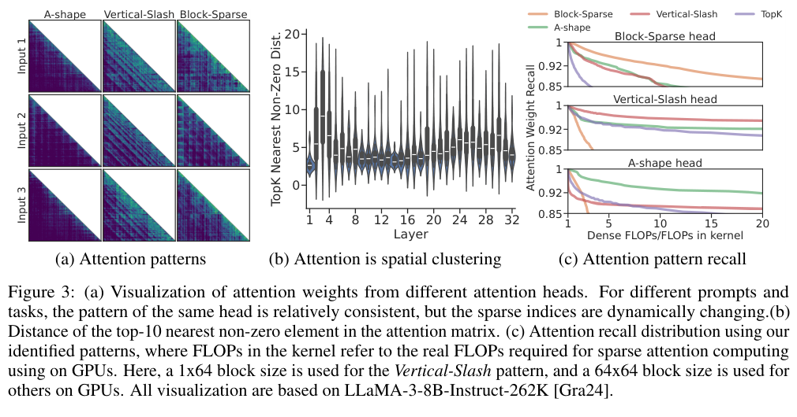
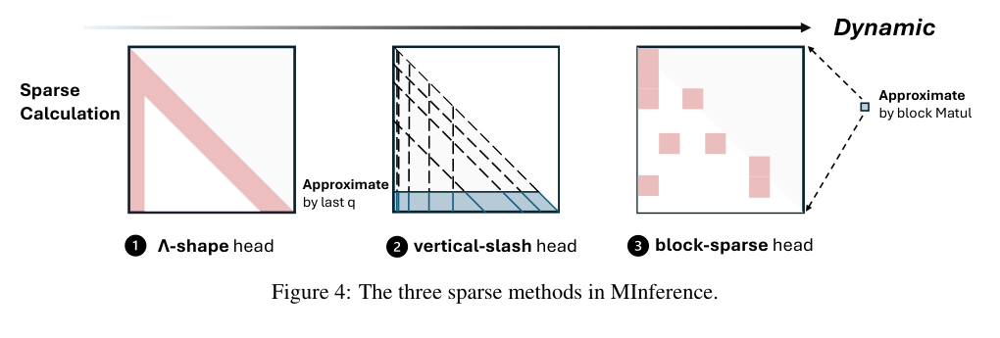
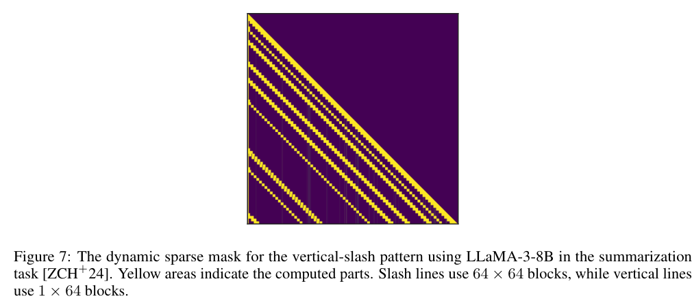
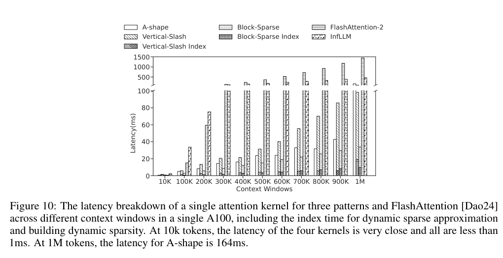

# MInference 1.0: Accelerating Pre-filling for Long-Context LLMs via Dynamic Sparse Attention 精读分析

> [!info] 文档关系
> - 文档类型：Paper
> - 领域入口：[README](../README.md)
> - 上位汇总：[Multimodal custom attention](../surveys/multimodal-custom-attention.md)
> - 证据资产：`../assets/papers/minference/`
> - 相关文档：[Figure inventory](../evidence/figure-inventory.md)

> 资料状态：已核验 27 页 NeurIPS 2024 论文 PDF、完整 LaTeX 源码、可搜索文本、官方代码仓库 commit `a4eb395f949ea39e871f9bc586d683390692c6be`。论文配图均为 1440×1864 PDF 页面上的重新裁剪，包含完整 caption；不是原始矢量图。OpenReview 论坛可定位，但公开 notes API 被浏览器挑战阻断。

## 修订信息

- 当前文档版本：`1.0.0`
- 当前修订 ID：`rev-minference-a1-initial`
- 当前修订时间：`2026-07-25T13:08:31+08:00`
- 替代版本：无；这是 remediation 工作区的首个可验证交付。旧工作区只提供源材料，没有旧 `deliverable_manifest.json`，因此不构成待迁移的历史交付。

| 修订 ID | 文档版本 | 时间 | 修订者 | 类型 | 替代修订 | 迁移问题/解析 | 变更摘要 | 原因 | 影响位置 | 依据 | 对结论影响 |
|---|---|---|---|---|---|---|---|---|---|---|---|
| `rev-minference-a1-initial` | `1.0.0` | `2026-07-25T13:08:31+08:00` | `delegated-paper-review-agent` | `initial` | 无 | 无 | 首次建立完整单篇精读、视觉证据、代码核验、OpenReview 访问分类、infra 分析与可验证 manifests | 父任务要求修复非 ICML 论文交付 | `analysis.md` 全文；[Figure inventory](../evidence/figure-inventory.md)；过程侧公开评审记录；`code/MInference` | 任务包、论文 PDF/LaTeX、官方代码、结构与语义验证 | material |

## 0. 资料与配图索引

- 论文：`paper.pdf`，SHA-256 `65ae8b76b24ef6a8752367e8b6067db5541b6c574591c6c3483ac0524d2c3ef6`
- 论文页面：<https://arxiv.org/abs/2407.02490>；正式 proceedings：<https://proceedings.neurips.cc/paper_files/paper/2024/hash/5dfbe6f5671e82c76841ba687a8a9ecb-Abstract-Conference.html>
- LaTeX：`source/arxiv_source.tar`，展开于 `source/unpacked/`
- 开源代码：<https://github.com/microsoft/MInference>，commit `a4eb395f949ea39e871f9bc586d683390692c6be`
- OpenReview：<https://openreview.net/forum?id=C5Nh2UFJ9S>；访问证据与限制见 过程侧公开评审记录
- 提取文本：`extracted_text/full_text.clean.txt`；元数据见 `extracted_text/metadata.json`
- 视觉清单与精确 crop bbox：[Figure inventory](../evidence/figure-inventory.md)
- Figure 3：`../assets/papers/minference/fig3_sparse_patterns_caption.png`
- Figure 4：`../assets/papers/minference/fig4_three_sparse_patterns_caption.png`
- Figure 7：`../assets/papers/minference/fig7_vertical_slash_dynamic_mask_caption.png`
- Figure 10：`../assets/papers/minference/fig10_kernel_latency_breakdown_caption.png`
- AI 生成分析示意图：未生成。已安装的 OpenRouter ICU CLI 只有 `generate`/`edit`，没有论文技能强制要求的 `responses-doc --input-file analysis.md` 文档输入路径；按契约禁止用提示词摘要替代文档输入。

## 0.1 术语与符号解释

### 0.1.1 术语表

| 术语 | 本文含义 | 别名 | 不等于/易混项 | 证据来源 |
|---|---|---|---|---|
| pre-filling | 输入 prompt 一次性经过模型并建立各层 KV 状态、产生首 token 前的阶段 | prefill、prompt phase | 不等于逐 token decoding；本文主要加速 prefill attention | Introduction；`source/unpacked/sections/introduction.tex` |
| MInference | 对既有长上下文 LLM 施加的 training-free、head-wise 动态稀疏 prefill attention 系统 | Milliontokens Inference | 不改变模型容量，也不等于 KV-cache 压缩 | §3；`source/unpacked/sections/methodology.tex` |
| A-shape | 保留起始 global tokens 与最近 local window 的静态结构化模式 | StreamingLLM-like pattern | “静态”只指 mask 结构；其 head 分配仍由离线搜索决定 | §2.2、Table 1、Figure 4 |
| Vertical-Slash | 保留内容相关 vertical columns 与固定相对间隔的 diagonal/slash lines 的动态结构化模式 | VS | vertical 表示全局列，slash 表示相对位移对角线；两者不是同一种 index | §2.2、Algorithm 2、Figure 7 |
| Block-Sparse | 以局部空间聚类为假设，在 64×64 block 粒度近似和计算的动态模式 | BS | 不等于任意 fine-grained Top-K token；会因 block 覆盖多算元素 | §2.2、Algorithm 3、Appendix C.4.1 |
| kernel-aware search | 在近似相同“真实 kernel FLOPs”预算下，为每个 attention head 离线选择模式和参数 | optimal sparse pattern search | 不等于在线 routing；在线阶段只重建所选模式的 sparse indices | §3.2、Algorithm 1、Table 7 |
| dynamic sparse indices | 针对当前输入在线估计的 vertical/slash/block 位置 | dynamic mask/index | 不等于把一个 prompt 的 Top-K indices 静态复用于另一个 prompt | §2.1、§3.2、Table 2 static ablation |
| attention recall | 稀疏模式保留的 dense attention weight/output 信息比例，用作搜索与机制分析指标 | recall | 高 recall 不是任务准确率的同义词；二者只有间接联系 | Figure 2、Figure 3、Algorithm 1 |
| PIT | 把不规则 sparse data 组织到 dense compute blocks 的 Permutation Invariant Transformation/compiler | dynamic sparse compiler | 不改变候选 sparse pattern，只改变执行布局 | Appendix C.4.2；`code/MInference/minference/ops/pit_sparse_flash_attention_v2.py` |
| effective context | RULER 中性能高于 85% 的最大测试长度 | effective length | 不等于模型宣称的最大 context window | §4、Table 3 |
| static ablation | 在 Vertical-Slash/Block-Sparse heads 上复用固定 sparse indices 的对照 | Ours w/ static | 不等于 A-shape；它刻意移除输入依赖的 index 更新 | §4 Ablation、Table 2 |

### 0.1.2 符号表

| 符号 | 含义 | 性质 | 作用域/索引 | 单位/取值 | 来源 | 易混点 |
|---|---|---|---|---|---|---|
| $\mathbf Q,\mathbf K,\mathbf V$ | attention 的 query、key、value | author-defined | 每层、每 head、每 token | tensor；最后一维为 $d$ | Eq. (1)、Algorithms 2–3 | 论文省略 batch/head 维 |
| $d$ | attention head dimension | author-defined | 每 head | elements | Eq. (1) | 不是模型 hidden size |
| $\mathbf M$ | 二值动态 sparse mask | author-defined | attention matrix 的 $(i,j)$ | $\{0,1\}$ | Eq. (1) | A-shape 可静态，VS/BS 随输入动态 |
| $M_{i,j}$ | query $i$ 是否计算 key $j$ | author-defined | token pair | 0 或 1 | Eq. (1) | 还需 causal 约束 |
| $\mathbf A(\mathbf M)$ | 施加 sparse mask 后的 attention weights | author-defined | 每层/每 head | probability matrix | Eq. (1) | 不含与 $\mathbf V$ 相乘后的 output |
| $\mathbf A_{\text{dense}}$ | dense attention 参照 | author-defined | 每层/每 head | probability matrix | Eq. (2) | 论文目标写范数但未指定具体范数 |
| $c$ | 对未选位置施加的大负常数 | author-defined | 全局 | 示例 $10^5$ | Eq. (1) | 实现常用 $-\infty$，不是训练超参 |
| $t_{\text{sparse}}$ | sparse attention kernel 时间 | author-defined | 每请求/层/head 聚合 | seconds | Eq. (2) | 与 index 构建时间分开 |
| $t_{\text{overhead}}$ | 动态 sparse pattern 估计与 index 构建时间 | author-defined | 每请求/层/head 聚合 | seconds | Eq. (2) | 不等于所有非-attention 层开销 |
| $t$ | 离线搜索的目标 kernel FLOPs 预算 | author-defined | 每 head 候选空间 | FLOPs-equivalent | Algorithm 1、§4 implementation | 论文用 1k global + 4k local 对应预算 |
| $\rho,\sigma_i$ | 搜索空间与候选 sparse pattern/setting | author-defined | 每 head | set、candidate | Algorithm 1 | $\sigma_i$ 同时包含模式和参数 |
| `last_q` | VS 在线估计使用的末尾 query 数 | code-defined | 每 head/request | 64（短序列取 $\min(64,S)$） | Algorithm 2；code lines 381–396 | 不是 local window size |
| $\hat{\mathbf Q},\hat{\mathbf K},\hat{\mathbf A}$ | block pooling 后的近似 Q/K 与估计 attention | author-defined | Block-Sparse | 64-token block grid | Algorithm 3 | 只用于找 blocks，不是最终 output |
| $\mathbf i_v,\mathbf i_s,\mathbf i_b$ | vertical、slash、block sparse indices | author-defined | 每 head/request | integer indices | Algorithms 2–3 | $\mathbf i_s$ 表示相对位移，执行前需转换 |
| $S$ | sequence/context length | author-defined | 每请求 | tokens | Appendix Eq. (3) | 在 infra 公式中同样表示 token 数 |
| $B$ | sparse kernel block size | author-defined | kernel | tokens/block；论文常用 64 | Appendix Eq. (3) | 不等于 batch size |
| $k_b$ | 每行保留的 block 数 | author-defined | Block-Sparse row | blocks | Appendix Eq. (3) | 代码默认 `top_k=100` |
| $s_p$ | block-sparse 相对 dense FlashAttention 的理论 speedup | author-defined | 单 attention kernel | ratio | Appendix Eq. (3) | 未计 index、padding、非-attention 层 |
| $k_v,k_s$ | 每行 vertical point 与 slash range 数 | author-defined | VS index builder | counts | Appendix C.4.2 | index 复杂度为 $O(k_v+k_s)$ |
| $L,H_{\mathrm{kv}},d_h,b$ | 层数、KV heads、head dim、每元素字节数 | analysis-derived | KV-cache 估算 | count、bytes | §8.2 推导 | 论文未给各 checkpoint 的完整 config，故不代入 |
| $h,r$ | attention heads 与每 query 实际访问的 key 比例 | analysis-derived | FLOPs 估算 | count、fraction | §8.1 推导 | $r$ 是有效 kernel coverage，不等于理论 zero ratio |
| $\mathrm{BW}_{\mathrm{eff}},U_{\mathrm{BW}}$ | 有效带宽与峰值带宽利用率 | analysis-derived | kernel/runtime | byte/s、ratio | §8.4 推导 | 论文未报告 bytes moved，不能数值化 |

## 1. 论文基本信息

- 标题：*MInference 1.0: Accelerating Pre-filling for Long-Context LLMs via Dynamic Sparse Attention*
- 作者：Huiqiang Jiang、Yucheng Li、Chengruidong Zhang 等
- Venue：NeurIPS 2024；正式 PDF 标注 “38th Conference on Neural Information Processing Systems”
- 研究领域：长上下文 LLM 推理、动态稀疏 attention、GPU kernel
- 核心问题：dense self-attention 在 prefill 阶段随 $S^2$ 增长，使百万 token prompt 的 TTFT 不可接受
- 研究目标：在不再训练模型的前提下，减少 attention 实际计算并保持长上下文任务能力
- 关键约束：head 的模式类型相对稳定，但精确 sparse indices 随输入变化；online estimation 与 index build 必须足够便宜；最终 kernel 必须能利用结构化 sparsity

## 2. 研究动机与问题—方案闭环

### 2.1 出发点与背景痛点

`author-stated`：长上下文模型已支持 128K–1M 甚至更长输入，但用户在得到首 token 前必须完成整个 prompt 的 prefill。论文在单张 A100 上报告，LLaMA-3-8B 的 300K prompt 约需 6 分钟，1M prompt 约需 30 分钟；其中 attention 超过 prefill latency 的 90%（Introduction、Figure 2a）。因此真正的部署痛点不是“模型不能接受长输入”，而是 TTFT 与设备成本把长上下文能力变成不可用能力。

`author-stated`：attention 权重高度稀疏。对 128K attention matrix，只保留 Top-4K columns 可覆盖 96.8% attention weight；但把同一 indices 复用到另一 prompt，recall 降到 83.7%（§2.1、Figure 2b–c）。这同时否定两个简单解法：dense attention 浪费大量计算，而固定 global/local mask 又错过内容依赖的远程位置。

### 2.2 现有方案为何不够

失败模式一是静态稀疏：StreamingLLM/固定 local-global windows 对 summary 或局部任务尚可，但在 retrieval、multi-hop 和超出窗口的信息上显著退化。Table 2 中 LLaMA-3-8B 的 Retrieve.KV 从 dense 的 14.4 降到 StreamingLLM 的 0.8；`Ours w/ static` 也只有 0.2。根因不是“稀疏率不够低”，而是 mask 没有跟随输入内容变化。

失败模式二是 fine-grained 动态 Top-K：理论上能跟随内容，但在线估计与不规则内存访问本身很昂贵，难以转化成 GPU wall-clock speedup。论文将这一点概括为 accuracy、speed 与 estimation overhead 的三方约束（Introduction、Table 1）。

失败模式三是仅改变 attention 公式而缺乏 kernel 协同：如果实际 block coverage、index 格式和 GPU memory access 没有进入搜索预算，“概念 FLOPs”更少也不一定更快。论文因此把 real FLOPs in kernel 用于候选配额，而不是只数理想 nonzero。

> Figure 3（原论文截图）：同一 head 的模式家族相对稳定，但精确 indices 随输入变化；Block-Sparse 对 global Top-K 尤其不友好。这是“离线选模式、在线选位置”的主要观察依据。

### 2.3 论文计划解决的问题与成功标准

- 核心研究问题：能否在既有 pretrained long-context LLM 上，用 training-free、input-dynamic、GPU-efficient 的 sparse prefill attention 同时降低 TTFT 与保持任务质量？
- 目标场景：batch 较小、prompt 极长、attention 占主导的 prefill；论文重点在 100K–1M tokens。
- 必须满足：不改 pretraining、不 fine-tune；dynamic mask 的估计与 index 开销不能吞掉 savings；保持 retrieval、QA、summarization、language modeling 等能力。
- 成功标准：下游任务/困惑度接近 dense；prefill latency 对 FlashAttention-2 显著下降；index 内存与构建时间受控。
- 明确不解决：短 context；decoding attention（实验保留 dense decoding）；模型本身超过训练长度的能力；checkpoint 容量或位置编码外推。

### 2.4 核心方案如何解决并优化问题

MInference 把困难拆成三个时间尺度：先用一个 reference example 离线为每个 head 决定“哪一种结构最像它”，再在每个请求上只估计该结构的具体 indices，最后交给与结构匹配的 kernel。离线搜索减少在线 decision complexity；在线 approximation 保留内容依赖；A-shape/VS/BS 三类结构又把 fine-grained sparsity 压缩成 GPU 可执行的 blocks/columns。

> Figure 4（原论文截图）：A-shape 使用静态 global+local；Vertical-Slash 用最后 64 个 queries 近似列/对角线；Block-Sparse 用 block pooling 近似重要块。

| 原始问题/失败模式 | 根因或约束 | 对应方案设计 | 改变的变量/系统行为 | 作用机制 | 预期优化及指标 | 证据来源 | 判断 |
|---|---|---|---|---|---|---|---|
| dense prefill 为 $O(S^2)$ | 大量 attention mass 集中在小部分位置 | 三类稀疏模式 | 每个 query 实际访问的 keys/blocks 比例 $r$ | 跳过低贡献位置 | attention FLOPs、latency、TTFT | Fig. 2、Fig. 10、latency section | supported |
| 固定 mask 跨 prompt 失效 | 精确 sparse indices 内容相关 | 在线 VS/BS index estimation | $\mathbf M$ 从跨输入固定变为 request-specific | 用当前 Q/K 构造 sparse locations | attention recall、retrieval accuracy | Fig. 2c、Table 2 static ablation | supported |
| 任意动态 Top-K 不规则且昂贵 | index 建立与访存不适合 GPU | A/VS/BS 结构化模式 | fine-grained indices 变成 windows、columns/ranges、blocks | 提高 coalescing/tiling 与 dense-math reuse | kernel latency、index overhead | Table 1、Appendix C、Fig. 10 | partially-supported |
| head 行为不同 | 单一模式不能覆盖稳定、线状和聚类 head | kernel-aware per-head offline search | 每 head 的 mode/parameters 固定为最优候选 | 相同 kernel-FLOPs 预算下最大化 output recall | quality at matched compute | Algorithm 1、Fig. 3c、ablation | partially-supported |
| Block-Sparse mask 难直接得到 | full QK estimator 又变成 $O(S^2)$ | 64-token mean pooling | estimator grid 缩小 $64^2$ 倍 | block-level QK 选 top blocks | estimator overhead、quality | Algorithm 3、code lines 151–166、Fig. 10 | supported for implementation; causal accuracy proof absent |
| VS irregular indices 难执行 | points 与 diagonal ranges 混合 | point-range merge + PIT/FlashAttention hybrid | indices 转为 block ranges + columns | 稀疏 load 映射为 dense tiles | VS kernel latency | Fig. 7、Appendix C.4.2、code lines 195–274 | partially-supported |

### 2.5 完整因果链与证据闭环

背景触发是百万 token 模型已经存在但 TTFT 长达分钟级；可观察痛点是 attention 占 prefill latency 90% 以上；dense 方法失败于二次复杂度，固定 sparse 方法失败于 input-dependent indices，任意 dynamic Top-K 又失败于 estimator 和不规则 GPU 执行。MInference 假设“模式家族在 head 内相对稳定、具体位置随输入动态”，于是把 head pattern 离线固定，把 indices 在线更新，并将三个 pattern 映射到专用 kernels。被改变的变量是实际 kernel coverage、index 结构和每请求 mask；预期优化是更少 attention FLOPs 与更低 TTFT，同时保持 sparse attention output 与 dense output 接近。

直接闭环证据包括：static mask 在 retrieval 上崩溃而 dynamic 版本恢复；只用一种 pattern 会退化；1M prefill 从 30 分钟降到 3 分钟；Figure 10 显示单 kernel 的长序列 latency 分离。间接/混杂证据包括：Figure 3 的 attention recall 不是 task metric；完整方法同时改变 pattern、indices 与 kernels，不能由端到端 10× 单独归因每个组件；8×A100 的 22 秒结果还叠加 tensor/context parallel。未闭环部分包括：只用一个 30K KV retrieval 样本离线搜索的普适性没有多 seed/sensitivity；H100/MI300X portability 没有实测；没有独立测量 HBM bandwidth utilization。

总体判断：`partially-supported`。核心“动态结构化 sparse prefill 可以在超长 context 显著提速并近似保持质量”有跨模型/任务证据；更细的 kernel portability、搜索泛化和逐组件 gain decomposition 仍不充分。

## 3. 核心贡献与创新点

1. `author-stated`：把 long-context attention heads 归纳为 A-shape、Vertical-Slash、Block-Sparse 三类 GPU-friendly pattern（§2、Figures 3–4）。
2. `author-stated`：提出 kernel-aware offline search，在 matched real-kernel-FLOPs 候选中为每 head 选 pattern/setting（§3.2、Algorithm 1、Table 7）。
3. `author-stated`：对 VS 用末尾 queries、对 BS 用 64-token pooling 在线估计 input-specific indices，不训练模型（Algorithms 2–3）。
4. `author-stated`：实现 VS point-range merge、PIT/FlashAttention hybrid 与 Block-Sparse Triton kernel（Appendix C.4；官方代码）。
5. `author-stated`：在多模型、多 benchmark 上报告最高 10× 单 A100 prefill speedup，并保持平均任务分数接近 dense（Tables 2–6、Figure 10）。

## 4. 研究方法

### 4.1 方法总览

输入是已有模型在某层某 head 的 Q/K/V。离线阶段用一个 30K KV-retrieval reference sample，对 A-shape、VS、BS 的 matched-FLOPs 候选计算 sparse attention output recall，选择每 head 最佳候选；搜索约 15 分钟/单 A100。在线 prefill 阶段读取这个 head config：A-shape 直接执行 global+local；VS 从末尾 64 个 query 对所有 keys 的近似 attention 中找 vertical/slash；BS 对 Q/K 做 64-token mean pooling 后找每 row 的 Top-K blocks。最后运行对应 sparse kernel。q_len=1 的 decoding 路径在代码中回退 dense。

### 4.2 组件级设计动机与具体问题映射

| 设计项 | why 状态 | 原文证据 | 针对的具体问题 | 因果机制 | 替代方案/权衡 | 验证证据 | 判断 |
|---|---|---|---|---|---|---|---|
| 三 pattern taxonomy | author-stated | §2.2、Fig. 3 | 单一 static/global Top-K 不能覆盖多种 spatial distribution | 用少量结构模板压缩动态 mask 搜索空间 | fine-grained Top-K 更灵活但 kernel/index 慢 | mechanism visualization + only-pattern ablation | partially supported |
| per-head offline assignment | author-stated | §3.2、Alg. 1 | head 间行为异质，online routing 过贵 | 稳定 pattern family 可离线固定 | per-input mode routing 可能更准但增开销 | Fig. 11 distribution；跨 LLaMA length transfer | plausible；缺多样本 sensitivity |
| output recall 含 V 的搜索目标 | author-stated | §3.2 | weight recall 未必等于 output fidelity | 用 sparse output 对 dense output 的 recall 纳入 V | 直接优化 downstream metric 代价更高 | 无单独 objective ablation | unverified |
| A-shape global+local | author-stated | §2.2、Fig. 4 | 稳定 initial/local attention | 无 index build，连续窗口高效 | 丢失内容相关远程 token | StreamingLLM/only-A 对照 | supported for speed, insufficient for dynamic tasks |
| VS `last_q=64` estimator | author-stated for approach；not-stated for 64 choice | Introduction、Alg. 2 | full QK estimator 二次开销 | 末尾 query 的聚合揭示重要 columns/relative diagonals | 更多 queries 提高估计质量但增 overhead | static/vertical/slash ablations；无 last_q sensitivity | partially supported |
| BS 64×64 mean pooling | author-stated | Alg. 3、Appendix C.4.1 | dispersed但局部聚类的 attention | block-mean QK 近似 block relevance | 细 block 更准但 index/compute 更大 | code + only-BS ablation；无 block-size sensitivity | partially supported |
| VS point-range merge | author-stated | Fig. 7、Appendix C.4.2 | columns 与 diagonal ranges 的混合不规则性 | 转为 block ranges + separate columns，复杂度 $O(k_v+k_s)$ | pure block 会覆盖更多元素；pure columns coalescing 差 | code + kernel benchmark | supported for implementation |
| specialized Triton/PIT kernels | author-stated | Appendix C、Fig. 10 | 稀疏公式不自动等于 wall-clock speedup | tiled load、online softmax、FP32 accumulator、causal masking | dense FlashAttention 对短 context 更合适 | Figure 10 | supported on A100 only |
| Single-A100 tensor splitting/last-logit optimization | author-stated | Appendix C.3 | HF eager implementation >50K OOM | 按 head/sequence 切分、减少 intermediates、只算末 token LM head | 这些是系统共优化，混杂端到端 speedup | 描述，无独立 ablation | plausible/confounded |

### 4.3 模型/系统架构

Figure 7 显示 VS 的执行对象属于 prefill attention mask，而不是 decoding KV selection：黄色 slash 用 64×64 blocks，vertical 用 1×64 columns。代码 commit `a4eb...` 中：

- `code/MInference/minference/modules/minference_forward.py:381-396` 用最后至多 64 个 Q 与全部 K 做 FP32 softmax，分别聚合 vertical columns 和 diagonals；
- `code/MInference/minference/ops/pit_sparse_flash_attention_v2.py:195-242` 排序 indices、转换 block/column metadata，并以 causal mode 调 sparse kernel；
- `code/MInference/minference/ops/block_sparse_flash_attention.py:151-166` 对 Q/K 分块取均值、做 causal block QK、选择 Top-K blocks；
- `code/MInference/minference/modules/minference_forward.py:460-486` 明确 q_len=1 回退 dense，因此 MInference 1.0 的主要算法收益属于 prefill，不应误写为 sparse decoding。

### 4.4 关键公式

施加二值 mask 的 attention：

$$
\mathbf A(\mathbf M)=\operatorname{Softmax}
\left(\frac{\mathbf Q\mathbf K^\top}{\sqrt d}-c(1-\mathbf M)\right),
\qquad M_{i,j}\in\{0,1\}.
$$

论文将质量与系统目标写成双目标：

$$
\min_{\mathbf M}\left\lVert \mathbf A(\mathbf M)-\mathbf A_{\mathrm{dense}}\right\rVert,
\qquad
\min_{\mathbf M}\left[t_{\mathrm{sparse}}(\mathbf M)+t_{\mathrm{overhead}}(\mathbf M)\right].
$$

这里的范数未指定，且实际 search 使用包含 $\mathbf V$ 的 attention-output recall；所以 Eq. (2) 是目标概念，不是完整可复现实验定义。

Block-Sparse 单 kernel 的理想 speedup：

$$
s_p=\frac{S}{2B k_b}.
$$

它隐含 causal dense baseline 只计算约半个 $S\times S$ 矩阵，并忽略 pooling/index、padding、非-attention 层与 memory behavior；只能当上界式解释。

### 4.5 训练、实验与部署设计

方法不训练。主要模型为 LLaMA-3-8B-Instruct-262K/1M、Yi-9B-200K、GLM-4-9B-1M；Needle 另含 Phi-3-Mini-128K、Qwen2-7B-128K，另有 LLaMA-3-70B。所有实验 greedy decoding。主要 benchmarks：

- InfiniteBench：10 tasks、3,992 examples、平均 214K tokens；
- RULER：4K–128K、每长度 2,600 examples；
- Needle In A Haystack：扩展到 1M、750 examples；
- PG-19：1,000 个超过 100K token 的样本。

公平性优点：所有 sparse baselines 都只替换 prefill、decoding 保持 dense；同模型比较。边界：不同方法的 effective receptive field 和 kernel maturity 不等价；InfLLM/StreamingLLM 超参来自论文设定但未见全面调优；offline search 只用一个 30K synthetic KV sample；作者没有报告 seeds、variance 或 statistical confidence intervals。

## 5. 关键结论

### 5.1 主结果

在 InfiniteBench：

- LLaMA-3-8B-262K：dense 38.2，MInference 38.8，+0.6 absolute / +1.57% relative；但 Retrieve.KV 从 14.4 降到 12.8，不能概括为每项都“无损”。
- Yi-9B-200K：37.5 → 37.7，+0.2 / +0.53%；Retrieve.KV 28.8 → 27.6。
- GLM-4-9B-1M：46.7 → 47.0，+0.3 / +0.64%。
- LLaMA-3-70B-262K：46.5 → 47.3，+0.8 / +1.72%。

在 RULER，LLaMA-3-8B average 84.4 → 87.0（+2.6 / +3.08%），GLM 88.0 → 89.6（+1.6 / +1.82%），Yi 78.1 → 74.7（−3.4 / −4.35%）。因此“保持或提升”在平均层面大体成立，但不是对所有模型/任务成立；小幅升高也可能来自近似 attention 的正则化或 benchmark noise，论文未提供方差。

Figure 10 表明稀疏收益随 context 增长而放大：论文报告 end-to-end prefill 在 100K/300K/500K/1M 分别 1.8×/4.1×/6.8×/10×；1M 单 A100 从 30 分钟降到 3 分钟。单 kernel 在 1M 时 Block-Sparse 相对 FlashAttention 约 30×，VS 约 13×，但 end-to-end 只有 10×，符合 index 与非-attention 层的 Amdahl 边界。

### 5.2 技术点—证据矩阵

| 论文声称的技术点 | 声称收益 | 对应实验/消融 | 对照是否受控 | 指标变化 | 证据强度 | 结论 |
|---|---|---|---|---|---|---|
| attention 是 sparse 且 indices dynamic | 固定 mask 不够 | Fig. 2b–c；static ablation | 部分受控 | cross-prompt recall 96.8%→83.7%；LLaMA static avg 31.9 vs ours 38.8 | mechanism visualization + direct static replacement | supported |
| 三 pattern 比单一 pattern 更完整 | 保持多任务质量 | Table 4、Table 8 | matched full method except pattern family | only-BS 18.7；only-VS 37.1；full 38.8 | direct ablation | supported；A-shape-only 与 StreamingLLM 混同 |
| vertical 与 slash 都必要 | retrieval 与 general quality | Table 8 | 近似受控，但因 kernel 限制各保留 top-1 counterpart | only-vertical 18.6；only-slash 35.9；full 38.8 | direct ablation with contamination | partially supported |
| kernel-aware search 优于非-kernel-aware search | 更优 accuracy/speed frontier | 无替换 baseline | 未受控 | 未报告 | none | unverified |
| output recall/含 V 的 objective 更优 | 更准确 head assignment | 无 objective ablation | 未受控 | 未报告 | none | unverified |
| mean-pooled BS estimator 低开销 | 动态 block selection | Fig. 10 index overhead；code | 与完整 BS 绑定 | BS index约总时延 25% | code + indirect timing | partially supported |
| VS estimator 低开销 | 动态 line selection | Fig. 10；code | 与完整 VS 绑定 | VS index约总时延 5%–15% | code + indirect timing | partially supported |
| custom kernels 转化为 wall-clock speedup | 长 context 更快 | Fig. 10、Fig. 1b | dense FA2 baseline | 1M: VS 13×、BS 30×；E2E 10× | replacement baseline | supported on single A100 |
| training-free 可跨模型 | 无需 fine-tune | Tables 2–6 | 多模型，但 configs 不同 | 平均接近 dense | multi-model indirect | supported within tested family |
| 可移植 H100/MI300X | 类似 speedup | 无 | 未受控 | 未报告 | none | unverified |
| 与 SnapKV 兼容 | prefill+decode optimization 可叠加 | Table 5 | 仅两个组合 | 36.0→37.3 avg | replacement baseline, no latency | quality compatibility supported；speed composition unverified |

### 5.3 是否验证了假设

- “模式家族相对稳定”：Figure 3、Figure 11 与 LLaMA 262K→1M config 复用为间接支持；只有一个 search sample，缺多 seed/多域 assignment stability。
- “具体 indices 必须动态”：cross-prompt recall 与 static ablation 直接支持。
- “结构化 sparsity 可被 GPU 高效利用”：A100 kernel benchmark 直接支持；跨 accelerator 未验证。
- “近似 attention 不损害能力”：多 benchmark 平均支持，但 Yi-RULER 和若干 Retrieve.KV 有可见下降，正确结论应是“总体接近，存在任务/模型损失”。

### 5.4 收益来源归因

| 组件/变化 | 对比基线 | 指标变化 | 影响路径 | 证据强度 |
|---|---|---|---|---|
| 动态 indices | static variant | InfiniteBench 31.9→38.8；Retrieve.KV 0.2→12.8 | candidate/mask quality | matched replacement |
| 加入 BS/A-shape heads | only-VS→full | avg 37.1→38.8；Retrieve.KV 5.0→12.8 | head coverage/quality | direct but bundled two pattern families |
| 加入 VS/A-shape heads | only-BS→full | 18.7→38.8 | head coverage/quality | direct but bundled |
| slash 之外加入 vertical | only-slash→full | 35.9→38.8；Retrieve.KV 4.2→12.8 | global token retrieval | contaminated by mandatory top-1 vertical |
| sparse kernels + algorithm | FlashAttention→MInference | E2E 1M 30→3 min | FLOPs + index + kernel | confounded algorithm/runtime |
| TP/CP | 1×A100→8×A100 | 3 min→22 sec | parallel compute/communication | rough system comparison；not isolated |

不能把 10× 全归因于 sparse mask，也不能把任务分数保持归因于 kernel。mask/pattern 决定保留信息；kernel、tensor splitting 和 parallelism 决定 wall-clock。

## 6. Related Work 对比

| 类别 | 方法核心 | 优点 | 局限 | 与 MInference 关系 |
|---|---|---|---|---|
| Static sparse（Longformer/BigBird/StreamingLLM） | 固定 global/local/dilated pattern | 规则、kernel 简单、无 index build | 不适应内容相关远程依赖 | A-shape 是其高效分支；MInference 用 VS/BS 补足动态位置 |
| Fine-grained dynamic Top-K / SparQ | 估计重要 tokens/keys | 选择灵活 | estimator 与不规则 memory access 高 | MInference 以三种空间结构换取可执行性 |
| Cluster/kNN sparse（InfLLM 等） | memory unit 或近邻检索 | 可扩展 context | 质量、CPU 限制或索引开销 | 论文将其作为 training-free baseline；超参公平性仍有限 |
| Training-time sparse architectures | Longformer、linear attention、SSM/hybrid | 可从架构层消除二次计算 | 需要训练/改模型，不能直接 retrofit | MInference 的关键卖点是 training-free retrofit |
| KV-cache compression（SnapKV） | decoding 阶段压缩 KV | 减显存与 decode bandwidth | 不直接解决 dense prefill | 与 MInference 正交；Table 5 只验证质量兼容 |
| FlashAttention | exact dense attention 的 IO-aware tiling | 精确、成熟 | 算术仍近似 $S^2$ | 是 dense baseline，也是 MInference kernels 的实现基础 |

比较总体方向合理，但“baselines 已充分调优”不能确认；尤其更新更快的 sparse-prefill 方法不在 2024 论文范围内，本评审不把后续工作倒灌为原论文缺陷。

## 7. OpenReview 公开评审 × 论文内容交叉核验

- OpenReview 链接：<https://openreview.net/forum?id=C5Nh2UFJ9S>
- 访问日期：2026-07-25
- 可见元数据：ES-FoMo-II 2024 Poster、submission 31
- review/meta-review/decision/rebuttal：无法枚举；两版公开 API 均返回 `ChallengeRequiredError`，证据保存于 `openreview_notes.json` 与 `openreview_notes_v1.json`

因此没有任何 reviewer claim 被二手转述或当作事实。关于 novelty、baseline fairness、single-sample search 和 portability 的判断均来自论文/代码本身，而不是公开评审。NeurIPS 2024 接收由正式 proceedings 独立确认；ES-FoMo forum 不作为 NeurIPS decision record。此项 `skipped-with-reason`，影响是缺少外部评审对 rebuttal/revision 的审计，不影响 PDF/代码事实。

## 8. Infra 需求分析

### 8.1 算力

忽略投影层，dense causal attention 的 QK 与 PV 主 FLOPs 近似：

$$
\mathrm{FLOPs}_{\mathrm{dense}}\approx 2hS^2d.
$$

若 kernel 实际只覆盖比例 $r$，则：

$$
\mathrm{FLOPs}_{\mathrm{sparse}}\approx 2hrS^2d+\mathrm{FLOPs}_{\mathrm{index}}.
$$

论文称 attention FLOPs 减少约 95%，并在 context >500K 时 kernel sparsity 超过 95%；但端到端 speedup 为 10× 而不是理论 20×，原因包括 index、QKV/MLP、padding、kernel launch 与 memory behavior。10K 时 index 比例可到 30%，整体接近 FlashAttention，明确显示适用阈值。

### 8.2 显存与存储

MInference 不减少为后续 decoding 持有的 dense KV cache。通用 KV 大小为：

$$
\mathrm{KVBytes}=2LSH_{\mathrm{kv}}d_hb.
$$

论文未给每个 checkpoint 的完整 $L,H_{\mathrm{kv}},d_h$ metadata，本评审不代入。额外 sparse index memory 在 LLaMA-3-8B、1M context 下报告不超过 160 MB（Appendix D.2）。单 A100 80 GB 还需要 tensor splitting、减少 intermediate variables、kernel 内 causal mask、只计算末 token LM-head logits，说明“能跑 1M”不是 sparse attention 单独带来的 memory 结论。

### 8.3 Data Types / 数值格式

| 对象 | 数据类型/格式 | 阶段 | 硬件依赖 | 影响 | 证据 |
|---|---|---|---|---|---|
| Q/K/V、kernel output | bfloat16（论文 latency）；代码也支持 fp16 | prefill | NVIDIA GPU/Triton | 降 HBM/compute cost | Appendix C.2；block kernel lines 125–145 |
| attention softmax/accumulator | FP32 accumulation，再 cast 至 input dtype | estimator/kernel | Triton | 数值稳定，增加寄存器压力 | `minference_forward.py:384-386`; kernels |
| VS indices | int32 block/count/column metadata | prefill | custom CUDA/Triton ops | 紧凑索引，额外转换 | `pit_sparse_flash_attention_v2.py:218-239` |
| BS indices | int32 sorted Top-K blocks | prefill | Triton | 规则 block traversal | `block_sparse_flash_attention.py:151-166` |
| fp8/int8/int4 | 未报告/未实现为 MInference 1.0 核心依赖 | 不适用 | 未知 | 不得把 quantization 收益归入本文 | 论文与核验代码 |

### 8.4 带宽、互联与高效利用

定义：

$$
\mathrm{BW}_{\mathrm{eff}}=\frac{\mathrm{BytesMoved}}{\mathrm{RuntimeSeconds}},
\qquad
U_{\mathrm{BW}}=\frac{\mathrm{BW}_{\mathrm{eff}}}{\mathrm{BW}_{\mathrm{peak}}}.
$$

论文只给 latency，没有 bytes moved、HBM counters 或 achieved bandwidth，故无法给数值利用率。机制上，BS 用 64×64 tiles、VS 把 range 与 columns 合并，使 sparse K/V load 更规则并复用 dense dot tiles；代价是 block coverage 会计算一部分零/低权重元素。长序列时 dense attention 同时受算术与 HBM/SRAM data movement 制约；本文 evidence 能证明 wall-clock 加速，不能单独判定每个 kernel 是 memory-bound 还是 compute-bound。

单 A100 不涉及互卡通信。8×A100 的 22 秒结果组合 tensor parallel 与 context parallel，但未报告 NVLink/PCIe、all-reduce/point-to-point volume、overlap 或 batch，因此不能推导 scaling efficiency。

### 8.5 CPU/GPU/NPU 异构执行

| 阶段 | CPU 角色 | GPU/NPU 角色 | 数据移动 | 同步/overlap | 潜在瓶颈 | 证据 |
|---|---|---|---|---|---|---|
| 离线 search | orchestration/config 写入 | A100 计算 dense/sparse recall | 未报告 | 未报告 | 一个样本约 15 min | Appendix C.2 |
| online prefill | Python dispatch/config lookup | QK estimator、Top-K、index conversion、sparse attention | metadata 在 GPU；旧 fallback 可能涉及 host code | 未报告 | index build 5%–25% | code + Fig. 10 |
| VS index conversion | Python/C++ dispatch | custom CUDA op 或 fallback conversion | int32 metadata | kernel boundary | irregular range/column merge | `pit_sparse_flash_attention_v2.py` |
| 8-GPU | host launch/scheduler 未说明 | TP+CP | NVLink/PCIe topology 未说明 | 未说明 | communication scaling | §4 Latency |
| NPU/MI300X | 未验证 | 作者声称 Triton 易移植 | 未报告 | 未报告 | custom op/backend support | 只有 prose claim |

### 8.6 调度、Serving 与自定义算子

论文核心代码是 Transformers/vLLM patch，而非完整 production scheduler。配置对象支持 `minference`、`vllm_minference`，并把 prefill 与 q_len=1 decoding 分流。Serving 集成需：

- 模型名映射到 head-wise pattern JSON；
- 首次 kernel 编译/缓存；
- 长请求的 head/sequence splitting；
- 保持 dense KV cache 或与 SnapKV 等另行组合；
- 在 batch/continuous batching 下管理不同序列长度与 sparse metadata。

论文没有报告 batch-size scaling、concurrency、P99 TTFT、scheduler queueing 或 CUDA Graph；“deployment cost 降低”是合理推论，不是完整生产 telemetry。

## 9. 开源代码对照

- 仓库：`code/MInference`
- commit：`a4eb395f949ea39e871f9bc586d683390692c6be`
- 静态检查：代码可读取且 Git worktree clean；GPU runtime 未执行，因为当前环境未提供 A100/CUDA 运行条件

| 论文机制 | 本地路径与行 | 固定 commit URL | 一致性判断 |
|---|---|---|---|
| 最后 64 queries 估计 VS | `minference/modules/minference_forward.py:381-396` | <https://github.com/microsoft/MInference/blob/a4eb395f949ea39e871f9bc586d683390692c6be/minference/modules/minference_forward.py#L381-L396> | 一致 |
| q_len=1 dense decoding | `minference/modules/minference_forward.py:460-461` | <https://github.com/microsoft/MInference/blob/a4eb395f949ea39e871f9bc586d683390692c6be/minference/modules/minference_forward.py#L460-L461> | 一致，限定为 prefill |
| per-head config dispatch | `minference/modules/minference_forward.py:474-486` | <https://github.com/microsoft/MInference/blob/a4eb395f949ea39e871f9bc586d683390692c6be/minference/modules/minference_forward.py#L474-L486> | 一致 |
| BS mean pool + causal Top-K | `minference/ops/block_sparse_flash_attention.py:151-166` | <https://github.com/microsoft/MInference/blob/a4eb395f949ea39e871f9bc586d683390692c6be/minference/ops/block_sparse_flash_attention.py#L151-L166> | 一致 |
| BS Triton online softmax | `minference/ops/block_sparse_flash_attention.py:29-112` | <https://github.com/microsoft/MInference/blob/a4eb395f949ea39e871f9bc586d683390692c6be/minference/ops/block_sparse_flash_attention.py#L29-L112> | 一致 |
| VS metadata + causal sparse kernel | `minference/ops/pit_sparse_flash_attention_v2.py:195-274` | <https://github.com/microsoft/MInference/blob/a4eb395f949ea39e871f9bc586d683390692c6be/minference/ops/pit_sparse_flash_attention_v2.py#L195-L274> | 一致；当前 repo 包含后续优化路径 |
| bf16/fp16 kernel dtype | `minference/ops/block_sparse_flash_attention.py:125-145` | <https://github.com/microsoft/MInference/blob/a4eb395f949ea39e871f9bc586d683390692c6be/minference/ops/block_sparse_flash_attention.py#L125-L145> | 一致 |

重要代码边界：

1. 当前 commit 已扩展出 FlexPrefill、XAttention、TriangleMix、LeanK 等后续能力，不能把这些归入 MInference 1.0 论文贡献。
2. `gather_last_q_vertical_slash_topk_v4` 还保留较老的 dense-mask path，而 `minference_prefill_kernel` 走专用 sparse kernels；分析以实际 dispatch 的 prefill path 为主。
3. `block_sparse_attention` 代码的 padding 公式在 sequence length 正好可被 64 整除时仍会 pad 64，属于实现开销细节；论文没有讨论。
4. 当前 `model2path.py:7-16` 将论文的 LLaMA-3 262K/1M 模型映射到同一个 JSON；静态计数显示其中 32 层×32 heads 共 1,024 项全部为 `vertical_and_slash`，而论文 Figure 11 只称 VS 占比“>90%”且仍有少量 A-shape/BS。当前 snapshot 因而不能当作论文时点 pattern distribution 的逐项复刻，只能证明部署配置格式与 VS 路径存在。
5. GPU tests 未运行，所以代码核验只证明机制存在与路径一致，不证明当前 HEAD 在本环境复现 paper latency。

### 9.1 开源权重/配置对照

仓库包含 model-to-pattern JSON，而不包含论文模型权重。`minference/configs/Llama_3_8B_Instruct_262k_kv_out_v32_fit_o_best_pattern.json` 记录每层/每 head 的模式与参数，证明 head-wise assignment 是部署 artifact。Hugging Face checkpoints 的实时 metadata、revision、参数 config 未在本次工作区冻结；因此层数、KV heads、hidden width、精确参数量均标为未验证，不从 README 推断。这个缺口不影响算法/代码路径判断，但限制精确 KV bytes 与 capacity fairness 分析。

## 10. 优点与局限

### 优点

- 问题选择准确：把长上下文 prefill 的 dominant attention bottleneck 与 dynamic sparsity 直接连接。
- 算法与 kernel 协同，不停留在理论 FLOPs。
- training-free retrofit 降低采用门槛；多模型、多任务覆盖强于单一 synthetic retrieval。
- static、only-pattern、vertical/slash 消融能验证关键动态性与互补性。
- 论文清楚区分 index overhead，并报告 10K 短 context 的收益边界。

### 局限

- offline head search 只用一个 30K synthetic KV sample；没有多样本、seed、domain sensitivity。
- 若干核心设计无独立消融：kernel-aware vs FLOPs-naive search、含 V objective、`last_q=64`、block size 64。
- 端到端 10× 与 single-A100 memory engineering 绑定；没有剥离 tensor splitting、last-logit optimization。
- 只在 A100 给完整 latency；H100/MI300X 是未验证 portability claim。
- 未报告 HBM bandwidth、occupancy、energy、batch/concurrency、P99 或 scheduler telemetry。
- “保持 accuracy”是平均意义：Yi-RULER、LLaMA/Yi Retrieve.KV 存在下降。
- OpenReview reviews/decision/rebuttal notes 因访问挑战无法交叉核验。
- 当前代码 snapshot 晚于论文，含后续方法；GPU runtime 未复现。

### 可改进之处

最小补实验应包含：多 prompt head-assignment stability；`last_q`/block size/index budget sensitivity；kernel-aware vs theoretical-FLOPs search；algorithm-only dense PyTorch 对照与 kernel-only matched mask 对照；A100/H100/MI300X bandwidth/occupancy；batch size、concurrency 与 P99 TTFT；公开固定 commit、environment lock 与一键 benchmark。

## 11. 研究启发

- “离线确定结构族、在线确定结构参数”是把动态算法变成规则 kernel 的通用设计模式。
- 稀疏度本身不是系统指标；应优化实际 block coverage、index cost 和 memory locality。
- attention approximation 的正确归因应拆成 mask quality、index construction、kernel execution、serving scheduling 四层。
- 对后续多模态 attention，可让 pattern family 由 modality/layout 提供，但仍需 input-dynamic indices。
- 可复现实验优先做三条桥接基线：dense mask + sparse kernel、dynamic mask + generic kernel、full MInference。

## 12. 解读问题/待验证清单

1. 一个 30K KV sample 为什么足以确定所有层/head 的 pattern？跨域 assignment flip rate 是多少？
2. search objective 的“attention output recall”具体范数、归一化与 aggregation 如何定义？
3. `last_q=64` 的最小充分性是否随模型、RoPE 和 task 变化？
4. Block-Sparse 64×64 是 accuracy/latency Pareto 最优，还是 A100-specific？
5. Figure 10 正文称 A-shape “slightly faster” 又称 1M 时比 VS 慢 50%，文字存在自相矛盾；应以原始 benchmark 数据重核。
6. RULER 某些长度优于 dense 是否稳定，还是 benchmark noise/approximation regularization？
7. 在 continuous batching 下，per-request sparse metadata 是否破坏 kernel batching efficiency？
8. 8×A100 的 22 秒使用何种互联、TP/CP 维度和 communication overlap？
9. H100/MI300X/NPU 的 custom index conversion 与 Triton backend 是否完整可用？
10. 当前官方 repo 的后续优化与论文 1.0 commit 相比，哪些改变了 latency 与 numerical behavior？
11. 组合 SnapKV 后，质量兼容已见，但端到端 prefill+decode latency、memory 和吞吐是否真正叠加？
12. OpenReview 的具体评审、rebuttal 和 revision history能否在挑战解除后补回？

## 13. 一句话总结

MInference 1.0 的核心价值是把长上下文 attention 的“动态但有结构”观察转成 per-head 离线选型、每请求在线索引与专用 sparse kernels，在单 A100 的极长 prefill 上给出可信的数量级提速；最大不确定性是若干设计与跨硬件泛化未被独立消融，且平均“近似无损”不能掩盖特定 retrieval/RULER 下降。
