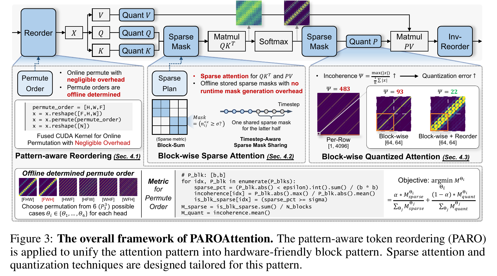
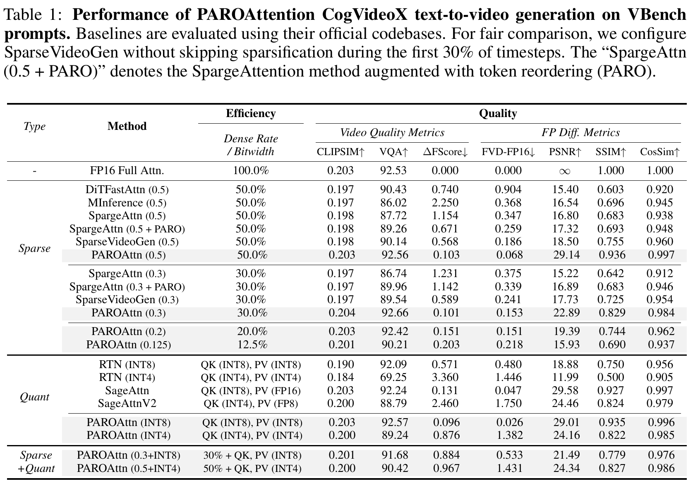
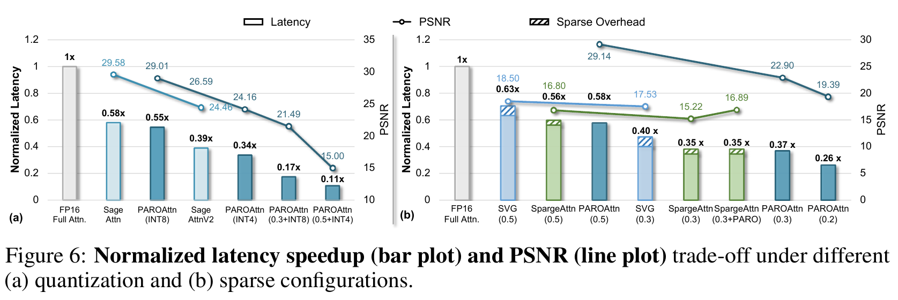

---
tags:
  - paper
  - collection/custom-attention
  - domain/ai-infra
  - status/deep-review
  - topic/sparse-attention
  - method/quantized-attention
document_type: paper
domain: custom_attn
collection: Custom Attention
review_status: deep-review
canonical: true
---

# PAROAttention: Pattern-Aware ReOrdering for Efficient Sparse and Quantized Attention in Visual Generation Models 精读分析

> [!info] 文档关系
> - 文档类型：Paper
> - 领域入口：[README](../README.md)
> - 上位汇总：[Video generation sparse attention](../surveys/video-generation-sparse-attention.md)
> - 证据资产：[assets/papers/paroattention](../assets/papers/paroattention/)

> 资料状态：主证据为 `/tmp/paroattention-2506.16054.pdf`（21 页，SHA-256 `2d88e09efa22d96d7f75d562b526ebe494682b61cee27228bbadad7ca92e319d`）和 arXiv:2506.16054 源码归档。正文图表是 300 DPI PDF 截图裁剪，均包含完整 caption。OpenReview forum 被 Turnstile 阻挡且 API 返回 403。项目页截至核验时仍标注 “Code (Coming Soon)”，arXiv source 也没有实现代码，因此 CUDA 实现只按论文描述审查，不能视为代码复现。

## 修订信息

- 当前修订 ID：`rev-paroattention-obsidian-properties-20260731`
- 当前文档版本：`1.0.2`
- 当前修订时间：`2026-07-31T10:00:00+08:00`
- 替代版本：`rev-paroattention-affiliation-backfill-20260730` / `1.0.1`

| 修订 ID | 文档版本 | 时间 | 修订者 | 类型 | 替代修订 | 迁移问题/解析 | 变更摘要 | 原因 | 影响位置 | 依据 | 对结论影响 |
|---|---|---|---|---|---|---|---|---|---|---|---|
| `rev-initial-20260730-paroattention` | `1.0.0` | `2026-07-30T12:41:46+08:00` | `review_paroattention` | `initial` | 无 | 无 | 首次完整单篇精读、原图 QA、公式/机制/系统/实验审计 | delegated task packet `vgsa-013-paroattention` | 全文；`Figure inventory`；配图；OpenReview access record | arXiv PDF/source、Figure 3、Table 1、Figure 6、Appendix Tables 4–8 | 初始结论 |
| `rev-paroattention-affiliation-backfill-20260730` | `1.0.1` | `2026-07-30T23:30:00+08:00` | `/root` | `metadata-update` | `rev-initial-20260730-paroattention` / `1.0.0` | 无 | 补充作者—机构元数据与角色证据边界 | 统一回填 affiliation 交付字段 | `作者与机构` | 论文 PDF 标题页、机构编号与角色脚注 | none：不改变方法、实验与归因结论 |
| `rev-paroattention-obsidian-properties-20260731` | `1.0.2` | `2026-07-31T10:00:00+08:00` | `/root` | `metadata-update` | `rev-paroattention-affiliation-backfill-20260730` / `1.0.1` | 无 | 增加 Obsidian YAML Properties 与层级标签 | 全量 canonical Paper 标签补齐 | 文件头 YAML frontmatter | 已验证的 ICML 2026 标签 schema；仓库覆盖矩阵 | none：不改变论文分析与证据结论 |

## 0. 资料与配图索引

| 类型 | 状态 | 路径/来源 | 证据边界 |
|---|---|---|---|
| 论文 PDF | 已获取并可读 | `/tmp/paroattention-2506.16054.pdf`；https://arxiv.org/abs/2506.16054 | 21 页；正文与附录均可检索 |
| arXiv source | 已获取 | `source/arxiv-source.tar.gz`，展开于 `source/unpacked/` | 含 `ms.tex` 与原始 figure PDF；未含实现代码 |
| 提取文本 | 已完成 | `extracted_text/paper.txt` | Poppler `pdftotext -layout`，1383 行 |
| OpenReview | 受阻 | `openreview_reviews.md`、`openreview-forum.html` | forum 为 Turnstile 页面；API HTTP 403；不能核验 reviews/rebuttal/decision |
| 开源代码 | 不可用 | 项目页 https://a-suozhang.xyz/paroattn.github.io/ | 搜索结果与项目页均为 “Code (Coming Soon)”；source 声称 supplementary code，但归档中没有 |
| 原论文 Figure 3 | 已通过 QA | `../assets/papers/paroattention/fig3-overall-framework-caption.png` | 机制/系统总览，PDF 第 5 页 |
| 原论文 Table 1 | 已通过 QA | `../assets/papers/paroattention/table1-cogvideox-results-caption.png` | CogVideoX 主结果，PDF 第 7 页 |
| 原论文 Figure 6 | 已通过 QA | `../assets/papers/paroattention/fig6-latency-psnr-caption.png` | operator latency–PSNR 证据，PDF 第 9 页 |
| Contact sheet | 已通过初筛 | `figures/contact-sheet.png` | 仅用于批量初筛；逐图 QA 见 `Figure inventory` |
| 算法总览 | 使用原论文图 | Figure 3 | 已覆盖输入、在线执行顺序、离线校准、状态变化与输出，无需生成替代图 |

## 0.1 术语与符号解释

### 0.1.1 术语表

| 术语 | 本文含义 | 别名 | 不等于/易混项 | 证据来源 |
|---|---|---|---|---|
| PARO | Pattern-Aware token ReOrdering；按 attention head 从视觉维度排列中选一个 token permutation | token reorder / permutation | 不是任意 $N!$ 重排；视频只搜索 $[F,H,W]$ 的 6 种轴排列 | §4.1；Figure 3；`ms.tex:241-269` |
| pattern-aware | 用稀疏块比例和块内 incoherence 的组合分数选择每个 head 的 permutation | per-head order selection | 不是运行时根据每个 prompt 动态搜索 | §4.1，Eq. 1–3 |
| block-wise pattern | 重排后，大 attention 值更集中在局部 $b\times b$ block 中，同时出现更多可整体跳过的 block | hardware-friendly block pattern | 不代表 attention 天然变成严格块对角，也不保证每个 prompt 完全相同 | Figure 3；§4.1–4.3 |
| static sparse mask | 用离线 post-softmax attention 校准出的 block bitmap；推理时直接加载 | offline mask / sparse plan | 不同于由当前 $Q,K$ 在线预测的 dynamic mask | §4.2 |
| timestep-aware mask sharing | 前半段 timestep 用不同 mask，后半段共享一个 mask | later-half sharing | 源码注释中曾出现 “latter 70%”，但生效正文和 Figure 3 写 latter half；以最终排版正文为准，同时保留歧义 | §4.2；Figure 3；`ms.tex:323-335` |
| dense rate | 被实际计算的 attention blocks 比例 | density | 不是最终视频像素保留率，也不是参数稀疏率 | Tables 1–2、4 |
| incoherence $\Psi$ | 一个 group 内最大绝对值相对平均绝对值的比值；越大表示 outlier 越突出、统一 scale 越难量化 | sharpness proxy | 不是统计学 coherence，也不是量化误差本身 | Eq. 2；§4.3 |
| FP-difference metric | 将压缩输出与同一 FP16 baseline 输出比较的 PSNR/SSIM/CosSim/FVD-FP16 等 | relative difference metric | 不等同于绝对生成质量；对小像素变化更敏感 | §5.1；Appendix §2 |
| normalized latency | Figure 6 中相对 FlashAttention 的 latency 比例，越低越好 | latency bar | caption 称 “speedup bar”，但轴实际是 normalized latency；speedup 应取倒数 | Figure 6；Appendix Tables 5–6 |
| operator-only speedup | 只测 attention computation，不含 QKVO projection 的加速比 | attention speedup | 不是完整 DiT step 或端到端生成加速 | Appendix §3，`ms.tex:744-761` |

### 0.1.2 符号表

| 符号 | 含义 | 性质 | 作用域/索引 | 单位/取值 | 来源 | 易混点 |
|---|---|---|---|---|---|---|
| $F,H,W$ | latent token 的帧、高、宽三个维度 | author-defined | 每个视觉样本 | 正整数；示例 $13,30,45$ | Introduction footnote | 论文称 49-frame 视频，但 latent $F=13$ |
| $N$ | 图像/视频 token 数 | author-defined | 每次 attention | $N=FHW$；示例 17,550 | Introduction；§4.1 | Appendix kernel test 写 17,750，与正文示例 17,550 不一致 |
| $Q,K,V$ | query、key、value | author-defined | attention head | tensor | Figure 3 | $QK^T$ 是 pre-softmax score |
| $P$ | softmax 后 attention map | author-defined | 每个 head/timestep | $P\in\mathbb{R}^{N\times N}$ | §4.1 | 量化与稀疏的核心对象；FlashAttention 中通常不完整物化 |
| $b$ | block 边长 | author-defined | sparsity/quantization group | 实验取 64 | §4.1、§5.1 | block 含 $b^2$ 个元素 |
| $k$ | 单轴 block 数，使 $N=k b$ | author-defined | 单个 attention map | 正整数 | Eq. 1–2 | 实际 $N$ 未必整除 64，论文未说明 padding |
| $P_{ij}$ | 第 $(i,j)$ 个 $b\times b$ attention block | author-defined | block 索引 | tensor | Eq. 1–2 | permutation 后重新分块 |
| $\epsilon$ | 判为“小 attention 值”的阈值 | author-defined | permutation calibration | 示例 $10^{-3}$ | Eq. 1 前正文 | 不等于 block-level 比例阈值 $\sigma$ |
| $\sigma$ | block 内小值比例阈值 | author-defined | permutation calibration | 示例 90% | Eq. 1 前正文 | 早期注释交换过 $\epsilon/\sigma$ 角色，最终正文较清楚 |
| $n_{ij}^{<\epsilon}$ | block 中绝对值小于 $\epsilon$ 的元素个数 | author-defined | 每个 block | $0\ldots b^2$ | Eq. 1 | 是计数，不是 density |
| $\mathbb I(\cdot)$ | 条件成立为 1，否则 0 | author-defined | Eq. 1 | binary | Eq. 1 | 无 |
| $M_{\mathrm{sparse}}$ | 满足“至少 $\sigma$ 比例小值”的 blocks 比例 | author-defined | 每个 permutation | $[0,1]$，越高通常越有利于 sparsity | Eq. 1 | Eq. 3 却将其纳入被最小化目标，方向疑似相反 |
| $x,g$ | 一个 quantization group 及其元素数 | author-defined | 每个 group | $x\in\mathbb R^g$ | Eq. 2 | Figure 3 的 block group 为 $64\times64$ |
| $\Psi(x)$ | group 最大绝对值 / 平均绝对值 | author-defined | 每个 group | $\ge 1$ | Eq. 2 | 越低越容易共享 scale |
| $M_{\mathrm{quant}}$ | 全部 blocks 的平均 incoherence | author-defined | 每个 permutation | 正实数，越低越好 | Eq. 2 | 不是直接量化误差 |
| $\Theta_i$ | 候选 permutation | author-defined | per head | 视频 6 种 | Eq. 3 | 图像 2D 情况的候选数未明确 |
| $\alpha$ | sparse/quant 两项的组合权重 | author-defined | calibration | $[0,1]$，具体值未报告 | Eq. 3 | 缺 sensitivity 与默认值 |
| $M^{\Theta_i}$ | 某 permutation 的组合选择分数 | author-defined | per head | 归一化分数 | Eq. 3 | 论文写取最小值，但 sparse 项符号疑似错误 |
| $d$ | dense rate | analysis-derived | operator estimate | $(0,1]$ | 本文推导 | 理论 speedup $1/d$ 忽略非 attention 工作与 overhead |
| $B_{\mathrm{mask}}$ | 一个 head 的 block bitmap 字节数 | analysis-derived | 每个 mask/head | bytes | 本文推导 | 需对 block 数向上取整 |
| $T$ | 实测 runtime | analysis-derived | operator/request | seconds | 本文推导 | 论文未给完整 bytes moved，无法求有效带宽 |

## 1. 论文基本信息

### 作者与机构

- 第一作者（首位列名）：Tianchen Zhao → Tsinghua University；ByteDance Seed。
- 共同第一作者（仅含论文明确标注者）：
  - Ke Hong → Tsinghua University
  - Xinhao Yang → Tsinghua University
- 通讯作者/通讯联系人（仅含论文明确标注者）：
  - Yu Wang → Tsinghua University
- 其他作者涉及的机构（去重列举，不作逐作者映射）：Tsinghua University；ByteDance Seed。
- 对应依据：论文 PDF 标题页、作者机构编号与角色脚注（核验日期：2026-07-30）。

- 标题：PAROAttention: Pattern-Aware ReOrdering for Efficient Sparse and Quantized Attention in Visual Generation Models
- 作者：Tianchen Zhao、Ke Hong、Xinhao Yang 等
- 版本：arXiv:2506.16054；任务包标注 NeurIPS 2025
- 研究领域：视觉生成、稀疏 attention、低比特 attention、CUDA kernel
- 核心问题：视觉 DiT 的 2D/3D token flattening 产生多样、分散的 attention 图案，使低 density 稀疏化与低 bitwidth 的 $PV$ 量化同时变难。
- 目标：用同一个前处理——per-head token permutation——把 attention 重组为局部 block pattern，再采用静态 block mask 与 block-wise INT8/INT4。
- 关键假设：每个 head 偏好的局部聚合维度跨 prompt 较稳定；跨 timestep 的结构变化可用前半段独立 mask、后半段共享 mask覆盖；6 种轴排列足以找到实用布局。

## 2. 研究动机与问题—方案闭环

### 2.1 出发点与背景痛点

作者的出发点是一个算法—系统共同瓶颈：720P、数秒视频需要约 17K latent tokens，全 attention 的计算与显存随 $N^2$ 增长，已经成为生成延迟主体（Introduction）。现成的稀疏化和量化在语言模型上有效，但视觉 attention 不是一条稳定的因果/局部窗口：不同 head 会沿 $F/H/W$ 的不同维度局部聚合，flatten 后表现为多条间隔对角线、块中对角线或分散 block。

论文的关键转向不是继续为每种图案设计一个 detector，而是先改变数据布局：如果相邻视觉位置在一维 token 序列中也重新相邻，那么原本分散的高 attention 值会聚到少数 blocks。这样同一布局变化同时改善两个下游条件：可整体跳过的低值 blocks 增多；量化 group 内 outlier 相对减少。

### 2.2 现有方案为何不够

| 现有方案/做法 | 可观察的失败 | 具体场景或例子 | 例子来源 | 根因/被忽略变量 | 为什么简单修补仍不够 | 证据 |
|---|---|---|---|---|---|---|
| 固定 window/diagonal/static mask | 50% density 仍出现明显内容偏移；CogVideoX PSNR 约 15.40–18.50 | 17,550 tokens 由 $[F,H,W]$ flatten；沿 $H$ 或 $F$ 相邻的 token 在 1D 中隔很远，多条“远离中心”的对角线被 window 漏掉 | paper-provided；Figure 2、Table 1、Appendix Figure 12 | 视觉局部性存在于 3D 坐标，不等于当前 1D adjacency | 扩大 window 会把被漏对角线纳入，但也会保留大量无用 blocks，直接牺牲 density；换单一 diagonal pattern 仍覆盖不了 block-in-diagonal | §3；Table 1；Appendix §4 |
| 在线 dynamic mask 预测 | 要么 mask 不准，要么 predictor overhead 高 | 为在算 $QK^T$ 前决定哪些 blocks 可跳过，方法只能从 $Q,K$ 或低分辨率 proxy 预测 post-softmax pattern | paper-provided；Figure 3 | pre-softmax score 较均匀，稀疏结构在 softmax 后更明显；downsample 又丢细节 | 提高 predictor 分辨率会增加 runtime，削弱稀疏收益；降低 overhead 则使 mask 更粗 | §4.2 |
| per-row $P$ 量化 | group 内一条/多条大值对角线拉高 scale，多数小值被舍入到零 | 一个 $1\times4096$ row 同时包含大 diagonal 值与大量小值，Figure 3 报 incoherence 483 | paper-provided；Figure 3 | group 没按相似分布组织；outlier 与普通值共用 scale | 单纯增加 bitwidth 可以缓解，但失去 INT4/INT8 的计算收益；线性层常用 rotation/scaling 难直接作用于未物化、迭代更新的 $P$ | §3、§4.3 |
| 只降低全局 density/只放宽量化 | 质量改善但所有 heads/blocks 都多算 | 本文构造的说明例：把 density 从 30% 提到 50% 会保护被错误丢弃的远端对角线，却也让已很规则的 heads 多算 20% blocks | reviewer-created | 没有修复布局与 attention 几何不一致 | 这是“多花算力掩盖错误”，不能同时达到低 density 和低 error | 由 Figure 2/3 与 Table 1 重建 |

### 2.3 论文计划解决的问题与成功标准

- 核心研究问题：能否通过低成本 token layout 变换，将多样视觉 attention 统一成 block-friendly 结构？
- 适用场景：CogVideoX、Wan 2.1 的 3D full attention 与 Flux 的 2D视觉生成 attention。
- 约束：permutation 决策不能在线搜索；mask 要能跨 prompt/timestep 泛化；block size 要对齐 FlashAttention；量化要覆盖 $PV$，而不只 $QK^T$。
- 成功标准：在更低 density/bitwidth 下保持 VQA/CLIP 等质量和对 FP 输出的接近度；attention operator latency 接近 density 理论比例；额外 permutation/prefetch overhead 足够小。
- 明确不解决：训练阶段 native sparse attention、任意 token graph 重排、跨模态 text token 稀疏、完整生产 serving scheduler。

### 2.4 核心方案如何解决并优化问题

| 原始问题/失败模式 | 根因或约束 | 对应方案设计 | 改变的变量/系统行为 | 作用机制 | 预期优化及指标 | 证据来源 | 判断 |
|---|---|---|---|---|---|---|---|
| 多对角/分散 pattern 难被统一 mask 覆盖 | flatten order 与 head 的局部聚合维度错位 | 每 head 从 6 个 $F/H/W$ permutations 中离线选序 | token adjacency、attention block occupancy | 把原先相隔的局部邻居放到相邻 token/block | 更高低值-block 比例、更高 PSNR | Figure 3、7；Table 3 | 有直接 ablation，但选择目标公式存在方向歧义 |
| dynamic mask 有 prediction overhead/误差 | post-softmax 结构不能低成本提前得知 | 离线 post-softmax calibration + static mask | mask 生成从在线移到离线 | 使用更完整 pattern，推理只加载 bitmap | overhead 降低；质量提高 | §4.2；Appendix Tables 5、8 | 论文结果支持系统收益；未与同等高质量 dynamic predictor 完全匹配 |
| pattern 随 timestep 变化 | 单个静态 mask 会累积误差 | 前半 timestep 独立，后半共享 | mask 数量与时间粒度 | 在变化快阶段保细粒度，稳定阶段复用 | 降 storage/transfer，质量基本不变 | Table 3；Figure 15 | ablation 仅显示“取消 sharing”不改善，未给更激进 sharing sensitivity |
| 稀疏 kernel 分支/索引不规则 | sparse granularity 与 kernel tile 不对齐 | 64×64 block bitmap | kernel skip 单位 | 整 block 跳过，减少控制逻辑 | latency 接近 $1/d$ | Figure 6；Appendix Table 5 | operator-only 直接证据 |
| $P$ group outlier 使 INT 量化误差大 | row 内动态范围过大 | 64×64 grouping + reorder | $\Psi$、shared scale 的数值范围 | 相似值聚合，降低 scale 被极值支配 | INT8/INT4 PSNR/SSIM、latency | Figure 3、13、14；Tables 1、3、6 | 有机制图与 ablation；没有完整量化算子/累加精度代码 |
| mask 常驻显存约 1 GB | timestep × block × head masks 太多 | current mask prefetch + double buffer | resident mask footprint、copy/compute overlap | 只保留当前 block/timestep mask，并隐藏传输 | KB-level resident footprint、0.33% overhead | Appendix Tables 7–8 | paper-reported；无 profiler/code |

### 2.5 完整因果链与证据闭环

完整链条是：长视觉序列使 attention 成为瓶颈 → 3D/2D 局部关系被 1D flatten 打散 → 低 density mask 漏掉分散高值，per-row 量化又被对角 outlier 主导 → 离线按 head 选择轴 permutation → block 内相似性与 block 间可丢弃性同时提高 → static block mask、INT8/INT4 $PV$ 与 tile-aligned kernel 可直接使用 → 预期降低 attention latency，同时保持生成质量 → Table 1/2/4、Figure 6 与 Table 3 验证质量、operator latency和若干组件。

闭环并不完整的地方有三处。第一，Eq. 3 的最小化方向与 $M_{\mathrm{sparse}}$“越高越好”的定义冲突，无法从公开代码判断实现究竟取负号、倒数还是 argmax。第二，1.9–2.7× end-to-end 声称缺少像 operator 表那样完整的 stage breakdown、负载与重复测量。第三，开放代码与 OpenReview rebuttal 均不可得，不能复核 kernel、$\alpha$、padding、scale/accumulation precision。

## 3. 核心贡献与创新点

1. 把视觉 attention 压缩问题重新表述为 layout 问题：先重排 token，再做 sparse/quant，而不是为每种 pattern 增加 detector（Introduction、Figure 2/3）。
2. 用两个 block-level calibration 指标在 per-head 的 6 种轴 permutation 中选择布局，并把决策移到离线（§4.1，Eq. 1–3）。
3. 在同一个 reorder 后的 block pattern 上组合 static sparsity 与 $PV$ INT8/INT4，覆盖过去通常保留 FP16/FP8 的第二个矩阵乘（§4.2–4.3，Table 1）。
4. 给出 tile-aligned CUDA 设计思路：fused permutation、bitmap block skip、mask prefetch/double buffering（Figure 3，Appendix §3）。
5. 在 CogVideoX、Wan 2.1、Flux 上提供质量/FP-difference 证据和 A100/RTX4090 operator latency（Tables 1/2/4，Figure 6）。

## 4. 研究方法

### 4.1 方法总览

离线阶段先用 1–2 个 calibration prompts 保存 post-softmax attention。对每个 head，分别尝试 $[F,H,W]$ 的 6 种排列，计算“多少 blocks 大部分接近零”与“block 内最大值相对平均值有多尖”两个指标，再决定 permutation。随后按 timestep/block/head 生成 static bitmap masks。

在线阶段把 permutation 融合进前置算子的写回地址，得到 reordered $Q,K,V$；在 $QK^T$ 和 $PV$ 两处用同一 sparse plan 跳过 blocks；$P$ 在 block 内做 INT8/INT4；最后 inverse reorder 恢复下游所需 token 顺序。Figure 3 是足够完整的读者总览，并清楚区分底部的 offline order/metric 与顶部的 online attention path。

> 原论文 Figure 3，PDF 第 5 页。该图是机制证据，不是本文生成图。

### 4.2 在线执行路径

1. 输入视觉 token 按预定 $\Theta_i$ 重排；每个 head 可不同。
2. 生成/读取 $Q,K,V$ 的低比特表示。
3. 由预取的 bitmap 控制 $QK^T$ block skip。
4. softmax 得到逻辑上的 $P$；论文强调 FlashAttention 式实现不会完整物化 $P$。
5. 对 $P$ 做 block-wise integer quantization，再用同一 pattern 控制 $PV$。
6. inverse reorder，使 attention 输出回到模型原 token order。

训练模型权重不变；这是 post-training calibration + inference runtime 方案。论文没有报告针对 $\Theta$ 或 masks 的梯度训练。

### 4.3 模型/系统架构

Figure 3 同时展示三条系统边界：permutation 可融合到 RoPE/前序写回；sparse mask 在两个 matmul 复用；inverse reorder 在 attention 输出端恢复布局。它也显示 block group 从 per-row 的 $\Psi=483$ 降到纯 block 的 93，再降到 reorder+block 的 22。这些数字是示例图/机制观察，不应当作所有 heads 的分布保证。

### 4.4 关键公式

#### 4.4.1 稀疏友好度

$$
n_{ij}^{<\epsilon}
=\sum_{m=1}^{b}\sum_{n=1}^{b}
\mathbb I\!\left(|P_{ij}(m,n)|<\epsilon\right),
\qquad
M_{\mathrm{sparse}}
=\frac{1}{k^2}\sum_{i=1}^{k}\sum_{j=1}^{k}
\mathbb I\!\left(\frac{n_{ij}^{<\epsilon}}{b^2}\ge\sigma\right).
$$

**这条公式在算什么？** 某个 permutation 产生了多少“几乎整块都很小”的 attention blocks。

**怎么读？** 先数每块里小于 $\epsilon$ 的元素；若比例超过 $\sigma$，该块记为可稀疏候选，最后取候选块比例。

**输入与输出。** 输入是 permutation 后的 $P$、block 大小 $b$、数值阈值 $\epsilon$、比例阈值 $\sigma$；输出是 $[0,1]$ 的 $M_{\mathrm{sparse}}$。

**变量在这里各做什么？** $i,j$ 定位 block，$m,n$ 定位块内元素，$\mathbb I$ 把连续值变成计数；$k^2$ 做全图归一化。

**直觉。** permutation 越能把大值聚到少数 blocks，其余 blocks 越可能有 90% 以上元素低于 $10^{-3}$，$M_{\mathrm{sparse}}$ 越高。

**边界。** 这是 calibration proxy，不等于实际被跳过的 block 比例；真实 mask 用 block sum/density threshold。论文没有报告对 $\epsilon,\sigma$ 的 sensitivity。

**小例子。** 本文构造的说明例：4 个 blocks 中有 3 个满足“至少 90% 元素小于 $10^{-3}$”，则 $M_{\mathrm{sparse}}=0.75$。

#### 4.4.2 量化难度

$$
\Psi(x)=\frac{\max(|x|)}
{\frac{1}{g}\sum_{\ell=1}^{g}|x_\ell|},
\qquad
M_{\mathrm{quant}}
=\frac{1}{k^2}\sum_{i=1}^{k}\sum_{j=1}^{k}\Psi(P_{ij}).
$$

**这条公式在算什么？** 一个 group 的最大值比普通值突出多少，并把该量在所有 blocks 上平均。

**怎么读？** 最大绝对值除以平均绝对值；比值越大，少量 outliers 越可能把 shared scale 拉大。

**输入与输出。** 输入是 group $x$ 或 blocks $P_{ij}$；输出是每组 $\Psi\ge1$ 与平均 $M_{\mathrm{quant}}$。

**变量在这里各做什么？** $g$ 是 group 元素数；分母衡量典型幅值，分子抓极值；$k^2$ 是 blocks 数。

**直觉。** 若最大值固定而平均值变大，说明组内其余值更接近最大值，$\Psi$ 下降，统一 scale 的舍入损失通常更小。

**边界。** $\Psi$ 是难度替代指标，不是量化 MSE；两个分布可有相同 $\Psi$ 却有不同误差。$P$ 非负，但公式写绝对值以保持一般性。

**小例子。** 本文构造的说明例：$x=[8,1,1,1]$ 时平均值 2.75、$\Psi\approx2.91$；若重排后组成 $[8,7,6,5]$，$\Psi\approx1.23$，共享 scale 更不被单点支配。

#### 4.4.3 permutation 组合分数

$$
M^{\Theta_i}
=\alpha\frac{M_{\mathrm{sparse}}^{\Theta_i}}
{\sum_{\Theta_j}M_{\mathrm{sparse}}^{\Theta_j}}
+(1-\alpha)\frac{M_{\mathrm{quant}}^{\Theta_i}}
{\sum_{\Theta_j}M_{\mathrm{quant}}^{\Theta_j}}.
$$

**这条公式在算什么？** 把稀疏友好度与量化难度缩放到 permutation 集合内的相对量级，再用 $\alpha$ 混合。

**怎么读？** $\alpha$ 越大越重视 sparse 项，越小越重视 quant 项；论文写选择 $M^{\Theta_i}$ 最小的 permutation。

**输入与输出。** 输入是每个 $\Theta_i$ 的两个指标和 $\alpha$；输出是组合 score。

**变量在这里各做什么？** 分母对 6 个候选做归一化；$\alpha$ 和 $1-\alpha$ 分配权重。

**直觉。** 量化项越低越好，因此最小化合理；但按 Eq. 1，$M_{\mathrm{sparse}}$ 越高表示更多可稀疏 blocks，把它以正号加入并最小化会偏向更差的 sparsity。

**边界。** 这是论文最重要的数学歧义。可能实现使用 $1-M_{\mathrm{sparse}}$、负号或 argmax，但公开 source 与 Figure 3 都显示正号/argmin，且无代码可核验；因此“具体选择准则可复现”结论不成立。

**小例子。** 两个候选的 sparse score 分别 0.8/0.2、quant score相同；按论文公式并最小化会选 0.2 的候选，与“更多 sparse blocks 更好”相反。

#### 4.4.4 block bitmap 显存

$$
B_{\mathrm{mask}}
\approx \frac{\left\lceil N/b\right\rceil^2}{8}\ \text{bytes}.
$$

**这条公式在算什么？** 一个 head、一个 timestep 的 block mask 若每块 1 bit，需要多少存储。

**怎么读？** 每轴约有 $\lceil N/b\rceil$ 个 blocks，二维共有其平方个 bits，再除以 8。

**输入与输出。** 输入 token 数 $N$ 和 block size $b$；输出 bytes。

**变量在这里各做什么？** 向上取整覆盖边缘不满 block 的 tokens。

**直觉。** block size 增大，mask 以 $1/b^2$ 缩小，但 sparsity 粒度变粗。

**边界。** 不含 metadata、alignment、head/timestep/block 数量乘子；论文未说明 padding/descriptor layout。

**小例子。** 用正文 $N=17{,}550$、$b=64$：$\lceil N/b\rceil=275$，得到约 9,453 bytes（9.23 KB，十进制），与论文 9.2 KB/head 基本吻合。这是 reviewer calculation，不是新增实测。

### 4.5 组件级设计动机与具体问题映射

| 设计项 | why 状态 | 原文证据 | 针对的具体问题 | 因果机制 | 替代方案/权衡 | 验证证据 | 判断 |
|---|---|---|---|---|---|---|---|
| 仅搜索轴 permutations | author-stated | §4.1 | 任意 reorder 搜索空间巨大且在线代价高 | 将 $N!$ 限成视频 6 种，利用视觉轴局部性 | 更一般 graph reorder 可能更优但 calibration/执行更贵 | Figure 7 | 部分支持；只可视化单个 head |
| per-head offline order | author-stated | §4.1 | heads 聚合维度不同；在线搜索有 overhead | 每 head 固定最适 order，跨 prompt/timestep复用 | per-sample order 更适应但产生动态开销 | Figure 7、Figure 15 | 间接支持；order stability 无大规模统计 |
| sparse/quant 双指标 | author-stated | Eq. 1–3 | 两者偏好的 block 分布不同 | 共同选兼顾空块与低 incoherence 的 order | Pareto selection 或分别选 order | Figure 7、Table 3 | 公式方向歧义；$\alpha$ 未报告 |
| static post-softmax mask | author-stated | §4.2 | pre-softmax dynamic proxy 不够清楚 | 离线访问完整 $P$，推理无 predictor | dynamic 更自适应 | Table 1、Appendix Table 5 | 与 baselines 的整体对比支持，但有 baseline policy混杂 |
| timestep-aware sharing | author-stated | §4.2 | mask 全时共享累积误差，全独立耗显存 | 前半独立、后半共享 | 分段聚类或低秩 mask | Table 3 | “去 sharing”质量相当，只证明节省无损，不证明最优边界 |
| 64×64 sparse granularity | author-stated | §4.2、§5.1 | 不规则 sparse 控制开销 | 对齐 FlashAttention tiles，可整块 skip | 更小 block 更精确但 descriptor/branch 更多 | Figure 6 | operator latency 支持；无 block-size sensitivity |
| block sum mask criterion | author-stated | §4.2 | 需要低成本、可控 density | 重排后结构简单，block sum 足够 | learned scorer 更精确但离线/在线成本增加 | 主结果 | 未单独消融 threshold rule |
| 64×64 $P$ quant group | author-stated | §4.3 | per-row outlier + kernel 不对齐 | 局部 group 缩小动态范围并适配 tile | per-row/per-channel/rotation | Table 3：去 block group PSNR 30.17→27.50 | 直接 ablation |
| fused permutation | author-stated | §4.1、Appendix Table 7 | 重排的数据搬运可能抵消收益 | 只改变前序 kernel 写回地址 | 单独 transpose 简单但读写 HBM | 1.2488→1.2492 ms，0.03% | 直接 microbenchmark；代码不可核 |
| mask prefetch + double buffer | author-stated | Appendix §3、Table 8 | 全 masks 常驻约 1 GB | 当前 mask 驻留，copy/compute overlap | 压缩/按需生成 | 1296.5→1300.8 ms，0.33% | 直接 microbenchmark；bytes/链路未报告 |

### 4.6 训练/实验/部署设计

- 无训练：对现有 CogVideoX-5B、Wan 2.1-14B、Flux.1.Dev 做 post-training calibration。
- calibration：视频只用 CogVideo 示例集前 2 prompts；图像也复用这些 prompts。论文称跨 prompt cosine similarity $\ge0.99$，但未给完整分布/置信区间。
- evaluation：CogVideoX/Wan 用 VBench prompts subset（数量未报告）；Flux 用 COCO 前 1024 prompts。
- sampling：30 steps；视频 720P 6/10 秒，图像 1024 分辨率。
- baseline fairness：Table 1 强制 SparseVideoGen 不跳过早期 30% timesteps，虽然其官方方案会跳过前两 blocks/早期 timesteps。附录补充“with skip”后 PSNR 25.37，而 Table 1 的 18.50 是 “without skip”。因此 Table 1 更像比较“所有 timesteps 都压缩时的鲁棒性”，不完全是各方法最佳默认配置的产品比较。

## 5. 关键结论

### 5.1 主结果

> 原论文 Table 1，PDF 第 7 页。Table caption 明确指出 SparseVideoGen 被关闭 early-timestep skipping。

CogVideoX 上，PAROAttn 50% density 的 PSNR 29.14，明显高于 SpargeAttn 16.80、SparseVideoGen（无 skip）18.50；30% density 的 PAROAttn PSNR 22.89，也高于两个 30% baselines 的 15.22/17.73。把 PARO 加到 SpargeAttn 在 30% density 将 PSNR 从 15.22 提到 16.89，是“reorder 本身有帮助”的 bridge baseline，但仍远低于完整 PAROAttn 22.89，说明 static mask/kernel/criterion 也共同变化，不能把全部收益归给 reorder。

量化方面，PARO INT8（$QK,PV$ 均 INT8）PSNR 29.01，接近 SageAttn 的 29.58（$PV$ 仍 FP16）；PARO INT4 的 24.16 接近 SageAttnV2 的 24.46（$PV$ FP8）。这支持“把 $PV$ 进一步降成整数仍能维持相似 FP-difference”的经验结论，但不是严格无损：不同指标有小幅升降，且没有方差/置信区间。

> 原论文 Figure 6，PDF 第 9 页。柱是 normalized latency（越低越好），不是直接 speedup；倒数才是 speedup。

Figure 6/Appendix Tables 5–6 给出 attention operator 证据：A100 上 50%/30% sparse 为 1.73×/2.71×；RTX4090 上 INT8/INT4 为 1.83×/2.97×；组合 0.3+INT8 与 0.5+INT4 达 5.72×/9.28×。这些测量排除了 QKVO projections，不能直接当成端到端生成加速。

### 5.2 技术点—证据矩阵

| 论文声称的技术点 | 声称收益 | 对应实验/消融 | 对照是否受控 | 指标变化 | 证据强度 | 结论 |
|---|---|---|---|---|---|---|
| token reorder 改善 sparsity | 更低 density 保质量 | Table 3 去 reorder；Sparge+PARO bridge | Table 3 matched；bridge 有其他差异较少 | PSNR 29.14→26.25（50% sparse）；Sparge 30% 15.22→16.89 | direct ablation + replacement bridge | 有支持 |
| reorder 改善 quantization | 降低 $\Psi$ 与 error | Table 3；Figures 13–14 | Table 3 matched | PV INT8 PSNR 30.17→29.00；$\Psi$ 范围 200–1200→12–20 | direct ablation + mechanism visualization | 有支持，但分布统计范围不清 |
| block quant group 必要 | row group error 大 | Table 3 | matched | PSNR 30.17→27.50 | direct ablation | 有支持 |
| timestep sharing 无损省内存 | later masks 可共享 | Table 3 去 sharing | matched | 29.14 vs 29.09，几乎相同 | direct ablation | 支持“全独立无额外质量收益”；未证明 half 是最优 |
| static mask 优于 dynamic | 更准、更低 overhead | Table 1 与 baselines | 部分不匹配 | 多项指标提升 | confounded comparison | 完整方法有效，但不能单独归因 static |
| fused permutation negligible | 0.03% overhead | Appendix Table 7 | matched microbenchmark | 1.2488→1.2492 ms | direct microbenchmark | 支持特定实现/shape；代码缺失 |
| prefetch 将 1GB 常驻降至 KB | 0.33% latency overhead | Appendix Table 8 +文字 | matched microbenchmark | 1296.5→1300.8 ms | direct runtime + reported memory | latency 有支持，memory 未给 profiler |
| 1.9–2.7× end-to-end | 完整生成加速 | Abstract/Figure 1 | breakdown 缺失 | 仅声称区间 | no isolated evidence in tables reviewed | 未充分验证 |
| 跨模型适用 | CogVideoX/Wan/Flux 均有效 | Tables 1、2、4 | 模型/任务不同 | 多指标趋势相近 | cross-model replication | 有经验支持；模型仅 3 个视觉生成系统 |

### 5.3 是否验证了假设

- “轴 permutation 足以形成 block pattern”：Figure 7/16 可视化支持，但 head/sample覆盖有限。
- “order 跨 prompt/timestep 稳定”：Figure 15 支持 pattern type 稳定，具体 pattern 随 timestep 变化；因此只能支持有限稳定性。
- “reorder 同时帮助 sparse 与 quant”：Table 3 的两条 matched ablation 是最有力证据。
- “static mask 是最优选择”：没有对同等 calibration budget、同等 kernel 的 dynamic/static 受控实验，只能说当前完整方案更好。
- “低比特且无质量损失”：质量指标近似保持，但 FP-difference 明显有限值；应写“质量指标接近/生成结果可用”，不能严格写 lossless。

### 5.4 收益来源归因

| 组件/变化 | 对比基线 | 指标变化 | 影响路径 | 证据强度 |
|---|---|---|---|---|
| PARO reorder（sparse） | 完整 PARO vs -reorder | PSNR +2.89，SSIM +0.029 | attention value 聚块 → mask 少漏高值 | matched ablation |
| PARO reorder（quant） | 完整 PV INT8 vs -reorder | PSNR +1.17 | 降 $\Psi$ → shared-scale rounding error 减小 | matched ablation |
| block group | 完整 PV INT8 vs row-wise | PSNR +2.67 | group 与 tile/局部分布对齐 | matched ablation |
| PARO + Sparge | Sparge 30% | PSNR +1.67 | 只改 layout 的近似 bridge | replacement baseline；仍可能有适配细节 |
| tile-aligned static sparse kernel | FlashAttention | 50% 1.73×、30% 2.71× | 跳过整 blocks、减少 predictor overhead | operator benchmark；algorithm/runtime合并 |
| integer $PV$ | Sage V1/V2 | 1.72→1.83×；2.56→2.97× | 第二个 matmul 进一步低比特 | operator benchmark；不同数值格式 |
| sparse + quant | FlashAttention | 5.72×/9.28× | 稀疏减少 blocks，整数降低每块 cost | 完整 operator组合；质量也同时改变 |

这些不是严格的方差分解。尤其完整 PARO sparse 与 baselines 同时改变 reorder、mask生成、mask类型和 kernel。

## 6. Related Work 对比

| 类别/论文 | 方法核心 | 优点 | 局限 | 与本文关系 |
|---|---|---|---|---|
| DiTFastAttn | 动态 window | 简单、局部性直接 | 漏多对角/远端结构 | PARO 先改变 adjacency，使局部 block 更符合视觉几何 |
| MInference | vertical/slash/block 等 pattern | LLM 长上下文有效 | 视觉 block-in-diagonal 不匹配 | PARO 不枚举 mask family，而是统一数据布局 |
| SparseVideoGen | 多 static patterns + dynamic selection，默认跳过早期阶段 | 针对视频 pattern | 默认 policy 与全时压缩比较不公平；mask预测仍受布局影响 | PARO 强调所有 timesteps 可压缩，附录需分开比较 skip policy |
| SpargeAttn | online block sparsity | 通用且动态 | predictor overhead/低 density 精度下降 | PARO 可作为其前处理，bridge baseline显示互补 |
| SageAttention/V2 | $QK$ INT8/INT4，$PV$ FP16/FP8 | 高效 kernel、成熟低比特路径 | $P$ 的 integer quantization困难 | PARO通过布局和 block group 把 $PV$推进到 INT8/INT4 |
| Quarot/AWQ 类 | rotation/scaling 平衡线性层分布 | 降 outlier | $P$ 在 fused attention 中不完整物化，难直接插入 | PARO用 token permutation 改变 group composition |

公平性上，PARO 论文使用了多数 baseline official code，但对 SparseVideoGen 修改了其默认 skip policy。该设置回答“在所有 timesteps 同等压缩时谁更稳健”，不等同于“各方法最佳官方配置谁更好”。附录 with-skip 结果应与主表一起读。

## 7. OpenReview 公开评审 × 论文内容交叉核验

- OpenReview 链接：https://openreview.net/forum?id=UPELg2oUo3
- 访问日期：2026-07-30
- decision/meta-review/rebuttal：不可访问
- 证据：`openreview_reviews.md`；forum Turnstile HTML；API HTTP 403

公开评审分支无法完成，因此没有把任何 reviewer 意见写成事实。本文独立识别的两个核心审查点是 Eq. 3 的方向冲突与 baseline policy 的比较边界；无法判断作者是否在 rebuttal 中解释。

## 8. Infra 需求分析

### 8.1 算力与延迟层级

理论上，若只看 attention block matmul，dense rate 为 $d$ 时理想 speedup 约为 $1/d$。50%/30% 的上界约 2×/3.33×，论文实测 1.73×/2.71×，说明 block skip 接近但未达到理想上界。

operator：Appendix Tables 5–6 明确是 attention-only，排除 QKVO projection。A100 测 sparsity；RTX4090 测 INT4/FP8/INT8。这两个平台的数据不能直接横向归因硬件优劣。

end-to-end：摘要给 1.9–2.7×，但缺少按 denoising step、QKVO、MLP、VAE、host overhead 的完整分解，也未报告 batch size、warmup、重复次数和误差条。因此只能保留为 author-reported claim。

### 8.2 显存与 descriptor

本文推导的单 head bitmap 约 9.23 KB，与论文 9.2 KB 一致，说明 descriptor 很可能是 $275\times275$ 的 1-bit block map。论文称所有 timestep/block/head masks 约 1 GB，但没有给 head/layer/timestep乘子与 alignment。prefetch 把 resident footprint 降至 current mask 的 KB 级；总 host/storage footprint 是否仍为 1 GB、位于 CPU pinned memory 还是 GPU staging 未说明。

### 8.3 Data Types / 数值格式

| 对象 | 格式 | 阶段 | 硬件依赖 | 影响 | 证据 |
|---|---|---|---|---|---|
| $Q,K$ | INT8 或 INT4 | inference | NVIDIA Tensor Core / SageAttnV2 基础 kernel | 降 matmul成本 | Table 1；§5.1 |
| $P,V$ 的 $PV$ | INT8 或 INT4 | inference | RTX4090 支持对应 INT4路径；PTX inline assembly 被论文提及 | 进一步降第二个 matmul成本 | §4.3、§5.1、Appendix Table 6 |
| Sage baseline $PV$ | FP16 / FP8 | inference | FP8 hardware | baseline对照 | Table 1 |
| sparse mask | 1-bit block bitmap | inference | custom CUDA block skip | 约 9.2 KB/head/mask | §4.2；本文推导 |
| accumulation/scale | 未报告 | inference | 实现相关 | 决定真实精度与吞吐 | 代码不可得 |

论文说 INT8“等价 7 mantissa bits”是直观类比，不是严格浮点术语；整数没有 exponent/mantissa 字段。更准确的说法是：在有限动态范围已通过重排压缩后，INT8 的均匀量化 levels 可比 E5M2 的 2-bit fraction 更细地分辨小差异。

### 8.4 带宽、互联与利用率

$$
\mathrm{EffectiveBandwidth}
=\frac{\mathrm{BytesMoved}}{T},
\qquad
\mathrm{Utilization}
=\frac{\mathrm{EffectiveBandwidth}}{\mathrm{PeakBandwidth}}.
$$

**这条公式在算什么？** 实际每秒搬运字节数，以及占硬件峰值带宽的比例。

**怎么读？** 已知真实数据移动量和 runtime 才能判断 kernel 是否接近 HBM 上限。

**输入与输出。** 输入 bytes moved、runtime $T$、peak bandwidth；输出 GB/s 与百分比。

**变量在这里各做什么？** 分子是实际流量，分母时间/峰值做归一化。

**直觉。** permutation 若单独读写 $Q,K,V$ 会增加 HBM traffic；融合写回地址可以避免额外 round-trip。prefetch double buffer 则尝试把 mask copy 藏在 attention compute 后面。

**边界。** 论文没有 profiler bytes、HBM transaction、L2 hit rate 或 peak-normalized bandwidth，所以无法数值计算 utilization。

**小例子。** 不适用：用 tensor logical size代替实际 transaction 会忽略 cache、packing 与融合，产生误导。

### 8.5 CPU/GPU/NPU 异构执行

| 阶段 | CPU 角色 | GPU/加速器角色 | 数据移动 | overlap | 潜在瓶颈 | 证据 |
|---|---|---|---|---|---|---|
| offline calibration | orchestration/保存 maps（推断） | 完整模型推理、统计 attention | maps 的落盘路径未报告 | 未报告 | 大 $P$ 捕获成本 | §4.1、§4.2 |
| permutation | 无明确角色 | 与 RoPE/前序 kernel 融合写回 | 避免额外 HBM round-trip | kernel fusion | address remap/coalescing | §4.1；Table 7 |
| mask prefetch | host来源未说明 | current mask staging + attention | 全量约1GB → current KB | double buffer | PCIe/HBM 路径未知 | Appendix §3 |
| sparse/quant attention | 调度未说明 | A100/RTX4090 custom CUDA | bitmap、quantized tensors | 未报告 | compute/HBM边界未知 | §5.1 |
| 非 GPU/NPU | 无实现 | 论文仅论证 INT 对定制 accelerator 可能更友好 | 未报告 | 未报告 | kernel portability | Appendix §5 |

没有证据表明 NPU/CPU backend 已实现。论文关于非 GPU accelerator 的讨论是潜力判断，不是部署结果。

### 8.6 调度/Serving/自定义算子

需要 per-model/per-head/per-timestep permutation 与 mask metadata；runtime 必须根据 denoising timestep选择 mask，并在 layer/head粒度预取。论文没有讨论多请求 batching 时不同 timestep 的 mask聚合、CUDA graph capture、stream priority、KV cache（diffusion full attention并非 LLM KV cache模式）或故障 fallback。若 batch中样本处于不同 timestep，metadata divergence 可能降低融合效率，这是未测边界。

## 9. 开源代码对照

- 项目页：`https://a-suozhang.xyz/paroattn.github.io/`
- 状态：Code (Coming Soon)
- arXiv source：只有 LaTeX与 figure assets，无 CUDA/Python实现
- commit：不可用

因此以下实现点均未验证：Eq. 3 实际符号/argmin；$\alpha$；边缘 blocks padding；mask descriptor；scale/zero point；INT4 packing；accumulation precision；RoPE融合代码；prefetch buffer所在内存与 stream；benchmark计时方法。论文声称基于 SageAttnV2并使用 PTX inline assembly，但不能用文字替代代码证据。

## 10. 优点与局限

### 优点

- 把 sparsity 与 quantization 的共同根因统一为“布局导致的分布不友好”，机制简洁而有工程穿透力。
- 有 matched ablation 证明 reorder 对 sparse/quant 两条路径都有效。
- 机制、质量、operator latency、overhead、跨模型证据层次较完整。
- bitmap size 可由 token/block geometry 反推并与论文数字吻合。

### 局限

1. Eq. 3 的 sparse 项方向与 argmin 冲突，核心 order selection 无法仅凭论文复现。
2. $\alpha$、padding、quant scale/accumulation、kernel launch/packing 未报告，代码仍未发布。
3. end-to-end 1.9–2.7× 没有完整 stage breakdown、统计重复或误差条。
4. SparseVideoGen 主表关闭官方 skip policy；这对“全时压缩鲁棒性”公平，但对“最佳默认配置”并不公平。附录 with-skip PSNR 25.37 应共同呈现。
5. VBench subset 数量、prompt list、random seed与统计置信区间未报告。
6. Wan附录文字称 0.3 density 几乎一致、0.5 density 反而明显退化，与 density逻辑和 Table 4（0.5 PSNR 22.02 > 0.3 的 21.73）矛盾，疑似把 0.3/0.5 写反。
7. $N$ 在正文示例为 17,550，kernel appendix 写 17,750；虽不改变数量级，却影响严格复现。
8. OpenReview评审/rebuttal无法访问，不能判断上述问题是否已解释。

### 可改进之处

- 明确把稀疏 loss 写为 $1-M_{\mathrm{sparse}}$ 或改变选择方向，并发布 $\alpha$ sensitivity。
- 公开 kernel 与完整 benchmark harness，提供 profiler、bytes moved、occupancy、L2/HBM统计。
- 将 algorithm-only（reorder/mask quality）、runtime-only（kernel/prefetch/fusion）与完整E2E分开做桥接实验。
- 按 baseline default 与“all-timestep compression”两种 policy各报一张表。
- 给出跨 prompt/head/timestep 的 order稳定率，而不是少量可视化。

## 11. 研究启发

- 对多维数据先做 layout canonicalization，再使用通用稀疏/量化 kernel，可能比不断扩展 pattern-specific kernels更可维护。
- permutation选择可改成多目标 Pareto问题：分别报告 sparse-block ratio、quant error和真实latency，而不是未解释的单个 $\alpha$。
- mask descriptor与layout可共同编译成 kernel schedule；对图像/视频不同 shape 做 shape-specialized cache。
- 可测试训练时让 heads主动形成维度专化，从而减少离线搜索并进一步提高 block sparsity。

## 12. 解读问题/待验证清单

1. 实现中 Eq. 3 是否使用 $1-M_{\mathrm{sparse}}$、负号或 argmax？
2. $\alpha$ 的默认值与敏感性是什么？sparse-only 与 quant-only 是否使用不同 order？
3. $N$ 不整除 64 时如何 padding，padding 是否影响 softmax/scale？
4. $P$ 的 INT4/INT8 scale、zero point、packing 与 accumulation precision分别是什么？
5. 1GB masks 放在 host、GPU还是磁盘？prefetch走 PCIe还是仅 HBM copy？
6. 1.9–2.7× E2E的 baseline、模型配置、batch、warmup、重复次数和stage breakdown是什么？
7. order在全部 heads/prompts/timesteps上的一致率是多少？
8. Wan 0.3/0.5 qualitative文字是否写反？
9. SparseVideoGen在官方 skip policy下，与PARO在相同端到端预算的质量—延迟边界如何？
10. OpenReview rebuttal是否解释公式、代码发布和公平性问题？

## 13. 一句话总结

PAROAttention最有价值的洞见是：先把视觉attention的多维局部性重新排成block-friendly布局，就能同时让低density稀疏与整数$PV$量化变容易；但核心选择公式存在方向冲突、实现代码未发布，且operator与端到端证据必须严格分开解读。
