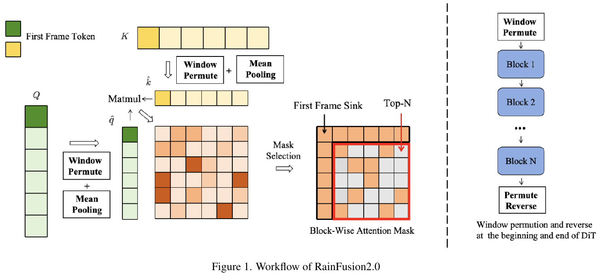
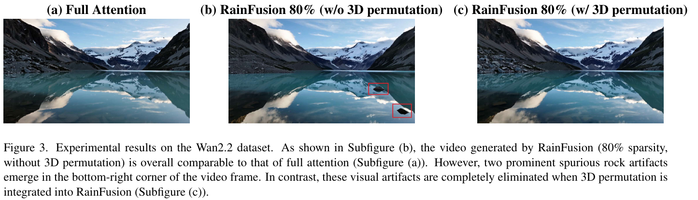
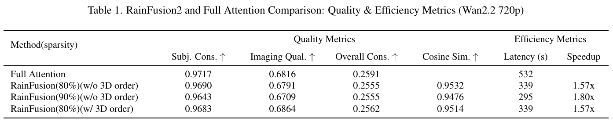

# RainFusion2.0: Temporal-Spatial Awareness and Hardware-Efficient Block-wise Sparse Attention 精读分析

> [!info] 文档关系
> - 文档类型：Paper
> - 领域入口：[README](../README.md)
> - 上位汇总：[Video generation sparse attention](../surveys/video-generation-sparse-attention.md)
> - 证据资产：[assets/papers/rainfusion-2](../assets/papers/rainfusion-2/)

> 资料状态：主证据为 arXiv:2512.24086v2 的 6 页 PDF 与官方 LaTeX 源码。论文未提供代码仓库、公开 checkpoint 或 OpenReview 链接；精确标题检索也未发现这些材料。原论文图表均为 200 DPI PDF 裁剪，包含完整 caption；没有把截图当成代码或跨硬件实现证据。

## 修订信息

- 当前修订 ID：`rev-rainfusion-2-affiliation-backfill-20260730`

- 当前文档版本：`1.0.1`
- 当前修订时间：`2026-07-30T23:30:00+08:00`
- 替代版本：`rev-20260730-initial` / `1.0.0`

| 修订 ID | 文档版本 | 时间 | 修订者 | 类型 | 替代修订 | 迁移问题/解析 | 变更摘要 | 原因 | 影响位置 | 依据 | 对结论影响 |
|---|---|---|---|---|---|---|---|---|---|---|---|
| `rev-20260730-initial` | `1.0.0` | `2026-07-30T14:51:33+08:00` | `review_rainfusion2` | `initial` | 无 | 无 | 首次独立精读、图表 QA、RainFusion v1 关系核验与系统证据审计 | `过程任务包` 初始交付要求 | 全文与全部本地证据 | arXiv:2512.24086v2、LaTeX、arXiv:2505.21036 摘要页 | 无前版可比较 |
| `rev-rainfusion-2-affiliation-backfill-20260730` | `1.0.1` | `2026-07-30T23:30:00+08:00` | `/root` | `metadata-update` | `rev-20260730-initial` / `1.0.0` | 无 | 补充作者—机构元数据与角色证据边界 | 统一回填 affiliation 交付字段 | `作者与机构` | 论文 PDF 标题页、机构编号与角色脚注 | none：不改变方法、实验与归因结论 |

## 0. 资料与配图索引

- 论文 PDF：`arXiv PDF`（SHA-256 `efc5ea9d81c8f5721a2a092304f5d580453960b2f64adaffab89210472b82222`）
- 官方 LaTeX：`source/latex/`；原始包：`source/arxiv-source.tar`
- 提取文本：`extracted_text/paper.txt`
- 来源核查：`source_checks.md`
- 代码：未发现；GitHub 精确查询快照为 `source/github-code-search.html`
- OpenReview：未发现公开论坛；直接 API 查询返回 HTTP 403，详见 `source_checks.md`
- 图表清单与逐图 QA：`Figure inventory`
- 机制图：`../assets/papers/rainfusion-2/fig1_workflow_caption.png`
- 结果表：`../assets/papers/rainfusion-2/table1_quality_efficiency_caption.png`
- 置换消融图：`../assets/papers/rainfusion-2/fig3_permutation_ablation_caption.png`
- 批量初筛：`figures/contact-sheet.png`

## 0.1 术语与符号解释

### 0.1.1 术语表

| 术语 | 本文含义 | 别名 | 不等于/易混项 | 证据来源 |
|---|---|---|---|---|
| RainFusion v1 | arXiv:2505.21036；用 ARM 在线为每个 attention head 在 spatial/temporal/textural 三类固定模板中选型的 training-free 视频稀疏注意力 | RainFusion、RainFusion1.0 | 不是 RainFusion2.0 的 block-wise Top-N 在线掩码 | RainFusion2 §2；v1 官方 arXiv 摘要 |
| RainFusion2.0 | 本文提出的 block-wise 在线稀疏注意力：窗口置换、块均值打分、Top-N 掩码、First Frame Sink 与 sparse FlashAttention | RainFusion2、表/图中有时仍写 RainFusion | 不能把 Table 1 中的 “RainFusion” 自动解释为 v1；该表的上下文指本文方法 | 标题、§1、§3、Table 1 |
| block-wise representative token | 一个 Q/K block 沿 token 轴求均值所得向量，用较小的块级矩阵近似判断哪些块对要计算 | block mean、representative token | 不是聚类中心，也不是块内 cosine-similarity 校正 | §3.2, Eq. 5–7 |
| 3D window permutation | 按 latent video 的 frame/height/width 邻域重排 token，使一个连续 block 更可能包含时空邻近 token | spatiotemporal-aware permutation、3D order | 不是 K-means 语义聚类；论文未公开窗口尺寸和精确索引公式 | §3.3；Figure 1；源码注释 “details will be released later” |
| First Frame Sink | 强制第一帧 query 访问所有 keys，同时所有 queries 访问第一帧 keys 的固定稠密行/列 | first-frame attention sink | 不是“只保留第一帧”，也不是由 block score 动态选出 | §3.4；Figure 1 |
| block mask | 块级二值矩阵，决定整块 $Q_iK_j^\top$ 和 $P_{i,j}V_j$ 做或跳过 | sparse mask、$M$ | 不是 token-level 任意稀疏；硬件收益依赖成块执行 | §3.1, Eq. 8 |
| sparsity ratio | 论文表格使用 80%/90% 表示跳过的大部分注意力块；具体是否含 First Frame Sink 保留块、如何逐层聚合没有定义 | 稀疏率 | 不等于端到端 FLOP 或时延下降比例 | §4.1、Table 1；定义缺口 |
| end-to-end speedup | 整个生成流程相对 full attention 的延迟比；Table 1 为 $532/339=1.57$ 与 $532/295=1.80$ | E2E speedup | 不是 sparse attention operator 单算子 speedup | §4.2、Table 1 |
| hardware generality | 作者声称 block-wise 规则矩阵乘/跳过适合 GPU 外的 AI 设备 | device universality | 本文实验只明确报告 NPU，不能据此证明“跨多种硬件” | §1、§4.1、结论 |

### 0.1.2 符号表

| 符号 | 含义 | 性质 | 作用域/索引 | 单位/取值 | 来源 | 易混点 |
|---|---|---|---|---|---|---|
| $N$ | token 数；视频中写作 $FHW$ | author-defined | 每次 attention 调用 | token | §3.1、§3.3 | 论文把 attention 复杂度误写成 exponential；按公式实际是 $O(N^2d)$ |
| $d$ | 每个 attention head 的特征维度 | author-defined | 每个 head | feature | §3.1 | 未报告具体值 |
| $F,H,W$ | latent 中帧数、高、宽 | author-defined | 每个视频样本 | token-grid size | §3.3 | 未给窗口大小 |
| $Q,K,V$ | query/key/value 矩阵 | author-defined | 每层、每 head、每 diffusion step | $\mathbb{R}^{N\times d}$ | §3.1 | 论文未说明多模态文本 token 是否计入 $N$ |
| $b_q,b_k$ | query/key block 的 token 数 | author-defined | 每次 attention 调用 | token/block | §3.1 | “same block size”措辞与分别写 $b_q,b_k$ 略不一致；数值未给 |
| $T_q,T_k$ | Q/K block 数 | author-defined | 每次 attention 调用 | block | §3.1 | 正文用方括号，后文又用 ceiling；应理解为 $\lceil N/b\rceil$ |
| $Q_i,K_j,V_j$ | 第 $i$ 个 query block、第 $j$ 个 key/value block | author-defined | block pair $(i,j)$ | matrix block | §3.1 | $i$ 和 $j$ 分属 query/key 轴 |
| $S_{i,j}$ | 一个 block pair 的精确 attention logits | author-defined | $(i,j)$ | $b_q\times b_k$ | Eq. 1 | 与近似块分数 $\hat S_{ij}$ 不同 |
| $m_{i,j},l_{i,j}$ | online softmax 的逐行最大值与归一化累加量 | author-defined | query block $i$，扫描至 key block $j$ | vector | Eq. 2–4 | 只用于数值稳定累积，不是 sparse score |
| $\widetilde P_{i,j}$ | 用当前行最大值缩放、尚未归一化的指数权重 | author-defined | block pair $(i,j)$ | nonnegative matrix | Eq. 2–4 | 不是最终 softmax 概率 |
| $O_{i,j},O_i$ | 扫描到 $j$ 的未归一化输出累积与归一化最终 block output | author-defined | query block $i$ | activation | Eq. 4 与后续式 | 论文的 $O_{i,j}$ 已包含跨块累积 |
| $\hat q_i,\hat k_j$ | $Q_i,K_j$ 的 token 轴均值 | author-defined | block | $\mathbb{R}^d$ | Eq. 5–6 | 仅作代理打分，不能恢复块内分布 |
| $\hat S_{ij}$ | 块均值点积代理分数 | author-defined | block pair $(i,j)$ | scalar | Eq. 7 | 未除以 $\sqrt d$；TopN 排序不受正比例缩放影响 |
| $M_{ij}$ | 是否执行 block pair 的二值掩码 | author-defined | block pair $(i,j)$ | $\{0,1\}$ | Eq. 8 | TopN 的 `dim=0` 与正文“每个 $Q_i$ 选 $K_j$”方向存在歧义 |
| $n$ | 每个 query block 保留的 key blocks 数 | author-defined | 每个 query block | block count | §3.2, Eq. 8 | 论文没有把 $n$ 与 80%/90% 稀疏率及 sink 开销精确对应 |
| $r$ | 本文分析使用的保留块比例 | analysis-derived | 单个 attention 调用 | $0<r\le1$ | §8.1 推导 | 不是论文原符号；大致为 $1-\text{sparsity}$，但需加 sink |
| $T_{\mathrm{other}},T_{\mathrm{attn}},T_{\mathrm{sparse\ attn}},T_{\mathrm{predict}},T_{\mathrm{permute}}$ | 本文分析使用的各阶段时间 | analysis-derived | 单次端到端生成 | second | §4.4.4 推导 | 论文仅给总 E2E latency，未给这些分量 |
| $B$ | 本文分析使用的每元素字节数 | analysis-derived | tensor traffic | byte/element | §8.4 推导 | 论文未报告 fp16/bf16/fp32 |
| $t$ | 本文分析使用的运行时间 | analysis-derived | operator/request | second | §8.4 推导 | Table 1 的 532/339/295 s 是 E2E，不是单 kernel |

## 0.2 原论文算法总览

> Figure 1（原论文）：先按 3D window 重排 Q/K，再以 block mean 计算较小的块级分数矩阵，Top-N 产生 block mask，并把第一帧对应的行/列强制保留；DiT 结束后逆置换。图中没有展示 sparse FlashAttention 的最终 $O$，下文用流程补齐这一边界。

一眼读法：输入是某层某个 attention head 的 $Q,K,V$；静态时空置换改变 token 的连续布局，动态 block mean 改变 mask 预测成本，Top-N 和 First Frame Sink 决定要执行的整块矩阵乘；被保留块进入 online-softmax sparse FlashAttention，得到 $O$，最后恢复原 token 顺序。该方法是 training-free 推理改造；论文未描述训练或校准阶段。Figure 1 足以解释顺序与状态变化，但“多久重算一次 mask、块描述符怎样送入 NPU kernel”没有画出，也没有文字实现细节。

## 1. 论文基本信息

### 作者与机构

- 第一作者（首位列名）：Aiyue Chen → Huawei Technologies Co., Ltd.。
- 共同第一作者（仅含论文明确标注者）：
  - Yaofu Liu → Huawei Technologies Co., Ltd.；Hong Kong University of Science and Technology
  - Junjian Huang → Huawei Technologies Co., Ltd.
  - Guang Lian → Huawei Technologies Co., Ltd.
  - Yiwu Yao → Huawei Technologies Co., Ltd.
  - Wangli Lan → Huawei Technologies Co., Ltd.
  - Jing Lin → Huawei Technologies Co., Ltd.
  - Zhixin Ma → Huawei Technologies Co., Ltd.
  - Tingting Zhou → Huawei Technologies Co., Ltd.
- 通讯作者/通讯联系人（仅含论文明确标注者）：
  - Harry Yang → Hong Kong University of Science and Technology
- 其他作者涉及的机构（去重列举，不作逐作者映射）：Huawei Technologies Co., Ltd.；Hong Kong University of Science and Technology。
- 对应依据：论文 PDF 标题页、作者机构编号与角色脚注（核验日期：2026-07-30）。
- 边界说明：论文声明标题行九位作者同等贡献；Harry Yang 仅出现在通讯脚注、未列入标题作者行，故记录为“通讯联系人”而不补入作者名单。

- 完整标题：**RainFusion2.0: Temporal-Spatial Awareness and Hardware-Efficient Block-wise Sparse Attention**
- 版本：arXiv:2512.24086v2，PDF 标注 2026-04-20；任务包的“arXiv 2025”对应首次发布年份
- 作者：Aiyue Chen、Yaofu Liu、Junjian Huang、Guang Lian、Yiwu Yao、Wangli Lan、Jing Lin、Zhixin Ma、Tingting Zhou；PDF 另以脚注列 Harry Yang 为通讯作者
- 研究领域：视频/图像 diffusion transformer 推理、training-free block-sparse attention、NPU 部署
- 核心问题：在线稀疏模式预测本身会吃掉收益，GPU 特化的 token-level/不规则实现难迁移到 NPU/ASIC
- 研究目标：在保持输出质量的同时，以低开销在线生成块稀疏 mask，并获得 E2E 加速
- 关键假设：相邻 token 在 Q/K 中相似；3D 相邻 token 应被放进同一连续 block；第一帧 attention 不能被普通 Top-N 丢弃
- 重要文本校正：Introduction 称 attention 随 token length “exponentially” 增长，但论文自己的 $QK^\top$ 公式是二次增长 $O(N^2d)$。这不改变长序列很贵的动机，却说明文字表述不严谨。

## 2. 研究动机与问题—方案闭环

### 2.1 出发点与背景痛点

作者明确指出，DiT 的 10K–80K token 让 full attention 成为主要推理成本，而部署目标已不只 GPU，也包括 NPU/ASIC（§1）。稀疏 attention 理论上能跳过低贡献 token pair，但实际可用性取决于两个额外条件：第一，找到 sparse pattern 的成本必须远低于被省下的 attention；第二，稀疏形状必须符合设备擅长的算子粒度。若先算完整 $QK^\top$ 再决定稀疏，收益必然被抵消；若采用复杂 token-level 预测或 GPU 特化 kernel，在 NPU 上预测/索引开销可能反而不可接受。

论文因此把目标从“找到最精细的稀疏图”改成“用便宜代理选择规则 block”。这项取舍是全文的主线：允许块内有一些无效 token pair，换取块均值预测和整块矩阵乘/整块跳过的硬件友好性；再用 3D permutation 降低同一块内部的异质性，用 First Frame Sink 补回一个 Top-N 容易破坏、但对视频质量重要的固定结构。

### 2.2 现有方案为何不够

| 现有方案/做法 | 可观察的失败 | 具体场景或例子 | 例子来源 | 根因/被忽略变量 | 为什么简单修补仍不够 | 证据 |
|---|---|---|---|---|---|---|
| fixed pattern（含 RainFusion v1 的三模板选择） | 为保质量往往只能采用较低稀疏率，pattern 也不能细化到每个 block pair | 同一 head 的显著区域随输入改变时，只在 spatial/temporal/textural 三个模板里选一个，会把本可跳过的块也保留 | reviewer-created，基于 §1/§2 的类别描述 | 模板集合容量固定，不能表达输入依赖的任意 block mask | 再加几个模板仍是离散模板库；覆盖更多模式会增加存储/选择并仍不能逐输入适配 | §1；§2 fixed patterns；v1 摘要 |
| 先得到精细 token/block 统计再预测 | 预测成本吞掉 sparse compute 节省 | 若先算完整 $QK^\top$ 才选重要块，mask 得到时最贵的乘法已经发生 | paper-provided failure argument | 预测量与被替代的 full attention 同阶 | 只把阈值调高不改变“先做完整工作”的根因 | §3.2 首段 |
| 对块内 token 做 cosine similarity 校正 | mask 更准但预测 overhead 大，尤其在非 GPU 设备 | 每个候选 block 还要扫描内部 token pair，NPU 需要额外不规则归约/索引 | paper-provided qualitative scenario | block 内异质，均值会抹掉局部大值；直接测异质性又贵 | 只增大 block 会让均值更失真；只减小 block 会增加 block-score 和调度数量 | §3.2 末段 |
| 默认 `[F,H,W]` flatten 后直接分连续 block | 物理相邻 token 被分散，块均值代表性下降；局部伪影可能漏过常用指标 | Figure 3 中 80% sparsity、无 3D permutation 的样例在右下出现两块假岩石，加置换后消失 | paper-provided | 1D 连续位置不等于 3D 时空邻域，同一 block 混入不相似 token | 仅提高 Top-N 会牺牲稀疏率，不能从布局上恢复块内相似性 | §3.3；Figure 3 |
| 对第一帧与其他 token 一视同仁地 Top-N | 可能删掉跨第一帧的关键连接，导致非轻微质量下降 | 普通 Top-N 若未选中第一帧 block，则后续所有帧无法稳定访问其信息 | paper-provided observation + reviewer-created operationalization | 第一帧具有结构性全局重要性，普通局部分数没有“必须保留”约束 | 仅增大 $n$ 不能保证每个 query 都保留第一帧，也会普遍增加计算 | §3.4；Figure 1 |

这里最关键的可视化是 Figure 3：Table 1 的 VBench 维度与 cosine similarity 对“假岩石”不敏感，说明布局改进的价值主要由单个定性样例支撑，而不是由稳定的量化感知评测直接隔离。

### 2.3 论文计划解决的问题与成功标准

- 核心研究问题：能否用跨设备可执行的规则块稀疏，在不训练模型的情况下以低预测开销保持视频/图像质量？
- 目标对象：3D full-attention 视频 DiT，以及一个图像编辑 DiT；实验含 Wan2.2、HunyuanVideo1.5、Qwen-Image-Edit
- 必须满足的约束：online adaptive；block-level；NPU 可执行；不依赖额外训练/校准（由方法性质重建，正文未用完整实验验证）
- 成功标准：高稀疏率下 VBench/视觉质量接近 full attention，E2E 延迟下降；作者以 Wan2.2 720p 的 1.57–1.80× 为主要定量证据
- 明确未解决/未报告：精确 3D permutation、block size、mask 更新/缓存频率、数据类型、NPU 型号和 kernel、算子级耗时、GPU 与 NPU 的同设置横向对比

### 2.4 核心方案如何解决并优化问题

| 原始问题/失败模式 | 根因或约束 | 对应方案设计 | 改变的变量/系统行为 | 作用机制 | 预期优化及指标 | 证据来源 | 判断 |
|---|---|---|---|---|---|---|---|
| full attention 二次成本 | 所有 block pair 都执行 | block-sparse FlashAttention | 执行的 $Q_iK_j^\top$、$P_{ij}V_j$ block 数 | $M_{ij}=0$ 时整块跳过 | attention FLOPs/latency、E2E latency | §3.1；Table 1 | partially-supported：E2E 有结果，无 operator 分解 |
| mask 预测太贵 | 完整 score 与目标计算同阶 | Q/K block mean + 小矩阵 $\hat S$ | 预测矩阵从 token-pair 级缩到 block-pair 级 | 每块先归约到一个 $d$ 维向量 | prediction overhead | §3.2, Eq. 5–7 | plausible：无 overhead 表/消融 |
| block mean 因块内异质而失真 | 1D block 不对应 3D 邻域 | 3D window permutation | block 内 token 组成与连续性 | 把时空邻居排在一起，提高均值代表性 | 质量/更高可用稀疏率 | §3.3；Figure 3 | partially-supported：单一定性消融 |
| Top-N 漏掉第一帧 | 第一帧是结构性 sink | First Frame Sink | mask 中第一帧行/列强制为 1 | 保证双向跨第一帧连接 | 视频质量 | §3.4；Figure 1 | plausible：无独立消融 |
| 不规则 sparse 难迁移 NPU | 设备偏好规则块 GEMM | 整块 compute-or-skip | 稀疏粒度与 kernel 调度单元 | 避免任意 token gather/scatter | NPU 利用率/兼容性 | §3.1、§4.1 | partially-supported：只报告 NPU E2E，无设备对比 |

### 2.5 完整因果链与证据闭环

作者明确的因果链是：长视频 DiT 的 full attention 成本高，已有 fixed pattern 在精度与稀疏率间受限，online/token-permutation 方法又有预测开销和 GPU 特化问题；RainFusion2.0 因而用窗口置换把相似 token 聚进连续块，用块均值低成本估计 block importance，用 Top-N 产生规则块 mask，再把第一帧连接强制加回，最后以 block-sparse FlashAttention 跳过整块矩阵乘。预期结果是 mask 更便宜、kernel 更规则、重要连接保留，从而在 NPU 上兼顾质量与 E2E 时延。

被直接测到的是完整方法在 Wan2.2 720p 上的 E2E latency，以及“有/无 3D permutation”的一个质量对照。没有被闭环验证的是：(1) block mean 相对其他 predictor 的精度/开销；(2) First Frame Sink 的必要性；(3) permutation 自身开销；(4) block sparse kernel 的 operator speedup；(5) GPU/NPU/ASIC 间的同配置迁移。因此总体判断是 **partially-supported**：最终系统结果支持“这个组合在所测 NPU 设置中可加速”，但不能把收益分别归因给所有组件，也不能从单 NPU 外推到“跨硬件已验证”。

## 3. 核心贡献、与 RainFusion v1 的 extends 关系

1. 用 block mean 代理 $Q_i,K_j$，在线生成 Top-N block mask，目标是把 predictor 与 kernel 都约束到规则 block 粒度（§3.1–3.2）。
2. 用 3D window permutation 改善 block 内时空相似性，弥补均值代理的信息损失（§3.3、Figure 3）。
3. 提出 First Frame Sink，将视频第一帧的行/列作为固定稠密连接加入动态 mask（§3.4、Figure 1）。
4. 在 NPU 上报告 Wan2.2 720p 的 1.57–1.80× E2E speedup，并给出多模型定性结果（§4、Table 1、Figure 2）。

**明确的 extends 关系。** RainFusion2.0 是 RainFusion v1 的后继扩展，而不是同一机制换名：标题采用 “2.0”，首作者 Aiyue Chen、Jing Lin、Yiwu Yao 等与 v1 重合，本文 Related Work 直接引用 v1；更重要的是，机制从 v1 的 ARM 在 spatial/temporal/textural 三类预设 mask 中逐 head 选型，扩展为输入依赖的 block-wise mean/Top-N 在线 mask，并新增 3D window permutation、First Frame Sink 和 NPU 导向的规则块执行。该“extends”判断由版本命名、作者与方法谱系共同支持；但 RainFusion2.0 正文没有一句正式的 “we extend RainFusion” 声明，也没有 v1 与 v2 的 matched table，所以不能声称论文实验直接证明每一项扩展优于 v1。

| 维度 | RainFusion v1 | RainFusion2.0 | 扩展含义与证据边界 |
|---|---|---|---|
| mask 空间 | spatial/temporal/textural 三类模板 | 每个 query block 的 Top-N key blocks + sink | 从模板选择扩到细粒度在线 block mask；§2 与 Eq. 8 |
| selector | ARM 逐 head 在线识别，v1 摘要称约 0.2% overhead | block mean 点积 | v2 未报告 predictor overhead，不能直接比较 |
| token layout | v1 摘要未提窗口置换 | 3D/2D window permutation | v2 新增；精确算法未公开 |
| 视频先验 | 多维视觉冗余模板 | First Frame Sink | v2 新增固定稠密结构；无消融 |
| 硬件证据 | v1 摘要以开源视频模型为主 | v2 明确在 NPU 测试 | 不是跨硬件 A/B；两篇设置不同 |
| 性能口径 | v1 摘要称 attention computation >2× | v2 Table 1 为 E2E 1.57–1.80× | 口径不同，不可据数值判断 v2 更慢/更快 |

## 4. 研究方法

### 4.1 从输入到输出的口语化流程

一次推理中的某个 attention 调用拿到 $Q,K,V$。先按 latent 的 3D window 顺序重排 token，让同一连续 block 尽可能装入时空邻居；对每个 Q/K block 求均值，形成 $\hat q_i,\hat k_j$；用它们的点积得到小型块分数矩阵 $\hat S$，对每个 query block 选 Top-N key blocks；再把第一帧对应 block 的行和列强制加入 mask。Sparse FlashAttention 只遍历被保留的 block pair，并用 online softmax 累积 $O_i$；最后逆置换回模型原顺序。

训练/校准边界：论文没有训练目标、校准数据或参数更新，方法被理解为 training-free inference transformation。Figure 1 右侧写 permutation/reverse 位于 DiT 开头/结尾，说明置换布局可视为静态一次性变换；但正文公式依赖每层/每步产生的 $Q,K$，因此 **block means、$\hat S$ 与动态 Top-N mask 按逻辑应在每次 attention 调用重算**。论文没有明确说明跨 diffusion steps/layers 缓存 RainFusion2 mask；§2 中“前几步计算、后续复用”是对 AdaSpa 的描述，不应误归给 RainFusion2.0。First Frame Sink 的结构和 window index map 可复用，动态 score/mask 是否复用则未说明。

### 4.2 组件级设计动机与具体问题映射

| 设计项 | 论文是否明确说明 why | 原文证据 | 针对的具体问题/失败模式 | 可能起作用的因果机制 | 替代方案/权衡 | 验证证据 | 判断 |
|---|---|---|---|---|---|---|---|
| block-sparse FlashAttention | author-stated | §3.1 | token-level sparse 对硬件不友好、full attention 贵 | 以规则 GEMM block 为最小跳过单位 | token-level 可更精确但 gather/scatter/索引更复杂；block 过大浪费计算 | Table 1 E2E | partially-supported |
| block mean 代表 token | author-stated | §3.2 Eq. 5–7 | 不能先算完整 attention score | 用 $O((T_q+T_k)d+T_qT_kd)$ predictor 替代 $O(N^2d)$ full score | max/learned pooling/cluster centroid 可能更准但成本更高 | 无独立消融或 overhead | unverified/plausible |
| Top-N per query block | author-stated；轴写法有歧义 | §3.2 Eq. 8 | 把连续代理分数变成固定预算 mask | 直接控制每个 query 的保留 block 数 | CDF threshold 可自适应难度但保留数不固定 | 只有 80/90%整体设置 | partially-supported |
| 3D window permutation | author-stated | §3.3；Figure 3 | 默认 flatten 让 3D 邻居分散、块均值失真 | 增强 block 内相似性和均值代表性 | K-means 更语义化但 overhead 高；六种轴序较便宜但局部性有限 | Figure 3 单样例；Table 1 w/wo 80%指标 | partially-supported |
| First Frame Sink | author-stated | §3.4；Figure 1 | 普通 sparse mask 可能切断第一帧关键连接 | 强制第一帧 Q 全看 K、所有 Q 都看第一帧 K | 保留少量 learned/global tokens 更省但需校准；sink 增加固定 dense stripe | 无消融 | unverified/plausible |
| 将第一帧移到序列末端、与 text tokens 分组 | author-stated | §3.4 | 多模态输入中第一帧和文本都需 full attention | 让同一连续尾部区域走 full-attention path | 独立 special-block descriptor 更灵活但 kernel/索引复杂 | 无代码/性能分解 | unverified |
| DiT 前置换、末尾逆置换 | Figure-stated，正文细节 not-stated | Figure 1 | 每层反复 permute 会增加数据搬运 | 一次 layout transform 后所有 block 操作共享布局 | 每层独立置换可能适应表征变化但昂贵 | 无实现/消融 | plausible |

### 4.3 模型/系统架构与复用边界

Figure 1 对三者交互的核心表达是：

1. **Permutation 先于 mean。** 若先按默认 layout 求均值，再置换块，均值已经混合了不相似 token，无法补救。
2. **Mean score 生成动态主体，First Frame Sink 覆盖结构例外。** Top-N 决定一般 block pair；sink 把第一帧行/列并入 mask，所以最终保留数会高于纯 $nT_q$。
3. **规则 mask 驱动 compute-or-skip。** 只有这一层把算法稀疏率转成硬件收益；论文没有给 block descriptor、CSR/bitmap、kernel API 或调度伪代码。

复用审计：

| 对象 | 跨 step/layer 是否复用 | 依据 | 结论 |
|---|---|---|---|
| 3D window index / inverse index | 很可能复用 | 只依赖 $F,H,W$；Figure 1 写 DiT beginning/end | inferred，精确实现未公开 |
| First Frame Sink mask stripe | 可复用 | 固定由第一帧位置决定 | author-stated structure |
| $\hat q,\hat k,\hat S$ | 应重算 | 依赖当前 $Q,K$ | inferred；正文未写 cache |
| Top-N dynamic mask | 应随 $\hat S$ 重算 | 在线 adaptive 的定义 | inferred；没有 update cadence |
| sparse kernel descriptor/layout | 未知 | 无代码、无 §hardware implementation | not-stated |
| AdaSpa 的跨 diffusion-step mask reuse | 不属于本文机制 | 仅在 §2 Related Work 描述 | 不可误归给 RainFusion2.0 |

### 4.4 关键公式

#### 4.4.1 标准 attention 与块级执行

$$
S=QK^\top/\sqrt d,\qquad P=\operatorname{Softmax}(S),\qquad O=PV.
$$

**这条公式在算什么？** 它把每个 query 与所有 keys 的相似度变成归一化权重，再对 values 加权。

**怎么读？** 每个 token 原本都要与 $N$ 个 token 配对，所以 score 和 value 聚合都包含约 $N^2$ 个 pair。

**输入与输出。** 输入是 $Q,K,V\in\mathbb R^{N\times d}$；输出是 $O\in\mathbb R^{N\times d}$。

**变量在这里各做什么？** $N$ 决定 token pair 数；$d$ 是 head 维度；$S$ 是 logits；$P$ 是逐行概率；$O$ 是聚合结果。

**直觉。** $N$ 翻倍时，pair 数约变为四倍，不是正文所写的指数增长。

**边界。** 未计 softmax、memory traffic、multi-head 投影与非-attention 模块；复杂度主项为 $O(N^2d)$。

**小例子。** 本文构造：$N=4$ 时有 16 个 query-key pair；若 block size 为 2，则是 $2\times2=4$ 个 block pairs，保留两个 block pairs 就能整块跳过一半 pair。

#### 4.4.2 块均值代理分数

$$
\hat q_i=\operatorname{mean}(Q_i,\mathrm{axis}=0),\qquad
\hat k_j=\operatorname{mean}(K_j,\mathrm{axis}=0),\qquad
\hat S_{ij}=\hat q_i\hat k_j^\top.
$$

**这条公式在算什么？** 用每块一个向量，估计整个 query block 与 key block 的重要性。

**怎么读？** 先把块内 token 平均掉，再只算块均值之间的点积。

**输入与输出。** 输入是 $Q_i\in\mathbb R^{b_q\times d}$ 与 $K_j\in\mathbb R^{b_k\times d}$；输出是一个 scalar $\hat S_{ij}$。

**变量在这里各做什么？** $b_q,b_k$ 控制每个均值汇总多少 token；$\hat q_i,\hat k_j$ 是代理；$\hat S_{ij}$ 是排序依据。

**直觉。** 若块内 token 方向一致，均值能代表它们；若正负/不同语义混在一起，均值会互相抵消。3D permutation 正是为了减少这种抵消。

**边界。** $\hat S_{ij}$ 不是精确 block attention mass，也未经过 softmax；论文没有报告其 mask recall/precision。

**小例子。** 本文构造：一个 block 有向量 $(1,0)$、$(1,0)$，均值仍为 $(1,0)$；若是 $(1,0)$、$(-1,0)$，均值为 0，会误判二者分别可能产生的大 logits。

#### 4.4.3 Top-N 与 First Frame Sink 合成 mask

$$
M_{ij}^{\mathrm{dyn}}=\mathbf 1\!\left[j\in\operatorname{TopN}_j(\hat S_{i,:},n)\right],
\qquad
M_{ij}=M_{ij}^{\mathrm{dyn}}\lor \mathbf 1[i\in\mathcal F]\lor \mathbf 1[j\in\mathcal F],
$$

其中第二式是依据 §3.4 对论文 Eq. 8 的明确化重写，$\mathcal F$ 表示第一帧 token 所属 block 集合。

**这条公式在算什么？** 第一项为每个 query block 选 $n$ 个动态 key blocks；后两项把第一帧 query 行和 key 列强制打开。

**怎么读？** 一般区域听 Top-N，第一帧区域拥有不可删除的 dense stripe。

**输入与输出。** 输入是 $\hat S$、预算 $n$ 与第一帧 block 集 $\mathcal F$；输出是二值 block mask $M$。

**变量在这里各做什么？** $i,j$ 索引 Q/K blocks；$M_{ij}=1$ 表示执行该 block pair。

**直觉。** 动态分数追踪输入相关重要性，sink 则编码稳定的结构先验。

**边界。** 原 Eq. 8 写 `TopN(\hat S, dim=0)`，常见张量语义会沿 query 轴选取，与正文“对每个 $Q_i$ 选 $K_j$”相冲突；本文按正文意图写作沿 $j$ 轴。sink 增加的额外 block 数未纳入论文 sparsity 定义。

**小例子。** 本文构造：4 个 Q blocks、4 个 K blocks、$n=1$ 时动态部分最多保留 4 个；若第一帧占第 1 个 block，则强制第 1 行和第 1 列后，最终至多是 10 个去重保留块，而不是 4 个。

#### 4.4.4 理想化计算量与 E2E 上限

$$
C_{\mathrm{sparse}}\approx r\cdot 2N^2d+C_{\mathrm{predict}}+C_{\mathrm{permute}},
\qquad
\mathrm{Speedup}_{\mathrm{E2E}}=
\frac{T_{\mathrm{other}}+T_{\mathrm{attn}}}
{T_{\mathrm{other}}+T_{\mathrm{sparse\ attn}}+T_{\mathrm{predict}}+T_{\mathrm{permute}}}.
$$

**这条公式在算什么？** 第一式估算保留比例 $r$ 下两次 attention GEMM 的工作量；第二式说明稀疏率不会等比例转化为 E2E speedup。

**怎么读？** 即使 80% block 被跳过，模型其他模块、预测、置换与 kernel 固定成本仍在。

**输入与输出。** 输入是 $N,d,r$ 和各阶段时间；输出是稀疏 attention 工作量与 E2E speedup。

**变量在这里各做什么？** $r$ 是含 sink 后的实际保留比例；$T_{\mathrm{other}}$ 是非-attention 时间；其余项对应 sparse kernel 和新增 overhead。

**直觉。** Table 1 的 80% sparsity 只得到 1.57×，说明 E2E 受到非 attention 与实现 overhead 的限制，这并不与 attention block 大幅减少矛盾。

**边界。** 这是本文分析推导，论文没有提供 $T$ 分解或实际 $r$；不能用它反推某个 kernel 的准确效率。

**小例子。** 论文数据：Wan2.2 720p 从 532 s 降到 339 s，绝对省 193 s（36.3%），对应 1.57×，远小于若全流程都线性缩成 20% 时的理想 5×。

## 5. 关键结论

### 5.1 主结果

Table 1 的直接事实：

- Full Attention latency 532 s；80% sparsity（无 3D order）339 s，即减少 193 s、相对下降 36.3%、speedup 1.57×。
- 90% sparsity（无 3D order）295 s，即减少 237 s、相对下降 44.5%、speedup 1.80×。
- 80% sparsity（有 3D order）仍为 339 s；表中没有显示 permutation 的额外 E2E 开销，但计时精度/复用方式未说明。
- 80% w/3D order 相比 full attention：subject consistency -0.0034（-0.35%），imaging quality +0.0048（+0.70%），overall consistency -0.0029（-1.12%）。这些是单表差值，没有误差条、样本数或显著性检验。
- Full Attention 的 cosine similarity 单元为空，因此 0.9514/0.9532/0.9476 没有表内同口径基准；它更像 sparse 输出对 full 输出的相似度，而非“越接近 full 行的 1.0”已明确列出。

HunyuanVideo1.5 的 1.16×（480p）和 1.28×（720p）只在 prose 报告，Qwen-Image-Edit 60% sparsity 也只有定性 montage；因此不能和 Table 1 等量视为审计充分的主结果。

### 5.2 技术点证据矩阵

| 论文声称的技术点 | 声称收益/效果 | 对应实验/消融 | 对照是否受控 | 指标变化 | 证据强度 | 结论 |
|---|---|---|---|---|---|---|
| block-sparse full-block skip | 加速且硬件友好 | Table 1 完整方法 vs full | 多组件捆绑 | 532→339/295 s | confounded E2E | 完整系统有效，operator 贡献未隔离 |
| block mean predictor | 低/零 overhead | 无 | 无 | 无 | none | unverified；“overhead-free”过强 |
| 3D window permutation | 改善块内相似与细节质量 | Table 1 80% w/wo；Figure 3 | sparsity/latency匹配，但只给单样例 | VBench 变化很小；伪影视觉消失 | direct component toggle + qualitative mechanism visualization | partially-supported |
| First Frame Sink | 防止质量退化 | 无独立消融 | 无 | 无 | author observation only | unverified/plausible |
| NPU/device universality | 跨硬件工作 | NPU 上完整方法 | 无 GPU/NPU matched comparison | 仅 NPU E2E | indirect | NPU 可运行被支持；跨硬件泛化未证 |
| 多模型泛化 | Wan/Hunyuan/Qwen 均保质量 | Figure 2 + prose | 无完整表/统计 | Hunyuan speedup prose；Qwen定性 | indirect/confounded | 初步支持，不足以量化外推 |

最小补实验应包括：block mean vs exact/alternative predictor 的 mask recall、质量与 predictor latency；First Frame Sink on/off；permutation on/off 的多 prompt 感知指标与 permutation time；同一模型/精度/block size 在 GPU 与 NPU 的 operator/E2E 分解；不同 layer/step 的 mask 重算与复用对比。

### 5.3 是否验证了假设

- “规则 block skip 能获得 NPU E2E 加速”：**支持但混杂**。Table 1 测到完整系统，不知道收益由稀疏 kernel、置换复用还是其他工程因素贡献。
- “3D 邻近布局让 mean 更可靠”：**部分支持**。Figure 3 证明有一个质量样例改善，却没有直接测 block 内方差或 mask recall。
- “第一帧必须成为 sink”：**未隔离验证**。只有作者观察和机制描述。
- “block mean 预测 overhead 很低/为零”：**未验证**。mean reduction 与 $\hat S$ 都不是零成本，论文没有计时。
- “跨硬件通用”：**证据不足**。只明确给 NPU 实验；“可在 NPU 工作”不等于跨 GPU/NPU/ASIC 的性能可迁移。

### 5.4 收益来源归因

| 组件/变化 | 对比基线 | 指标变化 | 影响路径 | 证据强度 |
|---|---|---|---|---|
| 完整 RainFusion2 80% | Full Attention | 532→339 s；1.57× | block skip + predictor + layout + sink 的净 E2E | matched setting but bundled |
| 再从 80% 到 90%（无 permutation） | 80% w/o | 339→295 s；额外 13.0% latency 降低 | 更少 block compute | rough controlled sparsity trend |
| 3D permutation | 80% w/o | latency 同为339 s；Figure 3 局部伪影消失 | block 内相似性/质量 | component toggle，质量证据主要定性 |
| block mean | 无 bridge baseline | 无 | predictor overhead/mask quality | unsupported |
| First Frame Sink | 无 bridge baseline | 无 | 视频质量 | unsupported |

这是基于表格的近似归因，不是论文正式方差分解。尤其不能把 1.57× 全归给 block-mean，也不能把 Figure 3 的单例提升为所有 prompt 的感知改善。

## 6. Related Work 对比

| 类别/论文 | 方法核心 | 优点 | 局限 | 与本文关系 |
|---|---|---|---|---|
| RainFusion v1 | ARM 在 spatial/temporal/textural 三模板中逐 head 选择 | predictor 极轻；training-free | 模板容量有限；v1 摘要主要为 attention operator 口径 | 直接前身；2.0 扩展为 block-wise online mask、permutation、sink 与 NPU 证据 |
| STA/SVG | 预匹配或动态选择少量固定时空 pattern | 规则、低开销 | 高稀疏率下适配性受限 | 本文用输入依赖 block mask 替代模板选择 |
| SpargeAttention | block mean + CDF threshold，并做块内 cosine similarity | 自适应、关注块内一致性 | 块内统计 overhead | RainFusion2 复用 block-mean 思路，但以 window permutation 避免 cosine 检查 |
| AdaSpa | 初始 steps 计算 pattern，后续复用 | 降低跨 diffusion-step 预测开销 | 依赖 pattern 稳定假设 | 本文没有声明同样复用；Related Work 不应当成本文机制 |
| PAROAttention | 比较 frame/height/width 的轴顺序 | permutation 规则、易实现 | 只覆盖有限排序 | RainFusion2 改为 3D window order，但细节未公开 |
| SVG2 | K-means 聚类相似 token、centroid 打分 | block 语义一致性更强 | 聚类/重排 overhead | RainFusion2 用静态时空先验降低 overhead，可能牺牲内容自适应性 |

公平性缺口：Table 1 没有 SpargeAttention/SVG2/RainFusion v1 的 NPU 对比；作者理由是这些方法 NPU 兼容性差，但没有给失败日志、移植版本或相同 kernel 基线。因此论文能证明 full-attention 对比收益，不能证明在同硬件上优于所有相关稀疏方法。

## 7. OpenReview 公开评审 × 论文内容交叉核验

- OpenReview 链接：未发现
- 访问日期：2026-07-30
- decision/meta-review：不可用
- author response/rebuttal：不可用

任务包和论文均未给 OpenReview URL；精确标题检索只发现 arXiv，直接 OpenReview API 查询在 60 秒内返回 HTTP 403。因没有可定位 forum/note ID，无法建立公开 reviewer concern 交叉核验。本文自己的证据审计不能冒充同行评审。

## 8. Infra 需求分析

### 8.1 算力与 operator/E2E 边界

Full attention 的两次主 GEMM 约为 $2N^2d$ 乘加量；block mask 保留比例 $r$ 时理想主项约为 $2rN^2d$，另加 block mean、$\hat S$、Top-N、layout transform 与 online softmax。实际 E2E speedup 受非-attention 模块限制。Table 1 只提供 request 级 532/339/295 s，没有 attention operator、predictor、permutation、Top-N 或 sparse kernel 的单项时间。

论文没有给 batch size、denoising steps、序列长度、head 数、block size、NPU 型号、并行策略或 warm-up；因此不能从表格估 FLOP/s，也不能比较 operator utilization。

### 8.2 显存与存储

Block mask 本身约需 $T_qT_k$ bits（bitmap）或与非零块数成正比的 indices；代理张量约为 $(T_q+T_k)d$ elements，远小于 full $N^2$ score。可是论文未说明：

- 是否 materialize $\hat S$、$M$；
- mask 是 bitmap、dense bool、CSR/BSR 还是 NPU 专用 descriptor；
- sparse FlashAttention 是否完全不落地 $P$；
- permutation 是否真实搬运 Q/K/V，还是只改变 view/index/layout；
- mask/descriptor 是否跨 head、layer、step 复用。

所以“显存更低”在机制上合理，但没有实测峰值内存证据。

### 8.3 Data Types / 数值格式

| 对象 | 数据类型/格式 | 使用阶段 | 硬件依赖 | 对精度/速度/显存的影响 | 证据 |
|---|---|---|---|---|---|
| Q/K/V 与 block mean | 未报告 | inference | NPU vector/reduction | 不同 fp16/bf16/fp32 会改变 mean 与 Top-N 稳定性 | 论文缺口 |
| $\hat S$ | 未报告 | mask prediction | NPU GEMM/Top-N | 低精度可能改变临界 block 排名 | 论文缺口 |
| $M$ / descriptor | 二值语义；物理格式未报告 | sparse kernel | NPU sparse dispatch | bitmap/indices 决定带宽与调度 overhead | Eq. 8；实现缺口 |
| online-softmax accumulator $m,l,O$ | 未报告 | sparse attention | NPU exp/reduction/accumulation | 累加精度影响稳定性 | §3.1 |

源码注释中有 “softmax fp16 approximation” 的待办式注释，但成稿没有方法、实验或配置；不能把它当作已实现 fp16 近似。

### 8.4 带宽、互联与高效利用

对一个 materialized tensor，数据移动可写为：

$$
\mathrm{BytesMoved}=B\cdot \mathrm{ElementsReadWritten},\qquad
\mathrm{EffectiveBandwidth}=\frac{\mathrm{BytesMoved}}{t},\qquad
\mathrm{Utilization}=\frac{\mathrm{EffectiveBandwidth}}{\mathrm{PeakBandwidth}}.
$$

**这条公式在算什么？** 把 tensor 读写量换成有效带宽，并与硬件峰值比较。

**怎么读？** 只知道“设备峰值带宽”不够，必须知道实际搬了多少字节以及用时。

**输入与输出。** 输入是每元素字节 $B$、读写元素数、运行时间 $t$ 和峰值带宽；输出是 bytes、GB/s 与利用率。

**变量在这里各做什么？** $B$ 取决于数据类型；$t$ 必须是对应 operator，不可用 E2E 时延冒充。

**直觉。** 若 permutation 真实复制 Q/K/V，它可能增加 $O(Nd)$ 顺序流量；若 index gather 很乱，则即使 bytes 不多也可能带宽利用率低。规则 block 能提高连续访问和 GEMM tile 复用，但需要实现证据。

**边界。** 论文没有 dtype、峰值带宽、operator runtime 或 bytes counters，故无法给出数值 utilization。

**小例子。** 不适合给数值：任意假定 fp16/NPU 型号都会制造论文未报告的硬件事实。

跨卡互联：论文没有 tensor/pipeline/data parallel、all-reduce/all-to-all、PCIe/NVLink/RDMA 信息。不能声称通信 overlap 或分布式收益。所述优化主要针对单 attention operator 的 HBM/片上存储与矩阵块执行。

### 8.5 CPU/GPU/NPU 异构执行

| 阶段 | CPU 角色 | GPU/NPU/加速器角色 | 数据移动 | 同步/overlap | 潜在瓶颈 | 证据 |
|---|---|---|---|---|---|---|
| permutation/index map | 未说明；静态索引可能由 host 构造 | 论文目标是在 NPU 执行 | 未说明 | 未说明 | host-device sync 或 gather | Figure 1 + inference |
| block mean/$\hat S$/Top-N | 未说明 | 应在 NPU 上执行才能满足 low-overhead | 未说明 | 未说明 | reduction、Top-N、descriptor build | §3.2；实现推断 |
| sparse FlashAttention | host 仅调度（推断） | NPU block GEMM/softmax | HBM↔片上 cache | 未说明 | 小 block 利用率、稀疏调度 | §3.1、§4.1 |
| inverse permutation | 未说明 | 可能 NPU layout transform | $O(Nd)$ activation | 未说明 | memory-bound | Figure 1 |

作者称 NPU 是 ASIC 的一种并在 NPU 完成评测，但没有 CPU 预处理、异步 copy、DMA、pinned memory、fallback path 或 mixed-device placement 的说明。当前证据只支持“某个未指明 NPU 环境能跑”，不支持异构流水线结论。

### 8.6 调度、Serving 与自定义算子

论文没有 serving scheduler、batching、CUDA graph、请求级 cache 或动态 shape 策略。Sparse operator 最可能需要：

1. 稳定的 block size 与 tile layout；
2. 每个 Q block 的 Top-N index/bitmap；
3. First Frame Sink 的额外 dense stripe；
4. online-softmax 跨不连续 K blocks 的正确归一化；
5. inverse permutation 与残差/后续层的 layout 一致性。

但这些是复现需求，不是论文已披露实现。没有代码，不能确认是自定义 NPU kernel、编译器 block-sparse primitive，还是高层图组合。

## 9. 开源代码、配置与可复现性

- 仓库：未发现
- commit：不可用
- 代码范围：不可用

| 论文机制 | 本地路径/证据 | 一致性判断 |
|---|---|---|
| block sparse/online softmax | `source/latex/.../sec/3_method.tex` | 只有数学描述，无 kernel |
| 3D window permutation | 同上 | 成稿明确写 “details will be released later” |
| First Frame Sink placement | 同上 + Figure 1 | 概念与“移到序列末端”有说明，无索引实现 |
| NPU benchmark | `sec/4_expri.tex`, Table 1 | 无设备/config/script |

最小复现闭环仍需要：模型 revision、prompt/seed、denoising steps、resolution→$F,H,W$、每层 block sizes、$n$/sparsity 换算、Top-N 轴与 tie-breaking、first-frame/text block indices、dtype/accumulator、kernel descriptor、NPU 型号与软件栈、计时边界、VBench 样本数。当前源码包包含论文图像素材，不包含算法实现。

## 10. 优点与局限

### 优点

- 设计链条紧凑：permutation 改善 mean 代理，mean 产生动态 mask，sink 修复结构例外，block skip 对应硬件执行粒度。
- Table 1 同时报告质量维度和 E2E latency，至少避免只给 attention operator 的理想加速。
- Figure 3 具体展示 aggregate metric 难捕捉的局部伪影，提醒系统评测不能只看 cosine/VBench 汇总。
- 明确面向 NPU，而不是默认 GPU 是唯一部署环境。

### 局限

1. **论文极短且实现留白大。** 3D permutation 细节明确留待后续发布，block size、Top-N 方向、update cadence、kernel、dtype、设备均缺失。
2. **核心组件消融不全。** 只有 permutation toggle；block mean 与 First Frame Sink 没有独立实验。
3. **硬件泛化过度表述。** 明确实验是 NPU，没有 GPU/NPU/ASIC matched evidence。
4. **主结果统计不足。** Table 1 没有样本数、方差、显著性；Figure 3 只有一个定性样例。
5. **baseline 不完整。** 没有 RainFusion v1、SpargeAttention、SVG2 的移植或失败证据。
6. **口径混淆风险。** v1 摘要的 >2× 是 attention computation；v2 的 1.57–1.80× 是 E2E，不能直接排名。
7. **文字/公式歧义。** “exponential”应为 quadratic；Eq. 8 的 `dim=0` 与“每个 Q 选 K”不一致。

### 可改进之处

- 发布代码、NPU kernel 与完整 config；给出 bitmap/BSR descriptor、tile 和 dtype。
- 对 block mean、permutation、sink、mask refresh/reuse 做正交消融，并报告 predictor/kernel/E2E 分解。
- 跨 GPU/NPU 至少在同模型、同 prompt、同 sparsity、同精度下比较 operator 与 E2E。
- 用多 prompt 人评/感知指标验证 Figure 3 类型的细节改善，并报告置信区间。
- 明确 RainFusion v1→2.0 的兼容/替换路径与 matched baseline。

## 11. 研究启发

- **算法与 layout 共设计。** 低成本代理的误差不一定只能靠更复杂 predictor 修复，也可先改变数据布局，让简单统计更可靠。
- **动态主体 + 固定结构例外。** Top-N 负责输入依赖稀疏，sink 负责不可丢失的先验连接；这一模式可推广到文本/条件 token、reference frame 或 memory token。
- **复用应分对象讨论。** 静态 permutation map/sink 可以复用，依赖当前 $Q,K$ 的 block score 不能在无证据时假定复用。
- **系统评测需拆口径。** algorithm sparsity、operator speedup、E2E speedup、跨硬件 portability 是四个不同结论。

## 12. 解读问题/待验证清单

1. Eq. 8 的 TopN 实际沿 key-block 轴还是 query-block 轴？
2. 80%/90% sparsity 是否在加入 First Frame Sink 前计算？每层/head 是否相同？
3. 3D window 的 $(f,h,w)$ 大小、flatten 顺序、2D 图像分支分别是什么？
4. permutation 是物理搬运还是 layout/view 变换？是否只在整个 DiT 开头/结尾执行一次？
5. $\hat q,\hat k,\hat S$ 与 $M$ 是否每 layer/head/step 重算？有没有像 AdaSpa 那样的 refresh schedule？
6. block mean 的 mask recall、预测时间与 SpargeAttention 的 cosine correction 相比如何？
7. First Frame Sink on/off 的 VBench、细节、人评和时延分别变化多少？
8. NPU 的型号、软件栈、dtype、batch、steps、计时边界是什么？
9. block descriptor 和 sparse online-softmax kernel 如何保证负载均衡与数值稳定？
10. Table 1 的 Full Attention cosine similarity 为什么为空？评测样本数和方差是多少？
11. Hunyuan 1.16/1.28× 与 Qwen 结果能否给出完整表而非 prose/montage？
12. RainFusion v1 的 ARM 与 v2 block score 在同一 NPU 上，预测 overhead、质量和 E2E 谁更优？

## 13. 一句话总结

RainFusion2.0 是 RainFusion v1 的后继扩展：它把三类固定模板选择推进到“3D 窗口置换 + block mean/Top-N 动态 mask + First Frame Sink + 规则块 sparse FlashAttention”，并在一个 NPU 设置中给出 1.57–1.80× E2E 加速；最大不确定性是代码、精确置换、mask 更新频率、kernel/dtype 与组件消融均未公开，因而“低开销”和“跨硬件通用”仍未被完整验证。
