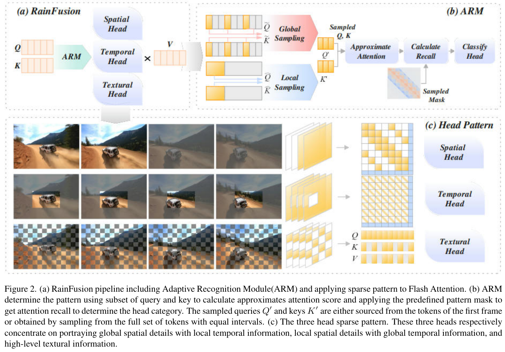
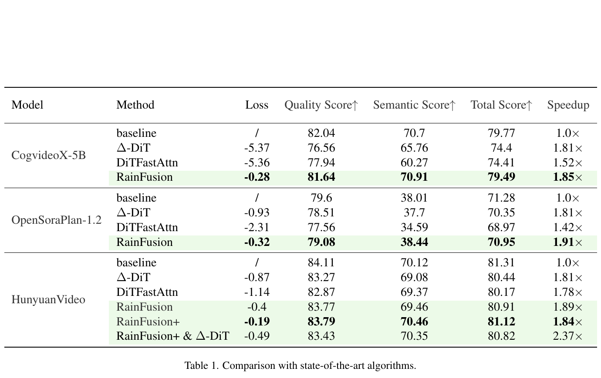

# RainFusion: Adaptive Video Generation Acceleration via Multi-Dimensional Visual Redundancy 精读分析

> [!info] 文档关系
> - 文档类型：Paper
> - 领域入口：[README](../README.md)
> - 上位汇总：[Video generation sparse attention](../surveys/video-generation-sparse-attention.md)
> - 证据资产：[assets/papers/rainfusion](../assets/papers/rainfusion/)

> 资料状态：主证据为本地 PDF `arXiv PDF`（arXiv:2505.21036v2，10 页，PDF 标题见本文标题）。`过程任务包` 中标题“RainFusion: Efficient Video Diffusion with Spatial-Temporal-Text Sparse Attention”与 PDF 不一致；以下分析只以 PDF 为事实来源。LaTeX/source 下载失败，未发现公开代码仓库，OpenReview 查询受限，因此实现细节与公开评审均不能独立核验。论文图均为 200 DPI PDF 页面紧裁剪，保留完整 caption。

## 修订信息

- 当前修订 ID：`rev-rainfusion-affiliation-backfill-20260730`

- 当前文档版本：`1.0.1`
- 当前修订时间：`2026-07-30T23:30:00+08:00`
- 替代版本：`rev-rainfusion-initial` / `1.0.0`

| 修订 ID | 文档版本 | 时间 | 修订者 | 类型 | 替代修订 | 迁移问题/解析 | 变更摘要 | 原因 | 影响位置 | 依据 | 对结论影响 |
|---|---|---|---|---|---|---|---|---|---|---|---|
| `rev-rainfusion-initial` | `1.0.0` | `2026-07-30T14:23:25+08:00` | `review_rainfusion` | `initial` | 无 | 无 | 建立 PDF 证据驱动的初始精读、两类视觉证据与来源限制 | delegated initial delivery | `本文`；`Figure inventory`；`../assets/papers/rainfusion/` | `arXiv PDF`、task packet 与验证契约 | 无 |
| `rev-rainfusion-affiliation-backfill-20260730` | `1.0.1` | `2026-07-30T23:30:00+08:00` | `/root` | `metadata-update` | `rev-rainfusion-initial` / `1.0.0` | 无 | 补充作者—机构元数据与角色证据边界 | 统一回填 affiliation 交付字段 | `作者与机构` | 论文 PDF 标题页、机构编号与角色脚注 | none：不改变方法、实验与归因结论 |

## 0. 资料与配图索引

- 论文 PDF：`arXiv PDF`，SHA-256 `623ab0adfb91c9c5870dbd74cdc4c4ca03824809f6587e4fbdf3665d51518c35`
- 可检索文本：`extracted_text/paper.txt`，由 `pdftotext -layout` 提取。
- 源码/LaTeX：不可用；对 arXiv e-print 的限时请求因网络连接失败。
- 开源代码：不可用；GitHub 精确仓库检索返回 0 项，且 packet 中 code 字段为 unknown。
- OpenReview：不可用；精确标题 API 查询返回 HTTP 403，packet 中 URL 为 unknown。
- 机制图：Figure 2，`../assets/papers/rainfusion/fig2_pipeline-arm-patterns-caption.png`。
- 结果图：Table 1，`../assets/papers/rainfusion/table1-main-results-caption.png`。
- AI 生成分析图：未生成；原论文 Figure 2 已完整展示输入、ARM 分类、三类稀疏模式与输出 attention 路径，足以作为读者可用算法总览。

## 0.1 术语与符号解释

### 0.1.1 术语表

| 术语 | 本文含义 | 别名 | 不等于/易混项 | 证据来源 |
|---|---|---|---|---|
| RainFusion | 推理时在线识别每个 attention head 的稀疏模式，再用对应 mask 执行稀疏 attention 的免训练方法 | 无 | 不是新的生成模型，也不是缓存方法 | Abstract；§3；Figure 2 |
| ARM | Adaptive Recognition Module；用下采样的 $Q,K$ 估计 masked attention recall 并分类 head | Adaptive Recognition Module | 不是学习得到的路由器；论文称无需训练/校准 | §3.3；Algorithm 1；Figure 2(b) |
| Spatial Head | 单帧空间范围较全局、时间范围较局部或集中于关键帧的 head | spatial pattern | 名称容易误导：它并非“只做空间 attention” | §3.2；Figure 2(c) |
| Temporal Head | 单帧内空间局部、跨帧沿相同位置呈周期性连接的 head | temporal pattern | 不是 STDiT 中独立的 temporal-attention layer | §3.2；Figure 3 |
| Textural Head | 大多数 query 都强烈关注少数与纹理/运动内容相关 key 的不规则 head；用棋盘式保留 $K,V$ | irregular head；textural pattern | 不是文本 token attention；packet 的“Text”应以 PDF 的 “Textural” 为准 | §2.3；§3.2；Figure 4 |
| attention recall | 在采样 attention score 上，某候选 mask 保留的 attention 信息比例 | recall | 论文 Eq. (6) 写成矩阵/张量之比，未明确最终标量化方式 | §3.3；Eq. (6) |
| RainFusion+ | 在候选 bandwidth $(0.5,0.25,0.125)$ 中按 90% recall 选最小值的变体 | dynamic bandwidth variant | 与默认固定稀疏率 RainFusion 不同 | §4.3 |
| attention speedup | attention 部分的加速比 | speedup | 不是端到端生成加速；Table 1 未给完整 latency | §4.1；Table 1 |

### 0.1.2 符号表

| 符号 | 含义 | 性质 | 作用域/索引 | 单位/取值 | 来源 | 易混点 |
|---|---|---|---|---|---|---|
| $H,W,T$ | latent video 的高、宽、帧数 | author-defined | 每次生成 | token-grid 维度 | §3.1 | $H$ 在 Algorithm 1 又被复用为 head category；本文称后者“类别输出” |
| $N$ | 展平后的 token 数，$N=HWT$ | author-defined | 每次生成 | tokens | §3.1 | 不含 batch/head 维度 |
| $d$ | 单个 attention head 的隐藏维度 | author-defined | 每个 head | channels | §3.1 | 不是模型总 hidden size |
| $Q,K,V$ | query、key、value token 矩阵 | author-defined | 每层每 head | $\mathbb{R}^{N\times d}$ | §3.1 | PDF 排版省略 batch/head 索引 |
| $M$ | attention mask | author-defined | 每个候选模式 | $N\times N$ | §3.1 | $M_{\mathrm{init}}$ 是全零 mask，即 dense 基准 |
| $S(Q,K,M)$ | 加 mask 后的 softmax attention score | author-defined | 每层每 head | 行归一化权重 | Eq. (1) | Eq. (6) 对 $S$ 做“比值”但未说明聚合 |
| $\{f'\}$ | 第 $f$ 帧 query 可连接的重要帧集合 | author-defined | per-frame | frame indices | Eq. (3) | 论文未给关键帧选择的完整数据结构 |
| $\tau$ | Textural pattern 的棋盘 stride | author-defined | 每个配置 | 正整数 | Eq. (4) | Table 3 文字称 stride 3/4 |
| $\alpha$ | ARM 接受候选模式的 recall 阈值 | author-defined | 每 head 分类 | $[0,1]$，具体值未报告 | Algorithm 1 | 与 RainFusion+ 的 90% recall 选择规则有关但是否同一阈值未明确 |
| $\omega$ | global sampling 的等间隔采样间距 | author-defined | ARM | token interval，值未报告 | §3.3 | 实现与边界处理未知 |
| $R'$ | 下采样序列上候选 mask 的 attention recall | author-defined | 每候选模式 | 比例 | Eq. (6) | 标量化方式含糊 |
| $p$ | attention 占端到端计算/时间比例 | analysis-derived | 系统估算 | $[0,1]$ | 本文 §8.1 | 论文仅称 profiling 超过 80%，未给逐模型端到端时间分解 |
| $s_a$ | attention kernel/算子的加速比 | analysis-derived | 系统估算 | 倍数 | 本文 §8.1 | Table 1 的 speedup 被论文描述为 attention speedup |

## 1. 论文基本信息

### 作者与机构

- 第一作者（首位列名）：Aiyue Chen → Huawei Technologies Co., Ltd.。
- 共同第一作者（仅含论文明确标注者）：
  - Bin Dong → Huawei Technologies Co., Ltd.
- 通讯作者/通讯联系人（仅含论文明确标注者）：论文未显式标注。
- 其他作者涉及的机构（去重列举，不作逐作者映射）：Huawei Technologies Co., Ltd.。
- 对应依据：论文 PDF 标题页、作者机构编号与角色脚注（核验日期：2026-07-30）。

- 完整标题：RainFusion: Adaptive Video Generation Acceleration via Multi-Dimensional Visual Redundancy
- 作者：Aiyue Chen、Bin Dong、Jingru Li、Jing Lin、Kun Tian、Yiwu Yao、Gongyi Wang（Huawei Technologies）
- 版本：arXiv:2505.21036v2，2025-06-09。
- 研究领域：视频扩散模型、3D full-sequence attention、训练免除的动态稀疏 attention。
- 核心问题：在不训练、不校准的条件下，能否利用不同 head 的空间、时间与纹理稀疏性减少 3D attention 计算，同时维持视频质量？
- 关键约束：对象是采用 3D full attention 的视频 DiT；默认前 10% denoising steps 保持 dense；head 类型随 prompt 与采样步变化，必须在线判断。

## 2. 研究动机与问题—方案闭环

### 2.1 出发点与背景痛点

作者明确陈述：3D full-sequence attention 的复杂度随视频 token 数平方增长，且在其 profiling 中占总计算的 80% 以上。Open-Sora-Plan 1.2 在单张 A100 上生成 4 秒 720p 视频约需 48 分钟，被用作直观痛点（Introduction）。因此，若只减少 denoising steps 或复用相邻 timestep 特征，仍没有直接消除单个 dense attention 内部的大量冗余。

论文的目标不是替换生成模型，而是在推理时把每个 head 的 dense $N\times N$ attention 改成与当前内容匹配的稀疏模式。其关键观察是：部分 head 呈空间全局/时间局部，部分呈空间局部/时间全局，还有一些不规则 head 让多数 query 聚焦少数纹理或运动相关 key。固定一种 mask 会误删另两类 head 的有效连接；ARM 因而在线选择模式。

### 2.2 现有方案为何不够

| 现有方案/做法 | 可观察的失败 | 具体场景或例子 | 例子来源 | 根因/被忽略变量 | 为什么简单修补仍不够 | 证据 |
|---|---|---|---|---|---|---|
| dense 3D attention | 高分辨率、长视频生成成本按 $N^2$ 增长 | Open-Sora-Plan 1.2 单 A100 生成 4 秒 720p 视频约 48 分钟，attention profiling 超过总计算 80% | paper-provided | 所有 token 对均计算，未利用视频冗余 | 仅减少常数开销不能改变 $N^2$ 配对规模 | Introduction |
| 采样步优化与 timestep cache | 对后训练或足够多 denoising steps 有依赖，适用性受限 | 当推理步数已较少或相邻步特征差异较大，cache 可复用信息减少 | paper-provided（论文概念场景） | 优化的是跨 timestep 冗余，而非单步 attention 内部连接 | 增大 cache 频率可能引入质量损失，仍不处理每步 $QK^\top$ | Introduction；§2.3 |
| 单一滑窗/仅空间+时间两类 mask | irregular/textural head 的关键 token 可能被规则窗口漏掉 | Table 2 中 CogVideoX-5B 仅 S+T 的平均损失为 1.05，而加入 Te 并用 local estimation 后为 0.18 | paper-provided | head 稀疏形态异质，并随 prompt/step 动态变化 | 把统一窗口放宽会保质量但在所有 head 上多花计算；不能按 head 分配结构 | §2.3；Table 2；Figure 4 |

一个可直接想象的说明例（本文构造，不是论文实验）：镜头中汽车跨帧移动。某 head 需要沿相同空间位置追踪时间连续性，另一 head 需要在相邻帧内保留整幅画面，第三个 head 让所有 query 都看到汽车这一小片运动区域。若统一采用局部滑窗，第三类 head 的远距离关键 token 会被删；若统一放宽成 dense，前两类 head 的规律冗余又无法转化为速度收益。

### 2.3 目标问题与成功标准

- 目标问题（author-stated）：在线、按 head 选择可保留高 attention recall 的稀疏模式。
- 成功标准（author-stated）：无需训练/校准；跨 CogVideoX-5B、OpenSoraPlan-1.2、HunyuanVideo 生效；attention speedup 约 2 倍；VBench 总分损失约 0.2%。
- 明确边界（inferred）：论文验证的是 3D full-attention 模型；没有 kernel 代码、端到端 latency 分解、硬件利用率或多随机种子统计。

### 2.4 核心方案如何改变关键变量

| 原始问题/失败模式 | 根因或约束 | 对应方案设计 | 改变的变量/系统行为 | 作用机制 | 预期优化及指标 | 证据来源 | 判断 |
|---|---|---|---|---|---|---|---|
| 不同 head 稀疏形态不同 | 固定 mask 与内容/step 不匹配 | ARM 在线分类 | 每 head 的 mask 类型从固定变为按 recall 选择 | 用采样 $Q',K'$ 近似 attention 后评估 temporal/spatial mask，剩余归 textural | 保质量同时减少无效连接；ARM overhead 低 | §3.3；Algorithm 1 | 部分支持：有整体开销声明，无独立 latency 表 |
| Spatial head 的非关键帧冗余 | 单帧需全局、时间上只需局部/关键帧 | striped spatial mask | 被访问的 frame/window 集合减少 | 保留关键帧中的空间覆盖，删除低价值非关键帧连接 | 稀疏 attention speedup | §3.2；Figure 2(c) | 机制可视化支持，缺独立消融 |
| Temporal head 的单帧空间冗余 | 主要依赖跨帧同位置 | periodic/local temporal mask | 单帧内 key 范围缩小、跨帧周期连接保留 | 对齐同位置跨帧轨迹，舍弃无关空间 token | 稀疏 attention speedup | §3.2；Figure 3 | 机制可视化支持，缺独立消融 |
| Textural head 不规则稀疏 | 少数关键 key 被多数 query 使用，规则 mask 难覆盖 | checkerboard $K,V$ retention | $K,V$ token 数约减半 | 保留空间交错样本，让邻近保留 token 近似被删内容 | 降计算且比两类 mask 更保 VBench | Eq. (4)-(5)；Table 2 | 直接组合消融部分支持 |
| 更高压缩会伤质量 | 稀疏率与 recall/质量有权衡 | bandwidth/stride sensitivity；RainFusion+ | 每 head 稀疏 bandwidth 可动态选择 | 以 90% recall 阈值选最小 bandwidth | 质量—速度折中 | Table 3；§4.3 | sensitivity 支持，但无方差 |

### 2.5 完整因果链与证据闭环

背景触发是 3D attention 占主要计算且随 $N^2$ 扩张；可观察痛点是高分辨率视频生成极慢；旧方法主要压缩 denoising 时间轴或使用固定 mask，无法同时适配 head 间与 step/prompt 间的结构差异。RainFusion 先用采样 attention 估计候选 mask 的 recall，再把 head 分成 spatial、temporal、textural 三类，最后把相应稀疏布局交给 Flash Attention 路径。被改变的关键变量是每个 head 实际访问的 key/value 子集和 mask 结构；预期减少 attention FLOPs/内存流量。Table 1 在三模型上报告约 1.85–1.91 倍 attention speedup，VBench total loss 为 0.28、0.32、0.40；Table 2 显示加入 textural pattern 与 local estimation 后质量优于仅两类 mask。

闭环只达到“部分支持”：跨模型主结果与组合消融支持方法整体有效，但论文未单独隔离 spatial mask、temporal mask、ARM 分类开销、稀疏 kernel/layout 开销，也没有 wall-clock 端到端 latency、方差或多 seed 结果。因此不能把每个组件的收益精确归因，也不能把 attention speedup 等同于整条视频生成 pipeline 的 speedup。

## 3. 核心贡献

1. 提出三类 head 稀疏模式，将 irregular head 明确建模为 textural pattern（§3.2、Figures 3–4）。
2. 提出 ARM，用小规模采样 attention 的 recall 在线分类 head，无需训练或离线 calibration（§3.3、Algorithm 1）。
3. 在三个开源视频生成模型上报告相近的 attention 加速与较小 VBench 损失，展示模型间迁移性（Table 1）。
4. 通过两类/三类 pattern 与 local/global estimation 的组合消融，说明 textural pattern 与 local estimation 对质量的重要性（Table 2）。

## 4. 研究方法

### 4.1 方法总览

一次推理中的某层某 head 收到 $Q,K,V$。ARM 先从完整 token 中构造两组小样本：第一帧 token 用于 local sampling，等间隔 token 用于 global sampling；它计算近似 attention score，再分别测 temporal/spatial 候选 mask 的 recall。若 temporal recall 达阈值则优先归 Temporal Head，否则若 spatial recall 达阈值则归 Spatial Head，其余归 Textural Head。随后使用该类 pattern 压缩 key/value 连接，并在 Flash Attention 中执行。训练边界：无训练、无校准；推理边界：每个 head 在线分类，且论文默认前 10% denoising steps 保持 dense。

> Figure 2（原论文，PDF 第 2 页）：完整展示 $Q,K$ 输入、ARM 分类、三类 head pattern 与稀疏 attention 路径。该图同时作为算法总览；200 DPI 原分辨率逐图检查通过，完整 caption 已保留。

### 4.2 组件级设计动机

| 设计项 | why 状态 | 原文证据 | 针对的问题 | 因果机制 | 替代方案/权衡 | 验证证据 | 判断 |
|---|---|---|---|---|---|---|---|
| 三类 head taxonomy | author-stated | §2.3、§3.2、Figures 3–4 | 两类分类漏掉 irregular heads | 为三种稀疏结构分配不同 mask | 更多类别可能更贴合但增加识别/调度复杂度 | Table 2 组合消融 | 部分支持 |
| ARM local/global sampling | author-stated | §3.3、Algorithm 1 | pattern 随 prompt/step 动态变化，dense profiling 太贵 | 用少量 token 近似 score 与 recall | 离线 calibration 更稳但不再 plug-and-play；更大样本更准但增加 overhead | local vs global 消融；0.2% 声明 | 部分支持 |
| Temporal 优先级 | inferred | Algorithm 1 | 一个 head 可能同时通过两种 recall 阈值 | 优先选择更局部的 temporal mask，理论上覆盖更多可压缩区域 | 反向优先级可能保留不同信息 | 无优先级消融 | 未验证 |
| Spatial striped mask | author-stated | §3.2、Figure 2(c) | 非关键帧冗余 | 仅让当前帧访问关键/相邻 window segments | 固定条带规则简单但对高速运动可能失配 | 机制图，无独立消融 | 机制上说得通但未隔离 |
| Temporal periodic mask | author-stated | §3.2、Figure 3 | 同位置跨帧依赖与单帧空间冗余 | 保留跨帧同位置的周期连接 | deformable/motion-aware mask 更灵活但更贵 | 机制图，无独立消融 | 机制上说得通但未隔离 |
| Textural checkerboard $K,V$ | author-stated | Eq. (4)-(5) | irregular head 的少数关键 token 无规则窗口 | 空间交错采样保留代表 token，避免 averaging 模糊信息 | top-k 更内容自适应但需索引/选择；平均池化更平滑但会混合 token | Table 2 two-head vs three-head | 部分支持 |
| 前 10% steps dense | not-stated | §4.1 仅报告设置 | 早期 denoising 可能更敏感 | 避免在早期结构形成阶段删连接 | 会损失部分速度；不同模型最优比例未知 | 无消融 | 未验证 |
| RainFusion+ 动态 bandwidth | author-stated | §4.3 | 固定稀疏率不能适配 head | 选择满足 90% recall 的最小 bandwidth | 多候选评估增加开销 | Table 1 HunyuanVideo | 部分支持 |

### 4.3 关键公式

#### F1：带 mask 的 attention

$$
S(Q,K,M)=\operatorname{softmax}\left(\frac{QK^\top}{\sqrt d}+M\right),\qquad
\operatorname{Attn}(Q,K,V,M)=S(Q,K,M)V.
$$

**这条公式在算什么？** 它计算每个 query 对允许 key 的归一化权重，并用这些权重汇总 value。

**怎么读？** 先比较 $Q$ 与 $K$ 的相似度，用 $M$ 禁止不需要的连接，再对 $V$ 做加权求和。

**输入与输出。** 输入为 $Q,K,V\in\mathbb{R}^{N\times d}$ 与 $M\in\mathbb{R}^{N\times N}$；输出为 $N\times d$ 的 head 表示。

**变量在这里各做什么？** $d$ 缩放点积防止 softmax 饱和；$M$ 决定哪些 token 对可见；$S$ 是行归一化 attention 权重。

**直觉。** mask 删除的连接越多，理论计算越少；但若删掉高权重 key，输出误差会增大。

**边界。** 论文讨论 bidirectional 3D full attention；实际稀疏 kernel 如何编码 $M$ 未给代码。

**小例子。** 本文构造：若一个 query 对 4 个 key 的权重为 $(0.6,0.2,0.1,0.1)$，mask 保留前三个，则保留 90% 权重；只保留后两个虽同样稀疏，却只保留 20%。

#### F2：Textural pattern 的棋盘子集

$$
C=\{a_{ij}\mid ((i\bmod\tau=k)\land(j\bmod\tau=k)),\ 0\le i<H,\ 1\le j<W,\ 0\le k<\tau\},
$$

$$
\operatorname{Attn}_{\mathrm{textural}}
=\operatorname{Attn}(Q,K_C,V_C,M_{\mathrm{init}}).
$$

**这条公式在算什么？** 它定义空间上按 stride $\tau$ 交错保留的 token 索引，并只让完整 $Q$ 访问被保留的 $K_C,V_C$。

**怎么读？** 每个空间位置按行列余数分组，交错选取 key/value；query 不删。

**输入与输出。** 输入是空间网格、$\tau$、完整 $Q,K,V$；输出仍为每个 query 的 attention 表示。

**变量在这里各做什么？** $i,j$ 是空间坐标；$k$ 枚举余数组；$C$ 是保留索引；$M_{\mathrm{init}}$ 表示保留子集内不再加结构 mask。

**直觉。** $\tau$ 越大，$K,V$ 越少、速度越高，但邻近保留 token 代替被删 token 的近似更粗。

**边界。** PDF 的集合定义在 $k$ 的并集与实际“棋盘减半”关系上表达不够严谨；没有代码可核对 exact layout。

**小例子。** 本文构造：在 $4\times4$ 网格上用两相交错保留约一半位置，可把每个 query 的 key 数从 16 降到约 8，但快速移动的细小物体可能落在被删相位。

#### F3：ARM 的近似 recall

$$
R'=\operatorname{Recall}(Q',K',M')
=\frac{S(Q',K',M')}{S(Q',K',M_{\mathrm{init}})}.
$$

**这条公式在算什么？** 它试图估计候选稀疏 mask 相对 dense attention 保留了多少信息。

**怎么读？** 在采样 token 上分别算 masked 与 dense attention，再比较二者。

**输入与输出。** 输入是采样 $Q',K'$ 和下采样 mask $M'$；预期输出是用于与 $\alpha$ 比较的 recall 标量。

**变量在这里各做什么？** $M'$ 是 temporal 或 spatial 候选；$M_{\mathrm{init}}$ 是 dense 参照；$R'$ 决定 head 分类。

**直觉。** 候选 mask 覆盖的高权重连接越多，recall 越接近 1，越适合该 head。

**边界。** 论文公式把两个 attention-score 张量直接相除，却未说明求和、范数或逐行归约；Algorithm 1 需要标量，这一实现细节无法从 PDF 恢复。

**小例子。** 本文构造：若候选 mask 覆盖 dense 权重总量 0.93，而阈值 $\alpha=0.9$，则候选通过；这只是对作者意图的解释，不是已确认实现。

### 4.4 实验与部署设置

- 模型：CogVideoX-5B、OpenSoraPlan-1.2、HunyuanVideo-13B。
- 默认设置：稀疏率 50%；前 10% timesteps 使用 dense；spatial/temporal bandwidth 文中排版为 $14/16$ computation reduction，具体单位不清；textural pattern 将 $K,V$ 减半。
- 评测：消融仅用 48 个 Sora prompts；主对比使用 VBench 全部 946 prompts；因成本高只用一个 random seed。
- baseline：DiTFastAttn 使用官方配置；$\Delta$-DiT 选择相近加速率。不同方法的 speedup 并不完全匹配，例如 CogVideoX 上 1.52×、1.81×、1.85×，因此质量横比并非严格同成本。

## 5. 关键结论与证据

### 5.1 主结果

> Table 1（原论文，PDF 第 6 页）：RainFusion 在 CogVideoX-5B、OpenSoraPlan-1.2、HunyuanVideo 上分别报告 1.85×、1.91×、1.89× attention speedup，VBench total score 损失 0.28、0.32、0.40。完整 caption 与单表对象已保留。

以 CogVideoX-5B 为例，RainFusion total score 79.49，相对 dense baseline 79.77 的绝对差为 $-0.28$，相对下降约 $0.28/79.77=0.35\%$（本文计算）。同表中 $\Delta$-DiT 为 74.40、DiTFastAttn 为 74.41，但它们分别是 1.81× 与 1.52×，后者成本不匹配。HunyuanVideo 的 RainFusion+ 为 1.84×、loss 0.19，和 $\Delta$-DiT 组合达到 2.37×、loss 0.49；这表明可组合性，但不证明两种加速完全相乘且在所有负载成立。

### 5.2 技术点—证据矩阵

| 技术点 | 声称收益 | 对应证据 | 对照是否受控 | 指标变化 | 证据强度 | 结论 |
|---|---|---|---|---|---|---|
| 三类 pattern 整体 | 跨模型保质量加速 | Table 1 | 对 baseline 基本匹配，但 baseline speedup 不完全一致 | 约 1.85–1.91×；loss 0.28–0.40 | replacement baseline | 整体有效有支持 |
| Textural head | 改善两类 mask 的质量 | Table 2 | S,T,L 与 S,T,Te,L 只差 Te | CogVideoX loss 1.05→0.18；OpenSoraPlan -1.29→+1.03 | direct ablation | 有直接组合消融支持 |
| local estimation | 比 global estimation 更好 | Table 2 | S,T,Te,L 与 S,T,Te | CogVideoX -0.42→-0.18；OpenSoraPlan +0.33→+1.03 | direct ablation | 有支持，但仅 48 prompts/单 seed |
| ARM online classification | 适应 prompt/step，开销约 0.2% | Abstract、§3.3 | 无 ARM-vs-fixed 或独立 latency | 仅声明 0.2% | indirect | 机制说得通，数值未独立验证 |
| Spatial mask | 保空间全局、删时间冗余 | Figures 2–3 | 无单独移除 | 未报告 | mechanism visualization | 未隔离收益 |
| Temporal mask | 保跨帧同位置、删空间冗余 | Figures 2–3 | 无单独移除 | 未报告 | mechanism visualization | 未隔离收益 |
| higher sparsity | 可换取更高速度 | Table 3 | 同模型参数 sensitivity | 1.85×/-0.21；2.5×/-0.56；3.0×/-1.36 | sensitivity | 支持质量—速度权衡 |
| sparse Flash Attention execution | 将模式转化为真实速度 | Figure 2、Table 1 | 无 kernel-only 对照 | attention speedup | confounded | layout/kernel 贡献未知 |

### 5.3 收益归因

最可靠的归因是：Textural pattern 加入两类 mask 后，组合质量明显改善；local sampling 比 global sampling 的组合更好。不能可靠分解 spatial 与 temporal mask 各自的收益，因为没有单组件消融。ARM 的 0.2% overhead、mask classification 准确率、per-pattern head 分布与 kernel-only speedup 都没有表格。因此，Table 1 的整体加速是“稀疏率 + 模式选择 + layout/kernel 执行”捆绑结果。

### 5.4 假设是否被验证

- “三类模式广泛存在”：有多个 attention map 可视化与跨模型总体结果，属于间接支持。
- “动态在线识别必要”：论文说明 prompt/step 会改变 pattern，但没有 fixed assignment 对照，未被直接验证。
- “textural pattern 保住重要细节”：Table 2 和 Figure 6 支持质量改善，但没有 token-level causal test，部分支持。
- “约 0.2% overhead”：没有独立测量表，未充分验证。

## 6. Related Work 对比

| 类别 | 方法核心 | 优点 | 局限 | 与 RainFusion 的关系 |
|---|---|---|---|---|
| Sampling optimization | 减少 denoising steps | 直接缩短完整 pipeline | 可能需后训练/调参；依赖较多 steps | RainFusion 改单步 attention，可组合 |
| Cache（$\Delta$-DiT 等） | 复用相邻 timestep 特征 | 不必改 attention pattern | 依赖跨步冗余；频繁更新时收益下降 | Table 1/组合实验显示互补 |
| DiTFastAttn | 滑窗稀疏 + residual cache | 结构规则 | 固定模式可能损失质量 | RainFusion 按 head 动态选三类 pattern |
| SVG / Sparse VideoGen | spatial/temporal 两类 head，在线 profiling | 与视频结构匹配 | 忽略 irregular/textural head | RainFusion 的主要增量是第三类 pattern 与 ARM 组合 |
| LLM dynamic sparse attention | 动态 mask/稀疏 token | 已有系统经验 | 文本序列结构不同于视频时空网格 | RainFusion 把结构先验改成视频三维模式 |

论文对 SVG 的比较主要通过“two head”近似，而不是完全复现并在 Table 1 同列，因此“优于 SVG”证据不如对 $\Delta$-DiT/DiTFastAttn 直接。

## 7. OpenReview 公开评审交叉核验

未能执行公开评审交叉核验。task packet 未提供 OpenReview URL；一次精确标题 API 查询返回 HTTP 403，随后按任务约束停止外部获取。故本文没有把任何 reviewer 观点作为证据，也无法判断 rebuttal 是否补充了公式、代码或统计缺口。

## 8. Infra 需求分析

### 8.1 计算与端到端上限

Dense 单 head attention 的主要矩阵计算近似与 $N^2d$ 成正比。若 attention 占端到端时间比例为 $p$，attention 加速为 $s_a$，则 Amdahl 上限为：

$$
s_{\mathrm{e2e}}=\frac{1}{(1-p)+p/s_a}.
$$

**这条公式在算什么？** 它把 attention 的局部加速换算成完整生成流程的理论加速。

**怎么读？** 未被优化的时间保持不变，attention 时间除以其加速比，再取总时间倒数。

**输入与输出。** 输入是 attention 时间占比 $p$ 与 attention speedup $s_a$；输出是端到端 speedup。

**变量在这里各做什么？** $p$ 决定优化覆盖面；$s_a$ 决定 attention 部分缩短多少。

**直觉。** 即使 attention 无限快，端到端加速也不会超过 $1/(1-p)$。

**边界。** 论文说 attention 计算占比超过 80%，但没有逐模型 wall-clock breakdown；计算占比不一定等于时间占比。

**小例子。** 本文构造：若 $p=0.8$、$s_a=1.85$，则 $s_{\mathrm{e2e}}\approx1/(0.2+0.8/1.85)=1.58$。这不是论文报告值。

ARM 若真为 dense attention 的约 $1/t^2$ 采样开销，随 latent frame 数增大可较小；但其采样、mask 构造、分类、head 分组与 kernel launch 都可能引入非矩阵开销，论文只给约 0.2% 的总述。

### 8.2 显存、数据类型与布局

稀疏模式理论上减少 attention score 的 materialization 或 tile 访问；Flash Attention 本身通常不显式存完整 $N^2$ score，因此真实显存收益更可能来自减少 $K,V$ tile 读与计算，而不是省掉一个本就未存的 dense score 矩阵。论文未报告峰值显存。

| 对象 | 数据类型/格式 | 阶段 | 硬件依赖 | 影响 | 证据 |
|---|---|---|---|---|---|
| $Q,K,V$ | 未报告 | inference | GPU Flash Attention | dtype 影响 tensor-core 吞吐与带宽 | PDF 无具体 dtype |
| mask/layout descriptor | spatial stripe、temporal periodic、textural checkerboard；编码格式未报告 | inference | 需稀疏/定制 Flash Attention 支持 | 决定 tile 是否真正跳过 | Figure 2；无代码 |
| ARM sampled score | 未报告 | online classification | GPU/可能 CPU orchestration 未说明 | 约 0.2% 声称 | Abstract；§3.3 |

### 8.3 带宽与有效利用率

若每个保留 key/value token 各含 $d$ 个元素、字节数为 $b$，粗略读取量为：

$$
\mathrm{Bytes}_{KV}\approx 2\,N_qN_{kv}db,
\qquad
\mathrm{EffectiveBandwidth}=\frac{\mathrm{BytesMoved}}{\mathrm{RuntimeSeconds}}.
$$

该表达只是上界式思考：真实 Flash Attention 会分块复用 $K,V$，不能把每个 query 的读取简单相乘。RainFusion 只有在 kernel 能跳过被 mask 的 tile 时，稀疏率才会转化为显著 speedup；若只是生成 dense mask 再做 dense kernel，带宽和 FLOPs 不会按比例下降。论文没有峰值带宽、effective bandwidth、utilization、tile size、fusion 或 launch 统计，因此无法判断是 memory-bound 还是 compute-bound。

### 8.4 CPU/GPU/NPU 与调度

论文只说明在 Flash Attention 上应用 sparse pattern，没有报告 ARM 在 CPU 还是 GPU、mask descriptor 是否 host 构造、是否发生同步、head 如何按 pattern 分桶、是否需要多个 kernel launch、NPU fallback 或跨卡通信。三个模型尺寸不同，但没有多 GPU 拓扑、tensor/sequence parallel 或 interconnect 分析。部署时最关键风险是动态 head 分类导致分支和不规则批处理，削弱理论稀疏收益；没有代码无法核验。

## 9. 开源代码对照

未发现可检查的官方代码仓库，task packet 也将 code 标为 unknown。一次 GitHub 精确仓库检索返回 0 项，之后停止外部获取。因此以下实现点均未验证：

- Eq. (6) 的 recall 如何从张量归约成标量；
- local/global sampling 的 exact indices、$\omega$ 与边界处理；
- Algorithm 1 temporal 优先级；
- 三类 mask 的 descriptor/layout 与 Flash Attention kernel；
- 0.2% ARM overhead 的计时边界；
- dtype、硬件、batch size、并行策略与随机种子配置；
- RainFusion+ 的 per-head bandwidth 搜索成本。

不存在可报告的代码 commit 或 checkpoint metadata。

## 10. 优点、局限与可改进处

### 优点

- 问题定位清楚：直接优化占主要计算的 3D attention，而不是只压缩 denoising steps。
- 三类 pattern 对视频时空结构有可解释对应，Figure 2 能完整说明 pipeline。
- 免训练、跨三模型的主结果具有较好工程吸引力。
- Table 2 至少隔离了 textural pattern 与 local estimation 两项质量贡献。

### 局限

1. packet 标题与 PDF 标题不一致；本分析不能确认 packet 原本是否指向同一版本/工作。
2. 无 source/code，Eq. (6)、棋盘布局与 kernel 实现存在关键歧义。
3. speedup 主要是 attention speedup，不是完整生成 latency；ARM、mask 构造、分桶和 kernel overhead 未分解。
4. 消融仅 48 prompts、单 random seed，无误差条或显著性检验。
5. 没有 spatial-only、temporal-only、fixed-vs-dynamic ARM、priority order、前 10% dense 等最小对照。
6. baseline speedup 不完全匹配，尤其 CogVideoX 的 DiTFastAttn 仅 1.52×。
7. 未报告显存、带宽利用率、GPU 型号对应的主表 wall-clock、dtype、并行拓扑。
8. OpenReview 不可用，无法借助公开讨论核验 novelty、实现或实验公平性。

### 可改进实验

- 在同一 sparse ratio 与同一 kernel 上做 spatial/temporal/textural 单独移除。
- 固定 head assignment 与每步 ARM 动态 assignment 对比，报告分类稳定性、head 分布与 ARM latency。
- 分离 algorithm-only（保留连接集合）与 kernel-only（相同集合不同实现）的贡献。
- 报告 end-to-end latency、attention latency、mask construction、peak memory、有效带宽与多 seed 方差。
- 公开 exact mask descriptor、recall reduction、CUDA/NPU kernel 与可复现实验配置。

## 11. 研究启发

- 稀疏 attention 的关键不只是“删多少”，而是把 pattern taxonomy、在线识别与可执行 layout 作为一个闭环设计。
- irregular heads 不应简单回退 dense；可以寻找视觉结构可执行的近似，如 checkerboard、top-k block 或 motion-aware tiles。
- 后续方法应把“候选集合质量”和“kernel 执行效率”分别测量，避免算法与系统收益混在一起。
- 对视频生成，pattern 可能随 denoising step、prompt、resolution 与 motion 变化，动态策略需要显式报告稳定性和调度成本。

## 12. 解读问题/待验证清单

1. Eq. (6) 的 recall 究竟是元素比、mask 内 attention mass、均值还是某种范数？
2. Spatial/Temporal mask 的 bandwidth、window segment 与 Flash Attention block descriptor 如何映射？
3. 为什么 Algorithm 1 优先 Temporal Head？优先级翻转是否影响质量/速度？
4. ARM 的 0.2% 以 attention 时间、总模型时间还是完整生成时间为分母？
5. Table 1 speedup 是纯 attention kernel、attention module，还是包含 ARM 的 module wall-clock？
6. 前 10% dense 的依据是什么？不同模型/分辨率是否需要不同 warm-up？
7. Textural checkerboard 为何比内容自适应 top-k 更适合 irregular heads？
8. 单 seed 与 48-prompt 消融能否稳定复现 0.18–1.03 分的变化？
9. 在序列并行、多 GPU 或 NPU 上，动态 head 分桶是否引入通信和同步瓶颈？
10. 是否存在与 packet 标题对应的另一版 RainFusion 材料？

## 13. 一句话总结

RainFusion 的核心价值是把视频 3D attention 的 spatial、temporal、textural 三类稀疏结构与在线 ARM 分类结合，在三模型上报告约 1.9× attention 加速和小幅 VBench 损失；最大不确定性是没有代码、端到端 latency 与完整组件消融，因而 pattern 选择、layout/kernel 与系统收益之间仍不能精确归因。
