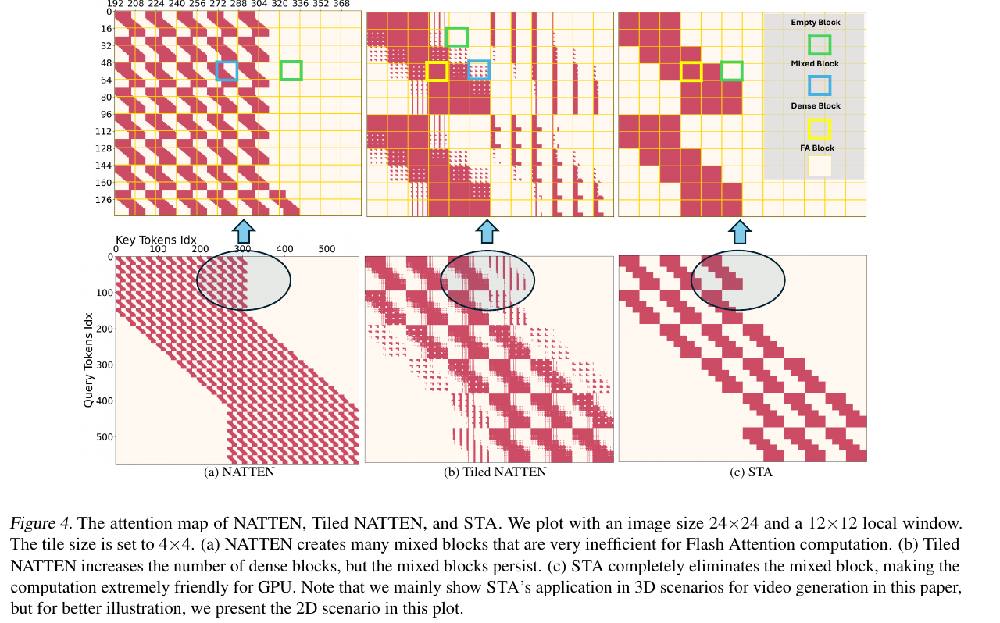
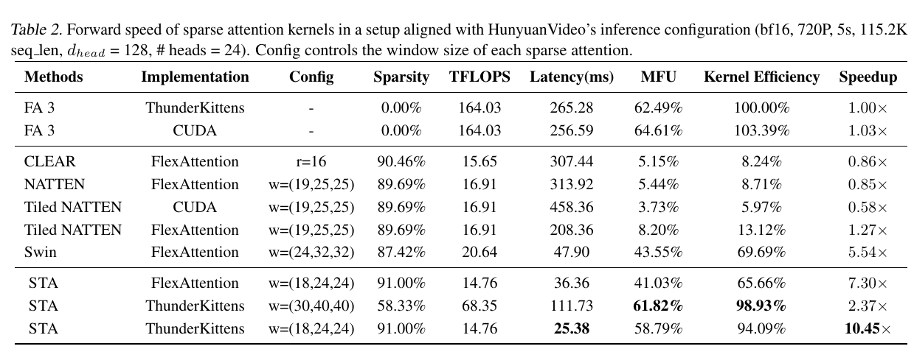
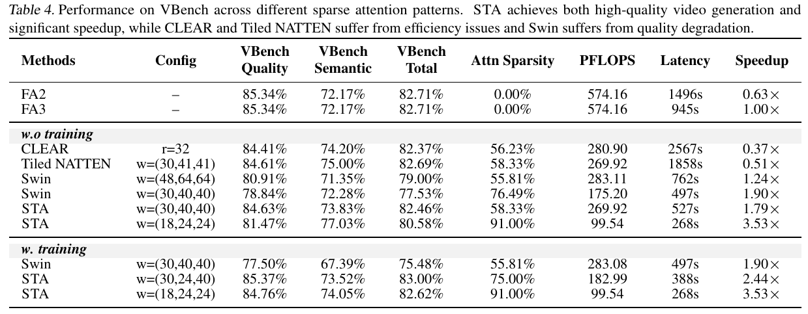

---
tags:
  - paper
  - collection/custom-attention
  - domain/ai-infra
  - status/deep-review
  - topic/video-generation
  - method/sliding-tile-attention
document_type: paper
domain: custom_attn
collection: Custom Attention
review_status: deep-review
canonical: true
---

# Fast Video Generation with Sliding Tile Attention 精读分析

> [!info] 文档关系
> - 文档类型：Paper
> - 领域入口：[README](../README.md)
> - 上位汇总：[Video generation sparse attention](../surveys/video-generation-sparse-attention.md)
> - 证据资产：[assets/papers/sliding-tile-attention](../assets/papers/sliding-tile-attention/)

> 资料状态：PDF 与完整 arXiv source 已取得；三张原论文 Figure/Table 由 PDF 180 DPI 渲染后紧裁剪并完成 contact-sheet 与逐图原分辨率 QA。官方 FastVideo 仓库浅克隆因网络中断只留下无 commit 的 `.git` 元数据，故本文不把实现细节写成已由代码确认。论文未给出 OpenReview URL，未发现可核对的公开评审入口。

STA 的关键不是“又一种稀疏 mask”，而是把滑窗单位从单 token 改为与 FlashAttention block 对齐的 3D tile：这牺牲了 token 级窗口边界的精细度，却把混合 block 变成纯 dense/empty block，使 producer 只加载被选中的 K/V，而 consumer 继续执行规则的 dense attention。必须分开看三层证据：training-free 是校准窗口后直接替换预训练全注意力；finetuned STA 用蒸馏与 flow-matching loss 适配更激进稀疏；Table 2 的 10.45× 只属于 attention kernel，而 Table 4 的 1.79×–3.53× 才是排除 VAE/text encoder 后的 DiT 端到端加速。

## 修订信息

- 当前修订 ID：`rev-sliding-tile-attention-obsidian-properties-20260731`
- 当前文档版本：`1.0.2`
- 当前修订时间：`2026-07-31T10:00:00+08:00`
- 替代版本：`rev-sliding-tile-attention-affiliation-backfill-20260730` / `1.0.1`

| 修订 ID | 文档版本 | 时间 | 修订者 | 类型 | 替代修订 | 迁移问题/解析 | 变更摘要 | 原因 | 影响位置 | 依据 | 对结论影响 |
|---|---|---|---|---|---|---|---|---|---|---|---|
| `rev-vgsa-003-initial` | `1.0.0` | `2026-07-29T14:20:00+08:00` | `review_sliding_tile_attention` | `initial` | 无 | 无 | 首次形成 PDF/source/视觉/公式/实验/infra 的证据闭环 | delegated initial delivery | `本文`、`Figure inventory`、清单与 manifests | task packet；arXiv:2502.04507 PDF/source；Figure 4；Tables 2/4 | material |
| `rev-sliding-tile-attention-affiliation-backfill-20260730` | `1.0.1` | `2026-07-30T23:30:00+08:00` | `/root` | `metadata-update` | `rev-vgsa-003-initial` / `1.0.0` | 无 | 补充作者—机构元数据与角色证据边界 | 统一回填 affiliation 交付字段 | `作者与机构` | 论文 PDF 标题页、机构编号与角色脚注 | none：不改变方法、实验与归因结论 |
| `rev-sliding-tile-attention-obsidian-properties-20260731` | `1.0.2` | `2026-07-31T10:00:00+08:00` | `/root` | `metadata-update` | `rev-sliding-tile-attention-affiliation-backfill-20260730` / `1.0.1` | 无 | 增加 Obsidian YAML Properties 与层级标签 | 全量 canonical Paper 标签补齐 | 文件头 YAML frontmatter | 已验证的 ICML 2026 标签 schema；仓库覆盖矩阵 | none：不改变论文分析与证据结论 |

## 0. 资料与配图索引

- 论文：`arXiv PDF`，SHA-256 见 manifest；ICML 2025，arXiv:2502.04507。
- arXiv source：`source/arxiv-2502.04507.tar`，解包后的 `source/contents/*.tex` 与 `source/media/` 可审计。
- 提取文本：`extracted_text/paper-layout.txt`（`pdftotext -layout`）。
- 代码：`code/FastVideo/` 的浅克隆未形成 HEAD/commit，只可证明 clone 尝试，不能支撑实现断言。
- Figure 4（机制）：`../assets/papers/sliding-tile-attention/fig4-attention-map-caption.png`。
- Table 2（kernel 系统结果）：`../assets/papers/sliding-tile-attention/table2-kernel-speed-caption.png`。
- Table 4（端到端与质量）：`../assets/papers/sliding-tile-attention/table4-vbench-e2e-caption.png`。
- AI 生成图：跳过。OpenRouter ICU 未写出文件；imagegen 落盘图为空白；确定性 SVG 栅格化出现字体错渲染，均经 QA 拒绝。算法总览使用原论文 Figure 4 加下文有序流程。

## 0.1 术语与符号解释

### 0.1.1 术语表

| 术语 | 本文含义 | 别名 | 不等于/易混项 | 证据来源 |
|---|---|---|---|---|
| Sliding Tile Attention | query/key 按 3D tile 分组；同一 query tile 的所有 query 共享 local key-tile 集合 | STA | 不是 token-wise SWA；也不是不重叠的 Swin window | Method §3.1；Figure 4 |
| mixed block | 一个 FA block 内只有部分 QK pair 通过 mask，导致仍需掩蔽/分支且计算不规则 | partial block | 不等于完全跳过的 empty block | Method §3.1；Table 1；Figure 4 |
| dense block | block 内所有 QK pair 均参与 attention，可交给规则 dense kernel | full block | “dense”只描述被选 block 内，不表示全序列 dense attention | Method §3.1 |
| 3D locality | query 对时空邻近 key 的 attention mass 更集中 | local attention pattern | 论文观测到的统计规律，不是严格理论保证 | Introduction；Figures 2–3 |
| head specialization | 不同 head 的有效局部范围不同，且跨 prompt 变化较小 | per-head locality | 不代表跨模型、跨分辨率恒定 | Introduction；Figure 3 |
| training-free STA | 用 16 个 prompts 搜索每个 timestep/layer/head 的 window；不更新预训练权重 | STA-tf | 仍需离线校准；不是零准备成本 | Method §3.2；Algorithm 1 |
| finetuned STA | 固定高稀疏 window，通过 attention/final distillation 与 data loss 适配 | STA-t | 其质量恢复不能归因于 kernel | Method §3.2；Appendix B |
| MFU | 实测 FLOP/s 相对于该硬件/实现设定下峰值的比例 | model FLOPs utilization | 与端到端 GPU utilization、带宽利用率不是同一指标 | Experiments §4.1；Table 2 |
| kernel efficiency | sparse kernel MFU / full-attention MFU | efficiency ratio | 不是 kernel speedup；分子 FLOP 数已因稀疏改变 | Experiments §4.1 |

### 0.1.2 符号表

| 符号 | 含义 | 性质 | 作用域/索引 | 单位/取值 | 来源 | 易混点 |
|---|---|---|---|---|---|---|
| $L$ | 简化立方视频每一维长度 | author-defined | 3D grid | tokens per dimension | Method §3.1 | 实验真实 latent 是 $(30,48,80)$，并非立方 |
| $T$ | tile 每一维长度（定理语境） | author-defined | 3D tile | tokens | Method §3.1 | Algorithm 1 又用 $T$ 表示 diffusion 总步数；本文按语境区分 |
| $W$ | local window 每一维长度 | author-defined | 3D window | tokens | Method §3.1 | 实验窗口一般是三元组，不必等边 |
| $B$ | FlashAttention 方形 block 边长，满足 $B=T^3$ | author-defined | Q/K sequence block | tokens | Method §3.1 | $B$ 是扁平序列 block 边长，不是 3D 边长 |
| $N_{\mathrm{dense}}$ | tiled NATTEN 的 dense block 数 | author-defined | 全注意力图 | blocks | Theorem 1 | 忽略边界效应 |
| $N_{\mathrm{mix}}$ | tiled NATTEN 的 mixed block 数 | author-defined | 全注意力图 | blocks | Theorem 1 | STA 对应量为 0 |
| $S_{\mathrm{dense}}$ | STA 的 dense block 数 | author-defined | 全注意力图 | blocks | Theorem 2 | 只在整除假设下成立 |
| $T_0$ | 前若干个保留 full attention 的 diffusion steps | author-defined | inference schedule | steps | Algorithm 1；Experiments §4.3 | 与 tile size $T$ 同字母冲突 |
| $\mathcal{P}$ | 候选 mask/window pattern 集合 | author-defined | calibration search | discrete set | Algorithm 1 | 论文未完整列出搜索集合 |
| $O,O'$ | dense 与候选 sparse attention 输出 | author-defined | timestep/layer/head | tensor | Algorithm 1 | 不是最终视频输出 |
| $f_\phi,f_\psi$ | sparse student 与 dense teacher 的网络/中间输出 | author-defined | layer $i$ 或 final | tensor | Method §3.2 | 上标 $(i)$ 才表示中间层 |
| $x_0,x_t,c,t$ | clean VAE latent、noised latent、text embedding、diffusion time | author-defined | training sample | tensors / timestep | Method §3.2 | 论文综合目标的采样记号把 $c\sim N(0,1)$ 写得可疑；按公式原样保留 |
| $\alpha,\beta,\gamma$ | data/final/attention loss 权重 | author-defined | finetuning | 1, 0.5, 0.5 | Appendix B | 只影响 finetuned 分支 |

## 1. 论文基本信息

### 作者与机构

- 第一作者（首位列名）：Peiyuan Zhang → University of California, San Diego。
- 共同第一作者（仅含论文明确标注者）：
  - Yongqi Chen → University of Michigan
  - Runlong Su → University of California, San Diego
- 通讯作者/通讯联系人（仅含论文明确标注者）：
  - Hao Zhang → University of California, San Diego
- 其他作者涉及的机构（去重列举，不作逐作者映射）：University of California, San Diego；University of Michigan；Tsinghua University；University of California, Berkeley；Mohamed bin Zayed University of Artificial Intelligence。
- 对应依据：论文 PDF 标题页、作者机构编号与角色脚注（核验日期：2026-07-30）。

- 标题：*Fast Video Generation with Sliding Tile Attention*
- 作者：Peiyuan Zhang 等；ICML 2025。
- 研究领域：视频 diffusion transformer、稀疏注意力、GPU attention kernel。
- 核心问题：如何让 3D local attention 的 FLOP 降低变成 wall-clock 加速，同时尽量保留全 3D attention 的生成质量。
- 关键实验约束：HunyuanVideo 117 frames、1280×768，latent $(30,48,80)$；kernel benchmark 为 bf16、H100、115.2K sequence、24 heads、$d_{head}=128$。

## 2. 研究动机与问题—方案闭环

### 2.1 出发点与背景痛点

作者明确指出，视频 DiT 把时空 token 扁平为长序列后做 full 3D attention，复杂度随 token 数平方增长；HunyuanVideo 的 5 秒 720p 生成涉及约 115K tokens，即使 FA3 在 H100 上仍需 945 秒（整段 DiT，Table 4）。与此同时，Figure 3 显示约占 token 空间 15.52% 的 $(12,24,24)$ local window 平均承载 70% attention mass，提示 full attention 有可利用的局部冗余。

### 2.2 现有方案为何不够

| 现有方案 | 可观察失败 | 具体场景 | 来源 | 根因 | 为什么简单修补仍不够 | 证据 |
|---|---|---|---|---|---|---|
| token-wise 3D SWA / NATTEN | FLOP 少但 kernel 反而慢 | 约 90% 稀疏时 NATTEN FlexAttention 为 313.92 ms、0.85×；full TK-FA3 为 265.28 ms | paper-provided | 同一 block 内 query 的窗口边界不同，产生 mixed blocks 与 mask 开销 | 只把 token mask 做成 tiled storage 仍保留 mixed blocks；Tiled NATTEN Flex 也只有 1.27× | Figure 4；Table 2 |
| Swin 不重叠窗口 | kernel 快，但质量明显下降 | Table 4 中 1.90× Swin 的 VBench total 77.53，低于 FA3 82.71；finetuning 后 75.48 | paper-provided | 窗口边界切断本来相邻的 token 对，单层不满足滑动 3D locality | 增大窗口会花回算力；交替 shift 也不等同于每层 local connectivity | Experiments §4.4；Table 4 |
| 直接极高稀疏 STA，不微调 | 快但低层视觉质量受损 | 91% sparse、3.53× 的 training-free VBench 80.58；同窗口微调后 82.62 | paper-provided | 预训练 dense attention 尚未适配被删上下文 | 单纯放大窗口降低稀疏与速度；需要训练改变权重响应 | Table 4；Appendix detailed VBench |

Figure 4 把第一个根因直接画出来：

> 原论文 Figure 4（PDF crop）：左/中仍有 mixed blocks；STA 把可计算区域量化为整块 dense block。它是本文的读者机制总览；训练/推理边界由 §4.1 的顺序流程补齐。

### 2.3 目标问题与成功标准

- 目标：在保留 3D locality 的前提下，使 sparse attention 只产生 dense/empty blocks，并由 H100-friendly kernel 跳过 empty QK/PV。
- kernel 成功标准：低 latency、高 MFU、相对 full TK-FA3 的 speedup 随稀疏度上升。
- 模型成功标准：DiT wall-clock latency 下降，同时 human evaluation / VBench / SSIM / PSNR / CD-FVD 不出现不可接受退化。
- 不解决：VAE/text encoder latency、跨硬件可移植性能、任意 shape 无 padding 的整除问题、以及公开代码复现。

### 2.4 方案如何改变关键变量

| 原始问题 | 对应设计 | 改变的变量/行为 | 因果机制 | 预期指标 | 证据 | 判断 |
|---|---|---|---|---|---|---|
| mixed block | query/key tile + tile-wise window | 每个 query block 的 K/V 集合从逐 token 不同变为 block 内共享 | 删除 intra-block mask，只保留 dense/empty | kernel latency/MFU | Figure 4；Table 1/2 | supported |
| mask/index 开销 | producer/consumer warpgroups | producer 只加载被选 K/V，consumer 不感知稀疏 | mask 决策与 HBM→SRAM copy/compute overlap | kernel efficiency | Method §3.1；Table 2 | partially-supported：无独立 kernel ablation |
| head locality 不同 | per-head mask search | 每个 timestep/layer/head 使用独立 pattern | 以 $MSE(O,O')$ 选择接近 dense 输出的窗口 | quality at fixed sparsity | Algorithm 1；Figure 3；Table 3 | partially-supported：未消融 uniform window |
| 激进稀疏质量下降 | finetuning losses | student 权重适配局部上下文 | 中间层、final 与数据目标共同约束 | VBench recovery | Table 4 | supported as bundled training recipe |

### 2.5 完整因果链与证据闭环

长视频序列导致 full attention 成为瓶颈；已有 SWA 虽省 FLOP，却因 mixed blocks 无法让 GPU 规则执行。STA 把局部窗口的移动粒度改为 tile，并重排 token 使 tile 内序号连续，于是被保留的 QK/PV 都落在完整 FA blocks；producer 只搬运相应 K/V，consumer 做 dense compute。Table 2 直接支持“规则 block → kernel 更快”，Table 4 支持“kernel 改善能传到 DiT wall-clock”，且 Figure/Table 证据明确表明稀疏更激进会损失 training-free 质量、finetuning 可恢复大部分质量。

边界是：producer/consumer 优化未被独立消融；训练 recipe 的三个 loss 也未逐项消融；Table 4 不含 VAE/text encoder；公开代码未成功取得 commit。因此总体判断是 **partially supported**，而非对所有组件完成因果隔离。

## 3. 核心贡献

1. 把视频 DiT 的 3D locality 与 head specialization 量化为可校准的稀疏窗口依据（Figures 2–3）。
2. 提出 tile-wise sliding，使 attention map 只含 dense/empty blocks（Figure 4、Theorems 1–2）。
3. 设计 producer/consumer H100 kernel，将 K/V 选择与异步搬运重叠（Method §3.1）。
4. 提供 training-free 与 finetuned 两条应用路径，并同时报告 kernel 和 DiT 端到端证据（Tables 2–4）。

## 4. 研究方法

### 4.1 方法总览与执行边界

一个视频 latent 先按 $(T_t,T_h,T_w)$ 划 tile，并把同 tile token 变成连续 sequence indices。每个 query tile 选择 local key tiles；producer warpgroup 计算 inter-block 选择并只把这些 K/V 从 HBM 异步搬到 SRAM，consumer warpgroup 对 SRAM 中的 blocks 执行 dense QK、softmax、PV。输出仍进入原 DiT 后续层。

- **Training-free**：在 16 prompts 上对每个 timestep/layer/head 搜索 pattern，最小化 sparse 与 dense attention 输出 MSE；最早 $T_0$ steps 保留 full attention；推理时不更新权重。
- **Finetuned**：固定更高稀疏 window，用 dense teacher 的中间/final 输出加 flow-matching data loss 训练；论文为 8×H100、8 小时、1600 steps。

因此 Figure 4 解释“算什么 block”，本节补齐“何时搜索/训练、何时推理、K/V 如何进入 kernel、输出到哪里”。

### 4.2 组件级设计动机矩阵

| 设计项 | why 状态/来源 | 具体问题 | 因果机制 | 替代/权衡 | 验证 | 判断 |
|---|---|---|---|---|---|---|
| tile-wise common window | author-stated，Method §3.1 | token SWA mixed blocks | block 内 query 共享 key-tile 集 | token-wise 更精确但不规则；Swin 规则但切断邻接 | Figure 4、Table 1/2 replacement baselines | supported |
| $B=T^3$ 与连续重排 | author-stated，Method §3.1、Appendix A | 3D tile 无法直接映射 1D FA block | tile 内 token 连续形成 $B\times B$ dense block | padding/shape 限制 | theory + Figure 8，无独立性能消融 | partially supported |
| producer/consumer split | author-stated，Method §3.1 | mask 决策和 HBM latency | 异步 load 与 dense compute overlap | FlexAttention 更通用但较慢 | STA Flex 36.36 ms vs TK 25.38 ms，多个变化同时发生 | partially supported |
| per-head mask search | author-stated，Method §3.2 | head locality 差异 | MSE 选择最接近 dense output 的 pattern | uniform window 简单；搜索成本和泛化风险更低可控性差 | cross-prompt std + training-free results；无 uniform ablation | partially supported |
| early full-attention steps | author-stated，Method §3.2 | early diffusion 对全局上下文更敏感 | 延后稀疏避免早期误差累积 | 更大 $T_0$ 质量好但更慢 | Table 3 报告设定，无 $T_0$ sensitivity | plausible |
| three-loss finetuning | author-stated，Method §3.2 | 激进稀疏损失低层/最终质量 | layer/final teacher alignment + data objective | 只用单 loss 更便宜但未比较 | Table 4 只验证 bundled recipe | partially supported |

### 4.3 关键公式

#### F1：STA dense block 数

$$
S_{\mathrm{dense}}=\left(\frac{W}{T}\right)^3\left(\frac{L}{T}\right)^3
$$

**这条公式在算什么？** 在忽略边界且各维可整除时，整个 STA attention map 中会实际计算多少个 dense FA blocks。

**怎么读？** 每个 query tile 连接 $(W/T)^3$ 个 key tiles，一共有 $(L/T)^3$ 个 query tiles，两者相乘。

**输入与输出。** 输入是 video size $L$、window size $W$、tile size $T$；输出是 block 数 $S_{\mathrm{dense}}$。

**变量在这里各做什么？** $W/T$ 是窗口跨过的 tile 数；$L/T$ 是视频每维 tile 数；三次方来自 3D。

**直觉。** 减小 $W$ 会立方级减少计算；增大 $T$ 也减少 block 数，但会粗化窗口边界并受 FA block size 约束。

**边界。** 假设立方 shape、$L,W$ 均为 $T$ 整数倍、忽略边界；真实 $(30,48,80)$ 需逐维推广。

**小例子。** 论文 Table 1 的 $L=48,T=4,W=12$：每个 query tile 连接 $3^3=27$ 个 key tiles，共 $12^3$ 个 query tiles；这是说明 block 结构，不等同实测 latency。

#### F2：attention distillation loss

$$
\mathcal{L}_{attn}=\frac{1}{N}\sum_{i=1}^{N}\left\|f_\phi^{(i)}(x_t,t,c)-f_\psi^{(i)}(x_t,t,c)\right\|_2^2
$$

**这条公式在算什么？** 衡量 sparse student 与 dense teacher 在各 Transformer 层的 attention 输出差异。

**怎么读？** 对每层输出做平方误差，再在 $N$ 层上取平均。

**输入与输出。** 输入为 noised latent $x_t$、time $t$、text $c$ 以及两模型中间输出；输出为标量 loss。

**变量在这里各做什么？** $\phi$ 是 student 参数，$\psi$ 是 frozen dense teacher；$i$ 是层索引，$N$ 是层数。

**直觉。** 若激进窗口删去重要 context，该层输出偏离 teacher，loss 推动剩余局部路径补偿。

**边界。** 它只约束中间输出相似，不单独保证视频感知质量；论文没有逐 loss ablation。

**小例子。** 本文构造的说明例：若两层 squared error 分别为 0.04 与 0.02，则 $\mathcal L_{attn}=0.03$；这不是论文实验。

#### F3：综合 finetuning objective

$$
\min_\phi \mathbb{E}\left[\alpha\mathcal{L}_{data}+\beta\mathcal{L}_{final}+\gamma\mathcal{L}_{attn}\right]
$$

**这条公式在算什么？** 联合优化数据目标、最终输出 teacher 对齐和中间 attention 对齐。

**怎么读？** 以 $\alpha,\beta,\gamma$ 加权三种误差，更新 sparse student 参数 $\phi$。

**输入与输出。** 输入是训练样本/条件/时间及三项 loss；输出是待最小化的期望标量。

**变量在这里各做什么？** $\alpha=1,\beta=0.5,\gamma=0.5$；$\mathcal L_{data}$ 保持 flow-matching 任务，另两项保持 teacher 行为。

**直觉。** data loss 防止只模仿 teacher tensor 而偏离生成任务；distillation losses 限制稀疏替换产生的分布漂移。

**边界。** 三项同时变化，Table 4 只能证明 recipe 整体有效，不能说明每项独立贡献。

**小例子。** 本文构造的说明例：三项为 1.0、0.4、0.2 时，加权目标为 $1+0.2+0.1=1.3$；不是论文实验。

## 5. 关键结论与证据强度

### 5.1 Attention-kernel 证据

在 bf16 H100、115.2K sequence 下，91% sparse STA：

- FlexAttention：36.36 ms、MFU 41.03%、7.30×；
- ThunderKittens：25.38 ms、MFU 58.79%、10.45×；
- full TK-FA3：265.28 ms、MFU 62.49%。

这直接证明规则 STA blocks 能把约 91% 的理论稀疏转成 kernel wall-clock 加速；但 TK 相对 Flex 的额外 1.43×（36.36/25.38）同时包含异步 loading、mask 管理与实现差异，不是单一 producer/consumer ablation。MFU 58.79% 是稀疏 FLOP 口径下的 kernel 指标，不是端到端 utilization ceiling 的普适结论。

### 5.2 End-to-end 与 training-free / finetuned 分界

Table 4 排除了 VAE/text encoder：

- FA3：945 s，VBench total 82.71。
- training-free STA $(30,40,40)$：527 s，1.79×，82.46；这是“低损替换”的最清楚证据。
- training-free STA $(18,24,24)$：268 s，3.53×，80.58；速度高但质量下降 2.13 points。
- 同一 91% sparse window 经 finetuning：仍 268 s、3.53×，VBench 82.62；质量相对 training-free 恢复 2.04 points，距 FA3 仅 -0.09。
- finetuned $(30,24,40)$：388 s、2.44×、83.00，显示训练可改变质量—效率折中。

因此论文摘要里的 “up to 3.53× with no or minimum quality loss” 必须标注分支：3.53× 的“接近 baseline 质量”需要 finetuning；training-free 低损代表点更接近 1.79×/1.89×。

### 5.3 技术 claim evidence matrix

| 技术点 | 声称收益 | 对应证据 | 对照 | 强度 | 结论 |
|---|---|---|---|---|---|
| 3D locality | local window 保留主要 attention mass | Figures 2–3，15.52% space / 70% mass | observational | indirect | 支持 HunyuanVideo 上的动机，非跨模型定律 |
| tile-wise window | 消灭 mixed blocks | Figure 4、Table 1、Theorems 1–2 | mechanism + theory | direct mechanism | supported |
| STA vs tiled NATTEN | 更高 MFU/更低 latency | Table 2 | replacement baseline | direct | supported |
| producer/consumer TK kernel | 优于 STA Flex | Table 2 | 多实现差异 | confounded | partially supported |
| per-head search | training-free 保质 | Figure 3、Tables 3/4 | 无 uniform-window ablation | indirect | partially supported |
| finetuning recipe | 激进稀疏恢复质量 | Table 4 same-window 80.58→82.62 | matched training/no-training | direct bundled | recipe supported；loss 归因未隔离 |
| end-to-end acceleration | sparse kernel 加速 DiT | Table 4 | FA3 baseline | direct wall-clock | supported within DiT-only scope |

### 5.4 收益归因

| 变化 | 指标变化 | 影响路径 | 证据判断 |
|---|---|---|---|
| token/mixed → tile/dense-empty | Tiled NATTEN Flex 208.36 ms → STA Flex 36.36 ms（约 5.73×） | block regularity | replacement baseline，窗口/稀疏率也有小差异，近似归因 |
| STA Flex → STA TK | 36.36 → 25.38 ms（约 1.43×） | runtime/kernel | 多项 kernel 优化捆绑，不能归因单模块 |
| FA3 → training-free STA $(30,40,40)$ | 945 → 527 s（1.79×），VBench -0.25 | algorithm + kernel | matched end-to-end |
| 同 91% window finetuning | latency 不变 268 s；VBench +2.04 | model adaptation | matched same-window |

## 6. Related Work 对比

| 方法 | 机制 | 优点 | 局限 | 与 STA |
|---|---|---|---|---|
| NATTEN / CLEAR | token-centered local window | 局部表达自然 | higher-order mask 不规则 | STA 粗化为 tile-centered window换硬件规则性 |
| Tiled NATTEN | 以 block 存储/计算 NATTEN | 比 vanilla 更可实现 | mixed blocks 仍存在 | Figure 4 的直接机制 baseline |
| Swin | 不重叠 window + shift | dense blocks、kernel 快 | 单层切断跨窗邻接 | STA 每个 tile 仍有滑动 local key set |
| $\Delta$-DiT | cache feature offsets | 与 attention sparsity 正交 | 论文为重实现 baseline；少步时质量差 | STA 可理论上与 caching/step reduction 组合 |

## 7. OpenReview 公开评审交叉核验

任务包的 `openreview_url` 为 unknown；arXiv metadata/source 与论文正文未提供 OpenReview forum。2026-07-29 未执行无目标 forum 的网络猜测，因此本分支为 not applicable，而非“已核验无 criticism”。这不影响论文内机制/实验读取，但缺少同行评审 concern/rebuttal 的额外交叉证据。

## 8. Infra 需求分析

### 8.1 算力与 shape

full attention 的 QK/PV 主项随 $N^2d$ 增长；STA 的近似计算比例由保留 dense blocks 决定。论文 91% sparsity 把 Table 2 TFLOPS 从 164.03 降到 14.76（约 11.11×），kernel latency从 265.28 降到 25.38 ms（10.45×）。真实 shape $(30,48,80)$ 与 window 三元组要求逐维 tile 整除；论文简化定理的立方 $L,W,T$ 不能直接照搬。

### 8.2 显存、HBM 与带宽

每个被跳过 key tile 同时跳过 QK 与随后对应的 PV 计算，并避免把该 K/V block 搬入 SRAM。若一个 K/V block 包含 $B$ tokens、head dim 为 $d$、元素字节为 $b$，单次 K+V 载入量可写为：

$$
\mathrm{Bytes}_{KV}=2Bdb
$$

对 bf16，$b=2$。论文没有报告 bytes moved、H100 peak bandwidth 或 profiler counters，故不能诚实计算 effective bandwidth/utilization。producer/consumer overlap 表明设计意图是隐藏 HBM latency，但 Table 2 只能给 latency/MFU，不能判定 kernel 是纯 memory-bound 还是 compute-bound。

### 8.3 数据类型与异构

| 对象 | 格式 | 阶段 | 依赖 | 证据边界 |
|---|---|---|---|---|
| Q/K/V/attention kernel | bf16 | inference benchmark | H100、TK/FA3 | Table 2 明确 |
| K/V blocks | 稠密 tile blocks + sparse block index | kernel runtime | HBM/SRAM、async producer | Method 明确，代码未核验 |
| finetuning model | 论文未完整列出 accumulation dtype | training | 8 H100、FSDP、context parallel | Appendix B |

CPU/NPU 路径未报告。CPU 可能负责编排/输入，但没有传输量或 overlap 证据；不能外推到 NPU。训练使用 FSDP + context parallel；推理用 sequence parallel，但 interconnect、all-reduce/all-to-all volume 未给出。

### 8.4 端到端上限

Table 4 中 91% sparse 的 PFLOPS 减少 5.76×，但 DiT latency 只降 3.53×；作者明确推测 LayerNorm、modulation 等 memory-bound ops 阻止线性转化。再加上 VAE/text encoder 被排除，用户可见整条生成 pipeline 的速度提升会低于或等于这里的 DiT-only 数字。

## 9. 开源代码与复现核验

- 目标仓库：`https://github.com/hao-ai-lab/FastVideo`。
- 本地：`code/FastVideo/`。
- clone 状态：初始 shallow clone 被网络中断；`git rev-parse HEAD` 返回 “unknown revision”，目录只有 `.git/HEAD`、config、description、`shallow.lock`；没有工作树文件或 commit hash。
- 结论：论文 source 中关于 FlexAttention、ThunderKittens、Split-Q、FSDP/context/sequence parallel 的描述可作为 paper claim，但不能作为代码确认。任何具体 API、kernel symbol、config flag、checkpoint metadata 均为 unverified。

最小复现需要：可固定 commit 的 FastVideo checkout、HunyuanVideo 权重、16-prompt calibration 集、window pattern list、H100 TK/FA3 toolchain、Table 2 shape/dtype，以及 Table 4 的完整 torch.compile/parallelism 配置。论文未给公开 commit，降低 exact reproducibility。

## 10. 优点、局限与待验证问题

### 优点

- 把算法表达能力与 GPU block regularity 放在同一设计变量上，Figure 4 非常可检验。
- 同时报告 kernel 与 DiT wall-clock，避免只报 FLOPs。
- 同一窗口的 training-free / finetuned 对照清楚显示训练恢复质量但不改变 runtime。

### 局限

1. kernel 证据集中在 bf16 H100；无 A100/Blackwell/NPU/不同 head dim 的可移植性。
2. $L,W$ 整除 tile 的 shape 约束、边界/padding 成本没有系统 sensitivity。
3. per-head search、early-full steps、producer/consumer、三项 loss 缺独立消融。
4. Table 4 排除 VAE/text encoder；摘要加速不能直接当整条 pipeline latency。
5. 公开代码 clone 未获得 commit，API 与复现配置不可核验。
6. 91% sparsity 的 3.53× training-free 质量明显低于 baseline；“minimal loss”主要依赖 finetuning。

### 待验证

1. 在相同 block sparsity/window volume 下，uniform per-head window 相比 mask search 差多少？
2. $T_0$ 的质量—速度 sensitivity 是否跨 scheduler 稳定？
3. TK kernel 的收益中，异步 loading、index calculation、layout reorder 各占多少？
4. 非整除 shape 的 padding 是否吞掉短视频/较小分辨率收益？
5. 对后续 VSA/FPSAttention，应分别引用 STA 的 block/kernal baseline 与 model-level quality evidence，不能把 10.45× 当端到端 baseline。

## 11. 一句话总结

STA 通过把 token-wise 3D 滑窗量化成与 FlashAttention 对齐的 tile-wise dense blocks，首次在论文证据中同时保住局部表达与高 H100 kernel 效率；但其最强 3.53× 端到端质量结果依赖微调，kernel 10.45×、training-free 1.79×–3.53× 和 finetuned 2.44×–3.53× 必须严格分开引用。
