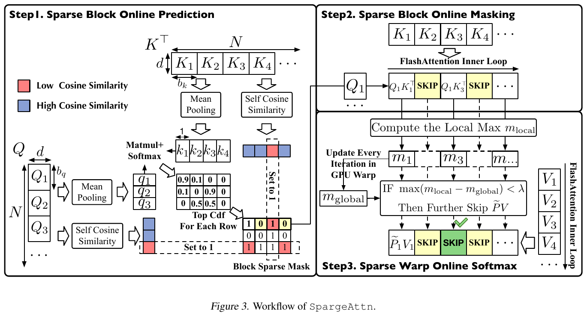
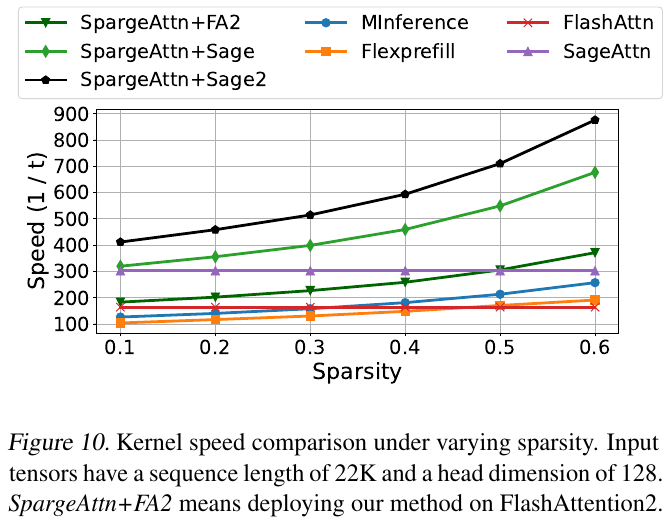

# SpargeAttention: Accurate and Training-free Sparse Attention Accelerating Any Model Inference 精读分析

> [!info] 文档关系
> - 文档类型：Paper
> - 领域入口：[README](../README.md)
> - 上位汇总：[Video generation sparse attention](../surveys/video-generation-sparse-attention.md)
> - 证据资产：[assets/papers/spargeattn](../assets/papers/spargeattn/)

> 资料状态：本分析核对 ICML 2025 camera-ready PDF、对应 LaTeX 源码、PDF 提取文本，以及 PDF 第 4、9 页的 1700×2200 渲染。论文在摘要和首页声明官方代码仓库，但 task packet 的代码与 OpenReview 字段均为 `unknown`，且本次明确禁止联网与克隆，因此代码、commit、公开评审和 rebuttal 未核验。本文中的两张图片均为 PDF 截图裁剪，不是 AI 生成图。

## 修订信息

- 当前文档版本：`1.0.0`
- 当前修订 ID：`rev-spargeattn-remediation-20260729`
- 当前修订时间：`2026-07-29T17:52:13+08:00`
- 替代版本：无；第一次 dispatch 未形成可冻结的 `本文`/manifest，本独立补救目录因此以 `initial` 建立首个可追踪交付。

| 修订 ID | 文档版本 | 时间 | 修订者 | 类型 | 替代修订 | 迁移问题/解析 | 变更摘要 | 原因 | 影响位置 | 依据 | 对结论影响 |
|---|---|---|---|---|---|---|---|---|---|---|---|
| `rev-spargeattn-remediation-20260729` | `1.0.0` | `2026-07-29T17:52:13+08:00` | `review_spargeattn_remediation` | `initial` | 无 | 无；先前尝试没有 frozen manifest，不能作为 tracked predecessor | 独立重建完整精读、两类视觉、证据矩阵、局限和交付清单 | `vgsa-011-spargeattn-remediation` 要求补救第一次未冻结的交付 | `本文`、`Figure inventory`、`../assets/papers/spargeattn/*`、清单与 manifests | 本地 PDF/LaTeX、提取文本、两页渲染与逐图 QA | `material` |

## 0. 资料与配图索引

- 论文 PDF：`arXiv PDF`，18 页，SHA-256 `ab4a3cbebe3941d8bf4b28951c27d78e8db31de8be01e6290f47602237828874`。
- LaTeX 源码：`source/main.tex`、`source/src/1-Introduction.tex`、`source/src/2-Related_work.tex`、`source/src/4-Method.tex`、`source/src/5-Experiment.tex`、`source/src/Appendix.tex`。
- 提取文本：`extracted_text/paper.txt`。
- 开源代码：论文声明 `https://github.com/thu-ml/SpargeAttn`；本次没有本地 snapshot/commit，不能把论文算法伪装成代码行为。
- OpenReview：task packet 未提供 URL；禁止联网，公开 review/decision/rebuttal 状态不可核验。
- Figure 3（机制）：`../assets/papers/spargeattn/fig3-workflow-caption.png`，PDF 第 4 页，完整 caption，窄边界。
- Figure 10（系统结果）：`../assets/papers/spargeattn/fig10-kernel-speed-caption.png`，PDF 第 9 页，完整 caption，窄边界。
- 批量 QA：`figures/contact-sheet.png`；两张图也均以原分辨率逐图检查。
- AI 生成图：未生成；用户明确禁止 image generation。论文 Figure 3 已满足输入、三阶段、跳过行为与输出的读者可用总览要求。

## 0.1 术语与符号解释

### 0.1.1 术语表

| 术语 | 本文含义 | 别名 | 不等于/易混项 | 证据来源 |
|---|---|---|---|---|
| SpargeAttn | 推理时在线生成块级 mask，并在 FlashAttention/SageAttention 内核循环中跳过 QK 与 PV 乘法的无训练稀疏注意力 | SpargeAttention | 不是模型权重剪枝，也不是预先训练的稀疏模型 | Abstract；§3；Algorithm 1 |
| selective block | 块内 token 自相似度足够高，可由均值 token 代表并参与压缩 attention 筛选的 Q/K block | 可选择块 | 不是最终一定被保留的块 | §3.2 |
| fix block | 自相似度低、均值 token 不可靠，因此强制完整计算的 Q/K block | non-self-similar block | 不是固定稀疏 pattern | §3.2，Eq. 5 |
| TopCdf | 对压缩 attention 一行从大到小排序，选择累计概率质量达到阈值 $\tau$ 的位置 | cumulative-mass selector | 不是固定 top-$k$ | §3.2，源码 `Top_Cdf` 伪代码 |
| first-stage mask | 由均值 token、self-similarity gate 与 TopCdf 生成的块 mask $M_g$；0 同时跳过 QK 和 PV | global/block mask | 与第二阶段 $M_{pv}$ 不同 | §3.1–3.3 |
| sparse warp online softmax | 在已经算出某 QK tile 后，按 GPU warp 比较 tile 局部最大 logit 与运行中全局最大值，若指数权重足够小则跳过该 warp 的 PV | softmax-aware filter | 不能跳过该 tile 的 QK；只进一步跳过 PV | §3.4；Algorithm 1 lines 13–17 |
| attention sparsity | 被跳过的 QK 与 PV block-matmul 数占 dense 对应总数的比例 | sparsity | 不是零元素比例，也不直接等于端到端 speedup | §4.1 |
| speed $(1/t)$ | 论文定义的固定 dense attention operation count 除以实测 kernel 延迟 | inverse-latency speed | 纵轴不是纯粹的倍数 speedup，Figure 10 标作 $1/t$ | §4.1；Figure 10 |
| SageAttention integration | 输入 FP16，按块量化 Q/K 后执行量化 attention，并叠加两级稀疏跳过 | sparse + quantized attention | 论文并未证明“正交”意味着数值误差完全独立 | §3.5；Algorithm 1 |
| HilbertCurve permutation | 对视觉 Q/K/V 在位置编码后作同一局部性保持重排，attention 后逆重排，以提高相邻 block 自相似度 | space-filling curve reorder | 不是改变 attention 的数学连接；只改变 block grouping | §3.7；Appendix A.1 |

### 0.1.2 符号表

| 符号 | 含义 | 性质 | 作用域/索引 | 单位/取值 | 来源 | 易混点 |
|---|---|---|---|---|---|---|
| $Q,K,V$ | query、key、value 矩阵 | author-defined | 单个 attention head | $\mathbb{R}^{N\times d}$；Algorithm 1 输入 FP16 | §3.1 | 量化后写作 $\hat Q,\hat K$ |
| $N,d$ | 序列长度、head 维度 | author-defined | 每次 attention | 正整数 | §3.1 | Figure 10 使用 $N=22$K、$d=128$ |
| $Q_i,K_j,V_j$ | 第 $i$ 个 query block 与第 $j$ 个 key/value block | author-defined | block-level | $b_q\times d$、$b_k\times d$ | §3.1 | $i,j$ 是 block 索引，不是 token 索引 |
| $S_{ij}$ | QK logit tile | author-defined | block pair $(i,j)$ | $b_q\times b_k$ | Eq. 1 | Algorithm 1 的量化路径省略了书面上的 $1/\sqrt d$，实现细节需代码核验 |
| $P,\widetilde P_{ij}$ | 完整 softmax attention；在线 softmax 未归一化 tile 权重 | author-defined | token-level/tile-level | 非负 | Introduction；Eq. 1 | $\widetilde P$ 尚未除以累计 $l$ |
| $O_{ij},O_i$ | 处理到 key block $j$ 的累计输出；最终归一化输出 block | author-defined | query block $i$ | $b_q\times d$ | Eq. 1 | $O_{ij}$ 是在线中间态 |
| $m_{ij},l_{ij}$ | 到 key block $j$ 为止的逐行最大 logit与指数和 | author-defined | 每个 query row | $b_q\times 1$ | Eq. 1 | 与局部最大 $m_{\mathrm{local}}$ 不同 |
| $m_{\mathrm{local}}$ | 当前 $S_{ij}$ tile 的逐行最大 logit | author-defined | per query row/tile | $b_q\times 1$ | §3.4；Algorithm 1 | 不是跨此前 tiles 的 $m_{ij}$ |
| $O_{ij},O_i$ | 在线累计输出与最终归一化 output block | author-defined | per query block | $b_q\times d$ | Eq. 1；Algorithm 1 | $O_{ij}$ 尚未最终除以 $l$ |
| $O,O'$ | dense reference attention 输出与候选稀疏/量化输出 | author/analysis-derived | calibration tensor | 同形浮点张量 | §3.6 Relative L1 | $O'$ 是分析中为区分候选输出采用的记号 |
| $q_i,k_j$ | 对 $Q_i,K_j$ 沿 token 维求均值得到的代表 token | author-defined | per block | $1\times d$ | §3.2 | 仅在 self-similar block 上可信 |
| $s_{qi},s_{kj}$ | Q/K block 的平均 self-similarity | author-defined | per block | 论文定义域未严格给出；阈值 $\theta\in(-1,1)$ | §3.2 | 论文写作 CosSim，但给出的归一化式不是标准逐向量 cosine 的常见写法 |
| $\hat S,\hat P$ | 代表 token 上的压缩 logits 与 softmax map | author-defined | block-by-block | $T_m\times T_n$ | §3.2 | 只用于预测 mask，不是最终 attention |
| $M_g$ | 第一阶段二值 mask | author-defined | query block × key block | $\{0,1\}$ | Definition 1；Eq. 4–6 | 0 同时省 QK/PV，1 才进入内核 |
| $M_{pv}$ | 第二阶段按 warp/tile 判定的 PV mask | author-defined | block/warp | $\{0,1\}$ | Definition 1；§3.4 | 只影响 PV，论文表 6 将其单列 |
| $\tau$ | TopCdf 累计概率质量阈值 | author-defined | per layer calibration | $(0,1)$ | §3.2，§3.6 | 越大通常保留更多 blocks、降低稀疏率 |
| $\theta$ | self-similarity gate 阈值 | author-defined | per layer calibration | $(-1,1)$ | §3.2，§3.6 | 低于阈值的 Q/K block 被强制完整计算 |
| $\lambda$ | online-softmax 的负阈值 | author-defined | per layer/warp | $\lambda<0$ | §3.4，§3.6 | Algorithm 1 用 `> λ` 决定执行 PV；文字用 `< λ` 决定跳过，二者互补 |
| $c_w,I_w$ | 一个 QK/PV tile 使用的 GPU warp 数与第 $w$ 个 warp 的 query-row 区间 | author-defined | per kernel tile | 正整数/索引区间 | Algorithm 1 | 不是 CUDA block 数 |
| $\delta_Q,\delta_K$ | 按块量化的缩放因子 | author-defined | per Q/K block | 未报告精度/布局 | Algorithm 1 | code 未核验，不能确认具体量化公式 |
| $l_1,l_2$ | 两轮网格搜索允许的 Relative L1 误差门限 | author-defined | per model | 例如 Mochi/CogVideoX 为 0.05/0.06 | §3.6；§4.1 | 不是 online softmax 的归一化向量 $l_{ij}$ |
| $\rho$ | 本文分析推导的 sparsity 比例 | analysis-derived | matched operator run | $[0,1]$ | §4.1 定义 | 用于 infra 估算，论文未以 $\rho$ 命名 |
| $t,T_{\mathrm{dense}},T_{\mathrm{method}}$ | kernel 延迟、dense 与方法端到端延迟 | author/analysis-derived | matched input/model | 秒或毫秒 | §4.1；Table 2 | kernel metric 和端到端 wall-clock 必须分开 |

## 1. 论文基本信息

- 标题：SpargeAttention: Accurate and Training-free Sparse Attention Accelerating Any Model Inference
- 作者：Jintao Zhang、Chendong Xiang、Haofeng Huang、Jia Wei、Haocheng Xi、Jun Zhu、Jianfei Chen
- 发表：ICML 2025；arXiv 2502.18137
- 研究领域：长序列 attention kernel、动态块稀疏、attention 量化、语言/图像/视频生成推理
- 核心问题：如何不训练模型、又不依赖任务固定 pattern，在线准确找到可以省掉的 QK/PV block，并让逻辑 sparsity 真正变成 kernel 与端到端加速。
- 关键假设：相邻 Q/K token 常有高块内相似性；softmax 后大量权重接近零；少量输入上的 Relative L1 误差约束能为每层选择可泛化超参数。

## 2. 研究动机与问题—方案闭环

### 2.1 出发点与背景痛点

作者的出发点是长序列把 attention 推理成本推高：视频/语言模型可达 45K–128K tokens，attention 的 $N^2$ pair 数使它成为显著延迟来源（Introduction，`author-stated`）。现成的 FlashAttention 改善内存访问，却仍执行所有 QK/PV block；只要 softmax 权重中确有大量近零值，就存在“少算而不是只算得更顺”的空间。

难点不是证明 sparsity 存在，而是同时做到三件事：跨语言、图像、视频 pattern 的通用性；不漏掉对输出重要的 blocks；预测 mask 的成本不能吞掉节省。论文把目标写成“training-free、all models、without metrics loss”。这个目标中的“all”应理解为论文实测模型族，而不是对任意未来模型的形式证明。

### 2.2 现有方案为何不够

| 现有方案/做法 | 可观察的失败 | 具体场景或例子 | 例子来源 | 根因/被忽略变量 | 为什么简单修补仍不够 | 证据 |
|---|---|---|---|---|---|---|
| 固定 pattern：窗口、sink 等 | 跨任务 pattern 变化时漏掉远程/非局部重要块 | 视频 attention 呈时空结构，语言长上下文又可能集中到远处 needle；把同一 sliding window 套给两者会在至少一方错删 | 论文 Figure 2 的跨模型 heatmaps + 本文具象化 | mask 依赖输入与模型，不是统一几何先验 | 扩大窗口会返还大量计算，仍未判断当前输入哪些块重要 | Introduction L1；Related Work |
| 直接把每个 block 压成一个均值 token | 非相似 block 的关键 token 被均值稀释，compressed map 低估该块 | 本文构造的说明例，不是论文实验：某 K block 63 个 token 与 query 无关、1 个 token 强相关；均值代表把唯一强匹配除以约 64，TopCdf 可能删块 | reviewer-created；机制由论文 §3.2 支撑 | “一个代表 token 能代表整块”的条件并不总成立 | 只提高全局 $\tau$ 会在所有可靠 blocks 上多保留，不能定位不可靠 block | §3.2；Table 5；Appendix self-sim judge |
| 在线动态 mask 的重预测成本 | 短/中等序列加速不明显 | 论文指出 MInference 约需 100K sequence 才有明显 speedup；预测本身会占用 kernel 时间 | paper-provided | 预测复杂度与 launch/排序/访存开销没有足够被省下的 $N^2$ 计算摊薄 | 只把 mask 更稀疏会增大误删风险，不会自动减少预测开销 | Introduction L2；Table 3 |
| 只做 softmax 后 PV 剪除 | QK 已经支付，且可省比例受限 | Table 6：只用 $M_{pv}$ 的 sparsity 为 27.7%，只用 $M_g$ 为 51.2%，组合为 54% | paper-provided | 第二阶段必须先看到 $S_{ij}$ 才知道局部最大值，不能省该 tile 的 QK | 调大 $\lambda$ 可多跳 PV，但不省 QK，并会放大输出误差 | §3.4；Table 6 |
| 只做稀疏或只做量化 | 仍留下另一维冗余 | SpargeAttn 把 block skip 叠到 SageAttention 的 8-bit QK 路径 | paper-provided | 稀疏减少 block 数，量化降低保留 block 的单次成本 | 量化本身不识别零贡献 block；稀疏本身不降低每个保留 matmul 的位宽 | §3.5；Algorithm 1 |

### 2.3 论文计划解决的问题与成功标准

- 核心研究问题：是否能用轻量在线描述符预测 block importance，并在不可靠时保守回退，再用 online-softmax 状态进一步跳过 PV。
- 目标对象：Llama3.1-8B、CogVideoX-2B、Mochi、Open-Sora-Plan、Flux.1-dev、Stable Diffusion 3.5 等推理 attention。
- 约束：不重新训练；预测开销计入 kernel latency；端到端质量需与 full attention 接近；kernel 需真实跳过 QK/PV。
- 成功指标：Relative L1 用于 per-layer 超参选择；真实任务用 PPL/LongBench/InfiniteBench/NIAH、视频 CLIP/VQA/FScore、图像 FID/CLIP/ImageReward；效率用 $O(\mathrm{attn})/t$ 和端到端 wall-clock。
- 明确未解决：没有形式误差上界；没有未知模型零校准直接可用的统一超参；没有跨硬件 portability 或无自定义 CUDA 的结果。

### 2.4 核心方案如何解决并优化问题

论文先用 Q/K block 的均值 token 得到廉价的 block-level compressed attention；仅对 self-similarity 足够高的 blocks 相信这个近似。低相似 Q/K blocks 整行/整列强制计算，相当于给压缩器加一个“不会装作知道”的保守门。第一阶段 $M_g$ 在进入 FlashAttention inner loop 前决定整块是否值得算，0 会同时省 QK 和 PV。第二阶段只对已经算出的 $S_{ij}$ 做 softmax-aware 判断：若某 warp 的 tile 局部最大 logit 比当前累计最大值低得足够多，则其指数权重整体很小，省掉对应 PV。最后把这两类 skip 插入量化 SageAttention 内核。

| 原始问题/失败模式 | 根因或约束 | 对应方案设计 | 改变的变量/系统行为 | 作用机制 | 预期优化及指标 | 证据来源 | 判断 |
|---|---|---|---|---|---|---|---|
| 固定 pattern 不通用 | attention pattern 跨输入/模型变化 | 在线均值 token compressed attention | mask 从预设几何改为当前 $Q,K$ 驱动 | $\hat P$ 估计 block-level mass，TopCdf 分配可变预算 | 跨模型保持质量并提高 sparsity | §3.2；Table 1 | 部分支持：多模型结果有力，但不是任意模型保证 |
| 均值代表会漏关键 token | block 内异质性 | self-similarity gate + fix blocks | 不可靠 Q/K block 的 mask 行/列被强制为 1 | 只在可压缩块上做选择 | 降低极端 L1/端到端质量损失 | §3.2；Table 5；Appendix Table A2 | 有直接消融支持 |
| 第一阶段仍保留低 softmax 权重 tile | mask 预测只能粗粒度近似 | sparse warp online softmax | 按 warp 决定是否执行 $\widetilde P V$ | 用 $m_{\mathrm{local}}-m_{ij}$ 上界 tile 指数权重 | 额外 PV sparsity | §3.4；Table 6 | 部分支持：有 sparsity 分解，无质量/latency 独立消融 |
| 保留块仍有高 matmul 成本 | dense precision | 与 8-bit SageAttention 融合 | Q/K block 量化，保留块以量化 matmul 执行 | sparsity 与 quantization 分别减少 block 数和单块成本 | 更高 kernel speed | §3.5；Algorithm 1；Figure 10 | 组合结果支持；“正交”误差未独立证明 |
| 视觉 token 排列降低 block similarity | row/time-major grouping 切断空间邻近 | HilbertCurve permutation | block 中相邻视觉 token 更相似 | 局部性保持曲线提高 selective-block 占比 | Mochi sparsity 0.363→0.392（对 row-major） | §3.7；Table 4 | 受控 permutation 对比支持，但 L1 从 0.0307 变 0.0389 |
| 逻辑 sparsity 不一定变成速度 | 判断/访存/分支开销 | CUDA prediction + fusion + inner-loop skip | 不发起被 mask 的 QK/PV work | 把选择放到 kernel tile/warp 粒度 | operator 与端到端 latency | §3.5；Table 2–3；Figure 10 | 整体支持；代码缺失使 layout/fusion 无法复核 |

### 2.5 完整因果链与证据闭环

长序列使 dense attention 的 token-pair 计算成为瓶颈；attention softmax 又产生大量低权重项。固定 mask 跨模型不稳，直接 token compression 在异质 block 上会漏掉关键 token。SpargeAttn 用当前 Q/K 的块均值在线估计重要性，同时用 self-similarity 判断代表 token 是否可信；可靠 block 进入 TopCdf，低相似 block 保守全算。$M_g$ 因而能在 inner loop 前同时删 QK/PV，online-softmax 的最大值差再删剩余 PV；量化 SageAttention 降低保留 block 成本，Hilbert 重排提高视觉 block 可压缩性。

证据闭环中，self-similarity gate 有直接端到端消融，Hilbert 排列有 matched permutation 对比，预测开销与随 sparsity 的 kernel 曲线有系统证据，Table 1/2 提供跨模型 operator 和端到端结果。尚未闭合的是：第二阶段 $M_{pv}$ 没有“固定质量、单独开关后的 latency”完整消融；SageAttention 量化与 sparsity 的单项收益未完全分离；五个 inputs 的超参搜索对分布外输入没有保证；代码与 kernel descriptor/layout 未核验。

## 3. 核心贡献与创新点

1. 以 self-similarity 为可信度门的在线 token compression：与无条件均值压缩相比，低相似 block 回退到 full compute（§3.2；Table 5）。
2. 两级 skip 语义清楚：$M_g=0$ 省 QK+PV；softmax-aware $M_{pv}=0$ 只省已算 QK 后的 PV（Definition 2；§3.4）。
3. 把稀疏 skip 插入量化 SageAttention inner loop，并用 CUDA/fusion 降低 mask prediction 开销（§3.5；Algorithm 1）。
4. 对视觉 token 使用 HilbertCurve 重排来提高相邻 block self-similarity，而 attention 后逆重排保持输出顺序（§3.7；Appendix A.1）。
5. 在语言、图像、视频模型上同时报告 operator speed、预测开销、端到端质量和 wall-clock，而不是只报告逻辑 sparsity（Table 1–3；Figure 10）。

## 4. 研究方法

### 4.1 方法总览

一个 attention 输入进入后依次发生：按 $b_q,b_k$ 分块；对 Q/K block 求 self-similarity 和均值 token；用 compressed attention + TopCdf 得到 $M_g$，低相似 block 强制全算；进入量化 attention inner loop，$M_g=0$ 直接跳过整个 QK/PV tile；对保留 tile 算 QK 和 online-softmax 状态；按 warp 检查局部/全局最大值差，足够负则跳过 PV；累计并归一化输出。视觉模型可在 attention 前统一 Hilbert 重排 Q/K/V，输出后逆重排。

> Figure 3（论文原图，PDF 第 4 页）：左侧在线预测 $M_g$，右上在 FlashAttention inner loop 跳过 QK，右下以 softmax-aware 条件进一步跳过 PV。图中没有训练阶段；每层超参需要离线用五个 inputs 搜索，推理时 mask 仍由当前 Q/K 在线生成。

### 4.2 组件级设计动机与具体问题映射

| 设计项 | 论文是否明确说明 why | 原文证据 | 针对的具体问题/失败模式 | 可能起作用的因果机制 | 替代方案/权衡 | 验证证据 | 判断 |
|---|---|---|---|---|---|---|---|
| block mean token | author-stated | §3.2 | full attention map 预测太贵 | 将 $N$ tokens 压成 $N/b$ descriptors | channel compression 保留 token 数；mean 更便宜但会抹平异质 token | prediction overhead Table 3；无单独替换消融 | 部分支持 |
| self-similarity gate/fix blocks | author-stated | §3.2 | mean token 在异质 block 上不可靠 | 低相似 Q/K 行列强制全算 | 更高 $\tau$ 简单但全局返还计算 | Table 5；Appendix A.2 | 直接支持 |
| TopCdf mass threshold $\tau$ | author-stated | §3.2 Eq. 4 | 固定 top-$k$ 不适应 peaked/flat 分布 | 保留达到目标 probability mass 的最小高值集合 | top-$k$ 更规则；TopCdf 有 sort/cumsum 开销 | overall results；缺独立 $\tau$ sensitivity 曲线 | 机制可行，验证不完整 |
| $M_g$ inner-loop gate | author-stated | §3.3；Algorithm 1 | 只生成 mask 不会带来真实省算 | 在 load K/V 和 QK 前分支 | 通用 sparse library 更可移植但可能有 descriptor 开销 | Figure 10、Table 3 | 系统结果支持，代码未核验 |
| warp-level $M_{pv}$ | author-stated | §3.4 | 已保留 tile 中仍有近零 softmax mass | 最大 logit 差经指数映射控制 PV 上界 | tile-level 判断更简单但粒度粗；更激进 $\lambda$ 增误差 | Table 6 的 sparsity 分解 | 部分支持 |
| per-layer two-stage grid search | author-stated | §3.6 | 三个阈值无法一次同时优化 | 先在 $L1<l_1$ 下搜 $\tau,\theta$，再在 $L1<l_2$ 下搜 $\lambda$ | joint search 更完整但更贵；五个 inputs 可能过拟合 | 跨模型结果；无 held-out calibration ablation | 部分支持 |
| HilbertCurve permutation | author-stated | §3.7 | 视觉 row/time order 降低 block locality | 同步排列 Q/K/V 不改 attention 值，却改变 block grouping | row-major L1 更低、sparsity 稍低 | Table 4，Appendix A.1 | 直接但小规模支持 |
| SageAttention 8-bit QK | author-stated | §3.5；Algorithm 1 | 保留 tile 仍昂贵 | 量化降低 matmul 成本，skip 降低 tile 数 | FP16+FA2 更通用；量化有额外误差 | Figure 10 含多个 backend；无完整等 sparsity 数值表 | 部分支持 |
| CUDA fusion/descriptor/layout | author-stated但细节不足 | §3.5 | prediction overhead 与 kernel launch 会吞收益 | 合并操作、在 SM 中复用 descriptors/scale | 更模块化实现便于维护但 launch 更多 | Table 3 间接支持 | 代码不可用，具体 layout 未验证 |

### 4.3 关键公式

#### F1：标准与在线 block attention

$$
S_{ij}=\frac{Q_iK_j^\top}{\sqrt d},\qquad
m_{ij}=\max\{m_{i,j-1},\operatorname{rowmax}(S_{ij})\},
$$

$$
\widetilde P_{ij}=\exp(S_{ij}-m_{ij}),\qquad
l_{ij}=e^{m_{i,j-1}-m_{ij}}l_{i,j-1}+\operatorname{rowsum}(\widetilde P_{ij}),
$$

$$
O_{ij}=\operatorname{diag}\!\left(e^{m_{i,j-1}-m_{ij}}\right)O_{i,j-1}+\widetilde P_{ij}V_j,\qquad
O_i=\operatorname{diag}(l_{i,T_n})^{-1}O_{i,T_n}.
$$

**这条公式在算什么？** 它回答 FlashAttention 如何一次处理一个 K/V block，同时保持与完整 softmax 等价的稳定归一化状态。

**怎么读？** 对新 tile 算 logits，用新的逐行最大值重标定历史和当前指数和，再把当前 PV 加到累计输出，最后除以累计归一化因子。

**输入与输出。** 输入是 $Q_i,K_j,V_j$ 与上一步 $m,l,O$；输出是更新后的 $m_{ij},l_{ij},O_{ij}$ 和最终 $O_i$。

**变量在这里各做什么？** $S_{ij}$ 是当前匹配分数；$m_{ij}$ 防止指数溢出；$\widetilde P_{ij}$ 是未最终归一化权重；$l_{ij}$ 收集分母；$O_{ij}$ 收集加权 value。

**直觉。** 新 tile 的最大 logit 若不超过历史最大值，其指数权重会被压小；这正给第二阶段 PV skip 提供信号。

**边界。** 公式是 exact online softmax；一旦跳过 blocks，结果变成近似。Algorithm 1 的量化 $S_{ij}$ 写法与正文 $1/\sqrt d$ 的对应需代码确认。

**小例子。** 本文构造的说明例，不是论文实验：历史最大值为 8，新 tile 最大值为 2，则其最大相对权重是 $e^{-6}\approx0.00248$，PV 贡献可能很小。

#### F2：压缩 attention 与第一阶段 mask

$$
q_i=\operatorname{mean}(Q_i,\mathrm{axis}=0),\quad
k_j=\operatorname{mean}(K_j,\mathrm{axis}=0),\quad
\hat S_{ij}=q_ik_j^\top,\quad
\hat P_i=\operatorname{Softmax}(\hat S_i),
$$

$$
M_g[i,:]=\operatorname{TopCdf}(\hat P_i,\tau),\qquad
M_g[i,:]=1\ \text{if }s_{qi}<\theta,\quad
M_g[:,j]=1\ \text{if }s_{kj}<\theta.
$$

**这条公式在算什么？** 它问“哪些 Q/K block pair 值得进入真实 attention inner loop？”

**怎么读？** 每个 block 先压成一个均值 token，在短序列上估计概率质量；保留累计质量达到 $\tau$ 的高值位置，但任何低 self-similarity Q/K block 都回退为全算。

**输入与输出。** 输入是 $Q_i,K_j$、阈值 $\tau,\theta$；输出是二值 mask $M_g$。

**变量在这里各做什么？** $q_i,k_j$ 是 descriptors；$\hat P$ 是 block-level importance 近似；$\tau$ 控制保留质量；$s_q,s_k$ 检查 descriptor 是否可信；$\theta$ 控制保守回退。

**直觉。** peaked 的 $\hat P_i$ 用少数 blocks 覆盖 $\tau$；flat 的分布需保留更多。低相似 block 不让不可信的均值参与删减。

**边界。** TopCdf 源码伪代码用 `cusum <= τ*sum`，会排除刚好使累计和跨过阈值的元素；这与文字“reaches $\tau$”存在边界条件歧义，需代码确认。

**小例子。** 本文构造的说明例：$\hat P_i=[0.60,0.25,0.10,0.05]$，$\tau=0.8$ 时通常至少要保留前两项覆盖 0.85；若对应 Q block 的 $s_{qi}<\theta$，四项全部保留。

#### F3：softmax-aware PV 跳过

$$
m_{\mathrm{local}}=\operatorname{rowmax}(S_{ij}),\qquad
\max\!\left(m_{\mathrm{local}}[I_w]-m_{ij}[I_w]\right)<\lambda<0
\ \Longrightarrow\
\widetilde P_{ij}[I_w]V_j\ \text{被跳过}.
$$

**这条公式在算什么？** 它判断一个 GPU warp 负责的 query rows 是否可以不执行当前 tile 的 PV。

**怎么读？** 如果这些 rows 的当前 tile 最大 logit 全都比迄今全局最大值低至少 $|\lambda|$，那么指数权重上界很小，当前 PV 被视为可忽略。

**输入与输出。** 输入是 $S_{ij}$ 的逐行局部最大值、运行最大值 $m_{ij}$、warp 行区间 $I_w$ 和阈值 $\lambda$；输出是 execute/skip PV 的分支。

**变量在这里各做什么？** $m_{\mathrm{local}}$ 表示当前 tile 最强 logit；$m_{ij}$ 表示截至当前的最强 logit；差值决定最大指数权重；$\lambda$ 是误差/稀疏度旋钮。

**直觉。** 差值越负，$e^{m_{\mathrm{local}}-m_{ij}}$ 越小，当前 value 对输出影响越弱。

**边界。** 这是近似判断而非严格输出误差界；$V_j$ 的幅值未进入条件。论文先算 QK 才能做判断，所以它不省 QK。

**小例子。** 本文构造的说明例：$\lambda=-5$，warp 内最大差为 $-7$，最大 attention factor 不超过 $e^{-7}\approx0.00091$，于是跳 PV；若差为 $-3$ 则继续算。

#### F4：Relative L1 超参约束

$$
L1=\frac{\sum |O-O'|}{\sum |O|}.
$$

**这条公式在算什么？** 它衡量稀疏/量化输出 $O'$ 相对 dense reference $O$ 的总绝对偏差。

**怎么读？** 把所有元素的绝对误差相加，再除以 reference 输出绝对值总量。

**输入与输出。** 输入是 dense output $O$ 与候选超参下的 output $O'$；输出是无量纲误差比例。

**变量在这里各做什么？** $O$ 是 FlashAttention2 reference；$O'$ 是 SpargeAttn 结果；$l_1,l_2$ 分别约束第一轮 $(\tau,\theta)$ 与第二轮 $\lambda$ 搜索。

**直觉。** 在误差门限内选择 sparsity 最大的参数，把超参搜索变成受约束优化。

**边界。** 论文只用五个 model inputs 搜索，每层门限不同；低 tensor L1 不自动保证所有语义指标与分布外输入。

**小例子。** 本文构造的说明例：$\sum|O|=1000$、$\sum|O-O'|=40$，则 $L1=0.04$；对 Mochi 第一阶段门限 0.05 而言可接受。

#### F5：系统侧工作量与端到端加速（本文推导）

$$
\mathrm{Work}_{QK/PV}\approx(1-\rho)\,\mathrm{Work}_{\mathrm{dense}}+\mathrm{PredictionWork},
\qquad
\mathrm{Speedup}_{e2e}=\frac{T_{\mathrm{dense}}}{T_{\mathrm{method}}}.
$$

**这条公式在算什么？** 它分开表示逻辑 matmul work 的减少与完整应用 wall-clock 的真实加速。

**怎么读？** 跳过比例 $\rho$ 只减少 attention 中部分工作，还要加预测成本；端到端 speedup 则直接用 matched wall-clock 相除。

**输入与输出。** 输入是 sparsity $\rho$、dense work、prediction work、两种端到端 latency；输出是近似 operator work 和端到端比值。

**变量在这里各做什么？** $\rho$ 同时计 QK/PV skip；prediction work 包括 mean/self-similarity/sort/mask；$T$ 包含模型其余部分。

**直觉。** 即使 attention kernel 快很多，模型其他层和调度会限制端到端 speedup；长序列让预测开销更容易被 $N^2$ work 摊薄。

**边界。** 这是分析推导，不是论文公式；实际 runtime 受 tile occupancy、分支不规则、量化、访存和 kernel fusion 影响，不能仅由 $\rho$ 线性预测。

**小例子。** 论文 Table 2 的 Mochi：$1897/1037=1.829$，即约 1.83× 端到端；这低于 Figure 10 某些 operator 曲线的相对优势。

### 4.4 训练、校准、推理与部署边界

SpargeAttn 不训练模型，但不是“零配置”。每层用五个 inputs 做两阶段 grid search：先在 $L1<l_1$ 下最大化 sparsity 选择 $(\tau,\theta)$，再在 $L1<l_2$ 下选择 $\lambda$。不同模型的 $l_1/l_2$：Llama3.1 为 0.08/0.09；CogVideoX、Mochi 为 0.05/0.06；SD3.5、Flux 为 0.07/0.08；Open-Sora-Plan 为 0.03/0.035（§4.1）。

推理时 mask 是输入相关的：当前 Q/K descriptors 生成 $M_g$；超参才是离线固定。视觉 Hilbert permutation 在位置编码之后同步作用于 Q/K/V，输出 inverse permutation；joint visual-language self-attention 只重排 visual tokens（Appendix A.1）。

Algorithm 1 写明 Q/K/V 输入 FP16，Q/K 进入 SageAttention per-block quantization，再用 $\delta_Q,\delta_K$ 反缩放 $S_{ij}$。论文没有报告 V 的具体量化格式、scale 布局、累加精度、mask descriptor 内存格式、排序算法和 kernel launch 配置；这些均不能在无 code 时补写。

## 5. 关键结论

### 5.1 主结果：operator 与端到端分开

论文 Table 1 的 attention speed 是 $O(\mathrm{attn})/t$，不是端到端 tokens/s。SpargeAttn 在 Llama3.1-128K 从 full attention 156.9 提升到 708.1，同时 NIAH 0.907→0.909、LongBench 38.682→39.058；CogVideoX 从 166.0→507.9，Mochi 从 164.2→582.4。图像模型 Flux 从 158.2→280.3，SD3.5 从 164.2→293.0。数字支持“在这些设定上 kernel 更快且任务指标大体保持”，不能支持任意模型零损失。

端到端 Table 2 更保守也更有部署意义：CogVideoX/RTX4090 87s→53s（1.64×）；Mochi/L40 1897s→1037s（1.83×）；Llama3.1-24K/RTX4090 4.01s→2.6s（1.54×）；Llama3.1-128K/L40 52s→29.98s（1.73×）。Open-Sora-Plan 629s→393s（1.60×），但 VQA-a 81.40→77.59、VQA-t 80.60→76.91，说明“无 metrics loss”并非每个指标逐项严格相等。

> Figure 10（论文原图，PDF 第 9 页）：固定 22K sequence、head dimension 128，稀疏率升高时 SpargeAttn+Sage2 曲线继续上升，而 SageAttn/FlashAttn 等 dense backend 基本不随 sparsity 变化。它证明 kernel 能利用 skip；但图未标硬件、误差约束和每个点的方差，不能单独证明端到端或等质量。

### 5.2 技术点—证据矩阵

| 论文声称的技术点 | 声称收益/效果 | 对应实验/消融 | 对照是否受控 | 指标变化 | 证据强度 | 结论 |
|---|---|---|---|---|---|---|
| self-similarity judge | 防止均值压缩漏关键块 | Table 5；Appendix A.2 | 主表是 matched 开关；附录另筛选差异显著约 2% cases | Mochi VQA-a 34.664→54.179，VQA-t 44.722→67.219，FScore 1.138→1.807 | direct ablation | 直接支持质量保护，但附录筛选分析不能代表全体频率 |
| HilbertCurve permutation | 提高 visual block similarity/sparsity | Table 4；Appendix A.1 | matched permutation | Mochi row-major sparsity 0.363→0.392；L1 0.0307→0.0389 | replacement baseline | 支持 trade-off，不是质量无代价 |
| first-stage $M_g$ | 省 QK+PV，主要贡献 sparsity | Table 6 | 同任务但只报 sparsity | only $M_g$ 51.2% | component statistic | 支持逻辑省算，未隔离 latency/quality |
| second-stage $M_{pv}$ | 额外省 PV | Table 6 | 同任务但只报 sparsity | only $M_{pv}$ 27.7%；组合 54% | component statistic | 说明重叠很大；增量仅 2.8 points，独立 runtime 收益未证 |
| prediction overhead 低 | 长序列 overhead 可忽略 | Table 3 | 与 full attention latency 同输入 | 8K 3.78%，128K 0.516% | direct system measurement | 支持长序列摊薄；未给完整 GPU/variance |
| quantization+sparsity 可叠加 | 更快 kernel | Figure 10、多 backend 曲线 | 稀疏率 matched，但 backend 与量化同时变化 | SpargeAttn+Sage/Sage2 曲线高于密集线 | multi-factor comparison | 多项改动同时发生，无法归因具体量化/稀疏贡献 |
| 跨模型 accuracy | 语言/图像/视频指标保持 | Table 1 | 相对 full 与两个 sparse baselines；sparsity 不总一致 | 多数接近 full，Open-Sora 和部分视频指标有下降 | broad benchmark | 对论文实测范围支持，不能外推“any model” |
| LLM performance enhancement | sparsity 让模型更聚焦 | Table 1、NIAH figures | 未控制随机性/多次运行，机制未隔离 | NIAH 0.907→0.909，LongBench 38.682→39.058 | correlation-only | 不能证明稀疏提高能力，差值可能是近似/测量波动 |
| CUDA fusion/layout | 将逻辑 sparsity 变成 speed | Figure 10、Table 2–3 | overall implementation | 多模型 operator/e2e latency 改善 | indirect system evidence | 整体实现有效；具体 descriptor/kernel 因无 code 未验证 |

### 5.3 收益归因

| 组件/变化 | 对比基线 | 指标变化 | 影响路径 | 证据强度 |
|---|---|---|---|---|
| self-similarity gate | w/o judge | Mochi 三项视频质量大幅恢复 | 避免误删异质 blocks，主要影响质量 | matched ablation |
| Hilbert reorder | row-major | sparsity +0.029 absolute（约 +8.0% relative），L1 +0.0082 | 提高 block locality，换取稍大误差 | matched replacement |
| $M_g$ | only $M_{pv}$ | 51.2% vs 27.7% sparsity | 在 QK 前剪块，省 QK+PV | statistic；无 latency isolation |
| $M_{pv}$ on top of $M_g$ | only $M_g$ | 51.2%→54%，+2.8 points | 只进一步省 PV | rough attribution，不是 matched runtime ablation |
| sparse+Sage kernel | full attention/SageAttn | Figure 10 和 Table 1 更高 $1/t$ | block skip、量化、fusion 共同影响 | 多项改动同时发生 |
| 完整模型 | original | 1.54×–1.83× e2e（Table 2 四项） | attention 加速经 Amdahl 定律折算 | direct matched wall-clock |

### 5.4 证据循环

论文观察 softmax 稀疏与邻近 Q/K self-similarity → 设计可信度受控的 compressed mask → 在 kernel 前跳 QK/PV → 以 online-softmax 状态再跳 PV → 用 L1 搜阈值 → 测 operator speed、预测 overhead、任务指标和端到端 latency。循环到达的限制是：L1 calibration inputs 很少、第二阶段与量化的独立因果贡献没有完整隔离、implementation code/commit 未核验、结果缺统计方差。因此核心结论应写为“在论文覆盖的模型/GPU/序列上，完整实现显示可观加速且大体保持指标”，而不是“任意模型有数学保证”。

## 6. Related Work 对比

| 类别/方法 | 方法核心 | 优点 | 局限 | 与本文关系 |
|---|---|---|---|---|
| H2O/InfLLM/StreamingLLM/DUOAttention | window、sink、heavy-hitter 等固定/任务 pattern | descriptor 简单、kernel 易规则化 | pattern 跨语言/视觉不通用 | SpargeAttn 改为当前 Q/K 在线预测 |
| SparQ/Loki | 压缩 channel 估计重要 token | 保留 token 位置 | head dim 常仅 64/128，压缩潜力有限 | SpargeAttn 压 token/block 而非 channel |
| MInference/FlexPrefill | token/block compression 动态建 mask | 无需训练、适合长上下文 | 无条件压缩可能漏块；预测开销需长序列摊薄 | SpargeAttn 加 self-similarity gate，并扩展到视觉 |
| SeerAttention | 训练额外 predictor | mask 可能更精确 | 增加训练与部署成本 | SpargeAttn 的目标是 training-free |
| Reformer/FastAttention | 改 attention 结构并训练 | 可从模型层面适配稀疏 | 需重训，不能即插即用 | SpargeAttn 只替换推理 operator |
| FlashAttention | tiled exact online softmax | IO 高效、精确 | 不删 matmul | SpargeAttn 复用 inner loop 并加两级 gate |
| SageAttention | quantized attention | 降低保留 tile 成本 | 不识别 block 重要性 | SpargeAttn 将 sparsity 叠加在量化内核上 |

公平性边界：Table 1 中 baseline sparsity 并非总与 SpargeAttn 严格相等，且各方法对视觉模型的成熟度不同；“优于 baselines”同时混入了 kernel 工程、可用性和精度预算差异。

## 7. OpenReview 公开评审 × 论文内容交叉核验

公开 OpenReview 交叉核验不可执行：task packet 的 `openreview_url` 为 `unknown`，本次禁止联网，故不能确认 forum、review、meta-review、decision 或 rebuttal。ICML 2025 venue 本身不等价于“已核验公开评审”。因此本文不引用 reviewer 意见，novelty、公平性与复现性判断仅来自 PDF/LaTeX。影响是无法检查 camera-ready 是否回应过 baseline、误差保证、硬件细节或 ablation 的评审质疑。

## 8. Infra 需求分析

### 8.1 算力与复杂度

Dense per-head QK+PV 的主量级为 $O(N^2d)$。第一阶段 compressed QK 约为 $O((N/b_q)(N/b_k)d)$，另有 block mean、自相似度、softmax、sort/cumsum；第二阶段 QK 已支付，只可能删 PV。Table 3 表明 prediction latency 从 8K 的 0.251ms 到 128K 的 8.764ms，而 full attention 从 6.649ms 到 1696.2ms，overhead 比例下降，符合预测成本增长慢于 dense $N^2$ 主项的解释。

Figure 10 的曲线说明 irregular skip 能变成 kernel speed，但未给 occupancy、achieved FLOPS 或 launch 数。纵轴 $1/t$ 不是可直接与芯片峰值比较的 TFLOPS，不能用它计算 tensor-core utilization。

### 8.2 显存、数据结构与 locality

FlashAttention 本身不物化 $N\times N$ attention；SpargeAttn 额外需要 Q/K block descriptors、self-similarity、$\hat S/\hat P$ 或其流式等价物、$M_g$ 与 warp decision state。若 $T_m=N/b_q,T_n=N/b_k$，朴素二值 mask 存储为 $T_mT_n$ bits/bytes，远小于 token-level $N^2$ FP16 map，但论文没有报告实际 packing 与 descriptor layout。

Figure 3/Algorithm 1 表示 Q block/scale 常驻 SM，按 $j$ 加载 K/V；$M_g=0$ 时可避免 K/V load 与 QK/PV。真正的 bandwidth 收益依赖 mask 判断是否发生在 load 之前；论文算法如此描述，但 code 未核验。Hilbert 重排提高 block 内 locality，代价是 permutation/inverse-permutation traffic，论文未单列此开销。

### 8.3 Data Types / 数值格式

| 对象 | 数据类型/格式 | 使用阶段 | 硬件依赖 | 对精度/速度/显存的影响 | 证据 |
|---|---|---|---|---|---|
| Q/K/V 输入 | FP16 | inference | GPU tensor cores | 标准接口；Q/K 后续量化 | Algorithm 1 line 1 |
| $\hat Q,\hat K$ | 论文称 8-bit SageAttention block quantization | QK | int8/tensor-core 支持推定，具体指令未知 | 降 QK 成本，带 scale/反量化 | §3.5；Algorithm 1 |
| $\delta_Q,\delta_K$ | scale，精度未报告 | QK dequant | GPU scalar/vector ops | 恢复 logit 尺度 | Algorithm 1 lines 3,12 |
| V/PV | 格式未明确 | PV | 未知 | 不可从论文断言是否 8-bit | evidence gap |
| $m,l,O$ | 累加精度未报告 | online softmax | warp reduction/SM | 影响稳定性与 accuracy | evidence gap |
| $M_g,M_{pv}$ | binary logical masks；packing 未报告 | routing | custom CUDA | 减少 load/matmul；有分支/descriptor 开销 | Definition 1 |

### 8.4 带宽、互联与有效利用

$$
\mathrm{EffectiveBandwidth}=\frac{\mathrm{BytesMoved}}{t},\qquad
\mathrm{Utilization}=\frac{\mathrm{EffectiveBandwidth}}{\mathrm{PeakBandwidth}}.
$$

论文没有 bytes moved、GPU 峰值带宽、achieved bandwidth 或 profiler trace，因此无法给可靠数值 utilization。机制上，$M_g=0$ 若在 K/V load 前判断，可减少 HBM→SM 流量；$M_{pv}=0$ 发生在 S/softmax 后，只能减少 V read/PV math，不能收回 QK 的 Q/K traffic。quantization 减少 Q/K bytes，block tiling 复用 Q；sort/TopCdf 与 irregular masks 可能引入额外 global/SM traffic 和 warp divergence。

论文使用单 GPU RTX4090/L40 的端到端结果，没有 all-reduce/all-to-all、NVLink、RDMA 或多节点实验。由此不能评价 distributed sequence parallel 场景中的通信压缩；mask 是否跨卡一致、descriptor 是否复制也未知。

### 8.5 CPU/GPU/NPU 异构执行

论文只明确 CUDA/GPU。超参 grid search 的 host orchestration 很可能由 CPU 发起，但未给实现；online descriptors、mask、QK/PV 在 GPU 内完成。没有 NPU kernel、CPU fallback、pinned memory、DMA、async copy 或 heterogeneous scheduler 证据。结论应限定为 CUDA GPU operator，不应宣称“any accelerator”。

### 8.6 调度、Serving 与自定义算子

方法需要 per-layer $(\tau,\theta,\lambda)$ 配置、可选 visual permutation、SageAttention-compatible kernel 和动态 mask。在线 input-dependent sparsity 使每个 block/warp 工作量不同，可能降低 warp balance；Figure 10 表明论文实现总体仍获益，但没有 batching、CUDA Graph、KV-cache layout、prefill/decode 分离或并发 serving 数据。Llama 的 NIAH 是长 prefill-like 场景，不能外推短 decode。

## 9. 开源代码对照

- 论文声明仓库：`https://github.com/thu-ml/SpargeAttn`
- 本地 snapshot/commit：不可用；用户禁止网络和 clone。
- 可确认的只有 LaTeX Algorithm 1：Q/K block quantization、第一阶段 branch、warp-level PV branch、CUDA/fusion 的作者陈述。
- 无法确认：当前仓库是否与 paper version 相同、SageAttention/SageAttention2 backend、block sizes、TopCdf 边界、descriptor packing、sort 实现、量化精度、硬件 dispatch、fallback、测试覆盖。

| 论文机制 | 本地路径 | commit 链接 | 一致性判断 |
|---|---|---|---|
| Algorithm 1 伪代码 | `source/src/4-Method.tex` | 不可用 | 论文内部可核对，非 executable code |
| CUDA prediction/fusion | 无 | 不可用 | 未验证 |
| SageAttention integration | 无 | 不可用 | 未验证 |
| Hilbert permutation | 无 | 不可用 | 仅方法/附录可核对 |

## 10. 局限、实践建议与研究启发

### 10.1 主要局限

1. “Any model” 是实证覆盖用语，不是理论保证；模型族虽广，仍只有有限 architectures、prompts、GPUs。
2. 每层阈值只用五个 inputs 搜索，缺 held-out calibration-size、OOD prompt 和 seed sensitivity。
3. 第二阶段只给 sparsity 分解，没有独立 latency+quality ablation；$M_g$ 与 $M_{pv}$ 高度重叠。
4. 量化、稀疏、fusion、自定义 kernel 多项同时变化，完整收益不能干净归因给单项。
5. Open-Sora-Plan 的部分视频质量指标下降，论文“no metrics loss”需要解释为总体可接受而非逐项恒等。
6. Figure 10 缺硬件、误差约束、误差条；operator speed 不能替代端到端 wall-clock。
7. code/commit 未核验，descriptor/layout、precision、kernel branch 和 current implementation 都是未知。
8. OpenReview/rebuttal 未核验，无法利用公开评审检验 novelty、baseline 公平性与复现性。

### 10.2 实践建议

- 首先在目标模型/输入分布上重做 per-layer calibration，并保留 dense fallback；不要直接搬用论文阈值。
- 分别记录 $M_g$ 和 $M_{pv}$ 的 QK/PV skip、prediction latency、PV-only latency、端到端 latency，避免用单一 sparsity 掩盖贡献。
- 对视觉模型比较 Hilbert 与原顺序时同时算 permutation 开销、L1 和任务指标。
- serving 评测需区分 prefill/decode、batch size、KV cache、并发度和 CUDA Graph；论文数据不足以替代这些测试。
- 在可访问代码后固定 commit，核对 TopCdf crossing element、$1/\sqrt d$、scale/accumulation precision、mask packing 与 supported GPU。

### 10.3 研究启发

- self-similarity gate 的价值不只是“多一个 heuristic”，而是给廉价 descriptor 加可信度估计：未来可把均值 token 换成有可证明误差界的 sketch。
- $\max(m_{\mathrm{local}}-m_{\mathrm{global}})$ 只看 logit，不看 $V$ 范数；可研究把 value magnitude 纳入可证明的 PV 输出误差上界。
- $M_g$ 与 $M_{pv}$ 的高重叠表明第二阶段可从“额外 sparsity”转向“用更低成本修正第一阶段 false positives”来优化。
- per-layer calibration 与在线 input-dependent mask 之间存在中间方案：用少量模型/层状态选择预编译 threshold profiles，减少 grid search 与 OOD 风险。

## 11. 待验证清单

1. 官方代码的 paper-matched commit 是什么？Algorithm 1 的 TopCdf 是否保留 crossing element？
2. QK 的 $1/\sqrt d$ 在量化 scale、预缩放还是代码其他位置实现？
3. V、O、softmax accumulation 的精度分别是什么？SageAttention 与 SageAttention2 版本差异如何影响本文表格？
4. $M_g$ 的 descriptor/layout 是否 bit-packed，mask prediction 是否单 kernel，排序如何实现？
5. 仅开启/关闭 $M_{pv}$ 时，在相同 L1/质量门限下的 latency 增益是多少？
6. calibration inputs 从 1、5、20 增长时，held-out L1、任务质量和 sparsity 如何变化？
7. Figure 10 的具体 GPU、batch/head count、测量次数、方差和每点质量约束是什么？
8. ICML OpenReview 中是否有关于 universality、baseline fairness、量化混杂或理论误差界的质疑，camera-ready 是否回应？
