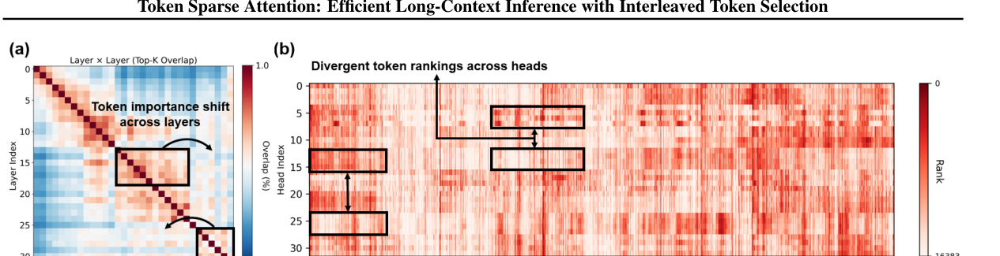
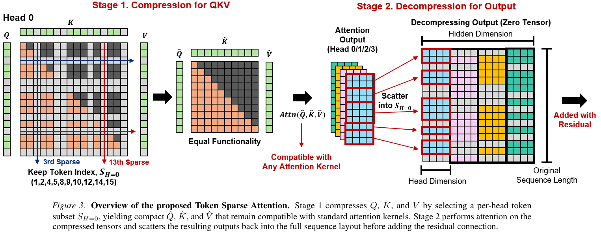
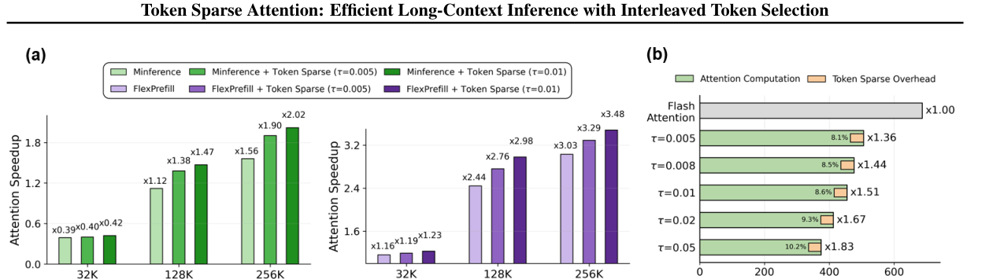

---
tags:
  - paper
  - collection/custom-attention
  - domain/ai-infra
  - status/deep-review
  - topic/long-context-inference
  - method/token-selection
document_type: paper
domain: custom_attn
collection: Custom Attention
review_status: deep-review
canonical: true
---

# Token Sparse Attention 精读分析

> [!info] 文档关系
> - 文档类型：Paper
> - 领域入口：[README](../README.md)
> - 上位汇总：[Multimodal custom attention](../surveys/multimodal-custom-attention.md)
> - 证据资产：`../assets/papers/token-sparse-attention/`
> - 相关文档：[Figure inventory](../evidence/figure-inventory.md)

> 资料状态：已核验 arXiv `2602.03216v3` PDF、LaTeX source 与官方 GitHub；本地 PDF/source 与 2026-07-25 重新下载版本 SHA-256 完全一致。论文图来自 v3 PDF crop 或原始 source PNG，并保留完整 caption。官方代码固定在 commit `21ee21938650fa6d9d5bf898d65bd5e96ef5a032`。本环境无 PyTorch/CUDA/A100，未重跑 GPU 实验。

## 修订信息

- 当前修订 ID：`rev-token-sparse-attention-obsidian-properties-20260731`
- 当前文档版本：`1.0.2`
- 当前修订时间：`2026-07-31T10:00:00+08:00`
- 替代版本：`rev-token-sparse-attention-affiliation-backfill-20260730` / `1.0.1`

| 修订 ID | 文档版本 | 时间 | 修订者 | 类型 | 替代修订 | 迁移问题/解析 | 变更摘要 | 原因 | 影响位置 | 依据 | 对结论影响 |
|---|---|---|---|---|---|---|---|---|---|---|---|
| `rev-token-sparse-attention-a2-initial` | `1.0.0` | `2026-07-25T14:17:47+08:00` | `delegated-paper-review-agent` | `initial` | 无 | 无；legacy 仅作输入材料并重新核验 | 首次建立完整单篇分析、视觉证据、公式、代码/checkpoint/OpenReview/Infra 核验与 manifests | 父任务要求修复非 ICML paper delivery | `analysis.md`; [Figure inventory](../evidence/figure-inventory.md); `code/Token-Sparse-Attention`; 过程侧公开评审记录 | task packet、arXiv v3、官方 source、官方代码、结构与语义验证 | `material` |
| `rev-token-sparse-attention-affiliation-backfill-20260730` | `1.0.1` | `2026-07-30T23:30:00+08:00` | `/root` | `metadata-update` | `rev-token-sparse-attention-a2-initial` / `1.0.0` | 无 | 补充作者—机构元数据与角色证据边界 | 统一回填 affiliation 交付字段 | `作者与机构` | 论文 PDF 标题页、机构编号与角色脚注 | none：不改变方法、实验与归因结论 |
| `rev-token-sparse-attention-obsidian-properties-20260731` | `1.0.2` | `2026-07-31T10:00:00+08:00` | `/root` | `metadata-update` | `rev-token-sparse-attention-affiliation-backfill-20260730` / `1.0.1` | 无 | 增加 Obsidian YAML Properties 与层级标签 | 全量 canonical Paper 标签补齐 | 文件头 YAML frontmatter | 已验证的 ICML 2026 标签 schema；仓库覆盖矩阵 | none：不改变论文分析与证据结论 |

## 0. 资料与配图索引

- 论文：`paper.pdf`，SHA-256 `8250cc8c787416df12cd72dc4f183e8b24110c6302879236f85fca7577275c3a`。
- arXiv source：`source/arxiv_source.tar`，SHA-256 `93908a41c948f3f38f30747b89b56b83bf33b6929291f3e453c21f835b87526a`；解包到 `source/extracted/`。
- 官方页面：`https://arxiv.org/abs/2602.03216`；v3 日期 2026-05-29。
- 开源代码：`https://github.com/dongwonjo/Token-Sparse-Attention`，commit `21ee21938650fa6d9d5bf898d65bd5e96ef5a032`。
- OpenReview：未得到公开 forum；检索与 403 challenge 记录见 过程侧公开评审记录。
- 提取文本：`extracted_text/full_text.clean.txt`。
- Figure inventory：[Figure inventory](../evidence/figure-inventory.md)；contact sheet：`figures/contact-sheet.png`。
- AI 生成分析示意图：跳过。已安装的 OpenRouter ICU skill/CLI 只有 `generate` 与 `edit`，没有契约要求的 `responses-doc --input-file analysis.md` 文档输入路径；API key 虽存在，也不允许改用 prompt-only 生成。

> 原论文 Figure 2（完整 caption）：重要 token 集随 layer 距离变化，且同层不同 head 的排序不同，是反对永久 eviction/统一 head mask 的机制动机证据。

> 原论文 Figure 3（完整 caption）：per-head gather $Q/K/V$ → compact attention → scatter 回完整序列并经 residual 保留未选 token。

> 原论文 Figure 6（完整 caption）：展示上下文长度带来的 attention speedup，以及 token scoring/indexing、QKV compression、output decompression 的 overhead。

## 0.1 术语与符号解释

### 0.1.1 术语表

| 术语 | 本文含义 | 别名 | 不等于/易混项 | 证据来源 |
|---|---|---|---|---|
| Token Sparse Attention | 在 prefill attention 内按 head 选择 token，压缩 $Q/K/V$，调用 dense/structured-sparse kernel，再把输出 scatter 回完整序列的推理机制 | TSA；token-sparse attention（本文方法） | 不是永久 hidden-state/KV eviction；也不是 decode KV-cache compression | Paper §2.2, Fig.3；code `sparse_attn/token_sparse/sparse_cluster.py:103-183` |
| interleaved token selection | 每个 eligible layer 都恢复完整序列，使后续 layer 可重新选择本层跳过的 token | compress-and-decompress；reversible selection | “可重新选择”来自 residual 中 hidden state 保留；并非本层仍计算了被跳过 token 的 attention | Paper §1, §2.2；Fig.3 |
| Dynamic Token Coverage | 先从 recent-query proxy 得到 per-head importance，再用跨 head 聚合分布决定统一的保留数量，最后每个 head 独立 Top-K | dynamic coverage；dynamic sparsity | $\tau$ 实际控制被移除的低重要度累计质量，不是“保留质量” | Paper §2.3, Algorithm 1；code `sparse_cluster.py:68-100` |
| token coverage $\tau$ | 从低重要度尾部累积到阈值 $\tau$ 时决定删除多少 token；$\tau$ 越大越稀疏 | coverage；代码字段 `coverage` | 不等于 fixed token sparsity ratio $s$；论文命名容易让人误以为是 retained mass | Paper Algorithm 1, Table 3-4；code `main.py:28-32` |
| recent-query scoring | 用最后一小段 query 对所有 key 的近似注意力概率来估计 token 重要度 | attention proxy | 不是完整 $L\times L$ attention，也不是随机 query；代码固定 recent window $W=128$ | Paper §2.3, Table 7；code `kernel.py:7-158`, `main.py:31` |
| per-head selection | 同层各 head 使用同一 $k_{\text{keep}}$，但根据各自 $s_h$ 选择不同 $S_h$ | head-wise Top-K | 不是每个 head 独立决定长度；长度是 layer-level shared budget | Paper Algorithm 1 lines 5-13；code `sparse_cluster.py:78-97` |
| Inter-Layer Representation Drift | token 在完整 decoder layer 前后 hidden state 的相对 $L_2$ 变化均值，用于离线选 sparse layers | drift；$R_\ell$ | 不是在线 per-request token routing；代码默认直接使用预先 profile 的 layer list | Paper §2.4 Eq.(1)-(2)；code `profile/llama_hijack_4_46.py:172-209`, `profile/profile.py:17-53` |
| attention map sparsity | selected sparse layers 内，被双轴 token compression 移除的 attention pair 比例 | sparsity $S$ | 不等于 token 删除比例；若 token retention 为 $\rho$，理想上 $S=1-\rho^2$ | Paper Table 3；本分析 §8.1 推导 |
| attention speedup | 所有 layer attention latency 的平均值相对 FlashAttention baseline 的比值 | attention acceleration ratio | 不等于 TTFT/prefill speedup，更不等于 decode TPOT/serving throughput | Paper §3.3, Fig.6, Table 1；Appendix A.4 |
| prefill / TTFT | prompt 一次性前向、建立 KV cache并产生首 token 前的阶段 | pre-filling；time to first token | 不等于逐 token decode；本文 decode 保持 dense attention/full KV | Paper §1, Appendix A.4；code `llama_hijack_4_46.py:85-99,136-147` |
| kernel compatibility | compact 后张量仍以普通 dense layout 传给 FlashAttention、MInference、FlexPrefill 或 X-Attention | composability | 不是“完全无额外实现”：selector、Top-K、gather/scatter 和 monkeypatch 都是新增路径 | Paper §1, §2.2；code `llama_hijack_4_46.py:136-163` |

### 0.1.2 符号表

| 符号 | 含义 | 性质 | 作用域/索引 | 单位/取值 | 来源 | 易混点 |
|---|---|---|---|---|---|---|
| $B$ | batch size | analysis/code-defined | per invocation | requests | code `kernel.py:25,165-178` | 官方实现的 `.item()` 预算逻辑实际只支持 $B=1$ |
| $L$ | 原始 sequence length | author-defined | per request/layer | tokens | Paper §1-2, Algorithm 1 | Paper Eq.(2) 又把 $L$ 用作 layer 总数上界，符号复用含混；本分析对 layer 总数写 $N_{\text{layer}}$ |
| $L'$ | 某 layer 每个 head 的 compact sequence length | author-defined | per layer；head 间长度相同 | tokens | Paper §1, §2.2 | token set 可按 head 不同，但 $L'$ 由 layer-level budget 统一 |
| $H,h$ | attention head 总数与 head 索引 | author-defined | $h=1,\ldots,H$ | count/index | Paper Algorithm 1 | GQA 的 KV heads 少于 query heads；代码先 `repeat_kv` 到 $H$ |
| $d$ | attention head dimension | author-defined | per head | elements | Paper §2.2-2.3 | 不是 model hidden size $Hd$ |
| $Q,K,V,O$ | 完整序列 query/key/value/output tensors | author-defined | per layer/head/token | tensor | Paper Fig.3, Algorithm 1 | $O$ 是 attention output，不是含 residual 的最终 hidden state |
| $\hat Q,\hat K,\hat V,\hat O$ | 按 $S_h$ gather 后的 compact tensors 与 compact attention output | author-defined | per layer/head/selected token | tensor | Paper §2.2, Fig.3 | “hat”在这里表示 compact；$\hat A$ 则是近似 proxy |
| $S_h$ | head $h$ 的升序 selected token index set | author-defined | per layer/head/request | integer indices | Paper §2.2-2.3；code `sparse_cluster.py:94-100` | 代码 index dtype 是 PyTorch Top-K 默认 `int64`，并强制保留 recent window |
| $\hat A$ | recent queries 对全部 keys 的近似 attention probability | author-defined | per layer/head/recent-query/key | probability | Paper Algorithm 1 line 2；code `kernel.py:7-158` | 不会 materialize 完整 $L\times L$ 矩阵 |
| $s_h[t]$ | token $t$ 在 head $h$ 的 importance score | author-defined | per layer/head/token | nonnegative score | Paper Algorithm 1 line 4 | 代码对 prefix score 做 kernel-size 7 的 average pooling，论文正文未列默认值 |
| $s_\ell[t]$ | 跨 head 聚合并沿 token 归一化的 layer-level importance distribution | author-defined | per layer/token | probability mass | Paper Algorithm 1 line 6 | 下标 $\ell$ 表 layer-level，不是 layer index变量本身 |
| $I$ | $s_\ell$ 从低到高排序后的 token indices | author-defined | per layer/request | permutation | Paper Algorithm 1 line 8 | 仅用于决定数量；最终每个 head 用自己的 Top-K |
| $\tau$ | 被剪低重要度尾部的累计质量阈值 | author-defined | global hyperparameter | LLaMA 0.005；Mistral 0.008（主实验） | Paper §3.1；Algorithm 1 | 论文称 token coverage，但数值语义接近 pruned mass budget |
| $k_{\text{sparse}},k_{\text{keep}}$ | 被删除与保留 token 数 | author-defined | per layer/request | tokens | Paper Algorithm 1 lines 10-13 | 代码另加 `min_tokens=1024` 和 always-kept window |
| $h_{\ell,t}$ | layer $\ell$ 输入时 token $t$ 的 hidden state | author-defined | per layer/token | vector | Paper Eq.(1) | code 的 $h_{\ell+1,t}$ 是 attention+MLP 后的完整 decoder-layer 输出 |
| $R_\ell,\hat R_\ell$ | layer drift 与其归一化 rank | author-defined | per layer | nonnegative ratio / $[0,1]$ rank | Paper Eq.(1)-(2) | code 先按 drift 总和归一化再取 quantile；排序不变，但数值不是论文 rank 公式本身 |
| $\delta$ | sparse-layer rank/quantile 阈值 | author-defined | per model profile | 主实验 0.5 | Paper §2.4, Table 9 | 不等于 token coverage $\tau$ |
| $W$ | recent-query window，且代码强制保留最后 $W$ 个 token | code-defined | per layer | default 128 tokens | code `main.py:31`, `kernel.py:39-42`, `sparse_cluster.py:93-97` | 论文只说 small set of recent queries，未报告默认 128 或 always-kept window |
| $\rho,S$ | token retention ratio 与 attention-map sparsity | analysis-derived | selected sparse layer | $[0,1]$ | 本分析 §8.1 | $S=1-\rho^2$ 只描述理想双轴 compact pair 数，不含 causal triangle/overhead |
| $b$ | 每个 QKV element 的字节数 | analysis-derived | data type | bf16 时 2 bytes | code `utils/utils.py:15` | Triton scorer 内部将 Q/K 与 softmax stats/accumulator 转为 fp32 |
| $\mathrm{BW}_{\mathrm{eff}},U_{\mathrm{BW}}$ | 有效带宽与峰值带宽利用率 | analysis-derived | per kernel/path | bytes/s；ratio | 本分析 §8.4 | 论文未给 bytes-moved/peak counters，不能报告数值利用率 |

## 1. 论文基本信息

### 作者与机构

- 第一作者（首位列名）：Dongwon Jo → Department of Electrical and Computer Engineering, Seoul National University。
- 共同第一作者（仅含论文明确标注者）：论文未显式标注。
- 通讯作者/通讯联系人（仅含论文明确标注者）：
  - Beomseok Kang → Department of Electrical and Computer Engineering, Seoul National University
  - Jae-Joon Kim → Department of Electrical and Computer Engineering, Seoul National University
- 其他作者涉及的机构（去重列举，不作逐作者映射）：Department of Electrical and Computer Engineering, Seoul National University。
- 对应依据：论文 PDF 标题页、作者机构编号与角色脚注（核验日期：2026-07-30）。

- 完整标题：*Token Sparse Attention: Efficient Long-Context Inference with Interleaved Token Selection*。
- 作者：Dongwon Jo、Beomseok Kang、Jiwon Song、Jae-Joon Kim；Seoul National University。
- 版本/venue：arXiv `2602.03216v3`，PDF 标注 Proceedings of the 43rd ICML、PMLR 306、2026。
- 研究领域：长上下文 LLM prefill、动态 token sparsity、attention kernel composition。
- 核心问题：能否在不永久 eviction token 的前提下，把任意、per-head、per-layer 的 token 选择转成硬件友好的连续 attention。
- 研究目标：提高 attention 与 TTFT 的准确率—延迟 Pareto，同时复用 FlashAttention/已有 structured-sparse kernel。
- 关键约束/假设：长上下文 attention importance 有低质量长尾；recent queries 足以估计重要度；低 drift layers 更耐 sparsification；residual 足以让未选 token 留在后续选择空间；主实验 batch/hardware 是单 GPU 长上下文场景。

## 2. 研究动机与问题—方案闭环

### 2.1 出发点与背景痛点

`author-stated`：长上下文 prefill 的 attention 主项随 $L^2$ 增长；FlashAttention 降低 I/O，但不改变 pair 数量。structured sparse attention 为适配 tile/kernel 常在 block 级跳过计算，block 内的低价值 token 仍被带着计算。另一条 token-eviction 路径更细粒度，却在早层作永久决定：如果 token importance 后续变化，已删 token 无法恢复（Paper §1）。

Figure 2 提供 `mechanism-visualization`：top-1% important tokens 的跨层 overlap 随 layer 距离下降，同层不同 heads 的 token rankings 也明显不同。这说明“早层一次选定 + 全 head 共用 token set”与观察到的动态性不匹配；但 Figure 2 只是诊断相关性，不独立证明新方法一定更优。

### 2.2 现有方案为何不够

1. `author-stated` block-sparse failure：block granularity 把低价值 token 与 salient token 捆绑，限制可达 sparsity（§1）。
2. `author-stated` eviction failure：FastKV/GemFilter 一类方法把未选 hidden states 永久移除，隐含“importance 跨层稳定”的假设（§2.1）。
3. `author-stated` unified-head failure：若在 attention module 前按 hidden state 统一筛 token，不同 head 不能保留各自需要的 token（§2.1；Appendix A.6）。
4. `inferred` kernel failure：直接把任意 per-head token predicate 交给 block kernel，会破坏连续 tile；论文选择先 compact，再让 kernel 只见连续 $L'$。Figure 3 和代码支持这种边界，但论文没有比较“native irregular kernel vs compact”。

### 2.3 目标问题与成功标准

- 核心问题：在 selected layer 内跳过低重要 token 的 attention pair，同时保留完整 hidden-state 序列供后续 layer 重选。
- 场景：text-generation LLM 的 prefill，主要是 32K–256K context；不主张 decode KV-cache acceleration。
- 约束：per-head selection；每层恢复 $L$；无需修改下游 dense/structured-sparse attention kernel；selector/gather/scatter overhead 不能吞掉 $L'^2$ 节省。
- 成功标准：RULER/InfiniteBench/LongBench/Needle 准确率接近对应 baseline；attention speedup、TTFT speedup提高；动态 coverage 优于固定 ratio；低 drift layer selection、recent-query scorer 有受控证据。
- 明确不解决：decode TPOT、KV-cache memory reduction、多请求 serving、训练期稀疏、multimodal correctness；Appendix A.7 只把 decode/multimodal列为 future work。

### 2.4 核心方案如何解决并优化问题

整套方案把“任意 token 选择”拆成 kernel 前后的数据变换。离线 profile 先决定哪些 layers 可稀疏；在线每个 eligible layer 用 recent queries 扫全部 keys 估计 score，跨 head 的分布决定 $L'$，per-head Top-K 决定 $S_h$。随后 gather 得到连续 $\hat Q,\hat K,\hat V$，调用原 attention kernel；最后 $P_h^\top$ scatter 回完整序列，未选 query 的 attention update 为 0，但 residual 仍把其 hidden state 送往下一层。

| 原始问题/失败模式 | 根因或约束 | 对应方案设计 | 改变的变量/系统行为 | 作用机制 | 预期优化及指标 | 证据来源 | 判断 |
|---|---|---|---|---|---|---|---|
| 永久 eviction 后 token 无法恢复 | importance 跨 layer 变化 | 每层 scatter 回 $L$+residual | 删除变成本层零 attention update，而非 hidden-state removal | 下一层仍从完整 hidden states 生成 QKV并重选 | RULER accuracy at matched speed | §2.1-2.2, Fig.2-3, Table 5 | `partially-supported`：跨方法对照有混杂 |
| 全 head 共用 token set | heads 关注语义不同 | per-head Top-K $S_h$ | head-specific indices | 每个 head 在同一预算下保留自己的 salient tokens | accuracy preservation | Fig.2b, Algorithm 1, Appendix A.6/Table 13 | `plausible`：没有同架构 shared-head ablation |
| block granularity 多算 token | kernel 喜欢连续 tile | QKV token gather 到 dense compact layout | attention pair 数从 $L^2$ 变 $L'^2$ | 复用成熟 kernel 而无需 irregular token mask | attention latency/speedup | §2.2, Fig.3, Fig.6；code commit | `supported`：实现与 latency 证据存在 |
| 固定 token ratio 不适应输入/layer | score mass tail 长度变化 | Dynamic Token Coverage | $L'$ 随 score distribution 变化 | 删除低质量累计 mass，而非固定 token 数 | accuracy at similar speed | Table 4 | `partially-supported`：speed 只近似匹配 |
| 所有 layers 稀疏会降准确率 | layer 对近似敏感度不同 | drift-based layer profiling | 仅 $\hat R_\ell\le\delta$ 的 layers 启用 | 把误差集中到表征变化较小的 layers | RULER accuracy/speedup | Fig.4, Table 8-9 | `supported`：correlation+sensitivity/group ablation |
| selector 本身可能很慢 | recent-query score 仍扫 $K$ | fused Triton online-softmax scorer | 不 materialize $W\times L$ proxy | 合并 score/statistics/probability aggregation，减少中间 I/O | overhead fraction | §2.3, Fig.6b；code `kernel.py` | `partially-supported`：无 kernel-vs-unfused ablation |
| 基础 sparse kernel仍有剩余 token 冗余 | token 与 block sparsity 正交 | TSA 先 compact，再跑 MInference/FlexPrefill/X-Attention | 两级稀疏组合 | token-level 减小 tensor，block-level 再减 pairs | Pareto/speedup | Table 1, 12, Fig.5 | `supported`：多 baseline 组合，但共享实现环境 |

### 2.5 完整因果链与证据闭环

背景触发是长上下文 prefill 的 $L^2$ attention；可观察痛点是 block sparsity 粒度粗、early eviction 不可逆；Figure 2 将后一失败联系到 layer/head importance dynamics。论文据此选择“每层、每 head 重选”，在线改变 $S_h$ 和 $L'$，使 selected layers 的 attention pair 数理想下降到 $\rho^2 L^2$；scatter/residual 将硬删除改为本层零 update；drift profile 避免在敏感 layer 使用近似。指标从机制证据（Fig.2/4、Table 7-9）连接到 accuracy-speed Pareto（Table 1-5、Fig.5-6）和 TTFT（Table 10-11）。

- **直接/较强闭环**：recent-query scorer replacement（Table 7）、drift group/δ sweep（Table 8-9）、dynamic vs fixed budget（Table 4）、代码实现与 Figure 3 一致、128K TTFT 表。
- **间接/混杂**：reversible scatter 与 per-head selection 没有各自的 matched ablation；Table 5/13 同其他方法比较同时改变 scorer、layer selection、token location 和 FFN policy。
- **未验证边界**：multi-request batch、不同模型家族、decode、multimodal、selector 的 CPU sync/利用率、生产 scheduler；“attention noise 是 structural regularization”没有训练/泛化层面的因果实验。

整体判断：`partially-supported`。论文证明了完整系统在所测长上下文配置中改善 Pareto，也为 scorer/drift/budget提供了组件证据；但“优势主要来自 reversible + per-head”仍缺同架构拆分实验。

## 3. 核心贡献与创新点

1. 提出 per-head `compress → attend → scatter`，把任意 token selection 转为连续 QKV，避免永久 eviction（§2.2, Fig.3）。
2. Dynamic Token Coverage 用跨 head score mass 决定统一预算、用 per-head score 决定 token identity（§2.3, Algorithm 1）。
3. 用 Inter-Layer Representation Drift 离线选出更耐近似的 layers（§2.4, Fig.4, Eq.(1)-(2)）。
4. 将 token sparsity 与 FlashAttention、MInference、FlexPrefill、SeerAttention、X-Attention组合，展示 heterogeneous granularity（Table 1, 12）。
5. 报告 attention overhead 与 A100/A6000 TTFT，而非只给理论 FLOPs（Fig.6, Table 10-11）。

## 4. 研究方法

### 4.1 方法总览与阶段限定

1. **模型级离线 preprocessing**：跑完整模型得到每层 $R_\ell$，以 $\delta=0.5$ 选择 sparse layers。官方代码随后把具体 layer lists 硬编码到 `set_model`。
2. **prefill 每个 eligible layer 的 selection**：RoPE 先作用于 full Q/K；Triton scorer 用最后 $W$ queries 扫 all keys；coverage 决定 $L'$，per-head Top-K 得到升序 $S_h$。
3. **attention construction/execution**：gather Q/K/V；因为 indices 升序且 RoPE 已在 full positions 应用，compact causal order与绝对位置信息保留。
4. **output restoration**：把 compact output scatter 到 zero tensor，再过 output projection；decoder residual 在外层相加。
5. **decode/serving runtime**：当 `q_len==1` 时不做 token compression，继续 dense/full-KV attention。因此本文的 “selection”只限定于 prefill，不是 decode cache routing。

### 4.2 组件级设计动机与具体问题映射

| 设计项 | 论文是否明确说明 why | 原文证据 | 针对的具体问题/失败模式 | 可能起作用的因果机制 | 替代方案/权衡 | 验证证据 | 判断 |
|---|---|---|---|---|---|---|---|
| 同时 compress Q/K/V | `author-stated` | §2.2, Fig.3 | 既要少算 query rows，也要少算 key/value columns | pair 数由 $L^2$ 降到 $L'^2$；compact dense layout复用 kernel | 只剪 K/V 可保留所有 query updates，但复杂度 $LL'$、scatter更少 | Fig.6 latency；code gather 三 tensor | `supported` for implementation/latency；无只剪 KV ablation |
| scatter zero output + residual | `author-stated` | §2.2 | 被跳过 token 不能永久消失 | 本层无 attention increment，但 residual保留 hidden state | eviction 更省后续 FFN/KV；soft gate 可减少硬误差但不省 pair | Fig.3；Table 5/13 only indirect | `partially-supported` |
| per-head Top-K | `author-stated` | Fig.2b, §2.3 | head-wise rankings 不同 | head-specific $S_h$ 避免统一 token set | shared-head set metadata更小、更易 batching | Fig.2b；OrthoRank comparison confounded | `plausible` |
| layer-level shared $k_{\text{keep}}$ | `inferred` | Algorithm 1 lines 5-13 | 真正 per-head ragged lengths 不利于 kernel batching | 同一 layer 所有 heads 长度相同，dense tensor规整 | per-head budget可能更准，但需 varlen/padding | code shape与 algorithm；无 ablation | `plausible` |
| recent-query proxy | `author-stated` | §2.3, Table 7 | full attention map selector 本身 $O(L^2)$ | 用 $W\ll L$ queries 得到 $O(WL)$ proxy | pooled Q/random queries更便宜或更覆盖全局 | Table 7 direct replacement | `supported` |
| low-mass dynamic coverage | `author-stated` | §2.3, Table 4 | fixed ratio 不随 score tail变化 | 同一 $\tau$ 对不同 inputs/layers产生不同 $L'$ | fixed $s$ predictable latency；learned budget需训练 | Table 4 near-matched speed | `partially-supported` |
| drift-based layer selection | `author-stated` | §2.4, Fig.4 | 全层 sparsify 大幅降 accuracy | 只在 hidden representation变化较小层近似 | learned sensitivity/Hessian或任务特定 search | Fig.4, Table 8-9 | `supported` |
| Triton fused scorer | `author-stated` | §2.3 | score materialization/I/O overhead | online-softmax stats + prefix probabilities，fp32 accumulation | PyTorch SDPA/FlashAttention query slice更简单 | code exists；Fig.6 aggregate overhead | `partially-supported`，无 kernel isolation |
| always-kept recent window、min 1024、pool 7 | `not-stated`（默认值未在论文列出） | none | 避免极端 pruning、平滑 score、保护最近 tokens | 稳定 selector/保持局部信息 | 增加最低成本并引入额外超参数 | code `main.py:30-32`, `sparse_cluster.py:76,93-97`；无 ablation | `unverified` |

### 4.3 选择—压缩—恢复公式

令 $P_h\in\{0,1\}^{L'\times L}$ 是按升序 $S_h$ 取行的 selection matrix，则：

$$
\hat Q_h=P_hQ_h,\qquad
\hat K_h=P_hK_h,\qquad
\hat V_h=P_hV_h.
$$

保留原 causal 顺序的 compact attention 为：

$$
\hat O_h=
\operatorname{softmax}\!\left(
\frac{\hat Q_h\hat K_h^\top}{\sqrt d}+M_{\mathrm{causal}}^{(S_h)}
\right)\hat V_h,
\qquad
O_h=P_h^\top\hat O_h.
$$

未选位置在 $O_h$ 中为 0；decoder layer 外部再执行：

$$
X_{\ell}^{\mathrm{attn}}=X_\ell+W_O\operatorname{Concat}_h(O_h).
$$

因此方法相当于同时硬选择 query rows 与 key/value columns，而非普通“只 mask key”的 sparse attention。

### 4.4 Dynamic Token Coverage

论文的 proxy：

$$
\hat A_h=
\operatorname{softmax}\!\left(
\frac{Q_h[-W:]K_h^\top}{\sqrt d}
\right),\qquad
s_h[t]=\operatorname{Pool}\!\left(\sum_{q=1}^{W}\hat A_h[q,t]\right).
$$

跨 head layer-level distribution：

$$
s_\ell[t]=
\frac{\sum_{h=1}^{H}s_h[t]}
{\sum_{u=1}^{L}\sum_{h=1}^{H}s_h[u]}.
$$

令 $I=\operatorname{argsort}_{\uparrow}(s_\ell)$，则：

$$
k_{\mathrm{sparse}}
=
\min\left\{
k:\sum_{j=1}^{k}s_\ell[I_j]\ge \tau
\right\},
\qquad
k_{\mathrm{keep}}=L-k_{\mathrm{sparse}},
\qquad
S_h=\operatorname{TopK}(s_h,k_{\mathrm{keep}}).
$$

代码语义略更具体：只对 prefix $L-W$ 评分，对 score 做宽度 7 average pooling；最后 $W=128$ recent tokens 无条件 append，并施加 `min_tokens=1024`。这不是 README-only 推断，而是 commit 中 `sparse_cluster.py:65-97` 的实现事实。

### 4.5 Sparse layer selection

$$
R_\ell=
\mathbb E_t
\left[
\frac{\lVert h_{\ell+1,t}-h_{\ell,t}\rVert_2}
{\lVert h_{\ell,t}\rVert_2+\epsilon}
\right].
$$

论文写：

$$
\hat R_\ell=
\frac{1}{N_{\text{layer}}}
\sum_{k=1}^{N_{\text{layer}}}\mathbf 1[R_k\le R_\ell],
\qquad
\mathcal L_{\text{sparse}}
=\{\ell\mid \hat R_\ell\le\delta\}.
$$

原论文 Eq.(2) 把 $L$ 同时用作 sequence length 与 layer count；本分析用 $N_{\text{layer}}$ 消除歧义。代码 profile 对 drift 先按总和归一化，再取 quantile；因为正比例缩放不改变排序，这与 rank-threshold 的 layer identity 一致。默认运行阶段并不重新 profile，而是对 LLaMA 固定 layers 15–30、对 Mistral 固定 20 个 layers（`sparse_cluster.py:24-30`）。

### 4.6 实验/部署设置与事实—缺口分离

- Paper facts：LLaMA-3.1-8B-Instruct、Mistral-Nemo-12B-Instruct-2407；RULER、InfiniteBench 为主；LongBench/Needle 在 appendix；单 A100 80GB；LLaMA $\tau=0.005$、Mistral $\tau=0.008$；$\delta=0.5$。
- Code-confirmed：Python 3.10、torch 2.4.0、transformers 4.46.0、FlashAttention 2.6.3、Triton 3.0.0；model/QKV 用 bf16；1 warmup + 5 timed runs；benchmark context default 131072。
- 未知：论文主表的随机种子/每 task prompt模板版本、实际 Git commit、driver/CUDA/clock/power、FlashAttention autotune状态、每项 latency 的重复次数（appendix 只给均值±标准差）、A100具体 SKU/频率。
- 代码默认与 Algorithm 1 不完全同构：always-kept recent window、pool kernel、min tokens 未在论文实验设置中显式报告；这使“source release 足以精确复现”仍不成立。

## 5. 关键结论与技术主张证据矩阵

### 5.1 主结果

RULER Table 1 中，LLaMA FlashAttention 的平均准确率 `87.01 → 87.02`，128K attention speedup `1.00× → 1.36×`；FlexPrefill `87.27 → 87.27`，`2.44× → 2.76×`，相对已有 FlexPrefill speedup 再提高约 $2.76/2.44-1=13.1\%$。MInference `86.49 → 86.05`，`1.12× → 1.38×`，说明组合速度提高但 accuracy 并非总是无损。

InfiniteBench Table 2 的变化也小但方向混合：LLaMA Flash `50.86 → 50.88`，MInference `50.16 → 49.70`，FlexPrefill `49.53 → 49.23`；Mistral FlexPrefill `24.80 → 24.08`。所以 defensible claim 是“多数平均值接近 baseline”，不是逐 task/模型无损。

TTFT Table 10 中，A100 128K FlashAttention `31.04s → 24.35s`，即 `1.27×`、latency 减少约 `21.6%`；8K 则 `0.68s → 0.70s`，慢约 `2.9%`。A6000 128K Table 11 是 `67.34s → 54.49s`（约 `1.24×`、减少 `19.1%`），再次显示收益依赖 attention 已成为主瓶颈。

### 5.2 技术主张分类

| 论文声称的技术点 | 声称收益/效果 | 对应实验/消融 | 对照是否受控 | 指标变化 | 证据强度 | 结论 |
|---|---|---|---|---|---|---|
| layer/head importance dynamic | 反驳 early unified eviction | Fig.2 | mechanism observation | overlap/ranking visualization，无汇总数字 | `mechanism-visualization` | `correlation-only` |
| recent-query scoring | 更准地识别 token | Table 7 | matched replacement | Avg random `84.95`, Q-pooling `86.43`, recent `87.02` | `replacement-baseline` | `supported` |
| Dynamic Coverage | 同速度下优于 fixed $s$ | Table 4 | near-matched，speed不完全相同 | `87.02@1.36×` vs `86.91@1.32×`; `86.84@1.51×` vs `85.43@1.57×` | `direct/near-matched` | `partially-supported` |
| low-drift layer selection | 降低 sparsification accuracy loss | Fig.4, Table 8-9 | group/sensitivity | LLaMA low/mid/high Avg `86.89/85.51/72.13`; $\delta=.5/.7/.9$ `87.02/85.35/79.16` | `sensitivity + controlled grouping` | `supported` |
| reversible scatter/residual | 优于 permanent eviction | Table 5 | cross-method confounded | Ours `86.84@1.51×`, FastKV `85.64@1.50×`, GemFilter `85.12@1.53×` | `confounded` | `partially-supported` |
| per-head QKV-level selection | 优于 unified hidden-state token set | Appendix A.6/Table 13 | cross-method confounded；OrthoRank还跳 FFN | Ours `87.02@1.27×` vs OrthoRank `79.36@1.27×` | `confounded replacement baseline` | `plausible` |
| kernel composability | 与多种 kernel 正交叠加 | Table 1, 12 | corresponding baseline pairs | Flex `2.44→2.76×`; Seer `2.19→2.47×`; XAttn `2.72→3.49×` | `direct system comparison` | `supported` |
| selector/gather/scatter overhead小 | 长上下文仍有净收益 | Fig.6b, Table 10-11 | measured full stack | 128K overhead <11%；A100 TTFT 1.27× | `system measurement` | `supported` only for tested batch/hardware |
| attention noise pruning等于 structural regularization | 可能减少 distraction | 无专门实验 | none | none | `none` | `unverified` |
| 默认 window=128/pool=7/min=1024 有必要 | 稳定 selector | 无论文 ablation | none | none | `code-only` | `unverified` |

### 5.3 假设是否被验证

- “importance 跨 layer/head 变化”：Figure 2 支持观察，但 top-1% overlap/单 layer ranking 的任务与样本范围不充分。
- “recent queries 是好 proxy”：Table 7 在 RULER/LLaMA 上直接支持；跨模型/任务鲁棒性未单独给出。
- “low drift 预测 robustness”：200 random triplets 的 correlation + Table 8/9 提供较强证据；仍是 empirical heuristic，不是误差上界。
- “低 mass tail 是 noise”：accuracy 结果兼容这个解释，但没有 token-level semantic audit 或 causal intervention，不能证明删除的是“irrelevant”而不是容错冗余。
- “reversible/per-head 是主要收益来源”：跨方法结果方向支持，但缺 `shared-head vs per-head` 与 `scatter-residual vs eviction` 的同代码 matched ablation。

### 5.4 收益来源归因

| 组件/变化 | 对比基线 | 指标变化 | 影响路径 | 证据强度 |
|---|---|---|---|---|
| recent-query vs random/Q-pooling | TSA replacement | +2.07/+0.59 RULER Avg | selector quality → accuracy | matched replacement |
| dynamic vs fixed budget | fixed $s$ | +0.11 或 +1.41 Avg，速度略不同 | budget allocation → accuracy/speed Pareto | near-matched |
| drift low-layer policy | high/mid drift groups | LLaMA Avg +14.76/+1.38 | layer placement → approximation error | controlled grouping |
| TSA on FlashAttention | Flash | attention `1.36×`; RULER +0.01 | pair reduction minus planner/gather/scatter | full-system direct |
| TSA on FlexPrefill | Flex | `2.44→2.76×`; Avg不变 | token compact + block sparse composition | full-system direct |
| attention gain → TTFT | Flash 128K A100 | attention `1.36×`，TTFT `1.27×` | attention only占 prefill一部分 | paper-reported, not component variance decomposition |

一个有解释力但属于 `analysis-derived` 的粗分解：Table 3 在 $\tau=0.005$、128K 的 selected-layer attention-map sparsity $S=54.44\%$，所以 compact attention core 保留约 $1-S=45.56\%$ pairs。若 $\delta=0.5$ 恰有一半 layers sparse、各层成本相等且忽略 overhead，则全层 attention 理想 speedup：

$$
\mathrm{Speedup}_{\mathrm{ideal}}
\approx
\frac{1}{(1-\delta)+\delta(1-S)}
=
\frac{1}{0.5+0.5\times0.4556}
=1.374\times.
$$

论文实测 `1.36×` 非常接近，但这不是论文正式方差分解：layer costs不等、scorer/gather/scatter 存在且不同上下文的 $S$ 不同。

### 5.5 报告一致性问题

arXiv v3 abstract 写“up to `3.23×` attention speedup at 128K”；但 Appendix Table 12 报 X-Attention+TSA `3.49×`，Figure 6 的 FlexPrefill+$\tau=0.01$ 在 128K 约 `2.98×`。可能是 abstract 对特定 baseline/config、camera-ready 更新不同步或 Figure 1 的另一定义，但正文没有解释。审阅不擅自选一个“正确峰值”；Survey 应优先引用可定位 table/figure pair，并注明 metric/config。

## 6. Related Work 对比

| 类别/论文 | 方法核心 | 优点 | 局限 | 与本文关系/比较公平性 |
|---|---|---|---|---|
| FlashAttention | exact attention 的 IO-aware tiling | 不改精度；成熟 kernel | $L^2$ pairs 不变 | TSA 将 compact dense QKV交给它；baseline合理 |
| MInference / FlexPrefill / X-Attention / SeerAttention | attention-map/block structured sparsity | GPU tile友好；pair级跳过 | block内可能带入无关 token；有 pattern search overhead | TSA 是上游 token-axis compact；Table 1/12 pair comparisons支持组合性 |
| FastKV / GemFilter / PyramidInfer | early-layer token/hidden-state eviction | 后续 attention/FFN/KV 都可省 | 决策不可逆；常跨 heads共享 | Table 5 速度近似匹配，但实现与跳过范围不同，不能单独归因 reversible |
| OrthoRank | hidden-state几何 score，非永久 eviction；统一 token set | 不依赖 attention proxy；可跳 FFN | 不按 head选择；scoring signal不同 | Table 13 用 prefill speed公平些，但多个架构差异仍混杂 |
| prompt compression | 模型外缩短输入 | 可跨模型/API | 可能丢原文，不能逐 layer重选 | 目标不同；不应视作同 kernel-level baseline |
| decode KV eviction/quantization | 减小 KV storage/bandwidth | 直接改善 TPOT/memory | 可能损 quality；不处理 prefill Q² | TSA 当前明确不覆盖；只能互补 |

论文 Related Work 的分类总体公平，但将自身优于 eviction 解释为 reversible/per-head 时证据不足，因为 baselines还改变 FFN、score、layer位置和 token set粒度。最需要的桥接 baseline 是同一 TSA 实现中逐项切换 `scatter/residual→permanent eviction`、`per-head→shared-head`、`attention-score→hidden-state score`。

## 7. OpenReview 公开评审 × 论文内容交叉核验

- OpenReview 链接：未找到。
- 访问日期：2026-07-25。
- decision/meta-review/rebuttal/public discussion：不可核验。
- 核验状态：`skipped-with-reason`；完整访问记录见 过程侧公开评审记录。

公开搜索未返回标题/arXiv ID 对应 forum，OpenReview API v2 标题查询返回 403 `ChallengeRequiredError`。arXiv v3 和 GitHub 标注 ICML 2026，但没有 forum URL。因此本分析不能引用 reviewer concerns，也不能推断 rebuttal 是否解决了某项问题。这里的缺口不阻止论文/source/code自洽审阅，但降低了 novelty/baseline fairness 与 review-stage revision 的外部核验力度。

## 8. Infra 需求分析

### 8.1 算力与复杂度

每个 selected layer 的主要计算可粗写为：

$$
C_{\text{dense-attn}}\sim O(BHL^2d),\quad
C_{\text{compact-attn}}\sim O(BHL'^2d),\quad
C_{\text{score}}\sim O(BHWLd).
$$

当 $W\ll L$、$\rho=L'/L$ 时，attention core pair ratio 为 $\rho^2$。Table 3 的 $S=54.44\%$ 给出 $\rho\approx\sqrt{1-S}=0.675$。这解释长上下文 gain，但 scorer仍线性扫 full K；短上下文时固定 overhead 主导，Table 10 的 8K 回退是直接证据。

官方 Triton scorer用两阶段 kernel：先为 last $W$ queries 计算 all-key online-softmax 的 fp32 $m,l$，再对 prefix keys 聚合 mean probability（`kernel.py:7-158`）。它未 materialize $W\times L$ logits，但仍执行 $O(WL)$ dot products。

### 8.2 显存、索引与缓存

compact QKV 暂存的理想字节数：

$$
\mathrm{Bytes}_{\hat Q\hat K\hat V}
\approx 3BHL'db.
$$

以代码默认 LLaMA-like `B=1,H=32,d=128,L=131072,b=2`（bf16）与 $\rho\approx0.675$ 粗估，compact QKV 合计约 `2.03 GiB`/selected layer 的瞬时 tensor volume。索引由 PyTorch Top-K 产生 `int64`：

$$
\mathrm{Bytes}_{S}\approx 8BHL'
\approx 22.6\ \mathrm{MiB}.
$$

scatter 还要创建 zero tensor $B\times H\times L\times d$，约 `1.0 GiB`，再写 selected values。实际 peak 取决于 allocator、view/materialization 与 kernel workspace；本环境未运行 CUDA profiler，以上是 tensor-shape estimate，不是 measured peak。

代码在 prefill 先更新完整 KV cache，再把 GQA K/V `repeat_kv` 到 query-head 数后 gather（`llama_hijack_4_46.py:85-99`）。因此 TSA 不缩小持久 KV cache；还可能为 per-head K/V产生额外临时 traffic。Paper Appendix A.4 也明确 decode 使用 full KV/dense attention、TPOT相同。

### 8.3 Data Types / 数值格式

| 对象 | 数据类型/格式 | 使用阶段 | 硬件依赖 | 对精度/速度/显存的影响 | 证据 |
|---|---|---|---|---|---|
| model weights/QKV | bf16 | prefill/decode | A100/A6000 bf16 support, FlashAttention 2 | 2 bytes/element；Tensor Core路径 | code `utils/utils.py:12-16`; Mistral config |
| scorer Q/K loads | input bf16 → fp32 | selection | Triton/CUDA | fp32 softmax稳定但增加 register/compute | code `kernel.py:44-78,126-155` |
| softmax stats $m,l$, output cache | fp32 accumulation；返回转 query dtype | selection | Triton | 避免长序列 softmax underflow；最终 score精度降低到 bf16 | code `kernel.py:49-50,130,186-191,237` |
| cumulative coverage | fp32 | budget search | PyTorch GPU + host sync | 边界判断较稳定 | code `sparse_cluster.py:83-86` |
| token indices $S_h$ | int64 | gather/scatter | PyTorch CUDA | metadata较 int32 大 2×；方便 gather | code Top-K/arange/scatter |
| Flash/Flex/XAttn output | bf16为主 | attention | CUDA kernel | 精度/吞吐依赖具体 kernel | requirements + code |

论文没有 fp8/int8/int4/量化实验，也没有 accumulation error/coverage threshold sensitivity under dtype 的研究。

### 8.4 带宽、互联与高效利用

$$
\mathrm{EffectiveBandwidth}
=
\frac{\mathrm{BytesMoved}}{\mathrm{RuntimeSeconds}},
\qquad
\mathrm{Utilization}
=
\frac{\mathrm{EffectiveBandwidth}}{\mathrm{PeakBandwidth}}.
$$

当前资料不能给出可信数值：Fig.6b 只给 aggregate latency/overhead，不给各 gather/scatter bytes、HBM counters 或 GPU peak clock。可判断的方向是：

- scorer 扫 full K，倾向 memory+dot-product混合；online-softmax避免写完整 proxy。
- `torch.gather` 三次 + `torch.zeros` + `scatter_` 是额外 HBM traffic，可能 memory-bound。
- indices 升序改善 compact attention 的逻辑顺序，但 gather源地址仍按各 head Top-K不规则。
- 与 MInference/FlexPrefill 组合时，compact tensor降低后续 sparse-kernel domain；是否改善 tile occupancy 取决于 $L'$、block alignment 和 padding，论文未报告。
- 单 GPU实验没有 PCIe/NVLink/RDMA/all-reduce/all-to-all，不能外推 tensor parallel 或 disaggregated prefill。

| 路径 | 数据量 | 峰值带宽 | 有效带宽/利用率 | 优化机制 | 瓶颈判断 | 证据 |
|---|---:|---:|---:|---|---|---|
| HBM scorer Q/K | $O(BHWLd\,b)$ | 未报告 | 不可算 | Triton tiling、online softmax | mixed memory/compute | code kernel |
| HBM gather QKV | $\approx3BHL'db$ output + source reads | 未报告 | 不可算 | contiguous compact output | likely memory-bound | code gather |
| compact attention | $O(BHL'^2d)$ compute | 未报告 | 不可算 | FlashAttention/structured sparse | long $L'$ compute-heavy | paper/code |
| zero+scatter output | $BHLdb+BHL'db$ 量级 | 未报告 | 不可算 | in-place scatter | likely memory-bound | code `sparse_cluster.py:163-181` |

### 8.5 CPU/GPU/NPU 异构执行与 serving

| 阶段 | CPU 角色 | GPU/NPU/加速器角色 | 数据移动 | 同步/overlap | 潜在瓶颈 | 证据 |
|---|---|---|---|---|---|---|
| model/profile setup | Python 参数、hardcoded sparse layers | GPU跑 profile forward | config/weights加载 | setup-time | checkpoint gate/加载 | code profile/set_model |
| score/budget | Python调度；`.item()` 把每 batch预算标量拉回 host | Triton score，torch sort/cumsum/topk | one scalar D2H per sparse layer/request | `.item()` 强制同步，破坏 overlap | batch/serving scalability | `sparse_cluster.py:83-93` |
| gather/attention/scatter | Python dispatch | CUDA/Triton/FlashAttention | HBM only on single GPU | sequential in current code | launch+HBM overhead | code forward |
| decode | Python generation loop | dense FlashAttention/full KV | HBM KV reads | unchanged | memory-bandwidth TPOT | Appendix A.4 |

关键实现限制：`num_sparse_tokens=(...).sum(dim=-1).item()` 对 $B>1$ 会得到多个元素而 `.item()` 报错；即当前 budget code只适用于 batch size 1。它还引入每个 sparse layer 的 GPU→CPU同步。论文的单 A100长上下文结果没有评估 continuous batching、多个不同 $L'$ 的请求、CUDA graph或异步 scheduler。因此“practical”应限定为单请求研究原型，而非生产 serving已验证。

没有 NPU/TPU kernel、CPU fallback、DMA/pinned-memory或异构 placement 实现；源码依赖 Triton、FlashAttention和 transformers monkeypatch，NPU portability 为 `unverified`。

## 9. 开源代码与 checkpoint 对照

- 仓库：`code/Token-Sparse-Attention`
- commit：`21ee21938650fa6d9d5bf898d65bd5e96ef5a032`（2026-05-12）
- 代码静态检查：核心 8 个 Python 文件 AST parse 通过。
- 动态检查：未运行；环境缺 `torch`，无 `nvidia-smi`/CUDA，无法编译 Triton或复现实验。

| 论文机制 | 本地路径（固定 commit） | 一致性判断 |
|---|---|---|
| recent-query online-softmax proxy | `sparse_attn/token_sparse/kernel.py:7-237` | 一致；代码明确 $W$、fp32 stats、prefix aggregation |
| dynamic coverage + per-head Top-K | `sparse_attn/token_sparse/sparse_cluster.py:58-100` | 主逻辑一致；多出 pool=7、min=1024、always-kept window |
| QKV gather | `sparse_cluster.py:103-143` | 一致 |
| zero scatter/decompress | `sparse_cluster.py:145-183` | 一致 |
| RoPE before gather、base kernel复用 | `sparse_attn/llama_hijack_4_46.py:72-163` | 一致 |
| drift profile | `sparse_attn/token_sparse/profile/profile.py:17-53`; `profile/llama_hijack_4_46.py:172-209` | 公式一致；运行时用 hardcoded result |
| bf16/FlashAttention 2 | `utils/utils.py:12-16`; `requirements.txt` | code-confirmed；论文未列完整 software stack |
| benchmark timing | `benchmark/prefill.py:23-73`; `benchmark/attention.py` | CUDA events/1 warmup/5 runs；未见论文 artifact log |

### 9.1 代码—论文差异与复现风险

1. **batch-size=1 only**：`.item()` 预算实现不支持 $B>1$，README未说明。
2. **同步点**：`.item()` 每 sparse layer造成 device-host sync，可能让 production batching/CUDA graph收益大幅低于单请求。
3. **未披露默认设计**：`window_size=128`, `kernel_size=7`, `min_tokens=1024`；论文没有敏感性消融。
4. **GQA展开**：K/V在 compression前 repeat到 query heads，可能牺牲 GQA 的 memory efficiency。
5. **版本耦合**：monkeypatch只显式测试 transformers 4.46；模型 forward API升级可能破坏。
6. **异常处理**：MInference/Flex/XAttention import failure只打印消息；选择对应 method 后会在运行时失败。
7. **计时可比性**：attention benchmark读取 monkeypatched layer-local latency，TTFT用 CUDA events；二者 metric不同，不能混用。

### 9.2 Checkpoint/config 核验

| 权重/Checkpoint | 公开状态 | revision/commit | 参数量 | 架构/层数/宽度 | 关键配置字段 | 与 baseline 的差异 |
|---|---|---|---:|---|---|---|
| `meta-llama/Llama-3.1-8B-Instruct` | public metadata、manual gated files | HF API SHA `0e9e39f249a16976918f6564b8830bc894c89659` | 8B（paper/model name；本次未读 gated index核算） | config file因 gate未读取 | metadata确认 `LlamaForCausalLM`；代码硬编码 sparse layers 15–30 | TSA不改容量；algorithm/runtime-only monkeypatch |
| `mistralai/Mistral-Nemo-Instruct-2407` | open | HF SHA `04d8a90549d23fc6bd7f642064003592df51e9b3` | 12B（paper/model name；未由 index逐项求和） | 40 layers，hidden 5120，32 Q heads/8 KV heads，head dim 128 | max position 131072，bf16，no sliding window | TSA不改容量；代码硬编码 20 sparse layers |

本地证据在 `checkpoints/`。LLaMA config 请求返回 gated-access 文本，所以不把其层数/hidden/head 数作为本次 inspected-config 事实；Mistral config已保存。两者都没有 paper-specific fine-tuned checkpoint，方法是 inference-time runtime modification。

## 10. 优点与局限

### 优点

- 把任意 per-head token选择和高性能 kernel之间的接口定义得很清楚：index在上游，kernel只见 compact dense tensor。
- 可逆性语义准确：未选 token 本层没有 attention increment，但 residual保留其 hidden state；避免把它误写成 KV eviction。
- 机制、组件和系统证据层次较完整：Figure 2/4、Table 4/7/8/9、Figure 6、TTFT appendix。
- 官方代码公开后，可核验 Triton、gather/scatter、dtype和默认值，而不再停留在 PDF-only。

### 局限

1. per-head 与 reversible 两个核心创新缺同架构独立 ablation，主要归因仍混杂。
2. 当前实现只支持 batch 1，且 `.item()` 每 sparse layer同步 host；没有 continuous batching/serving evaluation。
3. 只在两种 text LLM、主要单 A100上评估；decode、multimodal、NPU/TPU、多 GPU均未验证。
4. 不节省持久 KV cache，decode TPOT不变；短 context TTFT可回退。
5. bandwidth利用率、peak memory、kernel occupancy、energy/power没有 profiler证据。
6. 代码默认 window/pooling/min-tokens与论文 Algorithm 1有差异，缺敏感性和复现日志。
7. abstract的 3.23× 与 Table 12 的 3.49×/Figure 6 的具体数字未解释。
8. OpenReview forum/reviews/rebuttal不可访问，外部评审线索缺失。

### 可改进之处

- 在同一实现做 `per-head vs shared-head`、`reversible vs eviction`、`QKV vs KV-only`、`window/pool/min-tokens` factorial ablation。
- 把 budget计算完全留在 GPU，避免 `.item()`；为 batch产生 per-request lengths和 cu_seqlens/varlen attention。
- 避免 GQA K/V全量 repeat，设计 KV-head aware selection或 grouped indices。
- 报告 Nsight 的 HBM bytes、achieved bandwidth、occupancy、kernel launch数、peak memory及分组件 latency。
- 增加 multi-request arrival trace、TTFT/TPOT/SLO、scheduler和多 GPU/NPU测试。

## 11. 研究启发

- **selector—layout—kernel 三段式**：对动态、细粒度 predicate，先选择，再物化连续 layout，再调用成熟 kernel，常比让 kernel直接理解任意 mask更稳。
- **可逆稀疏**：把“删除状态”改为“本层不更新”，为 multimodal token routing提供安全模板；但需保护 instruction/special/anchor tokens。
- **离线 layer sensitivity + 在线 token routing**：不同时间尺度的决策解耦可降低在线搜索空间。
- **系统优化优先点**：下一步不一定是更复杂 score，而是消除 host sync、GQA repeat与zero-scatter full write。
- **最小复现实验**：单 A100、LLaMA 8B、RULER 4K/32K/128K；依次跑 dense、recent-query TSA、shared-head TSA、permanent eviction TSA，并记录 accuracy、attention/TTFT、HBM bytes和peak memory。

## 12. 解读问题/待验证清单

1. $\tau$ 被称为 coverage，但实际上阈值的是被删除低质量 mass；是否应重命名为 tail-mass budget？
2. $W=128$、pool=7、min=1024分别贡献多少 accuracy与 overhead？
3. 如果不把 K/V repeat到所有 query heads，GQA-aware selector能否保留同等质量？
4. per-head token identity 的收益，在固定 scorer、预算、layers 后究竟多大？
5. scatter/residual 与永久 eviction 的同实现对照是否仍有 Table 5 的差距？
6. `.item()` host sync在 32/40 layers、continuous batching下占多少 latency？
7. 不同请求得到不同 $L'$ 时，如何打包 varlen batch并保持 FlashAttention效率？
8. 论文所称 `<11%` overhead分别有多少来自 scorer、sort/topk、gather、zero-init与scatter？
9. abstract `3.23×`、Figure 6 与 Table 12 的最大 speedup如何统一？
10. Figure 2 的 dynamics是否在不同模型、任务、prompt模板和更高 token percent下稳定？
11. drift profile 是否随 checkpoint revision、量化、LoRA或任务 domain变化？
12. 在 VLM 中，image/video tokens与text instruction是否需要 modality-aware minimum quota？
13. 能否扩展到 decode而不重新引入 $O(L)$ routing或破坏 KV locality？
14. 是否存在公开 OpenReview forum；若后续可访问，review/rebuttal是否指出 baseline或计时问题？

## 13. 一句话总结

Token Sparse Attention 最有价值的不是“又一种 mask”，而是把 per-head 动态 token选择可靠地编译成连续 QKV + 既有 kernel + scatter/residual 的系统接口；完整系统的长上下文 Pareto有证据，但 reversible/per-head 的独立因果贡献、batch serving和带宽效率仍未被验证。
