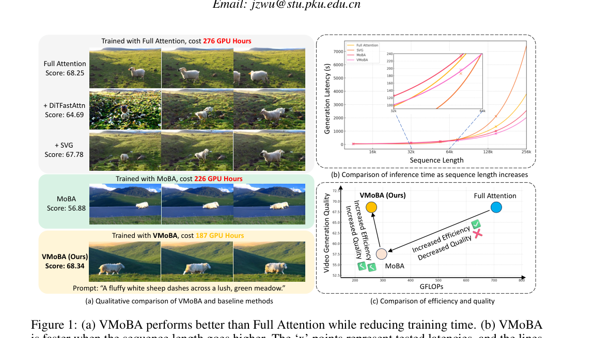
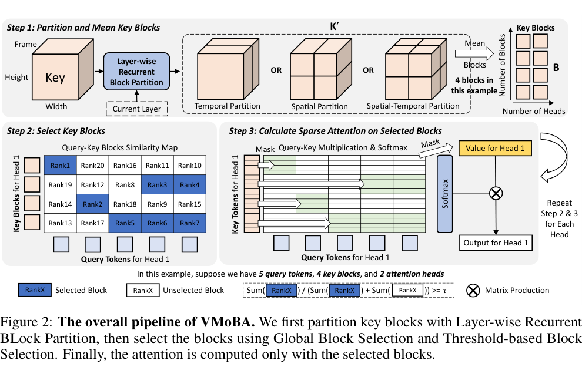
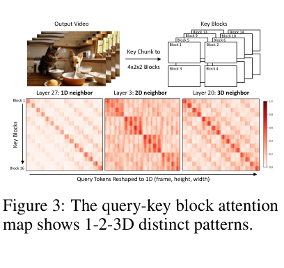

# VMoBA 精读分析

> [!info] 文档关系
> - 文档类型：Paper
> - 领域入口：[README](../README.md)
> - 上位汇总：[Multimodal custom attention](../surveys/multimodal-custom-attention.md)
> - 证据资产：`../assets/papers/vmoba/`
> - 相关文档：[Figure inventory](../evidence/figure-inventory.md)

> 资料状态：主证据是 `arXiv:2506.23858v1` 的 PDF、LaTeX source 和官方代码 commit `48aaccd4f14c5adb7db961058bfbb2113e392003`。OpenReview final PDF 元数据确认论文发表于 ICLR 2026，但论坛受 browser challenge、API 连接失败，本地未取得 final 全文与公开评审正文；版本差异和评审观点均按证据缺口处理。下方三张论文图均为 v1 PDF 重裁截图，完整 caption 与逐图 QA 见 [Figure inventory](../evidence/figure-inventory.md)。

## 修订信息

- 当前修订 ID：`rev-vmoba-affiliation-backfill-20260730`

- 当前文档版本：`1.0.1`
- 当前修订时间：`2026-07-30T23:30:00+08:00`
- 替代版本：`rev-vmoba-20260725-initial` / `1.0.0`

| 修订 ID | 文档版本 | 时间 | 修订者 | 类型 | 替代修订 | 迁移问题/解析 | 变更摘要 | 原因 | 影响位置 | 依据 | 对结论影响 |
|---|---|---|---|---|---|---|---|---|---|---|---|
| `rev-vmoba-20260725-initial` | `1.0.0` | `2026-07-25T13:30:48+08:00` | `delegated-paper-review-agent` | `initial` | 无 | 无；legacy workspace 仅含源材料，没有旧 analysis/deliverable manifest，不构成既有交付迁移 | 首次形成完整隔离评审 | `vmoba-a1` delegated remediation | `analysis.md` 与本工作区全部交付物 | task packet、arXiv v1 PDF/source、代码 commit、视觉 QA | material |
| `rev-vmoba-affiliation-backfill-20260730` | `1.0.1` | `2026-07-30T23:30:00+08:00` | `/root` | `metadata-update` | `rev-vmoba-20260725-initial` / `1.0.0` | 无 | 补充作者—机构元数据与角色证据边界 | 统一回填 affiliation 交付字段 | `作者与机构` | 论文 PDF 标题页、机构编号与角色脚注 | none：不改变方法、实验与归因结论 |

## 0. 资料与配图索引

- 论文：`paper.pdf`，SHA-256 `740467c521d0713191a0bf95fa98b6d1bdce61b8db01d8bf3057c0c37838f223`
- LaTeX：`source/arxiv_source.tar`；展开路径 `source/latex/`
- 提取文本：`extracted_text/full_text.clean.txt`（13 页）
- 代码：`code/VMoBA/`；remote `https://github.com/KlingAIResearch/VMoBA.git`；commit `48aaccd4f14c5adb7db961058bfbb2113e392003`
- OpenReview：过程侧公开评审记录；forum `oQaRElUdmh`，公开 notes/rebuttal/meta-review 被访问挑战阻断
- 论文图：Figure 1、2、3；bbox/caption/QA 见 [Figure inventory](../evidence/figure-inventory.md)
- AI 生成分析示意图：未生成。已安装 OpenRouter ICU CLI 仅支持 `generate/edit`，不支持主技能强制的 `responses-doc --input-file analysis.md` 文档输入；为避免由 prompt 摘要代替正文而引入失真，按协议跳过。

## 0.1 术语与符号解释

### 0.1.1 术语表

| 术语 | 本文含义 | 别名 | 不等于/易混项 | 证据来源 |
|---|---|---|---|---|
| VMoBA | 面向视频扩散 Transformer 的 mixture-of-block sparse self-attention；训练时完整方案由循环分块、head 内 global selection、阈值选块构成 | Video Mixture of Block Attention | 不是同名的 “mixture of blocks” 路由；也不等于训练免调实验使用的 local+top-k 变体 | §3；`source/latex/latex/3_method.tex` |
| Layer-wise Recurrent Block Partition | 层号按 3 循环选择 temporal 1D、spatial 2D、spatio-temporal 3D key block 排列 | 1-2-3D partition | “recurrent” 指跨层周期，并非 RNN 状态递归 | Eq. 1–2；§3.2；`code/VMoBA/src/vmoba.py:730-778` |
| Global Block Selection | 在一个 attention head 内，将所有 query×block 相似度置于同一池中分配选择预算 | query-global / head-global | 不等于每 query 独立 top-k；代码默认却是 `query_head`，需显式设 `head_global` 才匹配论文概念 | §3.3；Eq. 3；代码 `268-336,632-659` |
| Threshold-based Selection | 按归一化相似度累计质量达到阈值 $\tau$ 决定选择数量 | cumulative-similarity selection | 不是固定 top-k；论文公式写 $\hat S=q_i b_i^\top$，但代码实际用 min-max 归一化且强制 self chunk | §3.4；Eq. 4；代码 `268-336` |
| token sparsity | 表中报告为实际被稀疏 attention 保留/使用的比例语境（数值随 threshold 变化） | sparsity | 论文措辞可能让人误读为“被删除比例”；Table 3c 中 $\tau$ 增大时 sparsity 0.13→0.39，显示其更接近 attended density | §4.1、Table 3c |
| training-free VMoBA | 未微调模型上替换 attention 的推理实验配置 | inference variant | 附录 Table 4 明确使用 local+top-k，不是论文三创新的完整 global+threshold 组合 | Appendix A，`source/latex/latex/6_appendix.tex:48` |
| selected-block irregularity | 不同 query/head 选择数和块位置不规则，造成 FlashAttention 打包与内存访问不友好 | inconsistent memory distribution | FLOPs 下降不等同于 latency 下降 | Appendix D；代码 `moba_q_indices` / varlen 打包 `673-709` |
| VBench mean in Figure 1 | Figure 1 用多个选定 VBench 维度均值形成 68.25/68.34 等总览数 | video generation quality score | 不是完整 VBench 总分，也未报告方差/显著性 | Table 2；Figure 1 |

### 0.1.2 符号表

| 符号 | 含义 | 性质 | 作用域/索引 | 单位/取值 | 来源 | 易混点 |
|---|---|---|---|---|---|---|
| $Q,K,V$ | query/key/value 张量 | author-defined | 每层 self-attention | token×head×dim | §3.1 | 代码输入是展平后 `(S,H,D)` |
| $K'$ | 按 1D/2D/3D 重新排列后的 key | author-defined | 每层 | block×tokens-per-block | Eq. 1 | 只是 layout change，不是新投影 |
| $B$ / $b_i$ | mean key-block tensor / head $i$ 的 block representatives | author-defined | 每层、每 head | $N_b\times d$ | Eq. 2–3 | 代码变量为 `key_gate_weight` |
| $T,H,W$ | 视频 latent 的时间、高、宽 token 尺寸 | author-defined | 每样本 | token counts | Eq. 1–2 | $H$ 也常用于 head 数；本文分析用 $h$ 表 head 数消歧 |
| $N^T_{b_x},N^H_{b_x},N^W_{b_x}$ | partition $x$ 各轴 block 数 | author-defined | $x\in\{1,2,3\}$ | integer | Eq. 1–2 | 乘积才是某层 $N_b$ |
| $s^T_{b_x},s^H_{b_x},s^W_{b_x}$ | partition $x$ 各轴 block size | author-defined | partition-local | tokens | Eq. 1 | 与下文简写 $s_b$ 区分 |
| $l$ | layer index | author-defined | Transformer layer | integer，按 $l\bmod3$ | Eq. 1–2 | 周期相位由实现调用方决定；单文件未封装 layer scheduler |
| $s$ | sequence length | author-defined | 每 request | tokens（13K–76K 等） | §3.1 FLOPs | 不等于 sparsity |
| $d$ | 合并所有 heads 的 hidden dimension（复杂度推导）或每 head dim（Eq. 3） | author-defined | 公式依上下文 | channels | §3.1、Eq. 3 | 论文跨公式复用含义，需按上下文读取 |
| $N_b$ | key block 数 | author-defined | 每层 | integer | §3.1 | 1D/2D/3D 层不同 |
| $s_b$ | 平均/简化 block size | author-defined | complexity analysis | tokens/block | §3.1 | 实际各 partition 可不同 |
| $k_{\mathrm{avg}}$ | 每 query 平均选择 block 数 | author-defined | 层/批次平均 | blocks/query | §3.1 | threshold 下动态；不是固定 top-k |
| $M_i$ | head $i$ 的 query-block selection mask | author-defined | $N_b\times s$ | boolean | Eq. 3 | PDF 写 shape $(N_b,s)$，相似度乘积文字次序易混 |
| $h$ | attention head 数 | author-defined | layer | integer | §3.3 | 与视频高度 $H$ 区分 |
| $\hat S$ | query-block 相似度矩阵 | author-defined | 每 head | real score | Eq. 4 | 论文称 normalized similarity，但等式直接写 $q_ib_i^\top$；代码另做 min-max |
| $\tau$ | 累计相似度阈值 | author-defined | training config | 0.15–0.50，默认 0.25 | Eq. 4、Table 3c | 数值不是最终 sparsity |
| $k$ | 达到累计阈值的最小选择数 | author-defined | 每 head 的 global pool | integer | Eq. 4 | 代码选择包含 self chunk 后再移除 self branch |
| $\mathrm{EffectiveBandwidth}$ | 推导的有效带宽 | analysis-derived | kernel invocation | bytes/s | 本分析 §8 | 论文未报告 bytes moved/runtime，不能求数值 |
| $\mathrm{Utilization}$ | 有效带宽/峰值带宽 | analysis-derived | device/kernel | ratio | 本分析 §8 | H800 峰值与实际 IO 未提供，故仅公式 |

## 1. 论文基本信息

### 作者与机构

- 第一作者（首位列名）：Jianzong Wu → Peking University；Kling Team, Kuaishou Technology。
- 共同第一作者（仅含论文明确标注者）：论文未显式标注。
- 通讯作者/通讯联系人（仅含论文明确标注者）：论文未显式标注。
- 其他作者涉及的机构（去重列举，不作逐作者映射）：Peking University；Kling Team, Kuaishou Technology。
- 对应依据：论文 PDF 标题页、作者机构编号与角色脚注（核验日期：2026-07-30）。
- 边界说明：标题页的 * 未在可核验角色脚注中定义，故不据此扩展共同一作或通讯作者。

- 标题：*VMoBA: Mixture-of-Block Attention for Video Diffusion Models*
- 作者：arXiv v1 为 Jianzong Wu 等 8 人；OpenReview final PDF 搜索片段列 7 人且未列 Xin Tao，未取得 final 全文，故作者差异未决。
- 版本/venue：arXiv:2506.23858v1（2025-06-30）；ICLR 2026 conference paper（final PDF 元数据已核实）。
- 领域：Video Diffusion Transformer、native sparse attention、FlashAttention runtime。
- 目标：在 55K–76K token 级视频序列上降低训练/推理 attention 成本，并尽量保持 Full Attention 质量。
- 关键约束：Wan 2.1 1.3B、Koala-36M、训练 2000 steps、NVIDIA H800；未报告 H800 数量、节点拓扑、batch/global batch、功耗或方差。

## 2. 研究动机与问题—方案闭环

### 2.1 出发点与背景痛点

`author-stated`：视频分辨率、帧数上升使 latent token 数达到 33K–76K，全注意力的 $O(s^2d)$ 项成为长视频训练瓶颈。现有视频 sparse-attention 主要是 training-free 推理加速器；作者要解决的是“让 sparse attention 成为可原生训练的 VDM attention”，而不仅是推理时近似。

`author-stated`：直接把文本 MoBA 用到 Wan 2.1 训练，Figure 1 / Table 2 的 55K 实验把质量均值从 FullAttn 68.25 拉到 56.88，Dynamic 更从 61.58% 降到 5.80%。作者据此将问题定位为：一维均匀切块破坏视频的三维局部性；逐 query 固定 $k$ 无法分配不同 query 重要性；固定 $k$ 不能适应 head 间相似度集中程度。

### 2.2 现有方案为何不够

- Full Attention：保真但二次复杂度；55K 空间扩展训练用 276 GPU-hours。
- 原始 MoBA：1D flatten 后均匀 block mean 稀释空间/时空邻域；55K 下虽为 226 GPU-hours，但 Dynamic 几乎坍缩。
- SparseVideoGen：用 pilot attention 在线判别 spatial/temporal head；作者 Figure 1b 认为长序列 pilot overhead 可抵消收益。这里是作者归因，未提供把 pilot 单独计时的 ablation。
- 简单 uniform 3D partition：保留局部性但 block 总数较大，selection overhead 上升；1-2-3D 循环被用作表示/效率折中。

### 2.3 目标问题与成功标准

- 核心问题：如何把 MoBA 改造成适配视频 1D/2D/3D locality、query 重要性和 head concentration 的 native sparse attention。
- 成功标准：长序列训练 wall-clock 明显少于 FullAttn；FLOPs 降低；五个选定 VBench 维度不显著退化；训练免调时在 76K 上也应有 latency gain。
- 明确边界：短序列 latency 不保证改善；训练免调配置不是完整 VMoBA；没有证明同样收益适用于非 Wan 架构、不同数据集、不同硬件。

### 2.4 问题—方案映射

| 原始问题/失败模式 | 根因或约束 | 方案设计 | 改变的变量/行为 | 作用机制 | 预期优化 | 证据 | 判断 |
|---|---|---|---|---|---|---|---|
| MoBA 视频动态坍缩 | 1D block 打散 2D/3D 邻域 | 层间 1D→2D→3D 循环 partition | token-to-block layout、block count | 让局部 token 的 block mean 更有代表性，并用 1D/2D 层限制 block overhead | Dynamic/quality↑、selection FLOPs↓ | Fig. 3、Table 3a、Eq.1–2 | partially-supported：删去任一 pattern 有质量/时间变化，但无“只改 layout、相同成本”严格机制对照 |
| query 资源固定 | 不同 query 顶部相似度质量差异大 | head 内 global selection | 选择预算从每 query 固定变为跨 query 重分配 | 强 affinity query 可获得更多块 | quality↑ | Fig.4、Table 3b | supported in bundle：global+threshold 最好；global 单独贡献与 threshold 有交互 |
| head concentration 不同 | 固定 $k$ 对 diffuse head 过稀、concentrated head 过密 | cumulative threshold | 每 head 实际 $k$ 动态 | 以累计相似度质量控制保留量 | 质量/计算折中 | Fig.5、Table 3b–c | supported：有组合消融和 $\tau$ sensitivity；阈值归一化定义仍有 prose/equation/code差异 |
| sparse FLOPs 未转成 latency | selected indices 不规则、FlashAttention varlen packing overhead | 当前仅 FlashAttention-based 分支 | varlen sequences 与 index gather | 理论上只算 selected blocks，实践需足够长序列摊薄 overhead | latency↓ | Table 1–2、5；Appendix D | partial：55K/76K 加速，13K/33K 训练不加速或变慢 |

### 2.5 完整因果链与证据闭环

背景触发是视频 token 数导致二次 attention 成本；可观察痛点是 FullAttn 长序列训练昂贵，直接 MoBA 又造成动态质量坍缩。作者将根因拆成视频三维 locality 被 1D block 破坏、query affinity 不均和 head concentration 不均。方案分别用循环 1-2-3D layout、head 内 global selection 与累计阈值动态 $k$ 改变 token grouping 与 sparsity allocation；预期降低 block-selection/sparse-attention FLOPs且保留显著交互。55K/56K 训练结果确实给出 2.83×/2.92× FLOPs 及 1.48×/1.44× GPU-hours 加速，并在选定 VBench 维度上总体接近 FullAttn。

闭环不是完全因果识别：Table 3 支持组件必要性，但没有 FullAttn→partition-only→global-only→threshold-only 的完全 matched 预算链；没有随机种子/置信区间；训练免调的结果使用 local+top-k，不能验证 global+threshold；短序列还显示 kernel overhead 可吞掉 FLOPs 优势。因此总体判断为 **partially supported**：训练长序列主张较强，跨硬件、短序列和完整 VMoBA 推理主张较弱。

## 3. 核心贡献

1. `author-stated`：从 Wan 2.1 attention map 提炼 1/2/3D locality、query importance、head concentration 三类观察（Fig.3–5）。
2. `author-stated`：提出层间循环的 1D/2D/3D block partition，避免全层统一 3D 的 block-count overhead（Eq.1–2、Table 3a）。
3. `author-stated`：提出 head 内 global + threshold selection，使 sparsity budget 按 query/head 分布自适应（Eq.3–4、Table 3b–c）。
4. `supported with scope`：在 Wan 2.1 1.3B 的 55K/56K 训练上降低 FLOPs 和 GPU-hours，同时选定 VBench 指标总体接近 FullAttn（Table 2）。

## 4. 研究方法

### 4.1 方法总览

第一步按层号选择 temporal、spatial 或 spatio-temporal partition，对每个 key block 求均值得 $B$。第二步对每个 head 计算 $Q B^\top$，训练主配置在 head 内把所有 query-block score 放到同一 pool，并按累计阈值选择 mask。第三步只对被选 block 的原始 $K,V$ 做 exact softmax attention；代码把 self block 放在一条 FlashAttention 分支，额外 blocks 放到 varlen MoBA 分支，再用 log-sum-exp 合并。

### 4.2 组件级设计动机与证据

| 设计项 | why 状态 | 原文证据 | 具体问题 | 因果机制 | 替代/权衡 | 验证证据 | 判断 |
|---|---|---|---|---|---|---|---|
| key-block mean | inferred | §3.1、MoBA继承 | block-level routing 需低成本代表 | 以均值将 $s_b$ tokens 压成一个 routing key | max/learned router 更贵但可能更准确 | code + overall results，无独立消融 | plausible |
| 1-2-3D循环 partition | author-stated | §3.2、Fig.3、Eq.1–2 | 单一1D破坏视频邻域；全3D block数高 | 交替覆盖 temporal/spatial/3D locality | 动态 per-head pattern 更自适应但有 pilot cost | Table 3a direct removal | partially-supported |
| head 内 global selection | author-stated | §3.3、Fig.4、Eq.3 | 每 query 固定预算错配 | 在 query 间重分配 selected pairs | query-local更稳定/规则 | Table 3b replacement baseline | supported in training bundle |
| threshold selection | author-stated | §3.4、Fig.5、Eq.4 | head concentration不同 | 动态 $k$ 达到累计 score 质量 | fixed top-k 更规则、更适合当前 training-free | Table 3b、3c | supported with code-definition ambiguity |
| 首25% denoising steps保留 full attention | author-stated | §4.1 | 早期/特定 step sparse 可能不稳 | 对高敏感阶段不近似 | 降低最大加速比 | 无 VMoBA 专属消融 | plausible/unverified |
| FlashAttention varlen 实现 | author-stated/code-defined | §3.1；代码 `339-527,665-727` | irregular sparse pairs需可训练 kernel | 将 self 与 extra block exact attention 结果按 LSE 合并 | 专用 block-sparse kernel可能更快 | latency tables；无 kernel-only ablation | partially-supported |
| 训练免调 local+top-k 回退 | author-stated | Appendix A | global+threshold 引起 vibration | 更接近 FullAttn 的局部固定选择提高稳定性 | 放弃完整 VMoBA 自适应性 | Table 1；无 vibration 定量表 | plausible；直接限制推理归因 |

### 4.3 关键公式

复杂度：

$$
\mathcal{C}_{\text{select}}\approx O(sdN_b)=O(s^2d/s_b),\qquad
\mathcal{C}_{\text{sparse}}\approx O(sk_{\mathrm{avg}}s_bd),
$$

$$
\mathcal{C}_{\text{VMoBA}}\approx O\!\left(sd\left(\frac{s}{s_b}+k_{\mathrm{avg}}s_b\right)\right).
$$

该式揭示相反的 block-size 效应：$s_b$ 大会降低 routing block 数，却放大每个被选 block 的 exact attention 成本；最优点取决于 $k_{\mathrm{avg}}$ 随 $s_b$ 的变化，论文没有求闭式最优。

论文的 global mask 与 threshold：

$$
M_i=\operatorname{TopkMask}(q_i b_i^\top,k),
$$

$$
k=\min\left\{k'\mid\sum_{j=1}^{k'}\operatorname{Sorted}(\hat S_j)\ge\tau\right\}.
$$

严格说，Eq.4 少写了 $\hat S$ 的归一化分母，而正文称“normalized similarity”。代码 commit 对每 head 做 min-max，强制 self chunk，随后以 `self_norm/total_norm_sum` 抵扣阈值，再移除 self 交给独立分支（`src/vmoba.py:268-336,591-666`）。因此代码是一个具体化实现，但不是公式逐字直译。

### 4.4 实验设计与公平性

- 所有训练模型称使用相同 Koala-36M 数据、Wan 2.1 1.3B、2000 steps、H800。
- training-based FullAttn/MoBA/VMoBA 是可比训练；DiTFastAttn/SVG 仅施加到 tuned FullAttn，不能提供训练加速。
- 评估只选 VBench 五个方面，未给完整 VBench 维度、随机种子、误差条或人工盲评。
- FullAttn 和 sparse training 的 GPU-hours 可比较性仍依赖未报告的 GPU 数、batch、吞吐与故障/数据管线条件。
- Appendix C 从 scratch loss 对比只给曲线，没有数值表/统计；支持“46K更接近”，但不证明更大模型或更长序列必然占优。

## 5. 关键结论与技术点证据矩阵

### 5.1 主结果

- 55K spatial extension：VMoBA 248.68T vs FullAttn 705.02T，论文报告 2.83× FLOPs；187 vs 276 GPU-hours，1.48×；五指标简单均值 68.34 vs 68.25。
- 56K temporal extension：248.39T vs 724.97T，2.92× FLOPs；182 vs 262 GPU-hours，1.44×。ImageQual 67.66% vs 64.36%，绝对 +3.30 points，相对约 +5.13%；但 Dynamic 31.36% vs 43.01%，绝对 -11.65 points。
- 76K training-free：519.75T vs 1246.78T，2.40× FLOPs；300s vs 406s，1.35×；这是 local+top-k inference variant，而非完整 global+threshold。
- 13K：VMoBA FLOPs 1.67× 更低，但训练 103 vs 88 GPU-hours，即 0.86×（约 17.0% 更慢）。这是系统主张的重要反例。

### 5.2 技术点证据矩阵

| 技术点 | 声称收益 | 实验 | 受控性 | 指标变化 | 证据强度 | 结论 |
|---|---|---|---|---|---|---|
| 1-2-3D partition | 质量/效率平衡 | Table 3a | matched variants但删一维同时改变成本 | 1-2-3D IQ 67.45，2-3D 66.02且更慢202 vs187；1-3D DD低28.57 | direct ablation | partially supported |
| global selection | query预算自适应 | Table 3b | 与 threshold 2×2 factorial | topk+local→topk+global：SC +1.22，但 IQ -1.01；完整 interaction 最好 | replacement baseline | supported with interaction |
| threshold selection | head浓度自适应 | Table 3b/c | 2×2 + sensitivity | local下 SC +0.79；global下完整组合各指标最好；$\tau$增大时间162→378 | direct ablation/sensitivity | supported |
| FlashAttention sparse runtime | 把FLOPs变成加速 | Table1/2/5 | algorithm+runtime捆绑 | 55K 1.48×；76K 1.35×；13K 0.86× | confounded system evidence | length-dependent only |
| 首25% full attention | 稳定质量 | none | 无 | 无独立数据 | none | unverified |
| 训练免调完整 VMoBA | 推理加速且保真 | Table1表面相关，但Appendix改用local+top-k | 不匹配核心组件 | 76K 1.35× | confounded | 完整三组件推理主张未验证 |
| 长序列 from-scratch 可替代 FullAttn | loss接近 | Fig.7 | architecture仅attention变化，但无数值/方差 | 46K曲线视觉接近 | mechanism visualization | partially supported |

### 5.3 收益归因

| 组件/变化 | 对比 | 变化 | 影响路径 | 证据 |
|---|---|---|---|---|
| 1-2-3D vs 1-2D | Table3a | IQ +8.94、SC +8.60、时间 +11 | locality coverage↑，cost↑ | matched removal，直接但多维指标 |
| global added under top-k | topk+local→topk+global | DD +0.42、IQ -1.01、SC +1.22 | query allocation | 受控 replacement，收益混合 |
| threshold added under global | topk+global→threshold+global | DD +1.62、IQ +2.87、SC +1.86 | dynamic $k$ | 受控 replacement，直接 |
| VMoBA vs FullAttn 55K | Table2 | FLOPs -64.7%，GPU-hours -32.2%，mean +0.09 | algorithm+kernel+training | 整体受控，组件不可分 |

最后一行百分比为本分析由论文数值计算：$1-248.68/705.02=64.7\%$，$1-187/276=32.2\%$。不应把 32.2% wall-clock 节约等同于 64.7% attention/model FLOPs 节约。

## 6. Related Work 对比

| 类别 | 机制 | 优点 | 局限 | 与 VMoBA |
|---|---|---|---|---|
| MoBA | 1D chunk mean + per-query top-k | 原生可训练、可切换 sparse/full | 文本布局先验不适配视频 | VMoBA 的直接母体与主要 bridge baseline |
| NSA / Block-Attention | hardware-aligned/native block sparse | 关注原生训练与硬件 | 论文未在 Wan 上做直接实测 | Related Work 提及但主表缺失，比较覆盖有限 |
| DiTFastAttn / SVG / SpargeAttn / Sliding Tile | training-free inference sparse | 无需重训 | 训练加速有限；部分需 pilot或静态模式 | VMoBA训练目标不同；Table1/2只含前两者 |
| linear attention / SSM / RNN | 改写 attention 为线性复杂度 | 渐进复杂度更低 | 架构不可无缝替换、任务质量风险 | VMoBA 保持 exact attention on selected blocks |

公平性边界：论文主要证明相对 FullAttn、MoBA、DiTFastAttn、SVG 的结果，不能由 Related Work 段落推出优于 NSA/SpargeAttn/STA 等未实测方法。

## 7. OpenReview 公开评审 × 论文内容

- final PDF：`https://openreview.net/pdf?id=oQaRElUdmh`
- forum：`https://openreview.net/forum?id=oQaRElUdmh`
- 访问日期：2026-07-25
- 状态：ICLR 2026 published metadata 可得；review/meta-review/rebuttal/decision 正文 blocked by browser challenge/API failure。

| 来源 | claim/问题 | 论文/代码证据 | 状态 | 阅读影响 |
|---|---|---|---|---|
| 公开评审正文 | 不可取得，不能重构 reviewer 意见 | 过程侧公开评审记录 | unclear/blocked | 不把“无证据”写成“无担忧” |
| 本地证据替代核验 | training-free 并非 full VMoBA | Appendix A | unresolved by unavailable rebuttal | 明确收窄 inference 贡献 |
| 本地证据替代核验 | code speed-test 入口不可直接执行 | `src/vmoba.py:850` | unresolved by unavailable revision | 降低复现性判断 |
| final/arXiv 版本 | 作者列表片段不同，正文差分未知 | OpenReview PDF metadata vs v1 title page | unclear | 结论绑定 arXiv v1，venue元数据单列 |

## 8. Infra 需求分析

### 8.1 算力与显存

训练使用 Wan 2.1 1.3B 和 H800；代码依赖 PyTorch 2.4.1、CUDA 12.1、FlashAttention 2.6.3 wheel。论文没有 GPU 数或 global batch，故 GPU-hours 不能换算端到端吞吐。

routing 需暂存近似 $N_bhs$ 的 gate（代码 `(C,H,S)`，内部 `.float()`），其字节量可写为

$$
\mathrm{Bytes}_{gate}\approx 4N_bhs
$$

（fp32；不含 sort indices/masks）。对 head-global threshold，代码排序形状约 $h\times(N_bs)$，排序 workspace 和 index traffic 可能成为额外显存/带宽压力。论文未报告 peak memory，不能给实测节约。

### 8.2 Data types

| 对象 | 类型 | 阶段 | 硬件依赖 | 影响 | 证据 |
|---|---|---|---|---|---|
| Q/K/V test input | bf16 默认 | train speed test | CUDA/H800 tensor cores | 降存储与算力成本 | `src/vmoba.py:801` |
| routing block mean/gate | fp32 | selection | GPU FP32 + sort | 数值更稳但增加 gate 流量 | `src/vmoba.py:580-589` |
| mixed output accumulator | fp32→input dtype | forward | CUDA | LSE merge 稳定性/额外转换 | `src/vmoba.py:389,426` |
| indices/cu_seqlens | int32 | varlen packing | FlashAttention ABI | 支持 irregular sequences | `src/vmoba.py:685-709` |

论文没有 fp8/int8/量化；baseline 比较明确排除 cache/quantization tricks。

### 8.3 带宽、互联与利用率

$$
\mathrm{EffectiveBandwidth}=\frac{\mathrm{BytesMoved}}{\mathrm{RuntimeSeconds}},\qquad
\mathrm{Utilization}=\frac{\mathrm{EffectiveBandwidth}}{\mathrm{PeakBandwidth}}.
$$

作者未给 bytes moved、kernel breakdown、H800 峰值模式或 Nsight telemetry，无法求数值。代码路径包含 gathered KV、mask/index、sort、per-selected-block varlen attention 和 `index_add_`；这些会造成非连续读写。Appendix D 明确怀疑“不一致的 selected-block 内存分布”解释短序列 FLOPs 降低却不加速，说明瓶颈很可能从 dense compute 转为 gather/sort/launch/HBM locality。

多 GPU interconnect、all-reduce、NVLink/RDMA 均未描述；不能将 GPU-hours 差直接拆成 attention kernel、通信或数据管线贡献。

### 8.4 CPU/GPU/NPU 异构

| 阶段 | CPU | GPU | 数据移动/同步 | 潜在瓶颈 | 证据 |
|---|---|---|---|---|---|
| 数据/训练 orchestration | 未报告 | H800训练 | 未报告 | dataloader/host-device未知 | §4.1 |
| routing | Python发起 | mean、bmm、sort、mask | 多 kernel launch | sort/gather与短序列摊销 | code `579-666` |
| sparse attention | 无显式CPU fallback | FlashAttention varlen forward/backward | `torch.cuda.synchronize`仅测试 | irregular varlen/HBM locality | code `339-527,801-841` |
| NPU | 未报告 | 未提供NPU kernel | 不适用 | 无法主张可移植 | source/code缺失 |

### 8.5 Serving/runtime

代码不是完整 Wan training/serving pipeline，只提供单文件 attention 和 microbenchmark；没有 scheduler、batching policy、CUDA graph、KV cache、multi-tenant serving 或 checkpoint。它足以核对算法实现思想，不足以复现实验表或生产 SLA。

## 9. 开源代码对照

- commit：`48aaccd4f14c5adb7db961058bfbb2113e392003`
- 工作树：clean at inspection。

| 论文机制 | 本地路径 | pinned URL | 判断 |
|---|---|---|---|
| mean block keys + Q×B routing | `code/VMoBA/src/vmoba.py:579-590` | `https://github.com/KlingAIResearch/VMoBA/blob/48aaccd4f14c5adb7db961058bfbb2113e392003/src/vmoba.py#L579-L590` | 一致 |
| 1D/2D/3D layout | `.../vmoba.py:730-778` | `.../blob/48aaccd.../src/vmoba.py#L730-L778` | 部分一致：函数支持三类，但层间周期由外部调用方负责 |
| head-global threshold | `.../vmoba.py:268-336,649-660` | `.../blob/48aaccd.../src/vmoba.py#L268-L336` | 可实现；但 API 默认 `threshold_type='query_head'`，默认不等于论文 global pool |
| exact selected attention + LSE merge | `.../vmoba.py:339-527,665-727` | `.../blob/48aaccd.../src/vmoba.py#L339-L527` | 概念一致 |
| FLOPs script | `code/VMoBA/src/cal_theo_flops.py:87-250` | `.../blob/48aaccd.../src/cal_theo_flops.py#L87-L250` | 手工模型；用 average top-k/density近似，没有动态 sort成本 |
| speed test | `.../vmoba.py:801-850` | `.../blob/48aaccd.../src/vmoba.py#L801-L850` | 当前入口错误：向函数传不存在的 `qk_path`，README 命令不可直接跑 |

运行环境缺少 `torch` 与 `flash_attn`，未安装论文指定 CUDA wheel；同时静态检查已发现入口参数错误，所以未执行 GPU microbenchmark。仓库不含训练数据管线、Wan 集成、完整 configs、evaluation scripts 或 checkpoints；不存在可核验的 paper-specific weights metadata。

## 10. 优点、局限与改进

### 优点

- 动机观察与三组件设计一一对应，Table 3 提供较完整的 partition/global/threshold 消融。
- 训练目标区别于大量 training-free 方法，55K/56K 的实际 GPU-hours 改善有工程意义。
- 作者主动披露短序列反例、training-free 回退配置与当前 kernel 局限。

### 局限

- 训练免调结果不是完整 VMoBA，摘要“VMoBA exhibits … training-free inference”需按变体解释。
- VBench只取五维且无误差条/多随机种子；“superior quality”不稳健，例如56K Dynamic 明显低于 FullAttn。
- 只有 Wan 2.1 1.3B、Koala-36M、H800；没有跨模型/数据/硬件验证。
- FLOPs 与 latency 差距大；没有 kernel breakdown、peak memory、带宽利用率或分布式 telemetry。
- 代码快照是 attention microbenchmark，不是完整复现；默认 selection scope 与论文概念不一致，main 入口还有参数错误。
- OpenReview public reviews/rebuttal/final全文不可得，本分析无法判断 ICLR 修订是否解决上述问题。

### 建议的最小补充实验

1. 训练与推理分别做 `query-local/top-k`、`head-global/top-k`、`query-local/threshold`、`head-global/threshold` 的统一 latency-quality 2×2；
2. 同 token density 下比较 partition layout，隔离 layout 与 block-count；
3. 报告多随机种子完整 VBench、置信区间和人工盲评；
4. 给 Nsight kernel breakdown、HBM bytes/utilization、sort/gather占比和 peak memory；
5. 修复公开入口，发布 Wan integration/config/eval/checkpoint metadata；
6. 在 H100/A100 与另一 VDM 上验证长度 crossover。

## 11. 研究启发

- sparse attention 论文应把“mask质量”“selection算法”“kernel执行”分成三条证据链，避免 FLOPs、质量和 latency 混归因。
- 视频 attention 的 partition 可看作静态结构先验；后续可学习 layer/head 的 partition mixture，但必须把 router overhead 纳入。
- threshold 的关键不只是动态 $k$，而是归一化域；query、block、head-global 的不同 normalization 实际定义不同算法。
- 训练免调 vibration 表明稀疏 mask 的时间一致性可能比单 step similarity 更关键，可加入跨 denoising step 的 hysteresis/regularization。

## 12. 待验证清单

1. ICLR final 是否修改了 threshold 归一化定义、默认 selection scope 或训练免调表述？
2. 公开评审是否指出 training-free 变体与完整算法不一致，rebuttal 如何回应？
3. `head_global` 是否确为论文训练表使用的代码路径，还是训练内部版本未公开？
4. GPU-hours 使用几张 H800、何种 batch/parallelism，是否含评估与数据加载？
5. 五维均值 68.34/68.25 是否有统计显著性？
6. 56K Dynamic 退化是否来自 sparsity、训练预算或 VBench噪声？
7. irregular selection 的 crossover 能否由 kernel telemetry预测？
8. 从 scratch 46K loss 曲线在相同 wall-clock而非相同步数下是否仍重合？

## 13. 一句话总结

VMoBA 用视频结构化分块与自适应稀疏预算，把 MoBA 推进到长序列 VDM 原生训练，并在 55K/56K Wan 实验上给出可信的整体效率收益；最大不确定性是完整 global+threshold 方案并未由 training-free 结果验证，且公开代码、kernel telemetry、最终版本与 OpenReview 证据仍不足以支撑跨系统泛化。
