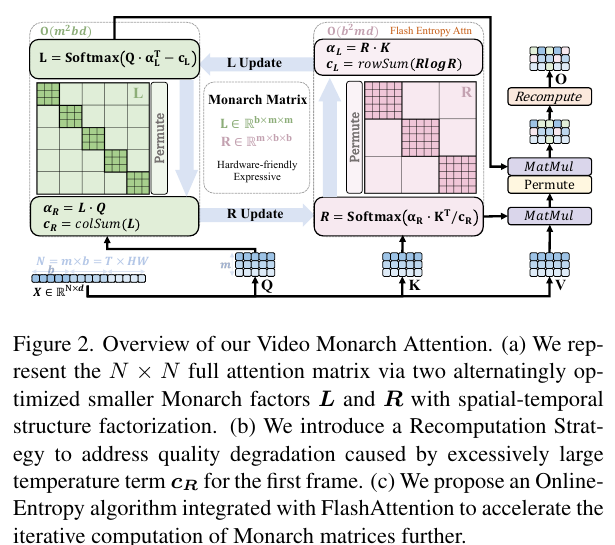
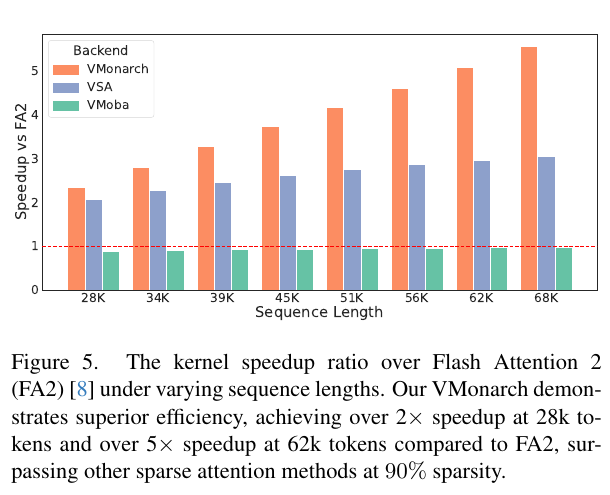

# VMonarch：用 Monarch 结构化矩阵加速视频扩散 Transformer

> [!info] 文档关系
> - 文档类型：Paper
> - 领域入口：[README](../README.md)
> - 上位汇总：[Video generation sparse attention](../surveys/video-generation-sparse-attention.md)
> - 证据资产：[assets/papers/vmonarch](../assets/papers/vmonarch/)

VMonarch 的关键价值不是“再做一次 90% 稀疏”，而是把视频注意力的时空块结构编码进可由稠密小矩阵乘法执行的 Monarch 因子：它用交替更新近似完整注意力，再用首帧全注意力重算修复注意力汇聚造成的过平滑，并把更新所需的熵统计融合进 FlashAttention。论文在多个 Wan 模型上显示了质量—效率折中，但“近似质量、算子速度、端到端收益”三者必须分开看：首帧重算和因子尺寸有消融，核函数有独立基准；而“结构化近似本身为何优于其他动态稀疏模式”的归因仍主要是间接证据。

## 修订信息

- 当前文档版本：`1.0.0`
- 当前 revision ID：`rev-vmonarch-r1`
- 修订模式：`initial`

| Revision ID | 版本 | 时间 | 类型 | Supersedes | 变更位置 | 原因/证据 | 对结论影响 |
|---|---|---|---|---|---|---|---|
| `rev-vmonarch-r1` | `1.0.0` | `2026-07-30T00:00:00+08:00` | `initial` | 不适用 | 全文与全部本地证据资产 | 基于 arXiv:2601.22275v1 PDF 的首次隔离精读 | 建立初始结论；source/code/OpenReview 未能外部核验 |

## 资料与图表清单

| 类型 | 本地位置 | 来源/版本 | 用途 | 状态 |
|---|---|---|---|---|
| PDF | `arXiv PDF` | arXiv:2601.22275v1，2026-01-29，17 页 | 主证据 | 可读，SHA-256 `be257c3e802f45829a06b507c0e108e6785e3bb46d1b9548087fce87b5b752ad` |
| 提取文本 | `extracted_text/paper.txt` | `pdftotext -layout` | 章节、公式、表格检索 | 可读 |
| Figure 2 | `../assets/papers/vmonarch/fig2-vmonarch-overview-caption.png` | PDF 第 4 页 | 方法/算法总览 | contact-sheet 与原分辨率逐图 QA 通过 |
| Figure 5 | `../assets/papers/vmonarch/fig5-kernel-speedup-caption.png` | PDF 第 8 页 | 核函数效率证据 | contact-sheet 与原分辨率逐图 QA 通过 |
| arXiv source | `source/` | 任务包提供 e-print URL | 源码级公式/图验证 | **受限**：网络获取被停止；不据此作源码声明 |
| 官方代码 | `code/` | 任务包为 `unknown` | 实现复核 | **不可用**：PDF 未提供仓库链接，且按上级指令停止外部查找 |
| OpenReview | 无 | 任务包为 `unknown` | 评审交叉核验 | **不适用/不可用**：arXiv-only，未给公开论坛 |

> 元数据注意：任务包标题写作 “VMonarch: Hardware-Efficient Structured Sparse Attention for Video Diffusion”，PDF 正式标题为 “VMonarch: Efficient Video Diffusion Transformers with Structured Attention”。本文以 PDF 标题为准。

## 1. 基本信息

- 标题：VMonarch: Efficient Video Diffusion Transformers with Structured Attention
- 作者：Cheng Liang、Haoxian Chen、Liang Hou、Qi Fan、Gangshan Wu、Xin Tao、Limin Wang
- 机构：南京大学、快手 Kling Team
- 版本：arXiv:2601.22275v1，2026-01-29
- 研究对象：Wan2.1-1.3B、Wan2.1-14B、Wan2.2-5B 视频扩散 Transformer
- 主要对照：FlashAttention-2 全注意力、VSA、VMoBA
- 证据边界：只核验 PDF 与本地渲染；没有官方代码、源码包、硬件环境复现或公开评审证据。

## 2. 研究动机与问题—方案闭环

视频扩散 Transformer 的 token 数随帧数和空间分辨率相乘增长。标准注意力要形成 $N\times N$ 关系，计算量为 $O(N^2d)$；论文引用 Wan-2.1 的观察称，当序列达到一百万 token 时，注意力可占总计算的 95%。固定稀疏模式虽然便于实现，却不能随内容变化；动态稀疏模式能适配输入，但索引管理和不规则访存会吃掉理论节省；线性注意力的低秩约束又可能不足以表达论文观察到的“高秩但稀疏”的视频注意力。

论文的核心判断是：视频注意力并非任意稀疏，而是带有强时空局部性和块对角结构，因此可用 Monarch 矩阵表达。Monarch 把大矩阵写成两个经置换连接的块对角因子，因子内部仍可用规则稠密 GEMM 计算。VMonarch 进一步把因子尺寸设为 $m=T$、$b=HW$，让一个因子主要表达跨帧关系、另一个因子主要表达帧内空间关系；通过少量交替更新生成输入相关的动态注意力近似。这样改变的关键变量是：从“不规则 token 对索引”转为“规则因子矩阵与置换”，目标是同时降低算术量与不规则访存开销。

但直接移植 MonarchAttention 会出现两个新问题。第一，视频首帧是后续帧的上下文锚点，累计注意力过大时，熵正则中的温度项 $c_R$ 也会过大，使首帧分布过平滑。论文选择只对首帧查询用完整注意力重算，以较小额外成本修复这一局部失败。第二，更新 $R$ 因子时需要注意力熵，若显式物化中间矩阵，长序列的 HBM 流量与存储开销很大；论文把在线熵统计加入 FlashAttention 的分块在线 softmax 中，一次遍历同时得到输出和熵。

| 环节 | 论文观察/目标 | 方案改变的变量 | 预期结果 | 测量证据 | 边界 |
|---|---|---|---|---|---|
| 背景痛点 | 全注意力随视频 token 数平方增长 | 避免显式 $N^2$ 注意力 | 长视频可扩展 | Table 1、Figure 5 | 只在所测 Wan 模型与 GPU 核上 |
| 现有稀疏不足 | 固定模式不适配；动态模式访存不规则 | 用结构化 Monarch 因子表示动态稀疏图 | 更规则的计算与更高有效速度 | Figure 5 与 Table 1 | 无与“同近似质量、同 FLOPs”的纯布局对照 |
| 时空映射 | 最优通用 $\sqrt N\times\sqrt N$ 分块会破坏视频结构 | $m=T,\ b=HW$ | 因子对应跨帧/帧内依赖 | Table 2、3 的 F1/F2 对照 | 因子语义是结构解释，不是可辨识分解 |
| 首帧失真 | attention sink 放大 $c_R$，首帧过平滑 | 首帧查询用全注意力重算 | 恢复首帧细节 | 首帧 PSNR 12.43→10.42（去掉重算时反向下降），SSIM 0.42→0.34；Table 2、3 | 增加 $O(bNd)$；只隔离首帧 |
| 熵更新瓶颈 | 显式熵统计导致数据移动与存储压力 | 在线维护最大值、归一化和、加权 logit 和 | 单遍稳定计算输出与熵 | Figure 5；附录 Figure 8 声称比 naive 约 8× | 没有代码与 profiler 细项可复核 |
| 成功标准 | 质量接近全注意力，同时显著减 FLOPs/时间 | 两次交替更新 + 微调 + 定制核 | 质量—效率折中 | Table 1：多模型 VBench；Figure 5：28K–68K 核速度 | 质量指标非统一领先，长时外推存在下降 |

### 2.1 现有方案为何不够：可观察场景

**固定或不规则动态稀疏。** 设一个 61 帧视频中，主体跨帧移动，但每帧背景大部分静止。固定窗口可能在主体跨块时漏掉关键 token；动态 top-k 能找回它，却需要为每个 query 生成、排序和搬运不同索引。简单地把稀疏率从 90% 降到 80% 会增加保留 token，既不能保证跨块主体被选中，也不能解决不规则访存。VMonarch 的替代路径是学习/更新规则的时空因子，而不是逐 query 存索引。这个场景是本文依据论文动机构造的说明例，不是论文实验。

**通用 Monarch 分块。** 若把两帧 token 塞进同一个 $b=2HW$ 因子，矩阵边界不再与单帧边界一致。论文报告这种设置会每两帧产生突变，微调后仍无法消失。仅增加训练步数无法修复“分块边界就是错的”这一结构根因；Table 2/3 的 F1 与 F2 对照提供直接但有限的证据。

**首帧汇聚。** 后续帧大量注意首帧时，首帧对应的 $c_R$ 累积过大，softmax 被拉平，细节消失。简单裁剪所有层/所有 token 的 $c_R$ 会同时改变其他位置，不能只修复受影响的首帧。论文实际同时使用 $c_R=0.1$ clamp，并以首帧全注意力重算局部兜底；因此最终改善不能只归因于单一数值技巧。

## 3. 术语与符号集中说明

### 3.1 术语

| 术语 | 论文中特定含义 | 来源 | 歧义/边界 |
|---|---|---|---|
| Monarch matrix | 经行置换的块秩一结构矩阵，可写为置换与块对角因子乘积 | Sec. 3.1 | “稀疏”是结构表达与计算复杂度意义，不等于显式 CSR 稀疏存储 |
| Video Monarch Attention / VMonarch | 将 MonarchAttention 的因子尺寸对齐视频 $T\times HW$，并加入首帧重算与在线熵核 | Sec. 3.2–3.4 | 论文有时将方法、注意力算子和整套微调模型混用 |
| alternating maximization | 固定 $L$ 更新 $R$，再固定 $R$ 更新 $L$ 的闭式交替过程 | Eq. 3–6 | 正文偶尔写 alternating minimization；优化目标写成 argmax，命名不一致 |
| attention sink | 视频首帧吸收后续帧过多注意力的现象 | Sec. 3.3, Fig. 3 | 论文把它与首帧 $c_R$ 过大相连，但未给跨层因果剖析 |
| recomputation | 仅对首帧 query $Q_0$ 与所有 $K,V$ 运行完整注意力 | Eq. 8 | 不是重算所有帧，也不是训练重算/activation checkpointing |
| online entropy | 在分块 online softmax 中同步维护 Shannon 熵统计 | Alg. 1、Appendix B | 不等于对模型输出做熵正则；它服务于 Monarch 因子更新 |
| F1/F2 | Monarch 因子 $b$ 覆盖 1 帧/2 帧 token | Table 2、3 | 这里的 F 不是 FLOPs，也不是 frame count 变量 $T$ |

### 3.2 符号

| 符号 | 含义/范围 | 来源 | 歧义/备注 |
|---|---|---|---|
| $T,H,W$ | 潜变量视频的时间、空间 token 维度 | Sec. 3.2 | 实验“61×448×832”是输入/视频分辨率表述，实际 latent token 数需模型下采样比 |
| $N=THW$ | 总 token 数 | Sec. 3.2 | 不含 batch/head 维 |
| $d$ | 单头 query/key/value 特征维 | Eq. 7、8 | 论文未在主表列具体值 |
| $A$ | 变分 softmax 中候选的行随机注意力矩阵 | Eq. 1 | 加入 Monarch 结构约束后是近似对象 |
| $H(A)$ | 注意力矩阵逐行 Shannon 熵 | Eq. 1 | 与模型输出熵不同 |
| $m,b$ | Monarch 因子尺寸，默认 $m=T,b=HW$ | Sec. 3.2 | $N=mb$ |
| $t$ | 交替更新次数，默认 2 | Sec. 3.2、4.4 | 与扩散 timestep 不同 |
| $Q,K,V,O$ | 注意力查询、键、值、输出，均以 $N\times d$ 表示 | Eq. 7 | 省略 batch/head |
| $L,R$ | 两个 Monarch 因子 | Eq. 2–7 | 正文关于张量形状的排版存在转置/维度表述歧义，以 Fig. 2 为准 |
| $c_L,c_R$ | 交替更新中的熵/归一化相关项 | Eq. 3–6 | $c_R$ 同时被称为温度 adjustment term |
| $\alpha_L,\alpha_R$ | 为更新 $L,R$ 缓存的 Q/K 加权统计 | Eq. 3–6 | 不是 FlashAttention 在线缩放因子 $\alpha$ |
| $m_i,S_i,L_i$ | online softmax/entropy 的运行最大值、归一化和、加权 logit 和 | Appendix B Eq. 9–17 | $L_i$ 与 Monarch 因子 $L$ 同字母，需按章节区分 |
| AQ/BC/DD/IQ/SC | VBench 的美学、背景一致性、动态程度、成像质量、主体一致性 | Table 1 | 单指标提升不代表总体质量绝对提升 |

## 4. 方法与公式

*Figure 2（原论文图，PDF crop）：输入 $Q,K,V$ 经时空对齐的 Monarch 因子交替更新，随后做首帧重算；右上角把熵更新融合进注意力核。该图已作为读者可用的算法总览，非 AI 生成图。*

执行顺序可读为：

1. 把 $Q,K,V\in\mathbb{R}^{N\times d}$ reshape 成 $m\times b\times d$，默认 $m=T,b=HW$。
2. 固定一侧因子，用闭式 softmax 更新另一侧；默认交替两轮。
3. 只在最后一轮把 $L,R$ 写回，并经置换完成 $LRV$。
4. 对首帧 query 单独运行完整注意力，替换首帧输出。
5. 实现层面用 online-entropy FlashAttention 计算更新 $R$ 所需输出与熵统计。

### 4.1 注意力作为熵正则优化

$$
\sigma(QK^\top)=\arg\max_{A\in\Delta_{N\times N}}
\langle A,QK^\top\rangle+H(A).
$$

**这条公式在算什么？** 它把逐行 softmax 重写为“在所有行随机矩阵中选择得分最高且不过度尖锐的注意力矩阵”。

**怎么读？** $A$ 既要与 $QK^\top$ 的相似度一致，又因 Shannon 熵 $H(A)$ 获得平滑约束。

**输入与输出。** 输入是 logits $QK^\top$；输出是行和为 1 的注意力矩阵 $A$。

**变量在这里各做什么？** $\Delta$ 限制每行是概率分布；内积项奖励高相似度；熵项避免所有概率过早坍缩到一个位置。

**直觉。** logits 差距增大时，相似度项推动分布更尖；熵项抵消过度尖锐。VMonarch 再把 $A$ 限制为 Monarch 结构，从而把不可承受的大矩阵优化变成两个小因子的交替更新。

**边界。** 这是 softmax 的变分表示；加入 Monarch 结构后得到近似而非恒等式，且迭代次数有限。

**小例子。** 两个 logits 都为 0 时，最大熵解为 $(0.5,0.5)$；若一个明显更大，解向该位置偏移。

### 4.2 时空 Monarch 复杂度

$$
C_{\mathrm{VM}}=O\!\left(tN(m+b)d\right)
=O\!\left(tN(T+HW)d\right),
\qquad
\frac{C_{\mathrm{full}}}{C_{\mathrm{VM}}}
\approx \frac{THW}{t(T+HW)}\approx\frac{T}{t}.
$$

**这条公式在算什么？** 它估计交替更新两个因子的总算术量，以及相对 $O(N^2d)$ 全注意力的理论倍数。

**怎么读？** 不再让每个 token 与全部 $N$ token 相乘，而是分别在时间尺寸 $T$ 和单帧空间尺寸 $HW$ 上做规则小矩阵计算。

**输入与输出。** 输入是 $T,H,W,d,t$；输出是数量级复杂度和理想加速比。

**变量在这里各做什么？** $t$ 线性增加迭代成本；$T+HW$ 是两个因子的边长贡献；$N=THW$。

**直觉。** 当 $HW\gg T$ 时，复杂度主项约为 $tN(HW)d$，与全注意力 $N(THW)d$ 相比约省 $T/t$ 倍。

**边界。** 这是算术量，不含 permutation、核启动、首帧重算、HBM 流量和并行利用率；因此不能直接等同于 wall-clock speedup。

**小例子。** 若 latent 时间长度 $T=32$、迭代 $t=2$ 且 $HW\gg32$，理想量级约为 16×；论文 Figure 1 对约 118K token 报告 17.5× 自注意力 FLOPs 降幅，但实际 kernel 速度在 Figure 5 中随长度约 2×–5×以上。

### 4.3 首帧重算

$$
O_0=\operatorname{softmax}\!\left(\frac{Q_0K^\top}{\sqrt d}\right)V.
$$

**这条公式在算什么？** 它只为第一帧 query 重新计算完整注意力输出。

**怎么读？** 第一帧的每个 query 重新查看所有帧的键和值，不再使用 Monarch 近似结果。

**输入与输出。** 输入为首帧 $Q_0$、全序列 $K,V$；输出为替换后的首帧 $O_0$。

**变量在这里各做什么？** $\sqrt d$ 控制 logits 尺度；$Q_0$ 将额外成本限定在一帧。

**直觉。** 这相当于给最易受 attention sink 影响的位置安装精确兜底，而不把全序列退回二次复杂度。

**边界。** 成本为 $O(bNd)$；它修复首帧而非证明其余帧近似无误。论文同时 clamp $c_R$，所以重算消融只隔离“有/无重算”的组合效果。

**小例子。** 论文报告首帧 PSNR/SSIM：使用重算为 12.43/0.42，不使用为 10.42/0.34。

### 4.4 在线熵更新

最终熵可由 online softmax 的统计量写成：

$$
H(p)=\log S_N-\frac{1}{S_N}\sum_{j=1}^{N}e^{x_j-m_N}(x_j-m_N).
$$

**这条公式在算什么？** 它用运行最大值 $m_N$、归一化和 $S_N$ 与加权 logit 和计算 softmax 概率的 Shannon 熵，无需保存整行概率。

**怎么读？** 在线 softmax 已经维护“最大值”和“指数和”；再多维护一个加权和，就能在同一遍扫描得到熵。

**输入与输出。** 输入为分块到达的 logits $x_j$；输出为该行 softmax 熵。

**变量在这里各做什么？** $m_N$ 防止指数溢出，$S_N$ 是平移后的 softmax 分母，求和项记录概率加权的中心化 logit。

**直觉。** 新块带来更大最大值时，旧统计按 $e^{m_{\mathrm{old}}-m_{\mathrm{new}}}$ 重缩放；所以既稳定又不必回看旧块。

**边界。** 附录称反向传播不穿过熵，因为熵梯度可能压倒注意力梯度；这限制了它作为可学习熵目标的解释。无代码，无法核验累加精度、tile 尺寸与寄存器压力。

**小例子。** 若两个 logits 相等，熵为 $\log2$；若一项远大于另一项，熵趋近 0。

## 5. 组件设计依据矩阵

| 核心设计 | 依据状态/来源 | 具体问题 | 因果机制 | 替代与代价 | 验证判断 |
|---|---|---|---|---|---|
| Monarch 动态结构近似 | 作者明确，Sec. 1/3.1 | 全注意力二次复杂度；无结构动态稀疏不规则 | 两个块因子经置换表示动态高秩稀疏图 | 固定窗口更简单但不适配；线性注意力更低复杂度但低秩 | 质量与效率均有主表，但没有严格同预算结构替换，证据间接 |
| $m=T,b=HW$ | 作者明确，Sec. 3.2 | 通用因子尺寸破坏帧边界 | 因子边界与时间/帧内空间对齐 | $b=2HW$ 可能捕获两帧块但出现周期突变 | Table 2/3 为直接消融；支持结构对齐必要性 |
| 默认 $t=2$ | 作者明确，Sec. 4.4 | 单次近似不足，多次成本高且收益饱和 | 多轮交替提高拟合能力 | $t=1$ 更快；$t=3,5,7$ 更贵 | Table 2/3 直接比较，但 VBench 指标不单调；“最优平衡”含主观权衡 |
| 首帧完整重算 | 作者明确，Sec. 3.3 | 首帧 sink 放大 $c_R$、过平滑 | 对最脆弱 query 恢复精确全注意力 | 全序列重算消除收益；attention-sink averaging 收敛较差 | Table 2/3 与首帧 PSNR/SSIM 直接支持 |
| $c_R$ clamp 到 0.1 | 作者明确实施，Sec. 4.1；动机部分推断 | 数值/温度不稳定 | 限制极端温度项 | 自适应阈值或分层阈值未测 | 无独立消融，无法隔离贡献 |
| online-entropy FlashAttention | 作者明确，Sec. 3.4/Appendix B/F | 显式熵造成 HBM 流量与长序列内存压力 | 同一 tile 扫描维护输出和熵统计 | 单独两遍计算更易实现但多搬数据 | 附录 Figure 8 的 naive 对照与 Figure 5 支持算子收益；无代码复核 |
| 只在最后迭代写 $L,R$ | 作者明确，Sec. 3.1 Implementation | 中间因子写回造成数据移动 | 循环中只保留 $\alpha,c$ 统计 | 更高片上存储/寄存器压力 | 无独立 ablation 或 profiler，机制合理但未隔离 |
| 1500/800 步微调 | 作者明确，Sec. 4.1 | training-free 动态程度明显下降 | 使 DiT 适配新注意力归纳偏置 | 更长训练或蒸馏可能更好但成本更高 | training-free 与 tuned 均有数据，但训练预算公平性只按文中设置 |

## 6. 技术主张—证据矩阵与收益归因

| 技术主张 | 证据 | 类型 | 结论 |
|---|---|---|---|
| VMonarch 可在高稀疏下保持接近全注意力质量 | Table 1，多模型 VBench | 直接主结果，但多指标 | 大体成立；不是所有 AQ/DD/IQ 都领先，不能概括为无损 |
| 时空对齐因子优于跨两帧因子 | Table 2/3，F1 vs F2 | 直接消融 | 支持；F2 偶有指标更高，但有周期伪影与更高验证损失 |
| 首帧重算修复首帧质量 | Table 2/3 + 首帧 PSNR/SSIM | 直接消融 | 强证据；但与 $c_R$ clamp 的交互未拆开 |
| 两次迭代是最好折中 | Table 2/3 | 直接但多目标 | 成立于作者权衡；质量指标不单调，非全局最优 |
| 在线熵核带来约 8× 相对 naive 加速 | Appendix Fig. 8、Sec. F | 算子对照 | 论文报告支持；无实现/硬件复核 |
| 28K 起 >2×、62K >5× FA2 kernel speedup | Figure 5 | 直接系统基准 | 在论文设置下成立；图未给误差条与硬件细节于主 caption |
| 17.5× attention FLOPs reduction | Fig. 1 与复杂度估计 | 理论/估计 | 是算术量，不是运行时间 |
| 结构化布局比 VSA/VMoBA 更硬件友好 | Figure 5 + Table 1 runtime | 间接/多项同时变化 | 机制上说得通，但近似方式、稀疏率与核实现同时变化，无法单独归因 |

### 6.1 近似质量、算子收益、端到端收益必须分开

- **近似质量。** training-free 的 VM-T2-F1 在 Table 2 上 PSNR 12.59、SSIM 0.43；比 T1/T3 更均衡，但 DD 54.17 仍低于 Softmax 69.44。微调后质量恢复更多，说明收益部分来自适配训练。
- **算子收益。** Figure 5 是 attention kernel 对 FA2 的速度比，随序列从 28K 到 68K 由约 2.3× 增至约 5.6×；这是最直接的 operator evidence。
- **端到端收益。** Table 1 的 Wan2.1-1.3B 61×448×832 上，全注意力 63.4s，VMonarch 47.7s，约 1.33× 端到端；TFLOPs 从 159.7 到 75.4，约 2.12×。kernel 速度不会一比一转化为总推理速度，因为其他 DiT 模块与重算仍在。
- **长时外推。** 141×448×832 上 VMonarch 102.7s，对全注意力 214.2s 为 2.09×；但 AQ/SC 分别 60.45/88.86，低于全注意力 64.27/92.63。这说明更长序列速度收益增强，同时质量外推边界也更明显。

*Figure 5（原论文图，PDF crop）：在 28K–68K token 的 kernel 基准中，VMonarch 相对 FA2 的加速随长度增长；VMoBA 在图中约低于 1×。该图只证明所测 kernel/backend 的速度，不直接证明端到端同比例加速。*

## 7. 实验与证据闭环

### 7.1 主结果

Table 1 覆盖 1.3B、14B、5B 三种 Wan 模型与多个分辨率。以 Wan2.2-5B 93×704×1280 为例，VMonarch 的推理时间 92.0s，快于 VSA 的 103.0s 和全注意力的 123.7s；IQ 66.69 高于全注意力 65.44，但 DD 59.72 低于 62.50。Wan2.1-14B 上 VMonarch 969.2s，与 VSA 970.9s 几乎相当，但远快于全注意力 2222.2s；质量仍是逐指标混合结果。

### 7.2 消融

- 迭代数：training-free 从 T1 到 T2 明显改善 DD（16.67→54.17），T3 为 50.00；微调表中增加到 5/7 次并未稳定提升指标。
- 因子尺寸：F2 在某些 VBench 指标略有提升，却产生两帧周期伪影且验证损失更高；这说明平均指标不能替代时间连续性检查。
- 首帧重算：去掉后 training-free PSNR/SSIM 从 12.59/0.43 降至 11.65/0.40；微调后主体一致性由 93.29 降至 87.36。单独首帧统计进一步给出 12.43/0.42 对 10.42/0.34。

### 7.3 明确的证据闭环

动机“二次注意力过贵” → 机制“结构化因子把 $N^2$ 变为 $tN(T+HW)$” → 系统测量“Figure 5 kernel >2× 至 >5×” → 端到端“Table 1 约 1.3×–2.1×” → 限制“核收益受非注意力模块稀释，且长时外推部分质量指标下降”。

动机“首帧 sink 导致过平滑” → 机制“首帧精确重算” → 测量“PSNR/SSIM 与 VBench 消融下降” → 结论“重算确实有用” → 限制“未与 $c_R$ clamp 做二因素消融，不能完全确定根因量级”。

## 8. 相关工作对比

| 类别 | 机制 | 优点 | 局限 | 与 VMonarch 的关系 |
|---|---|---|---|---|
| 固定稀疏 | local/strided/vertical-slash 等预设模式 | 简单、规则 | 不随视频内容变化 | VMonarch 保留规则计算但动态更新因子 |
| 动态块稀疏（VSA/VMoBA 等） | top-k/top-p 或路由块 | 内容自适应 | 索引与不规则访存开销 | 主表对照，但稀疏率/核/近似质量并非完全匹配 |
| 线性注意力 | kernel/低秩分解 | 线性复杂度 | 论文认为高秩视频注意力表达不足 | Monarch 是结构化稀疏/高表达折中 |
| MonarchAttention | 两个 Monarch 因子交替更新 | 结构化、动态、GEMM 友好 | 未针对视频时空边界、首帧 sink 与长序列熵更新 | VMonarch 的直接基础 |
| 混合 sparse-linear | 稀疏局部 + 低秩全局 | 可提高稀疏率 | 两套路径与训练更复杂 | 论文未与同预算混合方法做充分直接比较 |

## 9. 基础设施与实现含义

### 9.1 计算与显存

完整注意力 logits/概率的朴素存储为 $O(N^2)$；VMonarch 的两个因子规模数量级为 $mb^2+bm^2=N(m+b)$。若元素字节数为 $s$：

$$
\mathrm{FactorBytes}\approx sN(m+b),\qquad
\mathrm{FullMapBytes}\approx sN^2.
$$

论文的实现说明是循环中仅保留 $\alpha_L,c_L,\alpha_R,c_R$，只在最后迭代写出 $L,R$，进一步减少 HBM 往返。但没有代码和峰值显存表，不能给出真实 allocator 峰值。

### 9.2 数据类型与数值稳定性

PDF 没有在主实验中明确列出 FP16/BF16/FP32 的权重、激活和累加精度；因此不能把速度归因于某种低精度格式。可确认的稳定性措施是 online softmax 的运行最大值，以及实验中将 $c_R$ clamp 到 0.1。在线统计最可能需要较高精度累加是工程推断，不是论文已核验事实。

### 9.3 带宽与 kernel

有效带宽应按

$$
\mathrm{BW}_{\mathrm{eff}}=\frac{\mathrm{BytesMoved}}{\mathrm{Runtime}},
\qquad
\mathrm{Utilization}=\frac{\mathrm{BW}_{\mathrm{eff}}}{\mathrm{PeakBW}}
$$

评估。VMonarch 通过融合 softmax 输出与熵、片上保存中间统计、避免每轮写 $L/R$ 来减少 `BytesMoved`。论文没有公布实际字节数、HBM 峰值带宽或利用率，因而只能判断“意图是降低 HBM 流量”，不能断言达到了某个带宽百分比。

### 9.4 并行与异构

大模型实验使用 sequence parallelism 8；这说明长序列会跨 GPU 切分，但 PDF 未给 all-to-all/all-reduce 通信量、NVLink/RDMA 拓扑或重叠策略。方法核心是 GPU 定制核，未描述 CPU/NPU 路径、host-device 预处理、NPU fallback 或异构调度。对非 CUDA 后端的可移植性未知。

### 9.5 代码复核状态

PDF 附录 Figure 6 给出 Python-like pseudocode，并非可执行官方仓库。任务包没有代码 URL，外部获取按上级指令停止。因此无法核验：

- kernel tile 尺寸、warp 划分、累加精度与 backward 实现；
- permutation 是否显式物化；
- sequence parallel 通信；
- Figure 5 的设备型号、编译选项与计时协议的完整配置；
- checkpoint/config 中是否所有 attention layer 都替换为 VMonarch。

所有实现级判断均限于 PDF Sec. 3、Appendix A/B/F。

## 10. OpenReview 交叉核验

未提供且未发现可用的公开 OpenReview URL；任务包标注 `unknown`，论文状态为 arXiv 2026。按上级指令未继续外部查询，因此无法核验 reviewer、meta-review、decision 或 rebuttal。该限制不影响对 PDF 公式与表格的读取，但降低了对新颖性、baseline 公平性和复现问题的外部交叉验证强度。

## 11. 优点、局限与可改进方向

### 优点

- 把“动态稀疏”和“规则硬件执行”放进同一结构表示，而不只是提高稀疏率。
- $m=T,b=HW$、首帧重算、在线熵分别对应结构、质量、系统三个明确问题。
- 同时报告 training-free、微调、跨模型、空间/时间外推、kernel 与端到端指标。
- 首帧重算与因子尺寸有可操作的消融，而不是只给总体速度。

### 局限

- 方法效果与 800/1500 步微调耦合；training-free 的 Dynamic Degree 明显下降。
- 结构近似、稀疏率、定制核同时变化，缺少同 FLOPs/同近似误差的布局对照，硬件收益归因不完全隔离。
- 长时外推虽更快，但 AQ/SC 等指标出现明显下降，不能概括为“质量不变”。
- $c_R$ clamp、首帧重算和在线熵之间缺少完整二因素/三因素消融。
- 无代码、硬件 profiler、带宽利用率、峰值显存与通信细节，复现性受限。
- 论文交替过程有 “minimization/maximization” 命名不一致；因子张量形状的排版也有歧义。
- VBench 仅抽取五个维度，且多指标权衡，没有单一统计检验或置信区间。

### 可改进

- 在固定近似误差或固定 VBench 质量下比较 VMonarch、VSA、VMoBA 的 kernel 与 HBM 流量。
- 做 `$c_R$ clamp × recomputation × entropy-backward` 因子化消融。
- 报告每层 attention sink、近似误差和重算收益，探索分层因子与自适应重算。
- 公布可执行 kernel、设备/编译配置、Nsight 指标、峰值显存和 sequence-parallel 通信量。
- 对长时外推增加时间一致性、运动幅度和人工偏好评测，并报告方差。

## 12. 研究启发与待验证问题

1. Monarch 因子是否真的对应可解释的“时间”和“空间”关系，还是只因边界对齐而更易优化？
2. 若每层的 attention sink 强度不同，统一首帧重算是否浪费计算？
3. 能否根据在线熵或残差误差动态选择迭代数 $t$，而非固定两轮？
4. 在线熵融合对寄存器占用和 occupancy 的真实影响是什么？
5. Figure 5 的提升有多少来自结构化布局，有多少来自特定定制核？
6. 与同样使用规则块 GEMM、相同理论 FLOPs 的动态稀疏基线相比是否仍领先？
7. 在 141 帧外推中，速度提高但 AQ/SC 下降的根因是近似误差累积、训练长度不足，还是首帧锚点过强？
8. 反向不穿过熵会怎样影响微调收敛与最终因子？
9. 首帧精确重算能否推广为“少数高汇聚帧自适应重算”？

## 13. 一句话总结

VMonarch 通过时空对齐的 Monarch 因子、首帧精确兜底和在线熵 FlashAttention，把视频动态稀疏注意力转成更规则的 GPU 计算，并在论文基准上取得显著 kernel 与端到端收益；最大不确定性是缺少代码与同预算受控对照，使结构近似、核工程和微调各自贡献仍不能完全拆分。
