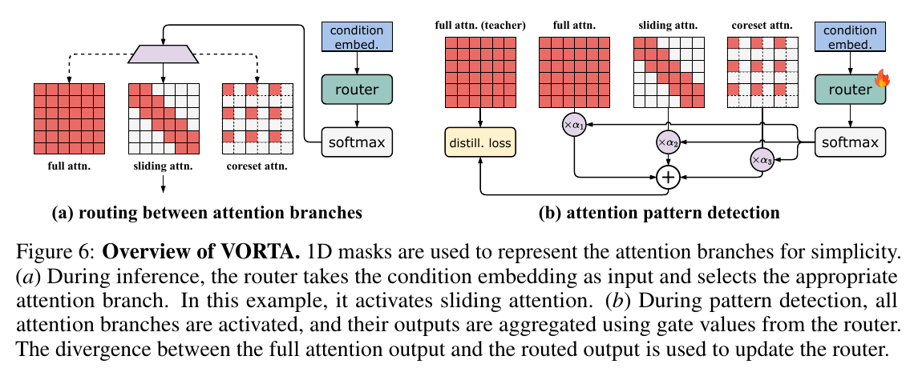
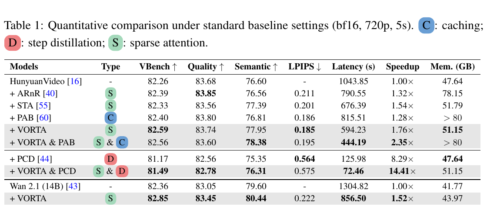

# VORTA: Efficient Video Diffusion via Routing Sparse Attention 精读分析

> [!info] 文档关系
> - 文档类型：Paper
> - 领域入口：[README](../README.md)
> - 上位汇总：[Video generation sparse attention](../surveys/video-generation-sparse-attention.md)
> - 证据资产：[assets/papers/vorta](../assets/papers/vorta/)

> 资料状态：主证据为 arXiv 2505.18809v2 的 20 页 PDF；正文与附录可读。Figure 6 与 Table 1 是 200 DPI PDF 页面裁剪，均保留完整 caption。按父任务指令不再联网，LaTeX source、代码仓库和 OpenReview 公开材料未核验，因此实现细节仅能按论文陈述，不能视为代码确认。

VORTA 的核心不是“把所有注意力都改成同一种稀疏模式”，而是把视频扩散 Transformer 中随层、头和去噪步变化的注意力分成局部、长程和不可安全近似的关键模式，并让一个仅看 timestep embedding 的轻量 router 在完整注意力、滑动块注意力和 core-set 注意力之间做硬选择。论文在 HunyuanVideo 上报告采样延迟从 1043.85 秒降至 594.23 秒，即 1.76 倍加速，同时 VBench 从 82.26 到 82.59；但这些数字来自论文自己的实验，代码与运行环境未独立复现。

## 修订信息

- 当前文档版本：`1.0.0`
- 当前修订 ID：`rev-vorta-initial`
- 当前修订时间：`2026-07-30T13:38:35+08:00`
- 替代版本：无；这是初始交付

| 修订 ID | 文档版本 | 时间 | 修订者 | 类型 | 替代修订 | 迁移问题/解析 | 变更摘要 | 原因 | 影响位置 | 依据 | 对结论影响 |
|---|---|---|---|---|---|---|---|---|---|---|---|
| `rev-vorta-initial` | `1.0.0` | `2026-07-30T13:38:35+08:00` | `review_vorta` | `initial` | 无 | 无 | 创建单篇精读、两张证据图、公式解释、设计动机与系统分析 | 初始交付 | `本文`、`Figure inventory`、`figures/` | arXiv 2505.18809v2 PDF、任务包验证问题 | `material` |

## 0. 资料与配图索引

- 论文：`arXiv PDF`，SHA-256 `4f9949cc68e478233e0ff8d59ccd33adff7e2e32a15d8aba19cbecccf0ca1053`。
- 提取文本：`paper.txt`，由 `pdftotext -layout` 从 PDF 提取。
- 源码/LaTeX：未获取；父任务明确要求停止网络，记录为 limitation。
- 开源代码：论文首页声明 `https://github.com/wenhao728/VORTA`，但本次未联网克隆，commit 与实现路径不可核验。
- OpenReview：未核验；任务包为 `unknown`，父任务要求停止网络。
- 机制图：`../assets/papers/vorta/fig6-vorta-overview-caption.png`，PDF 第 6 页，Figure 6。
- 结果/系统图：`../assets/papers/vorta/table1-main-results-caption.png`，PDF 第 7 页，Table 1。
- Contact sheet：`figures/contact-sheet.png`。
- AI 生成图：未生成；论文 Figure 6 已提供可读的输入、训练检测、推理路由、分支与输出关系总览。

## 0.1 术语与符号解释

### 0.1.1 术语表

| 术语 | 本文含义 | 别名 | 不等于/易混项 | 证据来源 |
|---|---|---|---|---|
| VDiT | 对时空 latent token 做 3D self-attention 的视频扩散 Transformer | Video Diffusion Transformer | 不是自回归视频模型 | Section 2 |
| sliding tile attention | 把局部滑动窗口对齐到块中心，形成块内稠密、块间稀疏的 3D tile layout | sliding attention | 不是任意非结构化 mask；推理阶段由 FlexAttention 执行 | Section 3.2、Figure 4、Appendix A.1 |
| core-set attention | 先把相似 token 压缩为代表集合，在集合上做注意力，再把代表结果 scatter 回被删 token | coreset attention | 不是平均池化，也不是只保留局部邻域 | Section 3.2、Eq. 3 |
| BCS | 每个 3D bucket 只比较中心 token 与邻居，删除最相似 token 并合并到中心 | Bucketed Core-set Selection | 不是全局两两相似度；其选择开销随序列长度线性增长 | Section 3.2、Figure 5 |
| pivotal attention | 同时需要全局感受野与局部细节、对近似敏感的注意力头/状态 | full-attention-required case | “pivotal”是论文功能分类，不是独立训练模块 | Section 3.1、Table 3 |
| signal-aware routing | 以扩散 timestep embedding 代表当前信噪状态，为每层/头选择分支 | timestep-conditioned router | router 不直接读取全 token 相似度；论文未说明它使用样本内容统计 | Section 3.3、Eq. 4 |
| pattern detection | 训练 router 时并行运行三分支并用 gate 加权，对齐冻结的完整模型输出 | router optimization | 不是推理时的三分支并行；推理只运行 argmax 分支 | Figure 6、Eq. 6–8 |
| lossless acceleration | 论文以 VBench 不下降为主要含义 | quality-preserving speedup | 不是逐像素输出完全相同；LPIPS 仍非零 | Section 4、Table 1、Appendix A.2 |

### 0.1.2 符号表

| 符号 | 含义 | 性质 | 作用域/索引 | 单位/取值 | 来源 | 易混点 |
|---|---|---|---|---|---|---|
| $L$ | 视频 latent token 序列长度 | author-defined | 每个样本 | token；HunyuanVideo 可约 100K | Section 2 | 不等于采样步数 |
| $H$ | 输入 token 特征矩阵 | author-defined | 每层输入，$H\in\mathbb{R}^{L\times d}$ | feature tensor | Eq. 2–6 | 同字母也常表示图像高度；本文公式上下文中是 hidden state |
| $d$ | token embedding 维度 | author-defined | 全模型 | channel dimension | Section 2 | 不等于 diffusion timestep |
| $T$ | diffusion timestep embedding | author-defined | 每个采样步 | $\mathbb{R}^d$ | Eq. 4 | 是 timestep 的向量编码，不是标量步号 |
| $W_R^{(n)}$ | 第 $n$ 个 Transformer block 的 router 线性投影 | author-defined | per-block | $\mathbb{R}^{d\times3}$ | Eq. 4 | 论文排版出现 $3_h$，结合三分支按 $d\times3$ 解读 |
| $\alpha^{(n)}$ | 三个分支的 softmax gate 值 | author-defined | per-block/per-head/per-step | 三个非负值且和为 1 | Eq. 4 | $\alpha_1,\alpha_2,\alpha_3$ 依次是 full、sliding、coreset |
| $w$ | sliding window 半径/窗口范围参数 | author-defined | local branch | token/tile range | Section 3.2 | 3D 实现使用三轴窗口，不是单一 1D 标量 |
| $t$ | tile size | author-defined | local branch | token count | Section 3.2、Figure 4 | 不应与扩散 timestep 混用 |
| $r_{\mathrm{core}}$ | core-set 保留比例 | author-defined | coreset branch | 0–1；实验取 0.5 | Appendix A.2、B.1 | 0.5 表示保留一半 token |
| $\lambda_{\mathrm{distill}}$ | 输出蒸馏损失权重 | author-defined | router training | 20 | Eq. 7、Section 3.3 | 只训练 router，主模型冻结 |
| $\lambda_{\mathrm{reg}}$ | full-attention gate 正则权重 | author-defined | router training | 0.02 | Eq. 7–8、Appendix B.1 | 增大可促稀疏但会损伤质量 |
| $S$ | 本分析中的 speedup | analysis-derived | 一次配置对比 | 无量纲，$S=t_\mathrm{dense}/t_\mathrm{sparse}$ | Table 1 推导 | 论文正文一处 speedup 公式排版可疑，本分析按表中比值计算 |
| $t_{\mathrm{dense}}$ | dense 基线采样延迟 | analysis-derived | matched configuration | 秒 | Table 1 推导 | 不含 text encoder 与 VAE decode |
| $t_{\mathrm{VORTA}}$ | VORTA 采样延迟 | analysis-derived | matched configuration | 秒 | Table 1 推导 | 必须与相同 backbone/分辨率/步数基线比较 |

## 1. 论文基本信息

- 标题：VORTA: Efficient Video Diffusion via Routing Sparse Attention。
- 作者：Wenhao Sun 等；NeurIPS 2025，arXiv 2505.18809v2。
- 研究领域：视频 diffusion/flow Transformer 推理加速、稀疏注意力与条件计算。
- 核心问题：高分辨率视频使 token 长度接近 $10^5$，3D attention 的 $O(L^2d)$ 成为主要成本；已有局部稀疏方法无法安全、低开销地覆盖长程依赖。
- 研究目标：在不重新训练基座 VDiT、不过度依赖固定 scheduler/步数 profile 的前提下，把局部与长程注意力都路由到可执行的结构化稀疏分支。
- 关键边界：双向生成；高分辨率长序列；H100/B200 测试；论文未验证图像、低分辨率视频、自回归视频和非 NVIDIA kernel。

## 2. 研究动机与问题—方案闭环

### 2.1 出发点与背景痛点

作者明确指出，HunyuanVideo 生成 5 秒 720p 视频需接近 1000 秒，3D attention 占总计算的 75% 以上。局部注意力头中，最近约 4% 的 key 能召回 80% 以上注意力质量；但另一类头把权重分布在全序列，最近 key 的召回不足 40%。这意味着“只做局部窗口”只覆盖了一半结构：对局部头有效，对长程头会丢全局语义。

论文进一步观察到，长程头的 token 往往高度相似，尤其在早期去噪阶段，高层布局与运动已在形成、细节仍不足。于是作者把根因从“长程必然需要全量两两交互”改写为“长程需要全局覆盖，但不一定需要每个冗余 token 都参与”。VORTA 用 BCS 保留跨空间的代表 token，再按 timestep 条件把每个 block/head 路由到 local、coreset 或 full 分支。

### 2.2 现有方案为何不够

| 现有方案/做法 | 可观察的失败 | 具体场景或例子 | 例子来源 | 根因/被忽略变量 | 为什么简单修补仍不够 | 证据 |
|---|---|---|---|---|---|---|
| 固定 sliding attention | 早期 15 个去噪步几乎不能加速 | STA 为保留长程语义扩大窗口，早期延迟接近 dense | 论文实验 | 注意力局部性随 timestep 变化 | 统一缩小窗口会损质量；统一放大窗口又失去稀疏收益 | Figure 2、Figure 12、Section 4.1 |
| 非局部头回退 dense | 总体加速被少数长程头限制 | 若一个层的长程头仍对 100K token 做全注意力，局部头节省无法消除该层的二次成本 | 本文构造的说明例，不是论文实验 | 全局覆盖与全 token 参与被错误绑定 | 仅再调 local window 无法表示分散的全局 key | Introduction、Section 3.2 |
| 在线全局相似度/profile | attention-related 延迟出现周期性尖峰，显存高 | ARnR 每 5 步做 $O(L^2)$ 相似度检测，Figure 12 出现 latency spike | 论文实验 | “检测稀疏性”的开销本身仍是二次复杂度 | 降低 profile 频率会让模式过时，不能同时解决适应性与检测成本 | Section 4.1、Appendix B.2 |
| 离线记录或手工 schedule | 改 scheduler、步数、分辨率后需要重新 profile | 50-step UniPC 与 30-step DPM++ 的时间位置不再一一对应 | 本文构造的说明例，论文用 Table 2 验证结果 | route 与输入 SNR/时间状态相关，不只是固定 step index 表 | 给每种配置各存一张表增加维护成本，也不适应连续变体 | Introduction、Table 2 |
| average pooling 做长程压缩 | VBench 大幅下降、产生像素化/模糊 | 相邻 token 内容不同却被平均为同一 token | 论文实验与描述 | pooling kernel 内 token 相似这一假设不总成立 | 调小 pooling 会减少伤害但也减少压缩；仍不选择“真正冗余”的 token | Section 3.2、Table 3、Figure 11 |

### 2.3 目标问题与成功标准

- 核心问题（author-stated）：对 local 与 long-range 两类注意力都提供可执行的稀疏替代，并保留少量 pivotal attention 的 full 分支。
- 成功标准：端到端采样 latency 下降；VBench 不低于 dense；额外显存可接受；更换 backbone、scheduler 和步数时无需重新 profile。
- 明确不解决：基座模型本身的生成错误；低分辨率/短序列的非 attention 瓶颈；自回归范式。

### 2.4 核心方案如何解决并优化问题

| 原始问题/失败模式 | 根因或约束 | 对应方案设计 | 改变的变量/系统行为 | 作用机制 | 预期优化及指标 | 证据来源 | 判断 |
|---|---|---|---|---|---|---|---|
| local window 在长程头失效 | 全局 key 分散 | BCS core-set branch | 参与 Q/K/V 交互的 token 从 $L$ 降到 $r_{\mathrm{core}}L$ | 保留各 bucket 代表并 scatter 回原长度 | attention 理论主项约降到 $r_{\mathrm{core}}^2$ | Eq. 3、Figure 5、Table 3 | 部分支持 |
| 固定模式不适应去噪状态 | locality 随信号强度变化 | timestep-conditioned router | per-layer/head/step 分支选择 | timestep embedding 通过线性层输出三 gate | 在多 schedule 下保持质量并避免在线 profile | Eq. 4–6、Table 2、Figure 9 | 支持 |
| 稀疏分支可能损质量 | 少数 pivotal 状态不能近似 | full branch fallback | 允许约 0.2% case 保留 dense | router 可选择完整 attention | 避免 VBench 约 4 点下降 | Table 3、Figure 9 | 直接支持 |
| sliding mask 的块级空洞 | zigzag mask 不利于 block kernel | 3D sliding tile layout | 把 query window 对齐 tile 中心 | 形成 block-wise dense tile | 提升 FlexAttention 可执行效率 | Figure 4、Appendix A.1 | 机制合理，缺少独立 kernel 消融 |
| router 难以学习无标签 pattern | 没有最佳分支标签 | frozen-teacher output distillation + CFM + gate regularization | 只更新 router 参数 | soft mixture 对齐 dense 输出，同时惩罚 full gate | 质量—稀疏折中 | Eq. 6–8、Figure 10 | 部分支持 |

### 2.5 完整因果链与证据闭环

背景触发是 720p 视频带来的约 100K token，使 attention 二次项主导延迟；可观察痛点是固定 local sparse 对早期/长程注意力无效，而全局 profile 又把稀疏检测变成新瓶颈。VORTA 将长程需求解释为“全局覆盖 + token 冗余”，用 BCS 把参与 attention 的 token 减半，用 sliding tile 加速真正局部的头，用 full 分支保护少量关键头，再用 timestep router 选择分支。Table 1 直接支持完整系统在 HunyuanVideo 上从 1043.85 秒降到 594.23 秒且 VBench 未下降；Table 3 直接支持三个分支与 timestep 条件的重要性；Figure 8/12 间接支持避免二次 profile 的 runtime 解释。

证据边界是：论文没有把“router 算法选择收益”与“FlexAttention/FlashAttention kernel 实现收益”做完全正交的 matched ablation，也没有代码复现；因此可确认完整系统有效，不能精确声称 1.76 倍中的多少来自 routing、BCS selection、tile layout 或 kernel。

## 3. 核心贡献

1. 用 BCS core-set attention 为长程头提供全局覆盖的结构化压缩，而不是回退 dense 或做全局两两 profile（Section 3.2）。
2. 用 timestep embedding 驱动 per-block/head/step 的三分支路由，避免直接读取长序列（Section 3.3、Figure 6）。
3. 在 HunyuanVideo 与 Wan 2.1 上报告 1.76 倍与 1.52 倍加速，并与 caching/step distillation 组合到 2.35 倍/14.41 倍（Table 1）。
4. 通过分支移除、timestep 条件移除和 pooling 替换实验，验证质量—效率闭环（Table 3、Figure 11）。

## 4. 研究方法

### 4.1 方法总览

训练/模式检测阶段，冻结原 VDiT，同时运行 full、sliding 与 coreset 三个 attention 分支；router 由 timestep embedding 产生三个 gate，用 soft mixture 合并输出，并以 frozen full 模型最终输出作蒸馏目标。推理阶段改成 hard argmax，只执行一个分支：局部模式走 3D sliding tile，长程但冗余的模式走 BCS core-set，关键模式走 full attention。之后继续原模型的 RoPE、FFN 和后续 block。

> 原论文 Figure 6，PDF 第 6 页。左侧是推理硬路由，右侧是训练/模式检测的三分支软混合与 full-teacher 蒸馏。它覆盖输入 condition embedding、router、三 attention 分支、训练与推理边界，可直接作为 reader-usable algorithm overview。

### 4.2 组件级设计动机矩阵

| 设计项 | why 状态 | 原文证据 | 具体问题 | 因果机制 | 替代/权衡 | 验证证据 | 判断 |
|---|---|---|---|---|---|---|---|
| 3D sliding tile | author-stated | Section 3.2、Figure 4 | local zigzag mask 产生 block kernel 空洞 | 对齐 tile 中心形成块内稠密 | 普通 window 更精确但硬件利用差 | 无独立 kernel ablation | 机制合理，未隔离验证 |
| BCS core-set | author-stated | Section 3.2、Figure 5 | long-range attention 的冗余 token | bucket 内仅比较中心与邻居，线性选择后做小集合 attention | average pool 更便宜但易错合并；全局相似度更准但 $O(L^2)$ | Table 3、Figure 11 | 支持质量必要性，复杂度靠理论 |
| timestep router | author-stated | Section 3.3、Eq. 4 | pattern 随去噪信号变化 | 低维 timestep embedding 输出三 gate，不扫描 token | content-aware router 可能更准但增加开销 | Table 2、Table 3、Figure 9 | 支持 |
| full fallback | author-stated | Section 3.1、3.3 | pivotal attention 对近似敏感 | 保留不可安全稀疏化的路径 | 去掉会更稀疏但损质量 | Table 3 | 直接支持 |
| frozen teacher distillation | author-stated | Figure 6、Eq. 6–8 | 无 branch 标签，且要保留 pretrained behavior | mixed output 对齐 frozen dense 最终输出 | 单层对齐或人工标签；论文未对比 | 无独立消融 | 部分支持 |
| full-gate L2 regularization | author-stated | Eq. 8、Figure 10 | 仅蒸馏会偏向 full，缺少速度压力 | 惩罚 $\alpha_1$ 推动 sparse branch | 权重大则失真 | Figure 10 sensitivity | 支持 |
| FlexAttention/FlashAttention 执行 | author-stated | Section 4 implementation | 结构稀疏需可执行 kernel | sliding 交 FlexAttention，其余交 FlashAttention | 自定义 CUDA 可能更快但可移植性更差 | 仅完整 runtime，无代码/独立消融 | 未隔离验证 |

### 4.3 关键公式与解释卡

#### F1：core-set attention

$$
\operatorname{coreset\mbox{-}attn}(H)=\operatorname{unpool}\circ\operatorname{attn}\circ\operatorname{pool}(H).
$$

**这条公式在算什么？** 它说明如何用较少代表 token 近似一次全局注意力，同时把输出恢复为原序列长度。

**怎么读？** 先压缩 $H$，再对代表集合做 attention，最后把代表输出散回原 token 位置。

**输入与输出。** 输入和输出都是 $L\times d$ hidden state；中间 core-set 大小约为 $r_{\mathrm{core}}L$。

**变量角色。** $H$ 是当前层特征；$\operatorname{pool}$ 由 BCS 实现；$\operatorname{attn}$ 在 core-set 上运行；$\operatorname{unpool}$ 把中心 token 结果复制/scatter 回被删 token。

**直觉。** 当 $r_{\mathrm{core}}=0.5$ 时，attention 二次主项近似变为原来的 $0.5^2=25\%$；但选择与 scatter 仍有线性开销。

**边界。** 只有被合并 token 的表示足够相似时近似才安全；它不保证逐 token 输出与 full attention 相同。

**小例子。** 论文 Figure 5 的 3×3 说明例中，每个 bucket 删除与中心最相似的 token并合并信息；真实实现作用于 3D latent video。

#### F2：timestep router

$$
\alpha^{(n)}=\operatorname{softmax}\!\left(TW_R^{(n)}\right).
$$

**这条公式在算什么？** 它为第 $n$ 个 block 在当前去噪步计算 full、sliding、coreset 三个分支的偏好。

**怎么读？** 把 timestep embedding 经过每层独立线性投影，再 softmax 成三个可比较 gate。

**输入与输出。** 输入 $T\in\mathbb{R}^d$；输出 $\alpha^{(n)}=(\alpha_1,\alpha_2,\alpha_3)$。

**变量角色。** $T$ 表示当前去噪信号状态；$W_R^{(n)}$ 学习该层的时间—模式映射；$\alpha_i$ 是分支权重。

**直觉。** router 不看 100K token，因此决策开销与序列长度基本无关；代价是不能根据同一 timestep 内不同样本内容动态改变模式。

**边界。** “SNR-aware”是通过 timestep 间接实现，不是直接测量输入 SNR；论文没有 content-aware 对照。

**小例子。** Figure 9 显示早期步更多选择 coreset，后期更多选择 sliding；这是论文机制可视化，不是单个样本的完整 route trace。

#### F3：推理硬路由

$$
H^{(n+1)}=
\begin{cases}
\operatorname{sliding\mbox{-}attn}(H^{(n)}), & \alpha_2^{(n)}>\alpha_1^{(n)},\alpha_3^{(n)},\\
\operatorname{coreset\mbox{-}attn}(H^{(n)}), & \alpha_3^{(n)}>\alpha_1^{(n)},\alpha_2^{(n)},\\
\operatorname{attn}(H^{(n)}), & \text{otherwise.}
\end{cases}
$$

**这条公式在算什么？** 它决定推理时实际执行哪个 attention 分支。

**怎么读？** 最大 gate 对应 sliding 或 coreset 时只运行该稀疏分支，否则运行 full。

**输入与输出。** 输入是当前层 $H^{(n)}$ 与三个 gate；输出是下一层 hidden state $H^{(n+1)}$。

**变量角色。** $\alpha_2$ 控制局部分支，$\alpha_3$ 控制长程 core-set，$\alpha_1$ 保护 pivotal full path。

**直觉。** hard route 的关键系统收益是“不执行未选分支”；训练时的 soft mixture 不能直接带来这一收益。

**边界。** 公式省略 RoPE、projection、FFN；这些仍消耗延迟，故 attention 理论 4 倍缩减不等于端到端 4 倍。

**小例子。** Figure 6(a) 中 sliding gate 最大，因此该次执行只走 sliding attention。

#### F4：router 训练目标

$$
\mathcal{L}=\mathcal{L}_{\mathrm{CFM}}+
\lambda_{\mathrm{distill}}\mathcal{L}_{\mathrm{distill}}+
\lambda_{\mathrm{reg}}\mathcal{L}_{\mathrm{reg}},
\qquad
\mathcal{L}_{\mathrm{reg}}=\sum_{n=1}^{N}\|\alpha_1^{(n)}\|_2.
$$

**这条公式在算什么？** 它在保持基座生成行为、对齐 dense teacher 与减少 full 路由之间做权衡。

**怎么读？** CFM 保持生成目标，distillation 约束最终输出接近原模型，regularization 对 full gate 收费。

**输入与输出。** 输入是训练样本、dense teacher 输出和各层 gate；输出是更新 router 的标量损失。

**变量角色。** $\lambda_{\mathrm{distill}}=20$ 强调输出对齐，$\lambda_{\mathrm{reg}}=0.02$ 推动 sparse route；$\alpha_1$ 是 full gate。

**直觉。** 正则太小会总选 full、加速有限；太大会过度稀疏并产生失真。

**边界。** 主 VDiT 参数冻结、只训练 router 100 steps；论文没有给每个损失项的完整 matched removal ablation。

**小例子。** Figure 10 报告 $\lambda_{\mathrm{reg}}=0.01$ 加速有限，0.05 出现猫头失真，0.02 取折中。

#### F5：端到端 speedup

$$
S=\frac{t_{\mathrm{dense}}}{t_{\mathrm{VORTA}}}
=\frac{1043.85}{594.23}\approx1.76.
$$

**这条公式在算什么？** 它把论文 Table 1 的采样延迟换算成加速倍数。

**怎么读？** dense 用时除以 VORTA 用时，越大越快。

**输入与输出。** 输入是同一 HunyuanVideo 720p、5 秒、bf16 设置的两次 latency；输出是无量纲 speedup。

**变量角色。** $t_{\mathrm{dense}}$ 是基线采样时间，$t_{\mathrm{VORTA}}$ 是 VORTA 采样时间。

**直觉。** 594.23 秒约为基线的 56.9%，即节省 43.1% 墙钟时间。

**边界。** 文本编码和 VAE 解码被排除；PAB 的 CPU offload 时间也被排除，因此不是完整用户请求到视频文件的 wall-clock。

**小例子。** 数字直接来自 Table 1；这是本文重算，不是额外实验。

### 4.4 训练、推理与部署设置

router 在 Mixkit 上训练 100 steps，learning rate $10^{-2}$、batch size 4，论文称两张 H100 训练约一天；基座参数冻结。HunyuanVideo 与 Wan 2.1 主实验分别覆盖 MMDiT/DiT backbone，默认 720p、5 秒，HunyuanVideo 50 步，PCD 6 步。数值格式为 bf16。Sliding branch 的论文实现使用 FlexAttention，其他 attention 使用 FlashAttention。代码不可用，因此 kernel 参数、fallback、实际 mask API 与 fusion 状态未确认。

## 5. 关键结论与证据

### 5.1 主结果

> 原论文 Table 1，PDF 第 7 页。HunyuanVideo 上 VORTA latency 594.23 秒，相比 1043.85 秒 dense 为 1.76 倍；VBench 82.59 对 82.26。Wan 2.1 (14B) 上 856.50 秒对 1304.82 秒，为 1.52 倍。组合 VORTA+PCD 的 14.41 倍不能归因给 sparse attention 单独贡献，因为同时把采样步数从 50 降到 6。

### 5.2 技术 claim 证据矩阵

| 技术点 | 声称收益 | 实验/消融 | 对照 | 指标变化 | 证据强度 | 结论 |
|---|---|---|---|---|---|---|
| 完整 VORTA | 高质量端到端加速 | Table 1 | 同 backbone/分辨率 | 1043.85→594.23s；82.26→82.59 VBench | replacement baseline | 完整系统支持 |
| sliding branch | 加速 local attention | Table 3 移除 | 其余相同 | VORTA 58.42s；无 sliding 65.14s | direct ablation | 支持效率作用 |
| coreset branch | 加速 long-range attention | Table 3 移除 | 其余相同 | 无 coreset 66.10s | direct ablation | 支持效率作用 |
| full branch | 保护 pivotal pattern | Table 3 移除 | 其余相同 | VBench 81.06→77.14，且 59.34s 与 58.42s近似 | direct ablation | 强支持 |
| timestep condition | 跨步适应并减延迟 | Table 3 移除、Table 2 | matched ablation + scheduler replacement | 58.42→65.00s；VBench近似 | direct/indirect | 支持 |
| BCS 优于 average pooling | 压缩时保护质量 | Table 3、Figure 11 | 相同 50% ratio | AP VBench 75.94–77.08 vs 81.06 | replacement baseline | 支持 |
| 线性 selection 避免 profile overhead | 降低 attention-related latency | Figure 8/12 + complexity | 非完全 matched | ARnR 周期 spike；VORTA近常数 | theory + indirect runtime | 部分支持 |
| sliding tile layout/kernel | 提升硬件效率 | 无单独 ablation | 未隔离 | 仅完整 runtime | none | 未单独验证 |
| 与 PAB/PCD 可组合 | 叠加加速 | Table 1 | 多组件同时改变 | 2.35×/14.41× | confounded system result | 组合结果支持，归因不可分 |

### 5.3 收益归因

| 组件 | 对比 | 指标变化 | 影响路径 | 证据 |
|---|---|---|---|---|
| sliding branch | VORTA vs w/o sliding | 58.42→65.14s（移除后 +11.5%） | local attention latency | matched ablation |
| coreset branch | VORTA vs w/o coreset | 58.42→66.10s（移除后 +13.1%） | long-range attention latency | matched ablation |
| full fallback | VORTA vs w/o full | VBench 81.06→77.14（-3.92） | 关键模式质量 | matched ablation |
| timestep condition | VORTA vs w/o condition | 58.42→65.00s（+11.3%） | 避免所有步固定选 full | matched ablation |
| PCD | VORTA vs VORTA+PCD | 594.23→72.46s | step count 50→6 + sparse attention | 多项改动，不能独立归因 |

这里的百分比由 Table 3 重算，是近似归因，不是论文正式方差分解；各分支 removal 会让 router 重新分配，因此也不是可加和贡献。

## 6. 与相关方法的机制对比

| 类别 | 核心 | 优点 | 局限 | VORTA 差异 |
|---|---|---|---|---|
| STA | 预定义 sliding sparse pattern | 结构规整 | 早期长程阶段需扩大窗口 | VORTA 增加 coreset 与 timestep route |
| ARnR | 在线 profile 决定 pattern | 可内容适应 | 全局相似度 $O(L^2)$、周期 spike、高显存 | VORTA 用低维 timestep route + 线性 BCS |
| SVG | 高稀疏 attention acceleration | 可达较高 sparsity | Table 5 报告显存更高；本次未核代码 | VORTA 报告更低 latency/显存，但跨实现公平性有限 |
| PAB | feature caching | 与 attention sparsity 正交 | 720p 超 80GB，依赖 CPU offload | 可与 VORTA 组合，但完整 wall-clock 被排除 |
| PCD | step distillation | 最大加速 | VBench/LPIPS 有退化，需训练 | 与 VORTA 组合，收益主要受步数变化影响 |

## 7. OpenReview 交叉核验

未执行公开 OpenReview 检索。任务包 `openreview_url: unknown`，且父任务明确要求停止所有网络。因而无法确认 NeurIPS 2025 的 review、meta-review、decision、rebuttal 是否公开，也不能用 reviewer 观点校验 novelty、baseline 公平性或复现性。此缺口不改变对 PDF 内部结果的读取，但降低对审稿争议与作者回应的覆盖。

## 8. Infra 需求分析

### 8.1 计算与复杂度

Full attention 主项为 $O(L^2d)$；sliding branch 近似为 $O(Lwd)$（实际按 3D tile），BCS selection 为 $O(L)$，core-set attention 为 $O(r_{\mathrm{core}}^2L^2d)$。当 $r_{\mathrm{core}}=0.5$，仅 attention 二次主项理论为 25%，但 projection、RoPE、FFN、selection、scatter 与未稀疏层不随平方缩减，故 Table 1 端到端仅 1.76 倍。

### 8.2 显存、dtype 与 kernel

| 对象 | 格式 | 阶段 | 硬件/软件依赖 | 影响 | 证据 |
|---|---|---|---|---|---|
| 主模型权重/activation | bf16 | inference | H100/B200 Tensor Core | 降低存储与带宽 | Table 1 caption |
| sliding mask/layout | block-wise 3D tile | inference | PyTorch FlexAttention | 跳过 tile 外计算 | Section 4 implementation |
| full/coreset attention | FlashAttention-compatible dense subproblem | inference | FlashAttention | core-set 缩短序列；full 保底 | Section 4 implementation |
| router gate | 未报告 dtype | train/inference | 线性层 + softmax | 仅增约 0.1% 参数 | Section 3.3 |

Table 1 中 HunyuanVideo 显存从 47.64GB 增到 51.15GB（+3.51GB，约 +7.4%），说明稀疏执行不是“显存也按 attention FLOPs 同比例下降”。VORTA+PAB 仍超过 80GB，需要 CPU offload。

### 8.3 带宽与互联

论文没有报告 bytes moved、kernel 时间、HBM 峰值或有效带宽，因此不能计算

$$
\operatorname{EffectiveBandwidth}=\frac{\operatorname{BytesMoved}}{\operatorname{RuntimeSeconds}},
\qquad
\operatorname{Utilization}=\frac{\operatorname{EffectiveBandwidth}}{\operatorname{PeakBandwidth}}.
$$

可作机制判断：sliding tile 把稀疏 mask 改成 block-wise dense，有利于连续 tile 访问与减少无效 block；core-set 先 gather/merge 再做较小 dense attention，可能用额外 index/scatter 流量换取二次算术缩减。没有 profiler 或代码，不能断言 kernel 是 memory-bound 还是 compute-bound。

### 8.4 CPU/GPU/NPU 异构与 serving

| 阶段 | CPU | GPU | 数据移动 | 瓶颈 |
|---|---|---|---|---|
| VORTA 单独推理 | 未报告特殊 CPU 角色 | H100/B200 执行 router/FlexAttention/FlashAttention | 未量化 | attention + FFN |
| VORTA+PAB | sequential CPU offload | GPU 执行生成 | CPU↔GPU 参数/feature 迁移 | 实际 wall-clock 超 2000s；论文表排除 offload 时间 |
| NPU/其他 accelerator | 未验证 | 未验证 | 未验证 | FlexAttention/FlashAttention 可移植性未知 |

Serving 层面，route 是按 layer/head/step 的静态 timestep 条件，可提前计算 gate 并有利于图编译；但不同 head 选择不同 kernel 可能增加 launch 与调度碎片。论文未报告 batching、CUDA Graph、并发吞吐或 multi-GPU interconnect，因此不能从单样本 latency 外推线上吞吐。

## 9. 代码与实现核验

论文声明代码和权重位于 `https://github.com/wenhao728/VORTA`，但本次按父任务要求没有联网，未获取 commit。以下均只属于 paper-level claim：

- sliding branch 使用 FlexAttention；
- 其他 attention 使用 FlashAttention；
- sliding window 为 $(18,27,24)$；
- BCS bucket 为 $(2,3,2)$，$r_{\mathrm{core}}=0.5$；
- router 训练 100 steps、两张 H100 约一天。

没有本地代码路径或 commit，不能确认 mask layout、相似度实现、token merge/scatter、per-head dispatch、kernel fusion、checkpoint 参数与 scheduler 适配细节。

## 10. 局限、启发与待验证问题

### 10.1 论文与本次审查局限

1. 完整系统 latency 支持 VORTA 有效，但 routing、layout 与 kernel 三者收益未完全隔离。
2. “lossless”主要由 VBench 聚合分数不下降支持，不代表逐样本、逐维度或人评完全无损；Table 4 中部分维度有涨有跌。
3. speedup 排除 text encoder、VAE decode；PAB 对比还排除 CPU offload，部署口径偏理想化。
4. 两个 backbone、少数 scheduler 支持一定泛化，但不能证明任意 resolution、solver、backbone 无需重新训练 router。
5. source、code、OpenReview 均未核验；实现可复现性与 review-stage 争议未知。

### 10.2 对稀疏视频生成系统的启发

- “局部/长程”不是只能由同一种 mask 处理；长程可通过代表 token 保持全局覆盖。
- 稀疏检测本身必须计入端到端成本；用低维条件变量预测 route 是避免 $O(L^2)$ profile 的一种方向。
- full fallback 即使只占 0.2% 也可能决定质量，极端稀疏率不是唯一目标。
- 应把 algorithmic sparsity、layout 可执行性、kernel 与 serving schedule 分层报告，才能可靠归因。

### 10.3 待验证清单

1. 在固定 kernel 下比较 timestep-only、content-aware 和离线 schedule router，分离适应性与路由开销。
2. 给出每个 branch 的实际 FLOPs、kernel time、HBM bytes、occupancy 与 launch 数。
3. 在相同 sparsity 下对 BCS、average pooling、全局 top-k 与随机 core-set 做 matched comparison。
4. 报告 router 在未见 resolution、frame count、CFG、solver 上的 route 稳定性与重训练需求。
5. 复现包含 text/VAE、CPU offload、模型加载的真正端到端 wall-clock 与多请求吞吐。

## 11. 一眼可懂复核

- 旧方法哪里坏：固定 local pattern 在早期/长程阶段要么损语义，要么扩大窗口失去加速；在线 profile 又引入 $O(L^2)$ 检测。
- 论文改了什么：local 走 sliding tile，冗余 long-range 走 BCS core-set，pivotal 走 full；timestep router 选分支。
- 数据如何流：训练时三分支软混合对齐 dense teacher，推理时 argmax 后只执行一个分支。
- 证据证明什么：Table 1 支持完整系统 1.76 倍且 VBench 不降；Table 3 支持各分支和 timestep 条件必要。
- 证据没证明什么：无法精确分解 routing/layout/kernel 的独立贡献，也未由代码、OpenReview 或第三方复现确认。
