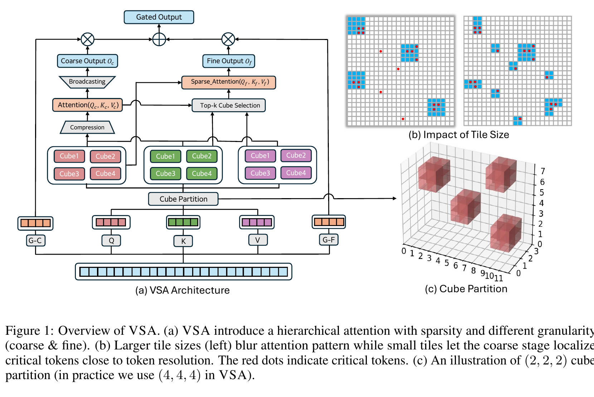
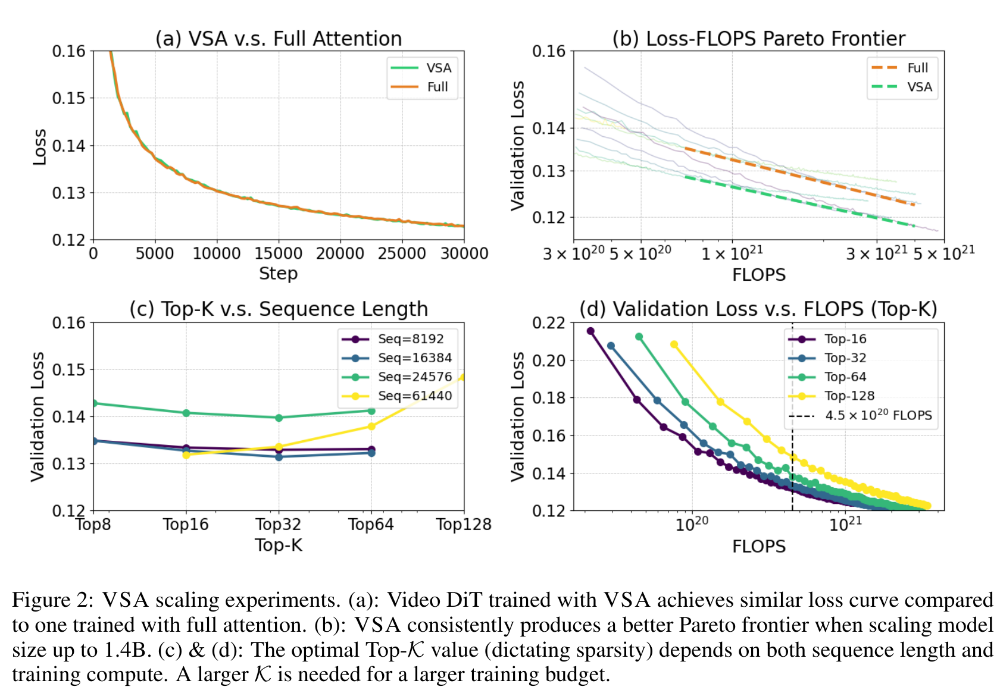
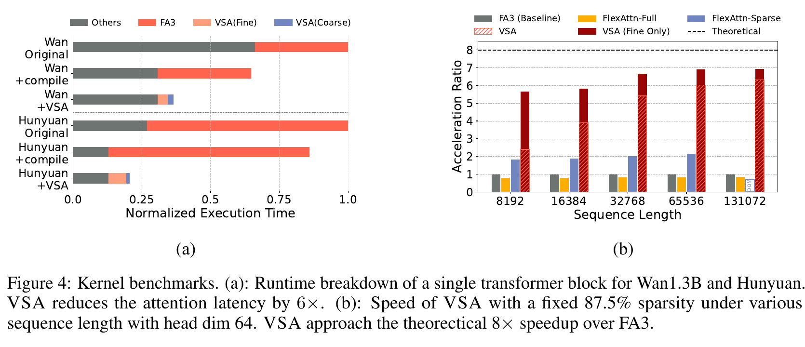

---
tags:
  - paper
  - collection/custom-attention
  - domain/ai-infra
  - status/deep-review
  - topic/video-generation
  - method/trainable-sparse-attention
document_type: paper
domain: custom_attn
collection: Custom Attention
review_status: deep-review
canonical: true
---

# VSA: Faster Video Diffusion with Trainable Sparse Attention 精读分析

> [!info] 文档关系
> - 文档类型：Paper
> - 领域入口：[README](../README.md)
> - 上位汇总：[Video generation sparse attention](../surveys/video-generation-sparse-attention.md)
> - 证据资产：[assets/papers/vsa](../assets/papers/vsa/)

> 资料状态：已核验 19 页 arXiv PDF、完整 arXiv LaTeX/source archive、固定 commit `1b2b2a0161bc6b3b80158d1fa6380a051c6530c7` 的关键官方实现文件。三张配图均为 300 DPI PDF 裁剪，包含完整 caption；Figure 1 同时作为读者可用的算法总览。未生成解释图。

## 修订信息

- 当前修订 ID：`rev-vsa-obsidian-properties-20260731`
- 当前文档版本：`1.0.2`
- 当前修订时间：`2026-07-31T10:00:00+08:00`
- 替代版本：`rev-vsa-affiliation-backfill-20260730` / `1.0.1`

| 修订 ID | 文档版本 | 时间 | 修订者 | 类型 | 替代修订 | 迁移问题/解析 | 变更摘要 | 原因 | 影响位置 | 依据 | 对结论影响 |
|---|---|---|---|---|---|---|---|---|---|---|---|
| `rev-vsa-20260729-initial` | 1.0.0 | 2026-07-29T15:04:47+08:00 | review_vsa | initial | 无 | 无 | 首次完整精读、源码/代码核验、三图 QA | dispatch `vgsa-005-vsa` | 全文及本地 artifacts | PDF/source、官方代码 commit、任务包 | initial |
| `rev-vsa-affiliation-backfill-20260730` | `1.0.1` | `2026-07-30T23:30:00+08:00` | `/root` | `metadata-update` | `rev-vsa-20260729-initial` / `1.0.0` | 无 | 补充作者—机构元数据与角色证据边界 | 统一回填 affiliation 交付字段 | `作者与机构` | 论文 PDF 标题页、机构编号与角色脚注 | none：不改变方法、实验与归因结论 |
| `rev-vsa-obsidian-properties-20260731` | `1.0.2` | `2026-07-31T10:00:00+08:00` | `/root` | `metadata-update` | `rev-vsa-affiliation-backfill-20260730` / `1.0.1` | 无 | 增加 Obsidian YAML Properties 与层级标签 | 全量 canonical Paper 标签补齐 | 文件头 YAML frontmatter | 已验证的 ICML 2026 标签 schema；仓库覆盖矩阵 | none：不改变论文分析与证据结论 |

## 0. 资料与配图索引

- 论文：`arXiv PDF`，SHA-256 `3baf6e92030566e9bdc5b8a5c2c16adcc9c319a797b5b890066b89e9c2743e38`
- LaTeX/source：`source/`，原始 archive 为 `source/2505.13389.tar`
- 官方代码：<https://github.com/hao-ai-lab/FastVideo>，commit `1b2b2a0161bc6b3b80158d1fa6380a051c6530c7`；完整 shallow checkout 因代理失败未 materialize，本文只核验 `code/official-files/` 中按固定 commit 获取的关键文件
- 提取文本：`extracted_text/paper.txt`
- OpenReview：论文标注为 NeurIPS 2025，但任务包未提供 forum，论文/源码未给公开 OpenReview 链接；本轮未建立可核验的公开评审记录
- Figure 1：`../assets/papers/vsa/fig1-vsa-overview-caption.png`（机制与算法总览）
- Figure 2：`../assets/papers/vsa/fig2-scaling-results-caption.png`（pretraining scaling）
- Figure 4：`../assets/papers/vsa/fig4-kernel-benchmarks-caption.png`（kernel/system）
- 批量 QA：`figures/contact-sheet.png`
- 生成图：跳过；原论文 Figure 1 已充分显示输入、cube partition、coarse/fine、Top-K、gated output

## 0.1 术语与符号解释

### 0.1.1 术语表

| 术语 | 本文含义 | 别名 | 不等于/易混项 | 证据来源 |
|---|---|---|---|---|
| VSA | cube-aligned、可训练的 coarse-to-fine block-sparse attention | Video Sparse Attention | 不是仅在推理期套 mask 的训练自由方法 | Abstract；§2.2；Fig.1 |
| critical tokens | full attention 中承载较大注意力质量的 token；VSA 实际按 cube 预测其所在块 | critical-token cubes | Top-K 选择对象是 cube/tile，不是任意单 token | Intro；§2.2；Fig.5 |
| cube / tile / block | 3D latent 中相邻的 $(C_t,C_h,C_w)$ token 组；flatten 后对应 GPU kernel 的 dense block | paper 中三者近似互换 | 3D cube 是语义布局，$B\times B$ 是 attention matrix tile | §2.1–2.2；footnote 1 |
| coarse stage | 对每个 cube 的 Q/K/V 均值做 dense cube-level attention，既输出全局粗信息又产生 fine-stage 的 Top-K 布局 | compression branch | 不是单纯 profiler；它参与最终输出 | §2.2；官方 `ops.py:123-142` |
| fine stage | 只在选中 cube 对上做 token-level block-sparse attention | sparse branch | “fine”指 token-level 内容，不表示任意 token 稀疏 | §2.2；Fig.1 |
| hard efficiency | 被丢弃的 tile 不进入 QK/AV kernel，保留 tile 仍是硬件友好的 dense block | wall-clock efficiency | 不能只由 FLOP sparsity 推出 | §2.1、§2.4；Fig.4 |
| MFU | 实测模型 FLOP 吞吐相对 benchmark peak/FA3 的利用指标 | model FLOPs utilization | 不等于端到端 GPU 利用率、带宽利用率或速度比 | §3.4；Fig.4 |
| sparse adaptation | 将 dense Wan checkpoint 通过 K annealing 和 gate 初始化转成 VSA | retrofit / finetuning | 不是 training-free | §2.3；Appendix |
| training-free STA | 预训练 dense DiT 后按固定/校准的 sliding tile layout 在推理替换 attention | STA | 它省 inference，不省原始 pretraining；其 layout 不随样本动态学习 | VSA Intro/Related Work；FastVideo `ops.py:19-66` |

### 0.1.2 符号表

| 符号 | 含义 | 性质 | 作用域/索引 | 单位/取值 | 来源 | 易混点 |
|---|---|---|---|---|---|---|
| $T,H,W$ | video latent 的时、高、宽 token 数 | author-defined | 单个样本 | tokens | §2.1 | 不是像素分辨率 |
| $L$ | flatten 后序列长，$L=THW$ | author-defined | attention head | tokens | §2.1 | Wan retrofit 例约 23K |
| $d,d_k$ | head/channel 与 key 维度 | author-defined | 单 head | features | Eq.1 | 论文公式混用 $d,d_k$ |
| $\mathbf Q,\mathbf K,\mathbf V$ | token-level query/key/value | author-defined | $L\times d$ | tensor | Eq.1 | coarse 版本带下标 $c$ |
| $\mathbf S,\mathbf A,\mathbf M$ | logits、softmax 权重、允许/禁止连接 mask | author-defined | $L\times L$ | score/probability/0或$-\infty$ | Eq.1 | 代码实际传 block index/bool map，不 materialize full $\mathbf M$ |
| $C_t,C_h,C_w$ | 一个 3D cube 的尺寸 | author-defined | cube | default $(4,4,4)$ | §2.2 | 乘积才是 $B$ |
| $B$ | 每 cube token 数，$B=C_tC_hC_w$ | author-defined | kernel tile | default 64 | §2.2 | attention 子矩阵为 $B\times B$ |
| $N_t,N_h,N_w$ | 三维 cube 数 | author-defined | sample | counts | §2.2 | 论文假设整除；新代码支持 boundary block |
| $\mathbf Q_c,\mathbf K_c,\mathbf V_c$ | cube mean pooled Q/K/V | author-defined | $(L/B)\times d$ | tensor | §2.2 | 不是额外 learned projection |
| $\mathcal K$ | 每个 query cube 选取的 KV cube 数 | author-defined | row/head/sample | default 32 | §2.2–3 | 论文 sparse adaptation 一句写 $\mathcal K=B/L$ 维度不一致，应理解为初始保留全部块 |
| $\mathbf O_c,\mathbf O_f,\mathbf O$ | coarse、fine 与最终输出 | author-defined | token/head | tensor | Eq.3 | $\mathbf O_c$ 会 broadcast 到 token |
| $\mathbf G_c,\mathbf G_f$ | 两分支 gate | author-defined | token/channel | learned vectors | Eq.3 | retrofit 中移除/固定 fine gate |
| $\rho$ | 本文推导的 attention sparsity | analysis-derived | 每层 | $[0,1]$ | $\rho\approx1-\mathcal KB/L$ | 论文有时称保留比例“overall sparsity” |

## 1. 论文基本信息

### 作者与机构

- 第一作者（首位列名）：Peiyuan Zhang → University of California, San Diego。
- 共同第一作者（仅含论文明确标注者）：
  - Yongqi Chen → University of California, San Diego
  - Haofeng Huang → University of California, San Diego
- 通讯作者/通讯联系人（仅含论文明确标注者）：论文未显式标注。
- 其他作者涉及的机构（去重列举，不作逐作者映射）：University of California, San Diego；Mohamed bin Zayed University of Artificial Intelligence；University of California, Berkeley。
- 对应依据：论文 PDF 标题页、作者机构编号与角色脚注（核验日期：2026-07-30）。

- 标题：VSA: Faster Video Diffusion with Trainable Sparse Attention
- 作者：Peiyuan Zhang 等
- 版本：arXiv:2505.13389；PDF metadata 与 source 均显示 NeurIPS 2025 稿式，正式 venue 状态不由本轮额外网页核验
- 核心问题：如何在不计算 full attention matrix 的前提下，动态找到关键区域，同时把稀疏性约束成 GPU 真能跳过的 block layout，并用于训练与推理
- 关键边界：核心 kernel benchmark 针对 H100/FA3、head dim 64、固定 87.5% sparsity；跨硬件、跨架构与真实长视频 scaling 尚未充分验证

## 2. 研究动机与问题—方案闭环

### 2.1 出发点与背景痛点

作者明确指出，视频 DiT 的 3D token 很快达到数万甚至十万，full attention 的 $L^2$ 成本同时压住 pretraining 和 inference。已有 dense 模型的 attention mass 又高度集中，因此“只算少量关键连接”有算法机会；真正困难是，精确找关键连接本身通常先要算完整 $\mathbf Q\mathbf K^\top$，而任意稀疏 mask 又未必能映射为 GPU wall-clock 节省。

VSA 的目标因此不是单纯把 attention FLOPs 写小，而是同时满足三件事：选择必须 data-dependent；layout 必须 block-aligned；模型必须在该稀疏结构下训练，使稀疏 attention 不只是 dense checkpoint 的推理补丁。

### 2.2 现有方案为何不够

| 现有做法 | 可观察失败 | 具体场景 | 来源 | 根因 | 为什么简单修补仍不够 | 证据 |
|---|---|---|---|---|---|---|
| full 3D attention | 长序列训练和推理二次增长 | 100K token 若逐 query 看全部 KV，就形成 $10^{10}$ 个 score；本文构造说明例，不是论文实验 | reviewer-created | 所有位置都进入 QK/AV | FlashAttention 省中间显存但不改变二次算术量 | Intro；Eq.1 |
| 先算 full score 再选 Top-K | selection 准确但几乎没有 QK 节省 | 先完整算 $\mathbf S$，最多只让 AV 稀疏 | paper-provided | selector 与被加速对象重合 | 只优化 Top-K kernel 不消除 full QK | §2.1 |
| fixed/training-free STA | 原始训练成本不变，dense-train/sparse-test 可能掉质 | 同一固定 window 无法同时覆盖某 head 的局部运动与另一 head 的远程全局依赖 | paper Fig.5 + reviewer explanation | pattern 不随样本/head/layer动态改变 | 增大 window 花回算力；finetune 后已不再 training-free | Intro；Related Work；Fig.5 |
| 非结构化 token 稀疏 | FLOPs 少但硬件未必快 | 零散保留 token 仍需 gather、mask 和小矩阵 | paper-provided | accelerator 偏好规则 dense tile | 只存 bool mask 不会自动变成可跳过 threadblock | §2.1；Fig.4 |

### 2.3 目标问题与成功标准

成功标准是：（1）在相同训练 loss 下减少 total training FLOPs；（2）fine kernel 接近理论稀疏速度上限并保持较高 MFU；（3）retrofit Wan 后质量可比且 attention/end-to-end latency 下降；（4）证明收益需要训练还是可直接替换。论文明确不解决自适应 $\mathcal K$、coarse Top-K 的连续可微性、完整跨硬件 portability。

### 2.4 核心方案如何改变关键变量

| 问题 | 方案 | 改变的变量/行为 | 机制 | 预期指标 | 证据 | 判断 |
|---|---|---|---|---|---|---|
| full selection 太贵 | cube mean pooled coarse attention | selector 序列从 $L$ 降到 $L/B$ | coarse QK 约缩小 $B^2$ 倍 | selection FLOPs/latency | §2.2、§2.4 | direct mechanism |
| fixed pattern 漏关键区域 | 每 row/head 动态 Top-$\mathcal K$ | layout 随输入 logits 变化 | 选 coarse score 最大的 cube | coverage/quality | Fig.5；prediction mass 60–90% | mechanism visualization；非因果消融 |
| 任意稀疏不快 | 3D cube 重排为连续 $B$ token，传 block index | kernel work 从 token gather 变为 dense block/skip | 每选中 coarse cell 对应一个 $B\times B$ tile | MFU、kernel latency | Fig.4；代码 paths | direct system evidence |
| sparse fine 丢全局信息 | coarse output 直接 broadcast 并 gated residual | 即使 fine 未选中仍保留低分辨率全局通路 | $\mathbf O_c$ 与 $\mathbf O_f$ 融合 | loss/quality | Table 1 branch ablation | direct ablation |
| dense checkpoint 不能硬切 | gate 初始化 + $\mathcal K$ annealing | 训练初期结构接近 dense，逐渐加稀疏 | 减少分布突变 | retrofit stability/quality | §2.3；Appendix qualitative | partial，缺 anneal-only ablation |

### 2.5 因果链与证据边界

长视频令 full attention 同时成为训练和推理瓶颈；training-free STA 只在 dense 模型训练后替换推理 pattern，不能削减 pretraining 且 pattern 表达受限；VSA 将 token 聚为 kernel-aligned cubes，在短 coarse 序列上学习全局注意力并硬选 Top-K，随后只对选中 tiles 做 token-level attention，再把 coarse global output 与 fine output 门控相加。这个设计同时减少被执行的 dense blocks 和 train/inference FLOPs。Figure 2 直接支持“稀疏预训练 loss 与 full 接近、Pareto 更好”，Figure 4 支持 kernel/attention 层速度，Wan 实验支持 retrofit 后的 end-to-end 收益。

边界是：Top-K membership 是离散 bool/index，代码没有对“哪个 tile 被选中”定义连续梯度。端到端可训练来自三条梯度路：coarse dense output、gate、已选 sparse fine path 的 Q/K/V backward；不应把论文的“single differentiable kernel”理解为对排序边界本身可微。另一个边界是 Wan-1.3B VBench 中 VSA 与 full finetune 使用相同 synthetic data，但与 original Wan 的比较混入数据/finetuning影响。

## 3. 核心贡献

1. 将 coarse dense global attention 与 fine block-sparse attention 合为可训练层，覆盖 pretraining 与 inference。
2. 将 $(4,4,4)$ cube 映射为 64-token contiguous tile，使动态 Top-K 仍生成 hard-efficient block index。
3. 提供从 60M 到 1.4B、最高 $4\times10^{21}$ FLOPs 的 scaling evidence，并报告 2.53× total training FLOPs Pareto 优势。
4. 提供 H100 kernel 与 Wan retrofit 证据：fine kernel 接近 7×，含 coarse 超过 6×；Wan-1.3B attention 约 6×、端到端 31s→18s。

## 4. 研究方法

### 4.1 方法总览与执行边界

输入是 video latent 经 DiT projection 得到的 Q/K/V。先按 3D 相邻 cube 重排，使同一 cube 的 token 连续；训练和推理都对每个 cube 做 mean pooling，算较短序列上的 dense coarse attention；其 score 每行选 Top-$\mathcal K$ KV cubes；fine kernel 只执行这些 block 的 token attention；coarse output broadcast 回各 token，与 fine output gated sum，再恢复 raster order。训练时 sparse kernel 有 Q/K/V backward，coarse branch 和 gate 正常反传；推理执行同一布局选择。dense Wan retrofit 额外经历 K annealing 和 gate 初始化，不是 zero-shot 替换。

Figure 1 已覆盖输入 Q/K/V、cube partition、compression、coarse attention、Top-K、fine sparse attention、gated output；因此不生成可选示意图。

### 4.2 组件级设计动机矩阵

| 设计项 | why 状态 | 针对问题 | 因果机制 | 替代/权衡 | 验证 | 判断 |
|---|---|---|---|---|---|---|
| $(4,4,4)$ mean pooling | author-stated | selector 太贵 | $L/B$ 序列做 global attention | max/conv pooling；小 tile 更准但慢 | pooling ablation：avg loss 0.13162，max 0.13929，conv 0.27787 | supported |
| Top-$\mathcal K$ per row/head | author-stated | fixed pattern 不适配动态 attention | score 排名转 selected block index | soft/continuous routing 更易反传但会执行更多块 | Fig.5 coverage；无 soft selector 对照 | partially supported |
| coarse output residual | author-stated | fine sparsity遗漏全局信息 | coarse global value 直接进入输出 | 仅 fine 或额外 local branch | C&F 优于 F-only；local branch收益有限 | supported |
| 64-token tile | author-stated | granularity/throughput冲突 | 64×64 dense blocks兼顾定位与 arithmetic intensity | 256更快但 loss 高；16×64略低 loss 但 2.26× slower | tile ablation | supported |
| 不加专用 locality | author-stated | local branch增加复杂度 | 动态 Top-K 可自行学局部/全局 pattern | STA/fixed local更便宜 | branch ablation + Fig.5 | supported within setup |
| fused top-k/index | author-stated | coarse materialization/index overhead | softmax/Top-K/index conversion合并减少 traffic | bitonic sort inside FA更复杂 | runtime table与代码；缺独立 E2E | partially supported |
| sparse adaptation anneal | author-stated | dense checkpoint硬切不稳定 | 从 full-like layout逐步稀疏 | zero-shot replacement | qualitative recovery；无 matched anneal ablation | partially supported |

### 4.3 关键公式

$$
\mathbf S=\frac{\mathbf Q\mathbf K^\top}{\sqrt{d_k}},\qquad
\mathbf A=\operatorname{Softmax}(\mathbf S+\mathbf M),\qquad
\mathbf O=\mathbf A\mathbf V.
$$

**这条公式在算什么？** 标准 attention 如何从 token 相似度得到加权 value。

**怎么读？** 每个 query 与允许的 keys 打分、归一化，再按概率混合 values。

**输入与输出。** 输入 Q/K/V 与 mask；输出每个 query 的新表示 O。

**变量在这里各做什么？** $d_k$ 稳定 logit 尺度；$\mathbf M$ 用 $-\infty$ 禁掉连接；$\mathbf A$ 是归一权重。

**直觉。** VSA 不改变保留 block 内的公式，只把大量 $\mathbf M$ block 变成可完全跳过。

**边界。** 标准单头表达；实际实现不创建 full $L\times L$ mask，而传 block indices。

**小例子。** 本文构造：若一个 query cube 只保留 32/256 个 KV cubes，则 fine QK/AV 理想保留约 12.5% blocks。

$$
n=\left(\left\lfloor\frac{t}{C_t}\right\rfloor N_hN_w+
\left\lfloor\frac{h}{C_h}\right\rfloor N_w+
\left\lfloor\frac{w}{C_w}\right\rfloor\right)B
+(t\bmod C_t)C_hC_w+(h\bmod C_h)C_w+(w\bmod C_w).
$$

**这条公式在算什么？** 把 3D token 映射为“先 cube、后 cube 内位置”的连续 1D index。

**怎么读？** 前半段找 cube 编号并乘 $B$；后半段找 token 在 cube 内的 offset。

**输入与输出。** 输入 $(t,h,w)$ 和 cube geometry；输出 sequence index $n$。

**变量在这里各做什么？** $N_h,N_w$ 展平 cube grid；$B$ 为每 cube 连续槽数。

**直觉。** 同一 3D cube 的 $B$ tokens 连续，GPU 可一次加载/跳过整个 attention tile。

**边界。** 论文公式假设整除；当前代码用 ceil、variable block sizes 与 padding 支持边缘块。

**小例子。** $(C_t,C_h,C_w)=(4,4,4)$ 时，每 cube 占连续 64 个 index。

$$
\mathbf O=\mathbf O_c\odot\mathbf G_c+\mathbf O_f\odot\mathbf G_f.
$$

**这条公式在算什么？** 融合粗粒度全局输出与细粒度稀疏输出。

**怎么读？** 两条分支各乘可学习 gate 后相加。

**输入与输出。** 输入 broadcast 后的 $\mathbf O_c$、token-level $\mathbf O_f$ 与 gates；输出最终 attention 表示。

**变量在这里各做什么？** $\mathbf G_c$ 控制全局补偿，$\mathbf G_f$ 控制 fine branch。

**直觉。** fine selector 漏掉部分质量时，coarse path 仍给每 token 一个低分辨率全局信号。

**边界。** Wan retrofit 将 coarse gate 零初始化、fine gate 固定/移除；pretraining 与 retrofit 参数化不同。

**小例子。** 本文构造：若某通道 $G_c=0.2,G_f=1$，输出是全部 fine 信号加 20% coarse 补偿。

$$
\rho\approx 1-\frac{\mathcal KB}{L}.
$$

**这条公式在算什么？** 本文重写的 fine attention 稀疏率。

**怎么读？** 每 query cube 保留 $\mathcal K$ 个、每个含 $B$ token；除以总 KV tokens 得保留率，再用 1 减去。

**输入与输出。** 输入 $\mathcal K,B,L$；输出近似稀疏率 $\rho$。

**变量在这里各做什么？** $\mathcal K$ 控制块数，$B$ 控制每块 token 数，$L/B$ 是总 KV cubes。

**直觉。** 16,384 tokens、$B=64$、$\mathcal K=32$ 时保留 $32/256=12.5\%$，即 87.5% sparse。

**边界。** 忽略 coarse branch 和 boundary padding；论文正文把 $\mathcal KB/L$称作“overall sparsity”容易混淆。

**小例子。** 上述 87.5% 是论文 scaling 的主设置。

## 5. 关键结论与证据

### 5.1 Pretraining scaling

Figure 2(a) 的 matched 410M loss curve 直接支持“87.5% sparse 可达到 full attention 相近 loss”；(b) 的 60M–1.4B fitted Pareto 支持在 16K sequence 的 2.53× total training FLOPs 优势；(c)(d) 同时否定“固定 Top-K 永远最优”：sequence 与预算变大时最佳 $\mathcal K$ 会变化。因此默认 K=32 是实验区间内折中，不是普适常数。

### 5.2 Retrofit、kernel 与 end-to-end

Figure 4(b) 报告 87.5% sparsity、head dim 64 下，fine-only 长序列接近 7×、含 coarse 的 VSA 超过 6×，相对理论 8×；作者将其表述为 85% FA3 MFU。Figure 4(a) 的 transformer-block breakdown 显示 Wan/Hunyuan attention component 减少，但不要把此图误读为完整 video pipeline。完整 Wan-1.3B 报告 31s→18s（1.7×），Wan-14B 1274s→576s（2.21×）；attention 6× 与 E2E 1.7–2.2× 的差来自非 attention 部分和系统配置。

### 5.3 技术点证据矩阵

| 技术点 | 证据 | 受控性 | 强度 | 结论 |
|---|---|---|---|---|
| avg pooling | Table 1e，avg/max/conv | matched 120M budget | direct ablation | supported |
| coarse global output | Table 1b，C&F vs F-only | 基本 matched | direct ablation | supported |
| local branch 不必要 | Table 1b 多组合 | 多结构同时变化 | direct但小差异 | setup 内 supported |
| 64 tile 折中 | Table 1c/1d | loss与kernel分别量测 | direct trade-off | supported |
| 动态选择优于固定 heuristic | Table 1a + Fig.5 | baseline结构差异较多 | indirect/mechanism | partially supported |
| Top-K selector 本身“可微” | bool/index code path | 无连续 gradient | code contradiction to broad reading | membership unverified/non-differentiable |
| block index 实现 hard skip | Fig.4 + `ops.py` + block sparse backward | kernel benchmark matched mask含 FlexAttention | direct | supported on tested H100 |
| Wan quality完全无损 | VBench/human | synthetic data、finetune、baseline混合 | confounded | comparable within reported setup |
| 2.53× training FLOPs | Fig.2 scaling | 16K与拟合曲线 | direct system/model evidence | supported in range |

### 5.4 训练 versus retrofit versus training-free STA

| 路线 | dense pretraining 成本 | pattern | 是否更新权重 | 质量恢复来源 | 可声称收益 |
|---|---:|---|---:|---|---|
| VSA 从头训练 | 降低 | data/head/row-dependent Top-K cubes | 是 | 模型在 sparse layer 内共同学习 | pretraining + inference |
| VSA retrofit Wan | 已发生，不能追回 | 动态 Top-K | 是，数千 steps + synthetic data + anneal | sparse adaptation | 后续 inference；不是 training-free |
| training-free STA | 不降低 | fixed/calibrated sliding tiles | 否 | dense model容忍度与保守 window | inference-only，部署简单 |

因此 VSA 与 STA 的主要区别不是“谁的 kernel 更快”这一维：VSA 用训练换 pattern 自适应与训练期节省；STA 用固定硬布局换零 finetune 部署。论文没有在相同模型、相同 sparsity、相同 kernel、相同硬件下直接对 VSA 和 STA 做完整 matched comparison；正文的人评对照是 SVG，而不是 STA。

## 6. Infra 需求分析

- **计算**：full fine attention 约 $O(L^2d)$；VSA fine 约 $(1-\rho)O(L^2d)$，coarse 约 $O((L/B)^2d)$。在 $B=64,\rho=0.875$ 时 coarse 算术很小，但 Top-K materialization/runtime仍可占 sparse attention 的约 14%。
- **显存**：coarse score 为 $(L/B)^2$，100K token 对应约 1.5K cubes，远小于 full 100K²；代码传 bool map/index，fine 不保存 full token mask。
- **layout**：`vsa_utils.py:29-61` 生成 tile/reverse indices；`video_sparse_attn.py:245-270` 使用 padded tile buffer，并在 training 禁用跨层缓存以配合 activation checkpointing。
- **自定义算子**：`block_sparse_attn.py:112-234` 注册 Triton forward/backward autograd；`243-362` 为 SM90 路径。代码显式要求 CUDA，SM90 优先 ThunderKittens，Triton fallback。
- **dtype**：fused block mean 文档标注 bf16；Top-K threshold 在 kernel 内转 fp32 比较；indices 为 int32/long，mask 为 bool。论文性能结论依赖 H100 wgmma/FA3 类硬件。
- **带宽**：fusion 将 softmax/Top-K/mask-to-index 合并以减少中间读写，但论文未报告 bytes moved、peak bandwidth 或 effective bandwidth，不能计算带宽利用率。MFU 不替代该指标。
- **互联**：scaling 使用至多 128 H200；Wan-14B finetune 64 H200 DDP。论文未分解 all-reduce/NVLink/RDMA 流量，2.53× 是 total FLOPs/Pareto，不是通信速度比。
- **CPU/异构**：选择和 sparse attention 都在 GPU；CPU 仅承担常规数据与 launch，未报告 NPU、host-device overlap 或 serving scheduler。

## 7. 开源代码对照

固定 commit：`1b2b2a0161bc6b3b80158d1fa6380a051c6530c7`。

| 论文机制 | 本地路径 | 核验 |
|---|---|---|
| default $(4,4,4)$ tile | `code/official-files/fastvideo/attention/backends/video_sparse_attn.py:25-28` | 一致 |
| sparsity→Top-K | 同文件 `160-163,295-324` | 一致；当前代码用 ceil 保留块数 |
| tile contiguous/padding | `.../vsa_utils.py:29-159` | 与论文一致并扩展 boundary blocks |
| mean coarse + dense attention + fine mask + sum | `.../ops.py:123-142` | 一致；实现 fine gate 固定为 1 的 retrofit 路径 |
| discrete Top-K mask | `.../fused_compress_topk.py:282-334` | bool mask，无 selector membership backward |
| fine sparse backward | `.../block_sparse_attn.py:158-234,288-362` | 明确注册 Q/K/V autograd |
| Wan 0.9 sparsity finetune | `code/official-files/examples/train/configs/fine_tuning/wan/t2v_vsa.yaml:1-74` | 8 GPU/4000 step 当前配置；不等同论文所有实验 |

完整仓库 clone 的 promisor blobs 因本机代理失败，未运行 GPU tests，也未核验 checkpoint metadata；以上实现判断只限落盘文件和该固定 commit。

## 8. OpenReview

未建立可核验的公开 OpenReview forum/note。论文 source 为 NeurIPS 2025 格式，但 venue/forum 不由格式本身证明；因此本轮没有 reviewer/rebuttal cross-check，不将未知评审意见纳入结论。

## 9. 优点、局限与待验证

### 优点

- 将 selector、global compensation、hard block layout 和 backward 放在同一训练层，因果链完整。
- 同时给出 model scaling、kernel、transformer-block 与完整 Wan latency，避免只报 FLOPs。
- ablation 覆盖 pooling、branch、tile granularity 与 Top-K budget。

### 局限

- Top-K 是离散选择；“end-to-end trainable”成立，“selector membership 连续可微”不成立。
- H100/head-dim-64/87.5% kernel 结果不能直接外推其他 GPU、dtype、batch 或 sequence distribution。
- Wan retrofit 质量比较含 synthetic data 和 finetune 混杂；相近 VBench 不能隔离 VSA 自身的净贡献。
- 与 training-free STA 没有完全 matched head-to-head；SVG 人评不能替代 STA 对照。
- coarse runtime、通信、显存峰值、有效带宽与训练 wall-clock 未完整公开。

### 最小复现实验

1. 固定 Wan checkpoint/data/kernel，比较 VSA、STA、SVG 在相同 retained blocks 的质量与 E2E latency。
2. 对 Top-K 使用 stop-gradient、straight-through、soft routing 做 selector gradient ablation。
3. 分别去掉 coarse output、只保留 selector，验证 global compensation 与 selection quality 的独立贡献。
4. 在 H100/A100/Blackwell 上报告 kernel、attention-layer、full DiT、full pipeline 四级 breakdown。

## 10. 一句话总结

VSA 的核心价值是把“动态找关键区域”与“GPU 能硬跳过的 cube-aligned blocks”连成可训练的 coarse/fine attention，并用 scaling 与 Wan latency证明训练期和推理期都可获益；最大证据边界是离散 Top-K 本身不可微、retrofit 质量存在数据/finetuning混杂，且未与 training-free STA 做完全 matched 对照。
