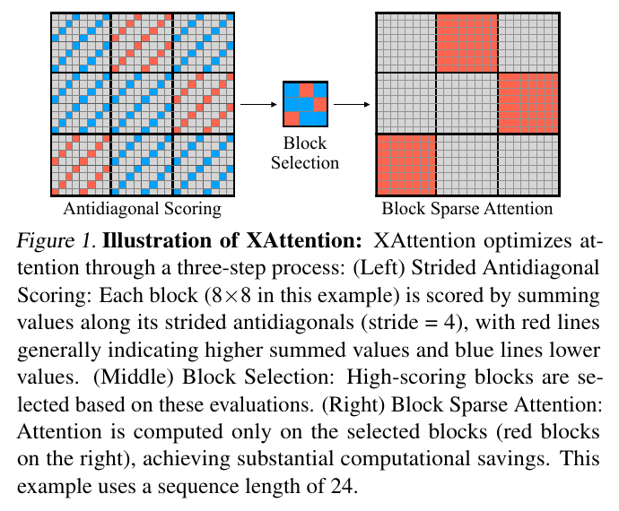
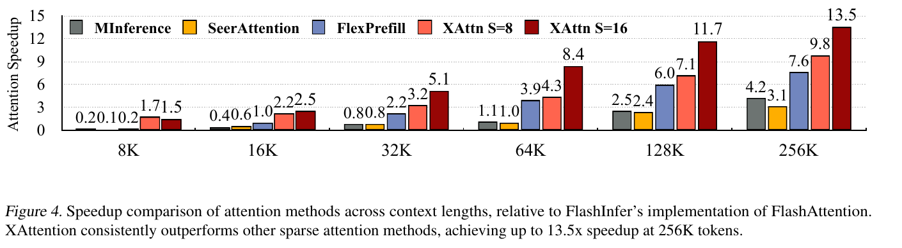
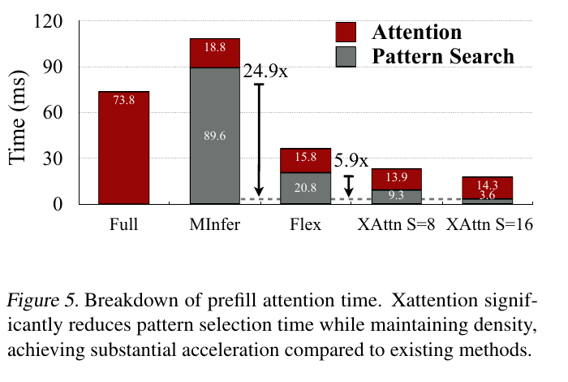
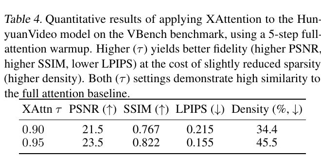
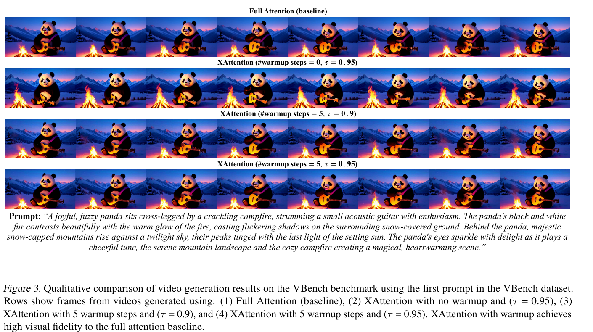

# XAttention: Block Sparse Attention with Antidiagonal Scoring 精读分析

> [!info] 文档关系
> - 文档类型：Paper
> - 领域入口：[README](../README.md)
> - 上位汇总：[Video generation sparse attention](../surveys/video-generation-sparse-attention.md)
> - 证据资产：[assets/papers/xattention](../assets/papers/xattention/)

> 资料状态：已核验 12 页 ICML 2025 PDF、完整 arXiv LaTeX/source archive 和官方 GitHub 代码 commit `e37988770b9d1bebd489eba011d615f35587ba08`。原论文图均为 200 DPI PDF 页面裁剪，保留完整 caption 并完成 contact-sheet 与逐图原分辨率 QA。没有运行 GPU benchmark；因此代码检查证明“实现路径存在”，不独立复现论文速度或质量数字。

## 修订信息

- 当前修订 ID：`rev-xattention-affiliation-backfill-20260730`

- 当前文档版本：`1.0.1`
- 当前修订时间：`2026-07-30T23:30:00+08:00`
- 替代版本：`rev-20260729-xattention-initial` / `1.0.0`

| 修订 ID | 文档版本 | 时间 | 修订者 | 类型 | 替代修订 | 迁移问题/解析 | 变更摘要 | 原因 | 影响位置 | 依据 | 对结论影响 |
|---|---|---|---|---|---|---|---|---|---|---|---|
| `rev-20260729-xattention-initial` | `1.0.0` | `2026-07-29T14:30:04+08:00` | `review_xattention` | initial | 无 | 无 | 首次完整精读、源码/代码核验、五项视觉证据与系统/视频边界审计 | task packet `vgsa-004-xattention` | 全文及本地证据资产 | PDF/source/code/visual QA | 建立初始结论 |
| `rev-xattention-affiliation-backfill-20260730` | `1.0.1` | `2026-07-30T23:30:00+08:00` | `/root` | `metadata-update` | `rev-20260729-xattention-initial` / `1.0.0` | 无 | 补充作者—机构元数据与角色证据边界 | 统一回填 affiliation 交付字段 | `作者与机构` | 论文 PDF 标题页、机构编号与角色脚注 | none：不改变方法、实验与归因结论 |

## 0. 资料与配图索引

- 论文：`arXiv PDF`，SHA-256 `9ed986221ff7ba389a8afca6470fc72a50750b7cc6f615416370736ac3635517`；PDF 元数据标为 ICML 2025 proceedings，不应再写成“arXiv-only”。
- LaTeX/source：`source/`；archive SHA-256 `a8ce3c8f27d2672c7c2579221e1a99f79e615cf2e4e9eeb196fa1c41fc38a01e`。
- 开源代码：<https://github.com/mit-han-lab/x-attention>，commit `e37988770b9d1bebd489eba011d615f35587ba08`。
- OpenReview：任务包未提供 URL，PDF/source 也未给 forum ID；按父任务要求不继续网络等待，因此公开 review、decision、rebuttal 未核验。
- 提取文本：`extracted_text/paper.txt`；工具为 `pdftotext -layout`。
- 配图与 QA：`Figure inventory`、`figures/contact-sheet.png`。
- Figure 1：`../assets/papers/xattention/fig1_method_overview_caption.png`（机制总览）。
- Figure 3、Table 4：`../assets/papers/xattention/fig3_videogen_warmup_caption.png`、`../assets/papers/xattention/table4_videogen_metrics_caption.png`（视频生成结果）。
- Figure 4、Figure 5：`../assets/papers/xattention/fig4_attention_speedup_caption.png`、`../assets/papers/xattention/fig5_time_breakdown_caption.png`（attention operator 与 selection/kernel 分解）。
- AI 生成分析图：skipped-with-reason；论文 Figure 1 已给出清楚的输入、顺序阶段、mask 状态与输出，且父任务明确要求不等待可选生成图。

## 0.1 术语与符号解释

### 0.1.1 术语表

| 术语 | 本文含义 | 别名/来源性质 | 不等于/易混项 | 证据来源 |
|---|---|---|---|---|
| antidiagonal scoring | 在每个 stride group 中用反对角配对的 query/key 点积之和近似 block attention mass | 论文定义；代码 `select_mode="inverse"` | 不是直接读取完整 attention block 的反对角元素；代码先重排 Q/K 再 GEMM | §2.1、Algorithm 1；`xattn/src/Xattention.py:73-171` |
| slash pattern | attention map 中随 query 位置斜向移动的高权重轨迹 | 论文术语 | 与主对角局部注意力不同 | §2.1、Figure 2 |
| vertical pattern | 多个 query 共同关注固定 key 位置形成的竖向高权重列 | 论文术语 | 与 attention sink 有重叠但不是同义词 | §2.1、Figure 2 |
| threshold block selection | 按预测 block mass 降序选择最小集合，使累计质量达到 $\tau$ | 论文/代码定义；dynamic sparsity | $\tau$ 不是单块分数下限，也不是固定密度 | §2.2；`utils.py:44-166` |
| attention density | 被保留的 block 比例；越低表示越稀疏 | 论文指标 | 不等于真实非零 token-pair 比例，边界/强制块也计入 | Table 4–9；代码 mask |
| minimum threshold prediction | 对语言模型各 head 的 $\tau$ 做离线搜索/校准 | 论文定义 | 不是训练、finetuning，也未用于视频生成实验 | §2.3、Table 9 |
| pattern selection time | 估计 block mass、排序/累计并构造 mask 的时间 | Figure 5 系统分解 | 不含 sparse attention kernel 时间 | Figure 5 |
| attention time | Figure 5 中 attention 计算子程序时间 | 论文指标 | 不等于 Transformer layer、prefill 或视频生成 E2E latency | Figure 4–5 与实验 §3.3 |
| warmup（视频生成） | 前 5 个去噪步令 `threshold=1.0`，即走 full attention，再切换 XAttention | 论文与代码定义 | 不是 kernel warmup、JIT warmup 或模型训练 warmup | Figure 3、Table 4；`models.py:211-228` |
| non-causal attention | HunyuanVideo DiT 中每个 token 可双向交互的 attention | 行业标准；本文视频分支 | 与 LLM prefill 的 causal mask 不同 | 实验 §3.2；`attenion.py:132-164` |
| block mask layout | `bool[B,H,Q_blocks,K_blocks]`，切到有效 block 范围后传给 `block_sparse_attn_func` | code-defined | 不是论文 Algorithm 1 中未展开的抽象 $M$ | `Xattention.py:255-356` |

### 0.1.2 符号表

| 符号 | 含义 | 性质 | 作用域/索引 | 单位/取值 | 来源 | 易混点 |
|---|---|---|---|---|---|---|
| $Q,K,V$ | query、key、value 张量 | author-defined | layer/head/token | 实数张量 | Algorithm 1 | 代码布局先为 `[B,H,L,d]`，kernel 前转为 `[L,H,d]` |
| $L$ | 序列长度 | author-defined | request | tokens | Algorithm 1 | 视频 token 数论文未报告 |
| $d,d_h$ | embedding/head dimension | author-defined | model/head | dimensions | Algorithm 1 | 代码使用 `head_dim`，README 示例为 128 |
| $B$ | sparse attention block 边长 | author-defined | kernel | tokens；代码固定 128 | §2.1、`Xattention.py:343` | 论文示意图用 $8\times8$ 仅为说明 |
| $S$ | stride；每 $S$ 个位置形成一次采样/重排 | author-defined | run | 4/8/16/64；视频 8 | §2、Tables 4–7 | 步长变大不保证最终 density 更低 |
| $\tau$ | 需覆盖的预测 attention mass 比例 | author-defined | global/head | $[0,1]$；常用 0.9/0.95 | §2.2、code | 值越大通常保留更多 block、density 更高 |
| $A$ | `find_blocks` 公式中的 attention/预测 mass map | author-defined but ambiguous | block grid | nonnegative mass | §2.2 | 正文称 attention map，实际 Algorithm/code 使用近似 map |
| $\mathcal B$ | 被选择的 block 集合 | author-defined | query block/head | set | §2.2 | 代码还强制 causal sink/self blocks |
| $M$ | sparse boolean mask；在 DP 段又指最大 adjustment 次数 | author-defined, overloaded | tensor / scalar | bool tensor / 1000 | Algorithm 1、§2.3 | 论文符号复用；本文写 mask 时用 $M_{\rm mask}$ |
| $D[h][m]$ | 前 $h$ 个 heads、做 $m$ 次调整后的最好性能 | author-defined | calibration | task score | §2.3 | 递推式未完整编码 budget/state 转移 |
| $P(h,m)$ | 第 $h$ 个 head 第 $m$ 次调整对应的模型性能 | author-defined | calibration trial | task score | §2.3 | 如何低成本测量论文未说明 |
| $t_h(m)$ | head $h$ 第 $m$ 次调整后的 threshold | author-defined | head/calibration | fraction | §2.3 | 与全局 $\tau$ 同类但 head-specific |
| $\rho$ | 被选 block density | analysis-derived | run/layer | fraction | 本分析 §8 | 论文表格写 Density，没有统一符号 |
| $T_{\rm sel},T_{\rm ker},T_{\rm e2e}$ | selection、sparse kernel、端到端时间 | analysis-derived | benchmark | ms/s | 本分析 §5/§8 | 论文只报告前两者/attention speedup，未报告视频 $T_{\rm e2e}$ |
| $N_q,N_k$ | query/key block 数 | analysis-derived | layer | blocks | 本分析 §8 | 近似为 $\lceil L/B\rceil$ |
| $b_{\rm elem}$ | 每个张量元素字节数 | analysis-derived | dtype | bytes | 本分析 §8 | bf16 为 2；mask 是 bool/实现相关 |

## 1. 论文基本信息

### 作者与机构

- 第一作者（首位列名）：Ruyi Xu → Tsinghua University。
- 共同第一作者（仅含论文明确标注者）：
  - Guangxuan Xiao → Massachusetts Institute of Technology
- 通讯作者/通讯联系人（仅含论文明确标注者）：
  - Guangxuan Xiao → Massachusetts Institute of Technology
  - Song Han → Massachusetts Institute of Technology；NVIDIA
- 其他作者涉及的机构（去重列举，不作逐作者映射）：Tsinghua University；Massachusetts Institute of Technology；Shanghai Jiao Tong University；NVIDIA。
- 对应依据：论文 PDF 标题页、作者机构编号与角色脚注（核验日期：2026-07-30）。

- 作者：Ruyi Xu、Guangxuan Xiao、Haofeng Huang、Junxian Guo、Song Han。
- 发表：ICML 2025（PDF metadata 与 ICML 样式/source 均支持）；arXiv:2503.16428。
- 研究领域：training-free dynamic block-sparse attention、长上下文推理与视频 DiT。
- 核心问题：如何用低 selection overhead 预测真正重要的 attention blocks，并把动态 mask 交给 block-sparse kernel。
- 研究目标：质量接近 full attention，同时让 selection 加 kernel 的 attention 子程序显著更快。
- 关键假设：重要结构主要能被 vertical/slash 轨迹代表；反对角采样能稳定命中它们；预测 mass 与完整 attention mass 排序足够一致；硬件/kernel 能把 block sparsity 转成 wall-clock 收益。

## 2. 研究动机与问题—方案闭环

### 2.1 出发点与背景痛点

作者明确指出，长上下文 Transformer 的 full attention 计算量随序列长度平方增长。attention map 虽常有大量可忽略权重，但其稀疏结构依输入、head、layer 变化，不能只用静态窗口可靠覆盖。已有 training-free 方法先搜索 vertical/slash 模式，再跑稀疏 kernel；搜索本身可能吃掉稀疏节省的时间（Introduction、Related Work、Figure 5）。

因此论文不是单纯“再设计一种 sparse kernel”，而是在 kernel 前端提出更便宜的 descriptor：用反对角重排后的少量 QK 点积预测每个 block 的 mass；再按 $\tau$ 选择覆盖足够 mass 的最小 block 集合。成功需要同时满足两个条件：descriptor 不能漏掉关键 block，selection overhead 还必须低于节省的 kernel 时间。

### 2.2 现有方案为何不够

| 现有方案/做法 | 可观察的失败 | 具体场景或例子 | 例子来源 | 根因/被忽略变量 | 为什么简单修补仍不够 | 证据 |
|---|---|---|---|---|---|---|
| block 内 average/sum pooling | 少数尖锐 vertical/slash 信号被大量低值稀释 | 一个 $128^2$ block 只有一条高权重竖线；平均值仍低，但该 key 对许多 queries 关键 | 论文 §2.1 的失败描述；本文具象化 | 重要性集中而非均匀 | 降低统一阈值会保留大量真正无关 block，牺牲稀疏度 | §2.1、Table 6 |
| 用最后一段 query 搜 vertical/slash | 早期 query 才出现的重要轨迹可能消失，且搜索昂贵 | 长文前半段形成 retrieval stripe，最后 chunk 不再查询它；最后段探针判为不重要 | paper-provided failure mode | 以局部尾段代表全序列的持久性假设不成立 | 扩大尾段虽提高召回，也线性增加搜索开销，仍未保证覆盖全时域 | §2.1、Figure 5 |
| 固定 Top-K/Top-Ratio budget | 不同长度/输入的所需保留 mass 不同，同一预算会欠选或浪费 | 32k 样本只需少量关键 blocks，另一个需要分散证据；相同 K 对前者浪费、对后者漏证据 | Table 8 + 本文解释 | budget 绑定 block 数，不绑定预测 mass | 为每个长度手调 K/ratio 仍不能适应输入/head 变化 | Table 8 |
| 从视频去噪第 0 步就稀疏 | 与 full-attention 视频出现 layout shift | Figure 3 无 warmup 行中熊猫/构图相对 baseline 明显变化 | paper-provided | 早期去噪步决定全局布局，对 mask 误差更敏感 | 只提高全程 $\tau$ 会增加每一步成本，仍未直接保护早期关键阶段 | §3.2、Figure 3 |

### 2.3 论文计划解决的问题与成功标准

- 核心研究问题：能否用 $O(1/S)$ 采样级别的 QK descriptor，动态选出覆盖至少 $\tau$ 预测 mass 的 blocks？
- 目标场景：LLM causal prefill、视频理解，以及 HunyuanVideo 非因果 DiT inference。
- 必须满足：training-free；mask 可映射到 block-sparse kernel；质量接近 full attention；selection overhead 可控。
- 指标：RULER/LongBench/Video-MME 任务分数；视频对同 seed full output 的 PSNR/SSIM/LPIPS；density；attention speedup；selection 与 attention kernel time。
- 明确未解决：视频 E2E latency/throughput、跨视频模型泛化、硬件移植、最坏情况召回保证，以及生成质量对真实参考视频/人评的改善。

### 2.4 核心方案如何解决并优化问题

| 原始问题/失败模式 | 根因或约束 | 对应设计 | 改变的变量/系统行为 | 作用机制 | 预期优化及指标 | 证据来源 | 判断 |
|---|---|---|---|---|---|---|---|
| pooling 漏尖锐结构 | block mass 非均匀 | strided antidiagonal score | 由全块聚合改成结构化采样 | 每行/列至少一采样，且与 vertical/slash 相交 | 在同采样计算量下提高任务分数、降低 density | Figure 2、Table 6、Appendix A | 部分支持；无最坏情况证明 |
| 固定预算不适配输入 | 重要 mass 分布动态 | cumulative-mass threshold | 固定 block 数变为输入相关 mask 大小 | 排序后取覆盖 $\tau$ 的最小集合 | 质量/density 折中 | Table 8、`utils.py` | 直接对照支持 |
| head 稀疏度不同 | 全 head 共用 $\tau$ | minimum threshold prediction | threshold 变成 per-head calibrated 值 | 搜索在任务分数约束下更激进的 head threshold | RULER 分数升、density 降 | Table 9 | 直接但只在语言模型验证；DP 表述不完整 |
| sparsity 未必变快 | selection 和 layout overhead | Triton fused estimate + bool block mask + external sparse kernel | 避免完整 attention，mask contiguous 后直接 kernel | estimator、block sum 与 sparse compute 分工 | $T_{\rm sel}+T_{\rm ker}$ 降低 | Figures 4–5、code | attention 子程序支持；E2E 未证 |
| 视频早期布局敏感 | 初始 denoising 对全局结构敏感 | 5-step full-attention warmup | 前 10% 步不稀疏，后 90% 步启用 mask | 先固定 layout，再压缩细化阶段 | 提高 output similarity | Figure 3、Table 4、code | 直接观察；仅 HunyuanVideo |

### 2.5 完整因果链与证据闭环

背景触发是长序列 full attention 的二次增长；可观察痛点是动态稀疏虽存在，旧方法的 pattern search 太慢或会漏掉局部尖锐结构。论文把根因定位为“descriptor 既不结构敏感也不轻量”，于是用反对角重排的 QK 乘积构造 block mass 近似，用累计质量阈值产生可变预算的 bool mask，再交给 block-sparse kernel。预期结果是：更准确的 descriptor 允许更低 density，轻量 selection 使稀疏计算真正转成 attention wall-clock 加速。

闭环中，Table 6 直接比较 random/diagonal/antidiagonal；Table 8 比较 K/ratio/threshold；Figure 5 将 selection 与 attention time 分开；Figure 4 给 attention 子程序 speedup。视频分支用 Figure 3/Table 4 说明 early dense warmup 必要。尚未闭合的是：Appendix 只说明覆盖行列和相关性目标，没有证明任意 attention structure 下的 score 保真；Figure 4/5 不等于模型 E2E；视频没有 sparse baseline、真实质量 benchmark 或总生成耗时。

## 3. 核心贡献与创新点

1. 提出 training-free strided antidiagonal scoring，把 block importance estimation 化为可融合的重排 QK 运算（§2.1、Figure 1）。
2. 用累计预测 mass 阈值替代固定 K/ratio，让实际 block budget 随输入/head/query block 变化（§2.2、Table 8）。
3. 提供 per-head threshold calibration，并在 RULER 上同时改善平均分与 density（§2.3、Table 9）。
4. 给出 attention-time breakdown，明确 selection overhead 与 sparse kernel 时间（Figure 5）。
5. 把同一机制扩展到非因果 HunyuanVideo，并发现/修正 early-step layout sensitivity（Figure 3、Table 4）。

## 4. 研究方法

### 4.1 方法总览

输入当前 layer 的 $Q,K,V$。XAttention 先按 stride $S$ 对 Q 做逆序 residue-class 重排、对 K 做正序重排，在缩小的序列维上计算近似 logits；softmax 后按目标 $B\times B$ block 汇总 mass。每个 query block 对 key blocks 排序，保留累计 mass 达到 $\tau$ 的最小集合，得到 `[batch, head, q_block, k_block]` bool mask。causal 路径额外强制首块和对角块；最终 mask 连续化并传入 `block_sparse_attn_func`。没有训练步骤；per-head threshold prediction 是可选的离线校准。视频路径为非因果 mask，并在前 5 个 denoising steps 令 threshold=1 走 full attention。

### 4.2 组件级设计动机与具体问题映射

| 设计项                                 | why 状态                            | 原文证据                                 | 针对问题                         | 因果机制                                                 | 替代方案/权衡                            | 验证证据                      | 判断                |
| ----------------------------------- | --------------------------------- | ------------------------------------ | ---------------------------- | ---------------------------------------------------- | ---------------------------------- | ------------------------- | ----------------- |
| antidiagonal pairing                | author-stated                     | §2.1、Figure 2、Appendix A             | pooling/尾段搜索漏 vertical/slash | 每行列至少一次、轨迹相交                                         | random/diagonal；一般 learned gate 更贵 | Table 6、7                 | 部分支持              |
| stride $S$                          | author-stated                     | §2.1、§3.4                            | estimator 成本                 | 更大 S 减少 sampled QK                                   | S 太大产生 aliasing，slash 入块位置不可分      | Table 7                   | 直接支持 failure case |
| threshold selection                 | author-stated                     | §2.2                                 | 固定 budget 欠选/浪费              | 以预测 mass 控制可变 block 数                                | Top-K/ratio 更可预测但不自适应              | Table 8                   | 直接支持              |
| per-head minimum $\tau$             | author-stated                     | §2.3                                 | head 稀疏度不同                   | 对敏感 head 保守、冗余 head 激进                               | 固定全局 $\tau$；需校准成本                  | Table 9                   | 语言域支持，泛化未证        |
| forced sink/self/causal mask        | inferred/code-defined             | `utils.py:86-166`                    | 保证 causal 合法与关键局部块           | 首块/对角块优先进入 mask                                      | 会提高实际 density                      | 无独立消融                     | 实现合理、收益未隔离        |
| Triton fused reshape/GEMM/block-sum | inferred/code-defined             | `kernels.py`、`Xattention.py:140-173` | estimator launch/中间张量开销      | fuse residue pairing 与 QK，softmax/block sum 走 Triton | 设备名不含“100”自动回退 PyTorch             | Figure 5 是整体 estimator 证据 | 部分支持              |
| 128×128 external sparse kernel      | not-stated in paper; code-defined | `Xattention.py:343-369`              | 把 mask 变成实际 skip             | contiguous bool layout 驱动 block kernel               | 固定 block/batch=1 限制适用面             | Figure 4/5 + code         | operator 路径存在     |
| 5-step video warmup                 | author-stated                     | §3.2、Figure 3                        | early-step layout shift      | 早期 full attention 固定全局布局                             | 分步 $\tau$/mask reuse 可能更省，但未测      | Figure 3、Table 4          | HunyuanVideo 直接支持 |

### 4.3 antidiagonal score 的有效性与失败面

论文的“intersects every vertical/slash pattern”只说明**命中**，不等于对完整 block mass 的无偏估计。它在以下结构下最可信：能量集中于长 vertical stripe 或近似 slash ridge，且 sampled intersections 的幅度能代表整条轨迹。它会在以下情形失败：

- 高能量落在采样格之间的短局部岛，未形成贯穿行列的 stripe；
- 正负 QK logits 在反对角求和中相消，而 full softmax 后仍有尖峰；
- 同一采样点命中强噪声、未命中分散但总 mass 较大的 block；
- $S$ 太大造成 aliasing。Table 7 的 $S=64$ 正是实证 failure case：平均分从 $S=4$ 的 88.89 降到 81.21，density 反而升到 39.88%；
- 视频 attention 的空间/时间 token layout 未被显式建模。反对角几何基于线性 token 顺序，换 patch ordering 或 position encoding 后，vertical/slash 语义可能变化。

因此正确表述是“在论文测试的结构与 stride 上，antidiagonal 是优于 random/diagonal 的经验 descriptor”，而不是普适的 block importance 定理。

### 4.4 关键公式

论文把 block selection 写成：

$$
\operatorname{find\_blocks}(A,\tau)=
\arg\min_{\mathcal B}\left\{|\mathcal B|\;\middle|\;
\sum_{b\in\mathcal B}\sum_{(i,j)\in b}A_{i,j}\ge \tau\right\}.
$$

**这条公式在算什么？** 找到能覆盖目标预测 mass 的最少 blocks。

**怎么读？** 把 block 从重要到不重要累加，刚达到 $\tau$ 就停止。

**输入与输出。** 输入是近似 attention mass map $A$ 和阈值 $\tau$；输出是 block 集合 $\mathcal B$。

**变量在这里各做什么？** $A_{i,j}$ 是预测权重，$b$ 是一个 block，$|\mathcal B|$ 是预算，$\tau$ 是目标覆盖率。

**直觉。** $\tau$ 越高，通常选得越多，质量更稳但 density/耗时更高。

**边界。** 论文公式省略了排序、归一化和 causal 强制块；代码实际以 `required_sum = total_sum * threshold` 实现相对 mass，并强制首/对角块。

**小例子。** 本文构造：四个 block mass 为 `[0.5,0.25,0.15,0.1]`，$\tau=0.8$ 时需前三个（累计 0.9）；$\tau=0.7$ 时前两个即可。

近似 logits 的核心形式为：

$$
A_{\mathrm{approx}}=
\operatorname{Softmax}\!\left(
\frac{Q_{\mathrm{reshaped}}K_{\mathrm{reshaped}}^\top}
{\sqrt{d_h}\,S}
\right).
$$

**这条公式在算什么？** 在 stride 压缩后的坐标上估计 attention 分布。

**怎么读？** 把反对角 residue 配对的 $S$ 组点积相加，再按 head dimension 与组数缩放并 softmax。

**输入与输出。** 输入为重排后的 Q/K；输出为可按原 $B\times B$ blocks 汇总的近似概率。

**变量在这里各做什么？** $S$ 决定采样稀疏度和点积累加项数；$\sqrt{d_h}$ 控制 logits 数值尺度。

**直觉。** 增大 $S$ 降低 estimator 序列尺寸，但也降低结构分辨率。

**边界。** 代码 Triton kernel 以 fp32 accumulator/softmax 中间值计算，再写回输入 dtype；近似分布不是完整 attention 的子矩阵 softmax。

**小例子。** Figure 1 的 $8\times8$ block、$S=4$ 用四种 residue pairing 覆盖行列，再把对应点积合并为 block score。

Appendix 给出的反对角项与 full sum 为：

$$
A_i=q_{n-i-1}\cdot k_i,\qquad
S_{\mathrm{full}}=\sum_{i=0}^{n-1}\sum_{j=0}^{n-1}q_i\cdot k_j.
$$

**这条公式在算什么？** 第一式定义 $n$ 个反对角配对，第二式是全部 $n^2$ 对的总和。

**怎么读？** 用一条完美匹配的 $n$ 个点代替全块 $n^2$ 个点，期待其排序/分布能代表全块。

**输入与输出。** 输入为 block 内 query/key vectors；输出分别为 sampled terms 与 full-sum reference。

**变量在这里各做什么？** $i,j$ 是 token 索引，$n$ 是 block 边长，$q,k$ 是 vectors。

**直觉。** 计算从平方项降为线性采样，但仅保证行列覆盖，不保证 mass 估计误差界。

**边界。** 论文没有证明 $A_i$ 的和是 $S_{\mathrm{full}}$ 的无偏估计；softmax 非线性也使 raw-dot-product sum 与 attention mass 不等价。

**小例子。** 若唯一大值位于未采样的 $(i,j)$，且不延展成 stripe，反对角 score 会漏检；这正是该 descriptor 的最坏情况。

threshold calibration 写成：

$$
D[h][m]=\max(D[h-1][m],P(h,m)),\qquad
t_h(m)=0.9\,t_h(m-1).
$$

**这条公式在算什么？** 尝试逐 head 降低 threshold，并保留较好任务表现。

**怎么读？** 每次把某个 head 的阈值乘 0.9，再比较性能。

**输入与输出。** 输入为 head $h$、调整次数 $m$ 和测得性能 $P$；输出为每 head threshold。

**变量在这里各做什么？** $D$ 保存最好分数，$P$ 是一次完整评测结果，$t_h$ 是 head-specific threshold。

**直觉。** 对冗余 head 可降低 $\tau$ 以选更少 blocks。

**边界。** 递推式没有给出完整 backpointer、总计算 budget 或跨 head 联合状态，且每次 $P(h,m)$ 的评测成本未报告；“dynamic”是离线校准，不是 request-time 自适应。

**小例子。** 从 0.9 降一次得到 0.81，再降一次为 0.729；论文最终平均约 0.8，但不同 heads 的分布未发布。

### 4.5 训练/实验/部署设计

- training/finetuning：XAttention 主机制无需训练；语言的 minimum threshold 需 RULER calibration，$M=1000$，平均 $\tau\approx0.8$。
- 视频生成：HunyuanVideo，946 个 VBench prompts，同 prompt/seed；720×1280、129 frames、50 steps；$S=8$，$\tau=0.9/0.95$，前 5 steps full attention。
- mask reuse：论文/code 每次调用都从当前 Q/K 估计 mask；未发现跨 denoising step 复用或 cache。
- baseline：语言含 Full/MInference/FlexPrefill/SeerAttention；视频理解含 Full/MInference/FlexPrefill；视频生成只有 Full，因为其他 baseline 未实现 non-causal path。
- hardware/precision：论文没有报告 speed benchmark GPU、dtype、batch 等关键条件。README demo 使用 bf16、single A100；不能据此断言 Figure 4/5 的测试硬件。

## 5. 关键结论

### 5.1 主结果

Figure 4 显示的是**attention operator 相对 FlashInfer FlashAttention 的 speedup**：256K 时 XAttn $S=16$ 为 13.5×、$S=8$ 为 9.8×。它不是完整模型 prefill E2E。

Figure 5 把 pattern search 与 attention kernel 分开：MInference 为 89.6+18.8 ms，FlexPrefill 为 20.8+15.8 ms，XAttn $S=8$ 为 9.3+13.9 ms，$S=16$ 为 3.6+14.3 ms；full attention 为 73.8 ms。由图中读数，XAttn totals 约 23.2/17.9 ms。这证明 selection overhead 显著下降，也说明 kernel 本身只从约 18.8/15.8 ms 降到 13.9/14.3 ms；主要差异不能全部归给 sparse kernel。

视频生成 Table 4：5-step warmup 后，$\tau=0.90$ 的 PSNR/SSIM/LPIPS 为 21.5/0.767/0.215，density 34.4%；$\tau=0.95$ 为 23.5/0.822/0.155，density 45.5%。这只表示对 full-attention 输出的相似度随保留 mass 增加而提高，不等于对真实视频质量更好。

Figure 3 的单 prompt 可视化显示无 warmup 会改变 layout，5-step warmup 更接近 baseline；它是机制例证，不是 946 prompts 的统计质量证明。

### 5.2 技术点—证据矩阵

| 技术点 | 声称收益 | 对应证据 | 是否受控 | 指标变化 | 证据强度 | 结论 |
|---|---|---|---|---|---|---|
| antidiagonal vs random/diagonal | 更准且更稀疏 | Table 6 | 同 stride/采样量 | S=8 Avg 88.47 vs 82.48/81.06；density 20.97% vs 27.57/24.47% | direct replacement | 支持测试域内优越性 |
| stride trade-off | 大 S 过稀会漏 slash | Table 7 | matched | S=64 Avg 81.21、density 39.88%，均劣于 S=4 | sensitivity | 直接显示 failure case |
| threshold vs K/ratio | 动态预算更好 | Table 8 | 论文称 matched compute，细节有限 | S=8 Avg 88.47 vs 84.13/85.42 | direct replacement | 支持 |
| per-head minimum $\tau$ | 分数升、density 降 | Table 9 | fixed $\tau$ 对照 | S=8 84.96→88.47，26.13%→20.97% | direct ablation | 支持语言 calibration；算法说明不完整 |
| lower selection overhead | 更快 descriptor | Figure 5 | 同图同长度，硬件条件未报 | 9.3/3.6 ms vs 89.6/20.8 ms | direct timing breakdown | attention 子程序支持 |
| 13.5× | attention acceleration | Figure 4 | baseline 实现明确，硬件/causal 条件缺失 | 256K 13.5× | operator benchmark | 不可外推 E2E |
| video warmup | 避免 layout shift | Figure 3/Table 4 | 有/无 warmup仅定性；量化表只列 warmup | 单 prompt 定性；无完整 warmup ablation 表 | indirect/confounded | 机制上支持，量化隔离不足 |
| 视频质量保持 | output 接近 full | Table 4 | 同 seed/prompt full baseline | PSNR up to 23.5 | correlation to teacher output | 不等于真实质量或人评 |
| video E2E 加速 | 潜在更快生成 | 无 | 无 | 未报告 | missing | 未验证 |

### 5.3 是否验证了假设

- “反对角优于同预算 random/diagonal”：直接验证。
- “反对角命中所有关键结构”：只对 vertical/slash 给几何直觉，未覆盖一般 attention map。
- “selection overhead 不再吞噬收益”：Figure 5 支持单个 attention benchmark；未验证 layer/model E2E。
- “threshold 适配动态输入”：Table 8 支持平均结果，但没有按输入/head 展示实际 budget 分布。
- “视频可无训练迁移”：代码和 HunyuanVideo 结果支持；但依赖 5-step dense warmup，且没有跨模型验证。

### 5.4 收益来源归因

| 组件/变化 | 对比基线 | 指标变化 | 影响路径 | 证据强度 |
|---|---|---|---|---|
| estimator/search | MInference/Flex | 89.6→3.6 ms、20.8→3.6 ms（$S=16$） | selection latency | Figure 5 matched breakdown |
| descriptor + threshold | random/diagonal/K/ratio | Avg 与 density 同时改善 | mask quality → kernel work/accuracy | Tables 6/8 |
| sparse kernel work | Flex/MInfer | attention segment 15.8/18.8→14.3 ms | kernel latency | Figure 5；差幅小于 selection |
| minimum $\tau$ | fixed 0.9 | S=8 Avg +3.51，density -5.16 pp | calibration → mask budget/quality | Table 9 direct |
| 5-step warmup | no warmup | 单 prompt layout 更接近 full | early-step quality | Figure 3 indirect |

以上是表格/图的近似归因，不是论文正式方差分解。

## 6. Related Work 对比

| 类别/论文 | 方法核心 | 优点 | 局限 | 与本文关系 |
|---|---|---|---|---|
| MInference | 从末段 query 搜 vertical/slash indices | 结构感知 | search overhead 高、尾段代表性假设 | XAttention 用全局 residue pairing 替代搜索 |
| FlexPrefill | pooling + pattern selection | 动态模式 | selection overhead 与 pooling 漏尖峰 | Figure 5/Table 8 对照 |
| SeerAttention | 训练 gate | 可学高 sparsity | 需预训练/微调、下游表现有限 | XAttention 强调 training-free |
| Sparse VideoGen | spatial/temporal head patterns | 视频结构专用 | 模型/布局假设更强 | XAttention 更通用但未显式建模时空布局 |
| sliding-tile video attention | 固定局部时空窗口 | kernel/layout 可预测 | 可能漏长程非局部关系 | XAttention 是输入动态 mask |

公平性边界：视频生成没有这些 sparse baselines 的 non-causal 实现，所以 XAttention 的视频结果不能建立“优于其他稀疏方法”的排名。

## 7. OpenReview 公开评审 × 论文内容交叉核验

- OpenReview 链接：未提供/未核验。
- 评审访问日期：不适用。
- decision/meta-review、rebuttal：未核验。

任务包的 OpenReview 字段为 `unknown`，PDF/source 未提供 forum ID。父任务明确要求停止更多网络等待，因此本轮不能做 public-review cross-check；这不改变对论文原始证据的分析，但无法利用 reviewer 对正确性/公平性的外部质询。

## 8. Infra 需求分析

### 8.1 算力与 latency 边界

full attention score 的主项约为：

$$
\mathrm{FLOPs}_{\rm full}\approx 2HL^2d_h,
\qquad
\mathrm{FLOPs}_{\rm sparse}\approx 2H\rho L^2d_h+\mathrm{FLOPs}_{\rm sel}.
$$

**这条公式在算什么？** 比较 full 与 block-sparse QK/PV 主计算量。

**怎么读？** sparse kernel 只在 density $\rho$ 的 blocks 上工作，但必须再加 selection。

**输入与输出。** 输入 $H,L,d_h,\rho$；输出近似 FLOPs。

**变量在这里各做什么？** $\rho$ 控制保留比例，$L^2$ 说明长上下文收益随长度放大。

**直觉。** $\rho$ 越低，kernel 理论算量越少；若 $T_{\rm sel}$ 高则 wall-clock 仍可能不快。

**边界。** 忽略 softmax、memory traffic、padding、强制 blocks 和 kernel occupancy；不能从 FLOPs 直接推出 Figure 4。

**小例子。** $\rho=0.1$ 时 QK/PV 主项约剩 10%，但 Figure 5 中 selection 仍占 XAttn S=8 总 attention time 的约 40%（9.3/23.2）。

正确的端到端关系是：

$$
T_{\rm e2e}=T_{\rm nonattn}+T_{\rm sel}+T_{\rm ker}+T_{\rm layout}.
$$

**这条公式在算什么？** 防止把 attention speedup 当作模型 E2E speedup。

**怎么读？** 只有 attention 部分变快，其他 layer、VAE/text encoder、scheduler 与布局开销仍在。

**输入与输出。** 输入各阶段时间；输出请求或视频生成总时间。

**变量在这里各做什么？** $T_{\rm layout}$ 包含 reshape/contiguous/mask 搬运；$T_{\rm nonattn}$ 对视频尤其大。

**直觉。** attention 占比越低，13.5× 对 E2E 的收益越小。

**边界。** 论文没有给这些分项，故视频 E2E speedup 不能计算。

**小例子。** 若 attention 原占总时长 40%，attention 变快 4×，理想 E2E speedup 也只有 $1/(0.6+0.4/4)=1.43\times$。

### 8.2 显存、mask 与 layout

bool block mask 大小近似：

$$
\mathrm{Bytes}_{M}\approx H\,N_qN_k\,b_{\rm elem},
\qquad N_q=\left\lceil\frac{L_q}{B}\right\rceil,\;
N_k=\left\lceil\frac{L_k}{B}\right\rceil.
$$

**这条公式在算什么？** 估算动态 mask descriptor 的存储。

**怎么读？** mask 随 block 数平方增长，但比 token-level $L^2$ 小约 $B^2$。

**输入与输出。** 输入 heads、序列长、block size、元素字节；输出 mask bytes。

**变量在这里各做什么？** 代码 $B=128$，mask 是 bool，传 kernel 前 `.contiguous()`。

**直觉。** 增大 B 降低 mask/排序规模，却降低选择粒度。

**边界。** 未计 attn_sum、sorting workspace 和 external kernel metadata。

**小例子。** $L=128K,B=128,H=32$ 时 $N=1024$，bool mask 约 32 MiB；仍需估计张量与排序临时空间。

代码的核心 layout 是 `approx_simple_mask[:, :, :q_block_num, :k_block_num].contiguous()`；kernel 入口还断言 `block_size==128`、`batch_size==1`。这说明论文的抽象“任意 B”在当前实现中并不成立。

### 8.3 Data Types / 数值格式

| 对象 | dtype/格式 | 阶段 | 硬件依赖 | 影响 | 证据 |
|---|---|---|---|---|---|
| Q/K/V demo | bf16 | inference | CUDA/A100 | 降显存与 Tensor Core compute | README 83–88 |
| approximate softmax | fp32 compute → input dtype | selection | PyTorch/Triton | 改善归一化稳定性 | `Xattention.py:228-231`、`kernels.py` |
| block mask | bool contiguous | kernel descriptor | `block_sparse_attn` CUDA extension | 跳过未选 blocks，但有 layout copy | `Xattention.py:359-369` |
| HunyuanVideo | config 支持 fp8，但论文设置未报告 | video inference | GPU | 不能把 fp8 收益归给论文结果 | `hyvideo/config.py` |

### 8.4 带宽、互联与利用率

$$
\mathrm{EffectiveBandwidth}=\frac{\mathrm{BytesMoved}}{T},\qquad
\mathrm{Utilization}=\frac{\mathrm{EffectiveBandwidth}}{\mathrm{PeakBandwidth}}.
$$

**这条公式在算什么？** 判断 kernel 是否充分利用 HBM。

**怎么读？** 用实际搬运字节除时间，再与 GPU 峰值比较。

**输入与输出。** 输入 bytes、runtime、峰值带宽；输出 GB/s 与比例。

**变量在这里各做什么？** $T$ 必须是同一算子的 wall-clock；peak 取具体 GPU。

**直觉。** 稀疏后算量下降，但索引不规则和低 occupancy 可能让 utilization 也下降。

**边界。** 论文未报告 GPU、bytes 或 profiler，不能给可信数值。

**小例子。** 不适用：缺实际 GPU/traffic，填数字会制造伪精度。

单 GPU 路径没有 all-reduce/all-to-all 证据。主要数据移动发生在 HBM：Q/K 读取、approx logits/block sums、bool mask、选中 V blocks；`.contiguous()` 可能额外复制 mask。没有 PCIe/NVLink/RDMA 测量，也没有 CPU/GPU overlap 设计。

### 8.5 CPU/GPU/NPU 异构执行

| 阶段 | CPU | GPU/加速器 | 数据移动 | overlap | 瓶颈 | 证据 |
|---|---|---|---|---|---|---|
| estimator | Python dispatch | Triton QK + softmax/block sum 或 PyTorch fallback | HBM | 未说明 | launch/sort/HBM | `Xattention.py`、`kernels.py` |
| mask selection | Python/PyTorch orchestration | GPU sort/cumsum/bool scatter | GPU resident | 未说明 | sort workspace | `utils.py` |
| sparse attention | 无显式 CPU work | external CUDA block-sparse operator | Q/K/V + mask | 未说明 | occupancy/irregular access | `Xattention.py` |
| video loop | Python scheduler/prompt I/O | HunyuanVideo DiT/VAE | 未量化 | 未说明 | 大量 non-attention compute | `run_vbench.py` |

没有 NPU 路径；设备名不包含字符串 `"100"` 时，代码会关闭 Triton estimator，说明当前 optimized path 对 A100/H100 名称有经验性 gate，其他 NVIDIA GPU/accelerator 的性能不可外推。

### 8.6 调度/Serving/自定义算子

- 自定义组件：Triton estimator kernels + PyPI `block_sparse_attn==0.0.1`。
- batching：核心入口断言 batch=1；缺多请求 serving 证据。
- chunking：estimator 默认动态 `chunk_size`，用于控制中间 approximate attention 尺寸。
- CUDA graph/cache：未见图捕获、mask cache 或跨 step reuse。
- 调度：视频每 denoising step重新选择；前 5 steps threshold=1 切 full attention。
- 复现风险：`eval/efficiency/attention_speedup.py` 对 XAttention 使用默认 `causal=True`，而 full baseline 明确 `causal=False`；若该脚本即 Figure 4 来源，则 causal 条件不一致，需复现者修正后重测。论文没有说明这一点，因此速度公平性应视为未完全核验。

## 9. 开源代码对照

- 仓库：<https://github.com/mit-han-lab/x-attention>
- commit：`e37988770b9d1bebd489eba011d615f35587ba08`
- 检查范围：estimator、Triton kernels、mask selection、external sparse operator integration、HunyuanVideo path、efficiency script。

| 论文机制 | 本地路径 | 固定 commit 链接 | 一致性判断 |
|---|---|---|---|
| antidiagonal reshape/GEMM | `code/x-attention/xattn/src/Xattention.py`、`kernels.py` | <https://github.com/mit-han-lab/x-attention/blob/e37988770b9d1bebd489eba011d615f35587ba08/xattn/src/Xattention.py> | 一致；Triton fuse 比伪代码更具体 |
| cumulative threshold mask | `xattn/src/utils.py` | <https://github.com/mit-han-lab/x-attention/blob/e37988770b9d1bebd489eba011d615f35587ba08/xattn/src/utils.py> | 一致，并补充 causal 强制块 |
| sparse kernel layout | `xattn/src/Xattention.py:343-377` | 同上 | 部分一致；当前固定 B=128、batch=1 |
| HunyuanVideo warmup | `eval/HunyuanVideo/hyvideo/modules/models.py` | <https://github.com/mit-han-lab/x-attention/blob/e37988770b9d1bebd489eba011d615f35587ba08/eval/HunyuanVideo/hyvideo/modules/models.py> | 一致；threshold=1 走 full |
| non-causal video split | `eval/HunyuanVideo/hyvideo/modules/attenion.py` | <https://github.com/mit-han-lab/x-attention/blob/e37988770b9d1bebd489eba011d615f35587ba08/eval/HunyuanVideo/hyvideo/modules/attenion.py> | 一致；一段 XAttn、一段 flash |
| efficiency benchmark | `eval/efficiency/attention_speedup.py` | <https://github.com/mit-han-lab/x-attention/blob/e37988770b9d1bebd489eba011d615f35587ba08/eval/efficiency/attention_speedup.py> | 存在 causal baseline mismatch 风险 |

未运行 GPU 测试：当前环境没有按论文依赖与目标 GPU 完成复现，故所有 runtime 数字仍以论文 Figure 4/5 为来源。

### 9.1 权重/配置

论文使用 Llama-3.1-8B-Instruct、Qwen2-VL-7B-Instruct、HunyuanVideo 公共模型，但本轮按父任务要求不继续网络 metadata/checkpoint 获取。容量参数来自模型名称而非本地 checkpoint 验证；XAttention 不发布新权重。代码中的 algorithm/runtime flags（stride/threshold/warmup）已核验，基础模型 revision 未锁定，是复现缺口。

## 10. 优点与局限

### 优点

- 把 descriptor、budget control、mask layout、kernel 证据串成可执行链。
- Table 6–9 对 pattern、stride、selection rule、head threshold 分别做了对照。
- Figure 5 明确拆开 selection 与 attention，避免只报总 speedup。
- 同一 API 支持 causal 与 non-causal，并公开 HunyuanVideo 集成。

### 局限

1. **反对角有效性不是一般证明。** 行列覆盖/轨迹相交不推出 block mass 误差界；对局部岛、相消、不同视频 token ordering 可能失败。
2. **系统证据不是 E2E。** Figure 4/5 是 attention 子程序；没有 LLM model latency、video seconds/sample、throughput、显存峰值或 energy。
3. **速度复现条件不足。** 论文不报 GPU/dtype/batch，公开脚本还存在 XAttn causal 与 full non-causal 的条件不一致风险。
4. **视频评价围绕“复现 full 输出”。** PSNR/SSIM/LPIPS 是同 seed full-output similarity；没有真实质量、人评/VBench semantic quality 分数，不能证明观感或 prompt alignment 不降。
5. **视频 baseline 弱。** 只有 full attention；没有 non-causal sparse competitor。
6. **视频依赖 5-step dense warmup。** 说明早期阶段不满足同样稀疏假设；只测 HunyuanVideo、50 steps、特定分辨率/帧数。
7. **当前代码约束。** block size=128、batch=1、external CUDA operator、优化 Triton device-name gate，部署范围窄。
8. **threshold calibration 说明不完整。** DP recurrence/state 与 1000 次性能评测成本不清；未用于视频。
9. **没有 mask reuse。** 视频 45 个稀疏 steps 都重新估计 mask，selection overhead 对生成 E2E 的累计影响未知。

### 可改进之处

- 用 oracle full block mass 计算 recall/precision、rank correlation 与 worst-case error，并按 layer/head/modality 分层。
- 修复/统一 causal benchmark，报告 GPU、dtype、batch、kernel versions、P50/P95。
- 同时报 selection、layout、kernel、layer、model、video E2E，并做 roofline/bandwidth profile。
- 视频比较 Sparse VideoGen/STA 等非因果实现，报告 VBench quality、人评、FVD/CLIP 与 seconds/video。
- 尝试 step-dependent $\tau$、mask reuse/temporal smoothing，并测 early-step sensitivity curve，而非只取 5 步。

## 11. 研究启发

- descriptor 的价值必须用“质量召回 + selection overhead + downstream kernel”三联指标评估。
- 对 diffusion/video，sparsity schedule 应显式依赖 denoising stage；早期布局与后期细节不应共享统一 budget。
- 反对角可视为一种低成本 structured sketch；后续可加入多相位反对角、随机移位或 learned tiny sketch 来降低 aliasing。
- 最小复现闭环：固定 commit/依赖与 GPU；修正 causal 条件；重跑 Table 6–9 和 Figure 5；再在 946 prompts 上记录 full/XAttn 的质量、density、selection/kernel/E2E。

## 12. 解读问题/待验证清单

1. `attention_speedup.py` 的 causal mismatch 修正后，Figure 4 的 13.5× 是否保留？
2. antidiagonal 对 oracle block mass 的 recall、Spearman/JS 分布按 layer/head 是什么？
3. 对局部 island、checkerboard、低秩分散 attention 的最坏情况如何？
4. 视频 token flatten 顺序改变时，vertical/slash 与反对角的几何意义是否稳定？
5. 5-step warmup 是最优点，还是 2/3/8 步也可？是否应随分辨率/steps 比例缩放？
6. 每 step 重算 mask 与跨 step reuse 的质量/延迟权衡是什么？
7. 视频的 seconds/sample、峰值显存、VBench semantic quality 与人评是否保持？
8. per-head threshold calibration 的真实计算成本、数据依赖和跨任务迁移性是什么？
9. batch>1、GQA/MQA、多 GPU sequence parallel 与不同 block sizes 如何支持？
10. public OpenReview 是否存在，以及 reviewers 是否指出理论/benchmark 公平性问题？

## 13. 一句话总结

XAttention 的可信核心是：反对角 structured sketch 配合累计 mass threshold，能以显著更低 selection overhead 产生 block mask，并在论文的 attention 子程序与多域质量测试中表现良好；最大不确定性是这一 descriptor 对一般 attention/video layout 的有效边界，以及 operator speedup 能否在严格同条件下转化为视频生成 E2E 收益。
