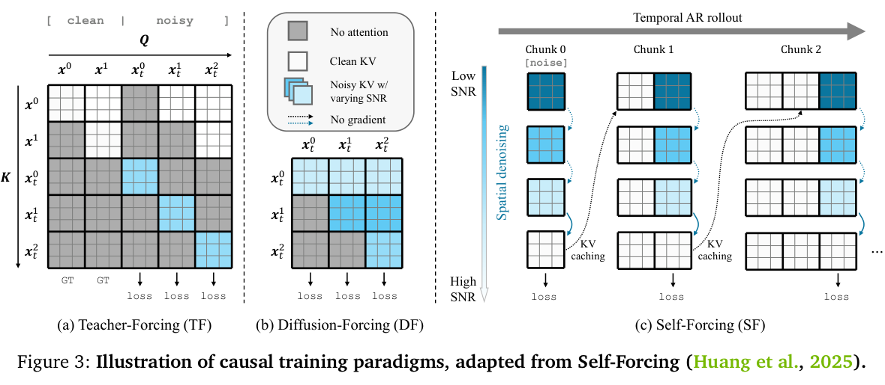
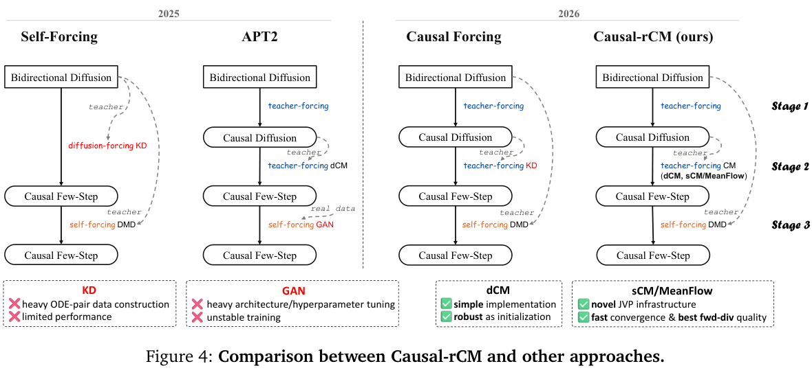

# 多模态稀疏 Attention 与定制 Mask Kernel 调研

> [!info] 文档关系
> - 文档类型：Survey
> - 领域入口：[README](../README.md)
> - 证据资产：`../assets/papers/`
> - 相关文档：[Selection](../evidence/selection.md)，[Figure inventory](../evidence/figure-inventory.md)

> **版本**：图文精读版，2026-07-12。
> **读者**：设计/评审多模态 attention kernel、长视频 runtime、统一模型训练与 serving 的工程人员。
> **范围**：高分辨率 VLM 理解、视频/世界模型生成、理解-生成统一模型；论文与源码证据以 NVIDIA CUDA 为主，另含面向非 SIMT DSA 的工程推演。
> **证据包**：[选篇与图表证据](../evidence/selection.md)。原论文图均保留完整 caption；图的结论不替代正文和源码核验。

---

## 执行摘要：先回答五个问题

### 1. 最新多模态非典型 attention 在做什么？

2026 的变化不只是“mask 更稀疏”。工作把 attention 的语义分成可运行的四类对象：

1. **规则可计算的可见性**：Causal-rCM 的 `[clean, noisy]` teacher-forcing mask、Cosmos 3 的 reasoner/generator 双流，不传 $L\times L$ 矩阵，而用 block schedule、offset 与 predicate。
2. **结构化 block 邻接**：LVSA 的 local window + rotating global anchors 变成 CSR，FlashInfer 的 block scheduler 只遍历已列出的 tile。
3. **选择后打包**：VMoBA、Token Sparse Attention、VLM FlexAttention 先选 block/token/高分辨率区域，再将连续 QKV 交给成熟 FlashAttention/varlen kernel。
4. **架构级绕开**：FrameDiT 把 temporal token attention 改为 frame-level matrix attention；它提醒我们并非每个长序列问题都应该以 sparse mask 解决。

### 2. 常见 kernel 路线与趋势是什么？

| 运行路径 | kernel 实际得到的输入 | 代表 | 适合什么 | 主要代价 |
|---|---|---|---|---|
| Dense/causal varlen FlashAttention | 连续 QKV + `cu_seqlens` / causal flag | Cosmos 3、VMoBA | mask 能切为少量矩形/流 | 多次调用、流切分 |
| FlexAttention / BlockMask | predicate + 可跳过的 block map | Causal-rCM fallback | 规则复杂且模式可 block 化 | block padding、compile/cache |
| 定制 Triton / FlashAttention 衍生 | block ranges / offsets + QKV/JVP | Causal-rCM | forward/backward/JVP 都需要特殊可见性 | 开发、autotune、寄存器压力 |
| FlashInfer block sparse | CSR `indptr, indices` + plan | LVSA | 长视频/页化 KV、结构化邻接 | planner、gather、非连续访存 |
| selector + gather + varlen | token/block index、compact QKV | VMoBA、TSA、VLM FlexAttention | 动态/学习式选择 | top-k、sort、gather/scatter |
| dense score bias | `[B,1,Lk]` 或 broadcast bias | FrameDiT 公共代码路径 | correctness fallback | 仍可能遍历 dense QK tile |

### 3. 定制 mask 到底如何表达？

**不存在唯一答案，表达必须匹配动态性和 kernel granularity。**

```text
rule / BlockMask      : q/k block id、window、stream id、offset，kernel 或 compiler 在线判定
CSR / page metadata   : indptr[int32], indices[int32]，planner 构造稀疏 tile traversal
selected segments     : token/block indices + cu_seqlens，先 gather 再跑 varlen attention
dense bool/bias       : 仅用于小序列、调试或框架 fallback；不是长序列 sparse runtime
```

### 4. 长序列下 CPU 能否生成再传给 kernel？

**能，但只能生成紧凑 metadata，不能生成 dense mask。**LVSA 源码是直接证据：CPU 创建 frame-block CSR，`fi_indptr/fi_indices` 刻意留在 host，供 host-side mask builder 与 FlashInfer planning pass 使用；这不是 GPU kernel 从 host RAM 直接读。动态 per-step/per-head top-k 若经 CPU 往返，会被 PCIe/NVLink、Python 循环和同步吞掉收益，应留在 GPU 或通过跨 denoising step reuse 降低更新频率。

对于 $L=64\text{K}$，单个 bool $[L,L]$ mask 为 $4\text{ GiB}$，fp16 bias 为 $8\text{ GiB}$：

$$
\operatorname{bytes}_{\text{bool}}=L^2,\qquad
\operatorname{bytes}_{\text{fp16}}=2L^2.
$$

这还没有乘 batch、head，也没有包含 QKV/KV cache。FlashAttention 不 materialize scores，但若仍枚举每个 $(q\_tile,k\_tile)$，并不会把二次算术量变成 sparse。

### 5. 非 SIMT DSA 为什么更难承载通用 sparse mask？

GPU 可以依赖 warp/CTA 调度、通用 load/store 和软件 kernel 变体吸收一部分不规则性；非 SIMT DSA 往往更依赖**空间映射、显式数据流、固定执行 tile、片上 SRAM 布局和预编排调度**。因此，通用 mask 不是“换一种 CSR 格式”就结束，而是要同时解决四个约束：

1. **表达通用性**：predicate、CSR、selected segments 和动态 selector 必须 lower 为硬件可执行的 work graph；
2. **负载均衡**：每个 query row、head、request 和 denoising step 的 active tile 数不同，最慢 PE 而非总 `nnz` 决定 barrier 时间；
3. **数据局部性**：把长任务迁移到空闲 PE 会增加 NoC shuffle、K/V/scale 复制并降低 SRAM reuse；
4. **量化兼容性**：当 scale fetch/dequant 与固定执行 tile 或 SRAM layout 绑定时，ragged sparse tile 会在 padding、repack/regroup、细粒度 scale 和 fallback 之间制造新代价。

第四点有严格前提：若 mask 只稀疏 sequence/token 维，而 quant group 独立地沿 channel/head-dim 维组织，二者可以正交；不能笼统宣称“稀疏必然与量化冲突”。完整术语、成立条件和设计模型见 [4.4--4.9](#44-非-simt-dsa-上的问题边界)。

---

## 1. 阅读地图：从模型语义到 kernel

以下链路是阅读每篇论文时都要回答的对象边界：

```text
任务与 token 拓扑
  -> attention 可见性语义
  -> mask lowering / selector / planner
  -> metadata 或 compact QKV
  -> QK / online softmax / AV kernel
  -> cache、并行、质量和 serving 指标
```

最常见的错误是跳过中间三步，只把“有一个 sparse mask”当作系统方案。后文每篇工作均按以下模板解读：

| 必答项 | 说明 |
|---|---|
| 解决的问题 | 其 full attention 或统一建模具体在哪里失效 |
| 图中机制 | 图里的 token/block/箭头到底表示何种可见性 |
| mask 表达 | rule、CSR、index set、compact tensor，或 dense bias |
| kernel lowering | 为什么能/不能跳过 tile；调用了什么 backend |
| 实现证据 | PDF 图/章节、官方代码路径与 commit，或 PDF-only 限制 |
| 质量与风险 | 哪些结果支持该机制，哪些不能直接归因给 kernel |

---

## 2. 代表论文精读

### 2.1 理解侧：FlexAttention for Efficient High-Resolution Vision-Language Models

**它解决什么**：高分辨率 VLM 若把所有 high-resolution patch token 与 low-resolution image/text token 做全量 self-attention，视觉细节越多，decoder attention 成本越快爆炸。


*原论文 Fig.2，ECCV 2024：高分辨率选择模块根据 input attention map 取区域 token，再与低分辨率图像和文本 token 做 hierarchical self-attention。*

**核心思想**：先以低分辨率图像 + 文本建立全局语义；在后续层根据注意力图选择高分辨率相关区域 $S_l$，仅把 $S_l$ 拼入下一层。可以抽象为：

$$
H_l=\operatorname{Attn}([H_{\text{low}},H_{\text{text}},\operatorname{Gather}(H_{\text{high}},S_l)]),
\quad S_{l+1}=\operatorname{Select}(\operatorname{Map}(H_l)).
$$

**kernel 含义**：这是 `selected indices -> gather -> compact rectangular attention`，不是先构造高分辨率 token 对的 dense mask。其数学对象、batch varlen 映射与控制面成本见 [Paper 的 kernel mapping](../papers/flexattention-vlm.md#8-compactvarlen-kernel-映射)；论文没有声称使用 PyTorch FlexAttention、Triton sparse kernel 或 FlashAttention varlen。主结果与 selection/resolution 消融分别见 [主结果](../papers/flexattention-vlm.md#4-主结果) 和 [证据矩阵](../papers/flexattention-vlm.md#5-消融与技术主张证据矩阵)。

---

### 2.2 统一理解/生成：Cosmos 3 的 two-way flat attention

**它解决什么**：统一 backbone 中，AR reasoner 既要保持 causal、不能被 noisy diffusion token 污染；generator 又要读取同样本的 reasoner、图像/视频/动作条件，并在自身 token 内双向去噪。一个通用 mixed mask 虽然正确，但 kernel 看到的是复杂可见性，容易产生 padding-equivalent work。


*Cosmos 3 本地论文/源码资产：将一个混合 attention layer lowering 为 reasoner 与 generator 两个调用。*

其关键不是一个更聪明的 sparse kernel，而是**先把语义拆成两个规则调用**：

$$
\operatorname{Attn}_R=\operatorname{CausalSDPA}(Q_R,K_R,V_R),\qquad
\operatorname{Attn}_G=\operatorname{BiAttn}(Q_G,[K_R,K_G],[V_R,V_G]).
$$

packed batch 组织为 $[R_0,G_0,R_1,G_1,\ldots]$，每个 $G_i$ 只读本样本 $[R_i,G_i]$。本地论文材料记录：相对 FlexAttention baseline，Cosmos3-Nano 端到端训练吞吐增加 22%；Hopper 使用 FlashAttention-3，GB200 使用 NATTEN/CUTLASS 路线。

**工程判断**：当非典型 mask 可以 lower 为少量 causal/full rectangular segments 时，拆成 multiple varlen calls 往往优于把任意 predicate 暴露给通用 sparse kernel。它是统一模型的首选优化顺序。实现证据在本地 [Cosmos 3 精读](../../../../02_model_systems/multimodal_generation/papers/cosmos-3.md) 的 two-way attention 小节及 [逐篇分析](../papers/cosmos-3.md)。

---

### 2.3 流式视频/世界模型：Causal-rCM 的 special causal mask 与 JVP

**它解决什么**：teacher-forcing 能并行、稳定地训练 AR diffusion，但输入含 clean history 和 noisy target；推理时又是自生成 chunk。普通 causal mask 或一个 forward-only mask 都不足以表达其训练目标，更不能自动支持 Jacobian-vector product (JVP)。



*原论文 Fig.3：TF 使用干净历史，DF 使用不同噪声级别的历史，SF 在自生成历史上 rollout 并使用 KV cache。图注完整保留。*



*原论文 Fig.4：Causal-rCM 将 TF consistency initialization 与 SF-DMD 组合；这解释训练 recipe，不单独证明 kernel 的收益。*

**mask 语义**：令序列为 $[\text{clean}_0,\ldots,\text{clean}_{B-1},\text{noisy}_0,\ldots,\text{noisy}_{B-1}]$。noisy block $b$ 只读更早 clean block，及自身 noisy block：

$$
\operatorname{visible}(q_b,k_j)=
\begin{cases}
j<b,&q_b\in\text{noisy},~k_j\in\text{clean}\\
j=b,&q_b,k_j\in\text{same noisy block}\\
j\le b,&q_b,k_j\in\text{clean}\\
0,&\text{otherwise.}
\end{cases}
$$

**实现细节（代码已核验）**：官方 commit `ed3cb14` 的 `rcm/utils/blockmask.py` 将它表示为 `BlockPattern` 和 `AttnMaskSpec`；`_make_mask_fn()` 只计算 query/key block id，`create_block_mask()` 缓存编译后的 Flex `BlockMask`。`teacher_forcing` 和 `block_causal` 对齐到默认 128-token block；`flash_attention_jvp_triton.py` 用同一 mask 参与 primal 与 JVP。即 mask 是 operator contract，而不是 score 后处理。Magi range 路径的 forward/JVP 证据存在，但源码注释表明其 backward 支持有边界，不能宣称所有 backend 等价。

**结论与风险**：论文报告的 10x convergence 是 continuous-time CM、training recipe、JVP 和系统配置的端到端结果，不能仅归因给 kernel。详见 [Causal-rCM 精读](../papers/causal-rcm.md)。

---

### 2.4 长视频结构化稀疏：LVSA 的 window、anchor 与 CPU CSR planner

**它解决什么**：固定 local window 可能漏掉长程身份/运动依赖；把 global frame 加进窗口后，又会与局部窗口重叠，浪费原本固定的 attention budget。


*原论文 Fig.1：左侧 basic window 因 window 与 global frames 重叠而浪费预算；右侧 expanded window 保持每个 query frame 的 attended set 大小。*

LVSA 令每帧 $t$ 的可见集合为：

$$
\mathcal A(t)=\mathcal G\cup\mathcal W(t),
$$

其中 $\mathcal G$ 是 rotating periodic global anchors，$\mathcal W(t)$ 是会在重叠时扩展的本地窗口。它保证近似恒定预算 $|\mathcal A(t)|\approx C$，而不是固定矩形窗口。


*原论文 Table 1：不同模型和 horizon 的 wall time。HunyuanVideo 1.5 在 2x horizon 的 dense attention OOM，LVSA-FI 约占 60GB。*


*原论文 Fig.4：wall time 随 horizon 增长的趋势；不同模型曲线受模型规模、训练长度与 80GB GPU 设置约束，不应跨模型直接比较。*

**实现细节（代码已核验）**：`lvsa/sparse_attention.py:275-304` 的 `ring_block_frame_csr()` 返回 `int32 indptr` 与 `int32 indices`，并明确写明 FlashInfer `BlockSparseAttentionWrapper` 跳过未列的 frame blocks，**不构造** dense `[Sq,Sk]` mask。`_build_flashinfer_csr()` 还构造 compact frame layout 和 copy instructions。关键 host-device 事实在 `ensure_device():601-607`：`fi_indptr/fi_indices` 故意保留 CPU，供 host mask builder/FlashInfer planning pass 使用，planner 再创建运行期 device copy。

这回答了“CPU 生成能否直接给 kernel”：**CPU 可生成 CSR；GPU kernel 不直接从 host RAM 读 CSR**。若 metadata 随 denoising step 变化，应缓存或增量更新，否则 planner 成本会侵蚀稀疏收益。详细路径、复杂度和质量边界见 [LVSA 精读](../papers/lvsa.md)。

---

### 2.5 学习式 block router：VMoBA 的选择与 varlen packing

**它解决什么**：原 MoBA 的一维均匀 key block 划分不匹配视频的 temporal、spatial 和 3D 邻域；固定 top-k 也可能对不同 head 分配错误预算。


*原论文 Fig.2：layer-wise recurrent block partition -> global/threshold block selection -> 仅在 selected blocks 上计算 sparse attention。*

**三步机制**：

1. 对 K/V 进行 per-layer recurrent 1D/2D/3D block partition，求每个 block mean key；
2. 用 query 与 block mean 的相似度选择 block，支持 global 和 threshold-based selection；
3. 仅对 selected block 的 KV 做注意力，并以 log-sum-exp 合并 selected segments。

**实现细节（代码已核验）**：`src/vmoba.py:530-710` 先 `calc_chunks`，gather K/V，计算 $[C,H,S]$ gate，然后 `topk`/threshold 得到 bool `gate_mask`。下一步以 `nonzero` 获得 selected query indices，生成 `moba_cu_seqlen_q` 和 `moba_cu_seqlen_kv`，最后调用 FlashAttention varlen forward/backward。

因此 VMoBA **暂时会有 dense gate tensor**，但不会把 token-pair dense mask 传进 FlashAttention；稀疏性最终是 `indices + compact QKV + cu_seqlens`。风险也随之清楚：`gate`, `topk/sort`, `nonzero`, gather/scatter 和 LSE merge 是控制面成本。release code 的 default `threshold_type=query_head` 与论文中 per-head global 描述存在复现差异，应在基准配置中固定。详见 [VMoBA 精读](../papers/vmoba.md)。

---

### 2.6 动态 sparse control plane：HASTE 的 TMR 与 EBC

**它解决什么**：video diffusion 有 $S$ 个 denoising steps。即使 sparse attention 每一步很快，若每个 step、每个 head 都重新预测 mask，mask planner 本身可能吞掉节省的计算；统一 threshold 又忽略 head 的不同重要性和误差曲线。


*原论文 Fig.4：左侧 Temporal Mask Reuse (TMR) 用 query-key stability 判定每 head 是否复用 cached mask；右侧 Error-guided Budgeted Calibration (EBC) 在离线 prompt pool 上为不同 head 分配 threshold。*

**机制**：

- **TMR（在线）**：锚点 step $t_a$ 的 mask $M^{(h)}_{t_a}$ 不必每步刷新。通过当前和锚点 Q/K 的轻量 drift proxy 判断是否复用。
- **EBC（离线）**：在固定全局 sparsity budget 下，根据不同 head 的 error-vs-sparsity 曲线配置不同 threshold；不改底层 sparse kernel。

论文的关键系统洞见是：只缓存/复用 **稀疏 descriptor**，而不是缓存完整 $N\times N$ mask。Table 4 的端到端提升说明 TMR 与 EBC 的目标不同，但由于本次未找到官方实现，不能断言 descriptor 是 CSR、BlockMask 还是某个 Triton 数据结构，也不能声称其在 CPU 或 GPU 上生成。详细数据与证据强度见 [HASTE 精读](../papers/haste.md)。

---

### 2.7 Training-free 视频稀疏：Sparse VideoGen 的 head 分类与 layout transform

**它解决什么**：视频 DiT 的 3D full attention 随帧数/分辨率二次增加。直接移植 LLM mask 会破坏 temporal dependency；即使发现了 temporal slash pattern，也可能因非连续 memory layout 跑得很慢。


*原论文 Fig.4：SVG 对每个 attention head 用 sampled rows 在线比较 spatial/temporal sparse attention 与 full attention 的 MSE，并选择相应 kernel。*

**机制**：spatial head 的可见性接近帧内/邻帧 block；temporal head 对应相同 spatial position 的跨帧 slash。它用 online profiling 将 head dispatch 给 spatial 或 temporal kernel，并通过 layout transformation 把原本不连续的 temporal gather 改造成硬件友好访问。

**实现判断**：论文说明原型使用 Triton 和 FlashInfer，但本次未取得可审计官方 kernel 源码，因此不能把它的具体 mask metadata 格式写成事实。它最重要的工程启发是：`发现 sparse pattern` 和 `把 pattern 排列成 coalesced tiles` 是两件事，前者没有后者不会得到理论 speedup。详见 [Sparse VideoGen 精读](../papers/sparse-videogen.md)。

---

### 2.8 selector 与 kernel 解耦：Token Sparse Attention

**它解决什么**：block sparse kernel 便于 GPU 执行，但 token 重要性在 layer 和 head 间会改变；永久删除 token 会破坏后续层重新选择的机会。


*原论文 Fig.3：每个 head 选择 token subset，compress Q/K/V 后使用任何 attention kernel；输出 scatter 回原序列并与 residual 相加。*

令每个 head 的保留集合为 $S_h$，它构造紧凑张量：

$$
(\hat Q_h,\hat K_h,\hat V_h)=\operatorname{Gather}(Q_h,K_h,V_h;S_h),
\quad \hat O_h=\operatorname{Attn}(\hat Q_h,\hat K_h,\hat V_h),
\quad O_h=\operatorname{Scatter}(\hat O_h;S_h).
$$

这解释了它为什么能复用 FlashAttention：kernel 从不需要知道稀疏 token 的原始位置，只面对连续 compact tensor。真正的代价移到 gather/contiguous conversion/scatter 和 selector；这在短序列、低 sparsity 或 head 选择高度发散时可能占主导。未获得官方代码，具体 index placement 和实现细节标为 PDF-only。详见 [Token Sparse Attention 精读](../papers/token-sparse-attention.md)。

---

### 2.9 长上下文桥接：MInference 的 pattern-aware kernels

**它解决什么**：长上下文 prefill 中 attention 变成延迟主导，但相同 head 在不同输入中并不共享同一组 top-k token；静态 fixed mask 的 recall 会明显下降。


*原论文 Fig.3：A-shape、vertical-slash、block-sparse 三种 head pattern；不同输入的精确 indices 动态变化，但 pattern family 可以由 kernel-aware search 预先分配。*

MInference 的分层策略是：离线给每个 head 选 pattern family；在线用近似索引构建具体 range/column/block index；随后 dispatch 三种优化 GPU kernels（论文声明 PIT、Triton、FlashAttention 相关实现）。它不是将一个大稀疏矩阵交给通用 dense kernel。

它虽主要为 LLM prefill，但其模式/索引/dispatch 分离为多模态视频提供桥接：video DiT 必须把 causal pattern 改为 bidirectional spatial-temporal pattern，并把在线 planner 开销乘上 denoising steps。具体 Appendix C range/column index 讨论与证据见 [MInference 精读](../papers/minference.md)。

---

### 2.10 架构替代：FrameDiT 的 matrix attention

**它解决什么**：factorized temporal attention 便宜但难捕获大运动，full 3D attention 表达力强但难扩展。FrameDiT 选择改变 temporal interaction 的对象，而不是设计一张更稀疏的 token mask。


*原论文 Fig.1：在 interleaved spatial/temporal DiT 中，以 frame-level Matrix Attention 替代 temporal token-level attention，另可组合 Global-Local hybrid。*

Matrix Attention 将一帧视为矩阵，沿 frame-level 计算 Q/K/V 和 attention，而非对所有 patch token 建立时间 token-pair。它表明最优系统选择有时是**降低 token topology 的维度**。

但官方 commit `359bd12` 中的公开 `models/latte_t2v.py:761-779` 对二维 mask 会转为 `-10000` bias 并 broadcast 到 score path；该实现不证明存在 custom sparse kernel。报告将“论文算法的复杂度收益”和“公开代码的 mask implementation”严格分开。详见 [FrameDiT 精读](../papers/framedit.md)。

---

## 3. 跨论文实现对照：mask 是在哪里变小的？

| 论文 | mask/selector 的产生位置 | 给 backend 的对象 | 是否有 $L^2$ mask | 核心实现风险 |
|---|---|---|---|---|
| FlexAttention VLM | 上层 attention map | selected visual token index + compact features | 不应有 | selector 本身的 score 成本 |
| Cosmos 3 | 模型语义 lowering | 两个 varlen stream | 否 | segmentation/padding、双调用调度 |
| Causal-rCM | `BlockPattern` + runtime predicate | `BlockMask` / range metadata / JVP kernel | 否 | backward/JVP backend 兼容 |
| LVSA | CPU geometry planner | CSR + FlashInfer plan | 否 | planner 与 compact copy |
| VMoBA | GPU gate + top-k/threshold | indices + `cu_seqlens` + packed QKV | 临时 gate 为 $[C,H,S]$，非 pair matrix | selection/pack/LSE 成本 |
| HASTE | 在线 refresh + 离线 budget calibration | 未核验 | 不应有 | descriptor 复用何时失效 |
| Sparse VideoGen | sampled rows online profiling | 专用 spatial/temporal dispatch | 未核验 | layout transform 质量 |
| TSA | GPU per-head selector | compact QKV + scatter index | 否 | gather/scatter、余下 token 语义 |
| MInference | online sparse index builder | pattern-specific index/ranges | 否 | index build、pattern 错配 |
| FrameDiT 公共代码 | framework mask | dense additive bias | 可能 broadcast | 不是 sparse execution |

---

## 4. Kernel 设计蓝图：建议的接口与数据流

### 4.1 先 lowering，再选择 backend

```text
MaskSemantics
  - stream partition: reasoner / generator / clean / noisy / video / audio / action
  - temporal geometry: frame, chunk, window, anchor, page
  - dynamic source: static / request / layer-head / denoising-step
        |
        v
Lowering
  A. rectangles -> varlen causal/full calls
  B. regular graph -> BlockMask / kernel predicate
  C. explicit sparse graph -> CSR/page metadata + planner
  D. learned tokens/blocks -> selector + gather + compact varlen
        |
        v
AttentionPlan -> run(Q,K,V,Plan) -> cache/update/reuse
```

建议 API：

```python
@dataclass
class MaskSpec:
    kind: Literal['split_stream', 'block_causal', 'window_anchor', 'csr_blocks', 'selected_segments']
    geometry: TokenGeometry       # frame/chunk/page/modal offsets
    dynamic: Literal['static', 'per_request', 'per_step', 'per_layer_head']
    storage: Literal['kernel_rule', 'cpu_metadata', 'gpu_metadata']

plan = build_attention_plan(spec, qkv_layout, device)
out = attention_run(q, k, v, plan)
```

### 4.2 CPU/GPU 放置策略

| 模式 | 推荐位置 | 传输形式 | 不应做什么 |
|---|---|---|---|
| 静态 window/anchor | CPU 初始化一次，cache | pinned `int32` CSR / page list | 每一步重新生成 dense bool mask |
| request-specific page | GPU scheduler 或 host request planner | page id / indptr / length | H2D 拷整个 pair matrix |
| per-step drift/reuse | GPU，紧邻 Q/K projection | cached descriptor + small update | CPU round-trip top-k |
| learned router | GPU | selected index + `cu_seqlens` | 每 query 传不规则 Python list |

LVSA 的 CPU CSR 例子说明 host planning 合理；HASTE 的 TMR 说明动态性高时必须降低 planner 调用次数；VMoBA/TSA 说明 kernel 若只接受连续 QKV，则将选择结果 compact 是最可靠的接口边界。

### 4.3 评测不能只测 attention FLOPs

应测完整时间：

$$
T_{\text{total}}=T_{\text{select}}+T_{\text{metadata}}+T_{\text{H2D/plan}}+T_{\text{pack}}+T_{\text{attn}}+T_{\text{unpack}}.
$$

| 类别 | 必需指标 |
|---|---|
| 正确性 | dense reference、mask boundary、JVP/backward、cache rollout 一致性 |
| kernel | elapsed、有效带宽 $\text{bytes}/\text{time}$、tile occupancy、实际 `nnz_blocks` |
| 内存 | metadata、compact QKV、KV cache、临时 buffer；不只报 attention score 是否 materialize |
| 多模态质量 | grounding、空间定位、identity、motion、loop、audio/action sync |
| serving | TTFT、TPOT、batch 混合、cache reuse、fallback 率、CPU planner utilization |

### 4.4 非 SIMT DSA 上的问题边界

> [!warning] 证据边界
> 本节是从前述 CUDA kernel、CSR planner、selector/pack 和 descriptor reuse 证据向非 SIMT DSA 做的**工程抽象**，不是上述论文已经验证的 DSA 实现或性能结论。具体 DSA 的 PE 组织、量化轴、片上存储和调度能力不同，必须以目标硬件规格和编译器行为为准。

这里的 **DSA（domain-specific accelerator）** 指针对一类张量/神经网络算子设计的领域专用加速器；“非 SIMT”强调它不以 GPU 式 warp 内单指令多线程和通用 CTA 调度作为主要执行抽象。典型实现更依赖编译器提前决定：哪一个 tile 在哪组 PE 上计算、数据放在哪个 SRAM bank、通过哪条 NoC 路径搬运、何时同步和归约。

因此问题不应写成“DSA 的 PE 是静态的”。更准确的表述是：**空间映射和显式调度的数据流缺少 SIMT warp/CTA scheduler 对细粒度不规则性的通用兜底**。某些 DSA 仍有动态队列、work stealing 或可编程控制核，但这些能力通常受队列深度、控制面积、NoC、bank layout 和数据驻留约束。

从模型到 DSA 的完整链路是：

```text
attention visibility semantics
  -> mask IR / descriptor
  -> sparse work graph
  -> tile shape + quant compatibility
  -> PE placement + SRAM/NoC placement
  -> explicit schedule / dataflow
  -> compute + communication + quantization + synchronization
```

只比较 `nnz_blocks` 会漏掉后三步。相同 `nnz` 的两个 mask，如果 row degree、head 分布、scale placement 或 K/V reuse 不同，实际时间可以完全不同。

### 4.5 术语表：PPT 中的词分别指什么

| 术语 | 本文含义 | 为什么与 sparse attention 相关 |
|---|---|---|
| **SIMT** | Single Instruction, Multiple Threads；GPU warp 中多个线程执行同一指令流 | warp/CTA scheduler 可以在一定程度上用并发 CTA 隐藏不同 tile 的时长差异 |
| **DSA** | Domain-Specific Accelerator，领域专用加速器 | 通常以固定/有限 tile、显式数据流和片上存储为主要优化边界 |
| **PE** | Processing Element，执行 MAC、向量、归约或专用算子的处理单元 | sparse row 分配不均会形成 PE bubble、尾部和 barrier 等待 |
| **execution tile** | 一次硬件指令或数据流模板处理的 $M\times N\times K$ 数据块 | mask 只激活 tile 的一部分时，会出现 partial/ragged tile 或 padding work |
| **spatial mapping** | 把循环维、tile 和数据显式映射到 PE/PE group | 迁移 work 能均衡计算，却可能破坏数据驻留和相邻 PE 的复用 |
| **dataflow** | 数据在 PE、SRAM、NoC 和归约单元之间的生产/消费顺序 | sparse graph 改变 producer-consumer 数量与时间，可能打破固定流水 |
| **SRAM** | 片上静态存储，常按 bank 分布 | gather、repack 和跨 PE 迁移可能造成 bank conflict、容量溢出或 reuse 下降 |
| **NoC** | Network-on-Chip，片上互连 | 重新均衡 PE、复制 K/V/scale 或跨簇归约都会增加 NoC bytes 和拥塞 |
| **bubble** | PE 因没有就绪 work、数据或 scale 而空闲的周期 | row degree 不均、bank stall 或显式依赖会产生空洞 |
| **barrier tail** | 多个 PE/cluster 同步时，其他单元等待最慢者结束的尾部 | 端到端时间接近最大 PE 完成时间，而不是平均时间 |
| **mask predicate** | 用 `visible(q,k)`、block id、offset、stream id 等规则在线判定可见性 | 表达能力强，但 DSA 需要把分支 lower 为有限模板或显式 work list |
| **CSR** | `indptr + indices` 表示每个 query row 连接的 key block | 存储随 `nnz_blocks` 增长，但 row degree 不均会直接转成负载偏斜 |
| **selected segments** | selector 产生的 token/block index、segment length 和 `cu_seqlens` | 需要 gather/pack；DSA 还要决定 compact tensor 的物理布局与 scale 归属 |
| **descriptor** | 描述 sparse work 的紧凑 metadata，而非 $L\times L$ dense mask | descriptor 越通用，decode、indirection、队列和控制面积通常越大 |
| **mask IR** | 编译器/运行时可消费的中间表示，统一语义、动态性和物理约束 | 它是从模型 mask 到 DSA work graph 的契约，不等于某个固定 CSR ABI |
| **lowering** | 将高层 mask 语义变成 rectangle、block graph、CSR、segment 或 fallback 的过程 | 决定哪些 tile 能真正跳过，以及后端是否能执行 |
| **indirection** | 通过 index/descriptor 间接找到 K/V、scale 或输出位置 | 增加 metadata load、地址生成和不连续访存 |
| **pattern specialization** | 为 window、causal、top-k 等模式准备专用模板/指令 | 性能高但模板会膨胀，长尾 pattern 可能重编译或 fallback |
| **fallback** | 当前 mask、shape、dtype 或 quant layout 不被专用路径支持时退回通用/稠密路径 | fallback 率决定线上收益，不能只报告命中专用路径时的速度 |
| **quant group** | 共享一组 scale/zero-point 的元素集合；可能沿 tensor、channel、head-dim/K 或 block 组织 | 是否与 sparse tile 冲突取决于 group axis 和硬件绑定关系 |
| **scale / zero-point** | 将整数值映射回实数范围的量化参数；对称量化可不使用显式 zero-point | scale 粒度越细，参数和 fetch/dequant 控制越多，但通常量化误差更小 |
| **scale fetch** | 从寄存器、SRAM 或 metadata buffer 读取当前 group 的 scale | irregular tile 若需要多组 scale，可能增加带宽和 stall |
| **dequant / requant** | 计算前从整数恢复到计算域；输出或重分组后再次量化 | repack 后若 group membership 改变，可能需要重新计算 scale 或 requantize |
| **ragged/partial tile** | tile 中只有部分 row、column 或 block 有效 | 要么 pad 做无效 MAC，要么拆 tile/repack 并承担控制和搬运成本 |
| **padding** | 用无效元素补齐硬件 tile，保持规则执行 | 实现简单，但会增加无效 MAC、SRAM/NoC bytes，稀疏率可能只存在于逻辑上 |
| **repack/regroup** | gather 选中元素到新布局，或重新组织量化/执行 group | 改善阵列利用率，但增加 gather/scatter、metadata、NoC 和 layout conversion |
| **fine-grained scale** | 缩小 quant group，为更小 tile/通道保存独立 scale | 通常降低量化误差，但增加 scale 存储、读取、dequant lane 和控制复杂度 |
| **load CV** | PE work/time 的变异系数 $\sigma/\mu$ | 用于刻画负载离散程度；必须与 p95/p50 和 barrier tail 一起看 |

### 4.6 mask 通用性为什么比 GPU kernel 更难

一个通用 `MaskSpec` 可能允许四种物理表达：predicate、CSR、selected segments 和 dense fallback。GPU 软件栈可以为它们编译多个 kernel，并让 CTA scheduler 在运行时分派；DSA 若想用一条通用路径承载，需要在硬件或微码中加入：

1. descriptor decoder 和多种 index/address generation；
2. 动态 work queue、依赖计数和不等长 row 的结束判定；
3. K/V/scale 的间接寻址与跨 bank gather；
4. 可变长度 online softmax、归约和输出 scatter；
5. 不支持 pattern 的 fallback 与状态切换。

这些功能会占用控制面积、metadata 带宽和片上容量。反过来，如果只保留少量规则模板，则会产生 pattern specialization 的组合爆炸：`mask family × block size × head dim × dtype × quant group × layout × forward/backward`。因此工程目标不是“支持任意 mask”，而是找到一个**有界的 mask IR**：覆盖目标 workload 的主要 pattern，同时能静态证明 tile、依赖、量化和存储约束。

建议把 IR 至少拆成语义与物理两层：

```python
@dataclass
class MaskSpec:
    kind: Literal['split_stream', 'block_causal', 'window_anchor',
                  'csr_blocks', 'selected_segments']
    geometry: TokenGeometry
    dynamic: Literal['static', 'per_request', 'per_step', 'per_layer_head']

@dataclass
class QuantLayout:
    dtype: Literal['int8', 'int4', 'fp8']
    axis: Literal['tensor', 'channel', 'head_dim', 'token', 'block']
    group_size: int
    scale_location: Literal['register', 'sram', 'memory']
    binding: Literal['independent', 'exec_tile', 'sram_bank']

@dataclass
class AttentionPlan:
    work_items: SparseWorkGraph
    pe_placement: PEPlacement
    kv_locations: BufferPlacement
    scale_ids: ScaleMap
    compatibility: Literal['exact', 'pad', 'repack', 'requantize', 'fallback']
```

`MaskSpec` 只回答“谁能看谁”；`QuantLayout` 回答“整数如何解释、scale 在哪里、是否与 tile/bank 绑定”；`AttentionPlan` 才回答“在这块 DSA 上怎样执行”。把三者混成一个 CSR 会丢失优化和正确性所需的信息。

### 4.7 负载均衡：总 `nnz` 不是执行时间

令 $p$ 表示 PE 或 PE cluster。DSA 上更合理的目标不是均分 active block 数，而是最小化最大完成时间：

$$
T_{\text{E2E}} = T_{\text{lower}} + T_{\text{dispatch}}
+ \max_p \left(
T_{\text{compute},p} + T_{\text{mask},p} + T_{\text{NoC},p}
+ T_{\text{SRAM-stall},p} + T_{\text{quant},p} + T_{\text{sync},p}
\right) + T_{\text{output}}.
$$

各项分别表示：有效/填充 MAC、descriptor decode、片上搬运、bank/容量 stall、scale/dequant/requant、barrier/归约等待。即使两个 plan 的总 `nnz` 相同，只要最大 PE 的 row degree、K/V reuse 或 scale fetch 数不同，$T_{\text{E2E}}$ 就不同。

负载均衡与局部性存在直接冲突：

- **保持 data affinity**：让使用同一 K/V page 和 scale 的 row 留在同一 cluster，可提高 SRAM reuse，但热点 head/row 会形成长尾；
- **迁移 work**：把长 row 拆给空闲 PE，可降低 compute tail，却需要 NoC shuffle、K/V/scale 复制和跨 PE softmax/LSE merge；
- **切小 tile**：调度更灵活，但 descriptor、queue、归约和 scale fetch 的固定成本占比升高；
- **切大 tile**：数据复用更好，但 partial tile 和 padding-equivalent work 增加。

因此 planner 应按**估计时间**而不是 `nnz` 分配 work。估价模型至少需要 active/padded MAC、K/V/scale bytes、bank affinity、NoC hop/拥塞、归约 fan-in 和 quant compatibility。

### 4.8 稀疏 tile 与量化功能何时冲突

#### 4.8.1 不是所有稀疏都与量化冲突

Attention mask 通常稀疏 query/key 的 sequence 维；权重/激活 quant group 可能沿 channel 或 head-dim/K 维。若硬件允许每个 active token tile 独立引用原有 channel scale，且 scale fetch/dequant 不要求固定 $M\times N\times K$ tile，那么二者可以正交。

冲突主要在以下条件出现：

1. quant/dequant 单元按固定 execution tile 启动，partial tile 仍必须消耗完整通路；
2. scale ID 隐含在 tile id、page id 或 SRAM bank layout 中，compact/reorder 后无法直接沿用；
3. 一个 sparse tile 跨越多个 quant group，需要多次 scale fetch 或拆分计算；
4. 多个小 sparse tile 被 regroup 到同一硬件 tile，但来自不同值域/scale group；
5. K/V 与 scale 必须共同驻留，负载迁移需要同时复制 data 和 quant metadata；
6. online softmax、LSE merge 或输出 requant 对 accumulator precision、归约顺序有额外限制。

#### 4.8.2 六条处理路径及其代价

| 路径 | 做法 | 主要收益 | 主要代价 | 数值注意事项 |
|---|---|---|---|---|
| **mask/quant aligned pattern** | 训练或 lowering 时约束 sparse block 对齐 execution tile、page 和 quant group | 最少控制与搬运，最适合 DSA | 稀疏模式自由度下降，可能影响质量或稀疏率 | 需验证 selector/mask 约束后的任务质量 |
| **padding** | partial tile 补零/无效元素，沿用原 scale | 无需改 group membership，硬件路径简单 | 无效 MAC、SRAM/NoC bytes 和 barrier tail 增加 | padding 必须在 softmax 语义上保持不可见，不能仅把量化值写成零 |
| **repack but preserve scale IDs** | gather active block 到连续 buffer，同时携带原始 `scale_id` | 提高阵列占用，不必重新校准 scale | gather/scatter、scale indirection、metadata 和 NoC；可能降低连续访存/reuse | 一个 tile 多 scale 时需要多段 dequant 或 lane mask |
| **regroup/requantize** | compact 后重新组成 quant group，计算/选择新 scale | 形成规则 tile，可减少 scale indirection | planner、统计、requant、额外 buffer；动态场景可能过慢 | 跨异质值域 regroup 或错误校准会改变误差分布 |
| **fine-grained scale** | 缩小 group，使 scale 更贴近 sparse tile | 通常降低量化误差并减少跨组 partial tile | scale bytes/fetch、dequant lane 和控制复杂度增加 | “细粒度 scale 导致精度更差”通常不成立；风险主要是实现/校准错误 |
| **fallback** | 对不兼容 pattern 使用 dense/高精度/通用路径 | 正确性边界清晰 | 收益取决于 fallback 率，batch 内混合还会破坏调度 | 必须逐路径验证数值一致性 |

特别注意 padding 的语义：量化整数零不一定代表 real zero，且 attention mask 的“不可见”要求该位置不能进入 max、exp、sum 和 AV。正确做法是由有效位/predicate 排除，或使用与量化零点一致且不会参与 softmax 的专用路径；只补一个整数 `0` 不等于正确 masked attention。

#### 4.8.3 `T_quant` 应怎样拆

统一时间模型中的量化项不是单个常数，可按 plan 分解：

$$
T_{\text{quant},p} = T_{\text{scale-fetch},p}
+ T_{\text{dequant},p} + T_{\text{requant},p}
+ T_{\text{scale-indirection},p} + T_{\text{quant-stall},p}.
$$

- padding 路径主要增加 $T_{\text{compute}}$ 和 memory/NoC bytes，不一定增加 scale 数；
- preserve-scale repack 主要增加 `scale_id` indirection、gather 和多 scale dequant；
- regroup/requantize 增加 scale 统计、requant 和临时 buffer；
- fine-grained scale 增加 scale bytes/fetch，但通常改善量化误差。

### 4.9 DSA 评测与设计检查表

| 维度 | 必测项 | 失败信号 |
|---|---|---|
| mask IR | pattern 覆盖率、descriptor bytes、decode cycles、compile/cache hit | descriptor 成本随 dense pair 数增长；频繁重编译 |
| PE balance | per-PE active/padded MAC、time p50/p95、load CV、barrier tail | 平均利用率高但 p95 长；最慢 cluster 主导 |
| data placement | SRAM hit、bank conflict、spill、K/V/scale copy bytes | work stealing 后 NoC bytes 超过节省的 HBM/compute |
| NoC | bytes、hop、热点 link、multicast/reduction fan-in | 某些 head/row 形成路由热点或归约拥塞 |
| quant | group axis/size、scale bytes/fetch、dequant/requant cycles、partial-group ratio | scale fetch 或 requant 成为新瓶颈 |
| 数值 | dense/high-precision reference、softmax/LSE、forward/backward/JVP、长 rollout | padding 进入 softmax；重分组后误差异常放大 |
| 系统 | lower/dispatch/pack/run/unpack、fallback 率、batch 混合、E2E | 只在专用 microbenchmark 快，端到端无收益 |

建议至少扫描：sequence length、sparsity、row-degree distribution、block/tile size、head heterogeneity、denoising step、quant dtype、group axis/size、scale location、SRAM 容量和 NoC 拓扑。每组结果同时报告**逻辑稀疏率、物理执行稀疏率和 padding 后有效 MAC 比例**；否则容易把逻辑 `nnz` 当成硬件实际跳过的工作。

---

## 5. 可执行的验证计划

### 第一阶段：语义与表示正确性

1. 为每种 stream rule 构造 $L\le 1\text{K}$ dense reference，逐元素验证 `visible(q,k)`。
2. 对 Causal-rCM 类 operator 验证 forward、backward、JVP 与 dense masked reference；不要只验证 forward。
3. 记录 metadata bytes 与 dense mask bytes，确认 metadata 随 $nnz\_blocks$ 而非 $L^2$ 增长。

### 第二阶段：kernel 和控制面

1. 分离 `select/plan/pack/attn/unpack` 的 CUDA event 计时；避免以端到端时间隐藏 CPU 或 H2D 开销。
2. 对相同 quality budget 扫描 sequence length、sparsity、block size、head heterogeneity、denoising step；判断何时 dense FA 更快。
3. 对 CSR/page path 记录 average row nnz、tile load imbalance 和 K/V reuse；对 selector path 记录 compact ratio 与 gather locality。

### 第三阶段：质量与部署

1. 视频：VBench/VQEval 外加 motion、frozen-loop、identity 的人工 spot check。
2. 多模态理解：TextVQA/MagnifierBench/grounding，并检查高分辨率细节是否被 selector 漏掉。
3. 统一/世界模型：reasoner 是否被 noisy generator 反向污染、跨 chunk context 是否与缓存一致、action/video 时间是否对齐。

### 第四阶段：非 SIMT DSA 与量化协同

1. 固定 mask 和 QKV 数值，只改变 row-to-PE placement，记录 `max PE time`、load CV、barrier tail、NoC/KV/scale copy bytes，验证 planner 是否按时间而非 `nnz` 均衡。
2. 对同一 sparse pattern 分别运行 aligned、padding、preserve-scale repack、regroup/requantize、fine-grained scale 和 fallback，分解 `compute/NoC/SRAM/quant/sync` 时间。
3. 扫描 quant axis/group size 与 execution tile 的组合，记录 partial-group ratio、padded MAC ratio、scale bytes/fetch 和 dequant/requant cycles。
4. 以高精度 dense reference 验证 mask boundary、online softmax/LSE、AV、输出 requant；特别检查 padding 值没有进入 max/exp/sum。
5. 报告逻辑稀疏率、物理跳过率、专用路径覆盖率和 batch 级 fallback 率，不能只报告兼容 pattern 的单 kernel 峰值。

---

## 6. 证据边界与后续阅读

- **源码已核验**：Causal-rCM、LVSA、VMoBA、FrameDiT；所有路径、commit、已知不一致和实现限制在各 `analysis.md`。
- **论文图与 PDF 已核验**：FlexAttention VLM、HASTE、Sparse VideoGen、Token Sparse Attention、MInference；若无官方代码，本文不把具体 CSR/Triton/host-device 细节说成已证实事实。
- **DSA 与量化部分是工程推演**：4.4--4.9 将 CUDA/FlashInfer/FlexAttention 中已观察到的 mask lowering、planner、pack 和 descriptor 问题映射到非 SIMT DSA；没有目标 DSA 的公开规格、实现与实测数据支撑时，不把 PE、NoC、SRAM 或量化路径的具体性能写成论文事实。
- **最新性口径**：检索快照为 2026-07-10。2026 预印本的引用数不足以判定长期影响，因此以问题覆盖、原始证据、官方代码与系统贡献共同筛选。
- **不可直接横比**：不同视频模型、GPU、horizon、质量指标、训练/推理模式不同；速度数字用于理解各自实验，不构成统一排行榜。

正式选篇依据见 [Selection](../evidence/selection.md)，原论文图、裁剪与 QA 记录见 [Figure inventory](../evidence/figure-inventory.md)。
