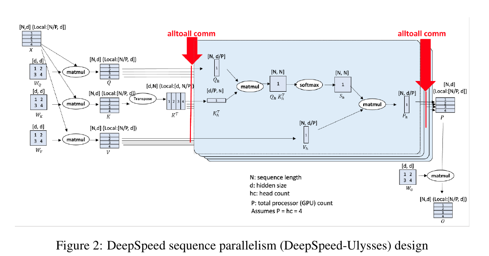
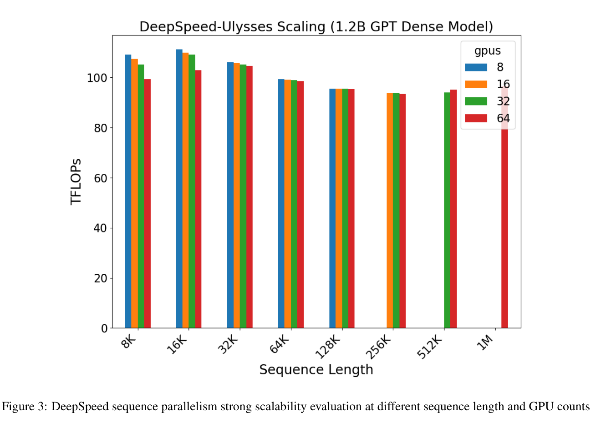

---
tags:
  - paper
  - collection/parallel-partitioning
  - domain/parallelism
  - status/deep-review
  - topic/long-sequence-training
  - method/ulysses-sequence-parallelism
document_type: paper
domain: parallelism
collection: Parallel Partitioning
review_status: deep-review
canonical: true
---

# DeepSpeed Ulysses 精读分析

> [!info] 文档关系
> - 文档类型：Paper
> - 领域入口：[README](../README.md)
> - 上位汇总：[并行切分方法体系](../surveys/parallel-partitioning-taxonomy.md)
> - 长序列专题：[序列与上下文并行](../topics/sequence-and-context-parallelism.md)
> - 证据资产：[assets/papers/deepspeed-ulysses](../assets/papers/deepspeed-ulysses/)

> 资料状态：已核验 arXiv:2309.14509v2 的 12 页 PDF、完整 arXiv LaTeX/source、PDF 提取文本、两张带完整 caption 的原论文裁图，以及 DeepSpeed 官方 `deepspeed/sequence/layer.py` 在 commit `35d1c7d3f61be09d6641d4f5fcf617012367390e` 的轻量代码快照。论文为 arXiv-only 2023，未发现 OpenReview 记录。

## 修订信息

- 当前文档版本：`1.0.0`
- 当前修订 ID：`rev-20260731-initial`
- 当前修订时间：`2026-07-31T23:10:00+08:00`
- 替代版本：无（initial）

| 修订 ID | 文档版本 | 时间 | 修订者 | 类型 | 替代修订 | 迁移问题/解析 | 变更摘要 | 原因 | 影响位置 | 依据 | 对结论影响 |
|---|---|---|---|---|---|---|---|---|---|---|---|
| rev-20260731-initial | 1.0.0 | 2026-07-31T23:10:00+08:00 | review_deepspeed_ulysses | initial | none | none | 首次完整精读、源码/实现核验与两类视觉 QA | initial delivery | 全文及全部本地证据 | task packet；arXiv v2；DeepSpeed commit 35d1c7d | none |

## 0. 资料与配图索引

- 论文：`paper.pdf`；SHA-256 见 `deliverable_manifest.json`。
- LaTeX/source：`source/source.tar`，已展开至 `source/`；核心证据为 `intro.tex`、`design.tex`、`eval.tex`。
- 提取文本：`extracted_text/paper.txt`（`pdftotext -layout`）。
- 官方实现：`code/layer.py`；GitHub master commit `35d1c7d3f61be09d6641d4f5fcf617012367390e`；commit metadata 为 `code/commit.json`。
- 原论文视觉：Figure 2（机制）、Figure 3（结果/系统）；完整 provenance 与 QA 见 `figure_inventory.md`。
- OpenReview：任务包无链接，arXiv-only；不适用。
- 算法总览：原论文 Figure 2 已完整呈现输入、两次 layout 变换、attention 与输出，因此采用它，不生成解释图。

## 0.1 术语与符号解释

### 0.1.1 术语表

| 术语 | 本文含义 | 别名 | 不等于/易混项 | 证据来源 |
|---|---|---|---|---|
| Ulysses sequence parallelism | 在非 attention 子层保持序列维分片，在 attention 前后通过 all-to-all 在“序列分片”和“头分片”布局间转换 | DS-Sequence, DeepSpeed Sequence | 不是 Megatron 的 tensor-parallel sequence parallelism，也不是 ring attention | Paper §3.1, Figure 2；`source/design.tex` |
| sequence-scattered layout | 每个 rank 持有局部序列 $N/P$，但持有全部 attention heads | 本分析的阶段限定名 | 论文未把它定义成专有名词；这里仅用于消除 layout 歧义 | Figure 2；`code/layer.py:33-57` |
| head-local attention | 每个 rank 持有全序列 $N$，只计算不重叠的一组 heads | head parallelism | “local” 指 head 子集，不指 local attention window | Paper §3.4 |
| all-to-all | 将一个维度 scatter、另一个维度 gather 的集体通信 | all2all | 不等于 all-gather；反向调用交换 scatter/gather 维 | Paper §3.1–3.2；`code/layer.py:297-345` |
| ZeRO-3 integration | 把模型状态分片组扩展到 data-parallel 与 sequence-parallel ranks 的组合，并按需 gather/gradient reduce | ZeRO parameter partitioning | 不负责切 attention 激活；Ulysses 本身也不减少模型状态 | Paper §3.3 |

### 0.1.2 符号表

| 符号 | 含义 | 性质 | 作用域/索引 | 单位/取值 | 来源 | 易混点 |
|---|---|---|---|---|---|---|
| $N$ | 全局序列长度 | author-defined | 每个样本 | tokens | Paper §3.1–3.2 | rank 上局部长度为 $N/P$ |
| $P$ | sequence-parallel GPU/rank 数 | author-defined | SP group | 正整数 | Paper Figure 2, §3.2 | 不是总训练 GPU 数；可再与 DP/PP 组合 |
| $h$ | hidden size | author-defined | 每 token | elements | Paper §3.2 | Figure 2 使用 $d$ 表示 hidden size，正文通信式改用 $h$ |
| $d$ | attention 缩放公式中的维度；Figure 2 legend 又写 hidden size | author-defined/ambiguous | 每 head 或 hidden | elements | Eq. 1；Figure 2 | Eq. 1 的标准语义应为 key/head dimension，但论文符号不一致 |
| $H$ | attention head 总数 | analysis-derived | 每层 | heads | Figure 2 的 `hc`; code `num_total_head` | 论文正文未用统一 $H$ 记号 |
| $Q,K,V$ | query、key、value 投影 | author-defined | 每层 attention | tensor | §2.1.1, §3.1 | all-to-all 前后 shape 不同、语义不变 |
| $M$ | 一次 collective 的 aggregate message size | author-defined | 每层/collective | elements or bytes after multiplying dtype width | §3.2 | 论文通信式忽略 dtype byte width与拓扑常数 |
| $b$ | micro-batch size | author-defined | per rank/config | samples | §2.1.1 | 不是全局 batch |

## 1. 论文基本信息

- 完整作者列表：Sam Ade Jacobs；Masahiro Tanaka；Chengming Zhang；Minjia Zhang；Shuaiwen Leon Song；Samyam Rajbhandari；Yuxiong He。
- 署名模式：个人署名。
- 第一作者及机构：Sam Ade Jacobs（作者列表首位）→ Microsoft Inc；依据为 PDF 第 1 页 author block。
- 共同一作：未标注；不从顺序推断。
- 通讯作者：not-stated；PDF author block 无 corresponding marker/legend，arXiv submitter 邮箱不能替代通讯作者标注。
- 其余作者机构（去重）：Microsoft Inc。
- 版本：arXiv:2309.14509v2，2023-10-04。
- 研究问题：如何在保持标准 attention 语义和较小代码侵入的同时，把单样本超长序列分摊到多 GPU。

## 2. 研究动机与问题—方案闭环

### 2.1 出发点与背景痛点

作者明确指出，DP、TP、PP 分别沿 batch、hidden/operator 和 layer 维扩展，却没有直接分摊单样本的序列激活；长文档、视频、基因等任务又要求更长上下文。已有序列并行虽能切激活，但 ring K/V 或 all-gather/reduce-scatter 方案的通信随 $N$ 线性增长，并可能绑定特定 attention 或 Megatron 实现（Paper §1, §2.2）。

### 2.2 现有方案为何不够

| 现有做法 | 可观察失败 | 具体场景 | 来源 | 根因 | 简单修补为何不够 | 证据 |
|---|---|---|---|---|---|---|
| 只加 DP | 32K context 会把 8K、1024-GPU、micro-batch=1 的约 8M-token global batch 推到约 32M tokens | 论文给出的训练场景 | paper-provided | batch 与 sequence 被混在扩容路径中 | 调小每卡 batch 已到 1，继续加 GPU 仍增大全局 batch | §2.1.2 |
| Megatron-SP | 每链路通信约 $4Nh$，随 $N$ 增长 | $N$ 与 GPU 数同比增长时通信仍增长 | paper-provided | all-gather/reduce-scatter 的每链路量不按 $1/P$ 缩小 | 仅增加 ranks 不改变 collective 的 volume 级别 | §2.2, §3.2 |
| ring self-attention | K/V 逐步环传且 attention 实现受约束 | 换用 FlashAttention/稀疏 attention 时通用性未证实 | paper-provided | 通信协议嵌入 attention 计算 | 只替换 kernel 不能消除 ring 协议耦合 | §2.2 |

### 2.3 目标与成功标准

目标是让单样本序列激活随 $P$ 分片、attention 保持全序列语义、通信在 $N$ 与 $P$ 同比增长时近似常数，并能与 ZeRO-3 和多种 attention kernel 组合。主要指标是可训练最大序列、TFLOPs/GPU、相对 Megatron-SP 吞吐和收敛。

### 2.4 问题—方案映射

| 问题 | 约束 | 设计 | 改变的状态 | 因果机制 | 预期指标 | 证据 | 判断 |
|---|---|---|---|---|---|---|---|
| 单卡长序列激活 OOM | attention 需全局 token 交互 | 序列分片 + 两次 all-to-all | $[N/P,H] \leftrightarrow [N,H/P]$ | 每 rank 仅保存/计算一部分序列或 heads | 最大序列、显存 | Figure 2, Figure 3 | supported |
| 通信随 $N$ 增长 | 必须交换 QKV 与 output | all-to-all | 每链路量为 $4Nh/P$ | $N,P$ 同比时量不变 | TFLOPs/GPU | §3.2, Figure 3 | partially supported；未单独测通信 |
| 模型状态仍大 | Ulysses 只切 activation | 组合 ZeRO-3 | 参数/梯度/优化器跨 DP×SP 分片 | 降模型状态副本 | 可训练模型规模 | §3.3, Fig. 4–7 | confounded |

### 2.5 因果链

长序列激活无法由 DP/TP/PP 直接分摊 → 旧 SP 通信或实现耦合成为瓶颈 → Ulysses 在 attention 边界把序列分片转换为 head 分片 → 每个 head 仍看到全序列，同时每链路 all-to-all 量按 $1/P$ 缩小 → Figure 3 展示 8K–1M 的可扩展性，Figure 4–7 报告相对 Megatron 的吞吐/长度优势。闭环的缺口是：论文未给通信时间或 all-to-all-only 消融，且优势同时混入 ZeRO-3 与最优配置选择。

## 3. 核心贡献

1. 提出 attention-centric SP：在标准 attention 前后做 layout 变换而不改 attention 数学语义（Figure 2）。
2. 给出每层每链路 $4Nh/P$ 的通信分析，与 Megatron-SP 的约 $4Nh$ 对比（§3.2）。
3. 与 ZeRO-3 组合，分开解决 activation 与 model-state memory（§3.3）。
4. 在最多 256 张 A100 上报告 1M-token、最多 2.5× throughput 与 4× longer sequence（§4）。

## 4. 研究方法

### 4.1 总览

输入在每个 rank 上是局部序列、全部 heads。Q/K/V 投影完成后，第一次 all-to-all scatter head dimension、gather sequence dimension；每个 rank 得到全序列但仅 $H/P$ heads。标准 attention 对本地 heads 独立计算。第二次 all-to-all 交换相反维度，使输出回到 $N/P$ 序列、全部 heads，供 output projection、MLP、LayerNorm 等后续算子使用。

> 原论文 Figure 2（PDF p.4）：这是本报告的 reader-usable algorithm overview；训练路径从左至右，红色箭头是两次 all-to-all，蓝色区域是 head-local、full-sequence attention。该图是论文证据，不是生成图。

### 4.2 精确 layout 与前反向通信

设 batch-first QKV 的逻辑 shape 为 $[b,N/P,H,d_h]$。默认实现 `scatter_idx=2, gather_idx=0`：第一次 `_SeqAllToAll` 将其转换为 $[b,N,H/P,d_h]$；local attention 输出同 shape；第二次使用交换后的 `(gather_idx, scatter_idx)` 恢复 $[b,N/P,H,d_h]$（Paper Figure 2；`code/layer.py:426-457`）。

反向并非新的协议：`_SeqAllToAll.backward` 再次调用自身并交换 `gather_idx` 与 `scatter_idx`，因此梯度沿前向 layout 变换的逆变换返回（`code/layer.py:344-350`）。当前代码还有 q/k/v 与 output 的通信-计算 overlap 分支，但论文 v2 未分析这项后续实现优化，不能倒推为论文实验来源。

Head constraint 需要版本限定。论文 Figure 2 假设 `P = hc = 4`，其核心均匀 head 分片要求 $H \bmod P=0$。当前 commit 的标准路径仍有该断言（`layer.py:40,56`），但 `single_all_to_all` 在不整除时可进入 `uneven_heads_all2all`，且要求 `num_heads > seq_world_size`、不支持 async overlap（`layer.py:225-246`）。所以“SP degree 永远不能超过/不整除 head 数”只对论文所述均匀路径成立；现代实现已部分放宽，但引入不均匀负载与功能限制。

### 4.3 设计动机矩阵

| 设计 | why 状态 | 目标问题 | 因果机制 | 替代/权衡 | 验证 | 判断 |
|---|---|---|---|---|---|---|
| attention 前后两次 all-to-all | author-stated, §3.1–3.2 | 全局 attention 与低通信兼得 | 序列/头维互换 | ring K/V、all-gather；受 head partition 约束 | 理论 + system results，无单项消融 | partially supported |
| attention-centric modular boundary | author-stated, §3.4 | 避免绑定特定 attention | local kernel 只见标准全序列 head 子集 | 协议嵌入 kernel 可更专用 | dense/sparse 实验 | supported but not exhaustive |
| ZeRO-3 跨 DP×SP group | author-stated, §3.3 | model state 不被 Ulysses 降低 | 参数分片跨更大 group | TP/PP；需额外 gather/reduce | 大模型实验但与 SP 混杂 | plausible/confounded |
| 通信/计算 overlap | code-defined, not in paper | 隐藏 collective latency | stream/pipeline overlap | 同步路径更简单 | 当前代码，无论文实验 | code-only |

### 4.4 关键公式

$$
O=\operatorname{Softmax}\left(\frac{QK^\top}{\sqrt{d_h}}\right)V
$$

**这条公式在算什么？** 每个 attention head 对全序列 token 做加权聚合。
**怎么读？** Q 与 K 的相似度经缩放和 softmax 变成权重，再加权 V。
**输入与输出。** 输入是全序列的 $Q,K,V$ head slice；输出是同一 head 的 context。
**变量角色。** $d_h$ 是 head dimension；论文 Eq.1 写 $d$，但 Figure 2 又把 $d$ 作为 hidden size，故这里消歧为 $d_h$。
**直觉。** Ulysses 不改变该公式，只改变哪个 rank 负责哪些 heads。
**边界。** dense self-attention；sparse/cross attention 可替换 local operator，但需相应 mask/input。
**小例子。** 当 $P=4,H=4$ 时，每卡计算 1 个 head、看完整 $N$ tokens；不是每卡只看 $N/4$ tokens。

$$
V_{\text{Ulysses,link}}=\frac{3Nh+Nh}{P}=\frac{4Nh}{P}
$$

**这条公式在算什么？** 每层两次 all-to-all 的论文级每链路通信元素量。
**怎么读？** QKV 共 $3Nh$，context 为 $Nh$，all-to-all 每链路按 $1/P$ 分摊。
**输入与输出。** 输入 $N,h,P$；输出 communication elements；乘 dtype bytes 得字节数。
**变量角色。** $N$ 与序列成正比，$h$ 是 hidden size，$P$ 降低每链路份额。
**直觉。** $N$ 和 $P$ 同比增加时该量近似不变。
**边界。** 假设论文所述 NVSwitch + fat-tree IB 和理想 collective；未计 latency、协议、拥塞、反向与 overlap 常数。
**小例子。** $N$ 和 $P$ 都翻 4 倍，$4Nh/P$ 不变；但 attention FLOPs 仍随更长 $N$ 增大。

## 5. 关键结论与证据

### 5.1 主结果与边界

> 原论文 Figure 3（PDF p.6）：1.2B dense GPT 在 8–64 GPUs 上从 8K 扩到 1M tokens，约 94–111 TFLOPs/GPU。它直接证明“这些配置能运行且 per-GPU compute throughput 大致维持”，但没有单独测 collective 时间，也不是固定总工作量的传统 strong scaling。

Table 2 固定 131,072 tokens 时，64→128→256 GPUs 的 iteration time 为 32432.13→17052.51→9886.7 ms，TFLOPs/GPU 为 165.53→157.41→136.09；理想线性 speedup 未完全达到。Table 3 在 sequence/GPU 同比增加时，TFLOPs/GPU 为 161.36→157.41→147.4，支持近似弱扩展但揭示通信/效率损失。

### 5.2 技术主张证据矩阵

| 主张 | 实验/证据 | 控制程度 | 强度 | 结论 |
|---|---|---|---|---|
| layout 变换保持标准 attention | Figure 2 + Eq.1 + code forward/backward | 机制证据 | direct mechanism/code | supported |
| per-link communication 为 $O(N/P)$ | §3.2 推导 | 理想拓扑假设 | theory/indirect | supported under assumptions |
| 相对 Megatron 最多 2.5× | Fig.4–7 | 双方选择各自最优配置，且 ZeRO 组合不同 | confounded | system bundle supported；不能归因单一 all-to-all |
| 4× longer sequence | Fig.4–7 | memory stack 混入 ZeRO-3 | confounded | supported for tested setup |
| attention agnostic | dense + blocked sparse | 只覆盖有限 kernel | indirect | partially supported |
| 无质量损失 | Figure 8 单一 1.3B/32K convergence | 范围有限 | direct but narrow | 不能外推所有模型/任务 |

### 5.3 收益归因

吞吐优势有两条作者自述路径：ZeRO-3 让更多样本/更长序列 fit；all-to-all 比 all-gather/reduce-scatter 通信量小。论文没有把两者做 matched ablation，因此 2.5× 不能拆成各自贡献。Figure 3 更接近 Ulysses 端到端扩展证据；Table 2/3 显示规模增加时仍有 5–18% 的 per-GPU TFLOPs 下降。

## 6. Related Work

| 方法 | 机制 | 优点 | 局限 | 与 Ulysses |
|---|---|---|---|---|
| ColAI-SP | ring 传 K/V | 避免完整复制激活 | 通信 $O(M)$、attention 耦合 | Ulysses 用 head all-to-all |
| Megatron-SP | all-gather + reduce-scatter，绑定 TP | 成熟的模型并行栈 | 每链路约 $4Nh$、侵入性 | 核心 baseline |
| FlashAttention | 单设备 tiling/recompute | 降 HBM traffic | 不分布单样本序列 | 与 Ulysses 正交、作为 local kernel |

## 7. OpenReview 核验

该论文是 arXiv-only，任务包 `openreview_url: unknown`，未发现官方 OpenReview forum；此分支不适用，不能用缺失的 peer review 支撑或反驳技术结论。

## 8. Infra 需求

- **Compute**：attention 每层仍约 $O(bN^2h/P)$；Ulysses 分配计算，不改变 dense attention 的二次复杂度。
- **Activation memory**：非 attention 激活按序列近似分到 $1/P$；head-local attention 每 rank 只持 $H/P$ heads。模型状态需 ZeRO/TP/PP 另行处理。
- **Network**：论文假设节点内 NVSwitch、节点间 fat-tree InfiniBand；all-to-all 对 bisection bandwidth、拥塞与 rank placement 敏感。论文未报告 bytes/runtime，因此不能计算实测 effective bandwidth/utilization。
- **Data type**：论文没有清楚报告通信 dtype/累加精度；Figure/通信式以元素计。任何 byte 估算都需乘实际 fp16/bf16/fp32 宽度，不能假设。
- **组合关系证据层级**：ZeRO-3 是明确设计与实验；DP 组合有设计描述；TP/PP 在背景中被称为正交/可组合方向，但论文没有完整 4D parallel controlled experiment，因此应标“架构上可组合，实验未隔离”。当前 `DistributedAttention` 接受独立 SP process group，为组合提供实现接口证据。
- **异构性**：实验为同构 NVIDIA A100，未验证 CPU/GPU/NPU 混部。结论中的“by extension other accelerators”是主张，不是实测。

## 9. 代码交叉核验

官方 commit `35d1c7d…` 的 `code/layer.py` 证实：`DistributedAttention.forward` 对 Q/K/V 分别调用 `_SeqAllToAll`，local attention 后交换 scatter/gather indices 再调用一次；autograd backward 也交换 indices。代码还新增 uneven-head 与 overlap 分支，说明当前实现比 2023 论文 Figure 2 更宽，但这些不是原论文实验。未 clone 完整仓库，因此没有核验训练配置、benchmark scripts、ZeRO group 构造或复现实验；相关实现结论严格限于该文件。

## 10. 局限、启发与待验证问题

1. baseline 配置、ZeRO-3 与 collective 同时变化，收益归因混杂；需要 all-to-all-only matched ablation。
2. “通信常数”是 $N,P$ 同比且理想拓扑下的 volume 结论，不是 latency 常数。
3. head divisibility 是论文均匀路径的实际约束；现代 uneven path 放宽它但不支持 async overlap，性能边界未在论文覆盖。
4. 1M-token 结果证明可运行与吞吐，不证明任务质量随上下文增长。
5. 未来应分别测 collective time、effective bandwidth、不同拓扑/跨节点比例，以及 Ulysses×TP×PP×ZeRO 的正交网格。

## 11. Evidence loop

**主张**：Ulysses 通过两次 all-to-all 将 sequence-scattered QKV 转为 head-local full-sequence attention，并以 $4Nh/P$ 每链路量扩展。
**机制证据**：Figure 2、§3.1–3.2、`code/layer.py` forward/backward。
**测量证据**：Figure 3 与 Tables 2–3 的端到端 TFLOPs/iteration time。
**反例/混杂检查**：未提供 collective-only timing；Megatron 对比混入 ZeRO 与配置选择。
**局限结论**：layout 与反向路径可确认；端到端扩展可确认；2.5× 的单组件因果归因不能确认。
