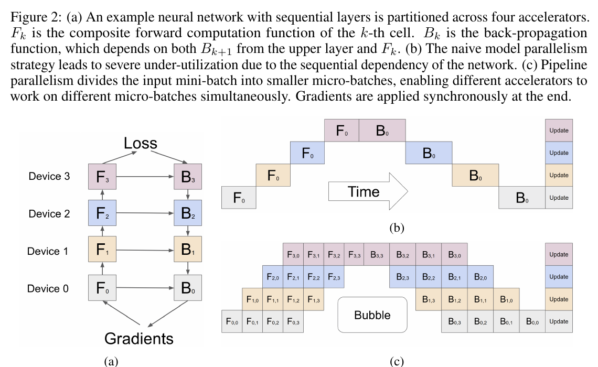
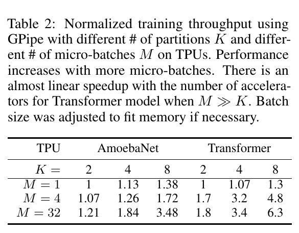

---
tags:
  - paper
  - collection/parallel-partitioning
  - domain/ai-infra
  - status/deep-review
  - topic/distributed-training
  - method/pipeline-parallelism
document_type: paper
domain: parallelism
collection: Parallel Partitioning
review_status: deep-review
canonical: true
---

# GPipe: Efficient Training of Giant Neural Networks using Pipeline Parallelism 精读分析

> [!info] 文档关系
> - 文档类型：Paper
> - 领域入口：[README](../README.md)
> - 上位汇总：[并行切分方法体系](../surveys/parallel-partitioning-taxonomy.md)
> - 选型指南：[并行策略选型](../surveys/parallel-strategy-selection.md)
> - 证据资产：[assets/papers/gpipe](../assets/papers/gpipe/)

> 资料状态：已核验 NeurIPS 2019 官方 PDF、官方页面、arXiv LaTeX 源码与 PDF 提取文本。两张配图均为官方 PDF 的 200 dpi 紧裁剪，保留完整 caption；原 LaTeX 图片用于交叉核验，但没有替代 PDF 中的编号对象。论文称 GPipe 实现在 Lingvo 中；官方仓库的稀疏检出被中断，因此本文不作代码级实现断言。

## 修订信息

- 当前文档版本：`1.0.0`
- 当前修订 ID：`rev-2019-gpipe-initial`
- 当前修订时间：`2026-07-31T16:00:00+08:00`
- 替代版本：无（initial）

| 修订 ID | 文档版本 | 时间 | 修订者 | 类型 | 替代修订 | 迁移问题/解析 | 变更摘要 | 原因 | 影响位置 | 依据 | 对结论影响 |
|---|---|---|---|---|---|---|---|---|---|---|---|
| `rev-2019-gpipe-initial` | `1.0.0` | `2026-07-31T16:00:00+08:00` | `review_gpipe` | `initial` | 无 | 无 | 初次建立完整精读、证据矩阵、图表 QA 与交付清单 | `task_packet.yaml` initial delivery | `analysis.md`、`figure_inventory.md`、两张裁剪图 | 官方 PDF、LaTeX 源码、NeurIPS 页面 | material |

## 0. 资料与配图索引

- 论文：`paper.pdf`，10 页，官方 NeurIPS PDF。
- LaTeX 源码：`source/main.tex`；下载归档：`source/arxiv-source.tar`。
- 官方页面：`official-page.html`。
- 提取文本：`extracted_text/paper-layout.txt`、`extracted_text/paper.txt`。
- 原论文机制图：`figures/crops/fig2_pipeline_mechanism_caption.png`（Figure 2，PDF p.3）。
- 原论文系统证据表：`figures/crops/table2_throughput_caption.png`（Table 2，PDF p.5）。
- 批量图像 QA：`figures/contact-sheet.png`；两张图还分别以原分辨率完成 100% 检查。
- 开源代码：论文 Section 2 指向 Lingvo，但本次未形成可审计代码快照；实现结论仅以论文为证据。
- OpenReview：任务包未提供链接，NeurIPS 官方页面也未给出公开 OpenReview 记录，故不适用。
- 算法总览：采用原论文 Figure 2，不生成 AI 示意图。

## 0.1 术语与符号解释

### 0.1.1 术语表

| 术语 | 本文含义 | 别名 | 不等于/易混项 | 证据来源 |
|---|---|---|---|---|
| cell | 一段连续层组成的复合层，放在一个加速器上 | partition/stage（本文分析中的近义叫法） | 不是单个网络层，也不是数据并行副本 | Section 2.1；Figure 2 |
| mini-batch | 一次同步参数更新所覆盖的完整样本批 | batch | 不等于单个 micro-batch | Introduction；Section 2.2 |
| micro-batch | mini-batch 被等分后的流水线调度单元 | micro-step 对应的数据块 | 不单独触发参数更新 | Section 2.2；Figure 2(c) |
| bubble overhead | 流水线填充和排空造成的设备空闲占比 | pipeline bubble | 不包含重计算、负载不均或权重更新开销 | Section 2.3；Section 3.1 |
| re-materialization | 反向传播时重新执行 cell 的前向函数，只保留分区边界激活 | recomputation/checkpointing | 不是减少参数量；省激活显存但增加计算 | Section 2.3；Table 1；Table 4 |
| synchronous update | 全部 micro-batch 梯度累计完后，对整个 mini-batch 只更新一次参数 | synchronous mini-batch SGD | 不等于 PipeDream 的异步/陈旧权重更新 | Introduction；Section 2.2；Figure 2(c) |

### 0.1.2 符号表

| 符号 | 含义 | 性质 | 作用域/索引 | 单位/取值 | 来源 | 易混点 |
|---|---|---|---|---|---|---|
| $L$ | 顺序网络的层数 | author-defined | 全模型 | 正整数 | Section 2.1 | 在 $T(L,H,A)$ 中表示编码器和解码器各自层数，语境不同 |
| $K$ | 模型分区/cell/加速器数 | author-defined | 全流水线 | 正整数 | Section 2.1–2.3 | 假设一个 cell 对应一个加速器 |
| $M$ | 一个 mini-batch 中的 micro-batch 数 | author-defined | 每次参数更新 | 正整数 | Section 2.1–2.3；Table 2 | micro-batch 大小是 $N/M$，不是 $M$ |
| $N$ | mini-batch 样本数 | author-defined | 每次参数更新 | 样本数 | Section 2.2–2.3 | NMT 实验有时用 token batch，单位需随实验解释 |
| $f_i,w_i,c_i$ | 第 $i$ 层的前向函数、参数与估计成本 | author-defined | per-layer | 函数、参数集合、相对成本 | Section 2.1 | $c_i$ 是用户可选估计量，不是论文给定的统一 FLOPs |
| $F_k,B_k,C_k$ | 第 $k$ 个 cell 的复合前向、反向和估计成本 | author-defined | per-cell | 函数、函数、相对成本 | Section 2.1；Figure 2 | $B_k$ 表示反向函数，不是 batch size |
| $p_k$ | 第 $k$ 个连续层分区 | author-defined | per-cell | 层区间 | Section 2.1 | 论文要求连续分层，不能任意图切分 |
| $b_i$ | 第 $i$ 层反向梯度 | author-defined | per-layer | 梯度张量 | Section 2.3 | 与 batch 无关 |

## 1. 论文基本信息

- 题目：GPipe: Efficient Training of Giant Neural Networks using Pipeline Parallelism
- 会议与年份：NeurIPS 2019
- 完整作者列表（论文顺序）：Yanping Huang；Youlong Cheng；Ankur Bapna；Orhan Firat；Mia Xu Chen；Dehao Chen；HyoukJoong Lee；Jiquan Ngiam；Quoc V. Le；Yonghui Wu；Zhifeng Chen。
- 第一作者及机构：Yanping Huang 是题名页首位作者；论文题名页仅列出 `@google.com` 邮箱，没有机构 marker/legend，因此机构为 `not-stated`，不从邮箱域名推断。
- 共同一作：`not-stated`。arXiv 源码含注释 “TODO Put equal contribution somewhere”，但这不是最终论文的明确贡献标记，不能作为共同一作证据。
- 通讯作者及机构：`not-stated`。PDF 题名页、作者脚注与官方页面均无通讯作者 marker/legend。
- 其余作者涉及机构：`not-stated`；同样不依据邮箱域名推断。
- 作者证据：`paper.pdf PDF p.1 title block`；`source/main.tex lines 63-98 author block`；`official-page.html author metadata`。
- 研究领域：分布式深度学习系统、模型并行。
- 核心问题：如何让超出单设备显存的顺序神经网络在多加速器上高利用率、同步且较通用地训练。
- 关键约束：网络必须能表达为层序列；单层必须装入单个加速器；有效流水要求足够多的 micro-batch 和相对均衡的 stage。

## 2. 研究动机与问题—方案闭环

### 2.1 出发点与背景痛点

作者从一个直接矛盾出发：更大模型往往提升视觉和语言任务质量，但单加速器显存不足；把模型拆到多设备后，层间依赖又会让朴素模型并行变成“一个设备算、其余设备等”。现有高效方案常依赖特定架构，或用细粒度张量切分换取大量通信。论文的目标不是提出新的网络结构，而是提供一个能接受“层序列”的通用流水线库，在模型容量、硬件利用率和同步训练语义之间取得可复用折中（Introduction；Section 2）。

### 2.2 现有方案为何不够

| 现有方案/做法 | 可观察的失败 | 具体场景或例子 | 例子来源 | 根因/被忽略变量 | 为什么简单修补仍不够 | 证据 |
|---|---|---|---|---|---|---|
| 朴素逐 stage 模型并行 | 同一时刻主要只有一个设备忙，其余等待 | Figure 2(b) 中四个设备串行执行 $F_0\ldots F_3,B_3\ldots B_0$ | paper-provided | 层间数据依赖使完整 batch 不能同时占用不同 stage | 仅增加设备会增加等待链，不会创造并发工作 | Figure 2(b)；Section 2.2 |
| 异步流水线（PipeDream 类） | 参数陈旧，需多版本权重保证反向一致 | 前向看到旧权重、更新已改变权重，反向需找回对应版本 | paper-provided | 前向、反向和更新交错导致权重版本不一致 | 直接接受陈旧权重可能影响优化；保存多版本又占用显存 | Section 6 |
| 细粒度 SPMD/张量切分 | AllReduce 类通信增多，依赖高速互联 | 每层矩阵乘都跨设备拆分并合并输出 | paper-provided | 通信发生在大量算子内部，而非少量 stage 边界 | 只加设备会继续增加跨设备通信；某些卷积维度也不易高效拆分 | Section 6 |
| 单纯增大 mini-batch（本文构造的说明例，不是论文实验） | 能扩数据并行吞吐，却不能让单设备装下超大单层序列模型 | 即使 batch 被分给更多副本，每个副本仍需保存完整模型 | reviewer-created | 数据并行复制参数，没有分摊模型状态 | 降低每副本 batch 也不减少完整参数副本 | Introduction；Section 6 |

> Figure 2 完整 caption： “(a) An example neural network with sequential layers is partitioned across four accelerators. $F_k$ is the composite forward computation function of the $k$-th cell. $B_k$ is the back-propagation function, which depends on both $B_{k+1}$ from the upper layer and $F_k$. (b) The naive model parallelism strategy leads to severe under-utilization due to the sequential dependency of the network. (c) Pipeline parallelism divides the input mini-batch into smaller micro-batches, enabling different accelerators to work on different micro-batches simultaneously. Gradients are applied synchronously at the end.”

### 2.3 论文计划解决的问题与成功标准

- 核心研究问题：在不改变同步 mini-batch 梯度语义的前提下，将层序列模型跨 $K$ 个加速器训练。
- 成功标准：模型容量随分区数扩展；当 $M$ 足够大且 stage 平衡时吞吐接近随设备数线性增长；只在分区边界传激活；不同分区数保持一致更新语义。
- 明确不解决：任意计算图切分、单层大到无法放入单设备、完全消除重计算开销、自动解决强烈层间负载不均。

### 2.4 核心方案如何解决并优化问题

| 原始问题/失败模式 | 根因或约束 | 对应方案设计 | 改变的变量/系统行为 | 作用机制 | 预期优化及指标 | 证据来源 | 判断 |
|---|---|---|---|---|---|---|---|
| 朴素模型并行设备空闲 | 完整 batch 串行穿过 stage | mini-batch 分为 $M$ 个 micro-batch | 同时在途的数据块数量增加 | 相邻 stage 对不同 micro-batch 并行工作 | 提高设备利用率/吞吐 | Figure 2；Table 2 | supported |
| 激活显存随深度和 batch 增长 | 反向需保存中间激活 | 分区边界 checkpoint + re-materialization | 保存激活减少、反向计算增加 | 只存边界，反向重算 cell 内前向 | 降低峰值激活显存 | Section 2.3；Table 1/4 | partially-supported |
| 异步权重陈旧 | micro-batch 间更新交错 | mini-batch 末统一更新 | 每个 micro-batch 使用同一参数版本 | 汇总全部 $M$ 个梯度后一次更新 | 保持同步训练语义 | Section 2.2；Figure 2(c) | supported |
| 跨设备通信过多 | 算子内部频繁归约 | 仅在 stage 边界传激活/梯度 | 通信位置变稀疏 | 每个 micro-batch 只跨相邻边界 | 无高速互联仍可扩展 | Section 2.3；Table 3 | partially-supported |
| stage 时长不一致 | 层成本异质 | 最小化 cell 估计成本方差 | stage 预计耗时更接近 | 最慢 stage 对吞吐的限制减小 | 提升流水利用率 | Section 2.2；Section 3 | plausible |

### 2.5 完整因果链与证据闭环

模型扩容受单设备显存限制；朴素层切分又因顺序依赖造成设备等待。GPipe 将连续层分成 $K$ 个 cell，把一次同步更新的数据分成 $M$ 个 micro-batch，使多个数据块同时占据不同 cell；在 mini-batch 末汇总梯度并统一更新，从而避免权重陈旧。re-materialization 再用额外前向计算换取更低激活存储。Table 2 直接显示 $M$ 增大时吞吐提升，Transformer 在 $K=8,M=32$ 达到相对吞吐 6.3；Table 1 显示可训练模型容量显著扩展；Table 4 则说明代价并未消失，重计算可占 step time 的 22.5% 左右，且 AmoebaNet 的层间不均衡限制线性扩展。

证据闭环判断：调度机制、同步更新顺序和 $M/K$ 趋势有直接图表支持；“训练稳定性不受分区数影响”主要来自语义推导，没有分区数控制的收敛曲线；“低通信适用于慢互联”有 Table 3 的单机 P100/PCIe 实验，但未报告字节量或带宽利用率，因此只部分支持。

## 3. 核心贡献

1. 提出面向顺序层网络的 micro-batch 流水线模型并行接口（Section 2）。
2. 以 mini-batch 末同步梯度更新避免流水线中的权重陈旧（Figure 2；Section 2.2、6）。
3. 将分区、batch splitting 与 re-materialization 结合，扩大可训练模型容量（Table 1）。
4. 在 TPU 和无 NVLink 的 P100 上展示吞吐扩展，并明确揭示负载不均与重计算开销（Tables 2–4）。

## 4. 研究方法

### 4.1 方法总览

输入是可写成 $L$ 层序列的网络和一个大小为 $N$ 的 mini-batch。GPipe 先用层成本估计把连续层划成 $K$ 个 cell，各放到一个加速器；再把 mini-batch 均分为 $M$ 个 micro-batch。前向时，micro-batch 依次穿过所有 cell，形成流水并发；反向时，各 micro-batch 使用其前向时相同的参数，必要时重算 cell 内激活；最后累计所有 micro-batch 梯度并同步更新一次。输出仍是一次标准 mini-batch 参数更新，而不是 $M$ 次小批更新。Figure 2 同时给出输入分区、前向/反向顺序、bubble 和更新边界，是本报告的 reader-usable algorithm overview；原分辨率 QA 已通过。

### 4.2 组件级设计动机与具体问题映射

| 设计项 | why 状态 | 原文证据 | 针对问题 | 因果机制 | 替代方案/权衡 | 验证证据 | 判断 |
|---|---|---|---|---|---|---|---|
| 连续层分成 $K$ 个 cell | author-stated | Section 2.1–2.2 | 单设备放不下模型 | 分摊参数/激活到设备 | 张量并行可拆单层但通信更多；GPipe 要求单层可放入一设备 | Table 1，未隔离分区贡献 | partially-supported |
| 成本方差最小化分区 | author-stated | Section 2.2 | 最慢 stage 限制吞吐 | 让 stage 预计耗时接近 | 更精确 profile/动态规划可能更好；估计误差导致不均 | AmoebaNet vs Transformer 间接比较 | plausible |
| $M$ 个 micro-batch | author-stated | Section 2.2–2.3 | 流水填充/排空空闲 | 增加稳态流水占比 | 更大 $M$ 减小 micro-batch，BatchNorm 和 kernel 效率可能受损 | Table 2 sensitivity | supported |
| mini-batch 末同步更新 | author-stated | Section 2.2、6 | 异步权重陈旧 | 所有 micro-batch 使用同一参数版本 | 牺牲 1F1B 式调度自由度，需保留同步边界 | Figure 2 mechanism；无收敛消融 | partially-supported |
| re-materialization | author-stated | Section 2.3 | 激活显存过大 | 只存边界、反向重算内部前向 | 省显存但增加计算；Table 4 显示重算约 22.5% | Table 1/4，组合证据 | partially-supported |
| 边界通信 | author-stated | Section 2.3 | 算子内部通信成为瓶颈 | 只传相邻 cell 的激活/梯度 | 激活很大或边界多时仍可能受限 | Table 3 间接系统证据 | partially-supported |

### 4.3 关键公式

#### F1：复合 cell 前向与成本

$$
F_k=f_j\circ\cdots\circ f_i,\qquad C_k=\sum_{l=i}^{j}c_l.
$$

**这条公式在算什么？** 把连续的第 $i$ 到 $j$ 层合成第 $k$ 个 cell，并估计该 cell 的总成本。

**怎么读？** 数据依次经过这段层函数；成本用每层估计成本相加。

**输入与输出。** 输入是层区间、各层函数与成本；输出是复合函数 $F_k$ 和估计成本 $C_k$。

**变量在这里各做什么？** $f_l$ 是第 $l$ 层前向；$c_l$ 是其成本；$i,j$ 定义连续边界；$k$ 标识 cell。

**直觉。** 分区算法让各 $C_k$ 更接近，最慢 cell 对流水吞吐的限制通常更小。

**边界。** 成本相加和静态估计不能刻画通信、kernel 形状与运行时抖动；论文未给出估计器精度。

**小例子。** 本文构造的说明例：四层成本为 1、3、2、2，切为 $[1,3]$ 与 $[2,2]$ 时两 cell 成本都为 4，但真实通信仍可能使时长不同。

#### F2：激活显存阶数

$$
\mathcal{M}_{\mathrm{act}}
=O\!\left(N+\frac{L}{K}\frac{N}{M}\right),
\quad\text{对比}\quad O(NL).
$$

**这条公式在算什么？** 估计分区、micro-batch 与重计算组合后的峰值激活存储量。

**怎么读？** 保留 mini-batch 级边界状态 $N$，再加一个 cell 内、一个 micro-batch 的层激活。

**输入与输出。** 输入为 $N,L,K,M$；输出是激活内存的渐近阶数。

**变量在这里各做什么？** $L/K$ 是每 cell 近似层数，$N/M$ 是 micro-batch 大小；增大 $K$ 或 $M$ 都降低第二项。

**直觉。** 不再为完整 batch 的每一层保存激活，而只保存边界并在反向时重算内部。

**边界。** 假设均匀层/分区，忽略参数、优化器、通信 buffer、不同激活形状和常数项。

**小例子。** 本文构造的说明例：$L=16,K=4,M=8$ 时第二项是 $4\times N/8=N/2$，加上边界项约为 $1.5N$ 的阶数；这不是字节级预测。

#### F3：bubble 比例

$$
\beta=O\!\left(\frac{K-1}{M+K-1}\right).
$$

**这条公式在算什么？** 估计流水线填充和排空造成的空闲比例。

**怎么读？** 额外空槽约随 $K-1$ 增长，而总调度长度约为 $M+K-1$。

**输入与输出。** 输入为 stage 数 $K$ 和 micro-batch 数 $M$；输出是 bubble 的近似占比 $\beta$。

**变量在这里各做什么？** 增大 $M$ 摊薄固定填充/排空成本；增大 $K$ 在固定 $M$ 下加重 bubble。

**直觉。** 当 $M\gg K$ 时，多数时间处于所有 stage 都有活干的稳态区。

**边界。** 这是均衡 stage 的理论近似；重计算可与 bubble 重叠，实际值可能更低；负载不均另算。

**小例子。** $K=4,M=16$ 时名义比例为 $3/19\approx15.8\%$；论文经验规则 $M\ge4K$ 对应这一数量级，并称实际 bubble 可忽略。

### 4.4 同步更新语义

设 mini-batch 被拆成 $M$ 份，所有 micro-batch 的前向和反向都读取同一参数快照 $w_t$，累计梯度后才执行

$$
w_{t+1}=w_t-\eta\sum_{m=1}^{M}g_m(w_t).
$$

**这条公式在算什么？** 表达 GPipe 的一次 mini-batch 同步更新。

**怎么读？** 先在旧参数上算完每个 micro-batch 梯度，再合起来更新一次。

**输入与输出。** 输入为 $w_t,\eta,g_m$；输出为下一步参数 $w_{t+1}$。

**变量在这里各做什么？** $m$ 索引 micro-batch；$\eta$ 是学习率；$g_m$ 是该 micro-batch 梯度。

**直觉。** 分区数和调度顺序不改变“本步所有样本看到同一权重版本”的核心语义。

**边界。** 论文未明确梯度是求和还是按样本数归一化；该式用求和表示调度语义，不断言具体优化器缩放。

**小例子。** 本文构造的说明例：四个 micro-batch 产生梯度 $g_1\ldots g_4$，GPipe 在四者完成后更新一次，而不是每得到一个 $g_m$ 就更新。

## 5. 关键结论与技术主张证据矩阵

> Table 2 完整 caption： “Normalized training throughput using GPipe with different # of partitions $K$ and different # of micro-batches $M$ on TPUs. Performance increases with more micro-batches. There is an almost linear speedup with the number of accelerators for Transformer model when $M\gg K$. Batch size was adjusted to fit memory if necessary.”

| 技术主张 | 证据 | 证据类型 | 结论 |
|---|---|---|---|
| 增大 $M$ 降低 bubble、提升吞吐 | Table 2：Transformer $K=8$ 从 $M=1$ 的 1.3 到 $M=32$ 的 6.3 | direct sensitivity | supported |
| Transformer 可近线性随设备扩展 | Table 2：$M=32$，K=2/4/8 为 1.8/3.4/6.3 | direct system trend | supported，但归一化基线与 batch 调整限制严格线性解释 |
| AmoebaNet 扩展较差来自层间不均 | Table 2 趋势 + Section 3 解释；Table 4 load imbalance | indirect，多架构同时变化 | partially-supported |
| re-materialization 降低激活显存 | Table 1：单设备 AmoebaNet 6.26GB 到 3.46GB | confounded：同时含 batch splitting | partially-supported |
| re-materialization 有计算代价 | Table 4：recompute 22.5%（该配置） | direct breakdown | supported |
| 慢互联也不是瓶颈 | Table 3：无 NVLink P100 上 K=2 到 8，AmoebaNet 2.7×、Transformer 3.3× | indirect，无带宽/字节报告 | partially-supported |
| 同步更新保证与分区数一致 | Section 2.2 调度语义 | mechanism/theory-like argument，无数值消融 | plausible but not empirically isolated |
| GPipe 支持任意顺序网络 | 接口定义与两类架构案例 | confounded/coverage evidence | partially-supported；单层必须能装入一设备 |

归因边界：Table 2 可以把吞吐对 $M$ 的敏感性直接归因到调度，但不能把 Table 1 的全部显存收益单独归给 re-materialization，因为分区、micro-batch 和模型配置同时变化。Table 3 支持“边界通信可工作”，不证明任意拓扑上带宽都不是瓶颈。

## 6. Related Work 对比

| 类别 | 核心机制 | 优点 | 局限 | 与 GPipe 的关系 |
|---|---|---|---|---|
| 朴素模型并行 | 顺序 stage 执行完整 batch | 简单、同步 | 设备空闲严重 | GPipe 用 micro-batch 引入 stage 并发 |
| Mesh-TensorFlow/SPMD | 将单个张量运算跨设备切分 | 可拆单层、适合大矩阵 | AllReduce 类通信多、依赖高速互联 | GPipe 只在 stage 边界通信，但不能拆超大单层 |
| PipeDream | 交错前向/反向的异步流水 | 高利用率 | 权重陈旧、多版本参数占显存 | GPipe 保留同步 mini-batch 边界，接受 bubble |
| 数据并行 | 每设备完整模型、分数据 | 通用、实现成熟 | 不能解决单副本模型显存 | 可与 GPipe 叠加，但不是替代 |

## 7. Infra 需求分析

- **算力。** re-materialization 通过重新执行 $F_k$ 增加计算；Table 4 的单一配置中 recompute 占 22.5% step time，不能外推为所有模型固定比例。
- **显存。** 参数、优化器状态按 cell 分摊；论文 Table 1 注明 RMSProp 下每参数 12 bytes。激活项受 $N/M$ 和 $L/K$ 影响，但真实值还依赖张量形状。
- **通信。** 每个 micro-batch 在 $K-1$ 个边界传前向激活，反向还传对应梯度。若单边界单向张量大小为 $A_k$ bytes，则一次 mini-batch 的近似双向通信为 $M\sum_{k=1}^{K-1}(A_k+G_k)$。这是本文推导；论文未提供 $A_k,G_k$ 或 runtime 秒数，无法计算有效带宽与峰值利用率。
- **互联。** TPU 实验使用高速互联；P100 实验明确无 NVLink、经 PCIe host path，Table 3 仍见扩展，但只覆盖单机、固定 $M=32$。
- **数据类型。** 论文没有明确报告训练权重/激活是 fp32、bf16 或混合精度；不能从 TPU 型号推断。仅明确 RMSProp 总参数相关存储按 12 bytes/parameter 计。
- **异构执行。** 论文分别在 TPU 与 GPU 上实验，没有提出 CPU/GPU/NPU 混合 stage；P100 的跨卡传输经 device-to-host-to-device，CPU/host 是通信路径而非计算 stage。
- **调度。** 静态连续层分区、相邻边界通信、mini-batch 末同步。最慢 stage、bubble、重计算与权重更新共同决定 step time。

## 8. 代码与公开评审核验

- 代码：论文 Section 2 声称在 Lingvo 中开源。已确认官方仓库远端 `https://github.com/tensorflow/lingvo.git` 的 HEAD 为 `b663bb0c475a7d7a1d5bcd227069feca392a3f00`，树中存在 `lingvo/core/gpipe.py`、`gpipe_test.py`、`layers_with_gpipe.py`；但稀疏检出被中断，没有形成可审计文件快照，因此不引用具体代码行，也不把当前 HEAD 当作 2019 论文实现版本。
- OpenReview：任务包 `openreview_url: unknown`，NeurIPS 官方页面未链接公开 OpenReview forum；此会议论文分支按不适用处理。

## 9. 局限、启发与未解决问题

1. **batch-size 约束。** 为满足 $M\ge4K$ 且保持合理 micro-batch，mini-batch 往往需随 $K$ 增大。Table 2 明示 “Batch size was adjusted to fit memory if necessary”，因此吞吐比较不是完全固定 batch 的受控实验。
2. **负载均衡。** 静态成本估计对 AmoebaNet 不如对同构 Transformer 层有效；论文没有报告更强 partitioner 的消融。
3. **单层边界。** 单层必须放入一台设备，GPipe 不能独立解决超大矩阵乘的内存问题。
4. **同步语义不等于数值逐位一致。** 论文证明的是更新边界和权重版本语义；不同设备数下浮点归约顺序是否逐位一致未测试。
5. **重计算代价。** 它节省激活显存，却在 Table 4 中成为主要额外时间来源之一；最佳 $M,K$ 需联合考虑计算、显存、BatchNorm 和 stage 平衡。
6. **待验证问题。** 在现代自动混合精度、不同互联拓扑和 1F1B 调度下，GPipe 的同步 flush 调度是否仍是最优折中？需要固定 global batch、固定模型与严格通信测量的对照实验。

## 10. Evidence Loop

动机（超大顺序网络单卡放不下）由 Introduction 和 Table 1 支持；机制（连续层分区 + micro-batch + mini-batch 末同步）由 Section 2 和 Figure 2 直接支持；预期优化（降低 bubble、扩大容量）分别由公式 F2/F3 给出；测量由 Tables 1–4 提供。证据最终落到两个限制：Table 2 的 batch 调整使吞吐对比并非完全受控，Table 1 又把分区、batch splitting 和重计算组合在一起。因此最稳健的结论是：GPipe 建立了同步 flush 流水线的可行基线，并验证 $M/K$ 与 stage 均衡决定利用率；它没有单独量化每个组件的因果贡献，也没有证明通信在所有系统上都可忽略。
