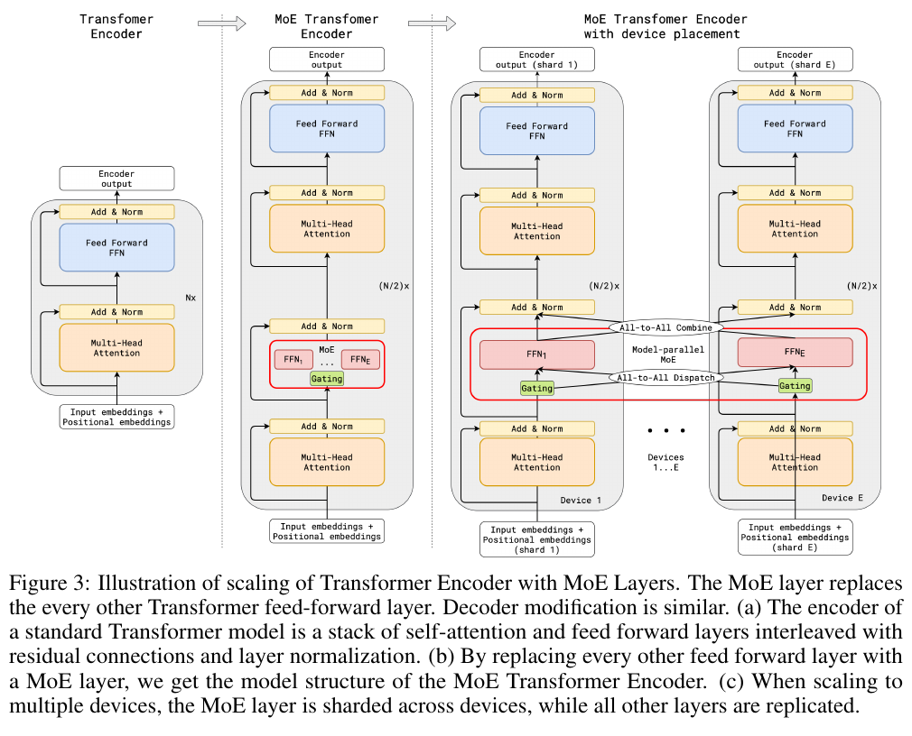
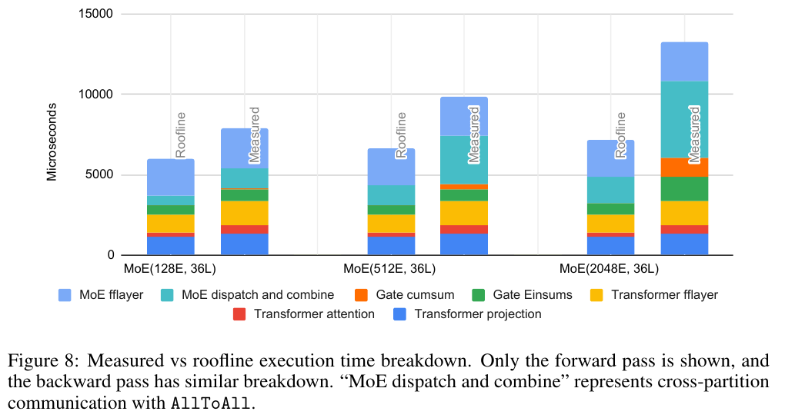

---
tags:
  - paper
  - collection/parallel-partitioning
  - domain/ai-infra
  - status/deep-review
  - topic/large-scale-model-training
  - method/mixture-of-experts
document_type: paper
domain: parallelism
collection: Parallel Partitioning
review_status: deep-review
canonical: true
---

# GShard: Scaling Giant Models with Conditional Computation and Automatic Sharding 精读分析

> [!info] 文档关系
> - 文档类型：Paper
> - 领域入口：[README](../README.md)
> - 上位汇总：[并行切分方法体系](../surveys/parallel-partitioning-taxonomy.md)
> - 选型指南：[并行策略选型](../surveys/parallel-strategy-selection.md)
> - 证据资产：[assets/papers/gshard](../assets/papers/gshard/)

> 资料状态：已取得 35 页 arXiv PDF、完整 LaTeX 源包、可搜索文本和 ICLR 2021/OpenReview 入口。论文没有给出代码仓库。两张配图均为 180 DPI PDF 页面紧裁剪，包含完整 caption，并通过 contact-sheet 与逐图原分辨率 QA。

GShard 的关键不是单独发明“专家并行”，而是把三个层次接成一条可运行链：用 top-2 MoE 让参数容量增长快于每个 token 的计算量；用少量张量 sharding 注解表达“普通层按 batch 切/权重复制、专家维切分”；再由 XLA SPMD partitioner 推导局部算子并插入 AllReduce、AllToAll 等通信。论文最重要的边界也在这里：它不是从零自动搜索最优切分策略，而是从用户给出的关键注解出发做传播、lowering 和通信生成。

## 修订信息

- 当前文档版本：`1.0.0`
- 当前修订 ID：`rev-20260731-gshard-initial`
- 当前修订时间：`2026-07-31T14:12:31+08:00`
- 替代版本：无（initial）

| 修订 ID | 文档版本 | 时间 | 修订者 | 类型 | 替代修订 | 迁移问题/解析 | 变更摘要 | 原因 | 影响位置 | 依据 | 对结论影响 |
|---|---|---|---|---|---|---|---|---|---|---|---|
| `rev-20260731-gshard-initial` | `1.0.0` | `2026-07-31T14:12:31+08:00` | `review_gshard` | initial | none | none | 首次建立论文、源码、OpenReview、机制与系统证据闭环 | delegated initial delivery | 全文与全部本地资产 | task packet；paper PDF/source；artifact QA | initial |

## 0. 资料与配图索引

- 论文：`paper.pdf`，SHA-256 `4078d81e…ad54e`
- LaTeX 源：`source.tar` 与 `source/`
- 提取文本：`extracted_text/paper.txt`
- 代码：任务包为 unknown；论文未给出公开仓库，故不把伪代码当作可执行实现
- OpenReview：`openreview_reviews.md`；论坛与 API 受 Cloudflare/HTTP 403 阻断，无法保存公开评审、decision 或 rebuttal 文本
- 机制图：Figure 3，`figures/crops/fig3_moe_device_placement_caption.png`
- 系统证据图：Figure 8，`figures/crops/fig8_runtime_roofline_caption.png`
- AI 生成图：跳过；原论文 Figure 3 已能承担方法总览，且本任务收敛到两张原论文证据图

## 0.1 术语与符号解释

### 0.1.1 术语表

| 术语 | 本文特定含义 | 别名/来源 | 不等于/易混项 | 证据来源与歧义 |
|---|---|---|---|---|
| GShard | 轻量 sharding 注解 API 加 XLA SPMD partitioner 扩展 | author-defined | 不是完全自动策略搜索器，也不等于 MoE 架构本身 | Abstract；§3.2–3.3；Related Work 明确与 FlexFlow 策略搜索区分 |
| Position-wise MoE | 每个 token 位置独立由 gating 选择至多两个 FFN 专家 | author-defined | 不是整句选择一个专家，也不是让所有专家都计算 | §2.1–2.2，Eq. 1–3 |
| expert capacity | 每组中每个专家最多接收的 token 数，文中分组容量为 $C=2N/(GE)$ | author-defined | 不是模型总参数容量 | §2.2，Algorithm 1；“2”来自 top-2 上限 |
| local group dispatching | 把 batch 的 $N$ 个 token 分成 $G$ 组，每组 $S=N/G$，组间并行执行 gating | author-defined | 不是专家只服务本地设备；专家维仍需跨设备重排 | §2.2，Algorithm 1 |
| random routing | 第二专家以与归一化 gate $g_2$ 成比例的概率被采用 | author-defined | 不是随机选专家；第一专家仍是 top-1 | §2.2，Algorithm 1 lines 15–22 |
| auxiliary loss | 用 mean gate $m_e$ 近似不可导的路由计数比例，惩罚少数专家过载 | author-defined | 不是翻译 NLL，也不是直接对离散 top-2 求导 | §2.2，Algorithm 1 line 13 |
| sharding annotation | 对关键 tensor 标注 replicate/split/shard，逻辑形状不变 | author-defined | 不等于用户手写所有通信；也不代表无须人工选择关键切分 | §3.2 |
| SPMD partitioning | 编译器把一个全局程序变换成所有设备执行的同一分区程序 | author-defined | 不等于 MPMD 的每设备独立图 | §1.2 Figure 2；§3.3 |
| resharding | 相邻算子的切分维度不一致时，重新排列分片；MoE 的 $G\to E$ 变化用 AllToAll | author-defined | 不等于 AllReduce 的数值求和 | §3.2–3.3.2，Figure 4 |
| roofline | 假定算子可达到峰值算力、内存或网络带宽所得的乐观时间下界 | industry-standard，论文定义 | 不是真实可达的绝对性能 | §5.2，Figure 8 |

### 0.1.2 符号表

| 符号 | 含义 | 性质 | 作用域/索引 | 单位/取值 | 来源 | 易混点 |
|---|---|---|---|---|---|---|
| $x_s,y_s$ | token $s$ 进入/离开 MoE 层的表示 | author-defined | per-token | $M$-维向量 | Eq. 1–3 | $s$ 是组内 token 索引，不是 sequence 总长度 |
| $E,e$ | 专家总数/专家索引 | author-defined | per-layer | $e\in[1,E]$ | §2.2 | 实验里常令 $E=D$，但概念上不恒等 |
| $G,S,N$ | 组数、每组 token 数、batch token 总数 | author-defined | per-batch | $N=GS$ | §2.2，§3.1 | $G$ 也出现在 combine tensor 的维度 |
| $C$ | 每组每专家的容量 | author-defined | per-group-per-expert | $2N/(GE)=2S/E$ | §2.2 | 必须至少为 1，限制无限扩展 |
| $G_{s,e}$ | token $s$ 对专家 $e$ 的 combine weight | author-defined | per-token-expert | 非负；最多两个非零 | Eq. 1, 3 | 大写 $G$ 同时被用作 group count，论文存在符号复用；本文用下标区分 |
| $g_1,g_2$ | top-1/top-2 的归一化 gate 值 | author-defined | per-token | $[0,1]$ | Algorithm 1 | $g_2$ 还决定随机采用第二专家的概率 |
| $c_e,m_e$ | 专家已分派 token 计数、平均 gate | author-defined | per-group-expert | count / probability | Algorithm 1 lines 1–3,13 | $c_e$ 离散不可导，$m_e$ 是可导近似 |
| $w_e^i,w_e^o,w_g$ | 专家输入/输出投影与 gating 投影权重 | author-defined | per-expert / gating | matrices | Eq. 2；Algorithm 1 | Figure/正文排版有上下标压缩，含义以 source/model.tex 为准 |
| $D$ | 设备/partition 数 | author-defined | system-wide | 128–2048（主要实验） | §3.1，§5 | 不是 Transformer hidden width |
| $M,H$ | 模型维度与专家隐藏维度 | author-defined | per-layer | experiments/config dependent | Algorithm 2，§3.1 | 论文复杂度讨论假定二者对 $D$ 为常数 |
| $\ell_{\text{aux}},\ell_{\text{nll}},k$ | 负载均衡辅助损失、翻译负对数似然及权重 | author-defined | per-group/model loss | $L=\ell_{\text{nll}}+k\ell_{\text{aux}}$ | §2.2 | 论文主训练 loss 曲线明确排除 auxiliary loss |
| $d,h,l,t$ | AllToAll 总数据量、平均跳数、链路数、时间 | analysis follows author derivation | cluster | proportional quantities/time | §5.3 | 仅在固定每 partition 数据量和 2D TPU 拓扑假设下成立 |

## 1. 论文基本信息

- 完整作者列表：Dmitry Lepikhin；HyoukJoong Lee；Yuanzhong Xu；Dehao Chen；Orhan Firat；Yanping Huang；Maxim Krikun；Noam Shazeer；Zhifeng Chen。
- 署名类型：个人署名。
- 第一作者：Dmitry Lepikhin（论文作者列表首位）。
- 第一作者机构：`not-stated`。PDF/title block 与 `source/paper.tex:75–84` 只列个人姓名和 `@google.com` 邮箱；按证据规则不能从邮箱域名推断机构。
- 共同一作：`not-stated`；论文无 equal-contribution marker/legend。
- 通讯作者及机构：`not-stated`；论文无 corresponding-author marker/legend。
- 其余作者机构：`not-stated`；同样只有邮箱，无正式 affiliation statement。
- Venue：ICLR 2021；arXiv:2006.16668。
- 任务：100→English 大规模多语机器翻译与通用自动切分编译。
- 核心约束：单设备装不下专家权重；设备数至 2048；专家负载会失衡；编译图不能随设备数线性/平方膨胀。

## 2. 研究动机与问题—方案闭环

### 2.1 出发点与背景痛点

作者从一个工程矛盾出发：扩大模型通常提升质量，但密集地增加层数或宽度会让每个 token 都执行更多计算；模型一旦超过单加速器内存，又必须引入模型并行、通信和复杂的手工切分。更糟的是，传统 MPMD 图为每台设备复制/专门化节点，通信通道还可能使图规模达到 $O(D^2)$，编译本身变成瓶颈（§1.1）。

论文给出的整体成功标准不是“参数越多越好”，而是在 100 个翻译方向上提高质量，同时让单步时间、每设备内存和编译开销随容量次线性增长。它用稀疏激活解决计算随容量增长的问题，用注解与 SPMD 编译解决可编程性和图规模问题。

### 2.2 现有方案为何不够

| 现有方案 | 可观察失败 | 具体场景 | 来源 | 根因 | 简单修补为何仍不够 | 证据 |
|---|---|---|---|---|---|---|
| 密集加深/加宽 | 参数 16× 常伴至少线性算力与更高通信 | 若 600B 参数都密集激活，每个 token 都需遍历全部权重，增加设备只会把工作拆散而不会消除总计算 | paper-provided motivation | 计算量与容量绑定 | 加设备不能改变每 token 总 FLOPs，还引入通信 | §1.1–1.2 |
| naive graph/MPMD partition | 图节点与设备数线性增长，通信通道最坏平方增长 | 2048 个设备分别生成专门化子图，构图/编译先于训练成为瓶颈 | paper-provided | 程序表示复制了设备差异 | 只缓存图不能消除每种设备程序与通道的结构增长 | §1.1；Figure 2 |
| naive top-$k$ gating | 少数专家爆满、其他专家缺少训练，训练变慢 | 某批 token 都把同一专家排第一，该专家 buffer 溢出，其余专家空闲；残差只能让丢弃 token 绕过 MoE，不能训练空闲专家 | paper-provided | 路由目标只看匹配分数，不约束群体负载 | 单纯提高容量会浪费内存，且热点可继续集中 | §2.2 |
| 完全手写 partition/communication | 改模型会连锁改通信代码 | 把某个层从 batch shard 改成 expert shard 后，用户还需识别并插入 AllToAll | reviewer-created, grounded in §1.1/§3 | 模型语义与设备拓扑耦合 | 封装几个通信函数仍要求用户为每个算子判断语义 | §1.1，§3.2–3.3 |

### 2.3 目标问题与成功标准

核心问题是：能否用一个逻辑上的巨大模型描述，在极少关键注解下自动得到数千设备可执行的 SPMD 程序，并使扩展专家容量时每设备计算/内存近似常数、通信次线性？成功标准包括翻译 $\Delta$BLEU、达到训练 loss 所需 token/算力、step time、roofline 利用率、每设备内存和 collective 延迟。

不解决的问题包括：端到端自动搜索最优切分策略、完全消除手工注解、公开可复现代码、跨非 TPU 硬件验证，以及把 top-2/capacity/random routing 各自收益做严格消融。

### 2.4 问题—方案映射

| 问题/约束 | 方案 | 改变的变量/行为 | 作用机制 | 预期指标 | 证据 | 判断 |
|---|---|---|---|---|---|---|
| 容量增长推高每 token 计算 | top-2 MoE | 激活专家数保持 ≤2，专家总数 $E$ 增长 | 未选专家不执行 | 质量随参数升，step time 次线性 | Figure 1/6，§5 | 有整体直接证据；MoE 组件未逐项隔离 |
| 热点专家溢出 | capacity + local groups + aux loss + random second route | 限制 $c_e<C$，优化平均 gate，按 $g_2$ 节省第二路容量 | 强制上限并给 routing 可导的均衡压力 | 负载稳定、避免大量 overflow | Algorithm 1 与机制解释 | 机制有直接定义，单组件收益未消融 |
| 专家权重单设备放不下 | expert dimension sharding | 专家权重沿 $E$ 分布，普通层权重复制 | 每设备只持部分专家 | 每设备 weight memory 对 $E$ 近似常数 | Figure 3/7 | 系统测量支持 |
| group-sharded token 要送到 expert-sharded device | compiler reshard | shard 从 $G$ 变 $E$ | 本地 Einsum 后插入 AllToAll；返回时反向 combine | 通信随 $D$ 次线性 | Figure 3/4/8/9 | 直接系统证据 |
| 编译图随设备数膨胀 | SPMD single program | 所有设备执行同一分区程序 | 编译器按 partition ID 做动态 slice/collective | 编译时间 $O(1)$ 于设备数 | Figure 2，§3.3 | 论文陈述与示例；缺少独立编译时间曲线 |

### 2.5 因果链与证据闭环

背景需求是提升多语翻译容量；密集扩展使计算、内存和手工并行成本失控；根因是“容量=每 token 激活计算”以及模型语义与通信实现耦合。GShard 先用 MoE 解耦容量和激活计算，再用关键 tensor 注解表达稳定的 batch/expert 切分，最后由 SPMD 编译器把全局算子降成局部算子与 collectives。测量显示 128→2048 experts（16×）时 device time 仅 1.7×，2048 experts 仍达 roofline 的 48%；600B 模型在 2048 TPU v3 cores 上 4 天训练完成并取得最佳平均质量。

闭环边界：这些是完整系统的规模对比，不是“移除 auxiliary loss”“固定 routing 改 capacity”等匹配消融。因此论文证明了组合方案能扩展，未证明每个 gating 细节都是该结果的必要原因。

## 3. 核心贡献

1. 将 top-2 MoE Transformer 扩展到 600B 参数并给出 100→English 的质量/成本证据（§2、§4）。
2. 用 replicate/split/shard 少量注解表达关键分片，让用户模型保持全局逻辑形状（§3.2）。
3. 在 XLA 中实现 SPMD partitioning，自动传播 sharding、lower 算子并插入 collectives（§3.3）。
4. 对每设备内存、runtime breakdown、AllReduce/AllToAll 与常见 partitioned operators 做规模分析（§5）。

## 4. 研究方法

### 4.1 方法总览

一个 token 首先经过普通 Transformer 层；每隔一个 FFN 被 MoE 替换。gating 计算所有专家分数，只把 token 派给至多两个专家；capacity、aux loss 与随机第二路路由约束负载。设备层面，输入/普通层按 group 或 batch 维切分、普通权重复制；专家权重沿 $E$ 切分。dispatch 把 group-sharded token 重排到 expert-sharded 设备，combine 再重排回来。训练和推理都使用这条稀疏前向路径；训练额外计算 auxiliary loss 并反向传播，部署/推理不需要这个损失项。论文没有单独评测 serving。

Figure 3 是本报告的 reader-usable overview：左→右依次显示普通 encoder、隔层替换 MoE、跨设备 placement；输入、输出、层序、复制/切分状态与 AllToAll dispatch/combine 都可见。它没有画训练反向路径，故训练/推理差异以上述正文和 §2.2 loss 定义补足。

### 4.2 专家并行与通信的准确位置

Figure 3 的切分关系可以精确表述为：

- 普通 Transformer 层：activation 沿 batch/group shard；attention/普通 FFN 权重在设备间复制。
- MoE 权重：沿 expert 维 $E$ shard，每台设备只持自己的专家。
- gating projection $w_g$：论文实现中很小，复制。
- dispatch 前：token 表示是 $[G,S,M]$，按 $G$ shard。
- dispatch 输出：$[E,G,C,M]$，需改为按 $E$ shard；compiler 在本地 dispatch Einsum 后插入 AllToAll。
- expert FFN：每台设备只计算本地 $E$ shard。
- combine：专家输出反向重排回 group/batch shard，再进入复制权重的普通层。
- AllReduce：当 dot/Einsum 沿 contracting dimension 切分、各设备得到部分和时使用；它不是 MoE token dispatch 的通信。

这回答了“all-to-all 在哪里”：不是 gating score 计算本身，也不是所有 Transformer 层，而是 group-sharded activation 与 expert-sharded activation 之间的 reshard，前向至少出现在 dispatch 与 combine 两处；Figure 8 将两者合并统计为 “MoE dispatch and combine”。

### 4.3 关键公式

$$
G_{s,E}=\operatorname{GATE}(x_s),\qquad
\operatorname{FFN}_e(x_s)=w_e^o\operatorname{ReLU}(w_e^i x_s),\qquad
y_s=\sum_{e=1}^{E}G_{s,e}\operatorname{FFN}_e(x_s).
$$

**这条公式在算什么？** 它定义一个 token 如何选择专家并合并专家输出。

**怎么读？** gating 为 token 给出稀疏权重，选中的专家各做两层 FFN，最后按 gate 加权求和。

**输入与输出。** 输入 $x_s$；输出 $y_s$，形状仍为模型维度 $M$。

**变量在这里各做什么？** $E$ 是专家数，$G_{s,e}$ 是 token–expert 权重，$w_e^i,w_e^o$ 是专家参数。

**直觉。** 增大 $E$ 增加总参数容量，但只要非零 $G_{s,e}$ 仍至多两个，每 token 激活 FFN 计算不随 $E$ 同比例增加。

**边界。** 这只描述 MoE 前向；通信成本和 gating softmax 仍可能随 $E,D$ 增长。

**小例子。** 若某 token 的两个非零权重是 0.7 和 0.3，则输出是两个专家结果的 0.7/0.3 加权和；其余专家不执行该 token。

$$
C=\frac{2N}{GE}=\frac{2S}{E},\qquad
\ell_{\text{aux}}=\frac{1}{E}\sum_{e=1}^{E}\frac{c_e}{S}m_e,\qquad
L=\ell_{\text{nll}}+k\ell_{\text{aux}}.
$$

**这条公式在算什么？** 第一式分配每组每专家 buffer 容量；第二式给过度集中路由一个可优化的惩罚；第三式把它加入主任务损失。

**怎么读？** top-2 最多产生 $2N$ 次分派，把它均匀摊到 $G E$ 个“组×专家”槽；实际离散计数不能反传，因此用平均 gate $m_e$ 搭一座梯度桥。

**输入与输出。** 输入是 $N,G,E,S,c_e,m_e$；输出是整数容量 $C$ 与标量 loss。

**变量在这里各做什么？** $c_e/S$ 表示实际路由比例，$m_e$ 表示可导的平均偏好，$k$ 控制均衡目标相对翻译目标的权重。

**直觉。** 少数专家同时拥有高 $c_e$ 与高 $m_e$ 会增大 loss；优化会压低对热点专家的平均偏好。random routing 则在 $g_2$ 很小时省下第二专家容量。

**边界。** 这是近似目标，不保证严格均匀；capacity overflow token 的 MoE 输出为零，只靠 residual path 继续。论文没有给出 $k$、capacity 或 random routing 的独立敏感性消融。

**小例子。** $N=1024,G=8,E=16$ 时 $S=128,C=16$：每组每专家最多接收 16 个 top-2 分派。

$$
t=\frac{dh}{l}=O\!\left(\frac{D\sqrt D}{D}\right)=O(\sqrt D).
$$

**这条公式在算什么？** 它估计固定每 partition 消息量时，2D TPU 网络上的 AllToAll 时间随设备数增长的阶。

**怎么读？** 总数据量随 $D$ 增，平均路径随 $\sqrt D$ 墍，但可并行链路也随 $D$ 墍，三者相除得到 $\sqrt D$。

**输入与输出。** 输入总流量 $d$、平均跳数 $h$、链路数 $l$；输出通信时间尺度 $t$。

**变量在这里各做什么？** $d=O(D),h=O(\sqrt D),l=O(D)$。

**直觉。** AllToAll 不是常数成本，但比线性增长慢；这使 $G\leftrightarrow E$ reshard 可扩展到千设备。

**边界。** 依赖 2D TPU 拓扑、固定每 partition 数据量与带宽/延迟模型；不能直接外推到任意 GPU/RDMA 拓扑。

**小例子。** 论文测量从 16 到 2048 partitions（128×），AllToAll 时间约 9×，接近 $\sqrt{128}\approx11.3$ 的次线性趋势。

### 4.4 组件设计动机矩阵

| 设计项 | why 来源 | 具体问题 | 因果机制 | 替代/权衡 | 验证证据 | 判断 |
|---|---|---|---|---|---|---|
| every-other-layer MoE | author-stated §2.1 | 密集容量成本 | 只稀疏激活部分 FFN | 每层都换可增通信；间隔选择未消融 | model-family scale trends | 组合证据，间隔选择未验证 |
| top-2 gating | author-stated §2.2 | 稀疏选择与质量 | 最多两专家加权 | top-1 更省通信、dense 更稳但贵 | 无 matched top-1 对照 | 机制明确，收益未隔离 |
| expert capacity | author-stated | 热点 buffer/失衡 | 硬上限 $c_e<C$ | overflow token 跳过 MoE | 无独立 overflow 曲线 | 未隔离 |
| local grouping | author-stated | 全 batch 顺序 gating 不可扩展 | $G$ 组独立并行 | 小组可能降低全局路由最优性 | complexity analysis | 间接支持 |
| auxiliary loss | author-stated | top-2 计数不可导且易集中 | $m_e$ 提供梯度近似 | 引入任务/均衡权衡 $k$ | 无 loss ablation | 机制可行但未隔离 |
| random second routing | author-stated | 小 $g_2$ 浪费容量 | 按权重概率舍弃低价值第二路 | 增加随机性 | 无消融 | 未验证必要性 |
| key tensor annotations | author-stated §3.2 | 手写所有 partition/comm 太重 | 用户只定关键边界，编译器传播 | 仍需并行知识；不是完全自动 | annotation examples | 功能示例支持 |
| SPMD lowering | author-stated §1.2/§3.3 | MPMD 图膨胀 | single program + partition ID | 编译器复杂、静态 shape 约束 | Figure 2/operator rules | 机制支持；compile curve 缺失 |
| AllToAll reshard | author-stated §3.3/§5 | $G$ shard 与 $E$ shard 不同 | 交换等量分片改变 shard 维 | 成为 2048E 最大扩展压力 | Figure 8/9 | 直接系统证据 |

### 4.5 “自动 sharding”的准确边界

用户明确标注少数关键 tensor 的 replicate/split/shard；编译器以这些 seed 做迭代 data-flow propagation，倾向让相邻算子 shard 一致以减少 reshard，并按 operator semantics 生成局部算子与通信。论文明确说改进自动 sharding assignment 不是焦点，并把 integer programming/ML 搜索留作未来工作（§3.2）。因此，“automatic sharding”在本文中准确指自动传播和自动 SPMD transformation，而不是无需用户注解的全局最优策略搜索。

## 5. 关键结论与证据强度

### 5.1 技术主张证据矩阵

| 技术点 | 声称效果 | 对应证据 | 控制性 | 证据分类 | 结论 |
|---|---|---|---|---|---|
| 稀疏 MoE 支持容量次线性扩展 | 600B/2048 cores/4 days | Figure 1、model family、§5 | 多项随规模共同变化 | 多项改动同时发生 | 完整系统成立，单组件归因有限 |
| SPMD 编译避免图随 $D$ 膨胀 | $O(1)$ compile representation | Figure 2、§3.3 | 示意/复杂度 | 间接 | 架构逻辑清楚，缺实测曲线 |
| 每设备内存对 expert 数近似常数 | expert weight 分布 | Figure 7 | 同 depth 比较可用 | 直接系统趋势 | 支持 |
| 16× experts 仅 1.7× device time | runtime 次线性 | Figure 8 | 相同 36L，规模变化 | 直接系统对比 | 支持整体规模结论 |
| AllToAll 约 $O(\sqrt D)$ | reshard 可扩展 | Figure 9 + 推导 | 固定 8/32MB | 直接微基准+理论 | 仅对 TPU 拓扑成立 |
| capacity/aux/random routing 各自必要 | 负载均衡 | Algorithm 1 | 无移除/替换 | 缺失 | 不能单独归因 |

### 5.2 系统性能证据

Figure 8 在 36 层固定下把 128、512、2048 experts 的 roofline 与 measured time 对齐。作者报告 128E 达到 >70% roofline，2048E 达到 48%；规模 16×，device time 1.7×。图还显示 “MoE dispatch and combine” 随规模增长显著，是 AllToAll 跨 partition 通信；正文给出它在总 MoE+Transformer 时间中的比例从 16% 升至 36%，execution time 约 3.75×。这支持“专家计算可近似保持每设备常数，但通信逐步成为瓶颈”，而不是“通信免费”。

### 5.3 质量与成本

Figure 1 报告从 37.5B 到 600B（16× 参数）时计算成本从 6 增至 22 TPU v3 core-years（3.6×）；600B 模型用 2048 TPU v3 cores 训练 4 天。最强 dense 2.3B baseline 用 GPipe 在 2048 cores 上训练 6 周/235.5 core-years并得到平均 $\Delta$BLEU 6.1。不同模型的结构、设备数和优化过程并非完全匹配，故可证明系统级质量—成本折中，不可把差值只归因于某一个 routing 细节。

### 5.4 收益归因

| 变化 | 指标变化 | 影响路径 | 证据强度 |
|---|---|---|---|
| 增加 experts（完整系统） | 16× 参数、3.6× core-years；质量继续提高 | 容量/条件计算 | 规模趋势，包含多个共同变化 |
| expert sharding + SPMD | 每设备专家权重不随 $E$ 同比例增长 | memory/compilation | Figure 3/7 + transformation analysis |
| AllToAll reshard | 16→2048 partitions 约 9× collective time | communication | matched message-size microbenchmark |
| capacity/aux/random routing | 未报告单独 delta | training stability/load balance | 机制解释，无 matched ablation |

## 6. Related Work

| 类别 | 方法 | 优点 | 局限 | 与 GShard 的关系 |
|---|---|---|---|---|
| Mesh TensorFlow | Python 库改写 operator-level SPMD | 表达灵活 | 要求用户用专门抽象重写模型 | GShard 把 transformation 下沉到 compiler |
| FlexFlow | 搜索 operator partition policy | 自动选择策略 | 策略搜索与执行变换是不同问题 | GShard 侧重从注解策略生成 SPMD 程序 |
| GPipe | pipeline parallelism | 适合深 dense 模型 | sequential dependency/bubbles，实验成本高 | GShard 以 expert/operator parallel 为主 |
| ZeRO/weight-update sharding | 切分参数/梯度/优化器状态 | 降低数据并行冗余 | 范围更特定 | GShard 的 tensor annotation 可表达更一般切分 |

## 7. OpenReview 交叉核验

| 来源 | 关切/结论 | 严重度 | 关联论文证据 | 状态 | 阅读影响 |
|---|---|---|---|---|---|
| OpenReview forum/API | review、meta-review、decision、rebuttal 文本不可取得：论坛 Cloudflare，api/api2 HTTP 403 | limitation | `openreview_reviews.md` | unresolved access | 不声称任何 reviewer 观点；方法/实验仍可由 PDF/source 核验 |
| ICLR/DBLP/ML Anthology metadata | ICLR 2021 conference paper | metadata | official-linked records | confirmed | venue 可确认，不能替代评审内容 |

## 8. 基础设施与可复现性

- 计算：主要 dense matmul 利用 TPU matrix units；作者报告 FFN/projection >85% peak FLOPS，attention 在短序列时 memory-bound，>30% peak FLOPS。
- 内存：expert weights 沿 $E$ shard；普通权重复制；activation 随 layer depth 増。XLA rematerialization 用额外重算换峰值内存，36L/60L 的 recomputation 分别约占 28%/34% cycles。
- 网络：MoE 的关键是 AllToAll reshard；contracting-dimension partial sums 用 AllReduce。Figure 8/9 表明扩展最终更受 AllToAll 压力。
- 数据类型：论文没有在核心实验中完整报告训练数值格式、累加精度或压缩通信；因此不能估计 bytes/token 或有效带宽利用率。
- 拓扑：$O(\sqrt D)$ 推导依赖 2D TPU cluster；没有 GPU/NVLink、InfiniBand、CPU/NPU 异构对照。
- runtime/scheduler：XLA 静态 shape 要求会引入 padding/uneven partition handling；没有独立在线 serving scheduler。
- 代码：无官方 repository URL/commit，无法核验配置、loss multiplier $k$、overflow telemetry、kernel 或 checkpoint metadata。论文 Algorithm 1/2 和 LaTeX source 是规范描述，不是可执行实现。

## 9. 局限、启发与待验证问题

### 9.1 局限

1. gating 四个机制缺少逐项消融，尤其无法判断 random routing 与 auxiliary loss 各自对 overflow/quality 的贡献。
2. 600B 对比同时改变 experts、设备与系统条件，质量—成本归因不是严格受控。
3. 自动化仍需关键 sharding 注解；策略搜索不在本文范围。
4. compile $O(1)$ 的主张主要由 SPMD 表示机制支持，缺少设备数—编译时长实测曲线。
5. 训练格式、带宽字节量、代码与 checkpoint 不公开，复现性受限。
6. OpenReview 公共评审内容因访问阻断未能交叉核验。

### 9.2 研究启发

- 分布式编译应把“策略选择”与“语义保持的 lowering”分开评估；两者自动化程度不同。
- MoE 扩展不能只看专家 FLOPs；路由离散操作、AllToAll、capacity 下限会依次成为新瓶颈。
- 更强的研究设计应同时报告 overflow rate、expert load entropy、task quality、communication bytes 和 wall time，并对 top-1/top-2、capacity factor、aux loss、random routing 做匹配消融。

### 9.3 待验证问题

1. 600B 模型使用的 $k$、capacity factor、overflow rate 与训练数值格式究竟是多少？
2. 如果固定总训练 token/设备拓扑，移除 random routing 或 auxiliary loss，质量、热点专家比例与 AllToAll 时间如何变化？
3. annotation 数量随模型复杂度如何增长；完全不注解时 compiler inference 能达到什么质量？
4. 在非 2D TPU 网络上，AllToAll 的实际 scaling law 与 overlap 机会是否相同？

## 10. 证据闭环结论

论文直接证明了一个组合系统能把稀疏 MoE 训练扩展到 2048 TPU v3 cores，并以 Figure 8/9 的系统证据揭示 AllToAll 是扩展压力；Figure 3 与 §3.2–3.3 明确定位了 experts、普通层和 collectives。它没有直接证明 capacity、random routing、auxiliary loss 每项都是必要条件，也没有实现“零注解的全自动最优 sharding”。因此用于并行切分综述时，最稳健的表述是：GShard 建立了 expert-parallel MoE 与 compiler-driven SPMD lowering 之间的桥梁；其自动化核心是注解传播和语义保持变换，而非端到端策略搜索。
