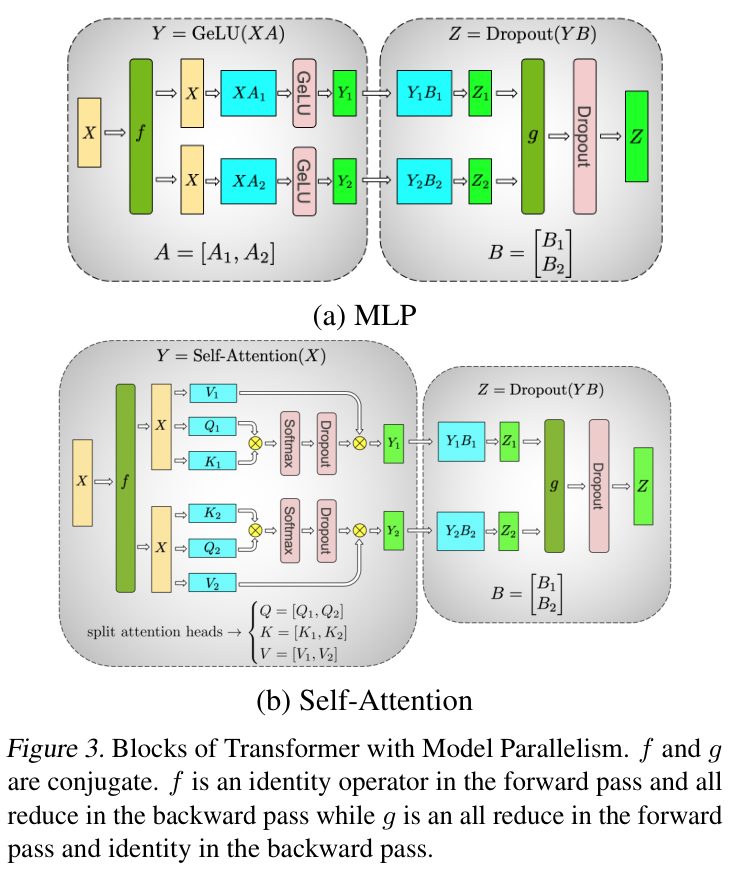
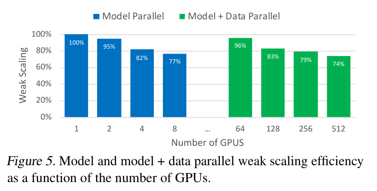

---
tags:
  - paper
  - collection/parallel-partitioning
  - domain/ai-infra
  - status/deep-review
  - topic/distributed-training
  - method/tensor-parallelism
document_type: paper
domain: parallelism
collection: Parallel Partitioning
review_status: deep-review
canonical: true
---

# Megatron-LM: Training Multi-Billion Parameter Language Models Using Model Parallelism 精读分析

> [!info] 文档关系
> - 文档类型：Paper
> - 领域入口：[README](../README.md)
> - 上位汇总：[并行切分方法体系](../surveys/parallel-partitioning-taxonomy.md)
> - 选型指南：[并行策略选型](../surveys/parallel-strategy-selection.md)
> - 证据资产：[assets/papers/megatron-lm](../assets/papers/megatron-lm/)

Megatron-LM 解决的不是“怎样让单卡算得更快”，而是“模型及其优化器状态已经放不进一张卡时，怎样把 Transformer 层内矩阵乘法切到多张卡上，同时把同步压到少数、可预期的边界”。论文的关键选择是成对安排列并行与行并行：先沿线性层输出维切权重，使 GeLU 或按头 attention 能在各 GPU 本地完成；再沿下一层输入维切权重，只在两层组合的出口合并部分和。论文直接展示了 8.3B 模型在 8 路模型并行下 77% 弱扩展效率，以及叠加 64 路数据并行、共 512 张 V100 时 74% 弱扩展效率；但没有逐组件消融，因此“少一个中间同步点分别贡献多少性能”仍未被隔离验证。

> 资料状态：PDF、arXiv LaTeX/source 与当前 NVIDIA Megatron-LM 代码均已取得。论文图为 220 DPI PDF 截图裁剪，均含完整 caption；原始 source 图片用于核对内容，但报告嵌入 PDF crop 以保留编号和 caption。当前代码快照 commit `b19b1f47cf7e289607f3be480c5f06c6ada25b16` 明确视为 2026-07-31 获取的 Megatron Core，而不是 2019 论文代码快照。

## 修订信息

- 当前文档版本：`1.0.0`
- 当前修订 ID：`rev-2019-megatron-lm-initial`
- 当前修订时间：`2026-07-31T16:00:00+08:00`
- 替代版本：none（initial）

| 修订 ID | 文档版本 | 时间 | 修订者 | 类型 | 替代修订 | 迁移问题/解析 | 变更摘要 | 原因 | 影响位置 | 依据 | 对结论影响 |
|---|---|---|---|---|---|---|---|---|---|---|---|
| `rev-2019-megatron-lm-initial` | `1.0.0` | `2026-07-31T16:00:00+08:00` | `review_megatron_lm` | `initial` | none | none | 首次建立论文、图表、代码与系统证据精读 | initial delivery | `analysis.md`; `figure_inventory.md`; accepted crops | `task_packet.yaml`; arXiv PDF/source；代码 commit `b19b1f47cf7e289607f3be480c5f06c6ada25b16` | material |

## 0. 资料与配图索引

- 论文：`paper.pdf`，15 页；arXiv 1909.08053。
- LaTeX/source：`source/`；主要依据 `intro.tex`、`background.tex`、`modelpar.tex`、`experiments.tex`、`supplementary.tex`。
- 开源代码：`code/Megatron-LM/`，remote `https://github.com/NVIDIA/Megatron-LM`，commit `b19b1f47cf7e289607f3be480c5f06c6ada25b16`。
- OpenReview：未发现本论文公开论坛；检索记录见 `openreview_reviews.md`。
- 提取文本：`extracted_text/full_text.clean.txt`；逐页渲染仅作为过程 QA，不进入正式知识库。
- Figure 3（机制）：`figures/crops/fig3_tensor_parallel_blocks_caption.png`。
- Figure 5（系统证据）：`figures/crops/fig5_weak_scaling_efficiency_caption.png`。
- 裁剪坐标、完整 caption 与 QA：`figure_inventory.md`。
- AI 生成图：不适用；原论文 Figure 3 已能表示输入、局部计算、同步边界和输出，故选作算法总览。

## 0.1 术语与符号解释

### 0.1.1 术语表

| 术语 | 本文含义 | 别名 | 不等于/易混项 | 证据来源 |
|---|---|---|---|---|
| intra-layer model parallelism | 在同一个 Transformer 层内部切分 GEMM 权重与计算 | tensor model parallelism，张量并行 | 不是把不同层放在不同设备上的 pipeline parallelism | `source/modelpar.tex` Section 3；Figure 3 |
| column parallel | 论文矩阵记法 $Y=XA$ 中，把 $A$ 的第二维（输出特征列）切成 $[A_1,\ldots,A_p]$ | output-feature sharding | 当前 PyTorch 权重通常存成 `[out,in]`，代码中的 storage dim 0 对应论文的“列” | Section 3 Eq. (3)；当前 `megatron/core/tensor_parallel/layers.py` `ColumnParallelLinear` |
| row parallel | 把第二个 GEMM 的输入特征维切开，每卡计算一个部分和，出口 all-reduce | input-feature sharding | 不是把 batch 行切给不同卡的数据并行 | Section 3；Figure 3；当前 `RowParallelLinear` |
| model-parallel region | 从复制输入进入分片 GEMM，到部分结果被归并为复制输出的区间 | TP region | 不等于整个 Transformer 层；一层包含 attention 和 MLP 两个此类边界 | Section 3；Figure 3/4 |
| $f$ operator | forward 原样复制；backward 对输入梯度做 all-reduce | copy-to-TP-region | 不是 forward all-reduce | Figure 3 caption；论文 Code 1；当前 `mappings.py` |
| $g$ operator | forward 对部分输出做 all-reduce；backward 原样传递 | reduce-from-TP-region | 不是 backward all-reduce | Figure 3 caption；当前 `mappings.py` |
| weak scaling | 随 GPU 增多同时扩大问题规模；本文主要扩大参数量，并保持约 1B 参数/GPU | 弱扩展 | 不是固定模型规模的 strong scaling | Section 5.1；Figure 5；Appendix D |
| fused vocabulary-parallel cross entropy | logits 按词表分片，直接在分片上求交叉熵所需归约量，避免先 all-gather 完整 $b\times s\times v$ logits | vocab-parallel loss | “融合”表示跨分片损失计算，不代表不通信 | Section 3；当前 `cross_entropy.py` |
| model parallelism（论文用语） | 论文对层内张量切分的总称 | tensor parallelism（后续常用名） | 当前 Megatron Core 的“model parallel”还可包含 pipeline/context/expert 等维度 | 论文全篇；当前代码目录结构 |
| scaling efficiency | 相对一张 GPU 强基线的实际吞吐/理想线性吞吐比 | weak-scaling efficiency | 不是硬件峰值利用率；单卡基线本身为峰值的 30% | Section 5.1；Figure 5 |

### 0.1.2 符号表

| 符号 | 含义 | 性质 | 作用域/索引 | 单位/取值 | 来源 | 易混点 |
|---|---|---|---|---|---|---|
| $X$ | 线性层输入激活 | author-defined | token/batch 维合并后的局部层输入 | 元素张量 | Section 3 Eq. (1)–(3) | row-split 反例中 $X=[X_1,X_2]$；列并行方案中每卡读取完整 $X$ |
| $A$ | MLP 第一线性层权重 | author-defined | 输入特征 × 输出特征 | 参数张量 | Section 3 Eq. (1)–(3) | 论文的列维对应当前 `[out,in]` 存储的 dim 0 |
| $A_i$ | 第 $i$ 个列分片 | author-defined | tensor-parallel rank $i$ | 参数张量 | Section 3 Eq. (3) | 每个 $A_i$ 产生输出特征子块 |
| $B_i$ | 第二线性层的第 $i$ 个行分片 | author-defined | tensor-parallel rank $i$ | 参数张量 | Figure 3 | 各卡结果是同一输出的部分和，需 $g$ 归并 |
| $Y,Y_i,Z,Z_i$ | 第一 GEMM/GeLU 输出及第二 GEMM 部分/完整输出 | author-defined | 每层、每 rank | 激活张量 | Eq. (1)–(3)；Figure 3 | $Z_i$ 不是独立输出特征块，而是需求和的部分贡献 |
| $Q_i,K_i,V_i$ | 分到第 $i$ 张 GPU 的 attention heads 对应投影 | author-defined | attention head/rank | 激活张量 | Figure 3b；Section 3 | 论文假定 head 数可按 TP 度切分 |
| $H$ | hidden size | author-defined | model-wide/per-token | features | Section 3 embedding discussion | 在 $E_{H\times v}$ 中是 embedding hidden 维 |
| $v$ | vocabulary size | author-defined | model-wide | tokens；GPT-2 原 50,257，扩展实验 padding 到 51,200 | Sections 3、5.1 | 不等于每卡词表分片大小 |
| $b$ | batch size | author-defined | training step | samples | Section 3 | 通信式中的 $b$ 是未明确区分 global/local 的论文符号 |
| $s$ | sequence length | author-defined | sample | tokens；GPT-2 训练为 1024 | Sections 3、4 | 与设备数无关 |
| $p$ | tensor-parallel 组大小 | analysis-derived | one TP group | GPUs | 本文对论文 1/2/4/8-way 配置的统一记号 | 论文正文未用 $p$ 写通信公式 |
| $q$ | 每个通信元素的字节数 | analysis-derived | collective | bytes/element | 本文通信量推导 | 与 query $Q$ 不同，本文只在通信公式中用小写 $q$ |
| $n$ | 一次边界 all-reduce 的元素数，近似 $bsH$ | analysis-derived | one collective | elements | 本文通信量推导 | 实际 layout、sequence parallel 与 microbatch 会改变它 |
| $P$ | 模型参数量 | analysis-derived | full model | parameters | 本文显存下界推导 | 论文表格写 parameter count，不给符号 |
| $F_p,F_1$ | $p$ 卡与单卡基线的持续 FLOP/s | analysis-derived | scaling experiment | FLOP/s | 本文对 Figure 5 的定义重建 | 不是理论峰值 |
| $\eta_p$ | 相对单卡基线的弱扩展效率 | analysis-derived | scaling experiment | ratio/% | 本文根据 Section 5.1 重建 | 不等于 $F_p/$硬件峰值 |

## 1. 论文基本信息

- 标题：*Megatron-LM: Training Multi-Billion Parameter Language Models Using Model Parallelism*
- 版本/时间：arXiv 2019；取得的 PDF 使用 accepted ICML 2020 样式。本文对技术内容按该 15 页 PDF 核验，不把会议元数据差异转成技术结论。
- 完整作者列表（按论文顺序）：Mohammad Shoeybi；Mostofa Patwary；Raul Puri；Patrick LeGresley；Jared Casper；Bryan Catanzaro。
- 署名类型：个人署名；author identity verified。
- 第一作者/共同一作及机构：

| 作者 | 身份依据 | 所属机构 | 对应依据 |
|---|---|---|---|
| Mohammad Shoeybi | first listed; equal-contribution marker `equal` | NVIDIA | `source/main.tex lines 53-61`：`\icmlauthor{Mohammad Shoeybi}{equal,to}`；`equal` legend 为 Equal contribution；`to` 为 NVIDIA |
| Mostofa Patwary | equal-contribution marker `equal` | NVIDIA | `source/main.tex lines 53-61` |
| Raul Puri | equal-contribution marker `equal` | NVIDIA | `source/main.tex lines 53-61` |

- 通讯作者及机构：

| 作者 | 身份依据 | 所属机构 | 对应依据 |
|---|---|---|---|
| Mohammad Shoeybi | corresponding-author command | NVIDIA | `source/main.tex lines 53-61`：`\icmlcorrespondingauthor{Mohammad Shoeybi}{mshoeybi@nvidia.com}` 与 `to` affiliation |

- 其余作者涉及机构（去重）：NVIDIA。
- 作者与机构核验说明：`source/main.tex lines 53-61` 同时提供 author marker、`Equal contribution` legend、NVIDIA affiliation 与唯一通讯作者命令；没有从顺序或邮箱域名推断角色。
- 研究领域：大规模 Transformer 训练系统。
- 核心问题：单设备无法容纳多十亿参数模型时，如何在层内切分计算并限制通信。
- 关键约束：同构 V100 GPU、NCCL collective、可整除的 hidden/head/vocabulary 分片；实验网络为 DGX-2H NVSwitch + InfiniBand。

## 2. 研究动机与问题—方案闭环

### 2.1 出发点与背景痛点

作者明确指出，模型变大带来质量收益，但参数、梯度与 Adam 状态让单个 32GB V100 很快成为容量边界（Introduction）。数据并行只复制完整模型，activation checkpointing 只减少激活保存，因此两者都没有改变“每个 worker 必须容纳完整模型参数/优化器状态”这一约束。论文目标不是发明通用分布式编译器，而是在原生 PyTorch Transformer 中插入少数 collective，既突破容量限制，又保持 GEMM 足够大、GPU 主要做计算而非等待通信。

### 2.2 现有方案为何不够

| 现有方案/做法 | 可观察的失败 | 具体场景或例子 | 例子来源 | 根因/被忽略变量 | 为什么简单修补仍不够 | 证据 |
|---|---|---|---|---|---|---|
| 只做数据并行/大 batch | GPU 数增加了，但单卡仍要保存完整模型；超大 batch 还可能恶化收敛 | 8.3B 模型需要 8 路模型并行；仅把 batch 分到 512 卡仍不能让一份 8.3B 模型进入单卡 | paper-provided | 数据并行切样本，不切模型状态 | 再加数据并行卡只增加模型副本，不减少每副本显存 | Background 2.3；Table 1 |
| 用 activation checkpointing | 激活显存下降，但权重、梯度与 Adam 状态仍保留 | 本文构造的说明例，不是论文实验：8.3B 权重仅按 fp16 已约 16.6GB，尚未计梯度、master weights、Adam 一二阶状态，32GB 仍很紧/不足 | reviewer-created | checkpointing 只改变 activation 保存策略 | 更频繁重算不会分片参数或优化器状态 | Introduction；Setup；本文显存下界公式 |
| 第一 GEMM 按输入维切开并先求部分和 | GeLU 前必须同步；否则非线性不能对部分和分别计算 | 论文给出 $\mathrm{GeLU}(X_1A_1+X_2A_2)\neq \mathrm{GeLU}(X_1A_1)+\mathrm{GeLU}(X_2A_2)$ | paper-provided | 非线性不满足可加性 | 把同步挪到 GeLU 后会改变数学结果；降低同步频率不能修正错误 | Section 3 Eq. (2) |
| 通用 compiler/framework 或 pipeline | 需要改写/编译；pipeline 可能有 bubble 或优化器一致性折中 | GPipe 要安排 microbatch 流水；若阶段不均衡，快阶段会等待慢阶段 | paper-provided（论文概述） | 跨层依赖与阶段负载形成 pipeline 空洞 | 单纯加 microbatch 能减 bubble，但引入调度/激活内存权衡，不替代层内容量切分 | Background 2.3 |

### 2.3 论文计划解决的问题与成功标准

- 核心研究问题：用少数 PyTorch collective 实现可组合的 Transformer 层内模型并行。
- 成功标准：模型能超过单卡容量；弱扩展保持较高效率；模型规模扩大仍能收敛并改善下游指标。
- 论文明确不解决：跨节点大规模 tensor-parallel 的最终形态、>16B 所需的层内+层间混合方案、各组件独立性能归因（Conclusion）。

### 2.4 核心方案如何解决并优化问题

| 原始问题/失败模式 | 根因或约束 | 对应方案设计 | 改变的变量/系统行为 | 作用机制 | 预期优化及指标 | 证据来源 | 判断 |
|---|---|---|---|---|---|---|---|
| GeLU 前若切输入维需同步 | 非线性不可对部分和分配 | 第一 GEMM 列并行 | 每卡持有输出特征子块 $A_i$，复制读取 $X$ | 每卡独立算 $XA_i$ 并本地 GeLU | 删除两 GEMM 中间同步 | Eq. (2)(3)，Figure 3 | supported（数学机制）；性能份额未隔离 |
| 下一层要恢复完整 hidden 输出 | 各卡持有中间特征子块 | 第二 GEMM 行并行 | 每卡算同一输出的部分和 $Y_iB_i$ | 出口一次 all-reduce 得到完整 $Z$ | 每个 MLP forward 仅一次 all-reduce | Section 3，Figure 3 | supported（机制）；仅有整体 scaling |
| attention 投影和 heads 规模大 | heads 可独立计算 | Q/K/V 列并行、按 head 本地 attention、输出投影行并行 | head 参数与工作量按 rank 分配 | softmax/attention 在本地 head 上完成，出口合并 | 降低单卡参数/计算，避免 attention 内同步 | Section 3，Figure 3b；Appendix Table 7 | partially-supported |
| 完整 vocabulary logits 通信巨大 | $v$ 为数万，logits 大小 $bsv$ | vocabulary-parallel embedding + cross entropy | 每卡只保留词表分片，通信标量/归约统计 | 不 all-gather 全 logits，直接求分布式 loss | 通信从 $bsv$ 级避免为少数 $bs$ 归约 | Section 3；当前 `cross_entropy.py` | supported（代码/机制）；无独立性能实验 |
| 模型并行扩容量但单实例训练慢 | 单一 TP 组只是一份模型 | TP 组外叠加 64-way DP | 8 卡组成一模型副本，64 个副本同步对应参数梯度 | TP 处理容量，DP 处理吞吐 | 512 卡总持续 15.1 PFLOP/s | Appendix C；Figure 5 | supported（整体系统结果） |

### 2.5 完整因果链与证据闭环

背景触发是更大语言模型需要更多参数和 Adam 状态；可观察痛点是模型无法装入单张 V100。数据并行没有切模型，输入维切第一 GEMM 又会在 GeLU 前制造同步。论文于是把第一线性层按输出维切分，使非线性和 attention heads 本地化；把第二线性层按输入维切分，在模块出口才归并。改变的是每卡驻留的权重/中间特征份额与 collective 的位置，预期结果是单卡容量压力下降且 GPU 保持 compute-bound。Figure 5 的 77%/74% 弱扩展效率、8.3B/512 GPU 训练与 15.1 PFLOP/s 支持“系统能扩展”的整链结论。

证据边界是：论文没有“列+行配对 vs 朴素切分”“融合词表损失 vs all-gather logits”“重复 elementwise vs 广播”的匹配消融，因此它验证了完整系统而非每个设计的独立贡献；模型质量随参数增长也同时改变层数、hidden size、训练配置，不能当作 tensor-parallel 本身提高质量的因果证据。

## 3. 核心贡献与创新点

1. 在 Transformer MLP 与 attention 中建立“列并行 → 本地非线性/按头计算 → 行并行 → 出口归约”的简洁层内切分。
2. 用 $f/g$ 共轭 autograd 边界把 forward/backward collective 位置表达清楚：每层 attention 与 MLP 合计 forward 两次、backward 两次 all-reduce。
3. 词表并行交叉熵避免聚合 $b\times s\times v$ 完整 logits。
4. 在 512 张 V100 上展示 8.3B 模型与 74% 弱扩展效率，并给出 head 数、强扩展和混合 TP×DP 的补充测量。
5. 论文还报告 BERT layer norm/residual 重排改善大模型训练稳定性；这与 tensor parallel 是并列贡献，不应混作切分机制收益。

## 4. 研究方法

### 4.1 方法总览

输入 $X$ 在 TP 组内复制。第一 GEMM 的每卡权重只覆盖一段输出特征；本地得到 $XA_i$，直接做 GeLU 或属于本卡的 attention heads。第二 GEMM 的权重按输入特征切分，与这段中间激活自然对齐；每卡输出 $Z_i$ 是同一完整输出的部分和。$g$ 在 forward 合并这些部分和；反向时 $f$ 在模型并行区域入口合并各列分片对输入梯度的贡献。attention 和 MLP 各重复一次这一结构。

> 原论文 Figure 3（PDF crop）。黄色为复制输入，青色为权重/激活分片，绿色 $f/g$ 标出跨 TP rank 的 autograd 通信边界。它是本报告采用的 reader-usable algorithm overview；训练 forward 从左到右，backward 反向经过同一边界，推理只使用 forward 路径。

### 4.2 列并行与行并行到底切哪个维度

论文采用 $Y=XA$，所以：

- `column parallel`：$A=[A_1,\ldots,A_p]$，切的是输出特征维。每卡输出 $Y_i=XA_i$，不需要先相加。
- `row parallel`：下一权重 $B=[B_1;\ldots;B_p]$，切的是输入特征维。因为上一层已经输出 $[Y_1,\ldots,Y_p]$，第 $i$ 卡直接算 $Z_i=Y_iB_i$，最后 $Z=\sum_i Z_i$。
- 当前代码的 `ColumnParallelLinear` 文档仍写 $A=[A_1,\ldots,A_p]$，但 PyTorch 参数实际 shape 是 `[out_features,in_features]`；因此 storage 的第 0 维分片就是论文矩阵的“列”。把存储维编号直接叫“行/列”会造成表面矛盾。

### 4.3 $f/g$ 的 forward/backward collective 精确位置

| 边界 | forward | backward | 为什么 |
|---|---|---|---|
| $f$：复制输入进入 column-parallel 层 | identity/copy | 对各输出分片贡献的 input gradient 做 all-reduce | forward 各卡都需完整 $X$；backward 完整 $dX=\sum_i dX_i$ |
| $g$：row-parallel 部分和离开 TP region | 对 $Z_i$ 做 all-reduce | identity/copy | forward 完整 $Z=\sum_i Z_i$；backward 每卡可接收同一个 $dZ$ 计算本地分片梯度 |

论文 Code 1 明示 $f$ 的 forward identity/backward all-reduce；Figure 3 caption 明示 $g$ 相反。当前 commit 的 `megatron/core/tensor_parallel/mappings.py` 仍把 `copy_to_tensor_model_parallel_region` 记作 “forward: copy, backward allreduce”，把 `reduce_from_tensor_model_parallel_region` 记作 “forward: all reduce, backward copy”。`ColumnParallelLinear` 默认不 gather 输出，而 `RowParallelLinear` 默认在 forward 调用 reduce；这核对了 2019 概念，但当前代码还包含 sequence parallel、expert communication、异步 dgrad 等后续分支，不能归属于原论文。

### 4.4 组件级设计动机与具体问题映射

| 设计项 | 论文是否明确说明 why | 原文证据 | 针对的具体问题/失败模式 | 因果机制 | 替代方案/权衡 | 验证证据 | 判断 |
|---|---|---|---|---|---|---|---|
| MLP 第一 GEMM column parallel | author-stated | Section 3 Eq. (2)(3) | GeLU 前同步 | 输出分片让 GeLU 本地执行 | 输入维切分会先 reduce；代价是复制输入 | theory/algebra + Figure 3 | supported |
| MLP 第二 GEMM row parallel | author-stated | Section 3，Figure 3a | 中间分片需接续且最终恢复完整 hidden | 直接消费分片激活，只在出口求和 | all-gather 中间激活会通信更多 | mechanism visualization；整体 scaling | partially-supported |
| Q/K/V column + heads local + output row | author-stated | Section 3，Figure 3b | attention 权重/计算超单卡 | 独立 head 无需跨卡 softmax | head 数须可分；head 太多会缩小 GEMM | Table 7 sensitivity（82→80→77%） | partially-supported |
| vocabulary parallel + fused CE | author-stated | Section 3 | all-gather $bsv$ logits 太大 | 只对 max、目标 logit、exp-sum 等统计归约 | 实现复杂、需数值稳定 collective | 当前 `cross_entropy.py` code；无论文消融 | partially-supported |
| elementwise/LN/residual 复制计算 | author-stated | Section 3 | 广播小算子结果增加同步 | 多算少量 FLOPs 换通信消失 | 参数复制占少量内存 | none | unverified |
| TP×DP 分组 | author-stated | Appendix C，Figure 8 | TP 解容量但单副本吞吐有限 | TP rank 位置对应组成 DP group | 两类 all-reduce 竞争网络 | Figure 5 overall result | partially-supported |
| model-parallel RNG 双流 | author-stated | Appendix C.2 | dropout 在 TP 区域内外需要不同一致性 | 区域外相同 seed，区域内 rank-specific seed | RNG 状态管理复杂 | description only | unverified |
| mixed precision + activation checkpointing | author-stated | Setup 4.2 | V100 吞吐与激活显存 | Tensor Cores + 重算 | 数值/重算成本 | full-system result only | unverified |
| BERT LN/residual 重排 | author-stated | Section 5.3，Figure 7 | >336M 原 BERT 训练不稳定 | 改变归一化/残差的梯度路径 | 架构与既有 checkpoint 不同 | Figure 7 direct architecture comparison | supported within tested sizes |

### 4.5 关键公式

#### F1：为什么第一 GEMM 的列并行能把 GeLU 留在本地

$$
[Y_1,\ldots,Y_p]=[\operatorname{GeLU}(XA_1),\ldots,\operatorname{GeLU}(XA_p)].
$$

**这条公式在算什么？** 它回答第一线性层按输出特征切分后，各 GPU 能否独立完成非线性。

**怎么读？** 同一个输入 $X$ 分别乘每个列分片 $A_i$，各自做 GeLU，拼接后与完整层输出一致。

**输入与输出。** 输入是复制的 $X$ 和权重列分片 $A_i$；输出是按输出特征分片的 $Y_i$。

**变量在这里各做什么？** $X$ 提供所有输入特征；$A_i$ 只产生第 $i$ 段输出；$Y_i$ 是本卡可继续消费的中间激活；$p$ 是分片数。

**直觉。** 增加 $p$ 会缩小每卡的输出宽度和 GEMM，但无需在 GeLU 前同步；过大 $p$ 会让 GEMM 变小、通信占比上升。

**边界。** 输出维必须可合理分片；各卡需要完整 $X$；结论依赖 GeLU 按元素作用。

**小例子。** 本文构造的说明例，不是论文实验：若完整输出宽度为 8、$p=2$，两卡各算 4 个输出通道并本地 GeLU，拼接即 8 通道输出。

#### F2：为什么朴素输入维切分不能越过 GeLU

$$
\operatorname{GeLU}(X_1A_1+X_2A_2)
\neq
\operatorname{GeLU}(X_1A_1)+\operatorname{GeLU}(X_2A_2).
$$

**这条公式在算什么？** 它判断能否让两卡先各做 GeLU、最后再相加。

**怎么读？** 非线性作用在总和上，通常不等于先对各部分非线性再求和。

**输入与输出。** 输入是两段输入/权重乘积；左边输出正确完整层结果，右边是错误的“先非线性后归并”结果。

**变量在这里各做什么？** $X_iA_i$ 是第 $i$ 卡对 pre-activation 的部分贡献；GeLU 改变其数值，破坏加法可分性。

**直觉。** 只要两部分跨过 GeLU 前未求和，就改变了网络函数，而不仅是数值误差。

**边界。** 对纯线性函数等号可成立；对一般 GeLU 不成立。

**小例子。** 本文构造的说明例，不是论文实验：即便两个部分贡献大小相近，GeLU 对负值抑制与对正值保留也使“先加后激活”和“各自激活后再加”不同。

#### F3：一层训练迭代的 all-reduce 近似通信量

对 ring all-reduce、每次边界张量 $n\approx bsh$ 个元素、每元素 $q$ bytes，论文所述一层 forward 两次 + backward 两次 all-reduce 的每卡传输量近似为：

$$
C_{\text{layer,train}}
\approx 4\cdot 2\frac{p-1}{p}\,nq
=8\frac{p-1}{p}\,bsHq.
$$

**这条公式在算什么？** 它估算一个 Transformer 层一次训练 forward+backward 中，tensor-parallel collective 给每张卡带来的链路字节量。

**怎么读？** 四次 all-reduce，每次 ring 算法每卡收发约 $2(p-1)/p$ 份张量。

**输入与输出。** 输入是 $p,b,s,H,q$；输出是每卡每层的近似传输 bytes。

**变量在这里各做什么？** $p$ 决定 ring 分段比例；$b,s,H$ 决定边界激活元素数；$q$ 把元素数换成字节；$n$ 是单次 collective 大小。

**直觉。** 当 $p$ 增大时每卡计算约按 $1/p$ 下降，但通信因子趋近常数 $2$，所以强扩展最终通信占主导；这与 Appendix D 的 1.2B 模型 8 卡仅 2.98× speedup 一致。

**边界。** 这是 analysis-derived ring 模型，不是论文报告值；忽略协议开销、拓扑、overlap、microbatch、sequence parallel 和通信融合。

**小例子。** 本文构造的说明例，不是论文实验：$p=8$ 时四次 all-reduce 合计约搬运 $7nq$ bytes/卡/层，因为 $8(p-1)/p=7$。

#### F4：Figure 5 的弱扩展效率

$$
\eta_p=\frac{F_p}{pF_1}.
$$

**这条公式在算什么？** 它把 p 卡实际持续 FLOP/s 与单卡基线线性放大 p 倍比较。

**怎么读？** 实际吞吐除以理想线性吞吐就是效率。

**输入与输出。** 输入为 $F_p,F_1,p$；输出 $\eta_p\in[0,1]$ 或百分比。

**变量在这里各做什么？** $F_1$ 是 1.2B 单卡强基线的 39 TFLOP/s；$F_p$ 是扩展配置持续吞吐；$p$ 是对应 GPU 数。

**直觉。** $\eta_p$ 越低，说明通信、较小 GEMM 或其他系统开销占比越高。

**边界。** 本文重建定义；不同 $p$ 的模型规模也改变，属于 weak scaling，不是固定模型的纯加速比。

**小例子。** 论文给出 8 路模型并行效率 77%；即实际持续吞吐约为同一单卡基线理想 8 倍值的 0.77。

#### F5：仅计算权重的显存下界

$$
M_{\text{weights,lower}}=\frac{Pq}{p}.
$$

**这条公式在算什么？** 它给出参数均匀分片后，每卡仅权重本身的理论显存下界。

**怎么读？** 总参数数乘每参数字节，再除以 TP 卡数。

**输入与输出。** 输入为参数量 $P$、权重字节 $q$、TP 度 $p$；输出为每卡 bytes。

**变量在这里各做什么？** $P$ 表示模型容量；$q$ 由数值格式决定；$p$ 表示均匀分片份数。

**直觉。** 8.3B fp16 权重总计约 16.6GB；8 路均分仅权重约 2.08GB/卡，但训练还需梯度、优化器状态、激活与未分片/复制项。

**边界。** analysis-derived 下界；论文未报告 master weight/Adam state 的确切精度布局，不能用此式还原实际峰值显存。

**小例子。** 上述 8.3B、$q=2$、$p=8$ 即论文配置的容量直觉示例，不是论文实测显存。

### 4.6 训练、数据与部署边界

- GPT-2：sequence 1024、global batch 512、300k iterations；2.5B/8.3B 使用 128/512 GPUs。
- 训练语料：Wikipedia、CC-Stories、RealNews、OpenWebText；BERT 另含 BooksCorpus，GPT-2 排除它以避免 LAMBADA overlap；LSH 去重阈值 Jaccard >0.7，最终 174GB。
- 数值格式：论文明确 mixed precision + dynamic loss scaling，利用 V100 Tensor Cores；没有给 bf16/fp8/int8 路径。
- 内存：每层 activation checkpointing；Adam + weight decay；论文没有分项峰值显存与通信时间。
- 部署：论文研究训练，不报告 serving latency、KV cache、推理调度或 CPU offload。当前代码中的推理优化、MoE、FP8 等不属于 2019 证据。

## 5. 关键结论

### 5.1 扩展效率证据

Figure 5 的模型并行序列为 1/2/4/8 GPUs：100%/95%/82%/77%；模型+数据并行为 64/128/256/512 GPUs：96%/83%/79%/74%。作者以单卡 1.2B、39 TFLOP/s（理论峰值 30%）为强基线。8.3B、512 GPU 配置持续 15.1 PFLOP/s，论文摘要写 76% scaling efficiency，正文 Figure 5/Section 5.1 写最大混合配置 74%；这是来源内部的口径差异，不能静默合并。最稳妥结论是：不同图/段落给出 74%–76% 的整体效率口径，Figure 5 的明确柱值为 74%。

### 5.2 技术主张—证据矩阵

| 论文声称的技术点 | 声称收益/效果 | 对应实验/消融 | 对照是否受控 | 指标变化 | 证据强度 | 结论 |
|---|---|---|---|---|---|---|
| column→row 配对删除中间同步 | 更少 collective、更好 scaling | Figure 3 + Figure 5 | 无组件替换 | 整体 8-way TP 77% | theory + mechanism visualization + confounded system result | 机制成立，性能贡献未隔离 |
| attention head 本地化 | attention 无即时通信 | Appendix Table 7 | head 数 sensitivity，但 GEMM shape 同时变 | 16/24/32 heads：82/80/77% | sensitivity | head 粒度影响效率；不是“有无该设计”消融 |
| vocabulary-parallel CE | 避免 $bsv$ all-gather | 无论文性能表；当前代码实现 | 无 | 未报告 | code-only | 通信阶数机制明确，速度收益未量化 |
| 重复 LN/dropout/residual | 少广播 | 无 | 无 | 未报告 | none | unverified |
| TP×DP 可组合 | 扩容量并扩吞吐 | Figure 5 | 随 GPU、模型大小、DP 同时变化 | 512 GPU 74% | confounded full-system | 整体系统支持，TP/DP 各自损耗不可分 |
| BERT LN/residual 重排 | 大模型稳定、loss 更低 | Figure 7 | 架构对照较直接 | 752M 原架构不稳、重排更低 loss | direct architecture comparison | tested setting supported |
| 规模增大提升 GPT-2/BERT 质量 | perplexity/accuracy 改善 | Figure 6、Tables 3/5 | 参数规模与训练计算同时变化 | GPT-2 355M→8.3B：WikiText 19.31→10.81，LAMBADA 45.18→66.51% | scaling trend, not component ablation | correlation with scale，不证明 TP 改善质量 |

### 5.3 收益归因

| 组件/变化 | 对比基线 | 指标变化 | 影响路径 | 证据强度 |
|---|---|---|---|---|
| 完整 tensor-parallel 系统 | 单卡 1.2B 强基线 | 8-way 77% weak-scaling efficiency | capacity + throughput | full-system |
| 叠加 64-way DP | 单卡基线线性外推 | 512 GPUs 74%（Figure 5） | training throughput | 多项变化同时发生，无法拆分 |
| 1.2B 固定模型 strong scaling | 1 GPU | 2/4/8 GPU speedup 1.64/2.34/2.98× | iteration time | matched model size，Appendix Table 8 |
| attention heads 16→32 | 相同 8.3B、8-way TP | efficiency 82%→77%，绝对 -5pp、相对约 -6.1% | GEMM 粒度/softmax 工作量 | sensitivity；head shape 同时变化 |
| 8.3B vs 355M GPT-2 | 不同规模训练 | WikiText perplexity -8.50（约 -44.0%）；LAMBADA +21.33pp（约 +47.2% relative） | model capacity/compute | 相关趋势，不归因于 TP 组件 |

证据闭环：容量痛点 → 分片机制有代数与 Figure 3 支持 → 当前代码仍保留相同基本 autograd 边界 → Figure 5/Appendix 测到整体扩展 → 但缺少逐项消融，因此结论止于“完整设计可工作且扩展良好”，不能断言每项优化的独立速度收益。

## 6. Related Work 对比

| 类别/工作 | 方法核心 | 优点 | 局限 | 与本文关系 |
|---|---|---|---|---|
| data parallel | 切 batch、复制模型 | 吞吐扩展简单 | 单卡仍需完整模型；超大 batch 收敛有风险 | Megatron 与其正交组合 |
| activation checkpointing | backward 重算 activation | 降激活显存 | 不切参数/优化器状态，增加计算 | 论文同时采用 |
| GPipe | 跨层 pipeline + microbatch | 可跨设备放不同层 | bubble、调度和激活权衡；TensorFlow 框架 | 与层内 TP 正交 |
| Mesh-TensorFlow | 用语言/编译器描述 tensor sharding | 通用 | 需要编译/图改写 | Megatron 借鉴 tensor 切分，但用少数 PyTorch primitive |
| FlexFlow | 搜索并行策略 | 可探索多维切分 | 框架/搜索复杂 | Megatron 选择 Transformer 专用静态切法 |
| ALBERT parameter sharing | 复用层参数降容量 | 显存小 | 限制独立参数容量 | Megatron 保留容量、跨卡分片 |

公平性边界：论文没有与同硬件、同模型、同训练预算的 GPipe/Mesh-TensorFlow 吞吐对照，因此“更简单”由实现描述支持，“更快”不能由跨论文叙述直接证明。

## 7. OpenReview 公开评审 × 论文内容交叉核验

- OpenReview 链接：not applicable。
- 访问日期：2026-07-31。
- exact-title + OpenReview 检索未发现本作公开 forum；任务包也未提供 URL。
- 因此没有 review/meta-review/decision/rebuttal 可交叉核验。此缺口不阻断论文技术核验，但意味着无法利用评审阶段材料判断作者是否回应过消融、公平性或口径问题。记录见 `openreview_reviews.md`。

| 来源 | 评审观点/约束/潜在问题 | 对应论文 claim/实验 | 论文/代码证据 | 状态 | 交叉核验后的判断 |
|---|---|---|---|---|---|
| Public OpenReview | no public record found | not applicable | `openreview_reviews.md` | not applicable | 不把缺失评审解释为“没有争议” |

## 8. Infra 需求分析

### 8.1 计算、显存与算子

- 硬件：最多 32 台 DGX-2H，512 × Tesla V100 SXM3 32GB。
- 节点内：论文报告经 NVSwitch 的 300 GB/s GPU 间带宽；节点间每服务器 8 个 InfiniBand adapter、合计 100 GB/s interconnect。
- 主要算子：大 GEMM、GeLU、attention softmax、all-reduce；作者通过避免中间同步和复制小 elementwise 计算，使大部分时间仍留在 GEMM。
- 数值：mixed precision + dynamic loss scaling；论文未给通信 buffer dtype、累加精度与实测有效带宽。
- 调度/runtime：Python 调用 NCCL；无自定义 C++/compiler。论文未报告 collective/computation overlap 的细节。

### 8.2 带宽利用率与拓扑边界

论文给的是链路标称带宽和端到端 FLOP scaling，没有给每次 collective 的 bytes、时延或持续有效带宽，所以不能计算
$\text{effective bandwidth}=\text{bytes moved}/\text{runtime}$
及其相对峰值利用率。F3 只能作为算法通信量近似。实验把一个 8-way TP group 放在同一 DGX-2H 内，利用较快 NVSwitch；64 个副本之间做 DP。这个布局说明 77% TP 结果依赖高速节点内互连，不能直接外推到跨节点 8-way TP。

### 8.3 异构硬件

2019 方案和实验假定同构 NVIDIA GPU + NCCL；没有 CPU/GPU 混合放置、NPU、PCIe fallback、DMA/pinned-memory 或 host offload 实验。CPU 负责数据/框架控制的细节未量化。当前代码出现 CPU offloading 与更多 process groups，但它们属于后续 Megatron Core，不是论文证据。

## 9. 当前代码交叉核验：2019 论文 vs 2026 快照

核验 commit：`b19b1f47cf7e289607f3be480c5f06c6ada25b16`。

| 概念 | 当前代码证据 | 与论文关系 |
|---|---|---|
| $f$ | `megatron/core/tensor_parallel/mappings.py:492` `copy_to_tensor_model_parallel_region`: “forward: copy, backward allreduce” | 精确一致 |
| $g$ | `mappings.py:498` `reduce_from_tensor_model_parallel_region`: “forward: all reduce, backward copy” | 精确一致 |
| column parallel | `layers.py:869` `ColumnParallelLinear`：$A=[A_1,\ldots,A_p]$，默认每卡保留 $Y_i=XA_i$ | 基本概念一致；新增异步、sequence/expert 分支 |
| row parallel | `layers.py:1249` `RowParallelLinear`；forward 末 `reduce_from_tensor_model_parallel_region` | 基本概念一致 |
| vocab embedding | `layers.py:230` `VocabParallelEmbedding`；按 vocab range mask/local lookup 后 reduce | 与论文 Section 3 一致 |
| vocab CE | `cross_entropy.py` 对全局 max、target logit、exp sum 做 all-reduce，而非 gather 全 logits | 核验论文的通信机制 |

当前仓库还包含 Transformer Engine、sequence/context/expert/pipeline parallelism、MoE、inference optimized collectives 等。它只能证明核心抽象在当前实现中延续，不能证明 2019 具体 kernel、配置或性能路径与今天相同。未取得 2019 历史 commit，也未运行多 GPU 测试；所有代码结论均是静态核验。

## 10. 局限、实践启示与待验证问题

### 10.1 局限

1. 缺少逐组件消融：同步点删除、词表 CE 融合、elementwise 复制和 RNG 设计的独立收益未知。
2. Figure 5 是弱扩展：GPU 数、模型参数、GEMM shape 同时变化；不能等同固定模型加速。
3. 摘要 76% 与 Figure 5 最大混合配置 74% 口径不一致；报告保留两者并以图中柱值为准。
4. 通信 topology 偏向节点内 8-way TP；跨节点 tensor parallel 的结论未验证，作者也将 >16B 的跨节点/混合方案列为未来工作。
5. 质量结果证明“更大模型相关于更好指标”，不证明 tensor parallel 改变模型函数或质量。
6. 当前代码是后续 Megatron Core 快照；2019 实现复现性只能由论文 source 与延续抽象部分支持。
7. 无公开 OpenReview 记录；无法核验评审/反驳。

### 10.2 实践启示

- 设计张量并行时先找“可分离计算 → 非线性/归一化 → 需要求和”的边界，而不是机械按任意矩阵维切。
- 列并行/行并行命名必须绑定数学矩阵语义，并同时说明框架权重存储 layout。
- TP group 应优先放在高速局部互连内；DP 跨组扩展。若 TP 跨慢链路，F3 的近似通信量会很快成为瓶颈。
- 训练系统评测应同时给固定模型 strong scaling、扩大模型 weak scaling、collective 时间和有效带宽；只给端到端 FLOP efficiency 不足以定位损失。

### 10.3 待验证清单

- 在同一模型、同一 batch、同一 kernel 下，对比“paired column→row”与额外中间 all-gather/reduce 的延迟和带宽。
- 单独测 vocab-parallel CE 相对 full-logit all-gather 的 bytes、时间与数值一致性。
- 复原 2019 对应代码 commit 与配置，核对论文 Figure 5 是否能在原硬件/软件栈复现。
- 拆分摘要 76% 与正文 74% 的计算分母、GPU 范围或 rounding 差异。
- 对跨节点 TP、不同互连和更大 TP degree 测试效率边界。

## 11. 阅读结论

这篇论文建立了后来所谓 tensor parallel 的 canonical Transformer 切分：第一线性层切输出维，第二线性层切输入维，attention heads 复用同一模式；$f$ 在 backward 合并输入梯度，$g$ 在 forward 合并输出部分和。论文强项是机制清楚、原生 PyTorch 边界少、整体系统规模证据强；弱项是设计项的独立性能证据不足。可以把它作为“张量并行基本语义和 collective 配对”的基线，但不能把当前 Megatron Core 的所有优化或 74%–77% 效率直接外推到不同网络拓扑与现代硬件。
