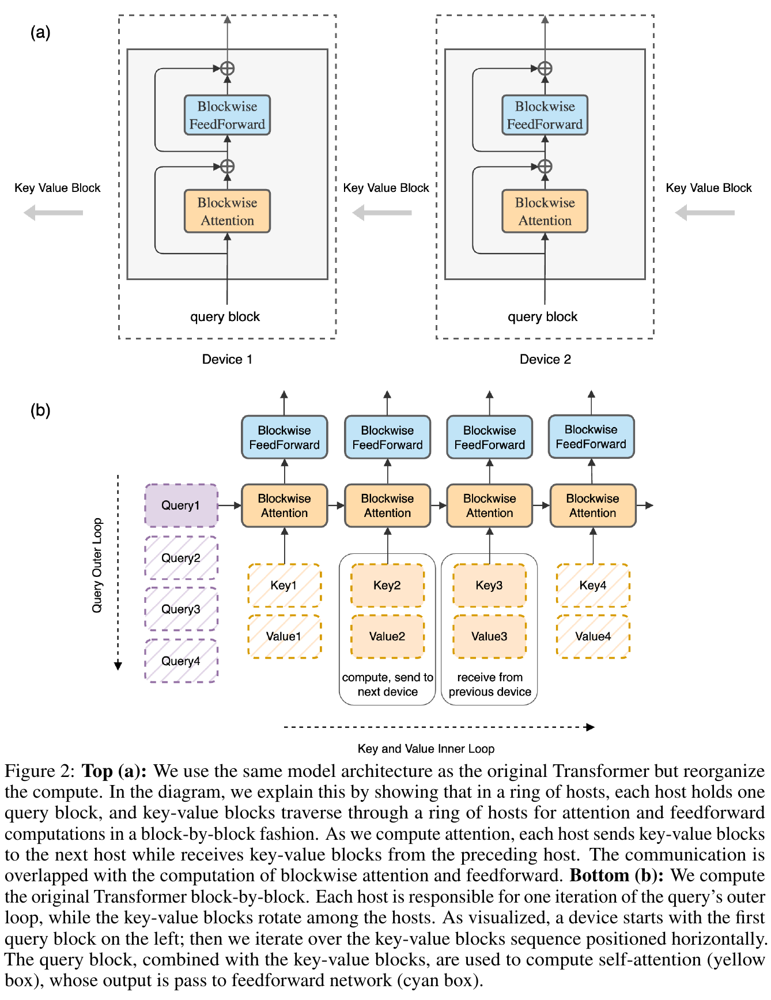
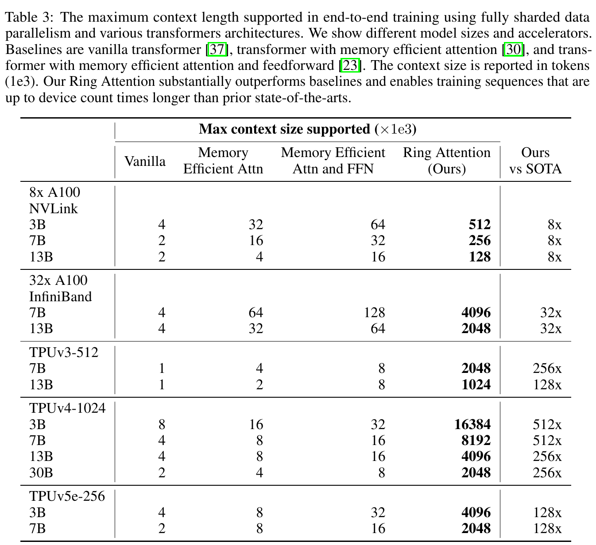

---
tags:
  - paper
  - collection/parallel-partitioning
  - domain/ai-infra
  - status/deep-review
  - topic/long-context
  - method/ring-attention
document_type: paper
domain: parallelism
collection: Parallel Partitioning
review_status: deep-review
canonical: true
---

# Ring Attention with Blockwise Transformers for Near-Infinite Context 精读分析

> [!info] 文档关系
> - 文档类型：Paper
> - 领域入口：[README](../README.md)
> - 上位汇总：[并行切分方法体系](../surveys/parallel-partitioning-taxonomy.md)
> - 长序列专题：[序列与上下文并行](../topics/sequence-and-context-parallelism.md)
> - 证据资产：[assets/papers/ring-attention](../assets/papers/ring-attention/)

Ring Attention 的核心不是近似注意力，而是重新安排**精确 softmax attention**的数据流：每个设备固定保留自己的 query block，key/value block 沿设备环逐站传递；设备一边对当前 $Q$–$K,V$ 块做 blockwise attention，一边收发下一块。它确实把单卡激活内存从随总序列长度 $s$ 增长改成随本地块长 $c$ 增长，但“零额外开销”只在单块计算时间不短于单跳通信时间时成立；因果掩码还会让不同 query block 的有效计算量呈三角形分布，论文没有实验隔离这一负载不均边界。

> 资料状态：已取得 arXiv PDF、完整 LaTeX 源码、ICLR 官方 proceedings 页面、可搜索文本和官方 JAX 仓库浅快照。两张论文原始证据图均为 240 DPI PDF 单对象裁剪，包含完整 caption。OpenReview 论坛/API 被浏览器验证与 HTTP 403 阻断；已保存访问证据并保留该限制。

## 修订信息

- 当前文档版本：`1.0.0`
- 当前修订 ID：`rev-20260731-initial`
- 当前修订时间：`2026-07-31T16:01:18+08:00`
- 替代版本：无（initial）

| 修订 ID | 文档版本 | 时间 | 修订者 | 类型 | 替代修订 | 迁移问题/解析 | 变更摘要 | 原因 | 影响位置 | 依据 | 对结论影响 |
|---|---|---|---|---|---|---|---|---|---|---|---|
| `rev-20260731-initial` | `1.0.0` | `2026-07-31T16:01:18+08:00` | `review_ring_attention` | `initial` | 无 | 无 | 首次建立论文、源码、代码、两张视觉证据与 OpenReview 访问限制的完整精读 | 初始交付 | `analysis.md`; `figure_inventory.md`; `openreview_reviews.md` | `task_packet.yaml`; arXiv:2310.01889；代码 commit `d2ea1af9a288f85ea2fd74690ece1c16d2eebc83` | material |

## 0. 资料与配图索引

| 对象 | 本地证据 | 核验范围 |
|---|---|---|
| 论文 PDF | `paper.pdf` | 16 页；Poppler 可读；PDF 生成时间 2023-11-28 |
| LaTeX 源码 | `source/2310.01889.tar`; `source/src/main.tex` | 标题块、公式、caption、实验表与 appendix code |
| 提取文本 | `extracted_text/paper.txt` | `pdftotext -layout` |
| 官方出版页 | `official_iclr_page.html` | ICLR 2024 conference paper、作者、摘要 |
| 官方实现 | `code/ringattention/` | GitHub `haoliuhl/ringattention`；commit `d2ea1af9a288f85ea2fd74690ece1c16d2eebc83` |
| OpenReview | `openreview_reviews.md`; `openreview_forum.html` | 公开元数据可核；review/rebuttal/decision 正文被访问控制阻断 |
| 机制图 | `figures/crops/fig2-ring-attention-mechanism-caption.png` | Figure 2；完整 caption；逐图 QA 通过 |
| 结果/系统证据 | `figures/crops/table3-max-context-caption.png` | Table 3；完整 caption；逐图 QA 通过 |
| 视觉 QA | `figure_inventory.md`; `figures/contact-sheet.png` | contact-sheet 初筛与原分辨率逐图检查均通过 |

Figure 2 已同时承担读者可用的算法总览：它给出输入块、按设备组织的执行顺序、KV 环传、blockwise attention、FFN 和输出路径，因此没有生成 AI 替代图。

## 0.1 术语与符号解释

### 0.1.1 术语表

| 术语 | 本文含义 | 别名/来源 | 不等于/易混项 | 证据来源 |
|---|---|---|---|---|
| Ring Attention | 将序列按设备切块，每个设备固定本地 query block，并让 K/V block 沿环循环，从而计算完整、精确的注意力 | 论文 Section 3；Figure 2；代码 `ringattention_jax.py` | 不是稀疏/近似 attention；“ring”描述通信拓扑，不是模型层结构 | PDF Section 3；Figure 2；代码 15–50 行 |
| Blockwise Parallel Transformer (BPT) | 以小块计算 attention 与 FFN，避免物化完整注意力矩阵和超大 FFN 激活 | 论文 Section 2 | BPT 本身仍要存储每层完整序列输出，故单卡仍受 $s$ 约束 | PDF Section 2 |
| query-local / KV-ring | 本精读用于概括“Q 块驻留、K/V 块环传”的状态归属 | analysis-derived；对应 Figure 2 | 不是论文正式命名；Q 的投影输入/输出也随序列维分片 | Figure 2；Algorithm 1；代码 27–49 行 |
| online softmax | 按 K/V block 顺序维护逐 query 的最大 logit、指数和与加权值和，最终与一次性 softmax 完全等价 | 论文引用 Milakov & Gimelshein；代码 126–143 行 | 不是近似归一化；必须用跨块最大值校正避免溢出 | PDF Section 3；代码 126–143 行 |
| communication/computation overlap | 在计算当前块时异步传送下一 K/V 块；只有计算时间覆盖传输时间才不暴露通信延迟 | 论文 Section 3 “Arithmetic Intensity” | “overlap”不等于通信消失；负载不足、低带宽或因果跳块时仍可能暴露延迟 | PDF Section 3；Table 2 |
| block-causal attention | 代码按 `causal_block_size` 将 token 分组，并跳过完全在因果对角线上方的 Q–K chunk | README 与代码定义 | `causal_block_size=1` 才等价逐 token causal mask；大于 1 是 block-causal | README 58 行附近；代码 145–165、299–307 行 |
| MFU | model FLOPs utilization，模型理论 FLOPs 相对硬件峰值 FLOPs 的比例 | 论文 Section 5.2 | 不是端到端网络利用率，也不能单独证明通信完全隐藏 | PDF Table 4 与 Section 5.2 |
| FSDP | 对模型状态做 fully sharded data parallelism；论文用它匹配总 token batch 并释放模型内存 | 论文 Section 4/5 | 不等于 Ring Attention 的 sequence sharding；两者可组合 | PDF Section 5.1 |

### 0.1.2 符号表

| 符号 | 含义 | 性质 | 作用域/索引 | 单位/取值 | 来源 | 易混点 |
|---|---|---|---|---|---|---|
| $Q,K,V$ | query、key、value 矩阵 | author-defined | 全序列或本地 block | shape $s\times d$；代码为 batch×length×heads×head-dim | PDF Section 2；代码 15–19 行 | 论文 Section 2 的 $d$ 是 head dimension，后文算术强度也用 $d$ 表示 hidden/head dimension，表述略松 |
| $s$ | 总序列长度 | author-defined | 全局 | token | PDF Sections 2–3 | 每设备长度在均匀切分时约为 $s/N_h$ |
| $c$ | 本地 block size | author-defined | 每设备/每块 | token | PDF Section 3、Tables 1–2 | 与代码内更细的 `query_chunk_size`/`key_chunk_size` 不完全等同 |
| $d$ | attention 每 token 的特征维度 | author-defined | 每 attention block | elements | PDF Sections 2–3 | 论文未始终严格区分 head dimension 与 hidden dimension |
| $b$ | batch size | author-defined | 全局 | sequences | PDF Table 1 | 论文实验也以 total tokens 约束 batch，二者不要混用 |
| $h$ | 模型 hidden dimension | author-defined | 每 token | elements | PDF Table 1 与 Appendix FLOPs | 不等于 head 数 |
| $n$ | attention head 数；Appendix FLOPs 公式中又表示层数 | author-defined | 模型 | count | PDF Table 1；Appendix “Training FLOPs” | 论文发生符号复用；本文在 FLOPs 讨论中写作 $L$ 表示层数以消歧 |
| $N_h$ | host/device 数 | author-defined | 环全局 | count | Algorithm 1 | 不等于 attention head 数 |
| $F$ | 每设备峰值计算率 | author-defined | 每设备 | FLOP/s | PDF Section 3 | 论文表中 TF 需换算为每秒 FLOP；实际可用计算率通常低于峰值 |
| $B$ | 相邻设备单向互联带宽 | author-defined | 每链路 | byte/s | PDF Section 3/Table 2 | 论文把 NVLink/InfiniBand/ICI 都归入同一抽象，未建模拓扑争用 |
| $m_j$ | 合并前 $j$ 个 KV block 后的逐 query 最大 logit | analysis-derived from code | 每 query/head | logit | 代码 136–142 行 | 论文未显式写该递推符号 |
| $\ell_j$ | 合并前 $j$ 个 block 后的 softmax 指数和 | analysis-derived from code | 每 query/head | dimensionless | 代码 138–142 行 | 代码名为 `denominator` |
| $o_j$ | 合并前 $j$ 个 block 后尚未除以 $\ell_j$ 的加权值和 | analysis-derived from code | 每 query/head/value dim | value-weighted sum | 代码 139–142 行 | 代码名为 `numerator`，最终输出才是 $o_j/\ell_j$ |

## 1. 论文基本信息与署名

- 标题：*Ring Attention with Blockwise Transformers for Near-Infinite Context*
- venue：ICLR 2024 conference paper（官方 proceedings 与索引一致）
- 完整作者列表（论文顺序）：Hao Liu；Matei Zaharia；Pieter Abbeel
- 署名类型：个人署名
- 第一作者/共同一作及机构：

| 作者 | 身份依据 | 所属机构 | 对应依据 |
|---|---|---|---|
| Hao Liu | 论文标题块第一位；没有 equal-contribution 标记 | UC Berkeley | PDF 第 1 页标题块与 `source/src/main.tex` 55–61 行；作者组下统一列出 UC Berkeley |

- 通讯作者及机构：`not-stated`。标题块只列 Hao Liu 邮箱，没有 corresponding-author marker/legend；本分析不把邮箱推断为通讯作者。
- 其余作者涉及机构（去重）：UC Berkeley。
- 共同一作：未标注，不推断。
- 作者与机构核验边界：论文只给作者组统一机构，没有逐人数字标记；因此第一作者映射到 UC Berkeley，其他作者机构去重为 UC Berkeley。

## 2. 研究动机与问题—方案闭环

### 2.1 出发点与背景痛点

作者从一个可观察的内存约束出发：即便 FlashAttention/BPT 不物化 $s\times s$ 注意力矩阵，下一层仍需要当前层的全部 $s$ 个 token 输出。论文给出的量级例子是 batch 1、hidden size 1024、1 亿 token 时需要超过 1000 GB，而单个当代 GPU/TPU 的 HBM 通常低于 100 GB（Introduction 与 Section 2，author-stated）。因此，单卡内存仍把“总序列长度”与“每层激活驻留量”绑在一起。

目标不是降低注意力语义精度，而是在保持原 Transformer attention 的前提下把序列维跨设备分片，使单设备只承担固定大小的本地状态；若设备数增加，单条序列的总长度应近似线性增加。成功标准至少包含三项：精确 attention、单设备激活不随全局 $s$ 增长、通信尽量被块计算隐藏。

### 2.2 现有方案为何不够

| 现有方案/做法 | 可观察的失败 | 具体场景或例子 | 例子来源 | 根因/被忽略变量 | 为什么简单修补仍不够 | 证据 |
|---|---|---|---|---|---|---|
| Vanilla Transformer | attention 激活随 $s^2$ 增长，长序列 OOM | 论文以 1 亿 token、$h=1024$、batch 1 举例，内存超过 1000 GB | paper-provided | 物化或保存全局 token 交互与层输出 | 只降低 batch 已到 batch 1，无法继续；加单卡 HBM 仍远小于量级差 | Introduction；Section 2 |
| memory-efficient attention / BPT | 内部 attention/FFN 峰值下降，但每层完整序列输出仍要留在同一设备 | 本文构造的说明例：若把 1M token 分成小块逐块算，但每块输出最终仍汇集到一张卡，输出驻留量仍随 1M 线性增大 | reviewer-created，依据论文 Section 2 | 计算分块没有改变输出所有权 | 把 chunk 再切小只降低瞬时工作集，不改变完整输出的最终驻留位置 | Section 2 “Large Output of Each Layer” |
| 传统 sequence parallel / 先 gather 全序列 | 通信处于关键路径，或每设备仍要临时得到完整序列 | 本文构造的说明例：8 卡逐层 all-gather K/V 后再算，任何设备都要等待聚合，并承受全序列临时内存 | reviewer-created，依据 Related Work | 通信和计算阶段分离，算术强度不足时无法遮蔽传输 | 换成更快 collective 只能缩短等待，不能把每个块的通信嵌入可用计算窗口 | Related Work；Section 3 |

### 2.3 论文计划解决的问题与成功标准

- 核心问题：怎样在多设备上保持精确 Transformer attention，又让单设备激活只依赖本地块长？
- 场景：大规模训练；论文也声称可用于 inference，但训练证据更完整。
- 约束：均匀序列分块、相邻环通信、块计算时间覆盖传输时间、足够大的本地序列块。
- 成功标准：Table 1 的峰值激活 $6bch$；Table 3 的最大单序列长度随设备数扩展；Table 4 的 MFU 接近期望值。
- 明确没有解决：注意力总计算量仍是 $O(s^2)$；因果负载均衡、故障容错、异构设备、低带宽互联和真实在线 decode 延迟没有完整实验。

### 2.4 核心方案如何解决并优化问题

| 原始问题/失败模式 | 根因或约束 | 对应方案设计 | 改变的变量/系统行为 | 作用机制 | 预期优化及指标 | 证据来源 | 判断 |
|---|---|---|---|---|---|---|---|
| 单卡保存全序列层输出 | 输出所有权集中 | 沿序列维按 $N_h$ 设备分片 | 每卡驻留长度从 $s$ 降到约 $s/N_h=c$ | Q/层输出保持本地，K/V 才移动 | 单卡激活 $6bch$，总上下文约随 $N_h$ 线性增大 | Section 3；Table 1；Table 3 | partially-supported：内存和最大可运行长度有直接证据，跨更大 $N_h$ 的线性外推仍有边界 |
| 全局 attention 需要所有 K/V | 本地 Q 必须与每块 K/V 交互 | KV ring | 把全量 gather 改成 $N_h$ 次相邻单跳流式传递 | 每站计算一个 Q–KV block，完整一圈覆盖所有 K/V | 精确 attention，无全量 K/V 驻留 | Figure 2；Algorithm 1；代码 27–50 行 | supported：算法与代码直接一致 |
| 分块 softmax 需要全局归一化 | 不同块的 logit 标度不同 | online softmax 递推 | 维护 $m,\ell,o$ 三个充分统计量 | 以新最大值重标定旧部分再累加 | 与一次性 softmax 数值等价 | Section 3；代码 126–143 行 | supported：公式性质与代码直接支持 |
| 环通信可能拖慢关键路径 | 计算时间可能短于传输 | 双缓冲式 overlap 与 $c\ge F/B$ 条件 | 当前块计算与下一块收发并行 | 计算窗口覆盖 K/V 单跳通信 | 不暴露额外通信时延；MFU 接近期望 | Section 3；Table 2；Table 4 | partially-supported：有理论下界与端到端 MFU，但没有通信-only 消融/latency 曲线 |
| causal attention 上三角无用 | 不必要计算可跳过 | 代码 `skip_upper_half` + token/block mask | 不同 Q block 的有效 KV 计算量不同 | 完全上三角 chunk 被跳过，边界 chunk 内再 mask | 降低 causal 无效 FLOPs | 代码 145–165、233–261、299–329 行 | plausible：实现存在，但论文无 causal 负载/吞吐实验；可能破坏均衡 overlap |

### 2.5 完整因果链与证据闭环

背景触发是长上下文的单卡 HBM 不足；可观察痛点是 BPT 仍保存完整层输出；根因是序列输出的单设备所有权没有被改变。Ring Attention 把序列状态按设备切分，让 Q 与层输出本地驻留、K/V 沿环流动，并用 online softmax 把任意顺序的块结果精确合并。这样单设备峰值激活由全局 $s$ 改由本地 $c$ 决定，理论上增加设备就能增长全局上下文；Table 3 确认了多个硬件设置下的最大可运行长度，Figure 2/代码确认了数据流。

证据闭环的边界是：Table 3 证明“能跑多长”，不是通信完全隐藏的直接测量；Table 4 的实际 MFU 接近期望值是间接系统证据，但没有把 ring 通信、causal imbalance、FSDP/tensor parallel 和 kernel 效率分别消融。论文反复声称“超过 100M/near-infinite”，而 Table 3 的最大明确条目为 TPUv4-1024、3B 模型的 16.384M token；因此 100M 是能力外推或未在主表中呈现的结果，不能按主表实测结论使用。

## 3. 核心贡献

1. 提出 query-local/KV-ring 的精确 attention 调度，把序列维分片与 blockwise attention/FFN 结合（Section 3、Figure 2）。
2. 给出 online softmax 状态合并、环通信以及前后向实现，使每个 Q block 最终覆盖所有 K/V block（Algorithm 1、Appendix code、官方仓库）。
3. 给出计算—通信重叠条件 $c\ge F/B$ 和单设备激活上界 $6bch$（Section 3、Tables 1–2）。
4. 在 A100、TPUv3/v4/v5e 与 3B–30B 配置上报告最大上下文长度，Table 3 展示相对 BPT 基线最高 512× 的单序列长度（但这个倍率同时包含设备数带来的聚合资源）。

## 4. 研究方法

### 4.1 算法总览

输入序列先沿长度维均匀切成 $N_h$ 块。设备 $i$ 计算并固定保留自己的 $Q_i$，初始拥有 $K_i,V_i$。每个 ring step 中，它用 $Q_i$ 与当前到达的 $K_j,V_j$ 更新 online-softmax 累积量，同时把当前 K/V 送到下一设备、从上一设备接收下一块。走完 $N_h$ 个 step 后，每个 $Q_i$ 已见过全部 K/V，得到精确 attention 输出；输出留在原设备做 blockwise FFN。下一 Transformer layer 重复该过程。

> Figure 2 是原论文算法总览，不是生成图。上半部分说明 Q 驻留与 KV 环传；下半部分展开一个 query 外循环和多个 KV 内循环。它没有画出 online-softmax 的 $m,\ell,o$ 状态，也没有表现 causal skip 的负载不均，需结合公式与代码理解。

### 4.2 前向与反向数据流

**前向。** 官方 commit `d2ea1af9a288f85ea2fd74690ece1c16d2eebc83` 的 `ringattention/ringattention_jax.py` 15–50 行固定本地 Q，按设备 index 推导当前 K block，全环 `lax.scan`；每步 `_blockwise_attention_fwd` 更新 numerator、denominator、max-score，45 行用 `lax.ppermute` 把 K/V 发给下一 rank。最终 `numerator/denominator` 得到输出。

**反向。** 同文件 53–88 行再次按环扫描。$dQ_i$ 在 Q 的所有 KV 交互上本地累积；K/V 与对应 $dK,dV$ 一起 `ppermute`，每站加入该站 Q 对这块 K/V 的梯度。完整一圈后，每个 K/V block 及其累计梯度返回原所有者。论文正文只说同一技术适用于 forward/backward；代码给出更具体的梯度通信路径。

### 4.3 关键公式

#### F1：精确 attention 目标

$$
\operatorname{Attention}(Q,K,V)=
\operatorname{softmax}\left(\frac{QK^\top}{\sqrt d}\right)V
$$

**这条公式在算什么？** 它定义 Ring Attention 必须精确复现的标准 scaled dot-product attention。

**怎么读？** 每个 query 与全部 key 做相似度，缩放后按行归一化，再用权重加权全部 value。

**输入与输出。** 输入是 $Q,K,V\in\mathbb{R}^{s\times d}$；输出仍为每个 query 一行的上下文表示。

**变量在这里各做什么？** $s$ 是 token 数；$d$ 是每个 head 的特征维；$\sqrt d$ 控制 logit 标度；$K^\top$ 让每个 query 与每个 key 相乘。

**直觉。** 某个 key 与 query 越相似，其 value 权重越大。Ring 调度改变计算顺序，不改变这组权重。

**边界。** softmax 按行计算；causal/segment mask 需在 logit 上额外加入负无穷 bias；总 FLOPs 仍随 $s^2$ 增长。

**小例子。** 本文构造的说明例：2 个设备各持 2 个 token。设备 0 的两个 query 先看本地 2 个 K/V，再看从设备 1 到达的 2 个 K/V；合并后与一次计算 4 个 K/V 的 softmax 相同。

#### F2：跨块 online softmax 合并

对第 $j$ 个 K/V block 的 logit $z_j$，可写成：

$$
\begin{aligned}
m_j &= \max\!\left(m_{j-1},\max z_j\right),\\
\ell_j &= e^{m_{j-1}-m_j}\ell_{j-1}
       + \sum_k e^{z_{j,k}-m_j},\\
o_j &= e^{m_{j-1}-m_j}o_{j-1}
       + \sum_k e^{z_{j,k}-m_j}V_{j,k},\\
y &= o_{N_h}/\ell_{N_h}.
\end{aligned}
$$

**这条公式在算什么？** 它说明如何只保留有限状态，按任意块顺序精确合并 softmax。

**怎么读？** 新块若出现更大 logit，就先把旧指数和、旧加权和按新的最大值缩小，再加入新块。

**输入与输出。** 输入是当前块 logit $z_j$、value $V_j$ 和旧状态 $(m_{j-1},\ell_{j-1},o_{j-1})$；输出是新状态与最终 attention $y$。

**变量在这里各做什么？** $m_j$ 防止指数溢出；$\ell_j$ 是归一化分母；$o_j$ 是尚未归一化的 value 加权和；$k$ 索引块内 token。

**直觉。** 只要每次都把旧、新两部分放到同一最大值标度下，块的到达顺序不会改变最终比值。

**边界。** 这是从代码 126–143 行重建的 analysis-derived 公式；mask 后的极小 logit 仍参与同一数值规则。浮点舍入可能因顺序不同产生微小差异，但不是算法近似。

**小例子。** 本文构造的说明例：旧最大值为 2，新块最大值为 3，则旧累积量先乘 $e^{-1}$，再与以 3 为基准的新指数项相加。

#### F3：通信能被计算覆盖的条件

论文估计每块 attention 计算量为 $4dc^2$ FLOPs，K/V 通信量为 $4cd$ bytes（按 bfloat16、K 和 V 各 $2cd$ bytes），故：

$$
\frac{4dc^2}{F}\ge \frac{4cd}{B}
\quad\Longrightarrow\quad
c\ge \frac{F}{B}.
$$

**这条公式在算什么？** 它给出单块计算时间至少覆盖一次 K/V 传输时间所需的最小块长。

**怎么读？** 设备每秒算得越快、互联每秒传得越慢，块必须越大，才能用更多计算遮住通信。

**输入与输出。** 输入是设备峰值 $F$、相邻链路单向带宽 $B$、特征维 $d$；输出是块长下界 $c$。

**变量在这里各做什么？** $4dc^2$ 包含 $QK^\top$ 与 attention×V 两个矩阵乘；$4cd$ 是 K、V 两块的 bfloat16 字节数。

**直觉。** 计算随 $c^2$ 增长，通信随 $c$ 增长，所以大块更容易隐藏通信，但会占更多内存。

**边界。** 论文用峰值 FLOPs、单链路带宽且忽略投影/FFN，称其为更严格条件；它未建模 kernel 利用率、collective 启动、拓扑争用或 causal 跳块。Table 2 给出 A100 NVLink/TPU 约 1K token，而 A100 InfiniBand 为 24.5K token。

**小例子。** 论文 Table 2：A100 NVLink $F=312$ TFLOP/s、$B=300$ GB/s，$F/B\approx1040$，因此最小 $c$ 约 1.0K token；InfiniBand 12.5 GB/s 时约 24.5K。

#### F4：单设备激活内存

$$
M_{\text{peak}}\approx 6bch\ \text{bytes}
$$

**这条公式在算什么？** 它估计每层 Ring Attention 的最大激活工作集。

**怎么读？** 每设备同时保留一块 Q、当前 K/V、接收缓冲 K/V 和一块输出，共六个 bfloat16-sized block 的量级。

**输入与输出。** 输入是 batch $b$、block size $c$、hidden dimension $h$；输出是每层峰值激活字节数。

**变量在这里各做什么？** $c$ 取代全局 $s$ 成为本地长度变量；$b,h$ 线性放大工作集；系数 6 来自论文列举的驻留块。

**直觉。** 增加设备时若保持 $c$ 不变，总序列可变长而单卡工作集不变。

**边界。** Table 1 假设 bfloat16；训练实现还受参数、优化器、checkpoint、编译临时量与碎片影响，因此这不是整卡总显存公式。

**小例子。** 本文构造的说明例：$b=1,c=4096,h=4096$ 时该层核心工作集约 $6\times4096^2\approx100.7$ MB；不含模型状态和其他层。

### 4.4 causal mask 与负载边界

论文正文的 overlap 分析隐含每个设备在每个 ring step 都有相近的 Q–KV 块计算。当前代码则在 forward 145–165 行和 backward 233–261 行用 `below_or_on_diag` 跳过完全位于 causal 对角线上方的 chunk，边界 chunk 再由 299–307 行逐 token/block mask。与此同时，外层 45、83–84 行仍每个 ring step 执行 `ppermute`。

因此可推断：第一个 Q block 只需最早的 K block，最后一个 Q block 需几乎所有 K block，设备有效计算量从少到多呈三角分布。同步 ring 中快设备仍要等待慢设备，且“被跳过计算的 step”缺少可覆盖传输的算术强度。论文没有 causal 与 non-causal 的吞吐、利用率或负载均衡对比，不能把非因果 $c\ge F/B$ 条件直接当作 causal 情况的充分保证。后续 Striped Attention 正是可能的替代方向，但不属于本论文证据。

### 4.5 组件级设计动机与证据矩阵

| 设计项 | why 状态 | 原文/代码证据 | 针对的具体问题 | 因果机制 | 替代方案/权衡 | 验证证据 | 判断 |
|---|---|---|---|---|---|---|---|
| 序列维分片、Q 本地 | author-stated | Section 3；Figure 2 | 单卡层输出随 $s$ 增长 | 每卡只拥有一个序列块 | tensor/FSDP 可分模型但不直接消除序列输出约束；序列分片引入通信 | Table 1、Table 3 | supported |
| KV ring 邻居传递 | author-stated | Section 3；Algorithm 1 | 每个 Q 仍需全体 K/V | 每块走一圈覆盖所有 Q owner，无全量 gather | all-to-all/gather 步数少但峰值内存/带宽形态不同 | Figure 2；代码 | supported |
| online softmax | author-stated（性质），实现细节由代码确认 | Section 3；代码 126–143 | 分块结果需要全局正确归一化 | 维护最大值、分母和加权分子 | 保存全部 logits 再归一化会恢复 $s^2$ 工作集 | 公式性质+代码 | supported |
| 计算通信 overlap | author-stated | Section 3；Table 2 | ring 传输进入关键路径 | 当前块 matmul 覆盖下一块传输 | 增大 $c$ 提高算术强度但增显存；压缩通信会改变精度 | Table 2 理论、Table 4 间接 MFU | partially-supported |
| blockwise FFN | author-stated | Sections 2–3 | FFN 中间激活大 | 按 query block 计算 FFN | 普通 FFN 更简单但峰值更高 | Table 1；依赖 BPT 先验 | partially-supported（本文无独立消融） |
| custom VJP backward ring | inferred/code-confirmed | Appendix Figure 3；代码 53–95 | 自动微分可能保存过多中间量/缺少正确分布式梯度 | 重算块 attention 并环传 K/V/dK/dV | 框架自动微分更简单但内存/通信不可控 | 代码；无数值梯度测试结果随仓库提供 | plausible，缺独立测试证据 |
| causal chunk skipping | code-defined，论文 not-stated | 代码 145–165、233–261 | causal 上三角计算无效 | 完全无效块不执行 matmul | 更均衡的 striped 分配可改善负载但更复杂 | 仅代码 | unverified 的性能收益；负载风险明确 |

## 5. 关键结论与证据

### 5.1 最大上下文长度

Table 3 的直接事实包括：

- 8×A100 NVLink、7B：BPT 32K，Ring Attention 256K，绝对增加 224K、相对 8×。
- 32×A100 InfiniBand、7B：BPT 128K，Ring Attention 4096K，绝对增加 3968K、相对 32×。
- TPUv4-1024、3B：BPT 32K，Ring Attention 16384K，绝对增加 16352K、相对 512×。
- TPUv5e-256、7B：BPT 16K，Ring Attention 2048K，绝对增加 2032K、相对 128×。

这些是“同一总 token batch/FSDP 设定下最大单序列长度”的系统容量结果。倍率大体随可用于 Ring Attention 的设备数增长，支持“序列长度按设备数扩展”的机制判断；但它不是在固定总硬件资源下得到的算法加速比，也没有给 OOM 临界点的置信区间。

### 5.2 MFU、任务效果与收益归因

Table 4 把 BPT、根据工作量推算的 Ring Attention MFU、实际 Ring Attention MFU并列。多数实际绿柱接近期望橙柱，说明通信未造成巨大额外损失；13B/32×A100 配置的实际值比期望更低，提示 overlap 并非无条件成立。图中没有通信关闭或固定上下文的 matched ablation，故只能给间接证据。

ExoRL Table 5 报告 AT+BPT、32 trajectories 的平均 return 111.13；AT+Ring Attention、128 trajectories 为 113.66，绝对 +2.53、相对约 +2.28%。但两者同时改变 attention runtime 与可见 trajectory 数，提升应归因于“更长训练上下文使 128 trajectories 可运行”的组合效果，不能证明 ring 调度本身提升模型质量。512K line-retrieval Figure 3 同样混合了微调数据/上下文训练与执行机制。

### 5.3 技术主张证据矩阵

| 技术主张 | 声称收益 | 对应证据 | 控制情况 | 证据强度 | 结论 |
|---|---|---|---|---|---|
| 精确而非近似 attention | 保留原 Transformer 语义 | F1/F2；代码 online softmax | 理论/实现一致，无数值误差测试表 | theory + code | supported |
| 激活与全局 $s$ 解耦 | 单卡可支持更长序列 | Table 1；Table 3 | 系统配置多样，但设备数/资源同步变化 | direct capacity + theory | supported within tested configs |
| 上下文随设备数线性扩展 | 最多 device-count× | Table 3 | 倍率与设备数大体一致；部分设置受模型 shard 影响 | indirect/multi-config | partially-supported |
| 无额外通信/计算开销 | 保持 MFU/throughput | $c\ge F/B$；Table 4 | 没有 communication-only/overlap-off 消融 | theory + indirect | partially-supported |
| 超过 100M token | near-infinite | 摘要/正文陈述；主表最大 16.384M | 缺对应主表/日志 | missing direct evidence | unverified |
| causal 模式高效 | 长上下文自回归训练/推理 | 当前代码 causal skip | 无论文吞吐或负载均衡实验 | code-only | unverified |
| inference 32×且无开销 | 超长 KV cache | Appendix 推算 TPUv5e 的 $B/F$ | 没有真实 decode latency/throughput | analytical only | plausible, unverified |

### 5.4 显式 evidence loop

1. **动机**：单卡每层完整序列输出成为 HBM 瓶颈（Section 2）。
2. **机制**：序列分片改变输出所有权；KV ring 保留全局 attention 覆盖（Figure 2/Algorithm 1）。
3. **数学正确性**：online softmax 在每块到达时重标定，复现全局 softmax（F2/代码）。
4. **系统预期**：工作集变成 $6bch$，当 $c\ge F/B$ 时通信可被计算覆盖（Tables 1–2）。
5. **测量**：Table 3 显示可运行上下文显著增长，Table 4 显示 MFU 接近期望。
6. **局限落点**：缺 overlap-off matched ablation、causal load-balance 测量、真实 inference 数据与 100M 主表证据。因此可确认“内存容量扩展”和“精确数据流”，不能无条件确认“零开销、任意规模、causal 同样均衡”。

## 6. Related Work 对比

| 类别 | 核心机制 | 优点 | 局限 | 与 Ring Attention 的关系 |
|---|---|---|---|---|
| FlashAttention / memory-efficient attention | IO-aware tiling，不物化完整 attention matrix | 精确、单设备高效 | 仍要保存完整层输出；单卡序列上限存在 | Ring Attention 以其作为每站本地 kernel |
| BPT | attention 与 FFN 都 blockwise | 进一步降 FFN 激活 | 输出所有权仍集中 | Ring Attention 的直接底座 |
| sequence parallel / all-to-all attention | 沿序列/head 分片并 collective | 利用多设备 | gather/通信可能不可完全重叠；head 分片受 head 数限制 | Ring 以逐块邻居传递替代全量 gather |
| 早期 ring self-attention | K/V 沿 ring 计算 | 通信拓扑相近 | 论文称其算术强度不足、通信未隐藏 | 本文新增 BPT 工作集和 overlap 条件 |
| 近似/稀疏 attention | 减少被计算的 token pair | 降低 $O(s^2)$ 计算 | 改变 attention 语义/精度 | Ring 保持精确，但不降低二次计算 |

论文对“精确 attention 内存扩展”的定位公平；但未提供与所有现代 sequence-parallel 实现在同一 kernel、同一互联、同一上下文下的吞吐对照，因此“prior ring infeasible/ours zero-overhead”更多是机制论证而非完整基准结论。

## 7. OpenReview 公开评审 × 论文内容

- Forum：https://openreview.net/forum?id=WsRHpHH4s0
- 访问日期：2026-07-31
- 可核状态：搜索索引与官方 proceedings 确认 ICLR 2024 poster/conference paper；forum/API 正文被挑战页/HTTP 403 阻断。
- review、meta-review、decision rationale、author rebuttal：不可取得，详见 `openreview_reviews.md`。

因此没有把任何 reviewer 意见写成事实，也没有用第三方模拟评审替代公开记录。本报告自行识别出的 causal load imbalance、100M 证据缺口和 overlap 消融不足，均来自论文/代码交叉核验，不是 OpenReview 观点。该访问限制使“评审是否提出且作者是否解决这些问题”保持未知。

## 8. Infra 需求分析

### 8.1 算力与复杂度

Ring Attention 不减少全 attention 的 $O(s^2d)$ FLOPs；它增加可处理的 $s$，因此总训练计算会快速上升。Appendix 给出每序列训练 FLOPs 近似 $(24bsh^2+4bs^2h)L$；固定数据集 token 数后，从 $s_1$ 到 $s_2$ 的成本比约 $(6h+s_2)/(6h+s_1)$。这解释了“大模型 FFN 占比高时，上下文变长的相对成本增长较缓”，但并不表示长上下文便宜。

### 8.2 显存与数据类型

| 对象 | 格式 | 阶段 | 影响 | 证据 |
|---|---|---|---|---|
| Table 1 激活估计 | bfloat16 | train | 导出 $6bch$ bytes | PDF Table 1 |
| TPU matmul | bfloat16，weight accumulation float32 | train | 利用 TPU tensor unit，累加更稳 | Appendix “Evaluation of context length” |
| GPU 实验 | float32 | train | 内存/吞吐不同于 bf16 估计 | Section 4 与 Appendix |
| logits（代码可选） | float32 | train/infer | `float32_logits=True` 时 Q/K 转 float32，提高 softmax 稳定性 | `ringattention_jax.py` 15–17 行；README |

论文正文一处称“所有结果 full precision”，Appendix 又明确 TPU matmul 为 bfloat16/float32 accumulation；应按具体硬件描述理解，不能概括为所有算子全 float32。

### 8.3 带宽、互联与利用率

关键路径是每个 ring step 的相邻设备 K/V 传输。理论通信为每步约 $4cd$ bytes，设备完成一圈需经历 $N_h$ 个 step；若单双向链路、拓扑映射或多个 ring 竞争，实际带宽可低于 Table 2 的峰值。Table 2 显示 A100 InfiniBand 因 12.5 GB/s 单向带宽要求约 24.5K block，显著高于 NVLink/TPU 的约 1K，说明方法对互联敏感。

论文匿名分支源码包含 network bandwidth utilization table，但当前公开 PDF 的非匿名编译分支没有呈现该表；不能把未渲染 LaTeX 条件分支中的数值当作最终论文证据。

### 8.4 调度、异构与 serving

- runtime 依赖 JAX `shard_map`、`lax.scan`、`lax.ppermute` 与 custom VJP。
- 假设同构 GPU/TPU；没有 CPU/NPU 混合执行、异构 block size 或慢节点处理方案。
- CPU 主要承担 host orchestration/编译，论文没有量化 host-device transfer。
- inference 附录只做算术强度推算；真实 autoregressive decode 的 query length 通常为 1，计算窗口更小，是否能隐藏 KV cache 环传需要独立 latency/throughput 验证。
- failure recovery、弹性 rank 变化、拓扑感知 placement、跨机拥塞和多租户调度未讨论。

## 9. 开源代码对照

- 仓库：https://github.com/haoliuhl/ringattention
- commit：`d2ea1af9a288f85ea2fd74690ece1c16d2eebc83`（2025-10-13，浅快照）
- 代码范围：JAX reference forward/backward、TPU Pallas kernel、inference path、blockwise FFN。

| 论文机制 | 本地路径/行 | 一致性 |
|---|---|---|
| Q 本地、KV 全环扫描 | `code/ringattention/ringattention/ringattention_jax.py:27` | 一致；按 axis index 计算当前 K block |
| K/V 相邻传递 | 同文件 `:45` | 一致；`lax.ppermute` 到下一 rank |
| online softmax | 同文件 `:126`–`:143` | 一致；max、numerator、denominator 重标定 |
| backward ring | 同文件 `:53`–`:88` | 比论文正文更具体；K/V/dK/dV 环传，dQ 本地累计 |
| causal/block-causal | 同文件 `:145`–`:165`, `:299`–`:329` | 代码扩展；论文未系统评测 |
| inference cache | README `cache_idx` 与 inference 模块 | 实现存在；论文无端到端 serving benchmark |

仓库没有在本次有界检查中发现独立 test/benchmark 文件，且未安装/执行重型 JAX 多设备环境。因此代码证据确认控制流与状态流，不确认数值正确性、跨设备性能或当前 commit 与 2023 论文实验 commit 完全一致。该 commit 晚于论文，代码中的 Pallas/causal/inference 能力不应反向归因成论文当时全部实测内容。

## 10. 优点、局限与可改进之处

### 优点

- 保持精确 attention，不通过稀疏化或压缩换内存。
- Q 所有权稳定、KV 流式环传，数据流与内存归属清晰。
- online softmax 让块顺序可交换，适合 ring pipeline。
- 给出可操作的 overlap 下界与跨多种 GPU/TPU 的容量证据。
- 官方代码覆盖 forward/backward，并显式实现 causal 与 mask。

### 局限

1. “零开销”只有条件性理论与 MFU 间接证据；缺 overlap-off、通信-only、不同 $c$/带宽敏感性曲线。
2. causal skip 导致三角负载不均，可能让同步 ring 的通信无法被同等计算覆盖；论文未测。
3. Table 3 证明最大可运行长度，但同时增加设备资源；不是固定资源加速比。
4. 论文主表最大 16.384M，100M 声称缺直接表格/日志证据。
5. attention FLOPs 仍为二次复杂度，near-infinite 只指内存可扩展性，不是计算可无限扩展。
6. OpenReview 评审/rebuttal 当前不可访问，无法判断公开评审如何处理上述证据缺口。
7. 当前代码 commit 晚于论文且无本次可运行多设备测试，implementation claim 限于静态检查。

### 可改进之处

- 报告 non-causal/causal 两套每 rank kernel time、通信 time、idle time 与有效带宽。
- 将 query block 重新条带化或双向 ring，使 causal 有效块均匀分布。
- 在固定总硬件与固定 token batch 下比较 Ring Attention、Ulysses/all-to-all、传统 ring 与 BPT。
- 给出 100M 配置、OOM 判定、编译时间、step time、MFU、网络 trace 和复现实验脚本。
- 分离 algorithm-only、kernel-only、parallel-layout-only 的 matched ablation。

## 11. 研究启发

- 并行设计的关键可以是“改变状态所有权”，而不只是压缩单个算子工作集。
- online normalization 把全局归一化变为可结合的有限状态，是流式/分布式精确 attention 的核心抽象。
- overlap 声称必须同时给出算术强度条件、实际利用率和负载均衡；只给峰值带宽不足。
- causal 三角结构会改变并行分区的最佳映射，适合进一步研究 striped/bidirectional scheduling。

## 12. 解读问题/待验证清单

1. 在相同 $c$ 下，causal 与 non-causal 的每 rank idle time 相差多少？
2. Table 4 中 13B/32×A100 实际 MFU 低于期望的主因是 InfiniBand、kernel 还是 FSDP？
3. 100M token 是否真正完成 end-to-end train step；对应模型、设备、step time 和日志在哪里？
4. current official commit 与论文实验 commit 的差异有哪些？
5. backward 中 dK/dV 环传的峰值内存、链路双向性和同步点如何影响 $6bch$ 上界？
6. 在线 decode 时 query 很短，何种 batch/并发度才能重新满足 overlap 条件？
7. OpenReview 公开 review/rebuttal 恢复访问后，是否有基线公平性、novelty 或零开销质疑需要回填？

## 13. 一句话总结

Ring Attention 用“Q 本地、KV 环传、online softmax 合并”把精确 attention 的单卡激活从全局序列长度解耦，Table 3 与代码充分支持其容量扩展机制；最大不确定性是零开销对带宽、块长和 causal 负载均衡高度有条件，且 100M 与真实 inference 声称缺直接测量。
