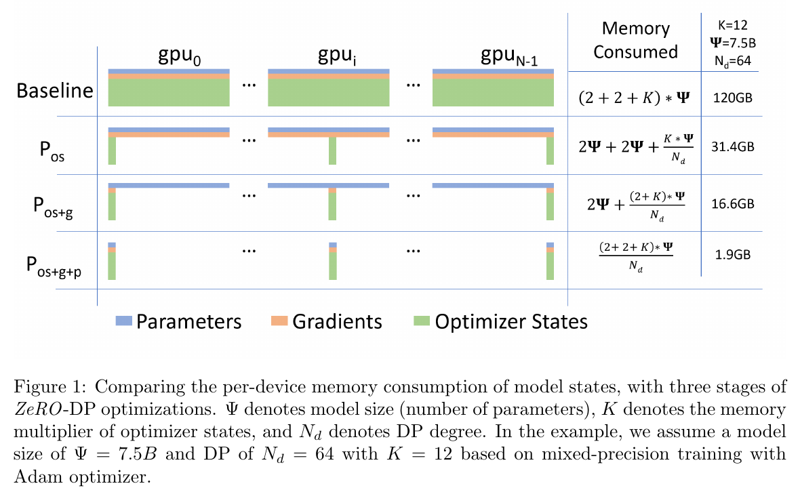
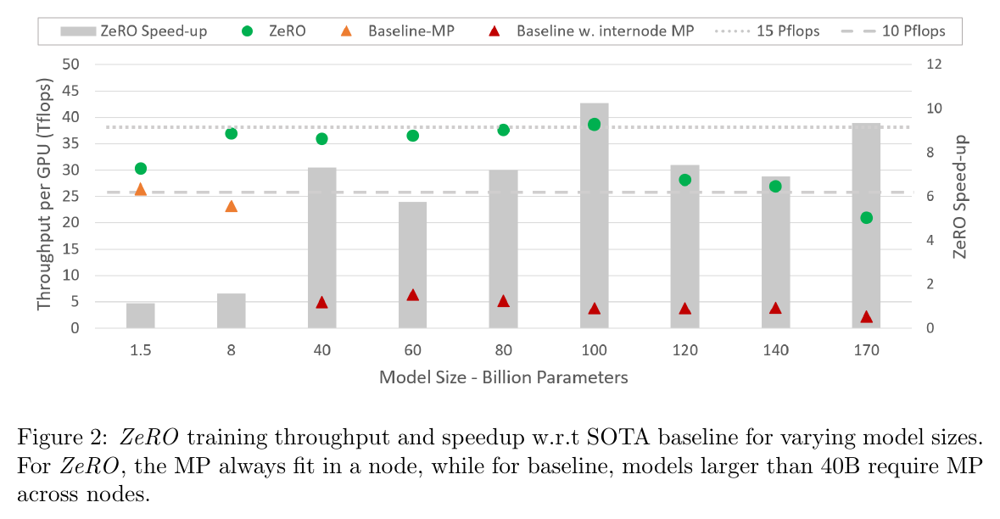

---
tags:
  - paper
  - collection/parallel-partitioning
  - domain/ai-infra
  - status/deep-review
  - topic/distributed-training-memory
  - method/zero-state-partitioning
document_type: paper
domain: parallelism
collection: Parallel Partitioning
review_status: deep-review
canonical: true
---

# ZeRO: Memory Optimizations Toward Training Trillion Parameter Models 精读分析

> [!info] 文档关系
> - 文档类型：Paper
> - 领域入口：[README](../README.md)
> - 上位汇总：[并行切分方法体系](../surveys/parallel-partitioning-taxonomy.md)
> - 选型指南：[并行策略选型](../surveys/parallel-strategy-selection.md)
> - 证据资产：[assets/papers/zero](../assets/papers/zero/)

ZeRO 的关键不是“把模型切开”这么简单，而是把经典数据并行中每张 GPU 重复保存的优化器状态、梯度和参数逐步分片，并在训练步内只在真正需要时通信重建。论文清楚证明了这种状态分片的内存与通信上界，也在 400 张 V100 上验证了 Stage 1+2 与 ZeRO-R 的系统能力；但 1T 与 Stage 3 在本文中仍是容量分析，不是端到端训练实证。

> 资料状态：主证据为 `paper.pdf`、arXiv v3 LaTeX/source bundle `source/`、提取文本 `extracted_text/paper-layout.txt`。两张配图均由 PDF 200 DPI 页面渲染后裁剪，包含完整原 caption。官方 DeepSpeed 仓库下载中断，当前实现代码未取得，因此实现判断严格限于论文/source，不把现代 DeepSpeed 行为回填为 SC20 实证。

## 修订信息

- 当前文档版本：`1.0.1`
- 当前修订 ID：`rev-zero-tightcrop-20260731`
- 当前修订时间：`2026-07-31T13:50:47+08:00`
- 替代版本：`rev-zero-initial-20260731` / `1.0.0` / deliverable manifest `afb92453ebb5e04cbd4428dd591aa610df0007400f69859fe95f05ad4d99defc`

| 修订 ID | 文档版本 | 时间 | 修订者 | 类型 | 替代修订 | 迁移问题/解析 | 变更摘要 | 原因 | 影响位置 | 依据 | 对结论影响 |
|---|---|---|---|---|---|---|---|---|---|---|---|
| `rev-zero-initial-20260731` | `1.0.0` | `2026-07-31T13:31:22+08:00` | `review_zero` | `initial` | 无 | 无 | 首次建立单篇精读、两张原论文视觉证据、公式/通信/实验审计 | initial delivery | `analysis.md`、`figure_inventory.md`、`figures/` | arXiv:1910.02054v3 PDF/source 与任务包 | material |
| `rev-zero-tightcrop-20260731` | `1.0.1` | `2026-07-31T13:50:47+08:00` | `review_zero` | `correction` | `rev-zero-initial-20260731` / `1.0.0` / manifest `afb92453ebb5e04cbd4428dd591aa610df0007400f69859fe95f05ad4d99defc` | 无 | 紧裁 Figure 2，去除顶部约 211 px 无意义白边，更新 bbox、contact sheet 与完整性哈希 | parent full-resolution QA | `figures/crops/fig2-throughput-speedup-caption.png`、`figures/contact-sheet.png`、`figure_inventory.md` | 原 crop trim bbox `(25,231,1139,572)`；修复后内容四侧各 20 px | none |

## 0. 资料与配图索引

- 论文：`paper.pdf`；arXiv:1910.02054v3，2020-05-13；SC20。
- LaTeX/source：`source/`，原始压缩包 `source.tar`。
- 提取文本：`extracted_text/paper-layout.txt`，由 `pdftotext -layout` 生成。
- 开源代码：未取得。两次 `git clone` 均因网络/中断未完成，`code/` 为空；本文只核验论文所述 ZeRO-100B。
- OpenReview：不适用；说明见 `openreview_reviews.md`。
- 机制视觉：Figure 1，`figures/crops/fig1-zero-dp-memory-stages-caption.png`。
- 结果视觉：Figure 2，`figures/crops/fig2-throughput-speedup-caption.png`。
- QA：`figures/contact-sheet.png`；每张 crop 的页码、source-page dimensions、bbox、完整 caption 与逐图 QA 见 `figure_inventory.md`。
- AI 生成图：未生成。原论文 Figure 1 已足以承担本精读的算法/状态变化总览，且本任务按父指令停止额外生成与下载。

## 0.1 术语与符号解释

### 0.1.1 术语表

| 术语 | 本文含义 | 别名 | 不等于/易混项 | 证据来源 |
|---|---|---|---|---|
| ZeRO | Zero Redundancy Optimizer；由 ZeRO-DP 与 ZeRO-R 组成的训练内存优化系统 | Zero Redundancy Optimizer | 不是只指现代 DeepSpeed 的某个配置项 | Abstract；Sections 1, 4 |
| ZeRO-DP | 对数据并行模型状态做分片并重排通信的部分 | ZeRO-powered data parallelism | 不包含 activation/offload/defragmentation 的 ZeRO-R | Sections 1, 4.1, 5 |
| ZeRO-R | 优化剩余内存：activation、临时 buffer、碎片 | residual-state optimization | 不等于 Stage 3 parameter partitioning | Sections 1, 4.2, 6 |
| $P_{os}$ | 优化器状态分片，即后来的 Stage 1 对应概念 | optimizer-state partitioning | 参数在每卡仍完整复制 | Section 5.1 |
| $P_g$ | 梯度分片；与 $P_{os}$ 累积构成 $P_{os+g}$ | gradient partitioning | 不是参数分片 | Section 5.2 |
| $P_p$ | 参数分片；与前两项累积构成 $P_{os+g+p}$ | parameter partitioning | 本文实现/实验并未覆盖该完整阶段 | Sections 5.3, 8 |
| ZeRO-100B | 论文实际实现与评测的子集：$P_{os+g}$ 加 ZeRO-R | paper implementation | 不等于论文分析中的完整三阶段 ZeRO，也不等于当前 DeepSpeed | Section 8, Implementation |
| collective | 多个进程共同参与的通信操作；本文主要是 all-reduce、reduce-scatter、all-gather/broadcast | 集合通信 | 不能只看调用次数，论文按每进程数据量分析 | Section 7 |

### 0.1.2 符号表

| 符号 | 含义 | 性质 | 作用域/索引 | 单位/取值 | 来源 | 易混点 |
|---|---|---|---|---|---|---|
| $\Psi$ | 模型参数个数，也作为按元素计的通信规模 | author-defined | 全模型/每训练步 | parameters 或 elements | Figure 1；Sections 3.1, 7 | 内存公式需再乘每元素字节数 |
| $K$ | 优化器状态相对参数个数的字节乘数 | author-defined | 全模型 | mixed-precision Adam 时 12 | Section 3.1；Figure 1 | 不含 fp16 参数和梯度各自的 2 bytes |
| $N_d$ | 数据并行 degree | author-defined | process group | 正整数 | Figure 1；Sections 5, 7 | 分片均匀性是理论公式前提 |
| $N_m$ | 模型并行 degree | author-defined | MP group | 正整数 | Extended Introduction | 与 $N_d$ 乘积只给容量上界 |
| $M_{\mathrm{DP}}$ | 本分析记号：经典混合精度 Adam 数据并行每卡模型状态内存 | analysis-derived | 每设备 | bytes | 由 Section 3.1 推导 | 不是论文原符号 |
| $M_{os}$ | 本分析记号：只做 optimizer-state partition 后每卡模型状态内存 | analysis-derived | 每设备 | bytes | 由 Section 5.1 推导 | 不含 activation 和临时 buffer |
| $M_{os+g}$ | 本分析记号：再分片 gradient 后每卡模型状态内存 | analysis-derived | 每设备 | bytes | 由 Section 5.2 推导 | 参数仍每卡完整 |
| $M_{os+g+p}$ | 本分析记号：三类状态全分片后每卡模型状态内存 | analysis-derived | 每设备 | bytes | Section 5.3 | 是理论容量式，不代表本文完成 Stage 3 实验 |
| $V$ | 本分析记号：每进程每训练步通信 volume | analysis-derived | 每 process/step | elements | Section 7 | 论文忽略延迟，按 bandwidth-bound 假设 |

## 1. 论文基本信息

- 标题：*ZeRO: Memory Optimizations Toward Training Trillion Parameter Models*
- 完整作者列表（论文顺序）：Samyam Rajbhandari；Jeff Rasley；Olatunji Ruwase；Yuxiong He。
- 署名类型：个人署名。
- 第一作者/共同一作及机构：

| 作者 | 身份依据 | 所属机构 | 对应依据 |
|---|---|---|---|
| Samyam Rajbhandari | `first listed; equal-contribution marker *` | not-stated | PDF p1 作者名后 `*`；页脚 `* Equal Contributors`；`source/main.tex` |
| Jeff Rasley | `equal-contribution marker and legend` | not-stated | PDF p1 作者名后 `*`；页脚 `* Equal Contributors`；`source/main.tex` 用脚注 “Equal Contributors” |

- 通讯作者及机构：not-stated。PDF title block/source 未标通讯作者，不从作者顺序或邮箱推断。
- 其余作者涉及机构：not-stated。论文只列出 `{...}@microsoft.com` 邮箱，没有 affiliation legend；邮箱域名不作为机构归属推断。
- 作者与机构核验说明：`PDF p1 title block and equal-contribution footnote; source/main.tex:7`。身份与 equal-contribution 可核验，所有个人 affiliation 均为 `not-stated`。
- Venue：SC20；arXiv v3。
- 研究领域：大模型分布式训练系统。
- 核心问题：如何在保持数据并行计算粒度与近似通信量的同时，让每卡模型状态内存随数据并行度下降。

## 2. 研究动机与问题—方案闭环

### 2.1 出发点与背景痛点

作者从一个可测的反常现象出发：1.5B 参数 GPT-2 的 fp16 权重只需约 3 GB，却无法用常规 PyTorch/TensorFlow 在 32 GB GPU 上训练。原因是训练不仅保存权重，还保存 fp16 梯度、fp32 master weights 以及 Adam 的一阶/二阶状态；经典 DP 又在每个 rank 完整复制它们。作者把问题目标限定为：消掉重复状态，同时不把高粒度 DP 计算变成跨节点细粒度 MP 通信（Extended Introduction；Sections 3–5，`author-stated`）。

### 2.2 现有方案为何不够

| 现有方案/做法 | 可观察的失败 | 具体场景或例子 | 例子来源 | 根因/被忽略变量 | 为什么简单修补仍不够 | 证据 |
|---|---|---|---|---|---|---|
| 经典 DP | 加 GPU 不降低每卡模型状态内存，约 1.4B 后仍 OOM | **论文给出的具体场景：1.5B GPT-2 的 fp16 权重约 3 GB，但混合精度 Adam 模型状态至少 24 GB；再加 activation 后 32 GB GPU 无法训练。** | paper-provided | 每个 DP rank 复制参数、梯度和 optimizer states | **只加 GPU 只增加副本；只减 batch 主要减少 activation，不消除按参数量线性增长的 16$\Psi$ 模型状态。** | Sections 1, 3.1；Figure 1 |
| 跨节点 MP | 模型能放下但吞吐迅速下降 | 论文在两台 DGX-2 上测试 40B Megatron，约 5 TFlops/V100，低于峰值 5% | paper-provided | 每层细粒度通信跨越低带宽节点边界，计算粒度变小 | 继续提高 MP degree 会进一步缩小每卡矩阵乘法并增加跨节点通信；它缓解容量，却恶化关键根因 | Extended Introduction；Figure 2 |
| CPU offload / PP | 容量换来数据移动或 pipeline 约束 | 论文引用 CPU offload 可让最多 50% 时间用于 GPU–CPU–GPU transfer；PP 需 micro-batch 隐藏 bubble 或保留 stale weights | paper-provided | PCIe 带宽、pipeline bubble、额外状态与模型改写 | 单纯把更多状态移到 CPU 把内存瓶颈改成 PCIe 瓶颈；单纯加 micro-batch 又增加 activation/可能影响收敛 | Related Work；Sections 6–7 |

Figure 1 将第一个根因可视化：三类重复状态按阶段消失，而不是仅“加更多卡”。

> 原论文 Figure 1（PDF crop，caption 完整）。它也是本精读的算法/状态总览：输入是每 rank 全量复制的三类 model states；按 $P_{os}\rightarrow P_g\rightarrow P_p$ 累积切分；输出是每卡只保留对应 shard，并在需要时通过 collective 临时重建。

### 2.3 论文计划解决的问题与成功标准

- 核心研究问题：能否让 DP 的每卡模型状态内存随 $N_d$ 下降，同时保持 DP 的大计算粒度与接近基线的通信量。
- 约束：优化算法语义不变；大模型通信按 bandwidth-bound 分析；分片近似均匀；实际系统要避免临时 buffer 与碎片重新占满显存。
- 成功标准：Stage 1/2 通信 volume 不高于经典 DP 的 $2\Psi$；Stage 3 最多 $3\Psi$；每卡内存达到 4×、8×、最终近似 $N_d$ 倍下降；系统在真实 GPU 集群上维持吞吐。
- 明确不解决：本文没有端到端训练 1T；没有在实验中实现/验证完整 Stage 3；不证明不同优化器、网络拓扑和小消息延迟下同样高效。

### 2.4 核心方案如何解决并优化问题

| 原始问题/失败模式 | 根因或约束 | 对应方案设计 | 改变的变量/系统行为 | 作用机制 | 预期优化及指标 | 证据来源 | 判断 |
|---|---|---|---|---|---|---|---|
| optimizer states 每 rank 复制 | Adam 状态占 $K\Psi$ | $P_{os}$ | 每 rank 仅持有 $1/N_d$ optimizer shard | 本地只更新对应 parameter shard，步末 all-gather 更新参数 | $M:16\Psi\rightarrow4\Psi+12\Psi/N_d$；$V=2\Psi$ | Sec. 5.1, 7.2；Fig. 1 | supported（理论+系统子集） |
| 每 rank 保存完整 reduced gradient | 只需本 rank 更新 shard 对应梯度 | $P_g$ | all-reduce 改为 reduce-scatter，梯度归属后释放 | 梯度只落在 owner rank，随后 parameter all-gather | $M\rightarrow2\Psi+14\Psi/N_d$；$V=2\Psi$ | Sec. 5.2, 7.2 | supported（理论+ZeRO-100B） |
| 参数全程复制 | 某层参数只在该层 forward/backward 时需要 | $P_p$ | 参数按 layer 使用窗口 all-gather/broadcast 后丢弃 | 用时间复用换常驻内存 | $M\rightarrow16\Psi/N_d$；$V=3\Psi$ | Sec. 5.3, 7.2 | plausible：本文未实验 Stage 3 |
| activation/buffer/碎片成为次级瓶颈 | 模型状态缩小后 residual states 占比上升 | ZeRO-R | activation shard、constant buffer、preallocated contiguous storage | 去副本、限制 buffer 上界、避免 allocation failure | 可运行 batch/model size 与吞吐提高 | Sec. 6；Figs. 6–8 文本 | partially-supported，多项改动同时发生 |

### 2.5 完整因果链与证据闭环

论文的闭环是：大模型增长触发每卡 OOM → DP 的模型状态副本使加卡无助于每卡容量，跨节点 MP 又损失计算/通信效率 → 把 optimizer/gradient/parameter 的“所有权”分给不同 DP ranks，并按训练时间窗口重建 → 每卡常驻状态从 $O(\Psi)$ 降到最高 $O(\Psi/N_d)$，Stage 1/2 仍保持 $2\Psi$ 通信 → 更低内存允许较小 MP degree 与更大 per-GPU batch → Figure 2 在 400 V100 上报告 8B–100B 平均约 15 PFLOPs、100B 约 38 TFlops/GPU、最高约 10× 对基线加速。

证据边界必须保留：内存与通信公式直接支持前三段；Figure 2 只验证完整 ZeRO-100B（$P_{os+g}$+ZeRO-R）对 Megatron baseline 的系统结果，不能把最高加速分别归因给 $P_{os}$、$P_g$ 或某个 ZeRO-R 子组件；1T/Stage 3 是理论容量推演。

## 3. 核心贡献与创新点

1. 将 optimizer states、gradients、parameters 分成三个累积阶段，给出每卡模型状态内存的闭式上界（Sections 3, 5；Figure 1）。
2. 证明 Stage 1+2 可把经典 DP 的 all-reduce 拆为 reduce-scatter + parameter all-gather，通信仍为 $2\Psi$；Stage 3 为 $3\Psi$（Section 7）。
3. 提出 ZeRO-R 处理 activation replication、临时 buffer 与 fragmentation，避免模型状态优化后出现新的显存瓶颈（Sections 4.2, 6）。
4. 在 400×32GB V100、800 Gbps inter-node 条件下实现 ZeRO-100B（不含 Stage 3），支撑至 170B 并展示系统吞吐（Section 8；Figure 2）。

## 4. 研究方法

### 4.1 三阶段与训练步内状态流

一个训练步可以这样读：forward/backward 仍按 DP 执行；backward 产生的梯度按 owner 做 reduce-scatter；owner 用自己保存的 optimizer shard 更新 parameter shard；若参数仍复制（Stage 1/2），随后 all-gather 更新后的参数；若参数也分片（Stage 3），则每层 forward/backward 前临时 gather 该层参数，用完即丢。Figure 1 的四行正是常驻状态随阶段的输出。

- 训练边界：这些操作发生在训练 step 内；论文不讨论 inference serving。
- 状态变化：replicated → sharded ownership → just-in-time materialization。
- 输出：数值上等价的更新后参数，但每卡常驻内存下降。

### 4.2 组件级设计动机与具体问题映射

| 设计项 | why 状态 | 原文证据 | 针对问题 | 因果机制 | 替代/权衡 | 验证证据 | 判断 |
|---|---|---|---|---|---|---|---|
| $P_{os}$ | author-stated | Sec. 5.1 | Adam 状态占最大且全复制 | owner-only state/update + parameter all-gather | memory-efficient optimizer 会改变统计精度/优化器；ZeRO 不改变 optimizer | Fig. 1 公式；ZeRO-100B 系统 | supported |
| $P_g$ | author-stated | Sec. 5.2 | 非 owner 不需要完整 reduced gradient | reduce-scatter 直接把结果送 owner，随后释放 | 小 bucket 降内存但增加 latency；大 bucket 反之 | Sec. 7 通信推导；系统包含该项 | supported，但无单项消融 |
| $P_p$ | author-stated | Sec. 5.3 | fp16 参数仍是 $2\Psi$ 常驻副本 | layer-wise materialization and discard | 付出 forward+backward 两次 gather，$V$ 增至 $3\Psi$ | 理论+Fig. 1；无本文实验 | plausible |
| $P_a$ | author-stated | Sec. 6.1 | MP ranks 复制 activation checkpoints | checkpoint shard，backward 重算前 all-gather | 额外 MP 通信，论文估计低于 baseline MP 的 10% | memory/performance 配置对比但多项联动 | partially-supported |
| $P_{a+cpu}$ | author-stated | Sec. 6.1, 7.3 | 极大模型 activation 仍 OOM | shard offload 到 CPU，需要时搬回 | 比 $P_a$ 多 2× CPU data movement；仅特定大模型值得 | C4/C5 描述性对比 | partially-supported |
| constant-size buffer $C_B$ | author-stated | Sec. 6.2 | fused buffer 随模型线性增长 | 固定足够大的 bucket 保带宽而设显存上界 | 过小会降低 collective bandwidth/增加 latency | 无独立消融 | unverified |
| memory defragmentation $M_D$ | author-stated | Sec. 6.3 | 长短生命周期 tensor 交错导致 contiguous allocation failure | 预分配连续 chunk 并搬运 checkpoint/gradient | 增加 copy 与管理成本 | 无独立消融 | unverified |

### 4.3 论文 Stage 与当前 DeepSpeed 的边界

本文只可确认 SC20 语义：ZeRO-100B 实现 $P_{os+g}$ + ZeRO-R；作者明确写 Stage 3 将来发布。任务提供的 DeepSpeed 仓库下载中断且没有 commit，因此不能核验现代 `stage=1/2/3`、offload、bucket 配置或实现 collective。把今天 DeepSpeed 文档中的行为回写成本文实现会混淆“论文分析的 Stage 3”和“后续工程实现”。

### 4.4 关键公式

#### F1：经典 DP 与三阶段每卡模型状态内存

$$
\begin{aligned}
M_{\mathrm{DP}} &= (2+2+K)\Psi,\\
M_{os} &= 4\Psi+\frac{K\Psi}{N_d},\\
M_{os+g} &= 2\Psi+\frac{(2+K)\Psi}{N_d},\\
M_{os+g+p} &= \frac{(2+2+K)\Psi}{N_d}.
\end{aligned}
$$

**这条公式在算什么？** 它计算 mixed-precision Adam 下，每个 DP rank 常驻的参数、梯度与 optimizer states 总字节数。

**怎么读？** 经典 DP 每卡保存全部 16 bytes/parameter；Stage 1 只把 12-byte optimizer states 均分，Stage 2 再均分 2-byte gradient，Stage 3 最后也均分 2-byte fp16 parameter。

**输入与输出。** 输入是 $\Psi,K,N_d$；输出是四种方案的每卡模型状态内存。

**变量在这里各做什么？** $\Psi$ 决定总参数规模；$K=12$ 表示 fp32 master weight、momentum、variance；$N_d$ 决定分片份数；各 $M$ 是每卡 bytes。

**直觉。** 越多状态进入 $1/N_d$ 项，每卡内存越接近线性下降；未分片项形成下限。

**边界。** 只计 model states，不计 activation、临时 buffer 和 fragmentation；假设分片均匀；$K=12$ 只对应论文的 mixed-precision Adam。

**小例子。** 论文示例：$\Psi=7.5$B、$K=12$、$N_d=64$ 时，四种内存约 120、31.4、16.6、1.9 GB（Figure 1）。

#### F2：每训练步通信量

$$
V_{\mathrm{DP}}=2\Psi,\qquad
V_{os+g}=\Psi_{\mathrm{reduce\text{-}scatter}}+\Psi_{\mathrm{all\text{-}gather}}=2\Psi,\qquad
V_{os+g+p}=3\Psi.
$$

**这条公式在算什么？** 它比较每个 process 每训练步的数据移动元素数。

**怎么读？** 经典 all-reduce 等于 reduce-scatter 加 all-gather；Stage 1+2 只是把这两半分别用于 gradient 和 updated parameter；Stage 3 还要在 forward/backward 两次临时重建参数，所以总计三个 $\Psi$。

**输入与输出。** 输入是模型规模 $\Psi$ 和 stage；输出是每 process/step 的通信 elements。

**变量在这里各做什么？** $\Psi$ 是全模型参数/梯度元素规模；$V$ 是分析得到的通信 volume。

**直觉。** Stage 1+2 重新安排既有的 $2\Psi$，没有增加体量；Stage 3 用额外一次 $\Psi$ 换取参数不常驻。

**边界。** 论文假设大消息通信 bandwidth-bound，忽略 collective latency、拓扑、重叠效率与具体 dtype 字节数；$3\Psi/2\Psi=1.5$ 是 volume 比，不是必然 1.5× wall time。

**小例子。** 本文构造的说明例，不是论文实验：若 $\Psi=1$B elements，经典 DP 与 Stage 2 都移动 2B elements/step，Stage 3 移动 3B；乘 2 bytes 或 4 bytes 要看实际通信 tensor dtype。

### 4.5 训练/实验设计

- 硬件：25 台 DGX-2，合计 400×32GB V100；论文称 inter-node bandwidth 800 Gbps。
- 模型：GPT-2-like transformer，按 layers/hidden dimension 改变 1.5B–170B 参数规模；配置见 Appendix Tables 5–10。
- baseline：无 MP 用 PyTorch DDP；有 MP 用 2019-09 的开源 Megatron-LM。
- 实现：$P_{os+g}$ + ZeRO-R，不含完整 $P_p$。
- 公平性：Appendix 明示有些 baseline 因模型并行整除与 400 GPU 限制只使用 256/384 GPUs；作者认为这让 baseline 通信更少、反而占优。但 Figure 2 不是严格等资源 matched ablation，仍须谨慎解释 speedup。
- dtype：parameters/activations fp16；optimizer master weights/momentum/variance fp32；本文未取得代码确认 accumulation 或 collective dtype。

## 5. 关键结论

### 5.1 主结果与口径

> 原论文 Figure 2（PDF crop，caption 完整）。绿色点是 ZeRO 每 GPU TFlops，三角是 baseline MP，灰柱为论文计算的 speed-up。它证明的是完整 ZeRO-100B 系统在特定硬件/模型配置下的结果，不是 Stage 3 实证，也不是单组件消融。

- 论文报告 8B–100B 平均约 15 PFLOPs sustained aggregate，100B 超过 38 TFlops/GPU；170B 可运行。
- 相对 baseline 最高约 10× speedup 出现在大模型点；超过 40B 后 baseline 需要 inter-node MP，是主要结构性差异。
- 对 Figure 2 读数不做额外小数拟合；关键数值采用正文明确报告。

### 5.2 技术点证据矩阵

| 技术点 | 声称收益 | 对应证据 | 对照是否受控 | 证据强度 | 结论 |
|---|---|---|---|---|---|
| 三阶段状态分片 | 4×/8×/$N_d$ 内存下降 | Fig. 1；Table 1；公式 | 理论 decomposition | theory + mechanism visualization | 内存式直接支持；Stage 3 仅容量推演 |
| $P_{os+g}$ 保持 $2\Psi$ | 不增加 DP volume | Sec. 7.2 推导 | 数学等式，未测 collective time | theory | volume supported；wall-time 影响未隔离 |
| $P_p$ 为 $3\Psi$ | 1.5× baseline volume | Sec. 7.2 推导 | 数学上受控 | theory | volume plausible；未在本文系统评测 |
| ZeRO-100B | 到 170B、最高约 10× | Fig. 2；Sec. 8 | baseline 配置/卡数不完全 matched | replacement baseline，多项改动同时发生 | 系统能力 supported，组件归因不充分 |
| $P_a/P_{a+cpu}$ | 增大可运行 batch/model | Figs. 6–8 及配置 C1–C5 描述 | C 配置仍有多项差异 | indirect | 部分支持 |
| $C_B$、$M_D$ | 避免 buffer/碎片 OOM | Sections 6.2–6.3 | 无独立 ablation | none | 机制说得通但未单独验证 |

### 5.3 是否验证因果链

- 直接成立：DP 状态冗余的字节分解；三阶段内存上界；collective volume 推导。
- 间接成立：更低显存允许降低 MP degree/增大 batch，Figure 2 与配置分析方向一致。
- 多项改动同时发生：Figure 2 同时包含 $P_{os+g}$、ZeRO-R、不同 MP degree/batch/GPU count，无法严格拆分收益。
- 未验证：Stage 3 在 1T 上的运行时间、效率、数值稳定性；现代 DeepSpeed 与论文伪代码/通信日程的一致性。

### 5.4 收益来源归因

| 组件/变化 | 对比基线 | 指标变化 | 影响路径 | 证据强度 |
|---|---|---|---|---|
| $P_{os}$ | classic DP | asymptotic 4× model-state saving | optimizer state memory | 公式直接 |
| 再加 $P_g$ | $P_{os}$ | asymptotic 4$\Psi$→2$\Psi$，累计 8× | gradient memory + reduce-scatter | 公式直接；无单项 runtime ablation |
| ZeRO-100B 完整系统 | Megatron baseline | Figure 2 最高约 10× | 更低 MP degree、更大 batch、ZeRO-R | 系统 replacement baseline；粗归因 |
| Stage 3 | Stage 2 | 内存趋于 $16\Psi/N_d$，通信 2$\Psi$→3$\Psi$ | parameter memory vs bandwidth | 理论；无实验 |

## 6. Related Work 对比

| 类别 | 核心机制 | 优点 | 局限 | 与 ZeRO 关系 |
|---|---|---|---|---|
| 经典 DP | 每 rank 完整模型，all-reduce gradients | 计算粒度大、易用 | 状态复制，模型容量不随卡数增长 | ZeRO 保留执行形态，改变状态所有权 |
| tensor MP / Megatron | 层内切 tensor | 单卡放不下时可扩展 | 跨节点带宽和细粒度计算限制 | ZeRO 尽量把 MP 留在节点内 |
| PP / GPipe/PipeDream | 按层切 pipeline | 降每卡参数量 | bubble、micro-batch、stale weights/语义与易用性 | ZeRO 不要求模型图切分 |
| activation checkpointing | 丢弃并重算 activation | 降 activation memory | 约 33% recompute；大模型仍可能不足 | ZeRO-R 在其上再分片 checkpoint |
| Adafactor 等 | 改变 optimizer statistics | 减 optimizer state | 可能改变收敛/优化语义 | ZeRO 分片而不改变 optimizer |

## 7. OpenReview 公开评审 × 论文交叉核验

未发现任务包或论文/source 指向公开 OpenReview 页面；`openreview_url` 为 unknown。依父指令未继续网络查询，`openreview_reviews.md` 记录为 not applicable。本文不引用评审观点。

## 8. Infra 需求分析

### 8.1 算力

ZeRO-DP 不改变模型 FLOPs；吞吐改善来自更大 per-GPU batch 提高矩阵乘 arithmetic intensity，以及降低 MP degree。论文的 Figure 2 报告 TFlops/GPU，而不是 tokens/s 或 time-to-quality；因此不能据此推断数据规模、优化步数或最终训练成本。

### 8.2 显存与存储

模型状态以 F1 为核心。Activation 近似与 `layers × hidden × sequence × batch` 成正比；论文给出 1.5B、seq 1K、batch 32 时未 checkpoint 约 60 GB，checkpoint 后约 8 GB；100B 即使 checkpoint 仍约 60 GB。ZeRO-R 进一步分片 checkpoint，理论按 $N_m$ 下降。

### 8.3 Data Types / 数值格式

| 对象 | dtype | 阶段 | 硬件依赖 | 影响 | 证据 |
|---|---|---|---|---|---|
| parameters/activations | fp16 | forward/backward | V100 Tensor Cores | 2 bytes/element，提升算力 | Sec. 3.1 |
| gradients | fp16（论文内存核算） | backward/collective | GPU collective | 2$\Psi$ bytes 常规占用 | Sec. 3.1 |
| master parameters/momentum/variance | fp32 | optimizer update | GPU memory | 合计 12$\Psi$ bytes | Sec. 3.1 |
| accumulation/collective actual dtype | unverified | train | 当前代码未取得 | 不能从现代实现反推 | source/code limitation |

### 8.4 带宽、互联与利用

- DP baseline：reduce-scatter + all-gather = $2\Psi$ elements/process/step。
- Stage 2：gradient reduce-scatter + updated-parameter all-gather = $2\Psi$。
- Stage 3：gradient reduce-scatter + forward/backward parameter gathers = $3\Psi$。
- 论文强调 large model collective bandwidth-bound，但没有给 latency/bucket size sensitivity；$C_B$ 在显存与有效带宽间折中。
- 集群：论文报告 800 Gbps inter-node；同时说明 DGX-2 内 NVSwitch 链路远高于 inter-node 12.5 GB/s/link，因此避免 inter-node MP 是 Figure 2 的关键收益路径。

### 8.5 CPU/GPU 异构

$P_{a+cpu}$ 只 offload partitioned activation checkpoints，论文估计相对 $P_a$ 多一次写出和读回，即 2× checkpoint 数据移动。它不是默认更快：只有 offload 允许显著增大 batch，且 PCIe transfer 小于被减少的 DP overhead 时才有利。现代 optimizer/parameter offload 不属于本文已核验范围。

## 9. 代码与实现核验

- 任务提供官方 DeepSpeed URL，但首次完整 clone 在 fetch-pack 阶段卡住并中止，filtered retry 又在用户中断时终止；`code/` 没有可用 repo/commit。
- 因此没有代码路径或 commit 可引用；所有实现 claim 都标注为 paper-reported。
- 可确认的论文实现边界：Section 8 明确 ZeRO-100B = $P_{os+g}$ + ZeRO-R，接口兼容 `torch.nn.Module`，可与 Megatron-LM MP 结合。
- 不能确认：现代 stage 配置的 exact collectives、bucket default、optimizer/parameter offload、overlap、checkpoint schema、CPU/NVMe 路径。

## 10. 局限、启发与待验证问题

### 10.1 局限

1. 1T 结论是 $16\Psi/N_d$ 容量分析；论文同时承认当时算力会让训练超过一年。
2. Stage 3 没有本文实现/实验，1.5× 只指通信 volume，不含 latency、重叠、网络拥塞或 layer schedule。
3. Figure 2 是系统级 replacement baseline，不是组件级 matched ablation；不能从最高 10× 推断某个 stage 单独贡献。
4. 论文 affiliation 未明确，不能依据 microsoft.com 邮箱推断机构；corresponding author 也 not-stated。
5. 当前 DeepSpeed code 未取得，SC20 论文与现代实现的差异未核验。

### 10.2 研究启发

- 分布式训练的核心抽象可以从“计算放在哪里”转为“状态何时归谁、何时物化”。
- 容量优化必须同时给出通信 volume 与运行时边界；否则分片只是在内存与带宽之间搬瓶颈。
- Stage 3 的真正研究问题不只是 shard size，而是 prefetch/release schedule、bucketization 与计算重叠在不同拓扑下的联合优化。

### 10.3 待验证问题

1. 在相同 GPU 数、相同 batch、相同 MP degree 下，$P_{os}$、$P_g$、$P_a$、$C_B$、$M_D$ 各自贡献多少？
2. Stage 3 的 $3\Psi$ 在 NVLink、PCIe、InfiniBand/RDMA 不同层级上能重叠多少？
3. 参数/梯度 collective 的实际 dtype 与 accumulation 精度是什么？
4. 现代 DeepSpeed 的 Stage 1/2/3 与本文 $P_{os}$/$P_g$/$P_p$ 在 bucket、prefetch、offload 和 checkpoint 上有哪些语义差异？

## 11. Evidence Loop

| 论文主张 | 机制/公式 | 测量 | 可支持结论 | 仍然限制 |
|---|---|---|---|---|
| DP 状态冗余可被消除 | F1；Fig. 1 | ZeRO-100B 能运行至 170B | Stage 1+2 显著扩展模型容量 | Stage 3/1T 未运行 |
| Stage 1+2 不增加 volume | F2：$2\Psi$ | Figure 2 维持高吞吐 | volume 上与 DP 相同，系统整体可高效 | 没有 isolate collective latency |
| 更低内存带来更高吞吐 | lower MP degree + larger batch | Figure 2；配置分析 | 在论文硬件/模型范围系统收益成立 | 多项改动和 baseline 条件不同 |
| ZeRO-R 防止 residual bottleneck | $P_a,C_B,M_D$ 机制 | C1–C5 描述 | 方向与测量一致 | $C_B/M_D$ 无独立 ablation |

最终判断：论文建立了数据并行状态分片的 canonical 理论与系统基线；Stage 1/2 的状态、公式与 collective 链条证据充分，Stage 3 的容量/通信公式清楚但实验不足，Figure 2 的系统收益可信但组件归因有限。
