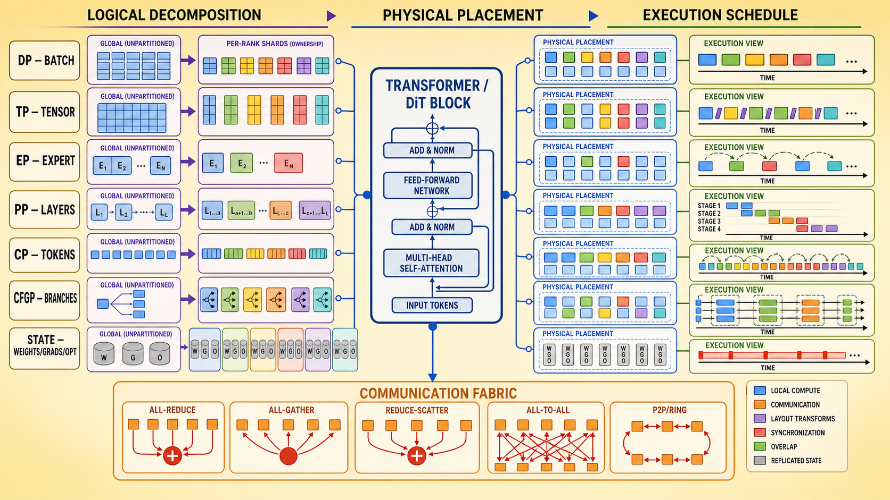

# 并行切分知识领域规划

> [!info] 文档关系
> - 文档类型：Survey
> - 领域入口：[README](../README.md)
> - 证据资产：`../assets/surveys/parallel-partitioning-domain-plan/`
> - 相关文档：[DeepSeek-V4](../../../02_model_systems/llm_foundations/papers/deepseek-v4.md) · [Kimi K3](../../../02_model_systems/llm_foundations/papers/kimi-k3.md) · [SwiftFusion](../../../02_model_systems/multimodal_generation/papers/swiftfusion.md) · [DSV](../../kernel/custom_attn/papers/dsv.md)

> **状态**：领域建设规划，尚不是完整技术 Survey。
> **读者**：需要理解、实现或评审分布式训练与推理方案的算法、系统、框架和 kernel 工程人员。
> **范围**：DP、TP、EP、PP、sequence/context parallel、Ulysses、Ring、CFGP、状态切分、并行组合，以及非规则或模型定制切分。
> **证据边界**：本文固定知识结构、分析问题和呈现模板；后续具体公式、通信量、实现约束与性能判断仍需通过论文、官方文档、代码和 profiling 证据补全。

## 修订信息

- 当前文档版本：`0.1.0`
- 当前修订 ID：`rev-parallel-partitioning-domain-plan-initial-20260731`
- 当前修订时间：`2026-07-31T18:00:00+08:00`

| 修订 ID | 文档版本 | 时间 | 类型 | 变更摘要 | 对结论影响 |
|---|---|---|---|---|---|
| `rev-parallel-partitioning-domain-plan-initial-20260731` | `0.1.0` | `2026-07-31T18:00:00+08:00` | initial | 建立领域边界、文档树、统一分析框架、视觉方案、跨域复用和实施顺序 | planning：尚未形成方法覆盖结论 |

## 1. 领域定位

“并行”容易被理解为多个设备同时工作，但仅有并发并不能说明系统语义。一个可审计的并行方案至少要说明：

- 全局对象如何被逻辑分解；
- shard 如何映射到物理 rank；
- 哪些对象被复制、分片、迁移或临时重排；
- 局部结果如何通过通信恢复全局语义；
- 计算、通信和同步按什么顺序执行；
- 性能收益是否足以覆盖通信、重排、bubble、负载不均和调度成本。

因此，本领域不按缩写建立互不相干的百科，而以“切分对象—局部所有权—通信合同—执行调度—适用边界”为统一主线。



图中将 DP、TP、EP、PP、CP、CFGP 和训练状态分片放在同一个坐标系中。它表达的是领域的阅读顺序：先确定全局对象怎样拆，再确定每个 rank 持有什么，最后分析 collective、P2P、同步和 overlap；图中的局部布局不是任何框架的精确实现。

## 2. 统一分析框架：切分有三个层级

### 2.1 逻辑分解

逻辑分解回答“算法或模型把什么拆开”。对象可能是：

- batch、sample 或在线 request；
- 权重矩阵的输入/输出维；
- attention head、hidden channel 或 MLP intermediate；
- expert 与 routed token；
- layer、block 或 graph stage；
- sequence、context、Q/K/V block；
- conditional/unconditional 等 graph branch；
- parameter、gradient、optimizer state、activation 或 cache；
- 有效 QK workload、动态路由结果或执行 wave。

逻辑分解不必等于分布式切分。例如 [DeepSeek-V4 的 grouped output projection](../../../02_model_systems/llm_foundations/papers/deepseek-v4.md#43-模型系统架构)首先是模型结构分解：attention heads 分组后分别降维与投影。它能否以及如何映射到多个 TP rank，是下一层问题。

### 2.2 物理放置

物理放置回答“每个 rank 实际持有什么”，包括：

- shard 的精确 shape；
- replicated 与 partitioned 对象；
- rank group 和 device mesh；
- shard 是否跨 layer 保持同一 layout；
- 何时需要 all-gather、transpose、reorder、dispatch 或 cache migration；
- 机内 NVLink/NVSwitch 与跨机 RDMA/IB/EFA/HCCS 链路如何承载不同通信。

同一个逻辑分解可以有不同物理放置。Ulysses 与 Ring 都服务于长序列 attention，但一个把 sequence shard 转成 head shard，另一个保持本地 query 并让 KV block 流经 ranks；二者对 head 整除、通信粒度和拓扑的要求不同。

### 2.3 执行调度

执行调度回答“何时算、何时传、何时同步”。需要覆盖：

- collective 是原子完成还是可拆成阶段；
- communication stream 与 compute stream 的依赖；
- microbatch、virtual stage、1F1B 或 interleaving；
- Ring 的 KV 流转顺序和 online reduction；
- expert dispatch、GEMM、combine 的 overlap；
- dynamic workload 的 planner、reorder 和 straggler；
- layer boundary、step boundary 或 CFG combine 前的同步。

[DeepSeek-V4 的 wave-based EP](../../../02_model_systems/llm_foundations/papers/deepseek-v4.md#84-带宽互联与高效利用)主要改变 expert 计算与 dispatch/combine 的调度粒度；[SwiftFusion](../../../02_model_systems/multimodal_generation/papers/swiftfusion.md#25-完整因果链与证据闭环)则同时改变 Ulysses/Ring 的物理拓扑映射和执行时序。两者说明“切分”不仅是 tensor axis。

## 3. 领域文档树

计划中的 canonical 结构如下：

```text
01_ai_infra/parallelism/
├── README.md
├── surveys/
│   ├── parallel-partitioning-domain-plan.md
│   ├── parallel-partitioning-taxonomy.md
│   ├── parallel-strategy-selection.md
│   └── irregular-and-workload-aware-partitioning.md
├── topics/
│   ├── tensor-and-state-coordinate-system.md
│   ├── communication-primitives-and-cost-model.md
│   ├── attention-sequence-and-context-parallelism.md
│   └── parallel-composition-and-device-mesh.md
├── evidence/
│   ├── selection.md
│   ├── method-and-system-index.md
│   ├── cross-domain-adoption-index.md
│   ├── parallelism-claim-matrix.md
│   └── figure-inventory.md
├── papers/
├── assets/
│   ├── surveys/<survey-slug>/
│   └── papers/<paper-slug>/
└── supplements/
```

空目录不预建；只有形成对应类型的正式内容时才创建。

### 3.1 README

README 只承担：

- 领域范围；
- 推荐阅读路径；
- 完整正式文档索引；
- canonical owner 与跨域复用说明。

README 不承载长篇方法解释或通信公式。

### 3.2 Topics

Topic 保存跨论文稳定知识：

| Topic | 主要职责 |
|---|---|
| `tensor-and-state-coordinate-system` | 定义 $B/S/H/D/E/L/G/P$、全局/局部 shape、replica/shard/partial 等基础语言 |
| `communication-primitives-and-cost-model` | collective、P2P、$\alpha$-$\beta$ 模型、拓扑、消息数、exposed communication、overlap |
| `attention-sequence-and-context-parallelism` | 澄清 Megatron SP、Ulysses SP、Ring Attention、CP 与 hybrid CP 的术语和 layout |
| `parallel-composition-and-device-mesh` | 2D/3D/4D mesh、rank group、TP×DP×PP×CP×EP 的组合与拓扑映射 |

Topic 不写某篇论文的实验数字，也不承担方法谱系结论。

### 3.3 Surveys

| Survey | 核心问题 |
|---|---|
| `parallel-partitioning-taxonomy` | DP/TP/EP/PP/SP/CP/CFGP 分别切什么、怎么切、怎样通信 |
| `parallel-strategy-selection` | 什么 workload、模型结构、训练/推理阶段和拓扑适合什么并行组合 |
| `irregular-and-workload-aware-partitioning` | 规则均分为何失效，以及架构、稀疏 workload、算子代数和调度如何驱动定制切分 |

Survey 只保留跨工作比较和工程判断；具体论文机制、代码与实验必须链接 canonical Paper 或 Evidence。

### 3.4 Evidence

Evidence 计划记录：

- 检索与选篇边界；
- 方法论文、系统报告、框架文档和实现仓库的不同证据等级；
- 跨域 canonical Paper 的 adoption 关系；
- 通信公式、实现约束与性能 claim 的来源；
- 原论文图的页码、完整 caption、crop bbox 和逐图 QA。

### 3.5 Papers

只有覆盖矩阵未命中、且有足够证据支持独立机制记录的工作才在本领域新建 Paper。已有模型系统或 custom attention Paper 采用 `link-only`，不复制正文或资产。

## 4. 基础分类：按切分对象而不是缩写排列

| 家族 | 主要切分对象 | rank 局部所有权 | 典型通信 | 需要重点解释的边界 |
|---|---|---|---|---|
| DP | batch、sample、request | 完整或阶段性完整模型 + 部分样本/请求 | gradient all-reduce/reduce-scatter | 训练 DP 与 serving request DP 不同 |
| TP | weight、hidden、head、channel | 矩阵行/列、head 或 channel shard | all-reduce、all-gather、reduce-scatter | row/column、sequence-parallel 配套、量化 block 对齐 |
| EP | expert 与 routed token | 部分 experts | dispatch/combine all-to-all | capacity、负载不均、shared expert、overlap |
| PP | layer、block、graph stage | 连续或交错层段 | activation/gradient P2P | bubble、microbatch、virtual stage、权重不均 |
| SP/CP | activation token、attention context、Q/K/V block | sequence/head/KV shard | all-to-all、P2P ring、gather/reduce | 术语重载、head 整除、causal/load balance |
| CFGP | conditional graph branches | cond/uncond 等分支 | branch-output sync/combine | 权重复制、分支不均、CFG distillation |
| State sharding | parameter、gradient、optimizer state | ZeRO/FSDP shard | gather、reduce-scatter | 它减少状态副本，但不必然切本地算子 |

ZeRO/FSDP 作为“状态切分”邻接轴纳入，否则 DP 的显存讨论不完整；但不把它们误写成新的计算并行维度。

## 5. 每种方法的固定呈现模板

为了让不同方案可以横向比较，每种方法使用同一张“方法卡”：

1. **目标瓶颈**：显存、算力、长序列、模型容量、吞吐、延迟或负载均衡。
2. **切分对象**：全局 tensor、state、graph 或 workload。
3. **切分轴**：明确 global shape 与 shard shape。
4. **局部所有权**：每个 rank 保存、计算和缓存什么。
5. **复制对象**：哪些权重、activation、metadata 或 cache 仍然复制。
6. **通信合同**：前向、反向、训练 step 或 denoise/decode step 分别发生什么。
7. **layout 生命周期**：局部布局何时改变，是否需要逆变换。
8. **合法性约束**：整除、head 数、expert 数、causal 顺序、topology、dtype/block alignment。
9. **适用与回退**：什么条件下收益明显，什么条件下应回退到更简单方案。

TP 需要分别画出 column-parallel 与 row-parallel：

```text
Column Parallel
X [B,S,Din] × W [Din,Dout/P]
→ local Y [B,S,Dout/P]

Row Parallel
X [B,S,Din/P] × W [Din/P,Dout]
→ partial Y [B,S,Dout]
→ all-reduce / reduce-scatter
```

DP、EP、PP、Ulysses、Ring 和 CFGP 都沿用“全局对象 → rank-local layout → local compute → communication → restored semantics”的视觉语法。

## 6. SP/CP 术语治理

这部分必须单独形成 Topic，因为不同框架对 sequence parallel 和 context parallel 的使用不一致。

### 6.1 Megatron Sequence Parallel

- 主要把 LayerNorm、Dropout 等 activation 沿 sequence 维分片；
- 通常与 TP 配套；
- 不等于完整 attention context 的跨卡计算。

### 6.2 Ulysses SP

- 输入按 sequence 分布；
- all-to-all 将 sequence shard 转成 head shard；
- 每个 rank 对部分 heads 执行完整 sequence attention；
- attention 后通过逆 all-to-all 恢复布局；
- 并行度受 attention heads/KV heads 和实现 layout 约束。

[Causal-rCM](../../../02_model_systems/multimodal_generation/papers/causal-rcm.md#8-infra-需求分析)已有 Ulysses 前后 layout 与 cache 关系的 canonical 分析，后续在本领域直接引用。

### 6.3 Ring Attention / Ring CP

- query 保持本地；
- KV block 沿 ring 流过 ranks；
- 每一步增量更新 attention statistics 与 output；
- 通信可以与局部 attention overlap；
- causal mask、load balance、消息粒度和跨机链路决定实际效率。

### 6.4 本领域的命名约定

本领域把 **Context Parallelism** 作为“长上下文 attention 分布式执行”的上位目标，把 Ulysses、Ring、hybrid Ulysses+Ring、稀疏 CP 和定制 CP 作为实现族。每篇文档首次使用 SP/CP 时必须同时给出本文语义和来源框架的原始命名。

## 7. ==通信、显存与调度开销==

后续 cost model 不只统计理论 bytes。统一的 step 分解为：

$$
T_{\text{step}}
=
T_{\text{compute}}
+
T_{\text{exposed-comm}}
+
T_{\text{relayout}}
+
T_{\text{bubble}}
+
T_{\text{imbalance}}
+
T_{\text{sync/schedule}}.
$$

rank 局部显存统一拆成：

$$
M_{\text{rank}}
=
M_{\text{param}}
+
M_{\text{grad}}
+
M_{\text{optimizer}}
+
M_{\text{activation}}
+
M_{\text{cache}}
+
M_{\text{workspace}}.
$$

每种方案至少记录：

- collective/P2P 类型；
- 每层、每 microbatch、每训练 step 或每 denoise/decode step 的调用频率；
- nominal payload 与消息数；
- 通信是否跨 node；
- layout transform 和临时 workspace；
- 能否与计算重叠以及 overlap 窗口；
- rank straggler、expert/token 不均和 tail latency；
- backward、recompute、checkpoint、cache 对通信的二次影响。

通信字节较少不等于 exposed communication time 较少。[SwiftFusion](../../../02_model_systems/multimodal_generation/papers/swiftfusion.md#7-基础设施带宽与异构性)将 Ulysses 映射到跨机、Ring 映射到机内，并把 collective 拆成可重叠阶段，适合作为“流量、拓扑、同步与 overlap 必须共同分析”的 canonical 案例。

cost model 将与现有 [部署能力评测：内存、算力、带宽与通信](../../performance_modeling/部署能力评测-内存算力带宽与通信.md) 和 [Roofline 模型](../../performance_modeling/Roofline模型.md) 建立双向阅读关系。

## 8. 按 workload 构建选型 Survey

并行选型不能脱离模型 shape、并发度、训练/推理阶段和互联拓扑。计划使用以下场景矩阵：

| 场景 | 首要切分轴 | 常见组合起点 | 主要风险 |
|---|---|---|---|
| Dense LLM 训练 | batch、hidden、layer、state | DP/FSDP + TP + PP + SP | collective、activation、pipeline bubble |
| MoE 训练/推理 | expert、routed token | DP/TP + EP，必要时 PP/CP | all-to-all、负载倾斜、capacity |
| 长上下文 LLM | sequence/context | TP + Ulysses/Ring/CP | head 整除、KV 通信、拓扑 |
| 图像/视频 DiT 训练 | token、state、branch | FSDP + SP/CP + TP/EP | 每个 denoise step 重复通信 |
| 图像/视频生成推理 | token、CFG branch | SP/CP + CFGP + request DP | 低 batch、分支同步、VAE 瓶颈 |
| 在线 LLM serving | request、weight、expert | request DP + TP/EP | batching、KV placement、tail latency |
| 稀疏/异构 attention | 有效 QK workload | workload-aware CP | token 均分不等于计算均分 |

每个场景给出三类结论：

- 推荐起点；
- 单维扩展遇到瓶颈后，下一维应切什么；
- 明确的回退条件和必须采集的 profiling 指标。

不在缺少 shape、拓扑和 runtime 证据时给出无条件“最佳并行策略”。

## 9. 非规则与定制化切分

定制 Survey 按“规则均分为何失效”分为五类。

### 9.1 架构语义驱动

代表问题是 DeepSeek-V4 grouped output projection：

- heads 被分成 $g$ 组；
- 每组独立降维与投影；
- 首先减少模型内大输出投影的成本；
- 结构分组不自动等于 rank sharding；
- 需要继续检查 group、TP shard、量化 block 和 output reduction 如何对齐。

现有 [DeepSeek-V4 canonical Paper](../../../02_model_systems/llm_foundations/papers/deepseek-v4.md#43-模型系统架构)保持唯一 owner。

### 9.2 分支语义驱动

CFGP 切的是 conditional/unconditional graph branches：

- 分支可独立完成大部分模型前向；
- guidance combine 前同步；
- 需要分析权重复制、activation、branch 不均与调度；
- CFG-distilled checkpoint 可能消除双分支执行，因此必须先确认算法语义。

[Cosmos 3](../../../02_model_systems/multimodal_generation/papers/cosmos-3.md#8-infrastructure-分析)已有 Ulysses、HSDP、CFG parallel、cache 与 compile 的系统组合分析；本领域只提取并行 adoption 关系。

### 9.3 稀疏 workload 驱动

规则 token/head 均分假设每个 shard 计算量相近，但动态稀疏 attention 中，相同 token 数可能对应完全不同的有效 QK area。

- [DSV](../../kernel/custom_attn/papers/dsv.md#4-研究方法)联合搜索 head/sequence CP、头分配和节点内外布局；
- [MAGI-1](../../../02_model_systems/multimodal_generation/papers/magi-1.md#6-magiattention-与-infrastructure)中的 MagiAttention 面向异构 mask、workload dispatch 和按需 group communication；
- 成本包括 planner、metadata、reorder、scatter/reduce 和动态调度。

### 9.4 算子代数结构驱动

[Kimi K3 的 KDA Context Parallelism](../../../02_model_systems/llm_foundations/papers/kimi-k3.md#61-flashkda-与-kcp)不能把局部状态简单相加，需要传递与 token 相关的状态变换。后续 Topic 要从“局部结果能否结合、结合运算是否满足结合律、prefix 如何组合”出发，说明为什么不同 attention/recurrence 需要不同 CP 合同。

### 9.5 调度与确定性驱动

这一类切分不一定改变长期 tensor ownership：

- wave-based EP 把 expert 执行拆成 waves 以创造更细 overlap；
- split-K/split-KV 把 reduction 维切开，但可能改变归约顺序和 batch invariance；
- pipeline interleaving 拆分时间线而不是新的模型维；
- runtime scheduler 可按请求、step、branch 或稀疏 workload 动态分组。

后续需要把“数值等价、确定性、通信隐藏、额外 workspace”作为同等重要的评价轴。

## 10. 视觉呈现规范

本领域统一使用以下图形语法：

- 蓝色：local compute；
- 橙色：communication；
- 紫色：layout transform；
- 红色：synchronization/bubble；
- 绿色：overlap；
- 灰色：replicated state。

计划制作五类 Survey-owned 整理图：

1. 并行坐标系总图：Transformer/DiT block 与 $B/S/H/D/E/L/G$。
2. layout 生命周期图：global layout → rank shard → local compute → collective → restored semantics。
3. attention CP 泳道图：Ulysses、Ring、hybrid/topology-aware、sparse workload-aware。
4. 通信—计算时间线：TP collective、EP dispatch/combine、PP bubble、Ring overlap、wave EP。
5. 场景选型地图：按模型规模、序列长度、batch/concurrency、拓扑和生成范式给出决策路径。

AI 生成图或人工整理图必须在 caption 中明确标记，不得替代原论文证据。引用原论文 Figure/Table 时，必须保留完整 caption、单一编号对象、crop bbox、PDF 页码与逐图原分辨率 QA。

## 11. 跨域 canonical 复用

首轮建设应在 `cross-domain-adoption-index` 中登记：

| Canonical owner | 本领域复用点 | 动作 |
|---|---|---|
| [DeepSeek-V4](../../../02_model_systems/llm_foundations/papers/deepseek-v4.md) | grouped output projection、wave EP、确定性边界 | `link-only` |
| [Kimi K3](../../../02_model_systems/llm_foundations/papers/kimi-k3.md) | KDA CP、PP/VP/EP | `link-only` |
| [SwiftFusion](../../../02_model_systems/multimodal_generation/papers/swiftfusion.md) | Ulysses、Ring、Torus、topology-aware scheduling | `link-only` |
| [Cosmos 3](../../../02_model_systems/multimodal_generation/papers/cosmos-3.md) | Ulysses、HSDP、CFGP、cache/compile | `link-only` |
| [Causal-rCM](../../../02_model_systems/multimodal_generation/papers/causal-rcm.md) | Ulysses layout、CP cache、custom mask | `link-only` |
| [MAGI-1](../../../02_model_systems/multimodal_generation/papers/magi-1.md) | Ulysses、MagiAttention、长视频 runtime | `link-only` |
| [DSV](../../kernel/custom_attn/papers/dsv.md) | hybrid sparse CP、workload balancing | `link-only` |
| [LVSA](../../kernel/custom_attn/papers/lvsa.md) | Ulysses/ring/TP adoption | `link-only` |

原 Paper 和原论文资产继续归上表 owner；并行领域不创建 shadow Paper，也不复制图片。

## 12. 后续检索与选篇策略

该领域同时包含方法论文与框架/runtime 采用，后续应使用 hybrid 调研模式，分开统计：

- peer-reviewed method paper；
- technical report；
- official framework documentation；
- official code/config/kernel；
- native model-system adoption；
- optional official backend；
- third-party integration。

候选主线至少覆盖：

- DP、TP、PP、EP 的奠基方法与现代框架实现；
- Megatron sequence parallel 与状态切分；
- DeepSpeed-Ulysses、Ring Attention、hybrid SP/CP；
- topology-aware 与 workload-aware distributed attention；
- MoE dispatch/combine、load balancing 与 overlap；
- diffusion/video 中 CFGP、long-sequence parallel 与 step-aware runtime；
- architecture-specific partitioning、deterministic reduction 和 device-mesh composition。

选篇前必须查询覆盖矩阵。命中且证据版本一致时直接复用；只有缺失或现有内容明确不足时才创建新 Paper。

## 13. 实施顺序

### 阶段 A：建立基础语言

1. 完成 tensor/state 坐标 Topic。
2. 完成通信原语与 cost model Topic。
3. 固定方法卡、layout 图和颜色语义。

### 阶段 B：完成规则切分主线

1. DP、TP、EP、PP。
2. Megatron SP、Ulysses、Ring、CP。
3. ZeRO/FSDP 作为状态切分邻接轴。
4. 完成标准方法对比 Survey。

### 阶段 C：并行组合与场景选型

1. device mesh 与 rank group。
2. Dense LLM、MoE、长上下文、DiT、online serving。
3. 机内/跨机拓扑映射。
4. 回退条件与 profiling checklist。

### 阶段 D：非规则和模型定制

1. DSv4 grouped output projection 与 wave EP。
2. CFGP。
3. DSV/MagiAttention 等 workload-aware CP。
4. KDA 等 operator-specific CP。
5. split-K、determinism 与调度型切分。

### 阶段 E：证据闭环和交付

1. 完成 method/system index、selection 和 claim matrix。
2. 对缺失核心工作执行单篇深度精读。
3. 提取并 QA 原论文机制图与系统证据图。
4. 建立 README → Survey → Paper/Evidence → Asset 链路。
5. 验证链接、章节锚点、资产、Git 跟踪、孤立项和过程目录引用。
6. 需要演示材料时，再生成 editable PPT/HTML supplement。

## 14. 第一版完成标准

第一版不以“收集最多缩写”为目标，而以形成稳定分析语言为完成条件：

- 每种方法都能明确回答切了什么；
- global/local tensor shape 与 replicated state 可追踪；
- forward/backward 或 train/inference 的通信合同可追踪；
- nominal bytes、消息数、拓扑、同步与 exposed communication 分开讨论；
- SP/CP 术语不再混用；
- 训练与推理、LLM 与 DiT、Dense 与 MoE 的适用边界清晰；
- 定制切分能归入架构、分支、workload、代数结构或调度中的至少一类；
- 主要判断可以下钻到 canonical Paper、Evidence、代码或 profiling 证据；
- AI 生成图与原论文证据严格区分。

这一结构允许未来加入新的并行方案，而不破坏整体叙事：任何新方案都先进入“逻辑分解—物理放置—执行调度”框架，再判断它改变了哪类所有权、通信和成本。
