---
tags:
  - survey
  - collection/parallel-partitioning
  - domain/ai-infra
  - topic/distributed-training
document_type: survey
domain: parallelism
canonical: true
---

# 并行切分方法体系：DP、TP、PP、EP、SP、CP 与状态切分

> [!info] 文档关系
> - 文档类型：Survey
> - 领域入口：[README](../README.md)
> - 领域规划：[并行切分知识领域规划](parallel-partitioning-domain-plan.md)
> - 统一坐标：[并行切分坐标系](../topics/parallel-coordinate-system.md)
> - 成本模型：[通信原语与成本模型](../topics/communication-primitives-and-cost-model.md)
> - 选型指南：[并行策略选型](parallel-strategy-selection.md)
> - 非规则切分：[不规则与 workload-aware 切分](irregular-and-workload-aware-partitioning.md)
> - 选篇证据：[Evidence](../evidence/parallel-partitioning-selection.md)
> - 图表清单：[Figure Inventory](../evidence/figure-inventory.md)
> - 证据资产：`../assets/surveys/parallel-partitioning-taxonomy/`

## 1. 统一口径：先规定比较对象

并行切分的统一定义是：把全局 tensor、模型状态或执行图映射到 device mesh，使每个 rank 执行局部工作，再通过 collective 或 P2P 恢复与单设备程序一致的语义。下文所有成本对比默认：

1. 固定同一个全局 workload，不随并行度放大 batch、sequence、层数或分支数；
2. 并行度为 $p$，分片可整除且 rank 间理想均衡，除非方法卡明确讨论 imbalance；
3. 先报告未 overlap 的 per-rank payload、状态、激活与有效计算量，再单列 bubble、重计算、buffer 和 overlap 条件；
4. 通信量是算法 payload，不等于链路实际流量或 wall time；拓扑、collective 算法、分片粒度和 contention 见[成本模型](../topics/communication-primitives-and-cost-model.md)；
5. 训练为主口径；prefill、decode、diffusion inference 等行为明显不同时单列说明。

### 1.1 统一符号

| 符号 | 含义 |
|---|---|
| $p$ | 当前讨论的并行 group 大小；多轴组合时每个轴分别取 degree |
| $B,S,H,L,E$ | 全局 batch、sequence length、hidden size、layer 数、expert 数 |
| $A,d_h$ | attention head 数与单 head 维度，通常 $H=A d_h$ |
| $\Psi$ | 参数元素总数；$\Psi_\ell$ 表示当前 layer 参数元素数 |
| $q$ | 每元素字节数；mixed precision 时应对 parameter、gradient、master weight、optimizer state 分别取 $q_i$ 后求和 |
| $M$ | 一个 mini-batch 切出的 micro-batch 数 |
| $\kappa$ | optimizer state 相对一份参数的等效字节倍数；只用于状态内存示意 |
| $T_r$ | routed token 数；EP 关键路径应使用单 rank 最大值而非均值 |

下文标注 **analysis-derived** 的式子是基于上述假设的统一推导，不是某篇论文逐字给出的 benchmark 结果。它们用于量级比较，不能把 full-system 性能归因给单一并行原语。

### 1.2 每张方法卡回答什么

每种方法固定回答：全局对象、rank-local layout、复制对象、恢复语义、通信频率与载荷、模型状态内存、activation/workspace、每 rank 有效计算、额外计算/bubble/imbalance、推理差异和失效条件。

## 2. 总对照

| 方法          | rank-local layout                           | 恢复语义                    | 典型 per-rank 通信（未 overlap）                                 | 模型状态                 | 激活/临时内存                                 | 固定 workload 的每 rank 计算  | 首要非理想项                            |
| ----------- | ------------------------------------------- | ----------------------- | --------------------------------------------------------- | -------------------- | --------------------------------------- | ----------------------- | --------------------------------- |
| DP          | $B/p$ samples，完整模型                          | gradient all-reduce     | ring AR 约 $2(p-1)q\Psi/p$ bytes/step，**analysis-derived** | 复制                   | 约随 $B/p$                                | 约 $1/p$                 | global-batch 约束、同步                |
| ZeRO-1/2/3  | DP batch + O/G/P 逐级分片                       | AR 或 RS/AG              | Stage 3 逐 layer parameter AG + gradient RS                | 平均降至逐级 $1/p$         | gather/prefetch 峰值 buffer               | 约 $1/p$                 | 高频 gather、峰值而非平均值                 |
| TP          | hidden/head shard                           | sum/RS/concat           | 每层多次 activation collective，量级 $qBSH$                      | 参数约 $1/p$            | activation shard + collective workspace | 约 $1/p$                 | local GEMM 太小、latency             |
| PP          | $L/p$ layers/stage                          | activation/gradient P2P | 每 stage boundary、每 micro-batch send/recv                  | 参数约 $1/p$            | stage activation + boundary buffers     | 理想约 $1/p$               | bubble、最慢 stage、重计算               |
| EP          | $E/p$ experts + routed tokens               | dispatch/combine A2A    | 每 MoE layer 两次 routed-token A2A；载荷量级 $qT_rH$              | expert state 约 $1/p$ | dispatch buffers，按 max rank             | 理想 expert FLOPs 约 $1/p$ | 热点、capacity/drop、小包               |
| Megatron SP | non-attention activation 按 $S/p$            | AG/RS 接 TP 边界           | 每 block 的 gather/reduce-scatter                           | 不单独降低参数              | 覆盖区域约 $1/p$                             | 覆盖算子约 $1/p$             | layout 边界、与 TP 绑定                 |
| Ulysses     | $[B,S/p,A,d_h]\leftrightarrow[B,S,A/p,d_h]$ | 两次 A2A transpose        | attention 前后各一次 A2A                                       | 通常由其他轴决定             | shard + transpose workspace             | attention 约 $1/p$       | head divisibility、fabric          |
| Ring/CP     | local $Q$ + rotating KV                     | online softmax          | $p-1$ neighbor steps/layer                                | 通常由其他轴决定             | local Q、双 KV buffer、online state        | 理想约 $1/p$               | causal max-rank work、step latency |
| CFGP        | branch-local execution                      | guidance combine        | 每 denoise step 交换 branch output                           | 常复制                  | weights/cache 复制 + output buffer        | 两分支时每 rank 约 $1/2$      | 总 FLOPs 不变、分支不均                   |

## 3. DP 与 ZeRO/FSDP：batch 和模型状态是两条轴

下面先固定一个便于核算的混合精度训练场景：计算参数、输入与 activation 使用 BF16；loss、gradient accumulation、master weight 和 optimizer state 使用 FP32。它是本节用于比较 ownership 的共同基线，不限定具体 optimizer，也不代表所有框架都强制使用这些 dtype。

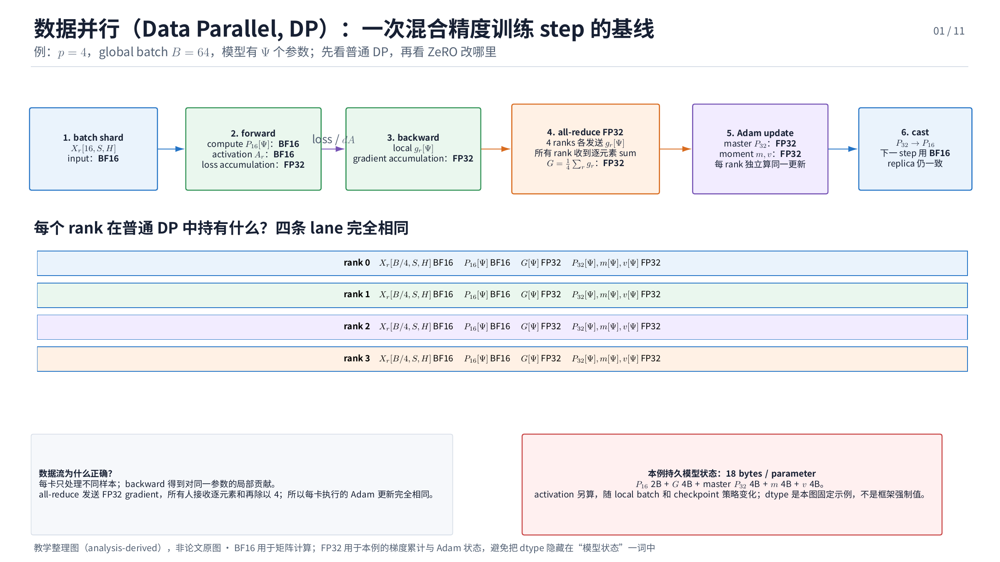

> 普通 DP 基线：DP sampler 是样本分发动作，不是 tensor；它为 rank $r$ 生成严格按时间取出的队列 $m_1,m_2,\ldots,m_K$。$m_k$ 完成 forward/backward 并产生 $g_{r,k}$ 后，先写入同一个 FP32 accumulation buffer；$k<K$ 时再取 $m_{k+1}$，$k=K$ 时才对完整 gradient 执行一次 all-reduce。每个 rank 随后用完整 $G$、$P_{32}$ 与 $S_{\mathrm{opt}}$ 更新自己的完整 BF16 compute weight。

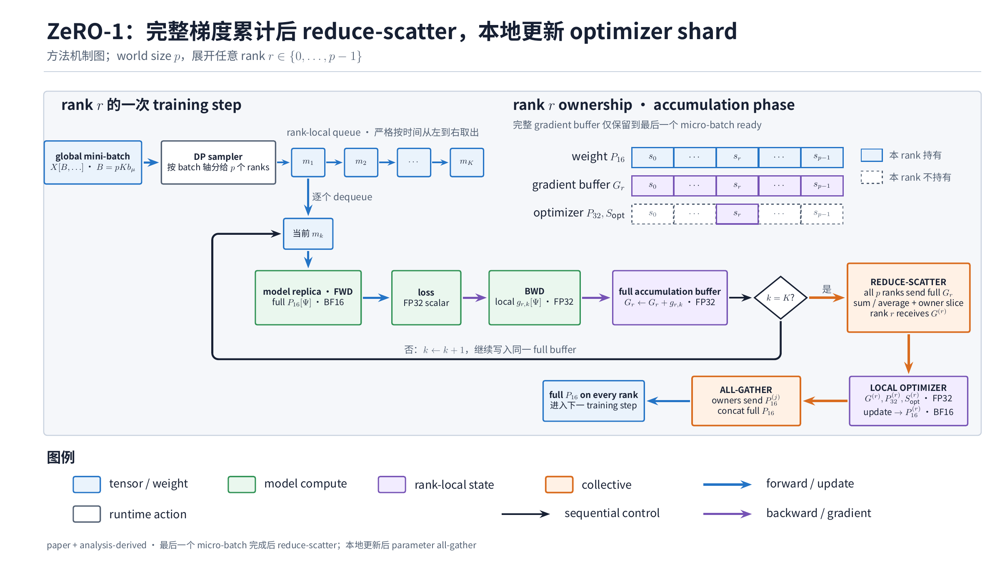

> ZeRO-1：micro-batches 仍严格按 $m_1 \rightarrow m_2 \rightarrow \cdots \rightarrow m_K$ 执行，每次 backward 都把 $g_{r,k}$ 加入完整 local FP32 buffer。第 $K$ 次累加完成后，reduce-scatter 对各 rank 的匹配 slices 求和或平均，并把结果直接交给对应 owner；rank $r$ 只更新自己的 $P_{32}^{(r)}$ 与 $S_{\mathrm{opt}}^{(r)}$，再通过 parameter all-gather 恢复每个 rank 的完整 $P_{16}$。reduce-scatter 在语义上等价于 all-reduce 后取 local slice，但无需在每卡落地完整的已归约 gradient。对同样大小的 gradient，ring reduce-scatter 的每 rank payload 约为 $(p-1)q\Psi/p$，是 ring all-reduce 的一半；整步还需另计 parameter all-gather。

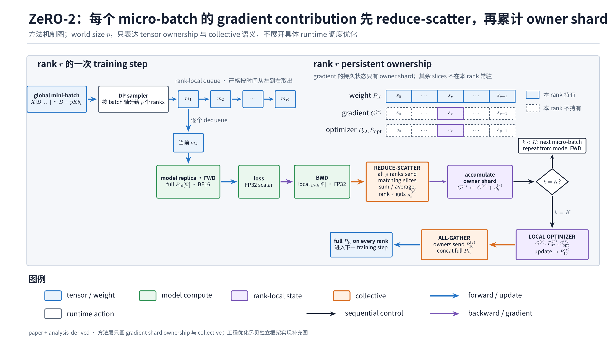

> ZeRO-2：每个 $m_k$ 的 backward 先产生 local gradient contribution $g_{r,k}$，随即通过 reduce-scatter 对匹配 slices 求和或平均；rank $r$ 只收到 $g_k^{(r)}$，并把它累加到持久的 owner shard $G^{(r)}$。$k<K$ 时回到下一个 micro-batch，$k=K$ 时才由 owner-local optimizer 更新参数 shard，随后 parameter all-gather 恢复完整 BF16 compute weight。与上图 ZeRO-1 的区别是：ZeRO-1 在 micro-batch 边界保留完整 local accumulation buffer，ZeRO-2 的持久 gradient 状态始终只有 owner shard。

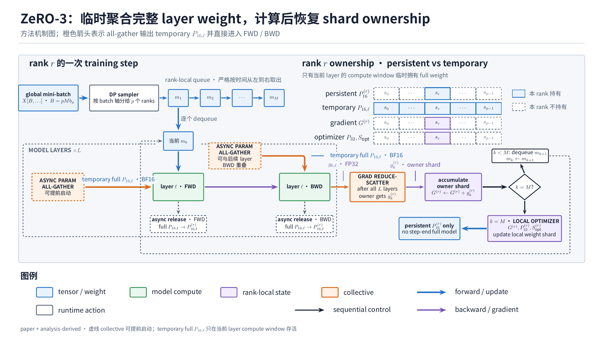

> ZeRO-3：BF16 compute weight 也分片。虚线 `MODEL LAYERS × L` 表示同一个 $m_k$ 顺序经过全部 layers；每个 layer 在 forward 前 all-gather 出 temporary full $P_{16,\ell}$，若 forward 后已释放，则 backward 前再次 all-gather。FWD/BWD 消费完成后的 release/reshard 是异步生命周期侧支，不在训练主数据流中。图在方法层把完成全部 $L$ 层后的 gradient reduce-scatter 画在虚框外；具体 runtime 如何流式调度通信属于独立实现补充。

> 教学整理图，非论文证据。论文机制与实验见 [ZeRO](../papers/zero.md#核心机制)。

### 方法卡

- **全局对象 / local layout**：DP 沿 $B$ 切分，每 rank 处理 $B/p$ 样本，但持完整 parameters、gradients 和 optimizer states。
- **复制对象**：普通 DP 复制全部模型状态；ZeRO 按 Stage 1 optimizer、Stage 2 gradients、Stage 3 parameters 的顺序消除复制。
- **恢复语义**：DP 在 optimizer step 前 all-reduce gradients；ZeRO 可用 reduce-scatter 让每个 owner 只收到全局 gradient 的对应 slice。上图 ZeRO-1 在完整 local accumulation 后 reduce-scatter；ZeRO-2 对每个 micro-batch 的 contribution reduce-scatter 后累计 owner shard；ZeRO-3 在 layer 使用参数前 all-gather temporary full weight，消费后释放或重新分片。
- **通信频率 / 载荷**：ring all-reduce 一份 $q\Psi$ gradient 时，每 rank 算法 payload 约 $2(p-1)q\Psi/p$ bytes/step，**analysis-derived**。Stage 3 还会在每个 layer 的参数使用窗口引入 parameter all-gather，频率通常显著高于普通 DP；具体流式调度不属于方法原理图。
- **模型状态内存**：忽略 padding、metadata 和临时 buffer，一份 parameter 与 gradient 均按 $q\Psi$、optimizer 为 $\kappa q\Psi$ 时，平均每 rank 状态为：

$$
\begin{aligned}
M_{\mathrm{DP}} &\approx (2+\kappa)q\Psi,\\
M_{\mathrm{Z1}} &\approx 2q\Psi+\kappa q\Psi/p,\\
M_{\mathrm{Z2}} &\approx q\Psi+(1+\kappa)q\Psi/p,\\
M_{\mathrm{Z3}} &\approx (2+\kappa)q\Psi/p.
\end{aligned}
$$

以上为 **analysis-derived** 的平均状态式；mixed precision 应把各状态 dtype 分开相加。ZeRO 论文自己的口径与假设见[状态公式](../papers/zero.md#核心公式与符号体系)。

- **activation / workspace**：DP activation 随 local batch 约降至 $1/p$；ZeRO-3 峰值还含当前 layer 的 temporary full weight、通信 workspace 与 allocator fragmentation。因此平均 $M_{\mathrm{Z3}}$ 不是 OOM 判据；prefetch 或 live-window 策略属于具体 runtime 的实现补充。
- **有效计算**：固定全局 $B$ 时，每 rank forward/backward 约为单卡 workload 的 $1/p$；ZeRO 不减少全局 FLOPs。
- **额外项**：ZeRO/FSDP 需要 temporary gather、reshard/release 和额外通信 workspace；prefetch、CPU/NVMe offload 与通信分组是具体实现扩展。
- **推理差异**：replica DP 扩请求吞吐；单请求 decode 不因 DP 降低延迟。参数分片推理会把 weight gather 放入 token critical path，必须与 cache、prefill/decode 批处理单独评估。
- **失效条件**：参数 gather 无法被 layer compute 遮住、瞬时 gather buffer OOM、跨节点 bandwidth 主导，或固定 global batch 下 local batch 太小。

## 4. TP：column-parallel 到 row-parallel

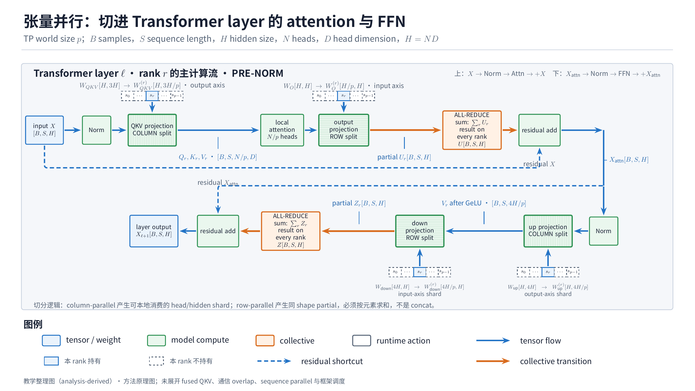

> 图按 pre-norm Transformer layer 展开 attention 与 FFN 两个子层；`Norm` 只表示归一化操作，不绑定 LayerNorm 等具体实现。蓝色虚线是 residual shortcut，箭头旁的蓝字是流经该边界的 tensor，而非额外算子。输入、输出均保持 $[B,S,H]$；column split 产生可由本 rank 独立消费的 head/hidden shard，row split 产生同 shape 的 partial tensor，再由 all-reduce 按元素求和。上下两组 weight ownership 条带分别给出本 rank 持有的输出轴 shard 与输入轴 shard。

> 教学整理图，非论文证据。原机制图与实现边界见 [Megatron-LM](../papers/megatron-lm.md#核心机制)。

### 方法卡

- **全局对象 / local layout**：第一 GEMM 按输出特征切权重 $A=[A_1,\ldots,A_p]$；每 rank 得到 $Y_i=XA_i$。GeLU 或独立 attention heads 本地执行，第二 GEMM 按输入特征切并产生 partial sum $Z_i=Y_iB_i$。
- **复制对象**：block 输入常在 TP group 内复制；LayerNorm、bias、residual 的复制或 sequence shard 取决于是否组合 SP。
- **恢复语义**：row-parallel 出口用 all-reduce 得到 $Z=\sum_i Z_i$，或 reduce-scatter 直接交给能消费 shard 的下游。
- **为什么这样切**：

$$
\operatorname{GeLU}(X_1A_1+X_2A_2)
\neq
\operatorname{GeLU}(X_1A_1)+\operatorname{GeLU}(X_2A_2).
$$

若第一 GEMM 按输入维切，非线性前就必须归约；column → local nonlinearity/head → row 把同步移动到更少的边界。

- **通信频率 / 载荷**：每 Transformer block 通常有多次 activation collective。对 $m=qBSH$ bytes 的 replicated activation，一次 ring all-reduce 的 per-rank payload 约 $2(p-1)m/p$，**analysis-derived**；实际次数取决于 MLP、attention、SP 与 fused schedule。
- **模型状态 / activation / workspace**：目标 linear weights 约为 $1/p$；中间 hidden/head activation 可分片，但 block boundary 可能复制；collective buffer、fused GEMM workspace 和 vocab logits 需单列峰值。
- **有效计算**：理想 GEMM FLOPs 约 $1/p$，全局 FLOPs 不变。
- **额外项**：没有算法重计算或 bubble，但 local GEMM 变小会降低 arithmetic intensity；多轴 collective 还会争用 fabric。
- **推理差异**：prefill 的大 GEMM 较容易摊薄通信；decode 的 batch/token 小，collective latency 和 kernel launch 更突出，TP degree 过大常降低单请求效率。
- **失效条件**：hidden/head/vocab 不能合理分片、local GEMM 太小、跨节点 collective 进入 critical path，或相邻算子 layout 导致额外 reshard。

## 5. PP：layer stage 与 micro-batch 时间轴

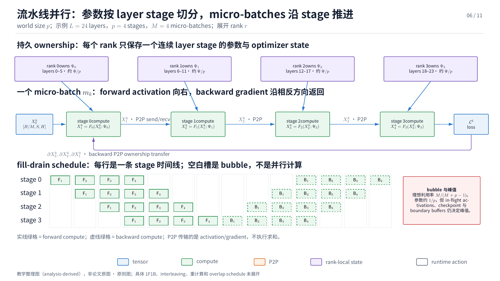

> 图上半部把 layer-stage 参数 ownership 与单个 $m_k$ 的 forward activation / backward gradient P2P 分开；下半部用每个 stage 的单条时间线表示 fill-drain schedule。实线绿格是 forward compute，虚线绿格是 backward compute，空白格才是 bubble；颜色不再表示 rank，以免把持久状态、计算和通信混为一类。

> 教学整理图，非论文证据。GPipe 的 schedule、重计算与实验证据见 [GPipe](../papers/gpipe.md#核心机制)。

### 方法卡

- **全局对象 / local layout**：沿 $L$ 切为 $p$ 个 stages，每 stage 持连续 layers；mini-batch 再切成 $M$ 个 micro-batches。
- **复制对象**：stage 只持本段参数；embedding、output head、tied weights 或 optimizer metadata 可能需要复制或跨 stage 同步。
- **恢复语义**：forward activation 逐 stage send，backward gradient 反向 send；GPipe 在 mini-batch 边界同步更新，使全部 micro-batches 使用同一参数版本。
- **通信频率 / 载荷**：每个 micro-batch 在每个 stage boundary 各传 forward activation 和 backward gradient。若 boundary tensor 为 $[B/M,S,H]$，单次 payload 量级为 $qBSH/M$ bytes，**analysis-derived**。
- **模型状态 / activation / workspace**：参数和 optimizer state 理想约 $1/p$；activation 取决于 in-flight micro-batches、schedule 与 checkpoint。boundary send/recv buffer 不能忽略。
- **有效计算与 bubble**：均衡、单向 fill/drain 模型下，利用率与 bubble 为：

$$
U_{\mathrm{pipe}}\approx\frac{M}{M+p-1},\qquad
\beta_{\mathrm{pipe}}\approx\frac{p-1}{M+p-1}.
$$

二者为 **analysis-derived**；1F1B、interleaving 和虚拟 stages 会改变 schedule，但不会消除 stage balance 约束。

- **额外项**：activation checkpoint 以额外 forward FLOPs 换内存；最慢 stage 决定周期，不能用平均 layer FLOPs 估计。
- **推理差异**：prefill 可形成 micro-batch pipeline；autoregressive decode 同一请求有 token 依赖，通常靠多请求 continuous batching 才能填满 stages。训练的 $M/(M+p-1)$ 不能直接当 serving 利用率。
- **失效条件**：$M$ 太小、stage 切分不均、boundary activation 过大、tied layer 强耦合，或 pipeline 调度增加不可接受的延迟。

## 6. EP：expert ownership 与 token redistribution

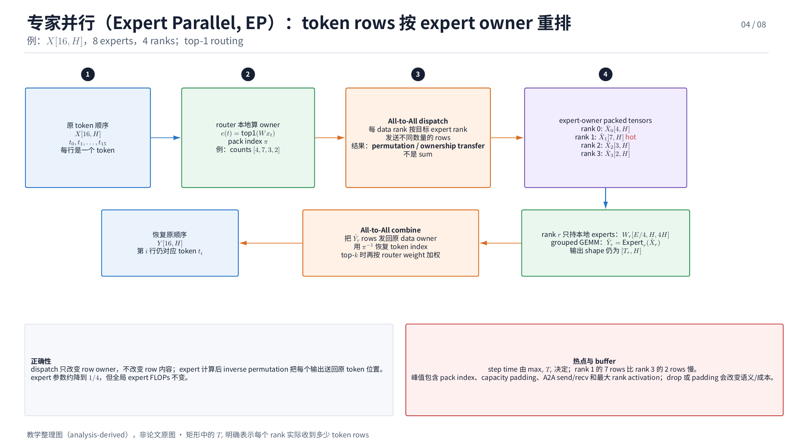

> 图按 pre-norm MoE layer 的模型执行顺序从左到右展开。中间矩形只表示处理或通信节点；箭头旁的蓝字标出 tensor layout 如何从 token-owner rows，经 router、按 expert owner 分组、all-to-all dispatch、local expert FFN、all-to-all return，最终恢复原 token slot。蓝色虚线保留输入 $X_r$ 的 residual shortcut，底部 ownership 条带表示 rank $r$ 只持有其负责的 expert weights。

> 教学整理图，非论文证据。GShard 的 expert placement 与系统证据见 [GShard](../papers/gshard.md#核心机制)。

### 方法卡

- **全局对象 / local layout**：ordinary dense layers 常复制或另行 TP；$E$ 个 experts 分到 ranks，每 rank 持约 $E/p$ experts。tokens 起初按 DP/sequence layout 分布，经 router 改为 expert-owner layout。
- **复制对象**：router、dense layers 和 shared experts 视实现复制；expert parameters 才是 EP 的主要 shard。
- **恢复语义**：all-to-all dispatch 把 token 送到 expert owner；local expert 计算后 inverse all-to-all 把输出送回原 token owner，再按 router weights combine。
- **通信频率 / 载荷**：每个 MoE layer 至少一次 dispatch 和一次 combine。若某 rank 实际接收 $T_r$ tokens，单方向 activation payload 量级为 $qT_rH$ bytes，**analysis-derived**；训练 backward 还产生对应反向流量。
- **模型状态 / activation / workspace**：expert state 理想约 $1/p$；dispatch packing、capacity padding、permutation index、A2A workspace 与接收 token 峰值按最热 rank 计算。
- **有效计算**：理想 expert FLOPs 约 $1/p$；实际 step time 由 $\max_r T_r$、expert shape 和 grouped-GEMM 效率决定。
- **额外项**：capacity、token drop、random second choice 与 auxiliary loss 同时改变质量、通信量、空转和负载，不能只当模型超参数。
- **推理差异**：小 batch decode 可能让每 rank token 数不足以形成高效 grouped GEMM；expert weight cache、请求间路由抖动和跨节点 A2A 更突出。
- **失效条件**：热点 expert、capacity overflow、严重 padding、小消息碎片、oversubscribed all-to-all fabric，或 expert 太小导致 kernel 低效。

## 7. Megatron Sequence Parallel：非 attention activation 的 $S/p$

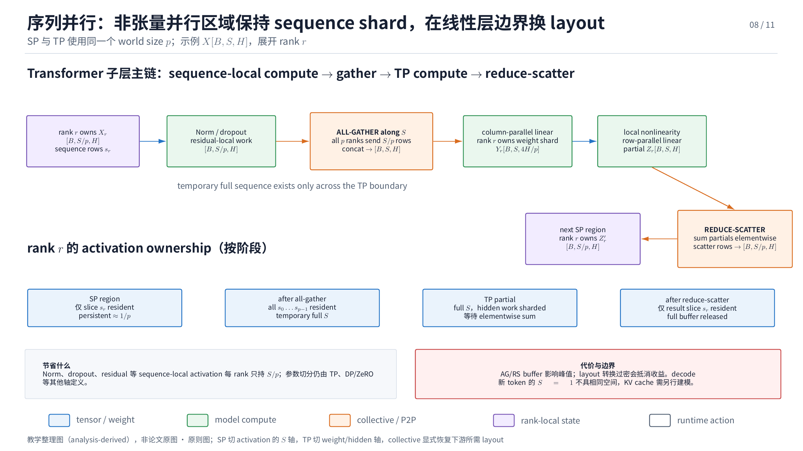

> 图沿 Transformer 子层主链展示 rank $r$ 的 sequence shard：Norm、dropout、residual 等本地算子保持 $[B,S/p,H]$；进入 TP linear 前沿 $S$ 执行 all-gather，row-parallel partial 出口再用 reduce-scatter 完成逐元素求和并恢复 $[B,S/p,H]$。阶段 ownership 条带区分持久 shard、temporary full sequence 与 TP partial 的生命周期。

> 教学整理图，非论文证据。术语边界与 Ulysses/Ring 对照见[序列与上下文并行](../topics/sequence-and-context-parallelism.md)。

### 方法卡

- **全局对象 / local layout**：在 TP group 内让 LayerNorm、dropout、residual 等非 attention activation 保持 $[B,S/p,H]$，而不是每 rank 复制完整 $[B,S,H]$。
- **复制对象**：它本身不定义参数 shard；参数仍由 TP、DP/ZeRO 等轴决定。
- **恢复语义**：进入需要完整 sequence 或 TP linear 的边界时 all-gather；partial output 用 reduce-scatter 同时归约并恢复 sequence shard。
- **通信频率 / 载荷**：通常每 Transformer block 与 TP 边界成对出现 gather/reduce-scatter，payload 量级由 $qBSH$ activation 决定，**analysis-derived**。
- **模型状态 / activation / workspace**：被覆盖区域的 activation 从 $O(qBSH)$ 降至 $O(qBSH/p)$；gather/RS buffer 和 fused norm/dropout workspace 仍计峰值。
- **有效计算**：被覆盖 elementwise 算子每 rank 约 $1/p$；它常与 TP 一起使 block 的分布式计算闭合，而不是独立降低全局 FLOPs。
- **额外项**：layout 边界和 RNG/dropout 一致性；没有 pipeline bubble。
- **推理差异**：训练和长 prefill activation 收益清晰；decode 的新 token $S=1$ 不具相同的 sequence shard 空间，KV cache 另由 CP/TP 管理。
- **失效条件**：频繁 layout 转换超过 activation 节省，或框架算子不能直接消费 sequence shard。

## 8. Ulysses：sequence 与 heads 的 layout transpose

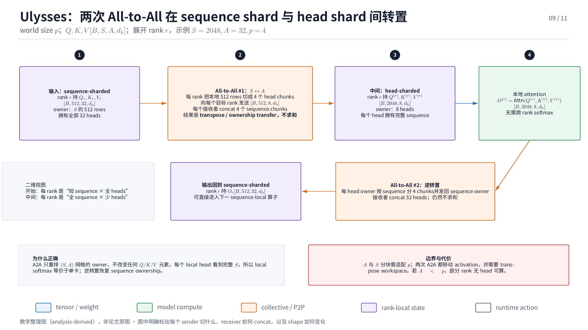

> 第一次 all-to-all 让每个 sequence owner 把本地 $S/p$ rows 按 head 切成 $p$ 份；每个 head owner 接收所有 ranks 的 sequence chunks 并 concat，得到 $[B,S,A/p,d_h]$。本地 attention 后第二次 all-to-all 做逆转置，重新得到 $[B,S/p,A,d_h]$。两次通信都只改变元素 owner，不做数值归约。

> 教学整理图，非论文证据。论文公式、有限实现核验和复合收益边界见 [DeepSpeed Ulysses](../papers/deepspeed-ulysses.md#核心机制)。

### 方法卡

- **全局对象 / local layout**：attention 前由 $[B,S/p,A,d_h]$ 经 all-to-all 变为 $[B,S,A/p,d_h]$；每 rank 看完整 sequence，但只负责 $A/p$ heads。attention 后第二次 all-to-all 恢复 sequence shard。
- **复制对象**：参数状态通常由 ZeRO/DP/TP 决定；Ulysses 主要改变 Q/K/V 与 attention output 的 activation ownership。
- **恢复语义**：两次 all-to-all 是 layout transpose，不是数值求和；local attention 保持标准精确语义。
- **通信频率 / 载荷**：forward attention 前后各一次 A2A；具体元素倍数取决于 Q/K/V 是否合并传输、kernel 和 backward schedule。总量随 $BSA d_h$，每 rank shard 量级随 $1/p$，**analysis-derived**。
- **模型状态 / activation / workspace**：attention activation 和局部计算约按 $1/p$ 分摊，但 transpose send/recv buffer、通信 workspace 与 full-$S$ local-head kernel workspace 必须计峰值。
- **有效计算**：attention FLOPs 理想约 $1/p$，全局 exact-attention FLOPs 不变。
- **额外项**：没有算法近似或 bubble；uneven heads、A2A fragmentation 和 fabric contention 形成 imbalance。
- **推理差异**：prefill 与训练更接近论文数据流；decode 只有单 token Q，却访问 full-history KV，KV cache ownership 与 A2A 是否值得需另建 serving 模型。
- **失效条件**：$A$ 不能合理按 $p$ 分片、跨节点 A2A 拥塞、通信不能与 attention compute 重叠，或与 TP head 轴发生 layout 冲突。

## 9. Ring / Context Parallel：local Q 固定、KV block 环传

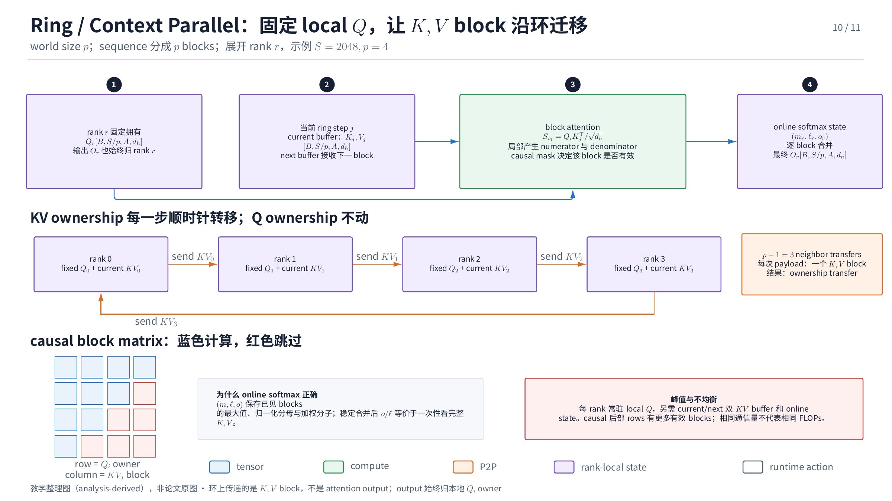

> rank $r$ 固定持有 $Q_r$ 与最终输出 $O_r$；current/next buffer 逐步接收轮转的 $K_j,V_j$ block。两条独立输入线汇入 block attention，online-softmax state 再逐 block 合并。中部环形 P2P 展示 KV ownership transfer，底部 causal block matrix 则单独展示不同 $Q_i$ rows 的有效计算不均衡。

> 教学整理图，非论文证据。online softmax、blockwise 机制与证据边界见 [Ring Attention](../papers/ring-attention.md#核心机制)。

### 方法卡

- **全局对象 / local layout**：sequence 分成 $p$ 个 blocks。rank $i$ 固定 local $Q_i$，持当前 $K_j,V_j$ block 并逐 step 传给邻居。
- **复制对象**：参数由其他并行轴决定；sequence/KV state 分片，不要求每 rank 同时持全序列 KV。
- **恢复语义**：online softmax 维护 running max、denominator 和 weighted numerator，使所有 KV blocks 合并后仍是 exact attention。
- **通信频率 / 载荷**：每 attention layer 走 $p-1$ 个 neighbor steps；每 step 发送一个 local KV block。实现可能用双 buffer 让 next KV transfer 与 current block compute overlap。
- **模型状态 / activation / workspace**：每 rank 约持 local Q、当前与接收中的 KV、online state、output accumulator 和通信 buffers；参数内存不因 Ring 单独下降。
- **有效计算**：non-causal exact attention 理想约 $1/p$。causal mask 下有效 block 呈三角形，关键路径由 max-rank work 决定，平均 FLOPs 会低估 imbalance。
- **额外项**：$p-1$ 次启动延迟、双 buffer、blockwise kernel 边界；没有算法近似，但可能为 overlap 调整 block size。
- **推理差异**：训练/prefill 可用大 blocks 遮住 P2P；decode 的 Q 很小、KV cache 长且请求动态，通信覆盖条件更苛刻，需要 cache placement 和 request scheduling。
- **失效条件**：block compute 小于邻居传输时间、logical ring 映射到慢链路、causal imbalance 未重排，或双 buffer 峰值 OOM。

## 10. CFGP：沿 conditional branch 切分

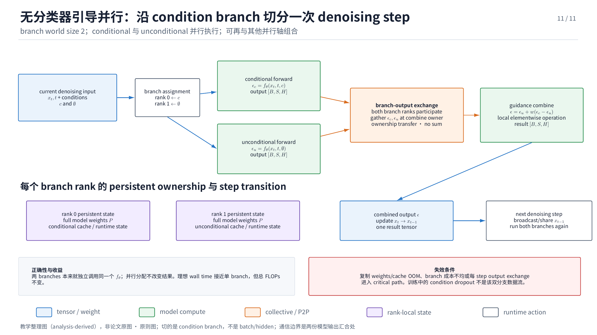

> 同一个 denoising step 先把 conditional 与 unconditional condition 分给两个 branch ranks；两条 model forward 真正并发，输出 $\epsilon_c,\epsilon_u$ 在 combine owner 汇合后执行本地 guidance 公式。下方 ownership 区明确模型权重与 branch cache 通常复制，而跨 rank 传输的是两份 branch output，不是 reduction result。

> 教学整理图，非论文证据。跨域 canonical 案例与 owner 链接见[跨领域采用](../evidence/parallel-partitioning-cross-domain-adoption.md)。

### 方法卡

- **全局对象 / local layout**：两个 ranks 分别执行 conditional 与 unconditional branch，输入 $x_t,t$ 共享，condition 不同。
- **复制对象**：若不再组合 TP/PP/FSDP，model weights、runtime state 和部分 cache 在 branch ranks 复制。
- **恢复语义**：在 guidance boundary 交换或 gather $\epsilon_c,\epsilon_u$，计算 $\epsilon=\epsilon_u+w(\epsilon_c-\epsilon_u)$，再进入下一 denoising step。
- **通信频率 / 载荷**：每个 denoising step 至少一次 branch-output exchange，payload 由模型输出 tensor 决定；若在更早边界 combine，会增加传输量。
- **模型状态 / activation / workspace**：模型状态通常复制；每 rank 只保存一条 branch activation，但 combine 端需同时拥有两分支输出。cache 能否共享取决于模型与 runtime。
- **有效计算**：两分支总 FLOPs 与串行 CFG 基本相同；两 rank 理想各约承担一条分支，即约总分支 FLOPs 的 $1/2$，**analysis-derived**。收益是 wall-time 并发，不是全局 FLOPs 下降。
- **额外项**：较快分支等待较慢分支，step 间同步反复出现；可与 cache reuse、TP/PP 组合，但会增加 layout 和 owner 复杂度。
- **推理差异**：CFGP 是 diffusion inference 路径；训练中的 condition dropout 不是两条同时执行的 CFG branch，不能套用同一成本。
- **失效条件**：分支成本严重不均、output exchange 过大、复制 weights/cache OOM，或 combine 无法与下一步重叠。

## 11. 组合：不同轴不会自动相乘

从约束驱动逐步增加轴通常比一次搜索所有 degree 更可审计：

DP → ZeRO/FSDP → TP → PP → EP → CP/SP。

这不是固定顺序。组合时至少检查三类耦合：

1. **layout 冲突**：Ulysses 与 head-TP、Megatron SP 与 TP boundary、EP dispatch 与 sequence shard 都可能额外 reshard；
2. **资源争用**：TP/CP 高频 collective、ZeRO gather、EP/Ulysses A2A 可能共享同一 fabric；单轴未 overlap 成本不能相加后宣称可完全 overlap；
3. **峰值叠加**：ZeRO gather window、TP collective workspace、Ring 双 KV buffer、PP in-flight activations 可能同时存活。

设备网格与拓扑映射见[多轴组合与设备网格](../topics/composition-and-device-mesh.md)。不规则 `o_proj`、sparsity-aware CP 和 workload-aware assignment 见[不规则切分](irregular-and-workload-aware-partitioning.md)。

## 12. 证据边界与使用方式

- 六篇 canonical Paper 均已完成 schema/semantic validation 和原图 QA；本页的 11 张 PNG 全部是 **analysis-derived 教学整理图**，不计入原论文视觉证据。
- DP/ZeRO、TP、PP、EP、Ulysses 与 Ring 的论文级依据分别链接到 [ZeRO](../papers/zero.md)、[Megatron-LM](../papers/megatron-lm.md)、[GPipe](../papers/gpipe.md)、[GShard](../papers/gshard.md)、[DeepSpeed Ulysses](../papers/deepspeed-ulysses.md) 和 [Ring Attention](../papers/ring-attention.md)。
- Megatron Sequence Parallel 与 CFGP 是跨来源综合；术语与采用边界分别见[序列/上下文并行 Topic](../topics/sequence-and-context-parallelism.md)和[跨领域采用 Evidence](../evidence/parallel-partitioning-cross-domain-adoption.md)。
- 所有公式描述理论量级与明确假设。full-system throughput、scaling efficiency 或 end-to-end latency 不能自动归因给单个 parallel primitive。
- 图的 owner、用途、分辨率和逐图 QA 状态记录在 [Figure Inventory](../evidence/figure-inventory.md)。
