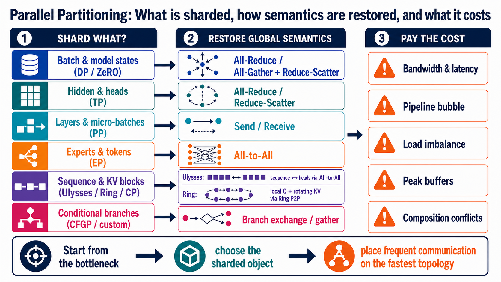

---
tags:
  - topic
  - collection/parallel-partitioning
  - domain/ai-infra
  - topic/distributed-training
document_type: topic
domain: parallelism
canonical: true
---

# 并行切分坐标系：切了什么，沿什么维切

> [!info] 文档关系
> - 领域入口：[README](../README.md)
> - 方法总览：[并行切分方法体系](../surveys/parallel-partitioning-taxonomy.md)
> - 通信模型：[通信原语与成本模型](communication-primitives-and-cost-model.md)
> - 组合方法：[多轴组合与设备网格](composition-and-device-mesh.md)

并行切分首先是 placement 问题，不是缩写问题。面对一个新方案，应先写出被分布的逻辑对象、各 rank 的局部 layout、恢复全局语义的位置，再讨论它应叫 TP、SP 还是 CP。

> 这是 `$imagegen` 生成并经人工纠错的教学图，不是论文证据。原论文机制和结果图由各 canonical Paper 独立拥有。

## 1. 统一对象

| 对象 | 逻辑轴 | 常见切分 | 未切时的冗余或瓶颈 |
|---|---|---|---|
| samples / requests | batch $B$ | DP | 每个副本处理不同样本，模型复制 |
| tokens / KV blocks | sequence $S$ | SP / CP | activation、attention 或 KV cache 随序列增长 |
| features / heads | hidden $H$、heads $A$ | TP | 单层权重或 GEMM 超单卡 |
| layers | layer $L$ | PP | 总参数/激活跨层累积 |
| experts | expert $E$ | EP | MoE 参数容量和 token routing |
| training states | parameter $P$、gradient $G$、optimizer $O$ | ZeRO / FSDP | DP 重复保存模型状态 |
| conditional paths | branch / modality / timestep | CFGP / custom | 同一输入执行多条条件分支 |

设备则抽象成逻辑 mesh：

$$
\mathcal D=
D_{\mathrm{DP}}\times D_{\mathrm{TP}}\times D_{\mathrm{PP}}
\times D_{\mathrm{EP}}\times D_{\mathrm{CP}}.
$$

一个 rank 的身份是这组坐标的组合。不同 mesh 维可以映射到不同物理互联域，例如 TP/CP 放节点内 NVLink，DP/PP 放跨节点网络。

## 2. Placement 语言

四类基本 placement 足以描述大部分方案：

- `Replicate`：每个 rank 持完整对象。
- `Shard(dim)`：沿某个 tensor 或逻辑维分片。
- `Partial(sum)`：每个 rank 持完整结果的部分和，后续必须 reduce。
- `Pipeline(stage)`：对象按执行顺序分段，跨边界传 activation/gradient。

切分正确性取决于局部结果如何组合：

- concat：column-parallel GEMM 的输出片段；
- sum：row-parallel GEMM 的部分和；
- associative merge：online softmax 的 running state；
- ordered state transition：某些 recurrent/KDA context parallel；
- route + inverse route：expert dispatch/combine。

因此“两个 rank 各算一半”不够。必须说明组合运算是否满足交换律/结合律、是否依赖顺序，以及 mask、padding、uneven shard 如何处理。

## 3. 六个 canonical 例子

| Paper | 输入 layout | 局部计算 | 输出/恢复 |
|---|---|---|---|
| [Megatron-LM](../papers/megatron-lm.md) | TP 组复制 $X$ | 第一 GEMM 输出维分片，GeLU/head-local | 第二 GEMM 输入维分片，出口 sum |
| [GPipe](../papers/gpipe.md) | mini-batch 切 micro-batches | 每 stage 持连续 layers | stage P2P，mini-batch 末同步更新 |
| [ZeRO](../papers/zero.md) | DP batch shard | $O/G/P$ 按 DP group 分片 | 使用前 gather，梯度后 reduce-scatter |
| [GShard](../papers/gshard.md) | 普通层复制、experts 分片 | local expert FFN | token all-to-all dispatch/combine |
| [Ulysses](../papers/deepspeed-ulysses.md) | $[b,S/P,A,d]$ | $[b,S,A/P,d]$ 上做 attention | 两次 all-to-all 互换 sequence/head ownership |
| [Ring Attention](../papers/ring-attention.md) | local $Q_i,K_i,V_i$ | $Q_i$ 与当前 KV block 更新 online state | KV 环传一圈，输出留在 Q owner |

## 4. 容易混淆的边界

### Sequence Parallel 与 Context Parallel

有些系统把非 attention activation 按 sequence 切称为 SP，把 attention/KV 的全局上下文协作称为 CP；另一些论文把 Ulysses 或 Ring 都叫 SP。名称不稳定，数据流更可靠：

- attention 内是否每 rank 看到完整 sequence？
- Q 是否固定、KV 是否移动？
- attention 前后是否发生 layout transpose？
- 非 attention layer 是否继续保持 sequence shard？

### DP 与状态切分

DP 切 batch；ZeRO/FSDP 切的是 DP 副本内部原本重复的训练状态。二者共享 DP group，但不是同一切分对象。

### 模型结构分解与设备切分

[DeepSeek-V4 grouped output projection](../../../02_model_systems/llm_foundations/papers/deepseek-v4.md#43-模型系统架构)首先是模型结构分解；只有在把 group 映射到 TP ranks 时才成为分布式切分。

## 5. 最小描述模板

记录任何新方案时，至少填写：

1. global tensor/state shape；
2. device mesh shape；
3. 每个输入/输出的 placement；
4. local operator；
5. redistribution primitive；
6. forward/backward 或 prefill/decode 的差异；
7. memory saved、communication added、compute changed；
8. divisibility、padding、mask、topology 和 load-balance 条件。
