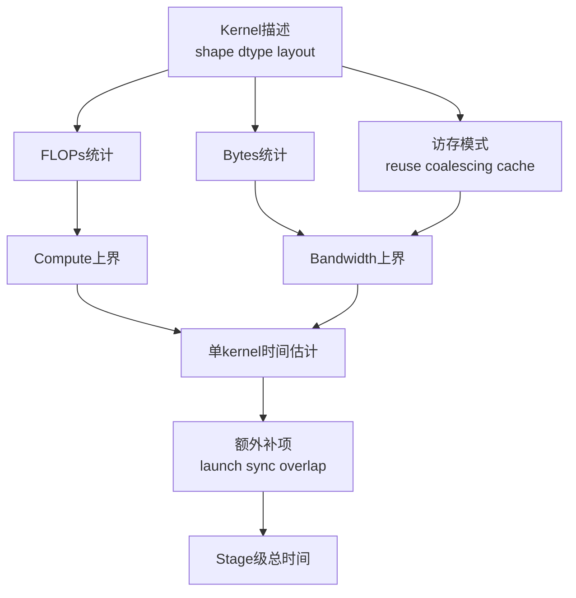

# kernel开销计算逻辑

这份笔记只记录通用的 kernel 成本估算框架，不绑定具体项目实现。

## 1. 单 kernel 的第一性近似

对单机单 kernel，最常见的第一层近似是：

$$
T_{\mathrm{compute}}
\approx
\frac{\mathrm{FLOPs}}{P_{\mathrm{eff}}},
\qquad
T_{\mathrm{memory}}
\approx
\frac{\mathrm{Bytes}}{B_{\mathrm{eff}}},
\qquad
T_{\mathrm{kernel}}
\gtrsim
\max
\left(
T_{\mathrm{compute}},\,
T_{\mathrm{memory}}
\right)
$$

其中：

- $\mathrm{FLOPs}$ 是该 kernel 的浮点运算量
- $\mathrm{Bytes}$ 是主要 DRAM 流量
- $P_{\mathrm{eff}}$ 是可达到的有效算力
- $B_{\mathrm{eff}}$ 是可达到的有效带宽

这是对 Roofline 思想的工程化写法。

## 评估维度拆解

如果把 kernel 评估做成一个长期可维护的模块，建议显式拆成下面几层：

- 语义层：算子类型、输入输出 shape、dtype、layout、是否 in-place。
- 算量层：FLOPs、读写字节数、是否存在多次 pass。
- 访存层：访存是否连续、是否存在 tile reuse、是否明显依赖 cache。
- 硬件层：峰值算力、峰值带宽、不同 dtype 的理论上界。
- 运行时层：kernel launch、同步、重叠、跨 kernel pipeline。

这样做的好处是，一旦误差变大，你能更快知道是 FLOPs 数错了、Bytes 估小了、还是忽略了 launch / sync。

## 2. Roofline 的核心结论

Roofline 原论文使用的是 $ \mathrm{Operational\ Intensity} $，定义为“每字节 DRAM 流量对应的操作数”。原始上界写法是：

$$
\mathrm{Attainable\ Performance}
=
\min
\left(
P_{\mathrm{peak}},
\,
B_{\mathrm{peak}} \cdot \mathrm{OI}
\right)
$$

从这个式子可以直接得到两个判断：

- 当 $\mathrm{OI}$ 低时，性能更容易受内存带宽限制。
- 当 $\mathrm{OI}$ 高时，性能更容易受峰值算力限制。

交点也很重要：

$$
\mathrm{ridge\ point}
=
\frac{P_{\mathrm{peak}}}{B_{\mathrm{peak}}}
$$

如果一个 kernel 的运算强度低于 ridge point，它更可能是 memory-bound；高于 ridge point，则更可能是 compute-bound。

## 3. 原始 Roofline 的边界

需要明确一件事：原始 Roofline 论文讨论的是浮点程序与多核架构的上界关系，本体上不是分布式训练或在线推理的端到端模型。

因此下面这些因素，通常需要额外补项，而不是直接指望经典 Roofline 给答案：

- kernel launch 开销
- 同步开销
- PCIe / NVLink / IB 通信
- collective 通信与重叠
- 调度、排队、服务端 batching

“用 Roofline 看清单 kernel 上界，再额外建模通信和同步”是比较稳妥的做法。

## 4. 面向 stage 的工程近似

如果从单 kernel 走到一个 stage，可以用下面的工程近似来拆：

$$
T_{\mathrm{stage}}
\approx
T_{\mathrm{launch\_sync}}
+
T_{\mathrm{nonoverlap\_compute}}
+
T_{\mathrm{nonoverlap\_comm}}
+
\max
\left(
T_{\mathrm{overlap\_compute}},\,
T_{\mathrm{overlap\_comm}}
\right)
$$

这不是 Roofline 原论文给出的定理，而是把“算力/带宽上界”扩展到端到端 stage 时常见的工程拆分方式。它的用途不是严格证明，而是帮助问清楚：

- 哪部分真的不能重叠
- 哪部分只是看上去慢，其实被别的路径遮住了
- 优化后是减少总时间，还是只是把瓶颈从算力换成通信

## 5. 一个实用的估算顺序

1. 先数清楚 FLOPs。
2. 再估主导 DRAM 流量，而不是只看张量逻辑大小。
3. 算运算强度

$$
\mathrm{OI} = \frac{\mathrm{FLOPs}}{\mathrm{Bytes}}
$$

4. 与 $ \mathrm{ridge\ point} $ 比较，先判断更像 compute-bound 还是 memory-bound。
5. 如果是多 kernel 或多卡，再单独加入 launch、sync、collective、跨节点通信。

## 实现方案

比较稳妥的实现结构可以是：

1. 统计器：输入算子元信息，输出 FLOPs、逻辑读写量和关键 shape。
2. 硬件画像：记录 $P_{\mathrm{peak}}$、$B_{\mathrm{peak}}$、不同 dtype 的效率折减系数。
3. 成本模型：先给出 roofline 上界，再加上 launch、sync、通信补项。
4. 校准层：用少量 microbenchmark 反推 $P_{\mathrm{eff}}$ 和 $B_{\mathrm{eff}}$ 的经验区间。
5. 报告层：输出 compute-bound / memory-bound 判断、瓶颈因子和误差来源。

这个结构的关键不是把所有细节都做精，而是把误差来源显式化。

## 实现样例 A：GEMM

对一个矩阵乘法

$$
C_{M \times N} = A_{M \times K} B_{K \times N}
$$

最常见的 FLOPs 估计是：

$$
\mathrm{FLOPs}_{\mathrm{GEMM}} \approx 2 M N K
$$

如果只取一个较乐观的 DRAM 下界，读 $A$、读 $B$、写 $C$，则：

$$
\mathrm{Bytes}_{\mathrm{lb}}
\approx
s \cdot (M K + K N + M N)
$$

其中 $s$ 表示每个元素的字节数。于是可得：

$$
\mathrm{OI}_{\mathrm{GEMM}}
\approx
\frac{2 M N K}{s \cdot (M K + K N + M N)}
$$

这个样例的用处在于：

- 当 $K$ 较大且 tile reuse 好时，GEMM 往往更接近 compute-bound。
- 当 shape 很瘦长、访存不规则或有效复用差时，实际表现会明显偏离乐观上界。

## 实现样例 B：LayerNorm

如果用 LayerNorm 做一个对照样例，它通常更适合说明 memory-bound 问题。虽然每个元素上的算术操作不算少，但相对于反复读写输入、均值、方差和输出，它的运算强度往往不高。

因此，一个简单而有效的实现策略是：

- 在统计器里把 LayerNorm 单独归为“高访存敏感算子”。
- 不急着把常数项 FLOPs 做得极精，而是优先把读写 pass、向量化、cache reuse 和 fuse 情况统计清楚。
- 报告中直接给出“更可能受带宽约束”的判断，而不是只给一个单点时间估计。

## 6. 什么时候这个模型最有用

- 评估 GEMM、attention、norm、激活等 kernel 的理论上界时
- 比较不同 kernel 为何一个更吃带宽、另一个更吃算力时
- 做“还值得继续优化吗”的上界判断时

## 7. 什么时候不要只靠它

- 在线服务延迟分析
- 多用户并发下的 goodput 分析
- 分布式系统中的尾延迟与抖动分析
- 强依赖通信拓扑和调度策略的端到端性能分析

## 来源

- Roofline 原始论文: https://www2.eecs.berkeley.edu/Pubs/TechRpts/2008/EECS-2008-134.pdf
- 系统评测上下文: https://docs.vllm.ai/en/stable/api/vllm/benchmarks/serve/
- MLPerf 场景定义: https://github.com/mlcommons/inference_policies/blob/master/inference_rules.adoc
