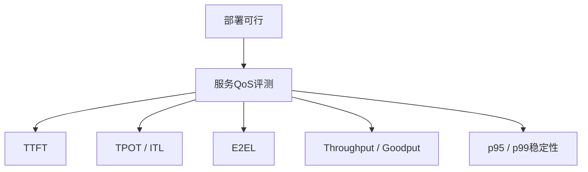
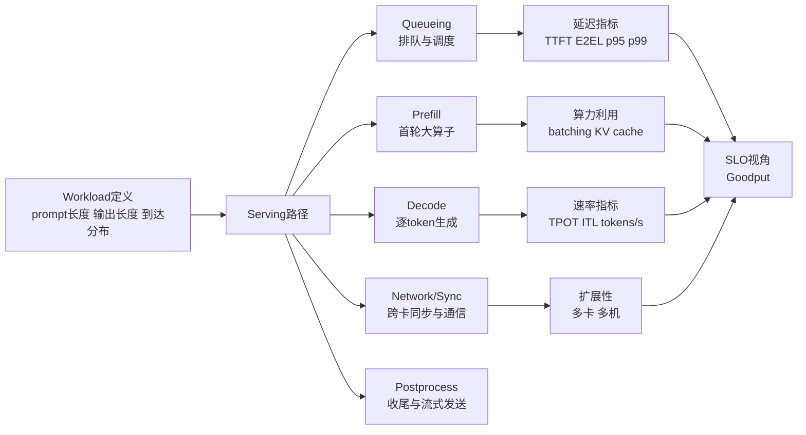

# 系统性能评测-延迟吞吐与Roofline

## 资料边界

- 用途：定义在线服务性能评测中的 TTFT、TPOT、ITL、E2EL、throughput 和 goodput。
- 主要来源：vLLM benchmark metrics、MLPerf Inference policies 与 Roofline 原始论文。
- 证据类型：服务 QoS 评测口径；不替代具体 serving backend 的压测结果。

## 先把能力评测和系统评测分开

模型答题分数高，不代表它在线服务体验好。系统性能评测关心的是：

- 真正上线时首 token 出得快不快
- 后续 token 稳不稳定
- 在并发下还能不能维持服务质量
- 在给定延迟约束下能撑住多少吞吐

这和 MMLU、GSM8K、IFEval 这类能力 benchmark 不是一回事。

## 它是部署能力之上的第二层

更底层的部署能力问题，单独见 [部署能力评测-内存算力带宽与通信](部署能力评测-内存算力带宽与通信.md)。这份笔记只聚焦服务 QoS，也就是模型已经可部署之后，系统如何表现。

## 常用在线服务指标

vLLM 的 benchmark 指标定义很适合作为通用术语表：

| 指标 | 含义 | 备注 |
| --- | --- | --- |
| TTFT | time to first token | 用户感知“开始出字”的速度 |
| TPOT | time per output token | 近似定义见下方公式 |
| ITL | inter-token latency | 相邻输出 token 之间的延迟 |
| E2EL | end-to-end latency | 请求总延迟 |
| request throughput | 每秒完成请求数 | 不反映请求是否满足 SLO |
| output throughput | 每秒输出 token 数 | 适合看生成速率 |
| goodput | 满足 SLO 的每秒完成请求数 | 往往比 raw throughput 更贴近生产体验 |

一个常见近似写法是：

$$
\mathrm{TPOT} \approx \frac{T_{\mathrm{E2E}} - T_{\mathrm{TTFT}}}{N_{\mathrm{out}} - 1}
$$

一个重要判断是：如果只报 throughput，不报 TTFT、TPOT 或 goodput，通常不足以判断真实服务体验。

## 为什么要看 goodput

vLLM 的定义很直接：只有同时满足指定 SLO 的请求，才会计入 goodput。

可以写成一个简单的计数形式：

$$
\mathrm{Goodput}
=
\frac{1}{\Delta t}
\sum_i
\mathbf{1}
\Big[
T^{(i)}_{\mathrm{TTFT}} \le \tau_{\mathrm{TTFT}}
\land
T^{(i)}_{\mathrm{TPOT}} \le \tau_{\mathrm{TPOT}}
\land
T^{(i)}_{\mathrm{E2E}} \le \tau_{\mathrm{E2E}}
\Big]
$$

因此：

- throughput 高，不一定表示服务“可用”。
- 当系统通过排队或过度 batching 换吞吐时，goodput 可能下降。

这比单纯看 QPS 更接近线上服务视角。

## 场景会改变指标含义

MLPerf Inference 的场景定义对理解系统评测很有帮助：

- Single Stream：前一个请求完成后再发下一个，请看尾延迟。
- Server / Interactive：请求按 Poisson 分布到达，核心指标是在延迟约束下支持的最大吞吐。
- Offline：所有样本一次性送入，核心指标是测得吞吐量。

这说明同一个系统在不同场景下，最重要的指标可能完全不同：

- 离线批处理更关心吞吐。
- 在线服务更关心尾延迟和在约束下的吞吐。

## benchmark-specific 阈值不是通用常数

MLPerf 也说明了另一件很容易被忽略的事：TTFT 和 TPOT 的阈值通常是 benchmark-specific 的。

- 某些任务可以容忍更高 TTFT。
- 某些交互任务会把 TTFT / TPOT 约束设得更严。

因此，不存在一组脱离场景的“万能好延迟”。延迟阈值必须和任务类型、交互方式、输出长度一起解释。

## 评估维度拆解

把服务 QoS 评测拆开看，通常至少有五个维度：

- workload 维度：prompt 长度、输出长度、并发数、请求到达过程、是否流式输出。
- 调度维度：continuous batching、prefill/decode 拆分、抢占、优先级和 admission control。
- QoS 维度：TTFT、TPOT、ITL、E2EL 及其 $p50/p95/p99$。
- 服务产出维度：request throughput、output throughput、SLO 约束下的 goodput。
- 稳定性维度：长时间运行抖动、不同长度请求的公平性、尾延迟膨胀。

## 一个常用的分解模型

对自回归生成服务，可以先写一个足够实用的近似式：

$$
T_{\mathrm{E2E}}
\approx
T_{\mathrm{queue}}
+
T_{\mathrm{prefill}}
+
(N_{\mathrm{out}} - 1) \cdot T_{\mathrm{ITL}}
+
T_{\mathrm{flush}}
$$

其中：

- $T_{\mathrm{queue}}$ 表示排队与调度等待时间。
- $T_{\mathrm{prefill}}$ 表示首轮上下文编码阶段。
- $T_{\mathrm{ITL}}$ 表示相邻 token 间的平均生成间隔。
- $T_{\mathrm{flush}}$ 表示流式发送、后处理或响应收尾成本。

这个式子不是某篇论文的统一定理，而是工程上很常用的分解框架。它的价值在于能把“模型慢”进一步拆成“排队慢、prefill 慢、decode 慢、尾部收尾慢”。

## 实现方案

如果要把系统性能评测做成一个可重复运行的模块，比较稳妥的实现结构是：

1. workload 生成器：定义 prompt 长度分布、输出长度分布、并发模式和到达过程，至少支持固定长度和 Poisson 到达。
2. 请求级埋点：为每个请求记录到达、入队、首 token、每个 token、完成五类时间戳。
3. 统一口径层：把不同引擎吐出的事件统一映射成 TTFT、ITL、TPOT、E2EL。
4. SLO 聚合层：给定 $(\tau_{\mathrm{TTFT}}, \tau_{\mathrm{TPOT}}, \tau_{\mathrm{E2E}})$ 计算 goodput 曲线。
5. 报告层：同时输出平均值、尾分位、分桶统计和吞吐-延迟曲线。

## 实现样例：自回归推理压测器

下面是一个不依赖具体网络结构的实现样例：

1. 固定一组 workload 档位，如 $(L_{\mathrm{prompt}}, L_{\mathrm{out}}) \in \{(512, 128), (2048, 256), (8192, 512)\}$。
2. 对每个档位逐步提高到达率 $\lambda$，记录每个请求的首 token 与完成时间。
3. 每轮压测结束后计算：

$$
\mathrm{Throughput}_{\mathrm{req}}
=
\frac{N_{\mathrm{finished}}}{\Delta t},
\quad
\mathrm{Throughput}_{\mathrm{tok}}
=
\frac{\sum_i N^{(i)}_{\mathrm{out}}}{\Delta t}
$$

4. 再根据 SLO 计算 goodput，并观察随着 $\lambda$ 增大，系统是先出现 TTFT 失控、还是 TPOT 失控、还是 E2EL 失控。
5. 最终报告的重点不是“峰值吞吐量”，而是“在哪个 SLO 下可持续工作”。

这个样例能很好地区分两类瓶颈：

- 如果 TTFT 先恶化，通常优先怀疑排队、prefill 或大 batch 带来的首轮拥塞。
- 如果 TPOT / ITL 先恶化，通常优先怀疑 decode 阶段的逐步生成效率、KV cache 压力或跨卡同步。

## Roofline 适合回答什么问题

Roofline 不是服务基准，而是 kernel / 程序级性能上界模型。原始论文把它定义为浮点程序在多核架构上的上界分析工具，用来把性能和“运算强度 + 内存带宽 + 峰值算力”联系起来。

它适合回答：

- 某个 kernel 更像算力瓶颈还是带宽瓶颈
- 为什么优化缓存命中后性能可能上升
- 某类算子理论上离硬件上界还有多远

它不直接回答：

- 多用户在线服务体验如何
- 排队、批处理、调度、网络抖动会造成什么影响
- 多卡通信和端到端 pipeline 的最终尾延迟是多少

## 报告系统性能时至少写清楚什么

- prompt 长度与输出长度
- 并发或到达过程
- streaming 是否开启
- 延迟统计口径，至少包含 p50 / p95 / p99 或类似百分位
- raw throughput 与 goodput
- 硬件、batching、并行策略

## 交叉阅读

- 更偏上界建模：见 [kernel开销计算逻辑](kernel开销计算逻辑.md)
- 更偏评测设计风险：见 [评测设计-复现污染与裁判偏差](../evaluation/评测设计-复现污染与裁判偏差.md)

## 来源

- vLLM benchmark metrics: https://docs.vllm.ai/en/stable/api/vllm/benchmarks/serve/
- MLPerf Inference policies: https://github.com/mlcommons/inference_policies/blob/master/inference_rules.adoc
- Roofline: https://www2.eecs.berkeley.edu/Pubs/TechRpts/2008/EECS-2008-134.pdf
