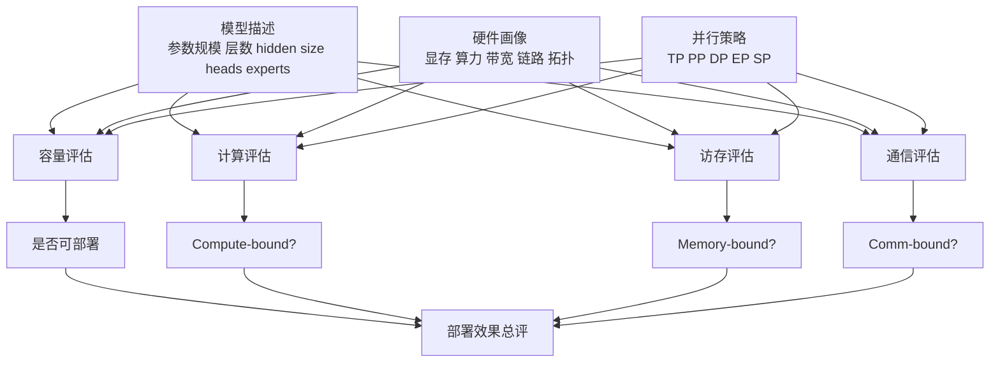

# 部署能力评测-内存算力带宽与通信

这份笔记讨论的是 infra 视角下的“部署能力评测”。它回答的问题不是“用户体验如何”，而是：

- 给定模型、硬件和并行策略，训推部署是否可行。
- 真正限制部署效果的是显存、算力、访存、带宽还是通信。
- 某套物理集群对某个具体模型的适配度如何。

这和服务侧的 TTFT、TPOT、goodput 不冲突，但层级更靠下。

## 评估目标

从部署角度，系统性能至少要回答四个问题：

1. 放不放得下。
2. 跑起来之后哪里最慢。
3. 多卡多机扩展后损失多大。
4. 在给定策略下资源利用是否合理。

## 维度拆解

把部署能力拆开看，通常至少有六个维度：

- 容量维度：参数、梯度、优化器状态、激活、KV cache、buffer 是否能装入设备。
- 算力维度：核心算子能否吃到足够高的有效算力。
- 访存维度：主要瓶颈是否来自显存带宽和读写模式。
- 通信维度：all-reduce、all-gather、all-to-all、pipeline 气泡和拓扑代价。
- 扩展维度：从单卡到多卡、多机后效率如何下降。
- 策略维度：TP、PP、DP、EP、SP 等并行策略如何改变前面五个维度。

## 1. 容量评估

部署可行性的第一道门槛永远是容量。

一个通用近似可以写成：

$$
M_{\mathrm{total}}
\approx
M_{\mathrm{params}}
+
M_{\mathrm{grads}}
+
M_{\mathrm{opt}}
+
M_{\mathrm{acts}}
+
M_{\mathrm{KV}}
+
M_{\mathrm{workspace}}
+
M_{\mathrm{fragment}}
$$

可行性的最低条件是：

$$
M_{\mathrm{total}} \le M_{\mathrm{device}}
$$

这里最重要的不是公式本身，而是分类方式：

- 训练更关注 $M_{\mathrm{grads}}$、$M_{\mathrm{opt}}$ 和 $M_{\mathrm{acts}}$。
- 推理更关注 $M_{\mathrm{params}}$、$M_{\mathrm{KV}}$ 和临时 workspace。
- 长上下文、长输出和高并发会直接放大 $M_{\mathrm{KV}}$。

## 2. 计算评估

如果容量可行，第二步通常是判断算力是否是主瓶颈。

最常见的近似写法是：

$$
T_{\mathrm{compute}}
\approx
\frac{\mathrm{FLOPs}}{P_{\mathrm{eff}}}
$$

其中 $P_{\mathrm{eff}}$ 不是峰值算力，而是考虑 kernel 效率、dtype、shape、并行分片后真正能拿到的有效算力。

训练场景下，经常还会补一个 MFU 视角：

$$
\mathrm{MFU}
\approx
\frac{\mathrm{Model\ FLOPs\ per\ step}}
{P_{\mathrm{peak}} \cdot T_{\mathrm{step}}}
$$

它不等于“真实利用率”的全部，但很适合做训练侧的粗判断。

## 3. 访存与带宽评估

很多模型部署问题不是“算力不够”，而是“数据搬不动”。

访存主导时，最常见近似是：

$$
T_{\mathrm{memory}}
\approx
\frac{\mathrm{Bytes}}{B_{\mathrm{eff}}}
$$

这里的关键不只是总字节数，还包括：

- 读写是否连续
- 是否能有效复用 cache / shared memory
- 是否存在多次 pass
- tensor shape 是否导致访存低效

这也是为什么相同 FLOPs 的两个算子，实际运行时间可能差很多。

## 4. 通信评估

一旦涉及多卡或多机，通信成本往往决定扩展性。

一个常见的粗近似是：

$$
T_{\mathrm{comm}}
\approx
\alpha + \frac{\mathrm{Bytes}_{\mathrm{comm}}}{B_{\mathrm{link,eff}}}
$$

其中：

- $\alpha$ 表示启动和同步一类延迟项
- $B_{\mathrm{link,eff}}$ 表示有效链路带宽

对部署评估来说，关键不是把每个 collective 都估得极精，而是先判断：

- TP 是否把 all-reduce 放大成主要瓶颈
- EP 是否让 all-to-all 成为主要瓶颈
- PP 是否让 pipeline bubble 和 stage 不均衡变得突出
- 多机后是否从“卡内快、卡间慢”切换成网络受限

## 5. 一个够用的总时间分解

在部署能力分析里，一个很实用的 stage 级分解是：

$$
T_{\mathrm{stage}}
\approx
\max
\left(
T_{\mathrm{compute}},
T_{\mathrm{memory}},
T_{\mathrm{comm}}
\right)
+
T_{\mathrm{overhead}}
$$

这里的价值是做瓶颈定位，而不是追求端到端绝对精确。

## 实现方案

如果要把“部署能力评测”做成可复用组件，比较合理的结构是：

1. 模型画像层：抽取参数规模、层结构、attention / MLP / MoE 配置、KV cache 规则。
2. 硬件画像层：记录显存容量、峰值算力、显存带宽、链路带宽和拓扑。
3. 策略映射层：把 TP、PP、DP、EP、SP 映射成分片、复制、通信和激活变化。
4. 成本估计层：分别估算容量、compute、memory、comm 与 overhead。
5. 校准层：用少量 benchmark 对 $P_{\mathrm{eff}}$、$B_{\mathrm{eff}}$ 和链路效率做经验校准。
6. 报告层：输出 infeasible / feasible、主要瓶颈、扩展效率和资源分解。

## 实现样例 A：训练部署评估

训练侧一个很常见的最小实现是：

1. 输入模型结构、batch、seq len、并行策略和硬件配置。
2. 先估参数、梯度、优化器状态和激活显存。
3. 若不满足容量约束，直接返回 infeasible。
4. 若满足容量约束，再估每 step 的 compute、memory、communication 时间。
5. 最后输出：

- 每卡内存分解
- step time 分解
- tokens/s 或 samples/s
- MFU
- 当前配置的主瓶颈

这类实现最适合做“这套集群能否训练某个模型”的快速筛选器。

## 实现样例 B：推理部署评估

推理侧一个很常见的最小实现是：

1. 输入模型结构、prompt 长度、输出长度、并发、并行策略和硬件配置。
2. 先估权重、KV cache 和 workspace 显存占用。
3. 求出在显存约束下的最大可行 batch 或并发。
4. 再估 prefill 和 decode 两阶段的 compute / memory / comm 分解。
5. 输出：

- 最大可部署并发
- prefill / decode 时间分解
- 哪个阶段更受带宽或通信限制
- 对服务 QoS 的约束边界

这类实现的价值是把“能不能服务这个模型”先从部署层讲清楚，再谈 TTFT / TPOT。

## 与其他笔记的关系

- 更偏 kernel 上界分析：见 [kernel开销计算逻辑](kernel开销计算逻辑.md)
- 更偏服务 QoS：见 [系统性能评测-延迟吞吐与Roofline](系统性能评测-延迟吞吐与Roofline.md)

## 来源

- Roofline: https://www2.eecs.berkeley.edu/Pubs/TechRpts/2008/EECS-2008-134.pdf
- vLLM benchmark metrics: https://docs.vllm.ai/en/stable/api/vllm/benchmarks/serve/
- MLPerf Inference policies: https://github.com/mlcommons/inference_policies/blob/master/inference_rules.adoc
