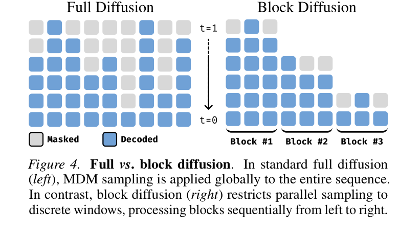
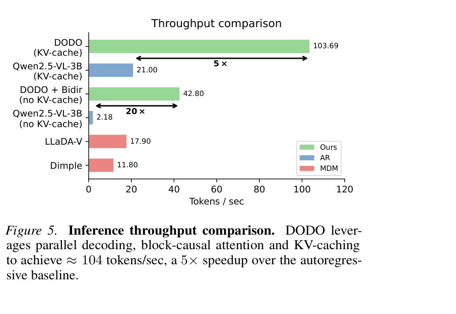
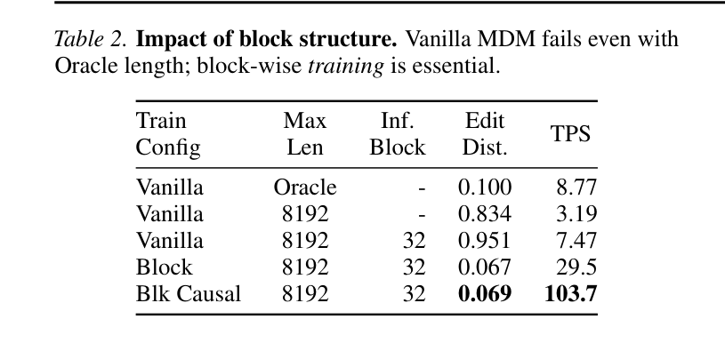
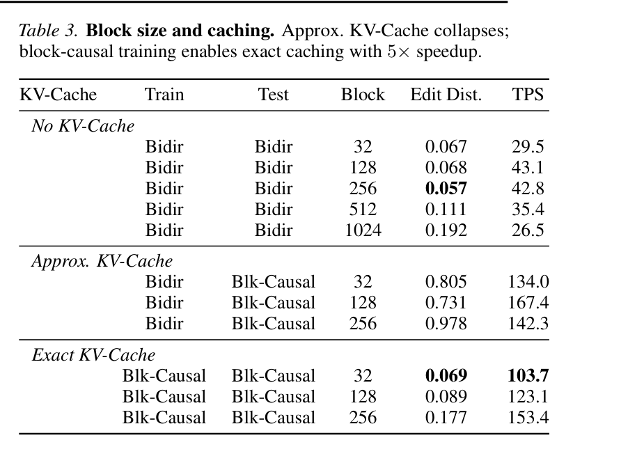

# DODO: Discrete OCR Diffusion Models 精读分析

> [!info] 文档关系
> - 文档类型：Paper（ICML 2026 SPIGM Workshop，非主会）
> - 领域入口：[README](../README.md)
> - 上位汇总：[ICML 2026 selected papers](../surveys/icml-2026-selected-papers.md)
> - 证据资产：[`../assets/papers/dodo/`](../assets/papers/dodo/)
> - 相关文档：[Figure inventory](../evidence/figure-inventory.md#dodo)

> 资料状态：已获取 arXiv:2602.16872v2 的完整 HTML、可检索文本和 15 页 PDF；PDF 的正文与实验页可读，但断点续传导致文件级 SHA 与 arXiv ETag 不一致，附录个别 XObject 报错，因此结论同时用 arXiv HTML 交叉核验。四张正式计数图均来自 PDF 第 5–7 页截图裁剪并通过逐图 QA。arXiv source 下载仅得到无效 partial gzip。未发现作者官方代码/权重；代码目录中的仓库是论文发表前的第三方课程项目，不是 DODO 实现。

## 修订信息

- 当前文档版本：`1.1.0`
- 当前修订 ID：`rev-dodo-problem-solution-20260725`
- 当前修订时间：`2026-07-25T10:05:32+08:00`
- 替代版本：`rev-dodo-initial` / `1.0.0` / manifest `106f19de6067499080d8ff689d4eccc4db99810dfb6cd61d73584afd6d7cca6e`

| 修订 ID | 文档版本 | 时间 | 修订者 | 类型 | 替代修订 | 迁移问题/解析 | 变更摘要 | 原因 | 影响位置 | 依据 | 对结论影响 |
|---|---|---|---|---|---|---|---|---|---|---|---|
| `rev-dodo-initial` | `1.0.0` | `2026-07-17T09:58:45+08:00` | `review_dodo` | initial | 无 | 无 | 建立单篇深度审阅、视觉证据、venue/代码边界和 infra 分析 | 用户题单 | 本文各节与正式 Figure inventory | arXiv v2、Tables 1–3/Figures 4–5、ICML workshop 页面 | material |
| `rev-dodo-problem-solution-20260725` | `1.1.0` | `2026-07-25T10:05:32+08:00` | `/root` | `content-update` | `rev-dodo-initial` / `1.0.0` / `106f19de6067499080d8ff689d4eccc4db99810dfb6cd61d73584afd6d7cca6e` | 无 | 新增论文级研究动机与问题—方案—优化—证据闭环 | 统一回写既有 Paper 报告 | `研究动机与问题—方案闭环` | 既有 PDF/HTML、Table 2/3、Figure 5/6 与设计理由矩阵 | minor：不改变主结论，补足因果解释 |

## 0. 资料与配图索引

- 论文：[arXiv:2602.16872v2](https://arxiv.org/abs/2602.16872v2)；LaTeX source 下载为无效 partial，不作证据。
- Venue：ICML 2026 SPIGM Workshop presentation，不是主会论文。
- OpenReview：未识别到 paper-level forum。
- 代码：第三方课程项目 <https://github.com/m-mahmoud-mohamed/Discrete-OCR-Diffusion-Models>，commit `21e2043cf995d2884ab75e473e9ee214d342e23c`；不是 DODO 代码
- 图表：Figure 4、Figure 5、Table 2、Table 3；完整记录见[正式 Figure inventory](../evidence/figure-inventory.md#dodo)。
- AI 生成分析图：未生成；安装的 CLI 无强制要求的 required document-input path 路径

## 0.1 术语与符号解释

### 0.1.1 术语表

| 术语 | 本文含义 | 别名 | 不等于/易混项 | 证据来源 |
|---|---|---|---|---|
| DODO | 基于 Qwen2.5-VL-3B、面向 OCR 的 block discrete diffusion VLM | Discrete OCR Diffusion Models | 不是第三方 DiffuQwen/LaViDa-OCR 课程项目 | §5.1 |
| synchronization error | 全局并行解码把文本片段锁定在错误绝对 offset，已揭示 token 又不可回滚，导致片段碰撞/断裂 | positional anchoring failure | 不只是长度估计错误 | §4.2、Table 2 |
| carry-over unmasking | 每步只采样仍为 MASK 的位置，已揭示 token 保持不变 | irreversible commitment | 不等于可反复 remask/revise 的 sampler | §3.2 |
| block diffusion | block 间自回归、block 内 masked diffusion 并行解码 | bounded-span denoising | 不等于仅在推理时给 vanilla MDM 切窗口 | §4.3、Table 2 |
| block-causal attention | 活跃 block 内双向，活跃 block 可看 prefix；prefix 不能看当前 block | Blk Causal | 不等于全局 bidirectional attention | §5.1、Appendix A |
| exact KV-cache | 训练/测试都使用 block-causal mask，使已提交 prefix 表征不变并可精确复用 | static-history cache | 不等于把 bidirectional 模型在测试时强行冻结的 approximate cache | §6.2、Table 3 |
| DODO+Bidir | 不使用 KV cache、每步重算 prefix，使历史表征可随当前 block 更新 | No KV-Cache/Bidir | 不是默认低延迟 DODO | §6.2 |
| NED | 预测与真值文本的 normalized edit distance，越低越好 | Edit Dist. | 论文没有给出本实现归一化细节 | §5.3 |

### 0.1.2 符号表

| 符号 | 含义 | 性质 | 作用域/索引 | 单位/取值 | 来源 | 易混点 |
|---|---|---|---|---|---|---|
| $I,c$ | 文档图像与可选文本上下文 | author-defined | 每个样本 | 图像/文本 | §3.1 | $c$ 的具体 prompt 未披露 |
| $x^{1:L}$ | 长度为 $L$ 的目标 token 序列 | author-defined | token 1…$L$ | token | Eq. 1 | $L$ 在全局 MDM 推理时未知 |
| $t,\alpha_t$ | 连续噪声时刻与保留率 | author-defined | diffusion step | $t\in[0,1]$ | Eqs. 2–3 | 训练采用 stratified uniform，但具体 schedule 未完全给出 |
| $K$ | 反向采样步数 | author-defined | 每次 diffusion 解码 | 正整数 | §3.2 | 不等于 block 数 $B$ |
| $B$ | Eq. 5 中 block 数 | author-defined | 每序列 | 正整数 | §4.3 Eq. 5 | §6/Table 3 的文字把 $B$ 用作 block size，论文存在符号复用 |
| $L'$ | 每个 block 的 token 长度 | author-defined | 每 block | token | §4.3 Eq. 5 | Table 3 直接写 Block 32/128/256 |
| $x^{(b)},x^{(<b)}$ | 当前 block 与已提交 prefix blocks | author-defined | block $b$ | token 序列 | Eq. 5 | prefix 在 Bidir 与 exact-cache 配置中是否可更新不同 |
| $\theta$ | VLM 参数 | author-defined | 全模型 | 参数 | Eqs. 1,3,5 | 论文未给冻结层清单 |
| $T_{\rm TPS}$ | 每秒生成 token 数 | analysis-derived | 单次评测环境 | token/s | 本文据 §5.3 定义 | 硬件、batch、输入长度分布未报告，不能跨环境外推 |
| $M_{\rm KV}$ | prefix KV cache 字节数 | analysis-derived | 每层/请求 | byte | §7.2 推导 | 依赖未披露的层数、KV heads、dtype |

## 1. 论文基本信息

- 作者：Sean Man, Gilad Deutch, Roy Ganz, Roi Ronen, Shahar Tsiper, Shai Mazor, Niv Nayman。
- 版本：arXiv:2602.16872v2，2026-05-27 修订。
- Venue：ICML 官方搜索将其列为 **Workshop**，指向 4th Structured Probabilistic Inference & Generative Modeling；没有主会录用证据。
- 核心问题：全局 masked diffusion 理论上能并行 OCR，却因长度不匹配与位置锚定产生不可修复的同步错误；怎样保留并行性又恢复因果锚点？
- 核心判断：DODO 的贡献不是“扩散天然适合 OCR”，而是发现 vanilla 全局扩散实际不适合精确 OCR，并用 block 边界把错误传播范围从全序列缩到局部窗口。

## 1.1 研究动机与问题—方案闭环

### 1.1.1 出发点与背景痛点

作者从长文档 OCR 的解码瓶颈出发：自回归 VLM 虽能高精度转录，但长度为 $L$ 的输出需要约 $L$ 次顺序前向计算。OCR 又不同于开放式生成，图像通常决定近似唯一的目标序列，条件分布较集中，理论上允许多个 token 并行预测。真正的矛盾是：怎样把这种低歧义性转化为吞吐收益，同时不破坏 OCR 对漏字、错位、截断和片段碰撞的严格序列对齐。

### 1.1.2 现有方案为何不够

标准全局 masked diffusion 在固定长度 canvas 上工作，并采用 carry-over unmasking：token 一旦揭示便不能回滚。真实长度未知时，canvas 或 early EOS 会导致截断/冗余；片段若被提交到错误绝对 offset，后续又无法整体平移，便形成断裂或碰撞。简单在推理时给 vanilla MDM 切块也无效：Table 2 中 inference-only block 的 NED 为 0.951，配套 block-wise training 后才降至 0.067。Oracle length 下 vanilla MDM 仍为 0.100 NED，也说明长度不是唯一根因，位置同步仍重要。

### 1.1.3 计划解决的问题与成功标准

- 核心问题：在保留 masked diffusion 多 token 并行的同时，引入因果锚定和动态长度适应。
- 约束：输出顺序严格、真实长度未知、已提交 token 不可随意改写；block 内仍需并行。
- 成功标准：以 NED 衡量转录保真度，以 TPS 和 steps/token 衡量效率；达到接近强 OCR/AR 基线的准确率并提高吞吐。
- 边界：论文未预设明确达标阈值，也未报告生产级 page latency、其他语言或开放生成泛化。

### 1.1.4 核心方案如何解决并优化问题

| 原始问题/失败模式 | 根因或约束 | 对应设计 | 改变的变量/系统行为 | 作用机制 | 预期优化 | 证据与判断 |
|---|---|---|---|---|---|---|
| AR 逐 token 串行 | 每个 token 依赖前一次 forward | block 内 masked diffusion | 一次 forward 可提交多个 token | 顺序粒度从 token 提升到 block/step | steps/token、TPS | Figure 5/6；partially supported |
| 全局 canvas 长度失配 | 推理前未知 $L$，揭示后不可回滚 | block factorization + stopping | 长度决策改为逐 block 扩展 | 避免一次性预设全文 canvas | NED、截断率 | §4.2–4.3、Table 2；partially supported |
| 片段 offset 被锁死 | 全局非因果提交缺少稳定前缀锚点 | 顺序 prefix anchor + block-wise training | 待对齐范围缩到当前 block | 训练中学习以 committed prefix 定位 | NED、结构稳定性 | inference-only 0.951→trained 0.067；supported as bundle |
| 每步重算长 prefix | bidirectional prefix 随 active block 改变 | block-causal attention + exact KV cache | committed prefix KV 变为静态 | 只重算 active block | TPS | Table 3：29.5→103.7 TPS、NED 近似；supported as bundle |

### 1.1.5 完整因果链与证据闭环

长 OCR 的 AR 串行成本高 → OCR 低歧义允许并行，但全局 MDM 的固定 canvas 与不可回滚提交会放大长度和位置错误 → DODO 将全文分解为顺序条件化的有限 block，以已完成 prefix 作为坐标锚点，并让 block 结构进入训练 → block 内保留并行揭示，block-causal attention 再使 prefix 可 exact cache → 改变的是不可逆承诺范围、前缀依赖和每 token 前向次数 → NED 降低、steps/token 与 TPS 改善。Table 2/3 和 Figure 6 支持训练—推理一致的 block 结构及 cache 有效；但位置错误类型没有直接计数，stopping 没有独立消融，约 5× 收益也混合 block training、attention mask 与 cache，因此单组件贡献仍未完全隔离。

## 2. 核心贡献与证据边界

1. **失败机制**：把 fixed canvas、不可回滚揭示和绝对 offset 锁定统一成 synchronization failure。Oracle length 仍有 NED 0.100，说明长度不是唯一根因（§4.2、Table 2）。
2. **结构修复**：block 间顺序提交提供 prefix anchor，block 内扩散保留并行；block-level stopping 支持动态长度（Eq. 5、Figure 4）。
3. **训练-推理一致的 cache**：block-causal mask 使 prefix 表征不依赖当前 block，exact KV cache 才成立（§5.1、Table 3）。
4. **结果**：OmniDocBench NED 0.069，优于同骨干 Qwen2.5-VL-3B 的 0.184；TPS 103.69，相对 cached AR 21.00 为 4.94×（Table 1、Figure 5）。
5. **边界**：TPS 的硬件、batch、计时协议和输入长度分布未披露；“5×”可复述为论文环境结果，不能当作硬件无关 latency 定律。

## 3. 研究方法

### 3.1 问题到方案的逻辑链

强视觉条件使 OCR 后验低熵 → 多位置可并行预测；但全局 canvas 长度未知且一次揭示后不可回滚 → 远距离片段在错误 offset 提前提交 → 后续 token 无法整体平移 → 输出断裂。DODO 将全长问题分成有界 block：前缀先提交、当前 block 以内并行、EOS 在 block 级停止，从而用少量顺序边界换取局部稳定性。

### 3.2 设计动机与具体问题映射

| 设计项 | why 状态 | 原文证据 | 具体问题 | 因果机制 | 替代/权衡 | 验证 | 判断 |
|---|---|---|---|---|---|---|---|
| block factorization | author-stated | §4.2–4.3, Eq. 5 | 全局 offset 同步错误、未知长度 | prefix 锚定；错误限制在 $L'$ 范围；block-level EOS | 小 block 稳但顺序步数多；大 block 快但同步错误复现 | Table 2 direct ablation | supported |
| block-wise training | author-stated | §6.1 | 只在推理切块与训练分布不一致 | 训练模型把 $x^{(<b)}$ 学成稳定 anchor | inference-only blocking 无需重训但失败 | Vanilla+Inf.Block 32 NED 0.951 vs Block 0.067 | supported |
| block-causal train/test mask | author-stated | §5.1, Appendix A | bidirectional prefix 依赖当前 block，不能缓存 | 禁止 prefix→current，使 prefix KV invariant | 失去动态历史更新，可能损失大 block 精度 | Table 3 exact vs approximate | supported |
| no-cache bidirectional history | author-stated | §6.2 | static history 在大 block 有 representation drift | 每步重算 prefix，让其适配 current block | 更高计算/带宽，不能 exact cache | block-size sensitivity | partially supported；与 cache/train mask 混杂 |
| complementary masking + stratified timestep | author-stated | §5.2 | 训练覆盖不同 mask 率 | 平衡噪声级别 | 其他 schedule | Appendix B sampling study仅推理策略；训练项无独立消融 | unverified |
| confidence threshold $p=0.99$ | author-stated | Appendix B, Figure B2 | 固定 top-k 不能按样本难度调并行度 | 仅提交高置信 token，自适应每步 token 数 | 更高阈值更准更慢 | sensitivity curve | partially supported |

### 3.3 模型/系统架构

Figure 4 的关键不是“切块”本身，而是顺序提交边界：每个新 block 的坐标由已完成 prefix 定义。全局 diffusion 一旦在远端错误位置提交片段，carry-over unmasking 禁止整体位移；block diffusion 把这种不可逆承诺延后到一个有界窗口完成之后。

### 3.4 关键公式

OCR 的 AR 基线为

$$\log p_\theta(x^{1:L}\mid I,c)=\sum_{\ell=1}^{L}\log p_\theta(x^\ell\mid x^{<\ell},I,c).$$

论文假设低熵 OCR 后验近似允许同一步条件独立：

$$p(x_{t_k}^{1:L}\mid x_{t_{k+1}}^{1:L},I,c)\approx\prod_{\ell=1}^{L}p(x_{t_k}^{\ell}\mid x_{t_{k+1}}^{1:L},I,c).$$

这个近似只解释“为什么可能并行”，不保证位置一致。DODO 的结构修复是

$$p_\theta(x^{1:L}\mid I,c)=\prod_{b=1}^{B}p_\theta\!\left(x^{(b)}\mid x^{(<b)},I,c\right),\qquad L=BL'.$$

每一因子仍是 $L'$ 个位置上的 masked diffusion。因而它不是完全消除 sequential dependency，而是将顺序粒度从 token 变为 block。

### 3.5 训练与评测

- Qwen2.5-VL-3B；olmOCR-mix-1025 约 270K document-text pairs；最大 8192 tokens。
- 200K steps，8×A100 40GB，global batch 8，AdamW，peak LR $5\times10^{-6}$，weight decay 0.01，5K warmup、末 20K cooldown，全程 bfloat16。
- OmniDocBench 英文 290 documents、Fox-Page-EN 112 pages；指标为 NED 和 TPS。
- 未披露：训练数据过滤/去重与 benchmark overlap 检查、完整 prompt/chat template、inference GPU、batch size、warmup/计时区间、TPS tokenization 口径。这些缺口直接限制复现和速度比较。

## 4. 关键结论

### 4.1 主结果与延迟证据

- DODO 对 Qwen2.5-VL-3B：OmniDoc NED 0.184→0.069，绝对下降 0.115，相对下降 62.5%（Table 1）。但 DODO 使用专门 OCR diffusion 训练，不能归因给 decoder 结构单一因素。
- DODO 对 LLaDA-V：0.524→0.069，绝对下降 0.455，相对下降 86.8%；模型规模也不同（3B vs 7B），仍不是容量匹配对照。
- Figure 5：exact-cache DODO 103.69 TPS / cached AR 21.00 TPS = 4.94×；无 cache DODO+Bidir 42.80 / 无 cache AR 2.18 = 19.63×。后一个对照更接近“并行算法收益”，前一个是部署组合收益。
- 论文用 TPS 而不是 per-page p50/p95 latency；因此“latency-critical”外推仍缺 request-level latency、长度分桶、batch 和硬件证据。

### 4.2 同步错误与 cache 消融

Table 2 是最强机制证据：Vanilla 8192 的 NED 0.834；只在推理时切 32-token block 反而到 0.951；配套 block training 后到 0.067，绝对改善 0.767、相对 92.0%。Oracle length 的 vanilla 仍为 0.100，说明 length mismatch 很重要但不能解释全部误差；positional anchoring 是合理剩余解释。不过论文没有直接量化“错误 offset/片段碰撞”频率，这部分仍是由对照支持的机制推断，不是逐错误类型因果计数。

Table 3 显示 cache 必须训练一致：Bidir 模型在测试时强行 block-causal（Approx. KV-Cache）时 NED 0.805–0.978，尽管 TPS 达 134–167.4；对应地，train/test 都 block-causal 的 exact cache 在 block 32 为 0.069/103.7 TPS。它证明“cache 不是免费系统优化”，而会改变注意力语义。

### 4.3 技术 claim 证据矩阵

| 技术点 | 声称效果 | 对应证据 | 是否受控 | 证据强度 | 结论 |
|---|---|---|---|---|---|
| OCR 低熵适合并行 | 多 token/step | Figure 6 <0.1 steps/token | 无直接 entropy/依赖测量 | indirect | plausible |
| 全局 MDM 有同步错误 | 高 NED | Table 2 Vanilla/Oracle | 部分；oracle 控长度但未标错误类型 | replacement baseline | partially supported |
| block training 必要 | NED 大幅下降 | Table 2 0.951→0.067 | matched architecture/data，训练目标改变 | direct ablation | supported |
| exact cache 高速且保精度 | 103.7 TPS, NED 0.069 | Table 3 | train mask+test cache成套改变 | direct bundle | supported as bundle |
| bidir history 支持 256 block | 0.057 NED | Table 3 sensitivity | 与 no-cache/recompute、train mask混杂 | sensitivity | partially supported |
| 5× AR speedup | 103.69 vs 21 TPS | Figure 5 | 硬件/批量协议未报告 | confounded system evidence | paper-reported only |
| complementary masking/stratified timestep | 训练稳定 | 无独立消融 | 否 | none | unverified |

### 4.4 收益来源归因

| 组件/变化 | 对比 | 指标变化 | 影响路径 | 证据强度 |
|---|---|---|---|---|
| block training | Vanilla+infer block→Block | NED 0.951→0.067；TPS 7.47→29.5 | 对齐/候选质量 + 较小 active window | matched ablation |
| parallel decoding，无 cache | AR→DODO+Bidir | 2.18→42.8 TPS（19.63×） | sequential calls 减少 | matched cache-off，但模型训练不同 |
| block-causal+exact cache bundle | Block→Blk Causal, block32 | TPS 29.5→103.7（3.52×）；NED 0.067→0.069 | prefix KV reuse；静态历史 | direct bundle；不是 cache-only |
| 最终 DODO vs cached AR | Qwen3B→DODO | 21.0→103.69 TPS（4.94×） | algorithm + train mask + cache | confounded end-to-end |

## 5. Related Work 对比

| 类别 | 核心机制 | 优点 | 局限 | 与 DODO 关系 |
|---|---|---|---|---|
| 专用 OCR VLM | AR 文档转录 | 强 exact reproduction、成熟 cache | token 级顺序瓶颈 | DODO 追求相近 NED、更高 TPS；训练数据/协议公平性不足 |
| 全局 masked diffusion VLM | 全 canvas 并行去 mask | 高理论并行 | 长度与 offset 同步脆弱、全序列重算 | DODO 的主要反例基线 |
| BD3-LM / fast-dLLM | block 间 AR、block 内 diffusion | block cache 与并行折中 | 文本任务常用 4–32 block | DODO 移植到 VLM/OCR，并强调训练时 block-causal |
| 第三方 DiffuQwen/LaViDa-OCR | annealed/full bidirectional diffusion | 独立观察到结构 OCR 失败 | 不是 DODO、不同数据指标 | 只能作为外部一致性线索，不能验证 DODO 实现 |

## 6. OpenReview 公开评审 × 论文内容交叉核验

未找到 paper-level OpenReview forum。ICML 官方页只确认 workshop 展示；API 403、搜索页无 forum ID，workshop forum `FtTsaDTlnQ` 是活动级页面。故无法核验 reviewer scores、decision、rebuttal 或 discussion。这不影响论文表格的读取，但意味着 novelty、数据泄漏和 speed protocol 问题没有公开 rebuttal 可对照。

## 7. Infra 需求分析

### 7.1 算力与 latency

训练事实为 8×A100 40GB、200K steps、global batch 8，即每卡约 1 sample/step；论文未报告 wall-clock。推理每 token 平均前向次数可写为 $r=K_{\rm calls}/L$；Figure 6 报告 DODO 通常 $r<0.1$，AR 固定 $r=1$。但每个 DODO call 的 active block 更大，不能仅用 calls 比例估 FLOPs。

### 7.2 显存与 KV cache

3B 参数若以 bf16 常驻，分析下界约 $3\times10^9\times2\approx6$ GB，不含视觉 encoder、activation、gradient、optimizer。AdamW 全参训练若保留 fp32 master/m/v，状态可额外达到约 36 GB 量级；实际 sharding/checkpointing 未披露，不能从 8×40GB 反推出精确布局。

对 prefix 长度 $P$，每层 KV cache 近似

$$M_{\rm KV}=2\,N_{\rm layer}\,P\,N_{\rm kvhead}\,d_{\rm head}\,s_{\rm dtype}.$$

exact cache 避免每个 denoising step 重算 prefix，但论文未给上述结构量与 inference dtype，故不伪造 GB 数值。

### 7.3 Data Types

| 对象 | 格式 | 阶段 | 硬件依赖 | 影响 | 证据 |
|---|---|---|---|---|---|
| weights/activations | bfloat16 | training | A100 BF16 Tensor Core | 降显存/提高吞吐 | §5.2 |
| optimizer state | 未报告 | training | 未知 | 无法估精确显存 | 缺口 |
| inference weights/KV | 未报告 | inference | 未知 | TPS 不可迁移到其他 dtype | 缺口 |
| token ids/mask/index | 离散整数/布尔，精确 dtype 未报告 | train/infer | 通用 GPU | 相比 hidden state 数据量小 | 方法定义 |

### 7.4 带宽、互联与利用率

论文没有 bytes moved、kernel runtime、HBM peak 或 NVLink 拓扑，无法计算

$$BW_{\rm eff}=\frac{\mathrm{BytesMoved}}{t},\qquad U=BW_{\rm eff}/BW_{\rm peak}.$$

机制上，full/Bidir 每步读写整段 prefix activation，exact cache 改为读取紧凑 KV 并只计算 active block，可能从 compute-heavy prefix recomputation 转向 HBM KV streaming。训练 8 GPU global batch 8 很可能需要 data-parallel gradient collective，但论文未说明 NCCL、NVLink/PCIe、ZeRO 或 overlap。

### 7.5 CPU/GPU/NPU 异构与 serving

论文只说保留 Qwen 默认 image preprocessing；CPU PDF/render/tokenize、host-device transfer、pinned memory、async copy、scheduler、batching、CUDA graph、custom kernel 和 NPU path 均未报告。可确认的部署状态是 GPU 上 active block decoding + prefix KV reuse；不能声称已有生产级 heterogeneous serving。

## 8. 开源代码对照

- 未发现作者官方 DODO repo 或 checkpoint；论文/HTML 无 GitHub 链接。
- 搜索到的第三方 repo commit `21e2043...` 的 README 明确是 Mahmoud Abdellahi 的 Winter 2025/26 seminar，实验为 DiffuQwen-VL 与 LaViDa-OCR；时间与作者均不匹配。
- 其 `DiffuQwen/diffu/attention.py` 实现 causal→bidirectional annealing，`DiffuQwen/diffu/sampler.py` 实现全局迭代 denoising；没有 DODO 的 block factorization、训练/测试 block-causal exact KV cache。故不能用它确认论文实现。
- 该 repo 的负结果（结构化 OCR 慢且不准）与 DODO 对 vanilla diffusion 的诊断方向一致，但数据、模型和指标不同，只是外部线索。
- 未发现 DODO 权重 metadata，参数/配置除论文陈述外均为未验证。

## 9. 优点、局限与改进

### 优点

- Table 2 把“数据不够”与“结构错误”部分分开，Oracle length 和 inference-only block 是有价值的桥接基线。
- Table 3 明确展示 approximate cache 的精度灾难，避免把系统优化当作语义不变的免费加速。
- 同时报告 NED 和 TPS，且包含 cache-off 对照，允许粗分 algorithm vs system 收益。

### 局限

- synchronization error 没有按 offset、早 EOS、collision 做可观测错误分解；机制解释仍有推断成分。
- Figure 5 缺 inference hardware、batch、输入长度、计时方法和 latency distribution，5× 的可复现性不足。
- 专用 OCR 数据训练与公开 baselines 的数据/实现不一致；Table 1 不是纯 decoder 公平比较。
- exact cache 与 block-causal training 是绑定变化，缺“同一训练模型、仅 cache kernel on/off”的 runtime-only 对照。
- 无官方代码、权重、配置；数据去重与 benchmark overlap 未说明。
- 当前证据是 workshop/arXiv，不应写成 ICML 2026 main-conference acceptance。

### 最小补实验

1. 对错误标注 length mismatch、offset drift、segment collision、early EOS，报告每类占比。
2. 同一 checkpoint、同一 block 与 batch 下，仅切换 prefix recompute vs exact cache，报告 p50/p95 page latency、TPS、HBM bytes。
3. 披露推理 GPU/dtype/kernel、长度分桶；对 32/128/256 block 做 latency-quality Pareto。
4. 对训练数据做 benchmark near-duplicate 检查，并发布 prompt/tokenizer/sampler 配置。

## 10. 研究启发

- 对精确结构生成，扩散的核心问题可能不是 token 概率，而是不可逆 commitment 的坐标一致性；可研究允许局部 remask/shift 的 edit-aware sampler。
- block size 可做请求自适应：版面规则区用大 block，公式/表格区域用小 block，并以不确定性和布局边界共同调度。
- cache 语义应进入训练目标；系统优化若改变 attention dependency，就必须按算法组件对待而不是后处理。

## 11. 解读问题/待验证清单

1. OCR 后验“近 Dirac”是否能用 token conditional mutual information 实测，而不只是直觉？
2. Oracle length NED 0.100 中还剩多少 offset drift、多少普通识别错误？
3. 论文 §6 将 $B$ 用作 block size，而 Eq. 5 用作 block 数，复现配置到底采用哪个字段名？
4. 103.69 TPS 使用什么 GPU、dtype、batch、page length 和 decode threshold？
5. exact cache 的 3.52×（相对 no-cache Block）中，多少来自 cache，多少来自 block-causal kernel/训练差异？
6. olmOCR-mix-1025 是否与 OmniDocBench/Fox-Page 有近重复 PDF？
7. 对公式和表格，允许 token revision 是否比继续缩小 block 更有效？

## 12. 一句话总结

DODO 最有价值的结论是：精确 OCR 的全局 diffusion 失败来自不可逆的长度/位置同步错误，block training 用 prefix 锚点把它局部化，并与 block-causal exact KV cache 组合得到论文环境下约 5× AR 吞吐；最大不确定性是速度协议和官方实现均未公开，且该工作目前只能核验为 ICML 2026 workshop 展示。
