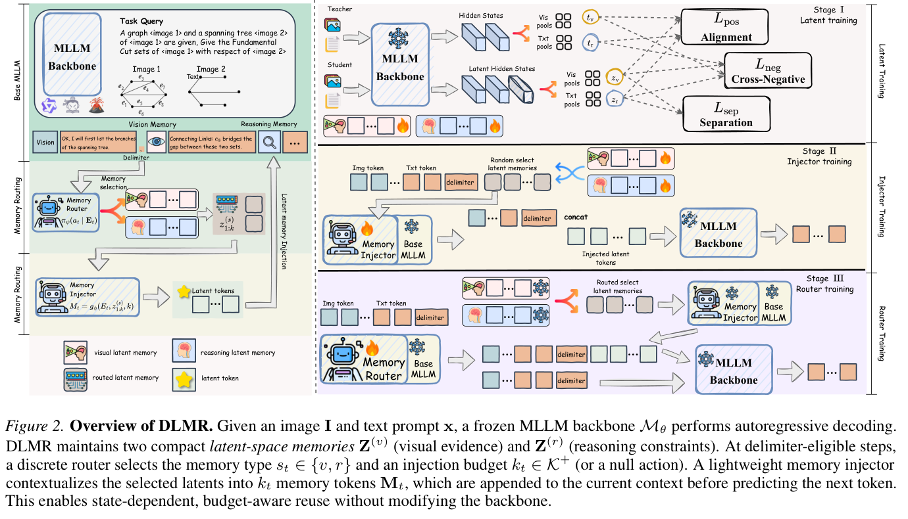
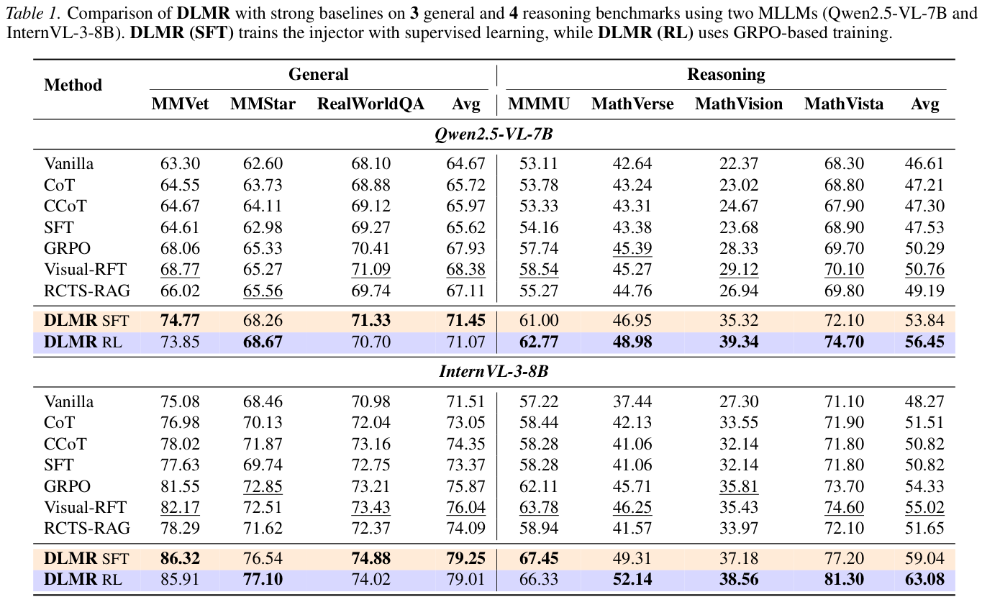
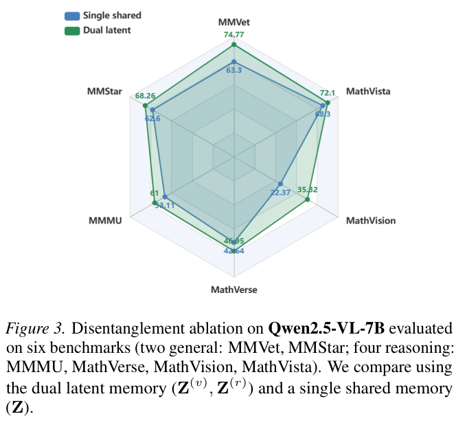

# Dual-Latent Memory Routing for Vision-Language Reasoning

> [!info] 文档关系
> - 文档类型：Paper（final PDF 深度审阅）
> - 领域入口：[README](../README.md)
> - 上位汇总：[ICML 2026 selected papers](../surveys/icml-2026-selected-papers.md)
> - 证据清单：[Figure inventory](../evidence/figure-inventory.md#dual-latent-memory-routing)
> - 正式资产：[assets/papers/dual-latent-memory-routing](../assets/papers/dual-latent-memory-routing/)

> 证据状态：已逐页核验用户提供的 17 页 ICML 2026 / PMLR 306 final PDF，并对 3 个原论文图表完成 contact sheet 初筛和原分辨率逐图 QA。源码、可用官方代码及 OpenReview 公开评审仍不可得，相关结论明确保持受限。

## 修订信息

- 当前文档版本：`1.3.0`
- 当前修订 ID：`rev-dlmr-final-pdf-promotion-20260727`
- 当前修订时间：`2026-07-27T16:00:00+08:00`
- 替代版本：`rev-dlmr-indexed-body-promotion-20260725` / `1.2.0`

本次以 final PDF 替换此前的原投稿索引边界，新增完整方法核对、appendix 延迟证据和 3 个正式图表资产；技术结论从“索引文本级”升级为“final PDF 级”。

| 修订 ID | 版本 | 时间 | 类型 | 替代修订 | 摘要 | 结论影响 |
|---|---|---|---|---|---|---|
| `rev-initial-20260716` | `1.0.0` | 2026-07-16 | initial | 无 | 建立官方摘要级 blocked 交付 | material |
| `rev-source-recovery-20260724` | `1.0.1` | 2026-07-24 | evidence-update | `rev-initial-20260716` | 确认 OpenReview/ICML 身份，代码仍 404 | minor |
| `rev-dlmr-problem-solution-20260725` | `1.1.0` | 2026-07-25 | content-update | `rev-source-recovery-20260724` | 新增摘要级问题—方案闭环 | minor |
| `rev-dlmr-indexed-body-promotion-20260725` | `1.2.0` | 2026-07-25 | evidence-promotion | `rev-dlmr-problem-solution-20260725` | 提升原投稿索引方法、公式与 Tables 1–4 | material |
| `rev-dlmr-final-pdf-promotion-20260727` | `1.3.0` | 2026-07-27 | evidence-promotion | `rev-dlmr-indexed-body-promotion-20260725` | 提升 final PDF、appendix 与 3 个 QA 资产 | material |

## 1. 基本信息与核心判断

- 标题：**Dual-Latent Memory Routing for Vision-Language Reasoning**
- 作者：Hao-Xuan Ma、Jin-Fei Qi、YiCheng Xiao、Han-Jia Ye
- Venue：ICML 2026，PMLR 306
- 官方页面：<https://icml.cc/virtual/2026/poster/63955>
- OpenReview：<https://openreview.net/forum?id=SFWWUr9V7c>

论文针对长程视觉语言生成中“早期视觉证据与中间推理约束随文本增长而衰减”的问题，在冻结 MLLM 上加入 visual/reasoning 两个 latent bank、上下文化 injector 和离散 router。final PDF 的替换消融支持“分离容量—上下文化—自适应预算”这条主要因果链；但 bank 的语义纯度、delimiter 触发规则、各 loss 项和完整 serving 行为没有被完全隔离。

## 2. 术语与符号

| 术语/符号 | 含义 | 来源与边界 |
|---|---|---|
| DLMR | 双 latent bank + injector + adaptive router | Abstract、§4、Figure 2；不同于同名多智能体记忆工作 |
| visual/reasoning memory | 输入无关、跨样本共享的两组可学习 latent | Eq. 4；语义专化是训练目标，不等于已被 probing 证明 |
| eligible step | delimiter 命中且未超过 $N_{\max}$ 的候选插入位置 | §4.2；router 只在候选子集内决策 |
| $Z^{(s)}$ | 类型 $s\in\{v,r\}$ 的共享 latent bank | Eq. 4 |
| $g_\phi$、$M_t$ | injector 与其生成的 step-specific memory tokens | Eq. 5–7 |
| $a_t=(s_t,k_t)$ | memory 类型与注入预算的离散动作 | Eq. 8–9；训练 sampling、推理 greedy |
| $R_{\rm task},R_{\rm eff}$ | 正确性与 correctness-gated efficiency reward | Eq. 12 |

## 3. 问题—方案—证据闭环

Eq. 3 表明，在 attention logit 有界时，视觉 token 的总 attention mass 随生成文本长度近似按 $O(L_v/n_t)$ 衰减。作者据此把失败根因定位为：视觉证据和推理状态的作用不同，却被塞进同一不断增长的上下文或单一 memory。

| 失败/约束 | 设计与改变 | 预期优化 | 直接证据 | 判断 |
|---|---|---|---|---|
| 两类信息在单一 memory 中互相干扰 | 拆成 $Z^{(v)}$、$Z^{(r)}$ | 提供专化容量 | Figure 3 shared vs dual | 性能支持；语义纯度间接 |
| 静态 latent 不适应当前问题 | $g_\phi$ 用当前 prefix 上下文化 | 生成可用的 $M_t$ | Table 2 frozen 50.44 → trainable 53.84 | supported |
| 固定 $k$ 会浪费或不足 | gate 限定位置，router 选类型与 $k_t$ | 改善 accuracy–token frontier | Table 4 adaptive 53.84/677，优于 $k=8$ 52.71/732 | supported |
| 端到端联合训练易混杂 | bank → injector → cost-aware GRPO 三阶段 | 分离表征、接口与策略学习 | Eq. 10–12；无 loss-term factorial ablation | partially supported |

核心因果链是：长上下文视觉稀释 → 双 bank 分离容量 → injector 生成当前 step 的 memory → router 只在 eligible step 自适应选类型/预算 → 同时提高准确率并控制 token/延迟。整体判断为 **partially supported**：组件替换证据完整，但若干细粒度设计仍未隔离。

## 4. 方法重构

1. Eq. 1–3 定义多模态条件生成、attention 与视觉注意力稀释。
2. Eq. 4 定义两组 input-agnostic latent bank。
3. Eq. 5–7 用 LoRA 化的模型副本把 prefix 与选中 bank 的前 $k_t$ 个 latent 联合上下文化。
4. delimiter 与 $N_{\max}$ 先确定 eligible step；Eq. 8–9 再选择 $a_t=(s_t,k_t)$。
5. Stage 1 通过 alignment、cross-negative 与 separation loss 预热 bank（Eq. 10）；Stage 2 学 injector（Eq. 11）；Stage 3 用 cost-aware GRPO 学 router（Eq. 12）。

需要限定“动态决定何时注入”：候选时刻由规则 gate 决定，router 并不在每个 token 上自由选择。

## 5. 关键结果与收益归因

| 对比 | 数值 | 归因边界 |
|---|---|---|
| Qwen SFT → DLMR-SFT，general avg | 65.62 → 71.45（+5.83） | 完整方法，不能归因单组件 |
| Qwen GRPO → DLMR-RL，reasoning avg | 50.29 → 56.45（+6.16） | 完整方法 |
| InternVL SFT → DLMR-SFT，general avg | 73.37 → 79.25（+5.88） | 完整方法 |
| InternVL GRPO → DLMR-RL，reasoning avg | 54.33 → 63.08（+8.75） | 完整方法 |

Figure 3 中 overall 52.05 → 59.73、reasoning 46.61 → 53.84、MathVision 22.37 → 35.32，直接支持 dual 相对 shared 的替换收益。Table 2 支持 trainable injector（50.44 → 53.84）。Table 4 支持 adaptive route 相对测试过的固定预算。各 delta 来自不同实验，不能相加。

## 6. Infra 与运行时

注入 token 会增加 base model 的投影、attention 和 KV-cache 负载，$k_t$ 因而是直接的系统变量。Appendix Table A1 给出 wall-clock：

- Qwen general：5.6 s / 65.6 → 5.4 s / 71.4。
- Qwen reasoning：14.0 s / 47.5 → 11.5 s / 53.8，约 18% 降时。
- InternVL general：3.5 s → 3.7 s，同时准确率提升，说明 token/accuracy 改善不保证所有路径都降时。
- InternVL reasoning：13.4 s → 13.1 s，同时准确率提升。

论文没有给出足够的 dtype、互联、带宽计数器、调度器、吞吐与 p95/p99，因此不能把这些单请求结果外推为完整 serving 效率。

## 7. Related Work、代码与评审边界

DLMR 相对 CoT 使用连续可复用状态，相对外部检索避免 corpus/query 路径，相对单 bank 分离信息角色，相对 fixed injection 自适应选择类型与容量。训练预算与参数量并未在所有 baseline 间完全归一。

论文命名的 GitHub 仓库在本轮仍返回 404；无法核验实现、配置和 checkpoint。OpenReview forum 触发反爬 challenge，reviews、rebuttal 与 discussion 无法取得；本文不虚构任何 reviewer claim。

## 8. 局限与待验证项

- 缺少源码和可用官方实现。
- dual bank 的语义专化缺少直接 probing。
- delimiter、$N_{\max}$、LoRA rank、loss 权重与 reward 项缺少充分 sensitivity/factorial ablation。
- 延迟证据不是完整的线上 throughput/tail-latency 评测。
- final PDF、正式图表与关键数值已核验；上述缺口不影响“论文报告了什么”，但限制可复现性和更细的因果归因。
