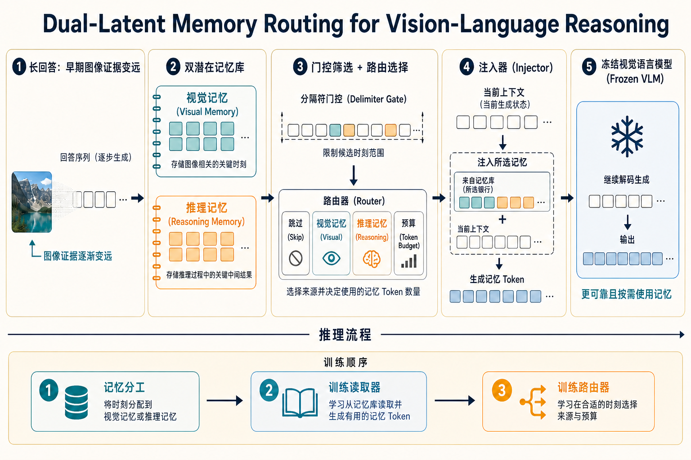

# Dual-Latent Memory Routing for Vision-Language Reasoning 精读分析

> [!info] 文档关系
> - 文档类型：Paper（最终版 PDF 深度审阅）
> - 领域入口：[README](../README.md)
> - 上位汇总：[ICML 2026 selected papers](../surveys/icml-2026-selected-papers.md)
> - 证据资产：[assets/papers/dual-latent-memory-routing](../assets/papers/dual-latent-memory-routing/)
> - 相关文档：[Paper index](../evidence/paper-index.md)，[Figure inventory](../evidence/figure-inventory.md#dual-latent-memory-routing)

> 资料状态：已逐页核验 17 页 ICML 2026 / PMLR 306 最终版 PDF。3 个正式图表均来自 200 DPI PDF crop，保留完整 caption 并通过 contact sheet 与原分辨率逐图 QA。LaTeX/source、可用官方代码及 OpenReview 公开评审仍不可得。

## 修订信息

- 当前文档版本：`1.5.0`
- 当前修订 ID：`rev-dlmr-readable-projection-20260727`
- 当前修订时间：`2026-07-27T23:50:00+08:00`
- 替代版本：`rev-dlmr-schema-projection-20260727` / `1.4.0`

| 修订 ID | 版本 | 时间 | 类型 | 替代修订 | 摘要 | 结论影响 |
|---|---|---|---|---|---|---|
| `rev-initial-20260716` | `1.0.0` | 2026-07-16 | initial | 无 | 建立官方摘要级 blocked 交付 | material |
| `rev-source-recovery-20260724` | `1.0.1` | 2026-07-24 | evidence-update | `rev-initial-20260716` | 确认 OpenReview/ICML 身份，代码仍 404 | minor |
| `rev-dlmr-problem-solution-20260725` | `1.1.0` | 2026-07-25 | content-update | `rev-source-recovery-20260724` | 新增摘要级问题—方案闭环 | minor |
| `rev-dlmr-indexed-body-promotion-20260725` | `1.2.0` | 2026-07-25 | evidence-promotion | `rev-dlmr-problem-solution-20260725` | 提升原投稿索引方法、公式与 Tables 1–4 | material |
| `rev-dlmr-final-pdf-promotion-20260727` | `1.3.0` | 2026-07-27 | evidence-promotion | `rev-dlmr-indexed-body-promotion-20260725` | 提升 最终版 PDF、appendix 与 3 个 QA 资产 | material |
| `rev-dlmr-schema-projection-20260727` | `1.4.0` | 2026-07-27 | mixed | `rev-dlmr-final-pdf-promotion-20260727` | 补齐标准 claim/evidence/rationale/Infra 结构与语义边界 | material：不改变论文数字，修正交付完整性 |
| `rev-dlmr-readable-projection-20260727` | `1.5.0` | 2026-07-27 | mixed | `rev-dlmr-schema-projection-20260727` | 补公式解释卡、具体失败场景、口语化表述和算法解释图 | material：不改变论文数字，提高一眼理解能力 |

## 0. 资料与配图索引

- 官方页面：<https://icml.cc/virtual/2026/poster/63955>
- OpenReview：<https://openreview.net/forum?id=SFWWUr9V7c>；公开 reviews/decision/rebuttal 因 challenge 不可读。
- LaTeX/source：不可得。
- 代码：论文命名的 `Hunter-Wrynn/DLMR` 仓库返回 404，无 commit/config/checkpoint。
- Figure 2：[DLMR overview](../assets/papers/dual-latent-memory-routing/fig2-dlmr-overview-caption.png)。
- Table 1：[main results](../assets/papers/dual-latent-memory-routing/table1-main-results-caption.png)。
- Figure 3：[disentanglement ablation](../assets/papers/dual-latent-memory-routing/fig3-disentanglement-ablation-caption.png)。
- AI 生成解释图：[算法总体示意图](../assets/papers/dual-latent-memory-routing/algorithm-overview-explainer.png)；仅帮助理解，不作为论文证据。

## 0.1 术语与符号解释

阅读约定：保留 `latent memory`、`injector`、`router`、`token` 等名称，是因为它们是论文模块名或行业通用术语；首次出现时均给出普通语言解释。审阅结论不再只写英文状态词，而直接说明证据是否充分、是否有多项改动混在一起。

### 0.1.1 术语表

| 术语                      | 本文含义                                        | 别名                         | 不等于/易混项                               | 证据                   |
| ----------------------- | ------------------------------------------- | -------------------------- | ------------------------------------- | -------------------- |
| DLMR                    | 冻结 MLLM 外接双 latent memory、injector 与 router | Dual-Latent Memory Routing | 不等于同名多智能体 memory 工作                   | Abstract、§4、Figure 2 |
| visual latent memory    | 输入无关、跨样本共享、面向视觉证据的 $Z^{(v)}$                | visual memory              | 不是每样本 image KV cache；语义纯度未被直接 probing | §4.1、Eq. 4           |
| reasoning latent memory | 面向中间结论与约束的 $Z^{(r)}$                        | reasoning memory           | 不是显式文本 CoT                            | §4.1、Eq. 4           |
| memory injector         | 将 prefix 与 latent 上下文化为 $M_t$ 的 LoRA 化副本    | $g_\phi$                   | 不选择 route                             | Eq. 5–7              |
| eligible step           | delimiter 命中且未超过 $N_{\max}$ 的候选注入位置         | routing opportunity        | router 只在此子集内动作                       | §4.2                 |
| routing action          | memory type、budget 或 null action            | $a_t=(s_t,k_t)$            | 训练 sampling、推理 greedy                 | Eq. 8–9              |
| cross-negative learning | 用另一 memory 分支作负例，鼓励分工                       | cross-negative loss        | 不是普通跨样本 negatives                     | Eq. 10               |
| cost-aware GRPO         | task、正确性条件下 efficiency 与 KL 的 router 优化     | router RL                  | 不更新 冻结 基础模型                           | Eq. 12               |

### 0.1.2 符号表

| 符号                                                 | 含义                                      | 性质   | 作用域/单位                            | 来源       | 易混点                  |
| -------------------------------------------------- | --------------------------------------- | ---- | --------------------------------- | -------- | -------------------- |
| $I,x,y$                                            | 图像、文本输入、输出序列                            | 论文定义 | per instance                      | Eq. 1    | $x$ 不含 $y_{<t}$      |
| $M_\theta$                                         | 冻结的基础多模态语言模型                        | 论文定义 | 全局模型                      | §3       | 与 $M_t$ 不同           |
| $L_v,L,n_t$                                        | 视觉 token、prompt、当前可见长度                  | 论文定义 | token count                       | Eq. 2–3  | $n_t=L_v+L+t-1$      |
| $\alpha_{t,i},z_{t,i},A_t^{\rm img}$               | attention weight/logit/视觉总 mass         | 论文定义 | per step/head abstraction         | Eq. 2–3  | $O(L_v/n_t)$ 是条件近似   |
| $Z^{(s)}$                                          | 类型 $s$ 的 latent bank                    | 论文定义 | $\mathbb R^{M_s\times d}$         | Eq. 4    | $M_s$ 不是注入数          |
| $E_t,L_t$                                          | 当前 multimodal embeddings/长度             | 论文定义 | $\mathbb R^{L_t\times d}$         | Eq. 5    | 不是 KV cache          |
| $k,\mathcal K_+$                                   | 注入 budget/候选集合                          | 论文定义 | token count                       | §4.1–4.2 | null action 独立       |
| $g_\phi,M_t$                                       | injector 与 contextualized memory tokens | 论文定义 | model / $\mathbb R^{k_t\times d}$ | Eq. 5–7  | $M_t$ 不是模型           |
| $a_t,\pi_\psi$                                     | route action 与 policy                   | 论文定义 | eligible step                     | Eq. 8–9  | gate 先决定 eligibility |
| $R_{\rm task},R_{\rm eff},\lambda_{\rm eff},\beta$ | 正确性、效率奖励及其权重             | 论文定义 | 标量                            | Eq. 12   | 各奖励子项未被单独验证         |
| $\mathrm{Bytes}_{\rm KV}$                          | 注入引起的 cache bytes 推导                    | 本文推导 | bytes                             | §8.2     | 需 heads/dtype 才能数值化  |

## 0.2 AI 生成算法分析示意图

> 这是基于已核验论文内容生成的解释图，不是论文原图，也不提供新的实验依据。阅读顺序是：长回答中的遗忘问题 → 两类记忆 → 候选位置与路由 → 按当前上下文生成记忆 token → 冻结的基础模型继续回答。

## 1. 论文基本信息

- 领域：多模态大语言模型、长程视觉语言推理、latent memory、参数高效后训练。
- 核心问题：输出变长后，固定视觉前缀和中间约束在单一、不断增长的上下文中更难被再次调用。
- 研究目标：冻结基础模型，以分角色、按需注入的连续 memory 提升通用问答和复杂推理表现，并控制 token 数与延迟。
- 关键假设：attention 不会无限向早期视觉 token 尖化；共享 latent 可形成角色分工；delimiter 是有效结构边界；新增模块足够轻量。
- 模型：Qwen2.5-VL-7B、InternVL3-8B。

## 2. 研究动机与问题—方案闭环

### 2.1 出发点与背景痛点

作者把问题明确放在长程生成阶段：图像只在固定前缀出现，而模型持续产生文本；越到后面，越需要重新读取早期图像证据和已经形成的中间约束。Eq. 3 给出解释：若 attention logits 不随长度越来越尖，固定视觉 token 的总注意力近似按 $O(L_v/n_t)$ 衰减。这是机制近似，不是所有层、所有 attention head 都必然成立的定理。

### 2.2 现有方案为何不够

CoT、SFT、GRPO 和 RAG 分别可以规范推理过程、调整模型能力或补充外部知识，但它们没有直接解决“回答写到后面时，怎样重新取回本题早先的图像证据和中间约束”。DLMR 认为这里至少有两类信息：一类来自图像，另一类是已经推出来的条件；两者用途不同，而且每一步需要的量也不同。

| 现有做法 | 看得见的问题 | 具体场景 | 根因 | 为什么直觉上的补丁仍不够 | 证据 |
|---|---|---|---|---|---|
| 只依赖不断增长的上下文 | 回答越长，后面的 token 越难重新关注最前面的图像 | **本文构造的说明例，不是论文实验：** 做一题多步图表推理，模型在第 20 步需要再次读取图中的坐标轴单位，但图像 token 仍停留在序列最前端；Figure 1 报告的趋势正是后期图像注意力下降 | 固定数量的视觉 token 要和越来越多的新文本竞争注意力 | 让模型“多想几步”只会继续增长上下文；微调也不保证它在需要时重新暴露早期证据 | §1、§3、Figure 1、Eq. 3 |
| 用一个共享 memory 保存所有内容 | 图像事实和中间推理条件可能挤在同一容量里，相互干扰 | **本文构造的说明例，不是论文实验：** 同一 memory 同时保存“图中红柱高于蓝柱”和“若 A 则 B”两个中间条件；后续只需查图时，仍要从混合表示中分辨信息类型 | 两类信息的来源、更新时机和复用目的不同 | 单纯增大共享 memory 会增加容量和成本，却没有建立角色分工；Figure 3 只证明双 bank 的结果更好，尚未直接证明每个 latent 的语义纯度 | §4.1、Figure 3 |
| 每次固定注入 $k$ 个 memory token | 简单步骤浪费 token，复杂步骤又可能不够 | **本文构造的说明例，不是论文实验：** 复述一个已知结论可能无需 memory，而重新核对图像并组合多个约束可能需要更多；固定 $k=8$ 对两种步骤一视同仁 | 推理状态的需求随步骤变化 | 把固定 $k$ 调大只会让所有步骤都更贵；调小则无法覆盖复杂步骤 | §4.2、Table 4 |

### 2.3 论文计划解决的问题与成功标准

- 核心问题：冻结 MLLM 时，如何分别保存并按当前状态复用视觉证据和 reasoning constraints。
- 成功标准：主表提升；dual 优于 shared；可训练 injector 优于 冻结；自适应 优于 固定-$k$ 折中边界；实际运行时间 不被新增模块吞噬。
- 约束：delimiter eligibility、$N_{\max}$、冻结 基础模型。
- 不解决：外部知识检索、显式可读 scratchpad、通用 serving SLA。

### 2.4 核心方案如何解决并优化问题

| 失败/约束 | 对应设计 | 改变的变量/行为 | 作用机制 | 预期指标 | 证据 | 判断 |
|---|---|---|---|---|---|---|
| 视觉证据随长上下文稀释 | visual bank | 增加可重复注入的视觉状态 | 压缩并重新读取早期证据 | 推理与通用问答正确率 | Eq. 3–4、Table 1 | 完整方法有结果，但 visual bank 未被单独验证 |
| 视觉/推理信息互相干扰 | dual $Z^{(v)},Z^{(r)}$ | 把共享容量拆成两类记忆 | 分离训练鼓励两类记忆形成分工 | 推理与总体平均分 | Figure 3 | 双记忆的性能有直接证据；是否真的形成纯粹语义只有间接证据 |
| 静态 latent 不适配当前问题 | 可训练 injector | 生成当前步骤专用的 $M_t$ | 用 $E_t$ 把共享 latent 改写到当前上下文 | 推理平均分 | Table 2 | 有直接替换对照 |
| 每个 token 都路由或注入次数无界 | delimiter + $N_{\max}$ | 限定候选时机与总次数 | 缩小选择范围并设置硬上限 | 最坏情况下的额外开销 | §4.2 | 机制上说得通，但论文没有触发规则或上限的消融 |
| 固定 budget 不适应状态 | type-budget router | 选择 $s_t,k_t$ 或跳过 | 按当前状态选择记忆类型和数量 | 每个 token 成本下的正确率 | Table 4 | 相对测试过的固定预算有直接证据 |
| 只奖励正确会过度注入 | cost-aware GRPO | 加入效率奖励和 KL 约束 | 在答案正确的前提下鼓励少用记忆 | token 数与延迟 | Eq. 12、Table 4/A1 | 整体目标部分有证据，各奖励项未被单独验证 |
| 所有模块一起训练难以控制 | three stages | 分开训练记忆、读取器和路由器 | 依次解决分工、读取和控制 | 训练稳定性与质量 | Eq. 10–12 | 机制上说得通，但没有与联合训练做替换对照 |

### 2.5 完整因果链与证据闭环

长生成需要持续访问视觉证据与中间约束 → 单一 context 可能 attention dilution 且角色混存 → dual banks 改变可用状态容量 → injector 改变 latent 与 prefix 的条件关系 → gate/router 改变注入时机、类型和 token 数 → 预期改善质量与 accuracy–cost 折中边界 → Table 1、Figure 3、Tables 2/4、Appendix A1 分别测完整质量、分离、接口、预算和部分延迟。

- 直接：dual/shared、可训练/冻结 injector、自适应/固定 budget、两个 基础模型 主结果。
- 间接/混杂：latent 语义纯度、Stage 1 loss、cost reward 子项、three-stage necessity。
- 未验证：delimiter/$N_{\max}$ sensitivity、代码一致性、production serving。

## 3. 核心贡献与创新点

1. 双角色 latent memory：解决 visual/reasoning state 混存；Figure 3。
2. 按当前上下文读取 memory 的接口：解决共享 latent 本身不知道当前题目的问题；Table 2。
3. 受限 type-budget routing：解决 固定 budget；Table 4。
4. 三阶段 cost-aware training：分离表征、接口和 control；Eq. 10–12，但子项未全部隔离。
5. 跨 基础模型 质量和部分 实际运行时间 证据；Table 1、Appendix A1。

## 4. 研究方法

### 4.1 方法总览

把它想成给一个冻结的视觉语言模型外挂两本“便签册”。第一本存图像证据，第二本存推理过程中形成的条件。训练时先让两本便签册形成分工，再训练一个读取器把便签内容改写成适合当前问题的 memory token，最后训练路由器决定这一步读哪一本、读多少。推理时不是每生成一个 token 都做决定：只有命中论文规定的分隔符且未超过次数上限时，路由器才可以选择跳过、读取视觉记忆或读取推理记忆；基础模型本身始终冻结。

### 4.2 组件级设计动机与具体问题映射

| 设计                      | why 状态/证据                 | 具体问题                     | 因果机制                        | 替代/权衡                       | 验证            | 判断                             |
| ----------------------- | ------------------------- | ------------------------ | --------------------------- | --------------------------- | ------------- | ------------------------------ |
| 冻结基础模型 | 作者明确说明，Abstract/§3 | 控制新增参数和原能力漂移 | 只更新 memory 侧模块 | 全参或 adapter 微调可能更强但更贵 | 无等参数量对照 | 参数效率缺少定量验证 |
| dual banks | 作者明确说明，Eq. 4 | 两类信息在一个 memory 中互相干扰 | 使用两个参数子空间 | 共享 bank 更简单 | Figure 3 | 性能有直接替换证据 |
| alignment loss | 作者明确说明，Eq. 10 | latent 与目标表示不对齐 | 拉近对应表示 | 重建或蒸馏目标 | 无 | 未验证 |
| cross-negative | 作者明确说明，Eq. 10 | 两个 bank 可能学成相似内容 | 把另一分支作为负例 | 普通跨样本负例 | 无 | 未验证 |
| separation loss | 作者明确说明，Eq. 10 | 两个分支可能退化成同一种表示 | 显式拉开分支距离 | 正交约束 | Figure 3 仅整体间接支持 | 多项 loss 同时变化，无法单独归因 |
| LoRA injector replica | 作者明确说明，Eq. 5–7 | 静态 latent 不知道当前上下文 | 用类似基础模型的接口生成当前 $M_t$ | cross-attention 可能更轻 | Table 2 | 可训练读取器有证据；为何必须用 replica 未被单独验证 |
| 阶段 2 随机覆盖路由组合 | 本文根据 Figure 2/§4.3 推断 | 读取器可能只适配一种类型或预算 | 训练时暴露多种组合 | 课程式或按当前策略采样 | 无 | 机制上说得通，但未直接验证 |
| delimiter | 作者明确说明，§4.2 | 每个 token 都做路由成本高 | 只开放少量候选点 | 学习式触发更灵活 | 无 | 未验证 |
| $N_{\max}$ | 作者明确说明，§4.2 | 注入次数可能无上限 | 设置硬上限 | 软预算更平滑 | 无 | 未验证 |
| type-budget-null router | 作者明确说明，Eq. 8–9 | 固定容量不适合所有步骤 | 按状态选择类型、数量或跳过 | 连续混合更平滑但可能总激活 | Table 4 | 相对固定 $k$ 有证据 |
| cost-aware GRPO | 作者明确说明，Eq. 12 | 只追求正确率可能过度注入 | 联合正确性、效率和 KL 约束 | 约束式强化学习或监督路由器 | Table 4/A1 整体证据 | 部分有证据支持 |

### 4.3 模型/系统架构

上图负责解释数据流；下图是论文原始 Figure 2，负责核验模块和三阶段训练是否确实出现在论文中。

Figure 2 显示 delimiter 位于 router 前，因此“router 决定何时”应限定为“在规则允许的位置选择是否及如何注入”。

### 4.4 关键公式

#### F1：基础模型怎样生成整段回答

$$
P(y\mid I,x)=\prod_{t=1}^{T}P(y_t\mid I,x,y_{<t}),
$$

**这条公式在算什么？** 它把整段回答的生成概率拆成逐 token 的连续预测。

**怎么读？** 在第 $t$ 步，模型根据图像、问题和已经写出的前文预测下一个 token；把所有步骤的条件概率相乘，就是整段回答的概率。

**输入与输出。** 输入是图像 $I$、问题 $x$ 和已生成前缀 $y_{<t}$；输出是完整回答 $y$ 的条件概率。

**变量在这里各做什么？** $T$ 是回答长度，$y_t$ 是第 $t$ 个 token，$y_{<t}$ 是它之前的全部 token。

**直觉。** 回答越长，模型需要维护的历史越多；DLMR 正是在这条逐步生成链上插入外部记忆。

**边界。** 这是自回归生成的概率分解，不说明模型一定会记住早期图像，也不直接衡量答案正确率。

**小例子。** 本文构造的说明例：三 token 回答的概率等于第 1、2、3 步条件概率的乘积；任何一步把早期证据用错，都会降低正确回答的整体概率。

#### F2：为什么长回答中图像可能越来越难被关注

$$
A_t^{\mathrm{img}}
=\sum_{i\in V}\alpha_{t,i}
\approx O\!\left(\frac{L_v}{n_t}\right)
\xrightarrow[t\to\infty]{}0,
$$

**这条公式在算什么？** 它估计第 $t$ 个生成步骤分给全部图像 token 的注意力总量。

**怎么读？** 如果图像 token 数 $L_v$ 固定，而上下文总长度 $n_t$ 持续增长，并且模型没有越来越强地偏向图像，那么图像拿到的总注意力大致按 $L_v/n_t$ 变小。

**输入与输出。** 输入是图像 token 集合 $V$、每个 token 的注意力权重 $\alpha_{t,i}$、图像 token 数 $L_v$ 和当前上下文长度 $n_t$；输出是图像总注意力 $A_t^{\rm img}$。

**变量在这里各做什么？** $t$ 表示当前生成步骤，$i$ 枚举图像 token；$L_v$ 基本固定，$n_t$ 会随回答增长。

**直觉。** 分子不变、分母变大，图像在“注意力预算”中的份额就可能被越来越多的新文本摊薄。

**边界。** 这是带条件的渐近近似，不是每层、每个 attention head 都必然成立的定理；如果模型后期主动把注意力集中到图像，下降趋势可能被抵消。

**小例子。** 本文构造的说明例：若 $L_v=100$，上下文从 500 增到 1000，在其他条件近似不变时，比例从 $0.2$ 降到 $0.1$。这只是解释量级，不是论文实测值。

#### F3：外接记忆怎样变成当前步骤可用的 token

$$
Z^{(s)}\in\mathbb R^{M_s\times d},\quad
M_t=g_\phi(E_t,Z^{(s)}_{1:k},k)\in\mathbb R^{k\times d},
$$

**这条公式在算什么？** 它描述从某一类记忆库中取出 $k$ 条 latent，并结合当前上下文生成 $k$ 个可注入 memory token。

**怎么读？** 先选视觉或推理记忆库 $Z^{(s)}$，取前 $k$ 个槽位，再由 injector $g_\phi$ 根据当前上下文 $E_t$ 把它们改写成 $M_t$。

**输入与输出。** 输入是当前上下文表示 $E_t$、记忆类型 $s$、记忆库 $Z^{(s)}$ 和预算 $k$；输出是形状为 $k\times d$ 的 memory token 矩阵 $M_t$。

**变量在这里各做什么？** $M_s$ 是该记忆库的总槽位数，$d$ 是隐藏维度，$k$ 是本次读取数量；$M_t$ 是生成出的 token，不是基础模型 $M_\theta$。

**直觉。** 记忆库本身跨样本共享，injector 的作用是把“通用便签”改写成“当前这道题此刻能用的便签”。

**边界。** 公式说明接口形状，不保证 visual/reasoning 两个库真的学到纯粹语义；这需要额外 probing，而论文只给出性能侧的间接证据。

**小例子。** 本文构造的说明例：路由器选择 reasoning memory 且 $k=8$ 时，injector 输出 8 个 $d$ 维 token，随后加入当前上下文。

#### F4：路由器可以做哪些动作

$$
a_t=(s_t,k_t),\qquad
\ s_t\in\{v,r\},\quad k_t\in\mathcal K_+,
$$

并允许一个“本步不注入”的空动作。

**这条公式在算什么？** 它定义路由器在一个候选步骤上的离散选择。

**怎么读？** 路由器选择记忆类型 $s_t$，再选择读取数量 $k_t$；或者直接跳过。

**输入与输出。** 输入是当前候选步骤的隐藏状态；输出是动作 $a_t$。

**变量在这里各做什么？** $s_t=v$ 表示视觉记忆，$s_t=r$ 表示推理记忆，$\mathcal K_+$ 是允许的正整数预算集合。

**直觉。** 把“读哪一本便签册”和“读几条”合成一个动作，才能让简单步骤少花成本、复杂步骤多取信息。

**边界。** 路由器并不自由决定所有时刻；手工 delimiter gate 和 $N_{\max}$ 已先限制候选位置与总次数。

**小例子。** 本文构造的说明例：动作 $(v,4)$ 表示注入 4 个视觉 memory token；空动作表示这一步继续用原上下文。

#### F5：怎样同时奖励正确和少用记忆

$$
\max_\psi\;
\mathbb E_{\tau\sim\pi_\psi}
[R_{\rm task}+\lambda_{\rm eff}R_{\rm eff}]
-\beta\,\mathrm{KL}(\pi_\psi\Vert\pi_{\rm ref}).
$$

**这条公式在算什么？** 它是训练路由策略的目标：答案要对，同时避免不必要的注入，并限制策略偏离参考策略太远。

**怎么读？** 最大化任务奖励 $R_{\rm task}$ 与效率奖励 $R_{\rm eff}$ 的加权和，再减去一个策略变化惩罚。

**输入与输出。** 输入是策略 $\pi_\psi$ 采样出的完整轨迹 $\tau$ 及其奖励；输出是要优化的策略参数 $\psi$。

**变量在这里各做什么？** $\lambda_{\rm eff}$ 控制节省成本有多重要，$\beta$ 控制策略稳定性，$\pi_{\rm ref}$ 是参考策略。

**直觉。** 两条路线都答对时，使用更少 memory token 的路线应得到更高总回报；但如果一味省 token 导致答错，任务奖励会阻止这种退化。

**边界。** 论文没有把各 reward 子项逐一消融，因此现有实验只能部分说明这套目标整体有效，不能确定具体是哪一项带来收益。

**小例子。** 本文构造的说明例：两条轨迹都答对，一条注入 24 个 token，另一条注入 8 个；在效率奖励为正且其他条件相同时，后者目标值更高。

### 4.5 训练/实验/部署设计

- 数据：所选 benchmark training split；无 training split 者仅评估；加入 OpenMMReasoner。
- Stage 1：alignment、cross-negative、separation。
- Stage 2：SFT/GRPO 变体训练 memory/injector。
- Stage 3：cost-aware GRPO 训练 router。
- Baselines：CoT、CCoT、SFT、GRPO、Visual-RFT、RCTS-RAG。
- 缺口：训练 token/预算、LoRA rank、loss weights、seed/方差、GPU/precision、chat template、代码/config。

## 5. 关键结论

### 5.1 主结果

- Qwen SFT 通用：65.62 → 71.45，绝对 +5.83，相对约 +8.9%。
- Qwen GRPO reasoning：50.29 → 56.45，绝对 +6.16，相对约 +12.2%。
- InternVL SFT 通用：73.37 → 79.25，绝对 +5.88，相对约 +8.0%。
- InternVL GRPO reasoning：54.33 → 63.08，绝对 +8.75，相对约 +16.1%。

主表是 bundled complete-method evidence，不能归因给单一组件。

### 5.2 消融和机制证据

| 技术点 | 声称效果 | 实验 | 控制 | 指标变化 | 证据强度 | 结论 |
|---|---|---|---|---|---|---|
| dual vs shared | 减少干扰 | Figure 3 | 其他条件相同的替换对照 | overall 52.05→59.73；reasoning 46.61→53.84 | 直接证据 | 性能提升有直接证据；语义分工只有间接证据 |
| 可训练 injector | prefix adaptation | Table 2 | 冻结 vs 可训练 | 50.44→53.84 | 直接证据 | 有证据支持 |
| 自适应 route | accuracy/token | Table 4 | 固定 $k=4,8,16$ | 自适应 53.84/677；$k=8$ 52.71/732 | 替换对照 | 有证据支持 |
| alignment/cross-negative | 表征/分离 | 无单项 | 无 | 无 | 无 | 未验证 |
| separation loss | 防 collapse | Figure 3 整体 | 多项改动同时发生，无法单独归因 | 无 loss delta | 间接证据 | 部分支持 |
| delimiter/$N_{\max}$ | 控制触发/次数 | 无 | 无 | 无 | 无 | 未验证 |
| cost reward | 控制 token | Table 4/A1 整体 | 多项改动同时发生，无法单独归因 | mixed | 间接证据 | 部分支持 |
| 冻结 参数效率 | 少量新增参数 | 论文声称 | 未知 | 无完整 compute-normalized 表 | 无 | 未验证 |
| runtime | token→实际运行时间 | Table A1 | reported setup | Qwen reasoning 14.0s→11.5s；InternVL 通用 3.5s→3.7s | 直接证据 system | mixed |

### 5.3 是否验证了假设

| 假设 | 证据 | 结论 |
|---|---|---|
| 分离 memory 减少干扰 | Figure 3 | accuracy 支持；语义纯度间接 |
| latent 需上下文化 | Table 2 | 支持 |
| 自适应 优于 固定 | Table 4 | 对测试过的 $k$ 支持 |
| cost reward 有系统收益 | Table 4/A1 | 部分支持、不同路径不一致 |
| three-stage 优于 joint | 无 | 未验证 |

### 5.4 收益来源归因

| 变化 | 基线 | 指标 | 影响路径 | 证据 |
|---|---|---|---|---|
| shared→dual | Figure 3 | overall +7.68 | representation→质量 | 条件匹配的对照 |
| 冻结→可训练 injector | Table 2 | +3.40 | interface→质量 | 条件匹配的对照 |
| 固定 $k=8$→自适应 | Table 4 | +1.13、-55 tokens | routing→质量/token | 替换对照 |
| base→full DLMR | Table 1 | +5.83 至 +8.75 | bundled→质量 | 多项改动同时发生，无法单独归因 |
| base→DLMR runtime | Table A1 | -2.5s 至 +0.2s | token/额外开销→延迟 | 仅适用于该实验设置 |

不同实验不是 factorial design，delta 不可相加。

## 6. Related Work 对比

| 类别 | 核心 | 优点 | 局限 | 与本文关系 |
|---|---|---|---|---|
| CoT/CCoT | 文本推理 | 无新模块 | 更长 context | DLMR 用 continuous state |
| SFT/GRPO/RFT | 更新能力/policy | 直接提升任务 | 不显式分状态 | DLMR 可叠加 |
| RAG | 外部检索 | 补外部证据 | corpus/query 额外开销 | DLMR 是内部 memory |
| single latent | 单 bank | 简单 | 角色混合 | Figure 3 |
| 固定 injection | 固定 $k$ | 可预测 | 不适应状态 | Table 4 |

## 7. OpenReview 公开评审 × 论文内容交叉核验

- 访问日期：2026-07-27。
- forum/API：anti-bot challenge。
- decision/meta-review/rebuttal：不可得。

因此不能构造 reviewer concern 表或判断 final revision 如何响应评审。该分支是 `blocked`，不是 `passed`。

## 8. Infra 需求分析

### 8.1 算力

$$
\Delta\mathrm{FLOPs}_{\rm attn}\propto(2nk_t+k_t^2)d.
$$

injector 可能运行 LoRA 化模型副本；无代码/profiler 不能数值化。

### 8.2 显存与存储

$$
\mathrm{Bytes}_{\rm KV/injection}
\approx2L_{\rm layer}k_tn_{\rm kv}d_hb.
$$

双 bank 参数约 $(M_v+M_r)d$ elements；injector/router 参数未知。

### 8.3 Data Types / 数值格式

weights、activations、latent、KV、router 的实际 dtype 均未充分报告；不能假定 bf16/fp16/fp8/量化路径。

### 8.4 带宽、互联与高效利用

$$
\mathrm{BytesMoved}\gtrsim k_tdb+
2L_{\rm layer}k_tn_{\rm kv}d_hb,\quad
\mathrm{EffectiveBandwidth}=\frac{\mathrm{BytesMoved}}{t}.
$$

无 bytes、peak bandwidth、timeline，不能算利用率或判断 NVLink/RDMA。

### 8.5 CPU/GPU/NPU 异构执行

未报告 host-device transfer、CPU preprocessing、NPU path、DMA、pinned memory、fallback 或 overlap；异构行为未验证。

### 8.6 调度/Serving/自定义算子

动态 $k_t$ 和不等注入次数可能破坏 batch shape、CUDA graph 和 KV allocator。论文无 continuous batching、paged KV、custom kernel、throughput/p95/p99。

## 9. 开源代码对照

仓库返回 404，无 commit、config、checkpoint 或本地 snapshot。dual banks、injector、gate/router、loss/GRPO、serving 均不能做代码一致性核验。

## 10. 优点与局限

### 优点

- paper-level problem、机制与三类替换消融有清晰局部闭环。
- 不只报告完整方法，还隔离 dual、injector、自适应 budget。
- Appendix 给出部分 实际运行时间。

### 局限

- loss、delimiter、$N_{\max}$、staged recipe、reward terms 未 factorially ablate。
- semantic specialization 缺直接 probing。
- 无代码/config/checkpoint/reviews。
- runtime 设置有限，且存在轻微变慢路径。

### 可改进之处

补 loss/trigger/budget 独立消融、等参数 shared/dual、检查 latent 是否真的形成分工的探测实验、代码/config/checkpoint，以及吞吐、尾延迟和 KV 缓存监控数据。

## 11. 研究启发

- 分角色长期状态 + 小 policy 控制访问。
- 学习式 eligibility、连续 mixture、按请求硬预算。
- 最小复现应先闭环 Figure 3、Table 2、Table 4，再测长度—attention—route—延迟。

## 12. 解读问题/待验证清单

1. Eq. 3 在真实层/头上与错误的因果关系有多强？
2. dual 提升是否只是容量增加，shared 是否等参数？
3. alignment/cross-negative/separation 各自贡献多少？
4. delimiter 与 $N_{\max}$ 如何跨回答格式泛化？
5. injector replica 的 rank、层数、KV 与 FLOPs 是多少？
6. Stage 2 random routes 是否匹配推理分布？
7. reward 子项分别影响 accuracy/token/延迟 多少？
8. 主表是否同数据、同训练 token、同搜索预算？
9. Appendix 延迟 是否包含 encoder/injector/sync/warmup？
10. 动态 route 对 continuous batching 和 tail 延迟 有何影响？
11. 代码和公开评审何时可用？

## 13. 一句话总结

DLMR 用双 latent memory、上下文化 injector 和受约束的 type-budget router，为长程视觉语言推理建立了较完整的“状态分离—按需复用—质量/成本”链条；最大不确定性是角色语义、训练子项和真实 serving 行为仍缺代码与独立消融验证。
