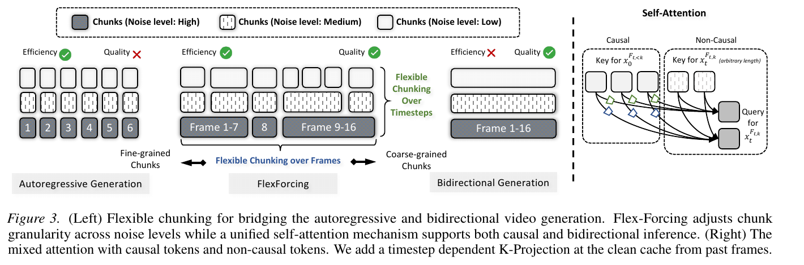
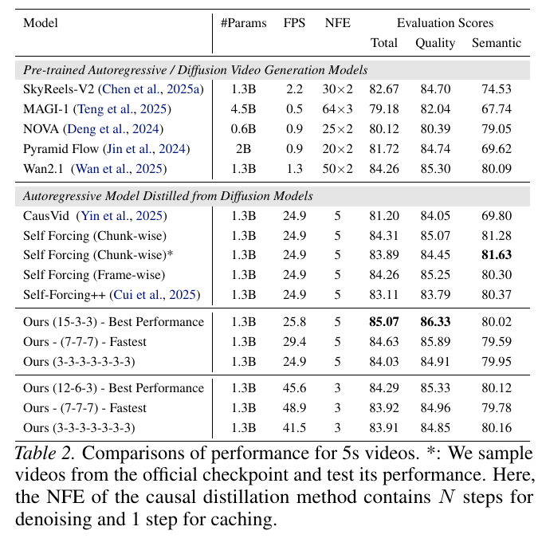

# Flex-Forcing: Towards a Unified Autoregressive and Bidirectional Video Diffusion Model 精读分析

> [!info] 文档关系
> - 文档类型：Paper（complete with limitations）
> - 领域入口：[README](../README.md)
> - 上位汇总：[ICML 2026 selected papers](../surveys/icml-2026-selected-papers.md)
> - 证据资产：[Figure 3](../assets/papers/flex-forcing/fig3-flexible-chunking-mechanism.png)，[Table 2](../assets/papers/flex-forcing/table2-five-second-performance.png)
> - 相关文档：[Paper index](../evidence/paper-index.md)，[Figure inventory](../evidence/figure-inventory.md)

> 资料状态：已取得完整 arXiv v1 camera-ready PDF、LaTeX/source、官方 NVIDIA 项目页和 ICML/OpenReview 元数据。未发现官方代码或权重发布。OpenReview 公开 note/review/rebuttal 因浏览器挑战与 API 403 无法读取。正文图片是 200 DPI PDF 裁剪，均含完整 caption 并通过逐图原分辨率 QA。

## 修订信息

- 当前文档版本：`1.1.0`
- 当前修订 ID：`rev-flex-problem-solution-20260725`
- 当前修订时间：`2026-07-25T10:05:32+08:00`
- 替代版本：`rev-source-complete-20260724` / `1.0.0` / manifest `2f07f9ed784dc8cd6eefb8651b417a7c4a5e7e60f79898a3d37e7dcaae197f22`

| 修订 ID | 文档版本 | 时间 | 修订者 | 类型 | 替代修订 | 迁移问题/解析 | 变更摘要 | 原因 | 影响位置 | 依据 | 对结论影响 |
|---|---|---|---|---|---|---|---|---|---|---|---|
| `rev-initial` | `0.1.0` | `2026-07-17T00:00:00+08:00` | `review_flex_forcing` | `initial` | 无 | 无 | 首次建立 blocked 单篇审阅包 | 主 PDF 下载不完整且无法解析 | `analysis.md`; `figure_inventory.md`; `review_checklist.md` | `paper.pdf`; `extracted_text/error.log` | material |
| `rev-source-complete-20260724` | `1.0.0` | `2026-07-24T20:20:34+08:00` | `flex_forcing_refresh` | `mixed` | tracked `rev-initial` / `0.1.0` / `075d43a87072c1b36cf647ac3a6ca1513c68dd44bdf23e86982108de8e32310d` | 无 | 用完整 PDF/source 重做方法、实验、视觉、venue、项目页与系统分析；补全所有清单与清单化证据 | 刷新任务要求替换不可读 PDF 的 blocked 交付 | `analysis.md`; `figure_inventory.md`; `openreview_reviews.md`; `source_verification.md`; `figures/crops/` | arXiv v1 PDF/source；官方 NVIDIA 项目页；ICML Downloads；OpenReview 索引元数据；任务包 | material |
| `rev-flex-problem-solution-20260725` | `1.1.0` | `2026-07-25T10:05:32+08:00` | `/root` | `content-update` | `rev-source-complete-20260724` / `1.0.0` / `2f07f9ed784dc8cd6eefb8651b417a7c4a5e7e60f79898a3d37e7dcaae197f22` | 无 | 新增统一 AR/双向视频扩散的问题—方案—优化—证据闭环 | 统一回写既有 Paper 报告 | `研究动机与问题—方案闭环` | Figure 7/8、Table 2 与源码公式 | minor：不改变主结论，明确并非所有 schedule 占优 |

## 0. 资料与配图索引

- 论文：`paper.pdf`，arXiv `2607.03509v1`，2026-07-03 提交，16 页。
- LaTeX/source：`source/example_paper.tex`；源包 `source/arxiv-source.tar`。
- 提取文本：`extracted_text/arxiv-paper.txt`、`extracted_text/arxiv-paper-layout.txt`。
- 官方项目页：`evidence/project-page.html`；页首标注 `ICML 2026 · Spotlight`。
- OpenReview：`openreview_reviews.md`；只验证到索引元数据，公开 review/decision/rebuttal 被访问挑战阻断。
- Venue/source 审计：`source_verification.md`。
- 开源代码/权重：官方项目页无链接；GitHub 精确仓库检索只有 3 个无关结果，见 `evidence/github-repository-search.json`。
- 原论文视觉：[Figure 3](../assets/papers/flex-forcing/fig3-flexible-chunking-mechanism.png)；[Table 2](../assets/papers/flex-forcing/table2-five-second-performance.png)；完整字段与 QA 见 [Figure inventory](../evidence/figure-inventory.md#flex-forcing)。
- AI 生成分析示意图：未生成；原因见“生成图处理”。

## 0.1 术语与符号解释

### 0.1.1 术语表

| 术语 | 本文含义 | 别名 | 不等于/易混项 | 证据来源 |
|---|---|---|---|---|
| Flex-Forcing | 在同一后训练视频扩散模型中，用可变 chunk 配置覆盖双向、混合和自回归推理的框架。 | flexible inference framework | 不是两个模型的路由，也不是纯运行时、免训练插件。 | Abstract；§3 Overview；Figure 3 |
| flexible chunking | 同时沿视频帧轴和去噪 timestep 轴定义的连续分块；chunk 内双向、chunk 间自回归。 | frame/timestep chunking | 不等于只改变 batch size；chunk 会改变注意力可见性与执行依赖。 | §3.1–3.2；Eq. 1–3；Table 1 |
| nested flexibility | 随去噪推进只插入新边界、递归细分原 chunk 的约束。 | pyramid chunking | 不是任意无约束地合并/重排 chunk。 | §3.2；Eq. 3；Appendix Figure 13 |
| clean KV cache | 已生成历史帧的干净 key/value 状态，只存一次并在每个 timestep 使用。 | past-frame cache | 与当前 noisy chunk 的在线 K/V 不同；论文只投影 clean key，不改缓存张量。 | §3.1、§3.3 K-Projection；Figure 3 |
| K-Projection | 将 clean cached key 按当前 diffusion timestep 投影到噪声一致表示空间的轻量线性投影。 | noise-aligned projection | 不是更新/重算整个 KV cache，也没有对 value 明确做同样投影。 | §3.3；Eq. 5–6；Figure 8 |
| asymmetric distillation | 先 ODE causal 初始化，再用 self-rollout 与 VSD/DMD 训练 few-step generator 的后训练流程。 | causal distillation | Flex-Forcing 复用 CausVid/Self-Forcing 训练骨架，新增随机 flexible chunks 和 K-Projection。 | §3.3 |
| NFE | 去噪函数评估次数；Table 2 对 causal distillation 另有 1 次 caching step。 | number of function evaluations | 表中 FPS 不能只按 NFE 线性解释，chunk rollout 次数也影响端到端速度。 | Table 2 caption；Appendix speed analysis |
| any-timestep editing | 只在后期低层 refinement timesteps 修改 conditioning，保持早期 global planning 不变。 | any-step editing | 不是任意 timestep 都等价；作者的应用策略有明确的后期限制。 | §4.2；Figure 6 |
| any-order editing | 全视频生成后，对任意中间 chunk 同时条件化于前后 clean chunks 来重编辑。 | order-agnostic editing | 不是严格左到右 causal generation；它显式使用 future clean context。 | §4.2；Eq. 7；Figure 5 |
| sink/window | 30 秒长视频推理保留 3 latent-frame sink、总注意力窗口 21 latent frames。 | attention sink/window | 不是全文上下文；论文未给出不同窗口的敏感性。 | §5 Implementations |

### 0.1.2 符号表

| 符号 | 含义 | 性质 | 作用域/索引 | 单位/取值 | 来源 | 易混点 |
|---|---|---|---|---|---|---|
| $F$ | 视频 latent 帧数 | author-defined | 全视频 | Table 2 设置为 21 latent frames / 81 output frames | §3.1；Table 1；§5 | output frames 与 latent frames 不是同一计数。 |
| $T,t$ | 总去噪步数与当前 timestep | author-defined | $t=1,\dots,T$ | NFE 2–5 等实验设置 | §3.1；Eq. 1–6 | 论文叙述“early/high noise”时 timestep 方向依 sampler 约定。 |
| $K_t,k$ | timestep $t$ 的 chunk 数及 chunk 索引 | author-defined | 每个 timestep | 正整数 | §3.1 | $K_t$ 随 timestep 变化。 |
| $\mathbf a_t$ | timestep $t$ 的有序 chunk 边界向量 | author-defined | 每个 timestep | $1=a_{t,0}<\cdots<a_{t,K_t}=F+1$ | §3.1；Table 1 | 配置如 `[15,3,3]` 写的是 chunk size，不是边界值。 |
| $\mathcal F_{t,k}$ | 第 $k$ 个 chunk 覆盖的帧索引集合 | author-defined | timestep/chunk | $[a_{t,k-1},a_{t,k})$ | Eq. 1 | 不是张量本身。 |
| $x_t^{\mathcal F}$ | timestep $t$ 上 chunk $\mathcal F$ 的 noisy latent | author-defined | timestep/chunk | latent tensor | Eq. 2 | $x_0^{\mathcal F_{t,<k}}$ 表示已生成 clean history。 |
| $q_\theta$ | 条件反向 denoising transition | author-defined | 每个 chunk/step | 概率转移 | Eq. 2、Table 1、Eq. 7 | 文中也使用 generator $G_\theta$ 表示蒸馏网络。 |
| $\mathcal S_{t,k}$ | 在旧 chunk 内插入的新 split points | author-defined | timestep/chunk | 边界索引集合 | §3.2；Eq. 3 | 源文公式以集合 union 记法混合标量和集合，类型略不严谨。 |
| $G_\theta,\mathbf z$ | few-step generator 与标准高斯噪声 | author-defined | 训练 sample | $\mathbf z\sim\mathcal N(0,I)$ | DMD gradient equation, §3.3 | $G_\theta$ 与 $q_\theta$ 是同一模型的不同叙述层次，论文未严格统一。 |
| $s_{\mathrm{real}},s_{\mathrm{fake}}$ | DMD/VSD 中真实与生成分布的 score | author-defined | noisy sample | score vector | §3.3 gradient equation | 训练细节主要引用前作，本文未完整重述 estimator。 |
| $\Pi_{t\leftarrow0}$ | 从 clean-key space 到 timestep-$t$ noisy-key space 的条件线性投影 | author-defined | 每层/每 timestep | $\mathbb R^d\rightarrow\mathbb R^d$ | Eq. 5 | 是否每层独立、参数量多少未报告。 |
| $Q_t,K_0,\tilde K_t,V_t,d$ | 当前 query、clean cached key、对齐后 key、value、key 维度 | author-defined | attention layer | tensor / dimension | Eq. 5–6 | 公式把 current-chunk key 也记为 $\tilde K_t^{\mathcal F}$，但只明说投影 clean past key。 |
| $B_{\mathrm{KV}}$ | 本分析用于 cache 容量的符号 | analysis-derived | 每层/序列 | bytes | §7.2 推导 | 论文没有足够维度和 dtype，不能代入数值。 |

## 0.2 生成图处理

环境中存在 `$openrouter-icu-image` skill，且 `OPENROUTER_ICU_API_KEY` 已配置；但是该 skill/CLI 只提供 `generate` 与 `edit`，全目录检索和 CLI help 均没有强制要求的 `responses-doc --input-file analysis.md` 文档输入路径。因此按 workflow 跳过；未调用 prompt-only `/images/generations`，也未创建占位图。这个缺口不影响原论文证据。

## 1. 论文基本信息

- 作者：Xinyin Ma, Julius Berner, Chao Liu, Arash Vahdat, Weili Nie, Xinchao Wang。
- 机构：NUS、NVIDIA Research。
- Venue：ICML 2026 Spotlight。官方 NVIDIA 页直接标注 Spotlight；ICML Downloads 列出标题；OpenReview 索引 subject 同样为 Spotlight。指定 poster 65566 因 403/robots 未能本地冻结。
- 版本：arXiv v1，2026-07-03；TeX 使用 accepted ICML 2026 样式。OpenReview 初投稿与 camera-ready 的完整 diff 不可得。
- 研究问题：一个视频扩散模型能否在测试时连续调节自回归效率与双向全局一致性，而无需为每种生成范式训练独立模型？
- 核心约束：causal history 的 clean KV 与当前/future noisy representations 噪声级别不同；跨 timestep 细分 chunk 会产生执行同步依赖；few-step speed 与 chunk rollout 次数共同决定。

## 1.1 研究动机与问题—方案闭环

### 1.1.1 出发点与背景痛点

作者从视频扩散中两种推理范式的结构性冲突出发：全双向生成能利用全局时空上下文，但每个去噪步都反复处理全部帧；严格自回归生成可以流式 rollout 并复用历史 KV，却更容易累积误差、牺牲长程一致性。现有系统通常为两种范式分别训练模型，使质量—效率选择在训练后基本固定。论文希望让同一模型在测试时按设备预算和任务需求移动这一 Pareto 前沿。

### 1.1.2 现有方案为何不够

固定 chunk 或固定 attention mask 只能选取单一点：小 chunk 增加 causal cache 复用，却缩窄双向上下文；大 chunk 获得更强全局规划，却增加重复计算。根因是不同噪声阶段需要的上下文粒度不同，而固定方案把帧轴和去噪轴绑定为同一策略。混合 clean history 与 noisy current/future tokens 时还存在表示分布错位，直接复用 clean keys 会削弱跨块 conditioning。

### 1.1.3 计划解决的问题与成功标准

- 目标：一个模型覆盖严格 AR、全双向和中间 hybrid 推理，并在测试时调节 chunk schedule。
- 约束：schedule 必须支持 causal KV cache；跨 timestep 细分必须保持依赖合法；clean/noisy key 必须可共同参与 attention。
- 成功标准：不同 schedule 形成可控的质量—FPS 前沿；长视频和编辑任务仍可工作；K-Projection 消融应验证噪声对齐。
- 不解决：论文没有证明任意 schedule 都占优，也没有给固定显存预算、峰值显存或 kernel 级利用率保证。

### 1.1.4 核心方案如何解决并优化问题

| 原始问题/失败模式 | 根因或约束 | 对应设计 | 改变的变量/系统行为 | 作用机制 | 预期优化 | 证据与判断 |
|---|---|---|---|---|---|---|
| AR 效率与双向质量二选一 | attention 范围固定 | 帧轴 variable chunks | 每轮并行帧数与 causal 边界 | chunk 内双向、chunk 间 causal cache | 质量—FPS 可调 | Table 1/2、Figure 4；supported，但依配置 |
| 不同噪声阶段需求不同 | 固定 schedule 忽略全局规划与局部细化差异 | timestep nested chunks | 各 timestep 的 chunk 边界 | 高噪声大块规划、低噪声细分 refinement | 更优 Pareto 点 | Figure 7/13；partially supported |
| 单模型无法适应多种 mask | 训练分布只覆盖一种 factorization | 随机 flexible-chunk training | 训练时 context/mask 分布 | 同一网络学习多种 causal/non-causal 条件 | 测试时可切换 schedule | 方法与完整结果间接支持；缺独立训练消融 |
| clean cache 与 noisy token 错位 | key 位于不同 timestep 空间 | timestep-conditioned K-Projection | past clean key 的表示空间 | 按当前噪声级投影后再混合 attention | conditioning 与质量稳定性 | Figure 8 直接消融；supported，runtime 成本未隔离 |

### 1.1.5 完整因果链与证据闭环

固定生成范式造成全局一致性与缓存效率冲突 → 根因是 attention/chunk 粒度不能随帧位置和噪声阶段变化，并伴随 clean/noisy key 错位 → 随机 flexible-chunk 训练让同一模型学习多种 factorization → 推理时用二维 chunk schedule 决定双向范围与 causal cache 复用，再以 K-Projection 对齐历史 keys → 预期改变上下文宽度、rollout 轮数和缓存复用率，从而形成质量—速度前沿。Table 2、Figure 7/8 支持 schedule 和 projection 确实影响结果，但训练随机化的独立贡献、投影开销、显存和设备预算仍未充分隔离，因此结论是“提供可配置前沿”，不是“所有配置全面优于基线”。

## 2. 核心贡献与证据边界

1. **统一推理范式。** 用 $\mathbf a_t$ 把逐帧 autoregressive、单 chunk bidirectional、以及中间 hybrid 写成同一 factorization（§3.1、Table 1）。这是形式与实证共同支持的框架贡献。
2. **双轴 flexible chunking。** 帧轴决定每轮并行范围，timestep 轴允许高噪声大 chunk、低噪声小 chunk（§3.1–3.2、Figure 3、Figure 7）。实验显示配置显著影响 Pareto frontier，但并非所有配置都优于 Self-Forcing。
3. **噪声对齐 conditioning。** K-Projection 动态投影 clean cached keys；Figure 8 有有/无投影的直接消融，但缺参数量、层级布置和运行开销。
4. **灵活编辑。** 后期 timestep 编辑与双侧 clean context 支持 any-timestep/any-order editing（Figure 5–6）。证据主要为定性可视化，没有成功率定义或量化表。
5. **短/长视频结果。** 5 秒与 30 秒表格报告质量和 FPS；短视频 FPS 在 GB200，附录另报 A100。论文没有显存峰值、device-count、功耗、吞吐负载或带宽利用率，故“不同 device budgets”只被配置可调性间接支持。

## 3. 研究方法

### 3.1 问题到方案的逻辑链

固定双向推理有全局上下文但重复处理全部帧，固定 causal 推理可复用 KV cache 却容易累计误差。Flex-Forcing 在训练时随机暴露从严格 causal 到全 non-causal 的 chunk mask，在推理时选择 $\mathbf a_t$；较大 chunk 提供更宽双向上下文，较小 chunk 增加缓存复用与流式性。由于 past clean KV 与 current/future noisy KV 分布错位，再用 timestep-conditioned K-Projection 对齐 clean keys。

### 3.2 模型与系统架构

> 原论文 Figure 3。左侧给出帧轴/去噪轴的 chunk 粒度连续谱；右侧显示 query 同时读取 projected clean causal keys 与 noisy non-causal keys。图本身说明机制，但没有证明每个配置的最优性。

在每个 timestep $t$，先以边界 $\mathbf a_t$ 把帧划成连续 chunks。一个 chunk 内执行 bidirectional attention；先前 chunks 已生成的 clean frames 以 KV cache 作为 causal history。若下一去噪步把大 chunk 细分，运行时必须暂存大 chunk 结果，等前置 sub-chunk 的 KV cache 可用后按时间顺序继续。这一点意味着“更大 chunk 一定更慢”并不成立：大 chunk 单次计算更重，却可减少 rollout rounds；附录 speed analysis 正是这个解释。

### 3.3 关键公式

第 $k$ 个 chunk：

$$
\mathcal F_{t,k}=\{f\mid a_{t,k-1}\le f<a_{t,k}\}.
$$

chunk-wise causal transition：

$$
x_{t-1}^{\mathcal F_{t,k}}\sim q_\theta\!\left(
x_{t-1}^{\mathcal F_{t,k}}
\mid x_0^{\mathcal F_{t,<k}},x_t^{\mathcal F_{t,k}};\mathbf a_t
\right).
$$

两端极值分别是 $\mathbf a_t=(1,2,\ldots,F,F+1)$ 的逐帧 AR，和 $(1,F+1)$ 的全双向。timestep 轴上只通过插入 $\mathcal S_{t,k}$ 细分旧边界，形成 nested schedule。

K-Projection：

$$
\tilde K_t=\Pi_{t\leftarrow0}(K_0),\qquad
\operatorname{Attn}(Q_t,\tilde K_t,V_t)=
\operatorname{softmax}\!\left(\frac{Q_t\tilde K_t^\top}{\sqrt d}\right)V_t.
$$

完整 key 拼接为 projected past clean keys 与 current noisy keys。作者声称不修改 stored KV tensor，也不让 gradient 通过 cache；因此缓存一次即可按 timestep 在线投影。论文未量化 projection latency，Table 2 的端到端 FPS 已包含整个实现，但不能隔离其 runtime 成本。

### 3.4 设计动机与具体问题映射

| 设计项 | why 状态/来源 | 针对问题 | 因果机制 | 替代方案/权衡 | 验证证据 | 判断 |
|---|---|---|---|---|---|---|
| 帧轴 variable chunks | author-stated，§3.1、Table 1 | 双向高质量与 AR 高效率不可兼得；严格 AR 长程漂移 | chunk 内双向扩大上下文，chunk 间 causal 允许 history cache | 固定均匀 chunks 更简单；全双向上下文更强但重复计算更多 | Figure 4 配置搜索；Table 2 | supported，但依配置 |
| timestep nested chunks | author-stated，§3.2、Figure 3 | 不同噪声阶段对全局/局部上下文需求不同 | 高噪声大 chunk 做结构规划，低噪声细分做局部 refinement | 固定 chunk schedule 无同步复杂度；nested 限制搜索空间 | Figure 7 matched ablation；Appendix Figure 13 | partially supported；只有少量 schedules |
| 随机 flexible-chunk 训练 | author-stated，§3.3 | 单模型需同时适应 causal 与 non-causal masks | rollout 中随机采样 $\mathbf a_t$，让同一 query 见到多种 context | mixture-of-masks curriculum、独立模型；随机范围 2–10 未做 sensitivity | 完整模型结果；无独立移除实验 | plausible / confounded |
| DMD/VSD asymmetric distillation + self-rollout | author-stated，§3.3 | few-step causal model 的 train–test exposure gap | 自 rollout 产生训练状态，VSD/DMD 蒸馏 few-step generator | 原生 AR 训练、普通 teacher forcing；继承前作复杂性 | 与多种模型对比，但没有把该骨架与 Flex 增量完全解耦 | partially supported / confounded |
| K-Projection | author-stated，§3.3、Eq. 5–6 | clean past keys 与 noisy current/future keys 的 SNR mismatch | 按 timestep 把 clean keys 映射到 noisy representation space | 重算 cache、分别归一化 Q/K、同时投影 K/V；作者未比较 | Figure 8 有/无 projection 直接消融 | supported，运行成本未知 |
| buffering + dependency-aware resume | author-stated，§3.2、Appendix Figure 13 | 大 chunk 在下一步被切分时，后续 sub-chunk 缺前置 KV | 暂存整块结果，等待前置 cache 后恢复时序执行 | 预先固定 partitions 或重算；需额外 activation buffer | execution diagram 与算法叙述；无内存/latency isolate | plausible / code-unverified |
| 后期 timestep editing | author-stated，§4.2、Figure 6 | 局部编辑传播并破坏后续全局结构 | 保留早期 planning，仅在后期 refinement 改 conditioning | inversion、mask editing；限制可改变的结构幅度 | 同 seed 定性对照 | partially supported |
| 双侧 clean-context any-order editing | author-stated，§4.2、Eq. 7、Figure 5 | 严格 causal 无法独立修改中间片段 | target chunk 同时 attend past/future clean chunks | 重新生成后缀、双向 inpainting；需要完整视频 cache | 定性图，无量化成功率 | plausible / indirect |

### 3.5 训练、实验与公平性

- Base：Wan2.1-T2V-1.3B；teacher：Wan2.1-T2V-14B。
- 数据：VidProM extended prompts；训练 600 iterations，batch 64；随机 chunk size 2–10。
- K-Projection learning rate：$2\times10^{-6}$；2-step schedule `[1000, 500]`。
- 5 秒：832×432，81 output frames / 21 latent frames；VBench；GB200 FPS；每 prompt 5 samples。
- 30 秒：VBench-Long；每 prompt 1 sample；sink 3 latent frames、window 21；在 Infinity-RoPE inference 上构建。
- 公平性优点：对 Self-Forcing 使用相同 prompts、固定 random seeds；Table 2 还测试官方 checkpoint（星号行）。
- 公平性缺口：没有 variance/error bars；未报告 prompt 数、GB200 数量、dtype、batching/预热、峰值显存；不同预训练模型、参数量与 NFE 的横向行并非严格 matched。30 秒每 prompt 仅 1 sample，且 Ours 叠加 Infinity-RoPE，归因存在混杂。

## 4. 关键结论

### 4.1 5 秒主结果：质量与速度分开看

> 原论文 Table 2。FPS 是 GB200 上 81 帧生成；NFE caption 说明 causal distillation 还含 1 次 caching step。

以 Self-Forcing chunk-wise（24.9 FPS、84.31 Total）为参照：

- Ours `[15,3,3]`, NFE=5：25.8 FPS，绝对 +0.9、相对 +3.6%；Total 85.07，绝对 +0.76、相对 +0.90%。这是同参数量/NFE 下较强的 speed-quality 点。
- Ours `[7,7,7]`, NFE=5：29.4 FPS，+4.5 / +18.1%；Total 84.63，+0.32 / +0.38%。速度收益更明显。
- Ours `[3,3,3,3,3,3,3]`, NFE=5：24.9 FPS 与 baseline 相同，但 Total 84.03，比 Self-Forcing chunk-wise 低 0.28、比 frame-wise 低 0.23；只比作者复测的 official checkpoint 83.89 高 0.14。

因此“存在更优 Pareto 配置”有直接证据；“任意 Flex schedule 都一致优于 Self-Forcing”不成立。Semantic 单项也未全面占优：Self-Forcing official checkpoint 为 81.63，Ours best-performance 为 80.02。

### 4.2 其他结果与系统约束

- **Few-step bidirectional：** 4-step Flex Total 85.13，比 4-step DMD-v 84.60 高 0.53；2-step Flex 84.20 比 2-step DMD-v 84.39 低 0.19。结论应是 competitive，而非每档 SOTA。
- **30 秒：** 相对 Infinity-RoPE，Ours Total 84.01 vs 82.84（+1.17，+1.41%），FPS 24.96 vs 19.10（+5.86，+30.7%），Dynamic Degree 71.27 vs 50.26（+21.01）。但 Semantic 78.86 vs 79.11、Imaging Quality 66.24 vs 69.30、Spatial 78.11 vs 82.48 均下降。Ours 建在 Infinity-RoPE inference 上，这不是纯替换式 component ablation。
- **Device budget：** GB200 与 A100 appendix 都显示可选 Pareto 点，但没有 GPU 数、显存峰值、OOM frontier 或固定 memory-budget experiment。故只能说 chunk schedule 提供 compute/latency knob，不能验证具体 device-memory budget 承诺。
- **K-Projection：** Figure 8 显示随着 maximum chunk size 增大，无 projection 曲线退化、带 projection 更稳定；属于直接组件消融。图未提供误差条与 projection runtime。
- **Editing：** Figure 5–6 是同场景定性证据；“high success rate”没有定义样本量/成功指标，不能量化外推。

### 4.3 技术 claim 证据矩阵

| 技术点 | 声称效果 | 实验/证据 | 控制程度 | 证据分类 | 结论 |
|---|---|---|---|---|---|
| 单模型覆盖 AR/bidirectional/hybrid | test-time 范式可调 | Table 1 factorization；Figure 3；多 schedule 结果 | 同一模型、不同配置，但无双模型容量对照 | direct + mechanism | supported |
| frame-axis chunking | 改善 speed-quality trade-off | Figure 4 brute-force；Table 2 | schedule 内固定模型；跨 baseline 部分 matched | direct | supported，非所有配置 |
| timestep-axis chunking | 更好 Pareto frontier | Figure 7 三类 schedule | 论文称 identical conditions | direct ablation | supported within tested schedules |
| random chunk training | 泛化到多种 masks | 全模型跨配置可运行 | 没有去掉 randomization 的模型 | confounded | plausible, unisolated |
| train-test consistent objective | 减少 mismatch | 复用 self-rollout/DMD；完整模型结果 | 与 flexible chunks/K-proj 捆绑 | confounded | partially supported |
| K-Projection | 大 chunk/近双向更稳定 | Figure 8 with/without | 直接有/无组件 | direct ablation | supported |
| cache 不改写、在线投影 | 保留 KV efficiency | §3.3 机制说明 | 无代码、profile 或 kernel trace | paper-only | unverified implementation |
| 长视频更稳定/动态 | 30 秒质量、dynamic degree 更高 | Table 4、Figure 9 | 同 prompts；Ours 叠加 Infinity-RoPE；1 sample/prompt | indirect/confounded | partially supported |
| any-timestep editing | 局部编辑少传播 | Figure 6 | 相同 frames/timesteps，定性 | indirect visualization | partially supported |
| any-order editing | 中间片段可独立重编辑 | Eq. 7、Figure 5 | 无量化成功率 | indirect visualization | plausible |
| 不同 device budgets | 配置可适配资源 | GB200/A100 Pareto plots | 无显存/预算约束实验 | missing direct evidence | unverified as memory-budget claim |

### 4.4 显式证据闭环

**问题：** 固定 AR 与双向推理在长程一致性和效率上互斥。
**假设：** attention chunk 的粒度可作为连续 causal-context knob，且高噪声阶段更需要全局上下文。
**机制：** 双轴 nested chunks + mixed causal/non-causal attention + K-Projection。
**测量：** GB200/A100 FPS、VBench/VBench-Long、schedule 搜索、timestep ablation、K-Projection ablation、定性编辑。
**结论：** 至少若干 `[15,3,3]`、`[7,7,7]` 等配置在同 1.3B/NFE 条件下扩展 Pareto frontier；K-Projection 对大 chunks 有直接正向证据。
**限制：** 并非所有 schedule 质量都更高；长视频归因混杂 Infinity-RoPE；没有 memory/bandwidth/variance/代码证据；editing 主要定性。这些限制把结论收窄为“可配置且存在优越工作点”，而不是“任意预算、任意配置统一支配”。

### 4.5 收益归因

| 组件/变化 | 对比 | 指标变化 | 影响路径 | 证据强度 |
|---|---|---|---|---|
| `[15,3,3]` flexible schedule | Self-Forcing chunk-wise, NFE5 | +0.76 Total；+0.9 FPS | 更大早期 chunk + 较少 rollout | matched-ish table，schedule 与训练共同作用 |
| `[7,7,7]` | 同上 | +0.32 Total；+4.5 FPS | 并行 chunk 与 rollout 数平衡 | matched-ish |
| 细粒度 `[3×7]` | 同上 | -0.28 Total；0 FPS | 接近严格 AR，暴露偏差仍在 | matched negative evidence |
| K-Projection | without K-Projection | Figure 8 曲线整体更稳，尤其大 chunk | 对齐 clean/noisy keys | direct ablation；无精确表值 |
| timestep hybrid | frame-only configurations | Figure 7 更优 frontier | high-noise planning / low-noise refinement | direct schedule ablation |
| long-video Flex + Infinity-RoPE | Infinity-RoPE | +1.17 Total；+5.86 FPS；+21.01 Dynamic | flexible chunking 叠加长视频 window/sink | confounded，非独立 Flex 增量 |

## 5. Related Work 对比

| 类别/代表工作 | 核心机制 | 优点 | 局限 | 与 Flex-Forcing 的关系/公平性 |
|---|---|---|---|---|
| Bidirectional diffusion（Wan2.1、DMD-v、rCM） | 全 temporal context 联合去噪 | 全局一致性和视觉质量 | 长序列重复计算、流式性弱 | Flex 把单大 chunk 作为极值；few-step 表跨方法训练 recipe 不完全一致 |
| Native AR（VideoGPT、MAGI-1、NOVA） | 严格 causal 次序生成 | 流式、长度可扩展 | 累积误差与全局规划弱 | Flex 把单帧/小 chunk 作为另一极值；参数量/NFE 跨行不 matched |
| Causal distillation（CausVid、Self-Forcing） | causal mask + DMD/self-rollout + KV cache | few-step 实时生成 | 固定 causal schedule | Flex 直接继承该训练骨架，主要增量是随机 mixed chunks 与 K-Projection；这是最重要的 matched baseline |
| Long-video extension（Infinity-RoPE） | train-short/test-long 的位置与窗口策略 | 延长生成 | 仍可能重复或动态不足 | 30 秒 Ours 构建在其 inference 上，故不是独立竞争实现，而是组合增量 |
| Diffusion Forcing | 每 token 不同 noise level | 统一序列预测与扩散 | 不直接给出本文的双轴 chunk runtime | Flex 借其 causal/noisy context 思路，但关注可部署的 chunk schedule |

## 6. OpenReview 公开评审 × 论文内容交叉核验

- OpenReview：<https://openreview.net/forum?id=COGc3MSR7n>
- 访问日期：2026-07-24
- 可见状态：索引 subject 为 `ICML.2026 - Spotlight`；indexed PDF 前页与 arXiv 标题、作者、摘要、Figure 1 一致。
- decision/meta-review、review scores、author response/rebuttal、discussion：因 browser challenge 和 API 403 不可得。

| 来源 | 观点/问题 | 对应 claim | 可核证证据 | 状态 | 阅读影响 |
|---|---|---|---|---|---|
| OpenReview indexed metadata | ICML 2026 Spotlight | venue | subject + 官方 NVIDIA Spotlight + ICML Downloads title | resolved for venue | venue 可信；指定 poster 页面本地留存仍 blocked |
| OpenReview indexed PDF front matter | 标题/作者/摘要/Figure 1 | camera-ready identity | 与 arXiv v1 可见内容一致 | partially resolved | 只支持身份一致，不能证明版本全文无改动 |
| Public reviews/rebuttal | 不可读取 | novelty、fairness、reproducibility 等 | 无 | unresolved due access | 不引入任何 reviewer claim；论文内部局限由本文独立核验 |

## 7. Infra 需求分析

### 7.1 算力与调度

作者只报告端到端 FPS，没有 FLOPs。粗略执行次数依赖各 timestep 的 chunk 数：

$$
N_{\mathrm{chunk\ calls}}\approx\sum_{t=1}^{T}K_t,
$$

但每次 call 的 attention 成本又随 chunk 长度和可见 history 改变，不能仅用 NFE 推速度。Appendix 指出小 chunk 单 chunk FPS 更高，却因 rollout rounds 更多而降低总吞吐；这解释了 `[7,7,7]` 比 `[3×7]` 更快。

### 7.2 显存与 KV cache

若每层缓存 $n_{\mathrm{cache}}$ 个 temporal tokens、$h_{\mathrm{kv}}$ 个 KV heads、head dimension $d_h$、element size $b$ bytes、层数 $L$，则分析性上界：

$$
B_{\mathrm{KV}}=2L\,n_{\mathrm{cache}}h_{\mathrm{kv}}d_hb.
$$

论文只给 long-video sink=3、window=21 latent frames，没有 transformer 层数、tokenization 后每帧 token 数、KV-head 配置、dtype 或峰值显存，无法数值化。Nested timestep 分块还需要暂存上一步大 chunk 的 denoising results；其 activation-buffer 容量也未报告。于是“按 device budget 灵活 chunking”缺少直接 memory-budget 曲线。

### 7.3 Data Types / 数值格式

| 对象 | dtype/格式 | 阶段 | 硬件依赖 | 影响 | 证据 |
|---|---|---|---|---|---|
| weights/activations | 未报告 | train/infer | GB200、A100 | 无法核算 Tensor Core 路径或显存 | paper §5/Appendix |
| clean/noisy KV | 未报告 | infer | GPU HBM/cache | 在线 K-Projection，cache 存一次 | §3.3 |
| scores/accumulation | 未报告 | training | 未报告 | DMD/VSD numerical stability 不可核验 | §3.3 |
| quantization/sparsity | 不适用/未声称 | infer | 无 | 无 int8/fp8 收益可归因 | 全文与项目页 |

### 7.4 带宽、互联与利用率

$$
\mathrm{EffectiveBandwidth}=\frac{\mathrm{BytesMoved}}{\mathrm{RuntimeSeconds}},
\qquad
\mathrm{Utilization}=\frac{\mathrm{EffectiveBandwidth}}{\mathrm{PeakBandwidth}}.
$$

论文没有 bytes moved、kernel trace、GPU count、HBM peak、NVLink/PCIe/RDMA、all-reduce 或 batch 配置，因此这两个量不可计算。可推断的方向是：缓存历史 K/V 避免重算，但每个 timestep 在线读 cache 并投影 K；大 chunk 提高并行度、减少 rollout，同步 buffer 可能增加 HBM traffic。没有代码/kernel evidence，不能判断 compute-bound 还是 memory-bound。

### 7.5 CPU/GPU/NPU 异构执行

| 阶段 | CPU 角色 | GPU/NPU 角色 | 数据移动/同步 | 判断 |
|---|---|---|---|---|
| prompts/data | 未报告 | 未报告 | 未报告 | training pipeline 不可复现到系统级 |
| generation | host scheduler 未报告 | GB200/A100 执行模型 | nested chunks 需依赖感知调度与 buffer；传输路径未知 | 只验证算法依赖，未验证实现 |
| editing | prompt/segment selection 可能由 CPU 发起（inferred） | 同一生成模型重编辑 | future/past clean caches 需可访问 | 无代码，不能确认 |
| NPU/其他加速器 | 未报告 | 未报告 | 未报告 | 跨硬件可移植性未知 |

### 7.6 Serving/KV-cache 行为结论

系统亮点是 cache-preserving K-Projection：clean KV 只存一次，按 timestep 投影后参与 attention，不回写 cache。但没有 release code，无法确认是否 fused、是否逐层独立 projection、是否复用 projected keys、是否使用 CUDA Graph、FlashAttention 或自定义 kernel。Table 2 的 FPS 是结果证据，不是 kernel 归因证据。

## 8. 开源代码、配置与权重对照

- 官方项目页：已保存；无 GitHub/code/model/checkpoint 链接。
- 论文：只给 project page，无 code URL。
- GitHub public repository exact search：3 个结果均与论文无关。
- Code commit：unavailable。
- 模型权重/配置：未发布或未链接；Wan2.1 base/teacher 名称来自论文，不把其公开 checkpoint metadata 当作 Flex-Forcing checkpoint evidence。

因此实现层只可陈述 paper-specified behavior：随机 chunk range、K-Projection 公式、cache 不回写、nested execution、sink/window 和训练超参。任何 kernel、dtype、配置字段或 serving scheduler 细节均保持 unverified。

## 9. 优点、局限与可改进处

### 优点

- 把两种通常分立的生成范式写成同一边界配置，概念与实现接口都很清晰。
- 表格包含相同 1.3B/NFE 下的多 schedule，比只报一个最佳点更能暴露 Pareto 与负证据。
- K-Projection 有直接消融；timestep chunking 也有 matched schedule ablation。
- 同时报 GB200 与 A100，至少表明趋势不只来自单一 GPU 型号。

### 局限

- 核心随机 chunk training、train-test consistent objective、buffering 的增量没有独立消融。
- “consistent outperformance”被 Table 2 的细粒度配置与 semantic 子指标反例收窄。
- 30 秒方案叠加 Infinity-RoPE，且每 prompt 只有一个 sample；无误差条。
- 编辑结果定性为主，“success rate”无定义。
- device budget、memory、bandwidth、dtype、GPU count、能耗、kernel 均未报告。
- 无代码、Flex checkpoint 或配置；无法复现 K-Projection 与调度细节。
- OpenReview reviews/rebuttal/history 访问受阻，不能审计评审阶段变化。
- 作者自己承认长视频 train–inference mismatch 未完全解决，且依赖预训练双向 priors。

### 可改进处

最小有价值补充是：固定模型/seed 的 component factorial ablation（random chunks × timestep chunks × K-Projection）、固定 GB200 memory cap 的 OOM/latency frontier、完整 runtime breakdown（cache、projection、attention、scheduler）、30 秒多样本置信区间、editing success metric，以及 release code/config。

## 10. 研究启发

- 把 attention visibility 当作连续推理控制量，而非训练时固定 architecture choice。
- 把 noise-level alignment 与 mask flexibility 联合设计；否则同一 attention 内不同生成阶段的 K/V 分布会成为隐藏 domain shift。
- 对 adaptive schedule 搜索，不应只优化 FPS 或质量单指标，可把 memory peak、deadline、energy 一并作为 Pareto 约束。
- Nested partitions 暗示一个 scheduler/co-design 方向：在保持因果依赖的同时，自动选择 buffer/recompute、batching 和 projected-cache reuse。

## 11. 解读问题/待验证清单

1. K-Projection 是每层独立还是共享？额外参数量与 latency 多大？
2. 投影只作用于 K，为何 V 的 noise mismatch 不需要处理？
3. random chunk size 2–10 的采样分布是什么？训练中是否同时随机 timestep partition？
4. Figure 7 的所有 hybrid schedules 与 frame-only baselines 是否严格相同 rollout budget？
5. Table 2 的 GB200 是一张卡还是多卡，batch、dtype、warm-up 与计时边界是什么？
6. 固定显存预算时哪些 schedules 可运行？nested buffer 的峰值在哪里？
7. 30 秒增益中 Infinity-RoPE、window/sink 与 Flex 各自贡献多少？
8. Editing 的样本数、成功判据与无编辑区域 consistency metric 是什么？
9. OpenReview 原始 submission 与 camera-ready 是否改动实验或限制？
10. 官方代码/权重发布后，paper 的 cache 不回写与 dependency-aware resume 是否逐字实现？

## 12. 一句话总结

Flex-Forcing 的可靠核心结论是：双轴 chunk schedule 与 noise-aligned cached-key projection 让同一 1.3B 视频扩散模型出现一组优于固定 causal baseline 的速度–质量工作点；最大不确定性是无代码/系统剖析、部分增量归因混杂，以及“任意预算/任意配置均占优”并未被数据支持。
