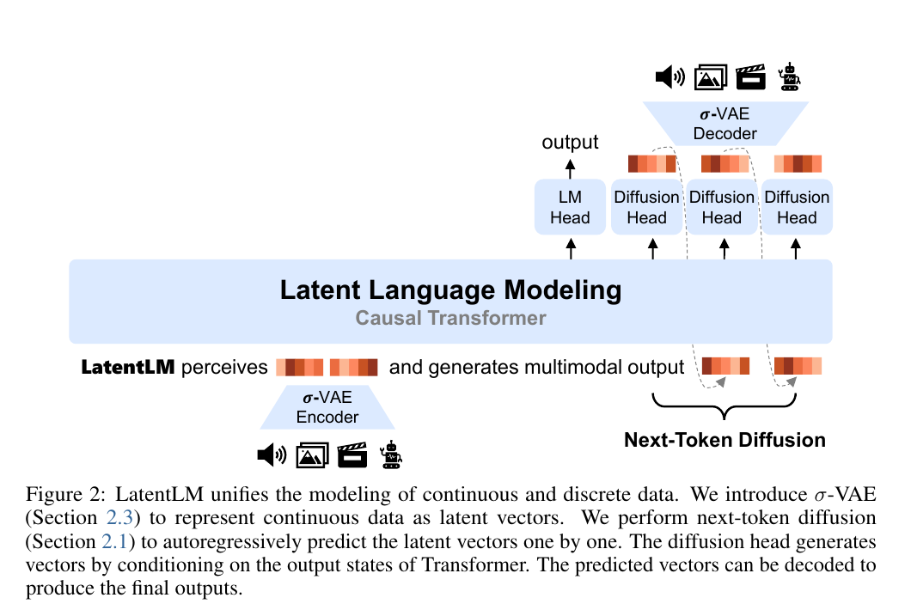
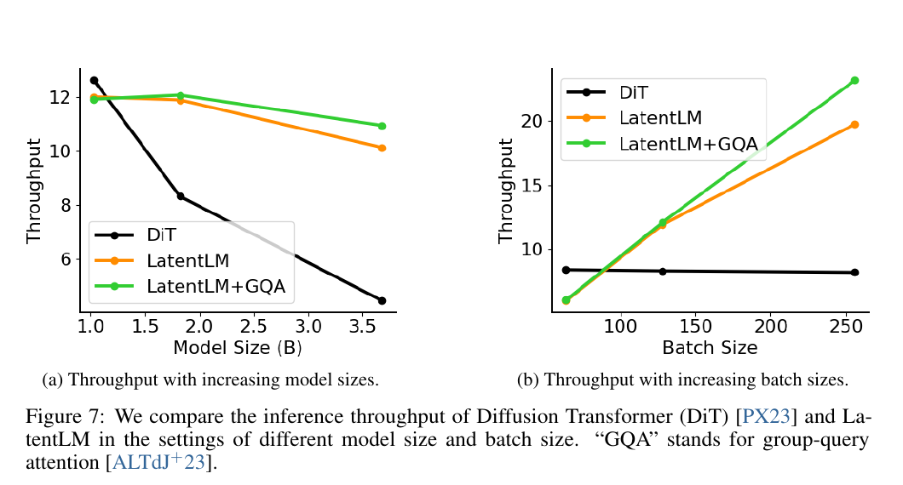

# Multimodal Latent Language Modeling with Next-Token Diffusion 精读分析

> [!info] 文档关系
> - 文档类型：Paper
> - 领域入口：[README](../README.md)
> - 上位汇总：[ICML 2026 selected papers](../surveys/icml-2026-selected-papers.md)
> - 证据资产：[`../assets/papers/latentlm/`](../assets/papers/latentlm/)
> - 相关文档：[Figure inventory](../evidence/figure-inventory.md#latentlm)

> 资料状态：已核验 arXiv:2412.08635v1 的 22 页 PDF、可搜索文本与完整 `main.tex`/原图素材。源码下载流含 trailing garbage，但主 TeX 以 `\end{document}` 正常结束、引用图均可读；正文图为 180 DPI PDF crop，均含完整 caption。官方 Microsoft UniLM 代码已固定到 commit `833df7e7832e5064a281131ee64a481afa8e5b95`；公开范围主要覆盖 ImageNet 训练/采样，MLLM/TTS 与 checkpoint 未开放。

## 修订信息

- 当前文档版本：`1.0.0`
- 当前修订 ID：`rev-latentlm-20260716-initial`
- 当前修订时间：`2026-07-16T18:50:00+08:00`
- 替代版本：无（initial）

| 修订 ID | 文档版本 | 时间 | 修订者 | 类型 | 替代修订 | 迁移问题/解析 | 变更摘要 | 原因 | 影响位置 | 依据 | 对结论影响 |
|---|---|---|---|---|---|---|---|---|---|---|---|
| `rev-latentlm-20260716-initial` | `1.0.0` | `2026-07-16T18:50:00+08:00` | `review_latentlm` | initial | 无 | 无 | 首次建立论文级证据分析、视觉 QA、代码/OpenReview/infra 边界 | 用户题单 | 本文各节与正式 Figure inventory | arXiv v1、LaTeX、Figure 2/7、UniLM commit | material |

## 0. 资料与配图索引

- 论文：[arXiv:2412.08635v1](https://arxiv.org/abs/2412.08635v1)，PDF SHA-256 `15f74eb68e4c8785d82139e160e84bb3b083b14a0256a7a9bb4735a374516ec0`。
- LaTeX 主文档与原图可解析；下载流异常见“局限”。
- 开源代码：[Microsoft UniLM LatentLM at `833df7e`](https://github.com/microsoft/unilm/tree/833df7e7832e5064a281131ee64a481afa8e5b95/LatentLM)；Setup/Usage 与 pretrained models 为 “Coming soon”。
- 未发现公开 OpenReview 评审；Figure 2/7 见[正式 Figure inventory](../evidence/figure-inventory.md#latentlm)。
- AI 生成分析示意图：未生成。父契约确认本地 CLI 仅有 `generate/edit`，缺少强制的 required document-input path 路径。
- Venue：arXiv 页面仅证明 2024-12-11 提交的 v1，未给 ICML/PMLR/OpenReview 接收信息。因此本文仅按“ICML 2026 candidate list，acceptance unverified”归档。

## 0.1 术语与符号解释

### 0.1.1 术语表

| 术语 | 本文含义 | 别名 | 不等于/易混项 | 证据来源 |
|---|---|---|---|---|
| LatentLM | 在同一 causal Transformer 序列中，离散位置用 softmax LM head、连续位置用 token 级 diffusion head 的生成框架 | latent language modeling | 不是对整幅图做双向 diffusion 的 Transfusion | Sec. 2, Eq. 1, Fig. 2 |
| next-token diffusion | 对序列当前位置的单个连续 latent vector 条件于 Transformer 状态做 DDPM/flow-matching 采样，再把结果送入下一 AR 位置 | token-level diffusion | 不是 sequence/image-level diffusion；Transformer backbone 不在每个 denoise step 重跑 | Sec. 2.1-2.2 |
| σ-VAE | 令每个样本的 latent 扰动尺度为跨通道共享、可控标量的 VAE 变体 | fixed-variance VAE | 代码允许该 scalar 为负；因其再乘独立零均值高斯，分布仅由绝对值决定，不是传统非负标准差 | Sec. 2.3, Eq. 5-6；`modeling_sigma_vae.py:38-55` |
| diffusion head | 条件于时间步与 `h_i` 的轻量残差/FFN 去噪网络 | continuous head | 不等于完整 Transformer backbone | Sec. 2.1 |
| frame rate | 每秒由语言模型自回归生成的 speech latent 数 | Length/s | 不等于 diffusion head 内部每 token 的采样步数 | Sec. 3.3, Table 4 |
| throughput | Figure 7 的图示吞吐；论文未在轴/caption 给单位 | inference throughput | 不应解释为 tokens/s、images/s 或端到端 SLA 的确定单位 | Sec. 3.1.4, Fig. 7 |

### 0.1.2 符号表

| 符号 | 含义 | 性质 | 作用域/索引 | 单位/取值 | 来源 | 易混点 |
|---|---|---|---|---|---|---|
| `x_i` | 第 `i` 个离散 token 或连续 latent vector | author-defined | per sequence position | token id 或 `d` 维向量 | Sec. 2, Eq. 1 | 连续情形在 diffusion 公式中又写作 `x_i^0` |
| `h_i` | causal Transformer 在位置 `i` 的输出状态 | author-defined | per position | `d` 维 | Eq. 1 | 是 diffusion condition，不是被迭代去噪的 latent |
| `P_d` | 离散 token 的 softmax 条件分布 | author-defined | per discrete position | probability | Eq. 1 | 仅用于离散位置 |
| `x_i^t` | diffusion 时间步 `t` 的 noisy continuous token | author-defined | per position/per diffusion step | latent vector | Eq. 2-3 | `t` 是 head 内 denoise step，不是 AR 序列位置 |
| `α_t, β_t` | 累积信号系数与 noise schedule | author-defined | per diffusion step | `[0,1]` | Eq. 2 | 文中 `α_t` 为 `∏(1-β_i)` |
| `ε, ε_θ` | 实际高斯噪声与 head 预测噪声 | author-defined | per token/per diffusion step | latent vector | Eq. 2-3 | 与 VAE 重参数化噪声语义相似但阶段不同 |
| `σ, C_σ` | σ-VAE 的样本级共享随机乘子及控制超参 | author-defined/code-defined | per example/shared across channels | image code 默认 `std=0.75` | Eq. 5；`modeling_sigma_vae.py:38-55,92-103` | 是两个独立 Gaussian 的乘积，不是传统非负标准差参数 |
| `α` | 联合训练中 diffusion loss 权重 | author-defined | global hyperparameter | 未报告统一值 | Sec. 2.2 | 不等于 noise schedule 的 `α_t` |
| `R = f_s/(N_q f_r)` | 音频压缩率的本文重写 | analysis-derived | per tokenizer | dimensionless | Table 5 caption | 连续 σ-VAE 的 `N_q=1` 是表格比较约定 |
| `U=B/(T P)` | 有效带宽利用率占位推导 | analysis-derived | per kernel/request | ratio | Sec. 7.4 derivation | 论文未报告 bytes/runtime/peak，不能数值化 |

## 1. 论文基本信息

- 作者：Yutao Sun、Hangbo Bao、Wenhui Wang、Zhiliang Peng、Li Dong、Shaohan Huang、Jianyong Wang、Furu Wei；Microsoft Research / Tsinghua University。
- 研究领域：统一多模态生成与理解、连续 token 自回归建模、VAE/diffusion。
- 核心问题：如何让 causal Transformer 同时原生处理离散 token 与连续表征，而不把连续信号强制量化，也不切换到整序列双向 diffusion。
- 关键假设：连续 latent 可逐 token 生成；轻量 diffusion head 足以建模单 token 条件分布；较大且可控 latent 方差能提高对 exposure bias 的鲁棒性。

## 2. 核心贡献与创新点

1. **统一接口**：Eq. 1 以位置类型路由到 softmax 或 diffusion head，共享 causal backbone（Sec. 2, Fig. 2）。
2. **next-token diffusion**：把多步去噪限制在单个 continuous token 的轻量 head，backbone 每 AR token 只算一次（Sec. 2.1-2.2）。
3. **σ-VAE**：通过固定/可控跨通道方差避免 vanilla VAE variance collapse；Figure 6 给出方差敏感性机制证据。
4. **跨模态实验**：ImageNet、统一 MLLM 与 TTS 均有结果；但这是广度证据，不等同于每个设计均有独立消融。

## 3. 研究方法

### 3.1 问题到方案的逻辑链

VQ 的离散瓶颈与长序列、image-level diffusion 的双向 attention/训练噪声冲突 -> 将连续数据压成短 latent 序列 -> causal Transformer 共享上下文 -> 每个连续位置由条件 diffusion head 生成 -> σ-VAE 调节 latent 方差以抵抗 AR 误差传播。

### 3.2 设计动机与具体问题映射

| 设计项 | why 状态 | 原文证据 | 具体问题 | 因果机制 | 替代/权衡 | 验证证据 | 判断 |
|---|---|---|---|---|---|---|---|
| softmax/diffusion 双 head + shared causal backbone | author-stated | Intro, Sec. 2, Fig. 2 | 离散/连续目标与 attention 机制割裂 | 上下文计算共享，按位置选择输出分布 | VQ 全离散会量化损失；Transfusion 保留 image-level diffusion | Table 3 matched training 配置，但 head 容量对齐仍依赖 6-layer ViT 设定 | partially supported |
| token 级 diffusion | author-stated | Sec. 2.1-2.2 | 连续向量不是有限词表分类 | `h_i` 条件化单 token 去噪，生成后继续 AR | flow matching 也可用；采样仍需多步 | Fig. 7 系统对比、跨任务主结果；缺少“相同 tokenizer 下常规回归 head”替代消融 | partially supported |
| 轻量 diffusion head、多 timestep 复用 backbone | author-stated | Sec. 2.1-2.2 | 对每个噪声步重跑大 backbone 成本高 | 一次 backbone forward 复用约 4 个训练 timestep；推理仅 head 迭代 | 更强 head 增容量/成本 | Fig. 7 为间接系统证据，没有 head 深度/复用消融 | plausible |
| σ-VAE 固定跨通道方差 | author-stated | Sec. 2.3, Eq. 5-6 | vanilla VAE channel variance collapse 与 exposure bias | 更大可控噪声尺度迫使 decoder/AR model 对偏差更鲁棒 | 标准 VAE/确定性 AE；大方差可能损害重建 | Fig. 6 variance sweep（机制敏感性），Table 6（TTS latent dimension/ratio） | supported，但采样公式有歧义 |
| BOD/EOD head switching | author-stated | Sec. 2.2 | 混合序列需确定输出头与模态边界 | 特殊 token 显式切换连续生成区间 | 外部 modality routing | 无独立消融 | unverified |
| DPM-Solver 推理 | author-stated | Sec. 2.1 | DDPM 步数高 | 高阶 solver 降低 head sampling steps | DDIM/flow solver | Figure 10b 为 sampling-step 敏感性（TTS） | partially supported |

### 3.3 模型/系统架构

Figure 2 的关键不是“使用 diffusion”本身，而是阶段边界：causal backbone 负责序列依赖；continuous-token drafting 阶段才在 diffusion head 内做局部多步采样；σ-VAE decoder 在整段 latent 得到后恢复原始模态。离散 token 不经过 diffusion head。

### 3.4 关键公式

离散/连续条件解码：

$$
\mathrm{Decode}(x_i\mid x_{<i})=
\begin{cases}
\mathrm{Sample}(P_d(x_i\mid x_{<i})), & x_i\text{ discrete}\\
\mathrm{Diffusion}(h_i), & x_i\text{ continuous}
\end{cases},\quad P_d=\mathrm{softmax}(h_iW_v).
$$

token 级 DDPM 训练：

$$x_i^t=\sqrt{\alpha_t}x_i+\sqrt{1-\alpha_t}\epsilon,\qquad
\mathcal L_{\mathrm{Diff}}=\mathbb E\|\epsilon-\epsilon_\theta(x_i^t,t,h_i)\|_2^2.$$

联合目标为 `L_LM + α L_Diff`。论文称单次 backbone forward 通常采四个 diffusion timesteps；这降低训练开销，但 `α` 和不同模态 loss 量纲的平衡没有系统敏感性分析。

σ-VAE：

$$\mu=\mathrm{Encoder}_\phi(x),\quad z=\mu+\sigma\odot\epsilon,\quad
\hat x=\mathrm{Decoder}_\psi(z),\quad
\min \|\hat x-x\|_2^2+\beta\|\mu\|_2^2.$$

Eq. 5 把 `σ` 写成从零均值高斯采样的 scalar。代码 `modeling_sigma_vae.py:44-55` 确认实现为样本级随机乘子再乘独立逐元素 Gaussian；默认 image `std=0.75`（92-103 行）。符号命名容易误导，但负号因第二个 Gaussian 对称而不改变条件分布。

### 3.5 训练/实验/部署设计

- ImageNet：LatentLM-L 479M，约 400 epochs；主系统设置 250k steps、batch 2048。Table 1 的 FID 2.24 优于 causal-continuous GIVT 2.59，也接近 DiT-XL/2 2.27，但不优于 MAR-L 1.78。
- MLLM：1.3B、24 层、hidden 2048、sequence 4096；text:image-pair:interleaved = 2:1:1；50k steps = 200B tokens。作者称三方法使用相同训练配置/tokenizer settings，并以 6-layer ViT 对齐 Transfusion image head 参数。
- TTS：24 层、hidden 1024、16 heads；Libriheavy 50k hours。σ-VAE frame rate 15/7.5/3.75 对应压缩率 1600/3200/6400。
- 数据许可、去重与 train/eval leakage 检查未充分报告；大规模 Common Crawl/LAION 混合使复现与公平性判断受限。

## 4. 关键结论

### 4.1 主结果

- Figure 7：单 H100、20 diffusion steps。3.8B、batch 128 时作者报告 LatentLM 对 DiT `2.47x`；1.82B、batch 256 时报告 `2.84x`。但图轴未给吞吐单位，且 GQA 是额外架构优化，不能把绿色曲线全部归因于 next-token diffusion。
- Table 3：相对 Transfusion，FID 从 16.10 降至 14.54，绝对 `-1.56`、相对改善约 `9.69%`；MS-COCO CIDEr 从 43.4 到 54.5，绝对 `+11.1`、相对 `+25.6%`；VQAv2 从 35.36 到 38.72，绝对 `+3.36`、相对 `+9.50%`。CLIP 28.75 反而低于 VQ-MLLM 29.33，说明并非所有指标占优。
- Table 4：frame rate 7.5 相比 VALL-E 2 的 75 个 AR steps/s 少 10 倍；同说话人 prompt 下 SIM 0.656 vs 0.643、WER-H 1.7 vs 2.4。3s prefix 时 WER-H 均 2.3，但 SIM 0.532 vs 0.504。

### 4.2 技术 claim 证据矩阵

| 技术点 | 声称收益 | 对应证据 | 对照 | 变化 | 强度 | 结论 |
|---|---|---|---|---|---|---|
| next-token diffusion 优于 image-level diffusion | 质量/扩展性/吞吐 | Table 1/2, Fig. 4/7 | 多数为架构级 baseline | 3.8B `2.47x` throughput | replacement baseline + confounded | partially supported |
| σ-VAE 大方差提高 AR 鲁棒性 | 更低 FID | Fig. 6 | variance sweep | 文本称 LatentLM 随方差增大单调改善（CFG=1） | sensitivity/mechanism | supported |
| 统一 objective 减少模态冲突 | 更好 PPL/理解/生成 | Table 3, Fig. 8 | matched recipe，结构仍不同 | PPL 2.74 -> 2.73 vs Transfusion | correlation-only | plausible, not isolated |
| 高压缩 speech latent 保持质量 | 少 AR steps | Table 4-6 | codec/TTS baselines | 75 -> 7.5 frame rate | direct ratio/dimension ablation + cross-system | partially supported |
| 四 timestep 复用仅有 minimal overhead | 训练高效 | Sec. 2.2 | 无 profiling | 未报告 | none | unverified |
| BOD/EOD switching 足以统一任意模态组合 | 通用接口 | Sec. 2.2 + qualitative examples | 无专门 ablation | 未报告 | qualitative | unverified |

### 4.3 是否验证了假设

方差鲁棒性由 Figure 6 直接支持，但 Eq. 5 的实现语义未由代码确认。token 级 diffusion 的整体有效性由多组 baseline 支持，却缺少“同 backbone/tokenizer/预算，仅替换 continuous head”的最小因果消融。统一训练减少冲突的解释主要来自 Table 3 相关性，不是机制隔离。

### 4.4 收益来源归因

| 组件/变化 | 对比 | 指标变化 | 影响路径 | 证据强度 |
|---|---|---|---|---|
| token-level diffusion + causal backbone 整体包 | Transfusion | FID `-1.56`；CIDEr `+11.1` | quality/understanding | matched-ish replacement，但多差异绑定 |
| σ-VAE variance | tokenizer variance sweep | FID 随方差改善 | robustness/quality | sensitivity，较强 |
| backbone 不随 denoise step 重跑 | DiT | 最大报告 `2.47x` | compute/throughput | 系统对比，非 kernel profiling |
| GQA | LatentLM vs LatentLM+GQA 曲线 | 高 batch 绿色更高 | attention memory/bandwidth | 直接曲线，但属于额外 runtime/architecture 因素 |
| speech compression | VALL-E 2 75 -> LatentLM 7.5 | AR steps/s 减 10x | sequence length/latency | 比率直接；端到端 latency 未报告 |

## 5. Related Work 对比

| 类别 | 方法核心 | 优点 | 局限 | 与本文关系 |
|---|---|---|---|---|
| VQ-VAE + AR LM | 连续信号量化为 code | 复用标准 softmax LM | 量化损失、序列较长 | LatentLM 保留连续 latent，但 head 更复杂 |
| DiT / image-level diffusion | 对整幅 latent 序列双向迭代去噪 | 图像质量成熟 | 大 backbone 每步重算、变长 AR 不自然 | LatentLM 把迭代限制到 token head |
| Transfusion | 同模型用 causal LM + image diffusion | 连续/离散共享权重 | attention/objective 仍不同，训练给输入图加噪 | 是 Table 3 的主要结构 baseline |
| MAR/GIVT | 连续向量生成或 masked AR | 避免 VQ 瓶颈 | mask/生成流程不同 | Table 1 表明 LatentLM 在 causal 组强，但不是全表最佳 |

比较公平性最好的是 Table 3 的内部复现，但 Transfusion 通过 6-layer ViT head 对齐容量，具体参数/FLOPs 是否完全相等未给出。Table 1 汇集不同 epochs、规模与训练 recipe，只适合作为定位，不宜做严格因果排序。

## 6. OpenReview 公开评审 × 论文内容交叉核验

未取得公开 OpenReview 页面或评审。arXiv v1 无 venue comment；OpenReview exact-title API 在本环境返回 403，网页搜索后端失败。故无法分析 reviews/meta-review/decision/rebuttal。这尤其意味着不能把任务清单中的 ICML 2026 候选身份当成接收事实。

## 7. Infra 需求分析

### 7.1 算力

设 backbone 单 token forward 为 `F_B`，head 单 denoise step 为 `F_H`，连续 token 数 `N_c`、head steps `S`，粗略推理量：

$$F_{\text{LatentLM}}\approx N F_B+N_c S F_H,$$

而 image-level diffusion 近似 `S F_B(image)`。LatentLM 的优势要求 `F_H << F_B`。Figure 7 支持总体趋势，但没有 FLOPs/kernel breakdown。

### 7.2 显存与存储

参数内存近似 `M_w=P b_w`；KV cache 近似 `M_{KV}=2LNH_{kv}d_h b`。连续高压缩降低 `N`，因此 attention/KV 成本直接下降。TTS 从 75 降到 7.5 frame/s 理论上使序列相关 KV 与 AR 次数约缩至 1/10，但 head 内 diffusion steps 仍需计入。

### 7.3 Data Types / 数值格式

| 对象 | 格式 | 阶段 | 依赖 | 影响 | 证据 |
|---|---|---|---|---|---|
| 权重/activation | CLI 支持 fp32/fp16/bf16；论文运行值未报告 | train/infer | bf16 help 标注 Ampere+ | 可降低显存并启用 Tensor Core，但 Figure 7 dtype 未确认 | `train_hf.py:84,119-124`; `inference_speed.py:70,112-117` |
| continuous latent/noise | 实值张量，具体 fp 未报告 | train/infer | GPU diffusion kernels | 多步读写 head activation | Eq. 2-3 |
| discrete token/id | integer id + softmax logits，位宽未报告 | train/infer | standard LM kernels | vocab projection 成本 | Eq. 1 |

代码提供 bf16/fp16/fp32 开关，并把 MSE 转 fp32 计算（`train_hf.py:314-316`）；论文仍未说明 Figure 7 的实际 dtype，也没有 fp8/int8、量化、packing 或累加精度细节，因此不应外推到 NPU/低精度部署。

### 7.4 带宽、互联与利用率

$$B_{eff}=\frac{\mathrm{BytesMoved}}{t},\qquad U=\frac{B_{eff}}{B_{peak}}.$$

论文未报告 bytes、runtime seconds 或 H100 型号峰值，故无法数值化。推断上，小 diffusion head 的权重更可能驻留 cache，backbone 只跑一次提高复用；大 batch 令 GEMM 更饱和，符合 Figure 7 趋势。GQA 减少 K/V heads，降低 KV/HBM traffic，但这是单独优化。无 NVLink/RDMA/all-reduce 或训练集群拓扑数据。

### 7.5 CPU/GPU/NPU 异构执行

| 阶段 | CPU | GPU/NPU | 数据移动 | overlap | 风险 | 证据 |
|---|---|---|---|---|---|---|
| preprocessing | 文本/音频/图像解码（推断） | 未说明 | host->device | 未说明 | input pipeline | dataset descriptions |
| inference | scheduler 未说明 | 单 H100 backbone + head | KV/latent 在 device 内更合理（推断） | 未说明 | token 串行 + head steps | Fig. 7 |
| decode | 可能 CPU I/O | σ-VAE decoder 更可能 GPU | latent->raw output | 未说明 | decoder latency 未计入 | Fig. 2 |

NPU/custom-op/fallback path 均未报告。

### 7.6 调度/Serving/自定义算子

Figure 7 只证明研究实现的吞吐趋势，不提供 request batching、p95 latency、动态模态长度、KV layout、CUDA Graph、kernel fusion 或端到端 VAE decode telemetry。生产 serving 仍需一个状态机：softmax head -> BOD -> 连续 token 的 `S` 步 head -> EOD -> softmax；不同请求的 head 阶段错位可能降低 continuous batching 效率。

## 8. 开源代码对照

- 官方目标：`https://github.com/microsoft/unilm/tree/833df7e7832e5064a281131ee64a481afa8e5b95/LatentLM`。
- 核验 commit：`833df7e7832e5064a281131ee64a481afa8e5b95`；下述文件路径均相对此 commit。
- `models/Transformer.py:231-300` 分离 causal condition 与 diffusion blocks，并在 recurrent sampling 中维护 KV state；`train_hf.py:297-304` 以默认 `ddpm_batch_mul=4` 复用 condition，吻合论文“四 timestep”说明。
- `inference_speed.py:132-137` 使用 DPM-Solver；`num_kv_heads` 在 `models/Transformer.py:38-57` 实现 GQA。公开代码仅覆盖 ImageNet 路线；MLLM/TTS、BOD/EOD、完整数据配置和 checkpoint metadata 未开源。

## 9. 优点与局限

### 优点

- 把连续生成嵌回 causal LM 的阶段边界清楚，适合变量长度和交错模态。
- σ-VAE 方差问题有专门敏感性证据，而非只报完整模型结果。
- 同时覆盖质量、scaling 与单 H100 throughput，且 TTS 展示压缩率对 AR 序列长度的系统价值。

### 局限

- v1 缺少独立 OpenReview/venue 证据；ICML 2026 身份未验证。
- next-token diffusion 的核心收益没有同 backbone/tokenizer 下替换 head 的完全隔离消融。
- Eq. 5 的 `σ` 命名有歧义；代码确认其为有符号随机乘子，但未解释为何采用 Gaussian-product 分布。
- Figure 7 无吞吐单位、端到端 latency、数据类型与 kernel/带宽 breakdown；GQA 造成额外混杂。
- 大规模网页/LAION 数据的过滤、去重与污染分析不足。

### 可改进之处

补充 deterministic regression / Gaussian head / diffusion head 的 matched ablation；给出 head steps×depth×variance 的联合曲面；报告端到端 VAE encode/decode、p50/p95 latency、HBM bytes 与 datatype；明确 σ 的正值参数化。

## 10. 研究启发

- 将“复杂输出分布”限制在小 head，而复用大 causal backbone，是连续 action、robot trajectory 和 video latent 的通用模式。
- tokenizer 不应只按重建指标选择；应加入对下游 AR exposure bias 的鲁棒性目标。
- serving 调度可按 softmax/head-denoise 阶段分桶，并研究跨请求 diffusion-step batching。

## 11. 解读问题/待验证清单

1. `σ ~ N(0,Cσ)` 的 Gaussian-product 实现相较固定非负尺度是否有独立收益？
2. 固定总 FLOPs 时，diffusion head 相对 Gaussian regression head 的净收益是多少？
3. Figure 7 throughput 的单位及是否包含 VAE decode、DPM-Solver、I/O？
4. 联合 loss 权重 `α` 对文本 PPL 与图像 FID 的 Pareto 曲线如何？
5. 训练数据是否与 COCO/VQAv2/LibriSpeech eval 有近重复污染？
6. 动态混合模态 serving 下，head-step 分歧对 batch utilization 的影响多大？
7. 是否存在可公开核验的 ICML 2026/OpenReview 接收记录？

## 12. 一句话总结

LatentLM 的核心价值是把连续 latent 的多步采样压缩到单 token 的轻量 diffusion head，从而保留 causal LM 的统一序列接口；最有力证据来自 σ-VAE 方差敏感性和 H100 scaling，但关键 head 归因、公式实现与端到端系统细节仍未被完全隔离或公开代码核验。
