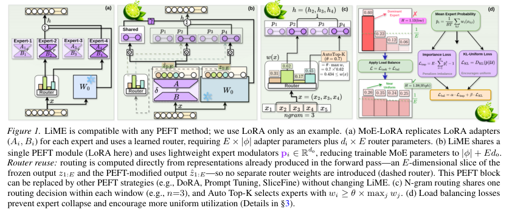
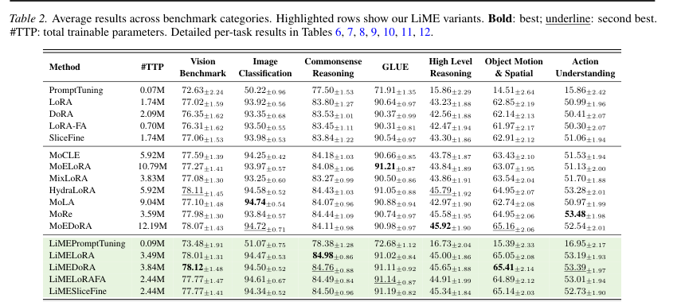
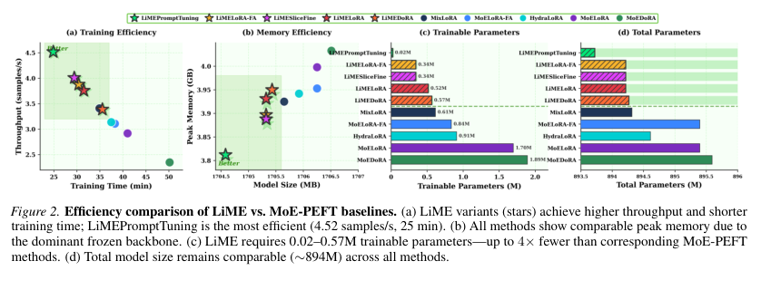

# LiME：Lightweight Mixture of Experts for Efficient Multimodal Multi-task Learning 精读分析

> [!info] 文档关系
> - 文档类型：Paper
> - 领域入口：[README](../README.md)
> - 上位汇总：[ICML 2026 selected papers](../surveys/icml-2026-selected-papers.md)
> - 证据资产：[`../assets/papers/lime/`](../assets/papers/lime/)
> - 相关文档：[Figure inventory](../evidence/figure-inventory.md#lime)

> 资料状态：精确的 arXiv:2604.02338v1 PDF 已获取并校验（50 页，SHA-256 `c3eb10d4a1cde30c9a73c6029dd51f2bc49064762287f0b6c593623fe330c738`）；文本由 PyMuPDF/Poppler 辅助脚本提取。图 1、表 2、图 2 是 PDF 截图紧裁，已逐图 QA。LaTeX source 下载在有界尝试后仍为损坏 partial，未用于结论。论文为 2026-02-01 arXiv 预印本，未证明已被 ICML 2026 接收。

## 修订信息

- 当前文档版本：`1.1.0`
- 当前修订 ID：`rev-lime-problem-solution-20260725`
- 当前修订时间：`2026-07-25T10:05:32+08:00`
- 替代版本：`rev-lime-initial` / `1.0.0` / manifest `82016b244a1fa626a9a83e3b2387bc0e546d267e059449dd589b77e915f2b825`

| 修订 ID | 文档版本 | 时间 | 修订者 | 类型 | 替代修订 | 变更摘要 | 原因 | 影响位置 | 依据 | 对结论影响 |
|---|---|---|---|---|---|---|---|---|---|---|
| `rev-lime-initial` | `1.0.0` | 2026-07-17T10:00:00+08:00 | `review_lime` | `initial` | 无 | 新建单篇精读、证据矩阵与图表 inventory | 用户委派 ICML 2026 精读 | 全文 | arXiv v1 PDF、提取文本、图表 QA | 无 |
| `rev-lime-problem-solution-20260725` | `1.1.0` | 2026-07-25T10:05:32+08:00 | `/root` | `content-update` | `rev-lime-initial` / `1.0.0` / `82016b244a1fa626a9a83e3b2387bc0e546d267e059449dd589b77e915f2b825` | 新增轻量 MoE-PEFT 的问题—方案—优化—证据闭环 | 统一回写既有 Paper 报告 | `研究动机与问题—方案闭环` | Figure 1/2、Table 2 与既有消融 | minor：不改变主结论，补充系统边界 |

## 0. 资料与配图索引

- 论文：[arXiv:2604.02338v1](https://arxiv.org/abs/2604.02338v1)，提交 2026-02-01，正文标注 preprint April 6, 2026。
- LaTeX source 下载为未完成 gzip partial，未使用；失败原因见限制。
- 候选代码仓：[vk032503/lime-lightweight-mixture-of-experts](https://github.com/vk032503/lime-lightweight-mixture-of-experts)；无可验证 commit，因此实现结论均标为未验证。
- OpenReview 不可用；正式图表与 QA 见[Figure inventory](../evidence/figure-inventory.md#lime)。
- AI 生成分析示意图：跳过。委派合同指定当前 CLI 只支持 `generate`/`edit`，不支持必需的 required document-input path，不能以 prompt-only 图替代。

## 0.1 术语与符号解释

### 0.1.1 术语表

| 术语 | 本文含义 | 别名 | 不等于/易混项 | 证据来源 |
|---|---|---|---|---|
| LiME | 用共享 PEFT 更新加专家逐元素缩放向量的 MoE-PEFT 框架 | Lightweight Mixture of Experts | 不是复制 E 个完整 adapter 的 MoE-PEFT | §3、图1 |
| shared PEFT | 每层只有一份可训练 PEFT 参数，在所有专家间共享 | shared adapter/module | 不是 shared expert；专家差异来自调制向量 | §3、图1 |
| expert modulator | 每专家的 `p_i∈R^{d_o}`，对 PEFT 输出逐元素缩放 | lightweight expert vector | 不是独立 adapter；不改变冻结 backbone | Eq. (1)、§3 |
| zero-parameter routing | 由已有冻结输出与 PEFT 输出切片计算路由，不引入 `W_r` | router reuse | 不是无计算；仍要归一化、softmax 和选专家 | Eq. (3)、图1 |
| n-gram windowed routing | 窗口内 token 共享一次专家选择；因果模型用窗口末 token | window routing | 不等于每 token 独立路由 | §3、Theorem 3 |
| Auto Top-K | 相对阈值 `w_i≥θ max_j w_j` 的自适应专家集合 | relative-threshold selection | 不等于固定 Top-K；激活数随置信度变化 | Eq. (4)、图2/5 |
| MMT-47 | 47 个测试集、文本/图像/视频五类的联合训练混合 | multimodal multi-task benchmark | 不是单一均衡数据集；类别样本量明显不平衡 | §4、Appendix L/Table 21 |
| MoE-PEFT baseline | 复制 adapter 并配 learned router 的比较方法（MoELoRA、MoEDoRA 等） | expert-specific PEFT | 不是标准单 adapter PEFT | Table 1/2 |
| load balancing | importance loss 与 KL-uniform loss 的辅助正则 | expert-utilization regularization | 过强时会压制真实任务 specialization | Eq. (5)、Figure 5/9 |
| routing temperature | softmax 温度 `τ`，控制路由分布尖锐度 | `τ` | 不等于训练学习率 | Eq. (3)、Table 20、§F.7 |

### 0.1.2 符号表

| 符号 | 含义 | 性质 | 作用域/索引 | 单位/取值 | 来源 | 易混点 |
|---|---|---|---|---|---|---|
| `Θ` | 冻结 backbone 参数 | author-defined | 全模型 | 参数集合 | §2 | 不含 PEFT |
| `ϕ` | 单个 PEFT 模块参数 | author-defined | 每层/共享 | 参数个数 `|ϕ|` | §2-3 | MoE baseline 用 `E|ϕ|` |
| `W_0` | 冻结线性层权重 | author-defined | 单层 | `R^{d_o×d_i}` | §2-3 | 不是 router |
| `x` | 层输入 | author-defined | token/窗口 | `R^{d_i}` | §2-3 | 多模态输入先经 backbone |
| `z=W_0x` | 冻结输出 | author-defined | token/层 | `R^{d_o}` | Eq. (1) | 路由信号之一 |
| `\hat z=δ(x)` | PEFT 更新输出 | author-defined | token/层 | `R^{d_o}` | Eq. (1) | 文中 `ẑ` 与 adapter 输出同义 |
| `p_i` | 第 `i` 个专家调制向量 | author-defined | expert `i`/层 | `R^{d_o}`，float32 配置 | Eq. (1)、Table 20 | 不是独立 adapter |
| `P(x)` | 加权调制向量 `Σ_iw_i p_i` | author-defined | token/窗口 | `R^{d_o}` | Eq. (1) | 选后使用重归一化 `\tilde w` |
| `w(x)` | E 专家路由概率 | author-defined | token/窗口 | `Δ^{E-1}` | Eq. (3) | 非 learned router 输出 |
| `E` | 专家数 | author-defined | 每层 | 默认 4；消融 1-10 | Table 1/20、Figure 5d | 与期望符号无关 |
| `d_i,d_o,d` | 层输入维度、输出维度、hidden dimension | author-defined | 每层 | 维度整数 | Table 1、§3 | `d` 与 `d_o` 可能不同 |
| `γ_r` | 冻结/PEFT 路由信号混合系数 | author-defined | 每路由决策 | `[0,1]`，默认 0.7 | Eq. (3)、Figure 4c-d | 不同于共享 modulator 的 `γ` |
| `τ` | 路由 softmax 温度 | author-defined | 每路由决策 | `>0`，默认 0.5 | Eq. (3)、Table 20 |
| `θ` | Auto Top-K 相对阈值 | author-defined | 每路由决策 | `(0,1]`，默认 0.7 | Eq. (4)、Table 20 |
| `n` | n-gram 窗口大小 | author-defined | 序列 | 默认 3 token | §3、Table 20 |
| `α,β` | importance/KL balance 系数 | author-defined | 训练全局 | 0.1/0.01 | Eq. (5)、Table 20 | `α` 也常用于 LoRA scaling，本文上下文不同 |
| `L` | 使用 LiME 的层数 | author-defined | 模型 | 层数整数 | 参数量公式 |
| `R*` | 最优风险 | author-defined | 理论比较 | 风险标量 | Theorem 2 | 论文未给具体 loss 实例 |
| `I(Y;Z)` | 目标与模型输出互信息 | author-defined | 理论 | 信息量 | Theorem 1/3 | 理论假设强于实验 setting |
| `#TTP` | total trainable parameters | code/report-defined | 方法/全模型 | M 参数 | Table 2/Figure 2 | 与总模型大小不同 |
| `B,T` | batch size、序列 token 数 | author-defined | loss batch | 正整数 | §3 Eq. (5) | Table 20 实际 batch/梯度累积另列 |

## 0.2 AI 生成算法分析示意图

跳过：父合同明确记录 CLI 不具备 required document-input path 文档输入路径；不生成 prompt-only 图片。

## 1. 论文基本信息

- 研究领域：多模态多任务学习、参数高效微调（PEFT）、稀疏/混合专家。
- 核心问题：MoE-PEFT 为每个专家复制 adapter，并为每层增加 learned router，参数随专家数线性增长，且通常只适配 LoRA。
- 研究目标：以共享 PEFT + 低维专家调制向量实现任务/输入 specialization，零新增 router 参数，并兼容 LoRA、DoRA、LoRA-FA、SliceFine、Prompt Tuning。
- 关键约束/假设：冻结 backbone；`E≪d` 的 representation slice 足够路由；共享 PEFT 输出可经逐元素缩放逼近专家专属 adapter；因果窗口末 token 信息量不低于更早 token；数据和训练预算有限。
- venue 判断：arXiv 元数据只显示 cs.LG 预印本；没有可验证的 ICML acceptance/decision 元数据，不能把候选列表当作接收事实。

## 1.1 研究动机与问题—方案闭环

### 1.1.1 出发点与背景痛点

LiME 从多模态多任务 PEFT 的扩展成本出发：传统 MoE-PEFT 往往为每个 expert 复制一套 adapter，并在多层设置 learned router。专家数增加时，可训练参数、优化状态和路由开销近似线性增长，削弱了 PEFT 原本的轻量目标；许多设计又只适用于 LoRA，难以复用到其他 PEFT 家族。

### 1.1.2 现有方案为何不够

现有方案把“专家专门化”与“完整 PEFT 参数复制”绑定，根因是 expert identity 直接落在高维权重增量上；learned router 又为每层引入额外参数和输入相关计算。简单减少 expert 会损失任务分工，完整复制则放大参数和训练成本。论文据此把问题改写为：是否只学习低维调制信号，就能让一个共享 PEFT 模块表现出多个专家。

### 1.1.3 计划解决的问题与成功标准

- 核心问题：在不复制完整 adapter、不增加 learned router 参数的情况下保留任务/输入 specialization。
- 约束：兼容多类 PEFT；训练参数与 expert 数增长应显著慢于 MoE-PEFT。
- 成功标准：多任务平均指标不低于强 PEFT/MoE-PEFT 基线，同时降低 trainable parameters、训练时间或吞吐成本。
- 边界：峰值显存仍可能由冻结 backbone 主导；真实 serving 的 expert load、尾延迟和通信未被测量。

### 1.1.4 核心方案如何解决并优化问题

| 原始问题/失败模式 | 根因或约束 | 对应设计 | 改变的变量/系统行为 | 作用机制 | 预期优化 | 证据与判断 |
|---|---|---|---|---|---|---|
| 每个 expert 复制 adapter | 专门化编码在高维 PEFT 权重中 | shared PEFT + lightweight modulators | expert-specific 参数从矩阵变为低维向量 | 调制共享更新而非复制完整模块 | trainable parameters、训练效率 | Figure 1/2、参数表；supported |
| learned router 增参并增加计算 | 每层路由需要额外网络 | representation-reuse routing | 路由信号复用已有表示 | 以零新增 router 参数产生选择分数 | 参数与吞吐 | Figure 1、效率实验；部分支持 |
| 固定 top-k 难适应样本难度 | 专家需求随输入变化 | Auto Top-K / n-gram routing | 每个输入激活专家数量与粒度 | 按表示或局部模式调整激活 | 质量—计算折中 | 消融/敏感性支持程度依设置 |
| 多 expert 可能负载塌缩 | 路由偏向少数专家 | load balancing | 专家使用分布 | 约束分配避免专家闲置 | 稳定性与容量利用 | 有训练设计；缺线上 telemetry |

### 1.1.5 完整因果链与证据闭环

MoE-PEFT 随 expert 数复制高维 adapter 并叠加 learned routers → 根因是专门化和路由都通过新增参数实现 → LiME 将可共享的 PEFT 主体与低维 expert modulation 解耦，并复用模型表示完成路由 → 改变的是每个 expert 的参数规模、激活选择和共享计算比例 → 预期在保持多任务专门化的同时降低可训练参数与训练成本。Table 2 和 Figure 2 支持质量与参数/训练效率收益；但峰值显存受 backbone 支配，路由的实际负载均衡、通信和在线尾延迟没有测量，因此系统优化结论不能外推为所有 serving 场景的等比例加速。

## 2. 核心贡献与创新点

1. **轻量专家**：每层从 `E|ϕ|` 复制 adapter 改为 `|ϕ|+E d_o` 调制参数（Eq. (1)、参数量式、图 1）。
2. **零参数路由**：利用 `z` 与 `\hat z` 的 E 维切片计算 softmax，移除 `d×E` learned router（Eq. (3)、Figure 4b）。
3. **实用路由策略**：n-gram 共享决策、Auto Top-K 相对阈值、importance+KL 平衡损失（Eq. (4-5)、Figures 1/5）。
4. **理论主张**：加入专家在理想条件下保持互信息（Theorem 1）；调制逼近专家专属 PEFT 的风险差为 `O(ε̄)`（Theorem 2）；因果窗口末位置信息量最大（Theorem 3）。
5. **多模态评测**：MMT-47 158,613 训练样本、47 测试集，覆盖文本、图像、视频，报告 5 seeds。

## 3. 研究方法

### 3.1 问题到方案的逻辑链

复制 adapter/learned router -> 参数、显存和路由开销随 `E` 增长且绑定 LoRA -> 共享 PEFT 产生通用更新，专家向量逐元素重标定 -> 复用已有表示切片产生路由 -> Auto Top-K 在置信度高时少激活、低时多激活，n-gram 降低逐 token 决策噪声 -> 在冻结 backbone 主导的总显存下减少 trainable 参数并提升训练吞吐。

### 3.2 设计动机与具体问题映射

| 设计项 | why 状态 | 针对问题 | 因果机制 | 替代/权衡 | 验证与判断 |
|---|---|---|---|---|---|
| 共享 PEFT + `p_i` 调制 | author-stated（§1、§3） | `E|ϕ|` 参数爆炸、PEFT 架构依赖 | 共享 `δ(x)` 学全数据，`p_i` 只重标定特征 | 独立 adapter 表达力强但参数/数据分裂；共享可能限制非缩放差异 | Table 2、CKA 0.935；支持但未证明所有任务都可逼近 |
| 零参数路由 | author-stated（§1、§3） | 每层 `d×E` router 参数和计算 | `z` 提供通用语义，`ẑ` 提供任务修正；softmax slice 直接复用 forward 中间量 | learned router 更可训练；slice 可能丢信息 | Figure 4a-b、后者与 learned routing 相当；部分支持 |
| `γ_r` 双信号混合 | author-stated/inferred | 仅冻结或仅 PEFT 信号都不充分 | 归一化后线性混合保留通用与任务信息 | 增加超参，需跨模型调参 | Figure 4c-d 最优约 0.6-0.8；受控但模型规模有限 |
| n-gram 窗口/末 token | author-stated（Theorem 3） | token 路由噪声与决策数 | 因果注意力使窗口末 token 聚合上下文 | mean/max/attention pooling 可更灵活但成本高 | Figure 3a-b probe 51-57% -> 80-90%；间接机制证据 |
| Auto Top-K | author-stated（§3） | fixed-k 在尖锐分布浪费、平坦分布丢组合 | 相对阈值按置信度调激活数 | top-1 更省算力，fixed-k 更可预测 | Figure 5a/Appendix F.3；支持趋势但未报告真实 kernel latency |
| balance losses | author-stated（§3/§4.1） | expert collapse | importance 与 KL 使利用率更均匀 | 过度均衡压制自然 specialization | Figure 5b-c、9；支持非单调 trade-off |
| `E=4` 默认 | author-stated/empirical | 参数/数据/表达力平衡 | 中等 E 获得更多分区而不致每专家欠训练 | E>6 训练样本不足 | Figure 5d/F.4；支持有限数据 setting |

### 3.3 模型/系统架构

对冻结线性层 `W_0`，先算 `z=W_0x` 与共享 PEFT 更新 `\hat z=δ(x)`，再依据 Eq. (3) 得到 `w(x)`。专家调制为 `P(x)=Σ_i w_i p_i`，输出为：

$$h=z+\hat z\odot P(x).$$

可选共享调制器为 $h=z+\hat z\odot P(x)+\gamma(\hat z\odot p_s)$。Auto Top-K 选择 $S_\theta(x)=\{i:w_i\ge\theta\max_j w_j\}$，随后对选中权重重归一化。论文称支持任意 PEFT，但实际主实验只实例化 LoRA、DoRA、LoRA-FA、SliceFine 和 Prompt Tuning。

### 3.4 关键公式

路由公式（Eq. 3）：

$$w(x)=\operatorname{softmax}\left(\frac{(1-γ_r)\tilde z_{1:E}+γ_r\tilde{\hat z}_{1:E}}{τ}\right),\quad \tilde z=\frac{z}{\|z\|_\infty}.$$

训练目标（Eq. 5）：

$$\mathcal L=\mathcal L_{task}+α\mathcal L_{imp}+β\mathcal L_{KL},$$

其中 `p̄_i=(BT)^{-1}Σ_{b,t}w_i(x_{b,t})`，`L_imp=EΣ_i p̄_i^2-1`，`L_KL=D_KL(p̄\|U)`。论文没有给出每个 benchmark 的 task loss 实现；Appendix K 说明以文本生成统一格式训练，46 个数据集用 accuracy，STS-B 用 Pearson。

参数量（每层 LiME）：

$$|ϕ_{LiME}|=L(|ϕ|+E d_o+d_o+1),\qquad |ϕ_{MoE-PEFT}|=L E|ϕ|.$$

这是结构计数，不等于实测训练显存；Figure 2b 显示冻结 backbone 主导 peak memory。

### 3.5 训练/实验/部署设计

主模型为 LLaVA-OneVision-Qwen2-7B，另用 Molmo2-8B 做泛化。MMT-47 训练 158,613 样本、47 测试集共 70,392 样本；3 epochs、5 seeds（42/123/456/789/1024），默认 E=4、n=3、θ=0.7、`γ_r=0.7`。Table 20 给出 4×H100 80GB、AdamW 8-bit、base bf16、PEFT/modulator float32、LoRA rank 2、最大序列 2048、图像 384×384、视频 8 帧。效率对比另在单 H100、batch 2、梯度累积 2、GLUE 1 epoch。数据类别不平衡被保留，任务/模态标签不输入模型；这是考验无显式 task identifier 路由的设定，但也使类别均值可能受样本分布影响。

## 4. 关键结论

### 4.1 主结果

图 1 展示了复制 adapter/learned router 与共享 PEFT/调制器/复用路由的结构差异。Table 2 中 LiME 结果为：LiMELoRA 在 commonsense 84.98、LiMEDoRA 在 vision 78.12 与 object-motion 65.41，LiMELoRAFA/ LiMESliceFine 在 GLUE 91.14/91.19；这些并非所有列最优（例如 MoRe 的 action understanding 53.48、MoEDoRA 的 object-motion 65.16 接近）。与对应 MoE-PEFT 的“4× fewer”需谨慎：正文 efficiency 段使用的 LiMELoRA 0.52M vs MoELoRA 1.97M、LiMEDoRA 0.57M vs MoEDoRA 2.16M，而 Table 2 的 `#TTP` 是全层/全模型 3.49M vs 10.79M、3.84M vs 12.19M；两组口径不同，应分别引用。

### 4.2 消融和机制证据

| 技术点 | 对应证据 | 对照 | 证据强度 | 判断 |
|---|---|---|---|---|
| 共享调制替代复制 adapter | Table 2、CKA Table 3 | 同类 MoE-PEFT，但容量/实现仍有差异 | replacement + indirect CKA | 结果支持，逼近定理未被严格风险实验验证 |
| 零参数 routing | Figure 4b | zero-param vs learned router | matched ablation（论文称相当） | 支持，缺少跨规模/负载 latency |
| 双信号 `γ_r` | Figure 4c-d | 扫描 `[0,1]` | sensitivity | 支持最佳区间，泛化有限 |
| Auto Top-K | Figure 5a、Appendix F.3/Table 5 | fixed Top-K | direct ablation | 支持准确率趋势；动态激活的实际吞吐未单独测量 |
| n-gram/末 token | Figure 3a-b、Figure 7 | pooling/window 扫描 | mechanism visualization + sensitivity | 支持 representation probe，不等于端到端收益隔离 |
| load balancing | Figure 5b-c、9 | 系数与 entropy/utilization | sensitivity/mechanism | 支持 collapse trade-off |
| expert scaling / Theorem 1 | Figure 3c-d、5d | E=1..10 | indirect scaling | “互信息保持”理论与有限数据准确率不是同一命题；结论应降格为趋势 |
| 任意 PEFT 兼容 | Table 2 多 PEFT 变体 | 不同 PEFT | replacement baseline | 只验证五种方法，不能外推到未测 PEFT |

### 4.3 是否验证了假设

表示复用假设有 Figure 4a-b 和 CKA 支持；共享 PEFT 可替代专家 adapter 有性能与表示相似度的间接支持。Theorem 1 的互信息不等式依赖理想可行分区，实验只测 GLUE accuracy，不能视为定理的实证证明。Theorem 3 的末 token 结论使用线性 probe 和两层 GLUE 图，支持因果信息随位置增加的直觉，但不覆盖双向编码器、视觉 token 或所有层。有限数据下 E>6 下降反而说明容量提升受训练数据/路由利用率约束。

### 4.4 收益来源归因

| 组件 | 对比 | 影响 | 证据 |
|---|---|---|---|
| 共享 PEFT + 调制向量 | LiME vs MoE-LoRA/DoRA | 主要减少 trainable 参数，保持 accuracy | Table 2、CKA；容量与实现仍可能混杂 |
| 零参数路由 | Figure 4b learned router | 减少 router 参数；准确率相当 | 受控 ablation；无 kernel-level latency |
| Auto Top-K | fixed Top-K | 可能减少激活专家/计算并改善 accuracy | accuracy 消融；吞吐效果未独立测 |
| n-gram | token-level | 降低路由决策数、提高局部一致性 | probe/窗口实验；未拆分 runtime |
| balance losses | coefficient 0 vs moderate | 防 collapse、改变 expert utilization | entropy/accuracy 联合图；过强会伤害 specialization |

因此，“29% faster training”主要是整套 LiME 与 MoEDoRA 的系统级对比，不能归因给 Auto Top-K 或某个 kernel；论文没有报告同硬件下逐组件 runtime ablation。

## 5. 相关工作比较

Table 1 将 MoCLE、MoELoRA、MixLoRA、HydraLoRA、MoLA、MoRe 等按 expert selection、routing granularity、router params、PEFT compatibility、shared expert/PEFT、expert params 和 load balance 比较。LiME 的实质差异是把完整 expert adapter 换成 `E d_o` 向量，并且 router params=0；HydraLoRA 也部分共享 LoRA，但仍有 `d_iE` router 且只 LoRA。传统 MoE-PEFT 的优势是每专家表达力更强，代价是参数和每专家样本减少。LiME 的公平性优点是同一 MMT-47 数据和 seeds；局限是不同 baseline 的实现、层选择与参数口径未在代码 snapshot 中核验，且部分对比为作者复现而非统一官方实现。

## 6. OpenReview 交叉核验

公开 OpenReview forum、review、meta-review、decision、rebuttal 未获取（DNS 失败）。因此不存在可交叉核验的 reviewer claim，不应把“ICML 2026 candidate”视为接收结果。

## 7. Infra 需求分析

### 7.1 算力

Paper-reported：训练主实验 4×H100 80GB，效率实验单 H100；base bf16、PEFT/modulator float32，AdamW 8-bit。每个 LiME 层需一次共享 PEFT 计算、E 维切片归一化/softmax、Auto Top-K 和调制乘加。粗略前向额外计算近似 `O(E d_o + E)`/token（不含选择后实际专家执行，因为专家是向量调制而非 E 个完整 FFN），而传统 MoE-PEFT 需 E 个 adapter 分支。

### 7.2 显存与存储

参数显存计数为 `|ϕ|+E d_o+d_o+1`/层；Table 20 的 base bf16、PEFT/modulator float32 使调制器每参数 4 bytes，PEFT 另按实现计。Figure 2b 显示 peak memory 约 3.8–4.0 GB 且方法相近，说明冻结 backbone/视觉输入占主导。总模型尺寸约 894M（Figure 2d），而 trainable 参数仅 0.02–0.57M（图注口径）或 Table 2 全层口径 0.09–3.84M；必须标注口径。

### 7.3 Data Types / 数值格式

| 对象 | 格式 | 阶段 | 依赖 | 证据 |
|---|---|---|---|---|
| backbone weights | bf16 | train/infer | H100 tensor core 优势 | Table 20 |
| PEFT parameters | float32 | train | 显存/带宽开销较 bf16 高 | Table 20 |
| `p_i,p_s,γ` | float32 | train/infer modulation | 需要 bf16/fp32 混合累加与转换 | Table 20 |
| optimizer states | AdamW 8-bit | train | 8-bit optimizer implementation 未给 repo | Table 20 |

论文没有报告 fp8/int8 activation、量化 kernel、累加精度或 layout transform；不能把 29% 加速归因于量化。

### 7.4 带宽、互联与有效利用

论文没有提供 kernel runtime、bytes moved 或 HBM/PCIe/NVLink telemetry，因此无法计算实测 `EffectiveBandwidth=BytesMoved/Runtime`。可作结构判断：共享 PEFT 避免 E 份 adapter 权重读取；`p_i` 与 `ẑ` 的逐元素乘法是本地 HBM 访问，路由切片和 softmax 计算量很小，可能 memory-bound 而不是 compute-bound。4×H100 训练的跨卡通信（data parallel all-reduce）未报告，不能推断 NVLink/RDMA 利用率。动态 Auto Top-K 只改变向量调制集合，不等同于稀疏大算子 dispatch。

### 7.5 CPU/GPU/NPU 异构执行

论文只验证 NVIDIA H100 GPU；CPU 数据加载、视频解码、host-device transfer、pinned memory、异步 copy、NPU fallback、scheduler placement 均未报告。多模态输入（384×384 图像、8 帧视频）可能使 CPU preprocessing 和 PCIe 传输成为端到端瓶颈；Figure 2 的训练时间只代表作者 batch/并行 setting，不能外推异构部署。

### 7.6 调度/Serving/自定义算子

默认 Auto Top-K `θ=.7`、E=4，推理时 jitter noise 关闭；评测 batch=6、greedy、最多 50 new tokens。未提供 fused modulation、CUDA graph、KV-cache 或 serving scheduler 实现。部署复现至少需要冻结 LLaVA/Molmo checkpoint、PEFT 实现、MMT-47 数据整理、4×H100 配置和自定义路由代码；这些在当前 snapshot 中未验证。

## 8. 开源代码对照

- 仓库候选：`https://github.com/vk032503/lime-lightweight-mixture-of-experts`（GitHub API 搜索结果，描述与论文标题匹配）。
- commit：未验证。浅克隆目录仅生成 `.git` 元数据，没有可读工作树，网络/DNS 后续请求失败；不能声称实现了论文机制。
- 因此模型结构、loss、数据管线、评测和 serving 均归类为 paper-only；checkpoint/config 元数据未验证。论文 Table 20 的配置是报告值，不是代码交叉证据。

## 9. 优点与局限

### 优点

- 将核心参数增长从 `E|ϕ|` 改为 `|ϕ|+E d_o`，并明确给出公式和多种 PEFT 实例。
- Figure 4/5、Appendix F 提供较完整的路由、温度、窗口、专家数和平衡系数敏感性。
- MMT-47 同时覆盖文本、图像、视频，且不输入 task/modality id，能检验路由泛化。
- 结果报告 5 seeds、均值和标准差，效率图同时展示训练时间、throughput、peak memory、trainable/total size。

### 局限

- 理论定理与实验指标之间存在鸿沟：互信息和 risk bound 没有可复现实验估计，CKA 不是风险界验证。
- “29% faster”是整套系统对比；Auto Top-K、n-gram、zero-router 的 runtime 贡献未拆分，且没有 kernel/带宽 telemetry。
- 论文声称任意 PEFT，但仅测试五种方法；未测试不同 backbone、层数、专家规模和更大/更稀疏部署。
- MMT-47 的数据构造、统一 prompt、采样和类别不平衡可能影响跨类别平均；没有与均衡采样或 task-aware baseline 的对照。
- 正式代码、checkpoint、OpenReview 评审和 source archive 在本次受限环境中不可验证。

### 可改进之处

1. 在同一 backbone/层/训练预算下做 component-only runtime ablation，并报告 HBM bytes、GPU utilization、跨卡通信。
2. 用 matched expert-specific PEFT 估计真实 risk/accuracy gap，补充 `ε̄` 与 CKA 的关系。
3. 提供公开 commit、config、数据生成脚本和 checkpoint hash，拆分容量、算法、runtime 三类变化。
4. 对类别均衡、任务数量、E、`d_o` 和不同模态做 scaling/sensitivity；报告每任务而非只报告类别均值。

## 10. 研究启发

- 可借鉴：把共享高容量表示与低维可学习调制分离，在多任务 PEFT 中实现成本可控的 specialization。
- 可延伸：用可学习/结构化 slice 选择替代固定前 E 维；将 Auto Top-K 与真实稀疏 kernel、cache layout 联合优化。
- 可复现实验：先用 LLaVA 0.5B 的 GLUE/E 扫描复现 Figure 3-5，再扩展到 MMT-47；必须固定 5 seeds、`γ_r=.7,τ=.5,θ=.7,n=3` 并核对 Table 20。

## 11. 解读问题/待验证清单

1. Theorem 1 的“互信息保持”在有限样本、load balance 和共享 adapter 约束下是否仍成立？
2. Table 2 的 `#TTP` 与 Figure 2 图注的 0.02–0.57M 为何口径不同，是否包含不同层/模块？
3. Auto Top-K 实际平均激活专家数是多少，是否改变 H100 kernel occupancy？
4. zero-parameter routing 与 learned router 是否严格匹配相同参数预算、层数和初始化？
5. MMT-47 的统一文本生成模板和 STS-B 离散化是否影响与原始 benchmark 的可比性？
6. shared modulator `p_s,γ` 在所有层启用是否必要，是否与 expert vectors 形成冗余？
7. 公开代码能否重现 Figure 2 的单 H100 25–50 min 时间及 4× 参数差异？
8. 视觉/视频 token 的窗口末 token 是否仍比 mean pooling 信息量高，还是 Figure 3 只适用于 causal text？

## 12. 一句话总结

LiME 用共享 PEFT 加低维专家调制和表示复用路由，在多模态多任务设置下以较少 trainable 参数取得接近/部分超过 MoE-PEFT 的结果。最大不确定性是理论保证、动态路由的真实系统收益与代码可复现性尚未被独立证据充分支撑。
