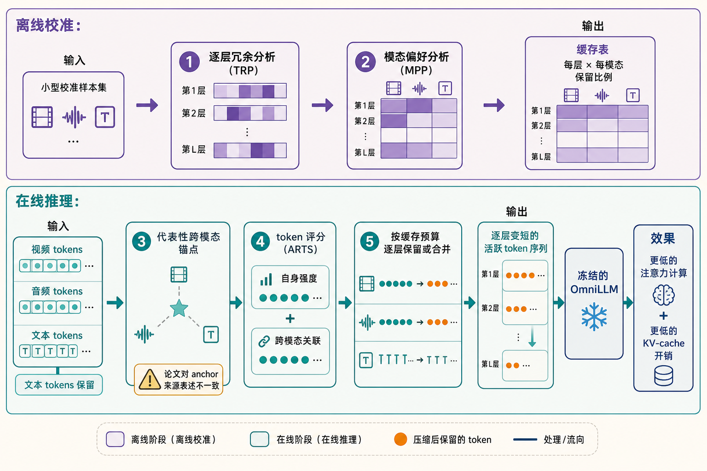

# OmniFit: Bridging Modalities via Layer-Adaptive Token Compression for Omnimodal Large Language Models 精读分析

> [!info] 文档关系
> - 文档类型：Paper（最终版 PDF 深度审阅）
> - 领域入口：[README](../README.md)
> - 上位汇总：[ICML 2026 selected papers](../surveys/icml-2026-selected-papers.md)
> - 证据资产：[assets/papers/omnifit-layer-compression](../assets/papers/omnifit-layer-compression/)
> - 相关文档：[Paper index](../evidence/paper-index.md)，[Figure inventory](../evidence/figure-inventory.md#omnifit)

> 资料状态：已逐页核验 22 页 ICML 2026 / PMLR 306 最终版 PDF。4 个正式图表均来自 200 DPI PDF crop，保留完整 caption 并通过 contact sheet 与原分辨率逐图 QA。LaTeX/source、官方代码/config/checkpoint 及 OpenReview 公开评审仍不可得。

## 修订信息

- 当前文档版本：`1.6.0`
- 当前修订 ID：`rev-omnifit-readable-projection-20260727`
- 当前修订时间：`2026-07-27T23:55:00+08:00`
- 替代版本：`rev-omnifit-schema-projection-20260727` / `1.5.0`

| 修订 ID | 版本 | 时间 | 类型 | 替代修订 | 摘要 | 结论影响 |
|---|---|---|---|---|---|---|
| `rev-omnifit-initial` | `1.0.0` | 2026-07-17 | initial | 无 | 建立 blocked 交付 | material |
| `rev-omnifit-openreview-refresh` | `1.1.0` | 2026-07-24 | evidence-update | `rev-omnifit-initial` | 恢复 OpenReview/ICML 身份 | material |
| `rev-omnifit-problem-solution-20260725` | `1.2.0` | 2026-07-25 | content-update | `rev-omnifit-openreview-refresh` | 建立题名级问题—方案边界 | minor |
| `rev-omnifit-abstract-promotion-20260725` | `1.3.0` | 2026-07-25 | evidence-promotion | `rev-omnifit-problem-solution-20260725` | 提升官方摘要与 headline claims | material |
| `rev-omnifit-final-pdf-promotion-20260727` | `1.4.0` | 2026-07-27 | evidence-promotion | `rev-omnifit-abstract-promotion-20260725` | 提升 最终版 PDF、公式、系统结果与 4 个 QA 资产 | material |
| `rev-omnifit-schema-projection-20260727` | `1.5.0` | 2026-07-27 | mixed | `rev-omnifit-final-pdf-promotion-20260727` | 补齐标准 claim/evidence/rationale/Infra 结构并纠正 anchor/score/merge 边界 | material |
| `rev-omnifit-readable-projection-20260727` | `1.6.0` | 2026-07-27 | mixed | `rev-omnifit-schema-projection-20260727` | 补公式解释卡、三类失败场景、口语化表述和离线/在线算法解释图 | material：不改变论文数字，提高可读性并强化冲突边界 |

## 0. 资料与配图索引

- 官方页面：<https://icml.cc/virtual/2026/poster/65962>
- OpenReview：<https://openreview.net/forum?id=8RY20mLzup>；reviews/decision/rebuttal 因 challenge 不可读。
- LaTeX/source、代码/config/checkpoint：不可得。
- Figure 6：[OmniFit overview](../assets/papers/omnifit-layer-compression/fig6-omnifit-overview-caption.png)。
- Table 1：[main results](../assets/papers/omnifit-layer-compression/table1-main-results-caption.png)。
- Figure 8：[inference speed](../assets/papers/omnifit-layer-compression/fig8-inference-speed-caption.png)。
- Table 5：[component ablation](../assets/papers/omnifit-layer-compression/table5-component-ablation-caption.png)。
- AI 生成解释图：[算法总体示意图](../assets/papers/omnifit-layer-compression/algorithm-overview-explainer.png)；仅帮助理解，不作为论文证据。

## 0.1 术语与符号解释

阅读约定：保留 `LAHP`、`ARTS`、`anchor`、`retention`、`TTFT/TPOT` 等名称，是因为它们是论文定义或系统领域常用术语；首次出现时均给出普通语言解释。其他审阅内部缩写改成直接描述“有什么证据、缺什么证据”。

### 0.1.1 术语表

| 术语                    | 本文含义                                                    | 别名                                     | 不等于/易混项                                                                   | 证据                        |
| --------------------- | ------------------------------------------------------- | -------------------------------------- | ------------------------------------------------------------------------- | ------------------------- |
| OmniFit | 离线安排预算、在线选择 token 的免训练压缩框架 | 无 | 免训练不等于免校准，也不等于没有额外开销 | Abstract、§5、Figure 6 |
| LAHP | 根据每层冗余和模态偏好，决定“每层、每模态保留多少” | Layer-Adaptive Heterogeneity Profiling | 不是在线更新模型参数 | §5.1、Algorithm 1 |
| TRP | 用隐藏状态的 SVD 和有效秩估计每层冗余 | Token Redundancy Profiling | 低秩只是间接指标，不等于真正的任务信息量 | Eq. 3–5 |
| MPP | 按 token 数归一注意力，再估计每层更偏向哪个模态 | Modality Preference Profiling | 不是在线推理时可直接读取的完整 attention map | Eq. 6–7 |
| ARTS | 综合 token 自身强度和跨模态相关性，决定“具体保留哪些” | Alignment-Rectified Token Selection | 不是只按 attention map 剪枝 | Eq. 8 |
| DPC-KNN anchors | 从一个模态中选少量代表 token，供另一模态计算相关性 | anchors | Appendix D.2 称在训练集上预计算，Algorithm 2/I 又称按当前输入生成，内部冲突 | §3、Algorithm 2、Appendix I |
| global/static scoring | 编码后只算一次 $S_i$，后续层复用 | once selection | 不是每层重新打分 | Appendix C.3、H |
| progressive retention | token 保留率随层深入逐步变化 | layer-adaptive budget | 不是每层互不相关地单独搜索预算 | Eq. 4 |
| token merging | 把待删除 token 的信息加权合并到保留 token | soft aggregation | Algorithm 2 主伪代码更像直接删除 | Appendix G/I |
| TTFT/TPOT | 首 token 延迟 / 后续每个输出 token 的延迟 | 延迟指标 | 不等于总吞吐，也不等于 p95/p99 尾延迟 | Figure 8 |

### 0.1.2 符号表

| 符号 | 含义 | 性质 | 作用域/单位 | 来源 | 易混点 |
|---|---|---|---|---|---|
| $h_i$ | token 表示 | 论文定义 | $d$-vector | Eq. 1–2 | Algorithm 2 中来自 $H_m^{(0)}$ |
| $\rho_i,\delta_i$ | DPC density/min distance | 论文定义 | per token | Eq. 1–2 | 不等于 $\rho_m^{(l)}$、energy $\delta$ |
| $X^{(l)},N,d,L$ | layer states、token、hidden、layers | 论文定义 | $\mathbb R^{N\times d}$/counts | §5.1 | $N$ 可逐层变 |
| $\sigma_i,k_{\rm eff}^{(l)},\delta$ | singular value、effective rank、energy threshold | 论文定义 | per layer；$\delta=0.9$ 默认 | Eq. 3 | $k_{\rm eff}$ 不是保留 token 数 |
| $r^{(l)},r_m^{(l)},\mu$ | layer/modality/target retention | 论文定义 | ratio | Eq. 4、7 | 论文有时称 compression ratio |
| $\Psi(l),\xi$ | 累计有效秩曲线、成本缩放系数 | 论文定义 | 无量纲 | Eq. 4–5 | 用来间接安排预算，不是实测延迟 |
| $C(n),c_1,c_2,A,B,C_{\rm Uniform}$ | 成本模型、线性/二次系数和闭式解中的汇总量 | 论文定义 | 抽象计算成本 | Eq. 5 | $A$ 与 anchor 集合不同 |
| $\bar A_{i,j}^{(l)},\rho_m^{(l)}$ | 校准阶段的平均 attention 与模态关注密度 | 论文定义 | 概率/密度 | Eq. 6 | $\rho$ 符号复用 |
| $N_m,K^{(l)},K_{\rm res}$ | 模态 token 数、该层预算和去掉文本后的剩余预算 | 论文定义 | token 数 | Eq. 7 | 文本先全部保留 |
| $\mathcal A_m,M$ | anchor set/count | 论文定义 | per modality；$M=32$ | §5.2 | provenance 冲突 |
| $S_i,S_{\rm intra},S_{\rm cross},\lambda$ | importance 各项与权重 | 论文定义 | score | Eq. 8 | 正文/Algorithm 还加入 $\rho$ |
| $I_{\rm keep},I_{\rm drop},\mathcal N(j)$ | merge index sets/neighbors | 论文定义 | sets | Appendix I | Algorithm 2 未完整写 merge |
| $\mathrm{Bytes}_{\rm KV}$ | KV bytes 推导 | 本文推导 | bytes | §8.2 | 需 dtype/KV heads |

## 0.2 AI 生成算法分析示意图

> 这是基于已核验论文内容生成的解释图，不是论文原图，也不提供新的实验依据。阅读顺序是：统一剪 token 的问题 → 离线决定每层/每模态保留多少 → 在线判断具体保留哪些 → 逐层缩短序列 → 减少 attention、KV cache 和延迟。

## 1. 论文基本信息

- 领域：omnimodal LLM inference、training-free token compression、GPU 延迟/memory。
- 核心问题：长音频—视频—文本序列带来高 attention/KV 成本，而统一比例、固定模态优先级或只看单模态内部的压缩方法，忽略了层、模态和跨模态关系的差异。
- 目标：不训练参数，保留质量并获得 TTFT、TPOT、VRAM 收益。
- 关键假设：effective rank 能代理 redundancy；calibration 偏好 可迁移；once anchors/scores 跨层有效；$c_1n+c_2n^2$ 足以约束 budget。
- 评估：3 个 model series、10 个 benchmark，系统主要为单 H800。

## 2. 研究动机与问题—方案闭环

### 2.1 出发点与背景痛点

连续 video/audio/text 形成长 token 序列，attention 二次项、activation 与 KV cache 随之增长。作者通过 Figure 2–5 观察到：浅层剪枝更伤、modality attention 比例随层变化、inter-modal 指标比 intra-modal 替代指标 更能保留有用 token。

### 2.2 现有方案为何不够

问题不只是“应该少留多少 token”，而是不同层、不同模态和不同 token 的重要性并不一样。把所有位置都按同一比例处理，操作简单，却容易在敏感位置删多、在冗余位置删少；只看同模态内部的重要性，还可能删掉连接声音与画面的关键 token。

| 现有做法 | 看得见的问题 | 具体场景 | 根因 | 为什么直觉上的补丁仍不够 | 证据 |
|---|---|---|---|---|---|
| 每层使用同一个保留比例 | 浅层质量掉得更快，深层仍保留多余 token | **论文观察：** Figure 2 对不同层做剪枝探测，显示浅层更敏感、层间冗余不同。可把它想成 32 层都只留 20%：浅层尚未形成稳定跨模态表示就被大量删除，错误会继续传到后面 | 冗余随深度变化，早期错误还会层层传播 | 把全局保留率从 20% 提高到 40% 虽能保护浅层，却也让冗余较高的深层多算一遍，没有把预算放到真正需要的位置 | Figure 2、§4.1、Eq. 3–4 |
| 给音频/视觉设置固定优先级 | 换一层或换一个模型后，原先优先的模态可能不再重要 | **论文观察：** Figure 3 显示 audio、vision、text 获得的注意力比例随层变化，不是固定排序 | 模态偏好取决于层和模型结构 | 固定提高某一模态的保留率只是在所有层统一加预算，仍不能响应层间变化 | Figure 3、§4.1、Eq. 6–7 |
| 只看 token 在本模态内部是否显著 | 会误删自身幅度不高、却负责连接声音和画面的 token | **论文观察：** Figure 4–5 比较同模态与跨模态指标；一些对本模态不突出但和另一模态强相关的 token，对任务更重要 | 任务依赖的是跨模态对应关系，而非单一模态内部强度 | 每层读取完整 attention map 可以更准确，但 FlashAttention 路径不方便暴露完整矩阵，而且重复计算会吞掉压缩收益 | Figure 4–5、§4.2、Eq. 8 |

### 2.3 论文计划解决的问题与成功标准

- “压多少”：逐层/逐模态 profile。
- “留哪些”：cross-modal anchor score。
- 约束：text 全保留；profile 可缓存；非均匀成本不超 uniform analytical bound。
- 成功：20% 等 aggressive retention 保持质量；组件替换提升；跨模型有效；单 H800 降 TTFT/TPOT/VRAM。
- 不解决：参数训练、跨所有硬件/serving stack 的普适加速。

### 2.4 核心方案如何解决并优化问题

| 失败/约束 | 设计 | 改变的变量/行为 | 机制 | 指标 | 证据 | 判断 |
|---|---|---|---|---|---|---|
| 不同层的冗余不同 | effective-rank TRP | 改变 $r^{(l)}$ | 有效秩较低的层分配更少 token，并让序列逐层缩短 | 固定成本下的质量 | Figure 2、Eq. 3–4 | 观察有支持；有效秩是否是最佳指标未验证 |
| 非均匀 token 数会提高平方成本 | $\xi$ 成本约束 | 整体缩放 profile | 让 $\sum C(r^{(l)}N)$ 不超过均匀方案上限 | 理论计算成本 | Eq. 5/A.2 | 抽象成本模型下有理论支持 |
| 每层依赖的模态不同 | MPP + 文本全保留 | 改变 $r_m^{(l)}$ | 按归一后的模态关注密度分配剩余预算 | 跨模态任务质量 | Figure 3、Eq. 6–7 | 有观察和组合实验支持，但 MPP 未单独隔离 |
| 只看单模态会错删跨模态桥梁 token | ARTS 跨模态项 | 改变 token 排名 $S_i$ | 与对侧模态 anchors 的相似度修正自身强度分数 | 质量 | Figure 4–5、Table 5 | ARTS 整体有证据，内部各项未完整拆分 |
| 每层重新算重要性太贵 | anchors + 一次打分 | 编码后只计算一次 | 用少量代表 token 并跨层复用分数 | 选择阶段延迟 | C.3、Table V | 一次打分有直接对照；anchor 来源冲突仍未解决 |
| 直接删除会丢失剩余信息 | 加权合并 | 把待删除 token 聚合到保留 token | 以较少 token 保留部分上下文 | 质量/延迟 | Table IV、Appendix I | 论文报告的 merge/prune 对照支持这种折中 |
| token 变少未必自动加速 | 逐层缩短实际序列 | 缩短 attention 和 KV 长度 | 二次 attention 与线性 KV 成本下降 | TTFT/TPOT/VRAM | Figure 8、Table 4 | 仅在论文报告的单 H800 设置上有证据 |

### 2.5 完整因果链与证据闭环

长 multimodal sequence + layer/modality/cross-modal heterogeneity → LAHP 改变每层/模态 budget → ARTS 改变 token ranking → merge/prune 改变 active sequence → attention/KV 降低 → Table 1/3 测质量，Table 5 测组件组合，Figure 8/Table 4/Appendix E 测系统收益。

- 直接：完整质量、部分组件组合、merge/prune、once/every-layer、H800 延迟/VRAM。
- 间接或多项改动混在一起：有效秩是否是最合适的替代指标、MPP/TRP 各项、$\rho$ 动态加权、anchor 从产生到使用的过程。
- 未验证：代码、跨硬件、distribution shift、带宽利用率、tail 延迟。

## 3. 核心贡献与创新点

1. observation-driven layer/modality profiling；Figure 2–3、Eq. 3–7。
2. FlashAttention-compatible cross-modal 打分；Figure 4–5、Eq. 8。
3. profile/execution 解耦与 once score；Appendix C/H。
4. 跨模型质量和 H800 TTFT/TPOT/VRAM；Tables 1/3/4、Figure 8。
5. merge/prune 可切换；Appendix G/I，但与 Algorithm 2 需实现裁决。

## 4. 研究方法

### 4.1 方法总览

OmniFit 分成“离线做计划”和“在线执行计划”两段。离线阶段拿一小批校准样本跑过模型，估计每一层有多少重复信息、每一层更依赖音频还是视觉，由此得到“第几层、哪个模态保留多少”的表。在线推理时，再为当前输入计算 token 分数：既看 token 自身强度，也看它与另一模态代表 token 的相关性。模型随后按离线预算逐层保留或合并 token，使后面的序列越来越短。整个过程不更新模型参数，但仍需要一次离线校准和在线选择开销。

### 4.2 组件级设计动机与具体问题映射

| 设计 | why/证据 | 具体问题 | 机制 | 替代/权衡 | 验证 | 判断 |
|---|---|---|---|---|---|---|
| offline/online decouple | 论文明确说明，Abstract/Fig.6 | profiling 额外开销 | cache profiles | online 自适应 更贵 | 额外开销 report | 部分支持 |
| SVD effective rank | 论文明确说明，Eq.3 | redundancy 替代指标 | spectral decay | similarity/learned 替代指标 | 理论推导/Fig.2 | 部分支持 |
| cumulative $\Psi$ | 论文明确说明，Eq.4 | progressive budget | product profile | independent search | 无替换 | 未验证 |
| cost $\xi$ | 论文明确说明，Eq.5 | 非均匀长度提高平方成本 | 缩放到均匀方案的成本上限 | 用真实硬件延迟模型会更准确 | 理论推导 | 抽象成本模型下成立 |
| normalized MPP | 论文明确说明，Eq.6 | long-modality bias | mass/$N_m$ | learned allocation | Fig.3 | 部分支持 |
| preserve text | 论文明确说明，Eq.7 | high-density text | reserve $r_t=1$ | text compression | 无 | 未验证 |
| DPC-KNN anchors | 论文明确说明，§3/5.2 | 需要少量代表 token | 选择密度峰值覆盖多个簇 | k-means 或随机 anchors | 无 | 选择方法未验证，来源表述互相冲突 |
| norm $S_{\rm intra}$ | 论文明确说明，Eq.8 | intrinsic 重要性 | magnitude | learned score | Table 5 间接证据 | 部分支持 |
| cross $S_{\rm cross}$ | 论文明确说明，Eq.8 | alignment token | opposing cosine | full attention | Fig.4–5/Table 5 | 有证据支持 |
| $\rho_{\neg m}$ weighting | 正文/Algorithm | 不同层的对侧模态重要性变化 | 用模态偏好调整跨模态分数 | 固定权重更容易与一次打分保持一致 | 无；Eq.8 缺 | 论文内部表述不一致，无法确定实现 |
| once 打分 | 论文明确说明，C.3/H | per-layer 额外开销 | reuse $S_i$ | every-layer 更准 | Table V | 有证据支持 |
| progressive top-k | 论文明确说明，Alg.2 | apply profile | shorten active set | one-shot | 间接证据 | 部分支持 |
| weighted merge | 论文明确说明，Appendix I | prune loses context | score-weight aggregate | prune faster | Table IV | 有证据支持 |

### 4.3 模型/系统架构

上图负责解释执行顺序；下图是论文原始 Figure 6，负责核验 LAHP、ARTS、profile 存取和逐层压缩确实出现在论文中。

最终版 PDF 存在三处需限定的内部冲突：

1. Appendix D.2 正文说 anchors 在训练集上全局预计算，Algorithm 2/I 又说按当前输入生成。
2. §5.2 正文说跨模态项按逐层 $\rho_{\neg m}^{(l)}$ 动态加权，Eq. 8 没写这一项；Algorithm 2 又使用平均值或首层的 $\rho$ 来维持一次性全局打分。
3. Algorithm 2 写的是直接删除，Appendix I 又称默认做逐层合并。

### 4.4 关键公式

#### F1：怎样挑出能代表一个模态的 anchor

$$
\rho_i=\exp\!\left(-\frac1K\sum_{j\in\mathrm{KNN}(i)}\|h_i-h_j\|_2^2\right),
\quad
\delta_i=\min_{j:\rho_j>\rho_i}\|h_i-h_j\|_2,
$$

**这条公式在算什么？** 它为每个 token 计算“附近是否密集”和“离更密集中心有多远”，用来挑选既处在密集区域、又彼此分散的代表 token。

**怎么读？** 邻居越近，$\rho_i$ 越大；在密度更高的 token 中，最近的那个离自己越远，$\delta_i$ 越大。两者都大的点更像一个独立簇的中心。

**输入与输出。** 输入是 token 表示 $h_i$ 及其 $K$ 个近邻；输出是密度 $\rho_i$ 和到更高密度点的距离 $\delta_i$。

**变量在这里各做什么？** $i$ 是当前 token，$j$ 枚举近邻，$K$ 是近邻数量；欧氏距离衡量表示空间中的远近。

**直觉。** 只选密度高的点可能都挤在同一区域，再加上 $\delta_i$ 可以让 anchor 分散覆盖多个语义簇。

**边界。** 这只是 anchor 选择规则，不证明这些 anchor 一定最适合下游任务；论文也没有与 k-means 或随机 anchor 做受控替换。

**小例子。** 本文构造的说明例：三个高密度 token 中，两个彼此很近、一个离它们很远；第三个的 $\delta_i$ 更大，因此更可能和其中一个近邻共同成为两个不同簇的代表。

#### F2：怎样估计一层有多少“不可替代的信息方向”

$$
k_{\rm eff}^{(l)}
=\min\left\{k\;\middle|\;
\frac{\sum_{i=1}^{k}\sigma_i^2}{\sum_{j=1}^{d}\sigma_j^2}>\delta\right\},
$$

**这条公式在算什么？** 它找出解释该层超过 $\delta$ 比例能量所需的最少奇异值数量，并把这个数量当作有效秩。

**怎么读？** 把奇异值从大到小累加；第一次超过总能量阈值时，用了几个方向，$k_{\rm eff}^{(l)}$ 就是多少。

**输入与输出。** 输入是第 $l$ 层隐藏状态的奇异值 $\sigma_i$ 和阈值 $\delta$；输出是有效秩 $k_{\rm eff}^{(l)}$。

**变量在这里各做什么？** $d$ 是隐藏维度，$k$ 是当前累计的方向数，$\sigma_i^2$ 表示第 $i$ 个方向的能量。

**直觉。** 少数方向就能解释大部分能量，说明表示更接近低秩，论文据此认为 token 冗余可能更高。

**边界。** 有效秩只是用来间接代表冗余的指标，不等于任务信息量；低能量方向仍可能包含关键细节。

**小例子。** 本文构造的说明例：若前三个方向已解释 92% 能量，且 $\delta=0.9$，有效秩就是 3；这不代表只需保留 3 个 token。

#### F3：怎样把逐层冗余变成保留比例

$$
r^{(l)}
=\xi\mu\frac{\Psi(l)}{\frac1L\sum_j\Psi(j)},
\qquad
\Psi(l)=\prod_{i=1}^{l}\frac{k_{\rm eff}^{(i)}}d,
$$

**这条公式在算什么？** 它把各层有效秩累积成一条逐层保留曲线，并把平均保留率校准到目标 $\mu$ 附近。

**怎么读？** 每经过一层，就把此前各层的有效秩比例相乘得到 $\Psi(l)$；再用全层平均值归一化，并乘目标比例 $\mu$ 和成本缩放 $\xi$。

**输入与输出。** 输入是每层有效秩、隐藏维度 $d$、层数 $L$、目标保留率 $\mu$ 和缩放系数 $\xi$；输出是第 $l$ 层保留率 $r^{(l)}$。

**变量在这里各做什么？** $\Psi(l)$ 表示累计压缩趋势，$\mu$ 控制总体预算，$\xi$ 用来满足后面的计算成本约束。

**直觉。** 累积乘积让 token 数随层深入逐步减少，而不是每层独立地忽高忽低。

**边界。** 论文没有单独比较“累计乘积”与其他逐层调度方式，因此这种逐步收紧的形状本身尚未被隔离验证。

**小例子。** 本文构造的说明例：若连续两层的有效秩比例都是 $0.8$，则第二层累计值为 $0.64$；它表达的是逐层收紧趋势，不是直接把准确率乘以 $0.8$。

#### F4：为什么非均匀预算还要再缩放

$$
C(n)=c_1n+c_2n^2,\qquad
\xi=\frac{-B+\sqrt{B^2+4AC_{\rm Uniform}}}{2A},
$$

**这条公式在算什么？** 第一式用线性项和二次项近似一层处理 $n$ 个 token 的成本；第二式求出统一缩放系数 $\xi$，使非均匀逐层预算不超过指定的均匀预算成本。

**怎么读？** token 越多，投影和 KV 等线性成本增加，attention 的二次成本增加得更快；$\xi$ 把整条 profile 一起缩小到成本上限以内。

**输入与输出。** 输入是成本系数 $c_1,c_2$、由 profile 推出的汇总量 $A,B$ 和均匀方案成本 $C_{\rm Uniform}$；输出是缩放系数 $\xi$。

**变量在这里各做什么？** $n$ 是某层 token 数，$A$ 汇总二次项，$B$ 汇总线性项；这里的 $A$ 与 anchor 集合 $\mathcal A$ 不是同一对象。

**直觉。** 即使总 token 数相同，把 token 不均匀地堆在少数层也会因为平方项更贵，所以需要额外缩放。

**边界。** $C(n)$ 是抽象成本模型，不包含真实 kernel、显存带宽、并行度和调度，因此“满足理论上限”不等于实测延迟一定相同。

**小例子。** 本文构造的说明例：两层各 50 个 token 的平方和是 5000；一层 20、另一层 80 时平方和是 6800。总 token 都是 100，但非均匀分配的二次成本更高。

#### F5：怎样把一层的预算分给视觉和音频

$$
\rho_m^{(l)}
=\frac1{N_m}\sum_{j\in m}\sum_i\bar A_{i,j}^{(l)},
\quad
r_m^{(l)}
=\rho_m^{(l)}
\frac{K_{\rm res}}
{\rho_v^{(l)}N_v+\rho_a^{(l)}N_a},
$$

**这条公式在算什么？** 第一式估计第 $l$ 层对模态 $m$ 的平均关注密度；第二式按这个密度把剩余 token 预算分给视觉和音频。

**怎么读？** 先把落到某模态 token 上的注意力总量除以该模态 token 数，避免“token 多所以总注意力大”的偏差；关注密度更高的模态获得更多保留名额。

**输入与输出。** 输入是校准 attention $\bar A$、各模态 token 数 $N_m$ 和剩余预算 $K_{\rm res}$；输出是逐层逐模态保留率 $r_m^{(l)}$。

**变量在这里各做什么？** $m$ 是视觉或音频，$\rho_m^{(l)}$ 是平均关注密度；文本按论文设置全部保留，剩余预算才在视觉和音频之间分配。

**直觉。** 比较“每个 token 平均获得多少关注”比比较总注意力更公平，否则 token 更多的模态天然占优。

**边界。** 该密度来自校准集，能否迁移到不同输入分布没有充分验证；attention 也不等同于因果重要性。

**小例子。** 本文构造的说明例：音频 token 数是视觉的两倍，但两者总注意力相同，则音频的平均密度更低，公式会把更多剩余预算分给视觉。

#### F6：怎样给当前输入中的具体 token 排序

$$
S_i=\|x_i\|_2+
\lambda\,\mathrm{ReLU}\!\left(
\max_{a_k\in\mathcal A_{\neg m}}
\frac{x_i^\top a_k}{\|a_k\|_2}\right).
$$

**这条公式在算什么？** 它给 token $i$ 打分：既看它自身表示有多强，也看它是否与另一模态的某个代表 token 高度相关。

**怎么读？** 第一项是 token 自身的 L2 范数；第二项取它与对侧模态 anchors 的最大正相似度，再乘权重 $\lambda$。

**输入与输出。** 输入是 token 表示 $x_i$、另一模态 anchor 集合 $\mathcal A_{\neg m}$ 和权重 $\lambda$；输出是重要性分数 $S_i$。

**变量在这里各做什么？** $a_k$ 是对侧模态第 $k$ 个 anchor，ReLU 丢弃负相似度；$S_i$ 越大，token 越可能被保留或作为合并中心。

**直觉。** 一个 token 即使自身幅度不大，只要它和另一模态的关键模式高度对应，也可能是连接声音与画面的“桥”，不应被仅凭本模态分数删掉。

**边界。** §5.2 正文 和 Algorithm 2 还引入模态偏好 $\rho_{\neg m}$，但 Eq. 8 没有完整展示；本文不把矛盾版本擅自合并成新公式。

**小例子。** 本文构造的说明例：某音频 token 的自身范数较小，但与“嘴部运动”视觉 anchor 高度相似；加入跨模态项后，它可能从待删除集合升到保留集合。

### 4.5 训练/实验/部署设计

- 无参数训练，但需 calibration forward、SVD、attention aggregation。
- 1024 个 AVQA/Ola calibration samples；$\delta=0.9$、$\lambda=1.5$、DPC $K=5$、$M=32$。
- 3 个模型系列、10 个 benchmark；相对性能以不压缩时的分数为 100% 做归一。
- Figure 8：单 H800；prefill batch=8，decode sequence=1024；OmniZip 30%、OmniFit 10% 以匹配质量。
- 缺口：代码、dtype、kernel、warmup/repetition、peak-memory 定义、p95/p99、host 额外开销。

## 5. 关键结论

### 5.1 主结果

- 保留 40% token：平均相对性能 99.94%。
- 30%：99.32%。
- 20%：98.68%，OmniZip 94.41%，绝对 +4.27 个百分点。
- Table 3 20%：Qwen-7B 97.28%、OmniVinci 95.87%、Qwen3-Omni-30B 93.46%。

### 5.2 消融和机制证据

| 技术点 | 效果 | 实验 | 控制 | 变化 | 证据 | 结论 |
|---|---|---|---|---|---|---|
| depth heterogeneity | layer-自适应 | Figure 2 | layer/ratio probing | 浅层更敏感 | visualization | 有证据支持 observation |
| modality 偏好 | modality-自适应 | Figure 3 | descriptive | attention proportions vary | visualization | 只有相关性证据 |
| inter>intra 重要性 | alignment | Figure 4–5 | metric 替换对照 | inter 接近 full，intra collapse | controlled/visual | 有证据支持 |
| LAHP | 更合理的逐层/模态预算 | Table 5 | RandomDrop vs +LAHP | 五列均升 | 直接组合对照 | LAHP 组合有证据 |
| ARTS | better ranking | Table 5 | 替换对照 | 五列均升 | 直接证据 | 有证据支持 |
| LAHP+ARTS | complementarity | Table 5 | 部分支持 combos | 62.0/45.1/59.8/68.0/67.2 | combination | 有证据支持，非 factorial |
| effective-rank 替代指标 | redundancy | 无替换 | 无 | 无 | 理论推导/间接证据 | 未验证 |
| $\xi$ bound | 约束理论计算量 | 理论推导 | 解析推导 | 满足上限 | 理论推导 | 只在抽象成本模型下成立 |
| text preserve | protect text | 无 | 无 | 无 | 无 | 未验证 |
| DPC anchors | reference 质量 | 无 | 无 | 无 | 无 | 未验证 |
| once score | speed/质量 | Table V | once vs every | 62.5 vs62.8；208 vs245ms | 直接证据 | 有证据支持 |
| merge/prune | 质量/speed | Table IV | 条件匹配的对照 | 30%：62.5/245 vs61.8/216 | 直接证据 | 有证据支持 trade-off |
| multi-model | transfer | Table 3 | full method | 93.46–97.28% | multi-model | 有证据支持 reported scope |
| selection 额外开销 | low 额外开销 | Fig.7/C.3 | microbenchmark | 27.8×–42.0× | 直接证据 setup | 有证据支持 |
| 端到端系统效果 | TTFT/TPOT/VRAM | Fig.8/Table4 | 相近质量 | 最高 2.31×/1.39×/约2.5× | 系统实测 | 仅支持论文报告的单 H800 场景 |

### 5.3 是否验证了假设

| 假设 | 证据 | 结论 |
|---|---|---|
| redundancy 随 depth | Figure 2 | 支持 observation；最佳 替代指标 未验证 |
| modality 偏好 变化 | Figure 3 | 描述性支持，独立因果未隔离 |
| cross-modal 重要性 更关键 | Figure 4–5/Table 5 | 较强支持 |
| once score 可跨层复用 | Table V | 支持质量—速度折衷 |
| heterogeneous profile 不超 uniform cost | Appendix A.2 | 抽象 model 下支持 |
| token reduction→系统收益 | Figure 8/Table 4 | 单 H800 支持 |

### 5.4 收益来源归因

| 变化 | 基线 | 指标 | 路径 | 证据 |
|---|---|---|---|---|
| RandomDrop→+LAHP | Table 5 | 五列提升 | 预算分配→质量 | 条件匹配的组合对照 |
| RandomDrop→ARTS | Table 5 | 五列提升 | ranking→质量 | 替换对照 |
| ARTS→+TRP/LAHP | Table 5 | 继续提升 | planner+selector | 部分支持 combination |
| every-layer→once | Table V | -0.3、-37ms | score frequency→质量/延迟 | 条件匹配的对照 |
| merge→prune | Table IV | -0.7、-29ms（30%） | aggregation→质量/延迟 | 条件匹配的对照 |
| full/OmniZip→OmniFit | Figure 8 | max 2.31×/1.39× | token+runtime→延迟 | comparable 质量 |
| full→OmniFit | Table 4 | 35.7G→14.5G；30B feasible | active KV→memory | 直接证据 |

Figure 8 的速度不能全归因于 ARTS；还混合 retention、progressive lengths、merge/prune、kernel 与 memory pressure。

## 6. Related Work 对比

| 类别 | 核心 | 优点 | 局限 | 与本文关系 |
|---|---|---|---|---|
| unimodal pruning | 单模态 prior | 简单 | 忽略 audiovisual synergy | ARTS cross-modal |
| uniform retention | 同一 ratio | 易实现 | 浅层过剪/深层少剪 | LAHP |
| OmniZip | omni pruning | 可用 baseline | modality-centric/per-layer 额外开销 | 主表/Fig.8 |
| EchoingPixels | interaction/attention | 利用 interaction | selection cost 高 | anchors 降 额外开销 |
| learned compressor | 训练模块 | task-自适应 | 需训练 | OmniFit 不更新参数 |

## 7. OpenReview 公开评审 × 论文内容交叉核验

2026-07-27 forum/API 返回 anti-bot challenge；decision/meta-review/rebuttal 不可得。本文标出的 anchor、$\rho$ weighting、prune/merge 冲突来自 最终版 PDF 内部交叉核对，不是 reviewer claim。

## 8. Infra 需求分析

### 8.1 算力

$$
O\!\left(NMd+
L[N+(r^{(l)}N)^2d]\right).
$$

默认 merge 还需 $O(|D^{(l)}|Rd)$ scatter aggregation，不能完全忽略。

### 8.2 显存与存储

$$
\mathrm{Bytes}_{\rm KV}
\approx2b\,n_{\rm kv}d_h\sum_l r^{(l)}N.
$$

Table 4：7B 35.7G→14.5G；30B full OOM，OmniFit 70.2G。

### 8.3 Data Types / 数值格式

weights/activations/attention profile/scores/anchors/KV 的实际 dtype 未充分报告；不能假定 bf16/fp16/fp8/量化路径。

### 8.4 带宽、互联与高效利用

$$
\mathrm{BytesMoved}\gtrsim
2b\,n_{\rm kv}d_h\sum_l r^{(l)}N+
bd\sum_l|D^{(l)}|R.
$$

无 HBM counters/cache hit/timeline，不能算 effective bandwidth。单 H800 无跨卡互联结论；8×H800 calibration 并行方式未报告。

### 8.5 CPU/GPU/NPU 异构执行

CPU preprocessing、host-device transfer、NPU path、DMA/pinned memory/fallback/overlap 均未报告。“edge feasible”不是已验证异构部署。

### 8.6 调度/Serving/自定义算子

逐层和逐请求的动态形状涉及 top-k、gather/scatter、KV 压紧、CUDA graph 和 batch 不规则性。论文没有报告连续批处理、调度器、分页 KV cache 或 p95/p99。

comparable accuracy 下，最高 TTFT 2.20×/2.31×、TPOT 1.20×/1.39×；Appendix 7B 精确点包括 855→387ms TTFT 与 32.5→27.0ms/token TPOT。

## 9. 开源代码对照

未发现官方 repository/commit/config/checkpoint。LAHP、MPP、anchor 来源、once/dynamic 打分、merge/prune、kernel/serving 均不能由代码裁决。

## 10. 优点与局限

### 优点

- observation、planner、selector 与系统结果链路清楚。
- 同时报告质量、TTFT、TPOT、VRAM、calibration 与系统消融。
- 跨 3 个 model series、10 benchmarks。

### 局限

- anchor 来源、$\rho$ weighting、prune/merge 在 最终版 PDF 内部冲突。
- Table 5 非完整 factorial；TRP/MPP/text/effective-rank/anchor 未全部隔离。
- 系统集中单 H800，无 dtype/profiler/tail/batching。
- 无代码/config/reviews。

### 可改进之处

统一权威算法与实现；补 替代指标/anchor/text/$\rho$ 独立消融；测 distribution shift、profile transfer、Nsight counters、effective bandwidth、p95/p99 与 batch heterogeneity。

## 11. 研究启发

- planner 决定“压多少”，selector 决定“留哪些”。
- 可扩展为 hardware-延迟-aware profile、online correction、profile cache、NPU-friendly gather/scatter。
- 最小复现应闭环 observations→Table 5→Table IV/V→TTFT/TPOT/VRAM。

## 12. 解读问题/待验证清单

1. effective rank 与 task information 的关系多强？
2. $\Psi(l)$ 是否放大早层 rank noise？
3. $c_1,c_2$ 如何随 hardware/batch/dtype/kernel 变化？
4. MPP attention 如何在 calibration path 采集？
5. text 全保留是否必要？
6. anchors 是在训练集上全局预计算，还是按当前输入生成？
7. $\rho_{\neg m}^{(l)}$ 如何与 固定 $S_i$ 共存？
8. 默认是 prune 还是 per-layer merge？
9. 能否补全 TRP×MPP×ARTS factorial grid？
10. DPC-KNN 相对其他 anchors 的收益？
11. Figure 8 的 warmup/repetitions/dtype/peak-memory 定义？
12. 动态形状对批处理、CUDA graph 和尾延迟有什么影响？
13. 8×H800 calibration 的并行和通信方式？
14. 代码和公开评审何时可用？

## 13. 一句话总结

OmniFit 以 LAHP 规划逐层/逐模态预算、以 ARTS 保留 cross-modal token，并在单 H800 上给出质量、TTFT/TPOT 和显存闭环；最大不确定性是 anchor、动态权重和 merge/prune 生命周期存在内部冲突，且缺少代码与跨系统验证。
