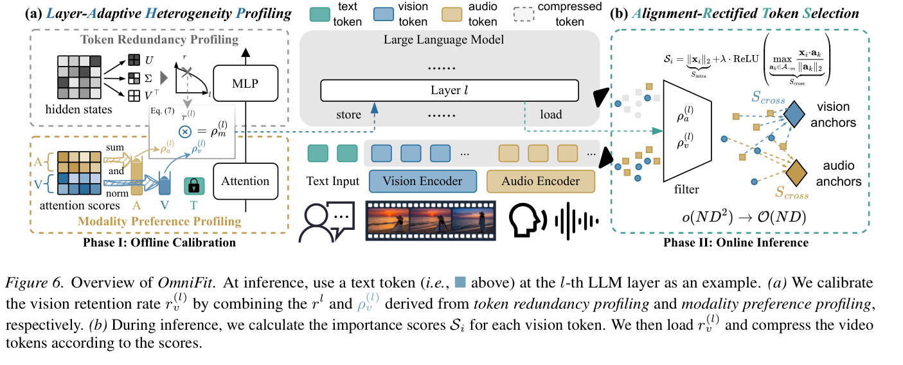
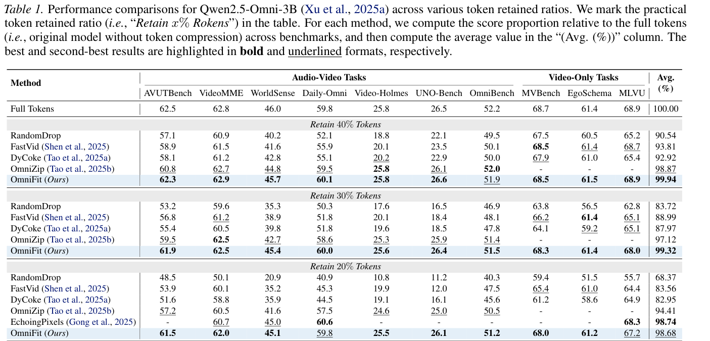
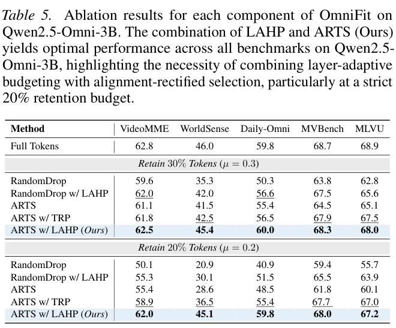
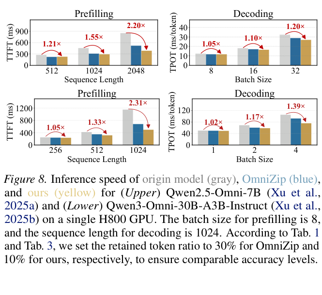

# OmniFit: Bridging Modalities via Layer-Adaptive Token Compression for Omnimodal Large Language Models 精读分析

> [!info] 文档关系
> - 文档类型：Paper（final PDF 深度审阅）
> - 领域入口：[README](../README.md)
> - 上位汇总：[ICML 2026 selected papers](../surveys/icml-2026-selected-papers.md)
> - 证据资产：[assets/papers/omnifit-layer-compression](../assets/papers/omnifit-layer-compression/)
> - 相关文档：[Paper index](../evidence/paper-index.md)，[Figure inventory](../evidence/figure-inventory.md#omnifit)

> 资料状态：已逐页核验 22 页 ICML 2026 / PMLR 306 final PDF。4 个正式图表均来自 200 DPI PDF crop，保留完整 caption 并通过 contact sheet 与原分辨率逐图 QA。LaTeX/source、官方代码/config/checkpoint 及 OpenReview 公开评审仍不可得。

## 修订信息

- 当前文档版本：`1.5.0`
- 当前修订 ID：`rev-omnifit-schema-projection-20260727`
- 当前修订时间：`2026-07-27T22:10:00+08:00`
- 替代版本：`rev-omnifit-final-pdf-promotion-20260727` / `1.4.0`

| 修订 ID | 版本 | 时间 | 类型 | 替代修订 | 摘要 | 结论影响 |
|---|---|---|---|---|---|---|
| `rev-omnifit-initial` | `1.0.0` | 2026-07-17 | initial | 无 | 建立 blocked 交付 | material |
| `rev-omnifit-openreview-refresh` | `1.1.0` | 2026-07-24 | evidence-update | `rev-omnifit-initial` | 恢复 OpenReview/ICML 身份 | material |
| `rev-omnifit-problem-solution-20260725` | `1.2.0` | 2026-07-25 | content-update | `rev-omnifit-openreview-refresh` | 建立题名级问题—方案边界 | minor |
| `rev-omnifit-abstract-promotion-20260725` | `1.3.0` | 2026-07-25 | evidence-promotion | `rev-omnifit-problem-solution-20260725` | 提升官方摘要与 headline claims | material |
| `rev-omnifit-final-pdf-promotion-20260727` | `1.4.0` | 2026-07-27 | evidence-promotion | `rev-omnifit-abstract-promotion-20260725` | 提升 final PDF、公式、系统结果与 4 个 QA 资产 | material |
| `rev-omnifit-schema-projection-20260727` | `1.5.0` | 2026-07-27 | mixed | `rev-omnifit-final-pdf-promotion-20260727` | 补齐标准 claim/evidence/rationale/Infra 结构并纠正 anchor/score/merge 边界 | material |

## 0. 资料与配图索引

- 官方页面：<https://icml.cc/virtual/2026/poster/65962>
- OpenReview：<https://openreview.net/forum?id=8RY20mLzup>；reviews/decision/rebuttal 因 challenge 不可读。
- LaTeX/source、代码/config/checkpoint：不可得。
- Figure 6：[OmniFit overview](../assets/papers/omnifit-layer-compression/fig6-omnifit-overview-caption.png)。
- Table 1：[main results](../assets/papers/omnifit-layer-compression/table1-main-results-caption.png)。
- Figure 8：[inference speed](../assets/papers/omnifit-layer-compression/fig8-inference-speed-caption.png)。
- Table 5：[component ablation](../assets/papers/omnifit-layer-compression/table5-component-ablation-caption.png)。
- AI 生成分析图：未提升；文档输入生成能力不可用。

## 0.1 术语与符号解释

### 0.1.1 术语表

| 术语 | 本文含义 | 别名 | 不等于/易混项 | 证据 |
|---|---|---|---|---|
| OmniFit | 离线 LAHP + 在线 ARTS 的 training-free compression framework | 无 | training-free 不等于 calibration-free/zero-overhead | Abstract、§5、Figure 6 |
| LAHP | 逐层 redundancy 与 modality preference profiling | Layer-Adaptive Heterogeneity Profiling | 不是在线参数训练 | §5.1、Algorithm 1 |
| TRP | hidden-state SVD/effective-rank profiling | Token Redundancy Profiling | 低秩是线性 redundancy proxy，不等于任务信息量 | Eq. 3–5 |
| MPP | token-normalized attention-density profiling | Modality Preference Profiling | 不是 optimized inference 中可见的完整 attention | Eq. 6–7 |
| ARTS | norm + cross-modal alignment 的 token importance | Alignment-Rectified Token Selection | 不是 attention-map pruning | Eq. 8 |
| DPC-KNN anchors | modality representative density peaks | anchors | Appendix D.2 称 training-set global；Algorithm 2/I 称 instance-specific，内部冲突 | §3、Algorithm 2、Appendix I |
| global/static scoring | encoder 后算一次 $S_i$ 并跨层复用 | once selection | 不是每层重新 scoring | Appendix C.3、H |
| progressive retention | 由累计 rank profile 控制的逐层 budget | layer-adaptive budget | 不等于每层独立无约束搜索 | Eq. 4 |
| token merging | dropped neighbor 按 $S_i$ 聚合到 keep anchors | soft aggregation | Algorithm 2 主伪代码偏 hard pruning | Appendix G/I |
| TTFT/TPOT | prefill 首 token / decode 每 token 延迟 | latency metrics | 不等于 throughput 或 p95/p99 | Figure 8 |

### 0.1.2 符号表

| 符号 | 含义 | 性质 | 作用域/单位 | 来源 | 易混点 |
|---|---|---|---|---|---|
| $h_i$ | token 表示 | author-defined | $d$-vector | Eq. 1–2 | Algorithm 2 中来自 $H_m^{(0)}$ |
| $\rho_i,\delta_i$ | DPC density/min distance | author-defined | per token | Eq. 1–2 | 不等于 $\rho_m^{(l)}$、energy $\delta$ |
| $X^{(l)},N,d,L$ | layer states、token、hidden、layers | author-defined | $\mathbb R^{N\times d}$/counts | §5.1 | $N$ 可逐层变 |
| $\sigma_i,k_{\rm eff}^{(l)},\delta$ | singular value、effective rank、energy threshold | author-defined | per layer；$\delta=0.9$ 默认 | Eq. 3 | $k_{\rm eff}$ 不是保留 token 数 |
| $r^{(l)},r_m^{(l)},\mu$ | layer/modality/target retention | author-defined | ratio | Eq. 4、7 | 论文有时称 compression ratio |
| $\Psi(l),\xi$ | cumulative rank profile、cost penalty | author-defined | dimensionless | Eq. 4–5 | proxy/bound，不是 latency telemetry |
| $C(n),c_1,c_2,A,B,C_{\rm Uniform}$ | cost model 与闭式解变量 | author-defined | abstract cost | Eq. 5 | $A$ 与 anchors 不同 |
| $\bar A_{i,j}^{(l)},\rho_m^{(l)}$ | calibration attention 与 modality density | author-defined | probability/density | Eq. 6 | $\rho$ 符号复用 |
| $N_m,K^{(l)},K_{\rm res}$ | modality、layer、residual budgets | author-defined | token count | Eq. 7 | text 先全保留 |
| $\mathcal A_m,M$ | anchor set/count | author-defined | per modality；$M=32$ | §5.2 | provenance 冲突 |
| $S_i,S_{\rm intra},S_{\rm cross},\lambda$ | importance 各项与权重 | author-defined | score | Eq. 8 | prose/Algorithm 还加入 $\rho$ |
| $I_{\rm keep},I_{\rm drop},\mathcal N(j)$ | merge index sets/neighbors | author-defined | sets | Appendix I | Algorithm 2 未完整写 merge |
| $\mathrm{Bytes}_{\rm KV}$ | KV bytes 推导 | analysis-derived | bytes | §8.2 | 需 dtype/KV heads |

## 0.2 AI 生成算法分析示意图

未生成。所需 Markdown document-input 路径不可用；不使用 prompt-only 图替代论文证据。

## 1. 论文基本信息

- 领域：omnimodal LLM inference、training-free token compression、GPU latency/memory。
- 核心问题：长 audio-video-text 序列导致高 attention/KV 成本，uniform/modality-centric/intra-modal compression 又忽略 heterogeneity。
- 目标：不训练参数，保留质量并获得 TTFT、TPOT、VRAM 收益。
- 关键假设：effective rank 能代理 redundancy；calibration preference 可迁移；once anchors/scores 跨层有效；$c_1n+c_2n^2$ 足以约束 budget。
- 评估：3 个 model series、10 个 benchmark，系统主要为单 H800。

## 2. 研究动机与问题—方案闭环

### 2.1 出发点与背景痛点

连续 video/audio/text 形成长 token 序列，attention 二次项、activation 与 KV cache 随之增长。作者通过 Figure 2–5 观察到：浅层剪枝更伤、modality attention 比例随层变化、inter-modal 指标比 intra-modal proxy 更能保留有用 token。

### 2.2 现有方案为何不够

uniform ratio 无法保护浅层并利用深层；静态 audio/vision prior 不能适应 layer/model；intra-modal proxy 会丢 cross-modal alignment token；每层重新计算复杂 saliency 又增加 $O(LNd)$ 或更高 overhead。

### 2.3 论文计划解决的问题与成功标准

- “压多少”：逐层/逐模态 profile。
- “留哪些”：cross-modal anchor score。
- 约束：text 全保留；profile 可缓存；非均匀成本不超 uniform analytical bound。
- 成功：20% 等 aggressive retention 保持质量；组件替换提升；跨模型有效；单 H800 降 TTFT/TPOT/VRAM。
- 不解决：参数训练、跨所有硬件/serving stack 的普适加速。

### 2.4 核心方案如何解决并优化问题

| 失败/约束 | 设计 | 改变的变量/行为 | 机制 | 指标 | 证据 | 判断 |
|---|---|---|---|---|---|---|
| depth redundancy | effective-rank TRP | $r^{(l)}$ | 低 rank 层更 aggressive，累计 profile progressive | quality/budget | Figure 2、Eq. 3–4 | partial |
| heterogeneous $n_l$ 增加 convex cost | $\xi$ bound | 缩放 profile | 满足 $\sum C(r^{(l)}N)\le C_{\rm Uniform}$ | theoretical compute | Eq. 5/A.2 | theory-supported |
| layer modality preference | MPP + text preserve | $r_m^{(l)}$ | normalized attention 分 residual budget | cross-modal quality | Figure 3、Eq. 6–7 | partial |
| intra-modal 错删 alignment token | ARTS cross term | token ranking $S_i$ | opposing anchors 修正 norm | quality | Figure 4–5、Table 5 | supported at bundle level |
| online saliency 开销 | anchors + once score | encoder 后一次计算 | 小 $M$ reference + reuse | selection latency | C.3、Table V | partial；provenance 冲突 |
| hard prune 丢 residual | weighted merge | dropped→anchor aggregation | 保存 residual context | quality/latency | Table IV、Appendix I | supported |
| token saving 未必变系统 saving | progressive sparse execution | attention/KV lengths | 二次/线性成本下降 | TTFT/TPOT/VRAM | Figure 8、Table 4 | single-H800 supported |

### 2.5 完整因果链与证据闭环

长 multimodal sequence + layer/modality/cross-modal heterogeneity → LAHP 改变每层/模态 budget → ARTS 改变 token ranking → merge/prune 改变 active sequence → attention/KV 降低 → Table 1/3 测质量，Table 5 测组件组合，Figure 8/Table 4/Appendix E 测系统收益。

- 直接：完整质量、部分组件组合、merge/prune、once/every-layer、H800 latency/VRAM。
- 间接/混杂：effective rank 是否最佳 proxy、MPP/TRP 各项、$\rho$ dynamic weighting、anchor lifecycle。
- 未验证：代码、跨硬件、distribution shift、带宽利用率、tail latency。

## 3. 核心贡献与创新点

1. observation-driven layer/modality profiling；Figure 2–3、Eq. 3–7。
2. FlashAttention-compatible cross-modal scoring；Figure 4–5、Eq. 8。
3. profile/execution 解耦与 once score；Appendix C/H。
4. 跨模型质量和 H800 TTFT/TPOT/VRAM；Tables 1/3/4、Figure 8。
5. merge/prune 可切换；Appendix G/I，但与 Algorithm 2 需实现裁决。

## 4. 研究方法

### 4.1 方法总览

Phase I 在 calibration set 上采集 hidden states/attention，输出 $r^{(l)},\rho_m^{(l)}$。Phase II 在 encoder 后建立 anchors/$S_i$，随后按 profile 逐层 top-k/merge，再完成 LLM forward 与 decoding。模型参数不更新。

### 4.2 组件级设计动机与具体问题映射

| 设计 | why/证据 | 具体问题 | 机制 | 替代/权衡 | 验证 | 判断 |
|---|---|---|---|---|---|---|
| offline/online decouple | stated，Abstract/Fig.6 | profiling overhead | cache profiles | online adaptive 更贵 | overhead report | partial |
| SVD effective rank | stated，Eq.3 | redundancy proxy | spectral decay | similarity/learned proxy | theory/Fig.2 | partial |
| cumulative $\Psi$ | stated，Eq.4 | progressive budget | product profile | independent search | 无替换 | unverified |
| cost $\xi$ | stated，Eq.5 | convex overhead | uniform-cost bound | hardware latency model | theory | supported under model |
| normalized MPP | stated，Eq.6 | long-modality bias | mass/$N_m$ | learned allocation | Fig.3 | partial |
| preserve text | stated，Eq.7 | high-density text | reserve $r_t=1$ | text compression | 无 | unverified |
| DPC-KNN anchors | stated，§3/5.2 | small references | density peaks | k-means/random | 无 | unverified/conflicted |
| norm $S_{\rm intra}$ | stated，Eq.8 | intrinsic saliency | magnitude | learned score | Table 5 indirect | partial |
| cross $S_{\rm cross}$ | stated，Eq.8 | alignment token | opposing cosine | full attention | Fig.4–5/Table 5 | supported |
| $\rho_{\neg m}$ weighting | prose/Algorithm | layer variation | preference-weight score | fixed score | 无；Eq.8 缺 | ambiguous |
| once scoring | stated，C.3/H | per-layer overhead | reuse $S_i$ | every-layer 更准 | Table V | supported |
| progressive top-k | stated，Alg.2 | apply profile | shorten active set | one-shot | indirect | partial |
| weighted merge | stated，Appendix I | prune loses context | score-weight aggregate | prune faster | Table IV | supported |

### 4.3 模型/系统架构

final PDF 存在三处需限定的内部冲突：

1. Appendix D.2 prose 说 training-set global anchors，Algorithm 2/I 说 current-input instance-specific。
2. §5.2 prose 说 cross term 按逐层 $\rho_{\neg m}^{(l)}$ 动态加权，Eq. 8 未写；Algorithm 2 用 average/first-layer $\rho$ 保持 global score。
3. Algorithm 2 写 hard prune，Appendix I 称默认逐层 merge。

### 4.4 关键公式

$$
\rho_i=\exp\!\left(-\frac1K\sum_{j\in\mathrm{KNN}(i)}\|h_i-h_j\|_2^2\right),
\quad
\delta_i=\min_{j:\rho_j>\rho_i}\|h_i-h_j\|_2,
$$

$$
k_{\rm eff}^{(l)}
=\min\left\{k\;\middle|\;
\frac{\sum_{i=1}^{k}\sigma_i^2}{\sum_{j=1}^{d}\sigma_j^2}>\delta\right\},
$$

$$
r^{(l)}
=\xi\mu\frac{\Psi(l)}{\frac1L\sum_j\Psi(j)},
\qquad
\Psi(l)=\prod_{i=1}^{l}\frac{k_{\rm eff}^{(i)}}d,
$$

$$
C(n)=c_1n+c_2n^2,\qquad
\xi=\frac{-B+\sqrt{B^2+4AC_{\rm Uniform}}}{2A},
$$

$$
\rho_m^{(l)}
=\frac1{N_m}\sum_{j\in m}\sum_i\bar A_{i,j}^{(l)},
\quad
r_m^{(l)}
=\rho_m^{(l)}
\frac{K_{\rm res}}
{\rho_v^{(l)}N_v+\rho_a^{(l)}N_a},
$$

$$
S_i=\|x_i\|_2+
\lambda\,\mathrm{ReLU}\!\left(
\max_{a_k\in\mathcal A_{\neg m}}
\frac{x_i^\top a_k}{\|a_k\|_2}\right).
$$

### 4.5 训练/实验/部署设计

- 无参数训练，但需 calibration forward、SVD、attention aggregation。
- 1024 个 AVQA/Ola calibration samples；$\delta=0.9$、$\lambda=1.5$、DPC $K=5$、$M=32$。
- 3 个 model series、10 个 benchmark；relative performance 按 full-token score 归一。
- Figure 8：单 H800；prefill batch=8，decode sequence=1024；OmniZip 30%、OmniFit 10% 以匹配质量。
- 缺口：代码、dtype、kernel、warmup/repetition、peak-memory 定义、p95/p99、host overhead。

## 5. 关键结论

### 5.1 主结果

- 40%：99.94% relative performance。
- 30%：99.32%。
- 20%：98.68%，OmniZip 94.41%，绝对 +4.27 个百分点。
- Table 3 20%：Qwen-7B 97.28%、OmniVinci 95.87%、Qwen3-Omni-30B 93.46%。

### 5.2 消融和机制证据

| 技术点 | 效果 | 实验 | 控制 | 变化 | 证据 | 结论 |
|---|---|---|---|---|---|---|
| depth heterogeneity | layer-adaptive | Figure 2 | layer/ratio probing | 浅层更敏感 | visualization | supported observation |
| modality preference | modality-adaptive | Figure 3 | descriptive | attention proportions vary | visualization | correlation-only |
| inter>intra saliency | alignment | Figure 4–5 | metric replacement | inter 接近 full，intra collapse | controlled/visual | supported |
| LAHP | better budgets | Table 5 | RandomDrop vs +LAHP | 五列均升 | direct bundle | supported |
| ARTS | better ranking | Table 5 | replacement | 五列均升 | direct | supported |
| LAHP+ARTS | complementarity | Table 5 | partial combos | 62.0/45.1/59.8/68.0/67.2 | combination | supported，非 factorial |
| effective-rank proxy | redundancy | 无替换 | none | 无 | theory/indirect | unverified |
| $\xi$ bound | control compute | theory | analytical | bound | theory | supported under model |
| text preserve | protect text | 无 | none | 无 | none | unverified |
| DPC anchors | reference quality | 无 | none | 无 | none | unverified |
| once score | speed/quality | Table V | once vs every | 62.5 vs62.8；208 vs245ms | direct | supported |
| merge/prune | quality/speed | Table IV | matched | 30%：62.5/245 vs61.8/216 | direct | supported trade-off |
| multi-model | transfer | Table 3 | full method | 93.46–97.28% | multi-model | supported reported scope |
| selection overhead | low overhead | Fig.7/C.3 | microbenchmark | 27.8×–42.0× | direct setup | supported |
| end-to-end | TTFT/TPOT/VRAM | Fig.8/Table4 | comparable quality | 2.31×/1.39×/2.5× max | direct system | single-H800 supported |

### 5.3 是否验证了假设

| 假设 | 证据 | 结论 |
|---|---|---|
| redundancy 随 depth | Figure 2 | 支持 observation；最佳 proxy 未验证 |
| modality preference 变化 | Figure 3 | 描述性支持，独立因果未隔离 |
| cross-modal saliency 更关键 | Figure 4–5/Table 5 | 较强支持 |
| once score 可跨层复用 | Table V | 支持质量—速度折衷 |
| heterogeneous profile 不超 uniform cost | Appendix A.2 | 抽象 model 下支持 |
| token reduction→系统收益 | Figure 8/Table 4 | 单 H800 支持 |

### 5.4 收益来源归因

| 变化 | 基线 | 指标 | 路径 | 证据 |
|---|---|---|---|---|
| RandomDrop→+LAHP | Table 5 | 五列提升 | budget→quality | matched bundle |
| RandomDrop→ARTS | Table 5 | 五列提升 | ranking→quality | replacement |
| ARTS→+TRP/LAHP | Table 5 | 继续提升 | planner+selector | partial combination |
| every-layer→once | Table V | -0.3、-37ms | score frequency→quality/latency | matched |
| merge→prune | Table IV | -0.7、-29ms（30%） | aggregation→quality/latency | matched |
| full/OmniZip→OmniFit | Figure 8 | max 2.31×/1.39× | token+runtime→latency | comparable quality |
| full→OmniFit | Table 4 | 35.7G→14.5G；30B feasible | active KV→memory | direct |

Figure 8 的速度不能全归因于 ARTS；还混合 retention、progressive lengths、merge/prune、kernel 与 memory pressure。

## 6. Related Work 对比

| 类别 | 核心 | 优点 | 局限 | 与本文关系 |
|---|---|---|---|---|
| unimodal pruning | 单模态 prior | 简单 | 忽略 audiovisual synergy | ARTS cross-modal |
| uniform retention | 同一 ratio | 易实现 | 浅层过剪/深层少剪 | LAHP |
| OmniZip | omni pruning | 可用 baseline | modality-centric/per-layer overhead | 主表/Fig.8 |
| EchoingPixels | interaction/attention | 利用 interaction | selection cost 高 | anchors 降 overhead |
| learned compressor | 训练模块 | task-adaptive | 需训练 | OmniFit 不更新参数 |

## 7. OpenReview 公开评审 × 论文内容交叉核验

2026-07-27 forum/API 返回 anti-bot challenge；decision/meta-review/rebuttal 不可得。本文标出的 anchor、$\rho$ weighting、prune/merge 冲突来自 final PDF 内部交叉核对，不是 reviewer claim。

## 8. Infra 需求分析

### 8.1 算力

$$
O\!\left(NMd+
L[N+(r^{(l)}N)^2d]\right).
$$

默认 merge 还需 $O(|D^{(l)}|Rd)$ scatter aggregation，不能完全忽略。

### 8.2 显存与存储

$$
\mathrm{Bytes}_{\rm KV}
\approx2b\,n_{\rm kv}d_h\sum_l r^{(l)}N.
$$

Table 4：7B 35.7G→14.5G；30B full OOM，OmniFit 70.2G。

### 8.3 Data Types / 数值格式

weights/activations/attention profile/scores/anchors/KV 的实际 dtype 未充分报告；不能假定 bf16/fp16/fp8/量化路径。

### 8.4 带宽、互联与高效利用

$$
\mathrm{BytesMoved}\gtrsim
2b\,n_{\rm kv}d_h\sum_l r^{(l)}N+
bd\sum_l|D^{(l)}|R.
$$

无 HBM counters/cache hit/timeline，不能算 effective bandwidth。单 H800 无跨卡互联结论；8×H800 calibration 并行方式未报告。

### 8.5 CPU/GPU/NPU 异构执行

CPU preprocessing、host-device transfer、NPU path、DMA/pinned memory/fallback/overlap 均未报告。“edge feasible”不是已验证异构部署。

### 8.6 调度/Serving/自定义算子

逐层和逐请求 dynamic shape 涉及 top-k、gather/scatter、KV compaction、CUDA graph 与 batch irregularity。论文无 continuous batching、scheduler、paged KV、p95/p99。

comparable accuracy 下，最高 TTFT 2.20×/2.31×、TPOT 1.20×/1.39×；Appendix 7B 精确点包括 855→387ms TTFT 与 32.5→27.0ms/token TPOT。

## 9. 开源代码对照

未发现官方 repository/commit/config/checkpoint。LAHP、MPP、anchor provenance、once/dynamic scoring、merge/prune、kernel/serving 均不能由代码裁决。

## 10. 优点与局限

### 优点

- observation、planner、selector 与系统结果链路清楚。
- 同时报告质量、TTFT、TPOT、VRAM、calibration 与系统消融。
- 跨 3 个 model series、10 benchmarks。

### 局限

- anchor provenance、$\rho$ weighting、prune/merge 在 final PDF 内部冲突。
- Table 5 非完整 factorial；TRP/MPP/text/effective-rank/anchor 未全部隔离。
- 系统集中单 H800，无 dtype/profiler/tail/batching。
- 无代码/config/reviews。

### 可改进之处

统一权威算法与实现；补 proxy/anchor/text/$\rho$ 独立消融；测 distribution shift、profile transfer、Nsight counters、effective bandwidth、p95/p99 与 batch heterogeneity。

## 11. 研究启发

- planner 决定“压多少”，selector 决定“留哪些”。
- 可扩展为 hardware-latency-aware profile、online correction、profile cache、NPU-friendly gather/scatter。
- 最小复现应闭环 observations→Table 5→Table IV/V→TTFT/TPOT/VRAM。

## 12. 解读问题/待验证清单

1. effective rank 与 task information 的关系多强？
2. $\Psi(l)$ 是否放大早层 rank noise？
3. $c_1,c_2$ 如何随 hardware/batch/dtype/kernel 变化？
4. MPP attention 如何在 calibration path 采集？
5. text 全保留是否必要？
6. anchors 是 training-set global 还是 instance-specific？
7. $\rho_{\neg m}^{(l)}$ 如何与 fixed $S_i$ 共存？
8. 默认是 prune 还是 per-layer merge？
9. 能否补全 TRP×MPP×ARTS factorial grid？
10. DPC-KNN 相对其他 anchors 的收益？
11. Figure 8 的 warmup/repetitions/dtype/peak-memory 定义？
12. dynamic shape 对 batching/CUDA graph/tail latency 的影响？
13. 8×H800 calibration 的并行和通信方式？
14. 代码和公开评审何时可用？

## 13. 一句话总结

OmniFit 以 LAHP 规划逐层/逐模态预算、以 ARTS 保留 cross-modal token，并在单 H800 上给出质量、TTFT/TPOT 和显存闭环；最大不确定性是 anchor、动态权重和 merge/prune 生命周期存在内部冲突，且缺少代码与跨系统验证。
