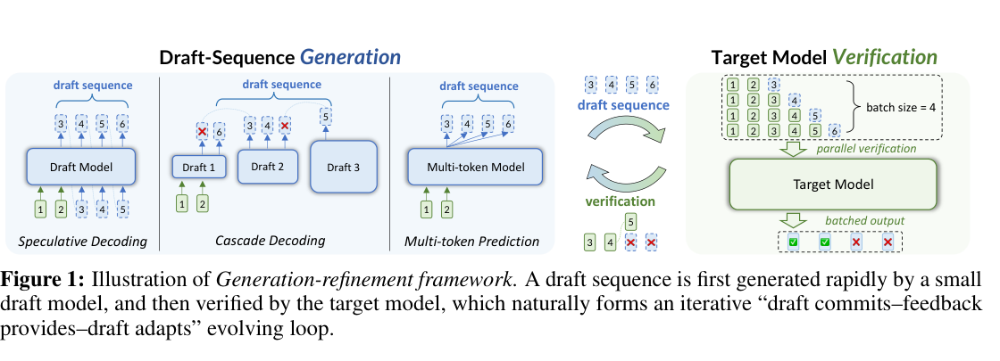
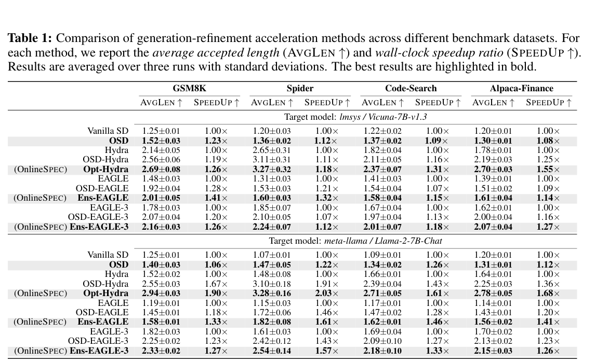
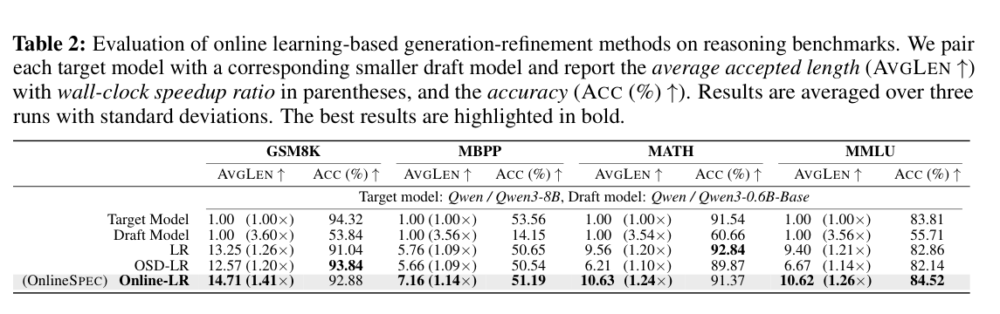
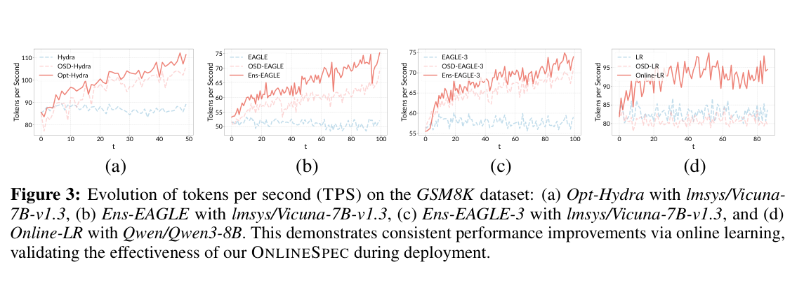

# When Drafts Evolve: Speculative Decoding Meets Online Learning 精读分析

> [!info] 文档关系
> - 文档类型：Paper（venue mismatch：primary source 为 ICLR 2026 workshop）
> - 领域入口：[README](../README.md)
> - 上位汇总：[ICML 2026 selected papers](../surveys/icml-2026-selected-papers.md)
> - 证据资产：[`../assets/papers/onlinespec/`](../assets/papers/onlinespec/)
> - 相关文档：[Figure inventory](../evidence/figure-inventory.md#onlinespec)

> 资料状态：arXiv:2603.12617v1 的 PDF、HTML、LaTeX source 与作者代码均可取得。PDF 为 27 页；source 中的版式明确显示 “Published as a workshop paper in Lifelong Agent @ ICLR 2026”，因此不能把任务清单中的 ICML 2026 candidate 标记解释为 ICML 接收。

## 修订信息

- 当前文档版本：`1.1.0`
- 当前修订 ID：`rev-onlinespec-problem-solution-20260725`
- 当前修订时间：`2026-07-25T10:05:32+08:00`
- 替代版本：`rev-onlinespec-initial` / `1.0.0` / manifest `70362e83757e70a5159e0bb0fb29ade04e3f642ce934acd9798cd084610cfdb5`

| 修订 ID | 文档版本 | 时间 | 修订者 | 类型 | 替代修订 | 变更摘要 | 原因 | 影响位置 | 依据 | 对结论影响 |
|---|---|---|---|---|---|---|---|---|---|---|
| rev-onlinespec-initial | 1.0.0 | 2026-07-17T09:30:00+08:00 | review_onlinespec | initial | 无 | 完成单篇论文证据审阅、图表 QA、代码核验与 infra 分析 | 用户请求及委派任务包 | 全文、图表索引、manifest | arXiv v1、LaTeX source、Git commit 3a6cc69 | 无 |
| rev-onlinespec-problem-solution-20260725 | 1.1.0 | 2026-07-25T10:05:32+08:00 | `/root` | content-update | rev-onlinespec-initial / 1.0.0 / `70362e83757e70a5159e0bb0fb29ade04e3f642ce934acd9798cd084610cfdb5` | 新增在线适应 draft 的问题—方案—优化—证据闭环 | 统一回写既有 Paper 报告 | `研究动机与问题—方案闭环` | Theorem 1、Algorithm 1、Table 1/2、Figure 3 | minor：不改变 workshop/venue 判断 |

## 0. 资料与配图索引

- 论文：[arXiv:2603.12617v1](https://arxiv.org/abs/2603.12617v1)。
- 代码：[ZinYY/OnlineSPEC at `3a6cc69`](https://github.com/ZinYY/OnlineSPEC/tree/3a6cc69d1c839385fcdd5f82529c55300e503b4b)。
- OpenReview：不适用；arXiv 页面和 source 未提供 OpenReview forum/review/decision/rebuttal。
- 正式图表：Figure 1/3、Table 1/2；Figure 2 因父级发现 caption 截断未提升，详见[Figure inventory](../evidence/figure-inventory.md#onlinespec)。
- AI 生成分析图：跳过；当前 ICU CLI 没有契约要求的 required document-input path 能力。

## 0.1 术语与符号解释

### 0.1.1 术语表

| 术语 | 本文含义 | 别名 | 不等于/易混项 | 证据来源 |
|---|---|---|---|---|
| generation-refinement | 小 draft 先生成候选、target 并行验证/修正的总框架 | speculative decoding family | 不等于只训练 draft 的 offline distillation | §2、Figure 1 |
| OnlineSpec | 把 draft-target 交互写成在线学习回合的统一框架 | Speculative Decoding via Online Learning | 不是单一网络结构；是 feedback/update 接口 | §2、Figure 2 |
| dynamic regret | 与随时间变化 comparator 序列的累计损失差 | path-aware regret | 不等于 static regret（固定 comparator） | Eq. (2)、§2.2 |
| interactive feedback | target 验证后暴露的错误 token、logits 或 preference pair | verification feedback | 不代表额外 target 查询；验证本身产出信号 | Algorithm 1、§3.1 |
| Opt-Hydra | Hydra + 上一轮梯度作为 optimism hint 的双步更新 | optimistic online learning | hint 预测梯度，不是动量实现的同义词 | Eq. (3)、§3.2、代码 `Hydra/pipeline.py` |
| Ens-EAGLE / Ens-EAGLE-3 | 多个学习率 draft head + Hedge 元学习器 | online ensemble | 不等于并行运行多个完整 target model | §3.3、代码 `EAGLE/pipeline_hedge.py` |
| Online-LR | Lookahead Reasoning 的 DPO-style 在线更新 | online DPO | 不等于 OSD 的 token-level distillation | §3.1、Table 2 |
| accepted length | 每轮连续被 target 接受的 draft token 数 | AvgLen | 不等于最终生成长度 | Eq. (1)、Table 1/2 |
| acceleration rate | 相对标准 autoregressive decoding 的 wall-clock 比值 | SpeedUp | 不等于 AvgLen；受 draft/target 成本比影响 | Theorem 1 |
| path length $P_T$ | 局部最优 draft comparator 随时间变化的总距离 | comparator variation | 论文未实测，只作理论条件 | Corollaries 1–3 |

### 0.1.2 符号表

| 符号 | 含义 | 性质 | 作用域/索引 | 单位/取值 | 来源 | 易混点 |
|---|---|---|---|---|---|---|
| $T$ | 在线生成/更新回合数 | author-defined | 全序列 | 正整数；实验约 1000–4000 | §2.2、Table 3 | 不等于训练 epoch |
| $k$ | 每回合 draft candidate 长度 | author-defined | 每轮 | token 数 | Algorithm 1、Theorem 1 | chunk size 是实现参数，未必等于 $k$ |
| $A,a$ | target、draft 的期望推理时间 | author-defined | 每轮 | 时间；$\alpha=a/A$ | Theorem 1 | 未给硬件与绝对毫秒 |
| $q_{\mathbf w_t},p_{\mathbf v}$ | draft、target 条件分布 | author-defined | token/context | 概率 | Eq. (1)、Algorithm 1 | $p'$ 是拒绝后修正分布 |
| $\mathrm{Acc}_t$ | 第 $t$ 轮接受概率期望 | author-defined | 每轮 | $[0,1]$ | Eq. (1) | 与 AvgLen 相关但非同量 |
| $f_t(\mathbf w)$ | target feedback 诱导的损失 | author-defined | 每轮 | 实数 | Eq. (2)、§3.1 | 神经网络上凸性只是假设 |
| $\mathbf w_t^\star$ | 第 $t$ 轮局部最优 comparator | author-defined | 每轮 | 参数向量 | §2.2 | 不是公开 checkpoint |
| $\mathrm{Reg}_T$ | dynamic regret | author-defined | $1,\ldots,T$ | 累计损失 | Eq. (2) | 理论量，实验没有直接估计 |
| $\eta$ | learning rate | author/code-defined | update | 无量纲超参 | §3、Table 3 | 单固定 $\eta$ 在分布漂移下不稳 |
| $\mathbf h_t,\delta_T$ | optimism hint、hint 误差上界 | author-defined | 每轮/累计 | 向量、平方范数和 | Eq. (3)、Cor. 2 | 代码将上一梯度作为 hint，但未报告 $\delta_T$ |
| $N,\varepsilon,p_t^i$ | ensemble 基模型数、Hedge 灵敏度、权重 | author-defined | learner $i$，round $t$ | $N=O(\log T)$，simplex weights | §3.3 | 论文公式写出模型参数加权，代码需核对输出融合细节 |
| $\gamma$ | acceleration rate | author-defined | 全过程 | ratio | Theorem 1 | 表中 SpeedUp 是其测量近似 |

## 1. 论文基本信息

- 作者：Yu-Yang Qian, Hao-Cong Wu, Yichao Fu, Hao Zhang, Peng Zhao；南京大学/UCSD。
- arXiv 首次版本：2026-03-13；任务包标为 ICML 2026 candidate，但 source 页眉是 ICLR 2026 Lifelong Agent workshop。
- 核心问题：固定 offline draft 无法跟随 target 与用户分布，接受长度随时间下降。
- 目标：利用 target 验证免费产生的交互信号在线更新 draft，改善接受率、速度且保持任务质量。
- 关键假设：draft/target 条件分布在 candidate positions 上 i.i.d.；cross-entropy feedback；参数域有界、梯度有界；神经网络优化的凸性并未真正成立。

## 1.1 研究动机与问题—方案闭环

### 1.1.1 出发点与背景痛点

作者关注 speculative decoding 部署后的非平稳性：offline draft 在固定语料和固定 target 上训练，但真实用户请求、任务域以及 target checkpoint 会随时间变化。draft 一旦偏离当前 target 分布，验证拒绝率上升、平均接受长度下降，原本的加速收益会逐轮衰减。与此同时，target verification 已经在每轮暴露哪些候选与 target 一致，这些反馈通常只被用于接受/拒绝，没有被用来持续改进 draft。

### 1.1.2 现有方案为何不够

周期性离线重训需要缓存数据、重新训练和部署，响应漂移慢；固定 draft 或一次性蒸馏默认部署分布静态。根因是 draft 被当作冻结组件，而 target 反馈没有进入学习闭环。简单在线 SGD 又可能对短期噪声过拟合、遗忘历史或对学习率敏感，所以论文需要把连续适应写成可分析的 online learning 问题。

### 1.1.3 计划解决的问题与成功标准

- 核心问题：如何利用每轮 target verification feedback 在线更新 draft，使其追踪变化的 target/请求分布。
- 约束：不改变 target；更新成本不能抵消解码收益；理论分析依赖有界域、梯度与近似凸性假设。
- 成功标准：dynamic regret 降低，并对应更高 AvgLen、TPS/wall-clock SpeedUp，同时任务 accuracy 不下降。
- 边界：神经网络目标并不真正凸；在线优化开销、稳定性与数据隐私尚未形成生产级证明。

### 1.1.4 核心方案如何解决并优化问题

| 原始问题/失败模式 | 根因或约束 | 对应设计 | 改变的变量/系统行为 | 作用机制 | 预期优化 | 证据与判断 |
|---|---|---|---|---|---|---|
| 固定 draft 随分布漂移失配 | 参数不随 target feedback 更新 | generation-refinement loop | draft 参数随每轮反馈变化 | 把验证偏差变成在线损失并更新 | AvgLen、SpeedUp | Algorithm 1、Table 1/2；supported |
| 普通在线梯度对变化反应滞后 | 只使用当前梯度 | Opt-Hydra optimism | 更新方向加入历史预测梯度 | 利用时间相关性预判下一轮 | regret、TPS | 理论与实验支持，依序列可预测性 |
| 单一学习率难兼顾漂移速度 | 最佳 step size 随环境变化 | Ens-EAGLE/3 | 多个学习率专家的权重 | Hedge 选择/组合更新器 | 鲁棒性与跨任务表现 | 多 benchmark 间接支持 |
| 理论指标与系统收益脱节 | regret 不直接等于 latency | accepted-length bridge | 把分布误差映射到接受概率 | 由 regret 上界推导 acceleration tendency | AvgLen 与 wall-clock | Theorem 1；假设较强，partially supported |

### 1.1.5 完整因果链与证据闭环

部署分布变化 → 固定 draft 与 target 条件分布逐渐偏离 → 被拒候选增多、accepted length 和加速率下降 → 将 target 验证产生的偏差定义为在线损失 → 用 OGD、optimistic update 或多学习率 ensemble 持续更新 draft → 预期降低 dynamic regret、提高接受长度并恢复 TPS。Theorem 1 建立了 regret 到 acceleration 的方向性联系，Table 1/2 和 Figure 3 支持在线方法随部署迭代维持或提升系统指标；但 i.i.d./凸性等假设与真实神经网络部署存在距离，且更新算力、尾延迟和长期稳定性未被充分隔离。因此证据支持“在线反馈闭环有效”，不等于理论界在生产环境被严格验证。

## 2. 核心贡献与创新点

1. 将 generation-refinement 抽象为 player（draft）与 environment（target）的在线学习回合（§2、Algorithm 1）。
2. 给出 accepted length 与 dynamic regret，再到 acceleration rate 的理论链；Theorem 1 令 $\gamma$ 随 $\mathrm{Reg}_T$ 降低而提高。
3. 三种实例：Online-LR（DPO-style OGD）、Opt-Hydra（历史梯度 optimism）、Ens-EAGLE/3（多学习率 Hedge）。
4. 在 7 个 benchmark、3 个 target model 上报告 AvgLen、SpeedUp、accuracy/TPS；Table 1/2/3 和 Figure 3 支持部署趋势。

## 3. 研究方法

### 3.1 问题到方案的逻辑链

固定 draft → 域/时间漂移导致 $q_{\mathbf w}$ 偏离 $p_{\mathbf v}$ → target 验证已经暴露偏差 → 把每轮偏差变成 $f_t$ → 采用 OGD/optimism/ensemble 更新 → 减小 dynamic regret → 提高 accepted length 与 wall-clock speedup。

### 3.2 关键公式与设计动机

接受率为

$$
\mathrm{Acc}_t=\mathbb E_{x\sim q_{\mathbf w_t}}\left[\min\left(1,\frac{p_{\mathbf v}(x\mid\mathbf x)}{q_{\mathbf w_t}(x\mid\mathbf x)}\right)\right].
$$

dynamic regret 为

$$
\mathrm{Reg}_T=\sum_{t=1}^{T}f_t(\mathbf w_t)-\sum_{t=1}^{T}f_t(\mathbf w_t^\star).
$$

Theorem 1 的速度定义为

$$
\gamma=\frac{A\,\mathbb E[|\hat{\mathbf x}|]}{akT+AT},\qquad \alpha=\frac aA,
$$

其下界依赖 $\sqrt{\mathrm{Reg}_T/T}$、$k$、$\alpha$。这条链条是论文最重要的概念贡献，但依赖 i.i.d. candidate 与有界梯度等强假设。

| 设计项                             | why 状态                                     | 针对问题                                  | 因果机制                                         | 替代/权衡                                 | 证据判断                                     |
| ------------------------------- | ------------------------------------------ | ------------------------------------- | -------------------------------------------- | ------------------------------------- | ---------------------------------------- |
| 在线反馈抽象                          | author-stated（§2）                          | offline draft 随域漂移失配                  | 每轮 target verification 产出可训练信号               | 继续 offline distill 成本低但不能适应           | 理论 + Algorithm 1，直接                      |
| OGD / Online-LR                 | author-stated（§3.1）                        | 需要通用 loss 接口；reasoning 不是 token error | DPO preference pair 将语义反馈转成梯度                | OSD token distillation 对 reasoning 失配 | Table 2 是受控的 LR/OSD-LR/Online-LR 对比，部分支持 |
| optimism                        | author-stated + inferred temporal locality | 当前梯度 noisy/滞后                         | 用上一轮梯度预测当前，若 hint 误差 $\delta_T$ 小则 regret 降低 | 需要 locality；错误 hint 会放大更新             | Cor. 2 + Table 1/3，机制有间接证据               |
| ensemble Hedge                  | author-stated                              | 单一 η 无法同时适应平稳/快速漂移                    | 多学习率 base + 权重追踪最优 base                      | 多份 draft head 带来显存与更新开销               | Cor. 3 + Table 1，未隔离 head 数与融合成本         |
| 训练预算 1000 warm-up + 4000 online | author-stated（§4.1）                        | 冷启动与在线适应                              | 先有可用 draft 再累积 feedback                      | 更长 warm-up 降低服务可用性                    | Table 3 仅验证 $T$ 趋势，未给总成本全景               |

### 3.3 算法实现阶段边界

drafting 阶段生成 $k$ 个候选；target verification 阶段并行计算 $p_{\mathbf v}$ 并决定 $n_t$；feedback/update 阶段才执行 OGD、optimism 或 Hedge；serving/runtime 阶段测 TPS/SpeedUp。论文把“在线适应”描述为部署内循环，但代码中训练和推理通过 pipeline 脚本串联，不能据此断言每个生产请求都同步反向传播。

## 4. 关键结论与证据矩阵

### 4.1 主结果

Figure 1 展示 draft→parallel target verification→feedback loop；它支持框架直觉，不是速度数据。

Table 1 在 Vicuna/Llama 上显示 Opt-Hydra、Ens-EAGLE(3) 通常超过 offline/OSD 组合。例如 Vicuna 的 Opt-Hydra 在 Alpaca-Finance 为 2.70 AvgLen、1.55×，相对 Hydra 1.78 AvgLen、1.00×；Llama 的 Opt-Hydra 为 2.78 AvgLen、1.68×，相对 Hydra 1.64、1.00×。这些是论文报告值，非我的重算。

Table 2 的 Online-LR 在 GSM8K/MBPP/MATH/MMLU 的 SpeedUp 分别为 1.41×/1.14×/1.24×/1.26×，accuracy 分别 92.88/51.19/91.37/84.52；OSD-LR 在 MATH 为 89.87，说明直接 token-level OSD 可能不适合 reasoning feedback。

Figure 3 显示 Opt-Hydra、Ens-EAGLE、Ens-EAGLE-3、Online-LR 的 TPS 随回合总体上升，但曲线抖动且没有置信区间；它支持“趋势”而非严格因果归因。

### 4.2 技术点证据矩阵

| 技术点 | 声称收益 | 证据 | 对照 | 分类 | 结论 |
|---|---|---|---|---|---|
| OnlineSpec feedback loop | 适应漂移 | Algorithm 1、Figure 1/2 | 框架级描述 | mechanism visualization + theory | 机制清楚，系统收益需实现细节 |
| dynamic-regret→speedup | 低 regret 提速 | Lemma 1/Theorem 1/Appendix proofs | 理论假设 | theory | 在假设内成立；非神经网络实测定律 |
| Online-LR DPO feedback | reasoning 提速/保质 | Table 2 | LR vs OSD-LR vs Online-LR | replacement baseline | 部分直接；不同 loss 与实现仍有混杂 |
| Opt-Hydra optimism | 更快适应 | Table 1、Figure 3、Cor. 2 | Hydra/OSD-Hydra/Opt-Hydra | bridge + temporal plot | 支持但未报告 hint error $\delta_T$ |
| Ens-EAGLE ensemble | 非平稳鲁棒 | Table 1、Cor. 3 | EAGLE/OSD-EAGLE/Ens-EAGLE | bridge | 支持趋势，未单独隔离 Hedge 开销 |
| 24% SOTA speedup | 最大宣传数字 | 摘要/多表 | baseline 口径随方法变化 | confounded | 应标为“最高观测值”，不是统一 matched gain |

### 4.3 收益归因

Table 1 提供了 baseline→OSD→proposed 的桥接，可粗略推断“反馈更新”带来大部分 AvgLen 增益，而 optimism/ensemble 进一步提升；但这不是 matched ablation，因为 draft head 数、loss、实现路径和训练预算同时变化。Figure 3 的 TPS 上升支持 accepted length 改善传到服务速度；训练 overhead Table 4（source `train_inf_time_results.tex`）显示 Ens-EAGLE-3 总时间仍 1.07×/1.13×，Opt-Hydra 1.02×/1.05×，但覆盖数据集有限。

## 5. 相关工作比较

| 方法族 | 机制 | OnlineSpec 差异 | 限制/公平性 |
|---|---|---|---|
| Vanilla SD / Hydra / EAGLE | 固定 draft/head、并行验证 | OnlineSpec 在部署期更新同类 draft | 需要确保相同 chunk、模型和硬件；表中方法 chunk size 不同 |
| OSD | token-level error distillation | OnlineSpec 把反馈抽象成任意 $f_t$，扩展到 DPO/optimism/ensemble | OSD-LR 低于 LR 是支持其局限的桥接对照，但 loss 不同 |
| DistillSpec / ATLAS / DVI | offline/on-policy/system traffic adaptation | OnlineSpec 给出 online-learning 理论统一视角 | 未在本文复现所有系统 baseline，比较主要依赖文献描述 |
| BanditSpec / HedgeSpec | 选择 candidate 或 draft | Ens-EAGLE 在 model-head 更新层面用 ensemble | Bandit 与 ensemble 优化对象不同，不能直接宣称替代 |

## 6. OpenReview 公共评审交叉核验

论文是 arXiv v1，未发现 OpenReview forum、review、meta-review、decision 或 rebuttal；因此无可交叉核验的 reviewer claim。ICML 2026 venue 状态也未在 primary metadata 中确认；source 页眉反而指向 ICLR 2026 workshop。这一状态限制了“已被 ICML 接收”的任何推断。

## 7. Infra 需求分析

### 7.1 算力、显存与数据类型

每轮粗略成本为 $ak+A$，标准 autoregressive 基线为 $A\,\mathbb E[|\hat{\mathbf x}|]$；论文报告的是 ratio，没有 GPU 型号、batch、序列长度、峰值显存或 kernel telemetry。训练更新需要 draft head 的反向传播；Ens-EAGLE-3 的 $N$ 个 head 使 optimizer state/activation 近似按 $N$ 增长。代码依赖 PyTorch/Transformers，未在配置中统一声明 bf16/fp16；因此不能把 Tensor Core 或量化收益归因给该方法。默认应按 fp16/bf16 需核验、fp32 optimizer state 可能存在来规划显存。

### 7.2 带宽、互联与利用率

未给 HBM/PCIe/NVLink 峰值与 runtime 秒数，不能计算可靠

$$
\mathrm{EffectiveBandwidth}=\frac{\mathrm{BytesMoved}}{\mathrm{Runtime}},\qquad
\mathrm{Utilization}=\frac{\mathrm{EffectiveBandwidth}}{\mathrm{PeakBandwidth}}.
$$

可推断的额外流量包括 target logits→draft loss、多个 head 的梯度/参数更新以及 CPU 数据加载；若 draft 与 target 同 GPU，主要瓶颈是显存读写与 target verification compute；若分 GPU，需 PCIe/NVLink 传输 logits/hidden states。论文没有 kernel fusion、CUDA graph、pinned memory 或 overlap 证据，生产部署不应默认这些优化存在。

### 7.3 CPU/GPU/NPU 异构

代码 pipeline 以 GPU PyTorch 推理/训练为主，数据准备在 CPU；没有 NPU backend、异步 DMA、CPU fallback 或多机 scheduler 说明。在线更新若与服务请求同步，反向传播会引入 GPU stream synchronization；更稳妥的部署是 shadow/低优先级 update stream，周期性合并 draft 权重。Ens-EAGLE 多 head 的权重融合可在 GPU 上做，CPU 侧只负责数据和 Hedge bookkeeping。

### 7.4 Serving 风险

chunk size 按方法不同（vanilla/EAGLE 40、Hydra 80、LR 25），使速度对照并非完全同一 runtime 预算；Table 4 只覆盖少数任务。要上线需记录 p50/p95 latency、更新频率、并发、KV-cache、显存碎片和更新期间请求隔离；论文未提供这些 SLA telemetry。

## 8. 开源代码对照

- 仓库 commit：`3a6cc69d1c839385fcdd5f82529c55300e503b4b`；下述文件路径均相对此 commit。
- `Hydra/pipeline.py`、`EAGLE/pipeline_hedge.py`、`EAGLE/pipeline_eagle3_hedge.py`、`LR/dpo_train.py` 分别覆盖 Hydra、ensemble、EAGLE-3、DPO 训练路径；README 给出 warm-up、online evaluation 和学习率命令。
- 代码与论文一致地暴露多学习率和 online update，但没有可复现的统一 config、硬件锁定、端到端服务 scheduler 或 checkpoint metadata；README 的模型路径是用户本地路径，权重公开状态未在本地核验。
- 代码 claim 均绑定上述 commit；不能从 README 单独推断参数量/精度/生产吞吐。

## 9. 优点与局限

### 优点

- 把“验证反馈”与在线学习工具连接起来，接口层抽象清楚。
- dynamic regret→accepted length→speedup 的理论链为算法选择提供可解释变量。
- Table 2 体现 feedback 结构应与任务匹配，Online-LR 优于 OSD-LR 是有价值的反例。
- 代码开源，且包含 Hydra/EAGLE/LR 三条实现路径。

### 局限

- i.i.d. candidate、凸损失、有界梯度与局部 comparator 假设与真实 Transformer 在线训练有明显鸿沟；实验没有直接估计 $\mathrm{Reg}_T$、$P_T$ 或 $\delta_T$。
- baseline 组合、chunk size、draft/head 数与训练预算混杂，无法把全部速度增益归因于单一算法。
- 没有硬件、精度、显存、并发、p95 latency 或多 GPU/NPU 数据；“部署”更像离线脚本中的 streaming evaluation。
- venue metadata 与任务清单冲突：source 指 ICLR workshop，不能宣称 ICML 录用。

## 10. 研究启发

- 用在线学习的 path-length/hint-error telemetry 直接预测 accepted length，建立可验证的 regret proxy。
- 将更新与 serving 解耦，比较 synchronous、shadow、periodic merge 三种调度的端到端 SLA。
- 设计 matched ablation：固定 head 数/精度/chunk，只替换 OGD、optimism、Hedge；报告参数、显存和有效带宽。
- 把 ensemble 权重用于 candidate length、draft model 选择或跨 GPU placement，形成算法-系统联合控制器。

## 11. 解读问题/待验证清单

1. Transformer 非凸优化下，Theorem 1 的 regret proxy 是否仍能预测真实 AvgLen？
2. 代码中的 $f_t$ 是否真正逐请求更新，还是按 chunk/epoch 批量更新？
3. Opt-Hydra 的上一梯度 hint 在强域漂移下的 $\delta_T$ 如何测量？
4. Ens-EAGLE 的多 head 融合是否增加 target verification 或 KV-cache 成本？
5. chunk size 不同是否改变了 SpeedUp 排名？
6. Table 4 的 training overhead 是否在更长上下文、高并发和多卡下仍可接受？
7. 论文声称的 24% 是否来自统一 matched baseline，还是某一 benchmark/target 的最大值？
8. ICML 2026 venue 状态应由官方 ICML/OpenReview 元数据进一步确认。

## 12. 一句话总结

OnlineSpec 的核心价值是把 speculative decoding 的免费验证信号系统化为在线学习更新，并以 dynamic regret 解释速度收益；最大不确定性是理论假设与真实非凸、多卡 serving 之间的鸿沟，以及未充分隔离的 runtime/训练成本。
