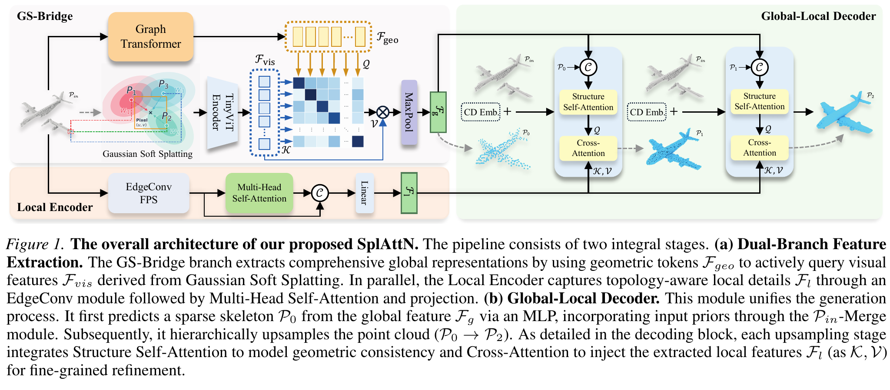
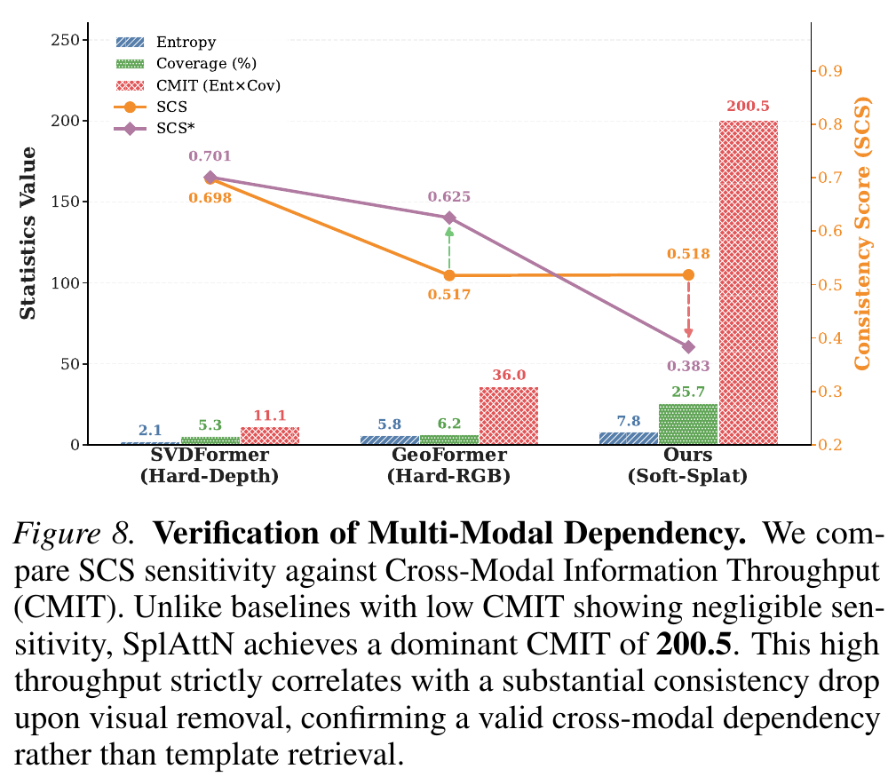

# SplAttN: Bridging 2D and 3D with Gaussian Soft Splatting and Attention for Point Cloud Completion 精读分析

> [!info] 文档关系
> - 文档类型：Paper（complete）
> - 领域入口：[README](../README.md)
> - 上位汇总：[ICML 2026 selected papers](../surveys/icml-2026-selected-papers.md)
> - 证据资产：[Figure 1](../assets/papers/splattn/fig1-overall-architecture.png)，[Figure 8](../assets/papers/splattn/fig8-multimodal-dependency.png)
> - 相关文档：[Paper index](../evidence/paper-index.md)，[Figure inventory](../evidence/figure-inventory.md)

> 资料状态：已核验完整 arXiv v2 PDF（24 页）与完整 LaTeX source；原论文配图为最终 PDF 的 300 DPI 严格裁剪。官方代码固定在 commit `0c279dd11ca13a70b676cd60ca9673e093526b9a`。官方 ICML poster 60900 页面明确关联 Spotlight presentation。

## 修订信息

- 当前文档版本：`1.1.0`
- 当前修订 ID：`rev-splattn-refresh-20260724`
- 当前修订时间：`2026-07-24T18:21:12+08:00`
- 替代版本：`rev-splattn-initial` / `1.0.0` / manifest `1006a623b3473b4129ba2f3fd8ecb08fd7c299846678d0636e1b1438fef2650c`

| 修订 ID | 文档版本 | 时间 | 修订者 | 类型 | 替代修订 | 迁移问题/解析 | 变更摘要 | 原因 | 影响位置 | 依据 | 对结论影响 |
|---|---|---|---|---|---|---|---|---|---|---|---|
| `rev-splattn-initial` | `1.0.0` | `2026-07-16T12:00:00+08:00` | `review_splattn` | initial | 无 | 无 | 首次审阅 | 用户指定的单篇 paper-deep-review 任务 | `analysis.md`；`figure_inventory.md`；`review_checklist.md` | `extracted_text/ar5iv.html`；`code/SplAttN/` | minor |
| `rev-splattn-refresh-20260724` | `1.1.0` | `2026-07-24T18:21:12+08:00` | `splattn_refresh` | mixed | tracked：`rev-splattn-initial` / `1.0.0` / `1006a623b3473b4129ba2f3fd8ecb08fd7c299846678d0636e1b1438fef2650c` | 无 | 恢复完整 PDF/source；加入 Figure 1 与 Figure 8 严格视觉证据；以官方 ICML 页面提升 venue；刷新代码/checkpoint；重核 SCS/CMIT、kernel 与 runtime，并指出连续论文表述和离散实现的差异 | 任务包的 revise-existing 请求 | `analysis.md`；`figure_inventory.md`；`figures/`；`source/`；`code/`；`checkpoint_metadata/`；`venue/` | `paper.pdf` arXiv v2；`source/example_paper.tex`；ICML poster 60900；commit `0c279d…`；HF model API | material |

## 0. 资料与配图索引

- 论文：`paper.pdf`，SHA-256 `d8f9751b909a6958d62cd6aa7aa6a61c282a2bd20cc251ddb7a2dcbdb54e15c4`；PDF 内标注 `arXiv:2605.01466v2 [cs.CV] 21 May 2026`。
- LaTeX source：`source.tar.gz`（SHA-256 `dafa78ad106ec1605c249beb831f487d5db6416dc88a5f64ac52f4c8b01ae931`）及解包目录 `source/`。
- 提取文本：`extracted_text/paper.txt`、`extracted_text/paper-layout.txt`，由 Poppler `pdftotext` 生成。
- Venue：`venue/icml-poster-60900.html`。官方页面标题/作者与本论文一致，并直接链接 `/virtual/2026/spotlight/84591`，故本次将 venue 核验为 **ICML 2026 Spotlight**。
- 开源代码：`code/SplAttN/`，commit `0c279dd11ca13a70b676cd60ca9673e093526b9a`。
- Checkpoint metadata：`checkpoint_metadata/hf-pcn.json`、`hf-shapenet55.json`、`hf-shapenet34.json`；仅核验公开状态、revision 与文件名，未下载大体积权重 payload。
- OpenReview：见 `openreview_reviews.md`；官方页面无 forum 链接，精确题名搜索无结果。
- 机制图：[Figure 1](../assets/papers/splattn/fig1-overall-architecture.png)。
- 结果/系统证据图：[Figure 8](../assets/papers/splattn/fig8-multimodal-dependency.png)。
- 正式图表的页码、bbox、完整 caption 与 QA 见 [Figure inventory](../evidence/figure-inventory.md#splattn)。
- AI 生成分析示意图：未生成。当前安装的 ICU CLI 仅暴露 `generate`/`edit`，不支持技能强制要求的 `responses-doc --input-file analysis.md` 文档输入路径；未以纯 prompt 替代。

## 0.1 术语与符号解释

### 0.1.1 术语表

| 术语 | 本文含义 | 别名 | 不等于/易混项 | 证据来源 |
|---|---|---|---|---|
| Cross-Modal Entropy Collapse | 硬投影使稀疏点仅覆盖极少像素，作者据此描述视觉支持、熵与跨模态连接的退化 | entropy collapse | 不是标准信息论定理名称；论文把支持测度、熵和可学习性连接起来，其中若干推论依赖理想化假设 | §3.1；Eq. 1–4；Appendix B |
| Gaussian Soft Splatting | 以 Gaussian 邻域和逆深度权重将点的 CCM/深度散射到图像平面 | differentiable Gaussian splatting；soft splat | 不是 3DGS 的可学习椭球/alpha compositing；代码是固定有限窗口 scatter | §3.2 Eq. 6–7；`models/model_utils.py` L1261–1564 |
| GS-Bridge | Hybrid geometric tokenizer、soft-splatted visual representation、TinyViT 与 3D→2D cross-attention 的组合 | Gaussian Splatting Bridge | 不只是 renderer；也不是 decoder | §3.2；Figure 1/3；`models/SplAttN.py` |
| Active Cross-Modal Alignment | 几何 token 作 Query，视觉 token 作 Key/Value 的 cross-attention | active attention | 不等于把图像特征简单 concat；代码实际只有每样本 3 个 view token | §3.2 Eq. 8；`SVFNet.forward` |
| CCM | 由归一化 3D 坐标形成的三通道 pseudo-color map | coordinate color map | 不是 RGB 相机图像；论文把 \(f_k\) 具体化为坐标伪彩色 | §3.2 Eq. 6 后文字；renderer code |
| SCS | 预训练 DGCNN 对完成点云真实类别给出的置信度 | Semantic Consistency Score | 不是几何距离，也不是人工感知评分；受 oracle 校准与域偏移影响 | §4.2；Appendix D Eq. 16 |
| SCS* | 推理时切断/置零 2D branch 后的 SCS counterfactual | visual-removal SCS | 不是独立模型重新训练结果；反映输入删除敏感性 | §4.2；Figure 8 |
| CMIT | channel-aware entropy 与空间 coverage 的乘积，作者用作 total information yield proxy | Cross-Modal Information Throughput | 不是通信系统的 bit/s；数值依赖 feature scaling、binning 与 coverage 定义 | Appendix C Eq. 15；Figure 8 |
| Global-Local Decoder | 由粗骨架开始，经两级 SDG 结构注意力与局部 cross-attention 上采样至最终点云 | two-stage SDG decoder | 不负责 2D renderer；代码 PCN 输出 256→2048→16384 点 | §3.3；Figure 1/4；`Model.forward` |

### 0.1.2 符号表

| 符号 | 含义 | 性质 | 作用域/索引 | 单位/取值 | 来源 | 易混点 |
|---|---|---|---|---|---|---|
| \(\mathcal{P}_{in}\) | 输入 partial point cloud | author-defined | 每样本，\(N\) 个三维点 | normalized 3D coordinates | Eq. 1；Figure 1 | 与 decoder 的 \(\mathcal{P}_0,\mathcal{P}_1,\mathcal{P}_2\) 不同 |
| \(\pi(p)\) | 点 \(p\) 到图像平面的投影 | author-defined | 每点 | pixel/sub-pixel coordinate | Eq. 1–4 | 代码随后把坐标 `.long()` 化为离散 scatter index |
| \(P_{hard},P_{soft}\) | 给定几何的硬/软视觉查询密度 | author-defined | \(v\mid\mathcal{P}_{in}\) | normalized density interpretation | Eq. 1, 3 | 实现未显式归一化成论文的全域概率密度 |
| \(\mathcal{G}(\cdot;\sigma)\), \(\sigma\) | Gaussian kernel 与带宽 | author-defined / code-valued | 每个 splat 邻域 | 论文未报 numeric \(\sigma\)；PCN code 为 1.5 pixel，kernel size 4 | Eq. 3, 7；`config_pcn.py` | “kernel size 4”不等于 \(\sigma=4\)；无敏感性实验 |
| \(\alpha_p\) | 点的正贡献权重 | author-defined | 每点 | 非负；实现对应 inverse-depth contribution | Eq. 3；Appendix B | 正文密度式抽象，实际代码还受可见范围 mask 影响 |
| \(\mathcal{V}(\mathbf q)\) | 查询位置的归一化聚合视觉/CCM 特征 | author-defined | 每空间 query | feature vector | Eq. 6 | 同一字母 \(\mathcal V\) 又在 attention 中作 Value 语义，需按阶段区分 |
| \(w_k(\mathbf q)\) | Gaussian × inverse-depth 的聚合权重 | author-defined | query \(q\) 邻域内第 \(k\) 个点 | dimensionless relative weight | Eq. 7 | code 的 Gaussian offset 对固定 kernel offsets 计算，x/y index 离散 |
| \(\mathbf u_k,z_k,f_k,\epsilon\) | 投影位置、深度、附着特征与数值稳定项 | author-defined | 第 \(k\) 个 primitive | pixel；normalized depth；CCM；\(\epsilon=10^{-12}\) in code | Eq. 6–7；renderer | \(z_k\) 需为正；代码 mask 非正深度 |
| \(\mathbf F_{geo},\mathbf F_{vis},\mathbf F_l,\mathbf F_g\) | 几何 token、视觉 token、局部特征、融合全局特征 | author-defined | token/channel tensors | code 多为 256/512 channels | Figure 1；Eq. 8；`models/SplAttN.py` | 论文图的视觉“field”在 code 中最终压缩为 3 个 TinyViT view vectors |
| \(\mathbf W_Q,\mathbf W_K,\mathbf W_V,d\) | cross-attention projections 与 head dimension | author-defined | attention layer | code `d_model=256`, `nhead=4` | Eq. 8；`SVFNet` | 与视觉 Value \(\mathcal V\) 同字母但层级不同 |
| \(H(\mathbf V),C(\mathbf V),\mathrm{CMIT}\) | channel-aware entropy、active coverage 与二者乘积 | author-defined | 每 feature representation | proxy，非 bit/s | Appendix C Eq. 15 | Figure 8 的 7.8×25.7≈200.5；数值尺度不可跨实现直接比较 |
| \(\mathrm{SCS},\mathrm{SCS}^*\) | 原始视觉输入与视觉移除 counterfactual 的 oracle confidence | author-defined | 每完成点云/汇总 | [0,1] confidence | Appendix D Eq. 16；Figure 8 | 星号表示 intervention，不是统计显著性 |
| \(\Delta_{rel}\) | 本文用于报告相对变化的推导量 | analysis-derived | 两数比较 | percent | 本分析 §4.4 | 不是论文符号；\((new-old)/old\) |

## 1. 论文基本信息

- 标题：SplAttN: Bridging 2D and 3D with Gaussian Soft Splatting and Attention for Point Cloud Completion
- 作者：Zhaoyang Li、Zhichao You、Tianrui Li。
- 版本：arXiv:2605.01466v2，2026-05-21。
- Venue：**ICML 2026 Spotlight**。主证据是官方 `icml.cc/virtual/2026/poster/60900` 页面中的 paper title、authors 与 `related-type-badge spotlight` → `/virtual/2026/spotlight/84591`。
- 研究领域：多模态点云补全、可微投影、3D–2D cross-attention。
- 核心问题：硬投影把稀疏点云压到极少像素，视觉分支难形成有效的几何—视觉连接；现有多模态模型可能退化为主要依赖 3D 先验。
- 关键假设：扩大 2D 支持并保留可微权重能提高跨模态可学习性；KITTI 的稀疏/各向异性可用作视觉依赖 stress test。

## 2. 核心贡献与证据边界

1. 以 Gaussian soft splatting 取代 hard depth/CCM projection，并把它解释为连续密度估计。Table 4 提供 matched projection replacement，但对“坐标梯度非消失”的理论链条没有直接梯度测量。
2. 以 geometric tokens 主动 query 每样本的 3 个 TinyViT view tokens，并与 EdgeConv+Transformer local encoder、两级 global-local decoder 结合。Figure 1 与代码均支持结构存在；各子模块收益未全部单独隔离。
3. 在 PCN、ShapeNet-55/34 报告领先结果。主表支撑端到端性能，但不是所有组件的因果归因。
4. 用 SCS/SCS* 与 CMIT 测量 KITTI visual-removal sensitivity。Figure 8 支撑“SplAttN 对视觉移除更敏感”，但只有三个方法点，不能把相关性提升为普遍因果定律。

## 3. 研究方法

### 3.1 问题—假设—设计—测量—限制的证据闭环

硬投影稀疏支持 → 假设局部连续 kernel 能增加可用视觉支持 → finite Gaussian splat + TinyViT + 3D→2D attention → PCN matched projection ablation 与 KITTI SCS/SCS*/CMIT → SplAttN 在这些设定下更依赖视觉且 CD 更低。闭环到达的限制是：代码并未实现论文所暗示的连续 x/y scatter index 梯度，CMIT/SCS 也只在单一 real-world stress test 与 oracle 上验证，因此“有效跨模态连接”比“严格最大化 PMI/信息流”更有证据。

### 3.2 设计动机与具体问题映射

| 设计项 | why 状态 | 原文/代码证据 | 具体问题 | 因果机制 | 替代/权衡 | 验证证据 | 判断 |
|---|---|---|---|---|---|---|---|
| Gaussian soft splat + inverse-depth | author-stated | §3.1–3.2 Eq. 3,6,7；Table 4 | hard projection 支持过稀、量化错位、遮挡 | 有限邻域向周围像素贡献；逆深度偏向前景 | bilinear/rasterizer/learned kernel；窗口越大越慢且过平滑 | Table 4 matched replacement；code | partially supported：性能直接；坐标梯度主张未直接支持 |
| Hybrid EdgeConv + Transformer tokenizer | author-stated | §3.2；Figure 1；`FeatureExtractor`/`local_encoder` | 局部曲率与全局拓扑难由单一算子兼顾 | EdgeConv 捕获邻域，self-attention 长程交互 | pure Conv 更便宜；pure Transformer 缺局部 inductive bias | Table 4 Conv vs Hyb. 但同时处于 architecture bundle | partially supported |
| Geometric-query visual cross-attention | author-stated | Eq. 8；`SVFNet.cross_attn_3d_2d` | passive concat 不保证按几何部位取视觉线索 | 128 geometric tokens 查询 3 view tokens | concat/gating/deformable attention；全局 attention 可能压缩空间细节 | Figure 8 visual-removal sensitivity；无 attention 替换消融 | plausible / indirect |
| TinyViT-5M pretrained visual encoder | author-stated | Table 5；`TinyViTFeatureExtractor` | 更强视觉 prior 与小数据过拟合的平衡 | 预训练 view representation 后投影到 256 维 | ResNet、11M/21M；更大模型成本与过拟合 | Table 5 direct scale/pretrain analysis | supported for reported PCN setting |
| Two-stage global-local SDG decoder | author-stated | §3.3；Figure 1/4；`Model.forward` | 一步生成难兼顾骨架与细节 | 256 coarse + input merge，逐级 2048/16384 点，结构 self-attn 与 local cross-attn refine | one-shot/folding/diffusion decoder；两级显存和延迟增加 | architecture/code；无移除第二 stage 的 matched ablation | plausible |
| SCS/SCS* counterfactual + CMIT | author-stated | §4.2；Figure 8；Appendix C/D | 普通几何指标不能证明视觉依赖 | 视觉移除 intervention 测 oracle confidence drop；entropy×coverage 描述输入 yield | feature intervention sweep、causal mediation、human/geometry metric；oracle 偏差 | Figure 8 indirect mechanism evidence | partially supported |

### 3.3 模型/系统架构

Figure 1 把模型分为三条阶段明确的路径：

1. **投影/视觉阶段**：三视角 CCM 先经 Gaussian splatting，再由 TinyViT-5M 生成每视角向量。
2. **融合阶段**：DGCNN+Transformer 产生 128 个 geometry tokens；这些 token 作 Query，3 个 view vectors 作 Key/Value。
3. **生成阶段**：融合全局特征预测 256-point coarse cloud，与输入 FPS merge 到 512 点，再由两级 SDG 输出 2048 与 16384 点。

代码核验同时暴露论文图未呈现的压缩：所谓“continuous visual manifold”进入 TinyViT 后只保留每个 view 的一个 256 维向量，cross-attention 的 Key/Value 长度是 3，而不是逐像素 token。因而 active attention 在实现中选择的是视角级信息，不是直接在密集 image-plane field 上做局部查询。

### 3.4 关键公式与连续—离散实现差异

论文的软密度为：

$$
P_{\mathrm{soft}}(v\mid\mathcal P_{in})
=\frac1N\sum_p\alpha_p\mathcal G(v;\pi(p),\sigma).
$$

实际聚合权重是 Gaussian 与逆深度两项的**乘积**：

$$
w_k(\mathbf q)=
\exp\!\left(-\frac{\|\mathbf u_k-\mathbf q\|^2}{2\sigma^2}\right)
\cdot(z_k+\epsilon)^{-1}.
$$

代码在 `SoftSplatCCM._gaussian_splat` 中使用 4×4 offsets、\(\sigma=1.5\)，再以 `x_grid.long()`/`y_grid.long()` 建 scatter indices。由于 `x_grid = x + offset`，其 Gaussian 距离对固定 offset 基本为常数；x/y 路由经过整数 index，不提供论文所描述的连续坐标梯度。深度权重仍对正深度可微，但输入 partial points 是模型输入而非学习参数。由此应把论文层面的“连续密度/非消失几何坐标梯度”与代码层面的“离散有限邻域平滑+逆深度归一化”分开。

Active alignment 为：

$$
\mathbf F_g=\mathbf F_{geo}
+\mathrm{Softmax}\!\left(
\frac{(\mathbf F_{geo}\mathbf W_Q)(\mathcal V\mathbf W_K)^\top}{\sqrt d}
\right)(\mathcal V\mathbf W_V).
$$

该式与代码的 geometric Query / visual Key-Value 方向一致。

### 3.5 训练、指标与部署设定

- 论文：4×RTX 4090 训练；AdamW；one-cycle cosine 文字。代码 PCN config：420 epochs、global batch 27、LR 2e-4、CosineAnnealingLR、kernel 4、\(\sigma=1.5\)。
- 不一致：论文称 one-cycle cosine，当前代码构建 warmup + cosine scheduler；这可能是措辞差异或训练版本变化，复现时应以 commit/config 固定。
- 训练 loss：代码使用三尺度 HyperCD-like `arcosh(1+d)` 加 partial-to-final one-sided matching，而论文正文主要介绍评测 CD/DCD/F1，没有完整披露该训练目标细节。
- PCN 评测：\(L_1\)-CD ×\(10^3\)、DCD、F1；ShapeNet-55/34：\(L_2\)-CD ×\(10^3\)、F-Score@1%。

## 4. 关键结论

### 4.1 SCS/CMIT 结果与证据边界

Figure 8 中 SplAttN 的 entropy 7.8、coverage 25.7%，乘积约为 \(7.8\times25.7=200.46\)，与报告 CMIT 200.5 一致。SCS 从 0.518 降至 SCS* 0.383：

$$
\Delta_{rel}=\frac{0.383-0.518}{0.518}=-26.1\%.
$$

这直接支持“当前模型输出对移除视觉输入敏感”。但它没有排除 distribution shift intervention 自身造成异常，也没有证明 CMIT 导致该 drop。三方法的联合图只能提供机制相关性线索。

### 4.2 技术主张证据矩阵

| 技术点 | 声称收益 | 实验/证据 | 对照 | 数值变化 | 分类 | 结论 |
|---|---|---|---|---|---|---|
| soft splat 替代 hard CCM | 更密支持、更低 CD | Table 4 | Conv 内 matched；Hybrid 内 matched | Conv 6.56→6.48；Hybrid 6.41→6.36 | direct ablation | supported for PCN |
| Hybrid 替代 Conv | 局部+全局互补 | Table 4 | projection 可分别对齐 | splat 6.48→6.36 | replacement baseline | partially supported；bundle 内具体 token/attention 未拆 |
| TinyViT-5M + pretrain | 更好视觉 prior | Table 5 | 同 backbone/scale 多行 | 5M none 6.39→22k→1k 6.36；21M 6.42 | direct/sensitivity | supported in PCN |
| geometric-query active attention | 有效跨模态选择 | Figure 8；code | 无 concat/no-attn matched baseline | SCS drop -26.1% | indirect | plausible，组件收益未隔离 |
| Gaussian 保证 non-vanishing x/y coordinate gradients | 可学习连接 | Eq. 1–7；code cross-check | 无 gradient norm/control | 无 | contradictory implementation evidence | unverified；当前 scatter index 离散 |
| CMIT 最大化信息流/PMI | 防止 entropy collapse | Figure 8；Appendix B/C | 3 methods，metric 自定义 | 200.5 vs 36.0/11.1 | mechanism visualization, confounded | correlation-only |
| two-stage decoder | 骨架到细节 | Figure 1/4；code | 无 stage removal | 无 | code-only | plausible |
| 完整模型 SOTA | 更好 completion | Tables 1–3 | 跨论文 reported baselines | PCN Avg CD 6.36；ShapeNet-55 0.77；34/21 0.65/1.22 | end-to-end comparison | supported for reported protocol；组件归因不可直接推出 |

### 4.3 消融与收益归因

| 组件/变化 | 对比 | 绝对变化 | 相对变化 | 影响路径 | 证据强度 |
|---|---|---:|---:|---|---|
| soft splat, Conv | Hard CCM Conv 6.56→6.48 | CD -0.08 | -1.22% | projection representation | matched ablation |
| soft splat, Hybrid | Hard CCM Hybrid 6.41→6.36 | CD -0.05 | -0.78% | projection representation | matched ablation |
| Hybrid, soft splat | Conv splat 6.48→6.36 | CD -0.12 | -1.85% | geometry tokens/global modeling | matched architecture replacement，但内部 bundle |
| TinyViT-5M pretrain | none 6.39→22k→1k 6.36 | CD -0.03 | -0.47% | visual representation | matched sensitivity |
| 21M vs selected 5M | 6.42 vs 6.36 | CD +0.06 | +0.94% worse | capacity/generalization | model-scale sensitivity |

论文把 21M 退化归因于 high-frequency noise overfitting，但未给 train/val gap 或频谱证据，因此该原因是推测而非已验证机制。

### 4.4 Runtime 与效率

Appendix Table 8 在单 RTX 3090、batch 1：

| Method | CD | Params | MACs | Latency | GPU memory |
|---|---:|---:|---:|---:|---:|
| GeoFormer | 6.42 | 58.23M | 39.38G | 31.06ms | 0.68GB |
| SplAttN | 6.36 | 65.89M | 38.26G | 40.75ms | 0.58GB |

相对 GeoFormer，SplAttN CD 改善 0.06（0.93%），但 latency 增加约 31.2%、参数增加 13.2%；MACs 少约 2.8%、报告显存少约 14.7%。这说明 MACs 并不能解释 runtime：scatter、kNN/FPS、自定义 CUDA、多个小 attention 与内存访问可能造成较低硬件利用率。论文未报告 kernel-level profiling、有效带宽或同步开销，不能判定 renderer 是 memory-bound 还是 compute-bound。

## 5. Related Work 对比

| 类别 | 机制 | 优点 | 局限 | 与 SplAttN 的公平比较边界 |
|---|---|---|---|---|
| 结构型 completion（PCN/GRNet/SnowflakeNet） | 3D-only coarse-to-fine/局部生成 | 不依赖图像配准 | 遮挡语义歧义 | 主表可比任务指标，但模态输入不同 |
| Transformer completion（PoinTr/AdaPoinTr/SeedFormer） | set-to-set/global tokens | 全局结构强 | 视觉信息缺失或算力较高 | SplAttN 的 decoder 也继承相似 coarse-to-fine 思路 |
| 多模态 hard projection（SVDFormer/GeoFormer） | depth/CCM raster + fusion | 简单、成本低 | 稀疏支持与量化 | Table 4 自身投影替换最公平；跨论文 checkpoint/training 细节仍可能不同 |
| differentiable rendering / splatting | soft raster/continuous kernels | 平滑覆盖与可导权重 | kernel/遮挡/带宽成本 | SplAttN 借概念做 feature density，不是完整 3DGS renderer |

## 6. OpenReview 公开评审 × 论文交叉核验

未发现可定位的公开 OpenReview forum。官方 ICML poster 页面没有 OpenReview media button，精确题名搜索也无匹配；详情与访问日期见 `openreview_reviews.md`。因此本次不能交叉核验 reviewer、meta-review、rebuttal 或 discussion。该缺口只限制审稿过程分析，不影响由 ICML 官方页面独立完成的 Spotlight 验证。

## 7. Infra 需求分析

### 7.1 算力、显存与数据类型

- 训练报告为 4×RTX 4090；代码使用 DDP/NCCL 与 SyncBatchNorm。
- PCN final output 16384 points；Chamfer CUDA 和 kNN/FPS custom operators 是主要非标准依赖。
- 代码没有 AMP/autocast，训练显式将预测/GT 转 float，故公开路径以 fp32 为主；未见 bf16/fp16/fp8/int8/量化。
- 模型报告 65.89M params。仅 fp32 参数约 \(65.89M\times4=263.6\) MB；训练还需 gradients 与 Adam moments，粗略仅这些状态约 \(4\times\) 参数 bytes，即约 1.05 GB，不含 activations、CUDA workspace 和 DDP buffers。

### 7.2 带宽与利用率

Soft splat 对每点每视角写 \(K^2=16\) 个邻域贡献，复杂度约：

$$
O(BVN K^2),\quad V=3,\;N=2048,\;K=4.
$$

仅 contribution 数约 \(B\times98{,}304\)，并分别 `scatter_add_` 权重和值；离散随机写降低 coalescing。论文只给 end-to-end latency，未给 bytes moved，故不能诚实计算 effective bandwidth：

$$
\mathrm{EffectiveBandwidth}=\frac{\mathrm{BytesMoved}}{\mathrm{RuntimeSeconds}}
$$

及 peak utilization。需要 Nsight 的 DRAM bytes、kernel time 和 occupancy 才能判定。当前最合理判断是 renderer/scatter 和 point ops 可能 memory/atomic-bound，而 TinyViT/attention 更偏 compute-bound，整体是异构 kernel mix。

### 7.3 CPU/GPU/NPU 异构执行

| 阶段 | CPU | GPU | 数据移动/同步 | 风险 |
|---|---|---|---|---|
| Data loading | PyTorch workers 解码/变换 | — | pinned memory → GPU | 多 worker 与 8 renderings 的 I/O |
| Projection | — | rotation、Gaussian scatter | GPU tensors；`torch.zeros` per call | atomic/random writes、临时 tensor |
| Feature/model | — | TinyViT、EdgeConv、attention、FPS/kNN | 多个 custom CUDA ops | kernel launch 与 layout transpose |
| DDP train | orchestration | 4×4090 NCCL all-reduce | inter-GPU gradients | 未报告互联与 scaling |
| Eval | orchestration | single/distributed GPU | `torch.cuda.synchronize()` | wall latency 易受同步影响 |

代码硬编码 `.cuda()` 初始化 renderer view tensors，并依赖 CUDA extensions；没有 CPU fallback、NPU kernel 或 portable scatter abstraction。

### 7.4 Serving/调度

仓库提供训练/评测脚本，不是 production serving stack；没有 dynamic batching、CUDA graph、persistent cache、scheduler、quantization 或 telemetry。40.75ms 是研究评测 latency，不能直接解释成生产 SLA。

## 8. 开源代码与 checkpoint 对照

- Repo commit：`0c279dd11ca13a70b676cd60ca9673e093526b9a`。

| 论文机制 | 本地路径 | 固定 commit URL | 判断 |
|---|---|---|---|
| finite Gaussian CCM splat | `code/SplAttN/models/model_utils.py` | https://github.com/zay002/SplAttN/blob/0c279dd11ca13a70b676cd60ca9673e093526b9a/models/model_utils.py#L1261-L1564 | 部分一致：Gaussian×inverse-depth 存在；连续 x/y gradient 叙述不成立 |
| kernel 4 / sigma 1.5 | `code/SplAttN/config_pcn.py` | https://github.com/zay002/SplAttN/blob/0c279dd11ca13a70b676cd60ca9673e093526b9a/config_pcn.py | code-defined；论文仅报 kernel size 4 |
| geometry→visual cross-attn | `code/SplAttN/models/SplAttN.py` | https://github.com/zay002/SplAttN/blob/0c279dd11ca13a70b676cd60ca9673e093526b9a/models/SplAttN.py#L194-L257 | 一致，但 K/V 是 3 个 view vectors |
| local encoder + 2-stage decoder | 同上 | https://github.com/zay002/SplAttN/blob/0c279dd11ca13a70b676cd60ca9673e093526b9a/models/SplAttN.py#L259-L337 | 一致；PCN 256→2048→16384 |
| HyperCD-like training loss | `code/SplAttN/utils/loss_utils.py` | https://github.com/zay002/SplAttN/blob/0c279dd11ca13a70b676cd60ca9673e093526b9a/utils/loss_utils.py | 代码补充论文未完整披露的 objective |
| PCN eval | `code/SplAttN/core/test_pcn.py` | https://github.com/zay002/SplAttN/blob/0c279dd11ca13a70b676cd60ca9673e093526b9a/core/test_pcn.py | CD/DCD/F1 路径一致 |

### 8.1 Checkpoint metadata

| Checkpoint | 公开状态 | HF revision | 文件 | 容量/架构判断 |
|---|---|---|---|---|
| Zli002/SplAttN-PCN | open | `aab7c1fa46eff23f149abfdb2821b1711540559c` | `splattn-pcn.pth` | payload 未下载；只能由当前代码推断 Model class，不把 README 当权重内部证据 |
| Zli002/SplAttN-Shapenet55 | open | `cf0d8ed1419e8861b0310c5ff712c7ecf5cc88f7` | `splattn-55.pth` | 同上 |
| Zli002/SplAttN-Shapenet34 | open | `6f63362f9cf25566f19f472c74fa2a87347c9d52` | `splattn-34.pth` | 同上 |

README 也链接 Google Drive 三个 `.pth` 文件；本次保存了 folder HTML，但未下载/反序列化权重，因此 optimizer state、parameter keys、训练 epoch 和 exact config 仍未验证。

## 9. 优点与局限

### 优点

- 最公平的内部投影替换对照显示 soft splat 有稳定但不大的 CD 改善。
- 视觉依赖不是只靠最终 CD 推断，而是增加 visual-removal counterfactual。
- 最终 source、代码、checkpoint metadata 与官方 venue 均公开，可审计性好。

### 局限

- “continuous density / non-vanishing coordinate gradient”与当前离散 `.long()` scatter 实现存在实质差距。
- 论文不报告 numeric \(\sigma\) 或 bandwidth/kernel sensitivity；1.5 来自 code config。
- Figure 8 只有三个方法、一个 stress-test domain，CMIT 与 SCS drop 的“strict correlation”统计证据不足。
- SCS 依赖 DGCNN oracle calibration；SCS* 是输入破坏 intervention，可能混合视觉依赖与 OOD 响应。
- runtime 比 GeoFormer 慢约 31%，且没有 kernel/bandwidth profiling。
- 核心模块中 active attention、decoder stages、SCS/CMIT choices 没有完整 matched ablation。
- Checkpoint payload 未下载检查；公开 metadata 不等于可复现训练 provenance。

## 10. 研究启发与最小复现闭环

1. 用 bilinear/differentiable rasterizer 替换 integer scatter，直接测 \(\|\partial L/\partial u\|\) 与 alignment error，验证理论主张。
2. 对 kernel size 与 \(\sigma\) 做二维 sweep，同时报告 CD、coverage、CMIT、latency 和 oversmoothing。
3. 把 renderer-only、fusion-only、decoder-only 的增益拆开，并加入 no-attention/concat/gated fusion。
4. SCS 之外加入几何 fidelity、human preference、不同 oracle 与多种视觉 intervention 强度。
5. 最小复现需要 PCN/ShapeNet 数据、TinyViT 预训练权重、对应 SplAttN checkpoint、CUDA Chamfer/PointNet2/kNN ops、4×GPU training 或单 GPU eval；配置必须固定到 commit 与 HF revision。

## 11. 解读问题/待验证清单

1. 如果 x/y scatter index 不可导，论文关于 visual supervision 更新 geometry coordinates 的梯度链条具体作用于哪个可学习变量？
2. \(\sigma=1.5\) 是否对 224×224、不同点密度和 KITTI normalization 稳健？
3. CMIT 的 entropy binning、channel aggregation和 coverage threshold 是否会改变方法排序？
4. 视觉分支只输出 3 个 view tokens 后，attention 是否仍能定位细粒度 image-plane 区域？
5. visual-removal 是零输入、mask token 还是移除 branch？不同 intervention 是否同结论？
6. Table 4 的 Hybrid bundle 中 EdgeConv、self-attention、token count 各自贡献多少？
7. 论文 one-cycle cosine 与代码 warmup cosine 的实际训练 recipe 哪个对应公开 checkpoint？
8. 40.75ms 中 renderer、TinyViT、kNN/FPS、decoder 各占多少？
9. HF checkpoint 的 state dict 是否与当前 commit 严格加载、是否包含 TinyViT backbone？
10. Spotlight 后续是否公开 anonymized reviews/rebuttal；若出现，应追加 OpenReview/官方 review record 交叉核验。

## 12. 一句话总结

SplAttN 的可信贡献是“有限 Gaussian soft splat + 视角级 geometric-query fusion 在点云补全中带来小而稳定的 matched 改善，并在 KITTI visual-removal 下表现出更强依赖”；最大不确定性是论文把这一离散实现提升为连续坐标可微与信息最大化理论，而当前代码和实验尚未完整支撑该强表述。
