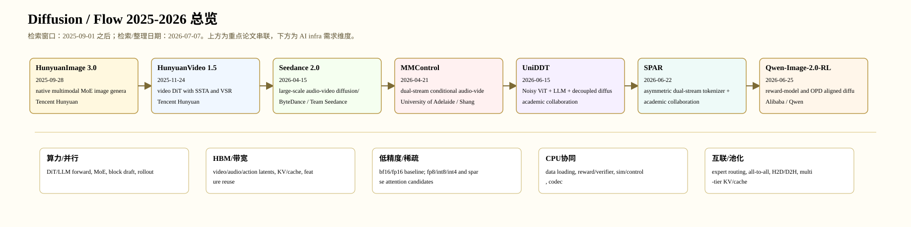

# Diffusion 技术总览：2025-09 后多模态、具身世界模型与扩散语言模型

> 检索/整理日期：2026-07-07。用户要求忽略旧 `diffusion/` 内容；本轮交付使用新的 `../../../_artifacts/output/ai_algorithm_survey_diffusion/` 中间过程和新的 `Diffusion/` 交付件。时间窗口：2025-09-01 之后。

## 1. 总体判断

2025-09 之后 diffusion/flow 的主线是“并行生成器 + verifier/runtime + 多模态/动作/token 表示”。多模态生成侧聚焦 native multimodal、audio-video、RLHF/GRPO 和 tokenizer/routing；具身侧聚焦 world model、VLA diffusion action head、跨 embodiment、低质数据利用和延迟补偿；语言侧聚焦 diffusion draft speculative decoding、token-set ordering、KV/cache 和 block/tree verification。

## 2. 交付覆盖

| 子领域 | 重点 deep-review 工作数 | 综合报告 |
|---|---:|---|
| 常规多模态生成与全模态 Diffusion/Flow 技术进展 | 7 | `../../../_artifacts/output/ai_algorithm_survey_diffusion/multimodal/synthesis.md` |
| 具身/空间/世界模型 Diffusion 技术进展 | 7 | `../../../_artifacts/output/ai_algorithm_survey_diffusion/embodied_world/synthesis.md` |
| 扩散语言模型、dLLM Serving 与 Diffusion Draft 模型进展 | 7 | `../../../_artifacts/output/ai_algorithm_survey_diffusion/language/synthesis.md` |

## 3. 总时间线

| 子领域 | 日期 | 工作 | 机构 | 技术族 |
|---|---|---|---|---|
| 常规多模态生成与全模态 Diffusion/Flow 技术进展 | 2025-09-28 | HunyuanImage 3.0 | Tencent Hunyuan | native multimodal MoE image generation |
| 常规多模态生成与全模态 Diffusion/Flow 技术进展 | 2025-11-24 | HunyuanVideo 1.5 | Tencent Hunyuan | video DiT with SSTA and VSR |
| 常规多模态生成与全模态 Diffusion/Flow 技术进展 | 2026-04-15 | Seedance 2.0 | ByteDance / Team Seedance | large-scale audio-video diffusion/flow |
| 常规多模态生成与全模态 Diffusion/Flow 技术进展 | 2026-04-21 | MMControl | University of Adelaide / Shanghai AI Lab collaborators | dual-stream conditional audio-video DiT |
| 常规多模态生成与全模态 Diffusion/Flow 技术进展 | 2026-06-15 | UniDDT | academic collaboration | Noisy ViT + LLM + decoupled diffusion decoder |
| 常规多模态生成与全模态 Diffusion/Flow 技术进展 | 2026-06-22 | SPAR | academic collaboration | asymmetric dual-stream tokenizer + diffusion self-alignment + token routing |
| 常规多模态生成与全模态 Diffusion/Flow 技术进展 | 2026-06-25 | Qwen-Image-2.0-RL | Alibaba / Qwen | reward-model and OPD aligned diffusion |
| 具身/空间/世界模型 Diffusion 技术进展 | 2026-06-01 | Cosmos 3 | NVIDIA | mixture-of-transformers world model over language/image/video/audio/action |
| 具身/空间/世界模型 Diffusion 技术进展 | 2026-06-15 | Qwen-RobotWorld | Alibaba / Qwen | Double-Stream MMDiT with MLLM action encoding |
| 具身/空间/世界模型 Diffusion 技术进展 | 2026-03-26 | MMaDA-VLA | academic collaboration | discrete diffusion VLA with masked token denoising |
| 具身/空间/世界模型 Diffusion 技术进展 | 2026-03-18 | ADV | academic collaboration | draft-and-verify VLA control |
| 具身/空间/世界模型 Diffusion 技术进展 | 2026-05-24 | X-DiffVLA | academic collaboration | Embodiment Forcing + Morphological Tree Diffusion |
| 具身/空间/世界模型 Diffusion 技术进展 | 2026-06-10 | Ambient Diffusion Policy | MIT / collaborators | noise-dependent data usage for imitation learning |
| 具身/空间/世界模型 Diffusion 技术进展 | 2026-06-24 | Action ControlNet | academic collaboration | ACNet residual condition over diffusion/flow action heads |
| 扩散语言模型、dLLM Serving 与 Diffusion Draft 模型进展 | 2026-02-05 | DFlash | Z Lab / academic collaboration | lightweight block diffusion drafter conditioned on target features |
| 扩散语言模型、dLLM Serving 与 Diffusion Draft 模型进展 | 2026-05-14 | FeF-DLLM | academic collaboration | prefix-conditioned factorization + diffusion speculative denoising |
| 扩散语言模型、dLLM Serving 与 Diffusion Draft 模型进展 | 2026-06-01 | DFlare | Tencent / Peking University collaborators | layer-wise fusion for block diffusion drafter |
| 扩散语言模型、dLLM Serving 与 Diffusion Draft 模型进展 | 2026-06-03 | D2SD | academic collaboration | confidence-guided prefix tree with two diffusion drafters |
| 扩散语言模型、dLLM Serving 与 Diffusion Draft 模型进展 | 2026-06-01 | SimSD | academic collaboration | reference tokens + attention mask for valid token-level verification |
| 扩散语言模型、dLLM Serving 与 Diffusion Draft 模型进展 | 2026-06-25 | HyperDFlash | ByteDance Seed / collaborators | HC-aligned block speculative decoding |
| 扩散语言模型、dLLM Serving 与 Diffusion Draft 模型进展 | 2026-07-02 | Set Diffusion | Cornell / Kuleshov Group | token-set likelihood + set-causal architecture |

## 4. 跨领域共性

- 候选-验证闭环：ADV、DFlash/D2SD/HyperDFlash、Qwen-Image-2.0-RL 都把 diffusion 输出交给 VLM/LLM/reward/verifier 或 target model 检查。
- Cache/runtime 系统化：Set Diffusion、DFlash 系列、Action ControlNet、video DiT 的 SSTA/稀疏 attention 都说明 serving 已经成为算法贡献的一部分。
- 表示统一：HunyuanImage、UniDDT、SPAR、Cosmos 3、Qwen-RobotWorld、MMaDA-VLA 都在处理离散 token、连续 latent、动作、音频和视频的统一/对齐。
- 数据结构化：EWK、Open X-Embodiment、paired audio-video、reward/prompt curation 和 suboptimal data usage 正在改变 diffusion 训练目标。

## 5. AI Infra 总需求

| 维度 | 总结 |
|---|---|
| 算力 | 大模型 DiT/MoE/MoT、world-model rollout、block/tree verifier 和 reward-model rollout 共同推高 FLOPs；但端到端收益取决于并行度和 accepted length。 |
| 算力配比 | 多模态生成偏 GPU/NPU DiT 与 VAE；具身还需要 CPU/仿真/控制器；语言 speculative 需要 target LLM + drafter 的配比与调度。 |
| 低精度计算 | bf16/fp16 是基本盘；fp8/int8/int4 更适合 cache/draft/VAE/部分 attention，主模型敏感层需 fallback。 |
| 稀疏计算 | 视频长序列、token routing、candidate tree 和 feature delta 都有稀疏机会，但必须有 fused gather/scatter 或 block-sparse kernel 支撑。 |
| HBM 容量 | 长视频 latent、音频/动作 token、KV/cache、多候选树、MoE expert activation 都会扩大显存需求。 |
| 访存带宽 | attention、VAE decode、feature reuse、KV update 和 verifier 都可能 memory-bound；有效带宽利用率比峰值更关键。 |
| CPU 协同 | 数据解码、prompt/reward、机器人仿真/控制、codec 和 request scheduler 是在线系统的隐藏瓶颈。 |
| H2D/D2H | 机器人观测、音视频帧、reward batches、cache migration 需要 pinned memory 和 async copy；否则控制/serving 延迟抖动。 |
| 内存池化/KV多级存取 | GPU/CPU/SSD 多级 cache、KV reuse、candidate tree KV layout 和 request-level pooling 将成为系统标配。 |
| 集群互联 | MoE all-to-all、模型并行、数据并行、reward rollout 和 synthetic data generation 依赖 NVLink/RDMA/overlap。 |
| 编解码 | image/video/audio VAE、super-resolution、codec、robot action dequantization 经常不在模型 FLOPs 内，但影响用户端 SLA。 |

## 6. 子报告入口

- [常规多模态生成与全模态](常规多模态生成_diffusion最新进展.md)
- [具身/空间/世界模型](具身智能_diffusion最新进展.md)
- [扩散语言模型与投机草稿](扩散语言模型_投机草稿_diffusion最新进展.md)

## 7. 证据局限

本报告不声称这些 2026 新论文已被长期复现。引用数、新榜单和 GitHub stars 会快速变化；本文只把 2026-07-07 可追踪到的 arXiv/GitHub/项目页作为证据。逐篇分析已落在中间目录，并已追加 PDF 证据层自动抽取；有官方 GitHub 的重点工作已记录 default-branch commit SHA 和 recursive tree 路径级审计（见 `../../../_artifacts/output/ai_algorithm_survey_diffusion/code_sources/code_sources.md` 与 `../../../_artifacts/output/ai_algorithm_survey_diffusion/code_sources/code_path_audit.md`）。OpenReview 已做两次 API 可得性测试，21 篇中 7 篇命中 forum，但匿名 API 未取得 review notes（见 `../../../_artifacts/output/ai_algorithm_survey_diffusion/openreview/openreview_status.md`）。后续若要达到完整论文复现级别，还需继续补 Figure/Table 原图裁剪、可公开/授权的 review 正文交叉核验和 clone 后的逐行源码实现一致性核验。
