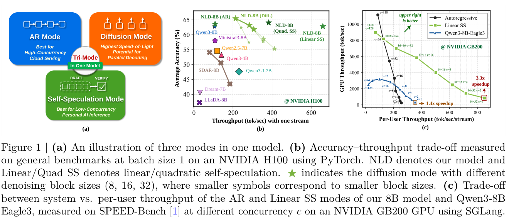
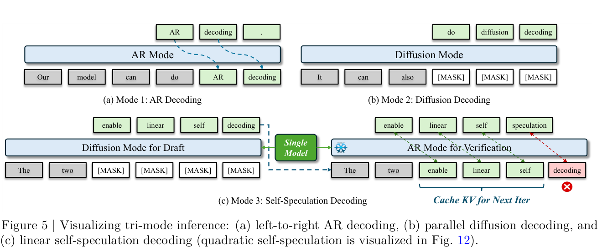
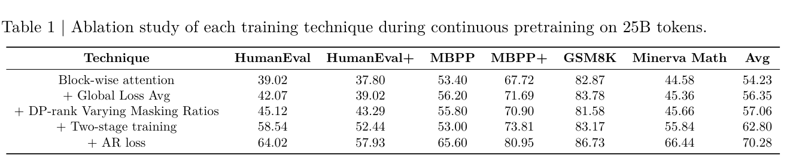
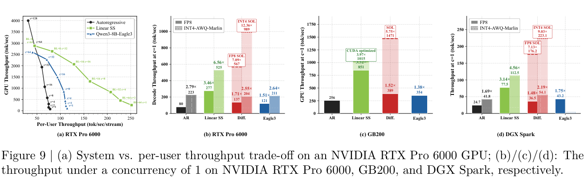

# Nemotron-Labs-Diffusion：统一 AR、扩散与自投机解码的三模语言模型

> [!info] 文档关系
> - 文档类型：Paper
> - 领域入口：[Diffusion](../README.md)
> - 上位汇总：[扩散语言模型与 Serving](../surveys/language-diffusion-serving.md)
> - 证据资产：`../assets/papers/nemotron-labs-diffusion/`
> - 相关文档：[Figure inventory](../evidence/figure-inventory.md) · [Paper index](../evidence/paper-index.md)

> 一句话结论：这项工作的真正贡献不是“再做一个 diffusion drafter”，而是让同一组 8B 参数通过切换 attention pattern 同时承担 AR、block diffusion 和 self-speculation 三种推理角色；训练消融较好地支撑了联合建模配方，但最高加速数字强依赖硬件、并发、量化和定制 kernel，不能脱离测试条件横向引用。

## 修订信息

- 当前修订 ID：`rev-nemotron-labs-diffusion-affiliation-backfill-20260730`

- 当前文档版本：`1.0.1`
- 当前修订时间：`2026-07-30T23:30:00+08:00`
- 替代版本：无（initial）

| 修订 ID | 版本 | 时间 | 修订者 | 类型 | 变更摘要 | 对结论影响 |
|---|---|---|---|---|---|---|
| `rev-initial-nemotron-labs-diffusion-20260727` | `1.0.0` | `2026-07-27T23:30:00+08:00` | Codex | initial | 基于 arXiv v1、官方源码、官方仓库固定 commit 与原图 QA 建立首版审计式解读 | material |
| `rev-nemotron-labs-diffusion-affiliation-backfill-20260730` | `1.0.1` | `2026-07-30T23:30:00+08:00` | `/root` | `metadata-update` | 补充作者—机构元数据与角色证据边界 | none：不改变方法、实验与归因结论 |

## 0. 资料、术语与符号

### 0.1 来源

- 论文：[arXiv:2607.05722v1](https://arxiv.org/abs/2607.05722)，2026-07-07 提交，21 页。
- 项目：[NVIDIA Research](https://research.nvidia.com/labs/adlr/Nemotron-Labs-Diffusion/)。
- 代码：[NVlabs/Nemotron-Labs-Diffusion](https://github.com/NVlabs/Nemotron-Labs-Diffusion)，本次核验 commit `2aabcf75ecf70264d4047ff090d842450853f2e4`。
- 公开评审：截至 2026-07-27，未定位到与该标题对应的 OpenReview 论坛；因此没有可交叉核验的公开 reviewer/rebuttal。
- 图表均由官方 PDF 200 DPI 页面裁剪，逐图记录见 [Figure inventory](../evidence/figure-inventory.md)。

### 0.2 术语表

| 术语 | 本文含义 | 不等于/边界 |
|---|---|---|
| tri-mode | 同一模型支持 AR、blockwise diffusion、self-speculation | 不是三个独立模型组成的 ensemble |
| blockwise diffusion | 在已确认前缀后，对固定 block 内的 mask token 并行去噪 | 不是连续高斯 diffusion；这里是离散 masked diffusion |
| linear self-speculation | 同一模型先以双向 attention 起草一个 block，再用因果 attention 验证最长一致前缀 | “linear”指候选是一条序列，不代表线性复杂度证明 |
| quadratic self-speculation | 为多个 draft token 构造分支候选并一次验证 | 候选更多，但真实吞吐可能低于 linear 版本 |
| TPF | 每次模型 forward 最终确认的 token 数 | 不等于 tok/s；forward 成本、kernel 与并发仍决定墙钟速度 |
| SOL | 基于 target prediction 构造的 oracle speculative upper limit | 不是可部署算法，只用于分析潜在上界 |
| draft-only LoRA | 只在双向 draft pass 激活、AR verify pass 关闭的 adapter | 不改变 AR 路径的基础语义 |

### 0.3 关键符号

| 符号 | 含义 | 范围/来源 | 易混点 |
|---|---|---|---|
| $x_i$ | 序列第 $i$ 个 clean token | author-defined | AR 条件中只看 $x_{<i}$ |
| $\tilde{x}^{\,b}_t$ | block $b$ 在噪声时刻 $t$ 的 masked/noisy 状态 | author-defined | $t$ 是离散扩散噪声率，不是生成 token 位置 |
| $B$ | 序列划分后的 block 集合/数量语境 | author-defined | 与 batch size 无关 |
| $\alpha$ | diffusion loss 权重，论文联合阶段用 0.3 | author-defined | 第一阶段 $\alpha=0$，即纯 AR |
| $k$ | self-speculation 一轮 draft 的 token 数 | author-defined | 接受长度通常小于等于 $k$，另含首个拒绝位置 target token |
| TPF | confirmed tokens / model forward | analysis-used | 只能在 forward 计算大致可比时代表加速潜力 |

## 1. 研究问题与核心判断

### 作者与机构

- 第一作者（首位列名）：Yonggan Fu → NVIDIA。
- 共同第一作者（仅含论文明确标注者）：论文未显式标注。
- 通讯作者/通讯联系人（仅含论文明确标注者）：论文未显式标注。
- 其他作者涉及的机构（去重列举，不作逐作者映射）：NVIDIA；Georgia Institute of Technology；The University of Hong Kong；University of Chicago；Massachusetts Institute of Technology。
- 对应依据：论文 PDF 标题页、作者机构编号与角色脚注（核验日期：2026-07-30）。

语言模型部署面临一个结构性取舍：AR 因严格因果分解而质量稳定、KV cache 友好，却每步通常只确认一个 token；masked diffusion 能并行更新多个位置，却可能牺牲质量、增大每步计算，并需要新的 serving 路径。传统 speculative decoding 又引入额外 drafter、额外权重和双模型调度。

论文的核心问题是：能否只训练一组参数，使它在推理时仅切换 attention mask 就覆盖三种工作点，并让 diffusion 模式反过来成为自身 AR 模式的 drafter？

> Figure 1（论文原图）：同一模型的三种模式，以及不同硬件/并发下精度—吞吐折中。该图说明“可选工作点”，不等于三种模式在所有负载下都按同一比例加速。

本评审的总体判断为 `partially-supported`：

1. **统一参数、切换 attention pattern 的机制成立。** 论文公式、推理流程图、公开模型调用路径与 LoRA 开关逻辑互相一致。
2. **联合训练配方有连续消融支撑。** Table 1 的五行是累积消融，最终相对最初 blockwise baseline 平均提高 16.05 个点，但不能把每行增量解释为彼此独立的因果效应。
3. **self-speculation 的接受长度优势证据较强。** Native/LoRA 平均接受长度 5.46/6.82，高于论文所列 Eagle3/MTP 的 2.75/4.24；但跨实现的 forward 成本不完全相同。
4. **最高吞吐数字是系统条件下的结果。** 最高 3.3×、1015 tok/s、不同设备上的 FP8/INT4 数字均绑定具体 GPU、batch、kernel、量化和 serving stack。
5. **公开仓库主要是评测与 serving 接入。** 训练实现和全部核心模型逻辑并未以仓库内普通 Python 源码完整发布，部分能力依赖 Hugging Face 模型远程代码，因而“可运行推理”不等于“训练完全可复现”。

## 2. 从问题到方案的因果闭环

| 原始痛点 | 根因 | 设计 | 改变的系统变量 | 预期收益 | 直接证据 | 判断 |
|---|---|---|---|---|---|---|
| AR 每次仅确认约 1 token | 严格左到右因果分解 | block diffusion | block 内使用双向 attention，并行填 mask | 提高 TPF | Table 5 diffusion TPF 2.57 | supported |
| 独立 drafter 增加模型和内存 | target 与 draft 参数分离 | self-speculation | 同一权重在 draft/verify 间切 mask，共享 KV | 减少额外模型并提高接受长度 | Fig. 5；接受长度表 | partially supported |
| AR 与 diffusion 联训互相干扰 | 两种 attention/目标的优化信号不同 | 两阶段训练 + 混合 loss | 先建立 AR 能力，再注入 diffusion 目标 | 保留 AR 质量并提高 diffusion | Table 1 累积消融 | supported for bundle |
| mask 分布覆盖不足 | 单 rank 看到的噪声形态有限 | DP rank varying mask ratios | 不同 data-parallel rank 使用不同 mask ratio | 提高噪声状态覆盖 | Table 1 +0.71 点 | weakly supported |
| diffusion drafter 与 AR verifier 分布有差距 | 同参数不代表两模式预测完全一致 | draft-only LoRA | 仅 draft pass 适配，verify 仍用 base AR | 提高接受长度而不改 verify | Native 5.46 vs LoRA 6.82 | partially supported |
| 候选并行度增大却未必更快 | 候选树/验证张量增加真实计算 | linear 与 quadratic 两种路径 | 在候选覆盖与 kernel 效率间选工作点 | 依负载选择更高实际吞吐 | Table 5 linear 5.99 TPF、quadratic 6.38；系统实现 linear 更快 | supported |

完整链条是：AR 的串行瓶颈触发多 token 预测需求；作者不是另加一个 drafter，而是训练模型适应因果 clean stream 与双向 noisy stream；推理时 diffusion pass 生成候选、AR pass 验证，最长一致前缀进入 KV cache；若 draft/verify 分布仍不够一致，再以 draft-only LoRA 收窄差距。证据能确认“配方整体有效”和“接受长度增加”，但没有把所有训练技巧做全因子实验，也没有在统一 kernel/统一功耗下覆盖所有 baseline，因此结论应限定为“实现了有竞争力的三模工作点”，而不是普遍优于任意 AR/speculative 系统。

## 3. 方法

### 3.1 联合目标

AR 目标为：

$$
\mathcal{L}_{\mathrm{AR}}
=
\mathbb{E}_{x}
\left[-\sum_i \log p_\theta(x_i\mid x_{<i})\right].
$$

blockwise diffusion 目标为：

$$
\mathcal{L}_{\mathrm{diff}}
=
\mathbb{E}_{x,t}
\left[
-\frac{1}{t}
\sum_b
\log p_\theta
\left(x^b\mid \tilde{x}^{\,b}_t,x^{<b}\right)
\right].
$$

联合训练：

$$
\mathcal{L}=\mathcal{L}_{\mathrm{AR}}+\alpha\mathcal{L}_{\mathrm{diff}},
\qquad \alpha=0.3
$$

但这个式子只描述第二阶段；第一阶段设置 $\alpha=0$ 做纯 AR 训练。实现层面的关键不是简单相加，而是让 clean stream 使用 causal attention、noisy stream 在当前 block 内使用 bidirectional attention，并采用 global loss averaging，避免不同 mask ratio 导致每卡有效 token 数不同而改变梯度尺度。

### 3.2 三种推理路径

> Figure 5（论文原图）：AR、diffusion 与 linear self-speculation。self-speculation 的要点是“同一模型、两种 attention pattern、共享 cache”。

- **AR mode**：标准 causal decoding，每轮确认一个 token。
- **Diffusion mode**：在固定 block 中放入多个 mask token，反复按置信度解 mask；并行度更高，但需要多轮去噪。
- **Linear self-speculation**：diffusion 模式起草 $k$ 个 token；AR 模式一次验证整段；接受最长相同前缀，并由 target 确认第一个拒绝位置。
- **Quadratic self-speculation**：扩展更多分支提高候选覆盖，TPF 略高，但验证张量和 kernel 开销更大。

如果把一轮 draft 的序列记为 $\hat{x}_{1:k}$，AR verifier 的输出为 $x^{\mathrm{AR}}_{1:k+1}$，则被确认的前缀长度可写为：

$$
\ell=\max\{j:\hat{x}_{1:j}=x^{\mathrm{AR}}_{1:j}\},
$$

系统写入 $\ell$ 个 draft token，并额外写入 target 在 $\ell+1$ 位置给出的 token。这解释了为什么平均 TPF 可超过单纯的平均接受前缀。

### 3.3 draft-only LoRA

LoRA 只插入 attention `o_proj`，rank 128、$\alpha_{\mathrm{LoRA}}=512$，约 36M 参数（约 0.4%）。训练目标组合 CE、KL 与 total-variation alignment，并把“接受 token + 下一个位置”作为活动位置。公开 chat 代码明确在 bidirectional draft 阶段启用 adapter、causal verify 阶段关闭；这个开关是“保持 AR 语义”的关键，而不是 LoRA 参数量本身。

### 3.4 SOL 上界分析

SOL 递归地使用 target 预测构造动态候选并压缩已确认位置，用于估计某一 block size 的可达 TPF。block size 32 时论文报告 SOL 平均 7.60 TPF，而 confidence sampler 约为 3。它说明当前采样器距 oracle 仍有空间，但 SOL 需要目标信息，不能作为实际吞吐结果或可部署 baseline。

## 4. 关键证据

### 4.1 训练消融

> Table 1（论文原表）：在 25B continuous-pretraining tokens 上逐项累积训练技术。

| 配方 | Avg | 相对上一行 | 相对首行 |
|---|---:|---:|---:|
| Block-wise attention | 54.23 | — | — |
| + Global Loss Avg | 56.35 | +2.12 | +2.12 |
| + DP-rank varying masking ratios | 57.06 | +0.71 | +2.83 |
| + Two-stage training | 62.80 | +5.74 | +8.57 |
| + AR loss | 70.28 | +7.48 | +16.05 |

最可靠的读法是：完整配方相对最简 blockwise baseline 改善显著，两阶段与 AR loss 是该序列中最大增量。不能据此断言“AR loss 独立贡献恰好 7.48 点”，因为每一行都建立在前一行之上，且没有所有组合的全因子对照。

### 4.2 能力—效率折中

Instruct 8B 汇总中，Qwen3-8B 为 62.75/1 TPF；NLD AR 为 63.61/1；diffusion 为 63.18/2.57；linear self-speculation 为 62.81/5.99；quadratic 为 64.04/6.38。它支持三点：

- AR 能力未因联合训练明显崩溃；
- diffusion 以很小的平均精度变化换取多 token forward；
- quadratic 的指标/TPF 最好，但论文系统实现中 linear 的真实吞吐更高，说明 TPF 不是 latency 的充分统计量。

### 4.3 系统吞吐

> Figure 9（论文原图）：RTX Pro 6000、GB200 与 DGX Spark 上的 per-user throughput。比较必须保留 GPU、并发、精度与 kernel 条件。

- GB200 上相对 AR 最高约 3.3×；优化 kernel 路径报告 3.97×、1015 tok/s。
- batch 1 时，RTX Pro 6000 的 FP8/INT4 约 277/525 tok/s；DGX Spark 约 77.5/112.5 tok/s。
- 与 Eagle3 的 batch-1 比较约 2.4×/2.3×/1.8×，但不同 drafter、kernel 与量化路径会影响可比性。

这些数字证明该方法可以落到真实 serving 栈，不证明“算法本身无条件 3.3×”。更适合跨系统引用的是：同一模型能按并发/硬件在 AR、diffusion、self-speculation 间切换，并在论文指定栈上给出可观的 per-user throughput 改善。

## 5. 技术 claim 证据矩阵

| Claim | 证据类型 | 证据 | 反证/缺口 | 结论 |
|---|---|---|---|---|
| 一个模型支持三种解码 | 方法 + 公开调用接口 | Fig. 5；仓库 `evaluate.py`/chat scripts | 核心模型逻辑部分依赖远程代码 | supported |
| 联合训练保留 AR 能力 | matched result | NLD AR 63.61 vs Qwen3-8B 62.75 | 训练 token/data recipe 不完全同源控制 | partially supported |
| diffusion 可提高每 forward 产出 | matched mode comparison | TPF 2.57 | 每 forward 计算量不同 | supported for TPF |
| self-speculation 优于独立 drafter | cross-system comparison | 接受长度与 Eagle3/MTP 对比 | 训练预算、kernel、硬件不完全 matched | partially supported |
| LoRA 专门改善 draft | adapter ablation + code | 5.46→6.82；draft-pass toggle | 缺少更细任务分布与显著性 | partially supported |
| 最高 3.3×/3.97× 可泛化 | system benchmark | Fig. 9 与优化 kernel | 强硬件/并发/量化依赖 | unverified beyond reported setup |
| 训练可完全复现 | source/code audit | 论文 source + eval/serving repo | 完整训练代码和数据配方未公开 | not supported |

## 6. 代码与 Infra 审计

### 6.1 公开代码边界

固定 commit 中可核验：

- `evaluate.py` 暴露 `ar`、`dlm`、`linear_spec` 模式与 LoRA 参数；
- `chat/chat_linear_spec_lora.py` 说明 adapter 仅在 draft pass 开启；
- `xp/dlm_api/dlm_generate/nemotron.py` 把请求路由到 native `linear_spec_generate` / LoRA 路径；
- SGLang/DGX Spark 文档给出服务部署和量化路径。

不能从该仓库完整核验：

- continuous pretraining 的训练 loop、数据混合和分布式实现；
- 全部 attention-mask kernel 与模型 forward 定义；
- 论文所有硬件数字的一键复现实验环境。

因此代码一致性判断是 `partially-supported`，不是“paper-code mismatch”，而是 release scope 小于完整训练系统。

### 6.2 训练 Infra

论文报告 instruct 训练使用 256 张 H100。联合 clean/noisy stream 会增加 token/activation 负担；DP-rank varying masks 要求跨 rank 正确归一化，global loss averaging 是数值语义的一部分。两阶段训练也意味着 checkpoint/optimizer state 生命周期更长。

### 6.3 推理 Infra

关键资源不是只看 FLOPs：

- AR verify 依赖 KV cache 连续写入；
- diffusion draft 需要 block 内双向 attention 和 mask 状态更新；
- self-spec 需要 draft/verify mode switch、共享 cache、候选压缩；
- LoRA draft-only 需要低开销 adapter toggle；
- batch/并发变化会改变 per-user throughput 与最优模式；
- FP8/INT4 提升受量化 kernel、带宽和设备支持影响。

最合理的部署策略是把 mode 当成 scheduler policy：低并发优先 self-speculation，高并发或吞吐饱和时评估 AR/diffusion 工作点，而不是固定只使用某一种模式。

## 7. 相关工作与公开评审

- 相比传统 speculative decoding，NLD 不使用独立小 drafter，换来单模型和共享 cache，但 draft 仍使用完整模型 forward。
- 相比纯 masked-diffusion LLM，它保留 AR 路径作为质量锚和 verifier。
- 相比 MTP，同一参数以 attention pattern 改变预测结构，而不是添加固定数量的额外预测头。
- 截至核验日未找到对应 OpenReview forum，因此不能使用 reviewer 分数、评语或 rebuttal 支撑结论。搜索中出现的后续 PRESTO 工作把 NLD 当作实验对象，属于后续相关工作，不是本论文的公开评审。

## 8. 局限、启发与待验证问题

### 8.1 局限

1. 训练消融是累积序列，不是全因子设计；技术间交互无法分离。
2. TPF、接受长度、tok/s 是不同层级指标，不能互换。
3. 系统峰值数字绑定设备、并发、量化和 kernel。
4. LoRA 只在有限基准上显示平均收益，缺少长上下文、采样温度和多轮对话稳定性分析。
5. 公开仓库不足以从头复现训练。
6. SOL 是 oracle 分析，不应作为实际算法性能。

### 8.2 可迁移启发

- “一个模型、多种 attention semantics”可把部署工作点选择从模型选择变成调度选择。
- 训练多种推理语义时，loss normalization 和噪声覆盖可能比新增复杂模块更关键。
- drafter 参数共享减少权重驻留，但不自动减少计算；优化重点转向 cache、mode switch 和 kernel fusion。
- 应同时报告 quality、TPF、acceptance、tok/s、并发和硬件，避免单指标造成系统误判。

### 8.3 最值得补做的实验

1. 全因子或至少 leave-one-out 训练消融。
2. 同一 GPU、同一精度、同一 serving engine 下对 Eagle3/MTP 的 matched comparison。
3. 不同长度、温度、并发下的质量—吞吐 Pareto 曲线。
4. LoRA rank/placement 与接受长度、draft latency 的联合消融。
5. 能耗、显存、KV traffic 和 mode-switch 开销分解。

## 9. 最终评价

Nemotron-Labs-Diffusion 值得归入 **diffusion** 主线，因为它的模型训练基础和第一性机制是 blockwise masked diffusion；self-speculation 是由三模统一能力派生出的一个推理模式，而不是它唯一或最上位的分类。论文对“统一建模 + 多工作点 serving”给出了较完整的机制和系统证据，训练配方消融也有说服力。需要克制的是峰值加速的外推，以及把公开推理仓库误称为完整训练复现。

