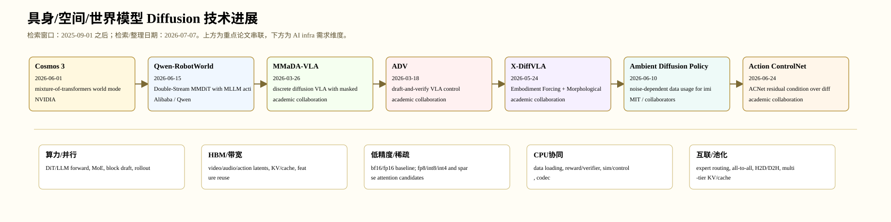

# 具身/空间/世界模型 Diffusion 技术进展

> 检索/整理日期：2026-07-07。范围：物理 AI 世界模型、语言条件视频世界模型、VLA 扩散动作头、跨 embodiment diffusion policy、低质机器人数据利用和控制 runtime。 时间窗口按用户要求固定为 2025-09-01 之后。中间过程与逐篇 deep-review 风格分析位于 `../../../_artifacts/output/ai_algorithm_survey_diffusion/embodied_world/`。

## 1. 总体判断

这个方向 2025-09 之后的 diffusion/flow 进展已经从单点模型指标转向系统化：模型结构、数据管线、后训练、候选验证、cache/runtime 和硬件约束共同决定可用性。本文固定选取 7 篇重点工作，满足“每领域 6-7 篇”的要求。

## 2. 重点工作

| 日期 | 工作 | 机构 | 技术族 | 热度/价值信号 |
|---|---|---|---|---|
| 2026-06-01 | Cosmos 3 | NVIDIA | mixture-of-transformers world model over language/image/video/audio/action | NVIDIA 大厂物理 AI 平台级报告，GitHub 热度最高，直接连接全模态生成和具身世界模型。 |
| 2026-06-15 | Qwen-RobotWorld | Alibaba / Qwen | Double-Stream MMDiT with MLLM action encoding | 阿里/Qwen 具身世界模型主线，明确把自然语言作为统一动作接口。 |
| 2026-03-26 | MMaDA-VLA | academic collaboration | discrete diffusion VLA with masked token denoising | 从 plug-in diffusion action head 推进到原生 diffusion VLA，是具身 diffusion 的关键形态变化。 |
| 2026-03-18 | ADV | academic collaboration | draft-and-verify VLA control | 把语言模型 speculative/draft-verify 范式迁移到具身动作，是连接 diffusion policy 与 verifier/runtime 的热点。 |
| 2026-05-24 | X-DiffVLA | academic collaboration | Embodiment Forcing + Morphological Tree Diffusion | 面向 Open X-Embodiment 式 scaling，解决机器人形态差异是具身 diffusion 的核心瓶颈。 |
| 2026-06-10 | Ambient Diffusion Policy | MIT / collaborators | noise-dependent data usage for imitation learning | MIT 等知名团队，直接解决机器人数据规模化的低质量/混合数据瓶颈。 |
| 2026-06-24 | Action ControlNet | academic collaboration | ACNet residual condition over diffusion/flow action heads | 把 VLA/diffusion policy 的瓶颈从离线成功率推进到真实部署延迟和异步控制。 |

## 3. 技术谱系

这些工作共同显示：diffusion 不再只是图像去噪器，而是在多模态 latent、世界模型 token/action、语言 draft blocks 和控制动作候选中承担并行候选生成器角色。高热度工作通常还同时处理数据、后训练、验证器和 serving。

## 4. AI Infra 定性需求

| 工作 | Infra 需求 |
|---|---|
| Cosmos 3 | World model requires high-bandwidth multi-modal token streams, action/video/audio encoders, model parallel MoT execution, synthetic-data generation clusters, and GPU/NPU serving for policy/video outputs. |
| Qwen-RobotWorld | Video world models are memory-bandwidth heavy: VAE latent tensors, frozen MLLM encoder, MMDiT joint attention, large video-text corpus streaming, and evaluation simulation loops dominate. |
| MMaDA-VLA | Action chunk denoising trades AR latency for repeated full-context passes; needs low-latency tokenization, action dequantization, and GPU-control loop synchronization. |
| ADV | Candidate action chunks increase GPU batch size; VLM reranking adds latency but can be overlapped with execution; verifier calibration is safety-critical. |
| X-DiffVLA | Cross-embodiment action spaces require morphology metadata, conditional action heads, heterogeneous data batching, and possibly per-robot low-level controller adapters. |
| Ambient Diffusion Policy | Data loader must label quality/domain; diffusion-time-conditioned sampling changes batch composition; large heterogeneous robot datasets require storage bandwidth and filtering pipelines. |
| Action ControlNet | Explicitly couples method with serving: stale observations, async action execution, H2D/D2H sensor transfer, control-loop jitter, and runtime adapter placement matter. |

## 5. 逐篇精读与中间产物

- `Cosmos 3` 深读：`../../../_artifacts/output/ai_algorithm_survey_diffusion/embodied_world/papers/2606_cosmos3/analysis.md`
- `Qwen-RobotWorld` 深读：`../../../_artifacts/output/ai_algorithm_survey_diffusion/embodied_world/papers/2606_qwen_robotworld/analysis.md`
- `MMaDA-VLA` 深读：`../../../_artifacts/output/ai_algorithm_survey_diffusion/embodied_world/papers/2603_mmada_vla/analysis.md`
- `ADV` 深读：`../../../_artifacts/output/ai_algorithm_survey_diffusion/embodied_world/papers/2603_adv/analysis.md`
- `X-DiffVLA` 深读：`../../../_artifacts/output/ai_algorithm_survey_diffusion/embodied_world/papers/2605_x_diffvla/analysis.md`
- `Ambient Diffusion Policy` 深读：`../../../_artifacts/output/ai_algorithm_survey_diffusion/embodied_world/papers/2606_ambient_dp/analysis.md`
- `Action ControlNet` 深读：`../../../_artifacts/output/ai_algorithm_survey_diffusion/embodied_world/papers/2606_action_controlnet/analysis.md`

## 6. 证据局限

- GitHub stars/forks 等热度指标只在 2026-07-07 的 GitHub API 访问时有效。
- 新论文引用数不稳定，因此不使用精确 citation 排名。
- 闭源工业报告用于趋势判断；可复现实验结论以公开代码/权重和后续复现为准。
- 每篇重点工作的 `analysis.md` 已追加 PDF 证据层；有官方 GitHub 的重点工作已记录 default-branch commit SHA，并完成 recursive tree 路径级审计；OpenReview 已做两次 API 可得性测试。仍未完成 Figure/Table 原图裁剪、review 正文交叉核验和 clone 后逐行源码实现一致性核验。
